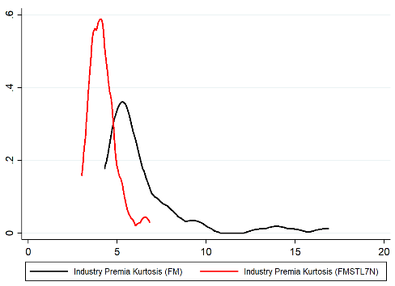

```{r setup, include=FALSE}
knitr::opts_chunk$set(echo = FALSE)
knitr::opts_chunk$set(message = FALSE)
knitr::opts_chunk$set(warning = FALSE)
```

```{r package}
# Packages
library(here)
library(tidyverse)
library(broom)
library(rollRegres)
library(kableExtra)
library(moments)
library(RcppRoll)
library(png)
library(lme4) # For multilevel
library(lmtest) # For robust se
library(sandwich) # For robust se
library(timetk) # For expanding multiple lags


# Set the function to transform yyyymm to Date
transDate <- function(date) {
  as.Date(
    paste(
      substr(as.character(date),1,4),
      "-",
      substr(as.character(date),5,6),
      "-01",
      sep =""
    )
  )
}

# Create function for STL for tibble based on the ggsdc source code
stl_tibble <- function(data, xvar, yvar, frequency=12, s_window=7, robust = FALSE){
  # xvar and yvar must be characters
  data <- as.data.frame(data, stringsAsFactors = FALSE) # I hate tibbles
  data <- data[order(data[ , xvar]), ]
  y <- ts(data[ , yvar], frequency = frequency)
  model <- stl(y, s.window = s_window, robust = robust)
  y2 <- as.numeric(model$time.series[ , 2])
  y3 <- as.numeric(model$time.series[ , 1])
  y4 <- as.numeric(model$time.series[ , 3])
  
  sdc <- rbind(
    data.frame(data,
               x = data[ , xvar],
               y = as.numeric(y),
               component = "Original")  ,
    data.frame(data,
               x = data[ , xvar],
               y = y2,
               component = "Trend"),
    data.frame(data,
               x = data[ , xvar],
               y = y3,
               component = "Seasonal"),
    data.frame(data,
               x = data[ , xvar],
               y = y4,
               component = "Noise")
  )

  return(sdc)
}

theme_set(theme_classic())
```


# S1 Introduction

In 1997, Fama and French attempted to calculate the equity cost of capital (ECC) for the industry portfolios. They employed the CAPM and Fama French three-factor model and applied various techniques to estimate the factor loadings. The conclusion was the ECC estimation is not reliable due to the imprecise factor risk premium and the uncertain risk loadings. It has been 23 years and we will try to find a possible improvement of the ECC estimation in this paper.

For the model selection, we will apply the Fama French five-factor model (2013) and the PRS five-factor model (2018). Since the five-factor model is an update of the three-factor model, it should work better than the three-factor model. Pukthuanthong et al. (2018) showed that there are 5 factors are reasonable: the market factor, profitability factor, and traded version of credit spread, term spread, and unexpected inflation. We will also use their result to form the Industry Equity Cost of Capital.

We will use the 5-year rolling window to estimate the factor loadings of the ECC. Many other methods such as Bayes shrinkage, and Levi-Welch (2017) method. Levi and Welch tried to estimate the ECC while focusing on the factor exposure estimation and let the reader choose their own methods of expected factor premium. However, we found that the factor risk premiums is the more important piece in ECC estimation. In this paper, we will focus on finding a way to estimate the expected factor premium better.

Many papers mentioned that the expected factor premiums are evolving. We will therefore apply the Fama Macbeth (1973) method to estimate the expected factor premium. Since the 2nd step regression result is extremely volatile, we will apply the STL filtering to smooth the result.

# S2 Data

We get the monthly industry return, Fama French five-factor, and the risk-free rate for the Fama French five factors data from the [Ken French Data Library](https://mba.tuck.dartmouth.edu/pages/faculty/ken.french/data_library.html). The market factor and profitability factor of the PRS five factors are from the Fama French five factors. The other 3 traded macro factors and risk-free rates are extracted from the [Federal Reserve Bank of St. Louis Economic Data (FRED)](https://fred.stlouisfed.org/) and constructed based on Pukthuanthong et al. (2018).

## S2-1 Industry Return and Fama French Five Factors

The [Fama French Five Factors](https://mba.tuck.dartmouth.edu/pages/faculty/ken.french/data_library.html) are simple returns from July 1963 to June 2020. They are as follows: Rm-Rf, SMB, HML, RMW, CMA. The 49 Industry Portfolios are value-weighted simple returns July 1926 to June 2020. The 49 Industry Portfolios without any missing values started in July 1969, so we will start the analysis in July 1969. The risk-free rate is one-month Treasury bill rate.

```{r Generate_FF5_Data, eval = FALSE}
# This will only ran once to grab the raw data and process the data
    # Download the return and Fama French 5 Factors data from Ken French Data Library
    # Create temp_file to store the file
    temp_file1 <- tempfile()
    
    # Download the file
    download.file('https://mba.tuck.dartmouth.edu/pages/faculty/ken.french/ftp/F-F_Research_Data_5_Factors_2x3_CSV.zip', temp_file1)
    
    # Unzip the file, to extract the data
    ff_factors_raw_data <- unzip(temp_file1, exdir = here("data"))
    
    
    # Create temp_file to store the file
    temp_file2 <- tempfile()
    
    # Download the file
    download.file('https://mba.tuck.dartmouth.edu/pages/faculty/ken.french/ftp/49_Industry_Portfolios_CSV.zip', temp_file2)
    
    # Unzip the file, to extract the data
    IP49_raw_data <- unzip(temp_file2, exdir = here("data"))
```

```{r FF5_Data, cache = TRUE}
    # Read the contents read_csv
    FF5 <- read_csv(here("data/F-F_Research_Data_5_Factors_2x3.CSV"), skip = 3) %>%
      mutate_all(as.numeric) %>%
      rename(date = `...1`) %>%
      filter(date >196300) %>%
      # Change all the returns into decimals
      mutate_at(vars(-date), function(x, na.rm = FALSE) (x/100)) %>%
      mutate(date = as.character(date))

    # Read the contents read_csv and extract the desired dates
    Portfolios <- read_csv(here("data/49_Industry_Portfolios.CSV"), skip = 11) %>%
      mutate_all(as.numeric) %>%
      rename(date = `...1`) %>%
      filter(date > 192600) %>%
      # Change all the returns into decimals
      mutate_at(vars(-date), function(x, na.rm = FALSE) (x/100)) %>%
      mutate(date = as.character(date))
    
    # Keep Value Weighted
    Portfolios <- Portfolios[1:(nrow(Portfolios)/4),]
    Portfolios <- Portfolios %>%
      # remove missing value
      replace(. < -.999, NA) %>%
      remove_missing() %>%
      # Gather all the returns
      gather(Industry, RET, - date)
```

```{r FF5_Descriptive_Stats, cache = TRUE}
FF5 %>%
  filter(date > 196906) %>%
  pivot_longer(-date, names_to = "Factors", values_to = "ret") %>%
  select(-date) %>%
  # Fix the order of Factors
  mutate(Factors = factor(Factors, level= unique(.$Factors))) %>%
  group_by(Factors) %>%
  summarize(mean = round(mean(ret), digits = 4),
            Median = round(median(ret), digits = 4),
            `5th Pct` = round(quantile(ret,.05), digits = 4),
            `95th Pct` = round(quantile(ret,.05), digits = 4),
            StdDev = round(sd(ret), digits = 4),
            Skew = round(skewness(ret), digits = 4),
            Kurt = round(kurtosis(ret), digits = 4)) %>%
  kable(align = "c", caption = "Descriptive Statistics for the FF5 Factors") %>%
  kable_styling(font_size = 10, "striped", full_width = F) %>%
  # Add header above
  add_header_above(c(" " = 1, "Statistics" = 7))

Portfolios %>%
  filter(date > 196906) %>%
  select(-date) %>%
  # Fix the order of Industry
  mutate(Industry = factor(Industry, level= unique(.$Industry))) %>%
  group_by(Industry) %>%
  summarize(mean = round(mean(RET), digits = 4),
            Median = round(median(RET), digits = 4),
            `5th Pct` = round(quantile(RET,.05), digits = 4),
            `95th Pct` = round(quantile(RET,.05), digits = 4),
            StdDev = round(sd(RET), digits = 4),
            Skew = round(skewness(RET), digits = 4),
            Kurt = round(kurtosis(RET), digits = 4)) %>%
  kable(align = "c", caption = "Descriptive Statistics for the 49 Industry Portfolio Returns") %>%
  kable_styling(font_size = 10, "striped", full_width = F) %>%
  # Add header above
  add_header_above(c(" " = 1, "statistics" = 7))

```


## S2-2 Traded PRS Five Factors

In order to construct the traded version of PRS Factor, we first obtain the risk-free rate and the raw CRR Five Factors: the Default Premium (dDP), the Industrial Production Growth Rate (dIP), the Term Premium (dTS), the Unexpected Inflation (UNEXPI), and the Change in Expected Inflation (dEI). We obtained following macro variables from the Federal Reserve Bank of St. Louis Economic Data: [Moody's Seasoned Aaa Corporate Bond Yield (Aaa)](https://fred.stlouisfed.org/series/AAA), [Moody's Seasoned Baa Corporate Bond Yield (Baa)](https://fred.stlouisfed.org/series/BAA), [Industrial Production Index (IP)](https://fred.stlouisfed.org/series/INDPRO), [10-Year Treasury Constant Maturity Rate (GS10)](https://fred.stlouisfed.org/series/GS10), [1-Year Treasury Constant Maturity Rate (GS1)](https://fred.stlouisfed.org/series/GS1), [Seasonally Adjusted CPI derived Inflation Rate (INF)](https://fred.stlouisfed.org/series/CPIAUCSL), [University of Michigan Inflation Expectation (MICH)](https://fred.stlouisfed.org/series/MICH), [3-Month Treasury Bill: Secondary Market Rate (TB3MS)](https://fred.stlouisfed.org/series/TB3MS).

Here are the ways that the raw factors are calculated:

$$dDP_{raw,t} = Baa_t - Aaa_t$$

$$dIP_{raw, t} = ln(IP_t) - ln(IP_{t-1})$$

$$dTS_{raw, t} = GS10_t - GS1_t$$

$$EXPINF_{raw, t} = E_{t-12}[MICH_t]$$

$$UNEXPI_{raw, t} = INF_t - EXPINF_{raw, t}$$

$$dEI_t = EXPINF_{raw, t} - EXPINF_{raw, t-1}$$

The Default Premium started in Janurary 1919; the Industrial Production Growth Rate stared in Feburary 1919; the Term Premium started in April 1953; the Unexpected Inflation started in Janurary 1979; and the Change in Expected Inflation started in Feburary 1979; 3-Month Treasury Bill: Secondary Market Rate (TB3MS) started in Janurary 1934. Therefore, the raw PRS factors would start in Feburary 1979. The Default Premium (dDP), the Term Premium (dTS), the Unexpected Inflation (UNEXPI), the Change in Expected Inflation (dEI), and 3-month Treasury Rate are annual rates so they need to be converted to monthly frequency.

After obtaining the raw factors, we need to create the traded version of these 5 factors. Similar to the Pukthuanthong et al. (2018) procedure, we applied the 50 portfolios, $R$, (the ten equal-weighted size portfolios, ten equal-weighted book-to-market portfolios, ten equal-weighted investment portfolios and ten equal-weighted operating profitability portfolios, and ten value-weighted momentum portfolios) from the [Ken French Data Library](https://mba.tuck.dartmouth.edu/pages/faculty/ken.french/data_library.html) to construct the mimicking portfolios. These 50 portfolios all exist after July 1963. We first regress each of the 50 assets against the raw factors to get the coefficient matrix B (50x5) and the diagonal matrix of the covariance matrix of the error term V (50x50). The weight of the factor mimicking portfolio is $w=(B'V^{-1}B)^{-1}B'V^{-1}$. The traded factors are PRS = wR, and they would start in July 1963.

```{r Generate_PRS_Data, eval = FALSE}
library(data.table)

# Create function to change "yyyy-mm-dd" to yyyymm
antitransDate <- function(date) {
  floor(
    as.numeric(gsub("[^[:digit:]]", "", date))/100
  )
}

# Create function to change "yyyy-mm-dd" to yyyymmdd
antitransDate_daily <- function(date) {
  round(
    as.numeric(gsub("[^[:digit:]]", "", date, perl = TRUE))
  )
}


# Set the Start Date
start_date <- "1900-01-01"
start_date_lead <- as.Date(as.character(antitransDate_daily(start_date)-20000), "%Y%m%d")
end_date <- Sys.Date()

## Load the data from FRED
# Download the dDP (default spread) from FRED, Baa - Aaa, adjust to monthly frequency
dDP_raw <- fread(paste("https://fred.stlouisfed.org/graph/fredgraph.csv?bgcolor=%23e1e9f0&chart_type=line&drp=0&fo=open%20sans&graph_bgcolor=%23ffffff&height=450&mode=fred&recession_bars=on&txtcolor=%23444444&ts=12&tts=12&width=1168&nt=0&thu=0&trc=0&show_legend=yes&show_axis_titles=yes&show_tooltip=yes&id=BAA_AAA&scale=left&cosd=", start_date, "&coed=", Sys.Date(), "&line_color=%234572a7&link_values=false&line_style=solid&mark_type=none&mw=3&lw=2&ost=-99999&oet=99999&mma=0&fml=a-b&fq=Monthly&fam=avg&fgst=lin&fgsnd=", Sys.Date(), "&line_index=1&transformation=lin_lin&vintage_date=", Sys.Date(), "_", Sys.Date(), "&revision_date=", Sys.Date(), "_", Sys.Date(), "&nd=1919-01-01_1919-01-01", sep = "")) %>%
  rename(dDP = BAA_AAA) %>%
  mutate(dDP = (exp(log(1+dDP/100)/12)-1)*100)

# Download the IP (Industrial Production Index) from FRED, times 100 to have the percent change
dIP_raw <- fread(paste("https://fred.stlouisfed.org/graph/fredgraph.csv?bgcolor=%23e1e9f0&chart_type=line&drp=0&fo=open%20sans&graph_bgcolor=%23ffffff&height=450&mode=fred&recession_bars=on&txtcolor=%23444444&ts=12&tts=12&width=1168&nt=0&thu=0&trc=0&show_legend=yes&show_axis_titles=yes&show_tooltip=yes&id=INDPRO&scale=left&cosd=", start_date_lead, "&coed=", Sys.Date(), "&line_color=%234572a7&link_values=false&line_style=solid&mark_type=none&mw=3&lw=2&ost=-99999&oet=99999&mma=0&fml=a&fq=Monthly&fam=avg&fgst=lin&fgsnd=", Sys.Date(), "&line_index=1&transformation=lin&vintage_date=", Sys.Date(), "&revision_date=", Sys.Date(), "&nd=1919-01-01", sep = "")) %>%
  mutate(dIP = log(INDPRO) - log(lag(INDPRO))) %>%
  subset(select = c(DATE, dIP)) %>%
  mutate(dIP = 100*dIP)

# Download the dTS (term spread) from FRED
dTS_raw <- fread(paste("https://fred.stlouisfed.org/graph/fredgraph.csv?bgcolor=%23e1e9f0&chart_type=line&drp=0&fo=open%20sans&graph_bgcolor=%23ffffff&height=450&mode=fred&recession_bars=on&txtcolor=%23444444&ts=12&tts=12&width=1168&nt=0&thu=0&trc=0&show_legend=yes&show_axis_titles=yes&show_tooltip=yes&id=GS10_GS1&scale=left&cosd=", start_date, "&coed=", Sys.Date(), "&line_color=%234572a7&link_values=false&line_style=solid&mark_type=none&mw=3&lw=2&ost=-99999&oet=99999&mma=0&fml=a-b&fq=Monthly&fam=avg&fgst=lin&fgsnd=", Sys.Date(), "&line_index=1&transformation=lin_lin&vintage_date=", Sys.Date(), "_", Sys.Date(), "&revision_date=", Sys.Date(), "_", Sys.Date(), "&nd=1953-04-01_1953-04-01", sep = "")) %>%
  rename(dTS = GS10_GS1) %>%
  mutate(dTS = (exp(log(1+dTS/100)/12)-1)*100)

# Download the Inflation Rate and Expected Inflation Rate
INF_raw <- fread(paste("https://fred.stlouisfed.org/graph/fredgraph.csv?bgcolor=%23e1e9f0&chart_type=line&drp=0&fo=open%20sans&graph_bgcolor=%23ffffff&height=450&mode=fred&recession_bars=on&txtcolor=%23444444&ts=12&tts=12&width=1168&nt=0&thu=0&trc=0&show_legend=yes&show_axis_titles=yes&show_tooltip=yes&id=CPIAUCSL&scale=left&cosd=", start_date, "&coed=", Sys.Date(), "&line_color=%234572a7&link_values=false&line_style=solid&mark_type=none&mw=3&lw=2&ost=-99999&oet=99999&mma=0&fml=a&fq=Monthly&fam=avg&fgst=lin&fgsnd=", Sys.Date(), "&line_index=1&transformation=pc1&vintage_date=", Sys.Date(), "&revision_date=", Sys.Date(), "&nd=1913-01-01", sep = ""))
EXPINF_raw <- fread(paste("https://fred.stlouisfed.org/graph/fredgraph.csv?bgcolor=%23e1e9f0&chart_type=line&drp=0&fo=open%20sans&graph_bgcolor=%23ffffff&height=450&mode=fred&recession_bars=on&txtcolor=%23444444&ts=12&tts=12&width=1168&nt=0&thu=0&trc=0&show_legend=yes&show_axis_titles=yes&show_tooltip=yes&id=MICH&scale=left&cosd=", start_date_lead, "&coed=", Sys.Date(), "&line_color=%234572a7&link_values=false&line_style=solid&mark_type=none&mw=3&lw=2&ost=-99999&oet=99999&mma=0&fml=a&fq=Monthly&fam=avg&fgst=lin&fgsnd=", Sys.Date(), "&line_index=1&transformation=lin&vintage_date=", Sys.Date(), "&revision_date=", Sys.Date(), "&nd=1978-01-01", sep = ""))
EXPINF_raw_lead <- EXPINF_raw %>%
  mutate(MICH = lag(MICH,12))

# Create unexpected inflation
UNEXPI_raw <- INF_raw %>%
  inner_join(EXPINF_raw_lead) %>%
  mutate(UNEXPI = CPIAUCSL_PC1 - MICH) %>%
  subset(select = c(DATE, UNEXPI)) %>%
  mutate(UNEXPI = (exp(log(1+UNEXPI/100)/12)-1)*100)

# Create the change in expected inflation
dEI_raw <- EXPINF_raw_lead %>%
  mutate(dEI = MICH - lag(MICH)) %>%
  subset(select = c(DATE, dEI)) %>%
  mutate(dEI = (exp(log(1+dEI/100)/12)-1)*100)

# Download the 3-month yield as the risk free rate
RF_monthly <- fread(paste("https://fred.stlouisfed.org/graph/fredgraph.csv?bgcolor=%23e1e9f0&chart_type=line&drp=0&fo=open%20sans&graph_bgcolor=%23ffffff&height=450&mode=fred&recession_bars=on&txtcolor=%23444444&ts=12&tts=12&width=1168&nt=0&thu=0&trc=0&show_legend=yes&show_axis_titles=yes&show_tooltip=yes&id=TB3MS&scale=left&cosd=", start_date, "&coed=", Sys.Date(), "&line_color=%234572a7&link_values=false&line_style=solid&mark_type=none&mw=3&lw=2&ost=-99999&oet=99999&mma=0&fml=a&fq=Monthly&fam=avg&fgst=lin&fgsnd=", Sys.Date(),"&line_index=1&transformation=lin&vintage_date=", Sys.Date(), "&revision_date=", Sys.Date(), "&nd=1934-01-01", sep = "")) %>%
  rename(RF = TB3MS) %>%
  mutate(RF = (exp(log(1+RF/100)/12)-1)*100)


# Create the 5 raw CRR factors
CRR_raw <- dDP_raw %>%
  inner_join(dIP_raw) %>%
  inner_join(dTS_raw) %>%
  inner_join(UNEXPI_raw) %>%
  inner_join(dEI_raw) %>%
  inner_join(RF_monthly) %>%
  mutate(DATE = antitransDate(DATE)) %>%
  remove_missing()


##################################################
##################################################
# Monthly mimicking portfolios data
# Create temp_file to store the file
temp_file3 <- tempfile()
temp_file4 <- tempfile()
temp_file5 <- tempfile()
temp_file6 <- tempfile()
temp_file7 <- tempfile()

# Download the file
download.file('https://mba.tuck.dartmouth.edu/pages/faculty/ken.french/ftp/Portfolios_Formed_on_ME_CSV.zip', temp_file3)
download.file('https://mba.tuck.dartmouth.edu/pages/faculty/ken.french/ftp/Portfolios_Formed_on_BE-ME_CSV.zip', temp_file4)
download.file('https://mba.tuck.dartmouth.edu/pages/faculty/ken.french/ftp/Portfolios_Formed_on_OP_CSV.zip', temp_file5)
download.file('https://mba.tuck.dartmouth.edu/pages/faculty/ken.french/ftp/Portfolios_Formed_on_INV_CSV.zip', temp_file6)
download.file('https://mba.tuck.dartmouth.edu/pages/faculty/ken.french/ftp/10_Portfolios_Prior_12_2_CSV.zip', temp_file7)

# Unzip the file, to extract the data
Portfolios_Formed_on_ME_raw_data <- unzip(temp_file3, exdir = here("data"))
Portfolios_Formed_on_BE_ME_raw_data <- unzip(temp_file4, exdir = here("data"))
Portfolios_Formed_on_OP_raw_data <- unzip(temp_file5, exdir = here("data"))
Portfolios_Formed_on_INV_raw_data <- unzip(temp_file6, exdir = here("data"))
Portfolios_Formed_on_MOM_raw_data <- unzip(temp_file7, exdir = here("data"))

# Read the contents read_csv and extract the desired dates
Portfolios_Formed_on_ME <- read_csv(Portfolios_Formed_on_ME_raw_data, skip = 12) %>%
  mutate_all(as.numeric) %>%
  rename(DATE = `...1`) %>%
  filter(DATE >= antitransDate(start_date),
         DATE <= antitransDate(Sys.Date()))

Portfolios_Formed_on_BE_ME <- read_csv(Portfolios_Formed_on_BE_ME_raw_data, skip = 23) %>%
  mutate_all(as.numeric) %>%
  rename(DATE = `...1`) %>%
  filter(DATE >= antitransDate(start_date),
         DATE <= antitransDate(Sys.Date()))

Portfolios_Formed_on_OP <- read_csv(Portfolios_Formed_on_OP_raw_data, skip = 24) %>%
  mutate_all(as.numeric) %>%
  rename(DATE = `...1`) %>%
  filter(DATE >= antitransDate(start_date),
         DATE <= antitransDate(Sys.Date()))

Portfolios_Formed_on_INV <- read_csv(Portfolios_Formed_on_INV_raw_data, skip = 17) %>%
  mutate_all(as.numeric) %>%
  rename(DATE = `...1`) %>%
  filter(DATE >= antitransDate(start_date),
         DATE <= antitransDate(Sys.Date()))

Portfolios_Formed_on_MOM <- read_csv(Portfolios_Formed_on_MOM_raw_data, skip = 10) %>%
  mutate_all(as.numeric) %>%
  rename(DATE = `...1`) %>%
  filter(DATE >= antitransDate(start_date),
         DATE <= antitransDate(Sys.Date()))

# Keep only the equal-weighted ones except equal-weighted MOM
Portfolios_Formed_on_ME <- Portfolios_Formed_on_ME[(nrow(Portfolios_Formed_on_ME)/4+1):(nrow(Portfolios_Formed_on_ME)/2),c(1,11:20)]
Portfolios_Formed_on_BE_ME <- Portfolios_Formed_on_BE_ME[(nrow(Portfolios_Formed_on_BE_ME)/4+1):(nrow(Portfolios_Formed_on_BE_ME)/2),c(1,11:20)]
Portfolios_Formed_on_OP <- Portfolios_Formed_on_OP[(nrow(Portfolios_Formed_on_OP)/4+1):(nrow(Portfolios_Formed_on_OP)/2),c(1,10:19)]
Portfolios_Formed_on_INV <- Portfolios_Formed_on_INV[(nrow(Portfolios_Formed_on_INV)/4+1):(nrow(Portfolios_Formed_on_INV)/2),c(1,10:19)]
Portfolios_Formed_on_MOM <- Portfolios_Formed_on_MOM[(1:(nrow(Portfolios_Formed_on_MOM)/4)),]

# Select and rename the portfolios
names(Portfolios_Formed_on_ME)[2:11]<- paste(rep("ME",10),1:10,sep = "")
names(Portfolios_Formed_on_BE_ME)[2:11]<- paste(rep("BE_ME",10),1:10,sep = "")
names(Portfolios_Formed_on_OP)[2:11]<- paste(rep("OP",10),1:10,sep = "")
names(Portfolios_Formed_on_INV)[2:11]<- paste(rep("INV",10),1:10,sep = "")
names(Portfolios_Formed_on_MOM)[2:11]<- paste(rep("MOM",10),1:10,sep = "")

# Join the 50 decile portfolios together
D50 <- Portfolios_Formed_on_ME %>%
  inner_join(Portfolios_Formed_on_BE_ME) %>%
  inner_join(Portfolios_Formed_on_OP) %>%
  inner_join(Portfolios_Formed_on_INV) %>%
  inner_join(Portfolios_Formed_on_MOM) %>%
  mutate(DATE = as.numeric(DATE))

##################################################
##################################################
# Use the monthly raw data and 50 portfolios to create the weights
reg_table <- D50
names(reg_table)[2:51] <- 1:50
reg_table <- reg_table %>%
  pivot_longer(-DATE, names_to = "port", values_to = "RET") %>%
  filter(DATE <= antitransDate(end_date)) %>%
  inner_join(CRR_raw) %>%
  subset(select = - RF) %>%
  mutate(port = as.numeric(port)) %>%
  ungroup()

# Do the regression
B_temp <- reg_table %>%
  group_by(port) %>%
  do(model = lm(RET ~ . - port - DATE, data = .) %>%
       coefficients())

V_temp <- reg_table %>%
  group_by(port) %>%
  do(model = lm(RET ~ . - port - DATE, data = .) %>%
       resid())

# Unwrap the results
B <- do.call(rbind.data.frame, B_temp$model) %>%
  as.matrix()
B <- B[,2:ncol(B)]
# rename B
colnames(B) <- names(CRR_raw)[2:(length(CRR_raw)-1)]

V <- do.call(rbind.data.frame, V_temp$model) %>%
  as.matrix() %>%
  t() %>%
  cov() %>%
  diag() %>%
  diag()

# Calculate the weights
w <- solve(t(B) %*% solve(V) %*% B) %*% t(B) %*% solve(V)


##################################################
##################################################
# Create the monthly traded version of CRR factors
CRR_trade_monthly <- t(w %*% t(D50[,2:51])) %>%
  as_tibble()
CRR_trade_monthly <- cbind(D50[,1], CRR_trade_monthly)

# Create the PRS monthly factor file
PRS_monthly <- FF5 %>%
  subset(select = c(date, `Mkt-RF`, RMW)) %>%
  mutate_at(vars(-date), function(x, na.rm = FALSE) (x*100)) %>%
  rename(DATE = date) %>%
  mutate(DATE = as.numeric(DATE)) %>%
  inner_join(CRR_trade_monthly) %>% 
  inner_join(RF_monthly %>%
               mutate(DATE = antitransDate(DATE))) %>%
  subset(select = -c(dEI, dIP)) %>%
  rename(date = DATE) %>%
  mutate(date = as.character(date))
  
# save as csv
write.csv(PRS_monthly, here("data/PRS_monthly.csv"), na = "",  row.names = FALSE)
```

```{r PRS_Data, cache = TRUE}
    # Read the contents read_csv
    PRS <- read_csv(here("data/PRS_monthly.csv")) %>%
      mutate_all(as.numeric) %>%
      filter(date >196300) %>%
      # Change all the returns into decimals
      mutate_at(vars(-date), function(x, na.rm = FALSE) (x/100)) %>%
      mutate(date = as.character(date))
```

# S3 First-Pass Regression

In this section, we will try to apply the simple first-pass regression to estimate the betas of the 49 industry portfolios. The period would be from July 1969 to June 2020. Since the focus of this paper is about the factor risk premium estimation, we will use the most basic first pass regressions (full sample and 5-year rolling window) to estimate the betas and compare which lambda method would work better.

## S3-1 Fama French Five Factor Model

We will first apply the Fama French Five Factor Model to estimate the betas. We will use the Five Factor Model as the base model.

### S3-1-1 Full Sample Estimation

```{r Full_FF5, cache = TRUE}
# We will perform the simple first step regression here
# Join the portfolios and FF5
Port_FF5 <- Portfolios %>%      
  inner_join(FF5) %>%
  # Create Risk Premium as RP
  rename(RP = RET) %>%
  mutate(RP = RP - RF) %>%
  # Get rid of RF
  subset(select = -RF) %>%
  # Change date back to numeric
  mutate(date = as.integer(date)) %>%
  # Locate the time and asset when 5-year rolling beta is possible to estimate (59 entries before, the PERMNO is the same, the date is 4 year 11 month less)
  mutate(Selection = (Industry == lag(Industry,59)) & ((date == (lag(date,59)+411))|(date == lag(date,59)+499)),
         Selection = replace_na(Selection,FALSE))

# Calculate the full sample betas
# Create the IDs for Industry
Ind_ID <- Port_FF5 %>%
  group_by(Industry) %>%
  summarise(n = n()) %>%
  mutate(Ind_ID = 1:length(unique(Port_FF5$Industry))) %>%
  subset(select = -n)

# apply the full sample regression to calculate the full sample beta for portfolios
temp1 <- Port_FF5 %>%
  subset(select = -Selection) %>%
  inner_join(Ind_ID) %>%
  subset(select = - Industry) %>%
  # unite the Ind_ID
  group_by(Ind_ID) %>%
  do(model = lm(RP ~ . - Ind_ID - date, data = .) %>%
       coefficients())

# Unwrap the results
Port_FF5_Betas_Full <- do.call(rbind.data.frame, temp1$model) %>%
  as_tibble()

# Rename the variables
names(Port_FF5_Betas_Full) = names(FF5)[-length(FF5)]
names(Port_FF5_Betas_Full)[1] = "Alpha"

# Add in the Ind_ID and years, then addin Industry
Port_FF5_Betas_Full <- Ind_ID %>%
  inner_join(cbind(temp1[, 1], Port_FF5_Betas_Full)) %>%
  subset(select = -Ind_ID)

# apply the full sample regression to calculate the full sample beta for portfolios
temp1 <- Port_FF5 %>%
  subset(select = -Selection) %>%
  inner_join(Ind_ID) %>%
  subset(select = - Industry) %>%
  # unite the Ind_ID
  group_by(Ind_ID) %>%
  do(model = lm(RP ~ . - Ind_ID - date, data = .) %>%
       summary() %>%
       .$coefficients %>%
       .[,2])

# Unwrap the results
Port_FF5_Betas_se_Full <- do.call(rbind.data.frame, temp1$model) %>%
  as_tibble()

# Rename the variables
names(Port_FF5_Betas_se_Full) = names(FF5)[-length(FF5)]
names(Port_FF5_Betas_se_Full)[1] = "Alpha"

# Add in the Ind_ID and years, then addin Industry
Port_FF5_Betas_se_Full <- Ind_ID %>%
  inner_join(cbind(temp1[, 1], Port_FF5_Betas_se_Full)) %>%
  subset(select = -Ind_ID)

# Create the table
Port_FF5_Betas_Full %>%
  cbind(Port_FF5_Betas_se_Full[,-1]) %>%
  kable(align = "c", caption = "Fama French Five Factors") %>%
        kable_styling(font_size = 10, "striped", full_width = F) %>%
        column_spec(1, bold = T) %>%
        # Add header above
        add_header_above(c(" " = 1, "Coefficients" = 6, "Std. Error" = 6))

# Plot the histogram for betas
Port_FF5_Betas_Full %>%
  subset(select = -Alpha) %>%
  # pivot longer to make factors a category
  pivot_longer(cols = -Industry,
               names_to = "Factors",
               values_to = "betas") %>%
  # Fix the order of Factors
  mutate(Factors = factor(Factors, level= unique(.$Factors))) %>%
  ggplot(aes(Industry, betas)) +
  geom_bar(stat = "identity") +
  facet_wrap(~ Factors,
             scales = "free_y") +
  labs(title="Full Sample Betas with Fama French Five Factors") + 
  theme(plot.title = element_text(hjust=0.5),
        plot.subtitle = element_text(hjust = 0.5),
        axis.text.x = element_text(angle = 30, hjust = 1))

Port_FF5_Betas_Full %>%
  subset(select = c(Industry,`Mkt-RF`)) %>%
  # pivot longer to make factors a category
  pivot_longer(cols = -Industry,
               names_to = "Factors",
               values_to = "betas") %>%
  # Fix the order of Factors
  mutate(Factors = factor(Factors, level= unique(.$Factors))) %>%
  ggplot(aes(Industry, betas)) +
  geom_bar(stat = "identity") +
  labs(title="Full Sample Market Betas with Fama French Five Factors") + 
  theme(plot.title = element_text(hjust=0.5),
        plot.subtitle = element_text(hjust = 0.5),
        axis.text.x = element_text(angle = 75, hjust = 1))

Port_FF5_Betas_Full %>%
  subset(select = -c(Alpha,`Mkt-RF`)) %>%
  # pivot longer to make factors a category
  pivot_longer(cols = -Industry,
               names_to = "Factors",
               values_to = "betas") %>%
  # Fix the order of Factors
  mutate(Factors = factor(Factors, level= unique(.$Factors))) %>%
  ggplot(aes(Industry, betas)) +
  geom_bar(stat = "identity") +
  facet_wrap(~ Factors,
             scales = "free_y") +
  labs(title="Full Sample Rest Betas with Fama French Five Factors") + 
  theme(plot.title = element_text(hjust=0.5),
        plot.subtitle = element_text(hjust = 0.5),
        axis.text.x = element_text(angle = 75, hjust = 1, size = 5))

```


### S3-1-2 Rolling Window Estimation

We will show examples of the Real Estate Portfolio (RlEst), Construction Portfolio (Cnstr), and Food Portfolio (Food) Rolling Betas evolution here. The smoothing line is based on the loess smoothing. It seems that the betas are evolving overtime.

```{r Rolling_FF5, cache = TRUE}
# Create the estimated portfolio beta matrix
Port_FF5_Betas <- Port_FF5 %>%
  rename(Alpha = RP)

# apply the roll_regres to calculate the 5-year rolling beta (60 data points)
temp_out <- roll_regres(RP ~ . -Industry -date -Selection, Port_FF5, width = 60L)
# Save as tibble
temp_betas <- temp_out$coefs %>% as_tibble()

# Assign them to Betas
for (j in 3:(length(Port_FF5_Betas)-1)) {
  Port_FF5_Betas[,j] <- temp_betas[,j-2]
}

# Filter the needed ones and remove Selection
Port_FF5_Betas <- Port_FF5_Betas %>%
  filter(Selection == TRUE) %>%
  subset(select = -Selection)

# Plot the rolling betas for RlEst
Port_FF5_Betas %>%
  subset(select = -Alpha) %>%
  # Translate the date
  mutate(date = transDate(date)) %>%
  # pivot longer to make factors a category
  pivot_longer(cols = -c(date, Industry),
               names_to = "Factors",
               values_to = "betas") %>%
  filter(Industry == "RlEst") %>%
  # Fix the order of Factors
  mutate(Factors = factor(Factors, level= unique(.$Factors))) %>%
  ggplot(aes(date, betas)) +
  geom_line() +
  # loess method: local regression fitting
  geom_smooth(method = "loess") +
  scale_x_date(minor_breaks = "1 year") +
  facet_wrap(~ Factors,
             scales = "free_y") +
  labs(title= "Estimated 5-year Rolling Betas with Fama French Five Factors for RlEst",
       x = "date", y = "betas") +
  theme(plot.title = element_text(hjust=0.5))

# Plot the rolling betas for Cnstr
Port_FF5_Betas %>%
  subset(select = -Alpha) %>%
  # Translate the date
  mutate(date = transDate(date)) %>%
  # pivot longer to make factors a category
  pivot_longer(cols = -c(date, Industry),
               names_to = "Factors",
               values_to = "betas") %>%
  filter(Industry == "Cnstr") %>%
  # Fix the order of Factors
  mutate(Factors = factor(Factors, level= unique(.$Factors))) %>%
  ggplot(aes(date, betas)) +
  geom_line() +
  # loess method: local regression fitting
  geom_smooth(method = "loess") +
  scale_x_date(minor_breaks = "1 year") +
  facet_wrap(~ Factors,
             scales = "free_y") +
  labs(title= "Estimated 5-year Rolling Betas with Fama French Five Factors for Cnstr",
       x = "date", y = "betas") +
  theme(plot.title = element_text(hjust=0.5))

# Plot the rolling betas for Food
Port_FF5_Betas %>%
  subset(select = -Alpha) %>%
  # Translate the date
  mutate(date = transDate(date)) %>%
  # pivot longer to make factors a category
  pivot_longer(cols = -c(date, Industry),
               names_to = "Factors",
               values_to = "betas") %>%
  filter(Industry == "Food") %>%
  # Fix the order of Factors
  mutate(Factors = factor(Factors, level= unique(.$Factors))) %>%
  ggplot(aes(date, betas)) +
  geom_line() +
  # loess method: local regression fitting
  geom_smooth(method = "loess") +
  scale_x_date(minor_breaks = "1 year") +
  facet_wrap(~ Factors,
             scales = "free_y") +
  labs(title= "Estimated 5-year Rolling Betas with Fama French Five Factors for Food",
       x = "date", y = "betas") +
  theme(plot.title = element_text(hjust=0.5))


# Plot the rolling betas box plot
Port_FF5_Betas %>%
  subset(select = c(date, Industry, `Mkt-RF`)) %>%
  # pivot longer to make factors a category
  pivot_longer(cols = -c(date, Industry),
               names_to = "Factors",
               values_to = "betas") %>%
  # Fix the order of Factors
  mutate(Factors = factor(Factors, level= unique(.$Factors))) %>%
  ggplot(aes(Industry, betas)) +
  geom_boxplot() +
  labs(title= "Estimated 5-year Rolling Market Betas with Fama French Five Factors") +
  theme(plot.title = element_text(hjust=0.5),
        axis.text.x = element_text(angle = 75, hjust = 1))

Port_FF5_Betas %>%
  subset(select = -c(Alpha,`Mkt-RF`)) %>%
  # pivot longer to make factors a category
  pivot_longer(cols = -c(date, Industry),
               names_to = "Factors",
               values_to = "betas") %>%
  # Fix the order of Factors
  mutate(Factors = factor(Factors, level= unique(.$Factors))) %>%
  ggplot(aes(Industry, betas)) +
  geom_boxplot() +
  facet_wrap(~ Factors,
             scales = "free_y") +
  labs(title= "Estimated 5-year Rolling Market Betas with Fama French Five Factors") +
  theme(plot.title = element_text(hjust=0.5),
        axis.text.x = element_text(angle = 75, hjust = 1, size = 5))
```

### S3-1-3 Full Sample Estimation with STL Trend

Here, we would try to conduct the STL decomposition before the first step regression with full sample.

```{r Full_STL_FF5, cache = TRUE}
# STL method with s_window = 7, no robust weight
Port_FF5_STL_s7_norobust <- Port_FF5 %>%
  subset(select = c(date, Industry, RP)) %>%
  group_by(Industry) %>%
  do(model = stl_tibble(., "date", "RP")) %>%
  .$model %>%
  do.call(what = rbind.data.frame)

FF5_STL_s7_norobust <- FF5 %>%
  subset(select = -RF) %>%
  mutate(date = as.numeric(date)) %>%
  pivot_longer(cols = -date, names_to = "Factors", values_to = "Values") %>%
  # Fix the order of Factors
  mutate(Factors = factor(Factors, level= unique(.$Factors))) %>%
  group_by(Factors) %>%
  do(model = stl_tibble(., "date", "Values")) %>%
  .$model %>%
  do.call(what = rbind.data.frame) %>%
  filter(component == "Trend") %>%
  subset(select = -c(Values, x, component)) %>%
  pivot_wider(names_from = "Factors", values_from = "y")

# apply the full sample regression to calculate the full sample beta for portfolios
temp1 <- Port_FF5_STL_s7_norobust %>%
  filter(component == "Trend") %>%
  subset(select = -c(RP, x, component)) %>%
  rename(RP = y) %>%
  inner_join(FF5_STL_s7_norobust) %>%
  inner_join(Ind_ID) %>%
  subset(select = - Industry) %>%
  # unite the Ind_ID
  group_by(Ind_ID) %>%
  do(model = lm(RP ~ . - Ind_ID - date, data = .) %>%
       coefficients())

# Unwrap the results
Port_FF5_STL_Betas_Full <- do.call(rbind.data.frame, temp1$model) %>%
  as_tibble()

# Rename the variables
names(Port_FF5_STL_Betas_Full) = names(FF5)[-length(FF5)]
names(Port_FF5_STL_Betas_Full)[1] = "Alpha"

# Add in the Ind_ID and years, then addin Industry
Port_FF5_STL_Betas_Full <- Ind_ID %>%
  inner_join(cbind(temp1[, 1], Port_FF5_STL_Betas_Full)) %>%
  subset(select = -Ind_ID)

# apply the full sample regression to calculate the full sample beta for portfolios
temp1 <- Port_FF5_STL_s7_norobust %>%
  filter(component == "Trend") %>%
  subset(select = -c(RP, x, component)) %>%
  rename(RP = y) %>%
  inner_join(FF5_STL_s7_norobust) %>%
  inner_join(Ind_ID) %>%
  subset(select = - Industry) %>%
  # unite the Ind_ID
  group_by(Ind_ID) %>%
  do(model = lm(RP ~ . - Ind_ID - date, data = .) %>%
       summary() %>%
       .$coefficients %>%
       .[,2])

# Unwrap the results
Port_FF5_STL_Betas_se_Full <- do.call(rbind.data.frame, temp1$model) %>%
  as_tibble()

# Rename the variables
names(Port_FF5_STL_Betas_se_Full) = names(FF5)[-length(FF5)]
names(Port_FF5_STL_Betas_se_Full)[1] = "Alpha"

# Add in the Ind_ID and years, then addin Industry
Port_FF5_STL_Betas_se_Full <- Ind_ID %>%
  inner_join(cbind(temp1[, 1], Port_FF5_STL_Betas_se_Full)) %>%
  subset(select = -Ind_ID)

# Create the table
Port_FF5_STL_Betas_Full %>%
  cbind(Port_FF5_STL_Betas_se_Full[,-1]) %>%
  kable(align = "c", caption = "Fama French Five Factors") %>%
        kable_styling(font_size = 10, "striped", full_width = F) %>%
        column_spec(1, bold = T) %>%
        # Add header above as % Equity
        add_header_above(c(" " = 1, "Coefficients" = 6, "Std. Error" = 6))

# Plot the histogram for betas
Port_FF5_STL_Betas_Full %>%
  subset(select = -Alpha) %>%
  # pivot longer to make factors a category
  pivot_longer(cols = -Industry,
               names_to = "Factors",
               values_to = "betas") %>%
  # Fix the order of Factors
  mutate(Factors = factor(Factors, level= unique(.$Factors))) %>%
  ggplot(aes(Industry, betas)) +
  geom_bar(stat = "identity") +
  facet_wrap(~ Factors,
             scales = "free_y") +
  labs(title="Full Sample STL Betas with Fama French Five Factors") + 
  theme(plot.title = element_text(hjust=0.5),
        plot.subtitle = element_text(hjust = 0.5),
        axis.text.x = element_text(angle = 30, hjust = 1))
```

### S3-1-4 Rolling Window Estimation with STL Trend

Here, we would try to conduct the STL decomposition before the first step regression with full sample.

```{r Rolling_STL_FF5, cache = TRUE}
  # Locate the time and asset when 5-year rolling beta is possible to estimate (59 entries before, the PERMNO is the same, the date is 4 year 11 month less)
temp <- Port_FF5_STL_s7_norobust %>%
  filter(component == "Trend") %>%
  subset(select = -c(RP, x, component)) %>%
  rename(RP = y) %>%
  inner_join(FF5_STL_s7_norobust) %>%
  mutate(Selection = (Industry == lag(Industry,59)) & ((date == (lag(date,59)+411))|(date == lag(date,59)+499)),
         Selection = replace_na(Selection,FALSE))

# Create the estimated portfolio beta matrix
Port_FF5_STL_Betas <- temp %>%
  rename(Alpha = RP)

# apply the roll_regres to calculate the 5-year rolling beta (60 data points)
temp_out <- roll_regres(RP ~ . -Industry -date -Selection, temp, width = 60L)
# Save as tibble
temp_betas <- temp_out$coefs %>% as_tibble()

# Assign them to Betas
for (j in 3:(length(Port_FF5_STL_Betas)-1)) {
  Port_FF5_STL_Betas[,j] <- temp_betas[,j-2]
}

# Filter the needed ones and remove Selection
Port_FF5_STL_Betas <- Port_FF5_STL_Betas %>%
  filter(Selection == TRUE) %>%
  subset(select = -Selection)

# Plot the rolling betas
Port_FF5_STL_Betas %>%
  subset(select = -Alpha) %>%
  # Translate the date
  mutate(date = transDate(date)) %>%
  # pivot longer to make factors a category
  pivot_longer(cols = -c(date, Industry),
               names_to = "Factors",
               values_to = "betas") %>%
  filter(Industry == "RlEst") %>%
  # Fix the order of Factors
  mutate(Factors = factor(Factors, level= unique(.$Factors))) %>%
  ggplot(aes(date, betas)) +
  geom_line() +
  # loess method: local regression fitting
  geom_smooth(method = "loess") +
  scale_x_date(minor_breaks = "1 year") +
  facet_wrap(~ Factors,
             scales = "free_y") +
  labs(title= "Estimated 5-year Rolling STL Betas with Fama French Five Factors for RlEst",
       x = "date", y = "betas") +
  theme(plot.title = element_text(hjust=0.5))
```


### S3-1-5 Full Sample Estimation with Panel Regression

There are three sets of regressions here: Panel Regression at 49 Industry Level, Panel Regression at 49 Industry Level and clustering at 5 Industry Level, Micro-Macro Multilevel Linear Models.

```{r Full_FF5_Panel, cache = TRUE}
# We will perform the simple first step regression here

# Calculate the full sample betas
# apply the full sample regression to calculate the full sample beta for portfolios
temp1 <- Port_FF5 %>%
  subset(select = -Selection) %>%
  mutate(Industry = factor(Industry, unique(Industry))) %>%
  lm(RP ~ Industry*(. - date - Industry), data = .) %>%
  coefficients() %>%
  .[-(1:length(unique(Port_FF5$Industry)))] %>%
  as_tibble_row()

# Extract the base level coefficient
Original <- temp1[1:(length(FF5)-2)] %>%
  pivot_longer(everything(), names_to = "Factors", values_to = "Original")

# Extract betas for each Industry
Full_Panel_Betas <- temp1 %>%
  mutate_at(vars(names(.)[1:(length(FF5)-2)]), ~ 0) %>%
  rename_at(vars(names(.)[1:(length(FF5)-2)]), ~ paste("Industry", unique(Port_FF5$Industry)[1], ":", ., sep = "")) %>%
  pivot_longer(everything(), names_to = "Name", values_to = "Value") %>%
  separate(Name, c("Industry", "Factors"), ":") %>%
  mutate(Industry = str_remove(Industry, "Industry")) %>%
  inner_join(Original) %>%
  mutate(betas = Value + Original,
         Factors = str_remove_all(Factors, "`")) %>%
  # Fix the order of factors
  mutate(Industry = factor(Industry, unique(Port_FF5$Industry)),
         Factors = factor(Factors, names(FF5)[2:(length(FF5)-1)]))


# Plot the histogram for betas
Full_Panel_Betas %>%
  ggplot(aes(Industry, betas)) +
  geom_bar(stat = "identity") +
  facet_wrap(~ Factors,
             scales = "free_y") +
  labs(title="Simple Panel Full Sample Betas with Fama French Five Factors") + 
  theme(plot.title = element_text(hjust=0.5),
        plot.subtitle = element_text(hjust = 0.5),
        axis.text.x = element_text(angle = 30, hjust = 1))

Full_Panel_Betas %>%
  filter(Factors == "Mkt-RF") %>%
  ggplot(aes(Industry, betas)) +
  geom_bar(stat = "identity") +
  labs(title="Simple Panel Full Sample Market Betas with Fama French Five Factors") + 
  theme(plot.title = element_text(hjust=0.5),
        plot.subtitle = element_text(hjust = 0.5),
        axis.text.x = element_text(angle = 75, hjust = 1))

Full_Panel_Betas %>%
  filter(Factors != "Mkt-RF") %>%
  ggplot(aes(Industry, betas)) +
  geom_bar(stat = "identity") +
  facet_wrap(~ Factors,
             scales = "free_y") +
  labs(title="Simple Panel Full Sample Rest Betas with Fama French Five Factors") + 
  theme(plot.title = element_text(hjust=0.5),
        plot.subtitle = element_text(hjust = 0.5),
        axis.text.x = element_text(angle = 75, hjust = 1, size = 5))

```

Next, we get the panel regression clustering at 5 Industry Level.

```{r Full_FF5_Clustered_Panel, eval = FALSE, cache = TRUE}
# We will perform the simple first step regression here with clustered panel
# Load the Industry Link data and keep the Siccode5
Ind_Link <- readxl::read_xlsx("data/Ind_Link.xlsx") %>%
  rename(Industry = Siccodes49,
         Group = Siccodes5) %>%
  select(Industry, Group)

# Calculate the full sample betas
# apply the full sample regression to calculate the full sample beta for portfolios
temp1 <- Port_FF5 %>%
  inner_join(Ind_Link) %>%
  subset(select = -Selection) %>%
  mutate(Industry = factor(Industry, unique(Industry)),
         Group = factor(Group, unique(Group))) %>%
  lm(RP ~ Industry*(. - date - Industry - Group) + Group:(. - date - Industry - Group), data = .) %>%
  coefficients() %>%
  .[-(1:length(unique(Port_FF5$Industry)))] %>%
  as_tibble_row()

Port_FF5 %>%
  inner_join(Ind_Link) %>%
  subset(select = -Selection) %>%
  mutate(Industry = factor(Industry, unique(Industry)),
         Group = factor(Group, unique(Group))) %>%
  lmer(RP ~ `Mkt-RF` + (`Mkt-RF`|Industry) + (`Mkt-RF`|Group), data = .) %>%
  coefficients()

# as.formula

# Extract the base level coefficient
Original <- temp1[1:(length(FF5)-2)] %>%
  pivot_longer(everything(), names_to = "Factors", values_to = "Original")

# Extract betas for each Industry
Full_Panel_Betas <- temp1 %>%
  mutate_at(vars(names(.)[1:(length(FF5)-2)]), ~ 0) %>%
  rename_at(vars(names(.)[1:(length(FF5)-2)]), ~ paste("Industry", unique(Port_FF5$Industry)[1], ":", ., sep = "")) %>%
  pivot_longer(everything(), names_to = "Name", values_to = "Value") %>%
  separate(Name, c("Industry", "Factors"), ":") %>%
  mutate(Industry = str_remove(Industry, "Industry")) %>%
  inner_join(Original) %>%
  mutate(betas = Value + Original,
         Factors = str_remove_all(Factors, "`")) %>%
  # Fix the order of factors
  mutate(Industry = factor(Industry, unique(Port_FF5$Industry)),
         Factors = factor(Factors, names(FF5)[2:(length(FF5)-1)]))


# Plot the histogram for betas
Full_Panel_Betas %>%
  ggplot(aes(Industry, betas)) +
  geom_bar(stat = "identity") +
  facet_wrap(~ Factors,
             scales = "free_y") +
  labs(title="Simple Panel Full Sample Betas with Fama French Five Factors") + 
  theme(plot.title = element_text(hjust=0.5),
        plot.subtitle = element_text(hjust = 0.5),
        axis.text.x = element_text(angle = 30, hjust = 1))

Full_Panel_Betas %>%
  filter(Factors == "Mkt-RF") %>%
  ggplot(aes(Industry, betas)) +
  geom_bar(stat = "identity") +
  labs(title="Simple Panel Full Sample Market Betas with Fama French Five Factors") + 
  theme(plot.title = element_text(hjust=0.5),
        plot.subtitle = element_text(hjust = 0.5),
        axis.text.x = element_text(angle = 75, hjust = 1))

Full_Panel_Betas %>%
  filter(Factors != "Mkt-RF") %>%
  ggplot(aes(Industry, betas)) +
  geom_bar(stat = "identity") +
  facet_wrap(~ Factors,
             scales = "free_y") +
  labs(title="Simple Panel Full Sample Rest Betas with Fama French Five Factors") + 
  theme(plot.title = element_text(hjust=0.5),
        plot.subtitle = element_text(hjust = 0.5),
        axis.text.x = element_text(angle = 75, hjust = 1, size = 5))

```


### S3-1-6 Rolling Window Estimation with Panel Regression

We will show examples of the Real Estate Portfolio (RlEst), Construction Portfolio (Cnstr), and Food Portfolio (Food) Rolling Betas evolution here. The smoothing line is based on the loess smoothing. It seems that the betas are evolving overtime.

```{r Rolling_FF5_Panel, cache = TRUE}
# apply the roll_regres to calculate the 5-year rolling beta (60 data points)
temp_out <- roll_regres(RP ~ Industry*(. -Industry -date -Selection), (Port_FF5 %>% mutate(Industry = factor(Industry, unique(Industry))) %>% arrange(date)), width = (60*length(unique(Port_FF5$Industry))))

# Save as tibble and join with dates and Industry
temp_betas <- Port_FF5 %>%
  mutate(Industry = factor(Industry, unique(Industry))) %>%
  arrange(date) %>%
  select(date, Industry, Selection) %>%
  cbind(temp_out$coefs %>% as_tibble()) %>%
  # Only keep the good ones (the last Industry in each list) and select = true
  filter(Industry == unique(Port_FF5$Industry)[length(unique(Port_FF5$Industry))],
         Selection == TRUE) %>%
  select(-c(Industry, Selection)) %>%
  # remove the intercepts
  .[-(2:(length(unique(Port_FF5$Industry))+1))]

# Extract the base level coefficient at each date
Original <- temp_betas[1:(length(FF5)-1)] %>%
  pivot_longer(-date, names_to = "Factors", values_to = "Original")

# Extract betas for each Industry at each date
Rolling_Panel_Betas <- temp_betas %>%
  mutate_at(vars(names(temp_betas)[2:(length(FF5)-1)]), ~ 0) %>%
  rename_at(vars(names(temp_betas)[2:(length(FF5)-1)]), ~ paste("Industry", unique(Port_FF5$Industry)[1], ":", ., sep = "")) %>%
  pivot_longer(-date, names_to = "Name", values_to = "Value") %>%
  separate(Name, c("Industry", "Factors"), ":") %>%
  mutate(Industry = str_remove(Industry, "Industry")) %>%
  inner_join(Original) %>%
  mutate(betas = Value + Original,
         Factors = str_remove_all(Factors, "`")) %>%
  # Fix the order of factors
  mutate(Industry = factor(Industry, unique(Port_FF5$Industry)),
         Factors = factor(Factors, names(FF5)[2:(length(FF5)-1)]))


# Plot the rolling betas for RlEst
Rolling_Panel_Betas %>%
  # Translate the date
  mutate(date = transDate(date)) %>%
  # pivot longer to make factors a category
  filter(Industry == "RlEst") %>%
  # Fix the order of Factors
  ggplot(aes(date, betas)) +
  geom_line() +
  # loess method: local regression fitting
  geom_smooth(method = "loess") +
  scale_x_date(minor_breaks = "1 year") +
  facet_wrap(~ Factors,
             scales = "free_y") +
  labs(title= "Simple Panel Estimated 5-year Rolling Betas with Fama French Five Factors for RlEst",
       x = "date", y = "betas") +
  theme(plot.title = element_text(hjust=0.5))

# Plot the rolling betas for Cnstr
Rolling_Panel_Betas %>%
  # Translate the date
  mutate(date = transDate(date)) %>%
  filter(Industry == "Cnstr") %>%
  ggplot(aes(date, betas)) +
  geom_line() +
  # loess method: local regression fitting
  geom_smooth(method = "loess") +
  scale_x_date(minor_breaks = "1 year") +
  facet_wrap(~ Factors,
             scales = "free_y") +
  labs(title= "Simple Panel Estimated 5-year Rolling Betas with Fama French Five Factors for Cnstr",
       x = "date", y = "betas") +
  theme(plot.title = element_text(hjust=0.5))

# Plot the rolling betas for Food
Rolling_Panel_Betas %>%
  # Translate the date
  mutate(date = transDate(date)) %>%
  filter(Industry == "Food") %>%
  ggplot(aes(date, betas)) +
  geom_line() +
  # loess method: local regression fitting
  geom_smooth(method = "loess") +
  scale_x_date(minor_breaks = "1 year") +
  facet_wrap(~ Factors,
             scales = "free_y") +
  labs(title= "Simple Panel Estimated 5-year Rolling Betas with Fama French Five Factors for Food",
       x = "date", y = "betas") +
  theme(plot.title = element_text(hjust=0.5))


# Plot the rolling betas box plot
Rolling_Panel_Betas %>%
  filter(Factors == "Mkt-RF") %>%
  ggplot(aes(Industry, betas)) +
  geom_boxplot() +
  labs(title= "Simple Panel Estimated 5-year Rolling Market Betas with Fama French Five Factors") +
  theme(plot.title = element_text(hjust=0.5),
        axis.text.x = element_text(angle = 75, hjust = 1))

Rolling_Panel_Betas %>%
  filter(Factors != "Mkt-RF") %>%
  ggplot(aes(Industry, betas)) +
  geom_boxplot() +
  facet_wrap(~ Factors,
             scales = "free_y") +
  labs(title= "Simple Panel Estimated 5-year Rolling Market Betas with Fama French Five Factors") +
  theme(plot.title = element_text(hjust=0.5),
        axis.text.x = element_text(angle = 75, hjust = 1, size = 5))
```


## S3-2 PRS Five Factor Model

We will then apply the PRS Five Factor Model to estimate the betas.

### S3-2-1 Full Sample Estimation
```{r Full_PRS, cache = TRUE}
# We will perform the simple first step regression here
# Join the portfolios and PRS
Port_PRS <- Portfolios %>%      
  inner_join(PRS) %>%
  # Create Risk Premium as RP
  rename(RP = RET) %>%
  mutate(RP = RP - RF) %>%
  # Get rid of RF
  subset(select = -RF) %>%
  # Change date back to numeric
  mutate(date = as.integer(date)) %>%
  # Locate the time and asset when 5-year rolling beta is possible to estimate (59 entries before, the PERMNO is the same, the date is 4 year 11 month less)
  mutate(Selection = (Industry == lag(Industry,59)) & ((date == (lag(date,59)+411))|(date == lag(date,59)+499)),
         Selection = replace_na(Selection,FALSE))

# apply the full sample regression to calculate the full sample beta for portfolios
temp1 <- Port_PRS %>%
  subset(select = -Selection) %>%
  inner_join(Ind_ID) %>%
  subset(select = - Industry) %>%
  # unite the Ind_ID
  group_by(Ind_ID) %>%
  do(model = lm(RP ~ . - Ind_ID - date, data = .) %>%
       coefficients())

# Unwrap the results
Port_PRS_Betas_Full <- do.call(rbind.data.frame, temp1$model) %>%
  as_tibble()

# Rename the variables
names(Port_PRS_Betas_Full) = names(PRS)[-length(PRS)]
names(Port_PRS_Betas_Full)[1] = "Alpha"

# Add in the Ind_ID and years, then addin Industry
Port_PRS_Betas_Full <- Ind_ID %>%
  inner_join(cbind(temp1[, 1], Port_PRS_Betas_Full)) %>%
  subset(select = -Ind_ID)

# apply the full sample regression to calculate the full sample beta for portfolios
temp1 <- Port_PRS %>%
  subset(select = -Selection) %>%
  inner_join(Ind_ID) %>%
  subset(select = - Industry) %>%
  # unite the Ind_ID
  group_by(Ind_ID) %>%
  do(model = lm(RP ~ . - Ind_ID - date, data = .) %>%
       summary() %>%
       .$coefficients %>%
       .[,2])

# Unwrap the results
Port_PRS_Betas_se_Full <- do.call(rbind.data.frame, temp1$model) %>%
  as_tibble()

# Rename the variables
names(Port_PRS_Betas_se_Full) = names(PRS)[-length(PRS)]
names(Port_PRS_Betas_se_Full)[1] = "Alpha"

# Add in the Ind_ID and years, then addin Industry
Port_PRS_Betas_se_Full <- Ind_ID %>%
  inner_join(cbind(temp1[, 1], Port_PRS_Betas_se_Full)) %>%
  subset(select = -Ind_ID)

# Create the table
Port_PRS_Betas_Full %>%
  cbind(Port_PRS_Betas_se_Full[,-1]) %>%
  kable(align = "c", caption = "PRS Five Factors") %>%
  kable_styling(font_size = 10, "striped", full_width = F) %>%
  column_spec(1, bold = T) %>%
  # Add header above as % Equity
  add_header_above(c(" " = 1, "Coefficients" = 6, "Std. Error" = 6))

# Plot the histogram for betas
Port_PRS_Betas_Full %>%
  subset(select = -Alpha) %>%
  # pivot longer to make factors a category
  pivot_longer(cols = -Industry,
               names_to = "Factors",
               values_to = "betas") %>%
  # Fix the order of Factors
  mutate(Factors = factor(Factors, level= unique(.$Factors))) %>%
  ggplot(aes(Industry, betas)) +
  geom_bar(stat = "identity") +
  facet_wrap(~ Factors,
             scales = "free_y") +
  labs(title="Full Sample Betas with PRS Five Factors") + 
  theme(plot.title = element_text(hjust=0.5),
        plot.subtitle = element_text(hjust = 0.5),
        axis.text.x = element_text(angle = 30, hjust = 1))

Port_PRS_Betas_Full %>%
  subset(select = c(Industry,`Mkt-RF`)) %>%
  # pivot longer to make factors a category
  pivot_longer(cols = -Industry,
               names_to = "Factors",
               values_to = "betas") %>%
  # Fix the order of Factors
  mutate(Factors = factor(Factors, level= unique(.$Factors))) %>%
  ggplot(aes(Industry, betas)) +
  geom_bar(stat = "identity") +
  labs(title="Full Sample Market Betas with PRS Five Factors") + 
  theme(plot.title = element_text(hjust=0.5),
        plot.subtitle = element_text(hjust = 0.5),
        axis.text.x = element_text(angle = 75, hjust = 1, size = 10))

Port_PRS_Betas_Full %>%
  subset(select = -c(Alpha,`Mkt-RF`)) %>%
  # pivot longer to make factors a category
  pivot_longer(cols = -Industry,
               names_to = "Factors",
               values_to = "betas") %>%
  # Fix the order of Factors
  mutate(Factors = factor(Factors, level= unique(.$Factors))) %>%
  ggplot(aes(Industry, betas)) +
  geom_bar(stat = "identity") +
  facet_wrap(~ Factors,
             scales = "free_y") +
  labs(title="Full Sample Rest Betas with PRS Five Factors") + 
  theme(plot.title = element_text(hjust=0.5),
        plot.subtitle = element_text(hjust = 0.5),
        axis.text.x = element_text(angle = 75, hjust = 1, size = 5))

```


### S3-2-2 Rolling Window Estimation

We will show an example of the Real Estate Portfolio (RlEst), Construction Portfolio (Cnstr), and Food Portfolio (Food) Rolling Betas evolution here. The smoothing line is based on the loess smoothing. It seems that the betas are evolving overtime.

```{r Rolling_PRS, cache = TRUE}
# Create the estimated portfolio beta matrix
Port_PRS_Betas <- Port_PRS %>%
  rename(Alpha = RP)

# apply the roll_regres to calculate the 5-year rolling beta (60 data points)
temp_out <- roll_regres(RP ~ . -Industry -date -Selection, Port_PRS, width = 60L)
# Save as tibble
temp_betas <- temp_out$coefs %>% as_tibble()

# Assign them to Betas
for (j in 3:(length(Port_PRS_Betas)-1)) {
  Port_PRS_Betas[,j] <- temp_betas[,j-2]
}

# Filter the needed ones and remove Selection
Port_PRS_Betas <- Port_PRS_Betas %>%
  filter(Selection == TRUE) %>%
  subset(select = -Selection)

# Plot the rolling betas for RlEst
Port_PRS_Betas %>%
  subset(select = -Alpha) %>%
  # Translate the date
  mutate(date = transDate(date)) %>%
  # pivot longer to make factors a category
  pivot_longer(cols = -c(date, Industry),
               names_to = "Factors",
               values_to = "betas") %>%
  filter(Industry == "RlEst") %>%
  # Fix the order of Factors
  mutate(Factors = factor(Factors, level= unique(.$Factors))) %>%
  ggplot(aes(date, betas)) +
  geom_line() +
  # loess method: local regression fitting
  geom_smooth(method = "loess") +
  scale_x_date(minor_breaks = "1 year") +
  facet_wrap(~ Factors,
             scales = "free_y") +
  labs(title= "Estimated 5-year Rolling Betas with PRS Five Factors for RlEst",
       x = "date", y = "betas") +
  theme(plot.title = element_text(hjust=0.5))

# Plot the rolling betas for Cnstr
Port_PRS_Betas %>%
  subset(select = -Alpha) %>%
  # Translate the date
  mutate(date = transDate(date)) %>%
  # pivot longer to make factors a category
  pivot_longer(cols = -c(date, Industry),
               names_to = "Factors",
               values_to = "betas") %>%
  filter(Industry == "Cnstr") %>%
  # Fix the order of Factors
  mutate(Factors = factor(Factors, level= unique(.$Factors))) %>%
  ggplot(aes(date, betas)) +
  geom_line() +
  # loess method: local regression fitting
  geom_smooth(method = "loess") +
  scale_x_date(minor_breaks = "1 year") +
  facet_wrap(~ Factors,
             scales = "free_y") +
  labs(title= "Estimated 5-year Rolling Betas with PRS Five Factors for Cnstr",
       x = "date", y = "betas") +
  theme(plot.title = element_text(hjust=0.5))

# Plot the rolling betas for Food
Port_PRS_Betas %>%
  subset(select = -Alpha) %>%
  # Translate the date
  mutate(date = transDate(date)) %>%
  # pivot longer to make factors a category
  pivot_longer(cols = -c(date, Industry),
               names_to = "Factors",
               values_to = "betas") %>%
  filter(Industry == "Food") %>%
  # Fix the order of Factors
  mutate(Factors = factor(Factors, level= unique(.$Factors))) %>%
  ggplot(aes(date, betas)) +
  geom_line() +
  # loess method: local regression fitting
  geom_smooth(method = "loess") +
  scale_x_date(minor_breaks = "1 year") +
  facet_wrap(~ Factors,
             scales = "free_y") +
  labs(title= "Estimated 5-year Rolling Betas with PRS Five Factors for Food",
       x = "date", y = "betas") +
  theme(plot.title = element_text(hjust=0.5))


# Plot the rolling betas box plot
Port_PRS_Betas %>%
  subset(select = c(date, Industry, `Mkt-RF`)) %>%
  # pivot longer to make factors a category
  pivot_longer(cols = -c(date, Industry),
               names_to = "Factors",
               values_to = "betas") %>%
  # Fix the order of Factors
  mutate(Factors = factor(Factors, level= unique(.$Factors))) %>%
  ggplot(aes(Industry, betas)) +
  geom_boxplot() +
  labs(title= "Estimated 5-year Rolling Market Betas with PRS Five Factors") +
  theme(plot.title = element_text(hjust=0.5),
        axis.text.x = element_text(angle = 75, hjust = 1))

Port_PRS_Betas %>%
  subset(select = -c(Alpha,`Mkt-RF`)) %>%
  # pivot longer to make factors a category
  pivot_longer(cols = -c(date, Industry),
               names_to = "Factors",
               values_to = "betas") %>%
  # Fix the order of Factors
  mutate(Factors = factor(Factors, level= unique(.$Factors))) %>%
  ggplot(aes(Industry, betas)) +
  geom_boxplot() +
  facet_wrap(~ Factors,
             scales = "free_y") +
  labs(title= "Estimated 5-year Rolling Market Betas with PRS Five Factors") +
  theme(plot.title = element_text(hjust=0.5),
        axis.text.x = element_text(angle = 75, hjust = 1, size = 5))
```

### S3-2-3 Full Sample Estimation with STL Trend

Here, we would try to conduct the STL decomposition before the first step regression with full sample.

```{r Full_STL_PRS, cache = TRUE}
# STL method with s_window = 7, no robust weight
Port_PRS_STL_s7_norobust <- Port_PRS %>%
  subset(select = c(date, Industry, RP)) %>%
  group_by(Industry) %>%
  do(model = stl_tibble(., "date", "RP")) %>%
  .$model %>%
  do.call(what = rbind.data.frame)

PRS_STL_s7_norobust <- PRS %>%
  subset(select = -RF) %>%
  mutate(date = as.numeric(date)) %>%
  pivot_longer(cols = -date, names_to = "Factors", values_to = "Values") %>%
  # Fix the order of Factors
  mutate(Factors = factor(Factors, level= unique(.$Factors))) %>%
  group_by(Factors) %>%
  do(model = stl_tibble(., "date", "Values")) %>%
  .$model %>%
  do.call(what = rbind.data.frame) %>%
  filter(component == "Trend") %>%
  subset(select = -c(Values, x, component)) %>%
  pivot_wider(names_from = "Factors", values_from = "y")

# apply the full sample regression to calculate the full sample beta for portfolios
temp1 <- Port_PRS_STL_s7_norobust %>%
  filter(component == "Trend") %>%
  subset(select = -c(RP, x, component)) %>%
  rename(RP = y) %>%
  inner_join(PRS_STL_s7_norobust) %>%
  inner_join(Ind_ID) %>%
  subset(select = - Industry) %>%
  # unite the Ind_ID
  group_by(Ind_ID) %>%
  do(model = lm(RP ~ . - Ind_ID - date, data = .) %>%
       coefficients())

# Unwrap the results
Port_PRS_STL_Betas_Full <- do.call(rbind.data.frame, temp1$model) %>%
  as_tibble()

# Rename the variables
names(Port_PRS_STL_Betas_Full) = names(PRS)[-length(PRS)]
names(Port_PRS_STL_Betas_Full)[1] = "Alpha"

# Add in the Ind_ID and years, then addin Industry
Port_PRS_STL_Betas_Full <- Ind_ID %>%
  inner_join(cbind(temp1[, 1], Port_PRS_STL_Betas_Full)) %>%
  subset(select = -Ind_ID)

# apply the full sample regression to calculate the full sample beta for portfolios
temp1 <- Port_PRS_STL_s7_norobust %>%
  filter(component == "Trend") %>%
  subset(select = -c(RP, x, component)) %>%
  rename(RP = y) %>%
  inner_join(PRS_STL_s7_norobust) %>%
  inner_join(Ind_ID) %>%
  subset(select = - Industry) %>%
  # unite the Ind_ID
  group_by(Ind_ID) %>%
  do(model = lm(RP ~ . - Ind_ID - date, data = .) %>%
       summary() %>%
       .$coefficients %>%
       .[,2])

# Unwrap the results
Port_PRS_STL_Betas_se_Full <- do.call(rbind.data.frame, temp1$model) %>%
  as_tibble()

# Rename the variables
names(Port_PRS_STL_Betas_se_Full) = names(PRS)[-length(PRS)]
names(Port_PRS_STL_Betas_se_Full)[1] = "Alpha"

# Add in the Ind_ID and years, then addin Industry
Port_PRS_STL_Betas_se_Full <- Ind_ID %>%
  inner_join(cbind(temp1[, 1], Port_PRS_STL_Betas_se_Full)) %>%
  subset(select = -Ind_ID)

# Create the table
Port_PRS_STL_Betas_Full %>%
  cbind(Port_PRS_STL_Betas_se_Full[,-1]) %>%
  kable(align = "c", caption = "PRS Five Factors") %>%
  kable_styling(font_size = 10, "striped", full_width = F) %>%
  column_spec(1, bold = T) %>%
  # Add header above as % Equity
  add_header_above(c(" " = 1, "Coefficients" = 6, "Std. Error" = 6))

# Plot the histogram for betas
Port_PRS_STL_Betas_Full %>%
  subset(select = -Alpha) %>%
  # pivot longer to make factors a category
  pivot_longer(cols = -Industry,
               names_to = "Factors",
               values_to = "betas") %>%
  # Fix the order of Factors
  mutate(Factors = factor(Factors, level= unique(.$Factors))) %>%
  ggplot(aes(Industry, betas)) +
  geom_bar(stat = "identity") +
  facet_wrap(~ Factors,
             scales = "free_y") +
  labs(title="Full Sample STL Betas with PRS Five Factors") + 
  theme(plot.title = element_text(hjust=0.5),
        plot.subtitle = element_text(hjust = 0.5),
        axis.text.x = element_text(angle = 30, hjust = 1))
```

### S3-2-4 Rolling Window Estimation with STL Trend

Here, we would try to conduct the STL decomposition before the first step regression with full sample.

```{r Rolling_STL_PRS, cache = TRUE}
# Locate the time and asset when 5-year rolling beta is possible to estimate (59 entries before, the PERMNO is the same, the date is 4 year 11 month less)
temp <- Port_PRS_STL_s7_norobust %>%
  filter(component == "Trend") %>%
  subset(select = -c(RP, x, component)) %>%
  rename(RP = y) %>%
  inner_join(PRS_STL_s7_norobust) %>%
  mutate(Selection = (Industry == lag(Industry,59)) & ((date == (lag(date,59)+411))|(date == lag(date,59)+499)),
         Selection = replace_na(Selection,FALSE))

# Create the estimated portfolio beta matrix
Port_PRS_STL_Betas <- temp %>%
  rename(Alpha = RP)

# apply the roll_regres to calculate the 5-year rolling beta (60 data points)
temp_out <- roll_regres(RP ~ . -Industry -date -Selection, temp, width = 60L)
# Save as tibble
temp_betas <- temp_out$coefs %>% as_tibble()

# Assign them to Betas
for (j in 3:(length(Port_PRS_STL_Betas)-1)) {
  Port_PRS_STL_Betas[,j] <- temp_betas[,j-2]
}

# Filter the needed ones and remove Selection
Port_PRS_STL_Betas <- Port_PRS_STL_Betas %>%
  filter(Selection == TRUE) %>%
  subset(select = -Selection)

# Plot the rolling betas
Port_PRS_STL_Betas %>%
  subset(select = -Alpha) %>%
  # Translate the date
  mutate(date = transDate(date)) %>%
  # pivot longer to make factors a category
  pivot_longer(cols = -c(date, Industry),
               names_to = "Factors",
               values_to = "betas") %>%
  filter(Industry == "RlEst") %>%
  # Fix the order of Factors
  mutate(Factors = factor(Factors, level= unique(.$Factors))) %>%
  ggplot(aes(date, betas)) +
  geom_line() +
  # loess method: local regression fitting
  geom_smooth(method = "loess") +
  scale_x_date(minor_breaks = "1 year") +
  facet_wrap(~ Factors,
             scales = "free_y") +
  labs(title= "Estimated 5-year Rolling STL Betas with PRS Five Factors for RlEst",
       x = "date", y = "betas") +
  theme(plot.title = element_text(hjust=0.5))

```

It seems that the STL decomposition does not help the first step regression.

# S4 Factor Premium Estimation

In this section, we will describe different ways to estimate the Factor Premium.

## S4-1 Arithmetic Mean

First, one can take the arithmetic mean of the factors to generate the expected factor premium. To allow the factor premium to evolve, we also estimated RAM which is a 5-year Rolling Arithmetic Mean.

```{r AM, cache = TRUE}
AM_FF5 <- FF5 %>%
  subset(select = -date) %>%
  summarise_all(mean)

AM_PRS <- PRS %>%
  subset(select = -date) %>%
  summarise_all(mean)

# Five year rolling average of FF5 return
RAM_FF5 <- FF5 %>%
  subset(select = date) %>%
  cbind(FF5 %>%
          subset(select = -date) %>%
          mutate_all(roll_meanr, 60))

RAM_PRS <- PRS %>%
  subset(select = date) %>%
  cbind(PRS %>%
          subset(select = -date) %>%
          mutate_all(roll_meanr, 60))

# Create the AM_FF5 and AM_PRS
AM_FF5 %>%
  subset(select = -RF) %>%
  kable(align = "c", caption = "Athrithmetic  Mean of Fama French Five Factors Premium") %>%
  kable_styling(font_size = 10, "striped", full_width = F)
AM_PRS %>%
  subset(select = -RF) %>%
  kable(align = "c", caption = "Athrithmetic  Mean of PRS Five Factors Premium") %>%
  kable_styling(font_size = 10, "striped", full_width = F)

# Plot the AM methods
RAM_FF5 %>%
  subset(select = -RF) %>%
  pivot_longer(cols = -date, names_to = "Factors", values_to = "RAM_FF5") %>%
  left_join(AM_FF5 %>%
                 pivot_longer(cols = everything(), names_to = "Factors", values_to = "AM_FF5")) %>%
  pivot_longer(cols = c(RAM_FF5,AM_FF5), names_to = "Method", values_to = "Lambda") %>%
  mutate(date = transDate(date),
         Factors = factor(Factors, levels = names(AM_FF5)[1:5])) %>%
  ggplot(aes(date, Lambda, color = Method)) +
  geom_line() +
  scale_x_date(minor_breaks = "1 year") +
  facet_wrap(~Factors) +
  labs(title= "Expected Fama French Five Factors Premium with Arithmetic Mean Method",
       x = "date", y = "Lambda") +
  theme(plot.title = element_text(hjust=0.5))

RAM_PRS %>%
  subset(select = -RF) %>%
  pivot_longer(cols = -date, names_to = "Factors", values_to = "RAM_PRS") %>%
  left_join(AM_PRS %>%
                 pivot_longer(cols = everything(), names_to = "Factors", values_to = "AM_PRS")) %>%
  pivot_longer(cols = c(RAM_PRS,AM_PRS), names_to = "Method", values_to = "Lambda") %>%
  mutate(date = transDate(date),
         Factors = factor(Factors, levels = names(AM_PRS)[1:5])) %>%
  ggplot(aes(date, Lambda, color = Method)) +
  geom_line() +
  scale_x_date(minor_breaks = "1 year") +
  facet_wrap(~Factors) +
  labs(title= "Expected PRS Five Factors Premium with Arithmetic Mean Method",
       x = "date", y = "Lambda") +
  theme(plot.title = element_text(hjust=0.5))
```


## S4-2 Geometric Mean

Levi and Welch mentioned in their 2017 paper that geometric mean might perform better. So in this section, we will calculate the Geometric Mean as the factor premium. To allow the factor premium to evolve, we also estimated RAM which is a 5-year Rolling Geometric Mean.

```{r GM, cache = TRUE}
GM_FF5 <- FF5 %>%
  subset(select = -date) %>%
  summarise_all(function(x, na.rm = FALSE) (exp(mean(log(1+x)))-1))

GM_PRS <- PRS %>%
  subset(select = -date) %>%
  summarise_all(function(x, na.rm = FALSE) (exp(mean(log(1+x)))-1))

# Five year rolling average of FF5 return
RGM_FF5 <- FF5 %>%
  subset(select = date) %>%
  cbind(FF5 %>%
          subset(select = -date) %>%
          mutate_all(function(x, na.rm = FALSE) (exp(roll_meanr(log(1+x), 60))-1)))

RGM_PRS <- PRS %>%
  subset(select = date) %>%
  cbind(PRS %>%
          subset(select = -date) %>%
          mutate_all(function(x, na.rm = FALSE) (exp(roll_meanr(log(1+x), 60))-1)))

# Create the GM_FF5 and GM_PRS
GM_FF5 %>%
  subset(select = -RF) %>%
  kable(align = "c", caption = "Geometric  Mean of Fama French Five Factors Premium") %>%
  kable_styling(font_size = 10, "striped", full_width = F)

GM_PRS %>%
  subset(select = -RF) %>%
  kable(align = "c", caption = "Geometric  Mean of PRS Five Factors Premium") %>%
  kable_styling(font_size = 10, "striped", full_width = F)


# Plot the GM methods
RGM_FF5 %>%
  subset(select = -RF) %>%
  pivot_longer(cols = -date, names_to = "Factors", values_to = "RGM_FF5") %>%
  left_join(GM_FF5 %>%
              pivot_longer(cols = everything(), names_to = "Factors", values_to = "GM_FF5")) %>%
  pivot_longer(cols = c(RGM_FF5,GM_FF5), names_to = "Method", values_to = "Lambda") %>%
  mutate(date = transDate(date),
         Factors = factor(Factors, levels = names(GM_FF5)[1:5])) %>%
  ggplot(aes(date, Lambda, color = Method)) +
  geom_line() +
  scale_x_date(minor_breaks = "1 year") +
  facet_wrap(~Factors) +
  labs(title= "Expected FGMa French Five Factors Premium with Geometric Mean Method",
       x = "date", y = "Lambda") +
  theme(plot.title = element_text(hjust=0.5))

RGM_PRS %>%
  subset(select = -RF) %>%
  pivot_longer(cols = -date, names_to = "Factors", values_to = "RGM_PRS") %>%
  left_join(GM_PRS %>%
              pivot_longer(cols = everything(), names_to = "Factors", values_to = "GM_PRS")) %>%
  pivot_longer(cols = c(RGM_PRS,GM_PRS), names_to = "Method", values_to = "Lambda") %>%
  mutate(date = transDate(date),
         Factors = factor(Factors, levels = names(GM_PRS)[1:5])) %>%
  ggplot(aes(date, Lambda, color = Method)) +
  geom_line() +
  scale_x_date(minor_breaks = "1 year") +
  facet_wrap(~Factors) +
  labs(title= "Expected PRS Five Factors Premium with Geometric Mean Method",
       x = "date", y = "Lambda") +
  theme(plot.title = element_text(hjust=0.5))
```

## S4-3 Fama Macbeth Second Step Regression

Fama-Macbeth second regression estimated lambda represents the expected factor risk premium. In this section, we will apply the second step regression on the 48 Portfolios (49 portfolios excluding Other) to estimate the factor risk premium.

```{r FM, cache = TRUE}
# Fama Macbeth method
# With Fama French Five Factors
# Create the second-path portfolio for estimation lambda
Second_Path <- Port_FF5 %>%
  subset(select = c(date, Industry, RP)) %>%
  inner_join(Port_FF5_Betas) %>%
  subset(select = -Alpha) %>%
  # get rid of Other category before regression
  filter(Industry != "Other") %>%
  ungroup()

# Group the data and do the second pass regression
Rolling_Second <- Second_Path %>%
  group_by(date) %>%
  do(model = lm(RP ~ . - date - Industry, data = .) %>%
       coefficients())

# try the standard error
Rolling_Error_Second <- Second_Path %>%
  group_by(date) %>%
  do(model = lm(RP ~ . - date - Industry, data = .) %>%
       coeftest(., vcov = vcovHC(., type = "HC0")) %>%
       .[, "Std. Error"])

# try the t stat
Rolling_t_stat_Second <- Second_Path %>%
  group_by(date) %>%
  do(model = lm(RP ~ . - date - Industry, data = .) %>%
       coeftest(., vcov = vcovHC(., type = "HC0")) %>%
       .[, "t value"])

# try the p_value
Rolling_p_value_Second <- Second_Path %>%
  group_by(date) %>%
  do(model = lm(RP ~ . - date - Industry, data = .) %>%
       coeftest(., vcov = vcovHC(., type = "HC0")) %>%
       .[, "Pr(>|t|)"])

# Extract Resid
Rolling_Second_Resid <- Second_Path %>%
  group_by(date) %>%
  do(model = lm(RP ~ . - date - Industry, data = .) %>%
       broom::augment() %>%
       subset(select = c(date, Industry, .resid)))

# Unwrap the results
Rolling_Lambdas <- do.call(rbind.data.frame, Rolling_Second$model) %>%
  as_tibble()
Rolling_Error <- do.call(rbind.data.frame, Rolling_Error_Second$model) %>%
  as_tibble()
Rolling_t_stat <- do.call(rbind.data.frame, Rolling_t_stat_Second$model) %>%
  as_tibble()
Rolling_p_value <- do.call(rbind.data.frame, Rolling_p_value_Second$model) %>%
  as_tibble()
Rolling_Resid <- do.call(rbind.data.frame, Rolling_Second_Resid$model) %>%
  as_tibble()

# Rename the variables
names(Rolling_Lambdas) = names(FF5)[-length(FF5)]
names(Rolling_Lambdas)[1] = "Lambda0"
names(Rolling_Error) = names(FF5)[-length(FF5)]
names(Rolling_Error)[1] = "Lambda0"
names(Rolling_t_stat) = names(FF5)[-length(FF5)]
names(Rolling_t_stat)[1] = "Lambda0"
names(Rolling_p_value) = names(FF5)[-length(FF5)]
names(Rolling_p_value)[1] = "Lambda0"

# Add in the dates
FM_FF5 <- cbind(Rolling_Second[, 1], Rolling_Lambdas) %>%
  subset(select = -Lambda0)
FM_FF5_Lambda0 <- cbind(Rolling_Second[, 1], Rolling_Lambdas) %>%
  subset(select = c(date,Lambda0))
FM_FF5_Error <- cbind(Rolling_Second[, 1], Rolling_Error) %>%
  subset(select = -Lambda0)
FM_FF5_t_stat <- cbind(Rolling_Second[, 1], Rolling_t_stat) %>%
  subset(select = -Lambda0)
FM_FF5_p_value <- cbind(Rolling_Second[, 1], Rolling_p_value) %>%
  subset(select = -Lambda0)
FM_FF5_Resid <- Rolling_Resid


# Plot the FM_FF5
FM_FF5 %>%
  pivot_longer(cols = -date, names_to = "Factors", values_to = "RP") %>%
  # Fix the order of Factors
  mutate(Factors = factor(Factors, level= unique(.$Factors))) %>%
  mutate(date = transDate(date)) %>%
  ggplot(aes(date, RP, group = Factors)) +
  geom_line() +
  # loess method: local regression fitting
  geom_smooth(method = "loess") +
  scale_x_date(minor_breaks = "1 year") +
  facet_wrap(~ Factors,
             scales = "free_y") +
  labs(title= "Estimated Expected Fama French Five Factors Premium with Fama Macbeth Method",
       x = "date", y = "Lambda") +
  theme(plot.title = element_text(hjust=0.5))
  

# With PRS Five Factors
# Create the second-path portfolio for estimation lambda
Second_Path <- Port_PRS %>%
  subset(select = c(date, Industry, RP)) %>%
  inner_join(Port_PRS_Betas) %>%
  subset(select = -Alpha) %>%
  # get rid of Other category before regression
  filter(Industry != "Other") %>%
  ungroup()

# Group the data and do the second pass regression
Rolling_Second <- Second_Path %>%
  group_by(date) %>%
  do(model = lm(RP ~ . - date - Industry, data = .) %>%
       coefficients())

# try the standard error
Rolling_Error_Second <- Second_Path %>%
  group_by(date) %>%
  do(model = lm(RP ~ . - date - Industry, data = .) %>%
       coeftest(., vcov = vcovHC(., type = "HC0")) %>%
       .[, "Std. Error"])

# Extract Resid
Rolling_Second_Resid <- Second_Path %>%
  group_by(date) %>%
  do(model = lm(RP ~ . - date - Industry, data = .) %>%
       broom::augment() %>%
       subset(select = c(date, Industry, .resid)))

# Unwrap the results
Rolling_Lambdas <- do.call(rbind.data.frame, Rolling_Second$model) %>%
  as_tibble()
Rolling_Error <- do.call(rbind.data.frame, Rolling_Error_Second$model) %>%
  as_tibble()
Rolling_Resid <- do.call(rbind.data.frame, Rolling_Second_Resid$model) %>%
  as_tibble()

# Rename the variables
names(Rolling_Lambdas) = names(PRS)[-length(PRS)]
names(Rolling_Lambdas)[1] = "Lambda0"
names(Rolling_Error) = names(PRS)[-length(PRS)]
names(Rolling_Error)[1] = "Lambda0"

# Add in the dates
FM_PRS <- cbind(Rolling_Second[, 1], Rolling_Lambdas) %>%
  subset(select = -Lambda0)
FM_PRS_Lambda0 <- cbind(Rolling_Second[, 1], Rolling_Lambdas) %>%
  subset(select = c(date,Lambda0))
FM_PRS_Error <- cbind(Rolling_Error_Second[, 1], Rolling_Error) %>%
  subset(select = -Lambda0)
FM_PRS_Resid <- Rolling_Resid

# Plot the FM_PRS
FM_PRS %>%
  pivot_longer(cols = -date, names_to = "Factors", values_to = "RP") %>%
  # Fix the order of Factors
  mutate(Factors = factor(Factors, level= unique(.$Factors))) %>%
  mutate(date = transDate(date)) %>%
  ggplot(aes(date, RP, group = Factors)) +
  geom_line() +
  # loess method: local regression fitting
  geom_smooth(method = "loess") +
  scale_x_date(minor_breaks = "1 year") +
  facet_wrap(~ Factors,
             scales = "free_y") +
  labs(title= "Estimated Expected PRS Five Factors Premium with Fama Macbeth Method",
       x = "date", y = "Lambda") +
  theme(plot.title = element_text(hjust=0.5))
```

Now, we decompose the standard error of the second-step regression lambdas. At each time t,

$$r_i = \lambda_0 + \lambda_1*\hat\beta_i + \lambda_2*\hat\theta_i+e_i$$

$$se(\hat{\lambda}) = \hat{\sigma}_e*\frac{1}{\sqrt{SST_{\hat\beta}}}*\frac{1}{\sqrt{1-R^2_{\hat\beta}}}$$

where $\hat{\sigma}_e$ represents the variation of errors, $\sqrt{SST_{\hat\beta}}$ represents intra-group beta variation, and $\sqrt{1-R^2_{\hat\beta}}$ represents inter-group beta variation. We can clearly see that with the seasonality and time-series noise in the error term, we would get a larger standard error for estimated $\lambda$.

$$SST_{\hat\beta} = \sum_{i=1}^N (\hat\beta_i - \bar\beta)^2$$

$$R^2_{\hat\beta} = 1 - \frac{\hat\theta^2_u}{SST_{\hat\beta}}$$

where $\hat\theta^2_u$ comes from auxiliary regression (aka Factor Spanning Regression)

$$\beta_i = \gamma_0 + \gamma_1*\hat\theta_i+u_i$$

We will rewrite the terms as:

$$se(\hat{\lambda}) = \hat{\sigma}_e*\frac{1}{\hat{\sigma}_{\beta,intra}}*\frac{1}{\hat{\sigma}_{\beta,inter}}$$

The decomposition would be:

$$1 = \frac{ln(\hat{\sigma}_e)}{ln(se(\hat\lambda))}-\frac{ln(\hat{\sigma}_{\beta,intra})}{ln(se(\hat\lambda))}-\frac{ln(\hat{\sigma}_{\beta,inter})}{ln(se(\hat\lambda))}$$

And each term is the effect of variation to the $se(\hat\lambda)$ and this effect is associated with the sensitivity of $se(\hat\lambda)$ to the specific variation:

$$\frac{d se(\hat\lambda)}{d\hat{\sigma}_e} = \frac{1}{\hat{\sigma}_{\beta,intra}}*\frac{1}{\hat{\sigma}_{\beta,inter}} = \frac{se(\hat\lambda)}{\hat{\sigma}_e} = se(\hat\lambda)^{1-\frac{ln(\hat{\sigma}_e)}{ln(se(\hat\lambda))}}$$

$$\frac{d se(\hat\lambda)}{d\hat{\sigma}_{\beta,intra}} = \frac{-1}{\hat{\sigma}^2_{\beta,intra}}*\frac{\hat{\sigma}_e}{\hat{\sigma}_{\beta,inter}} = -\frac{se(\hat\lambda)}{\hat{\sigma}_{\beta,intra}} = -se(\hat\lambda)^{1-\frac{ln(\hat{\sigma}_{\beta,intra})}{se(\hat\lambda)}}$$

Similarly,

$$\frac{d se(\hat\lambda)}{d\hat{\sigma}_{\beta,inter}} = \frac{-1}{\hat{\sigma}^2_{\beta,inter}}*\frac{\hat{\sigma}_e}{\hat{\sigma}_{\beta,intra}} = -\frac{se(\hat\lambda)}{\hat{\sigma}_{\beta,inter}} = -se(\hat\lambda)^{1-\frac{ln(\hat{\sigma}_{\beta,inter})}{se(\hat\lambda)}}$$

We only care about the magnitude of this sensitivity, since $se(\hat\lambda)<1$, the magnitude of the sensitivity is an increasing function of the decomposition component.

```{r FM_Lambda_Decomp, cache = TRUE}
# Estimate the components
sig_e_FF5 <- FM_FF5_Resid %>%
  group_by(date) %>%
  summarise(Resid = sd(.resid))

# SST inverse
INV_sig_Intra_FF5 <- Port_FF5_Betas %>%
  # get rid of Other category
  filter(Industry != "Other") %>%
  select(!c(Alpha,Industry)) %>%
  group_by(date) %>%
  summarise_all(list(~1/sd(.)/sqrt(length(.)-1)))

sig_Intra_FF5 <- Port_FF5_Betas %>%
  # get rid of Other category
  filter(Industry != "Other") %>%
  select(!c(Alpha,Industry)) %>%
  group_by(date) %>%
  summarise_all(list(~sd(.)*sqrt(length(.)-1)))
  
# R_sq inverse
INV_sig_Inter_FF5 <- FM_FF5_Error/INV_sig_Intra_FF5/cbind(1/sig_e_FF5[,1],rep(sig_e_FF5[,2],5))

sig_Inter_FF5 <- cbind(sig_e_FF5[,1], (INV_sig_Intra_FF5[,2:6]*rep(sig_e_FF5[,2],5)/FM_FF5_Error[,2:6])) %>%
  tibble() %>%
  mutate(date = sig_e_FF5$date)

# Decomposition
SE_Decomposition_FF5 <- sig_e_FF5 %>%
  rename(sig_e_FF5 = Resid) %>%
  inner_join(sig_Inter_FF5 %>%
               pivot_longer(-date, names_to = "Factor", values_to = "sig_Inter_FF5")) %>%
  inner_join(sig_Intra_FF5 %>%
               pivot_longer(-date, names_to = "Factor", values_to = "sig_Intra_FF5")) %>%
  inner_join(FM_FF5_Error %>%
               pivot_longer(-date, names_to = "Factor", values_to = "Lambda_Error")) %>%
  mutate(sig_e_FF5 = log(sig_e_FF5)/log(Lambda_Error),
         sig_Inter_FF5 = log(sig_Inter_FF5)/log(Lambda_Error),
         sig_Intra_FF5 = log(sig_Intra_FF5)/log(Lambda_Error)) %>%
  select(c(date,Factor,sig_e_FF5,sig_Intra_FF5,sig_Inter_FF5))

# Summary Stats
SE_Decomposition_FF5 %>%
  mutate(Factor = factor(Factor, levels = unique(Factor))) %>%
  pivot_longer(-c(date, Factor), names_to = "Type", values_to = "Percent") %>%
  select(!date) %>%
  group_by(Factor, Type) %>%
  summarise_all(funs(mean, median, variance = var(.), skewness, kurtosis)) %>%
  rbind(SE_Decomposition_FF5 %>%
          mutate(Factor = "Overall") %>%
          pivot_longer(-c(date, Factor), names_to = "Type", values_to = "Percent") %>%
          select(!date) %>%
          group_by(Factor, Type) %>%
          summarise_all(funs(mean, median, variance = var(.), skewness, kurtosis))) %>%
  kable(align = "c", caption = "FF5 Fama Macbeth lambda SE Decomposition Percent") %>%
  kable_styling(font_size = 10, "striped", full_width = F) %>%
  column_spec(1, bold = T) %>%
  # Add header above
  add_header_above(c(" " = 2, "stats" = 5)) %>%
  collapse_rows(columns = 1)

SE_Decomposition_FF5 %>%
  mutate(date = transDate(date),
         Factor = factor(Factor, levels = unique(Factor))) %>%
  pivot_longer(-c(date, Factor), names_to = "Type", values_to = "Percent") %>%
  mutate(Type = factor(Type, levels = unique(Type))) %>%
  ggplot(aes(date, Percent, color = Type)) +
  geom_line() +
  facet_wrap(~ Factor) +
  scale_x_date(minor_breaks = "1 year") +
  scale_color_brewer(palette = "Paired") +
  labs(title= "FF5 Fama Macbeth lambda SE Component Decomposition",
       x = "date") + 
  theme(plot.title = element_text(hjust=0.5),
        axis.text.x = element_text(angle = 30, hjust = 1))


# Estimate the components
sig_e_PRS <- FM_PRS_Resid %>%
  group_by(date) %>%
  summarise(Resid = sd(.resid))

# SST inverse
INV_sig_Intra_PRS <- Port_PRS_Betas %>%
  # get rid of Other category
  filter(Industry != "Other") %>%
  select(!c(Alpha,Industry)) %>%
  group_by(date) %>%
  summarise_all(list(~1/sd(.)/sqrt(length(.)-1)))

sig_Intra_PRS <- Port_PRS_Betas %>%
  # get rid of Other category
  filter(Industry != "Other") %>%
  select(!c(Alpha,Industry)) %>%
  group_by(date) %>%
  summarise_all(list(~sd(.)*sqrt(length(.)-1)))

# R_sq inverse
INV_sig_Inter_PRS <- FM_PRS_Error/INV_sig_Intra_PRS/cbind(1/sig_e_PRS[,1],rep(sig_e_PRS[,2],5))

sig_Inter_PRS <- cbind(sig_e_PRS[,1], (INV_sig_Intra_PRS[,2:6]*rep(sig_e_PRS[,2],5)/FM_PRS_Error[,2:6])) %>%
  tibble() %>%
  mutate(date = sig_e_PRS$date)

# Decomposition
SE_Decomposition_PRS <- sig_e_PRS %>%
  rename(sig_e_PRS = Resid) %>%
  inner_join(sig_Inter_PRS %>%
               pivot_longer(-date, names_to = "Factor", values_to = "sig_Inter_PRS")) %>%
  inner_join(sig_Intra_PRS %>%
               pivot_longer(-date, names_to = "Factor", values_to = "sig_Intra_PRS")) %>%
  inner_join(FM_PRS_Error %>%
               pivot_longer(-date, names_to = "Factor", values_to = "Lambda_Error")) %>%
  mutate(sig_e_PRS = log(sig_e_PRS)/log(Lambda_Error),
         sig_Inter_PRS = log(sig_Inter_PRS)/log(Lambda_Error),
         sig_Intra_PRS = log(sig_Intra_PRS)/log(Lambda_Error)) %>%
  select(c(date,Factor,sig_e_PRS,sig_Intra_PRS,sig_Inter_PRS))

# Summary Stats
SE_Decomposition_PRS %>%
  mutate(Factor = factor(Factor, levels = unique(Factor))) %>%
  pivot_longer(-c(date, Factor), names_to = "Type", values_to = "Percent") %>%
  select(!date) %>%
  group_by(Factor, Type) %>%
  summarise_all(funs(mean, median, variance = var(.), skewness, kurtosis)) %>%
  rbind(SE_Decomposition_PRS %>%
          mutate(Factor = "Overall") %>%
          pivot_longer(-c(date, Factor), names_to = "Type", values_to = "Percent") %>%
          select(!date) %>%
          group_by(Factor, Type) %>%
          summarise_all(funs(mean, median, variance = var(.), skewness, kurtosis))) %>%
  kable(align = "c", caption = "PRS Fama Macbeth lambda SE Decomposition Percent") %>%
  kable_styling(font_size = 10, "striped", full_width = F) %>%
  column_spec(1, bold = T) %>%
  # Add header above
  add_header_above(c(" " = 2, "stats" = 5)) %>%
  collapse_rows(columns = 1)

SE_Decomposition_PRS %>%
  mutate(date = transDate(date),
         Factor = factor(Factor, levels = unique(Factor))) %>%
  pivot_longer(-c(date, Factor), names_to = "Type", values_to = "Percent") %>%
  mutate(Type = factor(Type, levels = unique(Type))) %>%
  ggplot(aes(date, Percent, color = Type)) +
  geom_line() +
  facet_wrap(~ Factor) +
  scale_x_date(minor_breaks = "1 year") +
  scale_color_brewer(palette = "Paired") +
  labs(title= "PRS Fama Macbeth lambda SE Component Decomposition",
       x = "date") + 
  theme(plot.title = element_text(hjust=0.5),
        axis.text.x = element_text(angle = 30, hjust = 1))
```

```{r FM_Lambda_Decomp_save, eval = FALSE}
SE_Decomposition_FF5 %>%
  write_csv("FF5_Lambda_SE_Percent.csv")

SE_Decomposition_PRS %>%
  write_csv("PRS_Lambda_SE_Percent.csv")
```


## S4-4 Fama Macbeth Second Step Regression with STL Deseaoned Data

As we can see, Fama Macbeth method would generate an evolving time-series of factor risk premium, but the volatility in lambda is unreasonably large. We will try to apply the STL trend in the second step regression to smooth the lambda.

### S4-4-1 STL Filtering

STL method (Cleveland et al. 1990) would try decompose the time-series into 3 components: trend, seasonality, and noise. It applies an iterative smoothing method to extract the trend and seasonality components. At the same time, one can choose to use a robust weighting scheme to reduce the effect of large noise to the trend and seasonality extraction.

We will extract the trend of risk premium of the industry portfolios and the trend of the betas with the STL method, and then conduct the second step regression. There are two options with the STL method: the loess window for seasonal extraction (s_window, large value means no rapidly evolving seasonal component, needs to be odd and at least 7) and robust weights for noise (downweight the noisy data in smoothing if non-Gaussian behavior in the time-series leads to extreme, transient variation). We will first show the STL decomposition of betas and returns.

```{r Filtering, cache = TRUE}
# First extract the STL decomposition for industrial returns
# STL method with s_window = 7, no robust weight
Port_FF5_STL_s7_norobust <- Port_FF5 %>%
  subset(select = c(date, Industry, RP)) %>%
  group_by(Industry) %>%
  do(model = stl_tibble(., "date", "RP")) %>%
  .$model %>%
  do.call(what = rbind.data.frame)


# STL method with s_window = 7, with robust weight
Port_FF5_STL_s7_robust <- Port_FF5 %>%
  subset(select = c(date, Industry, RP)) %>%
  group_by(Industry) %>%
  do(model = stl_tibble(., "date", "RP", robust = TRUE)) %>%
  .$model %>%
  do.call(what = rbind.data.frame)

# STL method with s_window = 15, no robust weight
Port_FF5_STL_s15_norobust <- Port_FF5 %>%
  subset(select = c(date, Industry, RP)) %>%
  group_by(Industry) %>%
  do(model = stl_tibble(., "date", "RP", s_window = 15)) %>%
  .$model %>%
  do.call(what = rbind.data.frame)

# STL method with s_window = 15, with robust weight
Port_FF5_STL_s15_robust <- Port_FF5 %>%
  subset(select = c(date, Industry, RP)) %>%
  group_by(Industry) %>%
  do(model = stl_tibble(., "date", "RP", s_window = 15, robust = TRUE)) %>%
  .$model %>%
  do.call(what = rbind.data.frame)

# STL method with s_window = 40, no robust weight
Port_FF5_STL_s40_norobust <- Port_FF5 %>%
  subset(select = c(date, Industry, RP)) %>%
  group_by(Industry) %>%
  do(model = stl_tibble(., "date", "RP", s_window = 40)) %>%
  .$model %>%
  do.call(what = rbind.data.frame)

# STL method with s_window = 40, with robust weight
Port_FF5_STL_s40_robust <- Port_FF5 %>%
  subset(select = c(date, Industry, RP)) %>%
  group_by(Industry) %>%
  do(model = stl_tibble(., "date", "RP", s_window = 40, robust = TRUE)) %>%
  .$model %>%
  do.call(what = rbind.data.frame)

# Plot these results for RlEst
Port_FF5_STL_s7_norobust %>%
  # Fix order
  mutate(component  = factor(component, levels = c("Original", "Trend", "Seasonal", "Noise"))) %>%
  mutate(date = transDate(date)) %>%
  filter(Industry == "RlEst") %>%
  ggplot(aes(date, y)) +
  geom_line() +
  scale_x_date(minor_breaks = "1 year") +
  facet_wrap(~ component,
             ncol = 1,
             scales = "free_y") +
  labs(title= "STL Decomposition of RlEst Risk Premium",
       subtitle = "s_window = 7 and no robust weigting with FF5 RF",
       x = "date", y = "RP") +
  theme(plot.title = element_text(hjust=0.5),
        plot.subtitle = element_text(hjust=0.5))

Port_FF5_STL_s7_robust %>%
  # Fix order
  mutate(component  = factor(component, levels = c("Original", "Trend", "Seasonal", "Noise"))) %>%
  mutate(date = transDate(date)) %>%
  filter(Industry == "RlEst") %>%
  ggplot(aes(date, y)) +
  geom_line() +
  scale_x_date(minor_breaks = "1 year") +
  facet_wrap(~ component,
             ncol = 1,
             scales = "free_y") +
  labs(title= "STL Decomposition of RlEst Risk Premium",
       subtitle = "s_window = 7 and robust weigting with FF5 RF",
       x = "date", y = "RP") +
  theme(plot.title = element_text(hjust=0.5),
        plot.subtitle = element_text(hjust=0.5))

Port_FF5_STL_s15_norobust %>%
  # Fix order
  mutate(component  = factor(component, levels = c("Original", "Trend", "Seasonal", "Noise"))) %>%
  mutate(date = transDate(date)) %>%
  filter(Industry == "RlEst") %>%
  ggplot(aes(date, y)) +
  geom_line() +
  scale_x_date(minor_breaks = "1 year") +
  facet_wrap(~ component,
             ncol = 1,
             scales = "free_y") +
  labs(title= "STL Decomposition of RlEst Risk Premium",
       subtitle = "s_window = 15 and no robust weigting with FF5 RF",
       x = "date", y = "RP") +
  theme(plot.title = element_text(hjust=0.5),
        plot.subtitle = element_text(hjust=0.5))

Port_FF5_STL_s15_robust %>%
  # Fix order
  mutate(component  = factor(component, levels = c("Original", "Trend", "Seasonal", "Noise"))) %>%
  mutate(date = transDate(date)) %>%
  filter(Industry == "RlEst") %>%
  ggplot(aes(date, y)) +
  geom_line() +
  scale_x_date(minor_breaks = "1 year") +
  facet_wrap(~ component,
             ncol = 1,
             scales = "free_y") +
  labs(title= "STL Decomposition of RlEst Risk Premium",
       subtitle = "s_window = 15 and robust weigting with FF5 RF",
       x = "date", y = "RP") +
  theme(plot.title = element_text(hjust=0.5),
        plot.subtitle = element_text(hjust=0.5))

Port_FF5_STL_s40_norobust %>%
  # Fix order
  mutate(component  = factor(component, levels = c("Original", "Trend", "Seasonal", "Noise"))) %>%
  mutate(date = transDate(date)) %>%
  filter(Industry == "RlEst") %>%
  ggplot(aes(date, y)) +
  geom_line() +
  scale_x_date(minor_breaks = "1 year") +
  facet_wrap(~ component,
             ncol = 1,
             scales = "free_y") +
  labs(title= "STL Decomposition of RlEst Risk Premium",
       subtitle = "s_window = 40 and no robust weigting with FF5 RF",
       x = "date", y = "RP") +
  theme(plot.title = element_text(hjust=0.5),
        plot.subtitle = element_text(hjust=0.5))

Port_FF5_STL_s40_robust %>%
  # Fix order
  mutate(component  = factor(component, levels = c("Original", "Trend", "Seasonal", "Noise"))) %>%
  mutate(date = transDate(date)) %>%
  filter(Industry == "RlEst") %>%
  ggplot(aes(date, y)) +
  geom_line() +
  scale_x_date(minor_breaks = "1 year") +
  facet_wrap(~ component,
             ncol = 1,
             scales = "free_y") +
  labs(title= "STL Decomposition of RlEst Risk Premium",
       subtitle = "s_window = 40 and robust weigting with FF5 RF",
       x = "date", y = "RP") +
  theme(plot.title = element_text(hjust=0.5),
        plot.subtitle = element_text(hjust=0.5))

# First extract the STL decomposition for industrial returns
# STL method with s_window = 7, no robust weight
Port_PRS_STL_s7_norobust <- Port_PRS %>%
  subset(select = c(date, Industry, RP)) %>%
  group_by(Industry) %>%
  do(model = stl_tibble(., "date", "RP")) %>%
  .$model %>%
  do.call(what = rbind.data.frame)


# STL method with s_window = 7, with robust weight
Port_PRS_STL_s7_robust <- Port_PRS %>%
  subset(select = c(date, Industry, RP)) %>%
  group_by(Industry) %>%
  do(model = stl_tibble(., "date", "RP", robust = TRUE)) %>%
  .$model %>%
  do.call(what = rbind.data.frame)

# STL method with s_window = 15, no robust weight
Port_PRS_STL_s15_norobust <- Port_PRS %>%
  subset(select = c(date, Industry, RP)) %>%
  group_by(Industry) %>%
  do(model = stl_tibble(., "date", "RP", s_window = 15)) %>%
  .$model %>%
  do.call(what = rbind.data.frame)

# STL method with s_window = 15, with robust weight
Port_PRS_STL_s15_robust <- Port_PRS %>%
  subset(select = c(date, Industry, RP)) %>%
  group_by(Industry) %>%
  do(model = stl_tibble(., "date", "RP", s_window = 15, robust = TRUE)) %>%
  .$model %>%
  do.call(what = rbind.data.frame)

# STL method with s_window = 40, no robust weight
Port_PRS_STL_s40_norobust <- Port_PRS %>%
  subset(select = c(date, Industry, RP)) %>%
  group_by(Industry) %>%
  do(model = stl_tibble(., "date", "RP", s_window = 40)) %>%
  .$model %>%
  do.call(what = rbind.data.frame)

# STL method with s_window = 40, with robust weight
Port_PRS_STL_s40_robust <- Port_PRS %>%
  subset(select = c(date, Industry, RP)) %>%
  group_by(Industry) %>%
  do(model = stl_tibble(., "date", "RP", s_window = 40, robust = TRUE)) %>%
  .$model %>%
  do.call(what = rbind.data.frame)

# Plot these results for Cnstr
Port_FF5_STL_s7_norobust %>%
  # Fix order
  mutate(component  = factor(component, levels = c("Original", "Trend", "Seasonal", "Noise"))) %>%
  mutate(date = transDate(date)) %>%
  filter(Industry == "Cnstr") %>%
  ggplot(aes(date, y)) +
  geom_line() +
  scale_x_date(minor_breaks = "1 year") +
  facet_wrap(~ component,
             ncol = 1,
             scales = "free_y") +
  labs(title= "STL Decomposition of Cnstr Risk Premium",
       subtitle = "s_window = 7 and no robust weigting with FF5 RF",
       x = "date", y = "RP") +
  theme(plot.title = element_text(hjust=0.5),
        plot.subtitle = element_text(hjust=0.5))

# Plot these results for Food
Port_FF5_STL_s7_norobust %>%
  # Fix order
  mutate(component  = factor(component, levels = c("Original", "Trend", "Seasonal", "Noise"))) %>%
  mutate(date = transDate(date)) %>%
  filter(Industry == "Food") %>%
  ggplot(aes(date, y)) +
  geom_line() +
  scale_x_date(minor_breaks = "1 year") +
  facet_wrap(~ component,
             ncol = 1,
             scales = "free_y") +
  labs(title= "STL Decomposition of Food Risk Premium",
       subtitle = "s_window = 7 and no robust weigting with FF5 RF",
       x = "date", y = "RP") +
  theme(plot.title = element_text(hjust=0.5),
        plot.subtitle = element_text(hjust=0.5))
```

The robustness weighting seems not be appropriate for the Industry Risk Premiums since the returns variation are mostly caused by Gaussian behavior. One example is the end of the trend curve: there was a market crash at the beginning of 2020, so the trend should go down. However, with the robust weighting, the market crash was given little wight and disappeared. At the same time, we might just choose s_window = 7, since there could be changing seasonal patterns in the short-term.

Now, we would compare the cross-sectional distribution before and after filtering.

```{r cross_sectional_distribution, cache = TRUE}
# Create the stats for cross-sectional RP
Port_FF5 %>%
  subset(select = c(date, RP)) %>%
  group_by(date) %>%
  summarise(Mean = mean(RP),
            Std = sd(RP)) %>%
  mutate(Type = "Unfiltered") %>%
  rbind(Port_FF5_STL_s7_norobust %>%
          filter(component == "Trend") %>%
          subset(select = c(date, y)) %>%
          group_by(date) %>%
          summarise(Mean = mean(y),
                    Std = sd(y)) %>%
          mutate(Type = "Filtered")) %>%
  pivot_longer(cols = -c(date, Type), names_to = "Stats", values_to = "Value") %>%
  mutate(date = transDate(date)) %>%
  ggplot(aes(date, Value, color = Type)) +
  geom_line() +
  scale_x_date(minor_breaks = "1 year") +
  facet_wrap(~ Stats,
             ncol = 1,
             scales = "free_y") +
  labs(title= "Cross-sectional Risk Premium Statistics",
       subtitle = "Unfiltered vs. STL Filtered with s7 norobust") +
  theme(plot.title = element_text(hjust=0.5),
        plot.subtitle = element_text(hjust=0.5))
```

```{r save_decomposed_data, eval=TRUE}
write.csv(Port_FF5_STL_s7_norobust, here("data/Filtered_RP.csv"), na = "",  row.names = FALSE)
```


### S4-4-2 Filtered Seasonality and Trend Strength

Now we estimate the strength of trend and strength of seasonality. The Strength of the trend is defined as:

$$F_T = max(0,1-\frac{Var(R_t)}{Var(T_t+R_t)})$$

$$F_S = max(0,1-\frac{Var(R_t)}{Var(S_t+R_t)})$$

```{r Strength, cache = TRUE}
Port_FF5_STL_s7_norobust %>%
  mutate(method = "s07 norobust") %>%
  rbind(Port_FF5_STL_s7_robust %>%
          mutate(method = "s07 robust")) %>%
  rbind(Port_FF5_STL_s15_norobust %>%
          mutate(method = "s15 norobust")) %>%
  rbind(Port_FF5_STL_s15_robust %>%
          mutate(method = "s15 robust")) %>%
  rbind(Port_FF5_STL_s40_norobust %>%
        mutate(method = "s40 norobust")) %>%
  rbind(Port_FF5_STL_s40_robust %>%
          mutate(method = "s40 robust")) %>%
  subset(select = -c(x, RP)) %>%
  pivot_wider(names_from = "component", values_from = "y") %>%
  group_by(Industry, method) %>%
  summarise(FT = max(0, 1-var(Noise)/var(Noise+Trend)),
            FS = max(0, 1-var(Noise)/var(Noise+Seasonal))) %>%
  pivot_longer(cols = c(FT,FS), names_to = "Strength", values_to = "Value") %>%
  subset(select = c(Strength, method, Industry, Value)) %>%
  pivot_wider(names_from = Industry, values_from = "Value") %>%
  arrange(Strength, method) %>%
  kable(align = "c", caption = "STL Decomposition Component Strength for Portfolio Risk Premium") %>%
  kable_styling(font_size = 10, "striped", full_width = F) %>%
  column_spec(1, bold = T) %>%
  collapse_rows(columns = 1)
```

It seems that the both the trend and seasonal components are weak. No robust is stronger than robust, and smaller s_window would yield stronger components.

### S4-4-3 Beta Decomposition

```{r Beta_Decomposition, cache = TRUE}
# FF5 betas STL decomposition
# STL method with s_window = 7, no robust weight
FF5_Betas_STL_s7_norobust <- Port_FF5_Betas %>%
  subset(select = -Alpha) %>%
  pivot_longer(cols = -c(date, Industry), names_to = "Factors", values_to = "Betas") %>%
  group_by(Industry, Factors) %>%
  do(model = stl_tibble(., "date", "Betas")) %>%
  .$model %>%
  do.call(what = rbind.data.frame)

# STL method with s_window = 7, with robust weight
FF5_Betas_STL_s7_robust <- Port_FF5_Betas %>%
  subset(select = -Alpha) %>%
  pivot_longer(cols = -c(date, Industry), names_to = "Factors", values_to = "Betas") %>%
  group_by(Industry, Factors) %>%
  do(model = stl_tibble(., "date", "Betas", robust = TRUE)) %>%
  .$model %>%
  do.call(what = rbind.data.frame)

# STL method with s_window = 15, no robust weight
FF5_Betas_STL_s15_norobust <- Port_FF5_Betas %>%
  subset(select = -Alpha) %>%
  pivot_longer(cols = -c(date, Industry), names_to = "Factors", values_to = "Betas") %>%
  group_by(Industry, Factors) %>%
  do(model = stl_tibble(., "date", "Betas", s_window = 15)) %>%
  .$model %>%
  do.call(what = rbind.data.frame)

# STL method with s_window = 15, with robust weight
FF5_Betas_STL_s15_robust <- Port_FF5_Betas %>%
  subset(select = -Alpha) %>%
  pivot_longer(cols = -c(date, Industry), names_to = "Factors", values_to = "Betas") %>%
  group_by(Industry, Factors) %>%
  do(model = stl_tibble(., "date", "Betas", s_window = 15, robust = TRUE)) %>%
  .$model %>%
  do.call(what = rbind.data.frame)

# STL method with s_window = 40, no robust weight
FF5_Betas_STL_s40_norobust <- Port_FF5_Betas %>%
  subset(select = -Alpha) %>%
  pivot_longer(cols = -c(date, Industry), names_to = "Factors", values_to = "Betas") %>%
  group_by(Industry, Factors) %>%
  do(model = stl_tibble(., "date", "Betas", s_window = 40)) %>%
  .$model %>%
  do.call(what = rbind.data.frame)

# STL method with s_window = 40, with robust weight
FF5_Betas_STL_s40_robust <- Port_FF5_Betas %>%
  subset(select = -Alpha) %>%
  pivot_longer(cols = -c(date, Industry), names_to = "Factors", values_to = "Betas") %>%
  group_by(Industry, Factors) %>%
  do(model = stl_tibble(., "date", "Betas", s_window = 40, robust = TRUE)) %>%
  .$model %>%
  do.call(what = rbind.data.frame)

# Plot these results for RlEst
FF5_Betas_STL_s7_norobust %>%
  # Fix order
  mutate(component  = factor(component, levels = c("Original", "Trend", "Seasonal", "Noise"))) %>%
  mutate(date = transDate(date)) %>%
  filter(Industry == "RlEst") %>%
  # Fix the order of factors
  mutate(Factors = factor(Factors, level= names(FF5)[2:6])) %>%
  ggplot(aes(date, y, color = Factors)) +
  geom_line() +
  scale_x_date(minor_breaks = "1 year") +
  facet_wrap(~ component,
             ncol = 1,
             scales = "free_y") +
  labs(title= "STL Decomposition of RlEst Fama French Five Factor Betas",
       subtitle = "s_window = 7 and no robust weigting",
       x = "date", y = "Betas") +
  theme(plot.title = element_text(hjust=0.5),
        plot.subtitle = element_text(hjust=0.5))

FF5_Betas_STL_s7_robust %>%
  # Fix order
  mutate(component  = factor(component, levels = c("Original", "Trend", "Seasonal", "Noise"))) %>%
  mutate(date = transDate(date)) %>%
  filter(Industry == "RlEst") %>%
  # Fix the order of factors
  mutate(Factors = factor(Factors, level= names(FF5)[2:6])) %>%
  ggplot(aes(date, y, color = Factors)) +
  geom_line() +
  scale_x_date(minor_breaks = "1 year") +
  facet_wrap(~ component,
             ncol = 1,
             scales = "free_y") +
  labs(title= "STL Decomposition of RlEst Fama French Five Factor Betas",
       subtitle = "s_window = 7 and robust weigting",
       x = "date", y = "Betas") +
  theme(plot.title = element_text(hjust=0.5),
        plot.subtitle = element_text(hjust=0.5))

FF5_Betas_STL_s15_norobust %>%
  # Fix order
  mutate(component  = factor(component, levels = c("Original", "Trend", "Seasonal", "Noise"))) %>%
  mutate(date = transDate(date)) %>%
  filter(Industry == "RlEst") %>%
  # Fix the order of factors
  mutate(Factors = factor(Factors, level= names(FF5)[2:6])) %>%
  ggplot(aes(date, y, color = Factors)) +
  geom_line() +
  scale_x_date(minor_breaks = "1 year") +
  facet_wrap(~ component,
             ncol = 1,
             scales = "free_y") +
  labs(title= "STL Decomposition of RlEst Fama French Five Factor Betas",
       subtitle = "s_window = 15 and no robust weigting",
       x = "date", y = "Betas") +
  theme(plot.title = element_text(hjust=0.5),
        plot.subtitle = element_text(hjust=0.5))

FF5_Betas_STL_s15_robust %>%
  # Fix order
  mutate(component  = factor(component, levels = c("Original", "Trend", "Seasonal", "Noise"))) %>%
  mutate(date = transDate(date)) %>%
  filter(Industry == "RlEst") %>%
  # Fix the order of factors
  mutate(Factors = factor(Factors, level= names(FF5)[2:6])) %>%
  ggplot(aes(date, y, color = Factors)) +
  geom_line() +
  scale_x_date(minor_breaks = "1 year") +
  facet_wrap(~ component,
             ncol = 1,
             scales = "free_y") +
  labs(title= "STL Decomposition of RlEst Fama French Five Factor Betas",
       subtitle = "s_window = 15 and robust weigting",
       x = "date", y = "Betas") +
  theme(plot.title = element_text(hjust=0.5),
        plot.subtitle = element_text(hjust=0.5))

# PRS betas STL decomposition
# STL method with s_window = 7, no robust weight
PRS_Betas_STL_s7_norobust <- Port_PRS_Betas %>%
  subset(select = -Alpha) %>%
  pivot_longer(cols = -c(date, Industry), names_to = "Factors", values_to = "Betas") %>%
  group_by(Industry, Factors) %>%
  do(model = stl_tibble(., "date", "Betas")) %>%
  .$model %>%
  do.call(what = rbind.data.frame)

# STL method with s_window = 7, with robust weight
PRS_Betas_STL_s7_robust <- Port_PRS_Betas %>%
  subset(select = -Alpha) %>%
  pivot_longer(cols = -c(date, Industry), names_to = "Factors", values_to = "Betas") %>%
  group_by(Industry, Factors) %>%
  do(model = stl_tibble(., "date", "Betas", robust = TRUE)) %>%
  .$model %>%
  do.call(what = rbind.data.frame)

# STL method with s_window = 15, no robust weight
PRS_Betas_STL_s15_norobust <- Port_PRS_Betas %>%
  subset(select = -Alpha) %>%
  pivot_longer(cols = -c(date, Industry), names_to = "Factors", values_to = "Betas") %>%
  group_by(Industry, Factors) %>%
  do(model = stl_tibble(., "date", "Betas", s_window = 15)) %>%
  .$model %>%
  do.call(what = rbind.data.frame)

# STL method with s_window = 15, with robust weight
PRS_Betas_STL_s15_robust <- Port_PRS_Betas %>%
  subset(select = -Alpha) %>%
  pivot_longer(cols = -c(date, Industry), names_to = "Factors", values_to = "Betas") %>%
  group_by(Industry, Factors) %>%
  do(model = stl_tibble(., "date", "Betas", s_window = 15, robust = TRUE)) %>%
  .$model %>%
  do.call(what = rbind.data.frame)

# STL method with s_window = 40, no robust weight
PRS_Betas_STL_s40_norobust <- Port_PRS_Betas %>%
  subset(select = -Alpha) %>%
  pivot_longer(cols = -c(date, Industry), names_to = "Factors", values_to = "Betas") %>%
  group_by(Industry, Factors) %>%
  do(model = stl_tibble(., "date", "Betas", s_window = 40)) %>%
  .$model %>%
  do.call(what = rbind.data.frame)

# STL method with s_window = 40, with robust weight
PRS_Betas_STL_s40_robust <- Port_PRS_Betas %>%
  subset(select = -Alpha) %>%
  pivot_longer(cols = -c(date, Industry), names_to = "Factors", values_to = "Betas") %>%
  group_by(Industry, Factors) %>%
  do(model = stl_tibble(., "date", "Betas", s_window = 40, robust = TRUE)) %>%
  .$model %>%
  do.call(what = rbind.data.frame)

# Plot these results for RlEst
PRS_Betas_STL_s7_norobust %>%
  # Fix order
  mutate(component  = factor(component, levels = c("Original", "Trend", "Seasonality", "Noise"))) %>%
  mutate(date = transDate(date)) %>%
  filter(Industry == "RlEst") %>%
  # Fix the order of factors
  mutate(Factors = factor(Factors, level= names(PRS)[2:6])) %>%
  ggplot(aes(date, y, color = Factors)) +
  geom_line() +
  scale_x_date(minor_breaks = "1 year") +
  facet_wrap(~ component,
             ncol = 1,
             scales = "free_y") +
  labs(title= "STL Decomposition of RlEst PRS Five Factor Betas",
       subtitle = "s_window = 7 and no robust weigting",
       x = "date", y = "Betas") +
  theme(plot.title = element_text(hjust=0.5),
        plot.subtitle = element_text(hjust=0.5))

PRS_Betas_STL_s7_robust %>%
  # Fix order
  mutate(component  = factor(component, levels = c("Original", "Trend", "Seasonality", "Noise"))) %>%
  mutate(date = transDate(date)) %>%
  filter(Industry == "RlEst") %>%
  # Fix the order of factors
  mutate(Factors = factor(Factors, level= names(PRS)[2:6])) %>%
  ggplot(aes(date, y, color = Factors)) +
  geom_line() +
  scale_x_date(minor_breaks = "1 year") +
  facet_wrap(~ component,
             ncol = 1,
             scales = "free_y") +
  labs(title= "STL Decomposition of RlEst PRS Five Factor Betas",
       subtitle = "s_window = 7 and robust weigting",
       x = "date", y = "Betas") +
  theme(plot.title = element_text(hjust=0.5),
        plot.subtitle = element_text(hjust=0.5))

PRS_Betas_STL_s15_norobust %>%
  # Fix order
  mutate(component  = factor(component, levels = c("Original", "Trend", "Seasonality", "Noise"))) %>%
  mutate(date = transDate(date)) %>%
  filter(Industry == "RlEst") %>%
  # Fix the order of factors
  mutate(Factors = factor(Factors, level= names(PRS)[2:6])) %>%
  ggplot(aes(date, y, color = Factors)) +
  geom_line() +
  scale_x_date(minor_breaks = "1 year") +
  facet_wrap(~ component,
             ncol = 1,
             scales = "free_y") +
  labs(title= "STL Decomposition of RlEst PRS Five Factor Betas",
       subtitle = "s_window = 15 and no robust weigting",
       x = "date", y = "Betas") +
  theme(plot.title = element_text(hjust=0.5),
        plot.subtitle = element_text(hjust=0.5))

PRS_Betas_STL_s15_robust %>%
  # Fix order
  mutate(component  = factor(component, levels = c("Original", "Trend", "Seasonality", "Noise"))) %>%
  mutate(date = transDate(date)) %>%
  filter(Industry == "RlEst") %>%
  # Fix the order of factors
  mutate(Factors = factor(Factors, level= names(PRS)[2:6])) %>%
  ggplot(aes(date, y, color = Factors)) +
  geom_line() +
  scale_x_date(minor_breaks = "1 year") +
  facet_wrap(~ component,
             ncol = 1,
             scales = "free_y") +
  labs(title= "STL Decomposition of RlEst PRS Five Factor Betas",
       subtitle = "s_window = 15 and robust weigting",
       x = "date", y = "Betas") +
  theme(plot.title = element_text(hjust=0.5),
        plot.subtitle = element_text(hjust=0.5))
```

Beta estimation's noise or seasonal pattern is much smaller than trend so the noise weight or the s_window does not impact the result as much.

Now, we will take the desired no robust weighting, s_window = 7 trend results of the Industry Risk Premium to estimate the factor risk premium.

### S4-4-4 Filtered Second Pass Regression

```{r Filtered_FM, cache = TRUE}
# Estimate the Factor Risk Premium for FF5
## Create the second-path portfolio for estimation lambda
Second_Path <- Port_FF5_STL_s7_norobust %>%
  filter(component == "Trend") %>%
  subset(select = c(date, Industry, y)) %>%
  rename(RP = y) %>%
  inner_join(Port_FF5_Betas) %>%
  subset(select = -Alpha) %>%
  # get rid of Other category before regression
  filter(Industry != "Other") %>%
  ungroup()

# Group the data and do the second pass regression
Rolling_Second <- Second_Path %>%
  group_by(date) %>%
  do(model = lm(RP ~ . - date - Industry, data = .) %>%
       coefficients())

# try the standard error
Rolling_Error_Second <- Second_Path %>%
  group_by(date) %>%
  do(model = lm(RP ~ . - date - Industry, data = .) %>%
       coeftest(., vcov = vcovHC(., type = "HC0")) %>%
       .[, "Std. Error"])

# Group the data and do the second pass regression
Rolling_Second_Resid <- Second_Path %>%
  group_by(date) %>%
  do(model = lm(RP ~ . - date - Industry, data = .) %>%
       broom::augment() %>%
       subset(select = c(date, Industry, .resid)))
  
Rolling_FF5_Resid <- do.call(rbind.data.frame, Rolling_Second_Resid$model) %>%
  as_tibble()

# Unwrap the results
Rolling_Lambdas <- do.call(rbind.data.frame, Rolling_Second$model) %>%
  as_tibble()
Rolling_Error <- do.call(rbind.data.frame, Rolling_Error_Second$model) %>%
  as_tibble()

# Rename the variables
names(Rolling_Lambdas) = names(FF5)[-length(FF5)]
names(Rolling_Lambdas)[1] = "Lambda0"
names(Rolling_Error) = names(FF5)[-length(FF5)]
names(Rolling_Error)[1] = "Lambda0"

# Add in the dates
FM_STL_FF5 <- cbind(Rolling_Second[, 1], Rolling_Lambdas) %>%
  subset(select = -Lambda0)
FM_STL_FF5_Lambda0 <- cbind(Rolling_Second[, 1], Rolling_Lambdas) %>%
  subset(select = c(date,Lambda0))
FM_STL_FF5_Error <- cbind(Rolling_Error_Second[, 1], Rolling_Error) %>%
  subset(select = -Lambda0)
FM_STL_FF5_Resid <- Rolling_FF5_Resid

# Plot the FM_STL_FF5
FM_STL_FF5 %>%
  pivot_longer(cols = -date, names_to = "Factors", values_to = "RP") %>%
  # Fix the order of Factors
  mutate(Factors = factor(Factors, level= unique(.$Factors))) %>%
  mutate(date = transDate(date)) %>%
  ggplot(aes(date, RP)) +
  geom_line() +
  scale_x_date(minor_breaks = "1 year") +
  facet_wrap(~ Factors,
             scales = "free_y") +
  labs(title= "Estimated Expected Fama French Five Factors Premium with Fama Macbeth Method with STL Trend",
       x = "date", y = "Lambda") +
  theme(plot.title = element_text(hjust=0.5))


# Estimate the Factor Risk Premium for PRS
## Create the second-path portfolio for estimation lambda
Second_Path <- Port_PRS_STL_s7_norobust %>%
  filter(component == "Trend") %>%
  subset(select = c(date, Industry, y)) %>%
  rename(RP = y) %>%
  inner_join(Port_PRS_Betas) %>%
  subset(select = -Alpha) %>%
  # get rid of Other category before regression
  filter(Industry != "Other") %>%
  ungroup()

# Group the data and do the second pass regression
Rolling_Second <- Second_Path %>%
  group_by(date) %>%
  do(model = lm(RP ~ . - date - Industry, data = .) %>%
       coefficients())

# try the standard error
Rolling_Error_Second <- Second_Path %>%
  group_by(date) %>%
  do(model = lm(RP ~ . - date - Industry, data = .) %>%
       coeftest(., vcov = vcovHC(., type = "HC0")) %>%
       .[, "Std. Error"])


# Unwrap the results
Rolling_Lambdas <- do.call(rbind.data.frame, Rolling_Second$model) %>%
  as_tibble()
Rolling_Error <- do.call(rbind.data.frame, Rolling_Error_Second$model) %>%
  as_tibble()

# Rename the variables
names(Rolling_Lambdas) = names(PRS)[-length(PRS)]
names(Rolling_Lambdas)[1] = "Lambda0"
names(Rolling_Error) = names(PRS)[-length(PRS)]
names(Rolling_Error)[1] = "Lambda0"

# Add in the dates
FM_STL_PRS <- cbind(Rolling_Second[, 1], Rolling_Lambdas) %>%
  subset(select = -Lambda0)
FM_STL_PRS_Lambda0 <- cbind(Rolling_Second[, 1], Rolling_Lambdas) %>%
  subset(select = c(date,Lambda0))
FM_STL_PRS_Error <- cbind(Rolling_Error_Second[, 1], Rolling_Error) %>%
  subset(select = -Lambda0)

# Plot the FM_STL_PRS
FM_STL_PRS %>%
  pivot_longer(cols = -date, names_to = "Factors", values_to = "RP") %>%
  # Fix the order of Factors
  mutate(Factors = factor(Factors, level= unique(.$Factors))) %>%
  mutate(date = transDate(date)) %>%
  ggplot(aes(date, RP)) +
  geom_line() +
  scale_x_date(minor_breaks = "1 year") +
  facet_wrap(~ Factors,
             scales = "free_y") +
  labs(title= "Estimated Expected PRS Five Factors Premium with Fama Macbeth Method with STL Trend",
       x = "date", y = "Lambda") +
  theme(plot.title = element_text(hjust=0.5))
```

For robustness check, we also computed the factor risk premium based on other filtering.

```{r Other_Filtered_FM, cache = TRUE}
# Estimate the Factor Risk Premium for FF5
## Create the second-path portfolio for estimation lambda
Second_Path <- Port_FF5_STL_s7_robust %>%
  filter(component == "Trend") %>%
  subset(select = c(date, Industry, y)) %>%
  rename(RP = y) %>%
  inner_join(Port_FF5_Betas) %>%
  subset(select = -Alpha) %>%
  # get rid of Other category before regression
  filter(Industry != "Other") %>%
  ungroup()

# Group the data and do the second pass regression
Rolling_Second <- Second_Path %>%
  group_by(date) %>%
  do(model = lm(RP ~ . - date - Industry, data = .) %>%
       coefficients())

# Unwrap the results
Rolling_Lambdas <- do.call(rbind.data.frame, Rolling_Second$model) %>%
  as_tibble()

# Rename the variables
names(Rolling_Lambdas) = names(FF5)[-length(FF5)]
names(Rolling_Lambdas)[1] = "Lambda0"

# Add in the dates
FM_STL_7_R_FF5 <- cbind(Rolling_Second[, 1], Rolling_Lambdas) %>%
  subset(select = -Lambda0)

## Create the second-path portfolio for estimation lambda
Second_Path <- Port_FF5_STL_s15_norobust %>%
  filter(component == "Trend") %>%
  subset(select = c(date, Industry, y)) %>%
  rename(RP = y) %>%
  inner_join(Port_FF5_Betas) %>%
  subset(select = -Alpha) %>%
  # get rid of Other category before regression
  filter(Industry != "Other") %>%
  ungroup()

# Group the data and do the second pass regression
Rolling_Second <- Second_Path %>%
  group_by(date) %>%
  do(model = lm(RP ~ . - date - Industry, data = .) %>%
       coefficients())

# Unwrap the results
Rolling_Lambdas <- do.call(rbind.data.frame, Rolling_Second$model) %>%
  as_tibble()

# Rename the variables
names(Rolling_Lambdas) = names(FF5)[-length(FF5)]
names(Rolling_Lambdas)[1] = "Lambda0"

# Add in the dates
FM_STL_15_N_FF5 <- cbind(Rolling_Second[, 1], Rolling_Lambdas) %>%
  subset(select = -Lambda0)

## Create the second-path portfolio for estimation lambda
Second_Path <- Port_FF5_STL_s15_robust %>%
  filter(component == "Trend") %>%
  subset(select = c(date, Industry, y)) %>%
  rename(RP = y) %>%
  inner_join(Port_FF5_Betas) %>%
  subset(select = -Alpha) %>%
  # get rid of Other category before regression
  filter(Industry != "Other") %>%
  ungroup()

# Group the data and do the second pass regression
Rolling_Second <- Second_Path %>%
  group_by(date) %>%
  do(model = lm(RP ~ . - date - Industry, data = .) %>%
       coefficients())

# Unwrap the results
Rolling_Lambdas <- do.call(rbind.data.frame, Rolling_Second$model) %>%
  as_tibble()

# Rename the variables
names(Rolling_Lambdas) = names(FF5)[-length(FF5)]
names(Rolling_Lambdas)[1] = "Lambda0"

# Add in the dates
FM_STL_15_R_FF5 <- cbind(Rolling_Second[, 1], Rolling_Lambdas) %>%
  subset(select = -Lambda0)

## Create the second-path portfolio for estimation lambda
Second_Path <- Port_FF5_STL_s40_norobust %>%
  filter(component == "Trend") %>%
  subset(select = c(date, Industry, y)) %>%
  rename(RP = y) %>%
  inner_join(Port_FF5_Betas) %>%
  subset(select = -Alpha) %>%
  # get rid of Other category before regression
  filter(Industry != "Other") %>%
  ungroup()

# Group the data and do the second pass regression
Rolling_Second <- Second_Path %>%
  group_by(date) %>%
  do(model = lm(RP ~ . - date - Industry, data = .) %>%
       coefficients())

# Unwrap the results
Rolling_Lambdas <- do.call(rbind.data.frame, Rolling_Second$model) %>%
  as_tibble()

# Rename the variables
names(Rolling_Lambdas) = names(FF5)[-length(FF5)]
names(Rolling_Lambdas)[1] = "Lambda0"

# Add in the dates
FM_STL_40_N_FF5 <- cbind(Rolling_Second[, 1], Rolling_Lambdas) %>%
  subset(select = -Lambda0)

## Create the second-path portfolio for estimation lambda
Second_Path <- Port_FF5_STL_s40_robust %>%
  filter(component == "Trend") %>%
  subset(select = c(date, Industry, y)) %>%
  rename(RP = y) %>%
  inner_join(Port_FF5_Betas) %>%
  subset(select = -Alpha) %>%
  # get rid of Other category before regression
  filter(Industry != "Other") %>%
  ungroup()

# Group the data and do the second pass regression
Rolling_Second <- Second_Path %>%
  group_by(date) %>%
  do(model = lm(RP ~ . - date - Industry, data = .) %>%
       coefficients())

# Unwrap the results
Rolling_Lambdas <- do.call(rbind.data.frame, Rolling_Second$model) %>%
  as_tibble()

# Rename the variables
names(Rolling_Lambdas) = names(FF5)[-length(FF5)]
names(Rolling_Lambdas)[1] = "Lambda0"

# Add in the dates
FM_STL_40_R_FF5 <- cbind(Rolling_Second[, 1], Rolling_Lambdas) %>%
  subset(select = -Lambda0)

# Estimate the Factor Risk Premium for PRS
## Create the second-path portfolio for estimation lambda
Second_Path <- Port_PRS_STL_s7_robust %>%
  filter(component == "Trend") %>%
  subset(select = c(date, Industry, y)) %>%
  rename(RP = y) %>%
  inner_join(Port_PRS_Betas) %>%
  subset(select = -Alpha) %>%
  # get rid of Other category before regression
  filter(Industry != "Other") %>%
  ungroup()

# Group the data and do the second pass regression
Rolling_Second <- Second_Path %>%
  group_by(date) %>%
  do(model = lm(RP ~ . - date - Industry, data = .) %>%
       coefficients())

# Unwrap the results
Rolling_Lambdas <- do.call(rbind.data.frame, Rolling_Second$model) %>%
  as_tibble()

# Rename the variables
names(Rolling_Lambdas) = names(PRS)[-length(PRS)]
names(Rolling_Lambdas)[1] = "Lambda0"

# Add in the dates
FM_STL_7_R_PRS <- cbind(Rolling_Second[, 1], Rolling_Lambdas) %>%
  subset(select = -Lambda0)

## Create the second-path portfolio for estimation lambda
Second_Path <- Port_PRS_STL_s15_norobust %>%
  filter(component == "Trend") %>%
  subset(select = c(date, Industry, y)) %>%
  rename(RP = y) %>%
  inner_join(Port_PRS_Betas) %>%
  subset(select = -Alpha) %>%
  # get rid of Other category before regression
  filter(Industry != "Other") %>%
  ungroup()

# Group the data and do the second pass regression
Rolling_Second <- Second_Path %>%
  group_by(date) %>%
  do(model = lm(RP ~ . - date - Industry, data = .) %>%
       coefficients())

# Unwrap the results
Rolling_Lambdas <- do.call(rbind.data.frame, Rolling_Second$model) %>%
  as_tibble()

# Rename the variables
names(Rolling_Lambdas) = names(PRS)[-length(PRS)]
names(Rolling_Lambdas)[1] = "Lambda0"

# Add in the dates
FM_STL_15_N_PRS <- cbind(Rolling_Second[, 1], Rolling_Lambdas) %>%
  subset(select = -Lambda0)

## Create the second-path portfolio for estimation lambda
Second_Path <- Port_PRS_STL_s15_robust %>%
  filter(component == "Trend") %>%
  subset(select = c(date, Industry, y)) %>%
  rename(RP = y) %>%
  inner_join(Port_PRS_Betas) %>%
  subset(select = -Alpha) %>%
  # get rid of Other category before regression
  filter(Industry != "Other") %>%
  ungroup()

# Group the data and do the second pass regression
Rolling_Second <- Second_Path %>%
  group_by(date) %>%
  do(model = lm(RP ~ . - date - Industry, data = .) %>%
       coefficients())

# Unwrap the results
Rolling_Lambdas <- do.call(rbind.data.frame, Rolling_Second$model) %>%
  as_tibble()

# Rename the variables
names(Rolling_Lambdas) = names(PRS)[-length(PRS)]
names(Rolling_Lambdas)[1] = "Lambda0"

# Add in the dates
FM_STL_15_R_PRS <- cbind(Rolling_Second[, 1], Rolling_Lambdas) %>%
  subset(select = -Lambda0)

## Create the second-path portfolio for estimation lambda
Second_Path <- Port_PRS_STL_s40_norobust %>%
  filter(component == "Trend") %>%
  subset(select = c(date, Industry, y)) %>%
  rename(RP = y) %>%
  inner_join(Port_PRS_Betas) %>%
  subset(select = -Alpha) %>%
  # get rid of Other category before regression
  filter(Industry != "Other") %>%
  ungroup()

# Group the data and do the second pass regression
Rolling_Second <- Second_Path %>%
  group_by(date) %>%
  do(model = lm(RP ~ . - date - Industry, data = .) %>%
       coefficients())

# Unwrap the results
Rolling_Lambdas <- do.call(rbind.data.frame, Rolling_Second$model) %>%
  as_tibble()

# Rename the variables
names(Rolling_Lambdas) = names(PRS)[-length(PRS)]
names(Rolling_Lambdas)[1] = "Lambda0"

# Add in the dates
FM_STL_40_N_PRS <- cbind(Rolling_Second[, 1], Rolling_Lambdas) %>%
  subset(select = -Lambda0)

## Create the second-path portfolio for estimation lambda
Second_Path <- Port_PRS_STL_s40_robust %>%
  filter(component == "Trend") %>%
  subset(select = c(date, Industry, y)) %>%
  rename(RP = y) %>%
  inner_join(Port_PRS_Betas) %>%
  subset(select = -Alpha) %>%
  # get rid of Other category before regression
  filter(Industry != "Other") %>%
  ungroup()

# Group the data and do the second pass regression
Rolling_Second <- Second_Path %>%
  group_by(date) %>%
  do(model = lm(RP ~ . - date - Industry, data = .) %>%
       coefficients())

# Unwrap the results
Rolling_Lambdas <- do.call(rbind.data.frame, Rolling_Second$model) %>%
  as_tibble()

# Rename the variables
names(Rolling_Lambdas) = names(PRS)[-length(PRS)]
names(Rolling_Lambdas)[1] = "Lambda0"

# Add in the dates
FM_STL_40_R_PRS <- cbind(Rolling_Second[, 1], Rolling_Lambdas) %>%
  subset(select = -Lambda0)
```

### S4-4-5 Component Second Pass Regression Comparison
```{r Component_FM, cache=TRUE}
# Estimate the "Factor Risk Premium" for FF5 using different components from the STL decomposed series
## Create the second-path portfolio for estimation lambda
Second_Path_component <- Port_FF5_STL_s7_norobust %>%
  subset(select = c(date, Industry, y, component)) %>%
  rename(RP = y) %>%
  inner_join(Port_FF5_Betas) %>%
  subset(select = -Alpha) %>%
  # get rid of Other category before regression
  filter(Industry != "Other") %>%
  ungroup() %>%
  # convert component into numbers
  mutate(component_num = factor(component, levels = c("Original", "Trend", "Seasonal", "Noise"), labels = 1:4),
         component_num = as.numeric(component_num))

# Group the data and do the second pass regression
Rolling_Second_component <- Second_Path_component %>%
  select(-c(Industry, component)) %>%
  group_by(date, component_num) %>%
  do(model = lm(RP ~ . - date - component_num, data = .) %>%
       coefficients())

# try the r.squared
Rolling_r2_Second_component <- Second_Path_component %>%
  select(-c(Industry, component)) %>%
  group_by(date, component_num) %>%
  do(model = lm(RP ~ . - date - component_num, data = .) %>%
       summary() %>%
       .["r.squared"])

# Unwrap the results
Rolling_r2_component <- do.call(rbind.data.frame, Rolling_r2_Second_component$model) %>%
  as_tibble()

# Add in the dates and components
STL_Component_FF5 <- cbind(Rolling_r2_Second_component[, 1:2], Rolling_r2_component) %>%
  # convert component back
  mutate(component = factor(component_num, levels = 1:4, labels = c("Original", "Trend", "Seasonal", "Noise"))) %>%
  select(-component_num)

# Plot the STL_Component_FF5
STL_Component_FF5 %>%
  mutate(date = transDate(date)) %>%
  group_by(component) %>%
  ggplot(aes(date, r.squared)) +
  geom_line() +
  scale_x_date(minor_breaks = "1 year") +
  facet_wrap(~ component) +
  labs(title= "R Squared from Regressing Fama French Five Factor Betas on STL Components",
       x = "date", y = "R^2") +
  theme(plot.title = element_text(hjust=0.5))

# do the regression using panel data
# try the r.squared
Rolling_r2_Second_component_panel <- Second_Path_component %>%
  select(-c(Industry, component)) %>%
  group_by(component_num) %>%
  do(model = lm(RP ~ . - date - component_num, data = .) %>%
       summary() %>%
       .["r.squared"])

# Unwrap the results
Rolling_r2_component_panel <- do.call(rbind.data.frame, Rolling_r2_Second_component_panel$model) %>%
  as_tibble()

# Add in the dates and components
STL_Component_panel_FF5 <- cbind(Rolling_r2_Second_component_panel[, 1:2], Rolling_r2_component_panel) %>%
  # convert component back
  mutate(component = factor(component_num, levels = 1:4, labels = c("Original", "Trend", "Seasonal", "Noise"))) %>%
  select(c(component, r.squared))

# create the table
STL_Component_panel_FF5 %>%
  kable(align = "c", caption = "R Squared from Regressing (Panel) Fama French Five Factor Betas on STL Components") %>%
  kable_styling(font_size = 10, "striped", full_width = F) %>%
  column_spec(1, bold = T)
```

### S4-4-6 Regression Standard Error

```{r Regression_SE, cache = TRUE}
# Plot the standard error in second-step regression
FM_FF5_Error %>%
  pivot_longer(cols = -date, names_to = "Factors", values_to = "SE") %>%
  mutate(method = "FM") %>%
  rbind(FM_STL_FF5_Error %>%
          pivot_longer(cols = -date, names_to = "Factors", values_to = "SE") %>%
          mutate(method = "FM_STL")) %>%
  # fix the Factors order
  mutate(Factors = factor(Factors, levels = unique(.$Factors))) %>%
  mutate(date = transDate(date)) %>%
  ggplot(aes(date, SE, color = method)) +
  geom_line() +
  scale_x_date(minor_breaks = "1 year") +
  facet_wrap(~ Factors,
             scales = "free_y") +
  labs(title= "Regression Standard Error with Fama French Five Factors") +
  theme(plot.title = element_text(hjust=0.5),
        axis.text.x = element_text(angle = 30, hjust = 1))


FM_FF5_Error %>%
  pivot_longer(cols = -date, names_to = "Factors", values_to = "SE") %>%
  mutate(method = "FM") %>%
  rbind(FM_STL_FF5_Error %>%
          pivot_longer(cols = -date, names_to = "Factors", values_to = "SE") %>%
          mutate(method = "FM_STL")) %>%
  # fix the Factors order
  mutate(Factors = factor(Factors, levels = unique(.$Factors))) %>%
  select(!date) %>%
  group_by(Factors, method) %>%
  summarise(SE_mean = mean(SE)) %>%
  pivot_wider(names_from = "method", values_from = "SE_mean") %>%
  mutate(ratio = FM_STL/FM) %>%
  kable(align = "c", caption = "Average Cross-sectional Regression Lambda Error") %>%
    kable_styling(font_size = 10, "striped", full_width = F)

  

# Plot the standard error in second-step regression
FM_PRS_Error %>%
  pivot_longer(cols = -date, names_to = "Factors", values_to = "SE") %>%
  mutate(method = "FM") %>%
  rbind(FM_STL_PRS_Error %>%
          pivot_longer(cols = -date, names_to = "Factors", values_to = "SE") %>%
          mutate(method = "FM_STL")) %>%
  # fix the Factors order
  mutate(Factors = factor(Factors, levels = unique(.$Factors))) %>%
  mutate(date = transDate(date)) %>%
  ggplot(aes(date, SE, color = method)) +
  geom_line() +
  scale_x_date(minor_breaks = "1 year") +
  facet_wrap(~ Factors,
             scales = "free_y") +
  labs(title= "Regression Standard Error with PRS Five Factors") +
  theme(plot.title = element_text(hjust=0.5),
        axis.text.x = element_text(angle = 30, hjust = 1))
```

### S4-4-7 Unfiltered and Filtered Lambdas

Let's plot the unfiltered lambda together with filtered lambda to see the effect of filtering on lambda.

```{r Lambda_Comparison, cache = TRUE}
# Plot the FM_FF5
FM_FF5 %>%
  mutate(method = "FM") %>%
  rbind(FM_STL_FF5 %>%
          mutate(method = "STL s7 norobust")) %>%
  pivot_longer(cols = -c(date, method), names_to = "Factors", values_to = "RP") %>%
  # Fix the order of Factors
  mutate(Factors = factor(Factors, level= unique(.$Factors))) %>%
  mutate(date = transDate(date)) %>%
  ggplot(aes(date, RP, group = Factors, color = method)) +
  geom_line() +
  scale_x_date(minor_breaks = "1 year") +
  facet_wrap(~ Factors,
             scales = "free_y") +
  labs(title= "Estimated Expected Fama French Five Factors Premium with Fama Macbeth Method",
       x = "date", y = "Lambda") +
  theme(plot.title = element_text(hjust=0.5),
        axis.text.x = element_text(angle = 30, hjust = 1))

# Plot the FM_PRS
FM_PRS %>%
  mutate(method = "FM") %>%
  rbind(FM_STL_PRS %>%
          mutate(method = "STL s7 norobust")) %>%
  pivot_longer(cols = -c(date, method), names_to = "Factors", values_to = "RP") %>%
  # Fix the order of Factors
  mutate(Factors = factor(Factors, level= unique(.$Factors))) %>%
  mutate(date = transDate(date)) %>%
  ggplot(aes(date, RP, group = Factors, color = method)) +
  geom_line() +
  scale_x_date(minor_breaks = "1 year") +
  facet_wrap(~ Factors,
             scales = "free_y") +
  labs(title= "Estimated Expected PRS Five Factors Premium with Fama Macbeth Method",
       x = "date", y = "Lambda") +
  theme(plot.title = element_text(hjust=0.5),
        axis.text.x = element_text(angle = 30, hjust = 1))

# Calculate the correlations between filtered and unfiltered lambdas
FM_FF5 %>%
  pivot_longer(cols = -date, names_to = "Factors", values_to = "FM") %>%
  inner_join(FM_STL_FF5 %>%
               pivot_longer(cols = -date, names_to = "Factors", values_to = "Correlation")) %>%
  # Fix the order of Factors
  mutate(Factors = factor(Factors, level= unique(.$Factors))) %>%
  group_by(Factors) %>%
  summarize(FF5 = cor(FM, Correlation)) %>%
  cbind(FM_PRS %>%
          pivot_longer(cols = -date, names_to = "Factors", values_to = "FM") %>%
          inner_join(FM_STL_PRS %>%
                       pivot_longer(cols = -date, names_to = "Factors", values_to = "Correlation")) %>%
          # Fix the order of Factors
          mutate(Factors = factor(Factors, level= unique(.$Factors))) %>%
          group_by(Factors) %>%
          summarize(PRS = cor(FM, Correlation))) %>%
  kable(align = "c", caption = "Correlation between FM lambda and STL filtered FM lambda") %>%
      kable_styling(font_size = 10, "striped", full_width = F) %>%
      # Add header above
      add_header_above(c("FF5" = 2, "PRS" = 2))

# Create the plots to compare the different filtering choice effect on lambda
FM_STL_FF5 %>%
  mutate(method = "STL s7 norobust") %>%
  rbind(FM_STL_7_R_FF5 %>%
          mutate(method = "STL s7 robust")) %>%
  pivot_longer(cols = -c(date, method), names_to = "Factors", values_to = "RP") %>%
  # Fix the order of Factors
  mutate(Factors = factor(Factors, level= unique(.$Factors))) %>%
  mutate(date = transDate(date)) %>%
  ggplot(aes(date, RP, group = Factors, color = method)) +
  geom_line() +
  scale_x_date(minor_breaks = "1 year") +
  facet_wrap(~ Factors,
             scales = "free_y") +
  labs(title= "Estimated Expected Fama French Five Factors Premium with Different Choices",
       x = "date", y = "Lambda") +
  theme(plot.title = element_text(hjust=0.5),
        axis.text.x = element_text(angle = 30, hjust = 1))

FM_STL_PRS %>%
  mutate(method = "STL s7 norobust") %>%
  rbind(FM_STL_7_R_PRS %>%
          mutate(method = "STL s7 robust")) %>%
  pivot_longer(cols = -c(date, method), names_to = "Factors", values_to = "RP") %>%
  # Fix the order of Factors
  mutate(Factors = factor(Factors, level= unique(.$Factors))) %>%
  mutate(date = transDate(date)) %>%
  ggplot(aes(date, RP, group = Factors, color = method)) +
  geom_line() +
  scale_x_date(minor_breaks = "1 year") +
  facet_wrap(~ Factors,
             scales = "free_y") +
  labs(title= "Estimated Expected PRS Factors Premium with Different Choices",
       x = "date", y = "Lambda") +
  theme(plot.title = element_text(hjust=0.5),
        axis.text.x = element_text(angle = 30, hjust = 1))

# Create the plots to compare the different filtering choice effect on lamdba
FM_STL_FF5 %>%
  mutate(method = "STL s7 norobust") %>%
  rbind(FM_STL_15_N_FF5 %>%
          mutate(method = "STL s15 norobust")) %>%
  rbind(FM_STL_40_N_FF5 %>%
          mutate(method = "STL s40 norobust")) %>%
  pivot_longer(cols = -c(date, method), names_to = "Factors", values_to = "RP") %>%
  # Fix the order of Factors
  mutate(Factors = factor(Factors, level= unique(.$Factors))) %>%
  mutate(date = transDate(date)) %>%
  ggplot(aes(date, RP, group = Factors, color = method)) +
  geom_line() +
  scale_x_date(minor_breaks = "1 year") +
  facet_wrap(~ Factors,
             scales = "free_y") +
  labs(title= "Estimated Expected Fama French Five Factors Premium with Different Choices",
       x = "date", y = "Lambda") +
  theme(plot.title = element_text(hjust=0.5),
        axis.text.x = element_text(angle = 30, hjust = 1))

FM_STL_PRS %>%
  mutate(method = "STL s7 norobust") %>%
  rbind(FM_STL_15_N_PRS %>%
          mutate(method = "STL s15 norobust")) %>%
  rbind(FM_STL_40_N_PRS %>%
          mutate(method = "STL s40 norobust")) %>%
  pivot_longer(cols = -c(date, method), names_to = "Factors", values_to = "RP") %>%
  # Fix the order of Factors
  mutate(Factors = factor(Factors, level= unique(.$Factors))) %>%
  mutate(date = transDate(date)) %>%
  ggplot(aes(date, RP, group = Factors, color = method)) +
  geom_line() +
  scale_x_date(minor_breaks = "1 year") +
  facet_wrap(~ Factors,
             scales = "free_y") +
  labs(title= "Estimated Expected PRS Factors Premium with Different Choices",
       x = "date", y = "Lambda") +
  theme(plot.title = element_text(hjust=0.5),
        axis.text.x = element_text(angle = 30, hjust = 1))

```

### S4-4-8 KS test and Stats

We also performed a KS test to test the FM lambdas and STL FM lambdas for different factors. It seems that their distributions are different.

```{r KS_Stats, cache = TRUE}
# Perform the ks.test for FF5 and PRS lambdas and create a table
FM_FF5 %>%
  mutate(method = "FM") %>%
  rbind(FM_STL_FF5 %>%
          mutate(method = "STL s7 norobust")) %>%
  pivot_longer(cols = -c(date, method), names_to = "Factors", values_to = "RP") %>%
  # Fix the order of Factors
  mutate(Factors = factor(Factors, level= unique(.$Factors))) %>%
  pivot_wider(names_from = "method", values_from = "RP") %>%
  group_by(Factors) %>%
  do(KS = ks.test(.$FM, .$`STL s7 norobust`)[c("statistic", "p.value")]) %>%
  cbind(.[,1], do.call(rbind.data.frame, .$KS)) %>%
  subset(select = c(1,4,5)) %>%
  mutate(model = "FF5") %>%
  subset(select = c(4,1:3)) %>%
  rbind(FM_PRS %>%
          mutate(method = "FM") %>%
  rbind(FM_STL_PRS %>%
          mutate(method = "STL s7 norobust")) %>%
    pivot_longer(cols = -c(date, method), names_to = "Factors", values_to = "RP") %>%
    # Fix the order of Factors
    mutate(Factors = factor(Factors, level= unique(.$Factors))) %>%
    pivot_wider(names_from = "method", values_from = "RP") %>%
    group_by(Factors) %>%
    do(KS = ks.test(.$FM, .$`STL s7 norobust`)[c("statistic", "p.value")]) %>%
    cbind(.[,1], do.call(rbind.data.frame, .$KS)) %>%
    subset(select = c(1,4,5)) %>%
    mutate(model = "PRS") %>%
    subset(select = c(4,1:3))) %>%
  kable(align = "c", caption = "KS Test for Fama Mecbeth Lambdas and STL FM Lambdas") %>%
  kable_styling(font_size = 10, "striped", full_width = F) %>%
  column_spec(1, bold = T) %>%
  collapse_rows(columns = 1)

```


Here is a comparison of the lambda statistics of the Normal Fama Macbeth and Fama Macbeth Second Step Regression with STL Trend Data.

```{r Lambda0, cache = TRUE}
# Create a table for Lambda0
FM_FF5_Lambda0 %>%
  mutate(method = "FM",
         model = "FF5") %>%
  rbind(FM_STL_FF5_Lambda0 %>%
          mutate(method = "FM_STL",
                 model = "FF5")) %>%
  rbind(FM_PRS_Lambda0 %>%
          mutate(method = "FM",
                 model = "PRS")) %>%
  rbind(FM_STL_PRS_Lambda0 %>%
          mutate(method = "FM_STL",
                 model = "PRS")) %>%
  select(!date) %>%
  group_by(model, method) %>%
  summarise_all(funs(mean, variance = var(.), skewness, kurtosis, z_score = mean(.)/sd(.)*sqrt(length(.)))) %>%
  kable(align = "c", caption = "Fama Macbeth/STL Fama Macbeth Lambda0 Stats") %>%
  kable_styling(font_size = 10, "striped", full_width = F) %>%
  column_spec(1, bold = T) %>%
  # Add header above
  add_header_above(c(" " = 2, "stats" = 5)) %>%
  collapse_rows(columns = 1)


FF5_table <- FM_FF5 %>%
  summarise_all(mean) %>%
  mutate(date = "mean") %>%
  rbind(FM_FF5 %>%
          summarise_all(var) %>%
          mutate(date = "variance")) %>%
  rbind(FM_FF5 %>%
          summarise_all(skewness) %>%
          mutate(date = "skewness")) %>%
  rbind(FM_FF5 %>%
          summarise_all(kurtosis) %>%
          mutate(date = "kurtosis")) %>%
  rename(stats = date) %>%
  mutate(method = "FM_FF5") %>%
  rbind(FM_STL_FF5 %>%
    summarise_all(mean) %>%
    mutate(date = "mean") %>%
    rbind(FM_STL_FF5 %>%
            summarise_all(var) %>%
            mutate(date = "variance")) %>%
    rbind(FM_STL_FF5 %>%
            summarise_all(skewness) %>%
            mutate(date = "skewness")) %>%
    rbind(FM_STL_FF5 %>%
            summarise_all(kurtosis) %>%
            mutate(date = "kurtosis")) %>%
    rename(stats = date) %>%
    mutate(method = "FM_STL_7_N_FF5")) %>%
  rbind(FM_STL_7_R_FF5 %>%
    summarise_all(mean) %>%
    mutate(date = "mean") %>%
    rbind(FM_STL_7_R_FF5 %>%
            summarise_all(var) %>%
            mutate(date = "variance")) %>%
    rbind(FM_STL_7_R_FF5 %>%
            summarise_all(skewness) %>%
            mutate(date = "skewness")) %>%
    rbind(FM_STL_7_R_FF5 %>%
            summarise_all(kurtosis) %>%
            mutate(date = "kurtosis")) %>%
    rename(stats = date) %>%
    mutate(method = "FM_STL_7_R_FF5")) %>%
  rbind(FM_STL_15_N_FF5 %>%
    summarise_all(mean) %>%
    mutate(date = "mean") %>%
    rbind(FM_STL_15_N_FF5 %>%
            summarise_all(var) %>%
            mutate(date = "variance")) %>%
    rbind(FM_STL_15_N_FF5 %>%
            summarise_all(skewness) %>%
            mutate(date = "skewness")) %>%
    rbind(FM_STL_15_N_FF5 %>%
            summarise_all(kurtosis) %>%
            mutate(date = "kurtosis")) %>%
    rename(stats = date) %>%
    mutate(method = "FM_STL_15_N_FF5")) %>%
  rbind(FM_STL_15_R_FF5 %>%
    summarise_all(mean) %>%
    mutate(date = "mean") %>%
    rbind(FM_STL_15_R_FF5 %>%
            summarise_all(var) %>%
            mutate(date = "variance")) %>%
    rbind(FM_STL_15_R_FF5 %>%
            summarise_all(skewness) %>%
            mutate(date = "skewness")) %>%
    rbind(FM_STL_15_R_FF5 %>%
            summarise_all(kurtosis) %>%
            mutate(date = "kurtosis")) %>%
    rename(stats = date) %>%
    mutate(method = "FM_STL_15_R_FF5")) %>%
  rbind(FM_STL_40_N_FF5 %>%
        summarise_all(mean) %>%
        mutate(date = "mean") %>%
        rbind(FM_STL_40_N_FF5 %>%
                summarise_all(var) %>%
                mutate(date = "variance")) %>%
        rbind(FM_STL_40_N_FF5 %>%
                summarise_all(skewness) %>%
                mutate(date = "skewness")) %>%
        rbind(FM_STL_40_N_FF5 %>%
                summarise_all(kurtosis) %>%
                mutate(date = "kurtosis")) %>%
        rename(stats = date) %>%
        mutate(method = "FM_STL_40_N_FF5")) %>%
  rbind(FM_STL_40_R_FF5 %>%
          summarise_all(mean) %>%
          mutate(date = "mean") %>%
          rbind(FM_STL_40_R_FF5 %>%
                  summarise_all(var) %>%
                  mutate(date = "variance")) %>%
          rbind(FM_STL_40_R_FF5 %>%
                  summarise_all(skewness) %>%
                  mutate(date = "skewness")) %>%
          rbind(FM_STL_40_R_FF5 %>%
                  summarise_all(kurtosis) %>%
                  mutate(date = "kurtosis")) %>%
          rename(stats = date) %>%
          mutate(method = "FM_STL_40_R_FF5")) %>%
  rbind(RAM_FF5 %>%
          subset(select = -RF) %>%
          summarise_all(mean, na.rm = TRUE) %>%
          mutate(date = "mean") %>%
          rbind(RAM_FF5 %>%
                  subset(select = -RF) %>%
                  summarise_all(var, na.rm = TRUE) %>%
                  mutate(date = "variance")) %>%
          rbind(RAM_FF5 %>%
                  subset(select = -RF) %>%
                  mutate(date = 0) %>%
                  summarise_all(skewness, na.rm = TRUE) %>%
                  mutate(date = "skewness")) %>%
          rbind(RAM_FF5 %>%
                  subset(select = -RF) %>%
                  mutate(date = 0) %>%
                  summarise_all(kurtosis, na.rm = TRUE) %>%
                  mutate(date = "kurtosis")) %>%
          rename(stats = date) %>%
          mutate(method = "RAM_FF5")) %>%
  rbind(RGM_FF5 %>%
          subset(select = -RF) %>%
          summarise_all(mean, na.rm = TRUE) %>%
          mutate(date = "mean") %>%
          rbind(RGM_FF5 %>%
                  subset(select = -RF) %>%
                  summarise_all(var, na.rm = TRUE) %>%
                  mutate(date = "variance")) %>%
          rbind(RGM_FF5 %>%
                  subset(select = -RF) %>%
                  mutate(date = 0) %>%
                  summarise_all(skewness, na.rm = TRUE) %>%
                  mutate(date = "skewness")) %>%
          rbind(RGM_FF5 %>%
                  subset(select = -RF) %>%
                  mutate(date = 0) %>%
                  summarise_all(kurtosis, na.rm = TRUE) %>%
                  mutate(date = "kurtosis")) %>%
          rename(stats = date) %>%
          mutate(method = "RGM_FF5")) %>%
  subset(select = c(7,1:6)) 

FF5_table %>%
  kable(align = "c", caption = "Fama French Five Factors Lambdas") %>%
  kable_styling(font_size = 10, "striped", full_width = F) %>%
  column_spec(1, bold = T) %>%
  collapse_rows(columns = 1)


PRS_table <- FM_PRS %>%
  summarise_all(mean) %>%
  mutate(date = "mean") %>%
  rbind(FM_PRS %>%
          summarise_all(var) %>%
          mutate(date = "variance")) %>%
  rbind(FM_PRS %>%
          summarise_all(skewness) %>%
          mutate(date = "skewness")) %>%
  rbind(FM_PRS %>%
          summarise_all(kurtosis) %>%
          mutate(date = "kurtosis")) %>%
  rename(stats = date) %>%
  mutate(method = "FM_PRS") %>%
  rbind(FM_STL_PRS %>%
          summarise_all(mean) %>%
          mutate(date = "mean") %>%
          rbind(FM_STL_PRS %>%
                  summarise_all(var) %>%
                  mutate(date = "variance")) %>%
          rbind(FM_STL_PRS %>%
                  summarise_all(skewness) %>%
                  mutate(date = "skewness")) %>%
          rbind(FM_STL_PRS %>%
                  summarise_all(kurtosis) %>%
                  mutate(date = "kurtosis")) %>%
          rename(stats = date) %>%
          mutate(method = "FM_STL_7_N_PRS")) %>%
  rbind(FM_STL_7_R_PRS %>%
          summarise_all(mean) %>%
          mutate(date = "mean") %>%
          rbind(FM_STL_7_R_PRS %>%
                  summarise_all(var) %>%
                  mutate(date = "variance")) %>%
          rbind(FM_STL_7_R_PRS %>%
                  summarise_all(skewness) %>%
                  mutate(date = "skewness")) %>%
          rbind(FM_STL_7_R_PRS %>%
                  summarise_all(kurtosis) %>%
                  mutate(date = "kurtosis")) %>%
          rename(stats = date) %>%
          mutate(method = "FM_STL_7_R_PRS")) %>%
  rbind(FM_STL_15_N_PRS %>%
          summarise_all(mean) %>%
          mutate(date = "mean") %>%
          rbind(FM_STL_15_N_PRS %>%
                  summarise_all(var) %>%
                  mutate(date = "variance")) %>%
          rbind(FM_STL_15_N_PRS %>%
                  summarise_all(skewness) %>%
                  mutate(date = "skewness")) %>%
          rbind(FM_STL_15_N_PRS %>%
                  summarise_all(kurtosis) %>%
                  mutate(date = "kurtosis")) %>%
          rename(stats = date) %>%
          mutate(method = "FM_STL_15_N_PRS")) %>%
  rbind(FM_STL_15_R_PRS %>%
          summarise_all(mean) %>%
          mutate(date = "mean") %>%
          rbind(FM_STL_15_R_PRS %>%
                  summarise_all(var) %>%
                  mutate(date = "variance")) %>%
          rbind(FM_STL_15_R_PRS %>%
                  summarise_all(skewness) %>%
                  mutate(date = "skewness")) %>%
          rbind(FM_STL_15_R_PRS %>%
                  summarise_all(kurtosis) %>%
                  mutate(date = "kurtosis")) %>%
          rename(stats = date) %>%
          mutate(method = "FM_STL_15_R_PRS")) %>%
  rbind(FM_STL_40_N_PRS %>%
        summarise_all(mean) %>%
        mutate(date = "mean") %>%
        rbind(FM_STL_40_N_PRS %>%
                summarise_all(var) %>%
                mutate(date = "variance")) %>%
        rbind(FM_STL_40_N_PRS %>%
                summarise_all(skewness) %>%
                mutate(date = "skewness")) %>%
        rbind(FM_STL_40_N_PRS %>%
                summarise_all(kurtosis) %>%
                mutate(date = "kurtosis")) %>%
        rename(stats = date) %>%
        mutate(method = "FM_STL_40_N_PRS")) %>%
  rbind(FM_STL_40_R_PRS %>%
          summarise_all(mean) %>%
          mutate(date = "mean") %>%
          rbind(FM_STL_40_R_PRS %>%
                  summarise_all(var) %>%
                  mutate(date = "variance")) %>%
          rbind(FM_STL_40_R_PRS %>%
                  summarise_all(skewness) %>%
                  mutate(date = "skewness")) %>%
          rbind(FM_STL_40_R_PRS %>%
                  summarise_all(kurtosis) %>%
                  mutate(date = "kurtosis")) %>%
          rename(stats = date) %>%
          mutate(method = "FM_STL_40_R_PRS")) %>%
  rbind(RAM_PRS %>%
        subset(select = -RF) %>%
        summarise_all(mean, na.rm = TRUE) %>%
        mutate(date = "mean") %>%
        rbind(RAM_PRS %>%
                subset(select = -RF) %>%
                summarise_all(var, na.rm = TRUE) %>%
                mutate(date = "variance")) %>%
        rbind(RAM_PRS %>%
                subset(select = -RF) %>%
                mutate(date = 0) %>%
                summarise_all(skewness, na.rm = TRUE) %>%
                mutate(date = "skewness")) %>%
        rbind(RAM_PRS %>%
                subset(select = -RF) %>%
                mutate(date = 0) %>%
                summarise_all(kurtosis, na.rm = TRUE) %>%
                mutate(date = "kurtosis")) %>%
        rename(stats = date) %>%
        mutate(method = "RAM_PRS")) %>%
  rbind(RGM_PRS %>%
          subset(select = -RF) %>%
          summarise_all(mean, na.rm = TRUE) %>%
          mutate(date = "mean") %>%
          rbind(RGM_PRS %>%
                  subset(select = -RF) %>%
                  summarise_all(var, na.rm = TRUE) %>%
                  mutate(date = "variance")) %>%
          rbind(RGM_PRS %>%
                  subset(select = -RF) %>%
                  mutate(date = 0) %>%
                  summarise_all(skewness, na.rm = TRUE) %>%
                  mutate(date = "skewness")) %>%
          rbind(RGM_PRS %>%
                  subset(select = -RF) %>%
                  mutate(date = 0) %>%
                  summarise_all(kurtosis, na.rm = TRUE) %>%
                  mutate(date = "kurtosis")) %>%
          rename(stats = date) %>%
          mutate(method = "RGM_PRS")) %>%
  subset(select = c(7,1:6)) 

PRS_table %>%
  kable(align = "c", caption = "PRS Five Factors Lambdas") %>%
  kable_styling(font_size = 10, "striped", full_width = F) %>%
  column_spec(1, bold = T) %>%
  collapse_rows(columns = 1)


(FF5_table[2,3:7]/FF5_table[6,3:7]) %>%
  as_tibble() %>%
  mutate(choice = "s7 norobust") %>%
  rbind((FF5_table[2,3:7]/FF5_table[10,3:7]) %>%
          as_tibble() %>%
          mutate(choice = "s7 robust")) %>%
  rbind((FF5_table[2,3:7]/FF5_table[14,3:7]) %>%
          as_tibble() %>%
          mutate(choice = "s15 norobust")) %>%
  rbind((FF5_table[2,3:7]/FF5_table[18,3:7]) %>%
          as_tibble() %>%
          mutate(choice = "s15 robust")) %>%
  rbind((FF5_table[2,3:7]/FF5_table[22,3:7]) %>%
          as_tibble() %>%
          mutate(choice = "s40 norobust")) %>%
  rbind((FF5_table[2,3:7]/FF5_table[26,3:7]) %>%
          as_tibble() %>%
          mutate(choice = "s40 robust")) %>%
  subset(select = c(6, 1:5)) %>%
  cbind((PRS_table[2,3:7]/PRS_table[6,3:7]) %>%
          rbind((PRS_table[2,3:7]/PRS_table[10,3:7])) %>%
          rbind((PRS_table[2,3:7]/PRS_table[14,3:7])) %>%
          rbind((PRS_table[2,3:7]/PRS_table[18,3:7])) %>%
          rbind((PRS_table[2,3:7]/PRS_table[22,3:7])) %>%
          rbind((PRS_table[2,3:7]/PRS_table[26,3:7])) %>%
          as_tibble()) %>%
  kable(align = "c", caption = "Fama Macbeth/STL Lambda Variance Ratio") %>%
  kable_styling(font_size = 10, "striped", full_width = F) %>%
  # Add header above
  add_header_above(c(" " = 1, "FF5" = 5, "PRS" = 5))


```

## S4-5 Why filtering might improve Esimated Lamdba?

### S4-5-1 Biased Regression

There is no need for trend extraction for 1st step regression, no matter if we use the full sample or rolling window. The window should be large enough to mitigate the seasonality effect. The second step regression, however, is a cross sectional regression. A seasonal component in the time series would disrupt the cross-sectional regression significantly. So it is possible the the large volatility observed in the second step regression is due to the seasonality.

Now, assume the return (or risk premium) is formed by the following equation:

$$r_{it} = \beta_{it}*\lambda_t+\eta_{it}$$

Where beta is the sector specific risk exposure, lambda is the factor premium, and eta is the idiosyncratic noise.

$$E[\eta_{it}|i] = 0$$

However, the eta might actually contain 3 components: $\epsilon_t$, $s_{im}$, and $epsilon_{it}$. 

$$\eta_{it} = \epsilon_t + s_{im} + \epsilon_{it}$$

eps_t is the universal time-series error, s_i is the sector-specific seasonality, and eps_it is the idiosyncratic error. Therefore, the equation is actually:

$$r_{it} = \beta_{it}*\lambda_t+\epsilon_t + s_{im} + \epsilon_{it}$$

Again, we would have:

$$E[\epsilon_t + s_{im} + \epsilon_{it}|i] = 0$$

However, the cross-sectional regression error at each time t:

$$E[\epsilon_t + s_{im} + \epsilon_{it}|t] = \epsilon_t+s_{im}$$

The unbiased least square estimation requires the error term expected to be 0. The existence of $( \epsilon_t + s_{im} | t)$ in each cross-sectional regression, therefore, would randomly bias the estimated lambda. (Biasness is the last thing we want from a regression.) This might be why we see the FM method lambdas behave so "abruptly". If we randomly bias the lambda, the regression error of lambda is similar to the one without bias at each t. However, this bias is changing over time, which would add to the regression error of the lambdas. And therefore, bias might manifest itself in a higher standard error in the resulting ECC estimates.

The universal time-series error and the seasonality would actually bias the lambda estimation. Filtering out the universal time-series noise and seasonality would improve the lambda estimated. Now, I will illustrate the effect of seasonality and universal time-series noise in the second step regression through a simulation.

### S4-5-2 Simulation

We will perform 3 different simulations to possible illustrate how the filtered method would help with the second step regression.

#### S4-5-2-1 Simulation with Random Parameters and Sin Lamdba

Suppose the true 49 sector betas are given (since our focus is lambda) and each of them follows an ARIMA(1,1,0) process, with AR coefficient 0.9. For demonstration purpose, the Factor Premiums follows a sin function lambda = sin(t/60*pi)/10+0.5. The universal time-series noise is the same for all the sectors, following N(0, 1^2); a sector-specific seasonality is randomly generated for each sector following N(0,1^2), and repeats each year; and the idiosyncratic error is also generated following N(0, 0.3^2). The first value of 49 sector betas are generated from N(1, 0.3^2). There are 600 data generated to represent monthly data in 50 years.

```{r Sim1, cache = TRUE}
# Create 600x49 matrix of time-varying betas
sim_beta <- (replicate(49, arima.sim(list(order = c(1,1,0), ar = 0.9), n=600))/300 + rep(rnorm(49,1,0.3),601) %>% matrix(nrow = 49) %>% t()) %>%
  # remove the first line
  .[-1,]

# Create the 600x1 matrix of factor premium
# sim_lambda <- arima.sim(list(order(1,1,0), ar=0.8, sd = 0.05),600)
# sim_lambda <- smooth::sim.es("ANN", frequency=12, obs=600)
sim_lambda <- sin(1:600/60*pi)/10+0.05

# Create the seasonality
sim_seasonality <- rnorm(49*11,0,1) %>%
  matrix(ncol = 49) %>%
  rbind(colSums(.[1:11,])) %>%
  rep(50) %>%
  matrix(ncol = 49)

# Create the universal time-series error
sim_univ_error <- rnorm(600,0,1)

# Create the idiosyncratic error
sim_idio_error <- rnorm(600*49,0,0.3) %>%
  matrix(ncol = 49)

# The returns are beta*lambda+seasonality+univ_error+idio_error
sim_return <- sim_beta*(sim_lambda %>%
                          matrix(600, 49)) + sim_seasonality + (sim_univ_error %>%
                                                                  matrix(600, 49)) + sim_idio_error

# Now I try to join the return and beta without filtered to perform a cross-sectional regression and the filtered cross-sectional regression. We will see how they performs.
Sim_return <- sim_return %>%
  as_tibble() %>%
  mutate(date = 1:600)

Sim_beta <- sim_beta %>%
  as_tibble() %>%
  mutate(date = 1:600)

Sim_lambda <- sim_lambda %>%
  as_tibble() %>%
  mutate(date = 1:600)

names(Sim_lambda)[1] = "value"


# pivot the Sim_return and Sim_beta longer and join them together
Unfiltered_regression <- Sim_return %>%
  pivot_longer(cols = -date, names_to = "Sector", values_to = "RP") %>%
  inner_join(Sim_beta %>%
               pivot_longer(cols = -date, names_to = "Sector", values_to = "beta"))

# Group the data and do the second pass regression
Rolling_Second <- Unfiltered_regression %>%
  group_by(date) %>%
  do(model = lm(RP ~ . - date - Sector, data = .) %>%
       coefficients())

# Unwrap the results
Rolling_Lambdas <- do.call(rbind.data.frame, Rolling_Second$model) %>%
  as_tibble()

# Rename the variables
names(Rolling_Lambdas) = c("Lambda0", "Unfiltered_Lambda1")

# Add in the dates
Unfiltered_lambda <- cbind(Rolling_Second[, 1], Rolling_Lambdas) %>%
  subset(select = -Lambda0)

# The strength of Filtered
Sim_return %>%
  pivot_longer(cols = -date, names_to = "Industry", values_to = "RP") %>%
  group_by(Industry) %>%
  do(model = stl_tibble(., "date", "RP")) %>%
  .$model %>%
  do.call(what = rbind.data.frame) %>%
  subset(select = -c(x, RP)) %>%
  pivot_wider(names_from = "component", values_from = "y") %>%
  group_by(Industry) %>%
  summarise(FT = max(0, 1-var(Noise)/var(Noise+Trend)),
            FS = max(0, 1-var(Noise)/var(Noise+Seasonal))) %>%
  pivot_longer(cols = c(FT,FS), names_to = "Strength", values_to = "Value") %>%
  subset(select = c(Strength, Industry, Value)) %>%
  pivot_wider(names_from = Industry, values_from = "Value") %>%
  arrange(Strength) %>%
  kable(align = "c", caption = "STL Decomposition Component Strength for Simulated Portfolio Risk Premium: Random Beta and Noise + Sin Lambda") %>%
  kable_styling(font_size = 10, "striped", full_width = F) %>%
  column_spec(1, bold = T) %>%
  collapse_rows(columns = 1)


# Now apply the STL filtering before the regression
# pivot the Sim_return and Sim_beta longer and join them together
Filtered_regression <- Sim_return %>%
  pivot_longer(cols = -date, names_to = "Sector", values_to = "RP") %>%
  group_by(Sector) %>%
  do(model = stl_tibble(., "date", "RP")) %>%
  .$model %>%
  do.call(what = rbind.data.frame) %>%
  filter(component == "Trend") %>%
  subset(select = c(date, Sector, y)) %>%
  rename(RP = y) %>%
  inner_join(Sim_beta %>%
               pivot_longer(cols = -date, names_to = "Sector", values_to = "beta"))

# Group the data and do the second pass regression
Rolling_Second <- Filtered_regression %>%
  group_by(date) %>%
  do(model = lm(RP ~ . - date - Sector, data = .) %>%
       coefficients())

# Unwrap the results
Rolling_Lambdas <- do.call(rbind.data.frame, Rolling_Second$model) %>%
  as_tibble()

# Rename the variables
names(Rolling_Lambdas) = c("Lambda0", "Filtered_Lambda1")

# Add in the dates
Filtered_lambda <- cbind(Rolling_Second[, 1], Rolling_Lambdas) %>%
  subset(select = -Lambda0)

# Plot the results all together
Filtered_lambda %>%
  inner_join(Unfiltered_lambda) %>%
  inner_join(Sim_lambda) %>%
  rename(Actual = value,
         Filtered = Filtered_Lambda1,
         Unfiltered = Unfiltered_Lambda1) %>%
  pivot_longer(cols = -date, names_to = "Lamdba Method", values_to = "Lambda") %>%
  # fix order
  mutate(`Lamdba Method` = factor(`Lamdba Method`, levels = c("Unfiltered","Filtered","Actual"))) %>%
  ggplot(aes(date, Lambda, color = `Lamdba Method`)) +
  geom_line() +
  scale_color_manual(values=c("springgreen1", "blue", "coral")) +
  labs(title= "Second Step Regression for Simulated Return with large seasonality and time-series error") +
  theme(plot.title = element_text(hjust=0.5))

```

#### S4-5-2-2 Simulation with Random Parameter and Random Smooth Lambda

Now, we are going to replace the sin function with a random smooth function. The truly expected factor premium should not behave too crazily so it should be roughly a smooth curve, and for any smooth curve on earth, we can apply a Fourier Transformation to convert it to a linear combination of sin and cos equations. If you do not believe that the truly expected factor premium is smooth, at least it is an impulse response process (it shifts when information hits it) and therefore can be Fourier Transformed. So, we can apply a Fourier transformation equation to simulate a random curve as the true factor premium.

The ramdom Fourier Lambdas are generated by the following Fourier Equations:

$$f(t) = a_0+\sum_{i=1}^n(a_i cos(it)+b_isin(it))$$

The $a_0$ is from a normal distribution N(0.01,0.002^2), both $a_i$ and $b_i$ are following a normal distribution N(0,0.025^2), and the n is a random integer between 20 and 100. This is a random smooth function and $f(t)$ is the random Fourier Lambda.

```{r Sim2, cache = TRUE}
# create random Fourier Transformed Functions as Lambda
# It is based on http://www.di.fc.ul.pt/~jpn/r/fourier/fourier.html#dc-components
sim_Fourier <- function(t) {
  # Create the shift
  dc.component <- rnorm(1,0.005,0.002) 
  # Maximum Frequency (more functions included with higher freq_max)
  freq_max <- sample(20:100,1)
  # frequency of signal components (Hz)
  component.freqs <- 1:freq_max
  # strength of signal components
  component.strength <- rnorm(freq_max*2,0,0.025)

  dc.component + 
  colSums(component.strength[1:freq_max] * sin((component.freqs %>% matrix(ncol = 1)) %*% (t %>% matrix(nrow = 1)))) +
  colSums(component.strength[(1+freq_max):(2*freq_max)] * sin(pi/2 - (component.freqs %>% matrix(ncol = 1)) %*% (t %>% matrix(nrow = 1))))
}

sim_lambda2 <- sim_Fourier((1:600)/600)

# The returns are beta*lambda+seasonality+univ_error+idio_error
Sim_return2 <- (sim_beta*(sim_lambda2 %>%
                          matrix(600, 49)) + sim_seasonality + (sim_univ_error %>%
                                                                  matrix(600, 49)) + sim_idio_error) %>%
  as_tibble() %>%
  mutate(date = 1:600)

# Create the second simulation lambda
Sim_lambda2 <- sim_lambda2 %>%
  as_tibble() %>%
  mutate(date = 1:600)

names(Sim_lambda2)[1] = "value"

# The strength of Filtered
Sim_return2 %>%
  pivot_longer(cols = -date, names_to = "Industry", values_to = "RP") %>%
  group_by(Industry) %>%
  do(model = stl_tibble(., "date", "RP")) %>%
  .$model %>%
  do.call(what = rbind.data.frame) %>%
  subset(select = -c(x, RP)) %>%
  pivot_wider(names_from = "component", values_from = "y") %>%
  group_by(Industry) %>%
  summarise(FT = max(0, 1-var(Noise)/var(Noise+Trend)),
            FS = max(0, 1-var(Noise)/var(Noise+Seasonal))) %>%
  pivot_longer(cols = c(FT,FS), names_to = "Strength", values_to = "Value") %>%
  subset(select = c(Strength, Industry, Value)) %>%
  pivot_wider(names_from = Industry, values_from = "Value") %>%
  arrange(Strength) %>%
  kable(align = "c", caption = "STL Decomposition Component Strength for Simulated Portfolio Risk Premium: Random Beta and Noise + Random Fourier Lambda") %>%
  kable_styling(font_size = 10, "striped", full_width = F) %>%
  column_spec(1, bold = T) %>%
  collapse_rows(columns = 1)


# pivot the Sim_return and Sim_beta longer and join them together
Unfiltered_regression2 <- Sim_return2 %>%
  pivot_longer(cols = -date, names_to = "Sector", values_to = "RP") %>%
  inner_join(Sim_beta %>%
               pivot_longer(cols = -date, names_to = "Sector", values_to = "beta"))

# Group the data and do the second pass regression
Rolling_Second <- Unfiltered_regression2 %>%
  group_by(date) %>%
  do(model = lm(RP ~ . - date - Sector, data = .) %>%
       coefficients())

# Unwrap the results
Rolling_Lambdas <- do.call(rbind.data.frame, Rolling_Second$model) %>%
  as_tibble()

# Rename the variables
names(Rolling_Lambdas) = c("Lambda0", "Unfiltered_Lambda1")

# Add in the dates
Unfiltered_lambda2 <- cbind(Rolling_Second[, 1], Rolling_Lambdas) %>%
  subset(select = -Lambda0)


# Now apply the STL filtering before the regression
# pivot the Sim_return and Sim_beta longer and join them together
Filtered_regression2 <- Sim_return2 %>%
  pivot_longer(cols = -date, names_to = "Sector", values_to = "RP") %>%
  group_by(Sector) %>%
  do(model = stl_tibble(., "date", "RP")) %>%
  .$model %>%
  do.call(what = rbind.data.frame) %>%
  filter(component == "Trend") %>%
  subset(select = c(date, Sector, y)) %>%
  rename(RP = y) %>%
  inner_join(Sim_beta %>%
               pivot_longer(cols = -date, names_to = "Sector", values_to = "beta"))

# Group the data and do the second pass regression
Rolling_Second <- Filtered_regression2 %>%
  group_by(date) %>%
  do(model = lm(RP ~ . - date - Sector, data = .) %>%
       coefficients())

# Unwrap the results
Rolling_Lambdas <- do.call(rbind.data.frame, Rolling_Second$model) %>%
  as_tibble()

# Rename the variables
names(Rolling_Lambdas) = c("Lambda0", "Filtered_Lambda1")

# Add in the dates
Filtered_lambda2 <- cbind(Rolling_Second[, 1], Rolling_Lambdas) %>%
  subset(select = -Lambda0)

# Plot the results all together
Filtered_lambda2 %>%
  inner_join(Unfiltered_lambda2) %>%
  inner_join(Sim_lambda2) %>%
  rename(Actual = value,
         Filtered = Filtered_Lambda1,
         Unfiltered = Unfiltered_Lambda1) %>%
  pivot_longer(cols = -date, names_to = "Lamdba Method", values_to = "Lambda") %>%
  # fix order
  mutate(`Lamdba Method` = factor(`Lamdba Method`, levels = c("Unfiltered","Filtered","Actual"))) %>%
  ggplot(aes(date, Lambda, color = `Lamdba Method`)) +
  geom_line() +
  scale_color_manual(values=c("springgreen1", "blue", "coral")) +
  labs(title= "Second Step Regression for Simulated Return with Random Fourier Lambda") +
  theme(plot.title = element_text(hjust=0.5))

cor(Filtered_lambda2[,2],Unfiltered_lambda2[,2])
```

#### S4-5-2-3 Simulation with Actual Parameters and Smooth Lambdas

Finally, we would like to apply the actual Betas, Seasonality, Time-series Error, and Idiosyncratic Error with a Fourier Smoothed Lambda assumed to be the true lambda. This will illustrate how the lambda estimation in the real data can be possibly improved.

We will extract the Seasonality and Noise from STL method, and then the idiosyncratic noise from cross-sectional regression. The betas we use are the 5-year rolling window beta.

```{r Sim3, cache = TRUE}
# Extract the Seasonality and Errors from the actual data
FF5_Errors <- Port_FF5_STL_s7_norobust %>%
  subset(select = -c(x, RP)) %>%
  filter(component %in% c("Seasonal", "Noise")) %>%
  pivot_wider(names_from = "component", values_from = "y") %>%
  inner_join(FM_STL_FF5_Resid) %>%
  rename(Resid = .resid)

# Plot all the errors
FF5_Errors %>%
  pivot_longer(cols = -c(date, Industry), names_to = "Component", values_to = "Error") %>%
  ggplot(aes(Component, Error)) +
  geom_boxplot(aes(color = Component)) +
  facet_wrap(~ Industry) +
  labs(title = "Error Components Distribution") +
  theme(plot.title = element_text(hjust=0.5),
        axis.text.x = element_blank())

FF5_Errors %>%
  pivot_longer(cols = -c(date, Industry), names_to = "Component", values_to = "Error") %>%
  group_by(Component, Industry) %>%
  summarise(Error = sd(Error)) %>%
  ggplot(aes(Component, Error)) +
  geom_bar(aes(fill = Component), stat = "identity") +
  facet_wrap(~ Industry) +
  labs(title = "Error Components Standard Deviation") +
  theme(plot.title = element_text(hjust=0.5),
        axis.text.x = element_blank())

FF5_Errors %>%
  pivot_longer(cols = -c(date, Industry), names_to = "Component", values_to = "Error") %>%
  select(!date) %>%
  group_by(Industry, Component) %>%
  summarize(mean = mean(Error),
            variance = var(Error),
            skewness = skewness(Error),
            kurtosis = kurtosis(Error)) %>%
  pivot_longer(cols = -c(Industry, Component), names_to = "stats", values_to = "value") %>%
  pivot_wider(names_from = "Component", values_from = "value") %>%
  kable(align = "c", caption = "49 Industry Portfolio Error Component Summary Statistics") %>%
  kable_styling(font_size = 10, "striped", full_width = F) %>%
  column_spec(1, bold = T) %>%
  collapse_rows(columns = 1) %>%
  # Add header above
  add_header_above(c(" " = 2, "Error Component" = 3))

```

The Noise component is the time-series noise; the Seasonal component is the Seasonality; the Resid component is the idiosyncratic noise. From the standard deviation part, we can see in real data, the time-series noise and seasonality is a large part of noise. Our assumptions about large seasonality and time-series noise in the previous simulations are valid.

In this simulation, I performed 100 simulations of random Fourier Fama French 5 Factor Lambdas. In order to make the lambdas similar to the estimated lambda, I adjusted the standard deviation of simulated lambdas to be the same as standard deviation of the Estimated filtered Fama Macbeth Lambdas.

```{r Sim3_analysis, cache = TRUE}
set.seed(1919)
# The number of Simulations
N <- 100
# Now I will simulate Nx5 columns of nrow(FM_STL_FF5) random Fourier Lambdas
sim_lambda3 <- ((1:nrow(FM_STL_FF5))/nrow(FM_STL_FF5)) %>%
  # Create Nx5 columns
  matrix(nrow = nrow(FM_STL_FF5), ncol = (5*N)) %>%
  apply(2, sim_Fourier) %>%
  matrix(ncol = 5) %>%
  as_tibble() %>%
  mutate(date = (FM_STL_FF5[,1] %>%
    # Create N blocks
    matrix(nrow = N*nrow(FM_STL_FF5)))) %>%
  mutate(Group = floor((1:(N*nrow(FM_STL_FF5))-1)/nrow(FM_STL_FF5)))

# Estimate the standard deviation of Filtered estimated Lambdas and simulated Lambdas and find the ratio
Correction <- FM_STL_FF5 %>%
  summarise_at(vars(-date), sd) %>%
  .[1,]/(sim_lambda3%>%
  summarise_at(vars(-c(date,Group)), sd))

# Correct the Simulated Lambda Standard Deviation to the Estimated Lambda Standard Deviation
sim_lambda3_adjusted <- (sim_lambda3[,1:5] %>% as.matrix()) %*% diag(Correction) %>%
  as_tibble() %>%
  cbind(sim_lambda3[,6:7])

# Generate the simulated Expected ECC
# First join the betas with the simulated lambdas
sim_return3 <- Port_FF5_Betas %>%
  inner_join(sim_lambda3_adjusted) %>%
  # then join the errors
  inner_join(FF5_Errors) %>%
  # sum(beta*lambda)
  mutate(E_ECC = rowSums(.[,4:8]*.[,9:13])) %>%
  # add errors to generate risk premiums
  mutate(RP = E_ECC + Noise + Seasonal + Resid)


# Group the data and do the second pass regression for RP
Rolling_Second <- sim_return3 %>%
  # Select the regression variables
  subset(select = c(date, Group, RP, Alpha, `Mkt-RF`, SMB, HML, RMW, CMA)) %>%
  mutate(Alpha = 1) %>%
  group_by(date, Group) %>%
  do(model = .lm.fit(((.[,4:9]) %>% as.matrix()), .$RP) %>%
       coefficients())

# Unwrap the results
Rolling_Lambdas <- do.call(rbind.data.frame, Rolling_Second$model) %>%
  as_tibble()

# Rename the variables
names(Rolling_Lambdas) = c("Lambda0", names(FF5)[2:6])

# Add in the dates and Group
Unfiltered_lambda3 <- cbind(Rolling_Second[, 1:2], Rolling_Lambdas) %>%
  subset(select = -Lambda0)

# Now apply the STL filtering before the regression
# pivot the Sim_return and Sim_beta longer and join them together
Filtered_regression3 <- sim_return3 %>%
  group_by(Industry, Group) %>%
  do(model = stl_tibble(., "date", "RP")) %>%
  .$model %>%
  do.call(what = rbind.data.frame) %>%
  filter(component == "Trend") %>%
  inner_join(sim_return3) %>%
  subset(select = c(date, Group, y, Alpha, `Mkt-RF`, SMB, HML, RMW, CMA)) %>%
  rename(RP = y)

# Group the data and do the second pass regression
Rolling_Second <- Filtered_regression3 %>%
  mutate(Alpha = 1) %>%
  group_by(date, Group) %>%
  do(model = .lm.fit(((.[,4:9]) %>% as.matrix()), .$RP) %>%
       coefficients())

# Unwrap the results
Rolling_Lambdas <- do.call(rbind.data.frame, Rolling_Second$model) %>%
  as_tibble()

# Rename the variables
names(Rolling_Lambdas) = c("Lambda0", names(FF5)[2:6])

# Add in the dates and Group
Filtered_lambda3 <- cbind(Rolling_Second[, 1:2], Rolling_Lambdas) %>%
  subset(select = -Lambda0)

# Change the names of sim_lambda3
names(sim_lambda3)[1:5] = names(Filtered_lambda3)[3:7]
```

```{r Sim3_Figures, cache = TRUE}
# The strength of Filtered
sim_return3 %>%
  select(date, Industry, Group, RP) %>%
  group_by(Industry, Group) %>%
  do(model = stl_tibble(., "date", "RP")) %>%
  .$model %>%
  do.call(what = rbind.data.frame) %>%
  subset(select = -c(x, RP)) %>%
  pivot_wider(names_from = "component", values_from = "y") %>%
  group_by(Industry, Group) %>%
  summarise(FT = max(0, 1-var(Noise)/var(Noise+Trend)),
            FS = max(0, 1-var(Noise)/var(Noise+Seasonal))) %>%
  ungroup() %>%
  group_by(Industry) %>%
  summarise(FT = mean(FT),
            FS = mean(FS)) %>%
  pivot_longer(cols = c(FT,FS), names_to = "Strength", values_to = "Value") %>%
  subset(select = c(Strength, Industry, Value)) %>%
  pivot_wider(names_from = Industry, values_from = "Value") %>%
  arrange(Strength) %>%
  kable(align = "c", caption = "STL Decomposition Component Strength for Simulated Portfolio Risk Premium: Acutal Beta and Noise + Random Fourier Lambda") %>%
  kable_styling(font_size = 10, "striped", full_width = F) %>%
  column_spec(1, bold = T) %>%
  collapse_rows(columns = 1)

# Calculate the estimated error of lambdas
Simulation_Lambda_Errors <- sim_lambda3 %>%
  pivot_longer(cols = -c(date, Group), names_to = "Factors", values_to = "True Lambda") %>%
  inner_join(Unfiltered_lambda3 %>%
               pivot_longer(cols = -c(date, Group), names_to = "Factors", values_to = "Unfiltered Lambda")) %>%
  inner_join(Filtered_lambda3 %>%
               pivot_longer(cols = -c(date, Group), names_to = "Factors", values_to = "Filtered Lambda")) %>%
  mutate(Unfiltered = `Unfiltered Lambda` - `True Lambda`,
         Filtered = `Filtered Lambda` - `True Lambda`)
  
Simulation_Lambda_SSEs <- Simulation_Lambda_Errors %>%
  subset(select = c(Group, Factors, Unfiltered, Filtered)) %>%
  pivot_longer(cols = c(Unfiltered, Filtered), names_to = "Method", values_to = "Error") %>%
  mutate(Error = Error^2) %>%
  group_by(Group, Factors,Method) %>%
  summarise(SSE = sum(Error))

# Create the boxplots for factors
Simulation_Lambda_SSEs %>%
  pivot_wider(names_from = "Method", values_from = "SSE") %>%
  mutate(Improvement = Unfiltered - Filtered) %>%
  mutate(Factors = factor(Factors, levels = (names(FF5)[2:6]))) %>%
  ggplot(aes(Factors, Improvement)) +
  geom_boxplot() +
  labs(title = "Filtered Method Sum of Squared Error Improvement of Lambda Estimation",
       subtitle = "SSE(Unfiltered) - SSE(Filtered)") +
  theme(plot.title = element_text(hjust=0.5),
        plot.subtitle = element_text(hjust=0.5))

# Calculate the SSEs for ECC
Simulation_ECC_Errors <- Simulation_Lambda_Errors %>%
  subset(select = -c(`Unfiltered Lambda`, `Filtered Lambda`, `True Lambda`)) %>%
  pivot_longer(cols = c(Unfiltered, Filtered), names_to = "Method", values_to = "Error") %>%
  mutate(Factors = tolower(Factors)) %>%
  pivot_wider(names_from = "Factors", values_from = "Error") %>%
  inner_join(Port_FF5_Betas) %>%
  mutate(ECC_Error = rowSums(.[,4:8] * .[,11:15]),
         ECC_Error_sq = ECC_Error^2) %>%
  group_by(Group, Method, Industry) %>%
  summarise(ECC_SSE = sum(ECC_Error_sq)) %>%
  pivot_wider(names_from = "Method", values_from = "ECC_SSE") %>%
  mutate(Improvement = Unfiltered - Filtered)

Simulation_ECC_Errors %>%
  ggplot(aes(Industry, Improvement)) +
  geom_boxplot() +
  labs(title = "Filtered Method Sum of Squared Error Improvement of ECC Estimation",
       subtitle = "SSE(Unfiltered) - SSE(Filtered)") +
  theme(plot.title = element_text(hjust=0.5),
        plot.subtitle = element_text(hjust=0.5),
        axis.text.x = element_text(angle = 75, hjust = 1))

```

#### S4-5-2-4 Regression Analysis of Simulation Results

We want two sets of regressions here:

1. SSE Improvement of Estimated ECC vs. variance of Seasonal, Noise, and Resid

2. $\sqrt{SSE}$ vs. standard deviation of Seasonal, Noise, and Resid

```{r Sim3_Reg, cache = TRUE}
# Combined SSE and Error
SSE_Error <- FF5_Errors %>%
  pivot_longer(cols = -c(date, Industry), names_to = "Component", values_to = "Error") %>%
  select(!date) %>%
  group_by(Industry, Component) %>%
  summarize(variance = var(Error)) %>%
  pivot_wider(names_from = "Component", values_from = "variance") %>%
  inner_join(Simulation_ECC_Errors)

# Conduct regression of variance of errors on SSE Improvement
lm(Improvement ~ Seasonal + Noise + Resid, data = SSE_Error) %>%
  summary()

cor(SSE_Error %>%
      subset(select=c(Seasonal, Noise, Resid)) %>%
      rename(var_Seasonal = Seasonal,
             var_Noise = Noise,
             var_Resid = Resid) %>%
      unique())

cor(SSE_Error %>%
      mutate(sd_Seasonal = sqrt(Seasonal),
             sd_Noise = sqrt(Noise),
             sd_Resid = sqrt(Resid)) %>%
      subset(select=c(sd_Seasonal, sd_Noise, sd_Resid)) %>%
      unique())

lm(Improvement ~ Seasonal, data = SSE_Error) %>%
  summary()

lm(Improvement ~ Resid, data = SSE_Error) %>%
  summary()

lm(Improvement ~ Noise, data = SSE_Error) %>%
  summary()
```

However, Seasonal, Noise, and Resid variances are really highly correlated, the linear regression encounter a multicollinearity problem. Since we have both Seasonal and Noise causing bias in cross-sectional regression in our theoretical explanation,  we combine the Seasonal and Noise as Bias.

```{r Sim3_Reg2, cache = TRUE}
# Combined SSE and Error
SSE_Error2 <- FF5_Errors %>%
  mutate(Bias = Seasonal + Noise) %>%
  select(-c(Seasonal, Noise)) %>%
  pivot_longer(cols = -c(date, Industry), names_to = "Component", values_to = "Error") %>%
  select(!date) %>%
  group_by(Industry, Component) %>%
  summarize(variance = var(Error)) %>%
  pivot_wider(names_from = "Component", values_from = "variance") %>%
  inner_join(Simulation_ECC_Errors)

cor(SSE_Error2 %>%
      subset(select=c(Bias, Resid)) %>%
      rename(var_Bias = Bias,
             var_Resid = Resid) %>%
      unique())

cor(SSE_Error2 %>%
      subset(select=c(Bias, Resid)) %>%
      mutate(Bias = sqrt(Bias),
             Resid = sqrt(Resid)) %>%
      rename(sd_Bias = Bias,
             sd_Resid = Resid) %>%
      unique())

# Conduct regression of variance of errors on SSE Improvement
lm(Improvement ~ Bias + Resid, data = SSE_Error2) %>%
  summary()

lm(sign(Improvement)*sqrt(abs(Improvement)) ~ sqrt(Bias) + sqrt(Resid), data = SSE_Error2) %>%
  summary()
```

The correlation of Bias and Resid variances (0.8) is not as much a problem and we have two new sets of regressions:

1. SSE Improvement of Estimated ECC vs. variance of Bias and Resid

2. $\sqrt{SSE}$ vs. standard deviation of Bias and Resid

From both regression results, we can see that the combined Bias term encourage the filtering method.

Finally, to further address the Multicollinearity issue, we conducted a principle component regression. 

```{r Sim3_Reg_PCA, cache = TRUE}
# Apply the PCA regression
SSE_Error2.pca <- prcomp(sqrt(SSE_Error2[,2:3]), center = TRUE,scale. = TRUE)

summary(SSE_Error2.pca)
SSE_Error2.pca$rotation

lm(Improvement ~ ., data = data.frame(Improvement = sign(SSE_Error2$Improvement)*sqrt(abs(SSE_Error2$Improvement)), (-SSE_Error2.pca$x))) %>%
  summary()
```

$$PC1 = -0.707*(Bias+Resid)$$
$$PC2 = -0.707*(Bias-Resid)$$

where Bias and Resid are standard deviations of Bias and Resid, To make it easier to interpret, we flipped the sign such that $PC1 = 0.707(Bias+Resid)$, which is approximately 0.707 times the total Error of the return, and $PC2 = 0.707(Bias-Resid)$, which represents excess error from bias.

From the regression, we can see the PC1 (total Error) would cost the accuracy of the ECC estimation and the PC2 (excess error from bias) would also cost the accuracy of the ECC estimation. The Principal Component Regression result further confirms our theoretical analysis that the large bias from Seasonality and Time-series Noise relative to the idiosyncratic noise (Resid) would cost the accuracy of the cross-sectional regression.

## S4-6 Robustness Check

### S4-6-1 Auxiliary Regression at each t

In this session, we want to ensure that regression with only trend component on the left-hand-side gives unbiased result in second-step regression.

In regular second-step regression, we have: $r_i = \lambda_0 + \lambda_1^s \hat{\beta}_i + u_i$.

The return series can be decomposed into: $r_i = T_i + P_i + R_i$, where $T_i$ component the trend component; $P_i$ is the periodic component; and $R_i$ is the time-series residual component.

Therefore, an alternative second-step regression would be: $T_i = \lambda_0 + \lambda_1^l \hat{\beta}_i + \lambda_2^l P_i + u_i$. And $\lambda_1^s = \lambda_1^l + \lambda_2^l \pi_1$, where $\pi_1$ is from the Auxiliary regression $P_i = \pi_0 + \pi_1 \hat{\beta}_i + \eta_i$.

First of all, we would like to perform the Auxiliary regression at each time period t:

```{r Aux_reg, cache = TRUE}
## Create the portfolio for aux_reg
Aux_data <- Port_FF5_STL_s7_norobust %>%
  filter(component == "Seasonal") %>%
  subset(select = c(date, Industry, y)) %>%
  rename(RP = y) %>%
  inner_join(Port_FF5_Betas) %>%
  subset(select = -Alpha) %>%
  # get rid of Other category before regression
  filter(Industry != "Other") %>%
  ungroup()

# Group the data and do the second pass regression
Aux_reg <- Aux_data %>%
  group_by(date) %>%
  do(model = lm(RP ~ . - date - Industry, data = .) %>%
       coefficients())

# Obtain the se
Aux_reg_se <- Aux_data %>%
  group_by(date) %>%
  do(model = lm(RP ~ . - date - Industry, data = .) %>%
       coeftest(., vcov = vcovHC(., type = "HC0")) %>%
       .[, "Std. Error"])

# Obtain the t_stat
Aux_reg_t_stat <- Aux_data %>%
  group_by(date) %>%
  do(model = lm(RP ~ . - date - Industry, data = .) %>%
       coeftest(., vcov = vcovHC(., type = "HC0")) %>%
       .[, "t value"])

# Obtain the p_value
Aux_reg_p_value <- Aux_data %>%
  group_by(date) %>%
  do(model = lm(RP ~ . - date - Industry, data = .) %>%
       coeftest(., vcov = vcovHC(., type = "HC0")) %>%
       .[, "Pr(>|t|)"])

# perform F test p_value
Aux_reg_F_test <- Aux_data %>%
  group_by(date) %>%
  do(f_p_value = lm(RP ~ . - date - Industry, data = .) %>%
           summary() %>%
           .$fstatistic %>%
           pf(q = .[1], df1 = .[2], df2 = .[3], lower.tail = FALSE) %>%
           .["value"])

# Unwrap the results
Aux_result <- do.call(rbind.data.frame, Aux_reg$model) %>%
  as_tibble()
Aux_se <- do.call(rbind.data.frame, Aux_reg_se$model) %>%
  as_tibble()
Aux_t_stat <- do.call(rbind.data.frame, Aux_reg_t_stat$model) %>%
  as_tibble()
Aux_p_value <- do.call(rbind.data.frame, Aux_reg_p_value$model) %>%
  as_tibble()
Aux_F_test <- do.call(rbind.data.frame, Aux_reg_F_test$f_p_value) %>%
  as_tibble()


# Rename the variables
names(Aux_result) = names(FF5)[-length(FF5)]
names(Aux_result)[1] = "Pi0"
names(Aux_se) = names(FF5)[-length(FF5)]
names(Aux_se)[1] = "Pi0"
names(Aux_t_stat) = names(FF5)[-length(FF5)]
names(Aux_t_stat)[1] = "Pi0"
names(Aux_p_value) = names(FF5)[-length(FF5)]
names(Aux_p_value)[1] = "Pi0"
names(Aux_F_test) = "f_p_value"

# Add in the dates
Aux_result <- cbind(Aux_reg[, 1], Aux_result) %>%
  subset(select = -Pi0)
Aux_se <- cbind(Aux_reg[, 1], Aux_se) %>%
  subset(select = -Pi0)
Aux_t_stat <- cbind(Aux_reg[, 1], Aux_t_stat) %>%
  subset(select = -Pi0)
Aux_p_value <- cbind(Aux_reg[, 1], Aux_p_value) %>%
  subset(select = -Pi0)
Aux_F_test <- cbind(Aux_reg[, 1], Aux_F_test)

# Plot the Aux_result
Aux_result %>%
  pivot_longer(cols = -date, names_to = "Factors", values_to = "Pi") %>%
  # Fix the order of Factors
  mutate(Factors = factor(Factors, level= unique(.$Factors))) %>%
  mutate(date = transDate(date)) %>%
  group_by(Factors) %>%
  ggplot(aes(date, Pi)) +
  geom_line() +
  scale_x_date(minor_breaks = "1 year") +
  facet_wrap(~ Factors,
             scales = "free_y") +
  labs(title= "Coefficients from Auxiliary Regression for Periodic",
       x = "date", y = "Pi") +
  theme(plot.title = element_text(hjust=0.5))


# Plot the Aux_t_stat
Aux_t_stat %>%
  pivot_longer(cols = -date, names_to = "Factors", values_to = "Pi_t_stat") %>%
  # Fix the order of Factors
  mutate(Factors = factor(Factors, level= unique(.$Factors))) %>%
  mutate(date = transDate(date)) %>%
  ggplot(aes(x = Pi_t_stat)) +
  geom_histogram(aes(y = ..density..)) +
  facet_wrap(~ Factors,
             scales = "free_y") +
  labs(title= "t Statistics from Auxiliary Regression for Periodic",
       x = "date", y = "Density") +
  theme(plot.title = element_text(hjust=0.5))

"Proportion of siginificant F statistics"
mean(Aux_F_test$f_p_value < 0.05)

"Proportion of siginificant t statistics"
Aux_p_value %>%
  select(-date) %>%
  colMeans(.<0.05)
```

For Periodic (Seasonal) component. based on the F-test result, we only reject the null hypothesis that the coefficients are not jointly different from 0 about half the time. Individually, we have the p-value less than 30% of the time to be less than 0.05.

```{r Aux_reg_Noise, cache = TRUE}
## Create the portfolio for aux_reg
Aux_data_Noise <- Port_FF5_STL_s7_norobust %>%
  filter(component == "Noise") %>%
  subset(select = c(date, Industry, y)) %>%
  rename(RP = y) %>%
  inner_join(Port_FF5_Betas) %>%
  subset(select = -Alpha) %>%
  # get rid of Other category before regression
  filter(Industry != "Other") %>%
  ungroup()

# Group the data and do the second pass regression
Aux_reg_Noise <- Aux_data_Noise %>%
  group_by(date) %>%
  do(model = lm(RP ~ . - date - Industry, data = .) %>%
       coefficients())

# Obtain the se
Aux_reg_se_Noise <- Aux_data_Noise %>%
  group_by(date) %>%
  do(model = lm(RP ~ . - date - Industry, data = .) %>%
       coeftest(., vcov = vcovHC(., type = "HC0")) %>%
       .[, "Std. Error"])

# Obtain the t_stat
Aux_reg_t_stat_Noise <- Aux_data_Noise %>%
  group_by(date) %>%
  do(model = lm(RP ~ . - date - Industry, data = .) %>%
       coeftest(., vcov = vcovHC(., type = "HC0")) %>%
       .[, "t value"])

# Obtain the p_value
Aux_reg_p_value_Noise <- Aux_data_Noise %>%
  group_by(date) %>%
  do(model = lm(RP ~ . - date - Industry, data = .) %>%
       coeftest(., vcov = vcovHC(., type = "HC0")) %>%
       .[, "Pr(>|t|)"])

# perform F test p_value
Aux_reg_F_test_Noise <- Aux_data_Noise %>%
  group_by(date) %>%
  do(f_p_value = lm(RP ~ . - date - Industry, data = .) %>%
           summary() %>%
           .$fstatistic %>%
           pf(q = .[1], df1 = .[2], df2 = .[3], lower.tail = FALSE) %>%
           .["value"])

# Unwrap the results
Aux_result_Noise <- do.call(rbind.data.frame, Aux_reg_Noise$model) %>%
  as_tibble()
Aux_se_Noise <- do.call(rbind.data.frame, Aux_reg_se_Noise$model) %>%
  as_tibble()
Aux_t_stat_Noise <- do.call(rbind.data.frame, Aux_reg_t_stat_Noise$model) %>%
  as_tibble()
Aux_p_value_Noise <- do.call(rbind.data.frame, Aux_reg_p_value_Noise$model) %>%
  as_tibble()
Aux_F_test_Noise <- do.call(rbind.data.frame, Aux_reg_F_test_Noise$f_p_value) %>%
  as_tibble()


# Rename the variables
names(Aux_result_Noise) = names(FF5)[-length(FF5)]
names(Aux_result_Noise)[1] = "Pi0"
names(Aux_se_Noise) = names(FF5)[-length(FF5)]
names(Aux_se_Noise)[1] = "Pi0"
names(Aux_t_stat_Noise) = names(FF5)[-length(FF5)]
names(Aux_t_stat_Noise)[1] = "Pi0"
names(Aux_p_value_Noise) = names(FF5)[-length(FF5)]
names(Aux_p_value_Noise)[1] = "Pi0"
names(Aux_F_test_Noise) = "f_p_value"

# Add in the dates
Aux_result_Noise <- cbind(Aux_reg_Noise[, 1], Aux_result_Noise) %>%
  subset(select = -Pi0)
Aux_se_Noise <- cbind(Aux_reg_Noise[, 1], Aux_se_Noise) %>%
  subset(select = -Pi0)
Aux_t_stat_Noise <- cbind(Aux_reg_Noise[, 1], Aux_t_stat_Noise) %>%
  subset(select = -Pi0)
Aux_p_value_Noise <- cbind(Aux_reg_Noise[, 1], Aux_p_value_Noise) %>%
  subset(select = -Pi0)
Aux_F_test_Noise <- cbind(Aux_reg_Noise[, 1], Aux_F_test_Noise)

# Plot the Aux_result
Aux_result_Noise %>%
  pivot_longer(cols = -date, names_to = "Factors", values_to = "Pi") %>%
  # Fix the order of Factors
  mutate(Factors = factor(Factors, level= unique(.$Factors))) %>%
  mutate(date = transDate(date)) %>%
  group_by(Factors) %>%
  ggplot(aes(date, Pi)) +
  geom_line() +
  scale_x_date(minor_breaks = "1 year") +
  facet_wrap(~ Factors,
             scales = "free_y") +
  labs(title= "Coefficients from Auxiliary Regression for Noise",
       x = "date", y = "Pi") +
  theme(plot.title = element_text(hjust=0.5))


# Plot the Aux_t_stat
Aux_t_stat_Noise %>%
  pivot_longer(cols = -date, names_to = "Factors", values_to = "Pi_t_stat") %>%
  # Fix the order of Factors
  mutate(Factors = factor(Factors, level= unique(.$Factors))) %>%
  mutate(date = transDate(date)) %>%
  ggplot(aes(x = Pi_t_stat)) +
  geom_histogram(aes(y = ..density..)) +
  facet_wrap(~ Factors,
             scales = "free_y") +
  labs(title= "t Statistics from Auxiliary Regression for Noise",
       x = "date", y = "Density") +
  theme(plot.title = element_text(hjust=0.5))

"Proportion of siginificant F statistics"
mean(Aux_F_test_Noise$f_p_value < 0.05)

"Proportion of siginificant t statistics"
Aux_p_value_Noise %>%
  select(-date) %>%
  colMeans(.<0.05)
```

We obtain similar results for noise component.

```{r Aux_reg_Trend, cache = TRUE}
## Create the portfolio for aux_reg
Aux_data_Trend <- Port_FF5_STL_s7_norobust %>%
  filter(component == "Trend") %>%
  subset(select = c(date, Industry, y)) %>%
  rename(RP = y) %>%
  inner_join(Port_FF5_Betas) %>%
  subset(select = -Alpha) %>%
  # get rid of Other category before regression
  filter(Industry != "Other") %>%
  ungroup()

# Group the data and do the second pass regression
Aux_reg_Trend <- Aux_data_Trend %>%
  group_by(date) %>%
  do(model = lm(RP ~ . - date - Industry, data = .) %>%
       coefficients())

# Obtain the se
Aux_reg_se_Trend <- Aux_data_Trend %>%
  group_by(date) %>%
  do(model = lm(RP ~ . - date - Industry, data = .) %>%
       coeftest(., vcov = vcovHC(., type = "HC0")) %>%
       .[, "Std. Error"])

# Obtain the t_stat
Aux_reg_t_stat_Trend <- Aux_data_Trend %>%
  group_by(date) %>%
  do(model = lm(RP ~ . - date - Industry, data = .) %>%
       coeftest(., vcov = vcovHC(., type = "HC0")) %>%
       .[, "t value"])

# Obtain the p_value
Aux_reg_p_value_Trend <- Aux_data_Trend %>%
  group_by(date) %>%
  do(model = lm(RP ~ . - date - Industry, data = .) %>%
       coeftest(., vcov = vcovHC(., type = "HC0")) %>%
       .[, "Pr(>|t|)"])

# perform F test p_value
Aux_reg_F_test_Trend <- Aux_data_Trend %>%
  group_by(date) %>%
  do(f_p_value = lm(RP ~ . - date - Industry, data = .) %>%
       summary() %>%
       .$fstatistic %>%
       pf(q = .[1], df1 = .[2], df2 = .[3], lower.tail = FALSE) %>%
       .["value"])

# Unwrap the results
Aux_result_Trend <- do.call(rbind.data.frame, Aux_reg_Trend$model) %>%
  as_tibble()
Aux_se_Trend <- do.call(rbind.data.frame, Aux_reg_se_Trend$model) %>%
  as_tibble()
Aux_t_stat_Trend <- do.call(rbind.data.frame, Aux_reg_t_stat_Trend$model) %>%
  as_tibble()
Aux_p_value_Trend <- do.call(rbind.data.frame, Aux_reg_p_value_Trend$model) %>%
  as_tibble()
Aux_F_test_Trend <- do.call(rbind.data.frame, Aux_reg_F_test_Trend$f_p_value) %>%
  as_tibble()


# Rename the variables
names(Aux_result_Trend) = names(FF5)[-length(FF5)]
names(Aux_result_Trend)[1] = "Pi0"
names(Aux_se_Trend) = names(FF5)[-length(FF5)]
names(Aux_se_Trend)[1] = "Pi0"
names(Aux_t_stat_Trend) = names(FF5)[-length(FF5)]
names(Aux_t_stat_Trend)[1] = "Pi0"
names(Aux_p_value_Trend) = names(FF5)[-length(FF5)]
names(Aux_p_value_Trend)[1] = "Pi0"
names(Aux_F_test_Trend) = "f_p_value"

# Add in the dates
Aux_result_Trend <- cbind(Aux_reg_Trend[, 1], Aux_result_Trend) %>%
  subset(select = -Pi0)
Aux_se_Trend <- cbind(Aux_reg_Trend[, 1], Aux_se_Trend) %>%
  subset(select = -Pi0)
Aux_t_stat_Trend <- cbind(Aux_reg_Trend[, 1], Aux_t_stat_Trend) %>%
  subset(select = -Pi0)
Aux_p_value_Trend <- cbind(Aux_reg_Trend[, 1], Aux_p_value_Trend) %>%
  subset(select = -Pi0)
Aux_F_test_Trend <- cbind(Aux_reg_Trend[, 1], Aux_F_test_Trend)

# Plot the Aux_result
Aux_result_Trend %>%
  pivot_longer(cols = -date, names_to = "Factors", values_to = "Pi") %>%
  # Fix the order of Factors
  mutate(Factors = factor(Factors, level= unique(.$Factors))) %>%
  mutate(date = transDate(date)) %>%
  group_by(Factors) %>%
  ggplot(aes(date, Pi)) +
  geom_line() +
  scale_x_date(minor_breaks = "1 year") +
  facet_wrap(~ Factors,
             scales = "free_y") +
  labs(title= "Coefficients from Auxiliary Regression for Trend",
       x = "date", y = "Pi") +
  theme(plot.title = element_text(hjust=0.5))


# Plot the Aux_t_stat
Aux_t_stat_Trend %>%
  pivot_longer(cols = -date, names_to = "Factors", values_to = "Pi_t_stat") %>%
  # Fix the order of Factors
  mutate(Factors = factor(Factors, level= unique(.$Factors))) %>%
  mutate(date = transDate(date)) %>%
  ggplot(aes(x = Pi_t_stat)) +
  geom_histogram(aes(y = ..density..)) +
  facet_wrap(~ Factors,
             scales = "free_y") +
  labs(title= "t Statistics from Auxiliary Regression for Trend",
       x = "date", y = "Density") +
  theme(plot.title = element_text(hjust=0.5))

"Proportion of siginificant F statistics"
mean(Aux_F_test_Trend$f_p_value < 0.05)

"Proportion of siginificant t statistics"
Aux_p_value_Trend %>%
  select(-date) %>%
  colMeans(.<0.05)
```

We obtain similar results for trend component although slightly more significant.

```{r Aux_summary, cache = TRUE}
rbind(
  rbind(Aux_result_Trend %>%
          mutate(stat = "Estimate"),
        Aux_t_stat_Trend %>%
          mutate(stat = "T Stat"),
        Aux_p_value_Trend %>%
          mutate(stat = "p value")) %>%
    mutate(Y_type = "Trend"),
  rbind(Aux_result %>%
          mutate(stat = "Estimate"),
        Aux_t_stat %>%
          mutate(stat = "T Stat"),
        Aux_p_value %>%
          mutate(stat = "p value")) %>%
    mutate(Y_type = "Periodic"),
  rbind(Aux_result_Noise %>%
          mutate(stat = "Estimate"),
        Aux_t_stat_Noise %>%
          mutate(stat = "T Stat"),
        Aux_p_value_Noise %>%
          mutate(stat = "p value")) %>%
    mutate(Y_type = "Noise"),
  rbind(FM_FF5 %>%
          mutate(stat = "Estimate"),
        FM_FF5_t_stat %>%
          mutate(stat = "T Stat"),
        FM_FF5_p_value %>%
          mutate(stat = "p value")) %>%
    mutate(Y_type = "Original")
) %>%
  select(-date) %>%
  pivot_longer(-c(stat, Y_type), names_to = "Factors", values_to = "Values") %>%
  mutate(Y_type = factor(Y_type, levels = unique(.$Y_type)),
         Factors = factor(Factors, levels = unique(.$Factors)),
         stat = factor(stat, levels = unique(.$stat))) %>%
  group_by(Factors, Y_type, stat) %>%
  summarise(min = min(Values),
            Q25 = quantile(Values, .25),
            Q50 = quantile(Values, .5),
            Q75 = quantile(Values, .75),
            max = max(Values),
            mean = mean(Values)) %>%
  pivot_longer(-c(stat, Y_type, Factors), names_to = "Stat", values_to = "Values") %>%
  pivot_wider(names_from = "stat", values_from = "Values") %>%
  kable(align = "c", caption = "Auxilary Regression Results") %>%
  kable_styling(font_size = 10, "striped", full_width = F) %>%
  column_spec(1:2, bold = T) %>%
  collapse_rows(columns = 1:2)

# Percent of significance
rbind(
  Aux_p_value_Trend %>%
    mutate(Y_type = "Trend"),
  Aux_p_value %>%
    mutate(Y_type = "Periodic"),
  Aux_p_value_Noise %>%
    mutate(Y_type = "Noise"),
  FM_FF5_p_value %>%
    mutate(Y_type = "Original")
) %>%
  select(-date) %>%
  pivot_longer(-Y_type, names_to = "Factors", values_to = "Values") %>%
  mutate(Y_type = factor(Y_type, levels = unique(.$Y_type)),
         Factors = factor(Factors, levels = unique(.$Factors))) %>%
  group_by(Factors, Y_type) %>%
  summarise(Sig_Percent = mean(Values < 0.05)) %>%
  pivot_wider(values_from = Sig_Percent, names_from = Factors) %>%
  kable(align = "c", caption = "Auxilary Regression Coefficient Significance Percentage") %>%
  kable_styling(font_size = 10, "striped", full_width = F) %>%
  column_spec(1, bold = T) %>%
  collapse_rows(columns = 1)

```


This shows that at a given time t, we would have the Noise and Periodic (Seasonal) component affecting the $\lambda$ estimation.


### S4-6-2 Panel Auxiliary Regression

This session would apply panel regression to each components to see whether using the trend component is justified in the full sample. We present 4 separate Panel regressions using all portfolios across all time. In each regression, Original Return / Trend / Period / Noise is on the LHS and the betas are on the RHS.

$$R_{i,t} = a + a_1 \hat{\beta}_{i,t} + ua_i$$

$$T_{i,t} = b_0 + b_1 \hat{\beta}_{i,t} + ub_i$$

$$P_{i,t} = c_0 + c_1 \hat{\beta}_{i,t} + uc_i$$

$$N_{i,t} = d_0 + d_1 \hat{\beta}_{i,t} + ud_i$$


```{r Panel_Check, cache = TRUE}
# data from S4-4-5
# do the regression using panel data
Second_component_panel <- Second_Path_component %>%
  select(-c(Industry, component)) %>%
  group_by(component_num) %>%
  do(model = lm(RP ~ . - date - component_num, data = .) %>%
       coeftest(., vcov = vcovHC(., type = "HC0")))

# Original Panel
"Original"
Second_component_panel$model[[1]]

# Trend Panel
"Trend"
Second_component_panel$model[[2]]

# Periodic (Seasonal) Panel
"Periodic (Seasonal)"
Second_component_panel$model[[3]]

# Noise Panel
"Noise"
Second_component_panel$model[[4]]

```

We can clearly see that overall the Periodic (Seasonal) and Noise cannot be explained by the betas (they should not matter for the expected return estimation). The coefficients for Periodic (Seasonal) and Noise are indistinguishable from 0 and the F test p-value is close to 1 (not significant from 0). Therefore, Periodic (Seasonal) and Noise should not matter in the second-path regression. The Original (actual return) and Trend regression coefficients are similar and the F test p-values are all small. This result suggests that only the trend component matters in the $\lambda$ estimation in the second-path regression.


From the previous section, yet, Periodic and Noise Components can alter the monthly $\lambda$ estimations, which is inappropriate according to the Panel regression results. If we want one long-term $\lambda$, using trend or return on the left-hand side would yield similar estimates. However, since our primary goal is to estimate monthly expected return, we should only use trend on the left-hand side, excluding Noise and Periodic.

Here are the mathematical explanations: the regression are with assumptions that:

$$E[R_{i,t}|\hat{\beta}_{i,t}] = a + a_1 \hat{\beta}_{i,t}$$

$$E[T_{i,t}|\hat{\beta}_{i,t}] = b + b_1 \hat{\beta}_{i,t}$$

$$E[P_{i,t}|\hat{\beta}_{i,t}] = c + c_1 \hat{\beta}_{i,t}$$

$$E[N_{i,t}|\hat{\beta}_{i,t}] = d + d_1 \hat{\beta}_{i,t}$$

With $R = T + P + N$, $a = b + c + d$ and $a_1 = b_1 + c_1 + d_1$. However, we have $c$, $d$, $c_1$ and $d_1$ almost being 0 from regression 3 and 4. $a \approx b$ and $a_1 \approx b_1$. which means we should be able to use trend (2nd regression) to recover the expected ECC. This is an informal illustration.


### S4-6-3 Long Regression with omitted variable (Periodic and Noise)

In this session, we present the longer version of second step regression, where

$$T_i = \lambda_0 + \lambda_1^l \hat{\beta}_i + \lambda_2^l P_i + \lambda_3^l N_i + u_i$$

We would use the result of this longer version regression to compare with the original Fama Macbeth second step regression to test whether periodic and noise terms would affect the regression result.

```{r Long_reg, cache = TRUE}
## Create the portfolio for Long_reg
Long_data <- Port_FF5_STL_s7_norobust %>%
  filter(component %in% c("Trend", "Seasonal", "Noise")) %>%
  pivot_wider(names_from = "component", values_from = "y") %>%
  subset(select = c(date, Industry, Trend, Seasonal, Noise)) %>%
  rename(RP = Trend) %>%
  inner_join(Port_FF5_Betas) %>%
  subset(select = -Alpha) %>%
  # get rid of Other category before regression
  filter(Industry != "Other") %>%
  ungroup()

# Group the data and do the second pass regression
Long_reg <- Long_data %>%
  group_by(date) %>%
  do(model = lm(RP ~ . - date - Industry, data = .) %>%
       coefficients())

# Obtain the se
Long_reg_se <- Long_data %>%
  group_by(date) %>%
  do(model = lm(RP ~ . - date - Industry, data = .) %>%
       coeftest(., vcov = vcovHC(., type = "HC0")) %>%
       .[, "Std. Error"])

# Obtain the t_stat
Long_reg_t_stat <- Long_data %>%
  group_by(date) %>%
  do(model = lm(RP ~ . - date - Industry, data = .) %>%
       coeftest(., vcov = vcovHC(., type = "HC0")) %>%
       .[, "t value"])

# Obtain the p_value
Long_reg_p_value <- Long_data %>%
  group_by(date) %>%
  do(model = lm(RP ~ . - date - Industry, data = .) %>%
       coeftest(., vcov = vcovHC(., type = "HC0")) %>%
       .[, "Pr(>|t|)"])

# perform F test p_value
Long_reg_F_test <- Long_data %>%
  group_by(date) %>%
  do(f_p_value = lm(RP ~ . - date - Industry, data = .) %>%
       summary() %>%
       .$fstatistic %>%
       pf(q = .[1], df1 = .[2], df2 = .[3], lower.tail = FALSE) %>%
       .["value"])

# Unwrap the results
Long_result <- do.call(rbind.data.frame, Long_reg$model) %>%
  as_tibble()
Long_se <- do.call(rbind.data.frame, Long_reg_se$model) %>%
  as_tibble()
Long_t_stat <- do.call(rbind.data.frame, Long_reg_t_stat$model) %>%
  as_tibble()
Long_p_value <- do.call(rbind.data.frame, Long_reg_p_value$model) %>%
  as_tibble()
Long_F_test <- do.call(rbind.data.frame, Long_reg_F_test$f_p_value) %>%
  as_tibble()


# Rename the variables
names(Long_result) = c("Pi0", "Periodic", names(FF5)[-length(FF5)])
names(Long_result)[3] = "Noise"
names(Long_se) = c("Pi0", "Periodic", names(FF5)[-length(FF5)])
names(Long_se)[3] = "Noise"
names(Long_t_stat) = c("Pi0", "Periodic", names(FF5)[-length(FF5)])
names(Long_t_stat)[3] = "Noise"
names(Long_p_value) = c("Pi0", "Periodic", names(FF5)[-length(FF5)])
names(Long_p_value)[3] = "Noise"
names(Long_F_test) = "f_p_value"

# Add in the dates
Long_result <- cbind(Long_reg[, 1], Long_result) %>%
  subset(select = -Pi0)
Long_se <- cbind(Long_reg[, 1], Long_se) %>%
  subset(select = -Pi0)
Long_t_stat <- cbind(Long_reg[, 1], Long_t_stat) %>%
  subset(select = -Pi0)
Long_p_value <- cbind(Long_reg[, 1], Long_p_value) %>%
  subset(select = -Pi0)
Long_F_test <- cbind(Long_reg[, 1], Long_F_test)

# Plot the Long_result
Long_result %>%
  pivot_longer(cols = -date, names_to = "Factors", values_to = "Pi") %>%
  # Fix the order of Factors
  mutate(Factors = factor(Factors, level= unique(.$Factors))) %>%
  mutate(date = transDate(date)) %>%
  group_by(Factors) %>%
  ggplot(aes(date, Pi)) +
  geom_line() +
  scale_x_date(minor_breaks = "1 year") +
  facet_wrap(~ Factors,
             scales = "free_y") +
  labs(title= "Coefficients from Long Regression for Trend",
       x = "date", y = "Pi") +
  theme(plot.title = element_text(hjust=0.5))


# Plot the Long_t_stat
Long_t_stat %>%
  pivot_longer(cols = -date, names_to = "Factors", values_to = "Pi_t_stat") %>%
  # Fix the order of Factors
  mutate(Factors = factor(Factors, level= unique(.$Factors))) %>%
  mutate(date = transDate(date)) %>%
  ggplot(aes(x = Pi_t_stat)) +
  geom_histogram(aes(y = ..density..)) +
  facet_wrap(~ Factors,
             scales = "free_y") +
  labs(title= "t Statistics from Long Regression for Trend",
       x = "date", y = "Density") +
  theme(plot.title = element_text(hjust=0.5))

"Proportion of siginificant F statistics"
mean(Long_F_test$f_p_value < 0.05)

"Proportion of siginificant t statistics"
Long_p_value %>%
  select(-date) %>%
  colMeans(.<0.05)
```

Now, let's compare the long-regression lambdas with the original second-path result:

```{r Long_vs_SP, cache = TRUE}
# This is a table for Long regression coefficient result comparing with Original Second pass regression
Long_vs_SP <- inner_join(
  inner_join(Long_result %>%
          pivot_longer(-date, names_to = "Factors", values_to = "Long_Estimate"),
        Long_se %>%
          pivot_longer(-date, names_to = "Factors", values_to = "Long_Std. Error")) %>%
    subset(!(Factors %in% c("Periodic", "Noise"))),
  inner_join(FM_FF5 %>%
               pivot_longer(-date, names_to = "Factors", values_to = "Original_Estimate"),
             FM_FF5_Error %>%
               pivot_longer(-date, names_to = "Factors", values_to = "Original_Std. Error"))
  ) %>%
  mutate(Diff_Estimate = Long_Estimate - Original_Estimate,
         `Diff_Std. Error` = `Long_Std. Error` - `Original_Std. Error`,
         Diff_t_stat = Diff_Estimate/`Diff_Std. Error`,
         Diff_P_value = pt(Diff_t_stat, df = 2*(nrow(Long_result) - 1), lower.tail = FALSE))

Long_vs_SP %>%
  pivot_longer(-c(date,Factors), names_to = "Type", values_to = "Values") %>%
  mutate(Type = factor(Type, levels = unique(.$Type)),
         Factors = factor(Factors, levels = unique(.$Factors))) %>%
  select(-date) %>%
  group_by(Factors, Type) %>%
  summarise(min = min(Values),
            Q25 = quantile(Values, .25),
            Q50 = quantile(Values, .5),
            Q75 = quantile(Values, .75),
            max = max(Values),
            mean = mean(Values)) %>%
  pivot_longer(-c(Factors, Type), names_to = "Stat", values_to = "Values") %>%
  pivot_wider(names_from = "Type", values_from = "Values") %>%
  kable(align = "c", caption = "Long vs. Original Regression Results") %>%
  kable_styling(font_size = 10, "striped", full_width = F) %>%
  column_spec(1:2, bold = T) %>%
  collapse_rows(columns = 1:2)

# This is a table for Long regression coefficient result comparing with Original Second pass regression percentage of significantly different coefficients
Long_vs_SP %>%
  mutate(Factors = factor(Factors, levels = unique(.$Factors))) %>%
  select(c(Factors,Diff_P_value)) %>%
  group_by(Factors) %>%
  summarise(Sig_Percent = mean(Diff_P_value < 0.05)) %>%
  kable(align = "c", caption = "Long vs. Original Difference Significance Percentage") %>%
  kable_styling(font_size = 10, "striped", full_width = F) %>%
  column_spec(1, bold = T)

```

It seems that 30\% of the time, the result from long regression would be different from the second-step regression. This result is consistent with previous short regressions, which showed Period and Noise are associated with $\hat{\beta}$ and would introduce a bias to the second-step regression.

Next, let's compare the long-regression lambdas with the ACL second-path result:

```{r Long_vs_ACL, cache = TRUE}
# This is a table for Long regression coefficient result comparing with ACL regression
Long_vs_ACL <- inner_join(
  inner_join(Long_result %>%
          pivot_longer(-date, names_to = "Factors", values_to = "Long_Estimate"),
        Long_se %>%
          pivot_longer(-date, names_to = "Factors", values_to = "Long_Std. Error")) %>%
    subset(!(Factors %in% c("Periodic", "Noise"))),
  inner_join(Aux_result_Trend %>%
               pivot_longer(-date, names_to = "Factors", values_to = "ACL_Estimate"),
             Aux_se_Trend %>%
               pivot_longer(-date, names_to = "Factors", values_to = "ACL_Std. Error"))
  ) %>%
  mutate(Diff_Estimate = Long_Estimate - ACL_Estimate,
         `Diff_Std. Error` = `Long_Std. Error` - `ACL_Std. Error`,
         Diff_t_stat = Diff_Estimate/`Diff_Std. Error`,
         Diff_P_value = pt(Diff_t_stat, df = 2*(nrow(Long_result) - 1), lower.tail = FALSE))

Long_vs_ACL %>%
  pivot_longer(-c(date,Factors), names_to = "Type", values_to = "Values") %>%
  mutate(Type = factor(Type, levels = unique(.$Type)),
         Factors = factor(Factors, levels = unique(.$Factors))) %>%
  select(-date) %>%
  group_by(Factors, Type) %>%
  summarise(min = min(Values),
            Q25 = quantile(Values, .25),
            Q50 = quantile(Values, .5),
            Q75 = quantile(Values, .75),
            max = max(Values),
            mean = mean(Values)) %>%
  pivot_longer(-c(Factors, Type), names_to = "Stat", values_to = "Values") %>%
  pivot_wider(names_from = "Type", values_from = "Values") %>%
  kable(align = "c", caption = "Long vs. ACL Regression Results") %>%
  kable_styling(font_size = 10, "striped", full_width = F) %>%
  column_spec(1:2, bold = T) %>%
  collapse_rows(columns = 1:2)

# This is a table for Long regression coefficient result comparing with Original Second pass regression percentage of significantly different coefficients
Long_vs_ACL %>%
  mutate(Factors = factor(Factors, levels = unique(.$Factors))) %>%
  select(c(Factors,Diff_P_value)) %>%
  group_by(Factors) %>%
  summarise(Sig_Percent = mean(Diff_P_value < 0.05)) %>%
  kable(align = "c", caption = "Long vs. ACL Difference Significance Percentage") %>%
  kable_styling(font_size = 10, "striped", full_width = F) %>%
  column_spec(1, bold = T)

```

It seems that 35-40\% of the time, the result from long regression would be different from the ACL regression. This result is consistent with previous short regressions, which showed Period and Noise are associated with $\hat{\beta}$ and would introduce a bias to the second-step regression.

Finally, let's compare the ACL-regression lambdas with the original second-path result:

```{r Original_vs_ACL, cache = TRUE}
# This is a table for Original FM regression coefficient result comparing with ACL regression
Original_vs_ACL <- inner_join(
  inner_join(FM_FF5 %>%
               pivot_longer(-date, names_to = "Factors", values_to = "Original_Estimate"),
             FM_FF5_Error %>%
               pivot_longer(-date, names_to = "Factors", values_to = "Original_Std. Error")),
  inner_join(Aux_result_Trend %>%
               pivot_longer(-date, names_to = "Factors", values_to = "ACL_Estimate"),
             Aux_se_Trend %>%
               pivot_longer(-date, names_to = "Factors", values_to = "ACL_Std. Error"))
) %>%
  mutate(Diff_Estimate = Original_Estimate - ACL_Estimate,
         `Diff_Std. Error` = `Original_Std. Error` - `ACL_Std. Error`,
         Diff_t_stat = Diff_Estimate/`Diff_Std. Error`,
         Diff_P_value = pt(Diff_t_stat, df = 2*(nrow(Long_result) - 1), lower.tail = FALSE))

Original_vs_ACL %>%
  pivot_longer(-c(date,Factors), names_to = "Type", values_to = "Values") %>%
  mutate(Type = factor(Type, levels = unique(.$Type)),
         Factors = factor(Factors, levels = unique(.$Factors))) %>%
  select(-date) %>%
  group_by(Factors, Type) %>%
  summarise(min = min(Values),
            Q25 = quantile(Values, .25),
            Q50 = quantile(Values, .5),
            Q75 = quantile(Values, .75),
            max = max(Values),
            mean = mean(Values)) %>%
  pivot_longer(-c(Factors, Type), names_to = "Stat", values_to = "Values") %>%
  pivot_wider(names_from = "Type", values_from = "Values") %>%
  kable(align = "c", caption = "Original FM vs. ACL Regression Results") %>%
  kable_styling(font_size = 10, "striped", full_width = F) %>%
  column_spec(1:2, bold = T) %>%
  collapse_rows(columns = 1:2)

# This is a table for Original FM regression coefficient result comparing with Original Second pass regression percentage of significantly different coefficients
Original_vs_ACL %>%
  mutate(Factors = factor(Factors, levels = unique(.$Factors))) %>%
  select(c(Factors,Diff_P_value)) %>%
  group_by(Factors) %>%
  summarise(Sig_Percent = mean(Diff_P_value < 0.05)) %>%
  kable(align = "c", caption = "Original FM vs. ACL Difference Significance Percentage") %>%
  kable_styling(font_size = 10, "striped", full_width = F) %>%
  column_spec(1, bold = T)

```

It seems that 30\% of the time, the result from original regression would be different from the ACL regression. This result is consistent with previous short regressions, which showed Period and Noise are associated with $\hat{\beta}$ and would introduce a bias to the second-step regression.


### S4-6-4 Second Pass Panel Regression Comparison

Now, we would like to compare the original second pass regression vs. ACL second pass regression in a rolling panel setting:

$$r_{p,ym} = \lambda_{0,ym} + \boldsymbol{\lambda_{ym}}*\boldsymbol{\widehat{\beta_{p,t}}} + \eta_{pt} \ \ \  for \ t \in ym$$

where $ym$ stands for year-month for the monthly return. For example, in 5-year rolling panel regression, we use estimated betas and returns(or trend) from January 1993 through December 1997 to estimate the lambda for December 1997.  We then iterate forward, using February 1993 through January 1998 to estimate the lambda for January 1998, and so on. In the ACL regression, we simply replace $r_{p,ym}$ with the trend component, $T_{p,ym}$.

We apply this rolling panel regression for the original FM and ACL with 1-year, 3-year, and 5-year horizon. 0-year is the regular cross-sectional monthly regression.

```{r Second_Pass_Rolling_Panel_Comparison, cache = TRUE}
# Fama Macbeth method
# Create the second-path portfolio for estimation lambda: 1 stands for original regression, 2 stands for ACL regression
Original_long <- Port_FF5 %>%
  subset(select = c(date, Industry, RP)) %>%
  inner_join(Port_FF5_Betas) %>%
  subset(select = -Alpha) %>%
  # get rid of Other category before regression
  filter(Industry != "Other") %>%
  ungroup() %>%
  pivot_longer(-c(date, Industry), values_to = "Value", names_to = "Factors") %>%
  mutate(Reg_type = 1)
  
ACL_long <- Port_FF5_STL_s7_norobust %>%
  filter(component == "Trend") %>%
  subset(select = c(date, Industry, y)) %>%
  rename(RP = y) %>%
  inner_join(Port_FF5_Betas) %>%
  subset(select = -Alpha) %>%
  # get rid of Other category before regression
  filter(Industry != "Other") %>%
  ungroup() %>%
  pivot_longer(-c(date, Industry), values_to = "Value", names_to = "Factors") %>%
  mutate(Reg_type = 2)
  
Rolling_Panel_Long <- rbind(Original_long, ACL_long)

# apply the tk_augment_lags to calculate the 1,3,5-year rolling lambda (12,36,60 data points)
Second_Path_lag_1 <- Rolling_Panel_Long %>%
  group_by(Industry, Factors, Reg_type) %>%
  tk_augment_lags(Value, .lags = 1:(1*12-1)) %>%
  na.omit() %>%
  pivot_longer(-c(date, Industry, Factors, Reg_type), values_to = "Values", names_to = "Lags") %>%
  pivot_wider(names_from = "Factors", values_from = "Values") %>%
  select(-Lags) %>%
  mutate(Panel = 1)

Second_Path_lag_3 <- Rolling_Panel_Long %>%
  group_by(Industry, Factors, Reg_type) %>%
  tk_augment_lags(Value, .lags = 1:(3*12-1)) %>%
  na.omit() %>%
  pivot_longer(-c(date, Industry, Factors, Reg_type), values_to = "Values", names_to = "Lags") %>%
  pivot_wider(names_from = "Factors", values_from = "Values") %>%
  select(-Lags) %>%
  mutate(Panel = 3)

Second_Path_lag_5 <- Rolling_Panel_Long %>%
  group_by(Industry, Factors, Reg_type) %>%
  tk_augment_lags(Value, .lags = 1:(5*12-1)) %>%
  na.omit() %>%
  pivot_longer(-c(date, Industry, Factors, Reg_type), values_to = "Values", names_to = "Lags") %>%
  pivot_wider(names_from = "Factors", values_from = "Values") %>%
  select(-Lags) %>%
  mutate(Panel = 5)


Second_Path_lag <- rbind((Rolling_Panel_Long %>% pivot_wider(names_from = "Factors", values_from = "Value") %>% mutate(Panel = 0)),Second_Path_lag_1,Second_Path_lag_3,Second_Path_lag_5) %>%
  ungroup() %>%
  select(-Industry)

# Group the data and do the second pass regression
Rolling_Second <- Second_Path_lag %>%
  group_by(date, Reg_type, Panel) %>%
  do(model = lm(RP ~ . - date - Reg_type - Panel, data = .) %>%
       coefficients())

# try the standard error
Rolling_Error_Second <- Second_Path_lag %>%
  group_by(date, Reg_type, Panel) %>%
  do(model = lm(RP ~ . - date - Reg_type - Panel, data = .) %>%
       coeftest(., vcov = vcovHC(., type = "HC0")) %>%
       .[, "Std. Error"])

# try the t stat
Rolling_t_stat_Second <- Second_Path_lag %>%
  group_by(date, Reg_type, Panel) %>%
  do(model = lm(RP ~ . - date - Reg_type - Panel, data = .) %>%
       coeftest(., vcov = vcovHC(., type = "HC0")) %>%
       .[, "t value"])

# try the p_value
Rolling_p_value_Second <- Second_Path_lag %>%
  group_by(date, Reg_type, Panel) %>%
  do(model = lm(RP ~ . - date - Reg_type - Panel, data = .) %>%
       coeftest(., vcov = vcovHC(., type = "HC0")) %>%
       .[, "Pr(>|t|)"])

# Unwrap the results
Rolling_Lambdas <- do.call(rbind.data.frame, Rolling_Second$model) %>%
  as_tibble()
Rolling_Error <- do.call(rbind.data.frame, Rolling_Error_Second$model) %>%
  as_tibble()
Rolling_t_stat <- do.call(rbind.data.frame, Rolling_t_stat_Second$model) %>%
  as_tibble()
Rolling_p_value <- do.call(rbind.data.frame, Rolling_p_value_Second$model) %>%
  as_tibble()

# Rename the variables
names(Rolling_Lambdas) = names(FF5)[-length(FF5)]
names(Rolling_Lambdas)[1] = "Lambda0"
names(Rolling_Error) = names(FF5)[-length(FF5)]
names(Rolling_Error)[1] = "Lambda0"
names(Rolling_t_stat) = names(FF5)[-length(FF5)]
names(Rolling_t_stat)[1] = "Lambda0"
names(Rolling_p_value) = names(FF5)[-length(FF5)]
names(Rolling_p_value)[1] = "Lambda0"

# Add in the dates and other info
Panel_Long <- cbind(Rolling_Second[, c("date", "Reg_type", "Panel")], Rolling_Lambdas) %>%
  subset(select = -Lambda0) %>%
  mutate(Reg_type = factor(Reg_type, 1:2, c("Original", "ACL")))
Panel_Long_Lambda0 <- cbind(Rolling_Second[, c("date", "Reg_type", "Panel")], Rolling_Lambdas) %>%
  mutate(Reg_type = factor(Reg_type, 1:2, c("Original", "ACL"))) %>%
  subset(select = c(date,Reg_type, Panel, Lambda0))
Panel_Long_Error <- cbind(Rolling_Second[, c("date", "Reg_type", "Panel")], Rolling_Error) %>%
  subset(select = -Lambda0) %>%
  mutate(Reg_type = factor(Reg_type, 1:2, c("Original", "ACL")))
Panel_Long_t_stat <- cbind(Rolling_Second[, c("date", "Reg_type", "Panel")], Rolling_t_stat) %>%
  subset(select = -Lambda0) %>%
  mutate(Reg_type = factor(Reg_type, 1:2, c("Original", "ACL")))
Panel_Long_p_value <- cbind(Rolling_Second[, c("date", "Reg_type", "Panel")], Rolling_p_value) %>%
  subset(select = -Lambda0) %>%
  mutate(Reg_type = factor(Reg_type, 1:2, c("Original", "ACL")))


# Plot the Panel_Long
Panel_Long %>%
  subset(Panel == 0) %>%
  pivot_longer(cols = -c(date, Reg_type, Panel), names_to = "Factors", values_to = "RP") %>%
  # Fix the order of Factors
  mutate(Factors = factor(Factors, level= unique(.$Factors))) %>%
  mutate(date = transDate(date)) %>%
  ggplot(aes(date, RP, color = Reg_type)) +
  geom_line() +
  scale_x_date(minor_breaks = "1 year") +
  facet_wrap(~ Factors,
             scales = "free_y") +
  labs(title= "Estimated Factors Premium at each t",
       x = "date", y = "Lambda") +
  theme(plot.title = element_text(hjust=0.5),
        legend.position = c(0.8, 0.2))

Panel_Long %>%
  subset(Panel == 1) %>%
  pivot_longer(cols = -c(date, Reg_type, Panel), names_to = "Factors", values_to = "RP") %>%
  # Fix the order of Factors
  mutate(Factors = factor(Factors, level= unique(.$Factors))) %>%
  mutate(date = transDate(date)) %>%
  ggplot(aes(date, RP, color = Reg_type)) +
  geom_line() +
  scale_x_date(minor_breaks = "1 year") +
  facet_wrap(~ Factors,
             scales = "free_y") +
  labs(title= "Estimated Factors Premium from Rolling 1-year Panel",
       x = "date", y = "Lambda") +
  theme(plot.title = element_text(hjust=0.5),
        legend.position = c(0.8, 0.2))

Panel_Long %>%
  subset(Panel == 3) %>%
  pivot_longer(cols = -c(date, Reg_type, Panel), names_to = "Factors", values_to = "RP") %>%
  # Fix the order of Factors
  mutate(Factors = factor(Factors, level= unique(.$Factors))) %>%
  mutate(date = transDate(date)) %>%
  ggplot(aes(date, RP, color = Reg_type)) +
  geom_line() +
  scale_x_date(minor_breaks = "1 year") +
  facet_wrap(~ Factors,
             scales = "free_y") +
  labs(title= "Estimated Factors Premium from Rolling 3-year Panel",
       x = "date", y = "Lambda") +
  theme(plot.title = element_text(hjust=0.5),
        legend.position = c(0.8, 0.2))

Panel_Long %>%
  subset(Panel == 5) %>%
  pivot_longer(cols = -c(date, Reg_type, Panel), names_to = "Factors", values_to = "RP") %>%
  # Fix the order of Factors
  mutate(Factors = factor(Factors, level= unique(.$Factors))) %>%
  mutate(date = transDate(date)) %>%
  ggplot(aes(date, RP, color = Reg_type)) +
  geom_line() +
  scale_x_date(minor_breaks = "1 year") +
  facet_wrap(~ Factors,
             scales = "free_y") +
  labs(title= "Estimated Factors Premium from Rolling 5-year Panel",
       x = "date", y = "Lambda") +
  theme(plot.title = element_text(hjust=0.5),
        legend.position = c(0.8, 0.2))

Panel_Long %>%
  subset(Reg_type == "ACL") %>%
  pivot_longer(cols = -c(date, Reg_type, Panel), names_to = "Factors", values_to = "RP") %>%
  # Fix the order of Factors
  mutate(Factors = factor(Factors, level= unique(.$Factors))) %>%
  mutate(date = transDate(date)) %>%
  mutate(Year = as.character(Panel)) %>%
  ggplot(aes(date, RP, color = Year)) +
  geom_line() +
  scale_x_date(minor_breaks = "1 year") +
  facet_wrap(~ Factors,
             scales = "free_y") +
  labs(title= "Estimated Factors Premium from ACL Rolling Panel",
       x = "date", y = "Lambda") +
  theme(plot.title = element_text(hjust=0.5),
        legend.position = c(0.8, 0.2))

Panel_Long %>%
  subset(Reg_type == "Original") %>%
  pivot_longer(cols = -c(date, Reg_type, Panel), names_to = "Factors", values_to = "RP") %>%
  # Fix the order of Factors
  mutate(Factors = factor(Factors, level= unique(.$Factors))) %>%
  mutate(date = transDate(date)) %>%
  mutate(Year = as.character(Panel)) %>%
  ggplot(aes(date, RP, color = Year)) +
  geom_line() +
  scale_x_date(minor_breaks = "1 year") +
  facet_wrap(~ Factors,
             scales = "free_y") +
  labs(title= "Estimated Factors Premium from Original FM Rolling Panel",
       x = "date", y = "Lambda") +
  theme(plot.title = element_text(hjust=0.5),
        legend.position = c(0.8, 0.2))


# Plot the Panel_Long_Error
Panel_Long_Error %>%
  subset(Panel == 0) %>%
  pivot_longer(cols = -c(date, Reg_type, Panel), names_to = "Factors", values_to = "RP") %>%
  # Fix the order of Factors
  mutate(Factors = factor(Factors, level= unique(.$Factors))) %>%
  mutate(date = transDate(date)) %>%
  ggplot(aes(date, RP, color = Reg_type)) +
  geom_line() +
  scale_x_date(minor_breaks = "1 year") +
  facet_wrap(~ Factors,
             scales = "free_y") +
  labs(title= "Factors Premium Standard Error at each t",
       x = "date", y = "Lambda") +
  theme(plot.title = element_text(hjust=0.5),
        legend.position = c(0.8, 0.2))

Panel_Long_Error %>%
  subset(Panel == 1) %>%
  pivot_longer(cols = -c(date, Reg_type, Panel), names_to = "Factors", values_to = "RP") %>%
  # Fix the order of Factors
  mutate(Factors = factor(Factors, level= unique(.$Factors))) %>%
  mutate(date = transDate(date)) %>%
  ggplot(aes(date, RP, color = Reg_type)) +
  geom_line() +
  scale_x_date(minor_breaks = "1 year") +
  facet_wrap(~ Factors,
             scales = "free_y") +
  labs(title= "Factors Premium Standard Error from Rolling 1-year Panel",
       x = "date", y = "Lambda") +
  theme(plot.title = element_text(hjust=0.5),
        legend.position = c(0.8, 0.2))

Panel_Long_Error %>%
  subset(Panel == 3) %>%
  pivot_longer(cols = -c(date, Reg_type, Panel), names_to = "Factors", values_to = "RP") %>%
  # Fix the order of Factors
  mutate(Factors = factor(Factors, level= unique(.$Factors))) %>%
  mutate(date = transDate(date)) %>%
  ggplot(aes(date, RP, color = Reg_type)) +
  geom_line() +
  scale_x_date(minor_breaks = "1 year") +
  facet_wrap(~ Factors,
             scales = "free_y") +
  labs(title= "Factors Premium Standard Error from Rolling 3-year Panel",
       x = "date", y = "Lambda") +
  theme(plot.title = element_text(hjust=0.5),
        legend.position = c(0.8, 0.2))

Panel_Long_Error %>%
  subset(Panel == 5) %>%
  pivot_longer(cols = -c(date, Reg_type, Panel), names_to = "Factors", values_to = "RP") %>%
  # Fix the order of Factors
  mutate(Factors = factor(Factors, level= unique(.$Factors))) %>%
  mutate(date = transDate(date)) %>%
  ggplot(aes(date, RP, color = Reg_type)) +
  geom_line() +
  scale_x_date(minor_breaks = "1 year") +
  facet_wrap(~ Factors,
             scales = "free_y") +
  labs(title= "Factors Premium Standard Error from Rolling 5-year Panel",
       x = "date", y = "Lambda") +
  theme(plot.title = element_text(hjust=0.5),
        legend.position = c(0.8, 0.2))

Panel_Long_Error %>%
  subset(Reg_type == "ACL") %>%
  pivot_longer(cols = -c(date, Reg_type, Panel), names_to = "Factors", values_to = "RP") %>%
  # Fix the order of Factors
  mutate(Factors = factor(Factors, level= unique(.$Factors))) %>%
  mutate(date = transDate(date)) %>%
  mutate(Year = as.character(Panel)) %>%
  ggplot(aes(date, RP, color = Year)) +
  geom_line() +
  scale_x_date(minor_breaks = "1 year") +
  facet_wrap(~ Factors,
             scales = "free_y") +
  labs(title= "Factors Premium Standard Error from ACL Rolling Panel",
       x = "date", y = "Lambda") +
  theme(plot.title = element_text(hjust=0.5),
        legend.position = c(0.8, 0.2))

Panel_Long_Error %>%
  subset(Reg_type == "Original") %>%
  pivot_longer(cols = -c(date, Reg_type, Panel), names_to = "Factors", values_to = "RP") %>%
  # Fix the order of Factors
  mutate(Factors = factor(Factors, level= unique(.$Factors))) %>%
  mutate(date = transDate(date)) %>%
  mutate(Year = as.character(Panel)) %>%
  ggplot(aes(date, RP, color = Year)) +
  geom_line() +
  scale_x_date(minor_breaks = "1 year") +
  facet_wrap(~ Factors,
             scales = "free_y") +
  labs(title= "Factors Premium Standard Error from Original FM Rolling Panel",
       x = "date", y = "Lambda") +
  theme(plot.title = element_text(hjust=0.5),
        legend.position = c(0.8, 0.2))
```


From the figures above, it seems that with longer panel:

1. the estimates of ACL and Fama Macbeth regression are converging

2. the standard error of ACL and Fama Macbeth regression are converging

For any given length of Panel, ACL panel regression can produce lambda with relatively low risk.


### S4-6-5 Plot Comparison when Estimates are Different

In this section, we will plot regressions again but indicating where second step regression estimates are different.

```{r Diff_estimate_Plots, cache = TRUE}
# First, find the different estimates
Long_vs_ACL_Diff <- Long_vs_ACL %>%
  subset(Diff_P_value <= 0.05) %>%
  mutate(Factors = factor(Factors, levels = unique(.$Factors)),
         date = transDate(date)) %>%
  group_by(Factors) %>%
  select(date, Factors)

Long_vs_SP_Diff <- Long_vs_SP %>%
  subset(Diff_P_value <= 0.05) %>%
  mutate(Factors = factor(Factors, levels = unique(.$Factors)),
         date = transDate(date)) %>%
  group_by(Factors) %>%
  select(date, Factors)

Original_vs_ACL_Diff <- Original_vs_ACL %>%
  subset(Diff_P_value <= 0.05) %>%
  mutate(Factors = factor(Factors, levels = unique(.$Factors)),
         date = transDate(date)) %>%
  group_by(Factors) %>%
  select(date, Factors)
  

# First, plot the factor data
FF5 %>%
  select(-RF) %>%
  pivot_longer(-date, names_to = "Factors", values_to = "Return") %>%
  mutate(date = as.numeric(date)) %>%
  subset(date %in% Long_vs_ACL$date) %>%
  mutate(Factors = factor(Factors, levels = unique(.$Factors)),
         date = transDate(date)) %>%
  group_by(Factors) %>%
  ggplot() +
  geom_line(aes(date, Return)) +
  geom_rect(data=Long_vs_ACL_Diff, aes(xmin=date-16, xmax=date+16, ymin=-Inf, ymax=+Inf, fill='red'), alpha=0.35) +
  geom_rect(data=Long_vs_SP_Diff, aes(xmin=date-16, xmax=date+16, ymin=-Inf, ymax=+Inf, fill='blue'), alpha=0.35) +
  geom_rect(data=Original_vs_ACL_Diff, aes(xmin=date-16, xmax=date+16, ymin=-Inf, ymax=+Inf, fill='green'), alpha=0.35) +
  scale_x_date(minor_breaks = "1 year") +
  facet_wrap(~ Factors,
             scales = "free_y") +
  labs(title= "Fama French 5 Factor Plots and when Model Estimates are Different",
       x = "date", y = "Return") +
  scale_fill_identity(name = "Different Estimates",
                       breaks = c("red", "blue", "green"),
                       labels = c("Long vs. ACL", "Long vs. Original", "Original vs. ACL"),
                       guide = "legend") +
  theme(plot.title = element_text(hjust=0.5),
        legend.position = c(0.8, 0.2))


# Next, plot the Noise Auxiliary result data
Aux_result_Noise %>%
  pivot_longer(cols = -date, names_to = "Factors", values_to = "Pi") %>%
  # Fix the order of Factors
  mutate(Factors = factor(Factors, level= unique(.$Factors))) %>%
  mutate(date = transDate(date)) %>%
  group_by(Factors) %>%
  ggplot() +
  geom_line(aes(date, Pi)) +
  geom_rect(data=Long_vs_ACL_Diff, aes(xmin=date-16, xmax=date+16, ymin=-Inf, ymax=+Inf, fill='red'), alpha=0.35) +
  geom_rect(data=Long_vs_SP_Diff, aes(xmin=date-16, xmax=date+16, ymin=-Inf, ymax=+Inf, fill='blue'), alpha=0.35) +
  geom_rect(data=Original_vs_ACL_Diff, aes(xmin=date-16, xmax=date+16, ymin=-Inf, ymax=+Inf, fill='green'), alpha=0.35) +
  scale_x_date(minor_breaks = "1 year") +
  facet_wrap(~ Factors,
             scales = "free_y") +
  labs(title= "Noise Auxiliary Result Plots and when Model Estimates are Different",
       x = "date", y = "Return") +
  scale_fill_identity(name = "Different Estimates",
                       breaks = c("red", "blue", "green"),
                       labels = c("Long vs. ACL", "Long vs. Original", "Original vs. ACL"),
                       guide = "legend") +
  theme(plot.title = element_text(hjust=0.5),
        legend.position = c(0.8, 0.2))


# Next, plot the Periodic Auxiliary result data
Aux_result %>%
  pivot_longer(cols = -date, names_to = "Factors", values_to = "Pi") %>%
  # Fix the order of Factors
  mutate(Factors = factor(Factors, level= unique(.$Factors))) %>%
  mutate(date = transDate(date)) %>%
  group_by(Factors) %>%
  ggplot() +
  geom_line(aes(date, Pi)) +
  geom_rect(data=Long_vs_ACL_Diff, aes(xmin=date-16, xmax=date+16, ymin=-Inf, ymax=+Inf, fill='red'), alpha=0.35) +
  geom_rect(data=Long_vs_SP_Diff, aes(xmin=date-16, xmax=date+16, ymin=-Inf, ymax=+Inf, fill='blue'), alpha=0.35) +
  geom_rect(data=Original_vs_ACL_Diff, aes(xmin=date-16, xmax=date+16, ymin=-Inf, ymax=+Inf, fill='green'), alpha=0.35) +
  scale_x_date(minor_breaks = "1 year") +
  facet_wrap(~ Factors,
             scales = "free_y") +
  labs(title= "Periodic Auxiliary Result Plots and when Model Estimates are Different",
       x = "date", y = "Return") +
  scale_fill_identity(name = "Different Estimates",
                       breaks = c("red", "blue", "green"),
                       labels = c("Long vs. ACL", "Long vs. Original", "Original vs. ACL"),
                       guide = "legend") +
  theme(plot.title = element_text(hjust=0.5),
        legend.position = c(0.8, 0.2))


# Next, plot the ACL result data
Aux_result_Trend %>%
  pivot_longer(cols = -date, names_to = "Factors", values_to = "Pi") %>%
  # Fix the order of Factors
  mutate(Factors = factor(Factors, level= unique(.$Factors))) %>%
  mutate(date = transDate(date)) %>%
  group_by(Factors) %>%
  ggplot() +
  geom_line(aes(date, Pi)) +
  geom_rect(data=Long_vs_ACL_Diff, aes(xmin=date-16, xmax=date+16, ymin=-Inf, ymax=+Inf, fill='red'), alpha=0.35) +
  geom_rect(data=Long_vs_SP_Diff, aes(xmin=date-16, xmax=date+16, ymin=-Inf, ymax=+Inf, fill='blue'), alpha=0.35) +
  geom_rect(data=Original_vs_ACL_Diff, aes(xmin=date-16, xmax=date+16, ymin=-Inf, ymax=+Inf, fill='green'), alpha=0.35) +
  scale_x_date(minor_breaks = "1 year") +
  facet_wrap(~ Factors,
             scales = "free_y") +
  labs(title= "ACL Result Plots and when Model Estimates are Different",
       x = "date", y = "Return") +
  scale_fill_identity(name = "Different Estimates",
                       breaks = c("red", "blue", "green"),
                       labels = c("Long vs. ACL", "Long vs. Original", "Original vs. ACL"),
                       guide = "legend") +
  theme(plot.title = element_text(hjust=0.5),
        legend.position = c(0.8, 0.2))

```

We had the lambda estimations of Long-regression (T = a + b Beta + c Periodic + d Noise + error), ACL regression(T = a + b Beta + error), and Originial Second-pass regression (R = a + b Beta + error).

The shaded areas indicate when we have significantly different estimates between a pair of methods. For example, red area indicates "Long vs. ACL" which means long regression and ACL method produce significantly different results.

The shaded areas are transparent. I chose "red, green, and blue" to have them blend together. So, the light green area is where we only have "original vs. ACL" differences. However, when we have dark blue, it means that we have both green and blue, so we have "original vs. ACL" and "Long vs. original" differences. When we get gray bar, it means all there pairs of methods produce different estimates.

The black lines on the plots are: 
1. The original Fama French 5 Factors time series.
2. The coefficients of Noise Auxiliary Regression: N = a + b Beta + error
3. The coefficients of Periodic Auxiliary Regression: P = a + b Beta + error
4. The coefficients of ACL Regression: T = a + b Beta + error


# S5 Equity Cost of Captial

## S5-1 Estimated Equity Cost of Captial

As the equation indicates, $ECC = \sum_{i \in F} \beta_i*E[F_i] + R_f$. We will ignore the risk free rate part and the Equity Cost of Capital in this section refers to the estimated risk premium. 

### S5-1-1 Arithmetic Mean

```{r AM_ECC, cache = TRUE}
# Create an id to join data
temp <- AM_FF5 %>%
  mutate(id=1)
names(temp) <- tolower(names(temp))
# create id and join
temp <- Port_FF5_Betas %>%
  mutate(id=1) %>%
  inner_join(temp) %>%
  subset(select = -c(Alpha, id, rf))

# Calculate the ECC 
ECC_AM_FF5 <- temp[,1:2] %>%
  cbind(temp[,3:7]*temp[,8:12]) %>%
  mutate(ECC = rowSums(.[3:7]))

# Decompose the ECC: Beta, Lambda, and Projection Parameter
ECC_AM_FF5_Norms <- cbind(sqrt(rowSums(temp[,3:7]^2)),sqrt(rowSums(temp[,8:12]^2))) %>%
  as_tibble() %>%
  rename(Betas = V1,
         Lambdas = V2) %>%
  cbind(ECC_AM_FF5) %>%
  subset(select = c(Industry, date, ECC, Betas, Lambdas)) %>%
  mutate(PP = ECC/Betas/Lambdas,
         ECC = abs(ECC),
         PP = abs(PP)) %>%
  # transform to ln
  mutate(ECC = log(ECC),
         Betas = log(Betas)/ECC,
         Lambdas = log(Lambdas)/ECC,
         PP = log(PP)/ECC) %>%
  subset(select = - ECC) %>%
  # pivot longer
  pivot_longer(cols = c(Betas, Lambdas, PP), names_to = "Component", values_to = "Percent")

# Plot the ECC_AM_FF5
ECC_AM_FF5 %>%
  mutate(date = transDate(date)) %>%
  ggplot(aes(date, ECC)) +
  geom_line() +
  scale_x_date(minor_breaks = "1 year") +
  facet_wrap(~ Industry) +
  labs(title= "Estimated Equity Cost of Capital with AM_FF5",
       x = "date") + 
  theme(plot.title = element_text(hjust=0.5),
        axis.text.x = element_text(angle = 30, hjust = 1))


# Create an id to join data
temp <- AM_PRS %>%
  mutate(id=1)
names(temp) <- tolower(names(temp))
# create id and join
temp <- Port_PRS_Betas %>%
  mutate(id=1) %>%
  inner_join(temp) %>%
  subset(select = -c(Alpha, id, rf))

# Calculate the ECC 
ECC_AM_PRS <- temp[,1:2] %>%
  cbind(temp[,3:7]*temp[,8:12]) %>%
  mutate(ECC = rowSums(.[3:7]))

# Decompose the ECC: Beta, Lambda, and Projection Parameter
ECC_AM_PRS_Norms <- cbind(sqrt(rowSums(temp[,3:7]^2)),sqrt(rowSums(temp[,8:12]^2))) %>%
  as_tibble() %>%
  rename(Betas = V1,
         Lambdas = V2) %>%
  cbind(ECC_AM_PRS) %>%
  subset(select = c(Industry, date, ECC, Betas, Lambdas)) %>%
  mutate(PP = ECC/Betas/Lambdas,
         ECC = abs(ECC),
         PP = abs(PP)) %>%
  # transform to ln
  mutate(ECC = log(ECC),
         Betas = log(Betas)/ECC,
         Lambdas = log(Lambdas)/ECC,
         PP = log(PP)/ECC) %>%
  subset(select = - ECC) %>%
  # pivot longer
  pivot_longer(cols = c(Betas, Lambdas, PP), names_to = "Component", values_to = "Percent")

# Plot the ECC_AM_PRS
ECC_AM_PRS %>%
  mutate(date = transDate(date)) %>%
  ggplot(aes(date, ECC)) +
  geom_line() +
  scale_x_date(minor_breaks = "1 year") +
  facet_wrap(~ Industry) +
  labs(title= "Estimated Equity Cost of Capital with AM_PRS",
       x = "date") + 
  theme(plot.title = element_text(hjust=0.5),
        axis.text.x = element_text(angle = 30, hjust = 1))
```

### S5-1-2 Geometric Mean

```{r GM_ECC, cache = TRUE}
# Create an id to join data
temp <- GM_FF5 %>%
  mutate(id=1)
names(temp) <- tolower(names(temp))
# create id and join
temp <- Port_FF5_Betas %>%
  mutate(id=1) %>%
  inner_join(temp) %>%
  subset(select = -c(Alpha, id, rf))

# Calculate the ECC 
ECC_GM_FF5 <- temp[,1:2] %>%
  cbind(temp[,3:7]*temp[,8:12]) %>%
  mutate(ECC = rowSums(.[3:7]))

# Decompose the ECC: Beta, Lambda, and Projection Parameter
ECC_GM_FF5_Norms <- cbind(sqrt(rowSums(temp[,3:7]^2)),sqrt(rowSums(temp[,8:12]^2))) %>%
  as_tibble() %>%
  rename(Betas = V1,
         Lambdas = V2) %>%
  cbind(ECC_GM_FF5) %>%
  subset(select = c(Industry, date, ECC, Betas, Lambdas)) %>%
  mutate(PP = ECC/Betas/Lambdas,
         ECC = abs(ECC),
         PP = abs(PP)) %>%
  # transform to ln
  mutate(ECC = log(ECC),
         Betas = log(Betas)/ECC,
         Lambdas = log(Lambdas)/ECC,
         PP = log(PP)/ECC) %>%
  subset(select = - ECC) %>%
  # pivot longer
  pivot_longer(cols = c(Betas, Lambdas, PP), names_to = "Component", values_to = "Percent")

# Plot the ECC_GM_FF5
ECC_GM_FF5 %>%
  mutate(date = transDate(date)) %>%
  ggplot(aes(date, ECC)) +
  geom_line() +
  scale_x_date(minor_breaks = "1 year") +
  facet_wrap(~ Industry) +
  labs(title= "Estimated Equity Cost of Capital with GM_FF5",
       x = "date") + 
  theme(plot.title = element_text(hjust=0.5),
        axis.text.x = element_text(angle = 30, hjust = 1))


# Create an id to join data
temp <- GM_PRS %>%
  mutate(id=1)
names(temp) <- tolower(names(temp))
# create id and join
temp <- Port_PRS_Betas %>%
  mutate(id=1) %>%
  inner_join(temp) %>%
  subset(select = -c(Alpha, id, rf))

# Calculate the ECC 
ECC_GM_PRS <- temp[,1:2] %>%
  cbind(temp[,3:7]*temp[,8:12]) %>%
  mutate(ECC = rowSums(.[3:7]))

# Decompose the ECC: Beta, Lambda, and Projection Parameter
ECC_GM_PRS_Norms <- cbind(sqrt(rowSums(temp[,3:7]^2)),sqrt(rowSums(temp[,8:12]^2))) %>%
  as_tibble() %>%
  rename(Betas = V1,
         Lambdas = V2) %>%
  cbind(ECC_GM_PRS) %>%
  subset(select = c(Industry, date, ECC, Betas, Lambdas)) %>%
  mutate(PP = ECC/Betas/Lambdas,
         ECC = abs(ECC),
         PP = abs(PP)) %>%
  # transform to ln
  mutate(ECC = log(ECC),
         Betas = log(Betas)/ECC,
         Lambdas = log(Lambdas)/ECC,
         PP = log(PP)/ECC) %>%
  subset(select = - ECC) %>%
  # pivot longer
  pivot_longer(cols = c(Betas, Lambdas, PP), names_to = "Component", values_to = "Percent")

# Plot the ECC_GM_PRS
ECC_GM_PRS %>%
  mutate(date = transDate(date)) %>%
  ggplot(aes(date, ECC)) +
  geom_line() +
  scale_x_date(minor_breaks = "1 year") +
  facet_wrap(~ Industry) +
  labs(title= "Estimated Equity Cost of Capital with GM_PRS",
       x = "date") + 
  theme(plot.title = element_text(hjust=0.5),
        axis.text.x = element_text(angle = 30, hjust = 1))
```

### S5-1-3 Fama Macbeth Second Step Regression

```{r FM_ECC, cache = TRUE}
temp <- FM_FF5
names(temp) <- tolower(names(temp))
# join the data
temp <- Port_FF5_Betas %>%
  inner_join(temp) %>%
  subset(select = -Alpha)

# Calculate the ECC 
ECC_FM_FF5 <- temp[,1:2] %>%
  cbind(temp[,3:7]*temp[,8:12]) %>%
  mutate(ECC = rowSums(.[3:7]))

# Decompose the ECC: Beta, Lambda, and Projection Parameter
ECC_FM_FF5_Norms <- cbind(sqrt(rowSums(temp[,3:7]^2)),sqrt(rowSums(temp[,8:12]^2))) %>%
  as_tibble() %>%
  rename(Betas = V1,
         Lambdas = V2) %>%
  cbind(ECC_FM_FF5) %>%
  subset(select = c(Industry, date, ECC, Betas, Lambdas)) %>%
  mutate(PP = ECC/Betas/Lambdas,
         ECC = abs(ECC),
         PP = abs(PP)) %>%
  # transform to ln
  mutate(ECC = log(ECC),
         Betas = log(Betas)/ECC,
         Lambdas = log(Lambdas)/ECC,
         PP = log(PP)/ECC) %>%
  subset(select = - ECC) %>%
  # pivot longer
  pivot_longer(cols = c(Betas, Lambdas, PP), names_to = "Component", values_to = "Percent")

# Plot the ECC_FM_FF5
ECC_FM_FF5 %>%
  mutate(date = transDate(date)) %>%
  ggplot(aes(date, ECC)) +
  geom_line() +
  scale_x_date(minor_breaks = "1 year") +
  facet_wrap(~ Industry) +
  labs(title= "Estimated Equity Cost of Capital with FM_FF5",
       x = "date") + 
  theme(plot.title = element_text(hjust=0.5),
        axis.text.x = element_text(angle = 30, hjust = 1))


temp <- FM_PRS
names(temp) <- tolower(names(temp))
# join the data
temp <- Port_PRS_Betas %>%
  inner_join(temp) %>%
  subset(select = -Alpha)

# Calculate the ECC 
ECC_FM_PRS <- temp[,1:2] %>%
  cbind(temp[,3:7]*temp[,8:12]) %>%
  mutate(ECC = rowSums(.[3:7]))

# Decompose the ECC: Beta, Lambda, and Projection Parameter
ECC_FM_PRS_Norms <- cbind(sqrt(rowSums(temp[,3:7]^2)),sqrt(rowSums(temp[,8:12]^2))) %>%
  as_tibble() %>%
  rename(Betas = V1,
         Lambdas = V2) %>%
  cbind(ECC_FM_PRS) %>%
  subset(select = c(Industry, date, ECC, Betas, Lambdas)) %>%
  mutate(PP = ECC/Betas/Lambdas,
         ECC = abs(ECC),
         PP = abs(PP)) %>%
  # transform to ln
  mutate(ECC = log(ECC),
         Betas = log(Betas)/ECC,
         Lambdas = log(Lambdas)/ECC,
         PP = log(PP)/ECC) %>%
  subset(select = - ECC) %>%
  # pivot longer
  pivot_longer(cols = c(Betas, Lambdas, PP), names_to = "Component", values_to = "Percent")

# Plot the ECC_FM_PRS
ECC_FM_PRS %>%
  mutate(date = transDate(date)) %>%
  ggplot(aes(date, ECC)) +
  geom_line() +
  scale_x_date(minor_breaks = "1 year") +
  facet_wrap(~ Industry) +
  labs(title= "Estimated Equity Cost of Capital with FM_PRS",
       x = "date") + 
  theme(plot.title = element_text(hjust=0.5),
        axis.text.x = element_text(angle = 30, hjust = 1))

# Create the detailed plots for ECC_FM_FF5
ECC_FM_FF5 %>%
  filter(Industry != "Other") %>%
  filter(Industry %in% unique(Industry)[1:24]) %>%
  mutate(date = transDate(date)) %>%
  ggplot(aes(date, ECC)) +
  geom_line() +
  scale_x_date(minor_breaks = "1 year") +
  facet_wrap(~ Industry,
             nrow = 4) +
  labs(title= "Estimated Equity Cost of Capital with FM_FF5 (1)",
       x = "date") + 
  theme(plot.title = element_text(hjust=0.5),
        axis.text.x = element_text(angle = 30, hjust = 1))

ECC_FM_FF5 %>%
  filter(Industry != "Other") %>%
  filter(Industry %in% unique(Industry)[25:48]) %>%
  mutate(date = transDate(date)) %>%
  ggplot(aes(date, ECC)) +
  geom_line() +
  scale_x_date(minor_breaks = "1 year") +
  facet_wrap(~ Industry,
             nrow = 4) +
  labs(title= "Estimated Equity Cost of Capital with FM_FF5 (2)",
       x = "date") + 
  theme(plot.title = element_text(hjust=0.5),
        axis.text.x = element_text(angle = 30, hjust = 1))
```

### S5-1-4 Fama Macbeth Second Step Regression with STL Trend Data

```{r Filtered_FM_ECC, cache = TRUE}
temp <- FM_STL_FF5
names(temp) <- tolower(names(temp))
# join the data
temp <- Port_FF5_Betas %>%
  inner_join(temp) %>%
  subset(select = -Alpha)

# Calculate the ECC 
ECC_FM_STL_FF5 <- temp[,1:2] %>%
  cbind(temp[,3:7]*temp[,8:12]) %>%
  mutate(ECC = rowSums(.[3:7]))

# Decompose the ECC: Beta, Lambda, and Projection Parameter
ECC_FM_STL_FF5_Norms <- cbind(sqrt(rowSums(temp[,3:7]^2)),sqrt(rowSums(temp[,8:12]^2))) %>%
  as_tibble() %>%
  rename(Betas = V1,
         Lambdas = V2) %>%
  cbind(ECC_FM_STL_FF5) %>%
  subset(select = c(Industry, date, ECC, Betas, Lambdas)) %>%
  mutate(PP = ECC/Betas/Lambdas,
         ECC = abs(ECC),
         PP = abs(PP)) %>%
  # transform to ln
  mutate(ECC = log(ECC),
         Betas = log(Betas)/ECC,
         Lambdas = log(Lambdas)/ECC,
         PP = log(PP)/ECC) %>%
  subset(select = - ECC) %>%
  # pivot longer
  pivot_longer(cols = c(Betas, Lambdas, PP), names_to = "Component", values_to = "Percent")

# Plot the ECC_FM_STL_FF5
ECC_FM_STL_FF5 %>%
  mutate(date = transDate(date)) %>%
  ggplot(aes(date, ECC)) +
  geom_line() +
  scale_x_date(minor_breaks = "1 year") +
  facet_wrap(~ Industry) +
  labs(title= "Estimated Equity Cost of Capital with FM_STL_FF5",
       x = "date") + 
  theme(plot.title = element_text(hjust=0.5),
        axis.text.x = element_text(angle = 30, hjust = 1))


temp <- FM_STL_PRS
names(temp) <- tolower(names(temp))
# join the data
temp <- Port_PRS_Betas %>%
  inner_join(temp) %>%
  subset(select = -Alpha)

# Calculate the ECC 
ECC_FM_STL_PRS <- temp[,1:2] %>%
  cbind(temp[,3:7]*temp[,8:12]) %>%
  mutate(ECC = rowSums(.[3:7]))

# Decompose the ECC: Beta, Lambda, and Projection Parameter
ECC_FM_STL_PRS_Norms <- cbind(sqrt(rowSums(temp[,3:7]^2)),sqrt(rowSums(temp[,8:12]^2))) %>%
  as_tibble() %>%
  rename(Betas = V1,
         Lambdas = V2) %>%
  cbind(ECC_FM_STL_PRS) %>%
  subset(select = c(Industry, date, ECC, Betas, Lambdas)) %>%
  mutate(PP = ECC/Betas/Lambdas,
         ECC = abs(ECC),
         PP = abs(PP)) %>%
  # transform to ln
  mutate(ECC = log(ECC),
         Betas = log(Betas)/ECC,
         Lambdas = log(Lambdas)/ECC,
         PP = log(PP)/ECC) %>%
  subset(select = - ECC) %>%
  # pivot longer
  pivot_longer(cols = c(Betas, Lambdas, PP), names_to = "Component", values_to = "Percent")

# Plot the ECC_FM_STL_PRS
ECC_FM_STL_PRS %>%
  mutate(date = transDate(date)) %>%
  ggplot(aes(date, ECC)) +
  geom_line() +
  scale_x_date(minor_breaks = "1 year") +
  facet_wrap(~ Industry) +
  labs(title= "Estimated Equity Cost of Capital with FM_STL_PRS",
       x = "date") + 
  theme(plot.title = element_text(hjust=0.5),
        axis.text.x = element_text(angle = 30, hjust = 1))

# Create the detailed plots for ECC_FM_STL_FF5
ECC_FM_STL_FF5 %>%
  filter(Industry != "Other") %>%
  filter(Industry %in% unique(Industry)[1:24]) %>%
  mutate(date = transDate(date)) %>%
  ggplot(aes(date, ECC)) +
  geom_line() +
  scale_x_date(minor_breaks = "1 year") +
  facet_wrap(~ Industry,
             nrow = 4) +
  labs(title= "Estimated Equity Cost of Capital with FM_STL_FF5 (1)",
       x = "date") + 
  theme(plot.title = element_text(hjust=0.5),
        axis.text.x = element_text(angle = 30, hjust = 1))

ECC_FM_STL_FF5 %>%
  filter(Industry != "Other") %>%
  filter(Industry %in% unique(Industry)[25:48]) %>%
  mutate(date = transDate(date)) %>%
  ggplot(aes(date, ECC)) +
  geom_line() +
  scale_x_date(minor_breaks = "1 year") +
  facet_wrap(~ Industry,
             nrow = 4) +
  labs(title= "Estimated Equity Cost of Capital with FM_STL_FF5 (2)",
       x = "date") + 
  theme(plot.title = element_text(hjust=0.5),
        axis.text.x = element_text(angle = 30, hjust = 1))
```


## S5-2 Comparative Statics

```{r ECC_Compare, cache = TRUE}
# Create the ECC with other filtering choices and compare different methods
temp <- FM_STL_7_R_FF5
names(temp) <- tolower(names(temp))
# join the data
temp <- Port_FF5_Betas %>%
  inner_join(temp) %>%
  subset(select = -Alpha)

# Calculate the ECC 
ECC_FM_STL_7_R_FF5 <- temp[,1:2] %>%
  cbind(temp[,3:7]*temp[,8:12]) %>%
  mutate(ECC = rowSums(.[3:7]))


temp <- FM_STL_15_N_FF5
names(temp) <- tolower(names(temp))
# join the data
temp <- Port_FF5_Betas %>%
  inner_join(temp) %>%
  subset(select = -Alpha)

# Calculate the ECC 
ECC_FM_STL_15_N_FF5 <- temp[,1:2] %>%
  cbind(temp[,3:7]*temp[,8:12]) %>%
  mutate(ECC = rowSums(.[3:7]))


temp <- FM_STL_15_R_FF5
names(temp) <- tolower(names(temp))
# join the data
temp <- Port_FF5_Betas %>%
  inner_join(temp) %>%
  subset(select = -Alpha)

# Calculate the ECC 
ECC_FM_STL_15_R_FF5 <- temp[,1:2] %>%
  cbind(temp[,3:7]*temp[,8:12]) %>%
  mutate(ECC = rowSums(.[3:7]))


temp <- FM_STL_40_N_FF5
names(temp) <- tolower(names(temp))
# join the data
temp <- Port_FF5_Betas %>%
  inner_join(temp) %>%
  subset(select = -Alpha)

# Calculate the ECC 
ECC_FM_STL_40_N_FF5 <- temp[,1:2] %>%
  cbind(temp[,3:7]*temp[,8:12]) %>%
  mutate(ECC = rowSums(.[3:7]))


temp <- FM_STL_40_R_FF5
names(temp) <- tolower(names(temp))
# join the data
temp <- Port_FF5_Betas %>%
  inner_join(temp) %>%
  subset(select = -Alpha)

# Calculate the ECC 
ECC_FM_STL_40_R_FF5 <- temp[,1:2] %>%
  cbind(temp[,3:7]*temp[,8:12]) %>%
  mutate(ECC = rowSums(.[3:7]))


temp <- FM_STL_7_R_PRS
names(temp) <- tolower(names(temp))
# join the data
temp <- Port_PRS_Betas %>%
  inner_join(temp) %>%
  subset(select = -Alpha)

# Calculate the ECC 
ECC_FM_STL_7_R_PRS <- temp[,1:2] %>%
  cbind(temp[,3:7]*temp[,8:12]) %>%
  mutate(ECC = rowSums(.[3:7]))


temp <- FM_STL_15_N_PRS
names(temp) <- tolower(names(temp))
# join the data
temp <- Port_PRS_Betas %>%
  inner_join(temp) %>%
  subset(select = -Alpha)

# Calculate the ECC 
ECC_FM_STL_15_N_PRS <- temp[,1:2] %>%
  cbind(temp[,3:7]*temp[,8:12]) %>%
  mutate(ECC = rowSums(.[3:7]))


temp <- FM_STL_15_R_PRS
names(temp) <- tolower(names(temp))
# join the data
temp <- Port_PRS_Betas %>%
  inner_join(temp) %>%
  subset(select = -Alpha)

# Calculate the ECC 
ECC_FM_STL_15_R_PRS <- temp[,1:2] %>%
  cbind(temp[,3:7]*temp[,8:12]) %>%
  mutate(ECC = rowSums(.[3:7]))


temp <- FM_STL_40_N_PRS
names(temp) <- tolower(names(temp))
# join the data
temp <- Port_PRS_Betas %>%
  inner_join(temp) %>%
  subset(select = -Alpha)

# Calculate the ECC 
ECC_FM_STL_40_N_PRS <- temp[,1:2] %>%
  cbind(temp[,3:7]*temp[,8:12]) %>%
  mutate(ECC = rowSums(.[3:7]))


temp <- FM_STL_40_R_PRS
names(temp) <- tolower(names(temp))
# join the data
temp <- Port_PRS_Betas %>%
  inner_join(temp) %>%
  subset(select = -Alpha)

# Calculate the ECC 
ECC_FM_STL_40_R_PRS <- temp[,1:2] %>%
  cbind(temp[,3:7]*temp[,8:12]) %>%
  mutate(ECC = rowSums(.[3:7]))


temp <- RAM_FF5 %>%
  mutate(date = as.numeric(date))
names(temp) <- tolower(names(temp))
# join the data
temp <- Port_FF5_Betas %>%
  inner_join(temp) %>%
  subset(select = -Alpha)

# Calculate the ECC 
ECC_RAM_FF5 <- temp[,1:2] %>%
  cbind(temp[,3:7]*temp[,8:12]) %>%
  mutate(ECC = rowSums(.[3:7]))

# Decompose the ECC: Beta, Lambda, and Projection Parameter
ECC_RAM_FF5_Norms <- cbind(sqrt(rowSums(temp[,3:7]^2)),sqrt(rowSums(temp[,8:12]^2))) %>%
  as_tibble() %>%
  rename(Betas = V1,
         Lambdas = V2) %>%
  cbind(ECC_RAM_FF5) %>%
  subset(select = c(Industry, date, ECC, Betas, Lambdas)) %>%
  mutate(PP = ECC/Betas/Lambdas,
         ECC = abs(ECC),
         PP = abs(PP)) %>%
  # transform to ln
  mutate(ECC = log(ECC),
         Betas = log(Betas)/ECC,
         Lambdas = log(Lambdas)/ECC,
         PP = log(PP)/ECC) %>%
  subset(select = - ECC) %>%
  # pivot longer
  pivot_longer(cols = c(Betas, Lambdas, PP), names_to = "Component", values_to = "Percent")


temp <- RGM_FF5 %>%
  mutate(date = as.numeric(date))
names(temp) <- tolower(names(temp))
# join the data
temp <- Port_FF5_Betas %>%
  inner_join(temp) %>%
  subset(select = -Alpha)

# Calculate the ECC 
ECC_RGM_FF5 <- temp[,1:2] %>%
  cbind(temp[,3:7]*temp[,8:12]) %>%
  mutate(ECC = rowSums(.[3:7]))


temp <- RAM_PRS %>%
  mutate(date = as.numeric(date))
names(temp) <- tolower(names(temp))
# join the data
temp <- Port_PRS_Betas %>%
  inner_join(temp) %>%
  subset(select = -Alpha)

# Calculate the ECC 
ECC_RAM_PRS <- temp[,1:2] %>%
  cbind(temp[,3:7]*temp[,8:12]) %>%
  mutate(ECC = rowSums(.[3:7]))


temp <- RGM_PRS %>%
  mutate(date = as.numeric(date))
names(temp) <- tolower(names(temp))
# join the data
temp <- Port_PRS_Betas %>%
  inner_join(temp) %>%
  subset(select = -Alpha)

# Calculate the ECC 
ECC_RGM_PRS <- temp[,1:2] %>%
  cbind(temp[,3:7]*temp[,8:12]) %>%
  mutate(ECC = rowSums(.[3:7]))


# combine all the ECC together
All_FF5_ECC <- ECC_AM_FF5 %>%
  subset(select = c(date, Industry, ECC)) %>%
  rename(AM = ECC) %>%
  mutate(GM = ECC_GM_FF5$ECC) %>%
  mutate(RAM = ECC_RAM_FF5$ECC) %>%
  mutate(RGM = ECC_RGM_FF5$ECC) %>%
  mutate(FM = ECC_FM_FF5$ECC) %>%
  mutate(FM_STL_7_N = ECC_FM_STL_FF5$ECC) %>%
  mutate(FM_STL_7_R = ECC_FM_STL_7_R_FF5$ECC) %>%
  mutate(FM_STL_15_N = ECC_FM_STL_15_N_FF5$ECC) %>%
  mutate(FM_STL_15_R = ECC_FM_STL_15_R_FF5$ECC) %>%
  mutate(FM_STL_40_N = ECC_FM_STL_40_N_FF5$ECC) %>%
  mutate(FM_STL_40_R = ECC_FM_STL_40_R_FF5$ECC) %>%
  inner_join(Port_FF5 %>%
               subset(select = c(date, Industry, RP)))

All_PRS_ECC <- ECC_AM_PRS %>%
  subset(select = c(date, Industry, ECC)) %>%
  rename(AM = ECC) %>%
  mutate(GM = ECC_GM_PRS$ECC) %>%
  mutate(RAM = ECC_RAM_PRS$ECC) %>%
  mutate(RGM = ECC_RGM_PRS$ECC) %>%
  mutate(FM = ECC_FM_PRS$ECC) %>%
  mutate(FM_STL_7_N = ECC_FM_STL_PRS$ECC) %>%
  mutate(FM_STL_7_R = ECC_FM_STL_7_R_PRS$ECC) %>%
  mutate(FM_STL_15_N = ECC_FM_STL_15_N_PRS$ECC) %>%
  mutate(FM_STL_15_R = ECC_FM_STL_15_R_PRS$ECC) %>%
  mutate(FM_STL_40_N = ECC_FM_STL_40_N_PRS$ECC) %>%
  mutate(FM_STL_40_R = ECC_FM_STL_40_R_PRS$ECC) %>%
  inner_join(Port_PRS %>%
               subset(select = c(date, Industry, RP)))

(All_FF5_ECC[,3:13] - All_FF5_ECC[,14])^2 %>%
  cbind(All_FF5_ECC[,14]^2) %>%
  colSums() %>%
  as.matrix() %>%
  t() %>%
  as_tibble() %>%
  mutate(`Total Mean` = (var(All_FF5_ECC[,14])*(length(All_FF5_ECC[,14])-1)),
         `Industry Mean` = All_PRS_ECC %>%
           group_by(Industry) %>%
           summarise_all(var) %>%
           ungroup() %>%
           subset(select = -Industry) %>%
           summarise_all(mean) %>%
           .$RP*(length(All_FF5_ECC[,14])-49)) %>%
  rename(`0` = `All_FF5_ECC[, 14]^2`) %>%
  mutate(Model = "FF5") %>%
  rbind((All_PRS_ECC[,3:13] - All_PRS_ECC[,14])^2 %>%
          cbind(All_PRS_ECC[,14]^2) %>%
          colSums() %>%
          as.matrix() %>%
          t() %>%
          as_tibble() %>%
          mutate(`Total Mean` = (var(All_PRS_ECC[,14])*(length(All_PRS_ECC[,14])-1)),
                 `Industry Mean` = All_PRS_ECC %>%
                   group_by(Industry) %>%
                   summarise_all(var) %>%
                   ungroup() %>%
                   subset(select = -Industry) %>%
                   summarise_all(mean) %>%
                   .$RP*(length(All_PRS_ECC[,14])-49)) %>%
          rename(`0` = `All_PRS_ECC[, 14]^2`) %>%
          mutate(Model = "PRS")) %>%
  subset(select = c(15,1:14)) %>%
  kable(align = "c", caption = "Different Lambda Method Estimated ECC SSE") %>%
  kable_styling(font_size = 10, "striped", full_width = F) %>%
  column_spec(1, bold = T)
```

Based on the Sum Squared Error, the Fama Macbeth Method has the lowest error explaining the Portfolio Risk Premium (This is because the FM second step regression applied the least square method). The STL decomposition with no robust weight works better than the one with robust weight; the FM_STL lambda works slightly better than the Arithmetic Mean and the Geometric Mean.

Here we would compare the Estimated ECC from FM method and Filtered FM method:

```{r Compare_Plots, cache = TRUE}
# Create the ECC with FM and Filtered FM
All_FF5_ECC %>%
  subset(select = c(date, Industry, AM, FM, FM_STL_7_N)) %>%
  filter(Industry %in% c("Chems", "Cnstr", "Food", "Telcm", "Rubbr", "Hardw")) %>%
  pivot_longer(cols = c(AM, FM, FM_STL_7_N), names_to = "method", values_to = "ECC") %>%
  mutate(date = transDate(date)) %>%
  # fix order
  mutate(method = factor(method, levels = c("FM","FM_STL_7_N","AM"))) %>%
  ggplot() +
  geom_line(aes(date, ECC, color = method),alpha = 0.4) +
  scale_x_date(minor_breaks = "1 year") +
  scale_color_manual(values=c("springgreen1", "blue", "red")) +
  facet_wrap(~ Industry,
             scales = "free_y") +
  labs(title= "Estimated Equity Cost of Capital with Fama French Five Factors") +
  theme(plot.title = element_text(hjust=0.5),
        axis.text.x = element_text(angle = 30, hjust = 1))

All_FF5_ECC %>%
  subset(select = c(date, Industry, FM, FM_STL_7_N)) %>%
  filter(Industry == "Cnstr") %>%
  pivot_longer(cols = c(FM, FM_STL_7_N), names_to = "method", values_to = "ECC") %>%
  mutate(date = transDate(date)) %>%
  # fix order
  mutate(method = factor(method, levels = c("FM","FM_STL_7_N"))) %>%
  ggplot() +
  geom_line(aes(date, ECC, color = method),alpha = 0.4) +
  scale_x_date(minor_breaks = "1 year") +
  scale_color_manual(values=c("springgreen1", "blue")) +
  labs(title= "Estimated Equity Cost of Capital for Construction with Fama French Five Factors") +
  theme(plot.title = element_text(hjust=0.5),
        axis.text.x = element_text(angle = 30, hjust = 1))

All_PRS_ECC %>%
  subset(select = c(date, Industry, AM, FM, FM_STL_7_N)) %>%
  filter(Industry %in% c("Chems", "Cnstr", "Food", "Telcm", "Rubbr", "Hardw")) %>%
  pivot_longer(cols = c(AM, FM, FM_STL_7_N), names_to = "method", values_to = "ECC") %>%
  mutate(date = transDate(date)) %>%
  # fix order
  mutate(method = factor(method, levels = c("FM","FM_STL_7_N","AM"))) %>%
  ggplot() +
  geom_line(aes(date, ECC, color = method),alpha = 0.4) +
  scale_x_date(minor_breaks = "1 year") +
  scale_color_manual(values=c("springgreen1", "blue", "red")) +
  facet_wrap(~ Industry,
             scales = "free_y") +
  labs(title= "Estimated Equity Cost of Capital with PRS Five Factors") +
  theme(plot.title = element_text(hjust=0.5),
        axis.text.x = element_text(angle = 30, hjust = 1))

```


We also performed a KS test to test the FM ECC and STL FM ECC for different sectors. It seems that the distributions are different from FM ECC and STL FM ECC.

```{r Compare_Table, cache = TRUE}
# Perform the ks.test for FF5 and PRS lambdas and create a table
All_FF5_ECC %>%
  group_by(Industry) %>%
  do(KS = ks.test(.$FM, .$FM_STL_7_N) %>%
       .[c("statistic", "p.value")]) %>%
  cbind(.[,1], do.call(rbind.data.frame, .$KS)) %>%
  subset(select = c(1,4,5)) %>%
  cbind(All_PRS_ECC %>%
    group_by(Industry) %>%
    do(KS = ks.test(.$FM, .$FM_STL_7_N) %>%
       .[c("statistic", "p.value")]) %>%
    cbind(.[,1], do.call(rbind.data.frame, .$KS)) %>%
    subset(select = c(4,5))) %>%
  remove_rownames() %>%
  kable(align = "c", caption = "KS Test for Fama Mecbeth ECC and STL FM ECC") %>%
  kable_styling(font_size = 10, "striped", full_width = F) %>%
  column_spec(1, bold = T) %>%
  # Add header above
  add_header_above(c(" " = 1, "FF5" = 2, "PRS" = 2))

```

Next, we plot the plots for FM vs. STL Filtered FM statistics.




## S5-3 Bootstrap Standard Error

In this section, we would apply the bootstrap method to estimated the standard error of estimated ECC's with different methods.

First, we estimate the average ECC across 48 Sectors (without Other) statistics from simulation; simulate 1000 samples of 250 average ECCs with replacement; and calculate the mean from each sample; then the standard error is the standard deviation of sample mean.

Second, we simulated 1000 samples of 250 average ECCs with replacement for each Industry; calculate the mean from each sample; then the standard error for each Industry ECC is the standard deviation of sample mean.

```{r Bootstrap_SE, cache = TRUE}
# Create 250,000 samples with replacement for mean sector returns
All_FF5_ECC %>%
  filter(Industry != "Other") %>%
  group_by(date) %>%
  # Estimate the Mean
  summarise_at(vars(-Industry), mean) %>%
  # Sample with Replacement
  sample_n(250000, replace = TRUE) %>%
  subset(select = -date) %>%
  # Create the sample identifier N
  mutate(N = floor((1:250000-1)/250)) %>%
  group_by(N) %>%
  summarise_all(mean) %>%
  ungroup() %>%
  subset(select = -N) %>%
  summarise_all(sd) %>%
  kable(align = "c", caption = "Bootstrap Estimated ECC Standard Error") %>%
  kable_styling(font_size = 10, "striped", full_width = F)

All_FF5_ECC %>%
  filter(Industry != "Other") %>%
  subset(select = -date) %>%
  group_by(Industry) %>%
  sample_n(250000, replace = TRUE) %>%
  # Create the sample identifier N
  ungroup() %>%
  mutate(N = floor((1:12000000-1)/250)) %>%
  group_by(Industry,N) %>%
  summarise_all(mean) %>%
  ungroup() %>%
  subset(select = -N) %>%
  group_by(Industry) %>%
  summarise_all(sd) %>%
  kable(align = "c", caption = "Bootstrap Estimated Industry ECC Standard Error") %>%
  kable_styling(font_size = 10, "striped", full_width = F)
```


## S5-4 Decomposition of the Equity Cost of Captial

In this section, we would try to decompose the ECC.

Based on the Model, at each period t, the estimated Risk Premium is calculated as follows:

$$E[RP] = \vec\beta*\vec\lambda'$$

$\vec\beta$ is the 1xk vecotr which represents k factor exposures; $\vec\lambda$ is the 1xk Matrix which represents k factor premium across T periods. In order to decompose the $E[RP]$ into one $\beta$ and one $\lambda$ components, we apply the property of vector product:

$$E[RP] = |\vec\beta|*|\vec\lambda|*cos(\vec\beta,\vec\lambda)$$

We would call the $cos(\vec\beta,\vec\lambda)$ part projection parameter ($-1 \leq PP \leq 1$), since it is how effective the L2 norms, $|\vec\beta|$ and $|\vec\lambda|$, work together to form the expected risk premium. If $cos(\vec\beta,\vec\lambda)=0$, no matter how large $|\vec\beta|$ and $|\vec\lambda|$ are, the expected risk premium would be 0.

$$E[RP] = |\vec\beta|*|\vec\lambda|*PP$$

and, $|E[RP]| = |\vec\beta|*|\vec\lambda|*|PP|$

The decomposition would be more intuitive with an additive form. We take the log of both sides:

$$ln(|E[RP]|) = ln(|\vec\beta|*|\vec\lambda|*|PP|) = ln(|\vec\beta|) + ln(|\vec\lambda|) + ln(|PP|)$$

Therefore,

$$1 = \frac{ln(|\vec\beta|)}{ln(|E[RP]|)} + \frac{ln(|\vec\lambda|))}{ln(|E[RP]|)} + \frac{ln(|PP|)}{ln(|E[RP]|)}$$

The $\frac{ln(|\vec\beta|)}{ln(|E[RP]|)}$ can be interpreted as importance of $\beta$ in forming the expected risk premium; the $\frac{ln(|\vec\lambda|)}{ln(|E[RP]|)}$ can be interpreted as importance of $\lambda$ in forming the expected risk premium; the $\frac{ln(|PP|)}{ln(|E[RP]|)}$ can be interpreted as importance of projection parameter (PP) in forming the expected risk premium.


```{r ECC_Decomp, cache = TRUE}
# Plot the decomposition for ECC_AM_FF5_Norms
ECC_AM_FF5_Norms %>%
  mutate(date = transDate(date)) %>%
  ggplot(aes(date, Percent, fill = Component)) +
  geom_area() +
  scale_x_date(minor_breaks = "1 year") +
  scale_color_brewer(palette = "Paired") +
  facet_wrap(~ Industry) +
  labs(title= "Equity Cost of Capital Component Decomposition for AM_FF5",
       x = "date") + 
  theme(plot.title = element_text(hjust=0.5),
        axis.text.x = element_text(angle = 30, hjust = 1))

# Plot the decomposition for ECC_AM_PRS_Norms
ECC_AM_PRS_Norms %>%
  mutate(date = transDate(date)) %>%
  ggplot(aes(date, Percent, fill = Component)) +
  geom_area() +
  scale_x_date(minor_breaks = "1 year") +
  scale_color_brewer(palette = "Paired") +
  facet_wrap(~ Industry) +
  labs(title= "Equity Cost of Capital Component Decomposition for AM_PRS",
       x = "date") + 
  theme(plot.title = element_text(hjust=0.5),
        axis.text.x = element_text(angle = 30, hjust = 1))

# Plot the decomposition for ECC_GM_FF5_Norms
ECC_GM_FF5_Norms %>%
  mutate(date = transDate(date)) %>%
  ggplot(aes(date, Percent, fill = Component)) +
  geom_area() +
  scale_x_date(minor_breaks = "1 year") +
  scale_color_brewer(palette = "Paired") +
  facet_wrap(~ Industry) +
  labs(title= "Equity Cost of Capital Component Decomposition for GM_FF5",
       x = "date") + 
  theme(plot.title = element_text(hjust=0.5),
        axis.text.x = element_text(angle = 30, hjust = 1))

# Plot the decomposition for ECC_GM_PRS_Norms
ECC_GM_PRS_Norms %>%
  mutate(date = transDate(date)) %>%
  ggplot(aes(date, Percent, fill = Component)) +
  geom_area() +
  scale_x_date(minor_breaks = "1 year") +
  scale_color_brewer(palette = "Paired") +
  facet_wrap(~ Industry) +
  labs(title= "Equity Cost of Capital Component Decomposition for GM_PRS",
       x = "date") + 
  theme(plot.title = element_text(hjust=0.5),
        axis.text.x = element_text(angle = 30, hjust = 1))

# Plot the decomposition for ECC_FM_FF5_Norms
ECC_FM_FF5_Norms %>%
  mutate(date = transDate(date)) %>%
  ggplot(aes(date, Percent, fill = Component)) +
  geom_area() +
  scale_x_date(minor_breaks = "1 year") +
  scale_color_brewer(palette = "Paired") +
  facet_wrap(~ Industry) +
  labs(title= "Equity Cost of Capital Component Decomposition for FM_FF5",
       x = "date") + 
  theme(plot.title = element_text(hjust=0.5),
        axis.text.x = element_text(angle = 30, hjust = 1))

# Plot the decomposition for ECC_FM_PRS_Norms
ECC_FM_PRS_Norms %>%
  mutate(date = transDate(date)) %>%
  ggplot(aes(date, Percent, fill = Component)) +
  geom_area() +
  scale_x_date(minor_breaks = "1 year") +
  scale_color_brewer(palette = "Paired") +
  facet_wrap(~ Industry) +
  labs(title= "Equity Cost of Capital Component Decomposition for FM_PRS",
       x = "date") + 
  theme(plot.title = element_text(hjust=0.5),
        axis.text.x = element_text(angle = 30, hjust = 1))

# Plot the decomposition for ECC_FM_STL_FF5_Norms
ECC_FM_STL_FF5_Norms %>%
  mutate(date = transDate(date)) %>%
  ggplot(aes(date, Percent, fill = Component)) +
  geom_area() +
  scale_x_date(minor_breaks = "1 year") +
  scale_color_brewer(palette = "Paired") +
  facet_wrap(~ Industry) +
  labs(title= "Equity Cost of Capital Component Decomposition for FM_STL_FF5",
       x = "date") + 
  theme(plot.title = element_text(hjust=0.5),
        axis.text.x = element_text(angle = 30, hjust = 1))

# Plot the decomposition for ECC_FM_STL_PRS_Norms
ECC_FM_STL_PRS_Norms %>%
  mutate(date = transDate(date)) %>%
  ggplot(aes(date, Percent, fill = Component)) +
  geom_area() +
  scale_x_date(minor_breaks = "1 year") +
  scale_color_brewer(palette = "Paired") +
  facet_wrap(~ Industry) +
  labs(title= "Equity Cost of Capital Component Decomposition for FM_STL_PRS",
       x = "date") + 
  theme(plot.title = element_text(hjust=0.5),
        axis.text.x = element_text(angle = 30, hjust = 1))

```

```{r Save_ECC_Decomp, eval = FALSE}
ECC_AM_FF5_Norms %>%
  rename(AM = Percent) %>%
  inner_join(ECC_RAM_FF5_Norms %>%
               rename(RAM = Percent)) %>%
  inner_join(ECC_FM_FF5_Norms %>%
               rename(FM = Percent)) %>%
  inner_join(ECC_FM_STL_FF5_Norms %>%
               rename(FM_STL = Percent)) %>%
  write_csv("Norms_Percent.csv")
```

```{r ECC_Decomp2, cache = TRUE}
# Plot the decomposition for ECC_FM_STL_FF5_Norms
ECC_FM_STL_FF5_Norms %>%
  filter(Industry == "Cnstr") %>%
  mutate(date = transDate(date)) %>%
  ggplot(aes(date, Percent, fill = Component)) +
  geom_area() +
  scale_x_date(minor_breaks = "1 year") +
  scale_y_continuous(labels = scales::percent) +
  scale_color_brewer(palette = "Paired") +
  labs(title= "Equity Cost of Capital Component Decomposition for Construction",
       x = "date") + 
  theme(plot.title = element_text(hjust=0.5),
        axis.text.x = element_text(angle = 30, hjust = 1))

```

## S5-5 Forcasting???

We can try to apply the previous methods to forecast the ECC and compare the accuracy. There is a STL method of forecasting so we might be able to use STL to forcast betas and industry risk premium and perform the second step regression to obtain the lambda. Then we can calculate the ECC.

## S5-6 ECC with Consumption Growth???

We might look at whether the filter affects the correlation of ECC with consumption growth or the volatility of consumption growth. In some asset pricing models, premia should vary across time in response to consumption growth, and in some models, the volatility of consumption growth.  Maybe we should preemptively look at whether the filter increases the correlation with these measures in the aggregate.

The focus of the original Fama-French (JFE, 1997) paper was whether factor models and existing modeling technology could generate relatively precise estimates of ECC at the industry level.  The answer was a resounding no. I think we are showing that a different model can change this answer to yes.

To me, a logical next question is whether the resulting premia move over the cycle as theory suggests.

## S5-7 Improve AM GM with Markov-switching model???

We might 'improve' on the simple AM/GM approach by filtering the data, and then using a two-state Markov-switching model on these filtered series to capture changes in factor premia over time in a compact way.  In effect, we are saying that we think the factor premiums are either high or low, and we are going to estimate the values in these states and estimate which periods have high vs. low premia.

## S5-8 Levi-Welch Beta???

In this section, we will combine the Levi-Welch Betas with our Filtered Estimated Lambdas to construct the ECC and compare it with other method estimated ECC. Welch has published estimated betas for the entire CRSP universe in his website: https://www.ivo-welch.info/research/. The code is available here: https://www.ivo-welch.info/research/betas/.

## S5-9 Filtering Method in Other Second-pass Regression???

What we show is that using asset-pricing models to estimate the equity cost of capital is compromised by these seasonal factors in the second-pass regressions. The impact of this finding might actually be far more widespread. The first stage is about estimating betas, but the second stage is where we are trying to find whether something is being priced: this involves the cross-sectional regressions of returns on betas.  This is the spot where what we are showing in the paper may be particularly important.


# S6 Recreated Figures for ACL

This section contains figures produced for ACL paper specially.

```{r For_ACL_Paper, cache=TRUE}
# Figure 1 ECC density and time-series for the Construction Industry
All_FF5_ECC %>%
  filter(Industry == "Cnstr") %>%
  subset(select = c(FM, FM_STL_7_N)) %>%
  rename(FM_STL = FM_STL_7_N) %>%
  pivot_longer(cols = c(FM, FM_STL), names_to = "Method", values_to = "ECC") %>%
  # Change Method from FM_STL to FM-Filtered
  mutate(Method = replace(Method, Method == "FM_STL", "FM-Filtered")) %>%
  # fix order
  mutate(Method = factor(Method, levels = c("FM","FM-Filtered"))) %>%
  ggplot() +
  geom_density(aes(ECC, linetype = Method), show.legend=FALSE) +
      stat_density(aes(ECC, linetype = Method),
                   geom="line",position="identity") +
  scale_linetype_manual(values=c("dotted", "solid")) +
  labs(y = "Density") +
  theme(legend.position="bottom")

All_FF5_ECC %>%
  subset(select = c(date, Industry, FM, FM_STL_7_N)) %>%
  filter(Industry == "Cnstr") %>%
  rename(FM_STL = FM_STL_7_N) %>%
  pivot_longer(cols = c(FM, FM_STL), names_to = "Method", values_to = "ECC") %>%
  # Change Method from FM_STL to FM-Filtered
  mutate(Method = replace(Method, Method == "FM_STL", "FM-Filtered")) %>%
  mutate(date = transDate(date)) %>%
  # fix order
  mutate(Method = factor(Method, levels = c("FM","FM-Filtered"))) %>%
  ggplot() +
  geom_line(aes(date, ECC, linetype = Method)) +
  scale_linetype_manual(values=c("dotted", "solid")) +
  labs(x = "Date") +
  theme(legend.position="bottom")


# Figure 2 Construction industry RP decomposition
Port_FF5_STL_s7_norobust %>%
  # Change the seasonal name to periodic
  mutate(component = replace(component, component == "Seasonal", "Periodic")) %>%
  # Fix order
  mutate(component = factor(component, levels = c("Original", "Trend", "Periodic", "Noise"))) %>%
  mutate(date = transDate(date)) %>%
  filter(Industry == "Cnstr") %>%
  ggplot(aes(date, y)) +
  geom_line() +
  facet_wrap(~ component,
             ncol = 1,
             scales = "free_y") +
  labs(x = "Date", y = "Risk Premium")


# Figure 3 Different industry strength of decomposition
Port_FF5_STL_s7_norobust %>%
  subset(select = -c(x, RP)) %>%
  pivot_wider(names_from = "component", values_from = "y") %>%
  group_by(Industry) %>%
  summarise(Trend = max(0, 1-var(Noise)/var(Noise+Trend)),
            Periodic = max(0, 1-var(Noise)/var(Noise+Seasonal))) %>%
  pivot_longer(cols = c(Trend,Periodic), names_to = "Component", values_to = "Strength") %>%
  subset(select = c(Component, Strength)) %>%
  mutate(Component = factor(Component, levels = c("Trend","Periodic"))) %>%
  ungroup() %>%
  group_by(Component) %>%
  ggplot() +
  geom_density(aes(Strength, linetype = Component), show.legend=FALSE) +
  stat_density(aes(Strength, linetype = Component),
                   geom="line",position="identity") +
  scale_linetype_manual(values=c("dotdash", "solid")) +
  labs(y = "Density") +
  theme(legend.position="bottom")


# Figure 4 Plot the periodogram for construction industry. The code is made based on https://online.stat.psu.edu/stat510/lesson/6/6.1
Port_FF5_STL_s7_norobust %>%
  # Change the seasonal name to periodic
  mutate(component = replace(component, component == "Seasonal", "Periodic")) %>%
  # Fix order
  mutate(component = factor(component, levels = c("Original", "Trend", "Periodic", "Noise"))) %>%
  filter(Industry == "Cnstr") %>%
  group_by(component) %>%
  # calculate the frequency and logPeriod
  mutate(f = (1:n()-1)/n(),
         P = log(abs(fft(y)))) %>%
  filter(f <= 0.5) %>%
  ggplot(aes(f, P)) +
  geom_line() +
  facet_wrap(~ component,
             ncol = 2) +
  labs(x = "Frequency", y = "Log Period")


# Figure 5 average estimated autocorrelations out to 40 periods for the 48 original industry return series
Port_FF5_STL_s7_norobust %>%
  # Change the seasonal name to periodic
  mutate(component = replace(component, component == "Seasonal", "Periodic")) %>%
  # Fix order
  mutate(component = factor(component, levels = c("Original", "Trend", "Periodic", "Noise"))) %>%
  inner_join(Ind_ID) %>%
  subset(select = - Industry) %>%
  # unite the Ind_ID
  group_by(Ind_ID, component) %>%
  summarise(autocorrelation = acf(y, plot = FALSE, lag.max = 40) %>% .$acf) %>%
  mutate(lag = 0:40) %>%
  filter(lag > 0) %>%
  ungroup() %>%
  # regroup by component and lag
  group_by(component, lag) %>%
  summarise(autocorrelation = mean(autocorrelation)) %>%
  ggplot(aes(lag, autocorrelation)) +
  geom_line() +
  facet_wrap(~ component,
             ncol = 2) +
  labs(x = "Lag", y = "Autocorrelation")


# Figure 6 moments original vs. trend for all industries
Port_FF5_STL_s7_norobust %>%
  # Keep Original, Trend
  filter(component %in% c("Original", "Trend")) %>%
  # Fix order
  mutate(component = factor(component, levels = c("Original", "Trend"))) %>%
  group_by(component, date) %>%
  summarise(Mean = mean(y),
            StdDev = sd(y),
            Skewness = skewness(y),
            Kurtosis = kurtosis(y)) %>%
  pivot_longer(-c(date, component), names_to = "Moment", values_to = "Value") %>%
  # Fix order
  mutate(Moment = factor(Moment, levels = c("Mean", "StdDev", "Skewness", "Kurtosis"))) %>%
  ggplot() +
  geom_density(aes(Value, linetype = component), show.legend=FALSE) +
  stat_density(aes(Value, linetype = component),
                   geom="line",position="identity") +
  scale_linetype_manual(values=c("dotdash", "solid")) +
  facet_wrap(~ Moment,
             ncol = 2,
             scales = "free") +
  labs(x = "", y = "Density") +
  theme(legend.position="bottom")


# Figure 7 std for all components
Port_FF5_STL_s7_norobust %>%
  # Keep Original, Trend
  filter(component != "Original") %>%
  # Change the seasonal name to periodic
  mutate(component = replace(component, component == "Seasonal", "Periodic")) %>%
  # Fix order
  mutate(component = factor(component, levels = c("Trend", "Periodic", "Noise"))) %>%
  group_by(component, date) %>%
  summarise(StdDev = sd(y)) %>%
  ggplot() +
  geom_density(aes(StdDev, linetype = component), show.legend=FALSE) +
  stat_density(aes(StdDev, linetype = component),
                   geom="line",position="identity") +
  scale_linetype_manual(values=c("solid", "dotdash", "5B")) +
  labs(x = "StdDev", y = "Density") +
  theme(legend.position="bottom")


# Figure 8 Plot the rolling betas box plot for Market
Port_FF5_Betas %>%
  subset(select = c(date, Industry, `Mkt-RF`)) %>%
  # pivot longer to make factors a category
  pivot_longer(cols = -c(date, Industry),
               names_to = "Factors",
               values_to = "Betas") %>%
  # Remove the Other Industry
  filter(Industry != "Other") %>%
  # Fix the order of Factors
  mutate(Factors = factor(Factors, level= unique(.$Factors))) %>%
  ggplot(aes(Industry, Betas)) +
  geom_boxplot() +
  theme(axis.text.x = element_text(angle = 75, hjust = 1))


# Figure 9 Plot the rolling betas box plot for other 4 factors
Port_FF5_Betas %>%
  subset(select = -c(Alpha,`Mkt-RF`)) %>%
  # pivot longer to make factors a category
  pivot_longer(cols = -c(date, Industry),
               names_to = "Factors",
               values_to = "Betas") %>%
  # Remove the Other Industry
  filter(Industry != "Other") %>%
  # Fix the order of Factors
  mutate(Factors = factor(Factors, level= unique(.$Factors))) %>%
  ggplot(aes(Industry, Betas)) +
  geom_boxplot() +
  facet_wrap(~ Factors,
             scales = "free_y") +
  theme(axis.text.x = element_text(angle = 75, hjust = 1, size = 5))


# Figure 10 density plot of FM_FF5 lambda
FM_FF5 %>%
  mutate(Method = "FM") %>%
  rbind(FM_STL_FF5 %>%
          mutate(Method = "FM-Filtered")) %>%
  select(-date) %>%
  pivot_longer(cols = -c(Method), names_to = "Factors", values_to = "Lambda") %>%
  # Fix the order of Factors
  mutate(Factors = factor(Factors, level= unique(.$Factors))) %>%
  ggplot() +
  geom_density(aes(Lambda, linetype = Method), show.legend=FALSE) +
  stat_density(aes(Lambda, linetype = Method),
                   geom="line",position="identity") +
  scale_linetype_manual(values=c("dotdash", "solid")) +
  labs(y = "Density") +
  facet_wrap(~ Factors,
             scales = "free_y") +
  theme(axis.text.x = element_text(angle = 30, hjust = 1),
        legend.position = c(0.8, 0.2))


# Figure 11 time-series plot of the FM_FF5 lambda
FM_FF5 %>%
  mutate(Method = "FM") %>%
  rbind(FM_STL_FF5 %>%
          mutate(Method = "FM-Filtered")) %>%
  pivot_longer(cols = -c(date, Method), names_to = "Factors", values_to = "Lambda") %>%
  # Fix the order of Factors
  mutate(Factors = factor(Factors, level= unique(.$Factors))) %>%
  mutate(date = transDate(date)) %>%
  ggplot(aes(date, Lambda, linetype = Method)) +
  geom_line() +
  scale_linetype_manual(values=c("dotted", "solid")) +
  facet_wrap(~ Factors,
             scales = "free_y") +
  labs(x = "Date") +
  theme(axis.text.x = element_text(angle = 30, hjust = 1),
        legend.position = c(0.8, 0.2))


# Figure 12 Lambda SE Decomposition
SE_Decomposition_FF5 %>%
  mutate(date = transDate(date),
         Factor = factor(Factor, levels = unique(Factor))) %>%
  rename(Residual = sig_e_FF5,
         `Intergroup Variation` = sig_Inter_FF5,
         `Intragroup Variation` = sig_Intra_FF5) %>%
  pivot_longer(-c(date, Factor), names_to = "Source of Error", values_to = "Contribution to Lambda Uncertainty") %>%
  mutate(`Source of Error` = factor(`Source of Error`, levels = c("Residual", "Intergroup Variation", "Intragroup Variation"))) %>%
  ggplot(aes(date, `Contribution to Lambda Uncertainty`, linetype = `Source of Error`)) +
  geom_line() +
  scale_linetype_manual(values=c("solid", "longdash", "dotted")) +
  labs(x = "Date") +
  facet_wrap(~ Factor) +
  theme(axis.text.x = element_text(angle = 30, hjust = 1),
        legend.position = c(0.8, 0.2))


# Figure 13 Plot the standard error in second-step regression
FM_FF5_Error %>%
  pivot_longer(cols = -date, names_to = "Factors", values_to = "Standard Error") %>%
  mutate(Method = "FM") %>%
  rbind(FM_STL_FF5_Error %>%
          pivot_longer(cols = -date, names_to = "Factors", values_to = "Standard Error") %>%
          mutate(Method = "FM-Filtered")) %>%
  # fix the Factors order
  mutate(Factors = factor(Factors, levels = unique(.$Factors))) %>%
  mutate(date = transDate(date)) %>%
  ggplot(aes(date, `Standard Error`, linetype = Method)) +
  geom_line() +
  scale_linetype_manual(values=c("dotted", "solid")) +
  labs(x = "Date",
       y = "Standard Error of Lambda") +
  facet_wrap(~ Factors,
             scales = "free_y") +
  theme(axis.text.x = element_text(angle = 30, hjust = 1),
        legend.position = c(0.8, 0.2))


# Figure 14 Create the stats for Estimated ECC mean and Std across Industries
ECC_FM_FF5 %>%
  # Remove the Other Industry
  filter(Industry != "Other") %>%
  rename(FM = ECC) %>%
  select(c(date, FM)) %>%
  inner_join(ECC_FM_STL_FF5 %>%
               rename(FM_STL = ECC) %>%
               select(c(date, FM_STL))) %>%
  pivot_longer(cols = -date, names_to = "Method", values_to = "ECC") %>%
  # Change Method from FM_STL to FM-Filtered
  mutate(Method = replace(Method, Method == "FM_STL", "FM-Filtered")) %>%
  group_by(date, Method) %>%
  summarise(Mean = mean(ECC),
            `Standard Deviation` = sd(ECC)) %>%
  pivot_longer(cols = -c(date, Method), names_to = "Stats", values_to = "ECC") %>%
  mutate(date = transDate(date)) %>%
  ggplot(aes(date, ECC, linetype = Method)) +
  geom_line() +
  scale_linetype_manual(values=c("dotdash", "solid")) +
  labs(x = "Date") +
  facet_wrap(~ Stats,
             scales = "free_y",
             ncol = 1) +
  theme(legend.position="bottom")


# Figure 15 Create the stats for Estimated ECC mean and Std across time for each industry
ECC_FM_FF5 %>%
  # Remove the Other Industry
  filter(Industry != "Other") %>%
  rename(FM = ECC) %>%
  select(c(Industry, FM)) %>%
  inner_join(ECC_FM_STL_FF5 %>%
               rename(FM_STL = ECC) %>%
               select(c(Industry, FM_STL))) %>%
  pivot_longer(cols = -Industry, names_to = "Method", values_to = "ECC") %>%
  # Change Method from FM_STL to FM-Filtered
  mutate(Method = replace(Method, Method == "FM_STL", "FM-Filtered")) %>%
  group_by(Industry, Method) %>%
  summarise(Mean = mean(ECC),
            `Standard Deviation` = sd(ECC)) %>%
  pivot_longer(cols = -c(Industry, Method), names_to = "Stats", values_to = "ECC") %>%
  ggplot(aes(Industry, ECC, shape = Method)) +
  geom_point() +
  scale_shape_manual(values=c(1, 16))+
  facet_wrap(~ Stats,
             scales = "free_y",
             ncol = 1) +
  theme(axis.text.x = element_text(angle = 75, hjust = 1),
        legend.position="bottom")
```


Figures for Appendix:

```{r For_ACL_Paper_Appendix, cache=TRUE}
############################################################
# Simulation Appendix
# Figure 16 Simulation1 Result
Filtered_lambda %>%
  inner_join(Unfiltered_lambda) %>%
  inner_join(Sim_lambda) %>%
  rename(Actual = value,
         Filtered = Filtered_Lambda1,
         Unfiltered = Unfiltered_Lambda1) %>%
  pivot_longer(cols = -date, names_to = "Method", values_to = "Lambda") %>%
  # fix order
  mutate(Method = factor(Method, levels = c("Unfiltered","Filtered","Actual"))) %>%
  ggplot(aes(date, Lambda, linetype = Method)) +
  geom_line() +
  scale_linetype_manual(values=c("dotted", "longdash", "solid")) +
  labs(x = "date index") +
  theme(legend.position="bottom")


# Figure 17 Simulation2 Result
Filtered_lambda2 %>%
  inner_join(Unfiltered_lambda2) %>%
  inner_join(Sim_lambda2) %>%
  rename(Actual = value,
         Filtered = Filtered_Lambda1,
         Unfiltered = Unfiltered_Lambda1) %>%
  pivot_longer(cols = -date, names_to = "Method", values_to = "Lambda") %>%
  # fix order
  mutate(Method = factor(Method, levels = c("Unfiltered","Filtered","Actual"))) %>%
  ggplot(aes(date, Lambda, linetype = Method)) +
  geom_line() +
  scale_linetype_manual(values=c("dotted", "longdash", "solid")) +
  labs(x = "date index") +
  theme(legend.position="bottom")


# Figure 18 Simulation31 Result for factor
Simulation_Lambda_SSEs %>%
  pivot_wider(names_from = "Method", values_from = "SSE") %>%
  mutate(Improvement = Unfiltered - Filtered) %>%
  mutate(Factors = factor(Factors, levels = (names(FF5)[2:6]))) %>%
  ggplot(aes(Factors, Improvement)) +
  geom_boxplot() +
  theme(legend.position="bottom")


# Figure 19 Simulation32 Result for sector
Simulation_ECC_Errors %>%
  filter(Industry != "Other") %>%
  ggplot(aes(Industry, Improvement)) +
  geom_boxplot() +
  theme(axis.text.x = element_text(angle = 75, hjust = 1),
        legend.position="bottom")

############################################################
# PRS Appendix
# Figure 20 Plot the rolling betas box plot for Market
Port_PRS_Betas %>%
  subset(select = c(date, Industry, `Mkt-RF`)) %>%
  # pivot longer to make factors a category
  pivot_longer(cols = -c(date, Industry),
               names_to = "Factors",
               values_to = "Betas") %>%
  # Remove the Other Industry
  filter(Industry != "Other") %>%
  # Fix the order of Factors
  mutate(Factors = factor(Factors, level= unique(.$Factors))) %>%
  ggplot(aes(Industry, Betas)) +
  geom_boxplot() +
  theme(axis.text.x = element_text(angle = 75, hjust = 1))


# Figure 21 Plot the rolling betas box plot for other 4 factors
Port_PRS_Betas %>%
  subset(select = -c(Alpha,`Mkt-RF`)) %>%
  # pivot longer to make factors a category
  pivot_longer(cols = -c(date, Industry),
               names_to = "Factors",
               values_to = "Betas") %>%
  # Remove the Other Industry
  filter(Industry != "Other") %>%
  # Fix the order of Factors
  mutate(Factors = factor(Factors, level= unique(.$Factors))) %>%
  ggplot(aes(Industry, Betas)) +
  geom_boxplot() +
  facet_wrap(~ Factors,
             scales = "free_y") +
  theme(axis.text.x = element_text(angle = 75, hjust = 1, size = 5))


# Figure 22 density plot of FM_FF5 lambda
FM_PRS %>%
  mutate(Method = "FM") %>%
  rbind(FM_STL_PRS %>%
          mutate(Method = "FM-Filtered")) %>%
  select(-date) %>%
  pivot_longer(cols = -c(Method), names_to = "Factors", values_to = "Lambda") %>%
  # Fix the order of Factors
  mutate(Factors = factor(Factors, level= unique(.$Factors))) %>%
  ggplot() +
  geom_density(aes(Lambda, linetype = Method), show.legend=FALSE) +
  stat_density(aes(Lambda, linetype = Method),
                   geom="line",position="identity") +
  scale_linetype_manual(values=c("dotdash", "solid")) +
  labs(y = "Density") +
  facet_wrap(~ Factors,
             scales = "free") +
  theme(axis.text.x = element_text(angle = 30, hjust = 1),
        legend.position = c(0.8, 0.2))


# Figure 23 Lambda SE Decomposition
SE_Decomposition_PRS %>%
  mutate(date = transDate(date),
         Factor = factor(Factor, levels = unique(Factor))) %>%
  rename(Residual = sig_e_PRS,
         `Intergroup Variation` = sig_Inter_PRS,
         `Intragroup Variation` = sig_Intra_PRS) %>%
  pivot_longer(-c(date, Factor), names_to = "Source of Error", values_to = "Contribution to Lambda Uncertainty") %>%
  mutate(`Source of Error` = factor(`Source of Error`, levels = c("Residual", "Intergroup Variation", "Intragroup Variation"))) %>%
  ggplot(aes(date, `Contribution to Lambda Uncertainty`, linetype = `Source of Error`)) +
  geom_line() +
  scale_linetype_manual(values=c("solid", "longdash", "dotted")) +
  labs(x = "Date") +
  facet_wrap(~ Factor) +
  theme(axis.text.x = element_text(angle = 30, hjust = 1),
        legend.position = c(0.8, 0.2))


# Figure 24 Plot the standard error in second-step regression
FM_PRS_Error %>%
  pivot_longer(cols = -date, names_to = "Factors", values_to = "Standard Error") %>%
  mutate(Method = "FM") %>%
  rbind(FM_STL_PRS_Error %>%
          pivot_longer(cols = -date, names_to = "Factors", values_to = "Standard Error") %>%
          mutate(Method = "FM-Filtered")) %>%
  # fix the Factors order
  mutate(Factors = factor(Factors, levels = unique(.$Factors))) %>%
  mutate(date = transDate(date)) %>%
  ggplot(aes(date, `Standard Error`, linetype = Method)) +
  geom_line() +
  scale_linetype_manual(values=c("dotted", "solid")) +
  labs(x = "Date",
       y = "Standard Error of Lambda") +
  facet_wrap(~ Factors,
             scales = "free_y") +
  theme(axis.text.x = element_text(angle = 30, hjust = 1),
        legend.position = c(0.8, 0.2))


# Figure 25 Create the stats for Estimated ECC mean and Std across Industries
ECC_FM_PRS %>%
  # Remove the Other Industry
  filter(Industry != "Other") %>%
  rename(FM = ECC) %>%
  select(c(date, FM)) %>%
  inner_join(ECC_FM_STL_PRS %>%
               rename(FM_STL = ECC) %>%
               select(c(date, FM_STL))) %>%
  pivot_longer(cols = -date, names_to = "Method", values_to = "ECC") %>%
  # Change Method from FM_STL to FM-Filtered
  mutate(Method = replace(Method, Method == "FM_STL", "FM-Filtered")) %>%
  group_by(date, Method) %>%
  summarise(Mean = mean(ECC),
            `Standard Deviation` = sd(ECC)) %>%
  pivot_longer(cols = -c(date, Method), names_to = "Stats", values_to = "ECC") %>%
  mutate(date = transDate(date)) %>%
  ggplot(aes(date, ECC, linetype = Method)) +
  geom_line() +
  scale_linetype_manual(values=c("dotdash", "solid")) +
  labs(x = "Date") +
  facet_wrap(~ Stats,
             scales = "free_y",
             ncol = 1) +
  theme(legend.position="bottom")


# Figure 26 Create the stats for Estimated ECC mean and Std across time for each industry
ECC_FM_PRS %>%
  # Remove the Other Industry
  filter(Industry != "Other") %>%
  rename(FM = ECC) %>%
  select(c(Industry, FM)) %>%
  inner_join(ECC_FM_STL_PRS %>%
               rename(FM_STL = ECC) %>%
               select(c(Industry, FM_STL))) %>%
  pivot_longer(cols = -Industry, names_to = "Method", values_to = "ECC") %>%
  # Change Method from FM_STL to FM-Filtered
  mutate(Method = replace(Method, Method == "FM_STL", "FM-Filtered")) %>%
  group_by(Industry, Method) %>%
  summarise(Mean = mean(ECC),
            `Standard Deviation` = sd(ECC)) %>%
  pivot_longer(cols = -c(Industry, Method), names_to = "Stats", values_to = "ECC") %>%
  ggplot(aes(Industry, ECC, shape = Method)) +
  geom_point() +
  scale_shape_manual(values=c(1, 16))+
  facet_wrap(~ Stats,
             scales = "free_y",
             ncol = 1) +
  theme(axis.text.x = element_text(angle = 75, hjust = 1),
        legend.position="bottom")

```

Here are the tables:

```{r For_ACL_Paper_Tables, cache=TRUE}
# Table1 FF5 lambda Summary
FM_FF5 %>%
  mutate(method = "FM") %>%
  rbind(FM_STL_FF5 %>%
          mutate(method = "Fil. FM")) %>%
  # fix the method order
  mutate(method = factor(method, levels = unique(.$method))) %>%
  select(-date) %>%
  pivot_longer(-method, names_to = "Factors", values_to = "Value") %>%
  # fix the Factors order
  mutate(Factors = factor(Factors, levels = unique(.$Factors))) %>%
  group_by(Factors, method) %>%
  summarise(Mean = round(mean(Value), digits = 4),
            Median = round(median(Value), digits = 4),
            StdDev = round(sd(Value), digits = 4),
            `5th Pct` = round(quantile(Value, .05), digits = 4),
            `95th Pct` = round(quantile(Value, .95), digits = 4)) %>%
  cbind(FM_FF5 %>%
          mutate(method = "FM") %>%
          rbind(FM_STL_FF5 %>%
                  mutate(method = "Fil. FM")) %>%
          # fix the method order
          mutate(method = factor(method, levels = unique(.$method))) %>%
          select(-date) %>%
          pivot_longer(-method, names_to = "Factors", values_to = "Value") %>%
          # fix the Factors order
          mutate(Factors = factor(Factors, levels = unique(.$Factors))) %>%
          group_by(Factors) %>%
          do(tidy(t.test(Value ~ method, data = .))) %>% .[c("Factors", "statistic", "p.value")] %>%
          mutate(stat = toString(round(statistic, digits = 3)),
                    p_value = paste("(", format(round(p.value, digits = 2), nsmall = 2), ")", sep = "")) %>%
          pivot_longer(c(stat, p_value), names_to = "T", values_to = "T-test") %>%
          ungroup() %>%
          select(`T-test`)) %>%
  cbind(FM_FF5 %>%
          mutate(method = "FM") %>%
          rbind(FM_STL_FF5 %>%
                  mutate(method = "Fil. FM")) %>%
          # fix the method order
          mutate(method = factor(method, levels = unique(.$method))) %>%
          select(-date) %>%
          pivot_longer(-method, names_to = "Factors", values_to = "Value") %>%
          # fix the Factors order
          mutate(Factors = factor(Factors, levels = unique(.$Factors))) %>%
          group_by(Factors) %>%
          do(tidy(var.test(Value ~ method, data = .))) %>% .[c("Factors", "statistic", "p.value")] %>%
          mutate(stat = toString(round(statistic, digits = 2)),
                    p_value = paste("(", format(round(p.value, digits = 2), nsmall = 2), ")", sep = "")) %>%
          pivot_longer(c(stat, p_value), names_to = "F", values_to = "F-test") %>%
          ungroup() %>%
          select(`F-test`)) %>%
  kable(align = "c", caption = "FF5 Factors Lambda Stats") %>%
  kable_styling(font_size = 10, "striped", full_width = F) %>%
  column_spec(1, bold = T) %>%
  collapse_rows(columns = 1)


# Table3 PRS lambda Summary
FM_PRS %>%
  mutate(method = "FM") %>%
  rbind(FM_STL_PRS %>%
          mutate(method = "Fil. FM")) %>%
  # fix the method order
  mutate(method = factor(method, levels = unique(.$method))) %>%
  select(-date) %>%
  pivot_longer(-method, names_to = "Factors", values_to = "Value") %>%
  # fix the Factors order
  mutate(Factors = factor(Factors, levels = unique(.$Factors))) %>%
  group_by(Factors, method) %>%
  summarise(Mean = round(mean(Value), digits = 4),
            Median = round(median(Value), digits = 4),
            StdDev = round(sd(Value), digits = 4),
            `5th Pct` = round(quantile(Value, .05), digits = 4),
            `95th Pct` = round(quantile(Value, .95), digits = 4)) %>%
  cbind(FM_PRS %>%
          mutate(method = "FM") %>%
          rbind(FM_STL_PRS %>%
                  mutate(method = "Fil. FM")) %>%
          # fix the method order
          mutate(method = factor(method, levels = unique(.$method))) %>%
          select(-date) %>%
          pivot_longer(-method, names_to = "Factors", values_to = "Value") %>%
          # fix the Factors order
          mutate(Factors = factor(Factors, levels = unique(.$Factors))) %>%
          group_by(Factors) %>%
          do(tidy(t.test(Value ~ method, data = .))) %>% .[c("Factors", "statistic", "p.value")] %>%
          mutate(stat = toString(round(statistic, digits = 3)),
                    p_value = paste("(", format(round(p.value, digits = 2), nsmall = 2), ")", sep = "")) %>%
          pivot_longer(c(stat, p_value), names_to = "T", values_to = "T-test") %>%
          ungroup() %>%
          select(`T-test`)) %>%
  cbind(FM_PRS %>%
          mutate(method = "FM") %>%
          rbind(FM_STL_PRS %>%
                  mutate(method = "Fil. FM")) %>%
          # fix the method order
          mutate(method = factor(method, levels = unique(.$method))) %>%
          select(-date) %>%
          pivot_longer(-method, names_to = "Factors", values_to = "Value") %>%
          # fix the Factors order
          mutate(Factors = factor(Factors, levels = unique(.$Factors))) %>%
          group_by(Factors) %>%
          do(tidy(var.test(Value ~ method, data = .))) %>% .[c("Factors", "statistic", "p.value")] %>%
          mutate(stat = toString(round(statistic, digits = 2)),
                    p_value = paste("(", format(round(p.value, digits = 2), nsmall = 2), ")", sep = "")) %>%
          pivot_longer(c(stat, p_value), names_to = "F", values_to = "F-test") %>%
          ungroup() %>%
          select(`F-test`)) %>%
  kable(align = "c", caption = "PRS Factors Lambda Stats") %>%
  kable_styling(font_size = 10, "striped", full_width = F) %>%
  column_spec(1, bold = T) %>%
  collapse_rows(columns = 1)
```

