Industry Equity Cost of Capital
================
Mike Aguilar, Bob Connolly, and Jiaxi Li

1. Introduction
---------------

In 1997, Fama and French attempted to calculate the equity cost of capital (ECC) for the industry portfolios. They employed the CAPM and Fama French three-factor model and applied various techniques to estimate the factor loadings. The conclusion was the ECC estimation is not reliable due to the imprecise factor risk premium and the uncertain risk loadings. It has been 23 years and we will try to find a possible improvement of the ECC estimation in this paper.

For the model selection, we will apply the Fama French five-factor model (2013) and the PRS five-factor model (2018). Since the five-factor model is an update of the three-factor model, it should work better than the three-factor model. Pukthuanthong et al. (2018) showed that there are 5 factors are reasonable: the market factor, profitability factor, and traded version of credit spread, term spread, and unexpected inflation. We will also use their result to form the Industry Equity Cost of Capital.

We will use the 5-year rolling window to estimate the factor loadings of the ECC. Many other methods such as Bayes shrinkage, and Levi-Welch (2017) method. Levi and Welch tried to estimate the ECC while focusing on the factor exposure estimation and let the reader choose their own methods of expected factor premium. However, we found that the factor risk premiums is the more important piece in ECC estimation. In this paper, we will focus on finding a way to estimate the expected factor premium better.

Many papers mentioned that the expected factor premiums are evolving. We will therefore apply the Fama Macbeth (1973) method to estimate the expected factor premium. Since the 2nd step regression result is extremely volatile, we will apply the STL filtering to smooth the result.

2. Data
-------

We get the monthly industry return, Fama French five-factor, and the risk-free rate for the Fama French five factors data from the [Ken French Data Library](https://mba.tuck.dartmouth.edu/pages/faculty/ken.french/data_library.html). The market factor and profitability factor of the PRS five factors are from the Fama French five factors. The other 3 traded macro factors and risk-free rates are extracted from the [Federal Reserve Bank of St. Louis Economic Data (FRED)](https://fred.stlouisfed.org/) and constructed based on Pukthuanthong et al. (2018).

### 2.1 Industry Return and Fama French Five Factors

The [Fama French Five Factors](https://mba.tuck.dartmouth.edu/pages/faculty/ken.french/data_library.html) are simple returns from July 1963 to June 2020. They are as follows: Rm-Rf, SMB, HML, RMW, CMA. The 49 Industry Portfolios are value-weighted simple returns July 1926 to June 2020. The 49 Industry Portfolios without any missing values started in July 1969, so we will start the analysis in July 1969. The risk-free rate is one-month Treasury bill rate.

### 2.2 Traded PRS Five Factors

In order to construct the traded version of PRS Factor, we first obtain the risk-free rate and the raw CRR Five Factors: the Default Premium (dDP), the Industrial Production Growth Rate (dIP), the Term Premium (dTS), the Unexpected Inflation (UNEXPI), and the Change in Expected Inflation (dEI). We obtained following macro variables from the Federal Reserve Bank of St. Louis Economic Data: [Moody's Seasoned Aaa Corporate Bond Yield (Aaa)](https://fred.stlouisfed.org/series/AAA), [Moody's Seasoned Baa Corporate Bond Yield (Baa)](https://fred.stlouisfed.org/series/BAA), [Industrial Production Index (IP)](https://fred.stlouisfed.org/series/INDPRO), [10-Year Treasury Constant Maturity Rate (GS10)](https://fred.stlouisfed.org/series/GS10), [1-Year Treasury Constant Maturity Rate (GS1)](https://fred.stlouisfed.org/series/GS1), [Seasonally Adjusted CPI derived Inflation Rate (INF)](https://fred.stlouisfed.org/series/CPIAUCSL), [University of Michigan Inflation Expectation (MICH)](https://fred.stlouisfed.org/series/MICH), [3-Month Treasury Bill: Secondary Market Rate (TB3MS)](https://fred.stlouisfed.org/series/TB3MS).

Here are the ways that the raw factors are calculated:

*d**D**P**r**a**w*, *t* = *B**a**a**t* − *A**a**a**t*

*d**I**P**r**a**w*, *t* = *l**n*(*I**P**t*)−*l**n*(*I**P**t* − 1)

*d**T**S**r**a**w*, *t* = *G**S*10*t* − *G**S*1*t*

*E**X**P**I**N**F**r**a**w*, *t* = *E**t* − 12\[*M**I**C**H**t*\]

*U**N**E**X**P**I**r**a**w*, *t* = *I**N**F**t* − *E**X**P**I**N**F**r**a**w*, *t*

*d**E**I**t* = *E**X**P**I**N**F**r**a**w*, *t* − *E**X**P**I**N**F**r**a**w*, *t* − 1

The Default Premium started in Janurary 1919; the Industrial Production Growth Rate stared in Feburary 1919; the Term Premium started in April 1953; the Unexpected Inflation started in Janurary 1979; and the Change in Expected Inflation started in Feburary 1979; 3-Month Treasury Bill: Secondary Market Rate (TB3MS) started in Janurary 1934. Therefore, the raw PRS factors would start in Feburary 1979. The Default Premium (dDP), the Term Premium (dTS), the Unexpected Inflation (UNEXPI), the Change in Expected Inflation (dEI), and 3-month Treasury Rate are annual rates so they need to be converted to monthly frequency.

After obtaining the raw factors, we need to create the traded version of these 5 factors. Similar to the Pukthuanthong et al. (2018) procedure, we applied the 50 portfolios, *R*, (the ten equal-weighted size portfolios, ten equal-weighted book-to-market portfolios, ten equal-weighted investment portfolios and ten equal-weighted operating profitability portfolios, and ten value-weighted momentum portfolios) from the [Ken French Data Library](https://mba.tuck.dartmouth.edu/pages/faculty/ken.french/data_library.html) to construct the mimicking portfolios. These 50 portfolios all exist after July 1963. We first regress each of the 50 assets against the raw factors to get the coefficient matrix B (50x5) and the diagonal matrix of the covariance matrix of the error term V (50x50). The weight of the factor mimicking portfolio is *w* = (*B*′*V*−1*B*)−1*B*′*V*−1. The traded factors are PRS = wR, and they would start in July 1963.

3. First-Pass Regression
------------------------

In this section, we will try to apply the simple first-pass regression to estimate the betas of the 49 industry portfolios. The period would be from July 1969 to June 2020. Since the focus of this paper is about the factor risk premium estimation, we will use the most basic first pass regressions (full sample and 5-year rolling window) to estimate the betas and compare which lamdba method would work better.

### 3.1 Fama French Five Factor Model

We will first apply the Fama French Five Factor Model to estimate the betas. We will use the Five Factor Model as the base model.

### 3.1.1 Full Sample Estimation

<table class="table table-striped" style="font-size: 10px; width: auto !important; margin-left: auto; margin-right: auto;">
<caption style="font-size: initial !important;">
Fama French Five Factors
</caption>
<thead>
<tr>
<th style="border-bottom:hidden" colspan="1">
</th>
<th style="border-bottom:hidden; padding-bottom:0; padding-left:3px;padding-right:3px;text-align: center; " colspan="6">
Coefficients

</th>
<th style="border-bottom:hidden; padding-bottom:0; padding-left:3px;padding-right:3px;text-align: center; " colspan="6">
Std. Error

</th>
</tr>
<tr>
<th style="text-align:center;">
Industry
</th>
<th style="text-align:center;">
Alpha
</th>
<th style="text-align:center;">
Mkt-RF
</th>
<th style="text-align:center;">
SMB
</th>
<th style="text-align:center;">
HML
</th>
<th style="text-align:center;">
RMW
</th>
<th style="text-align:center;">
CMA
</th>
<th style="text-align:center;">
Alpha
</th>
<th style="text-align:center;">
Mkt-RF
</th>
<th style="text-align:center;">
SMB
</th>
<th style="text-align:center;">
HML
</th>
<th style="text-align:center;">
RMW
</th>
<th style="text-align:center;">
CMA
</th>
</tr>
</thead>
<tbody>
<tr>
<td style="text-align:center;font-weight: bold;">
Aero
</td>
<td style="text-align:center;">
-0.0017060
</td>
<td style="text-align:center;">
1.2085983
</td>
<td style="text-align:center;">
0.2931223
</td>
<td style="text-align:center;">
0.2753853
</td>
<td style="text-align:center;">
0.4994864
</td>
<td style="text-align:center;">
0.0879383
</td>
<td style="text-align:center;">
0.0017527
</td>
<td style="text-align:center;">
0.0418819
</td>
<td style="text-align:center;">
0.0607440
</td>
<td style="text-align:center;">
0.0786255
</td>
<td style="text-align:center;">
0.0832089
</td>
<td style="text-align:center;">
0.1241392
</td>
</tr>
<tr>
<td style="text-align:center;font-weight: bold;">
Agric
</td>
<td style="text-align:center;">
-0.0003846
</td>
<td style="text-align:center;">
0.8254045
</td>
<td style="text-align:center;">
0.4258726
</td>
<td style="text-align:center;">
-0.0810419
</td>
<td style="text-align:center;">
0.2175820
</td>
<td style="text-align:center;">
0.1406175
</td>
<td style="text-align:center;">
0.0020985
</td>
<td style="text-align:center;">
0.0501455
</td>
<td style="text-align:center;">
0.0727292
</td>
<td style="text-align:center;">
0.0941389
</td>
<td style="text-align:center;">
0.0996267
</td>
<td style="text-align:center;">
0.1486328
</td>
</tr>
<tr>
<td style="text-align:center;font-weight: bold;">
Autos
</td>
<td style="text-align:center;">
-0.0036580
</td>
<td style="text-align:center;">
1.2273182
</td>
<td style="text-align:center;">
0.2149694
</td>
<td style="text-align:center;">
0.5925738
</td>
<td style="text-align:center;">
0.0694061
</td>
<td style="text-align:center;">
0.0348842
</td>
<td style="text-align:center;">
0.0018550
</td>
<td style="text-align:center;">
0.0443260
</td>
<td style="text-align:center;">
0.0642888
</td>
<td style="text-align:center;">
0.0832137
</td>
<td style="text-align:center;">
0.0880647
</td>
<td style="text-align:center;">
0.1313835
</td>
</tr>
<tr>
<td style="text-align:center;font-weight: bold;">
Banks
</td>
<td style="text-align:center;">
-0.0015445
</td>
<td style="text-align:center;">
1.1722823
</td>
<td style="text-align:center;">
-0.1066541
</td>
<td style="text-align:center;">
0.8167257
</td>
<td style="text-align:center;">
0.1229449
</td>
<td style="text-align:center;">
-0.3985589
</td>
<td style="text-align:center;">
0.0012937
</td>
<td style="text-align:center;">
0.0309150
</td>
<td style="text-align:center;">
0.0448380
</td>
<td style="text-align:center;">
0.0580372
</td>
<td style="text-align:center;">
0.0614205
</td>
<td style="text-align:center;">
0.0916330
</td>
</tr>
<tr>
<td style="text-align:center;font-weight: bold;">
Beer
</td>
<td style="text-align:center;">
-0.0000880
</td>
<td style="text-align:center;">
0.8635333
</td>
<td style="text-align:center;">
-0.0050819
</td>
<td style="text-align:center;">
-0.1625288
</td>
<td style="text-align:center;">
0.6717286
</td>
<td style="text-align:center;">
0.4416518
</td>
<td style="text-align:center;">
0.0015715
</td>
<td style="text-align:center;">
0.0375532
</td>
<td style="text-align:center;">
0.0544658
</td>
<td style="text-align:center;">
0.0704991
</td>
<td style="text-align:center;">
0.0746089
</td>
<td style="text-align:center;">
0.1113088
</td>
</tr>
<tr>
<td style="text-align:center;font-weight: bold;">
BldMt
</td>
<td style="text-align:center;">
-0.0039339
</td>
<td style="text-align:center;">
1.2552070
</td>
<td style="text-align:center;">
0.3907534
</td>
<td style="text-align:center;">
0.3157648
</td>
<td style="text-align:center;">
0.4904084
</td>
<td style="text-align:center;">
0.2082103
</td>
<td style="text-align:center;">
0.0012156
</td>
<td style="text-align:center;">
0.0290481
</td>
<td style="text-align:center;">
0.0421303
</td>
<td style="text-align:center;">
0.0545323
</td>
<td style="text-align:center;">
0.0577113
</td>
<td style="text-align:center;">
0.0860993
</td>
</tr>
<tr>
<td style="text-align:center;font-weight: bold;">
Books
</td>
<td style="text-align:center;">
-0.0038772
</td>
<td style="text-align:center;">
1.0984117
</td>
<td style="text-align:center;">
0.3571583
</td>
<td style="text-align:center;">
0.2266649
</td>
<td style="text-align:center;">
0.4282332
</td>
<td style="text-align:center;">
0.0268060
</td>
<td style="text-align:center;">
0.0013279
</td>
<td style="text-align:center;">
0.0317302
</td>
<td style="text-align:center;">
0.0460204
</td>
<td style="text-align:center;">
0.0595676
</td>
<td style="text-align:center;">
0.0630401
</td>
<td style="text-align:center;">
0.0940494
</td>
</tr>
<tr>
<td style="text-align:center;font-weight: bold;">
Boxes
</td>
<td style="text-align:center;">
-0.0002691
</td>
<td style="text-align:center;">
0.9980460
</td>
<td style="text-align:center;">
-0.0347087
</td>
<td style="text-align:center;">
0.1279435
</td>
<td style="text-align:center;">
0.2836173
</td>
<td style="text-align:center;">
-0.0943480
</td>
<td style="text-align:center;">
0.0015530
</td>
<td style="text-align:center;">
0.0371104
</td>
<td style="text-align:center;">
0.0538236
</td>
<td style="text-align:center;">
0.0696680
</td>
<td style="text-align:center;">
0.0737293
</td>
<td style="text-align:center;">
0.1099965
</td>
</tr>
<tr>
<td style="text-align:center;font-weight: bold;">
BusSv
</td>
<td style="text-align:center;">
-0.0004619
</td>
<td style="text-align:center;">
1.0772166
</td>
<td style="text-align:center;">
0.4047467
</td>
<td style="text-align:center;">
-0.1044015
</td>
<td style="text-align:center;">
0.1547087
</td>
<td style="text-align:center;">
-0.0578629
</td>
<td style="text-align:center;">
0.0008560
</td>
<td style="text-align:center;">
0.0204539
</td>
<td style="text-align:center;">
0.0296656
</td>
<td style="text-align:center;">
0.0383984
</td>
<td style="text-align:center;">
0.0406368
</td>
<td style="text-align:center;">
0.0606260
</td>
</tr>
<tr>
<td style="text-align:center;font-weight: bold;">
Chems
</td>
<td style="text-align:center;">
-0.0024657
</td>
<td style="text-align:center;">
1.1597086
</td>
<td style="text-align:center;">
0.0465431
</td>
<td style="text-align:center;">
0.2367452
</td>
<td style="text-align:center;">
0.3082250
</td>
<td style="text-align:center;">
0.2301914
</td>
<td style="text-align:center;">
0.0012458
</td>
<td style="text-align:center;">
0.0297682
</td>
<td style="text-align:center;">
0.0431747
</td>
<td style="text-align:center;">
0.0558843
</td>
<td style="text-align:center;">
0.0591421
</td>
<td style="text-align:center;">
0.0882339
</td>
</tr>
<tr>
<td style="text-align:center;font-weight: bold;">
Chips
</td>
<td style="text-align:center;">
0.0039846
</td>
<td style="text-align:center;">
1.1798212
</td>
<td style="text-align:center;">
0.2389137
</td>
<td style="text-align:center;">
-0.3144479
</td>
<td style="text-align:center;">
-0.5561211
</td>
<td style="text-align:center;">
-0.3200445
</td>
<td style="text-align:center;">
0.0015209
</td>
<td style="text-align:center;">
0.0363424
</td>
<td style="text-align:center;">
0.0527097
</td>
<td style="text-align:center;">
0.0682262
</td>
<td style="text-align:center;">
0.0722034
</td>
<td style="text-align:center;">
0.1077201
</td>
</tr>
<tr>
<td style="text-align:center;font-weight: bold;">
Clths
</td>
<td style="text-align:center;">
-0.0023532
</td>
<td style="text-align:center;">
1.1145901
</td>
<td style="text-align:center;">
0.5484879
</td>
<td style="text-align:center;">
0.3320528
</td>
<td style="text-align:center;">
0.6946888
</td>
<td style="text-align:center;">
-0.1286381
</td>
<td style="text-align:center;">
0.0016247
</td>
<td style="text-align:center;">
0.0388233
</td>
<td style="text-align:center;">
0.0563079
</td>
<td style="text-align:center;">
0.0728835
</td>
<td style="text-align:center;">
0.0771323
</td>
<td style="text-align:center;">
0.1150735
</td>
</tr>
<tr>
<td style="text-align:center;font-weight: bold;">
Cnstr
</td>
<td style="text-align:center;">
-0.0043263
</td>
<td style="text-align:center;">
1.2827549
</td>
<td style="text-align:center;">
0.5336958
</td>
<td style="text-align:center;">
0.2138833
</td>
<td style="text-align:center;">
0.3989391
</td>
<td style="text-align:center;">
0.0171826
</td>
<td style="text-align:center;">
0.0017163
</td>
<td style="text-align:center;">
0.0410122
</td>
<td style="text-align:center;">
0.0594826
</td>
<td style="text-align:center;">
0.0769928
</td>
<td style="text-align:center;">
0.0814811
</td>
<td style="text-align:center;">
0.1215614
</td>
</tr>
<tr>
<td style="text-align:center;font-weight: bold;">
Coal
</td>
<td style="text-align:center;">
-0.0038319
</td>
<td style="text-align:center;">
1.1819738
</td>
<td style="text-align:center;">
0.4471589
</td>
<td style="text-align:center;">
0.2479553
</td>
<td style="text-align:center;">
0.0066664
</td>
<td style="text-align:center;">
0.2912234
</td>
<td style="text-align:center;">
0.0039763
</td>
<td style="text-align:center;">
0.0950160
</td>
<td style="text-align:center;">
0.1378078
</td>
<td style="text-align:center;">
0.1783749
</td>
<td style="text-align:center;">
0.1887733
</td>
<td style="text-align:center;">
0.2816303
</td>
</tr>
<tr>
<td style="text-align:center;font-weight: bold;">
Drugs
</td>
<td style="text-align:center;">
0.0017628
</td>
<td style="text-align:center;">
0.8716268
</td>
<td style="text-align:center;">
-0.2811213
</td>
<td style="text-align:center;">
-0.5057393
</td>
<td style="text-align:center;">
0.2873540
</td>
<td style="text-align:center;">
0.4640041
</td>
<td style="text-align:center;">
0.0013488
</td>
<td style="text-align:center;">
0.0322301
</td>
<td style="text-align:center;">
0.0467453
</td>
<td style="text-align:center;">
0.0605060
</td>
<td style="text-align:center;">
0.0640332
</td>
<td style="text-align:center;">
0.0955309
</td>
</tr>
<tr>
<td style="text-align:center;font-weight: bold;">
ElcEq
</td>
<td style="text-align:center;">
0.0002728
</td>
<td style="text-align:center;">
1.2175987
</td>
<td style="text-align:center;">
0.0801531
</td>
<td style="text-align:center;">
0.0226345
</td>
<td style="text-align:center;">
0.1260678
</td>
<td style="text-align:center;">
0.0175188
</td>
<td style="text-align:center;">
0.0013435
</td>
<td style="text-align:center;">
0.0321036
</td>
<td style="text-align:center;">
0.0465619
</td>
<td style="text-align:center;">
0.0602686
</td>
<td style="text-align:center;">
0.0637820
</td>
<td style="text-align:center;">
0.0951561
</td>
</tr>
<tr>
<td style="text-align:center;font-weight: bold;">
FabPr
</td>
<td style="text-align:center;">
-0.0038979
</td>
<td style="text-align:center;">
1.0036897
</td>
<td style="text-align:center;">
0.7297908
</td>
<td style="text-align:center;">
0.3474556
</td>
<td style="text-align:center;">
0.2546453
</td>
<td style="text-align:center;">
-0.3305400
</td>
<td style="text-align:center;">
0.0021110
</td>
<td style="text-align:center;">
0.0504432
</td>
<td style="text-align:center;">
0.0731610
</td>
<td style="text-align:center;">
0.0946978
</td>
<td style="text-align:center;">
0.1002182
</td>
<td style="text-align:center;">
0.1495152
</td>
</tr>
<tr>
<td style="text-align:center;font-weight: bold;">
Fin
</td>
<td style="text-align:center;">
0.0019238
</td>
<td style="text-align:center;">
1.1770110
</td>
<td style="text-align:center;">
0.0106150
</td>
<td style="text-align:center;">
0.4035061
</td>
<td style="text-align:center;">
-0.4091644
</td>
<td style="text-align:center;">
-0.3845337
</td>
<td style="text-align:center;">
0.0011090
</td>
<td style="text-align:center;">
0.0265001
</td>
<td style="text-align:center;">
0.0384348
</td>
<td style="text-align:center;">
0.0497490
</td>
<td style="text-align:center;">
0.0526491
</td>
<td style="text-align:center;">
0.0785471
</td>
</tr>
<tr>
<td style="text-align:center;font-weight: bold;">
Food
</td>
<td style="text-align:center;">
-0.0003939
</td>
<td style="text-align:center;">
0.8133815
</td>
<td style="text-align:center;">
-0.0524832
</td>
<td style="text-align:center;">
-0.0945994
</td>
<td style="text-align:center;">
0.5802765
</td>
<td style="text-align:center;">
0.5053513
</td>
<td style="text-align:center;">
0.0012587
</td>
<td style="text-align:center;">
0.0300785
</td>
<td style="text-align:center;">
0.0436247
</td>
<td style="text-align:center;">
0.0564667
</td>
<td style="text-align:center;">
0.0597585
</td>
<td style="text-align:center;">
0.0891535
</td>
</tr>
<tr>
<td style="text-align:center;font-weight: bold;">
Fun
</td>
<td style="text-align:center;">
0.0018343
</td>
<td style="text-align:center;">
1.2499559
</td>
<td style="text-align:center;">
0.4911755
</td>
<td style="text-align:center;">
0.1628531
</td>
<td style="text-align:center;">
0.2417360
</td>
<td style="text-align:center;">
-0.2880831
</td>
<td style="text-align:center;">
0.0019544
</td>
<td style="text-align:center;">
0.0467018
</td>
<td style="text-align:center;">
0.0677346
</td>
<td style="text-align:center;">
0.0876739
</td>
<td style="text-align:center;">
0.0927848
</td>
<td style="text-align:center;">
0.1384255
</td>
</tr>
<tr>
<td style="text-align:center;font-weight: bold;">
Gold
</td>
<td style="text-align:center;">
0.0011335
</td>
<td style="text-align:center;">
0.5837386
</td>
<td style="text-align:center;">
0.3634198
</td>
<td style="text-align:center;">
-0.2602619
</td>
<td style="text-align:center;">
0.0036185
</td>
<td style="text-align:center;">
0.5086043
</td>
<td style="text-align:center;">
0.0044154
</td>
<td style="text-align:center;">
0.1055100
</td>
<td style="text-align:center;">
0.1530279
</td>
<td style="text-align:center;">
0.1980754
</td>
<td style="text-align:center;">
0.2096222
</td>
<td style="text-align:center;">
0.3127349
</td>
</tr>
<tr>
<td style="text-align:center;font-weight: bold;">
Guns
</td>
<td style="text-align:center;">
0.0006980
</td>
<td style="text-align:center;">
0.9055074
</td>
<td style="text-align:center;">
0.3202853
</td>
<td style="text-align:center;">
0.2902131
</td>
<td style="text-align:center;">
0.7185617
</td>
<td style="text-align:center;">
0.1268888
</td>
<td style="text-align:center;">
0.0021436
</td>
<td style="text-align:center;">
0.0512228
</td>
<td style="text-align:center;">
0.0742917
</td>
<td style="text-align:center;">
0.0961613
</td>
<td style="text-align:center;">
0.1017670
</td>
<td style="text-align:center;">
0.1518259
</td>
</tr>
<tr>
<td style="text-align:center;font-weight: bold;">
Hardw
</td>
<td style="text-align:center;">
0.0032294
</td>
<td style="text-align:center;">
1.0267954
</td>
<td style="text-align:center;">
-0.0011180
</td>
<td style="text-align:center;">
-0.3041928
</td>
<td style="text-align:center;">
-0.5806640
</td>
<td style="text-align:center;">
-0.4430579
</td>
<td style="text-align:center;">
0.0017661
</td>
<td style="text-align:center;">
0.0422015
</td>
<td style="text-align:center;">
0.0612076
</td>
<td style="text-align:center;">
0.0792255
</td>
<td style="text-align:center;">
0.0838440
</td>
<td style="text-align:center;">
0.1250866
</td>
</tr>
<tr>
<td style="text-align:center;font-weight: bold;">
Hlth
</td>
<td style="text-align:center;">
-0.0039421
</td>
<td style="text-align:center;">
1.0854593
</td>
<td style="text-align:center;">
0.8942400
</td>
<td style="text-align:center;">
-0.0598781
</td>
<td style="text-align:center;">
1.0988021
</td>
<td style="text-align:center;">
0.0571197
</td>
<td style="text-align:center;">
0.0023503
</td>
<td style="text-align:center;">
0.0561630
</td>
<td style="text-align:center;">
0.0814568
</td>
<td style="text-align:center;">
0.1054356
</td>
<td style="text-align:center;">
0.1115819
</td>
<td style="text-align:center;">
0.1664688
</td>
</tr>
<tr>
<td style="text-align:center;font-weight: bold;">
Hshld
</td>
<td style="text-align:center;">
-0.0020860
</td>
<td style="text-align:center;">
0.8901395
</td>
<td style="text-align:center;">
-0.0414269
</td>
<td style="text-align:center;">
-0.1871243
</td>
<td style="text-align:center;">
0.5605051
</td>
<td style="text-align:center;">
0.3581377
</td>
<td style="text-align:center;">
0.0011536
</td>
<td style="text-align:center;">
0.0275659
</td>
<td style="text-align:center;">
0.0399806
</td>
<td style="text-align:center;">
0.0517499
</td>
<td style="text-align:center;">
0.0547667
</td>
<td style="text-align:center;">
0.0817063
</td>
</tr>
<tr>
<td style="text-align:center;font-weight: bold;">
Insur
</td>
<td style="text-align:center;">
-0.0004908
</td>
<td style="text-align:center;">
1.0621447
</td>
<td style="text-align:center;">
-0.1112492
</td>
<td style="text-align:center;">
0.3811060
</td>
<td style="text-align:center;">
0.1961882
</td>
<td style="text-align:center;">
0.0288185
</td>
<td style="text-align:center;">
0.0013260
</td>
<td style="text-align:center;">
0.0316868
</td>
<td style="text-align:center;">
0.0459574
</td>
<td style="text-align:center;">
0.0594861
</td>
<td style="text-align:center;">
0.0629538
</td>
<td style="text-align:center;">
0.0939206
</td>
</tr>
<tr>
<td style="text-align:center;font-weight: bold;">
LabEq
</td>
<td style="text-align:center;">
0.0011405
</td>
<td style="text-align:center;">
1.1592554
</td>
<td style="text-align:center;">
0.4285268
</td>
<td style="text-align:center;">
-0.5027346
</td>
<td style="text-align:center;">
-0.1441310
</td>
<td style="text-align:center;">
0.1545286
</td>
<td style="text-align:center;">
0.0014500
</td>
<td style="text-align:center;">
0.0346498
</td>
<td style="text-align:center;">
0.0502549
</td>
<td style="text-align:center;">
0.0650487
</td>
<td style="text-align:center;">
0.0688407
</td>
<td style="text-align:center;">
0.1027032
</td>
</tr>
<tr>
<td style="text-align:center;font-weight: bold;">
Mach
</td>
<td style="text-align:center;">
-0.0011806
</td>
<td style="text-align:center;">
1.1894700
</td>
<td style="text-align:center;">
0.2848769
</td>
<td style="text-align:center;">
0.0982099
</td>
<td style="text-align:center;">
0.0105856
</td>
<td style="text-align:center;">
0.0159399
</td>
<td style="text-align:center;">
0.0012917
</td>
<td style="text-align:center;">
0.0308666
</td>
<td style="text-align:center;">
0.0447679
</td>
<td style="text-align:center;">
0.0579464
</td>
<td style="text-align:center;">
0.0613244
</td>
<td style="text-align:center;">
0.0914897
</td>
</tr>
<tr>
<td style="text-align:center;font-weight: bold;">
Meals
</td>
<td style="text-align:center;">
-0.0025867
</td>
<td style="text-align:center;">
1.0812673
</td>
<td style="text-align:center;">
0.3762794
</td>
<td style="text-align:center;">
-0.0105822
</td>
<td style="text-align:center;">
0.8105843
</td>
<td style="text-align:center;">
0.1622857
</td>
<td style="text-align:center;">
0.0014646
</td>
<td style="text-align:center;">
0.0349971
</td>
<td style="text-align:center;">
0.0507585
</td>
<td style="text-align:center;">
0.0657006
</td>
<td style="text-align:center;">
0.0695306
</td>
<td style="text-align:center;">
0.1037325
</td>
</tr>
<tr>
<td style="text-align:center;font-weight: bold;">
MedEq
</td>
<td style="text-align:center;">
0.0016029
</td>
<td style="text-align:center;">
0.8744119
</td>
<td style="text-align:center;">
0.1031781
</td>
<td style="text-align:center;">
-0.3305774
</td>
<td style="text-align:center;">
0.2731120
</td>
<td style="text-align:center;">
0.1035343
</td>
<td style="text-align:center;">
0.0013851
</td>
<td style="text-align:center;">
0.0330982
</td>
<td style="text-align:center;">
0.0480045
</td>
<td style="text-align:center;">
0.0621358
</td>
<td style="text-align:center;">
0.0657580
</td>
<td style="text-align:center;">
0.0981042
</td>
</tr>
<tr>
<td style="text-align:center;font-weight: bold;">
Mines
</td>
<td style="text-align:center;">
-0.0022027
</td>
<td style="text-align:center;">
1.1386038
</td>
<td style="text-align:center;">
0.3314773
</td>
<td style="text-align:center;">
0.1934266
</td>
<td style="text-align:center;">
0.0714566
</td>
<td style="text-align:center;">
0.3088411
</td>
<td style="text-align:center;">
0.0023607
</td>
<td style="text-align:center;">
0.0564106
</td>
<td style="text-align:center;">
0.0818159
</td>
<td style="text-align:center;">
0.1059004
</td>
<td style="text-align:center;">
0.1120738
</td>
<td style="text-align:center;">
0.1672027
</td>
</tr>
<tr>
<td style="text-align:center;font-weight: bold;">
Oil
</td>
<td style="text-align:center;">
-0.0023745
</td>
<td style="text-align:center;">
1.0014272
</td>
<td style="text-align:center;">
-0.0682213
</td>
<td style="text-align:center;">
0.2534753
</td>
<td style="text-align:center;">
0.2765152
</td>
<td style="text-align:center;">
0.3031233
</td>
<td style="text-align:center;">
0.0018314
</td>
<td style="text-align:center;">
0.0437622
</td>
<td style="text-align:center;">
0.0634711
</td>
<td style="text-align:center;">
0.0821554
</td>
<td style="text-align:center;">
0.0869447
</td>
<td style="text-align:center;">
0.1297125
</td>
</tr>
<tr>
<td style="text-align:center;font-weight: bold;">
Other
</td>
<td style="text-align:center;">
-0.0068442
</td>
<td style="text-align:center;">
1.1388078
</td>
<td style="text-align:center;">
0.2549218
</td>
<td style="text-align:center;">
0.0668335
</td>
<td style="text-align:center;">
0.1832071
</td>
<td style="text-align:center;">
0.0732465
</td>
<td style="text-align:center;">
0.0018194
</td>
<td style="text-align:center;">
0.0434749
</td>
<td style="text-align:center;">
0.0630544
</td>
<td style="text-align:center;">
0.0816160
</td>
<td style="text-align:center;">
0.0863738
</td>
<td style="text-align:center;">
0.1288608
</td>
</tr>
<tr>
<td style="text-align:center;font-weight: bold;">
Paper
</td>
<td style="text-align:center;">
-0.0030838
</td>
<td style="text-align:center;">
1.0826153
</td>
<td style="text-align:center;">
0.0947014
</td>
<td style="text-align:center;">
0.1514737
</td>
<td style="text-align:center;">
0.4096624
</td>
<td style="text-align:center;">
0.3961297
</td>
<td style="text-align:center;">
0.0013249
</td>
<td style="text-align:center;">
0.0316596
</td>
<td style="text-align:center;">
0.0459180
</td>
<td style="text-align:center;">
0.0594350
</td>
<td style="text-align:center;">
0.0628998
</td>
<td style="text-align:center;">
0.0938401
</td>
</tr>
<tr>
<td style="text-align:center;font-weight: bold;">
PerSv
</td>
<td style="text-align:center;">
-0.0067203
</td>
<td style="text-align:center;">
1.0680857
</td>
<td style="text-align:center;">
0.6052475
</td>
<td style="text-align:center;">
0.0264087
</td>
<td style="text-align:center;">
0.6561786
</td>
<td style="text-align:center;">
0.0508338
</td>
<td style="text-align:center;">
0.0017252
</td>
<td style="text-align:center;">
0.0412259
</td>
<td style="text-align:center;">
0.0597926
</td>
<td style="text-align:center;">
0.0773940
</td>
<td style="text-align:center;">
0.0819057
</td>
<td style="text-align:center;">
0.1221949
</td>
</tr>
<tr>
<td style="text-align:center;font-weight: bold;">
RlEst
</td>
<td style="text-align:center;">
-0.0085585
</td>
<td style="text-align:center;">
1.1825155
</td>
<td style="text-align:center;">
0.9911820
</td>
<td style="text-align:center;">
0.7245494
</td>
<td style="text-align:center;">
0.4083650
</td>
<td style="text-align:center;">
-0.2667029
</td>
<td style="text-align:center;">
0.0018547
</td>
<td style="text-align:center;">
0.0443193
</td>
<td style="text-align:center;">
0.0642791
</td>
<td style="text-align:center;">
0.0832012
</td>
<td style="text-align:center;">
0.0880514
</td>
<td style="text-align:center;">
0.1313636
</td>
</tr>
<tr>
<td style="text-align:center;font-weight: bold;">
Rtail
</td>
<td style="text-align:center;">
0.0001220
</td>
<td style="text-align:center;">
1.0154299
</td>
<td style="text-align:center;">
0.1914579
</td>
<td style="text-align:center;">
-0.0531875
</td>
<td style="text-align:center;">
0.4601537
</td>
<td style="text-align:center;">
0.0368127
</td>
<td style="text-align:center;">
0.0012751
</td>
<td style="text-align:center;">
0.0304706
</td>
<td style="text-align:center;">
0.0441935
</td>
<td style="text-align:center;">
0.0572030
</td>
<td style="text-align:center;">
0.0605376
</td>
<td style="text-align:center;">
0.0903159
</td>
</tr>
<tr>
<td style="text-align:center;font-weight: bold;">
Rubbr
</td>
<td style="text-align:center;">
-0.0019858
</td>
<td style="text-align:center;">
1.0381702
</td>
<td style="text-align:center;">
0.6421157
</td>
<td style="text-align:center;">
0.1301219
</td>
<td style="text-align:center;">
0.3957909
</td>
<td style="text-align:center;">
0.1384205
</td>
<td style="text-align:center;">
0.0013032
</td>
<td style="text-align:center;">
0.0311415
</td>
<td style="text-align:center;">
0.0451666
</td>
<td style="text-align:center;">
0.0584624
</td>
<td style="text-align:center;">
0.0618705
</td>
<td style="text-align:center;">
0.0923044
</td>
</tr>
<tr>
<td style="text-align:center;font-weight: bold;">
Ships
</td>
<td style="text-align:center;">
-0.0038423
</td>
<td style="text-align:center;">
1.2237949
</td>
<td style="text-align:center;">
0.3197487
</td>
<td style="text-align:center;">
0.2578553
</td>
<td style="text-align:center;">
0.5764006
</td>
<td style="text-align:center;">
0.3599753
</td>
<td style="text-align:center;">
0.0021729
</td>
<td style="text-align:center;">
0.0519227
</td>
<td style="text-align:center;">
0.0753069
</td>
<td style="text-align:center;">
0.0974753
</td>
<td style="text-align:center;">
0.1031576
</td>
<td style="text-align:center;">
0.1539006
</td>
</tr>
<tr>
<td style="text-align:center;font-weight: bold;">
Smoke
</td>
<td style="text-align:center;">
0.0014748
</td>
<td style="text-align:center;">
0.8539572
</td>
<td style="text-align:center;">
-0.1365032
</td>
<td style="text-align:center;">
-0.2084596
</td>
<td style="text-align:center;">
0.7146263
</td>
<td style="text-align:center;">
0.8267503
</td>
<td style="text-align:center;">
0.0021751
</td>
<td style="text-align:center;">
0.0519762
</td>
<td style="text-align:center;">
0.0753844
</td>
<td style="text-align:center;">
0.0975757
</td>
<td style="text-align:center;">
0.1032638
</td>
<td style="text-align:center;">
0.1540590
</td>
</tr>
<tr>
<td style="text-align:center;font-weight: bold;">
Soda
</td>
<td style="text-align:center;">
-0.0006067
</td>
<td style="text-align:center;">
0.9415169
</td>
<td style="text-align:center;">
-0.0162179
</td>
<td style="text-align:center;">
0.0905335
</td>
<td style="text-align:center;">
0.6206460
</td>
<td style="text-align:center;">
0.2508099
</td>
<td style="text-align:center;">
0.0021578
</td>
<td style="text-align:center;">
0.0515622
</td>
<td style="text-align:center;">
0.0747840
</td>
<td style="text-align:center;">
0.0967985
</td>
<td style="text-align:center;">
0.1024413
</td>
<td style="text-align:center;">
0.1528319
</td>
</tr>
<tr>
<td style="text-align:center;font-weight: bold;">
Softw
</td>
<td style="text-align:center;">
0.0022694
</td>
<td style="text-align:center;">
1.2036278
</td>
<td style="text-align:center;">
0.9190520
</td>
<td style="text-align:center;">
-0.3505056
</td>
<td style="text-align:center;">
0.0324944
</td>
<td style="text-align:center;">
-0.8756008
</td>
<td style="text-align:center;">
0.0029187
</td>
<td style="text-align:center;">
0.0697435
</td>
<td style="text-align:center;">
0.1011535
</td>
<td style="text-align:center;">
0.1309305
</td>
<td style="text-align:center;">
0.1385631
</td>
<td style="text-align:center;">
0.2067220
</td>
</tr>
<tr>
<td style="text-align:center;font-weight: bold;">
Steel
</td>
<td style="text-align:center;">
-0.0038405
</td>
<td style="text-align:center;">
1.2570695
</td>
<td style="text-align:center;">
0.3171997
</td>
<td style="text-align:center;">
0.3274615
</td>
<td style="text-align:center;">
-0.5210510
</td>
<td style="text-align:center;">
0.0716646
</td>
<td style="text-align:center;">
0.0018950
</td>
<td style="text-align:center;">
0.0452826
</td>
<td style="text-align:center;">
0.0656762
</td>
<td style="text-align:center;">
0.0850096
</td>
<td style="text-align:center;">
0.0899652
</td>
<td style="text-align:center;">
0.1342189
</td>
</tr>
<tr>
<td style="text-align:center;font-weight: bold;">
Telcm
</td>
<td style="text-align:center;">
0.0013014
</td>
<td style="text-align:center;">
0.8432036
</td>
<td style="text-align:center;">
-0.2434141
</td>
<td style="text-align:center;">
0.1086228
</td>
<td style="text-align:center;">
-0.2459422
</td>
<td style="text-align:center;">
0.1025583
</td>
<td style="text-align:center;">
0.0012521
</td>
<td style="text-align:center;">
0.0299193
</td>
<td style="text-align:center;">
0.0433939
</td>
<td style="text-align:center;">
0.0561679
</td>
<td style="text-align:center;">
0.0594422
</td>
<td style="text-align:center;">
0.0886817
</td>
</tr>
<tr>
<td style="text-align:center;font-weight: bold;">
Toys
</td>
<td style="text-align:center;">
-0.0057075
</td>
<td style="text-align:center;">
1.1643575
</td>
<td style="text-align:center;">
0.6314689
</td>
<td style="text-align:center;">
-0.0221004
</td>
<td style="text-align:center;">
0.6875766
</td>
<td style="text-align:center;">
0.2072822
</td>
<td style="text-align:center;">
0.0018874
</td>
<td style="text-align:center;">
0.0451021
</td>
<td style="text-align:center;">
0.0654144
</td>
<td style="text-align:center;">
0.0846707
</td>
<td style="text-align:center;">
0.0896066
</td>
<td style="text-align:center;">
0.1336839
</td>
</tr>
<tr>
<td style="text-align:center;font-weight: bold;">
Trans
</td>
<td style="text-align:center;">
-0.0027263
</td>
<td style="text-align:center;">
1.0973879
</td>
<td style="text-align:center;">
0.2882354
</td>
<td style="text-align:center;">
0.2579734
</td>
<td style="text-align:center;">
0.4191563
</td>
<td style="text-align:center;">
0.0252591
</td>
<td style="text-align:center;">
0.0013084
</td>
<td style="text-align:center;">
0.0312659
</td>
<td style="text-align:center;">
0.0453469
</td>
<td style="text-align:center;">
0.0586958
</td>
<td style="text-align:center;">
0.0621175
</td>
<td style="text-align:center;">
0.0926730
</td>
</tr>
<tr>
<td style="text-align:center;font-weight: bold;">
Txtls
</td>
<td style="text-align:center;">
-0.0055147
</td>
<td style="text-align:center;">
1.1833862
</td>
<td style="text-align:center;">
0.7780645
</td>
<td style="text-align:center;">
0.6083072
</td>
<td style="text-align:center;">
0.5672194
</td>
<td style="text-align:center;">
0.0656111
</td>
<td style="text-align:center;">
0.0019001
</td>
<td style="text-align:center;">
0.0454044
</td>
<td style="text-align:center;">
0.0658530
</td>
<td style="text-align:center;">
0.0852384
</td>
<td style="text-align:center;">
0.0902074
</td>
<td style="text-align:center;">
0.1345801
</td>
</tr>
<tr>
<td style="text-align:center;font-weight: bold;">
Util
</td>
<td style="text-align:center;">
-0.0000637
</td>
<td style="text-align:center;">
0.6404511
</td>
<td style="text-align:center;">
-0.1488908
</td>
<td style="text-align:center;">
0.2200972
</td>
<td style="text-align:center;">
0.1418424
</td>
<td style="text-align:center;">
0.2881115
</td>
<td style="text-align:center;">
0.0013268
</td>
<td style="text-align:center;">
0.0317044
</td>
<td style="text-align:center;">
0.0459830
</td>
<td style="text-align:center;">
0.0595192
</td>
<td style="text-align:center;">
0.0629889
</td>
<td style="text-align:center;">
0.0939729
</td>
</tr>
<tr>
<td style="text-align:center;font-weight: bold;">
Whlsl
</td>
<td style="text-align:center;">
-0.0024485
</td>
<td style="text-align:center;">
1.0192465
</td>
<td style="text-align:center;">
0.5300667
</td>
<td style="text-align:center;">
-0.0255673
</td>
<td style="text-align:center;">
0.4426080
</td>
<td style="text-align:center;">
0.1441173
</td>
<td style="text-align:center;">
0.0009947
</td>
<td style="text-align:center;">
0.0237680
</td>
<td style="text-align:center;">
0.0344722
</td>
<td style="text-align:center;">
0.0446199
</td>
<td style="text-align:center;">
0.0472211
</td>
<td style="text-align:center;">
0.0704490
</td>
</tr>
</tbody>
</table>

### 3.1.2 Rolling Window Estimation

We will show an example of the Real Estate Portfolio (RlEst) Rolling Betas evolutions here. The smoothing line is based on the loess smoothing. It seems that the betas are evolving overtime.

### 3.3 PRS Five Factor Model

We will then apply the PRS Five Factor Model to estimate the betas.

### 3.2.1 Full Sample Estimation

<table class="table table-striped" style="font-size: 10px; width: auto !important; margin-left: auto; margin-right: auto;">
<caption style="font-size: initial !important;">
PRS Five Factors
</caption>
<thead>
<tr>
<th style="border-bottom:hidden" colspan="1">
</th>
<th style="border-bottom:hidden; padding-bottom:0; padding-left:3px;padding-right:3px;text-align: center; " colspan="6">
Coefficients

</th>
<th style="border-bottom:hidden; padding-bottom:0; padding-left:3px;padding-right:3px;text-align: center; " colspan="6">
Std. Error

</th>
</tr>
<tr>
<th style="text-align:center;">
Industry
</th>
<th style="text-align:center;">
Alpha
</th>
<th style="text-align:center;">
Mkt-RF
</th>
<th style="text-align:center;">
RMW
</th>
<th style="text-align:center;">
dDP
</th>
<th style="text-align:center;">
dTS
</th>
<th style="text-align:center;">
UNEXPI
</th>
<th style="text-align:center;">
Alpha
</th>
<th style="text-align:center;">
Mkt-RF
</th>
<th style="text-align:center;">
RMW
</th>
<th style="text-align:center;">
dDP
</th>
<th style="text-align:center;">
dTS
</th>
<th style="text-align:center;">
UNEXPI
</th>
</tr>
</thead>
<tbody>
<tr>
<td style="text-align:center;font-weight: bold;">
Aero
</td>
<td style="text-align:center;">
-0.0007264
</td>
<td style="text-align:center;">
1.2147906
</td>
<td style="text-align:center;">
0.4597678
</td>
<td style="text-align:center;">
-1.8739102
</td>
<td style="text-align:center;">
2.6544959
</td>
<td style="text-align:center;">
0.0695108
</td>
<td style="text-align:center;">
0.0017926
</td>
<td style="text-align:center;">
0.0413396
</td>
<td style="text-align:center;">
0.0827289
</td>
<td style="text-align:center;">
1.6994957
</td>
<td style="text-align:center;">
0.7471528
</td>
<td style="text-align:center;">
0.5863563
</td>
</tr>
<tr>
<td style="text-align:center;font-weight: bold;">
Agric
</td>
<td style="text-align:center;">
0.0000335
</td>
<td style="text-align:center;">
0.8921762
</td>
<td style="text-align:center;">
0.0717091
</td>
<td style="text-align:center;">
-0.4604342
</td>
<td style="text-align:center;">
2.0589033
</td>
<td style="text-align:center;">
0.3395515
</td>
<td style="text-align:center;">
0.0021284
</td>
<td style="text-align:center;">
0.0490841
</td>
<td style="text-align:center;">
0.0982271
</td>
<td style="text-align:center;">
2.0178759
</td>
<td style="text-align:center;">
0.8871230
</td>
<td style="text-align:center;">
0.6962031
</td>
</tr>
<tr>
<td style="text-align:center;font-weight: bold;">
Autos
</td>
<td style="text-align:center;">
-0.0030572
</td>
<td style="text-align:center;">
1.1977989
</td>
<td style="text-align:center;">
0.0672278
</td>
<td style="text-align:center;">
6.3544567
</td>
<td style="text-align:center;">
4.1598356
</td>
<td style="text-align:center;">
-0.1737414
</td>
<td style="text-align:center;">
0.0019354
</td>
<td style="text-align:center;">
0.0446335
</td>
<td style="text-align:center;">
0.0893205
</td>
<td style="text-align:center;">
1.8349080
</td>
<td style="text-align:center;">
0.8066844
</td>
<td style="text-align:center;">
0.6330759
</td>
</tr>
<tr>
<td style="text-align:center;font-weight: bold;">
Banks
</td>
<td style="text-align:center;">
-0.0017131
</td>
<td style="text-align:center;">
1.1446243
</td>
<td style="text-align:center;">
0.3036716
</td>
<td style="text-align:center;">
-0.2118326
</td>
<td style="text-align:center;">
1.6994764
</td>
<td style="text-align:center;">
0.8416676
</td>
<td style="text-align:center;">
0.0015119
</td>
<td style="text-align:center;">
0.0348658
</td>
<td style="text-align:center;">
0.0697734
</td>
<td style="text-align:center;">
1.4333525
</td>
<td style="text-align:center;">
0.6301478
</td>
<td style="text-align:center;">
0.4945321
</td>
</tr>
<tr>
<td style="text-align:center;font-weight: bold;">
Beer
</td>
<td style="text-align:center;">
0.0013533
</td>
<td style="text-align:center;">
0.8163077
</td>
<td style="text-align:center;">
0.6502316
</td>
<td style="text-align:center;">
-2.7713156
</td>
<td style="text-align:center;">
-0.3550530
</td>
<td style="text-align:center;">
0.5748237
</td>
<td style="text-align:center;">
0.0015697
</td>
<td style="text-align:center;">
0.0361980
</td>
<td style="text-align:center;">
0.0724395
</td>
<td style="text-align:center;">
1.4881224
</td>
<td style="text-align:center;">
0.6542264
</td>
<td style="text-align:center;">
0.5134287
</td>
</tr>
<tr>
<td style="text-align:center;font-weight: bold;">
BldMt
</td>
<td style="text-align:center;">
-0.0030308
</td>
<td style="text-align:center;">
1.2794322
</td>
<td style="text-align:center;">
0.3978284
</td>
<td style="text-align:center;">
3.0432575
</td>
<td style="text-align:center;">
3.2402758
</td>
<td style="text-align:center;">
1.2188895
</td>
<td style="text-align:center;">
0.0013397
</td>
<td style="text-align:center;">
0.0308961
</td>
<td style="text-align:center;">
0.0618293
</td>
<td style="text-align:center;">
1.2701560
</td>
<td style="text-align:center;">
0.5584013
</td>
<td style="text-align:center;">
0.4382264
</td>
</tr>
<tr>
<td style="text-align:center;font-weight: bold;">
Books
</td>
<td style="text-align:center;">
-0.0036651
</td>
<td style="text-align:center;">
1.1403166
</td>
<td style="text-align:center;">
0.3344491
</td>
<td style="text-align:center;">
3.5192625
</td>
<td style="text-align:center;">
2.8975915
</td>
<td style="text-align:center;">
0.3071983
</td>
<td style="text-align:center;">
0.0013751
</td>
<td style="text-align:center;">
0.0317113
</td>
<td style="text-align:center;">
0.0634607
</td>
<td style="text-align:center;">
1.3036699
</td>
<td style="text-align:center;">
0.5731351
</td>
<td style="text-align:center;">
0.4497893
</td>
</tr>
<tr>
<td style="text-align:center;font-weight: bold;">
Boxes
</td>
<td style="text-align:center;">
-0.0012003
</td>
<td style="text-align:center;">
1.0266425
</td>
<td style="text-align:center;">
0.3245770
</td>
<td style="text-align:center;">
3.6059226
</td>
<td style="text-align:center;">
0.9489560
</td>
<td style="text-align:center;">
1.1834596
</td>
<td style="text-align:center;">
0.0015292
</td>
<td style="text-align:center;">
0.0352642
</td>
<td style="text-align:center;">
0.0705708
</td>
<td style="text-align:center;">
1.4497331
</td>
<td style="text-align:center;">
0.6373492
</td>
<td style="text-align:center;">
0.5001837
</td>
</tr>
<tr>
<td style="text-align:center;font-weight: bold;">
BusSv
</td>
<td style="text-align:center;">
-0.0009844
</td>
<td style="text-align:center;">
1.1808188
</td>
<td style="text-align:center;">
0.0052199
</td>
<td style="text-align:center;">
1.8003838
</td>
<td style="text-align:center;">
1.5340027
</td>
<td style="text-align:center;">
0.5431220
</td>
<td style="text-align:center;">
0.0009649
</td>
<td style="text-align:center;">
0.0222521
</td>
<td style="text-align:center;">
0.0445309
</td>
<td style="text-align:center;">
0.9147962
</td>
<td style="text-align:center;">
0.4021738
</td>
<td style="text-align:center;">
0.3156210
</td>
</tr>
<tr>
<td style="text-align:center;font-weight: bold;">
Chems
</td>
<td style="text-align:center;">
-0.0010222
</td>
<td style="text-align:center;">
1.0942887
</td>
<td style="text-align:center;">
0.3027224
</td>
<td style="text-align:center;">
1.0268845
</td>
<td style="text-align:center;">
0.9222256
</td>
<td style="text-align:center;">
-0.2436988
</td>
<td style="text-align:center;">
0.0013039
</td>
<td style="text-align:center;">
0.0300690
</td>
<td style="text-align:center;">
0.0601741
</td>
<td style="text-align:center;">
1.2361550
</td>
<td style="text-align:center;">
0.5434534
</td>
<td style="text-align:center;">
0.4264955
</td>
</tr>
<tr>
<td style="text-align:center;font-weight: bold;">
Chips
</td>
<td style="text-align:center;">
0.0020900
</td>
<td style="text-align:center;">
1.3194837
</td>
<td style="text-align:center;">
-0.6845575
</td>
<td style="text-align:center;">
2.9293268
</td>
<td style="text-align:center;">
-0.4209634
</td>
<td style="text-align:center;">
0.4134730
</td>
<td style="text-align:center;">
0.0016303
</td>
<td style="text-align:center;">
0.0375961
</td>
<td style="text-align:center;">
0.0752373
</td>
<td style="text-align:center;">
1.5455977
</td>
<td style="text-align:center;">
0.6794943
</td>
<td style="text-align:center;">
0.5332587
</td>
</tr>
<tr>
<td style="text-align:center;font-weight: bold;">
Clths
</td>
<td style="text-align:center;">
-0.0025929
</td>
<td style="text-align:center;">
1.2208061
</td>
<td style="text-align:center;">
0.5499887
</td>
<td style="text-align:center;">
4.4649420
</td>
<td style="text-align:center;">
3.2403675
</td>
<td style="text-align:center;">
1.3608807
</td>
<td style="text-align:center;">
0.0017273
</td>
<td style="text-align:center;">
0.0398331
</td>
<td style="text-align:center;">
0.0797139
</td>
<td style="text-align:center;">
1.6375599
</td>
<td style="text-align:center;">
0.7199239
</td>
<td style="text-align:center;">
0.5649873
</td>
</tr>
<tr>
<td style="text-align:center;font-weight: bold;">
Cnstr
</td>
<td style="text-align:center;">
-0.0036864
</td>
<td style="text-align:center;">
1.3485988
</td>
<td style="text-align:center;">
0.2583720
</td>
<td style="text-align:center;">
-0.0810328
</td>
<td style="text-align:center;">
3.2723505
</td>
<td style="text-align:center;">
0.0993218
</td>
<td style="text-align:center;">
0.0018049
</td>
<td style="text-align:center;">
0.0416221
</td>
<td style="text-align:center;">
0.0832942
</td>
<td style="text-align:center;">
1.7111086
</td>
<td style="text-align:center;">
0.7522582
</td>
<td style="text-align:center;">
0.5903629
</td>
</tr>
<tr>
<td style="text-align:center;font-weight: bold;">
Coal
</td>
<td style="text-align:center;">
-0.0008261
</td>
<td style="text-align:center;">
1.1302559
</td>
<td style="text-align:center;">
-0.1563914
</td>
<td style="text-align:center;">
-2.7173567
</td>
<td style="text-align:center;">
1.2220000
</td>
<td style="text-align:center;">
-1.5478331
</td>
<td style="text-align:center;">
0.0039984
</td>
<td style="text-align:center;">
0.0922079
</td>
<td style="text-align:center;">
0.1845265
</td>
<td style="text-align:center;">
3.7907201
</td>
<td style="text-align:center;">
1.6665222
</td>
<td style="text-align:center;">
1.3078659
</td>
</tr>
<tr>
<td style="text-align:center;font-weight: bold;">
Drugs
</td>
<td style="text-align:center;">
0.0032083
</td>
<td style="text-align:center;">
0.7726803
</td>
<td style="text-align:center;">
0.2510342
</td>
<td style="text-align:center;">
-0.4654955
</td>
<td style="text-align:center;">
-3.7993545
</td>
<td style="text-align:center;">
-0.9603198
</td>
<td style="text-align:center;">
0.0014020
</td>
<td style="text-align:center;">
0.0323307
</td>
<td style="text-align:center;">
0.0647001
</td>
<td style="text-align:center;">
1.3291320
</td>
<td style="text-align:center;">
0.5843291
</td>
<td style="text-align:center;">
0.4585742
</td>
</tr>
<tr>
<td style="text-align:center;font-weight: bold;">
ElcEq
</td>
<td style="text-align:center;">
-0.0000093
</td>
<td style="text-align:center;">
1.2472556
</td>
<td style="text-align:center;">
0.1235728
</td>
<td style="text-align:center;">
0.2140381
</td>
<td style="text-align:center;">
1.1146499
</td>
<td style="text-align:center;">
0.7610827
</td>
<td style="text-align:center;">
0.0013272
</td>
<td style="text-align:center;">
0.0306063
</td>
<td style="text-align:center;">
0.0612494
</td>
<td style="text-align:center;">
1.2582444
</td>
<td style="text-align:center;">
0.5531646
</td>
<td style="text-align:center;">
0.4341167
</td>
</tr>
<tr>
<td style="text-align:center;font-weight: bold;">
FabPr
</td>
<td style="text-align:center;">
-0.0038139
</td>
<td style="text-align:center;">
1.1266090
</td>
<td style="text-align:center;">
0.0762499
</td>
<td style="text-align:center;">
-1.1887465
</td>
<td style="text-align:center;">
3.9521467
</td>
<td style="text-align:center;">
-0.6579375
</td>
<td style="text-align:center;">
0.0022501
</td>
<td style="text-align:center;">
0.0518909
</td>
<td style="text-align:center;">
0.1038441
</td>
<td style="text-align:center;">
2.1332653
</td>
<td style="text-align:center;">
0.9378519
</td>
<td style="text-align:center;">
0.7360145
</td>
</tr>
<tr>
<td style="text-align:center;font-weight: bold;">
Fin
</td>
<td style="text-align:center;">
0.0014107
</td>
<td style="text-align:center;">
1.1949440
</td>
<td style="text-align:center;">
-0.3613530
</td>
<td style="text-align:center;">
1.4712697
</td>
<td style="text-align:center;">
0.1935016
</td>
<td style="text-align:center;">
0.1564705
</td>
<td style="text-align:center;">
0.0011564
</td>
<td style="text-align:center;">
0.0266671
</td>
<td style="text-align:center;">
0.0533662
</td>
<td style="text-align:center;">
1.0962993
</td>
<td style="text-align:center;">
0.4819683
</td>
<td style="text-align:center;">
0.3782428
</td>
</tr>
<tr>
<td style="text-align:center;font-weight: bold;">
Food
</td>
<td style="text-align:center;">
0.0008191
</td>
<td style="text-align:center;">
0.7514778
</td>
<td style="text-align:center;">
0.5673559
</td>
<td style="text-align:center;">
1.8782697
</td>
<td style="text-align:center;">
0.3299690
</td>
<td style="text-align:center;">
0.8080283
</td>
<td style="text-align:center;">
0.0012865
</td>
<td style="text-align:center;">
0.0296684
</td>
<td style="text-align:center;">
0.0593724
</td>
<td style="text-align:center;">
1.2196840
</td>
<td style="text-align:center;">
0.5362122
</td>
<td style="text-align:center;">
0.4208127
</td>
</tr>
<tr>
<td style="text-align:center;font-weight: bold;">
Fun
</td>
<td style="text-align:center;">
0.0016971
</td>
<td style="text-align:center;">
1.3425092
</td>
<td style="text-align:center;">
0.0975973
</td>
<td style="text-align:center;">
-0.0121777
</td>
<td style="text-align:center;">
1.9774675
</td>
<td style="text-align:center;">
-0.7540465
</td>
<td style="text-align:center;">
0.0020157
</td>
<td style="text-align:center;">
0.0464845
</td>
<td style="text-align:center;">
0.0930248
</td>
<td style="text-align:center;">
1.9110044
</td>
<td style="text-align:center;">
0.8401388
</td>
<td style="text-align:center;">
0.6593305
</td>
</tr>
<tr>
<td style="text-align:center;font-weight: bold;">
Gold
</td>
<td style="text-align:center;">
0.0052923
</td>
<td style="text-align:center;">
0.4542444
</td>
<td style="text-align:center;">
-0.1285761
</td>
<td style="text-align:center;">
-15.0501707
</td>
<td style="text-align:center;">
2.1213699
</td>
<td style="text-align:center;">
-6.1825022
</td>
<td style="text-align:center;">
0.0043092
</td>
<td style="text-align:center;">
0.0993757
</td>
<td style="text-align:center;">
0.1988707
</td>
<td style="text-align:center;">
4.0853923
</td>
<td style="text-align:center;">
1.7960695
</td>
<td style="text-align:center;">
1.4095331
</td>
</tr>
<tr>
<td style="text-align:center;font-weight: bold;">
Guns
</td>
<td style="text-align:center;">
0.0010587
</td>
<td style="text-align:center;">
0.9491310
</td>
<td style="text-align:center;">
0.7103798
</td>
<td style="text-align:center;">
-1.9627985
</td>
<td style="text-align:center;">
3.9500245
</td>
<td style="text-align:center;">
1.5746902
</td>
<td style="text-align:center;">
0.0021537
</td>
<td style="text-align:center;">
0.0496656
</td>
<td style="text-align:center;">
0.0993908
</td>
<td style="text-align:center;">
2.0417807
</td>
<td style="text-align:center;">
0.8976323
</td>
<td style="text-align:center;">
0.7044507
</td>
</tr>
<tr>
<td style="text-align:center;font-weight: bold;">
Hardw
</td>
<td style="text-align:center;">
0.0010566
</td>
<td style="text-align:center;">
1.1242786
</td>
<td style="text-align:center;">
-0.6145549
</td>
<td style="text-align:center;">
1.5620568
</td>
<td style="text-align:center;">
-1.0228818
</td>
<td style="text-align:center;">
-0.7295942
</td>
<td style="text-align:center;">
0.0018602
</td>
<td style="text-align:center;">
0.0428974
</td>
<td style="text-align:center;">
0.0858462
</td>
<td style="text-align:center;">
1.7635356
</td>
<td style="text-align:center;">
0.7753068
</td>
<td style="text-align:center;">
0.6084512
</td>
</tr>
<tr>
<td style="text-align:center;font-weight: bold;">
Hlth
</td>
<td style="text-align:center;">
-0.0030009
</td>
<td style="text-align:center;">
1.2233483
</td>
<td style="text-align:center;">
0.7843342
</td>
<td style="text-align:center;">
-1.8573374
</td>
<td style="text-align:center;">
3.0130115
</td>
<td style="text-align:center;">
-0.1316979
</td>
<td style="text-align:center;">
0.0025321
</td>
<td style="text-align:center;">
0.0583941
</td>
<td style="text-align:center;">
0.1168583
</td>
<td style="text-align:center;">
2.4006146
</td>
<td style="text-align:center;">
1.0553872
</td>
<td style="text-align:center;">
0.8282548
</td>
</tr>
<tr>
<td style="text-align:center;font-weight: bold;">
Hshld
</td>
<td style="text-align:center;">
-0.0009809
</td>
<td style="text-align:center;">
0.8439563
</td>
<td style="text-align:center;">
0.5432179
</td>
<td style="text-align:center;">
-1.7767449
</td>
<td style="text-align:center;">
-0.4698350
</td>
<td style="text-align:center;">
0.0327638
</td>
<td style="text-align:center;">
0.0011595
</td>
<td style="text-align:center;">
0.0267387
</td>
<td style="text-align:center;">
0.0535094
</td>
<td style="text-align:center;">
1.0992423
</td>
<td style="text-align:center;">
0.4832622
</td>
<td style="text-align:center;">
0.3792582
</td>
</tr>
<tr>
<td style="text-align:center;font-weight: bold;">
Insur
</td>
<td style="text-align:center;">
0.0001100
</td>
<td style="text-align:center;">
1.0042571
</td>
<td style="text-align:center;">
0.2872893
</td>
<td style="text-align:center;">
0.9704142
</td>
<td style="text-align:center;">
0.8232041
</td>
<td style="text-align:center;">
0.4140088
</td>
<td style="text-align:center;">
0.0014004
</td>
<td style="text-align:center;">
0.0322959
</td>
<td style="text-align:center;">
0.0646306
</td>
<td style="text-align:center;">
1.3277031
</td>
<td style="text-align:center;">
0.5837009
</td>
<td style="text-align:center;">
0.4580812
</td>
</tr>
<tr>
<td style="text-align:center;font-weight: bold;">
LabEq
</td>
<td style="text-align:center;">
0.0011880
</td>
<td style="text-align:center;">
1.2527348
</td>
<td style="text-align:center;">
-0.3991746
</td>
<td style="text-align:center;">
2.1224497
</td>
<td style="text-align:center;">
-0.3740978
</td>
<td style="text-align:center;">
-0.2522120
</td>
<td style="text-align:center;">
0.0016004
</td>
<td style="text-align:center;">
0.0369063
</td>
<td style="text-align:center;">
0.0738569
</td>
<td style="text-align:center;">
1.5172389
</td>
<td style="text-align:center;">
0.6670269
</td>
<td style="text-align:center;">
0.5234744
</td>
</tr>
<tr>
<td style="text-align:center;font-weight: bold;">
Mach
</td>
<td style="text-align:center;">
-0.0008258
</td>
<td style="text-align:center;">
1.2250799
</td>
<td style="text-align:center;">
-0.0896013
</td>
<td style="text-align:center;">
1.9578641
</td>
<td style="text-align:center;">
1.1650949
</td>
<td style="text-align:center;">
0.1923083
</td>
<td style="text-align:center;">
0.0013205
</td>
<td style="text-align:center;">
0.0304529
</td>
<td style="text-align:center;">
0.0609424
</td>
<td style="text-align:center;">
1.2519381
</td>
<td style="text-align:center;">
0.5503921
</td>
<td style="text-align:center;">
0.4319409
</td>
</tr>
<tr>
<td style="text-align:center;font-weight: bold;">
Meals
</td>
<td style="text-align:center;">
-0.0020684
</td>
<td style="text-align:center;">
1.1345247
</td>
<td style="text-align:center;">
0.6679509
</td>
<td style="text-align:center;">
1.7897837
</td>
<td style="text-align:center;">
1.4627125
</td>
<td style="text-align:center;">
0.8186635
</td>
<td style="text-align:center;">
0.0015086
</td>
<td style="text-align:center;">
0.0347892
</td>
<td style="text-align:center;">
0.0696202
</td>
<td style="text-align:center;">
1.4302044
</td>
<td style="text-align:center;">
0.6287637
</td>
<td style="text-align:center;">
0.4934460
</td>
</tr>
<tr>
<td style="text-align:center;font-weight: bold;">
MedEq
</td>
<td style="text-align:center;">
0.0018862
</td>
<td style="text-align:center;">
0.8900137
</td>
<td style="text-align:center;">
0.1622762
</td>
<td style="text-align:center;">
0.2737107
</td>
<td style="text-align:center;">
-1.1681905
</td>
<td style="text-align:center;">
-0.8031269
</td>
<td style="text-align:center;">
0.0014125
</td>
<td style="text-align:center;">
0.0325740
</td>
<td style="text-align:center;">
0.0651871
</td>
<td style="text-align:center;">
1.3391359
</td>
<td style="text-align:center;">
0.5887271
</td>
<td style="text-align:center;">
0.4620257
</td>
</tr>
<tr>
<td style="text-align:center;font-weight: bold;">
Mines
</td>
<td style="text-align:center;">
0.0009360
</td>
<td style="text-align:center;">
1.0444750
</td>
<td style="text-align:center;">
-0.0554772
</td>
<td style="text-align:center;">
-3.3840685
</td>
<td style="text-align:center;">
1.4138771
</td>
<td style="text-align:center;">
-3.0440866
</td>
<td style="text-align:center;">
0.0023771
</td>
<td style="text-align:center;">
0.0548194
</td>
<td style="text-align:center;">
0.1097047
</td>
<td style="text-align:center;">
2.2536587
</td>
<td style="text-align:center;">
0.9907807
</td>
<td style="text-align:center;">
0.7775524
</td>
</tr>
<tr>
<td style="text-align:center;font-weight: bold;">
Oil
</td>
<td style="text-align:center;">
-0.0004856
</td>
<td style="text-align:center;">
0.8956570
</td>
<td style="text-align:center;">
0.3585764
</td>
<td style="text-align:center;">
-4.3787781
</td>
<td style="text-align:center;">
1.5466725
</td>
<td style="text-align:center;">
-0.7985525
</td>
<td style="text-align:center;">
0.0018671
</td>
<td style="text-align:center;">
0.0430567
</td>
<td style="text-align:center;">
0.0861651
</td>
<td style="text-align:center;">
1.7700861
</td>
<td style="text-align:center;">
0.7781867
</td>
<td style="text-align:center;">
0.6107112
</td>
</tr>
<tr>
<td style="text-align:center;font-weight: bold;">
Other
</td>
<td style="text-align:center;">
-0.0061774
</td>
<td style="text-align:center;">
1.1533966
</td>
<td style="text-align:center;">
0.1540438
</td>
<td style="text-align:center;">
-4.6901175
</td>
<td style="text-align:center;">
2.6412491
</td>
<td style="text-align:center;">
-0.7101488
</td>
<td style="text-align:center;">
0.0018041
</td>
<td style="text-align:center;">
0.0416042
</td>
<td style="text-align:center;">
0.0832583
</td>
<td style="text-align:center;">
1.7103711
</td>
<td style="text-align:center;">
0.7519340
</td>
<td style="text-align:center;">
0.5901085
</td>
</tr>
<tr>
<td style="text-align:center;font-weight: bold;">
Paper
</td>
<td style="text-align:center;">
-0.0016085
</td>
<td style="text-align:center;">
1.0257733
</td>
<td style="text-align:center;">
0.3793307
</td>
<td style="text-align:center;">
2.1978096
</td>
<td style="text-align:center;">
1.5520329
</td>
<td style="text-align:center;">
0.3980158
</td>
<td style="text-align:center;">
0.0013812
</td>
<td style="text-align:center;">
0.0318518
</td>
<td style="text-align:center;">
0.0637418
</td>
<td style="text-align:center;">
1.3094453
</td>
<td style="text-align:center;">
0.5756742
</td>
<td style="text-align:center;">
0.4517819
</td>
</tr>
<tr>
<td style="text-align:center;font-weight: bold;">
PerSv
</td>
<td style="text-align:center;">
-0.0071988
</td>
<td style="text-align:center;">
1.1968124
</td>
<td style="text-align:center;">
0.4656690
</td>
<td style="text-align:center;">
4.3326170
</td>
<td style="text-align:center;">
3.8521636
</td>
<td style="text-align:center;">
1.3106456
</td>
<td style="text-align:center;">
0.0017981
</td>
<td style="text-align:center;">
0.0414669
</td>
<td style="text-align:center;">
0.0829835
</td>
<td style="text-align:center;">
1.7047271
</td>
<td style="text-align:center;">
0.7494527
</td>
<td style="text-align:center;">
0.5881612
</td>
</tr>
<tr>
<td style="text-align:center;font-weight: bold;">
RlEst
</td>
<td style="text-align:center;">
-0.0083295
</td>
<td style="text-align:center;">
1.3301310
</td>
<td style="text-align:center;">
0.1860782
</td>
<td style="text-align:center;">
4.1323916
</td>
<td style="text-align:center;">
6.8929026
</td>
<td style="text-align:center;">
0.6621041
</td>
<td style="text-align:center;">
0.0022064
</td>
<td style="text-align:center;">
0.0508823
</td>
<td style="text-align:center;">
0.1018256
</td>
<td style="text-align:center;">
2.0917989
</td>
<td style="text-align:center;">
0.9196219
</td>
<td style="text-align:center;">
0.7217079
</td>
</tr>
<tr>
<td style="text-align:center;font-weight: bold;">
Rtail
</td>
<td style="text-align:center;">
-0.0004245
</td>
<td style="text-align:center;">
1.0816559
</td>
<td style="text-align:center;">
0.3691614
</td>
<td style="text-align:center;">
4.7293914
</td>
<td style="text-align:center;">
0.4775361
</td>
<td style="text-align:center;">
1.5513571
</td>
<td style="text-align:center;">
0.0012589
</td>
<td style="text-align:center;">
0.0290323
</td>
<td style="text-align:center;">
0.0580994
</td>
<td style="text-align:center;">
1.1935331
</td>
<td style="text-align:center;">
0.5247154
</td>
<td style="text-align:center;">
0.4117902
</td>
</tr>
<tr>
<td style="text-align:center;font-weight: bold;">
Rubbr
</td>
<td style="text-align:center;">
-0.0012600
</td>
<td style="text-align:center;">
1.1204273
</td>
<td style="text-align:center;">
0.2024823
</td>
<td style="text-align:center;">
1.1525221
</td>
<td style="text-align:center;">
3.8552101
</td>
<td style="text-align:center;">
0.3925701
</td>
<td style="text-align:center;">
0.0014645
</td>
<td style="text-align:center;">
0.0337735
</td>
<td style="text-align:center;">
0.0675875
</td>
<td style="text-align:center;">
1.3884468
</td>
<td style="text-align:center;">
0.6104058
</td>
<td style="text-align:center;">
0.4790389
</td>
</tr>
<tr>
<td style="text-align:center;font-weight: bold;">
Ships
</td>
<td style="text-align:center;">
-0.0017210
</td>
<td style="text-align:center;">
1.1840183
</td>
<td style="text-align:center;">
0.4887253
</td>
<td style="text-align:center;">
-0.4676993
</td>
<td style="text-align:center;">
2.2800247
</td>
<td style="text-align:center;">
-0.0147524
</td>
<td style="text-align:center;">
0.0022415
</td>
<td style="text-align:center;">
0.0516923
</td>
<td style="text-align:center;">
0.1034467
</td>
<td style="text-align:center;">
2.1251006
</td>
<td style="text-align:center;">
0.9342624
</td>
<td style="text-align:center;">
0.7331976
</td>
</tr>
<tr>
<td style="text-align:center;font-weight: bold;">
Smoke
</td>
<td style="text-align:center;">
0.0038290
</td>
<td style="text-align:center;">
0.7342582
</td>
<td style="text-align:center;">
0.6814776
</td>
<td style="text-align:center;">
2.1172818
</td>
<td style="text-align:center;">
-0.9495259
</td>
<td style="text-align:center;">
0.9852468
</td>
<td style="text-align:center;">
0.0022145
</td>
<td style="text-align:center;">
0.0510683
</td>
<td style="text-align:center;">
0.1021978
</td>
<td style="text-align:center;">
2.0994464
</td>
<td style="text-align:center;">
0.9229840
</td>
<td style="text-align:center;">
0.7243464
</td>
</tr>
<tr>
<td style="text-align:center;font-weight: bold;">
Soda
</td>
<td style="text-align:center;">
0.0007333
</td>
<td style="text-align:center;">
0.8879369
</td>
<td style="text-align:center;">
0.5872698
</td>
<td style="text-align:center;">
1.9990626
</td>
<td style="text-align:center;">
-1.2181298
</td>
<td style="text-align:center;">
0.6465674
</td>
<td style="text-align:center;">
0.0021502
</td>
<td style="text-align:center;">
0.0495866
</td>
<td style="text-align:center;">
0.0992326
</td>
<td style="text-align:center;">
2.0385321
</td>
<td style="text-align:center;">
0.8962041
</td>
<td style="text-align:center;">
0.7033299
</td>
</tr>
<tr>
<td style="text-align:center;font-weight: bold;">
Softw
</td>
<td style="text-align:center;">
-0.0012332
</td>
<td style="text-align:center;">
1.5437263
</td>
<td style="text-align:center;">
-0.2288175
</td>
<td style="text-align:center;">
-4.4606805
</td>
<td style="text-align:center;">
3.7256163
</td>
<td style="text-align:center;">
-0.6181143
</td>
<td style="text-align:center;">
0.0032146
</td>
<td style="text-align:center;">
0.0741315
</td>
<td style="text-align:center;">
0.1483520
</td>
<td style="text-align:center;">
3.0475892
</td>
<td style="text-align:center;">
1.3398180
</td>
<td style="text-align:center;">
1.0514726
</td>
</tr>
<tr>
<td style="text-align:center;font-weight: bold;">
Steel
</td>
<td style="text-align:center;">
-0.0024949
</td>
<td style="text-align:center;">
1.2518243
</td>
<td style="text-align:center;">
-0.5835215
</td>
<td style="text-align:center;">
-1.4425826
</td>
<td style="text-align:center;">
2.1058460
</td>
<td style="text-align:center;">
-0.2147757
</td>
<td style="text-align:center;">
0.0019541
</td>
<td style="text-align:center;">
0.0450640
</td>
<td style="text-align:center;">
0.0901821
</td>
<td style="text-align:center;">
1.8526069
</td>
<td style="text-align:center;">
0.8144654
</td>
<td style="text-align:center;">
0.6391824
</td>
</tr>
<tr>
<td style="text-align:center;font-weight: bold;">
Telcm
</td>
<td style="text-align:center;">
0.0014088
</td>
<td style="text-align:center;">
0.7826801
</td>
<td style="text-align:center;">
-0.1491935
</td>
<td style="text-align:center;">
1.9576403
</td>
<td style="text-align:center;">
0.0525512
</td>
<td style="text-align:center;">
0.1988381
</td>
<td style="text-align:center;">
0.0012836
</td>
<td style="text-align:center;">
0.0296019
</td>
<td style="text-align:center;">
0.0592394
</td>
<td style="text-align:center;">
1.2169531
</td>
<td style="text-align:center;">
0.5350116
</td>
<td style="text-align:center;">
0.4198705
</td>
</tr>
<tr>
<td style="text-align:center;font-weight: bold;">
Toys
</td>
<td style="text-align:center;">
-0.0049002
</td>
<td style="text-align:center;">
1.2423499
</td>
<td style="text-align:center;">
0.4384848
</td>
<td style="text-align:center;">
3.7911029
</td>
<td style="text-align:center;">
2.6697370
</td>
<td style="text-align:center;">
0.2016174
</td>
<td style="text-align:center;">
0.0019887
</td>
<td style="text-align:center;">
0.0458612
</td>
<td style="text-align:center;">
0.0917775
</td>
<td style="text-align:center;">
1.8853811
</td>
<td style="text-align:center;">
0.8288740
</td>
<td style="text-align:center;">
0.6504900
</td>
</tr>
<tr>
<td style="text-align:center;font-weight: bold;">
Trans
</td>
<td style="text-align:center;">
-0.0023420
</td>
<td style="text-align:center;">
1.1269764
</td>
<td style="text-align:center;">
0.3679268
</td>
<td style="text-align:center;">
0.9930022
</td>
<td style="text-align:center;">
2.5143142
</td>
<td style="text-align:center;">
0.5442995
</td>
<td style="text-align:center;">
0.0013575
</td>
<td style="text-align:center;">
0.0313043
</td>
<td style="text-align:center;">
0.0626462
</td>
<td style="text-align:center;">
1.2869388
</td>
<td style="text-align:center;">
0.5657796
</td>
<td style="text-align:center;">
0.4440168
</td>
</tr>
<tr>
<td style="text-align:center;font-weight: bold;">
Txtls
</td>
<td style="text-align:center;">
-0.0046482
</td>
<td style="text-align:center;">
1.2693006
</td>
<td style="text-align:center;">
0.3614604
</td>
<td style="text-align:center;">
7.2068573
</td>
<td style="text-align:center;">
5.2671998
</td>
<td style="text-align:center;">
1.5925489
</td>
<td style="text-align:center;">
0.0021527
</td>
<td style="text-align:center;">
0.0496440
</td>
<td style="text-align:center;">
0.0993477
</td>
<td style="text-align:center;">
2.0408952
</td>
<td style="text-align:center;">
0.8972430
</td>
<td style="text-align:center;">
0.7041452
</td>
</tr>
<tr>
<td style="text-align:center;font-weight: bold;">
Util
</td>
<td style="text-align:center;">
0.0008933
</td>
<td style="text-align:center;">
0.5729589
</td>
<td style="text-align:center;">
0.2307885
</td>
<td style="text-align:center;">
0.0242462
</td>
<td style="text-align:center;">
0.5461290
</td>
<td style="text-align:center;">
1.3811901
</td>
<td style="text-align:center;">
0.0013890
</td>
<td style="text-align:center;">
0.0320330
</td>
<td style="text-align:center;">
0.0641045
</td>
<td style="text-align:center;">
1.3168958
</td>
<td style="text-align:center;">
0.5789497
</td>
<td style="text-align:center;">
0.4543525
</td>
</tr>
<tr>
<td style="text-align:center;font-weight: bold;">
Whlsl
</td>
<td style="text-align:center;">
-0.0019210
</td>
<td style="text-align:center;">
1.0903428
</td>
<td style="text-align:center;">
0.2602262
</td>
<td style="text-align:center;">
1.1158367
</td>
<td style="text-align:center;">
2.9195005
</td>
<td style="text-align:center;">
-0.0552985
</td>
<td style="text-align:center;">
0.0011282
</td>
<td style="text-align:center;">
0.0260184
</td>
<td style="text-align:center;">
0.0520680
</td>
<td style="text-align:center;">
1.0696306
</td>
<td style="text-align:center;">
0.4702439
</td>
<td style="text-align:center;">
0.3690416
</td>
</tr>
</tbody>
</table>

### 3.2.2 Rolling Window Estimation

We will show an example of the Real Estate Portfolio (RlEst) Rolling Betas evolutions here. The smoothing line is based on the loess smoothing. It seems that the betas are evolving overtime.

4. Factor Premium Estimation
----------------------------

In this section, we will describe different ways to estimate the Factor Premium.

### 4.1 Arithmetic Mean

First, one can take the arithmetic mean of the factors to generate the expected factor premium.

### 4.2 Geometric Mean

Levi and Welch mentioned in their 2017 paper that geometric mean might perform better. So in this section, we will calculate the geometric mean as the factor premium.

### 4.3 Fama Macbeth Second Step Regression

Fama-Macbeth second regression estimated lambda represents the expected factor risk premium. In this section, we will apply the second step regression to estimate the factor risk premium.

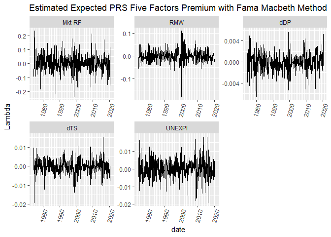

### 4.4 Fama Macbeth Second Step Regression with STL Deseaoned Data

As we can see, Fama Macbeth method would generate an evolving time-series of factor risk premium, but the volatility in lambda is unreasonablly large. We will try to apply the STL trend in the second step regression to smooth the lambda.

There is no need for trend extraction for 1st step regression, no matter if we use the full sample or rolling window. The window should be large enough to mitgate the seasonality effect. The second step regression, however, is a cross sectional regression. A seasonal component in the time series would disrupt the cross-sectional regression significantly. So it is possible the the large volatility observed in the second step regression is due to the seasonality.

STL method (Cleveland et al. 1990) would try decompose the time-series into 3 components: trend, seaonality, and noise. It applies an iterative smoothing method to extract the trend and seaonality components. At the same time, one can choose to use a robust weighting scheme to reduce the effect of large noise to the trend and seaonality extraction.

We will extract the trend of risk premium of the industry portfolios and the trend of the betas with the STL method, and then conduct the second step regression. There are two options with the STL method: the loess window for seasonal extraction (s\_window, large value means no rapidly evolving seasonal component, needs to be odd and at least 7) and robust weights for noise (downweight the noisy data in smoothing if non-Gaussian behavior in the time-series leads to extreme, transient variation). We will first show the STL decomposition of betas and returns.

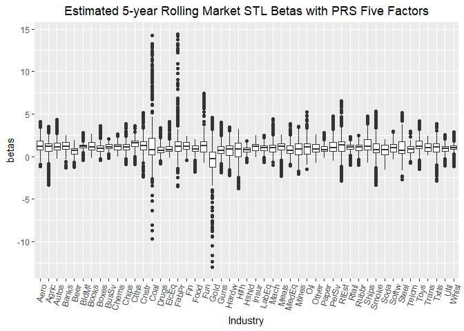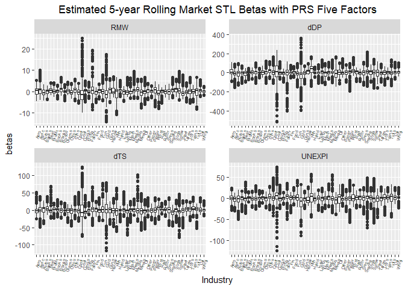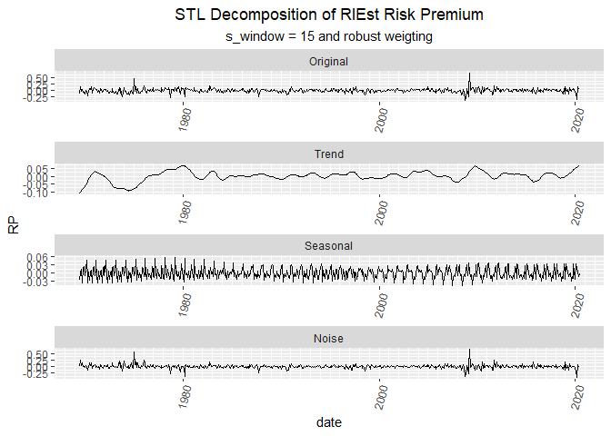

The robustness weighting seems not be appropriate for the Industry Risk Premiums since the returns vairation are mostly caused by Gaussian behavior. One example is the end of the trend curve: there was a market crash at the beginning of 2020, so the trend should go down. However, with the robust weighting, the market crash was given little wight and disappeared. At the same time, we might just choose s\_window = 7, since there could be changing seasonal patterns in the short-term.

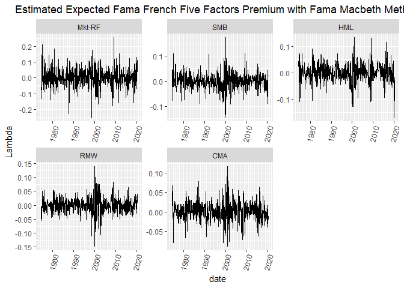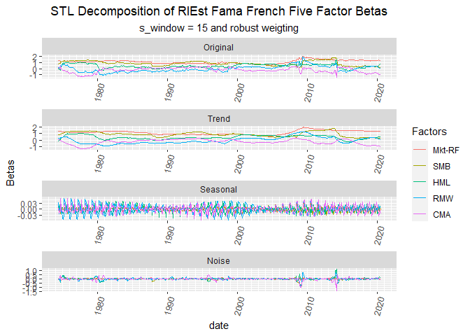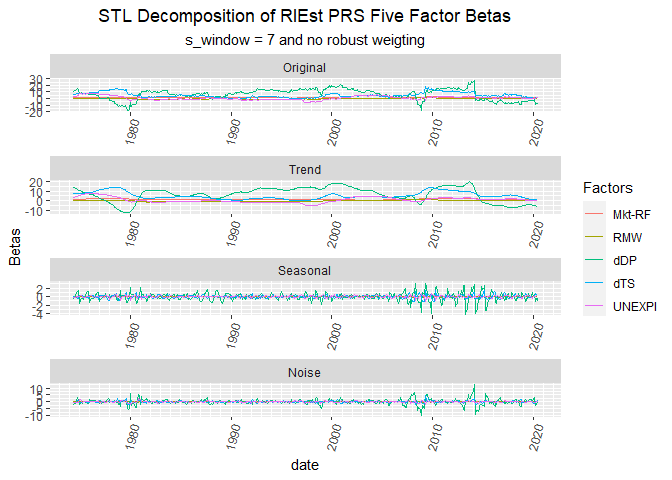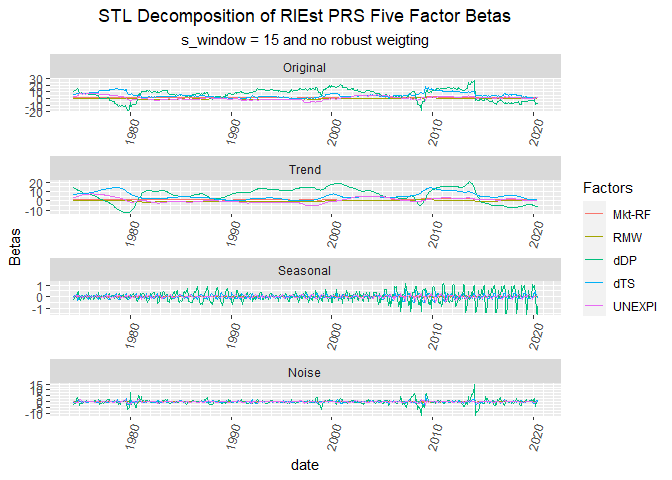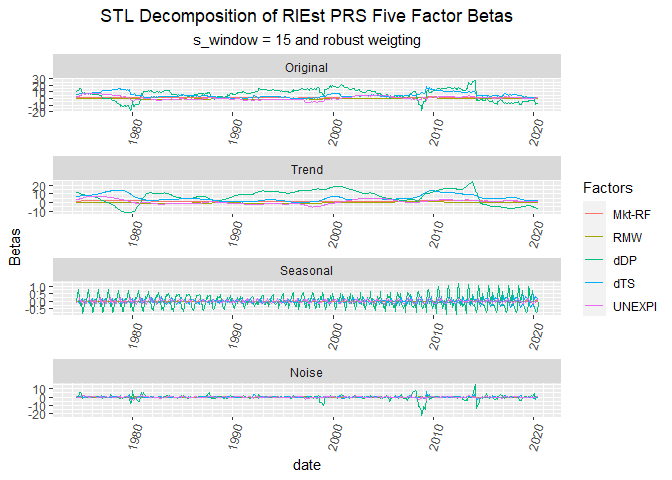

Beta estimation's noise or seasonal pattern is much smaller than trend so the noise weight or the s\_winow does not impact the result as much. We are safe by just using the no robust weighting and s\_window = 7 and that would make the left- and right-hand-side of the second step regression treated the same.

Now, we will take the desired no robust weighting, s\_window = 7 trend results of the Industry Risk Premium and Betas to estimate the factor risk premium.

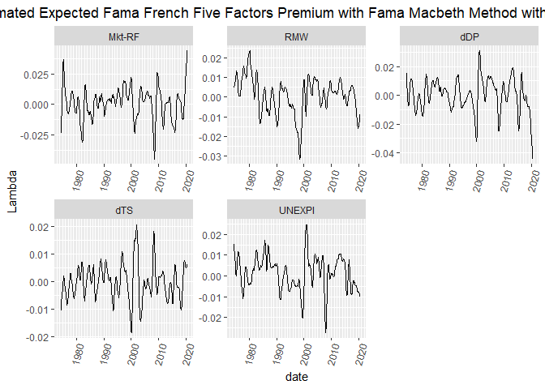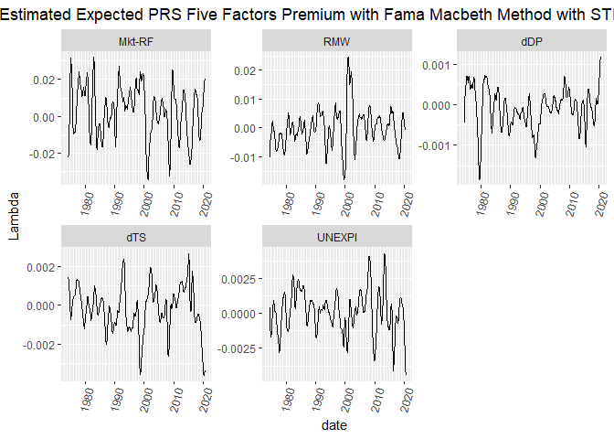

5. Equity Cost of Captial
-------------------------

### 5.1 Estimated Equity Cost of Captial

As the equation indicates, *E**C**C* = ∑*i* ∈ *F**β**i* \* *E*\[*F**i*\]+*R**f*. We will ignore the risk free rate part and the Equity Cost of Capital in this section refers to the estimated risk premium.

### 5.1.1 Arithmetic Mean

### 5.1.2 Geometric Mean

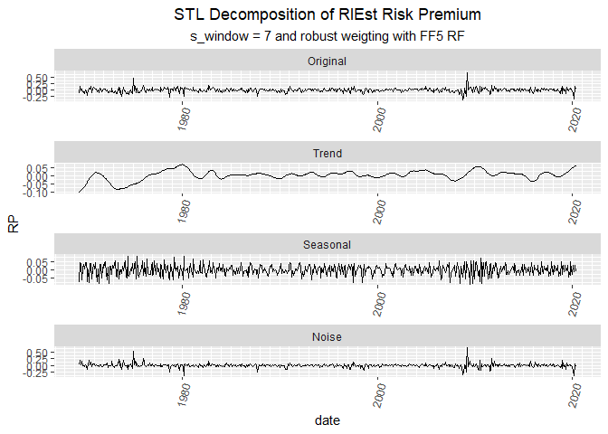

### 5.1.3 Fama Macbeth Second Step Regression

### 5.1.4 Fama Macbeth Second Step Regression with STL Trend Data

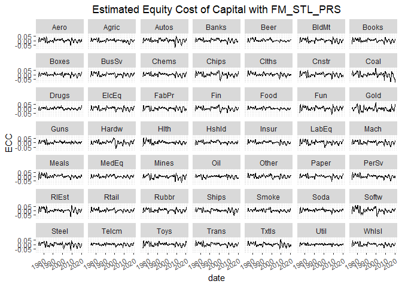

### 5.2 Decomposition of the Equity Cost of Captial

### 5.3 Forcasting???

We can try to apply the previous methods to forecast the ECC and compare the accuracy. There is a STL method of forcasting so we might be able to use STL to forcast betas and industry risk premium and perform the second step regression to obtain the lambda. Then we can calculate the ECC.
