Industry Equity Cost of Capital
================
Mike Aguilar, Bob Connolly, and Jiaxi Li

-   [1. Introduction](#introduction)
-   [2. Data](#data)
    -   [2.1 Industry Return and Fama French Five Factors](#industry-return-and-fama-french-five-factors)
    -   [2.2 Traded PRS Five Factors](#traded-prs-five-factors)
-   [3. First-Pass Regression](#first-pass-regression)
    -   [3.1 Fama French Five Factor Model](#fama-french-five-factor-model)
    -   [3.1.1 Full Sample Estimation](#full-sample-estimation)
    -   [3.1.2 Rolling Window Estimation](#rolling-window-estimation)
    -   [3.1.3 Full Sample Estimation with STL Trend](#full-sample-estimation-with-stl-trend)
    -   [3.1.4 Rolling Window Estimation with STL Trend](#rolling-window-estimation-with-stl-trend)
    -   [3.2 PRS Five Factor Model](#prs-five-factor-model)
    -   [3.2.1 Full Sample Estimation](#full-sample-estimation-1)
    -   [3.2.2 Rolling Window Estimation](#rolling-window-estimation-1)
    -   [3.2.3 Full Sample Estimation with STL Trend](#full-sample-estimation-with-stl-trend-1)
    -   [3.2.4 Rolling Window Estimation with STL Trend](#rolling-window-estimation-with-stl-trend-1)
-   [4. Factor Premium Estimation](#factor-premium-estimation)
    -   [4.1 Arithmetic Mean](#arithmetic-mean)
    -   [4.2 Geometric Mean](#geometric-mean)
    -   [4.3 Fama Macbeth Second Step Regression](#fama-macbeth-second-step-regression)
    -   [4.4 Fama Macbeth Second Step Regression with STL Deseaoned Data](#fama-macbeth-second-step-regression-with-stl-deseaoned-data)
    -   [Why filtering might improve Esimated Lamdba?](#why-filtering-might-improve-esimated-lamdba)
    -   [Simulation](#simulation)
    -   [STL Filtering](#stl-filtering)
    -   [Filtered Seasonality and Trend Strength](#filtered-seasonality-and-trend-strength)
    -   [Beta Decomposition](#beta-decomposition)
    -   [Filtered Second Pass Regression](#filtered-second-pass-regression)
    -   [Unfiltered vs. Filtered Lambdas](#unfiltered-vs.-filtered-lambdas)
-   [5. Equity Cost of Captial](#equity-cost-of-captial)
    -   [5.1 Estimated Equity Cost of Captial](#estimated-equity-cost-of-captial)
    -   [5.1.1 Arithmetic Mean](#arithmetic-mean-1)
    -   [5.1.2 Geometric Mean](#geometric-mean-1)
    -   [5.1.3 Fama Macbeth Second Step Regression](#fama-macbeth-second-step-regression-1)
    -   [5.1.4 Fama Macbeth Second Step Regression with STL Trend Data](#fama-macbeth-second-step-regression-with-stl-trend-data)
    -   [5.2 Comparative Statics](#comparative-statics)
    -   [5.3 Decomposition of the Equity Cost of Captial](#decomposition-of-the-equity-cost-of-captial)
    -   [5.4 Forcasting???](#forcasting)

1. Introduction
---------------

In 1997, Fama and French attempted to calculate the equity cost of capital (ECC) for the industry portfolios. They employed the CAPM and Fama French three-factor model and applied various techniques to estimate the factor loadings. The conclusion was the ECC estimation is not reliable due to the imprecise factor risk premium and the uncertain risk loadings. It has been 23 years and we will try to find a possible improvement of the ECC estimation in this paper.

For the model selection, we will apply the Fama French five-factor model (2013) and the PRS five-factor model (2018). Since the five-factor model is an update of the three-factor model, it should work better than the three-factor model. Pukthuanthong et al. (2018) showed that there are 5 factors are reasonable: the market factor, profitability factor, and traded version of credit spread, term spread, and unexpected inflation. We will also use their result to form the Industry Equity Cost of Capital.

We will use the 5-year rolling window to estimate the factor loadings of the ECC. Many other methods such as Bayes shrinkage, and Levi-Welch (2017) method. Levi and Welch tried to estimate the ECC while focusing on the factor exposure estimation and let the reader choose their own methods of expected factor premium. However, we found that the factor risk premiums is the more important piece in ECC estimation. In this paper, we will focus on finding a way to estimate the expected factor premium better.

Many papers mentioned that the expected factor premiums are evolving. We will therefore apply the Fama Macbeth (1973) method to estimate the expected factor premium. Since the 2nd step regression result is extremely volatile, we will apply the STL filtering to smooth the result.

2. Data
-------

We get the monthly industry return, Fama French five-factor, and the risk-free rate for the Fama French five factors data from the [Ken French Data Library](https://mba.tuck.dartmouth.edu/pages/faculty/ken.french/data_library.html). The market factor and profitability factor of the PRS five factors are from the Fama French five factors. The other 3 traded macro factors and risk-free rates are extracted from the [Federal Reserve Bank of St. Louis Economic Data (FRED)](https://fred.stlouisfed.org/) and constructed based on Pukthuanthong et al. (2018).

### 2.1 Industry Return and Fama French Five Factors

The [Fama French Five Factors](https://mba.tuck.dartmouth.edu/pages/faculty/ken.french/data_library.html) are simple returns from July 1963 to June 2020. They are as follows: Rm-Rf, SMB, HML, RMW, CMA. The 49 Industry Portfolios are value-weighted simple returns July 1926 to June 2020. The 49 Industry Portfolios without any missing values started in July 1969, so we will start the analysis in July 1969. The risk-free rate is one-month Treasury bill rate.

### 2.2 Traded PRS Five Factors

In order to construct the traded version of PRS Factor, we first obtain the risk-free rate and the raw CRR Five Factors: the Default Premium (dDP), the Industrial Production Growth Rate (dIP), the Term Premium (dTS), the Unexpected Inflation (UNEXPI), and the Change in Expected Inflation (dEI). We obtained following macro variables from the Federal Reserve Bank of St. Louis Economic Data: [Moody's Seasoned Aaa Corporate Bond Yield (Aaa)](https://fred.stlouisfed.org/series/AAA), [Moody's Seasoned Baa Corporate Bond Yield (Baa)](https://fred.stlouisfed.org/series/BAA), [Industrial Production Index (IP)](https://fred.stlouisfed.org/series/INDPRO), [10-Year Treasury Constant Maturity Rate (GS10)](https://fred.stlouisfed.org/series/GS10), [1-Year Treasury Constant Maturity Rate (GS1)](https://fred.stlouisfed.org/series/GS1), [Seasonally Adjusted CPI derived Inflation Rate (INF)](https://fred.stlouisfed.org/series/CPIAUCSL), [University of Michigan Inflation Expectation (MICH)](https://fred.stlouisfed.org/series/MICH), [3-Month Treasury Bill: Secondary Market Rate (TB3MS)](https://fred.stlouisfed.org/series/TB3MS).

Here are the ways that the raw factors are calculated:

*d**D**P**r**a**w*, *t* = *B**a**a**t* − *A**a**a**t*

*d**I**P**r**a**w*, *t* = *l**n*(*I**P**t*)−*l**n*(*I**P**t* − 1)

*d**T**S**r**a**w*, *t* = *G**S*10*t* − *G**S*1*t*

*E**X**P**I**N**F**r**a**w*, *t* = *E**t* − 12\[*M**I**C**H**t*\]

*U**N**E**X**P**I**r**a**w*, *t* = *I**N**F**t* − *E**X**P**I**N**F**r**a**w*, *t*

*d**E**I**t* = *E**X**P**I**N**F**r**a**w*, *t* − *E**X**P**I**N**F**r**a**w*, *t* − 1

The Default Premium started in Janurary 1919; the Industrial Production Growth Rate stared in Feburary 1919; the Term Premium started in April 1953; the Unexpected Inflation started in Janurary 1979; and the Change in Expected Inflation started in Feburary 1979; 3-Month Treasury Bill: Secondary Market Rate (TB3MS) started in Janurary 1934. Therefore, the raw PRS factors would start in Feburary 1979. The Default Premium (dDP), the Term Premium (dTS), the Unexpected Inflation (UNEXPI), the Change in Expected Inflation (dEI), and 3-month Treasury Rate are annual rates so they need to be converted to monthly frequency.

After obtaining the raw factors, we need to create the traded version of these 5 factors. Similar to the Pukthuanthong et al. (2018) procedure, we applied the 50 portfolios, *R*, (the ten equal-weighted size portfolios, ten equal-weighted book-to-market portfolios, ten equal-weighted investment portfolios and ten equal-weighted operating profitability portfolios, and ten value-weighted momentum portfolios) from the [Ken French Data Library](https://mba.tuck.dartmouth.edu/pages/faculty/ken.french/data_library.html) to construct the mimicking portfolios. These 50 portfolios all exist after July 1963. We first regress each of the 50 assets against the raw factors to get the coefficient matrix B (50x5) and the diagonal matrix of the covariance matrix of the error term V (50x50). The weight of the factor mimicking portfolio is *w* = (*B*′*V*−1*B*)−1*B*′*V*−1. The traded factors are PRS = wR, and they would start in July 1963.

3. First-Pass Regression
------------------------

In this section, we will try to apply the simple first-pass regression to estimate the betas of the 49 industry portfolios. The period would be from July 1969 to June 2020. Since the focus of this paper is about the factor risk premium estimation, we will use the most basic first pass regressions (full sample and 5-year rolling window) to estimate the betas and compare which lamdba method would work better.

### 3.1 Fama French Five Factor Model

We will first apply the Fama French Five Factor Model to estimate the betas. We will use the Five Factor Model as the base model.

### 3.1.1 Full Sample Estimation

<table class="table table-striped" style="font-size: 10px; width: auto !important; margin-left: auto; margin-right: auto;">
<caption style="font-size: initial !important;">
Fama French Five Factors
</caption>
<thead>
<tr>
<th style="border-bottom:hidden" colspan="1">
</th>
<th style="border-bottom:hidden; padding-bottom:0; padding-left:3px;padding-right:3px;text-align: center; " colspan="6">
Coefficients

</th>
<th style="border-bottom:hidden; padding-bottom:0; padding-left:3px;padding-right:3px;text-align: center; " colspan="6">
Std. Error

</th>
</tr>
<tr>
<th style="text-align:center;">
Industry
</th>
<th style="text-align:center;">
Alpha
</th>
<th style="text-align:center;">
Mkt-RF
</th>
<th style="text-align:center;">
SMB
</th>
<th style="text-align:center;">
HML
</th>
<th style="text-align:center;">
RMW
</th>
<th style="text-align:center;">
CMA
</th>
<th style="text-align:center;">
Alpha
</th>
<th style="text-align:center;">
Mkt-RF
</th>
<th style="text-align:center;">
SMB
</th>
<th style="text-align:center;">
HML
</th>
<th style="text-align:center;">
RMW
</th>
<th style="text-align:center;">
CMA
</th>
</tr>
</thead>
<tbody>
<tr>
<td style="text-align:center;font-weight: bold;">
Aero
</td>
<td style="text-align:center;">
-0.0017060
</td>
<td style="text-align:center;">
1.2085983
</td>
<td style="text-align:center;">
0.2931223
</td>
<td style="text-align:center;">
0.2753853
</td>
<td style="text-align:center;">
0.4994864
</td>
<td style="text-align:center;">
0.0879383
</td>
<td style="text-align:center;">
0.0017527
</td>
<td style="text-align:center;">
0.0418819
</td>
<td style="text-align:center;">
0.0607440
</td>
<td style="text-align:center;">
0.0786255
</td>
<td style="text-align:center;">
0.0832089
</td>
<td style="text-align:center;">
0.1241392
</td>
</tr>
<tr>
<td style="text-align:center;font-weight: bold;">
Agric
</td>
<td style="text-align:center;">
-0.0003846
</td>
<td style="text-align:center;">
0.8254045
</td>
<td style="text-align:center;">
0.4258726
</td>
<td style="text-align:center;">
-0.0810419
</td>
<td style="text-align:center;">
0.2175820
</td>
<td style="text-align:center;">
0.1406175
</td>
<td style="text-align:center;">
0.0020985
</td>
<td style="text-align:center;">
0.0501455
</td>
<td style="text-align:center;">
0.0727292
</td>
<td style="text-align:center;">
0.0941389
</td>
<td style="text-align:center;">
0.0996267
</td>
<td style="text-align:center;">
0.1486328
</td>
</tr>
<tr>
<td style="text-align:center;font-weight: bold;">
Autos
</td>
<td style="text-align:center;">
-0.0036580
</td>
<td style="text-align:center;">
1.2273182
</td>
<td style="text-align:center;">
0.2149694
</td>
<td style="text-align:center;">
0.5925738
</td>
<td style="text-align:center;">
0.0694061
</td>
<td style="text-align:center;">
0.0348842
</td>
<td style="text-align:center;">
0.0018550
</td>
<td style="text-align:center;">
0.0443260
</td>
<td style="text-align:center;">
0.0642888
</td>
<td style="text-align:center;">
0.0832137
</td>
<td style="text-align:center;">
0.0880647
</td>
<td style="text-align:center;">
0.1313835
</td>
</tr>
<tr>
<td style="text-align:center;font-weight: bold;">
Banks
</td>
<td style="text-align:center;">
-0.0015445
</td>
<td style="text-align:center;">
1.1722823
</td>
<td style="text-align:center;">
-0.1066541
</td>
<td style="text-align:center;">
0.8167257
</td>
<td style="text-align:center;">
0.1229449
</td>
<td style="text-align:center;">
-0.3985589
</td>
<td style="text-align:center;">
0.0012937
</td>
<td style="text-align:center;">
0.0309150
</td>
<td style="text-align:center;">
0.0448380
</td>
<td style="text-align:center;">
0.0580372
</td>
<td style="text-align:center;">
0.0614205
</td>
<td style="text-align:center;">
0.0916330
</td>
</tr>
<tr>
<td style="text-align:center;font-weight: bold;">
Beer
</td>
<td style="text-align:center;">
-0.0000880
</td>
<td style="text-align:center;">
0.8635333
</td>
<td style="text-align:center;">
-0.0050819
</td>
<td style="text-align:center;">
-0.1625288
</td>
<td style="text-align:center;">
0.6717286
</td>
<td style="text-align:center;">
0.4416518
</td>
<td style="text-align:center;">
0.0015715
</td>
<td style="text-align:center;">
0.0375532
</td>
<td style="text-align:center;">
0.0544658
</td>
<td style="text-align:center;">
0.0704991
</td>
<td style="text-align:center;">
0.0746089
</td>
<td style="text-align:center;">
0.1113088
</td>
</tr>
<tr>
<td style="text-align:center;font-weight: bold;">
BldMt
</td>
<td style="text-align:center;">
-0.0039339
</td>
<td style="text-align:center;">
1.2552070
</td>
<td style="text-align:center;">
0.3907534
</td>
<td style="text-align:center;">
0.3157648
</td>
<td style="text-align:center;">
0.4904084
</td>
<td style="text-align:center;">
0.2082103
</td>
<td style="text-align:center;">
0.0012156
</td>
<td style="text-align:center;">
0.0290481
</td>
<td style="text-align:center;">
0.0421303
</td>
<td style="text-align:center;">
0.0545323
</td>
<td style="text-align:center;">
0.0577113
</td>
<td style="text-align:center;">
0.0860993
</td>
</tr>
<tr>
<td style="text-align:center;font-weight: bold;">
Books
</td>
<td style="text-align:center;">
-0.0038772
</td>
<td style="text-align:center;">
1.0984117
</td>
<td style="text-align:center;">
0.3571583
</td>
<td style="text-align:center;">
0.2266649
</td>
<td style="text-align:center;">
0.4282332
</td>
<td style="text-align:center;">
0.0268060
</td>
<td style="text-align:center;">
0.0013279
</td>
<td style="text-align:center;">
0.0317302
</td>
<td style="text-align:center;">
0.0460204
</td>
<td style="text-align:center;">
0.0595676
</td>
<td style="text-align:center;">
0.0630401
</td>
<td style="text-align:center;">
0.0940494
</td>
</tr>
<tr>
<td style="text-align:center;font-weight: bold;">
Boxes
</td>
<td style="text-align:center;">
-0.0002691
</td>
<td style="text-align:center;">
0.9980460
</td>
<td style="text-align:center;">
-0.0347087
</td>
<td style="text-align:center;">
0.1279435
</td>
<td style="text-align:center;">
0.2836173
</td>
<td style="text-align:center;">
-0.0943480
</td>
<td style="text-align:center;">
0.0015530
</td>
<td style="text-align:center;">
0.0371104
</td>
<td style="text-align:center;">
0.0538236
</td>
<td style="text-align:center;">
0.0696680
</td>
<td style="text-align:center;">
0.0737293
</td>
<td style="text-align:center;">
0.1099965
</td>
</tr>
<tr>
<td style="text-align:center;font-weight: bold;">
BusSv
</td>
<td style="text-align:center;">
-0.0004619
</td>
<td style="text-align:center;">
1.0772166
</td>
<td style="text-align:center;">
0.4047467
</td>
<td style="text-align:center;">
-0.1044015
</td>
<td style="text-align:center;">
0.1547087
</td>
<td style="text-align:center;">
-0.0578629
</td>
<td style="text-align:center;">
0.0008560
</td>
<td style="text-align:center;">
0.0204539
</td>
<td style="text-align:center;">
0.0296656
</td>
<td style="text-align:center;">
0.0383984
</td>
<td style="text-align:center;">
0.0406368
</td>
<td style="text-align:center;">
0.0606260
</td>
</tr>
<tr>
<td style="text-align:center;font-weight: bold;">
Chems
</td>
<td style="text-align:center;">
-0.0024657
</td>
<td style="text-align:center;">
1.1597086
</td>
<td style="text-align:center;">
0.0465431
</td>
<td style="text-align:center;">
0.2367452
</td>
<td style="text-align:center;">
0.3082250
</td>
<td style="text-align:center;">
0.2301914
</td>
<td style="text-align:center;">
0.0012458
</td>
<td style="text-align:center;">
0.0297682
</td>
<td style="text-align:center;">
0.0431747
</td>
<td style="text-align:center;">
0.0558843
</td>
<td style="text-align:center;">
0.0591421
</td>
<td style="text-align:center;">
0.0882339
</td>
</tr>
<tr>
<td style="text-align:center;font-weight: bold;">
Chips
</td>
<td style="text-align:center;">
0.0039846
</td>
<td style="text-align:center;">
1.1798212
</td>
<td style="text-align:center;">
0.2389137
</td>
<td style="text-align:center;">
-0.3144479
</td>
<td style="text-align:center;">
-0.5561211
</td>
<td style="text-align:center;">
-0.3200445
</td>
<td style="text-align:center;">
0.0015209
</td>
<td style="text-align:center;">
0.0363424
</td>
<td style="text-align:center;">
0.0527097
</td>
<td style="text-align:center;">
0.0682262
</td>
<td style="text-align:center;">
0.0722034
</td>
<td style="text-align:center;">
0.1077201
</td>
</tr>
<tr>
<td style="text-align:center;font-weight: bold;">
Clths
</td>
<td style="text-align:center;">
-0.0023532
</td>
<td style="text-align:center;">
1.1145901
</td>
<td style="text-align:center;">
0.5484879
</td>
<td style="text-align:center;">
0.3320528
</td>
<td style="text-align:center;">
0.6946888
</td>
<td style="text-align:center;">
-0.1286381
</td>
<td style="text-align:center;">
0.0016247
</td>
<td style="text-align:center;">
0.0388233
</td>
<td style="text-align:center;">
0.0563079
</td>
<td style="text-align:center;">
0.0728835
</td>
<td style="text-align:center;">
0.0771323
</td>
<td style="text-align:center;">
0.1150735
</td>
</tr>
<tr>
<td style="text-align:center;font-weight: bold;">
Cnstr
</td>
<td style="text-align:center;">
-0.0043263
</td>
<td style="text-align:center;">
1.2827549
</td>
<td style="text-align:center;">
0.5336958
</td>
<td style="text-align:center;">
0.2138833
</td>
<td style="text-align:center;">
0.3989391
</td>
<td style="text-align:center;">
0.0171826
</td>
<td style="text-align:center;">
0.0017163
</td>
<td style="text-align:center;">
0.0410122
</td>
<td style="text-align:center;">
0.0594826
</td>
<td style="text-align:center;">
0.0769928
</td>
<td style="text-align:center;">
0.0814811
</td>
<td style="text-align:center;">
0.1215614
</td>
</tr>
<tr>
<td style="text-align:center;font-weight: bold;">
Coal
</td>
<td style="text-align:center;">
-0.0038319
</td>
<td style="text-align:center;">
1.1819738
</td>
<td style="text-align:center;">
0.4471589
</td>
<td style="text-align:center;">
0.2479553
</td>
<td style="text-align:center;">
0.0066664
</td>
<td style="text-align:center;">
0.2912234
</td>
<td style="text-align:center;">
0.0039763
</td>
<td style="text-align:center;">
0.0950160
</td>
<td style="text-align:center;">
0.1378078
</td>
<td style="text-align:center;">
0.1783749
</td>
<td style="text-align:center;">
0.1887733
</td>
<td style="text-align:center;">
0.2816303
</td>
</tr>
<tr>
<td style="text-align:center;font-weight: bold;">
Drugs
</td>
<td style="text-align:center;">
0.0017628
</td>
<td style="text-align:center;">
0.8716268
</td>
<td style="text-align:center;">
-0.2811213
</td>
<td style="text-align:center;">
-0.5057393
</td>
<td style="text-align:center;">
0.2873540
</td>
<td style="text-align:center;">
0.4640041
</td>
<td style="text-align:center;">
0.0013488
</td>
<td style="text-align:center;">
0.0322301
</td>
<td style="text-align:center;">
0.0467453
</td>
<td style="text-align:center;">
0.0605060
</td>
<td style="text-align:center;">
0.0640332
</td>
<td style="text-align:center;">
0.0955309
</td>
</tr>
<tr>
<td style="text-align:center;font-weight: bold;">
ElcEq
</td>
<td style="text-align:center;">
0.0002728
</td>
<td style="text-align:center;">
1.2175987
</td>
<td style="text-align:center;">
0.0801531
</td>
<td style="text-align:center;">
0.0226345
</td>
<td style="text-align:center;">
0.1260678
</td>
<td style="text-align:center;">
0.0175188
</td>
<td style="text-align:center;">
0.0013435
</td>
<td style="text-align:center;">
0.0321036
</td>
<td style="text-align:center;">
0.0465619
</td>
<td style="text-align:center;">
0.0602686
</td>
<td style="text-align:center;">
0.0637820
</td>
<td style="text-align:center;">
0.0951561
</td>
</tr>
<tr>
<td style="text-align:center;font-weight: bold;">
FabPr
</td>
<td style="text-align:center;">
-0.0038979
</td>
<td style="text-align:center;">
1.0036897
</td>
<td style="text-align:center;">
0.7297908
</td>
<td style="text-align:center;">
0.3474556
</td>
<td style="text-align:center;">
0.2546453
</td>
<td style="text-align:center;">
-0.3305400
</td>
<td style="text-align:center;">
0.0021110
</td>
<td style="text-align:center;">
0.0504432
</td>
<td style="text-align:center;">
0.0731610
</td>
<td style="text-align:center;">
0.0946978
</td>
<td style="text-align:center;">
0.1002182
</td>
<td style="text-align:center;">
0.1495152
</td>
</tr>
<tr>
<td style="text-align:center;font-weight: bold;">
Fin
</td>
<td style="text-align:center;">
0.0019238
</td>
<td style="text-align:center;">
1.1770110
</td>
<td style="text-align:center;">
0.0106150
</td>
<td style="text-align:center;">
0.4035061
</td>
<td style="text-align:center;">
-0.4091644
</td>
<td style="text-align:center;">
-0.3845337
</td>
<td style="text-align:center;">
0.0011090
</td>
<td style="text-align:center;">
0.0265001
</td>
<td style="text-align:center;">
0.0384348
</td>
<td style="text-align:center;">
0.0497490
</td>
<td style="text-align:center;">
0.0526491
</td>
<td style="text-align:center;">
0.0785471
</td>
</tr>
<tr>
<td style="text-align:center;font-weight: bold;">
Food
</td>
<td style="text-align:center;">
-0.0003939
</td>
<td style="text-align:center;">
0.8133815
</td>
<td style="text-align:center;">
-0.0524832
</td>
<td style="text-align:center;">
-0.0945994
</td>
<td style="text-align:center;">
0.5802765
</td>
<td style="text-align:center;">
0.5053513
</td>
<td style="text-align:center;">
0.0012587
</td>
<td style="text-align:center;">
0.0300785
</td>
<td style="text-align:center;">
0.0436247
</td>
<td style="text-align:center;">
0.0564667
</td>
<td style="text-align:center;">
0.0597585
</td>
<td style="text-align:center;">
0.0891535
</td>
</tr>
<tr>
<td style="text-align:center;font-weight: bold;">
Fun
</td>
<td style="text-align:center;">
0.0018343
</td>
<td style="text-align:center;">
1.2499559
</td>
<td style="text-align:center;">
0.4911755
</td>
<td style="text-align:center;">
0.1628531
</td>
<td style="text-align:center;">
0.2417360
</td>
<td style="text-align:center;">
-0.2880831
</td>
<td style="text-align:center;">
0.0019544
</td>
<td style="text-align:center;">
0.0467018
</td>
<td style="text-align:center;">
0.0677346
</td>
<td style="text-align:center;">
0.0876739
</td>
<td style="text-align:center;">
0.0927848
</td>
<td style="text-align:center;">
0.1384255
</td>
</tr>
<tr>
<td style="text-align:center;font-weight: bold;">
Gold
</td>
<td style="text-align:center;">
0.0011335
</td>
<td style="text-align:center;">
0.5837386
</td>
<td style="text-align:center;">
0.3634198
</td>
<td style="text-align:center;">
-0.2602619
</td>
<td style="text-align:center;">
0.0036185
</td>
<td style="text-align:center;">
0.5086043
</td>
<td style="text-align:center;">
0.0044154
</td>
<td style="text-align:center;">
0.1055100
</td>
<td style="text-align:center;">
0.1530279
</td>
<td style="text-align:center;">
0.1980754
</td>
<td style="text-align:center;">
0.2096222
</td>
<td style="text-align:center;">
0.3127349
</td>
</tr>
<tr>
<td style="text-align:center;font-weight: bold;">
Guns
</td>
<td style="text-align:center;">
0.0006980
</td>
<td style="text-align:center;">
0.9055074
</td>
<td style="text-align:center;">
0.3202853
</td>
<td style="text-align:center;">
0.2902131
</td>
<td style="text-align:center;">
0.7185617
</td>
<td style="text-align:center;">
0.1268888
</td>
<td style="text-align:center;">
0.0021436
</td>
<td style="text-align:center;">
0.0512228
</td>
<td style="text-align:center;">
0.0742917
</td>
<td style="text-align:center;">
0.0961613
</td>
<td style="text-align:center;">
0.1017670
</td>
<td style="text-align:center;">
0.1518259
</td>
</tr>
<tr>
<td style="text-align:center;font-weight: bold;">
Hardw
</td>
<td style="text-align:center;">
0.0032294
</td>
<td style="text-align:center;">
1.0267954
</td>
<td style="text-align:center;">
-0.0011180
</td>
<td style="text-align:center;">
-0.3041928
</td>
<td style="text-align:center;">
-0.5806640
</td>
<td style="text-align:center;">
-0.4430579
</td>
<td style="text-align:center;">
0.0017661
</td>
<td style="text-align:center;">
0.0422015
</td>
<td style="text-align:center;">
0.0612076
</td>
<td style="text-align:center;">
0.0792255
</td>
<td style="text-align:center;">
0.0838440
</td>
<td style="text-align:center;">
0.1250866
</td>
</tr>
<tr>
<td style="text-align:center;font-weight: bold;">
Hlth
</td>
<td style="text-align:center;">
-0.0039421
</td>
<td style="text-align:center;">
1.0854593
</td>
<td style="text-align:center;">
0.8942400
</td>
<td style="text-align:center;">
-0.0598781
</td>
<td style="text-align:center;">
1.0988021
</td>
<td style="text-align:center;">
0.0571197
</td>
<td style="text-align:center;">
0.0023503
</td>
<td style="text-align:center;">
0.0561630
</td>
<td style="text-align:center;">
0.0814568
</td>
<td style="text-align:center;">
0.1054356
</td>
<td style="text-align:center;">
0.1115819
</td>
<td style="text-align:center;">
0.1664688
</td>
</tr>
<tr>
<td style="text-align:center;font-weight: bold;">
Hshld
</td>
<td style="text-align:center;">
-0.0020860
</td>
<td style="text-align:center;">
0.8901395
</td>
<td style="text-align:center;">
-0.0414269
</td>
<td style="text-align:center;">
-0.1871243
</td>
<td style="text-align:center;">
0.5605051
</td>
<td style="text-align:center;">
0.3581377
</td>
<td style="text-align:center;">
0.0011536
</td>
<td style="text-align:center;">
0.0275659
</td>
<td style="text-align:center;">
0.0399806
</td>
<td style="text-align:center;">
0.0517499
</td>
<td style="text-align:center;">
0.0547667
</td>
<td style="text-align:center;">
0.0817063
</td>
</tr>
<tr>
<td style="text-align:center;font-weight: bold;">
Insur
</td>
<td style="text-align:center;">
-0.0004908
</td>
<td style="text-align:center;">
1.0621447
</td>
<td style="text-align:center;">
-0.1112492
</td>
<td style="text-align:center;">
0.3811060
</td>
<td style="text-align:center;">
0.1961882
</td>
<td style="text-align:center;">
0.0288185
</td>
<td style="text-align:center;">
0.0013260
</td>
<td style="text-align:center;">
0.0316868
</td>
<td style="text-align:center;">
0.0459574
</td>
<td style="text-align:center;">
0.0594861
</td>
<td style="text-align:center;">
0.0629538
</td>
<td style="text-align:center;">
0.0939206
</td>
</tr>
<tr>
<td style="text-align:center;font-weight: bold;">
LabEq
</td>
<td style="text-align:center;">
0.0011405
</td>
<td style="text-align:center;">
1.1592554
</td>
<td style="text-align:center;">
0.4285268
</td>
<td style="text-align:center;">
-0.5027346
</td>
<td style="text-align:center;">
-0.1441310
</td>
<td style="text-align:center;">
0.1545286
</td>
<td style="text-align:center;">
0.0014500
</td>
<td style="text-align:center;">
0.0346498
</td>
<td style="text-align:center;">
0.0502549
</td>
<td style="text-align:center;">
0.0650487
</td>
<td style="text-align:center;">
0.0688407
</td>
<td style="text-align:center;">
0.1027032
</td>
</tr>
<tr>
<td style="text-align:center;font-weight: bold;">
Mach
</td>
<td style="text-align:center;">
-0.0011806
</td>
<td style="text-align:center;">
1.1894700
</td>
<td style="text-align:center;">
0.2848769
</td>
<td style="text-align:center;">
0.0982099
</td>
<td style="text-align:center;">
0.0105856
</td>
<td style="text-align:center;">
0.0159399
</td>
<td style="text-align:center;">
0.0012917
</td>
<td style="text-align:center;">
0.0308666
</td>
<td style="text-align:center;">
0.0447679
</td>
<td style="text-align:center;">
0.0579464
</td>
<td style="text-align:center;">
0.0613244
</td>
<td style="text-align:center;">
0.0914897
</td>
</tr>
<tr>
<td style="text-align:center;font-weight: bold;">
Meals
</td>
<td style="text-align:center;">
-0.0025867
</td>
<td style="text-align:center;">
1.0812673
</td>
<td style="text-align:center;">
0.3762794
</td>
<td style="text-align:center;">
-0.0105822
</td>
<td style="text-align:center;">
0.8105843
</td>
<td style="text-align:center;">
0.1622857
</td>
<td style="text-align:center;">
0.0014646
</td>
<td style="text-align:center;">
0.0349971
</td>
<td style="text-align:center;">
0.0507585
</td>
<td style="text-align:center;">
0.0657006
</td>
<td style="text-align:center;">
0.0695306
</td>
<td style="text-align:center;">
0.1037325
</td>
</tr>
<tr>
<td style="text-align:center;font-weight: bold;">
MedEq
</td>
<td style="text-align:center;">
0.0016029
</td>
<td style="text-align:center;">
0.8744119
</td>
<td style="text-align:center;">
0.1031781
</td>
<td style="text-align:center;">
-0.3305774
</td>
<td style="text-align:center;">
0.2731120
</td>
<td style="text-align:center;">
0.1035343
</td>
<td style="text-align:center;">
0.0013851
</td>
<td style="text-align:center;">
0.0330982
</td>
<td style="text-align:center;">
0.0480045
</td>
<td style="text-align:center;">
0.0621358
</td>
<td style="text-align:center;">
0.0657580
</td>
<td style="text-align:center;">
0.0981042
</td>
</tr>
<tr>
<td style="text-align:center;font-weight: bold;">
Mines
</td>
<td style="text-align:center;">
-0.0022027
</td>
<td style="text-align:center;">
1.1386038
</td>
<td style="text-align:center;">
0.3314773
</td>
<td style="text-align:center;">
0.1934266
</td>
<td style="text-align:center;">
0.0714566
</td>
<td style="text-align:center;">
0.3088411
</td>
<td style="text-align:center;">
0.0023607
</td>
<td style="text-align:center;">
0.0564106
</td>
<td style="text-align:center;">
0.0818159
</td>
<td style="text-align:center;">
0.1059004
</td>
<td style="text-align:center;">
0.1120738
</td>
<td style="text-align:center;">
0.1672027
</td>
</tr>
<tr>
<td style="text-align:center;font-weight: bold;">
Oil
</td>
<td style="text-align:center;">
-0.0023745
</td>
<td style="text-align:center;">
1.0014272
</td>
<td style="text-align:center;">
-0.0682213
</td>
<td style="text-align:center;">
0.2534753
</td>
<td style="text-align:center;">
0.2765152
</td>
<td style="text-align:center;">
0.3031233
</td>
<td style="text-align:center;">
0.0018314
</td>
<td style="text-align:center;">
0.0437622
</td>
<td style="text-align:center;">
0.0634711
</td>
<td style="text-align:center;">
0.0821554
</td>
<td style="text-align:center;">
0.0869447
</td>
<td style="text-align:center;">
0.1297125
</td>
</tr>
<tr>
<td style="text-align:center;font-weight: bold;">
Other
</td>
<td style="text-align:center;">
-0.0068442
</td>
<td style="text-align:center;">
1.1388078
</td>
<td style="text-align:center;">
0.2549218
</td>
<td style="text-align:center;">
0.0668335
</td>
<td style="text-align:center;">
0.1832071
</td>
<td style="text-align:center;">
0.0732465
</td>
<td style="text-align:center;">
0.0018194
</td>
<td style="text-align:center;">
0.0434749
</td>
<td style="text-align:center;">
0.0630544
</td>
<td style="text-align:center;">
0.0816160
</td>
<td style="text-align:center;">
0.0863738
</td>
<td style="text-align:center;">
0.1288608
</td>
</tr>
<tr>
<td style="text-align:center;font-weight: bold;">
Paper
</td>
<td style="text-align:center;">
-0.0030838
</td>
<td style="text-align:center;">
1.0826153
</td>
<td style="text-align:center;">
0.0947014
</td>
<td style="text-align:center;">
0.1514737
</td>
<td style="text-align:center;">
0.4096624
</td>
<td style="text-align:center;">
0.3961297
</td>
<td style="text-align:center;">
0.0013249
</td>
<td style="text-align:center;">
0.0316596
</td>
<td style="text-align:center;">
0.0459180
</td>
<td style="text-align:center;">
0.0594350
</td>
<td style="text-align:center;">
0.0628998
</td>
<td style="text-align:center;">
0.0938401
</td>
</tr>
<tr>
<td style="text-align:center;font-weight: bold;">
PerSv
</td>
<td style="text-align:center;">
-0.0067203
</td>
<td style="text-align:center;">
1.0680857
</td>
<td style="text-align:center;">
0.6052475
</td>
<td style="text-align:center;">
0.0264087
</td>
<td style="text-align:center;">
0.6561786
</td>
<td style="text-align:center;">
0.0508338
</td>
<td style="text-align:center;">
0.0017252
</td>
<td style="text-align:center;">
0.0412259
</td>
<td style="text-align:center;">
0.0597926
</td>
<td style="text-align:center;">
0.0773940
</td>
<td style="text-align:center;">
0.0819057
</td>
<td style="text-align:center;">
0.1221949
</td>
</tr>
<tr>
<td style="text-align:center;font-weight: bold;">
RlEst
</td>
<td style="text-align:center;">
-0.0085585
</td>
<td style="text-align:center;">
1.1825155
</td>
<td style="text-align:center;">
0.9911820
</td>
<td style="text-align:center;">
0.7245494
</td>
<td style="text-align:center;">
0.4083650
</td>
<td style="text-align:center;">
-0.2667029
</td>
<td style="text-align:center;">
0.0018547
</td>
<td style="text-align:center;">
0.0443193
</td>
<td style="text-align:center;">
0.0642791
</td>
<td style="text-align:center;">
0.0832012
</td>
<td style="text-align:center;">
0.0880514
</td>
<td style="text-align:center;">
0.1313636
</td>
</tr>
<tr>
<td style="text-align:center;font-weight: bold;">
Rtail
</td>
<td style="text-align:center;">
0.0001220
</td>
<td style="text-align:center;">
1.0154299
</td>
<td style="text-align:center;">
0.1914579
</td>
<td style="text-align:center;">
-0.0531875
</td>
<td style="text-align:center;">
0.4601537
</td>
<td style="text-align:center;">
0.0368127
</td>
<td style="text-align:center;">
0.0012751
</td>
<td style="text-align:center;">
0.0304706
</td>
<td style="text-align:center;">
0.0441935
</td>
<td style="text-align:center;">
0.0572030
</td>
<td style="text-align:center;">
0.0605376
</td>
<td style="text-align:center;">
0.0903159
</td>
</tr>
<tr>
<td style="text-align:center;font-weight: bold;">
Rubbr
</td>
<td style="text-align:center;">
-0.0019858
</td>
<td style="text-align:center;">
1.0381702
</td>
<td style="text-align:center;">
0.6421157
</td>
<td style="text-align:center;">
0.1301219
</td>
<td style="text-align:center;">
0.3957909
</td>
<td style="text-align:center;">
0.1384205
</td>
<td style="text-align:center;">
0.0013032
</td>
<td style="text-align:center;">
0.0311415
</td>
<td style="text-align:center;">
0.0451666
</td>
<td style="text-align:center;">
0.0584624
</td>
<td style="text-align:center;">
0.0618705
</td>
<td style="text-align:center;">
0.0923044
</td>
</tr>
<tr>
<td style="text-align:center;font-weight: bold;">
Ships
</td>
<td style="text-align:center;">
-0.0038423
</td>
<td style="text-align:center;">
1.2237949
</td>
<td style="text-align:center;">
0.3197487
</td>
<td style="text-align:center;">
0.2578553
</td>
<td style="text-align:center;">
0.5764006
</td>
<td style="text-align:center;">
0.3599753
</td>
<td style="text-align:center;">
0.0021729
</td>
<td style="text-align:center;">
0.0519227
</td>
<td style="text-align:center;">
0.0753069
</td>
<td style="text-align:center;">
0.0974753
</td>
<td style="text-align:center;">
0.1031576
</td>
<td style="text-align:center;">
0.1539006
</td>
</tr>
<tr>
<td style="text-align:center;font-weight: bold;">
Smoke
</td>
<td style="text-align:center;">
0.0014748
</td>
<td style="text-align:center;">
0.8539572
</td>
<td style="text-align:center;">
-0.1365032
</td>
<td style="text-align:center;">
-0.2084596
</td>
<td style="text-align:center;">
0.7146263
</td>
<td style="text-align:center;">
0.8267503
</td>
<td style="text-align:center;">
0.0021751
</td>
<td style="text-align:center;">
0.0519762
</td>
<td style="text-align:center;">
0.0753844
</td>
<td style="text-align:center;">
0.0975757
</td>
<td style="text-align:center;">
0.1032638
</td>
<td style="text-align:center;">
0.1540590
</td>
</tr>
<tr>
<td style="text-align:center;font-weight: bold;">
Soda
</td>
<td style="text-align:center;">
-0.0006067
</td>
<td style="text-align:center;">
0.9415169
</td>
<td style="text-align:center;">
-0.0162179
</td>
<td style="text-align:center;">
0.0905335
</td>
<td style="text-align:center;">
0.6206460
</td>
<td style="text-align:center;">
0.2508099
</td>
<td style="text-align:center;">
0.0021578
</td>
<td style="text-align:center;">
0.0515622
</td>
<td style="text-align:center;">
0.0747840
</td>
<td style="text-align:center;">
0.0967985
</td>
<td style="text-align:center;">
0.1024413
</td>
<td style="text-align:center;">
0.1528319
</td>
</tr>
<tr>
<td style="text-align:center;font-weight: bold;">
Softw
</td>
<td style="text-align:center;">
0.0022694
</td>
<td style="text-align:center;">
1.2036278
</td>
<td style="text-align:center;">
0.9190520
</td>
<td style="text-align:center;">
-0.3505056
</td>
<td style="text-align:center;">
0.0324944
</td>
<td style="text-align:center;">
-0.8756008
</td>
<td style="text-align:center;">
0.0029187
</td>
<td style="text-align:center;">
0.0697435
</td>
<td style="text-align:center;">
0.1011535
</td>
<td style="text-align:center;">
0.1309305
</td>
<td style="text-align:center;">
0.1385631
</td>
<td style="text-align:center;">
0.2067220
</td>
</tr>
<tr>
<td style="text-align:center;font-weight: bold;">
Steel
</td>
<td style="text-align:center;">
-0.0038405
</td>
<td style="text-align:center;">
1.2570695
</td>
<td style="text-align:center;">
0.3171997
</td>
<td style="text-align:center;">
0.3274615
</td>
<td style="text-align:center;">
-0.5210510
</td>
<td style="text-align:center;">
0.0716646
</td>
<td style="text-align:center;">
0.0018950
</td>
<td style="text-align:center;">
0.0452826
</td>
<td style="text-align:center;">
0.0656762
</td>
<td style="text-align:center;">
0.0850096
</td>
<td style="text-align:center;">
0.0899652
</td>
<td style="text-align:center;">
0.1342189
</td>
</tr>
<tr>
<td style="text-align:center;font-weight: bold;">
Telcm
</td>
<td style="text-align:center;">
0.0013014
</td>
<td style="text-align:center;">
0.8432036
</td>
<td style="text-align:center;">
-0.2434141
</td>
<td style="text-align:center;">
0.1086228
</td>
<td style="text-align:center;">
-0.2459422
</td>
<td style="text-align:center;">
0.1025583
</td>
<td style="text-align:center;">
0.0012521
</td>
<td style="text-align:center;">
0.0299193
</td>
<td style="text-align:center;">
0.0433939
</td>
<td style="text-align:center;">
0.0561679
</td>
<td style="text-align:center;">
0.0594422
</td>
<td style="text-align:center;">
0.0886817
</td>
</tr>
<tr>
<td style="text-align:center;font-weight: bold;">
Toys
</td>
<td style="text-align:center;">
-0.0057075
</td>
<td style="text-align:center;">
1.1643575
</td>
<td style="text-align:center;">
0.6314689
</td>
<td style="text-align:center;">
-0.0221004
</td>
<td style="text-align:center;">
0.6875766
</td>
<td style="text-align:center;">
0.2072822
</td>
<td style="text-align:center;">
0.0018874
</td>
<td style="text-align:center;">
0.0451021
</td>
<td style="text-align:center;">
0.0654144
</td>
<td style="text-align:center;">
0.0846707
</td>
<td style="text-align:center;">
0.0896066
</td>
<td style="text-align:center;">
0.1336839
</td>
</tr>
<tr>
<td style="text-align:center;font-weight: bold;">
Trans
</td>
<td style="text-align:center;">
-0.0027263
</td>
<td style="text-align:center;">
1.0973879
</td>
<td style="text-align:center;">
0.2882354
</td>
<td style="text-align:center;">
0.2579734
</td>
<td style="text-align:center;">
0.4191563
</td>
<td style="text-align:center;">
0.0252591
</td>
<td style="text-align:center;">
0.0013084
</td>
<td style="text-align:center;">
0.0312659
</td>
<td style="text-align:center;">
0.0453469
</td>
<td style="text-align:center;">
0.0586958
</td>
<td style="text-align:center;">
0.0621175
</td>
<td style="text-align:center;">
0.0926730
</td>
</tr>
<tr>
<td style="text-align:center;font-weight: bold;">
Txtls
</td>
<td style="text-align:center;">
-0.0055147
</td>
<td style="text-align:center;">
1.1833862
</td>
<td style="text-align:center;">
0.7780645
</td>
<td style="text-align:center;">
0.6083072
</td>
<td style="text-align:center;">
0.5672194
</td>
<td style="text-align:center;">
0.0656111
</td>
<td style="text-align:center;">
0.0019001
</td>
<td style="text-align:center;">
0.0454044
</td>
<td style="text-align:center;">
0.0658530
</td>
<td style="text-align:center;">
0.0852384
</td>
<td style="text-align:center;">
0.0902074
</td>
<td style="text-align:center;">
0.1345801
</td>
</tr>
<tr>
<td style="text-align:center;font-weight: bold;">
Util
</td>
<td style="text-align:center;">
-0.0000637
</td>
<td style="text-align:center;">
0.6404511
</td>
<td style="text-align:center;">
-0.1488908
</td>
<td style="text-align:center;">
0.2200972
</td>
<td style="text-align:center;">
0.1418424
</td>
<td style="text-align:center;">
0.2881115
</td>
<td style="text-align:center;">
0.0013268
</td>
<td style="text-align:center;">
0.0317044
</td>
<td style="text-align:center;">
0.0459830
</td>
<td style="text-align:center;">
0.0595192
</td>
<td style="text-align:center;">
0.0629889
</td>
<td style="text-align:center;">
0.0939729
</td>
</tr>
<tr>
<td style="text-align:center;font-weight: bold;">
Whlsl
</td>
<td style="text-align:center;">
-0.0024485
</td>
<td style="text-align:center;">
1.0192465
</td>
<td style="text-align:center;">
0.5300667
</td>
<td style="text-align:center;">
-0.0255673
</td>
<td style="text-align:center;">
0.4426080
</td>
<td style="text-align:center;">
0.1441173
</td>
<td style="text-align:center;">
0.0009947
</td>
<td style="text-align:center;">
0.0237680
</td>
<td style="text-align:center;">
0.0344722
</td>
<td style="text-align:center;">
0.0446199
</td>
<td style="text-align:center;">
0.0472211
</td>
<td style="text-align:center;">
0.0704490
</td>
</tr>
</tbody>
</table>
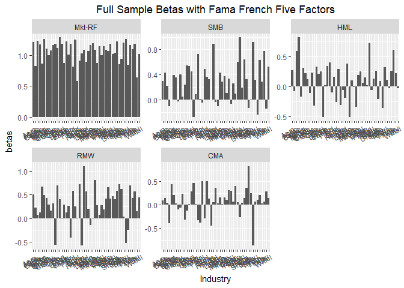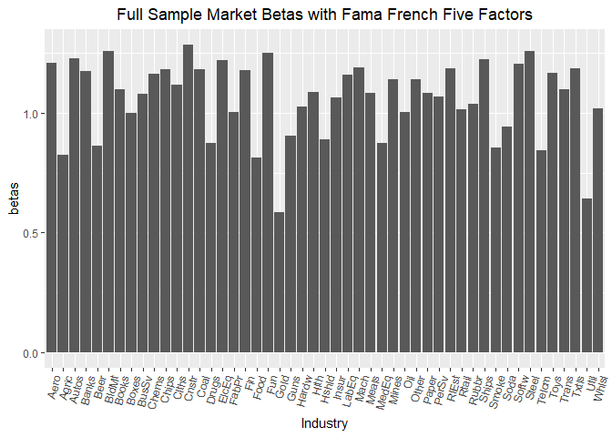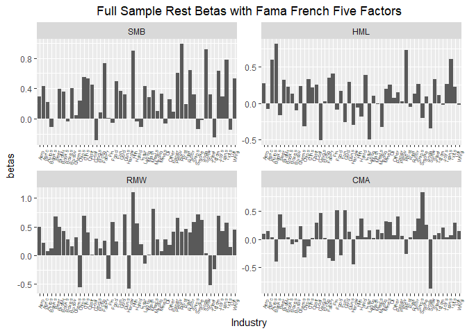

### 3.1.2 Rolling Window Estimation

We will show an example of the Real Estate Portfolio (RlEst) Rolling Betas evolutions here. The smoothing line is based on the loess smoothing. It seems that the betas are evolving overtime.

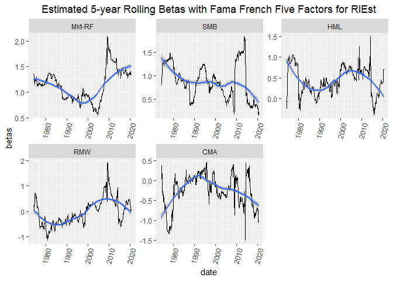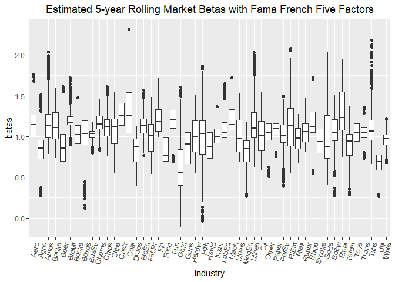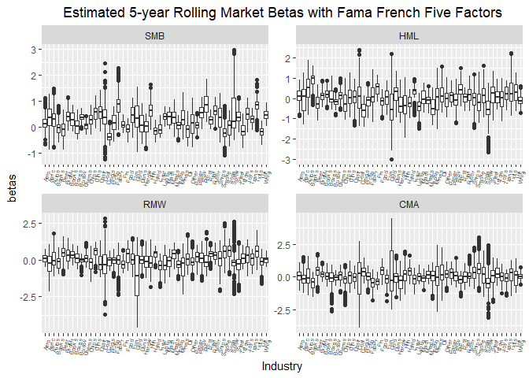

### 3.1.3 Full Sample Estimation with STL Trend

Here, we would try to conduct the STL decomposition before the first step regression with full sample.

<table class="table table-striped" style="font-size: 10px; width: auto !important; margin-left: auto; margin-right: auto;">
<caption style="font-size: initial !important;">
Fama French Five Factors
</caption>
<thead>
<tr>
<th style="border-bottom:hidden" colspan="1">
</th>
<th style="border-bottom:hidden; padding-bottom:0; padding-left:3px;padding-right:3px;text-align: center; " colspan="6">
Coefficients

</th>
<th style="border-bottom:hidden; padding-bottom:0; padding-left:3px;padding-right:3px;text-align: center; " colspan="6">
Std. Error

</th>
</tr>
<tr>
<th style="text-align:center;">
Industry
</th>
<th style="text-align:center;">
Alpha
</th>
<th style="text-align:center;">
Mkt-RF
</th>
<th style="text-align:center;">
SMB
</th>
<th style="text-align:center;">
HML
</th>
<th style="text-align:center;">
RMW
</th>
<th style="text-align:center;">
CMA
</th>
<th style="text-align:center;">
Alpha
</th>
<th style="text-align:center;">
Mkt-RF
</th>
<th style="text-align:center;">
SMB
</th>
<th style="text-align:center;">
HML
</th>
<th style="text-align:center;">
RMW
</th>
<th style="text-align:center;">
CMA
</th>
</tr>
</thead>
<tbody>
<tr>
<td style="text-align:center;font-weight: bold;">
Aero
</td>
<td style="text-align:center;">
-0.0012744
</td>
<td style="text-align:center;">
1.2746023
</td>
<td style="text-align:center;">
0.7838737
</td>
<td style="text-align:center;">
0.4368438
</td>
<td style="text-align:center;">
0.1528035
</td>
<td style="text-align:center;">
-0.2526696
</td>
<td style="text-align:center;">
0.0005832
</td>
<td style="text-align:center;">
0.0398914
</td>
<td style="text-align:center;">
0.0505159
</td>
<td style="text-align:center;">
0.0552370
</td>
<td style="text-align:center;">
0.0617538
</td>
<td style="text-align:center;">
0.0964317
</td>
</tr>
<tr>
<td style="text-align:center;font-weight: bold;">
Agric
</td>
<td style="text-align:center;">
0.0016461
</td>
<td style="text-align:center;">
0.5825164
</td>
<td style="text-align:center;">
0.1940582
</td>
<td style="text-align:center;">
0.3703844
</td>
<td style="text-align:center;">
0.4506982
</td>
<td style="text-align:center;">
-0.6421949
</td>
<td style="text-align:center;">
0.0006801
</td>
<td style="text-align:center;">
0.0465185
</td>
<td style="text-align:center;">
0.0589079
</td>
<td style="text-align:center;">
0.0644133
</td>
<td style="text-align:center;">
0.0720127
</td>
<td style="text-align:center;">
0.1124515
</td>
</tr>
<tr>
<td style="text-align:center;font-weight: bold;">
Autos
</td>
<td style="text-align:center;">
-0.0063620
</td>
<td style="text-align:center;">
1.5229823
</td>
<td style="text-align:center;">
0.0053461
</td>
<td style="text-align:center;">
-0.0961469
</td>
<td style="text-align:center;">
0.0515546
</td>
<td style="text-align:center;">
1.0865335
</td>
<td style="text-align:center;">
0.0006652
</td>
<td style="text-align:center;">
0.0455002
</td>
<td style="text-align:center;">
0.0576183
</td>
<td style="text-align:center;">
0.0630033
</td>
<td style="text-align:center;">
0.0704363
</td>
<td style="text-align:center;">
0.1099899
</td>
</tr>
<tr>
<td style="text-align:center;font-weight: bold;">
Banks
</td>
<td style="text-align:center;">
-0.0035956
</td>
<td style="text-align:center;">
1.2475803
</td>
<td style="text-align:center;">
0.0222035
</td>
<td style="text-align:center;">
0.6482096
</td>
<td style="text-align:center;">
0.4262404
</td>
<td style="text-align:center;">
-0.0975272
</td>
<td style="text-align:center;">
0.0003985
</td>
<td style="text-align:center;">
0.0272579
</td>
<td style="text-align:center;">
0.0345176
</td>
<td style="text-align:center;">
0.0377435
</td>
<td style="text-align:center;">
0.0421965
</td>
<td style="text-align:center;">
0.0658919
</td>
</tr>
<tr>
<td style="text-align:center;font-weight: bold;">
Beer
</td>
<td style="text-align:center;">
0.0000426
</td>
<td style="text-align:center;">
0.9099867
</td>
<td style="text-align:center;">
-0.3158099
</td>
<td style="text-align:center;">
-0.1920509
</td>
<td style="text-align:center;">
0.8565533
</td>
<td style="text-align:center;">
0.2840211
</td>
<td style="text-align:center;">
0.0004848
</td>
<td style="text-align:center;">
0.0331595
</td>
<td style="text-align:center;">
0.0419910
</td>
<td style="text-align:center;">
0.0459154
</td>
<td style="text-align:center;">
0.0513324
</td>
<td style="text-align:center;">
0.0801582
</td>
</tr>
<tr>
<td style="text-align:center;font-weight: bold;">
BldMt
</td>
<td style="text-align:center;">
-0.0038180
</td>
<td style="text-align:center;">
1.2256726
</td>
<td style="text-align:center;">
0.2746096
</td>
<td style="text-align:center;">
0.2072977
</td>
<td style="text-align:center;">
0.4985308
</td>
<td style="text-align:center;">
0.3151551
</td>
<td style="text-align:center;">
0.0003777
</td>
<td style="text-align:center;">
0.0258339
</td>
<td style="text-align:center;">
0.0327143
</td>
<td style="text-align:center;">
0.0357717
</td>
<td style="text-align:center;">
0.0399920
</td>
<td style="text-align:center;">
0.0624495
</td>
</tr>
<tr>
<td style="text-align:center;font-weight: bold;">
Books
</td>
<td style="text-align:center;">
-0.0071925
</td>
<td style="text-align:center;">
1.4360719
</td>
<td style="text-align:center;">
0.4600670
</td>
<td style="text-align:center;">
0.1423312
</td>
<td style="text-align:center;">
0.3140638
</td>
<td style="text-align:center;">
0.6229898
</td>
<td style="text-align:center;">
0.0004771
</td>
<td style="text-align:center;">
0.0326318
</td>
<td style="text-align:center;">
0.0413227
</td>
<td style="text-align:center;">
0.0451847
</td>
<td style="text-align:center;">
0.0505155
</td>
<td style="text-align:center;">
0.0788825
</td>
</tr>
<tr>
<td style="text-align:center;font-weight: bold;">
Boxes
</td>
<td style="text-align:center;">
-0.0016011
</td>
<td style="text-align:center;">
0.8638515
</td>
<td style="text-align:center;">
0.0407416
</td>
<td style="text-align:center;">
0.1523267
</td>
<td style="text-align:center;">
0.8222496
</td>
<td style="text-align:center;">
-0.0022294
</td>
<td style="text-align:center;">
0.0005539
</td>
<td style="text-align:center;">
0.0378871
</td>
<td style="text-align:center;">
0.0479777
</td>
<td style="text-align:center;">
0.0524616
</td>
<td style="text-align:center;">
0.0586510
</td>
<td style="text-align:center;">
0.0915865
</td>
</tr>
<tr>
<td style="text-align:center;font-weight: bold;">
BusSv
</td>
<td style="text-align:center;">
0.0003938
</td>
<td style="text-align:center;">
1.0525691
</td>
<td style="text-align:center;">
0.4724090
</td>
<td style="text-align:center;">
-0.1246758
</td>
<td style="text-align:center;">
0.0187068
</td>
<td style="text-align:center;">
-0.2174015
</td>
<td style="text-align:center;">
0.0002714
</td>
<td style="text-align:center;">
0.0185617
</td>
<td style="text-align:center;">
0.0235054
</td>
<td style="text-align:center;">
0.0257021
</td>
<td style="text-align:center;">
0.0287344
</td>
<td style="text-align:center;">
0.0448703
</td>
</tr>
<tr>
<td style="text-align:center;font-weight: bold;">
Chems
</td>
<td style="text-align:center;">
-0.0020329
</td>
<td style="text-align:center;">
1.0479814
</td>
<td style="text-align:center;">
0.0398632
</td>
<td style="text-align:center;">
0.0610439
</td>
<td style="text-align:center;">
0.3658636
</td>
<td style="text-align:center;">
0.3650244
</td>
<td style="text-align:center;">
0.0004627
</td>
<td style="text-align:center;">
0.0316450
</td>
<td style="text-align:center;">
0.0400731
</td>
<td style="text-align:center;">
0.0438183
</td>
<td style="text-align:center;">
0.0489880
</td>
<td style="text-align:center;">
0.0764972
</td>
</tr>
<tr>
<td style="text-align:center;font-weight: bold;">
Chips
</td>
<td style="text-align:center;">
0.0051885
</td>
<td style="text-align:center;">
1.1028458
</td>
<td style="text-align:center;">
0.3129494
</td>
<td style="text-align:center;">
-0.4482885
</td>
<td style="text-align:center;">
-0.9646289
</td>
<td style="text-align:center;">
-0.1232898
</td>
<td style="text-align:center;">
0.0005198
</td>
<td style="text-align:center;">
0.0355509
</td>
<td style="text-align:center;">
0.0450192
</td>
<td style="text-align:center;">
0.0492267
</td>
<td style="text-align:center;">
0.0550344
</td>
<td style="text-align:center;">
0.0859390
</td>
</tr>
<tr>
<td style="text-align:center;font-weight: bold;">
Clths
</td>
<td style="text-align:center;">
-0.0051112
</td>
<td style="text-align:center;">
1.3268703
</td>
<td style="text-align:center;">
0.7822894
</td>
<td style="text-align:center;">
-0.2454161
</td>
<td style="text-align:center;">
0.8865135
</td>
<td style="text-align:center;">
0.5414965
</td>
<td style="text-align:center;">
0.0005851
</td>
<td style="text-align:center;">
0.0400219
</td>
<td style="text-align:center;">
0.0506811
</td>
<td style="text-align:center;">
0.0554176
</td>
<td style="text-align:center;">
0.0619558
</td>
<td style="text-align:center;">
0.0967471
</td>
</tr>
<tr>
<td style="text-align:center;font-weight: bold;">
Cnstr
</td>
<td style="text-align:center;">
-0.0051172
</td>
<td style="text-align:center;">
1.2153172
</td>
<td style="text-align:center;">
0.6550769
</td>
<td style="text-align:center;">
-0.1314116
</td>
<td style="text-align:center;">
0.5204695
</td>
<td style="text-align:center;">
0.4787251
</td>
<td style="text-align:center;">
0.0007152
</td>
<td style="text-align:center;">
0.0489177
</td>
<td style="text-align:center;">
0.0619460
</td>
<td style="text-align:center;">
0.0677354
</td>
<td style="text-align:center;">
0.0757268
</td>
<td style="text-align:center;">
0.1182512
</td>
</tr>
<tr>
<td style="text-align:center;font-weight: bold;">
Coal
</td>
<td style="text-align:center;">
-0.0018927
</td>
<td style="text-align:center;">
0.5321811
</td>
<td style="text-align:center;">
0.7143574
</td>
<td style="text-align:center;">
0.6932167
</td>
<td style="text-align:center;">
-0.5017013
</td>
<td style="text-align:center;">
0.7875115
</td>
<td style="text-align:center;">
0.0017543
</td>
<td style="text-align:center;">
0.1199887
</td>
<td style="text-align:center;">
0.1519456
</td>
<td style="text-align:center;">
0.1661462
</td>
<td style="text-align:center;">
0.1857480
</td>
<td style="text-align:center;">
0.2900548
</td>
</tr>
<tr>
<td style="text-align:center;font-weight: bold;">
Drugs
</td>
<td style="text-align:center;">
0.0013358
</td>
<td style="text-align:center;">
0.8796435
</td>
<td style="text-align:center;">
-0.4621804
</td>
<td style="text-align:center;">
-0.3018292
</td>
<td style="text-align:center;">
0.5003218
</td>
<td style="text-align:center;">
0.3002915
</td>
<td style="text-align:center;">
0.0004381
</td>
<td style="text-align:center;">
0.0299632
</td>
<td style="text-align:center;">
0.0379434
</td>
<td style="text-align:center;">
0.0414896
</td>
<td style="text-align:center;">
0.0463845
</td>
<td style="text-align:center;">
0.0724317
</td>
</tr>
<tr>
<td style="text-align:center;font-weight: bold;">
ElcEq
</td>
<td style="text-align:center;">
0.0013447
</td>
<td style="text-align:center;">
1.1252624
</td>
<td style="text-align:center;">
0.1206725
</td>
<td style="text-align:center;">
-0.1124701
</td>
<td style="text-align:center;">
-0.0878487
</td>
<td style="text-align:center;">
0.1209728
</td>
<td style="text-align:center;">
0.0003518
</td>
<td style="text-align:center;">
0.0240609
</td>
<td style="text-align:center;">
0.0304691
</td>
<td style="text-align:center;">
0.0333167
</td>
<td style="text-align:center;">
0.0372474
</td>
<td style="text-align:center;">
0.0581637
</td>
</tr>
<tr>
<td style="text-align:center;font-weight: bold;">
FabPr
</td>
<td style="text-align:center;">
-0.0022332
</td>
<td style="text-align:center;">
0.8453990
</td>
<td style="text-align:center;">
0.7941666
</td>
<td style="text-align:center;">
0.3626176
</td>
<td style="text-align:center;">
0.1845480
</td>
<td style="text-align:center;">
-0.6243901
</td>
<td style="text-align:center;">
0.0007540
</td>
<td style="text-align:center;">
0.0515686
</td>
<td style="text-align:center;">
0.0653031
</td>
<td style="text-align:center;">
0.0714062
</td>
<td style="text-align:center;">
0.0798306
</td>
<td style="text-align:center;">
0.1246596
</td>
</tr>
<tr>
<td style="text-align:center;font-weight: bold;">
Fin
</td>
<td style="text-align:center;">
-0.0002833
</td>
<td style="text-align:center;">
1.2562560
</td>
<td style="text-align:center;">
0.3107899
</td>
<td style="text-align:center;">
0.5251945
</td>
<td style="text-align:center;">
-0.0987906
</td>
<td style="text-align:center;">
-0.3650579
</td>
<td style="text-align:center;">
0.0004104
</td>
<td style="text-align:center;">
0.0280679
</td>
<td style="text-align:center;">
0.0355434
</td>
<td style="text-align:center;">
0.0388652
</td>
<td style="text-align:center;">
0.0434505
</td>
<td style="text-align:center;">
0.0678501
</td>
</tr>
<tr>
<td style="text-align:center;font-weight: bold;">
Food
</td>
<td style="text-align:center;">
-0.0017027
</td>
<td style="text-align:center;">
0.8819056
</td>
<td style="text-align:center;">
-0.1021610
</td>
<td style="text-align:center;">
0.1128245
</td>
<td style="text-align:center;">
0.7741909
</td>
<td style="text-align:center;">
0.4490797
</td>
<td style="text-align:center;">
0.0004269
</td>
<td style="text-align:center;">
0.0291978
</td>
<td style="text-align:center;">
0.0369741
</td>
<td style="text-align:center;">
0.0404297
</td>
<td style="text-align:center;">
0.0451995
</td>
<td style="text-align:center;">
0.0705813
</td>
</tr>
<tr>
<td style="text-align:center;font-weight: bold;">
Fun
</td>
<td style="text-align:center;">
-0.0013404
</td>
<td style="text-align:center;">
1.4377854
</td>
<td style="text-align:center;">
0.5898860
</td>
<td style="text-align:center;">
-0.0394015
</td>
<td style="text-align:center;">
0.3859710
</td>
<td style="text-align:center;">
0.4124550
</td>
<td style="text-align:center;">
0.0007257
</td>
<td style="text-align:center;">
0.0496341
</td>
<td style="text-align:center;">
0.0628533
</td>
<td style="text-align:center;">
0.0687275
</td>
<td style="text-align:center;">
0.0768359
</td>
<td style="text-align:center;">
0.1199831
</td>
</tr>
<tr>
<td style="text-align:center;font-weight: bold;">
Gold
</td>
<td style="text-align:center;">
0.0003135
</td>
<td style="text-align:center;">
0.3543018
</td>
<td style="text-align:center;">
0.7289414
</td>
<td style="text-align:center;">
-1.0938949
</td>
<td style="text-align:center;">
0.2666569
</td>
<td style="text-align:center;">
1.4469401
</td>
<td style="text-align:center;">
0.0013482
</td>
<td style="text-align:center;">
0.0922090
</td>
<td style="text-align:center;">
0.1167674
</td>
<td style="text-align:center;">
0.1276803
</td>
<td style="text-align:center;">
0.1427438
</td>
<td style="text-align:center;">
0.2229017
</td>
</tr>
<tr>
<td style="text-align:center;font-weight: bold;">
Guns
</td>
<td style="text-align:center;">
-0.0000274
</td>
<td style="text-align:center;">
0.8382648
</td>
<td style="text-align:center;">
0.5745523
</td>
<td style="text-align:center;">
0.3837487
</td>
<td style="text-align:center;">
0.9507868
</td>
<td style="text-align:center;">
-0.0017038
</td>
<td style="text-align:center;">
0.0007288
</td>
<td style="text-align:center;">
0.0498491
</td>
<td style="text-align:center;">
0.0631255
</td>
<td style="text-align:center;">
0.0690251
</td>
<td style="text-align:center;">
0.0771686
</td>
<td style="text-align:center;">
0.1205027
</td>
</tr>
<tr>
<td style="text-align:center;font-weight: bold;">
Hardw
</td>
<td style="text-align:center;">
0.0029049
</td>
<td style="text-align:center;">
1.0231410
</td>
<td style="text-align:center;">
-0.0714698
</td>
<td style="text-align:center;">
-0.3301447
</td>
<td style="text-align:center;">
-0.7731021
</td>
<td style="text-align:center;">
-0.0904900
</td>
<td style="text-align:center;">
0.0006809
</td>
<td style="text-align:center;">
0.0465711
</td>
<td style="text-align:center;">
0.0589745
</td>
<td style="text-align:center;">
0.0644861
</td>
<td style="text-align:center;">
0.0720941
</td>
<td style="text-align:center;">
0.1125786
</td>
</tr>
<tr>
<td style="text-align:center;font-weight: bold;">
Hlth
</td>
<td style="text-align:center;">
-0.0037975
</td>
<td style="text-align:center;">
0.9715977
</td>
<td style="text-align:center;">
1.7326988
</td>
<td style="text-align:center;">
-0.4383371
</td>
<td style="text-align:center;">
0.8772680
</td>
<td style="text-align:center;">
0.3348111
</td>
<td style="text-align:center;">
0.0008389
</td>
<td style="text-align:center;">
0.0573801
</td>
<td style="text-align:center;">
0.0726623
</td>
<td style="text-align:center;">
0.0794532
</td>
<td style="text-align:center;">
0.0888270
</td>
<td style="text-align:center;">
0.1387078
</td>
</tr>
<tr>
<td style="text-align:center;font-weight: bold;">
Hshld
</td>
<td style="text-align:center;">
-0.0031805
</td>
<td style="text-align:center;">
0.9866357
</td>
<td style="text-align:center;">
-0.1890740
</td>
<td style="text-align:center;">
-0.0956830
</td>
<td style="text-align:center;">
0.7730199
</td>
<td style="text-align:center;">
0.3177266
</td>
<td style="text-align:center;">
0.0003387
</td>
<td style="text-align:center;">
0.0231688
</td>
<td style="text-align:center;">
0.0293394
</td>
<td style="text-align:center;">
0.0320815
</td>
<td style="text-align:center;">
0.0358664
</td>
<td style="text-align:center;">
0.0560072
</td>
</tr>
<tr>
<td style="text-align:center;font-weight: bold;">
Insur
</td>
<td style="text-align:center;">
-0.0013155
</td>
<td style="text-align:center;">
1.1047316
</td>
<td style="text-align:center;">
0.2299386
</td>
<td style="text-align:center;">
0.4954510
</td>
<td style="text-align:center;">
0.3090722
</td>
<td style="text-align:center;">
-0.1726943
</td>
<td style="text-align:center;">
0.0003704
</td>
<td style="text-align:center;">
0.0253312
</td>
<td style="text-align:center;">
0.0320778
</td>
<td style="text-align:center;">
0.0350757
</td>
<td style="text-align:center;">
0.0392139
</td>
<td style="text-align:center;">
0.0612345
</td>
</tr>
<tr>
<td style="text-align:center;font-weight: bold;">
LabEq
</td>
<td style="text-align:center;">
0.0027968
</td>
<td style="text-align:center;">
0.9891841
</td>
<td style="text-align:center;">
0.4782318
</td>
<td style="text-align:center;">
-0.3755583
</td>
<td style="text-align:center;">
-0.4922250
</td>
<td style="text-align:center;">
0.0922078
</td>
<td style="text-align:center;">
0.0004329
</td>
<td style="text-align:center;">
0.0296092
</td>
<td style="text-align:center;">
0.0374951
</td>
<td style="text-align:center;">
0.0409993
</td>
<td style="text-align:center;">
0.0458364
</td>
<td style="text-align:center;">
0.0715758
</td>
</tr>
<tr>
<td style="text-align:center;font-weight: bold;">
Mach
</td>
<td style="text-align:center;">
-0.0008106
</td>
<td style="text-align:center;">
1.0301561
</td>
<td style="text-align:center;">
0.3575171
</td>
<td style="text-align:center;">
-0.0547854
</td>
<td style="text-align:center;">
-0.0325099
</td>
<td style="text-align:center;">
0.2949105
</td>
<td style="text-align:center;">
0.0005178
</td>
<td style="text-align:center;">
0.0354144
</td>
<td style="text-align:center;">
0.0448464
</td>
<td style="text-align:center;">
0.0490377
</td>
<td style="text-align:center;">
0.0548231
</td>
<td style="text-align:center;">
0.0856091
</td>
</tr>
<tr>
<td style="text-align:center;font-weight: bold;">
Meals
</td>
<td style="text-align:center;">
-0.0016492
</td>
<td style="text-align:center;">
1.0737487
</td>
<td style="text-align:center;">
0.5459601
</td>
<td style="text-align:center;">
0.1001046
</td>
<td style="text-align:center;">
0.6242171
</td>
<td style="text-align:center;">
-0.1737008
</td>
<td style="text-align:center;">
0.0005212
</td>
<td style="text-align:center;">
0.0356514
</td>
<td style="text-align:center;">
0.0451466
</td>
<td style="text-align:center;">
0.0493659
</td>
<td style="text-align:center;">
0.0551901
</td>
<td style="text-align:center;">
0.0861821
</td>
</tr>
<tr>
<td style="text-align:center;font-weight: bold;">
MedEq
</td>
<td style="text-align:center;">
0.0014561
</td>
<td style="text-align:center;">
0.8053431
</td>
<td style="text-align:center;">
-0.0565824
</td>
<td style="text-align:center;">
-0.3375237
</td>
<td style="text-align:center;">
0.5326186
</td>
<td style="text-align:center;">
0.1033913
</td>
<td style="text-align:center;">
0.0005539
</td>
<td style="text-align:center;">
0.0378871
</td>
<td style="text-align:center;">
0.0479777
</td>
<td style="text-align:center;">
0.0524616
</td>
<td style="text-align:center;">
0.0586510
</td>
<td style="text-align:center;">
0.0915865
</td>
</tr>
<tr>
<td style="text-align:center;font-weight: bold;">
Mines
</td>
<td style="text-align:center;">
0.0014572
</td>
<td style="text-align:center;">
0.7813628
</td>
<td style="text-align:center;">
0.2534132
</td>
<td style="text-align:center;">
0.1187663
</td>
<td style="text-align:center;">
-0.2251123
</td>
<td style="text-align:center;">
0.0825557
</td>
<td style="text-align:center;">
0.0009507
</td>
<td style="text-align:center;">
0.0650268
</td>
<td style="text-align:center;">
0.0823456
</td>
<td style="text-align:center;">
0.0900415
</td>
<td style="text-align:center;">
0.1006645
</td>
<td style="text-align:center;">
0.1571928
</td>
</tr>
<tr>
<td style="text-align:center;font-weight: bold;">
Oil
</td>
<td style="text-align:center;">
-0.0004014
</td>
<td style="text-align:center;">
0.7991301
</td>
<td style="text-align:center;">
0.2298170
</td>
<td style="text-align:center;">
0.4364659
</td>
<td style="text-align:center;">
0.0717533
</td>
<td style="text-align:center;">
-0.1674800
</td>
<td style="text-align:center;">
0.0006965
</td>
<td style="text-align:center;">
0.0476356
</td>
<td style="text-align:center;">
0.0603226
</td>
<td style="text-align:center;">
0.0659602
</td>
<td style="text-align:center;">
0.0737421
</td>
<td style="text-align:center;">
0.1151521
</td>
</tr>
<tr>
<td style="text-align:center;font-weight: bold;">
Other
</td>
<td style="text-align:center;">
-0.0095963
</td>
<td style="text-align:center;">
1.4180793
</td>
<td style="text-align:center;">
0.4039311
</td>
<td style="text-align:center;">
0.0269255
</td>
<td style="text-align:center;">
0.4086910
</td>
<td style="text-align:center;">
0.1984780
</td>
<td style="text-align:center;">
0.0006627
</td>
<td style="text-align:center;">
0.0453283
</td>
<td style="text-align:center;">
0.0574007
</td>
<td style="text-align:center;">
0.0627653
</td>
<td style="text-align:center;">
0.0701702
</td>
<td style="text-align:center;">
0.1095744
</td>
</tr>
<tr>
<td style="text-align:center;font-weight: bold;">
Paper
</td>
<td style="text-align:center;">
-0.0025994
</td>
<td style="text-align:center;">
0.9960178
</td>
<td style="text-align:center;">
0.0411842
</td>
<td style="text-align:center;">
0.1656356
</td>
<td style="text-align:center;">
0.1961619
</td>
<td style="text-align:center;">
0.5961679
</td>
<td style="text-align:center;">
0.0004124
</td>
<td style="text-align:center;">
0.0282042
</td>
<td style="text-align:center;">
0.0357159
</td>
<td style="text-align:center;">
0.0390538
</td>
<td style="text-align:center;">
0.0436613
</td>
<td style="text-align:center;">
0.0681794
</td>
</tr>
<tr>
<td style="text-align:center;font-weight: bold;">
PerSv
</td>
<td style="text-align:center;">
-0.0087342
</td>
<td style="text-align:center;">
1.0919539
</td>
<td style="text-align:center;">
1.1387105
</td>
<td style="text-align:center;">
0.2900208
</td>
<td style="text-align:center;">
0.8993240
</td>
<td style="text-align:center;">
-0.0887214
</td>
<td style="text-align:center;">
0.0006290
</td>
<td style="text-align:center;">
0.0430207
</td>
<td style="text-align:center;">
0.0544786
</td>
<td style="text-align:center;">
0.0595700
</td>
<td style="text-align:center;">
0.0665980
</td>
<td style="text-align:center;">
0.1039962
</td>
</tr>
<tr>
<td style="text-align:center;font-weight: bold;">
RlEst
</td>
<td style="text-align:center;">
-0.0107579
</td>
<td style="text-align:center;">
1.4524244
</td>
<td style="text-align:center;">
1.4426993
</td>
<td style="text-align:center;">
0.3381476
</td>
<td style="text-align:center;">
0.5862133
</td>
<td style="text-align:center;">
-0.1133795
</td>
<td style="text-align:center;">
0.0006743
</td>
<td style="text-align:center;">
0.0461230
</td>
<td style="text-align:center;">
0.0584070
</td>
<td style="text-align:center;">
0.0638657
</td>
<td style="text-align:center;">
0.0714005
</td>
<td style="text-align:center;">
0.1114954
</td>
</tr>
<tr>
<td style="text-align:center;font-weight: bold;">
Rtail
</td>
<td style="text-align:center;">
-0.0006359
</td>
<td style="text-align:center;">
1.0737444
</td>
<td style="text-align:center;">
-0.0120757
</td>
<td style="text-align:center;">
-0.2910815
</td>
<td style="text-align:center;">
0.4432776
</td>
<td style="text-align:center;">
0.4689517
</td>
<td style="text-align:center;">
0.0004659
</td>
<td style="text-align:center;">
0.0318637
</td>
<td style="text-align:center;">
0.0403500
</td>
<td style="text-align:center;">
0.0441211
</td>
<td style="text-align:center;">
0.0493264
</td>
<td style="text-align:center;">
0.0770257
</td>
</tr>
<tr>
<td style="text-align:center;font-weight: bold;">
Rubbr
</td>
<td style="text-align:center;">
-0.0030373
</td>
<td style="text-align:center;">
1.1609331
</td>
<td style="text-align:center;">
0.3844679
</td>
<td style="text-align:center;">
-0.0232771
</td>
<td style="text-align:center;">
0.5958614
</td>
<td style="text-align:center;">
0.2990171
</td>
<td style="text-align:center;">
0.0004376
</td>
<td style="text-align:center;">
0.0299333
</td>
<td style="text-align:center;">
0.0379055
</td>
<td style="text-align:center;">
0.0414481
</td>
<td style="text-align:center;">
0.0463381
</td>
<td style="text-align:center;">
0.0723593
</td>
</tr>
<tr>
<td style="text-align:center;font-weight: bold;">
Ships
</td>
<td style="text-align:center;">
-0.0014874
</td>
<td style="text-align:center;">
0.9450218
</td>
<td style="text-align:center;">
0.4640843
</td>
<td style="text-align:center;">
0.5768058
</td>
<td style="text-align:center;">
0.3004754
</td>
<td style="text-align:center;">
-0.0191941
</td>
<td style="text-align:center;">
0.0007598
</td>
<td style="text-align:center;">
0.0519653
</td>
<td style="text-align:center;">
0.0658053
</td>
<td style="text-align:center;">
0.0719554
</td>
<td style="text-align:center;">
0.0804446
</td>
<td style="text-align:center;">
0.1256183
</td>
</tr>
<tr>
<td style="text-align:center;font-weight: bold;">
Smoke
</td>
<td style="text-align:center;">
-0.0005108
</td>
<td style="text-align:center;">
0.8046435
</td>
<td style="text-align:center;">
-0.1273409
</td>
<td style="text-align:center;">
0.0620524
</td>
<td style="text-align:center;">
1.2041922
</td>
<td style="text-align:center;">
0.8914597
</td>
<td style="text-align:center;">
0.0006825
</td>
<td style="text-align:center;">
0.0466837
</td>
<td style="text-align:center;">
0.0591171
</td>
<td style="text-align:center;">
0.0646421
</td>
<td style="text-align:center;">
0.0722685
</td>
<td style="text-align:center;">
0.1128509
</td>
</tr>
<tr>
<td style="text-align:center;font-weight: bold;">
Soda
</td>
<td style="text-align:center;">
-0.0027393
</td>
<td style="text-align:center;">
1.0846754
</td>
<td style="text-align:center;">
-0.2058664
</td>
<td style="text-align:center;">
0.3111747
</td>
<td style="text-align:center;">
1.0775496
</td>
<td style="text-align:center;">
0.1498779
</td>
<td style="text-align:center;">
0.0006174
</td>
<td style="text-align:center;">
0.0422302
</td>
<td style="text-align:center;">
0.0534775
</td>
<td style="text-align:center;">
0.0584754
</td>
<td style="text-align:center;">
0.0653743
</td>
<td style="text-align:center;">
0.1020853
</td>
</tr>
<tr>
<td style="text-align:center;font-weight: bold;">
Softw
</td>
<td style="text-align:center;">
-0.0000276
</td>
<td style="text-align:center;">
1.3867136
</td>
<td style="text-align:center;">
0.9454751
</td>
<td style="text-align:center;">
-0.9717346
</td>
<td style="text-align:center;">
0.1336157
</td>
<td style="text-align:center;">
0.0082342
</td>
<td style="text-align:center;">
0.0009466
</td>
<td style="text-align:center;">
0.0647470
</td>
<td style="text-align:center;">
0.0819912
</td>
<td style="text-align:center;">
0.0896540
</td>
<td style="text-align:center;">
0.1002313
</td>
<td style="text-align:center;">
0.1565162
</td>
</tr>
<tr>
<td style="text-align:center;font-weight: bold;">
Steel
</td>
<td style="text-align:center;">
-0.0002085
</td>
<td style="text-align:center;">
0.9130251
</td>
<td style="text-align:center;">
0.2016566
</td>
<td style="text-align:center;">
0.4352389
</td>
<td style="text-align:center;">
-1.0450994
</td>
<td style="text-align:center;">
-0.0849308
</td>
<td style="text-align:center;">
0.0007098
</td>
<td style="text-align:center;">
0.0485491
</td>
<td style="text-align:center;">
0.0614794
</td>
<td style="text-align:center;">
0.0672251
</td>
<td style="text-align:center;">
0.0751563
</td>
<td style="text-align:center;">
0.1173603
</td>
</tr>
<tr>
<td style="text-align:center;font-weight: bold;">
Telcm
</td>
<td style="text-align:center;">
0.0025699
</td>
<td style="text-align:center;">
0.8743257
</td>
<td style="text-align:center;">
-0.4497129
</td>
<td style="text-align:center;">
0.3961693
</td>
<td style="text-align:center;">
-0.6882968
</td>
<td style="text-align:center;">
-0.1586806
</td>
<td style="text-align:center;">
0.0004282
</td>
<td style="text-align:center;">
0.0292864
</td>
<td style="text-align:center;">
0.0370863
</td>
<td style="text-align:center;">
0.0405524
</td>
<td style="text-align:center;">
0.0453367
</td>
<td style="text-align:center;">
0.0707955
</td>
</tr>
<tr>
<td style="text-align:center;font-weight: bold;">
Toys
</td>
<td style="text-align:center;">
-0.0087620
</td>
<td style="text-align:center;">
1.3071589
</td>
<td style="text-align:center;">
0.5646103
</td>
<td style="text-align:center;">
-0.1051569
</td>
<td style="text-align:center;">
0.8874877
</td>
<td style="text-align:center;">
0.8351548
</td>
<td style="text-align:center;">
0.0005863
</td>
<td style="text-align:center;">
0.0401014
</td>
<td style="text-align:center;">
0.0507818
</td>
<td style="text-align:center;">
0.0555278
</td>
<td style="text-align:center;">
0.0620789
</td>
<td style="text-align:center;">
0.0969393
</td>
</tr>
<tr>
<td style="text-align:center;font-weight: bold;">
Trans
</td>
<td style="text-align:center;">
-0.0031360
</td>
<td style="text-align:center;">
1.0916931
</td>
<td style="text-align:center;">
0.5913613
</td>
<td style="text-align:center;">
0.2065672
</td>
<td style="text-align:center;">
0.4650208
</td>
<td style="text-align:center;">
-0.0213421
</td>
<td style="text-align:center;">
0.0004102
</td>
<td style="text-align:center;">
0.0280594
</td>
<td style="text-align:center;">
0.0355325
</td>
<td style="text-align:center;">
0.0388533
</td>
<td style="text-align:center;">
0.0434372
</td>
<td style="text-align:center;">
0.0678293
</td>
</tr>
<tr>
<td style="text-align:center;font-weight: bold;">
Txtls
</td>
<td style="text-align:center;">
-0.0074781
</td>
<td style="text-align:center;">
1.3437515
</td>
<td style="text-align:center;">
0.6048901
</td>
<td style="text-align:center;">
0.4749820
</td>
<td style="text-align:center;">
0.5932878
</td>
<td style="text-align:center;">
0.5394235
</td>
<td style="text-align:center;">
0.0007141
</td>
<td style="text-align:center;">
0.0488452
</td>
<td style="text-align:center;">
0.0618543
</td>
<td style="text-align:center;">
0.0676351
</td>
<td style="text-align:center;">
0.0756146
</td>
<td style="text-align:center;">
0.1180760
</td>
</tr>
<tr>
<td style="text-align:center;font-weight: bold;">
Util
</td>
<td style="text-align:center;">
-0.0007362
</td>
<td style="text-align:center;">
0.7831676
</td>
<td style="text-align:center;">
0.0052637
</td>
<td style="text-align:center;">
0.4875585
</td>
<td style="text-align:center;">
0.1963733
</td>
<td style="text-align:center;">
-0.1634922
</td>
<td style="text-align:center;">
0.0003874
</td>
<td style="text-align:center;">
0.0264995
</td>
<td style="text-align:center;">
0.0335572
</td>
<td style="text-align:center;">
0.0366934
</td>
<td style="text-align:center;">
0.0410224
</td>
<td style="text-align:center;">
0.0640586
</td>
</tr>
<tr>
<td style="text-align:center;font-weight: bold;">
Whlsl
</td>
<td style="text-align:center;">
-0.0024205
</td>
<td style="text-align:center;">
1.0757804
</td>
<td style="text-align:center;">
0.5633473
</td>
<td style="text-align:center;">
0.0179133
</td>
<td style="text-align:center;">
0.1885198
</td>
<td style="text-align:center;">
0.1895158
</td>
<td style="text-align:center;">
0.0003568
</td>
<td style="text-align:center;">
0.0244072
</td>
<td style="text-align:center;">
0.0309077
</td>
<td style="text-align:center;">
0.0337962
</td>
<td style="text-align:center;">
0.0377835
</td>
<td style="text-align:center;">
0.0590008
</td>
</tr>
</tbody>
</table>
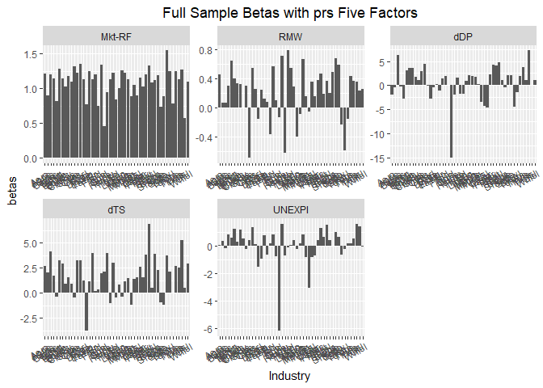

### 3.1.4 Rolling Window Estimation with STL Trend

Here, we would try to conduct the STL decomposition before the first step regression with full sample.

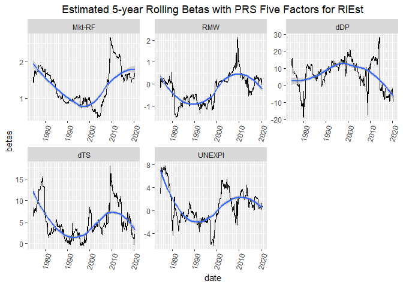

### 3.2 PRS Five Factor Model

We will then apply the PRS Five Factor Model to estimate the betas.

### 3.2.1 Full Sample Estimation

<table class="table table-striped" style="font-size: 10px; width: auto !important; margin-left: auto; margin-right: auto;">
<caption style="font-size: initial !important;">
PRS Five Factors
</caption>
<thead>
<tr>
<th style="border-bottom:hidden" colspan="1">
</th>
<th style="border-bottom:hidden; padding-bottom:0; padding-left:3px;padding-right:3px;text-align: center; " colspan="6">
Coefficients

</th>
<th style="border-bottom:hidden; padding-bottom:0; padding-left:3px;padding-right:3px;text-align: center; " colspan="6">
Std. Error

</th>
</tr>
<tr>
<th style="text-align:center;">
Industry
</th>
<th style="text-align:center;">
Alpha
</th>
<th style="text-align:center;">
Mkt-RF
</th>
<th style="text-align:center;">
RMW
</th>
<th style="text-align:center;">
dDP
</th>
<th style="text-align:center;">
dTS
</th>
<th style="text-align:center;">
UNEXPI
</th>
<th style="text-align:center;">
Alpha
</th>
<th style="text-align:center;">
Mkt-RF
</th>
<th style="text-align:center;">
RMW
</th>
<th style="text-align:center;">
dDP
</th>
<th style="text-align:center;">
dTS
</th>
<th style="text-align:center;">
UNEXPI
</th>
</tr>
</thead>
<tbody>
<tr>
<td style="text-align:center;font-weight: bold;">
Aero
</td>
<td style="text-align:center;">
-0.0007264
</td>
<td style="text-align:center;">
1.2147906
</td>
<td style="text-align:center;">
0.4597678
</td>
<td style="text-align:center;">
-1.8739102
</td>
<td style="text-align:center;">
2.6544959
</td>
<td style="text-align:center;">
0.0695108
</td>
<td style="text-align:center;">
0.0017926
</td>
<td style="text-align:center;">
0.0413396
</td>
<td style="text-align:center;">
0.0827289
</td>
<td style="text-align:center;">
1.6994957
</td>
<td style="text-align:center;">
0.7471528
</td>
<td style="text-align:center;">
0.5863563
</td>
</tr>
<tr>
<td style="text-align:center;font-weight: bold;">
Agric
</td>
<td style="text-align:center;">
0.0000335
</td>
<td style="text-align:center;">
0.8921762
</td>
<td style="text-align:center;">
0.0717091
</td>
<td style="text-align:center;">
-0.4604342
</td>
<td style="text-align:center;">
2.0589033
</td>
<td style="text-align:center;">
0.3395515
</td>
<td style="text-align:center;">
0.0021284
</td>
<td style="text-align:center;">
0.0490841
</td>
<td style="text-align:center;">
0.0982271
</td>
<td style="text-align:center;">
2.0178759
</td>
<td style="text-align:center;">
0.8871230
</td>
<td style="text-align:center;">
0.6962031
</td>
</tr>
<tr>
<td style="text-align:center;font-weight: bold;">
Autos
</td>
<td style="text-align:center;">
-0.0030572
</td>
<td style="text-align:center;">
1.1977989
</td>
<td style="text-align:center;">
0.0672278
</td>
<td style="text-align:center;">
6.3544567
</td>
<td style="text-align:center;">
4.1598356
</td>
<td style="text-align:center;">
-0.1737414
</td>
<td style="text-align:center;">
0.0019354
</td>
<td style="text-align:center;">
0.0446335
</td>
<td style="text-align:center;">
0.0893205
</td>
<td style="text-align:center;">
1.8349080
</td>
<td style="text-align:center;">
0.8066844
</td>
<td style="text-align:center;">
0.6330759
</td>
</tr>
<tr>
<td style="text-align:center;font-weight: bold;">
Banks
</td>
<td style="text-align:center;">
-0.0017131
</td>
<td style="text-align:center;">
1.1446243
</td>
<td style="text-align:center;">
0.3036716
</td>
<td style="text-align:center;">
-0.2118326
</td>
<td style="text-align:center;">
1.6994764
</td>
<td style="text-align:center;">
0.8416676
</td>
<td style="text-align:center;">
0.0015119
</td>
<td style="text-align:center;">
0.0348658
</td>
<td style="text-align:center;">
0.0697734
</td>
<td style="text-align:center;">
1.4333525
</td>
<td style="text-align:center;">
0.6301478
</td>
<td style="text-align:center;">
0.4945321
</td>
</tr>
<tr>
<td style="text-align:center;font-weight: bold;">
Beer
</td>
<td style="text-align:center;">
0.0013533
</td>
<td style="text-align:center;">
0.8163077
</td>
<td style="text-align:center;">
0.6502316
</td>
<td style="text-align:center;">
-2.7713156
</td>
<td style="text-align:center;">
-0.3550530
</td>
<td style="text-align:center;">
0.5748237
</td>
<td style="text-align:center;">
0.0015697
</td>
<td style="text-align:center;">
0.0361980
</td>
<td style="text-align:center;">
0.0724395
</td>
<td style="text-align:center;">
1.4881224
</td>
<td style="text-align:center;">
0.6542264
</td>
<td style="text-align:center;">
0.5134287
</td>
</tr>
<tr>
<td style="text-align:center;font-weight: bold;">
BldMt
</td>
<td style="text-align:center;">
-0.0030308
</td>
<td style="text-align:center;">
1.2794322
</td>
<td style="text-align:center;">
0.3978284
</td>
<td style="text-align:center;">
3.0432575
</td>
<td style="text-align:center;">
3.2402758
</td>
<td style="text-align:center;">
1.2188895
</td>
<td style="text-align:center;">
0.0013397
</td>
<td style="text-align:center;">
0.0308961
</td>
<td style="text-align:center;">
0.0618293
</td>
<td style="text-align:center;">
1.2701560
</td>
<td style="text-align:center;">
0.5584013
</td>
<td style="text-align:center;">
0.4382264
</td>
</tr>
<tr>
<td style="text-align:center;font-weight: bold;">
Books
</td>
<td style="text-align:center;">
-0.0036651
</td>
<td style="text-align:center;">
1.1403166
</td>
<td style="text-align:center;">
0.3344491
</td>
<td style="text-align:center;">
3.5192625
</td>
<td style="text-align:center;">
2.8975915
</td>
<td style="text-align:center;">
0.3071983
</td>
<td style="text-align:center;">
0.0013751
</td>
<td style="text-align:center;">
0.0317113
</td>
<td style="text-align:center;">
0.0634607
</td>
<td style="text-align:center;">
1.3036699
</td>
<td style="text-align:center;">
0.5731351
</td>
<td style="text-align:center;">
0.4497893
</td>
</tr>
<tr>
<td style="text-align:center;font-weight: bold;">
Boxes
</td>
<td style="text-align:center;">
-0.0012003
</td>
<td style="text-align:center;">
1.0266425
</td>
<td style="text-align:center;">
0.3245770
</td>
<td style="text-align:center;">
3.6059226
</td>
<td style="text-align:center;">
0.9489560
</td>
<td style="text-align:center;">
1.1834596
</td>
<td style="text-align:center;">
0.0015292
</td>
<td style="text-align:center;">
0.0352642
</td>
<td style="text-align:center;">
0.0705708
</td>
<td style="text-align:center;">
1.4497331
</td>
<td style="text-align:center;">
0.6373492
</td>
<td style="text-align:center;">
0.5001837
</td>
</tr>
<tr>
<td style="text-align:center;font-weight: bold;">
BusSv
</td>
<td style="text-align:center;">
-0.0009844
</td>
<td style="text-align:center;">
1.1808188
</td>
<td style="text-align:center;">
0.0052199
</td>
<td style="text-align:center;">
1.8003838
</td>
<td style="text-align:center;">
1.5340027
</td>
<td style="text-align:center;">
0.5431220
</td>
<td style="text-align:center;">
0.0009649
</td>
<td style="text-align:center;">
0.0222521
</td>
<td style="text-align:center;">
0.0445309
</td>
<td style="text-align:center;">
0.9147962
</td>
<td style="text-align:center;">
0.4021738
</td>
<td style="text-align:center;">
0.3156210
</td>
</tr>
<tr>
<td style="text-align:center;font-weight: bold;">
Chems
</td>
<td style="text-align:center;">
-0.0010222
</td>
<td style="text-align:center;">
1.0942887
</td>
<td style="text-align:center;">
0.3027224
</td>
<td style="text-align:center;">
1.0268845
</td>
<td style="text-align:center;">
0.9222256
</td>
<td style="text-align:center;">
-0.2436988
</td>
<td style="text-align:center;">
0.0013039
</td>
<td style="text-align:center;">
0.0300690
</td>
<td style="text-align:center;">
0.0601741
</td>
<td style="text-align:center;">
1.2361550
</td>
<td style="text-align:center;">
0.5434534
</td>
<td style="text-align:center;">
0.4264955
</td>
</tr>
<tr>
<td style="text-align:center;font-weight: bold;">
Chips
</td>
<td style="text-align:center;">
0.0020900
</td>
<td style="text-align:center;">
1.3194837
</td>
<td style="text-align:center;">
-0.6845575
</td>
<td style="text-align:center;">
2.9293268
</td>
<td style="text-align:center;">
-0.4209634
</td>
<td style="text-align:center;">
0.4134730
</td>
<td style="text-align:center;">
0.0016303
</td>
<td style="text-align:center;">
0.0375961
</td>
<td style="text-align:center;">
0.0752373
</td>
<td style="text-align:center;">
1.5455977
</td>
<td style="text-align:center;">
0.6794943
</td>
<td style="text-align:center;">
0.5332587
</td>
</tr>
<tr>
<td style="text-align:center;font-weight: bold;">
Clths
</td>
<td style="text-align:center;">
-0.0025929
</td>
<td style="text-align:center;">
1.2208061
</td>
<td style="text-align:center;">
0.5499887
</td>
<td style="text-align:center;">
4.4649420
</td>
<td style="text-align:center;">
3.2403675
</td>
<td style="text-align:center;">
1.3608807
</td>
<td style="text-align:center;">
0.0017273
</td>
<td style="text-align:center;">
0.0398331
</td>
<td style="text-align:center;">
0.0797139
</td>
<td style="text-align:center;">
1.6375599
</td>
<td style="text-align:center;">
0.7199239
</td>
<td style="text-align:center;">
0.5649873
</td>
</tr>
<tr>
<td style="text-align:center;font-weight: bold;">
Cnstr
</td>
<td style="text-align:center;">
-0.0036864
</td>
<td style="text-align:center;">
1.3485988
</td>
<td style="text-align:center;">
0.2583720
</td>
<td style="text-align:center;">
-0.0810328
</td>
<td style="text-align:center;">
3.2723505
</td>
<td style="text-align:center;">
0.0993218
</td>
<td style="text-align:center;">
0.0018049
</td>
<td style="text-align:center;">
0.0416221
</td>
<td style="text-align:center;">
0.0832942
</td>
<td style="text-align:center;">
1.7111086
</td>
<td style="text-align:center;">
0.7522582
</td>
<td style="text-align:center;">
0.5903629
</td>
</tr>
<tr>
<td style="text-align:center;font-weight: bold;">
Coal
</td>
<td style="text-align:center;">
-0.0008261
</td>
<td style="text-align:center;">
1.1302559
</td>
<td style="text-align:center;">
-0.1563914
</td>
<td style="text-align:center;">
-2.7173567
</td>
<td style="text-align:center;">
1.2220000
</td>
<td style="text-align:center;">
-1.5478331
</td>
<td style="text-align:center;">
0.0039984
</td>
<td style="text-align:center;">
0.0922079
</td>
<td style="text-align:center;">
0.1845265
</td>
<td style="text-align:center;">
3.7907201
</td>
<td style="text-align:center;">
1.6665222
</td>
<td style="text-align:center;">
1.3078659
</td>
</tr>
<tr>
<td style="text-align:center;font-weight: bold;">
Drugs
</td>
<td style="text-align:center;">
0.0032083
</td>
<td style="text-align:center;">
0.7726803
</td>
<td style="text-align:center;">
0.2510342
</td>
<td style="text-align:center;">
-0.4654955
</td>
<td style="text-align:center;">
-3.7993545
</td>
<td style="text-align:center;">
-0.9603198
</td>
<td style="text-align:center;">
0.0014020
</td>
<td style="text-align:center;">
0.0323307
</td>
<td style="text-align:center;">
0.0647001
</td>
<td style="text-align:center;">
1.3291320
</td>
<td style="text-align:center;">
0.5843291
</td>
<td style="text-align:center;">
0.4585742
</td>
</tr>
<tr>
<td style="text-align:center;font-weight: bold;">
ElcEq
</td>
<td style="text-align:center;">
-0.0000093
</td>
<td style="text-align:center;">
1.2472556
</td>
<td style="text-align:center;">
0.1235728
</td>
<td style="text-align:center;">
0.2140381
</td>
<td style="text-align:center;">
1.1146499
</td>
<td style="text-align:center;">
0.7610827
</td>
<td style="text-align:center;">
0.0013272
</td>
<td style="text-align:center;">
0.0306063
</td>
<td style="text-align:center;">
0.0612494
</td>
<td style="text-align:center;">
1.2582444
</td>
<td style="text-align:center;">
0.5531646
</td>
<td style="text-align:center;">
0.4341167
</td>
</tr>
<tr>
<td style="text-align:center;font-weight: bold;">
FabPr
</td>
<td style="text-align:center;">
-0.0038139
</td>
<td style="text-align:center;">
1.1266090
</td>
<td style="text-align:center;">
0.0762499
</td>
<td style="text-align:center;">
-1.1887465
</td>
<td style="text-align:center;">
3.9521467
</td>
<td style="text-align:center;">
-0.6579375
</td>
<td style="text-align:center;">
0.0022501
</td>
<td style="text-align:center;">
0.0518909
</td>
<td style="text-align:center;">
0.1038441
</td>
<td style="text-align:center;">
2.1332653
</td>
<td style="text-align:center;">
0.9378519
</td>
<td style="text-align:center;">
0.7360145
</td>
</tr>
<tr>
<td style="text-align:center;font-weight: bold;">
Fin
</td>
<td style="text-align:center;">
0.0014107
</td>
<td style="text-align:center;">
1.1949440
</td>
<td style="text-align:center;">
-0.3613530
</td>
<td style="text-align:center;">
1.4712697
</td>
<td style="text-align:center;">
0.1935016
</td>
<td style="text-align:center;">
0.1564705
</td>
<td style="text-align:center;">
0.0011564
</td>
<td style="text-align:center;">
0.0266671
</td>
<td style="text-align:center;">
0.0533662
</td>
<td style="text-align:center;">
1.0962993
</td>
<td style="text-align:center;">
0.4819683
</td>
<td style="text-align:center;">
0.3782428
</td>
</tr>
<tr>
<td style="text-align:center;font-weight: bold;">
Food
</td>
<td style="text-align:center;">
0.0008191
</td>
<td style="text-align:center;">
0.7514778
</td>
<td style="text-align:center;">
0.5673559
</td>
<td style="text-align:center;">
1.8782697
</td>
<td style="text-align:center;">
0.3299690
</td>
<td style="text-align:center;">
0.8080283
</td>
<td style="text-align:center;">
0.0012865
</td>
<td style="text-align:center;">
0.0296684
</td>
<td style="text-align:center;">
0.0593724
</td>
<td style="text-align:center;">
1.2196840
</td>
<td style="text-align:center;">
0.5362122
</td>
<td style="text-align:center;">
0.4208127
</td>
</tr>
<tr>
<td style="text-align:center;font-weight: bold;">
Fun
</td>
<td style="text-align:center;">
0.0016971
</td>
<td style="text-align:center;">
1.3425092
</td>
<td style="text-align:center;">
0.0975973
</td>
<td style="text-align:center;">
-0.0121777
</td>
<td style="text-align:center;">
1.9774675
</td>
<td style="text-align:center;">
-0.7540465
</td>
<td style="text-align:center;">
0.0020157
</td>
<td style="text-align:center;">
0.0464845
</td>
<td style="text-align:center;">
0.0930248
</td>
<td style="text-align:center;">
1.9110044
</td>
<td style="text-align:center;">
0.8401388
</td>
<td style="text-align:center;">
0.6593305
</td>
</tr>
<tr>
<td style="text-align:center;font-weight: bold;">
Gold
</td>
<td style="text-align:center;">
0.0052923
</td>
<td style="text-align:center;">
0.4542444
</td>
<td style="text-align:center;">
-0.1285761
</td>
<td style="text-align:center;">
-15.0501707
</td>
<td style="text-align:center;">
2.1213699
</td>
<td style="text-align:center;">
-6.1825022
</td>
<td style="text-align:center;">
0.0043092
</td>
<td style="text-align:center;">
0.0993757
</td>
<td style="text-align:center;">
0.1988707
</td>
<td style="text-align:center;">
4.0853923
</td>
<td style="text-align:center;">
1.7960695
</td>
<td style="text-align:center;">
1.4095331
</td>
</tr>
<tr>
<td style="text-align:center;font-weight: bold;">
Guns
</td>
<td style="text-align:center;">
0.0010587
</td>
<td style="text-align:center;">
0.9491310
</td>
<td style="text-align:center;">
0.7103798
</td>
<td style="text-align:center;">
-1.9627985
</td>
<td style="text-align:center;">
3.9500245
</td>
<td style="text-align:center;">
1.5746902
</td>
<td style="text-align:center;">
0.0021537
</td>
<td style="text-align:center;">
0.0496656
</td>
<td style="text-align:center;">
0.0993908
</td>
<td style="text-align:center;">
2.0417807
</td>
<td style="text-align:center;">
0.8976323
</td>
<td style="text-align:center;">
0.7044507
</td>
</tr>
<tr>
<td style="text-align:center;font-weight: bold;">
Hardw
</td>
<td style="text-align:center;">
0.0010566
</td>
<td style="text-align:center;">
1.1242786
</td>
<td style="text-align:center;">
-0.6145549
</td>
<td style="text-align:center;">
1.5620568
</td>
<td style="text-align:center;">
-1.0228818
</td>
<td style="text-align:center;">
-0.7295942
</td>
<td style="text-align:center;">
0.0018602
</td>
<td style="text-align:center;">
0.0428974
</td>
<td style="text-align:center;">
0.0858462
</td>
<td style="text-align:center;">
1.7635356
</td>
<td style="text-align:center;">
0.7753068
</td>
<td style="text-align:center;">
0.6084512
</td>
</tr>
<tr>
<td style="text-align:center;font-weight: bold;">
Hlth
</td>
<td style="text-align:center;">
-0.0030009
</td>
<td style="text-align:center;">
1.2233483
</td>
<td style="text-align:center;">
0.7843342
</td>
<td style="text-align:center;">
-1.8573374
</td>
<td style="text-align:center;">
3.0130115
</td>
<td style="text-align:center;">
-0.1316979
</td>
<td style="text-align:center;">
0.0025321
</td>
<td style="text-align:center;">
0.0583941
</td>
<td style="text-align:center;">
0.1168583
</td>
<td style="text-align:center;">
2.4006146
</td>
<td style="text-align:center;">
1.0553872
</td>
<td style="text-align:center;">
0.8282548
</td>
</tr>
<tr>
<td style="text-align:center;font-weight: bold;">
Hshld
</td>
<td style="text-align:center;">
-0.0009809
</td>
<td style="text-align:center;">
0.8439563
</td>
<td style="text-align:center;">
0.5432179
</td>
<td style="text-align:center;">
-1.7767449
</td>
<td style="text-align:center;">
-0.4698350
</td>
<td style="text-align:center;">
0.0327638
</td>
<td style="text-align:center;">
0.0011595
</td>
<td style="text-align:center;">
0.0267387
</td>
<td style="text-align:center;">
0.0535094
</td>
<td style="text-align:center;">
1.0992423
</td>
<td style="text-align:center;">
0.4832622
</td>
<td style="text-align:center;">
0.3792582
</td>
</tr>
<tr>
<td style="text-align:center;font-weight: bold;">
Insur
</td>
<td style="text-align:center;">
0.0001100
</td>
<td style="text-align:center;">
1.0042571
</td>
<td style="text-align:center;">
0.2872893
</td>
<td style="text-align:center;">
0.9704142
</td>
<td style="text-align:center;">
0.8232041
</td>
<td style="text-align:center;">
0.4140088
</td>
<td style="text-align:center;">
0.0014004
</td>
<td style="text-align:center;">
0.0322959
</td>
<td style="text-align:center;">
0.0646306
</td>
<td style="text-align:center;">
1.3277031
</td>
<td style="text-align:center;">
0.5837009
</td>
<td style="text-align:center;">
0.4580812
</td>
</tr>
<tr>
<td style="text-align:center;font-weight: bold;">
LabEq
</td>
<td style="text-align:center;">
0.0011880
</td>
<td style="text-align:center;">
1.2527348
</td>
<td style="text-align:center;">
-0.3991746
</td>
<td style="text-align:center;">
2.1224497
</td>
<td style="text-align:center;">
-0.3740978
</td>
<td style="text-align:center;">
-0.2522120
</td>
<td style="text-align:center;">
0.0016004
</td>
<td style="text-align:center;">
0.0369063
</td>
<td style="text-align:center;">
0.0738569
</td>
<td style="text-align:center;">
1.5172389
</td>
<td style="text-align:center;">
0.6670269
</td>
<td style="text-align:center;">
0.5234744
</td>
</tr>
<tr>
<td style="text-align:center;font-weight: bold;">
Mach
</td>
<td style="text-align:center;">
-0.0008258
</td>
<td style="text-align:center;">
1.2250799
</td>
<td style="text-align:center;">
-0.0896013
</td>
<td style="text-align:center;">
1.9578641
</td>
<td style="text-align:center;">
1.1650949
</td>
<td style="text-align:center;">
0.1923083
</td>
<td style="text-align:center;">
0.0013205
</td>
<td style="text-align:center;">
0.0304529
</td>
<td style="text-align:center;">
0.0609424
</td>
<td style="text-align:center;">
1.2519381
</td>
<td style="text-align:center;">
0.5503921
</td>
<td style="text-align:center;">
0.4319409
</td>
</tr>
<tr>
<td style="text-align:center;font-weight: bold;">
Meals
</td>
<td style="text-align:center;">
-0.0020684
</td>
<td style="text-align:center;">
1.1345247
</td>
<td style="text-align:center;">
0.6679509
</td>
<td style="text-align:center;">
1.7897837
</td>
<td style="text-align:center;">
1.4627125
</td>
<td style="text-align:center;">
0.8186635
</td>
<td style="text-align:center;">
0.0015086
</td>
<td style="text-align:center;">
0.0347892
</td>
<td style="text-align:center;">
0.0696202
</td>
<td style="text-align:center;">
1.4302044
</td>
<td style="text-align:center;">
0.6287637
</td>
<td style="text-align:center;">
0.4934460
</td>
</tr>
<tr>
<td style="text-align:center;font-weight: bold;">
MedEq
</td>
<td style="text-align:center;">
0.0018862
</td>
<td style="text-align:center;">
0.8900137
</td>
<td style="text-align:center;">
0.1622762
</td>
<td style="text-align:center;">
0.2737107
</td>
<td style="text-align:center;">
-1.1681905
</td>
<td style="text-align:center;">
-0.8031269
</td>
<td style="text-align:center;">
0.0014125
</td>
<td style="text-align:center;">
0.0325740
</td>
<td style="text-align:center;">
0.0651871
</td>
<td style="text-align:center;">
1.3391359
</td>
<td style="text-align:center;">
0.5887271
</td>
<td style="text-align:center;">
0.4620257
</td>
</tr>
<tr>
<td style="text-align:center;font-weight: bold;">
Mines
</td>
<td style="text-align:center;">
0.0009360
</td>
<td style="text-align:center;">
1.0444750
</td>
<td style="text-align:center;">
-0.0554772
</td>
<td style="text-align:center;">
-3.3840685
</td>
<td style="text-align:center;">
1.4138771
</td>
<td style="text-align:center;">
-3.0440866
</td>
<td style="text-align:center;">
0.0023771
</td>
<td style="text-align:center;">
0.0548194
</td>
<td style="text-align:center;">
0.1097047
</td>
<td style="text-align:center;">
2.2536587
</td>
<td style="text-align:center;">
0.9907807
</td>
<td style="text-align:center;">
0.7775524
</td>
</tr>
<tr>
<td style="text-align:center;font-weight: bold;">
Oil
</td>
<td style="text-align:center;">
-0.0004856
</td>
<td style="text-align:center;">
0.8956570
</td>
<td style="text-align:center;">
0.3585764
</td>
<td style="text-align:center;">
-4.3787781
</td>
<td style="text-align:center;">
1.5466725
</td>
<td style="text-align:center;">
-0.7985525
</td>
<td style="text-align:center;">
0.0018671
</td>
<td style="text-align:center;">
0.0430567
</td>
<td style="text-align:center;">
0.0861651
</td>
<td style="text-align:center;">
1.7700861
</td>
<td style="text-align:center;">
0.7781867
</td>
<td style="text-align:center;">
0.6107112
</td>
</tr>
<tr>
<td style="text-align:center;font-weight: bold;">
Other
</td>
<td style="text-align:center;">
-0.0061774
</td>
<td style="text-align:center;">
1.1533966
</td>
<td style="text-align:center;">
0.1540438
</td>
<td style="text-align:center;">
-4.6901175
</td>
<td style="text-align:center;">
2.6412491
</td>
<td style="text-align:center;">
-0.7101488
</td>
<td style="text-align:center;">
0.0018041
</td>
<td style="text-align:center;">
0.0416042
</td>
<td style="text-align:center;">
0.0832583
</td>
<td style="text-align:center;">
1.7103711
</td>
<td style="text-align:center;">
0.7519340
</td>
<td style="text-align:center;">
0.5901085
</td>
</tr>
<tr>
<td style="text-align:center;font-weight: bold;">
Paper
</td>
<td style="text-align:center;">
-0.0016085
</td>
<td style="text-align:center;">
1.0257733
</td>
<td style="text-align:center;">
0.3793307
</td>
<td style="text-align:center;">
2.1978096
</td>
<td style="text-align:center;">
1.5520329
</td>
<td style="text-align:center;">
0.3980158
</td>
<td style="text-align:center;">
0.0013812
</td>
<td style="text-align:center;">
0.0318518
</td>
<td style="text-align:center;">
0.0637418
</td>
<td style="text-align:center;">
1.3094453
</td>
<td style="text-align:center;">
0.5756742
</td>
<td style="text-align:center;">
0.4517819
</td>
</tr>
<tr>
<td style="text-align:center;font-weight: bold;">
PerSv
</td>
<td style="text-align:center;">
-0.0071988
</td>
<td style="text-align:center;">
1.1968124
</td>
<td style="text-align:center;">
0.4656690
</td>
<td style="text-align:center;">
4.3326170
</td>
<td style="text-align:center;">
3.8521636
</td>
<td style="text-align:center;">
1.3106456
</td>
<td style="text-align:center;">
0.0017981
</td>
<td style="text-align:center;">
0.0414669
</td>
<td style="text-align:center;">
0.0829835
</td>
<td style="text-align:center;">
1.7047271
</td>
<td style="text-align:center;">
0.7494527
</td>
<td style="text-align:center;">
0.5881612
</td>
</tr>
<tr>
<td style="text-align:center;font-weight: bold;">
RlEst
</td>
<td style="text-align:center;">
-0.0083295
</td>
<td style="text-align:center;">
1.3301310
</td>
<td style="text-align:center;">
0.1860782
</td>
<td style="text-align:center;">
4.1323916
</td>
<td style="text-align:center;">
6.8929026
</td>
<td style="text-align:center;">
0.6621041
</td>
<td style="text-align:center;">
0.0022064
</td>
<td style="text-align:center;">
0.0508823
</td>
<td style="text-align:center;">
0.1018256
</td>
<td style="text-align:center;">
2.0917989
</td>
<td style="text-align:center;">
0.9196219
</td>
<td style="text-align:center;">
0.7217079
</td>
</tr>
<tr>
<td style="text-align:center;font-weight: bold;">
Rtail
</td>
<td style="text-align:center;">
-0.0004245
</td>
<td style="text-align:center;">
1.0816559
</td>
<td style="text-align:center;">
0.3691614
</td>
<td style="text-align:center;">
4.7293914
</td>
<td style="text-align:center;">
0.4775361
</td>
<td style="text-align:center;">
1.5513571
</td>
<td style="text-align:center;">
0.0012589
</td>
<td style="text-align:center;">
0.0290323
</td>
<td style="text-align:center;">
0.0580994
</td>
<td style="text-align:center;">
1.1935331
</td>
<td style="text-align:center;">
0.5247154
</td>
<td style="text-align:center;">
0.4117902
</td>
</tr>
<tr>
<td style="text-align:center;font-weight: bold;">
Rubbr
</td>
<td style="text-align:center;">
-0.0012600
</td>
<td style="text-align:center;">
1.1204273
</td>
<td style="text-align:center;">
0.2024823
</td>
<td style="text-align:center;">
1.1525221
</td>
<td style="text-align:center;">
3.8552101
</td>
<td style="text-align:center;">
0.3925701
</td>
<td style="text-align:center;">
0.0014645
</td>
<td style="text-align:center;">
0.0337735
</td>
<td style="text-align:center;">
0.0675875
</td>
<td style="text-align:center;">
1.3884468
</td>
<td style="text-align:center;">
0.6104058
</td>
<td style="text-align:center;">
0.4790389
</td>
</tr>
<tr>
<td style="text-align:center;font-weight: bold;">
Ships
</td>
<td style="text-align:center;">
-0.0017210
</td>
<td style="text-align:center;">
1.1840183
</td>
<td style="text-align:center;">
0.4887253
</td>
<td style="text-align:center;">
-0.4676993
</td>
<td style="text-align:center;">
2.2800247
</td>
<td style="text-align:center;">
-0.0147524
</td>
<td style="text-align:center;">
0.0022415
</td>
<td style="text-align:center;">
0.0516923
</td>
<td style="text-align:center;">
0.1034467
</td>
<td style="text-align:center;">
2.1251006
</td>
<td style="text-align:center;">
0.9342624
</td>
<td style="text-align:center;">
0.7331976
</td>
</tr>
<tr>
<td style="text-align:center;font-weight: bold;">
Smoke
</td>
<td style="text-align:center;">
0.0038290
</td>
<td style="text-align:center;">
0.7342582
</td>
<td style="text-align:center;">
0.6814776
</td>
<td style="text-align:center;">
2.1172818
</td>
<td style="text-align:center;">
-0.9495259
</td>
<td style="text-align:center;">
0.9852468
</td>
<td style="text-align:center;">
0.0022145
</td>
<td style="text-align:center;">
0.0510683
</td>
<td style="text-align:center;">
0.1021978
</td>
<td style="text-align:center;">
2.0994464
</td>
<td style="text-align:center;">
0.9229840
</td>
<td style="text-align:center;">
0.7243464
</td>
</tr>
<tr>
<td style="text-align:center;font-weight: bold;">
Soda
</td>
<td style="text-align:center;">
0.0007333
</td>
<td style="text-align:center;">
0.8879369
</td>
<td style="text-align:center;">
0.5872698
</td>
<td style="text-align:center;">
1.9990626
</td>
<td style="text-align:center;">
-1.2181298
</td>
<td style="text-align:center;">
0.6465674
</td>
<td style="text-align:center;">
0.0021502
</td>
<td style="text-align:center;">
0.0495866
</td>
<td style="text-align:center;">
0.0992326
</td>
<td style="text-align:center;">
2.0385321
</td>
<td style="text-align:center;">
0.8962041
</td>
<td style="text-align:center;">
0.7033299
</td>
</tr>
<tr>
<td style="text-align:center;font-weight: bold;">
Softw
</td>
<td style="text-align:center;">
-0.0012332
</td>
<td style="text-align:center;">
1.5437263
</td>
<td style="text-align:center;">
-0.2288175
</td>
<td style="text-align:center;">
-4.4606805
</td>
<td style="text-align:center;">
3.7256163
</td>
<td style="text-align:center;">
-0.6181143
</td>
<td style="text-align:center;">
0.0032146
</td>
<td style="text-align:center;">
0.0741315
</td>
<td style="text-align:center;">
0.1483520
</td>
<td style="text-align:center;">
3.0475892
</td>
<td style="text-align:center;">
1.3398180
</td>
<td style="text-align:center;">
1.0514726
</td>
</tr>
<tr>
<td style="text-align:center;font-weight: bold;">
Steel
</td>
<td style="text-align:center;">
-0.0024949
</td>
<td style="text-align:center;">
1.2518243
</td>
<td style="text-align:center;">
-0.5835215
</td>
<td style="text-align:center;">
-1.4425826
</td>
<td style="text-align:center;">
2.1058460
</td>
<td style="text-align:center;">
-0.2147757
</td>
<td style="text-align:center;">
0.0019541
</td>
<td style="text-align:center;">
0.0450640
</td>
<td style="text-align:center;">
0.0901821
</td>
<td style="text-align:center;">
1.8526069
</td>
<td style="text-align:center;">
0.8144654
</td>
<td style="text-align:center;">
0.6391824
</td>
</tr>
<tr>
<td style="text-align:center;font-weight: bold;">
Telcm
</td>
<td style="text-align:center;">
0.0014088
</td>
<td style="text-align:center;">
0.7826801
</td>
<td style="text-align:center;">
-0.1491935
</td>
<td style="text-align:center;">
1.9576403
</td>
<td style="text-align:center;">
0.0525512
</td>
<td style="text-align:center;">
0.1988381
</td>
<td style="text-align:center;">
0.0012836
</td>
<td style="text-align:center;">
0.0296019
</td>
<td style="text-align:center;">
0.0592394
</td>
<td style="text-align:center;">
1.2169531
</td>
<td style="text-align:center;">
0.5350116
</td>
<td style="text-align:center;">
0.4198705
</td>
</tr>
<tr>
<td style="text-align:center;font-weight: bold;">
Toys
</td>
<td style="text-align:center;">
-0.0049002
</td>
<td style="text-align:center;">
1.2423499
</td>
<td style="text-align:center;">
0.4384848
</td>
<td style="text-align:center;">
3.7911029
</td>
<td style="text-align:center;">
2.6697370
</td>
<td style="text-align:center;">
0.2016174
</td>
<td style="text-align:center;">
0.0019887
</td>
<td style="text-align:center;">
0.0458612
</td>
<td style="text-align:center;">
0.0917775
</td>
<td style="text-align:center;">
1.8853811
</td>
<td style="text-align:center;">
0.8288740
</td>
<td style="text-align:center;">
0.6504900
</td>
</tr>
<tr>
<td style="text-align:center;font-weight: bold;">
Trans
</td>
<td style="text-align:center;">
-0.0023420
</td>
<td style="text-align:center;">
1.1269764
</td>
<td style="text-align:center;">
0.3679268
</td>
<td style="text-align:center;">
0.9930022
</td>
<td style="text-align:center;">
2.5143142
</td>
<td style="text-align:center;">
0.5442995
</td>
<td style="text-align:center;">
0.0013575
</td>
<td style="text-align:center;">
0.0313043
</td>
<td style="text-align:center;">
0.0626462
</td>
<td style="text-align:center;">
1.2869388
</td>
<td style="text-align:center;">
0.5657796
</td>
<td style="text-align:center;">
0.4440168
</td>
</tr>
<tr>
<td style="text-align:center;font-weight: bold;">
Txtls
</td>
<td style="text-align:center;">
-0.0046482
</td>
<td style="text-align:center;">
1.2693006
</td>
<td style="text-align:center;">
0.3614604
</td>
<td style="text-align:center;">
7.2068573
</td>
<td style="text-align:center;">
5.2671998
</td>
<td style="text-align:center;">
1.5925489
</td>
<td style="text-align:center;">
0.0021527
</td>
<td style="text-align:center;">
0.0496440
</td>
<td style="text-align:center;">
0.0993477
</td>
<td style="text-align:center;">
2.0408952
</td>
<td style="text-align:center;">
0.8972430
</td>
<td style="text-align:center;">
0.7041452
</td>
</tr>
<tr>
<td style="text-align:center;font-weight: bold;">
Util
</td>
<td style="text-align:center;">
0.0008933
</td>
<td style="text-align:center;">
0.5729589
</td>
<td style="text-align:center;">
0.2307885
</td>
<td style="text-align:center;">
0.0242462
</td>
<td style="text-align:center;">
0.5461290
</td>
<td style="text-align:center;">
1.3811901
</td>
<td style="text-align:center;">
0.0013890
</td>
<td style="text-align:center;">
0.0320330
</td>
<td style="text-align:center;">
0.0641045
</td>
<td style="text-align:center;">
1.3168958
</td>
<td style="text-align:center;">
0.5789497
</td>
<td style="text-align:center;">
0.4543525
</td>
</tr>
<tr>
<td style="text-align:center;font-weight: bold;">
Whlsl
</td>
<td style="text-align:center;">
-0.0019210
</td>
<td style="text-align:center;">
1.0903428
</td>
<td style="text-align:center;">
0.2602262
</td>
<td style="text-align:center;">
1.1158367
</td>
<td style="text-align:center;">
2.9195005
</td>
<td style="text-align:center;">
-0.0552985
</td>
<td style="text-align:center;">
0.0011282
</td>
<td style="text-align:center;">
0.0260184
</td>
<td style="text-align:center;">
0.0520680
</td>
<td style="text-align:center;">
1.0696306
</td>
<td style="text-align:center;">
0.4702439
</td>
<td style="text-align:center;">
0.3690416
</td>
</tr>
</tbody>
</table>
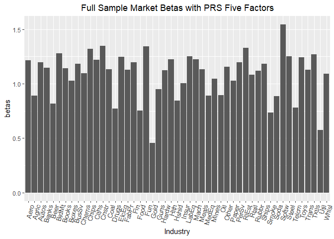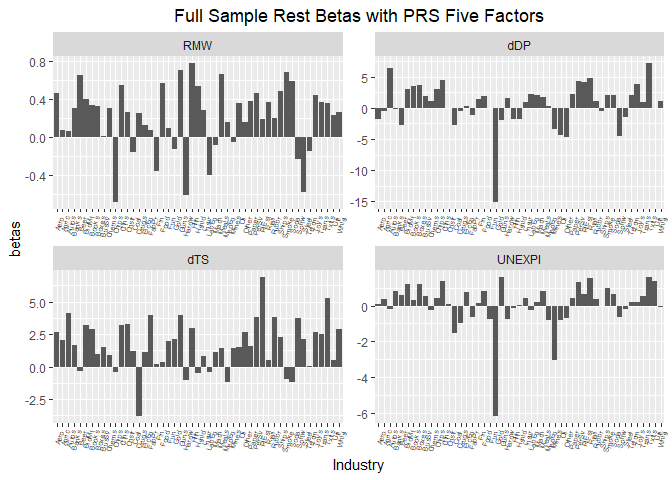

### 3.2.2 Rolling Window Estimation

We will show an example of the Real Estate Portfolio (RlEst) Rolling Betas evolutions here. The smoothing line is based on the loess smoothing. It seems that the betas are evolving overtime.

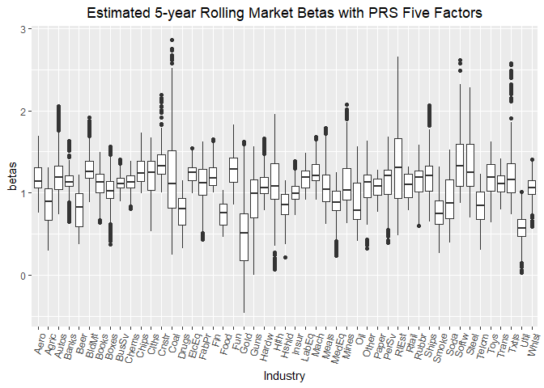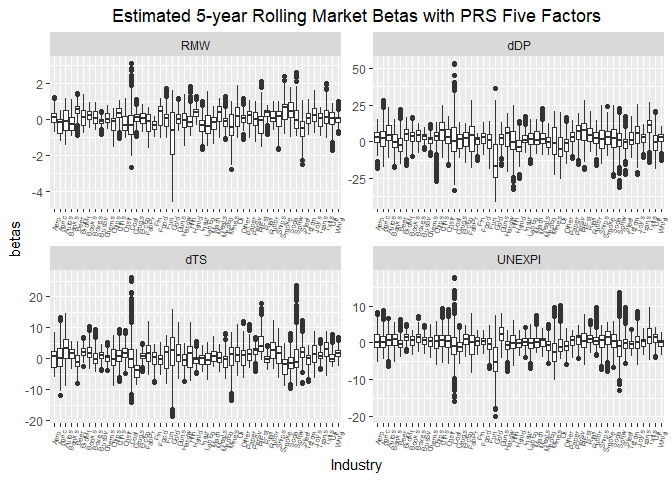

### 3.2.3 Full Sample Estimation with STL Trend

Here, we would try to conduct the STL decomposition before the first step regression with full sample.

<table class="table table-striped" style="font-size: 10px; width: auto !important; margin-left: auto; margin-right: auto;">
<caption style="font-size: initial !important;">
PRS Five Factors
</caption>
<thead>
<tr>
<th style="border-bottom:hidden" colspan="1">
</th>
<th style="border-bottom:hidden; padding-bottom:0; padding-left:3px;padding-right:3px;text-align: center; " colspan="6">
Coefficients

</th>
<th style="border-bottom:hidden; padding-bottom:0; padding-left:3px;padding-right:3px;text-align: center; " colspan="6">
Std. Error

</th>
</tr>
<tr>
<th style="text-align:center;">
Industry
</th>
<th style="text-align:center;">
Alpha
</th>
<th style="text-align:center;">
Mkt-RF
</th>
<th style="text-align:center;">
RMW
</th>
<th style="text-align:center;">
dDP
</th>
<th style="text-align:center;">
dTS
</th>
<th style="text-align:center;">
UNEXPI
</th>
<th style="text-align:center;">
Alpha
</th>
<th style="text-align:center;">
Mkt-RF
</th>
<th style="text-align:center;">
RMW
</th>
<th style="text-align:center;">
dDP
</th>
<th style="text-align:center;">
dTS
</th>
<th style="text-align:center;">
UNEXPI
</th>
</tr>
</thead>
<tbody>
<tr>
<td style="text-align:center;font-weight: bold;">
Aero
</td>
<td style="text-align:center;">
-0.0004699
</td>
<td style="text-align:center;">
1.2559452
</td>
<td style="text-align:center;">
0.2550885
</td>
<td style="text-align:center;">
-7.4904243
</td>
<td style="text-align:center;">
3.7497689
</td>
<td style="text-align:center;">
1.0467663
</td>
<td style="text-align:center;">
0.0006237
</td>
<td style="text-align:center;">
0.0452933
</td>
<td style="text-align:center;">
0.0759007
</td>
<td style="text-align:center;">
1.3705160
</td>
<td style="text-align:center;">
0.5758848
</td>
<td style="text-align:center;">
0.5059989
</td>
</tr>
<tr>
<td style="text-align:center;font-weight: bold;">
Agric
</td>
<td style="text-align:center;">
0.0004289
</td>
<td style="text-align:center;">
0.6602813
</td>
<td style="text-align:center;">
0.5519335
</td>
<td style="text-align:center;">
-10.5637483
</td>
<td style="text-align:center;">
2.3202084
</td>
<td style="text-align:center;">
1.2059518
</td>
<td style="text-align:center;">
0.0005833
</td>
<td style="text-align:center;">
0.0423558
</td>
<td style="text-align:center;">
0.0709782
</td>
<td style="text-align:center;">
1.2816316
</td>
<td style="text-align:center;">
0.5385360
</td>
<td style="text-align:center;">
0.4731825
</td>
</tr>
<tr>
<td style="text-align:center;font-weight: bold;">
Autos
</td>
<td style="text-align:center;">
-0.0022983
</td>
<td style="text-align:center;">
1.1866378
</td>
<td style="text-align:center;">
0.0706379
</td>
<td style="text-align:center;">
5.1144455
</td>
<td style="text-align:center;">
3.2693485
</td>
<td style="text-align:center;">
-3.1890841
</td>
<td style="text-align:center;">
0.0005963
</td>
<td style="text-align:center;">
0.0433027
</td>
<td style="text-align:center;">
0.0725650
</td>
<td style="text-align:center;">
1.3102834
</td>
<td style="text-align:center;">
0.5505753
</td>
<td style="text-align:center;">
0.4837609
</td>
</tr>
<tr>
<td style="text-align:center;font-weight: bold;">
Banks
</td>
<td style="text-align:center;">
-0.0023066
</td>
<td style="text-align:center;">
1.1340974
</td>
<td style="text-align:center;">
0.5477567
</td>
<td style="text-align:center;">
-4.1858170
</td>
<td style="text-align:center;">
2.3093520
</td>
<td style="text-align:center;">
0.9979255
</td>
<td style="text-align:center;">
0.0004533
</td>
<td style="text-align:center;">
0.0329203
</td>
<td style="text-align:center;">
0.0551666
</td>
<td style="text-align:center;">
0.9961262
</td>
<td style="text-align:center;">
0.4185678
</td>
<td style="text-align:center;">
0.3677730
</td>
</tr>
<tr>
<td style="text-align:center;font-weight: bold;">
Beer
</td>
<td style="text-align:center;">
-0.0000519
</td>
<td style="text-align:center;">
0.9326617
</td>
<td style="text-align:center;">
0.7531810
</td>
<td style="text-align:center;">
6.4028660
</td>
<td style="text-align:center;">
-2.1259455
</td>
<td style="text-align:center;">
1.3059932
</td>
<td style="text-align:center;">
0.0004315
</td>
<td style="text-align:center;">
0.0313359
</td>
<td style="text-align:center;">
0.0525115
</td>
<td style="text-align:center;">
0.9481834
</td>
<td style="text-align:center;">
0.3984225
</td>
<td style="text-align:center;">
0.3500724
</td>
</tr>
<tr>
<td style="text-align:center;font-weight: bold;">
BldMt
</td>
<td style="text-align:center;">
-0.0019669
</td>
<td style="text-align:center;">
1.0769237
</td>
<td style="text-align:center;">
0.5483939
</td>
<td style="text-align:center;">
-4.9986259
</td>
<td style="text-align:center;">
4.6113079
</td>
<td style="text-align:center;">
0.0258730
</td>
<td style="text-align:center;">
0.0003546
</td>
<td style="text-align:center;">
0.0257533
</td>
<td style="text-align:center;">
0.0431563
</td>
<td style="text-align:center;">
0.7792595
</td>
<td style="text-align:center;">
0.3274414
</td>
<td style="text-align:center;">
0.2877051
</td>
</tr>
<tr>
<td style="text-align:center;font-weight: bold;">
Books
</td>
<td style="text-align:center;">
-0.0040879
</td>
<td style="text-align:center;">
1.2287919
</td>
<td style="text-align:center;">
0.3504133
</td>
<td style="text-align:center;">
3.0017092
</td>
<td style="text-align:center;">
2.7518012
</td>
<td style="text-align:center;">
-1.0957991
</td>
<td style="text-align:center;">
0.0005248
</td>
<td style="text-align:center;">
0.0381116
</td>
<td style="text-align:center;">
0.0638659
</td>
<td style="text-align:center;">
1.1532078
</td>
<td style="text-align:center;">
0.4845729
</td>
<td style="text-align:center;">
0.4257681
</td>
</tr>
<tr>
<td style="text-align:center;font-weight: bold;">
Boxes
</td>
<td style="text-align:center;">
-0.0015721
</td>
<td style="text-align:center;">
0.8139235
</td>
<td style="text-align:center;">
0.8367810
</td>
<td style="text-align:center;">
-0.9577129
</td>
<td style="text-align:center;">
3.2508488
</td>
<td style="text-align:center;">
0.0998758
</td>
<td style="text-align:center;">
0.0004751
</td>
<td style="text-align:center;">
0.0345003
</td>
<td style="text-align:center;">
0.0578141
</td>
<td style="text-align:center;">
1.0439323
</td>
<td style="text-align:center;">
0.4386558
</td>
<td style="text-align:center;">
0.3854232
</td>
</tr>
<tr>
<td style="text-align:center;font-weight: bold;">
BusSv
</td>
<td style="text-align:center;">
-0.0007538
</td>
<td style="text-align:center;">
1.1558261
</td>
<td style="text-align:center;">
-0.0259993
</td>
<td style="text-align:center;">
3.7142979
</td>
<td style="text-align:center;">
0.4987557
</td>
<td style="text-align:center;">
0.1792919
</td>
<td style="text-align:center;">
0.0003057
</td>
<td style="text-align:center;">
0.0222009
</td>
<td style="text-align:center;">
0.0372033
</td>
<td style="text-align:center;">
0.6717694
</td>
<td style="text-align:center;">
0.2822746
</td>
<td style="text-align:center;">
0.2480194
</td>
</tr>
<tr>
<td style="text-align:center;font-weight: bold;">
Chems
</td>
<td style="text-align:center;">
-0.0001862
</td>
<td style="text-align:center;">
0.9111439
</td>
<td style="text-align:center;">
0.4126744
</td>
<td style="text-align:center;">
-5.4355384
</td>
<td style="text-align:center;">
2.5115703
</td>
<td style="text-align:center;">
-0.4099628
</td>
<td style="text-align:center;">
0.0004079
</td>
<td style="text-align:center;">
0.0296201
</td>
<td style="text-align:center;">
0.0496361
</td>
<td style="text-align:center;">
0.8962647
</td>
<td style="text-align:center;">
0.3766065
</td>
<td style="text-align:center;">
0.3309038
</td>
</tr>
<tr>
<td style="text-align:center;font-weight: bold;">
Chips
</td>
<td style="text-align:center;">
0.0037892
</td>
<td style="text-align:center;">
1.2177130
</td>
<td style="text-align:center;">
-1.0302893
</td>
<td style="text-align:center;">
2.7482944
</td>
<td style="text-align:center;">
-0.3555615
</td>
<td style="text-align:center;">
-1.1093865
</td>
<td style="text-align:center;">
0.0005194
</td>
<td style="text-align:center;">
0.0377145
</td>
<td style="text-align:center;">
0.0632005
</td>
<td style="text-align:center;">
1.1411924
</td>
<td style="text-align:center;">
0.4795240
</td>
<td style="text-align:center;">
0.4213319
</td>
</tr>
<tr>
<td style="text-align:center;font-weight: bold;">
Clths
</td>
<td style="text-align:center;">
-0.0039466
</td>
<td style="text-align:center;">
1.3081654
</td>
<td style="text-align:center;">
0.7554029
</td>
<td style="text-align:center;">
6.5128374
</td>
<td style="text-align:center;">
2.7042652
</td>
<td style="text-align:center;">
1.3524681
</td>
<td style="text-align:center;">
0.0006108
</td>
<td style="text-align:center;">
0.0443520
</td>
<td style="text-align:center;">
0.0743232
</td>
<td style="text-align:center;">
1.3420319
</td>
<td style="text-align:center;">
0.5639159
</td>
<td style="text-align:center;">
0.4954825
</td>
</tr>
<tr>
<td style="text-align:center;font-weight: bold;">
Cnstr
</td>
<td style="text-align:center;">
-0.0015415
</td>
<td style="text-align:center;">
1.0555971
</td>
<td style="text-align:center;">
0.6562803
</td>
<td style="text-align:center;">
-13.6327199
</td>
<td style="text-align:center;">
1.3012961
</td>
<td style="text-align:center;">
-2.1860200
</td>
<td style="text-align:center;">
0.0006611
</td>
<td style="text-align:center;">
0.0480090
</td>
<td style="text-align:center;">
0.0804515
</td>
<td style="text-align:center;">
1.4526890
</td>
<td style="text-align:center;">
0.6104135
</td>
<td style="text-align:center;">
0.5363375
</td>
</tr>
<tr>
<td style="text-align:center;font-weight: bold;">
Coal
</td>
<td style="text-align:center;">
0.0057387
</td>
<td style="text-align:center;">
0.2554940
</td>
<td style="text-align:center;">
-0.2389224
</td>
<td style="text-align:center;">
-21.9551176
</td>
<td style="text-align:center;">
-2.8332555
</td>
<td style="text-align:center;">
2.6347515
</td>
<td style="text-align:center;">
0.0016160
</td>
<td style="text-align:center;">
0.1173455
</td>
<td style="text-align:center;">
0.1966428
</td>
<td style="text-align:center;">
3.5507193
</td>
<td style="text-align:center;">
1.4919966
</td>
<td style="text-align:center;">
1.3109370
</td>
</tr>
<tr>
<td style="text-align:center;font-weight: bold;">
Drugs
</td>
<td style="text-align:center;">
0.0020116
</td>
<td style="text-align:center;">
0.8733368
</td>
<td style="text-align:center;">
0.4747889
</td>
<td style="text-align:center;">
5.4946034
</td>
<td style="text-align:center;">
-5.8223245
</td>
<td style="text-align:center;">
-1.0432201
</td>
<td style="text-align:center;">
0.0003703
</td>
<td style="text-align:center;">
0.0268932
</td>
<td style="text-align:center;">
0.0450666
</td>
<td style="text-align:center;">
0.8137531
</td>
<td style="text-align:center;">
0.3419355
</td>
<td style="text-align:center;">
0.3004403
</td>
</tr>
<tr>
<td style="text-align:center;font-weight: bold;">
ElcEq
</td>
<td style="text-align:center;">
0.0016198
</td>
<td style="text-align:center;">
1.1213096
</td>
<td style="text-align:center;">
-0.1062051
</td>
<td style="text-align:center;">
1.7791092
</td>
<td style="text-align:center;">
-0.1628531
</td>
<td style="text-align:center;">
-0.2540949
</td>
<td style="text-align:center;">
0.0003164
</td>
<td style="text-align:center;">
0.0229739
</td>
<td style="text-align:center;">
0.0384987
</td>
<td style="text-align:center;">
0.6951593
</td>
<td style="text-align:center;">
0.2921029
</td>
<td style="text-align:center;">
0.2566551
</td>
</tr>
<tr>
<td style="text-align:center;font-weight: bold;">
FabPr
</td>
<td style="text-align:center;">
-0.0035111
</td>
<td style="text-align:center;">
0.9279794
</td>
<td style="text-align:center;">
0.2515102
</td>
<td style="text-align:center;">
-8.1150405
</td>
<td style="text-align:center;">
5.6433532
</td>
<td style="text-align:center;">
1.2928447
</td>
<td style="text-align:center;">
0.0007046
</td>
<td style="text-align:center;">
0.0511691
</td>
<td style="text-align:center;">
0.0857471
</td>
<td style="text-align:center;">
1.5483088
</td>
<td style="text-align:center;">
0.6505926
</td>
<td style="text-align:center;">
0.5716406
</td>
</tr>
<tr>
<td style="text-align:center;font-weight: bold;">
Fin
</td>
<td style="text-align:center;">
0.0001692
</td>
<td style="text-align:center;">
1.2144583
</td>
<td style="text-align:center;">
0.0400154
</td>
<td style="text-align:center;">
-2.7327489
</td>
<td style="text-align:center;">
1.3834701
</td>
<td style="text-align:center;">
-0.3724981
</td>
<td style="text-align:center;">
0.0004437
</td>
<td style="text-align:center;">
0.0322228
</td>
<td style="text-align:center;">
0.0539976
</td>
<td style="text-align:center;">
0.9750189
</td>
<td style="text-align:center;">
0.4096986
</td>
<td style="text-align:center;">
0.3599801
</td>
</tr>
<tr>
<td style="text-align:center;font-weight: bold;">
Food
</td>
<td style="text-align:center;">
-0.0002847
</td>
<td style="text-align:center;">
0.8098713
</td>
<td style="text-align:center;">
0.7171661
</td>
<td style="text-align:center;">
4.8026349
</td>
<td style="text-align:center;">
-0.4076987
</td>
<td style="text-align:center;">
1.9825689
</td>
<td style="text-align:center;">
0.0003966
</td>
<td style="text-align:center;">
0.0287972
</td>
<td style="text-align:center;">
0.0482571
</td>
<td style="text-align:center;">
0.8713647
</td>
<td style="text-align:center;">
0.3661436
</td>
<td style="text-align:center;">
0.3217107
</td>
</tr>
<tr>
<td style="text-align:center;font-weight: bold;">
Fun
</td>
<td style="text-align:center;">
0.0008011
</td>
<td style="text-align:center;">
1.3192623
</td>
<td style="text-align:center;">
0.4148489
</td>
<td style="text-align:center;">
-2.2314608
</td>
<td style="text-align:center;">
2.8780558
</td>
<td style="text-align:center;">
-0.9222569
</td>
<td style="text-align:center;">
0.0006951
</td>
<td style="text-align:center;">
0.0504778
</td>
<td style="text-align:center;">
0.0845887
</td>
<td style="text-align:center;">
1.5273919
</td>
<td style="text-align:center;">
0.6418034
</td>
<td style="text-align:center;">
0.5639180
</td>
</tr>
<tr>
<td style="text-align:center;font-weight: bold;">
Gold
</td>
<td style="text-align:center;">
0.0059198
</td>
<td style="text-align:center;">
-0.0184240
</td>
<td style="text-align:center;">
0.3556824
</td>
<td style="text-align:center;">
-10.2539918
</td>
<td style="text-align:center;">
4.0421823
</td>
<td style="text-align:center;">
-9.0223432
</td>
<td style="text-align:center;">
0.0011985
</td>
<td style="text-align:center;">
0.0870313
</td>
<td style="text-align:center;">
0.1458435
</td>
<td style="text-align:center;">
2.6334526
</td>
<td style="text-align:center;">
1.1065652
</td>
<td style="text-align:center;">
0.9722792
</td>
</tr>
<tr>
<td style="text-align:center;font-weight: bold;">
Guns
</td>
<td style="text-align:center;">
0.0017087
</td>
<td style="text-align:center;">
0.7157908
</td>
<td style="text-align:center;">
1.0838225
</td>
<td style="text-align:center;">
-12.4773141
</td>
<td style="text-align:center;">
5.7094248
</td>
<td style="text-align:center;">
0.0230467
</td>
<td style="text-align:center;">
0.0006620
</td>
<td style="text-align:center;">
0.0480717
</td>
<td style="text-align:center;">
0.0805566
</td>
<td style="text-align:center;">
1.4545860
</td>
<td style="text-align:center;">
0.6112106
</td>
<td style="text-align:center;">
0.5370378
</td>
</tr>
<tr>
<td style="text-align:center;font-weight: bold;">
Hardw
</td>
<td style="text-align:center;">
0.0019391
</td>
<td style="text-align:center;">
1.0782956
</td>
<td style="text-align:center;">
-0.7935466
</td>
<td style="text-align:center;">
5.4459169
</td>
<td style="text-align:center;">
-2.2299181
</td>
<td style="text-align:center;">
-2.1960074
</td>
<td style="text-align:center;">
0.0006066
</td>
<td style="text-align:center;">
0.0440517
</td>
<td style="text-align:center;">
0.0738200
</td>
<td style="text-align:center;">
1.3329457
</td>
<td style="text-align:center;">
0.5600979
</td>
<td style="text-align:center;">
0.4921279
</td>
</tr>
<tr>
<td style="text-align:center;font-weight: bold;">
Hlth
</td>
<td style="text-align:center;">
-0.0025195
</td>
<td style="text-align:center;">
1.0682492
</td>
<td style="text-align:center;">
0.7689546
</td>
<td style="text-align:center;">
4.6726386
</td>
<td style="text-align:center;">
0.8368552
</td>
<td style="text-align:center;">
0.8415230
</td>
<td style="text-align:center;">
0.0010472
</td>
<td style="text-align:center;">
0.0760429
</td>
<td style="text-align:center;">
0.1274297
</td>
<td style="text-align:center;">
2.3009592
</td>
<td style="text-align:center;">
0.9668529
</td>
<td style="text-align:center;">
0.8495216
</td>
</tr>
<tr>
<td style="text-align:center;font-weight: bold;">
Hshld
</td>
<td style="text-align:center;">
-0.0027500
</td>
<td style="text-align:center;">
0.9358847
</td>
<td style="text-align:center;">
0.7169600
</td>
<td style="text-align:center;">
3.3111882
</td>
<td style="text-align:center;">
0.7387057
</td>
<td style="text-align:center;">
0.3448121
</td>
<td style="text-align:center;">
0.0003055
</td>
<td style="text-align:center;">
0.0221867
</td>
<td style="text-align:center;">
0.0371795
</td>
<td style="text-align:center;">
0.6713395
</td>
<td style="text-align:center;">
0.2820939
</td>
<td style="text-align:center;">
0.2478607
</td>
</tr>
<tr>
<td style="text-align:center;font-weight: bold;">
Insur
</td>
<td style="text-align:center;">
-0.0004874
</td>
<td style="text-align:center;">
1.0369537
</td>
<td style="text-align:center;">
0.4156527
</td>
<td style="text-align:center;">
-4.2397802
</td>
<td style="text-align:center;">
2.3745069
</td>
<td style="text-align:center;">
0.5483219
</td>
<td style="text-align:center;">
0.0003994
</td>
<td style="text-align:center;">
0.0290049
</td>
<td style="text-align:center;">
0.0486052
</td>
<td style="text-align:center;">
0.8776499
</td>
<td style="text-align:center;">
0.3687846
</td>
<td style="text-align:center;">
0.3240312
</td>
</tr>
<tr>
<td style="text-align:center;font-weight: bold;">
LabEq
</td>
<td style="text-align:center;">
0.0027187
</td>
<td style="text-align:center;">
1.0611236
</td>
<td style="text-align:center;">
-0.5446032
</td>
<td style="text-align:center;">
0.1077402
</td>
<td style="text-align:center;">
-0.5408806
</td>
<td style="text-align:center;">
-0.2223122
</td>
<td style="text-align:center;">
0.0004507
</td>
<td style="text-align:center;">
0.0327320
</td>
<td style="text-align:center;">
0.0548510
</td>
<td style="text-align:center;">
0.9904271
</td>
<td style="text-align:center;">
0.4161731
</td>
<td style="text-align:center;">
0.3656689
</td>
</tr>
<tr>
<td style="text-align:center;font-weight: bold;">
Mach
</td>
<td style="text-align:center;">
0.0011451
</td>
<td style="text-align:center;">
0.9103207
</td>
<td style="text-align:center;">
0.0461087
</td>
<td style="text-align:center;">
-9.8508194
</td>
<td style="text-align:center;">
3.1017060
</td>
<td style="text-align:center;">
-1.2805745
</td>
<td style="text-align:center;">
0.0004428
</td>
<td style="text-align:center;">
0.0321551
</td>
<td style="text-align:center;">
0.0538843
</td>
<td style="text-align:center;">
0.9729722
</td>
<td style="text-align:center;">
0.4088386
</td>
<td style="text-align:center;">
0.3592245
</td>
</tr>
<tr>
<td style="text-align:center;font-weight: bold;">
Meals
</td>
<td style="text-align:center;">
-0.0026947
</td>
<td style="text-align:center;">
1.1458673
</td>
<td style="text-align:center;">
0.5586733
</td>
<td style="text-align:center;">
3.2747786
</td>
<td style="text-align:center;">
3.5601241
</td>
<td style="text-align:center;">
1.8281175
</td>
<td style="text-align:center;">
0.0004796
</td>
<td style="text-align:center;">
0.0348248
</td>
<td style="text-align:center;">
0.0583579
</td>
<td style="text-align:center;">
1.0537511
</td>
<td style="text-align:center;">
0.4427816
</td>
<td style="text-align:center;">
0.3890483
</td>
</tr>
<tr>
<td style="text-align:center;font-weight: bold;">
MedEq
</td>
<td style="text-align:center;">
0.0012338
</td>
<td style="text-align:center;">
0.8622370
</td>
<td style="text-align:center;">
0.4855784
</td>
<td style="text-align:center;">
2.5380903
</td>
<td style="text-align:center;">
-2.9326052
</td>
<td style="text-align:center;">
-0.4160593
</td>
<td style="text-align:center;">
0.0004975
</td>
<td style="text-align:center;">
0.0361277
</td>
<td style="text-align:center;">
0.0605413
</td>
<td style="text-align:center;">
1.0931762
</td>
<td style="text-align:center;">
0.4593478
</td>
<td style="text-align:center;">
0.4036042
</td>
</tr>
<tr>
<td style="text-align:center;font-weight: bold;">
Mines
</td>
<td style="text-align:center;">
0.0042946
</td>
<td style="text-align:center;">
0.5793633
</td>
<td style="text-align:center;">
0.0318880
</td>
<td style="text-align:center;">
-18.0068969
</td>
<td style="text-align:center;">
2.3640705
</td>
<td style="text-align:center;">
-4.2438814
</td>
<td style="text-align:center;">
0.0007668
</td>
<td style="text-align:center;">
0.0556814
</td>
<td style="text-align:center;">
0.0933086
</td>
<td style="text-align:center;">
1.6848449
</td>
<td style="text-align:center;">
0.7079644
</td>
<td style="text-align:center;">
0.6220502
</td>
</tr>
<tr>
<td style="text-align:center;font-weight: bold;">
Oil
</td>
<td style="text-align:center;">
0.0008542
</td>
<td style="text-align:center;">
0.7436052
</td>
<td style="text-align:center;">
0.2107170
</td>
<td style="text-align:center;">
-12.6711069
</td>
<td style="text-align:center;">
1.8771948
</td>
<td style="text-align:center;">
1.0703727
</td>
<td style="text-align:center;">
0.0006051
</td>
<td style="text-align:center;">
0.0439435
</td>
<td style="text-align:center;">
0.0736387
</td>
<td style="text-align:center;">
1.3296709
</td>
<td style="text-align:center;">
0.5587218
</td>
<td style="text-align:center;">
0.4909188
</td>
</tr>
<tr>
<td style="text-align:center;font-weight: bold;">
Other
</td>
<td style="text-align:center;">
-0.0083802
</td>
<td style="text-align:center;">
1.3825021
</td>
<td style="text-align:center;">
0.4180106
</td>
<td style="text-align:center;">
-2.7136657
</td>
<td style="text-align:center;">
1.1897278
</td>
<td style="text-align:center;">
0.6766868
</td>
<td style="text-align:center;">
0.0006164
</td>
<td style="text-align:center;">
0.0447613
</td>
<td style="text-align:center;">
0.0750091
</td>
<td style="text-align:center;">
1.3544174
</td>
<td style="text-align:center;">
0.5691202
</td>
<td style="text-align:center;">
0.5000553
</td>
</tr>
<tr>
<td style="text-align:center;font-weight: bold;">
Paper
</td>
<td style="text-align:center;">
0.0007505
</td>
<td style="text-align:center;">
0.7635057
</td>
<td style="text-align:center;">
0.2889981
</td>
<td style="text-align:center;">
-4.3612924
</td>
<td style="text-align:center;">
1.7959683
</td>
<td style="text-align:center;">
-1.2592816
</td>
<td style="text-align:center;">
0.0004240
</td>
<td style="text-align:center;">
0.0307880
</td>
<td style="text-align:center;">
0.0515933
</td>
<td style="text-align:center;">
0.9316049
</td>
<td style="text-align:center;">
0.3914563
</td>
<td style="text-align:center;">
0.3439515
</td>
</tr>
<tr>
<td style="text-align:center;font-weight: bold;">
PerSv
</td>
<td style="text-align:center;">
-0.0085266
</td>
<td style="text-align:center;">
1.1011684
</td>
<td style="text-align:center;">
0.8807493
</td>
<td style="text-align:center;">
-2.0986592
</td>
<td style="text-align:center;">
7.1662356
</td>
<td style="text-align:center;">
2.2502485
</td>
<td style="text-align:center;">
0.0006989
</td>
<td style="text-align:center;">
0.0507508
</td>
<td style="text-align:center;">
0.0850461
</td>
<td style="text-align:center;">
1.5356511
</td>
<td style="text-align:center;">
0.6452738
</td>
<td style="text-align:center;">
0.5669674
</td>
</tr>
<tr>
<td style="text-align:center;font-weight: bold;">
RlEst
</td>
<td style="text-align:center;">
-0.0097201
</td>
<td style="text-align:center;">
1.3200730
</td>
<td style="text-align:center;">
0.6904919
</td>
<td style="text-align:center;">
-0.2395192
</td>
<td style="text-align:center;">
10.0352215
</td>
<td style="text-align:center;">
-2.7040297
</td>
<td style="text-align:center;">
0.0007521
</td>
<td style="text-align:center;">
0.0546143
</td>
<td style="text-align:center;">
0.0915204
</td>
<td style="text-align:center;">
1.6525555
</td>
<td style="text-align:center;">
0.6943966
</td>
<td style="text-align:center;">
0.6101288
</td>
</tr>
<tr>
<td style="text-align:center;font-weight: bold;">
Rtail
</td>
<td style="text-align:center;">
-0.0004636
</td>
<td style="text-align:center;">
1.0932934
</td>
<td style="text-align:center;">
0.2826147
</td>
<td style="text-align:center;">
10.6826872
</td>
<td style="text-align:center;">
-1.1567588
</td>
<td style="text-align:center;">
1.5732409
</td>
<td style="text-align:center;">
0.0003793
</td>
<td style="text-align:center;">
0.0275450
</td>
<td style="text-align:center;">
0.0461587
</td>
<td style="text-align:center;">
0.8334744
</td>
<td style="text-align:center;">
0.3502223
</td>
<td style="text-align:center;">
0.3077215
</td>
</tr>
<tr>
<td style="text-align:center;font-weight: bold;">
Rubbr
</td>
<td style="text-align:center;">
-0.0016398
</td>
<td style="text-align:center;">
1.0561186
</td>
<td style="text-align:center;">
0.6175342
</td>
<td style="text-align:center;">
-1.5214037
</td>
<td style="text-align:center;">
3.3120986
</td>
<td style="text-align:center;">
-1.0184067
</td>
<td style="text-align:center;">
0.0004080
</td>
<td style="text-align:center;">
0.0296295
</td>
<td style="text-align:center;">
0.0496519
</td>
<td style="text-align:center;">
0.8965495
</td>
<td style="text-align:center;">
0.3767261
</td>
<td style="text-align:center;">
0.3310090
</td>
</tr>
<tr>
<td style="text-align:center;font-weight: bold;">
Ships
</td>
<td style="text-align:center;">
0.0011604
</td>
<td style="text-align:center;">
0.7126336
</td>
<td style="text-align:center;">
0.5420701
</td>
<td style="text-align:center;">
-12.3165184
</td>
<td style="text-align:center;">
5.7767870
</td>
<td style="text-align:center;">
-2.4924140
</td>
<td style="text-align:center;">
0.0007008
</td>
<td style="text-align:center;">
0.0508907
</td>
<td style="text-align:center;">
0.0852805
</td>
<td style="text-align:center;">
1.5398844
</td>
<td style="text-align:center;">
0.6470526
</td>
<td style="text-align:center;">
0.5685303
</td>
</tr>
<tr>
<td style="text-align:center;font-weight: bold;">
Smoke
</td>
<td style="text-align:center;">
0.0029894
</td>
<td style="text-align:center;">
0.6355655
</td>
<td style="text-align:center;">
1.1680262
</td>
<td style="text-align:center;">
1.4176844
</td>
<td style="text-align:center;">
-1.4322792
</td>
<td style="text-align:center;">
1.9889754
</td>
<td style="text-align:center;">
0.0006519
</td>
<td style="text-align:center;">
0.0473369
</td>
<td style="text-align:center;">
0.0793252
</td>
<td style="text-align:center;">
1.4323514
</td>
<td style="text-align:center;">
0.6018677
</td>
<td style="text-align:center;">
0.5288288
</td>
</tr>
<tr>
<td style="text-align:center;font-weight: bold;">
Soda
</td>
<td style="text-align:center;">
-0.0022793
</td>
<td style="text-align:center;">
0.9911956
</td>
<td style="text-align:center;">
1.0694227
</td>
<td style="text-align:center;">
5.2613134
</td>
<td style="text-align:center;">
2.1772782
</td>
<td style="text-align:center;">
0.7586857
</td>
<td style="text-align:center;">
0.0005562
</td>
<td style="text-align:center;">
0.0403896
</td>
<td style="text-align:center;">
0.0676833
</td>
<td style="text-align:center;">
1.2221367
</td>
<td style="text-align:center;">
0.5135365
</td>
<td style="text-align:center;">
0.4512168
</td>
</tr>
<tr>
<td style="text-align:center;font-weight: bold;">
Softw
</td>
<td style="text-align:center;">
-0.0017483
</td>
<td style="text-align:center;">
1.6128358
</td>
<td style="text-align:center;">
-0.0324200
</td>
<td style="text-align:center;">
7.5734792
</td>
<td style="text-align:center;">
-2.1058664
</td>
<td style="text-align:center;">
-1.5315760
</td>
<td style="text-align:center;">
0.0009934
</td>
<td style="text-align:center;">
0.0721372
</td>
<td style="text-align:center;">
0.1208846
</td>
<td style="text-align:center;">
2.1827758
</td>
<td style="text-align:center;">
0.9171928
</td>
<td style="text-align:center;">
0.8058879
</td>
</tr>
<tr>
<td style="text-align:center;font-weight: bold;">
Steel
</td>
<td style="text-align:center;">
0.0016226
</td>
<td style="text-align:center;">
0.8085927
</td>
<td style="text-align:center;">
-0.8737290
</td>
<td style="text-align:center;">
-13.4512154
</td>
<td style="text-align:center;">
1.9169273
</td>
<td style="text-align:center;">
0.0860896
</td>
<td style="text-align:center;">
0.0006183
</td>
<td style="text-align:center;">
0.0448969
</td>
<td style="text-align:center;">
0.0752364
</td>
<td style="text-align:center;">
1.3585217
</td>
<td style="text-align:center;">
0.5708448
</td>
<td style="text-align:center;">
0.5015706
</td>
</tr>
<tr>
<td style="text-align:center;font-weight: bold;">
Telcm
</td>
<td style="text-align:center;">
0.0021548
</td>
<td style="text-align:center;">
0.8264663
</td>
<td style="text-align:center;">
-0.6534422
</td>
<td style="text-align:center;">
2.0158826
</td>
<td style="text-align:center;">
1.1726066
</td>
<td style="text-align:center;">
0.6936346
</td>
<td style="text-align:center;">
0.0004396
</td>
<td style="text-align:center;">
0.0319220
</td>
<td style="text-align:center;">
0.0534936
</td>
<td style="text-align:center;">
0.9659184
</td>
<td style="text-align:center;">
0.4058747
</td>
<td style="text-align:center;">
0.3566202
</td>
</tr>
<tr>
<td style="text-align:center;font-weight: bold;">
Toys
</td>
<td style="text-align:center;">
-0.0065508
</td>
<td style="text-align:center;">
1.1544288
</td>
<td style="text-align:center;">
0.7702303
</td>
<td style="text-align:center;">
5.6743488
</td>
<td style="text-align:center;">
5.6704359
</td>
<td style="text-align:center;">
1.0876180
</td>
<td style="text-align:center;">
0.0005625
</td>
<td style="text-align:center;">
0.0408470
</td>
<td style="text-align:center;">
0.0684498
</td>
<td style="text-align:center;">
1.2359770
</td>
<td style="text-align:center;">
0.5193521
</td>
<td style="text-align:center;">
0.4563267
</td>
</tr>
<tr>
<td style="text-align:center;font-weight: bold;">
Trans
</td>
<td style="text-align:center;">
-0.0028268
</td>
<td style="text-align:center;">
1.0578052
</td>
<td style="text-align:center;">
0.4748986
</td>
<td style="text-align:center;">
-1.8906329
</td>
<td style="text-align:center;">
5.0980038
</td>
<td style="text-align:center;">
0.7725197
</td>
<td style="text-align:center;">
0.0004092
</td>
<td style="text-align:center;">
0.0297138
</td>
<td style="text-align:center;">
0.0497932
</td>
<td style="text-align:center;">
0.8991006
</td>
<td style="text-align:center;">
0.3777981
</td>
<td style="text-align:center;">
0.3319509
</td>
</tr>
<tr>
<td style="text-align:center;font-weight: bold;">
Txtls
</td>
<td style="text-align:center;">
-0.0045459
</td>
<td style="text-align:center;">
1.1023490
</td>
<td style="text-align:center;">
0.6308306
</td>
<td style="text-align:center;">
0.2432470
</td>
<td style="text-align:center;">
7.5846808
</td>
<td style="text-align:center;">
0.6360910
</td>
<td style="text-align:center;">
0.0007338
</td>
<td style="text-align:center;">
0.0532891
</td>
<td style="text-align:center;">
0.0892998
</td>
<td style="text-align:center;">
1.6124589
</td>
<td style="text-align:center;">
0.6775481
</td>
<td style="text-align:center;">
0.5953250
</td>
</tr>
<tr>
<td style="text-align:center;font-weight: bold;">
Util
</td>
<td style="text-align:center;">
-0.0005086
</td>
<td style="text-align:center;">
0.7759086
</td>
<td style="text-align:center;">
0.2346717
</td>
<td style="text-align:center;">
-2.9536624
</td>
<td style="text-align:center;">
1.2216997
</td>
<td style="text-align:center;">
2.7335259
</td>
<td style="text-align:center;">
0.0003740
</td>
<td style="text-align:center;">
0.0271553
</td>
<td style="text-align:center;">
0.0455057
</td>
<td style="text-align:center;">
0.8216826
</td>
<td style="text-align:center;">
0.3452674
</td>
<td style="text-align:center;">
0.3033679
</td>
</tr>
<tr>
<td style="text-align:center;font-weight: bold;">
Whlsl
</td>
<td style="text-align:center;">
-0.0018305
</td>
<td style="text-align:center;">
1.0649944
</td>
<td style="text-align:center;">
0.1370349
</td>
<td style="text-align:center;">
4.8040164
</td>
<td style="text-align:center;">
2.0207975
</td>
<td style="text-align:center;">
0.8860007
</td>
<td style="text-align:center;">
0.0003900
</td>
<td style="text-align:center;">
0.0283217
</td>
<td style="text-align:center;">
0.0474603
</td>
<td style="text-align:center;">
0.8569768
</td>
<td style="text-align:center;">
0.3600979
</td>
<td style="text-align:center;">
0.3163986
</td>
</tr>
</tbody>
</table>
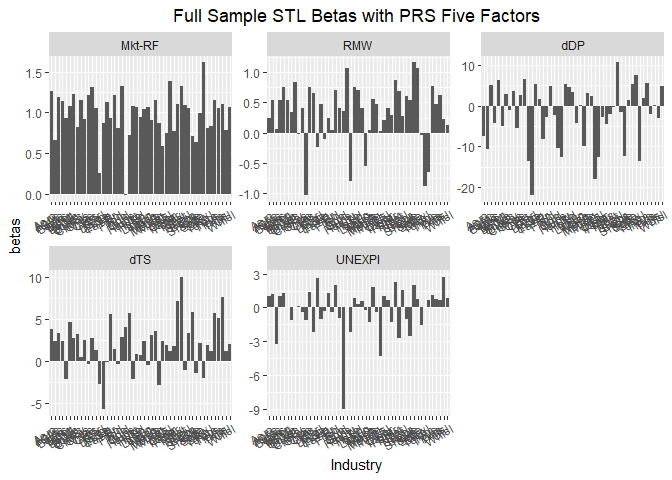

### 3.2.4 Rolling Window Estimation with STL Trend

Here, we would try to conduct the STL decomposition before the first step regression with full sample.

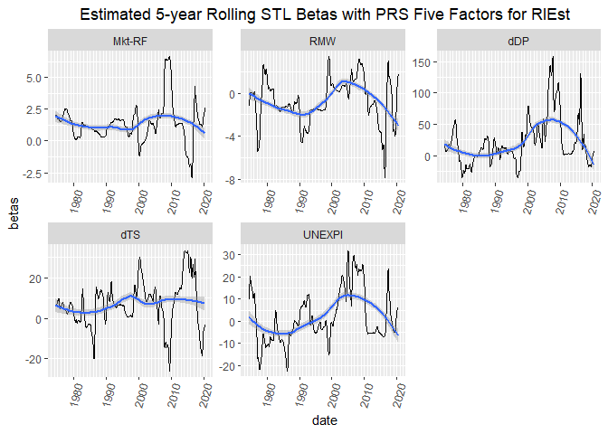

It seems that the STL decomposition does not help the first step regression.

4. Factor Premium Estimation
----------------------------

In this section, we will describe different ways to estimate the Factor Premium.

### 4.1 Arithmetic Mean

First, one can take the arithmetic mean of the factors to generate the expected factor premium.

### 4.2 Geometric Mean

Levi and Welch mentioned in their 2017 paper that geometric mean might perform better. So in this section, we will calculate the geometric mean as the factor premium.

### 4.3 Fama Macbeth Second Step Regression

Fama-Macbeth second regression estimated lambda represents the expected factor risk premium. In this section, we will apply the second step regression to estimate the factor risk premium.

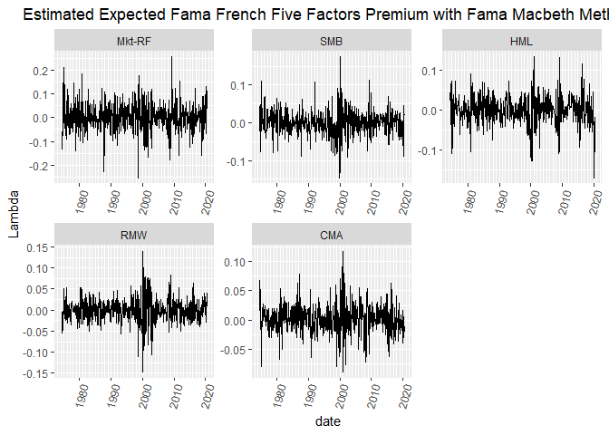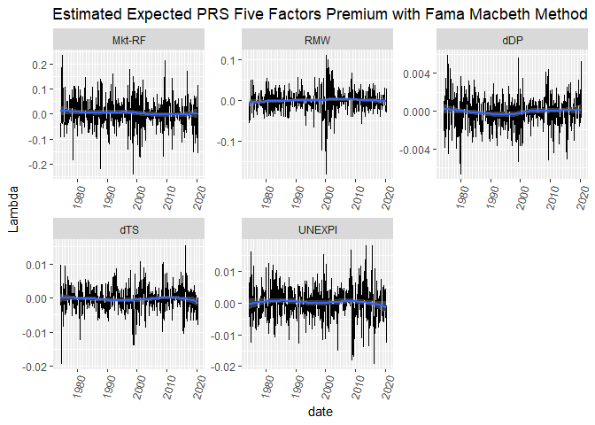

### 4.4 Fama Macbeth Second Step Regression with STL Deseaoned Data

As we can see, Fama Macbeth method would generate an evolving time-series of factor risk premium, but the volatility in lambda is unreasonablly large. We will try to apply the STL trend in the second step regression to smooth the lambda.

### Why filtering might improve Esimated Lamdba?

There is no need for trend extraction for 1st step regression, no matter if we use the full sample or rolling window. The window should be large enough to mitgate the seasonality effect. The second step regression, however, is a cross sectional regression. A seasonal component in the time series would disrupt the cross-sectional regression significantly. So it is possible the the large volatility observed in the second step regression is due to the seasonality.

Now, assume the return (or risk premium) is formed by the following equation:

*r**i**t* = *β**i**t* \* *λ**t* + *η**i**t*

Where beta is the sector specific risk exposure, lambda is the factor premium, and eta is the idiosyncratic noise.

*E*\[*η**i**t*|*i*\]=0

However, the eta might actually contain 3 components: eps\_t, s\_i, and eps\_it.

*η**i**t* = *ϵ**t* + *s**i* + *ϵ**i**t*

eps\_t is the universal time-series error, s\_i is the sector-specific seasonality, and eps\_it is the idiosyncratic error. Therefore, the equation is actually:

*r**i**t* = *β**i**t* \* *λ**t* + *ϵ**t* + *s**i* + *ϵ**i**t*

Again, we would have:

*E*\[*ϵ**t* + *s**i* + *ϵ**i**t*|*i*\]=0

However, the cross-sectional regression error at each time t:

*E*\[*ϵ**t* + *s**i* + *ϵ**i**t*|*t*\]=*ϵ**t* + *s**i*

The universal time-series error and the seasonality would actually bias the lambda estimation. Filtering out the universal time-series noise and seasonality would improve the lamdba estimated. Now, I will illustrate the effect of seasonality and universal time-series noise in the second step regression through a simulation.

### Simulation

Suppose the true 49 sector betas are given (since our focus is lambda) and each of them follows an ARIMA(1,1,0) process, with AR coefficient 0.9. For demenstration purpose, the Factor Premiums follows a sin function lambda = sin(t/60\*pi)+0.5. The universal time-series noise is the same for all the sectors, following N(0, 1^2); a sector-specific seasonality is randomly generated for each sector following N(0,1^2), and repeats each year; and the idiosyncratic error is also generated following N(0, 0.3^2). The first value of 49 sector betas are generated from N(1, 0.3^2). There are 600 data generated to represent monthly data in 50 years.

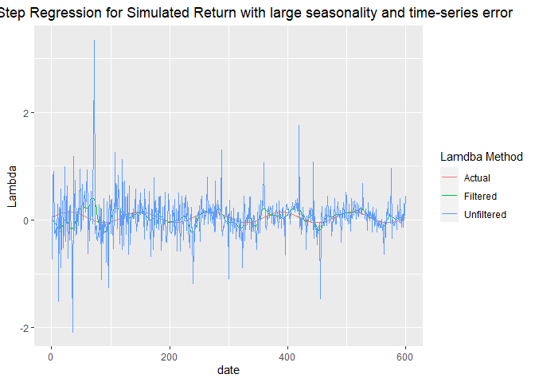

### STL Filtering

STL method (Cleveland et al. 1990) would try decompose the time-series into 3 components: trend, seaonality, and noise. It applies an iterative smoothing method to extract the trend and seaonality components. At the same time, one can choose to use a robust weighting scheme to reduce the effect of large noise to the trend and seaonality extraction.

We will extract the trend of risk premium of the industry portfolios and the trend of the betas with the STL method, and then conduct the second step regression. There are two options with the STL method: the loess window for seasonal extraction (s\_window, large value means no rapidly evolving seasonal component, needs to be odd and at least 7) and robust weights for noise (downweight the noisy data in smoothing if non-Gaussian behavior in the time-series leads to extreme, transient variation). We will first show the STL decomposition of betas and returns.

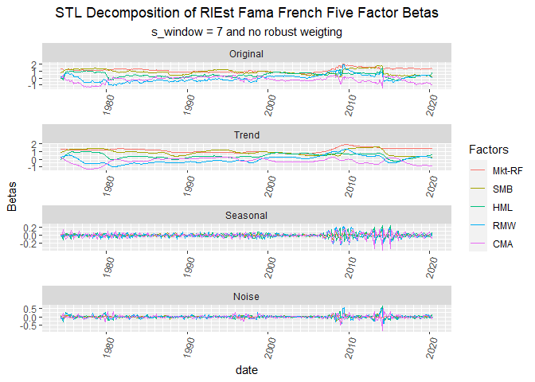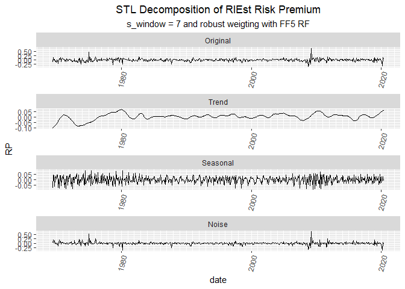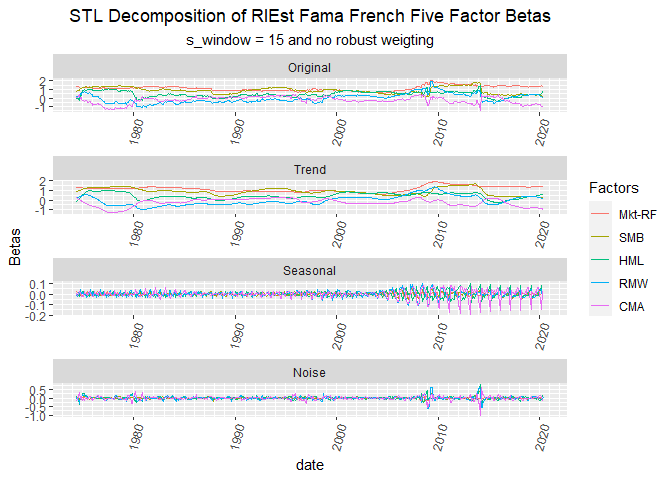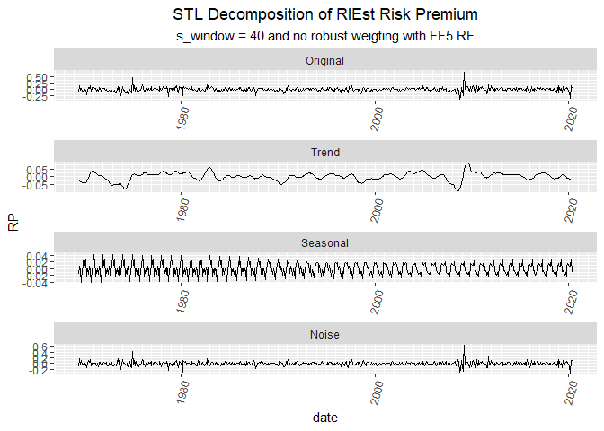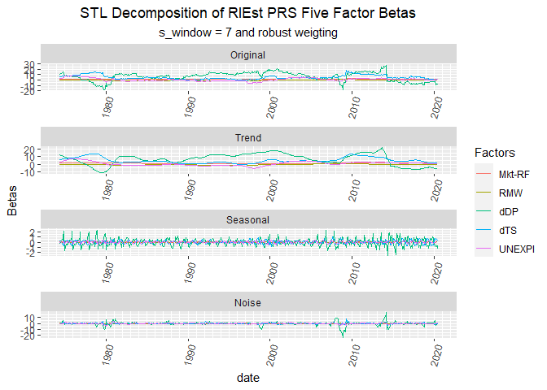

The robustness weighting seems not be appropriate for the Industry Risk Premiums since the returns vairation are mostly caused by Gaussian behavior. One example is the end of the trend curve: there was a market crash at the beginning of 2020, so the trend should go down. However, with the robust weighting, the market crash was given little wight and disappeared. At the same time, we might just choose s\_window = 7, since there could be changing seasonal patterns in the short-term.

### Filtered Seasonality and Trend Strength

Now we estimate the strength of trend and strength of seasonality. The Strenth of the trend is defined as:

$$F\_T = max(0,1-\\frac{Var(R\_t)}{Var(T\_t+R\_t)})$$

$$F\_S = max(0,1-\\frac{Var(R\_t)}{Var(S\_t+R\_t)})$$

<table class="table table-striped" style="font-size: 10px; width: auto !important; margin-left: auto; margin-right: auto;">
<caption style="font-size: initial !important;">
STL Decomposition Component Strength for Portfolio Risk Premium
</caption>
<thead>
<tr>
<th style="text-align:center;">
Strength
</th>
<th style="text-align:center;">
method
</th>
<th style="text-align:center;">
Aero
</th>
<th style="text-align:center;">
Agric
</th>
<th style="text-align:center;">
Autos
</th>
<th style="text-align:center;">
Banks
</th>
<th style="text-align:center;">
Beer
</th>
<th style="text-align:center;">
BldMt
</th>
<th style="text-align:center;">
Books
</th>
<th style="text-align:center;">
Boxes
</th>
<th style="text-align:center;">
BusSv
</th>
<th style="text-align:center;">
Chems
</th>
<th style="text-align:center;">
Chips
</th>
<th style="text-align:center;">
Clths
</th>
<th style="text-align:center;">
Cnstr
</th>
<th style="text-align:center;">
Coal
</th>
<th style="text-align:center;">
Drugs
</th>
<th style="text-align:center;">
ElcEq
</th>
<th style="text-align:center;">
FabPr
</th>
<th style="text-align:center;">
Fin
</th>
<th style="text-align:center;">
Food
</th>
<th style="text-align:center;">
Fun
</th>
<th style="text-align:center;">
Gold
</th>
<th style="text-align:center;">
Guns
</th>
<th style="text-align:center;">
Hardw
</th>
<th style="text-align:center;">
Hlth
</th>
<th style="text-align:center;">
Hshld
</th>
<th style="text-align:center;">
Insur
</th>
<th style="text-align:center;">
LabEq
</th>
<th style="text-align:center;">
Mach
</th>
<th style="text-align:center;">
Meals
</th>
<th style="text-align:center;">
MedEq
</th>
<th style="text-align:center;">
Mines
</th>
<th style="text-align:center;">
Oil
</th>
<th style="text-align:center;">
Other
</th>
<th style="text-align:center;">
Paper
</th>
<th style="text-align:center;">
PerSv
</th>
<th style="text-align:center;">
RlEst
</th>
<th style="text-align:center;">
Rtail
</th>
<th style="text-align:center;">
Rubbr
</th>
<th style="text-align:center;">
Ships
</th>
<th style="text-align:center;">
Smoke
</th>
<th style="text-align:center;">
Soda
</th>
<th style="text-align:center;">
Softw
</th>
<th style="text-align:center;">
Steel
</th>
<th style="text-align:center;">
Telcm
</th>
<th style="text-align:center;">
Toys
</th>
<th style="text-align:center;">
Trans
</th>
<th style="text-align:center;">
Txtls
</th>
<th style="text-align:center;">
Util
</th>
<th style="text-align:center;">
Whlsl
</th>
</tr>
</thead>
<tbody>
<tr>
<td style="text-align:center;font-weight: bold;vertical-align: middle !important;" rowspan="6">
FS
</td>
<td style="text-align:center;">
s07 norobust
</td>
<td style="text-align:center;">
0.3911851
</td>
<td style="text-align:center;">
0.3725901
</td>
<td style="text-align:center;">
0.4018774
</td>
<td style="text-align:center;">
0.4123642
</td>
<td style="text-align:center;">
0.3927234
</td>
<td style="text-align:center;">
0.4078828
</td>
<td style="text-align:center;">
0.3910922
</td>
<td style="text-align:center;">
0.3648795
</td>
<td style="text-align:center;">
0.3812723
</td>
<td style="text-align:center;">
0.3675350
</td>
<td style="text-align:center;">
0.3616610
</td>
<td style="text-align:center;">
0.4190785
</td>
<td style="text-align:center;">
0.3798464
</td>
<td style="text-align:center;">
0.3773576
</td>
<td style="text-align:center;">
0.3700809
</td>
<td style="text-align:center;">
0.3704741
</td>
<td style="text-align:center;">
0.3684705
</td>
<td style="text-align:center;">
0.3673023
</td>
<td style="text-align:center;">
0.3680159
</td>
<td style="text-align:center;">
0.4094499
</td>
<td style="text-align:center;">
0.3472977
</td>
<td style="text-align:center;">
0.3537860
</td>
<td style="text-align:center;">
0.3597511
</td>
<td style="text-align:center;">
0.3807114
</td>
<td style="text-align:center;">
0.3932478
</td>
<td style="text-align:center;">
0.3934480
</td>
<td style="text-align:center;">
0.3332523
</td>
<td style="text-align:center;">
0.3668646
</td>
<td style="text-align:center;">
0.3629374
</td>
<td style="text-align:center;">
0.3584366
</td>
<td style="text-align:center;">
0.3371663
</td>
<td style="text-align:center;">
0.3550115
</td>
<td style="text-align:center;">
0.3970981
</td>
<td style="text-align:center;">
0.3472353
</td>
<td style="text-align:center;">
0.3540942
</td>
<td style="text-align:center;">
0.4210761
</td>
<td style="text-align:center;">
0.3944570
</td>
<td style="text-align:center;">
0.3988149
</td>
<td style="text-align:center;">
0.3716232
</td>
<td style="text-align:center;">
0.3130075
</td>
<td style="text-align:center;">
0.3659172
</td>
<td style="text-align:center;">
0.3278624
</td>
<td style="text-align:center;">
0.3442852
</td>
<td style="text-align:center;">
0.3609891
</td>
<td style="text-align:center;">
0.3592305
</td>
<td style="text-align:center;">
0.3992945
</td>
<td style="text-align:center;">
0.4088416
</td>
<td style="text-align:center;">
0.3775854
</td>
<td style="text-align:center;">
0.3694408
</td>
</tr>
<tr>
<td style="text-align:center;">
s07 robust
</td>
<td style="text-align:center;">
0.1935022
</td>
<td style="text-align:center;">
0.1330849
</td>
<td style="text-align:center;">
0.1373592
</td>
<td style="text-align:center;">
0.1786056
</td>
<td style="text-align:center;">
0.1579393
</td>
<td style="text-align:center;">
0.1348414
</td>
<td style="text-align:center;">
0.1442415
</td>
<td style="text-align:center;">
0.1368121
</td>
<td style="text-align:center;">
0.1622529
</td>
<td style="text-align:center;">
0.1123085
</td>
<td style="text-align:center;">
0.1806169
</td>
<td style="text-align:center;">
0.1924230
</td>
<td style="text-align:center;">
0.1737184
</td>
<td style="text-align:center;">
0.1818465
</td>
<td style="text-align:center;">
0.1716535
</td>
<td style="text-align:center;">
0.1602079
</td>
<td style="text-align:center;">
0.1653442
</td>
<td style="text-align:center;">
0.1365543
</td>
<td style="text-align:center;">
0.2150892
</td>
<td style="text-align:center;">
0.1515594
</td>
<td style="text-align:center;">
0.1352441
</td>
<td style="text-align:center;">
0.1784574
</td>
<td style="text-align:center;">
0.1794134
</td>
<td style="text-align:center;">
0.1686052
</td>
<td style="text-align:center;">
0.1177779
</td>
<td style="text-align:center;">
0.1909530
</td>
<td style="text-align:center;">
0.1055538
</td>
<td style="text-align:center;">
0.1627177
</td>
<td style="text-align:center;">
0.0888803
</td>
<td style="text-align:center;">
0.1570241
</td>
<td style="text-align:center;">
0.0914811
</td>
<td style="text-align:center;">
0.1353939
</td>
<td style="text-align:center;">
0.2213339
</td>
<td style="text-align:center;">
0.1559026
</td>
<td style="text-align:center;">
0.1508374
</td>
<td style="text-align:center;">
0.1097639
</td>
<td style="text-align:center;">
0.1847783
</td>
<td style="text-align:center;">
0.2223238
</td>
<td style="text-align:center;">
0.1754397
</td>
<td style="text-align:center;">
0.1644021
</td>
<td style="text-align:center;">
0.1154241
</td>
<td style="text-align:center;">
0.0835594
</td>
<td style="text-align:center;">
0.1388996
</td>
<td style="text-align:center;">
0.1721490
</td>
<td style="text-align:center;">
0.1827868
</td>
<td style="text-align:center;">
0.2070766
</td>
<td style="text-align:center;">
0.1616175
</td>
<td style="text-align:center;">
0.1465886
</td>
<td style="text-align:center;">
0.1340354
</td>
</tr>
<tr>
<td style="text-align:center;">
s15 norobust
</td>
<td style="text-align:center;">
0.1715220
</td>
<td style="text-align:center;">
0.1542386
</td>
<td style="text-align:center;">
0.1466074
</td>
<td style="text-align:center;">
0.1530480
</td>
<td style="text-align:center;">
0.1629970
</td>
<td style="text-align:center;">
0.1507389
</td>
<td style="text-align:center;">
0.1425589
</td>
<td style="text-align:center;">
0.1462846
</td>
<td style="text-align:center;">
0.1499812
</td>
<td style="text-align:center;">
0.1554518
</td>
<td style="text-align:center;">
0.1437995
</td>
<td style="text-align:center;">
0.1732677
</td>
<td style="text-align:center;">
0.1592202
</td>
<td style="text-align:center;">
0.1584251
</td>
<td style="text-align:center;">
0.1356105
</td>
<td style="text-align:center;">
0.1468336
</td>
<td style="text-align:center;">
0.1364764
</td>
<td style="text-align:center;">
0.1302110
</td>
<td style="text-align:center;">
0.1434273
</td>
<td style="text-align:center;">
0.1684885
</td>
<td style="text-align:center;">
0.1532860
</td>
<td style="text-align:center;">
0.1455716
</td>
<td style="text-align:center;">
0.1570901
</td>
<td style="text-align:center;">
0.1521780
</td>
<td style="text-align:center;">
0.1346499
</td>
<td style="text-align:center;">
0.1337293
</td>
<td style="text-align:center;">
0.1358997
</td>
<td style="text-align:center;">
0.1452397
</td>
<td style="text-align:center;">
0.1303147
</td>
<td style="text-align:center;">
0.1455287
</td>
<td style="text-align:center;">
0.1229566
</td>
<td style="text-align:center;">
0.1441907
</td>
<td style="text-align:center;">
0.1853615
</td>
<td style="text-align:center;">
0.1412987
</td>
<td style="text-align:center;">
0.1435338
</td>
<td style="text-align:center;">
0.1646089
</td>
<td style="text-align:center;">
0.1462893
</td>
<td style="text-align:center;">
0.1754984
</td>
<td style="text-align:center;">
0.1499311
</td>
<td style="text-align:center;">
0.1391745
</td>
<td style="text-align:center;">
0.1533818
</td>
<td style="text-align:center;">
0.1506773
</td>
<td style="text-align:center;">
0.1417627
</td>
<td style="text-align:center;">
0.1533034
</td>
<td style="text-align:center;">
0.1544247
</td>
<td style="text-align:center;">
0.1641945
</td>
<td style="text-align:center;">
0.1755422
</td>
<td style="text-align:center;">
0.1608538
</td>
<td style="text-align:center;">
0.1414738
</td>
</tr>
<tr>
<td style="text-align:center;">
s15 robust
</td>
<td style="text-align:center;">
0.0932133
</td>
<td style="text-align:center;">
0.0630820
</td>
<td style="text-align:center;">
0.0636732
</td>
<td style="text-align:center;">
0.0817096
</td>
<td style="text-align:center;">
0.0697414
</td>
<td style="text-align:center;">
0.0525724
</td>
<td style="text-align:center;">
0.0654441
</td>
<td style="text-align:center;">
0.0697971
</td>
<td style="text-align:center;">
0.0682196
</td>
<td style="text-align:center;">
0.0665752
</td>
<td style="text-align:center;">
0.0817959
</td>
<td style="text-align:center;">
0.1038690
</td>
<td style="text-align:center;">
0.0931980
</td>
<td style="text-align:center;">
0.0929010
</td>
<td style="text-align:center;">
0.0748362
</td>
<td style="text-align:center;">
0.0922239
</td>
<td style="text-align:center;">
0.0735943
</td>
<td style="text-align:center;">
0.0615121
</td>
<td style="text-align:center;">
0.0560796
</td>
<td style="text-align:center;">
0.0896648
</td>
<td style="text-align:center;">
0.0709464
</td>
<td style="text-align:center;">
0.0728823
</td>
<td style="text-align:center;">
0.0856320
</td>
<td style="text-align:center;">
0.0734410
</td>
<td style="text-align:center;">
0.0392797
</td>
<td style="text-align:center;">
0.0729093
</td>
<td style="text-align:center;">
0.0600954
</td>
<td style="text-align:center;">
0.0791513
</td>
<td style="text-align:center;">
0.0629090
</td>
<td style="text-align:center;">
0.0719507
</td>
<td style="text-align:center;">
0.0405025
</td>
<td style="text-align:center;">
0.0672994
</td>
<td style="text-align:center;">
0.0831488
</td>
<td style="text-align:center;">
0.0756608
</td>
<td style="text-align:center;">
0.0719348
</td>
<td style="text-align:center;">
0.0549216
</td>
<td style="text-align:center;">
0.1015209
</td>
<td style="text-align:center;">
0.1059332
</td>
<td style="text-align:center;">
0.0761996
</td>
<td style="text-align:center;">
0.0945961
</td>
<td style="text-align:center;">
0.0624700
</td>
<td style="text-align:center;">
0.0397197
</td>
<td style="text-align:center;">
0.0834692
</td>
<td style="text-align:center;">
0.0966527
</td>
<td style="text-align:center;">
0.0892999
</td>
<td style="text-align:center;">
0.0813360
</td>
<td style="text-align:center;">
0.0726407
</td>
<td style="text-align:center;">
0.0763601
</td>
<td style="text-align:center;">
0.0562639
</td>
</tr>
<tr>
<td style="text-align:center;">
s40 norobust
</td>
<td style="text-align:center;">
0.0601633
</td>
<td style="text-align:center;">
0.0475928
</td>
<td style="text-align:center;">
0.0765333
</td>
<td style="text-align:center;">
0.0434124
</td>
<td style="text-align:center;">
0.0579168
</td>
<td style="text-align:center;">
0.0552060
</td>
<td style="text-align:center;">
0.0386767
</td>
<td style="text-align:center;">
0.0649526
</td>
<td style="text-align:center;">
0.0409870
</td>
<td style="text-align:center;">
0.0739656
</td>
<td style="text-align:center;">
0.0395210
</td>
<td style="text-align:center;">
0.0581979
</td>
<td style="text-align:center;">
0.0514092
</td>
<td style="text-align:center;">
0.0598806
</td>
<td style="text-align:center;">
0.0303644
</td>
<td style="text-align:center;">
0.0567801
</td>
<td style="text-align:center;">
0.0596509
</td>
<td style="text-align:center;">
0.0341185
</td>
<td style="text-align:center;">
0.0403368
</td>
<td style="text-align:center;">
0.0688779
</td>
<td style="text-align:center;">
0.0462200
</td>
<td style="text-align:center;">
0.0607677
</td>
<td style="text-align:center;">
0.0491420
</td>
<td style="text-align:center;">
0.0502315
</td>
<td style="text-align:center;">
0.0405826
</td>
<td style="text-align:center;">
0.0413409
</td>
<td style="text-align:center;">
0.0437884
</td>
<td style="text-align:center;">
0.0599790
</td>
<td style="text-align:center;">
0.0544320
</td>
<td style="text-align:center;">
0.0421698
</td>
<td style="text-align:center;">
0.0489724
</td>
<td style="text-align:center;">
0.0491735
</td>
<td style="text-align:center;">
0.0641968
</td>
<td style="text-align:center;">
0.0637719
</td>
<td style="text-align:center;">
0.0418764
</td>
<td style="text-align:center;">
0.0671636
</td>
<td style="text-align:center;">
0.0499496
</td>
<td style="text-align:center;">
0.0782749
</td>
<td style="text-align:center;">
0.0561672
</td>
<td style="text-align:center;">
0.0422292
</td>
<td style="text-align:center;">
0.0467096
</td>
<td style="text-align:center;">
0.0500458
</td>
<td style="text-align:center;">
0.0678029
</td>
<td style="text-align:center;">
0.0453633
</td>
<td style="text-align:center;">
0.0563154
</td>
<td style="text-align:center;">
0.0566933
</td>
<td style="text-align:center;">
0.0613601
</td>
<td style="text-align:center;">
0.0558211
</td>
<td style="text-align:center;">
0.0480012
</td>
</tr>
<tr>
<td style="text-align:center;">
s40 robust
</td>
<td style="text-align:center;">
0.0195290
</td>
<td style="text-align:center;">
0.0251790
</td>
<td style="text-align:center;">
0.0436084
</td>
<td style="text-align:center;">
0.0206615
</td>
<td style="text-align:center;">
0.0184751
</td>
<td style="text-align:center;">
0.0271615
</td>
<td style="text-align:center;">
0.0184102
</td>
<td style="text-align:center;">
0.0451552
</td>
<td style="text-align:center;">
0.0161600
</td>
<td style="text-align:center;">
0.0406732
</td>
<td style="text-align:center;">
0.0254891
</td>
<td style="text-align:center;">
0.0289817
</td>
<td style="text-align:center;">
0.0398457
</td>
<td style="text-align:center;">
0.0294088
</td>
<td style="text-align:center;">
0.0173966
</td>
<td style="text-align:center;">
0.0393771
</td>
<td style="text-align:center;">
0.0358616
</td>
<td style="text-align:center;">
0.0173265
</td>
<td style="text-align:center;">
0.0129435
</td>
<td style="text-align:center;">
0.0496558
</td>
<td style="text-align:center;">
0.0325875
</td>
<td style="text-align:center;">
0.0330893
</td>
<td style="text-align:center;">
0.0326774
</td>
<td style="text-align:center;">
0.0252610
</td>
<td style="text-align:center;">
0.0195269
</td>
<td style="text-align:center;">
0.0293054
</td>
<td style="text-align:center;">
0.0302699
</td>
<td style="text-align:center;">
0.0410299
</td>
<td style="text-align:center;">
0.0383096
</td>
<td style="text-align:center;">
0.0285954
</td>
<td style="text-align:center;">
0.0365749
</td>
<td style="text-align:center;">
0.0225854
</td>
<td style="text-align:center;">
0.0280083
</td>
<td style="text-align:center;">
0.0411606
</td>
<td style="text-align:center;">
0.0199753
</td>
<td style="text-align:center;">
0.0302439
</td>
<td style="text-align:center;">
0.0300381
</td>
<td style="text-align:center;">
0.0465594
</td>
<td style="text-align:center;">
0.0432242
</td>
<td style="text-align:center;">
0.0279197
</td>
<td style="text-align:center;">
0.0230431
</td>
<td style="text-align:center;">
0.0100405
</td>
<td style="text-align:center;">
0.0457963
</td>
<td style="text-align:center;">
0.0332615
</td>
<td style="text-align:center;">
0.0369541
</td>
<td style="text-align:center;">
0.0330005
</td>
<td style="text-align:center;">
0.0367820
</td>
<td style="text-align:center;">
0.0359658
</td>
<td style="text-align:center;">
0.0233252
</td>
</tr>
<tr>
<td style="text-align:center;font-weight: bold;vertical-align: middle !important;" rowspan="6">
FT
</td>
<td style="text-align:center;">
s07 norobust
</td>
<td style="text-align:center;">
0.1747301
</td>
<td style="text-align:center;">
0.1218548
</td>
<td style="text-align:center;">
0.1722092
</td>
<td style="text-align:center;">
0.1530624
</td>
<td style="text-align:center;">
0.1444809
</td>
<td style="text-align:center;">
0.1299203
</td>
<td style="text-align:center;">
0.1915024
</td>
<td style="text-align:center;">
0.1342552
</td>
<td style="text-align:center;">
0.1548790
</td>
<td style="text-align:center;">
0.1323798
</td>
<td style="text-align:center;">
0.1731102
</td>
<td style="text-align:center;">
0.1781217
</td>
<td style="text-align:center;">
0.1544956
</td>
<td style="text-align:center;">
0.1934636
</td>
<td style="text-align:center;">
0.1346082
</td>
<td style="text-align:center;">
0.1277598
</td>
<td style="text-align:center;">
0.1373339
</td>
<td style="text-align:center;">
0.1621637
</td>
<td style="text-align:center;">
0.1402085
</td>
<td style="text-align:center;">
0.1668559
</td>
<td style="text-align:center;">
0.1174218
</td>
<td style="text-align:center;">
0.1392205
</td>
<td style="text-align:center;">
0.1688858
</td>
<td style="text-align:center;">
0.1965993
</td>
<td style="text-align:center;">
0.1523608
</td>
<td style="text-align:center;">
0.1570573
</td>
<td style="text-align:center;">
0.1306660
</td>
<td style="text-align:center;">
0.1365207
</td>
<td style="text-align:center;">
0.1473765
</td>
<td style="text-align:center;">
0.1511585
</td>
<td style="text-align:center;">
0.1497665
</td>
<td style="text-align:center;">
0.1316594
</td>
<td style="text-align:center;">
0.1699624
</td>
<td style="text-align:center;">
0.1222298
</td>
<td style="text-align:center;">
0.1515716
</td>
<td style="text-align:center;">
0.2029502
</td>
<td style="text-align:center;">
0.1425971
</td>
<td style="text-align:center;">
0.1441369
</td>
<td style="text-align:center;">
0.1251990
</td>
<td style="text-align:center;">
0.1381937
</td>
<td style="text-align:center;">
0.1379424
</td>
<td style="text-align:center;">
0.1290404
</td>
<td style="text-align:center;">
0.1376526
</td>
<td style="text-align:center;">
0.1838286
</td>
<td style="text-align:center;">
0.1301331
</td>
<td style="text-align:center;">
0.1520290
</td>
<td style="text-align:center;">
0.1622098
</td>
<td style="text-align:center;">
0.1708918
</td>
<td style="text-align:center;">
0.1498722
</td>
</tr>
<tr>
<td style="text-align:center;">
s07 robust
</td>
<td style="text-align:center;">
0.0615722
</td>
<td style="text-align:center;">
0.0310825
</td>
<td style="text-align:center;">
0.0513790
</td>
<td style="text-align:center;">
0.0051914
</td>
<td style="text-align:center;">
0.0480184
</td>
<td style="text-align:center;">
0.0108255
</td>
<td style="text-align:center;">
0.0755777
</td>
<td style="text-align:center;">
0.0000000
</td>
<td style="text-align:center;">
0.0617244
</td>
<td style="text-align:center;">
0.0317907
</td>
<td style="text-align:center;">
0.0788905
</td>
<td style="text-align:center;">
0.0470572
</td>
<td style="text-align:center;">
0.0623079
</td>
<td style="text-align:center;">
0.0886780
</td>
<td style="text-align:center;">
0.0386053
</td>
<td style="text-align:center;">
0.0212144
</td>
<td style="text-align:center;">
0.0290154
</td>
<td style="text-align:center;">
0.0314009
</td>
<td style="text-align:center;">
0.0609016
</td>
<td style="text-align:center;">
0.0495621
</td>
<td style="text-align:center;">
0.0458769
</td>
<td style="text-align:center;">
0.0429066
</td>
<td style="text-align:center;">
0.0669126
</td>
<td style="text-align:center;">
0.0657843
</td>
<td style="text-align:center;">
0.0016019
</td>
<td style="text-align:center;">
0.0502745
</td>
<td style="text-align:center;">
0.0000000
</td>
<td style="text-align:center;">
0.0365109
</td>
<td style="text-align:center;">
0.0552708
</td>
<td style="text-align:center;">
0.0375878
</td>
<td style="text-align:center;">
0.0047704
</td>
<td style="text-align:center;">
0.0351032
</td>
<td style="text-align:center;">
0.0507331
</td>
<td style="text-align:center;">
0.0294042
</td>
<td style="text-align:center;">
0.0800777
</td>
<td style="text-align:center;">
0.0567200
</td>
<td style="text-align:center;">
0.0456076
</td>
<td style="text-align:center;">
0.0515451
</td>
<td style="text-align:center;">
0.0251869
</td>
<td style="text-align:center;">
0.0375225
</td>
<td style="text-align:center;">
0.0453823
</td>
<td style="text-align:center;">
0.0023200
</td>
<td style="text-align:center;">
0.0252830
</td>
<td style="text-align:center;">
0.0698966
</td>
<td style="text-align:center;">
0.0704611
</td>
<td style="text-align:center;">
0.0167496
</td>
<td style="text-align:center;">
0.0664586
</td>
<td style="text-align:center;">
0.0025032
</td>
<td style="text-align:center;">
0.0457656
</td>
</tr>
<tr>
<td style="text-align:center;">
s15 norobust
</td>
<td style="text-align:center;">
0.1407848
</td>
<td style="text-align:center;">
0.1029359
</td>
<td style="text-align:center;">
0.1354323
</td>
<td style="text-align:center;">
0.1209299
</td>
<td style="text-align:center;">
0.1143252
</td>
<td style="text-align:center;">
0.1003318
</td>
<td style="text-align:center;">
0.1502053
</td>
<td style="text-align:center;">
0.1105516
</td>
<td style="text-align:center;">
0.1281721
</td>
<td style="text-align:center;">
0.1114761
</td>
<td style="text-align:center;">
0.1419507
</td>
<td style="text-align:center;">
0.1352655
</td>
<td style="text-align:center;">
0.1278098
</td>
<td style="text-align:center;">
0.1614405
</td>
<td style="text-align:center;">
0.1074691
</td>
<td style="text-align:center;">
0.1046091
</td>
<td style="text-align:center;">
0.1142497
</td>
<td style="text-align:center;">
0.1322714
</td>
<td style="text-align:center;">
0.1098999
</td>
<td style="text-align:center;">
0.1320479
</td>
<td style="text-align:center;">
0.1008032
</td>
<td style="text-align:center;">
0.1114172
</td>
<td style="text-align:center;">
0.1402189
</td>
<td style="text-align:center;">
0.1674478
</td>
<td style="text-align:center;">
0.1172914
</td>
<td style="text-align:center;">
0.1240296
</td>
<td style="text-align:center;">
0.1111200
</td>
<td style="text-align:center;">
0.1148631
</td>
<td style="text-align:center;">
0.1169995
</td>
<td style="text-align:center;">
0.1288658
</td>
<td style="text-align:center;">
0.1301918
</td>
<td style="text-align:center;">
0.1043315
</td>
<td style="text-align:center;">
0.1362260
</td>
<td style="text-align:center;">
0.1029547
</td>
<td style="text-align:center;">
0.1200181
</td>
<td style="text-align:center;">
0.1597103
</td>
<td style="text-align:center;">
0.1105676
</td>
<td style="text-align:center;">
0.1161866
</td>
<td style="text-align:center;">
0.1039593
</td>
<td style="text-align:center;">
0.1200972
</td>
<td style="text-align:center;">
0.1113521
</td>
<td style="text-align:center;">
0.1110099
</td>
<td style="text-align:center;">
0.1156434
</td>
<td style="text-align:center;">
0.1492082
</td>
<td style="text-align:center;">
0.1104237
</td>
<td style="text-align:center;">
0.1213890
</td>
<td style="text-align:center;">
0.1256044
</td>
<td style="text-align:center;">
0.1371936
</td>
<td style="text-align:center;">
0.1203757
</td>
</tr>
<tr>
<td style="text-align:center;">
s15 robust
</td>
<td style="text-align:center;">
0.0697357
</td>
<td style="text-align:center;">
0.0377960
</td>
<td style="text-align:center;">
0.0695943
</td>
<td style="text-align:center;">
0.0444541
</td>
<td style="text-align:center;">
0.0643411
</td>
<td style="text-align:center;">
0.0181430
</td>
<td style="text-align:center;">
0.0962614
</td>
<td style="text-align:center;">
0.0000000
</td>
<td style="text-align:center;">
0.0574438
</td>
<td style="text-align:center;">
0.0420824
</td>
<td style="text-align:center;">
0.0881330
</td>
<td style="text-align:center;">
0.0849883
</td>
<td style="text-align:center;">
0.0770077
</td>
<td style="text-align:center;">
0.1030379
</td>
<td style="text-align:center;">
0.0671929
</td>
<td style="text-align:center;">
0.0481982
</td>
<td style="text-align:center;">
0.0477861
</td>
<td style="text-align:center;">
0.0127605
</td>
<td style="text-align:center;">
0.0360501
</td>
<td style="text-align:center;">
0.0535708
</td>
<td style="text-align:center;">
0.0591903
</td>
<td style="text-align:center;">
0.0614146
</td>
<td style="text-align:center;">
0.0539884
</td>
<td style="text-align:center;">
0.0736465
</td>
<td style="text-align:center;">
0.0315696
</td>
<td style="text-align:center;">
0.0272153
</td>
<td style="text-align:center;">
0.0372867
</td>
<td style="text-align:center;">
0.0646442
</td>
<td style="text-align:center;">
0.0446057
</td>
<td style="text-align:center;">
0.0334147
</td>
<td style="text-align:center;">
0.0578639
</td>
<td style="text-align:center;">
0.0509970
</td>
<td style="text-align:center;">
0.0502580
</td>
<td style="text-align:center;">
0.0502323
</td>
<td style="text-align:center;">
0.0820566
</td>
<td style="text-align:center;">
0.0540329
</td>
<td style="text-align:center;">
0.0797632
</td>
<td style="text-align:center;">
0.0579009
</td>
<td style="text-align:center;">
0.0385608
</td>
<td style="text-align:center;">
0.0580475
</td>
<td style="text-align:center;">
0.0615840
</td>
<td style="text-align:center;">
0.0340669
</td>
<td style="text-align:center;">
0.0293688
</td>
<td style="text-align:center;">
0.0958803
</td>
<td style="text-align:center;">
0.0777113
</td>
<td style="text-align:center;">
0.0384853
</td>
<td style="text-align:center;">
0.0531726
</td>
<td style="text-align:center;">
0.0310471
</td>
<td style="text-align:center;">
0.0478614
</td>
</tr>
<tr>
<td style="text-align:center;">
s40 norobust
</td>
<td style="text-align:center;">
0.1392491
</td>
<td style="text-align:center;">
0.1061359
</td>
<td style="text-align:center;">
0.1370404
</td>
<td style="text-align:center;">
0.1228059
</td>
<td style="text-align:center;">
0.1128373
</td>
<td style="text-align:center;">
0.1046560
</td>
<td style="text-align:center;">
0.1527875
</td>
<td style="text-align:center;">
0.1122508
</td>
<td style="text-align:center;">
0.1315556
</td>
<td style="text-align:center;">
0.1136538
</td>
<td style="text-align:center;">
0.1424726
</td>
<td style="text-align:center;">
0.1297128
</td>
<td style="text-align:center;">
0.1314119
</td>
<td style="text-align:center;">
0.1663026
</td>
<td style="text-align:center;">
0.1058051
</td>
<td style="text-align:center;">
0.1075340
</td>
<td style="text-align:center;">
0.1211150
</td>
<td style="text-align:center;">
0.1374774
</td>
<td style="text-align:center;">
0.1093715
</td>
<td style="text-align:center;">
0.1351366
</td>
<td style="text-align:center;">
0.0999502
</td>
<td style="text-align:center;">
0.1145405
</td>
<td style="text-align:center;">
0.1379634
</td>
<td style="text-align:center;">
0.1762155
</td>
<td style="text-align:center;">
0.1224816
</td>
<td style="text-align:center;">
0.1257258
</td>
<td style="text-align:center;">
0.1160512
</td>
<td style="text-align:center;">
0.1197718
</td>
<td style="text-align:center;">
0.1240796
</td>
<td style="text-align:center;">
0.1310452
</td>
<td style="text-align:center;">
0.1339221
</td>
<td style="text-align:center;">
0.1046548
</td>
<td style="text-align:center;">
0.1344719
</td>
<td style="text-align:center;">
0.1031931
</td>
<td style="text-align:center;">
0.1191116
</td>
<td style="text-align:center;">
0.1628746
</td>
<td style="text-align:center;">
0.1128658
</td>
<td style="text-align:center;">
0.1215241
</td>
<td style="text-align:center;">
0.1089579
</td>
<td style="text-align:center;">
0.1198918
</td>
<td style="text-align:center;">
0.1094232
</td>
<td style="text-align:center;">
0.1117915
</td>
<td style="text-align:center;">
0.1187315
</td>
<td style="text-align:center;">
0.1438505
</td>
<td style="text-align:center;">
0.1144191
</td>
<td style="text-align:center;">
0.1202181
</td>
<td style="text-align:center;">
0.1212746
</td>
<td style="text-align:center;">
0.1337691
</td>
<td style="text-align:center;">
0.1221408
</td>
</tr>
<tr>
<td style="text-align:center;">
s40 robust
</td>
<td style="text-align:center;">
0.0620425
</td>
<td style="text-align:center;">
0.0524872
</td>
<td style="text-align:center;">
0.0787254
</td>
<td style="text-align:center;">
0.0299023
</td>
<td style="text-align:center;">
0.0653389
</td>
<td style="text-align:center;">
0.0345767
</td>
<td style="text-align:center;">
0.1057528
</td>
<td style="text-align:center;">
0.0325341
</td>
<td style="text-align:center;">
0.0764593
</td>
<td style="text-align:center;">
0.0490294
</td>
<td style="text-align:center;">
0.1017065
</td>
<td style="text-align:center;">
0.0784469
</td>
<td style="text-align:center;">
0.0940683
</td>
<td style="text-align:center;">
0.1243466
</td>
<td style="text-align:center;">
0.0745595
</td>
<td style="text-align:center;">
0.0610655
</td>
<td style="text-align:center;">
0.0637757
</td>
<td style="text-align:center;">
0.0645653
</td>
<td style="text-align:center;">
0.0460254
</td>
<td style="text-align:center;">
0.0605526
</td>
<td style="text-align:center;">
0.0686601
</td>
<td style="text-align:center;">
0.0708301
</td>
<td style="text-align:center;">
0.0756040
</td>
<td style="text-align:center;">
0.1048584
</td>
<td style="text-align:center;">
0.0531525
</td>
<td style="text-align:center;">
0.0459628
</td>
<td style="text-align:center;">
0.0578484
</td>
<td style="text-align:center;">
0.0792166
</td>
<td style="text-align:center;">
0.0643925
</td>
<td style="text-align:center;">
0.0663802
</td>
<td style="text-align:center;">
0.0841352
</td>
<td style="text-align:center;">
0.0527248
</td>
<td style="text-align:center;">
0.0639323
</td>
<td style="text-align:center;">
0.0601636
</td>
<td style="text-align:center;">
0.0855092
</td>
<td style="text-align:center;">
0.0640592
</td>
<td style="text-align:center;">
0.0843181
</td>
<td style="text-align:center;">
0.0763113
</td>
<td style="text-align:center;">
0.0602987
</td>
<td style="text-align:center;">
0.0718530
</td>
<td style="text-align:center;">
0.0629026
</td>
<td style="text-align:center;">
0.0356287
</td>
<td style="text-align:center;">
0.0470413
</td>
<td style="text-align:center;">
0.0859378
</td>
<td style="text-align:center;">
0.0830256
</td>
<td style="text-align:center;">
0.0734112
</td>
<td style="text-align:center;">
0.0606631
</td>
<td style="text-align:center;">
0.0579499
</td>
<td style="text-align:center;">
0.0611395
</td>
</tr>
</tbody>
</table>
It seems that the both the trend and seasonal components are weak. No robust is stronger than robust, and smaller s\_window woudl yield stronger components.

### Beta Decomposition

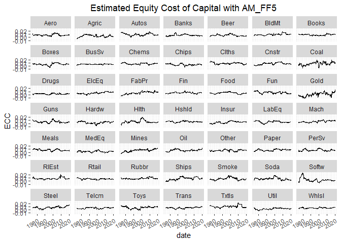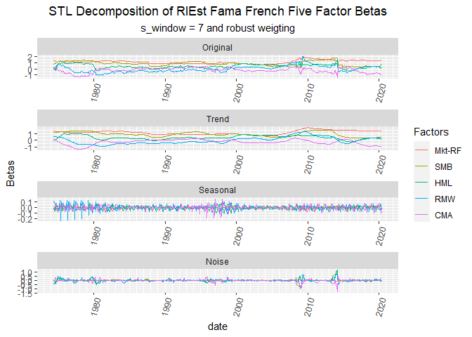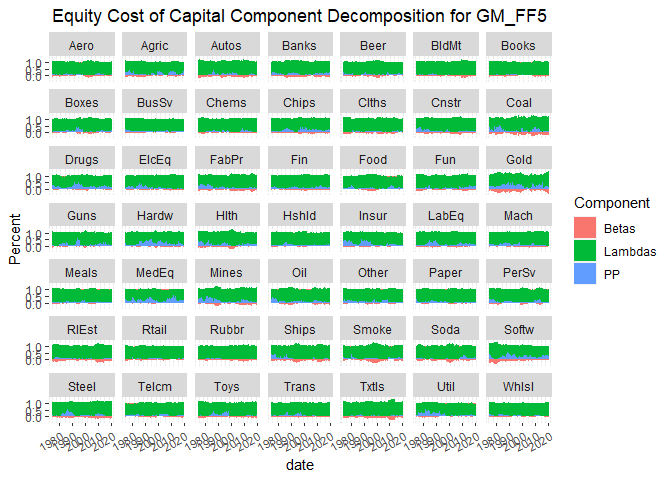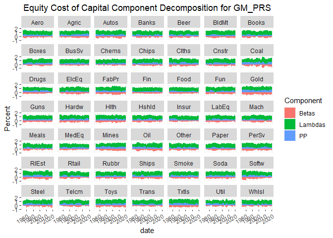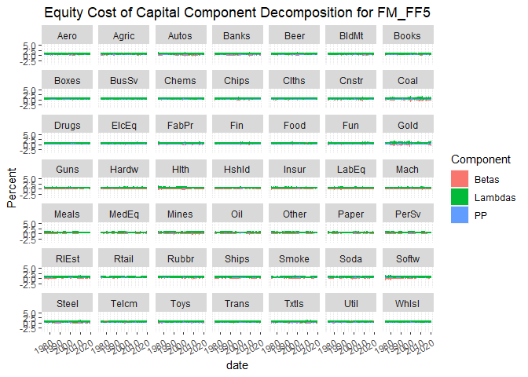

Beta estimation's noise or seasonal pattern is much smaller than trend so the noise weight or the s\_winow does not impact the result as much. We are safe by just using the no robust weighting and s\_window = 7 and that would make the left- and right-hand-side of the second step regression treated the same.

Now, we will take the desired no robust weighting, s\_window = 7 trend results of the Industry Risk Premium and Betas to estimate the factor risk premium.

### Filtered Second Pass Regression

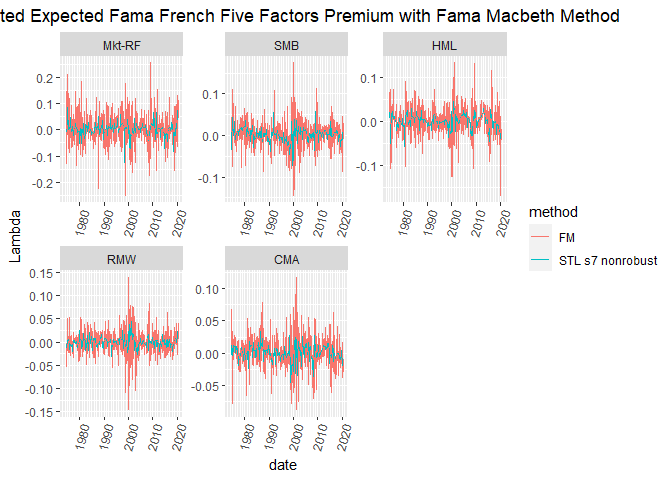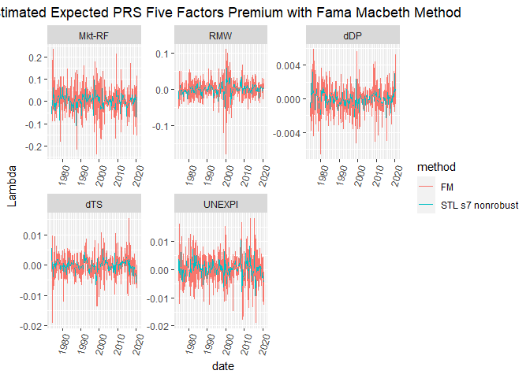

For robustness check, we also computed the factor risk premium based on other filterings.

### Unfiltered vs. Filtered Lambdas

Let's plot the unfiltered lambda together with filtered lamdba to see the effect of filtering on lambda.

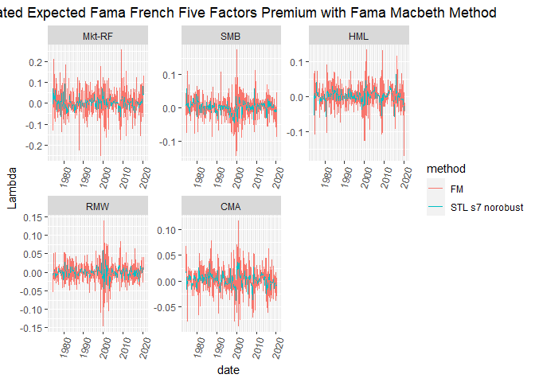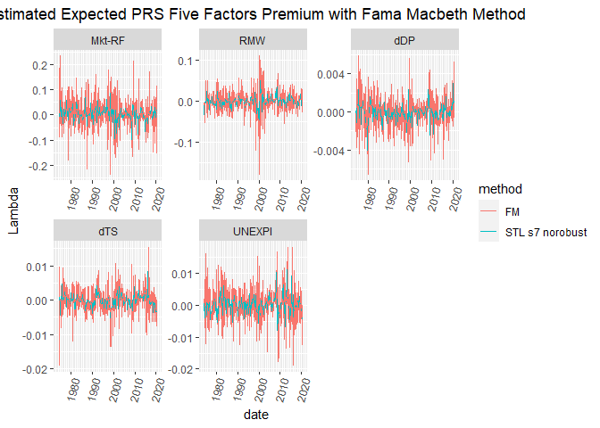
<table class="table table-striped" style="font-size: 10px; width: auto !important; margin-left: auto; margin-right: auto;">
<caption style="font-size: initial !important;">
Correlation between FM lambda and STL filtered FM lambda
</caption>
<thead>
<tr>
<th style="border-bottom:hidden; padding-bottom:0; padding-left:3px;padding-right:3px;text-align: center; " colspan="2">
FF5

</th>
<th style="border-bottom:hidden; padding-bottom:0; padding-left:3px;padding-right:3px;text-align: center; " colspan="2">
PRS

</th>
</tr>
<tr>
<th style="text-align:center;">
Factors
</th>
<th style="text-align:center;">
FF5
</th>
<th style="text-align:center;">
Factors
</th>
<th style="text-align:center;">
PRS
</th>
</tr>
</thead>
<tbody>
<tr>
<td style="text-align:center;">
Mkt-RF
</td>
<td style="text-align:center;">
0.2809086
</td>
<td style="text-align:center;">
Mkt-RF
</td>
<td style="text-align:center;">
0.3097107
</td>
</tr>
<tr>
<td style="text-align:center;">
SMB
</td>
<td style="text-align:center;">
0.3057474
</td>
<td style="text-align:center;">
RMW
</td>
<td style="text-align:center;">
0.3356899
</td>
</tr>
<tr>
<td style="text-align:center;">
HML
</td>
<td style="text-align:center;">
0.3986346
</td>
<td style="text-align:center;">
dDP
</td>
<td style="text-align:center;">
0.3250162
</td>
</tr>
<tr>
<td style="text-align:center;">
RMW
</td>
<td style="text-align:center;">
0.3065257
</td>
<td style="text-align:center;">
dTS
</td>
<td style="text-align:center;">
0.3919244
</td>
</tr>
<tr>
<td style="text-align:center;">
CMA
</td>
<td style="text-align:center;">
0.3566713
</td>
<td style="text-align:center;">
UNEXPI
</td>
<td style="text-align:center;">
0.3666048
</td>
</tr>
</tbody>
</table>
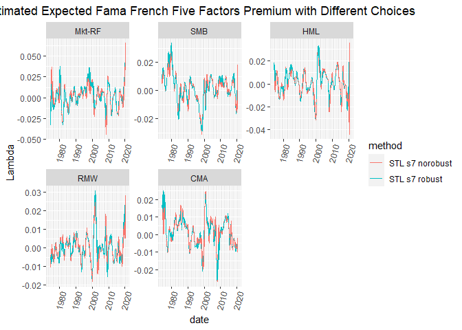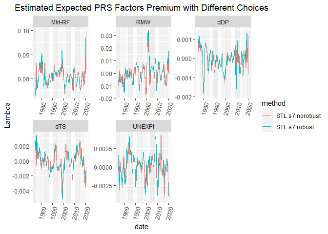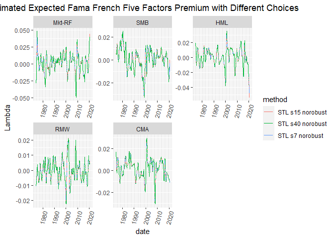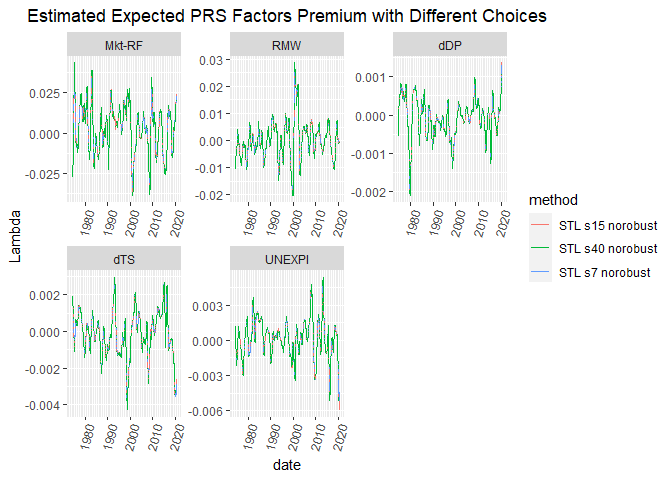

Here is a comparison of the lambda statitics of the Normal Fama Macbeth and Fama Macbeth Second Step Regression with STL Trend Data.

<table class="table table-striped" style="font-size: 10px; width: auto !important; margin-left: auto; margin-right: auto;">
<caption style="font-size: initial !important;">
Fama French Five Factors Lambdas
</caption>
<thead>
<tr>
<th style="text-align:center;">
method
</th>
<th style="text-align:center;">
stats
</th>
<th style="text-align:center;">
Mkt-RF
</th>
<th style="text-align:center;">
SMB
</th>
<th style="text-align:center;">
HML
</th>
<th style="text-align:center;">
RMW
</th>
<th style="text-align:center;">
CMA
</th>
</tr>
</thead>
<tbody>
<tr>
<td style="text-align:center;font-weight: bold;vertical-align: middle !important;" rowspan="4">
FM\_FF5
</td>
<td style="text-align:center;">
mean
</td>
<td style="text-align:center;">
0.0009206
</td>
<td style="text-align:center;">
0.0008839
</td>
<td style="text-align:center;">
-0.0001184
</td>
<td style="text-align:center;">
0.0000019
</td>
<td style="text-align:center;">
0.0016968
</td>
</tr>
<tr>
<td style="text-align:center;">
variance
</td>
<td style="text-align:center;">
0.0035331
</td>
<td style="text-align:center;">
0.0011442
</td>
<td style="text-align:center;">
0.0012661
</td>
<td style="text-align:center;">
0.0007741
</td>
<td style="text-align:center;">
0.0006425
</td>
</tr>
<tr>
<td style="text-align:center;">
skewness
</td>
<td style="text-align:center;">
0.0613148
</td>
<td style="text-align:center;">
0.0164253
</td>
<td style="text-align:center;">
-0.3765078
</td>
<td style="text-align:center;">
-0.1904382
</td>
<td style="text-align:center;">
0.0781917
</td>
</tr>
<tr>
<td style="text-align:center;">
kurtosis
</td>
<td style="text-align:center;">
4.7140032
</td>
<td style="text-align:center;">
5.3531912
</td>
<td style="text-align:center;">
5.3248040
</td>
<td style="text-align:center;">
6.6515963
</td>
<td style="text-align:center;">
4.8082920
</td>
</tr>
<tr>
<td style="text-align:center;font-weight: bold;vertical-align: middle !important;" rowspan="4">
FM\_STL\_7\_N\_FF5
</td>
<td style="text-align:center;">
mean
</td>
<td style="text-align:center;">
0.0009169
</td>
<td style="text-align:center;">
0.0008576
</td>
<td style="text-align:center;">
0.0001610
</td>
<td style="text-align:center;">
-0.0001068
</td>
<td style="text-align:center;">
0.0014072
</td>
</tr>
<tr>
<td style="text-align:center;">
variance
</td>
<td style="text-align:center;">
0.0001617
</td>
<td style="text-align:center;">
0.0000824
</td>
<td style="text-align:center;">
0.0001248
</td>
<td style="text-align:center;">
0.0000396
</td>
<td style="text-align:center;">
0.0000631
</td>
</tr>
<tr>
<td style="text-align:center;">
skewness
</td>
<td style="text-align:center;">
-0.2901826
</td>
<td style="text-align:center;">
-0.6573037
</td>
<td style="text-align:center;">
-0.6300605
</td>
<td style="text-align:center;">
0.2965183
</td>
<td style="text-align:center;">
-0.2970504
</td>
</tr>
<tr>
<td style="text-align:center;">
kurtosis
</td>
<td style="text-align:center;">
4.1940171
</td>
<td style="text-align:center;">
4.0609313
</td>
<td style="text-align:center;">
4.2132542
</td>
<td style="text-align:center;">
3.9235887
</td>
<td style="text-align:center;">
3.9154914
</td>
</tr>
<tr>
<td style="text-align:center;font-weight: bold;vertical-align: middle !important;" rowspan="4">
FM\_STL\_7\_R\_FF5
</td>
<td style="text-align:center;">
mean
</td>
<td style="text-align:center;">
0.0023354
</td>
<td style="text-align:center;">
0.0018155
</td>
<td style="text-align:center;">
0.0014755
</td>
<td style="text-align:center;">
0.0001053
</td>
<td style="text-align:center;">
0.0012233
</td>
</tr>
<tr>
<td style="text-align:center;">
variance
</td>
<td style="text-align:center;">
0.0002197
</td>
<td style="text-align:center;">
0.0001267
</td>
<td style="text-align:center;">
0.0001272
</td>
<td style="text-align:center;">
0.0000639
</td>
<td style="text-align:center;">
0.0000845
</td>
</tr>
<tr>
<td style="text-align:center;">
skewness
</td>
<td style="text-align:center;">
0.4835045
</td>
<td style="text-align:center;">
-0.0237384
</td>
<td style="text-align:center;">
-0.0547911
</td>
<td style="text-align:center;">
1.3471319
</td>
<td style="text-align:center;">
-0.0392041
</td>
</tr>
<tr>
<td style="text-align:center;">
kurtosis
</td>
<td style="text-align:center;">
4.1156765
</td>
<td style="text-align:center;">
3.7808177
</td>
<td style="text-align:center;">
3.7829491
</td>
<td style="text-align:center;">
6.1440455
</td>
<td style="text-align:center;">
3.5978300
</td>
</tr>
<tr>
<td style="text-align:center;font-weight: bold;vertical-align: middle !important;" rowspan="4">
FM\_STL\_15\_N\_FF5
</td>
<td style="text-align:center;">
mean
</td>
<td style="text-align:center;">
0.0009053
</td>
<td style="text-align:center;">
0.0009258
</td>
<td style="text-align:center;">
0.0001742
</td>
<td style="text-align:center;">
-0.0000982
</td>
<td style="text-align:center;">
0.0014459
</td>
</tr>
<tr>
<td style="text-align:center;">
variance
</td>
<td style="text-align:center;">
0.0001771
</td>
<td style="text-align:center;">
0.0000859
</td>
<td style="text-align:center;">
0.0001344
</td>
<td style="text-align:center;">
0.0000432
</td>
<td style="text-align:center;">
0.0000668
</td>
</tr>
<tr>
<td style="text-align:center;">
skewness
</td>
<td style="text-align:center;">
-0.2568095
</td>
<td style="text-align:center;">
-0.6492242
</td>
<td style="text-align:center;">
-0.6460881
</td>
<td style="text-align:center;">
0.2695698
</td>
<td style="text-align:center;">
-0.2829756
</td>
</tr>
<tr>
<td style="text-align:center;">
kurtosis
</td>
<td style="text-align:center;">
4.1972859
</td>
<td style="text-align:center;">
4.1023631
</td>
<td style="text-align:center;">
4.4382363
</td>
<td style="text-align:center;">
3.9208283
</td>
<td style="text-align:center;">
4.0443417
</td>
</tr>
<tr>
<td style="text-align:center;font-weight: bold;vertical-align: middle !important;" rowspan="4">
FM\_STL\_15\_R\_FF5
</td>
<td style="text-align:center;">
mean
</td>
<td style="text-align:center;">
0.0014554
</td>
<td style="text-align:center;">
0.0005479
</td>
<td style="text-align:center;">
0.0028069
</td>
<td style="text-align:center;">
-0.0000882
</td>
<td style="text-align:center;">
0.0022204
</td>
</tr>
<tr>
<td style="text-align:center;">
variance
</td>
<td style="text-align:center;">
0.0002490
</td>
<td style="text-align:center;">
0.0001308
</td>
<td style="text-align:center;">
0.0001517
</td>
<td style="text-align:center;">
0.0000740
</td>
<td style="text-align:center;">
0.0000964
</td>
</tr>
<tr>
<td style="text-align:center;">
skewness
</td>
<td style="text-align:center;">
0.0672169
</td>
<td style="text-align:center;">
-0.0999953
</td>
<td style="text-align:center;">
0.1340959
</td>
<td style="text-align:center;">
1.3941833
</td>
<td style="text-align:center;">
-0.1189277
</td>
</tr>
<tr>
<td style="text-align:center;">
kurtosis
</td>
<td style="text-align:center;">
4.4986219
</td>
<td style="text-align:center;">
4.0981905
</td>
<td style="text-align:center;">
3.8243706
</td>
<td style="text-align:center;">
6.3089138
</td>
<td style="text-align:center;">
3.4069165
</td>
</tr>
<tr>
<td style="text-align:center;font-weight: bold;vertical-align: middle !important;" rowspan="4">
FM\_STL\_40\_N\_FF5
</td>
<td style="text-align:center;">
mean
</td>
<td style="text-align:center;">
0.0008515
</td>
<td style="text-align:center;">
0.0009618
</td>
<td style="text-align:center;">
0.0001793
</td>
<td style="text-align:center;">
-0.0000952
</td>
<td style="text-align:center;">
0.0014960
</td>
</tr>
<tr>
<td style="text-align:center;">
variance
</td>
<td style="text-align:center;">
0.0002003
</td>
<td style="text-align:center;">
0.0000921
</td>
<td style="text-align:center;">
0.0001482
</td>
<td style="text-align:center;">
0.0000485
</td>
<td style="text-align:center;">
0.0000721
</td>
</tr>
<tr>
<td style="text-align:center;">
skewness
</td>
<td style="text-align:center;">
-0.2529346
</td>
<td style="text-align:center;">
-0.6383236
</td>
<td style="text-align:center;">
-0.6796585
</td>
<td style="text-align:center;">
0.2145877
</td>
<td style="text-align:center;">
-0.2505602
</td>
</tr>
<tr>
<td style="text-align:center;">
kurtosis
</td>
<td style="text-align:center;">
4.1679005
</td>
<td style="text-align:center;">
4.1141203
</td>
<td style="text-align:center;">
4.8523896
</td>
<td style="text-align:center;">
3.8930036
</td>
<td style="text-align:center;">
4.2831417
</td>
</tr>
<tr>
<td style="text-align:center;font-weight: bold;vertical-align: middle !important;" rowspan="4">
FM\_STL\_40\_R\_FF5
</td>
<td style="text-align:center;">
mean
</td>
<td style="text-align:center;">
0.0003214
</td>
<td style="text-align:center;">
0.0002565
</td>
<td style="text-align:center;">
0.0027363
</td>
<td style="text-align:center;">
0.0010921
</td>
<td style="text-align:center;">
0.0024037
</td>
</tr>
<tr>
<td style="text-align:center;">
variance
</td>
<td style="text-align:center;">
0.0003015
</td>
<td style="text-align:center;">
0.0001421
</td>
<td style="text-align:center;">
0.0001759
</td>
<td style="text-align:center;">
0.0000999
</td>
<td style="text-align:center;">
0.0001048
</td>
</tr>
<tr>
<td style="text-align:center;">
skewness
</td>
<td style="text-align:center;">
-0.0245818
</td>
<td style="text-align:center;">
-0.0810395
</td>
<td style="text-align:center;">
0.3537355
</td>
<td style="text-align:center;">
1.7939921
</td>
<td style="text-align:center;">
-0.1110245
</td>
</tr>
<tr>
<td style="text-align:center;">
kurtosis
</td>
<td style="text-align:center;">
4.2678003
</td>
<td style="text-align:center;">
3.8290542
</td>
<td style="text-align:center;">
4.7967089
</td>
<td style="text-align:center;">
7.4833593
</td>
<td style="text-align:center;">
3.9556680
</td>
</tr>
<tr>
<td style="text-align:center;font-weight: bold;vertical-align: middle !important;" rowspan="4">
RAM\_FF5
</td>
<td style="text-align:center;">
mean
</td>
<td style="text-align:center;">
0.0051121
</td>
<td style="text-align:center;">
0.0022967
</td>
<td style="text-align:center;">
0.0032389
</td>
<td style="text-align:center;">
0.0027066
</td>
<td style="text-align:center;">
0.0030245
</td>
</tr>
<tr>
<td style="text-align:center;">
variance
</td>
<td style="text-align:center;">
0.0000280
</td>
<td style="text-align:center;">
0.0000284
</td>
<td style="text-align:center;">
0.0000156
</td>
<td style="text-align:center;">
0.0000075
</td>
<td style="text-align:center;">
0.0000093
</td>
</tr>
<tr>
<td style="text-align:center;">
skewness
</td>
<td style="text-align:center;">
0.0223254
</td>
<td style="text-align:center;">
0.3948825
</td>
<td style="text-align:center;">
0.1498031
</td>
<td style="text-align:center;">
0.1038219
</td>
<td style="text-align:center;">
0.5005268
</td>
</tr>
<tr>
<td style="text-align:center;">
kurtosis
</td>
<td style="text-align:center;">
2.3686070
</td>
<td style="text-align:center;">
2.2736340
</td>
<td style="text-align:center;">
2.9118074
</td>
<td style="text-align:center;">
3.4515945
</td>
<td style="text-align:center;">
3.1245590
</td>
</tr>
<tr>
<td style="text-align:center;font-weight: bold;vertical-align: middle !important;" rowspan="4">
RGM\_FF5
</td>
<td style="text-align:center;">
mean
</td>
<td style="text-align:center;">
0.0041103
</td>
<td style="text-align:center;">
0.0018484
</td>
<td style="text-align:center;">
0.0028396
</td>
<td style="text-align:center;">
0.0024631
</td>
<td style="text-align:center;">
0.0028268
</td>
</tr>
<tr>
<td style="text-align:center;">
variance
</td>
<td style="text-align:center;">
0.0000300
</td>
<td style="text-align:center;">
0.0000280
</td>
<td style="text-align:center;">
0.0000152
</td>
<td style="text-align:center;">
0.0000070
</td>
<td style="text-align:center;">
0.0000089
</td>
</tr>
<tr>
<td style="text-align:center;">
skewness
</td>
<td style="text-align:center;">
0.0270841
</td>
<td style="text-align:center;">
0.3753467
</td>
<td style="text-align:center;">
0.1104960
</td>
<td style="text-align:center;">
-0.0376499
</td>
<td style="text-align:center;">
0.4463740
</td>
</tr>
<tr>
<td style="text-align:center;">
kurtosis
</td>
<td style="text-align:center;">
2.2899895
</td>
<td style="text-align:center;">
2.2857798
</td>
<td style="text-align:center;">
2.9634918
</td>
<td style="text-align:center;">
3.3248415
</td>
<td style="text-align:center;">
3.0420264
</td>
</tr>
</tbody>
</table>
<table class="table table-striped" style="font-size: 10px; width: auto !important; margin-left: auto; margin-right: auto;">
<caption style="font-size: initial !important;">
PRS Five Factors Lambdas
</caption>
<thead>
<tr>
<th style="text-align:center;">
method
</th>
<th style="text-align:center;">
stats
</th>
<th style="text-align:center;">
Mkt-RF
</th>
<th style="text-align:center;">
RMW
</th>
<th style="text-align:center;">
dDP
</th>
<th style="text-align:center;">
dTS
</th>
<th style="text-align:center;">
UNEXPI
</th>
</tr>
</thead>
<tbody>
<tr>
<td style="text-align:center;font-weight: bold;vertical-align: middle !important;" rowspan="4">
FM\_PRS
</td>
<td style="text-align:center;">
mean
</td>
<td style="text-align:center;">
0.0030404
</td>
<td style="text-align:center;">
-0.0003644
</td>
<td style="text-align:center;">
-0.0000901
</td>
<td style="text-align:center;">
-0.0002660
</td>
<td style="text-align:center;">
0.0001747
</td>
</tr>
<tr>
<td style="text-align:center;">
variance
</td>
<td style="text-align:center;">
0.0035777
</td>
<td style="text-align:center;">
0.0007241
</td>
<td style="text-align:center;">
0.0000028
</td>
<td style="text-align:center;">
0.0000140
</td>
<td style="text-align:center;">
0.0000281
</td>
</tr>
<tr>
<td style="text-align:center;">
skewness
</td>
<td style="text-align:center;">
-0.0273199
</td>
<td style="text-align:center;">
-0.3864678
</td>
<td style="text-align:center;">
-0.0642360
</td>
<td style="text-align:center;">
-0.2376992
</td>
<td style="text-align:center;">
-0.1347035
</td>
</tr>
<tr>
<td style="text-align:center;">
kurtosis
</td>
<td style="text-align:center;">
4.5708798
</td>
<td style="text-align:center;">
8.2197855
</td>
<td style="text-align:center;">
4.0558342
</td>
<td style="text-align:center;">
5.1619650
</td>
<td style="text-align:center;">
4.1129898
</td>
</tr>
<tr>
<td style="text-align:center;font-weight: bold;vertical-align: middle !important;" rowspan="4">
FM\_STL\_7\_N\_PRS
</td>
<td style="text-align:center;">
mean
</td>
<td style="text-align:center;">
0.0028521
</td>
<td style="text-align:center;">
-0.0000253
</td>
<td style="text-align:center;">
-0.0000870
</td>
<td style="text-align:center;">
-0.0001537
</td>
<td style="text-align:center;">
0.0001343
</td>
</tr>
<tr>
<td style="text-align:center;">
variance
</td>
<td style="text-align:center;">
0.0001819
</td>
<td style="text-align:center;">
0.0000422
</td>
<td style="text-align:center;">
0.0000002
</td>
<td style="text-align:center;">
0.0000013
</td>
<td style="text-align:center;">
0.0000022
</td>
</tr>
<tr>
<td style="text-align:center;">
skewness
</td>
<td style="text-align:center;">
-0.3867400
</td>
<td style="text-align:center;">
0.5529366
</td>
<td style="text-align:center;">
-0.6394382
</td>
<td style="text-align:center;">
-0.4680775
</td>
<td style="text-align:center;">
-0.0985485
</td>
</tr>
<tr>
<td style="text-align:center;">
kurtosis
</td>
<td style="text-align:center;">
2.6264145
</td>
<td style="text-align:center;">
5.0606465
</td>
<td style="text-align:center;">
3.8998268
</td>
<td style="text-align:center;">
3.7024677
</td>
<td style="text-align:center;">
3.4317730
</td>
</tr>
<tr>
<td style="text-align:center;font-weight: bold;vertical-align: middle !important;" rowspan="4">
FM\_STL\_7\_R\_PRS
</td>
<td style="text-align:center;">
mean
</td>
<td style="text-align:center;">
0.0048316
</td>
<td style="text-align:center;">
0.0002500
</td>
<td style="text-align:center;">
-0.0000652
</td>
<td style="text-align:center;">
-0.0000115
</td>
<td style="text-align:center;">
0.0001580
</td>
</tr>
<tr>
<td style="text-align:center;">
variance
</td>
<td style="text-align:center;">
0.0003694
</td>
<td style="text-align:center;">
0.0000835
</td>
<td style="text-align:center;">
0.0000003
</td>
<td style="text-align:center;">
0.0000023
</td>
<td style="text-align:center;">
0.0000027
</td>
</tr>
<tr>
<td style="text-align:center;">
skewness
</td>
<td style="text-align:center;">
1.1716160
</td>
<td style="text-align:center;">
1.1195744
</td>
<td style="text-align:center;">
-0.1987520
</td>
<td style="text-align:center;">
-0.4494639
</td>
<td style="text-align:center;">
-0.1137109
</td>
</tr>
<tr>
<td style="text-align:center;">
kurtosis
</td>
<td style="text-align:center;">
5.5181944
</td>
<td style="text-align:center;">
5.5613718
</td>
<td style="text-align:center;">
3.3966819
</td>
<td style="text-align:center;">
3.9265398
</td>
<td style="text-align:center;">
2.9942818
</td>
</tr>
<tr>
<td style="text-align:center;font-weight: bold;vertical-align: middle !important;" rowspan="4">
FM\_STL\_15\_N\_PRS
</td>
<td style="text-align:center;">
mean
</td>
<td style="text-align:center;">
0.0028459
</td>
<td style="text-align:center;">
-0.0000201
</td>
<td style="text-align:center;">
-0.0000844
</td>
<td style="text-align:center;">
-0.0001513
</td>
<td style="text-align:center;">
0.0001354
</td>
</tr>
<tr>
<td style="text-align:center;">
variance
</td>
<td style="text-align:center;">
0.0002006
</td>
<td style="text-align:center;">
0.0000463
</td>
<td style="text-align:center;">
0.0000002
</td>
<td style="text-align:center;">
0.0000014
</td>
<td style="text-align:center;">
0.0000024
</td>
</tr>
<tr>
<td style="text-align:center;">
skewness
</td>
<td style="text-align:center;">
-0.3383328
</td>
<td style="text-align:center;">
0.5629326
</td>
<td style="text-align:center;">
-0.6280301
</td>
<td style="text-align:center;">
-0.3996510
</td>
<td style="text-align:center;">
-0.1374253
</td>
</tr>
<tr>
<td style="text-align:center;">
kurtosis
</td>
<td style="text-align:center;">
2.6865896
</td>
<td style="text-align:center;">
5.1264430
</td>
<td style="text-align:center;">
3.9938723
</td>
<td style="text-align:center;">
3.5736046
</td>
<td style="text-align:center;">
3.7351725
</td>
</tr>
<tr>
<td style="text-align:center;font-weight: bold;vertical-align: middle !important;" rowspan="4">
FM\_STL\_15\_R\_PRS
</td>
<td style="text-align:center;">
mean
</td>
<td style="text-align:center;">
0.0030962
</td>
<td style="text-align:center;">
0.0001498
</td>
<td style="text-align:center;">
-0.0000627
</td>
<td style="text-align:center;">
-0.0000375
</td>
<td style="text-align:center;">
0.0001829
</td>
</tr>
<tr>
<td style="text-align:center;">
variance
</td>
<td style="text-align:center;">
0.0003847
</td>
<td style="text-align:center;">
0.0000989
</td>
<td style="text-align:center;">
0.0000004
</td>
<td style="text-align:center;">
0.0000018
</td>
<td style="text-align:center;">
0.0000032
</td>
</tr>
<tr>
<td style="text-align:center;">
skewness
</td>
<td style="text-align:center;">
0.6888132
</td>
<td style="text-align:center;">
1.5175611
</td>
<td style="text-align:center;">
-0.3047020
</td>
<td style="text-align:center;">
-0.7947410
</td>
<td style="text-align:center;">
-0.2737071
</td>
</tr>
<tr>
<td style="text-align:center;">
kurtosis
</td>
<td style="text-align:center;">
3.9701082
</td>
<td style="text-align:center;">
6.9679393
</td>
<td style="text-align:center;">
4.3914594
</td>
<td style="text-align:center;">
4.8774427
</td>
<td style="text-align:center;">
2.9840755
</td>
</tr>
<tr>
<td style="text-align:center;font-weight: bold;vertical-align: middle !important;" rowspan="4">
FM\_STL\_40\_N\_PRS
</td>
<td style="text-align:center;">
mean
</td>
<td style="text-align:center;">
0.0027853
</td>
<td style="text-align:center;">
-0.0000274
</td>
<td style="text-align:center;">
-0.0000813
</td>
<td style="text-align:center;">
-0.0001531
</td>
<td style="text-align:center;">
0.0001387
</td>
</tr>
<tr>
<td style="text-align:center;">
variance
</td>
<td style="text-align:center;">
0.0002298
</td>
<td style="text-align:center;">
0.0000522
</td>
<td style="text-align:center;">
0.0000003
</td>
<td style="text-align:center;">
0.0000015
</td>
<td style="text-align:center;">
0.0000028
</td>
</tr>
<tr>
<td style="text-align:center;">
skewness
</td>
<td style="text-align:center;">
-0.2632043
</td>
<td style="text-align:center;">
0.5733363
</td>
<td style="text-align:center;">
-0.6233064
</td>
<td style="text-align:center;">
-0.3734142
</td>
<td style="text-align:center;">
-0.1799027
</td>
</tr>
<tr>
<td style="text-align:center;">
kurtosis
</td>
<td style="text-align:center;">
2.8530838
</td>
<td style="text-align:center;">
5.1989471
</td>
<td style="text-align:center;">
4.1530394
</td>
<td style="text-align:center;">
3.6624226
</td>
<td style="text-align:center;">
4.0965316
</td>
</tr>
<tr>
<td style="text-align:center;font-weight: bold;vertical-align: middle !important;" rowspan="4">
FM\_STL\_40\_R\_PRS
</td>
<td style="text-align:center;">
mean
</td>
<td style="text-align:center;">
0.0021119
</td>
<td style="text-align:center;">
0.0012497
</td>
<td style="text-align:center;">
-0.0000503
</td>
<td style="text-align:center;">
-0.0000173
</td>
<td style="text-align:center;">
0.0001135
</td>
</tr>
<tr>
<td style="text-align:center;">
variance
</td>
<td style="text-align:center;">
0.0004269
</td>
<td style="text-align:center;">
0.0001144
</td>
<td style="text-align:center;">
0.0000004
</td>
<td style="text-align:center;">
0.0000020
</td>
<td style="text-align:center;">
0.0000033
</td>
</tr>
<tr>
<td style="text-align:center;">
skewness
</td>
<td style="text-align:center;">
0.3892191
</td>
<td style="text-align:center;">
1.8377496
</td>
<td style="text-align:center;">
-0.2644296
</td>
<td style="text-align:center;">
-0.5805282
</td>
<td style="text-align:center;">
-0.2972629
</td>
</tr>
<tr>
<td style="text-align:center;">
kurtosis
</td>
<td style="text-align:center;">
4.0713385
</td>
<td style="text-align:center;">
7.8565730
</td>
<td style="text-align:center;">
4.3591247
</td>
<td style="text-align:center;">
4.8254372
</td>
<td style="text-align:center;">
3.0974217
</td>
</tr>
<tr>
<td style="text-align:center;font-weight: bold;vertical-align: middle !important;" rowspan="4">
RAM\_PRS
</td>
<td style="text-align:center;">
mean
</td>
<td style="text-align:center;">
0.0051121
</td>
<td style="text-align:center;">
0.0027066
</td>
<td style="text-align:center;">
0.0000226
</td>
<td style="text-align:center;">
0.0003300
</td>
<td style="text-align:center;">
0.0002188
</td>
</tr>
<tr>
<td style="text-align:center;">
variance
</td>
<td style="text-align:center;">
0.0000280
</td>
<td style="text-align:center;">
0.0000075
</td>
<td style="text-align:center;">
0.0000001
</td>
<td style="text-align:center;">
0.0000002
</td>
<td style="text-align:center;">
0.0000002
</td>
</tr>
<tr>
<td style="text-align:center;">
skewness
</td>
<td style="text-align:center;">
0.0223254
</td>
<td style="text-align:center;">
0.1038219
</td>
<td style="text-align:center;">
-0.0597998
</td>
<td style="text-align:center;">
-0.3634110
</td>
<td style="text-align:center;">
-0.4190866
</td>
</tr>
<tr>
<td style="text-align:center;">
kurtosis
</td>
<td style="text-align:center;">
2.3686070
</td>
<td style="text-align:center;">
3.4515945
</td>
<td style="text-align:center;">
3.4759408
</td>
<td style="text-align:center;">
2.9208853
</td>
<td style="text-align:center;">
3.2613141
</td>
</tr>
<tr>
<td style="text-align:center;font-weight: bold;vertical-align: middle !important;" rowspan="4">
RGM\_PRS
</td>
<td style="text-align:center;">
mean
</td>
<td style="text-align:center;">
0.0041103
</td>
<td style="text-align:center;">
0.0024631
</td>
<td style="text-align:center;">
0.0000220
</td>
<td style="text-align:center;">
0.0003271
</td>
<td style="text-align:center;">
0.0002139
</td>
</tr>
<tr>
<td style="text-align:center;">
variance
</td>
<td style="text-align:center;">
0.0000300
</td>
<td style="text-align:center;">
0.0000070
</td>
<td style="text-align:center;">
0.0000001
</td>
<td style="text-align:center;">
0.0000002
</td>
<td style="text-align:center;">
0.0000002
</td>
</tr>
<tr>
<td style="text-align:center;">
skewness
</td>
<td style="text-align:center;">
0.0270841
</td>
<td style="text-align:center;">
-0.0376499
</td>
<td style="text-align:center;">
-0.0610550
</td>
<td style="text-align:center;">
-0.3657935
</td>
<td style="text-align:center;">
-0.4211790
</td>
</tr>
<tr>
<td style="text-align:center;">
kurtosis
</td>
<td style="text-align:center;">
2.2899895
</td>
<td style="text-align:center;">
3.3248415
</td>
<td style="text-align:center;">
3.4770569
</td>
<td style="text-align:center;">
2.9162949
</td>
<td style="text-align:center;">
3.2639812
</td>
</tr>
</tbody>
</table>
<table class="table table-striped" style="font-size: 10px; width: auto !important; margin-left: auto; margin-right: auto;">
<caption style="font-size: initial !important;">
Fama Macbeth/STL Lambda Variance Ratio
</caption>
<thead>
<tr>
<th style="border-bottom:hidden" colspan="1">
</th>
<th style="border-bottom:hidden; padding-bottom:0; padding-left:3px;padding-right:3px;text-align: center; " colspan="5">
FF5

</th>
<th style="border-bottom:hidden; padding-bottom:0; padding-left:3px;padding-right:3px;text-align: center; " colspan="5">
PRS

</th>
</tr>
<tr>
<th style="text-align:center;">
choice
</th>
<th style="text-align:center;">
Mkt-RF
</th>
<th style="text-align:center;">
SMB
</th>
<th style="text-align:center;">
HML
</th>
<th style="text-align:center;">
RMW
</th>
<th style="text-align:center;">
CMA
</th>
<th style="text-align:center;">
Mkt-RF
</th>
<th style="text-align:center;">
RMW
</th>
<th style="text-align:center;">
dDP
</th>
<th style="text-align:center;">
dTS
</th>
<th style="text-align:center;">
UNEXPI
</th>
</tr>
</thead>
<tbody>
<tr>
<td style="text-align:center;">
s7 norobust
</td>
<td style="text-align:center;">
21.85474
</td>
<td style="text-align:center;">
13.893706
</td>
<td style="text-align:center;">
10.147232
</td>
<td style="text-align:center;">
19.542212
</td>
<td style="text-align:center;">
10.174911
</td>
<td style="text-align:center;">
19.664275
</td>
<td style="text-align:center;">
17.151662
</td>
<td style="text-align:center;">
12.080440
</td>
<td style="text-align:center;">
10.593209
</td>
<td style="text-align:center;">
12.772731
</td>
</tr>
<tr>
<td style="text-align:center;">
s7 robust
</td>
<td style="text-align:center;">
16.08214
</td>
<td style="text-align:center;">
9.029846
</td>
<td style="text-align:center;">
9.954308
</td>
<td style="text-align:center;">
12.115460
</td>
<td style="text-align:center;">
7.604545
</td>
<td style="text-align:center;">
9.685563
</td>
<td style="text-align:center;">
8.669114
</td>
<td style="text-align:center;">
8.235851
</td>
<td style="text-align:center;">
6.180349
</td>
<td style="text-align:center;">
10.224582
</td>
</tr>
<tr>
<td style="text-align:center;">
s15 norobust
</td>
<td style="text-align:center;">
19.94637
</td>
<td style="text-align:center;">
13.321952
</td>
<td style="text-align:center;">
9.422448
</td>
<td style="text-align:center;">
17.906818
</td>
<td style="text-align:center;">
9.615717
</td>
<td style="text-align:center;">
17.839318
</td>
<td style="text-align:center;">
15.648692
</td>
<td style="text-align:center;">
11.298903
</td>
<td style="text-align:center;">
10.146088
</td>
<td style="text-align:center;">
11.549200
</td>
</tr>
<tr>
<td style="text-align:center;">
s15 robust
</td>
<td style="text-align:center;">
14.19080
</td>
<td style="text-align:center;">
8.746450
</td>
<td style="text-align:center;">
8.345887
</td>
<td style="text-align:center;">
10.457744
</td>
<td style="text-align:center;">
6.667607
</td>
<td style="text-align:center;">
9.300689
</td>
<td style="text-align:center;">
7.319491
</td>
<td style="text-align:center;">
6.753918
</td>
<td style="text-align:center;">
7.652446
</td>
<td style="text-align:center;">
8.650162
</td>
</tr>
<tr>
<td style="text-align:center;">
s40 norobust
</td>
<td style="text-align:center;">
17.63603
</td>
<td style="text-align:center;">
12.418562
</td>
<td style="text-align:center;">
8.545732
</td>
<td style="text-align:center;">
15.964284
</td>
<td style="text-align:center;">
8.916961
</td>
<td style="text-align:center;">
15.570008
</td>
<td style="text-align:center;">
13.880617
</td>
<td style="text-align:center;">
10.423163
</td>
<td style="text-align:center;">
9.315444
</td>
<td style="text-align:center;">
10.193307
</td>
</tr>
<tr>
<td style="text-align:center;">
s40 robust
</td>
<td style="text-align:center;">
11.71660
</td>
<td style="text-align:center;">
8.051106
</td>
<td style="text-align:center;">
7.199064
</td>
<td style="text-align:center;">
7.747815
</td>
<td style="text-align:center;">
6.133166
</td>
<td style="text-align:center;">
8.381438
</td>
<td style="text-align:center;">
6.331959
</td>
<td style="text-align:center;">
6.309182
</td>
<td style="text-align:center;">
6.868849
</td>
<td style="text-align:center;">
8.391715
</td>
</tr>
</tbody>
</table>
5. Equity Cost of Captial
-------------------------

### 5.1 Estimated Equity Cost of Captial

As the equation indicates, *E**C**C* = ∑*i* ∈ *F**β**i* \* *E*\[*F**i*\]+*R**f*. We will ignore the risk free rate part and the Equity Cost of Capital in this section refers to the estimated risk premium.

### 5.1.1 Arithmetic Mean

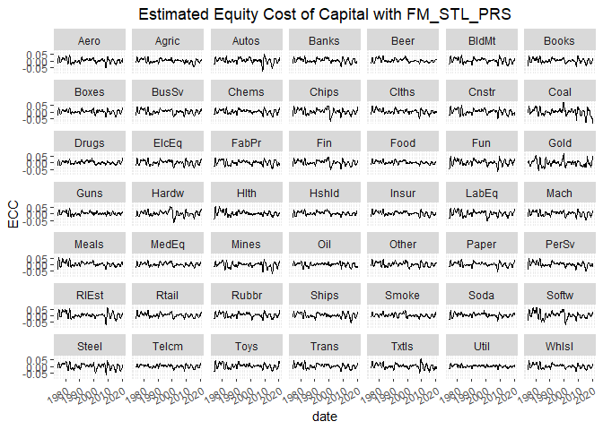

### 5.1.2 Geometric Mean

### 5.1.3 Fama Macbeth Second Step Regression

### 5.1.4 Fama Macbeth Second Step Regression with STL Trend Data

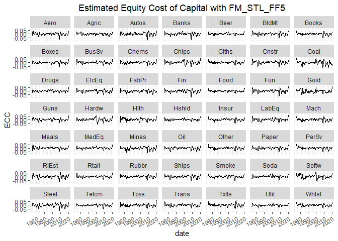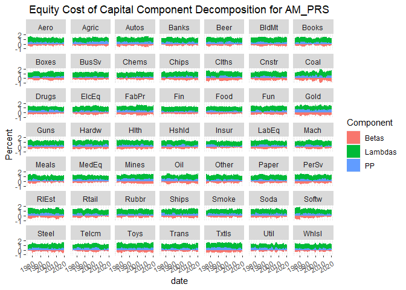

### 5.2 Comparative Statics

<table class="table table-striped" style="font-size: 10px; width: auto !important; margin-left: auto; margin-right: auto;">
<caption style="font-size: initial !important;">
Different Lambda Method Estimated ECC SSE
</caption>
<thead>
<tr>
<th style="text-align:center;">
Model
</th>
<th style="text-align:center;">
AM
</th>
<th style="text-align:center;">
GM
</th>
<th style="text-align:center;">
RAM
</th>
<th style="text-align:center;">
RGM
</th>
<th style="text-align:center;">
FM
</th>
<th style="text-align:center;">
FM\_STL\_7\_N
</th>
<th style="text-align:center;">
FM\_STL\_7\_R
</th>
<th style="text-align:center;">
FM\_STL\_15\_N
</th>
<th style="text-align:center;">
FM\_STL\_15\_R
</th>
<th style="text-align:center;">
FM\_STL\_40\_N
</th>
<th style="text-align:center;">
FM\_STL\_40\_R
</th>
<th style="text-align:center;">
0
</th>
<th style="text-align:center;">
Total Mean
</th>
<th style="text-align:center;">
Industry Mean
</th>
</tr>
</thead>
<tbody>
<tr>
<td style="text-align:center;font-weight: bold;">
FF5
</td>
<td style="text-align:center;">
121.1423
</td>
<td style="text-align:center;">
121.1661
</td>
<td style="text-align:center;">
120.6818
</td>
<td style="text-align:center;">
120.8422
</td>
<td style="text-align:center;">
68.08107
</td>
<td style="text-align:center;">
115.7277
</td>
<td style="text-align:center;">
122.2132
</td>
<td style="text-align:center;">
115.0399
</td>
<td style="text-align:center;">
122.9775
</td>
<td style="text-align:center;">
113.9920
</td>
<td style="text-align:center;">
121.8112
</td>
<td style="text-align:center;">
122.2910
</td>
<td style="text-align:center;">
120.8953
</td>
<td style="text-align:center;">
120.738
</td>
</tr>
<tr>
<td style="text-align:center;font-weight: bold;">
PRS
</td>
<td style="text-align:center;">
120.9655
</td>
<td style="text-align:center;">
121.0273
</td>
<td style="text-align:center;">
120.6923
</td>
<td style="text-align:center;">
120.9091
</td>
<td style="text-align:center;">
70.06878
</td>
<td style="text-align:center;">
115.8041
</td>
<td style="text-align:center;">
127.0703
</td>
<td style="text-align:center;">
115.1036
</td>
<td style="text-align:center;">
126.6139
</td>
<td style="text-align:center;">
114.0873
</td>
<td style="text-align:center;">
124.8268
</td>
<td style="text-align:center;">
122.2386
</td>
<td style="text-align:center;">
120.8257
</td>
<td style="text-align:center;">
120.738
</td>
</tr>
</tbody>
</table>
Based on the Sum Squared Error, the Fama Macbeth Method has the lowest error explaining the Portfolio Risk Premium (This is because the FM second step regression applied the least square method). The STL decomposition with no robust weight works better than the one with robust weight; the FM\_STL lambda works slightly better than the Arithmetic Mean and the Geometric Mean.

Here we would compare the Estimated ECC from FM method and Filtered FM method:

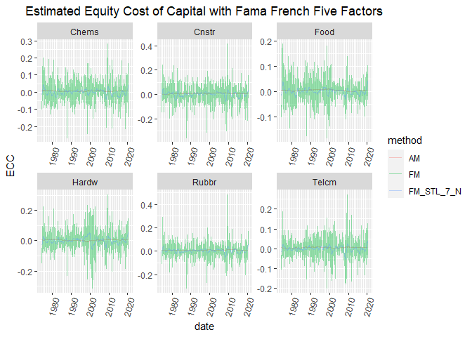

### 5.3 Decomposition of the Equity Cost of Captial

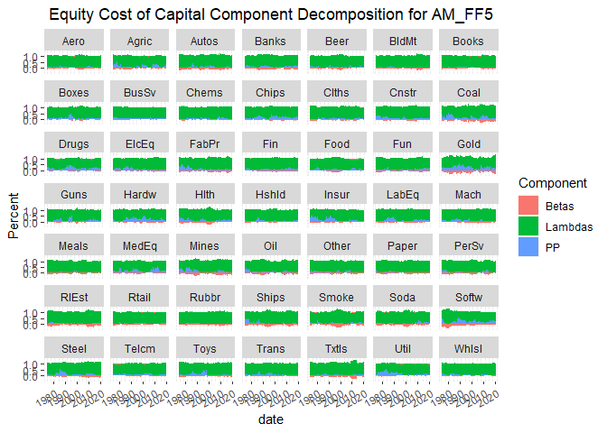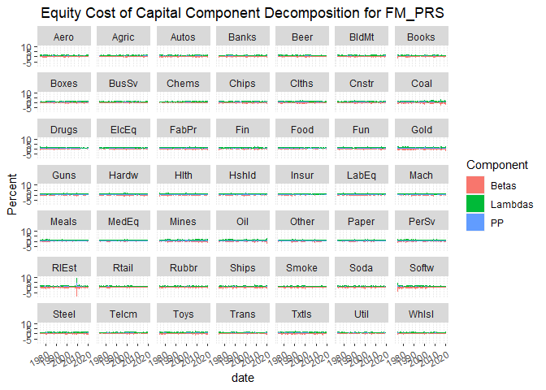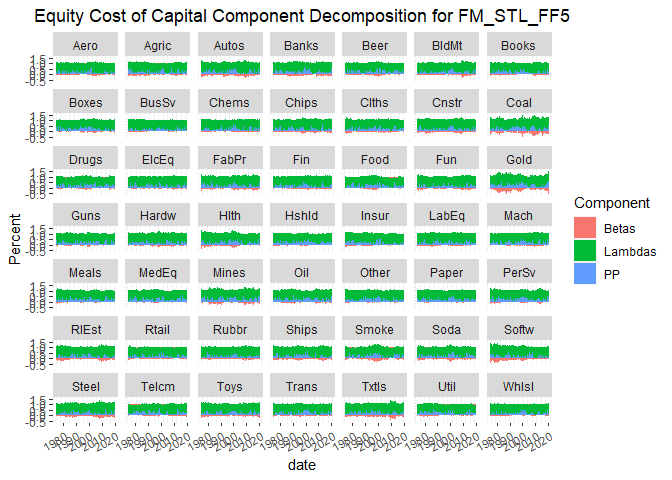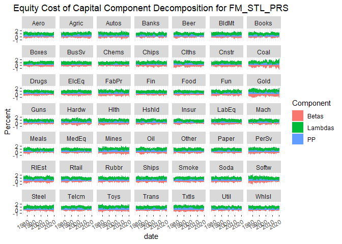

### 5.4 Forcasting???

We can try to apply the previous methods to forecast the ECC and compare the accuracy. There is a STL method of forcasting so we might be able to use STL to forcast betas and industry risk premium and perform the second step regression to obtain the lambda. Then we can calculate the ECC.
