Industry Equity Cost of Capital
================
Mike Aguilar, Bob Connolly, and Jiaxi Li

-   <a href="#s1-introduction" id="toc-s1-introduction">S1 Introduction</a>
-   <a href="#s2-data" id="toc-s2-data">S2 Data</a>
    -   <a href="#s2-1-industry-return-and-fama-french-five-factors"
        id="toc-s2-1-industry-return-and-fama-french-five-factors">S2-1 Industry
        Return and Fama French Five Factors</a>
    -   <a href="#s2-2-traded-prs-five-factors"
        id="toc-s2-2-traded-prs-five-factors">S2-2 Traded PRS Five Factors</a>
-   <a href="#s3-first-pass-regression" id="toc-s3-first-pass-regression">S3
    First-Pass Regression</a>
    -   <a href="#s3-1-fama-french-five-factor-model"
        id="toc-s3-1-fama-french-five-factor-model">S3-1 Fama French Five Factor
        Model</a>
        -   <a href="#s3-1-1-full-sample-estimation"
            id="toc-s3-1-1-full-sample-estimation">S3-1-1 Full Sample Estimation</a>
        -   <a href="#s3-1-2-rolling-window-estimation"
            id="toc-s3-1-2-rolling-window-estimation">S3-1-2 Rolling Window
            Estimation</a>
        -   <a href="#s3-1-3-full-sample-estimation-with-stl-trend"
            id="toc-s3-1-3-full-sample-estimation-with-stl-trend">S3-1-3 Full Sample
            Estimation with STL Trend</a>
        -   <a href="#s3-1-4-rolling-window-estimation-with-stl-trend"
            id="toc-s3-1-4-rolling-window-estimation-with-stl-trend">S3-1-4 Rolling
            Window Estimation with STL Trend</a>
        -   <a href="#s3-1-5-full-sample-estimation-with-panel-regression"
            id="toc-s3-1-5-full-sample-estimation-with-panel-regression">S3-1-5 Full
            Sample Estimation with Panel Regression</a>
        -   <a href="#s3-1-6-rolling-window-estimation-with-panel-regression"
            id="toc-s3-1-6-rolling-window-estimation-with-panel-regression">S3-1-6
            Rolling Window Estimation with Panel Regression</a>
    -   <a href="#s3-2-prs-five-factor-model"
        id="toc-s3-2-prs-five-factor-model">S3-2 PRS Five Factor Model</a>
        -   <a href="#s3-2-1-full-sample-estimation"
            id="toc-s3-2-1-full-sample-estimation">S3-2-1 Full Sample Estimation</a>
        -   <a href="#s3-2-2-rolling-window-estimation"
            id="toc-s3-2-2-rolling-window-estimation">S3-2-2 Rolling Window
            Estimation</a>
        -   <a href="#s3-2-3-full-sample-estimation-with-stl-trend"
            id="toc-s3-2-3-full-sample-estimation-with-stl-trend">S3-2-3 Full Sample
            Estimation with STL Trend</a>
        -   <a href="#s3-2-4-rolling-window-estimation-with-stl-trend"
            id="toc-s3-2-4-rolling-window-estimation-with-stl-trend">S3-2-4 Rolling
            Window Estimation with STL Trend</a>
-   <a href="#s4-factor-premium-estimation"
    id="toc-s4-factor-premium-estimation">S4 Factor Premium Estimation</a>
    -   <a href="#s4-1-arithmetic-mean" id="toc-s4-1-arithmetic-mean">S4-1
        Arithmetic Mean</a>
    -   <a href="#s4-2-geometric-mean" id="toc-s4-2-geometric-mean">S4-2
        Geometric Mean</a>
    -   <a href="#s4-3-fama-macbeth-second-step-regression"
        id="toc-s4-3-fama-macbeth-second-step-regression">S4-3 Fama Macbeth
        Second Step Regression</a>
    -   <a
        href="#s4-4-fama-macbeth-second-step-regression-with-stl-deseaoned-data"
        id="toc-s4-4-fama-macbeth-second-step-regression-with-stl-deseaoned-data">S4-4
        Fama Macbeth Second Step Regression with STL Deseaoned Data</a>
        -   <a href="#s4-4-1-stl-filtering" id="toc-s4-4-1-stl-filtering">S4-4-1 STL
            Filtering</a>
        -   <a href="#s4-4-2-filtered-seasonality-and-trend-strength"
            id="toc-s4-4-2-filtered-seasonality-and-trend-strength">S4-4-2 Filtered
            Seasonality and Trend Strength</a>
        -   <a href="#s4-4-3-beta-decomposition"
            id="toc-s4-4-3-beta-decomposition">S4-4-3 Beta Decomposition</a>
        -   <a href="#s4-4-4-filtered-second-pass-regression"
            id="toc-s4-4-4-filtered-second-pass-regression">S4-4-4 Filtered Second
            Pass Regression</a>
        -   <a href="#s4-4-5-component-second-pass-regression-comparison"
            id="toc-s4-4-5-component-second-pass-regression-comparison">S4-4-5
            Component Second Pass Regression Comparison</a>
        -   <a href="#s4-4-6-regression-standard-error"
            id="toc-s4-4-6-regression-standard-error">S4-4-6 Regression Standard
            Error</a>
        -   <a href="#s4-4-7-unfiltered-and-filtered-lambdas"
            id="toc-s4-4-7-unfiltered-and-filtered-lambdas">S4-4-7 Unfiltered and
            Filtered Lambdas</a>
        -   <a href="#s4-4-8-ks-test-and-stats"
            id="toc-s4-4-8-ks-test-and-stats">S4-4-8 KS test and Stats</a>
    -   <a href="#s4-5-why-filtering-might-improve-esimated-lamdba"
        id="toc-s4-5-why-filtering-might-improve-esimated-lamdba">S4-5 Why
        filtering might improve Esimated Lamdba?</a>
        -   <a href="#s4-5-1-biased-regression"
            id="toc-s4-5-1-biased-regression">S4-5-1 Biased Regression</a>
        -   <a href="#s4-5-2-simulation" id="toc-s4-5-2-simulation">S4-5-2
            Simulation</a>
            -   <a href="#s4-5-2-1-simulation-with-random-parameters-and-sin-lamdba"
                id="toc-s4-5-2-1-simulation-with-random-parameters-and-sin-lamdba">S4-5-2-1
                Simulation with Random Parameters and Sin Lamdba</a>
            -   <a
                href="#s4-5-2-2-simulation-with-random-parameter-and-random-smooth-lambda"
                id="toc-s4-5-2-2-simulation-with-random-parameter-and-random-smooth-lambda">S4-5-2-2
                Simulation with Random Parameter and Random Smooth Lambda</a>
            -   <a href="#s4-5-2-3-simulation-with-actual-parameters-and-smooth-lambdas"
                id="toc-s4-5-2-3-simulation-with-actual-parameters-and-smooth-lambdas">S4-5-2-3
                Simulation with Actual Parameters and Smooth Lambdas</a>
            -   <a href="#s4-5-2-4-regression-analysis-of-simulation-results"
                id="toc-s4-5-2-4-regression-analysis-of-simulation-results">S4-5-2-4
                Regression Analysis of Simulation Results</a>
    -   <a href="#s4-6-robustness-check" id="toc-s4-6-robustness-check">S4-6
        Robustness Check</a>
        -   <a href="#s4-6-1-auxiliary-regression-at-each-t"
            id="toc-s4-6-1-auxiliary-regression-at-each-t">S4-6-1 Auxiliary
            Regression at each t</a>
        -   <a href="#s4-6-2-panel-auxiliary-regression"
            id="toc-s4-6-2-panel-auxiliary-regression">S4-6-2 Panel Auxiliary
            Regression</a>
        -   <a
            href="#s4-6-3-long-regression-with-omitted-variable-periodic-and-noise"
            id="toc-s4-6-3-long-regression-with-omitted-variable-periodic-and-noise">S4-6-3
            Long Regression with omitted variable (Periodic and Noise)</a>
        -   <a href="#s4-6-4-second-pass-panel-regression-comparison"
            id="toc-s4-6-4-second-pass-panel-regression-comparison">S4-6-4 Second
            Pass Panel Regression Comparison</a>
        -   <a href="#s4-6-5-plot-comparison-when-estimates-are-different"
            id="toc-s4-6-5-plot-comparison-when-estimates-are-different">S4-6-5 Plot
            Comparison when Estimates are Different</a>
    -   <a href="#s4-7-other-test-portfolios-under-filtering"
        id="toc-s4-7-other-test-portfolios-under-filtering">S4-7 Other Test
        Portfolios under Filtering</a>
        -   <a href="#s4-7-1-strength-of-each-component"
            id="toc-s4-7-1-strength-of-each-component">S4-7-1 Strength of each
            component</a>
        -   <a href="#s4-7-2-5-year-rolling-ff5-betas"
            id="toc-s4-7-2-5-year-rolling-ff5-betas">S4-7-2 5-year Rolling FF5
            Betas</a>
        -   <a href="#s4-7-3-second-pass-and-auxilary-regressions"
            id="toc-s4-7-3-second-pass-and-auxilary-regressions">S4-7-3 Second-pass
            and Auxilary Regressions</a>
        -   <a href="#s4-7-4-long-regression-and-comparisons"
            id="toc-s4-7-4-long-regression-and-comparisons">S4-7-4 Long-regression
            and Comparisons</a>
-   <a href="#s5-equity-cost-of-captial"
    id="toc-s5-equity-cost-of-captial">S5 Equity Cost of Captial</a>
    -   <a href="#s5-1-estimated-equity-cost-of-captial"
        id="toc-s5-1-estimated-equity-cost-of-captial">S5-1 Estimated Equity
        Cost of Captial</a>
        -   <a href="#s5-1-1-arithmetic-mean" id="toc-s5-1-1-arithmetic-mean">S5-1-1
            Arithmetic Mean</a>
        -   <a href="#s5-1-2-geometric-mean" id="toc-s5-1-2-geometric-mean">S5-1-2
            Geometric Mean</a>
        -   <a href="#s5-1-3-fama-macbeth-second-step-regression"
            id="toc-s5-1-3-fama-macbeth-second-step-regression">S5-1-3 Fama Macbeth
            Second Step Regression</a>
        -   <a
            href="#s5-1-4-fama-macbeth-second-step-regression-with-stl-trend-data"
            id="toc-s5-1-4-fama-macbeth-second-step-regression-with-stl-trend-data">S5-1-4
            Fama Macbeth Second Step Regression with STL Trend Data</a>
    -   <a href="#s5-2-comparative-statics"
        id="toc-s5-2-comparative-statics">S5-2 Comparative Statics</a>
    -   <a href="#s5-3-bootstrap-standard-error"
        id="toc-s5-3-bootstrap-standard-error">S5-3 Bootstrap Standard Error</a>
    -   <a href="#s5-4-decomposition-of-the-equity-cost-of-captial"
        id="toc-s5-4-decomposition-of-the-equity-cost-of-captial">S5-4
        Decomposition of the Equity Cost of Captial</a>
    -   <a href="#s5-5-forcasting" id="toc-s5-5-forcasting">S5-5
        Forcasting???</a>
    -   <a href="#s5-6-ecc-with-consumption-growth"
        id="toc-s5-6-ecc-with-consumption-growth">S5-6 ECC with Consumption
        Growth???</a>
    -   <a href="#s5-7-improve-am-gm-with-markov-switching-model"
        id="toc-s5-7-improve-am-gm-with-markov-switching-model">S5-7 Improve AM
        GM with Markov-switching model???</a>
    -   <a href="#s5-8-levi-welch-beta" id="toc-s5-8-levi-welch-beta">S5-8
        Levi-Welch Beta???</a>
    -   <a href="#s5-9-filtering-method-in-other-second-pass-regression"
        id="toc-s5-9-filtering-method-in-other-second-pass-regression">S5-9
        Filtering Method in Other Second-pass Regression???</a>
-   <a href="#s6-recreated-figures-for-acl"
    id="toc-s6-recreated-figures-for-acl">S6 Recreated Figures for ACL</a>

# S1 Introduction

In 1997, Fama and French attempted to calculate the equity cost of
capital (ECC) for the industry portfolios. They employed the CAPM and
Fama French three-factor model and applied various techniques to
estimate the factor loadings. The conclusion was the ECC estimation is
not reliable due to the imprecise factor risk premium and the uncertain
risk loadings. It has been 23 years and we will try to find a possible
improvement of the ECC estimation in this paper.

For the model selection, we will apply the Fama French five-factor model
(2013) and the PRS five-factor model (2018). Since the five-factor model
is an update of the three-factor model, it should work better than the
three-factor model. Pukthuanthong et al. (2018) showed that there are 5
factors are reasonable: the market factor, profitability factor, and
traded version of credit spread, term spread, and unexpected inflation.
We will also use their result to form the Industry Equity Cost of
Capital.

We will use the 5-year rolling window to estimate the factor loadings of
the ECC. Many other methods such as Bayes shrinkage, and Levi-Welch
(2017) method. Levi and Welch tried to estimate the ECC while focusing
on the factor exposure estimation and let the reader choose their own
methods of expected factor premium. However, we found that the factor
risk premiums is the more important piece in ECC estimation. In this
paper, we will focus on finding a way to estimate the expected factor
premium better.

Many papers mentioned that the expected factor premiums are evolving. We
will therefore apply the Fama Macbeth (1973) method to estimate the
expected factor premium. Since the 2nd step regression result is
extremely volatile, we will apply the STL filtering to smooth the
result.

# S2 Data

We get the monthly industry return, Fama French five-factor, and the
risk-free rate for the Fama French five factors data from the [Ken
French Data
Library](https://mba.tuck.dartmouth.edu/pages/faculty/ken.french/data_library.html).
The market factor and profitability factor of the PRS five factors are
from the Fama French five factors. The other 3 traded macro factors and
risk-free rates are extracted from the [Federal Reserve Bank of
St. Louis Economic Data (FRED)](https://fred.stlouisfed.org/) and
constructed based on Pukthuanthong et al. (2018).

## S2-1 Industry Return and Fama French Five Factors

The [Fama French Five
Factors](https://mba.tuck.dartmouth.edu/pages/faculty/ken.french/data_library.html)
are simple returns from July 1963 to June 2020. They are as follows:
Rm-Rf, SMB, HML, RMW, CMA. The 49 Industry Portfolios are value-weighted
simple returns July 1926 to June 2020. The 49 Industry Portfolios
without any missing values started in July 1969, so we will start the
analysis in July 1969. The risk-free rate is one-month Treasury bill
rate.

<table class="table table-striped" style="font-size: 10px; width: auto !important; margin-left: auto; margin-right: auto;">
<caption style="font-size: initial !important;">
Descriptive Statistics for the FF5 Factors
</caption>
<thead>
<tr>
<th style="empty-cells: hide;border-bottom:hidden;" colspan="1">
</th>
<th style="border-bottom:hidden;padding-bottom:0; padding-left:3px;padding-right:3px;text-align: center; " colspan="7">

Statistics

</th>
</tr>
<tr>
<th style="text-align:center;">
Factors
</th>
<th style="text-align:center;">
mean
</th>
<th style="text-align:center;">
Median
</th>
<th style="text-align:center;">
5th Pct
</th>
<th style="text-align:center;">
95th Pct
</th>
<th style="text-align:center;">
StdDev
</th>
<th style="text-align:center;">
Skew
</th>
<th style="text-align:center;">
Kurt
</th>
</tr>
</thead>
<tbody>
<tr>
<td style="text-align:center;">
Mkt-RF
</td>
<td style="text-align:center;">
0.0054
</td>
<td style="text-align:center;">
0.0093
</td>
<td style="text-align:center;">
-0.0763
</td>
<td style="text-align:center;">
-0.0763
</td>
<td style="text-align:center;">
0.0457
</td>
<td style="text-align:center;">
-0.5410
</td>
<td style="text-align:center;">
4.8275
</td>
</tr>
<tr>
<td style="text-align:center;">
SMB
</td>
<td style="text-align:center;">
0.0014
</td>
<td style="text-align:center;">
0.0006
</td>
<td style="text-align:center;">
-0.0429
</td>
<td style="text-align:center;">
-0.0429
</td>
<td style="text-align:center;">
0.0302
</td>
<td style="text-align:center;">
0.3863
</td>
<td style="text-align:center;">
6.4993
</td>
</tr>
<tr>
<td style="text-align:center;">
HML
</td>
<td style="text-align:center;">
0.0024
</td>
<td style="text-align:center;">
0.0015
</td>
<td style="text-align:center;">
-0.0407
</td>
<td style="text-align:center;">
-0.0407
</td>
<td style="text-align:center;">
0.0298
</td>
<td style="text-align:center;">
-0.0627
</td>
<td style="text-align:center;">
5.3074
</td>
</tr>
<tr>
<td style="text-align:center;">
RMW
</td>
<td style="text-align:center;">
0.0029
</td>
<td style="text-align:center;">
0.0024
</td>
<td style="text-align:center;">
-0.0264
</td>
<td style="text-align:center;">
-0.0264
</td>
<td style="text-align:center;">
0.0221
</td>
<td style="text-align:center;">
-0.3422
</td>
<td style="text-align:center;">
15.4073
</td>
</tr>
<tr>
<td style="text-align:center;">
CMA
</td>
<td style="text-align:center;">
0.0029
</td>
<td style="text-align:center;">
0.0014
</td>
<td style="text-align:center;">
-0.0256
</td>
<td style="text-align:center;">
-0.0256
</td>
<td style="text-align:center;">
0.0199
</td>
<td style="text-align:center;">
0.3481
</td>
<td style="text-align:center;">
4.5915
</td>
</tr>
<tr>
<td style="text-align:center;">
RF
</td>
<td style="text-align:center;">
0.0038
</td>
<td style="text-align:center;">
0.0040
</td>
<td style="text-align:center;">
0.0000
</td>
<td style="text-align:center;">
0.0000
</td>
<td style="text-align:center;">
0.0028
</td>
<td style="text-align:center;">
0.6020
</td>
<td style="text-align:center;">
3.3587
</td>
</tr>
</tbody>
</table>
<table class="table table-striped" style="font-size: 10px; width: auto !important; margin-left: auto; margin-right: auto;">
<caption style="font-size: initial !important;">
Descriptive Statistics for the 49 Industry Portfolio Returns
</caption>
<thead>
<tr>
<th style="empty-cells: hide;border-bottom:hidden;" colspan="1">
</th>
<th style="border-bottom:hidden;padding-bottom:0; padding-left:3px;padding-right:3px;text-align: center; " colspan="7">

statistics

</th>
</tr>
<tr>
<th style="text-align:center;">
Industry
</th>
<th style="text-align:center;">
mean
</th>
<th style="text-align:center;">
Median
</th>
<th style="text-align:center;">
5th Pct
</th>
<th style="text-align:center;">
95th Pct
</th>
<th style="text-align:center;">
StdDev
</th>
<th style="text-align:center;">
Skew
</th>
<th style="text-align:center;">
Kurt
</th>
</tr>
</thead>
<tbody>
<tr>
<td style="text-align:center;">
Agric
</td>
<td style="text-align:center;">
0.0093
</td>
<td style="text-align:center;">
0.0082
</td>
<td style="text-align:center;">
-0.0920
</td>
<td style="text-align:center;">
-0.0920
</td>
<td style="text-align:center;">
0.0644
</td>
<td style="text-align:center;">
0.0339
</td>
<td style="text-align:center;">
4.7321
</td>
</tr>
<tr>
<td style="text-align:center;">
Food
</td>
<td style="text-align:center;">
0.0106
</td>
<td style="text-align:center;">
0.0101
</td>
<td style="text-align:center;">
-0.0633
</td>
<td style="text-align:center;">
-0.0633
</td>
<td style="text-align:center;">
0.0450
</td>
<td style="text-align:center;">
0.1026
</td>
<td style="text-align:center;">
5.0085
</td>
</tr>
<tr>
<td style="text-align:center;">
Soda
</td>
<td style="text-align:center;">
0.0110
</td>
<td style="text-align:center;">
0.0139
</td>
<td style="text-align:center;">
-0.0934
</td>
<td style="text-align:center;">
-0.0934
</td>
<td style="text-align:center;">
0.0646
</td>
<td style="text-align:center;">
0.1156
</td>
<td style="text-align:center;">
7.0876
</td>
</tr>
<tr>
<td style="text-align:center;">
Beer
</td>
<td style="text-align:center;">
0.0112
</td>
<td style="text-align:center;">
0.0112
</td>
<td style="text-align:center;">
-0.0733
</td>
<td style="text-align:center;">
-0.0733
</td>
<td style="text-align:center;">
0.0522
</td>
<td style="text-align:center;">
-0.0461
</td>
<td style="text-align:center;">
5.4091
</td>
</tr>
<tr>
<td style="text-align:center;">
Smoke
</td>
<td style="text-align:center;">
0.0136
</td>
<td style="text-align:center;">
0.0179
</td>
<td style="text-align:center;">
-0.0845
</td>
<td style="text-align:center;">
-0.0845
</td>
<td style="text-align:center;">
0.0622
</td>
<td style="text-align:center;">
-0.1316
</td>
<td style="text-align:center;">
5.4598
</td>
</tr>
<tr>
<td style="text-align:center;">
Toys
</td>
<td style="text-align:center;">
0.0077
</td>
<td style="text-align:center;">
0.0107
</td>
<td style="text-align:center;">
-0.1070
</td>
<td style="text-align:center;">
-0.1070
</td>
<td style="text-align:center;">
0.0722
</td>
<td style="text-align:center;">
-0.2487
</td>
<td style="text-align:center;">
4.3053
</td>
</tr>
<tr>
<td style="text-align:center;">
Fun
</td>
<td style="text-align:center;">
0.0133
</td>
<td style="text-align:center;">
0.0141
</td>
<td style="text-align:center;">
-0.1074
</td>
<td style="text-align:center;">
-0.1074
</td>
<td style="text-align:center;">
0.0777
</td>
<td style="text-align:center;">
-0.2208
</td>
<td style="text-align:center;">
5.8883
</td>
</tr>
<tr>
<td style="text-align:center;">
Books
</td>
<td style="text-align:center;">
0.0082
</td>
<td style="text-align:center;">
0.0051
</td>
<td style="text-align:center;">
-0.0849
</td>
<td style="text-align:center;">
-0.0849
</td>
<td style="text-align:center;">
0.0599
</td>
<td style="text-align:center;">
-0.0458
</td>
<td style="text-align:center;">
5.1192
</td>
</tr>
<tr>
<td style="text-align:center;">
Hshld
</td>
<td style="text-align:center;">
0.0086
</td>
<td style="text-align:center;">
0.0108
</td>
<td style="text-align:center;">
-0.0713
</td>
<td style="text-align:center;">
-0.0713
</td>
<td style="text-align:center;">
0.0467
</td>
<td style="text-align:center;">
-0.2878
</td>
<td style="text-align:center;">
4.9551
</td>
</tr>
<tr>
<td style="text-align:center;">
Clths
</td>
<td style="text-align:center;">
0.0106
</td>
<td style="text-align:center;">
0.0110
</td>
<td style="text-align:center;">
-0.0976
</td>
<td style="text-align:center;">
-0.0976
</td>
<td style="text-align:center;">
0.0666
</td>
<td style="text-align:center;">
-0.0852
</td>
<td style="text-align:center;">
5.3365
</td>
</tr>
<tr>
<td style="text-align:center;">
Hlth
</td>
<td style="text-align:center;">
0.0101
</td>
<td style="text-align:center;">
0.0106
</td>
<td style="text-align:center;">
-0.1147
</td>
<td style="text-align:center;">
-0.1147
</td>
<td style="text-align:center;">
0.0809
</td>
<td style="text-align:center;">
-0.0572
</td>
<td style="text-align:center;">
5.6450
</td>
</tr>
<tr>
<td style="text-align:center;">
MedEq
</td>
<td style="text-align:center;">
0.0106
</td>
<td style="text-align:center;">
0.0134
</td>
<td style="text-align:center;">
-0.0790
</td>
<td style="text-align:center;">
-0.0790
</td>
<td style="text-align:center;">
0.0531
</td>
<td style="text-align:center;">
-0.3774
</td>
<td style="text-align:center;">
4.3351
</td>
</tr>
<tr>
<td style="text-align:center;">
Drugs
</td>
<td style="text-align:center;">
0.0108
</td>
<td style="text-align:center;">
0.0105
</td>
<td style="text-align:center;">
-0.0731
</td>
<td style="text-align:center;">
-0.0731
</td>
<td style="text-align:center;">
0.0504
</td>
<td style="text-align:center;">
0.1545
</td>
<td style="text-align:center;">
5.6416
</td>
</tr>
<tr>
<td style="text-align:center;">
Chems
</td>
<td style="text-align:center;">
0.0098
</td>
<td style="text-align:center;">
0.0110
</td>
<td style="text-align:center;">
-0.0794
</td>
<td style="text-align:center;">
-0.0794
</td>
<td style="text-align:center;">
0.0578
</td>
<td style="text-align:center;">
-0.1793
</td>
<td style="text-align:center;">
5.1858
</td>
</tr>
<tr>
<td style="text-align:center;">
Rubbr
</td>
<td style="text-align:center;">
0.0101
</td>
<td style="text-align:center;">
0.0130
</td>
<td style="text-align:center;">
-0.0867
</td>
<td style="text-align:center;">
-0.0867
</td>
<td style="text-align:center;">
0.0605
</td>
<td style="text-align:center;">
-0.2301
</td>
<td style="text-align:center;">
5.7682
</td>
</tr>
<tr>
<td style="text-align:center;">
Txtls
</td>
<td style="text-align:center;">
0.0090
</td>
<td style="text-align:center;">
0.0114
</td>
<td style="text-align:center;">
-0.0958
</td>
<td style="text-align:center;">
-0.0958
</td>
<td style="text-align:center;">
0.0753
</td>
<td style="text-align:center;">
0.2066
</td>
<td style="text-align:center;">
11.8632
</td>
</tr>
<tr>
<td style="text-align:center;">
BldMt
</td>
<td style="text-align:center;">
0.0099
</td>
<td style="text-align:center;">
0.0121
</td>
<td style="text-align:center;">
-0.0890
</td>
<td style="text-align:center;">
-0.0890
</td>
<td style="text-align:center;">
0.0638
</td>
<td style="text-align:center;">
-0.1655
</td>
<td style="text-align:center;">
6.8245
</td>
</tr>
<tr>
<td style="text-align:center;">
Cnstr
</td>
<td style="text-align:center;">
0.0088
</td>
<td style="text-align:center;">
0.0088
</td>
<td style="text-align:center;">
-0.1040
</td>
<td style="text-align:center;">
-0.1040
</td>
<td style="text-align:center;">
0.0736
</td>
<td style="text-align:center;">
-0.2105
</td>
<td style="text-align:center;">
4.3162
</td>
</tr>
<tr>
<td style="text-align:center;">
Steel
</td>
<td style="text-align:center;">
0.0067
</td>
<td style="text-align:center;">
0.0065
</td>
<td style="text-align:center;">
-0.1154
</td>
<td style="text-align:center;">
-0.1154
</td>
<td style="text-align:center;">
0.0771
</td>
<td style="text-align:center;">
-0.2077
</td>
<td style="text-align:center;">
4.8999
</td>
</tr>
<tr>
<td style="text-align:center;">
FabPr
</td>
<td style="text-align:center;">
0.0069
</td>
<td style="text-align:center;">
0.0066
</td>
<td style="text-align:center;">
-0.1084
</td>
<td style="text-align:center;">
-0.1084
</td>
<td style="text-align:center;">
0.0742
</td>
<td style="text-align:center;">
-0.2411
</td>
<td style="text-align:center;">
4.5885
</td>
</tr>
<tr>
<td style="text-align:center;">
Mach
</td>
<td style="text-align:center;">
0.0097
</td>
<td style="text-align:center;">
0.0133
</td>
<td style="text-align:center;">
-0.0941
</td>
<td style="text-align:center;">
-0.0941
</td>
<td style="text-align:center;">
0.0640
</td>
<td style="text-align:center;">
-0.4279
</td>
<td style="text-align:center;">
5.2166
</td>
</tr>
<tr>
<td style="text-align:center;">
ElcEq
</td>
<td style="text-align:center;">
0.0112
</td>
<td style="text-align:center;">
0.0096
</td>
<td style="text-align:center;">
-0.0925
</td>
<td style="text-align:center;">
-0.0925
</td>
<td style="text-align:center;">
0.0638
</td>
<td style="text-align:center;">
-0.2499
</td>
<td style="text-align:center;">
4.5951
</td>
</tr>
<tr>
<td style="text-align:center;">
Autos
</td>
<td style="text-align:center;">
0.0088
</td>
<td style="text-align:center;">
0.0085
</td>
<td style="text-align:center;">
-0.0999
</td>
<td style="text-align:center;">
-0.0999
</td>
<td style="text-align:center;">
0.0712
</td>
<td style="text-align:center;">
0.2136
</td>
<td style="text-align:center;">
8.4154
</td>
</tr>
<tr>
<td style="text-align:center;">
Aero
</td>
<td style="text-align:center;">
0.0114
</td>
<td style="text-align:center;">
0.0148
</td>
<td style="text-align:center;">
-0.0983
</td>
<td style="text-align:center;">
-0.0983
</td>
<td style="text-align:center;">
0.0684
</td>
<td style="text-align:center;">
-0.5716
</td>
<td style="text-align:center;">
5.7663
</td>
</tr>
<tr>
<td style="text-align:center;">
Ships
</td>
<td style="text-align:center;">
0.0103
</td>
<td style="text-align:center;">
0.0116
</td>
<td style="text-align:center;">
-0.0988
</td>
<td style="text-align:center;">
-0.0988
</td>
<td style="text-align:center;">
0.0744
</td>
<td style="text-align:center;">
-0.0768
</td>
<td style="text-align:center;">
4.4743
</td>
</tr>
<tr>
<td style="text-align:center;">
Guns
</td>
<td style="text-align:center;">
0.0129
</td>
<td style="text-align:center;">
0.0139
</td>
<td style="text-align:center;">
-0.0940
</td>
<td style="text-align:center;">
-0.0940
</td>
<td style="text-align:center;">
0.0654
</td>
<td style="text-align:center;">
-0.2047
</td>
<td style="text-align:center;">
5.2214
</td>
</tr>
<tr>
<td style="text-align:center;">
Gold
</td>
<td style="text-align:center;">
0.0094
</td>
<td style="text-align:center;">
0.0053
</td>
<td style="text-align:center;">
-0.1583
</td>
<td style="text-align:center;">
-0.1583
</td>
<td style="text-align:center;">
0.1081
</td>
<td style="text-align:center;">
0.7748
</td>
<td style="text-align:center;">
7.5669
</td>
</tr>
<tr>
<td style="text-align:center;">
Mines
</td>
<td style="text-align:center;">
0.0097
</td>
<td style="text-align:center;">
0.0059
</td>
<td style="text-align:center;">
-0.1075
</td>
<td style="text-align:center;">
-0.1075
</td>
<td style="text-align:center;">
0.0764
</td>
<td style="text-align:center;">
-0.3025
</td>
<td style="text-align:center;">
4.6989
</td>
</tr>
<tr>
<td style="text-align:center;">
Coal
</td>
<td style="text-align:center;">
0.0084
</td>
<td style="text-align:center;">
0.0065
</td>
<td style="text-align:center;">
-0.1533
</td>
<td style="text-align:center;">
-0.1533
</td>
<td style="text-align:center;">
0.1094
</td>
<td style="text-align:center;">
0.1033
</td>
<td style="text-align:center;">
4.7758
</td>
</tr>
<tr>
<td style="text-align:center;">
Oil
</td>
<td style="text-align:center;">
0.0090
</td>
<td style="text-align:center;">
0.0088
</td>
<td style="text-align:center;">
-0.0961
</td>
<td style="text-align:center;">
-0.0961
</td>
<td style="text-align:center;">
0.0602
</td>
<td style="text-align:center;">
-0.0956
</td>
<td style="text-align:center;">
6.5773
</td>
</tr>
<tr>
<td style="text-align:center;">
Util
</td>
<td style="text-align:center;">
0.0087
</td>
<td style="text-align:center;">
0.0102
</td>
<td style="text-align:center;">
-0.0581
</td>
<td style="text-align:center;">
-0.0581
</td>
<td style="text-align:center;">
0.0410
</td>
<td style="text-align:center;">
-0.1991
</td>
<td style="text-align:center;">
4.1021
</td>
</tr>
<tr>
<td style="text-align:center;">
Telcm
</td>
<td style="text-align:center;">
0.0092
</td>
<td style="text-align:center;">
0.0116
</td>
<td style="text-align:center;">
-0.0748
</td>
<td style="text-align:center;">
-0.0748
</td>
<td style="text-align:center;">
0.0475
</td>
<td style="text-align:center;">
-0.2646
</td>
<td style="text-align:center;">
4.1808
</td>
</tr>
<tr>
<td style="text-align:center;">
PerSv
</td>
<td style="text-align:center;">
0.0058
</td>
<td style="text-align:center;">
0.0086
</td>
<td style="text-align:center;">
-0.1074
</td>
<td style="text-align:center;">
-0.1074
</td>
<td style="text-align:center;">
0.0670
</td>
<td style="text-align:center;">
-0.3687
</td>
<td style="text-align:center;">
4.8655
</td>
</tr>
<tr>
<td style="text-align:center;">
BusSv
</td>
<td style="text-align:center;">
0.0097
</td>
<td style="text-align:center;">
0.0150
</td>
<td style="text-align:center;">
-0.0796
</td>
<td style="text-align:center;">
-0.0796
</td>
<td style="text-align:center;">
0.0578
</td>
<td style="text-align:center;">
-0.4441
</td>
<td style="text-align:center;">
5.3757
</td>
</tr>
<tr>
<td style="text-align:center;">
Hardw
</td>
<td style="text-align:center;">
0.0089
</td>
<td style="text-align:center;">
0.0077
</td>
<td style="text-align:center;">
-0.0974
</td>
<td style="text-align:center;">
-0.0974
</td>
<td style="text-align:center;">
0.0718
</td>
<td style="text-align:center;">
-0.1928
</td>
<td style="text-align:center;">
4.6415
</td>
</tr>
<tr>
<td style="text-align:center;">
Softw
</td>
<td style="text-align:center;">
0.0106
</td>
<td style="text-align:center;">
0.0153
</td>
<td style="text-align:center;">
-0.1500
</td>
<td style="text-align:center;">
-0.1500
</td>
<td style="text-align:center;">
0.1053
</td>
<td style="text-align:center;">
0.6292
</td>
<td style="text-align:center;">
8.0571
</td>
</tr>
<tr>
<td style="text-align:center;">
Chips
</td>
<td style="text-align:center;">
0.0112
</td>
<td style="text-align:center;">
0.0163
</td>
<td style="text-align:center;">
-0.1009
</td>
<td style="text-align:center;">
-0.1009
</td>
<td style="text-align:center;">
0.0755
</td>
<td style="text-align:center;">
-0.3844
</td>
<td style="text-align:center;">
4.5711
</td>
</tr>
<tr>
<td style="text-align:center;">
LabEq
</td>
<td style="text-align:center;">
0.0106
</td>
<td style="text-align:center;">
0.0130
</td>
<td style="text-align:center;">
-0.0997
</td>
<td style="text-align:center;">
-0.0997
</td>
<td style="text-align:center;">
0.0710
</td>
<td style="text-align:center;">
-0.1871
</td>
<td style="text-align:center;">
4.1734
</td>
</tr>
<tr>
<td style="text-align:center;">
Paper
</td>
<td style="text-align:center;">
0.0094
</td>
<td style="text-align:center;">
0.0110
</td>
<td style="text-align:center;">
-0.0748
</td>
<td style="text-align:center;">
-0.0748
</td>
<td style="text-align:center;">
0.0556
</td>
<td style="text-align:center;">
0.0872
</td>
<td style="text-align:center;">
5.2398
</td>
</tr>
<tr>
<td style="text-align:center;">
Boxes
</td>
<td style="text-align:center;">
0.0097
</td>
<td style="text-align:center;">
0.0109
</td>
<td style="text-align:center;">
-0.0875
</td>
<td style="text-align:center;">
-0.0875
</td>
<td style="text-align:center;">
0.0574
</td>
<td style="text-align:center;">
-0.4038
</td>
<td style="text-align:center;">
4.9025
</td>
</tr>
<tr>
<td style="text-align:center;">
Trans
</td>
<td style="text-align:center;">
0.0093
</td>
<td style="text-align:center;">
0.0124
</td>
<td style="text-align:center;">
-0.0900
</td>
<td style="text-align:center;">
-0.0900
</td>
<td style="text-align:center;">
0.0588
</td>
<td style="text-align:center;">
-0.3041
</td>
<td style="text-align:center;">
4.2192
</td>
</tr>
<tr>
<td style="text-align:center;">
Whlsl
</td>
<td style="text-align:center;">
0.0092
</td>
<td style="text-align:center;">
0.0122
</td>
<td style="text-align:center;">
-0.0774
</td>
<td style="text-align:center;">
-0.0774
</td>
<td style="text-align:center;">
0.0554
</td>
<td style="text-align:center;">
-0.3764
</td>
<td style="text-align:center;">
5.4793
</td>
</tr>
<tr>
<td style="text-align:center;">
Rtail
</td>
<td style="text-align:center;">
0.0110
</td>
<td style="text-align:center;">
0.0084
</td>
<td style="text-align:center;">
-0.0798
</td>
<td style="text-align:center;">
-0.0798
</td>
<td style="text-align:center;">
0.0555
</td>
<td style="text-align:center;">
-0.1527
</td>
<td style="text-align:center;">
5.0659
</td>
</tr>
<tr>
<td style="text-align:center;">
Meals
</td>
<td style="text-align:center;">
0.0103
</td>
<td style="text-align:center;">
0.0138
</td>
<td style="text-align:center;">
-0.0882
</td>
<td style="text-align:center;">
-0.0882
</td>
<td style="text-align:center;">
0.0609
</td>
<td style="text-align:center;">
-0.5697
</td>
<td style="text-align:center;">
5.9677
</td>
</tr>
<tr>
<td style="text-align:center;">
Banks
</td>
<td style="text-align:center;">
0.0096
</td>
<td style="text-align:center;">
0.0114
</td>
<td style="text-align:center;">
-0.0956
</td>
<td style="text-align:center;">
-0.0956
</td>
<td style="text-align:center;">
0.0616
</td>
<td style="text-align:center;">
-0.3724
</td>
<td style="text-align:center;">
5.0932
</td>
</tr>
<tr>
<td style="text-align:center;">
Insur
</td>
<td style="text-align:center;">
0.0104
</td>
<td style="text-align:center;">
0.0150
</td>
<td style="text-align:center;">
-0.0875
</td>
<td style="text-align:center;">
-0.0875
</td>
<td style="text-align:center;">
0.0553
</td>
<td style="text-align:center;">
-0.3089
</td>
<td style="text-align:center;">
5.1223
</td>
</tr>
<tr>
<td style="text-align:center;">
RlEst
</td>
<td style="text-align:center;">
0.0051
</td>
<td style="text-align:center;">
0.0066
</td>
<td style="text-align:center;">
-0.1183
</td>
<td style="text-align:center;">
-0.1183
</td>
<td style="text-align:center;">
0.0793
</td>
<td style="text-align:center;">
0.6970
</td>
<td style="text-align:center;">
15.3387
</td>
</tr>
<tr>
<td style="text-align:center;">
Fin
</td>
<td style="text-align:center;">
0.0108
</td>
<td style="text-align:center;">
0.0139
</td>
<td style="text-align:center;">
-0.1064
</td>
<td style="text-align:center;">
-0.1064
</td>
<td style="text-align:center;">
0.0630
</td>
<td style="text-align:center;">
-0.4311
</td>
<td style="text-align:center;">
4.2221
</td>
</tr>
<tr>
<td style="text-align:center;">
Other
</td>
<td style="text-align:center;">
0.0043
</td>
<td style="text-align:center;">
0.0063
</td>
<td style="text-align:center;">
-0.1098
</td>
<td style="text-align:center;">
-0.1098
</td>
<td style="text-align:center;">
0.0680
</td>
<td style="text-align:center;">
-0.4956
</td>
<td style="text-align:center;">
4.7414
</td>
</tr>
</tbody>
</table>

## S2-2 Traded PRS Five Factors

In order to construct the traded version of PRS Factor, we first obtain
the risk-free rate and the raw CRR Five Factors: the Default Premium
(dDP), the Industrial Production Growth Rate (dIP), the Term Premium
(dTS), the Unexpected Inflation (UNEXPI), and the Change in Expected
Inflation (dEI). We obtained following macro variables from the Federal
Reserve Bank of St. Louis Economic Data: [Moody’s Seasoned Aaa Corporate
Bond Yield (Aaa)](https://fred.stlouisfed.org/series/AAA), [Moody’s
Seasoned Baa Corporate Bond Yield
(Baa)](https://fred.stlouisfed.org/series/BAA), [Industrial Production
Index (IP)](https://fred.stlouisfed.org/series/INDPRO), [10-Year
Treasury Constant Maturity Rate
(GS10)](https://fred.stlouisfed.org/series/GS10), [1-Year Treasury
Constant Maturity Rate (GS1)](https://fred.stlouisfed.org/series/GS1),
[Seasonally Adjusted CPI derived Inflation Rate
(INF)](https://fred.stlouisfed.org/series/CPIAUCSL), [University of
Michigan Inflation Expectation
(MICH)](https://fred.stlouisfed.org/series/MICH), [3-Month Treasury
Bill: Secondary Market Rate
(TB3MS)](https://fred.stlouisfed.org/series/TB3MS).

Here are the ways that the raw factors are calculated:

 - ln(IP_{t-1})")

![EXPINF\_{raw, t} = E\_{t-12}\[MICH_t\]](https://latex.codecogs.com/png.image?%5Cdpi%7B110%7D&space;%5Cbg_white&space;EXPINF_%7Braw%2C%20t%7D%20%3D%20E_%7Bt-12%7D%5BMICH_t%5D "EXPINF_{raw, t} = E_{t-12}[MICH_t]")

The Default Premium started in Janurary 1919; the Industrial Production
Growth Rate stared in Feburary 1919; the Term Premium started in April
1953; the Unexpected Inflation started in Janurary 1979; and the Change
in Expected Inflation started in Feburary 1979; 3-Month Treasury Bill:
Secondary Market Rate (TB3MS) started in Janurary 1934. Therefore, the
raw PRS factors would start in Feburary 1979. The Default Premium (dDP),
the Term Premium (dTS), the Unexpected Inflation (UNEXPI), the Change in
Expected Inflation (dEI), and 3-month Treasury Rate are annual rates so
they need to be converted to monthly frequency.

After obtaining the raw factors, we need to create the traded version of
these 5 factors. Similar to the Pukthuanthong et al. (2018) procedure,
we applied the 50 portfolios,
,
(the ten equal-weighted size portfolios, ten equal-weighted
book-to-market portfolios, ten equal-weighted investment portfolios and
ten equal-weighted operating profitability portfolios, and ten
value-weighted momentum portfolios) from the [Ken French Data
Library](https://mba.tuck.dartmouth.edu/pages/faculty/ken.french/data_library.html)
to construct the mimicking portfolios. These 50 portfolios all exist
after July 1963. We first regress each of the 50 assets against the raw
factors to get the coefficient matrix B (50x5) and the diagonal matrix
of the covariance matrix of the error term V (50x50). The weight of the
factor mimicking portfolio is
^{-1}B'V^{-1}").
The traded factors are PRS = wR, and they would start in July 1963.

# S3 First-Pass Regression

In this section, we will try to apply the simple first-pass regression
to estimate the betas of the 49 industry portfolios. The period would be
from July 1969 to June 2020. Since the focus of this paper is about the
factor risk premium estimation, we will use the most basic first pass
regressions (full sample and 5-year rolling window) to estimate the
betas and compare which lambda method would work better.

## S3-1 Fama French Five Factor Model

We will first apply the Fama French Five Factor Model to estimate the
betas. We will use the Five Factor Model as the base model.

### S3-1-1 Full Sample Estimation

<table class="table table-striped" style="font-size: 10px; width: auto !important; margin-left: auto; margin-right: auto;">
<caption style="font-size: initial !important;">
Fama French Five Factors
</caption>
<thead>
<tr>
<th style="empty-cells: hide;border-bottom:hidden;" colspan="1">
</th>
<th style="border-bottom:hidden;padding-bottom:0; padding-left:3px;padding-right:3px;text-align: center; " colspan="6">

Coefficients

</th>
<th style="border-bottom:hidden;padding-bottom:0; padding-left:3px;padding-right:3px;text-align: center; " colspan="6">

Std. Error

</th>
</tr>
<tr>
<th style="text-align:center;">
Industry
</th>
<th style="text-align:center;">
Alpha
</th>
<th style="text-align:center;">
Mkt-RF
</th>
<th style="text-align:center;">
SMB
</th>
<th style="text-align:center;">
HML
</th>
<th style="text-align:center;">
RMW
</th>
<th style="text-align:center;">
CMA
</th>
<th style="text-align:center;">
Alpha
</th>
<th style="text-align:center;">
Mkt-RF
</th>
<th style="text-align:center;">
SMB
</th>
<th style="text-align:center;">
HML
</th>
<th style="text-align:center;">
RMW
</th>
<th style="text-align:center;">
CMA
</th>
</tr>
</thead>
<tbody>
<tr>
<td style="text-align:center;font-weight: bold;">
Aero
</td>
<td style="text-align:center;">
-0.0017060
</td>
<td style="text-align:center;">
1.2085983
</td>
<td style="text-align:center;">
0.2931223
</td>
<td style="text-align:center;">
0.2753853
</td>
<td style="text-align:center;">
0.4994864
</td>
<td style="text-align:center;">
0.0879383
</td>
<td style="text-align:center;">
0.0017527
</td>
<td style="text-align:center;">
0.0418819
</td>
<td style="text-align:center;">
0.0607440
</td>
<td style="text-align:center;">
0.0786255
</td>
<td style="text-align:center;">
0.0832089
</td>
<td style="text-align:center;">
0.1241392
</td>
</tr>
<tr>
<td style="text-align:center;font-weight: bold;">
Agric
</td>
<td style="text-align:center;">
-0.0003846
</td>
<td style="text-align:center;">
0.8254045
</td>
<td style="text-align:center;">
0.4258726
</td>
<td style="text-align:center;">
-0.0810419
</td>
<td style="text-align:center;">
0.2175820
</td>
<td style="text-align:center;">
0.1406175
</td>
<td style="text-align:center;">
0.0020985
</td>
<td style="text-align:center;">
0.0501455
</td>
<td style="text-align:center;">
0.0727292
</td>
<td style="text-align:center;">
0.0941389
</td>
<td style="text-align:center;">
0.0996267
</td>
<td style="text-align:center;">
0.1486328
</td>
</tr>
<tr>
<td style="text-align:center;font-weight: bold;">
Autos
</td>
<td style="text-align:center;">
-0.0036580
</td>
<td style="text-align:center;">
1.2273182
</td>
<td style="text-align:center;">
0.2149694
</td>
<td style="text-align:center;">
0.5925738
</td>
<td style="text-align:center;">
0.0694061
</td>
<td style="text-align:center;">
0.0348842
</td>
<td style="text-align:center;">
0.0018550
</td>
<td style="text-align:center;">
0.0443260
</td>
<td style="text-align:center;">
0.0642888
</td>
<td style="text-align:center;">
0.0832137
</td>
<td style="text-align:center;">
0.0880647
</td>
<td style="text-align:center;">
0.1313835
</td>
</tr>
<tr>
<td style="text-align:center;font-weight: bold;">
Banks
</td>
<td style="text-align:center;">
-0.0015445
</td>
<td style="text-align:center;">
1.1722823
</td>
<td style="text-align:center;">
-0.1066541
</td>
<td style="text-align:center;">
0.8167257
</td>
<td style="text-align:center;">
0.1229449
</td>
<td style="text-align:center;">
-0.3985589
</td>
<td style="text-align:center;">
0.0012937
</td>
<td style="text-align:center;">
0.0309150
</td>
<td style="text-align:center;">
0.0448380
</td>
<td style="text-align:center;">
0.0580372
</td>
<td style="text-align:center;">
0.0614205
</td>
<td style="text-align:center;">
0.0916330
</td>
</tr>
<tr>
<td style="text-align:center;font-weight: bold;">
Beer
</td>
<td style="text-align:center;">
-0.0000880
</td>
<td style="text-align:center;">
0.8635333
</td>
<td style="text-align:center;">
-0.0050819
</td>
<td style="text-align:center;">
-0.1625288
</td>
<td style="text-align:center;">
0.6717286
</td>
<td style="text-align:center;">
0.4416518
</td>
<td style="text-align:center;">
0.0015715
</td>
<td style="text-align:center;">
0.0375532
</td>
<td style="text-align:center;">
0.0544658
</td>
<td style="text-align:center;">
0.0704991
</td>
<td style="text-align:center;">
0.0746089
</td>
<td style="text-align:center;">
0.1113088
</td>
</tr>
<tr>
<td style="text-align:center;font-weight: bold;">
BldMt
</td>
<td style="text-align:center;">
-0.0039339
</td>
<td style="text-align:center;">
1.2552070
</td>
<td style="text-align:center;">
0.3907534
</td>
<td style="text-align:center;">
0.3157648
</td>
<td style="text-align:center;">
0.4904084
</td>
<td style="text-align:center;">
0.2082103
</td>
<td style="text-align:center;">
0.0012156
</td>
<td style="text-align:center;">
0.0290481
</td>
<td style="text-align:center;">
0.0421303
</td>
<td style="text-align:center;">
0.0545323
</td>
<td style="text-align:center;">
0.0577113
</td>
<td style="text-align:center;">
0.0860993
</td>
</tr>
<tr>
<td style="text-align:center;font-weight: bold;">
Books
</td>
<td style="text-align:center;">
-0.0038772
</td>
<td style="text-align:center;">
1.0984117
</td>
<td style="text-align:center;">
0.3571583
</td>
<td style="text-align:center;">
0.2266649
</td>
<td style="text-align:center;">
0.4282332
</td>
<td style="text-align:center;">
0.0268060
</td>
<td style="text-align:center;">
0.0013279
</td>
<td style="text-align:center;">
0.0317302
</td>
<td style="text-align:center;">
0.0460204
</td>
<td style="text-align:center;">
0.0595676
</td>
<td style="text-align:center;">
0.0630401
</td>
<td style="text-align:center;">
0.0940494
</td>
</tr>
<tr>
<td style="text-align:center;font-weight: bold;">
Boxes
</td>
<td style="text-align:center;">
-0.0002691
</td>
<td style="text-align:center;">
0.9980460
</td>
<td style="text-align:center;">
-0.0347087
</td>
<td style="text-align:center;">
0.1279435
</td>
<td style="text-align:center;">
0.2836173
</td>
<td style="text-align:center;">
-0.0943480
</td>
<td style="text-align:center;">
0.0015530
</td>
<td style="text-align:center;">
0.0371104
</td>
<td style="text-align:center;">
0.0538236
</td>
<td style="text-align:center;">
0.0696680
</td>
<td style="text-align:center;">
0.0737293
</td>
<td style="text-align:center;">
0.1099965
</td>
</tr>
<tr>
<td style="text-align:center;font-weight: bold;">
BusSv
</td>
<td style="text-align:center;">
-0.0004619
</td>
<td style="text-align:center;">
1.0772166
</td>
<td style="text-align:center;">
0.4047467
</td>
<td style="text-align:center;">
-0.1044015
</td>
<td style="text-align:center;">
0.1547087
</td>
<td style="text-align:center;">
-0.0578629
</td>
<td style="text-align:center;">
0.0008560
</td>
<td style="text-align:center;">
0.0204539
</td>
<td style="text-align:center;">
0.0296656
</td>
<td style="text-align:center;">
0.0383984
</td>
<td style="text-align:center;">
0.0406368
</td>
<td style="text-align:center;">
0.0606260
</td>
</tr>
<tr>
<td style="text-align:center;font-weight: bold;">
Chems
</td>
<td style="text-align:center;">
-0.0024657
</td>
<td style="text-align:center;">
1.1597086
</td>
<td style="text-align:center;">
0.0465431
</td>
<td style="text-align:center;">
0.2367452
</td>
<td style="text-align:center;">
0.3082250
</td>
<td style="text-align:center;">
0.2301914
</td>
<td style="text-align:center;">
0.0012458
</td>
<td style="text-align:center;">
0.0297682
</td>
<td style="text-align:center;">
0.0431747
</td>
<td style="text-align:center;">
0.0558843
</td>
<td style="text-align:center;">
0.0591421
</td>
<td style="text-align:center;">
0.0882339
</td>
</tr>
<tr>
<td style="text-align:center;font-weight: bold;">
Chips
</td>
<td style="text-align:center;">
0.0039846
</td>
<td style="text-align:center;">
1.1798212
</td>
<td style="text-align:center;">
0.2389137
</td>
<td style="text-align:center;">
-0.3144479
</td>
<td style="text-align:center;">
-0.5561211
</td>
<td style="text-align:center;">
-0.3200445
</td>
<td style="text-align:center;">
0.0015209
</td>
<td style="text-align:center;">
0.0363424
</td>
<td style="text-align:center;">
0.0527097
</td>
<td style="text-align:center;">
0.0682262
</td>
<td style="text-align:center;">
0.0722034
</td>
<td style="text-align:center;">
0.1077201
</td>
</tr>
<tr>
<td style="text-align:center;font-weight: bold;">
Clths
</td>
<td style="text-align:center;">
-0.0023532
</td>
<td style="text-align:center;">
1.1145901
</td>
<td style="text-align:center;">
0.5484879
</td>
<td style="text-align:center;">
0.3320528
</td>
<td style="text-align:center;">
0.6946888
</td>
<td style="text-align:center;">
-0.1286381
</td>
<td style="text-align:center;">
0.0016247
</td>
<td style="text-align:center;">
0.0388233
</td>
<td style="text-align:center;">
0.0563079
</td>
<td style="text-align:center;">
0.0728835
</td>
<td style="text-align:center;">
0.0771323
</td>
<td style="text-align:center;">
0.1150735
</td>
</tr>
<tr>
<td style="text-align:center;font-weight: bold;">
Cnstr
</td>
<td style="text-align:center;">
-0.0043263
</td>
<td style="text-align:center;">
1.2827549
</td>
<td style="text-align:center;">
0.5336958
</td>
<td style="text-align:center;">
0.2138833
</td>
<td style="text-align:center;">
0.3989391
</td>
<td style="text-align:center;">
0.0171826
</td>
<td style="text-align:center;">
0.0017163
</td>
<td style="text-align:center;">
0.0410122
</td>
<td style="text-align:center;">
0.0594826
</td>
<td style="text-align:center;">
0.0769928
</td>
<td style="text-align:center;">
0.0814811
</td>
<td style="text-align:center;">
0.1215614
</td>
</tr>
<tr>
<td style="text-align:center;font-weight: bold;">
Coal
</td>
<td style="text-align:center;">
-0.0038319
</td>
<td style="text-align:center;">
1.1819738
</td>
<td style="text-align:center;">
0.4471589
</td>
<td style="text-align:center;">
0.2479553
</td>
<td style="text-align:center;">
0.0066664
</td>
<td style="text-align:center;">
0.2912234
</td>
<td style="text-align:center;">
0.0039763
</td>
<td style="text-align:center;">
0.0950160
</td>
<td style="text-align:center;">
0.1378078
</td>
<td style="text-align:center;">
0.1783749
</td>
<td style="text-align:center;">
0.1887733
</td>
<td style="text-align:center;">
0.2816303
</td>
</tr>
<tr>
<td style="text-align:center;font-weight: bold;">
Drugs
</td>
<td style="text-align:center;">
0.0017628
</td>
<td style="text-align:center;">
0.8716268
</td>
<td style="text-align:center;">
-0.2811213
</td>
<td style="text-align:center;">
-0.5057393
</td>
<td style="text-align:center;">
0.2873540
</td>
<td style="text-align:center;">
0.4640041
</td>
<td style="text-align:center;">
0.0013488
</td>
<td style="text-align:center;">
0.0322301
</td>
<td style="text-align:center;">
0.0467453
</td>
<td style="text-align:center;">
0.0605060
</td>
<td style="text-align:center;">
0.0640332
</td>
<td style="text-align:center;">
0.0955309
</td>
</tr>
<tr>
<td style="text-align:center;font-weight: bold;">
ElcEq
</td>
<td style="text-align:center;">
0.0002728
</td>
<td style="text-align:center;">
1.2175987
</td>
<td style="text-align:center;">
0.0801531
</td>
<td style="text-align:center;">
0.0226345
</td>
<td style="text-align:center;">
0.1260678
</td>
<td style="text-align:center;">
0.0175188
</td>
<td style="text-align:center;">
0.0013435
</td>
<td style="text-align:center;">
0.0321036
</td>
<td style="text-align:center;">
0.0465619
</td>
<td style="text-align:center;">
0.0602686
</td>
<td style="text-align:center;">
0.0637820
</td>
<td style="text-align:center;">
0.0951561
</td>
</tr>
<tr>
<td style="text-align:center;font-weight: bold;">
FabPr
</td>
<td style="text-align:center;">
-0.0038979
</td>
<td style="text-align:center;">
1.0036897
</td>
<td style="text-align:center;">
0.7297908
</td>
<td style="text-align:center;">
0.3474556
</td>
<td style="text-align:center;">
0.2546453
</td>
<td style="text-align:center;">
-0.3305400
</td>
<td style="text-align:center;">
0.0021110
</td>
<td style="text-align:center;">
0.0504432
</td>
<td style="text-align:center;">
0.0731610
</td>
<td style="text-align:center;">
0.0946978
</td>
<td style="text-align:center;">
0.1002182
</td>
<td style="text-align:center;">
0.1495152
</td>
</tr>
<tr>
<td style="text-align:center;font-weight: bold;">
Fin
</td>
<td style="text-align:center;">
0.0019238
</td>
<td style="text-align:center;">
1.1770110
</td>
<td style="text-align:center;">
0.0106150
</td>
<td style="text-align:center;">
0.4035061
</td>
<td style="text-align:center;">
-0.4091644
</td>
<td style="text-align:center;">
-0.3845337
</td>
<td style="text-align:center;">
0.0011090
</td>
<td style="text-align:center;">
0.0265001
</td>
<td style="text-align:center;">
0.0384348
</td>
<td style="text-align:center;">
0.0497490
</td>
<td style="text-align:center;">
0.0526491
</td>
<td style="text-align:center;">
0.0785471
</td>
</tr>
<tr>
<td style="text-align:center;font-weight: bold;">
Food
</td>
<td style="text-align:center;">
-0.0003939
</td>
<td style="text-align:center;">
0.8133815
</td>
<td style="text-align:center;">
-0.0524832
</td>
<td style="text-align:center;">
-0.0945994
</td>
<td style="text-align:center;">
0.5802765
</td>
<td style="text-align:center;">
0.5053513
</td>
<td style="text-align:center;">
0.0012587
</td>
<td style="text-align:center;">
0.0300785
</td>
<td style="text-align:center;">
0.0436247
</td>
<td style="text-align:center;">
0.0564667
</td>
<td style="text-align:center;">
0.0597585
</td>
<td style="text-align:center;">
0.0891535
</td>
</tr>
<tr>
<td style="text-align:center;font-weight: bold;">
Fun
</td>
<td style="text-align:center;">
0.0018343
</td>
<td style="text-align:center;">
1.2499559
</td>
<td style="text-align:center;">
0.4911755
</td>
<td style="text-align:center;">
0.1628531
</td>
<td style="text-align:center;">
0.2417360
</td>
<td style="text-align:center;">
-0.2880831
</td>
<td style="text-align:center;">
0.0019544
</td>
<td style="text-align:center;">
0.0467018
</td>
<td style="text-align:center;">
0.0677346
</td>
<td style="text-align:center;">
0.0876739
</td>
<td style="text-align:center;">
0.0927848
</td>
<td style="text-align:center;">
0.1384255
</td>
</tr>
<tr>
<td style="text-align:center;font-weight: bold;">
Gold
</td>
<td style="text-align:center;">
0.0011335
</td>
<td style="text-align:center;">
0.5837386
</td>
<td style="text-align:center;">
0.3634198
</td>
<td style="text-align:center;">
-0.2602619
</td>
<td style="text-align:center;">
0.0036185
</td>
<td style="text-align:center;">
0.5086043
</td>
<td style="text-align:center;">
0.0044154
</td>
<td style="text-align:center;">
0.1055100
</td>
<td style="text-align:center;">
0.1530279
</td>
<td style="text-align:center;">
0.1980754
</td>
<td style="text-align:center;">
0.2096222
</td>
<td style="text-align:center;">
0.3127349
</td>
</tr>
<tr>
<td style="text-align:center;font-weight: bold;">
Guns
</td>
<td style="text-align:center;">
0.0006980
</td>
<td style="text-align:center;">
0.9055074
</td>
<td style="text-align:center;">
0.3202853
</td>
<td style="text-align:center;">
0.2902131
</td>
<td style="text-align:center;">
0.7185617
</td>
<td style="text-align:center;">
0.1268888
</td>
<td style="text-align:center;">
0.0021436
</td>
<td style="text-align:center;">
0.0512228
</td>
<td style="text-align:center;">
0.0742917
</td>
<td style="text-align:center;">
0.0961613
</td>
<td style="text-align:center;">
0.1017670
</td>
<td style="text-align:center;">
0.1518259
</td>
</tr>
<tr>
<td style="text-align:center;font-weight: bold;">
Hardw
</td>
<td style="text-align:center;">
0.0032294
</td>
<td style="text-align:center;">
1.0267954
</td>
<td style="text-align:center;">
-0.0011180
</td>
<td style="text-align:center;">
-0.3041928
</td>
<td style="text-align:center;">
-0.5806640
</td>
<td style="text-align:center;">
-0.4430579
</td>
<td style="text-align:center;">
0.0017661
</td>
<td style="text-align:center;">
0.0422015
</td>
<td style="text-align:center;">
0.0612076
</td>
<td style="text-align:center;">
0.0792255
</td>
<td style="text-align:center;">
0.0838440
</td>
<td style="text-align:center;">
0.1250866
</td>
</tr>
<tr>
<td style="text-align:center;font-weight: bold;">
Hlth
</td>
<td style="text-align:center;">
-0.0039421
</td>
<td style="text-align:center;">
1.0854593
</td>
<td style="text-align:center;">
0.8942400
</td>
<td style="text-align:center;">
-0.0598781
</td>
<td style="text-align:center;">
1.0988021
</td>
<td style="text-align:center;">
0.0571197
</td>
<td style="text-align:center;">
0.0023503
</td>
<td style="text-align:center;">
0.0561630
</td>
<td style="text-align:center;">
0.0814568
</td>
<td style="text-align:center;">
0.1054356
</td>
<td style="text-align:center;">
0.1115819
</td>
<td style="text-align:center;">
0.1664688
</td>
</tr>
<tr>
<td style="text-align:center;font-weight: bold;">
Hshld
</td>
<td style="text-align:center;">
-0.0020860
</td>
<td style="text-align:center;">
0.8901395
</td>
<td style="text-align:center;">
-0.0414269
</td>
<td style="text-align:center;">
-0.1871243
</td>
<td style="text-align:center;">
0.5605051
</td>
<td style="text-align:center;">
0.3581377
</td>
<td style="text-align:center;">
0.0011536
</td>
<td style="text-align:center;">
0.0275659
</td>
<td style="text-align:center;">
0.0399806
</td>
<td style="text-align:center;">
0.0517499
</td>
<td style="text-align:center;">
0.0547667
</td>
<td style="text-align:center;">
0.0817063
</td>
</tr>
<tr>
<td style="text-align:center;font-weight: bold;">
Insur
</td>
<td style="text-align:center;">
-0.0004908
</td>
<td style="text-align:center;">
1.0621447
</td>
<td style="text-align:center;">
-0.1112492
</td>
<td style="text-align:center;">
0.3811060
</td>
<td style="text-align:center;">
0.1961882
</td>
<td style="text-align:center;">
0.0288185
</td>
<td style="text-align:center;">
0.0013260
</td>
<td style="text-align:center;">
0.0316868
</td>
<td style="text-align:center;">
0.0459574
</td>
<td style="text-align:center;">
0.0594861
</td>
<td style="text-align:center;">
0.0629538
</td>
<td style="text-align:center;">
0.0939206
</td>
</tr>
<tr>
<td style="text-align:center;font-weight: bold;">
LabEq
</td>
<td style="text-align:center;">
0.0011405
</td>
<td style="text-align:center;">
1.1592554
</td>
<td style="text-align:center;">
0.4285268
</td>
<td style="text-align:center;">
-0.5027346
</td>
<td style="text-align:center;">
-0.1441310
</td>
<td style="text-align:center;">
0.1545286
</td>
<td style="text-align:center;">
0.0014500
</td>
<td style="text-align:center;">
0.0346498
</td>
<td style="text-align:center;">
0.0502549
</td>
<td style="text-align:center;">
0.0650487
</td>
<td style="text-align:center;">
0.0688407
</td>
<td style="text-align:center;">
0.1027032
</td>
</tr>
<tr>
<td style="text-align:center;font-weight: bold;">
Mach
</td>
<td style="text-align:center;">
-0.0011806
</td>
<td style="text-align:center;">
1.1894700
</td>
<td style="text-align:center;">
0.2848769
</td>
<td style="text-align:center;">
0.0982099
</td>
<td style="text-align:center;">
0.0105856
</td>
<td style="text-align:center;">
0.0159399
</td>
<td style="text-align:center;">
0.0012917
</td>
<td style="text-align:center;">
0.0308666
</td>
<td style="text-align:center;">
0.0447679
</td>
<td style="text-align:center;">
0.0579464
</td>
<td style="text-align:center;">
0.0613244
</td>
<td style="text-align:center;">
0.0914897
</td>
</tr>
<tr>
<td style="text-align:center;font-weight: bold;">
Meals
</td>
<td style="text-align:center;">
-0.0025867
</td>
<td style="text-align:center;">
1.0812673
</td>
<td style="text-align:center;">
0.3762794
</td>
<td style="text-align:center;">
-0.0105822
</td>
<td style="text-align:center;">
0.8105843
</td>
<td style="text-align:center;">
0.1622857
</td>
<td style="text-align:center;">
0.0014646
</td>
<td style="text-align:center;">
0.0349971
</td>
<td style="text-align:center;">
0.0507585
</td>
<td style="text-align:center;">
0.0657006
</td>
<td style="text-align:center;">
0.0695306
</td>
<td style="text-align:center;">
0.1037325
</td>
</tr>
<tr>
<td style="text-align:center;font-weight: bold;">
MedEq
</td>
<td style="text-align:center;">
0.0016029
</td>
<td style="text-align:center;">
0.8744119
</td>
<td style="text-align:center;">
0.1031781
</td>
<td style="text-align:center;">
-0.3305774
</td>
<td style="text-align:center;">
0.2731120
</td>
<td style="text-align:center;">
0.1035343
</td>
<td style="text-align:center;">
0.0013851
</td>
<td style="text-align:center;">
0.0330982
</td>
<td style="text-align:center;">
0.0480045
</td>
<td style="text-align:center;">
0.0621358
</td>
<td style="text-align:center;">
0.0657580
</td>
<td style="text-align:center;">
0.0981042
</td>
</tr>
<tr>
<td style="text-align:center;font-weight: bold;">
Mines
</td>
<td style="text-align:center;">
-0.0022027
</td>
<td style="text-align:center;">
1.1386038
</td>
<td style="text-align:center;">
0.3314773
</td>
<td style="text-align:center;">
0.1934266
</td>
<td style="text-align:center;">
0.0714566
</td>
<td style="text-align:center;">
0.3088411
</td>
<td style="text-align:center;">
0.0023607
</td>
<td style="text-align:center;">
0.0564106
</td>
<td style="text-align:center;">
0.0818159
</td>
<td style="text-align:center;">
0.1059004
</td>
<td style="text-align:center;">
0.1120738
</td>
<td style="text-align:center;">
0.1672027
</td>
</tr>
<tr>
<td style="text-align:center;font-weight: bold;">
Oil
</td>
<td style="text-align:center;">
-0.0023745
</td>
<td style="text-align:center;">
1.0014272
</td>
<td style="text-align:center;">
-0.0682213
</td>
<td style="text-align:center;">
0.2534753
</td>
<td style="text-align:center;">
0.2765152
</td>
<td style="text-align:center;">
0.3031233
</td>
<td style="text-align:center;">
0.0018314
</td>
<td style="text-align:center;">
0.0437622
</td>
<td style="text-align:center;">
0.0634711
</td>
<td style="text-align:center;">
0.0821554
</td>
<td style="text-align:center;">
0.0869447
</td>
<td style="text-align:center;">
0.1297125
</td>
</tr>
<tr>
<td style="text-align:center;font-weight: bold;">
Other
</td>
<td style="text-align:center;">
-0.0068442
</td>
<td style="text-align:center;">
1.1388078
</td>
<td style="text-align:center;">
0.2549218
</td>
<td style="text-align:center;">
0.0668335
</td>
<td style="text-align:center;">
0.1832071
</td>
<td style="text-align:center;">
0.0732465
</td>
<td style="text-align:center;">
0.0018194
</td>
<td style="text-align:center;">
0.0434749
</td>
<td style="text-align:center;">
0.0630544
</td>
<td style="text-align:center;">
0.0816160
</td>
<td style="text-align:center;">
0.0863738
</td>
<td style="text-align:center;">
0.1288608
</td>
</tr>
<tr>
<td style="text-align:center;font-weight: bold;">
Paper
</td>
<td style="text-align:center;">
-0.0030838
</td>
<td style="text-align:center;">
1.0826153
</td>
<td style="text-align:center;">
0.0947014
</td>
<td style="text-align:center;">
0.1514737
</td>
<td style="text-align:center;">
0.4096624
</td>
<td style="text-align:center;">
0.3961297
</td>
<td style="text-align:center;">
0.0013249
</td>
<td style="text-align:center;">
0.0316596
</td>
<td style="text-align:center;">
0.0459180
</td>
<td style="text-align:center;">
0.0594350
</td>
<td style="text-align:center;">
0.0628998
</td>
<td style="text-align:center;">
0.0938401
</td>
</tr>
<tr>
<td style="text-align:center;font-weight: bold;">
PerSv
</td>
<td style="text-align:center;">
-0.0067203
</td>
<td style="text-align:center;">
1.0680857
</td>
<td style="text-align:center;">
0.6052475
</td>
<td style="text-align:center;">
0.0264087
</td>
<td style="text-align:center;">
0.6561786
</td>
<td style="text-align:center;">
0.0508338
</td>
<td style="text-align:center;">
0.0017252
</td>
<td style="text-align:center;">
0.0412259
</td>
<td style="text-align:center;">
0.0597926
</td>
<td style="text-align:center;">
0.0773940
</td>
<td style="text-align:center;">
0.0819057
</td>
<td style="text-align:center;">
0.1221949
</td>
</tr>
<tr>
<td style="text-align:center;font-weight: bold;">
RlEst
</td>
<td style="text-align:center;">
-0.0085585
</td>
<td style="text-align:center;">
1.1825155
</td>
<td style="text-align:center;">
0.9911820
</td>
<td style="text-align:center;">
0.7245494
</td>
<td style="text-align:center;">
0.4083650
</td>
<td style="text-align:center;">
-0.2667029
</td>
<td style="text-align:center;">
0.0018547
</td>
<td style="text-align:center;">
0.0443193
</td>
<td style="text-align:center;">
0.0642791
</td>
<td style="text-align:center;">
0.0832012
</td>
<td style="text-align:center;">
0.0880514
</td>
<td style="text-align:center;">
0.1313636
</td>
</tr>
<tr>
<td style="text-align:center;font-weight: bold;">
Rtail
</td>
<td style="text-align:center;">
0.0001220
</td>
<td style="text-align:center;">
1.0154299
</td>
<td style="text-align:center;">
0.1914579
</td>
<td style="text-align:center;">
-0.0531875
</td>
<td style="text-align:center;">
0.4601537
</td>
<td style="text-align:center;">
0.0368127
</td>
<td style="text-align:center;">
0.0012751
</td>
<td style="text-align:center;">
0.0304706
</td>
<td style="text-align:center;">
0.0441935
</td>
<td style="text-align:center;">
0.0572030
</td>
<td style="text-align:center;">
0.0605376
</td>
<td style="text-align:center;">
0.0903159
</td>
</tr>
<tr>
<td style="text-align:center;font-weight: bold;">
Rubbr
</td>
<td style="text-align:center;">
-0.0019858
</td>
<td style="text-align:center;">
1.0381702
</td>
<td style="text-align:center;">
0.6421157
</td>
<td style="text-align:center;">
0.1301219
</td>
<td style="text-align:center;">
0.3957909
</td>
<td style="text-align:center;">
0.1384205
</td>
<td style="text-align:center;">
0.0013032
</td>
<td style="text-align:center;">
0.0311415
</td>
<td style="text-align:center;">
0.0451666
</td>
<td style="text-align:center;">
0.0584624
</td>
<td style="text-align:center;">
0.0618705
</td>
<td style="text-align:center;">
0.0923044
</td>
</tr>
<tr>
<td style="text-align:center;font-weight: bold;">
Ships
</td>
<td style="text-align:center;">
-0.0038423
</td>
<td style="text-align:center;">
1.2237949
</td>
<td style="text-align:center;">
0.3197487
</td>
<td style="text-align:center;">
0.2578553
</td>
<td style="text-align:center;">
0.5764006
</td>
<td style="text-align:center;">
0.3599753
</td>
<td style="text-align:center;">
0.0021729
</td>
<td style="text-align:center;">
0.0519227
</td>
<td style="text-align:center;">
0.0753069
</td>
<td style="text-align:center;">
0.0974753
</td>
<td style="text-align:center;">
0.1031576
</td>
<td style="text-align:center;">
0.1539006
</td>
</tr>
<tr>
<td style="text-align:center;font-weight: bold;">
Smoke
</td>
<td style="text-align:center;">
0.0014748
</td>
<td style="text-align:center;">
0.8539572
</td>
<td style="text-align:center;">
-0.1365032
</td>
<td style="text-align:center;">
-0.2084596
</td>
<td style="text-align:center;">
0.7146263
</td>
<td style="text-align:center;">
0.8267503
</td>
<td style="text-align:center;">
0.0021751
</td>
<td style="text-align:center;">
0.0519762
</td>
<td style="text-align:center;">
0.0753844
</td>
<td style="text-align:center;">
0.0975757
</td>
<td style="text-align:center;">
0.1032638
</td>
<td style="text-align:center;">
0.1540590
</td>
</tr>
<tr>
<td style="text-align:center;font-weight: bold;">
Soda
</td>
<td style="text-align:center;">
-0.0006067
</td>
<td style="text-align:center;">
0.9415169
</td>
<td style="text-align:center;">
-0.0162179
</td>
<td style="text-align:center;">
0.0905335
</td>
<td style="text-align:center;">
0.6206460
</td>
<td style="text-align:center;">
0.2508099
</td>
<td style="text-align:center;">
0.0021578
</td>
<td style="text-align:center;">
0.0515622
</td>
<td style="text-align:center;">
0.0747840
</td>
<td style="text-align:center;">
0.0967985
</td>
<td style="text-align:center;">
0.1024413
</td>
<td style="text-align:center;">
0.1528319
</td>
</tr>
<tr>
<td style="text-align:center;font-weight: bold;">
Softw
</td>
<td style="text-align:center;">
0.0022694
</td>
<td style="text-align:center;">
1.2036278
</td>
<td style="text-align:center;">
0.9190520
</td>
<td style="text-align:center;">
-0.3505056
</td>
<td style="text-align:center;">
0.0324944
</td>
<td style="text-align:center;">
-0.8756008
</td>
<td style="text-align:center;">
0.0029187
</td>
<td style="text-align:center;">
0.0697435
</td>
<td style="text-align:center;">
0.1011535
</td>
<td style="text-align:center;">
0.1309305
</td>
<td style="text-align:center;">
0.1385631
</td>
<td style="text-align:center;">
0.2067220
</td>
</tr>
<tr>
<td style="text-align:center;font-weight: bold;">
Steel
</td>
<td style="text-align:center;">
-0.0038405
</td>
<td style="text-align:center;">
1.2570695
</td>
<td style="text-align:center;">
0.3171997
</td>
<td style="text-align:center;">
0.3274615
</td>
<td style="text-align:center;">
-0.5210510
</td>
<td style="text-align:center;">
0.0716646
</td>
<td style="text-align:center;">
0.0018950
</td>
<td style="text-align:center;">
0.0452826
</td>
<td style="text-align:center;">
0.0656762
</td>
<td style="text-align:center;">
0.0850096
</td>
<td style="text-align:center;">
0.0899652
</td>
<td style="text-align:center;">
0.1342189
</td>
</tr>
<tr>
<td style="text-align:center;font-weight: bold;">
Telcm
</td>
<td style="text-align:center;">
0.0013014
</td>
<td style="text-align:center;">
0.8432036
</td>
<td style="text-align:center;">
-0.2434141
</td>
<td style="text-align:center;">
0.1086228
</td>
<td style="text-align:center;">
-0.2459422
</td>
<td style="text-align:center;">
0.1025583
</td>
<td style="text-align:center;">
0.0012521
</td>
<td style="text-align:center;">
0.0299193
</td>
<td style="text-align:center;">
0.0433939
</td>
<td style="text-align:center;">
0.0561679
</td>
<td style="text-align:center;">
0.0594422
</td>
<td style="text-align:center;">
0.0886817
</td>
</tr>
<tr>
<td style="text-align:center;font-weight: bold;">
Toys
</td>
<td style="text-align:center;">
-0.0057075
</td>
<td style="text-align:center;">
1.1643575
</td>
<td style="text-align:center;">
0.6314689
</td>
<td style="text-align:center;">
-0.0221004
</td>
<td style="text-align:center;">
0.6875766
</td>
<td style="text-align:center;">
0.2072822
</td>
<td style="text-align:center;">
0.0018874
</td>
<td style="text-align:center;">
0.0451021
</td>
<td style="text-align:center;">
0.0654144
</td>
<td style="text-align:center;">
0.0846707
</td>
<td style="text-align:center;">
0.0896066
</td>
<td style="text-align:center;">
0.1336839
</td>
</tr>
<tr>
<td style="text-align:center;font-weight: bold;">
Trans
</td>
<td style="text-align:center;">
-0.0027263
</td>
<td style="text-align:center;">
1.0973879
</td>
<td style="text-align:center;">
0.2882354
</td>
<td style="text-align:center;">
0.2579734
</td>
<td style="text-align:center;">
0.4191563
</td>
<td style="text-align:center;">
0.0252591
</td>
<td style="text-align:center;">
0.0013084
</td>
<td style="text-align:center;">
0.0312659
</td>
<td style="text-align:center;">
0.0453469
</td>
<td style="text-align:center;">
0.0586958
</td>
<td style="text-align:center;">
0.0621175
</td>
<td style="text-align:center;">
0.0926730
</td>
</tr>
<tr>
<td style="text-align:center;font-weight: bold;">
Txtls
</td>
<td style="text-align:center;">
-0.0055147
</td>
<td style="text-align:center;">
1.1833862
</td>
<td style="text-align:center;">
0.7780645
</td>
<td style="text-align:center;">
0.6083072
</td>
<td style="text-align:center;">
0.5672194
</td>
<td style="text-align:center;">
0.0656111
</td>
<td style="text-align:center;">
0.0019001
</td>
<td style="text-align:center;">
0.0454044
</td>
<td style="text-align:center;">
0.0658530
</td>
<td style="text-align:center;">
0.0852384
</td>
<td style="text-align:center;">
0.0902074
</td>
<td style="text-align:center;">
0.1345801
</td>
</tr>
<tr>
<td style="text-align:center;font-weight: bold;">
Util
</td>
<td style="text-align:center;">
-0.0000637
</td>
<td style="text-align:center;">
0.6404511
</td>
<td style="text-align:center;">
-0.1488908
</td>
<td style="text-align:center;">
0.2200972
</td>
<td style="text-align:center;">
0.1418424
</td>
<td style="text-align:center;">
0.2881115
</td>
<td style="text-align:center;">
0.0013268
</td>
<td style="text-align:center;">
0.0317044
</td>
<td style="text-align:center;">
0.0459830
</td>
<td style="text-align:center;">
0.0595192
</td>
<td style="text-align:center;">
0.0629889
</td>
<td style="text-align:center;">
0.0939729
</td>
</tr>
<tr>
<td style="text-align:center;font-weight: bold;">
Whlsl
</td>
<td style="text-align:center;">
-0.0024485
</td>
<td style="text-align:center;">
1.0192465
</td>
<td style="text-align:center;">
0.5300667
</td>
<td style="text-align:center;">
-0.0255673
</td>
<td style="text-align:center;">
0.4426080
</td>
<td style="text-align:center;">
0.1441173
</td>
<td style="text-align:center;">
0.0009947
</td>
<td style="text-align:center;">
0.0237680
</td>
<td style="text-align:center;">
0.0344722
</td>
<td style="text-align:center;">
0.0446199
</td>
<td style="text-align:center;">
0.0472211
</td>
<td style="text-align:center;">
0.0704490
</td>
</tr>
</tbody>
</table>

<!-- --><!-- --><!-- -->

### S3-1-2 Rolling Window Estimation

We will show examples of the Real Estate Portfolio (RlEst), Construction
Portfolio (Cnstr), and Food Portfolio (Food) Rolling Betas evolution
here. The smoothing line is based on the loess smoothing. It seems that
the betas are evolving overtime.

<!-- -->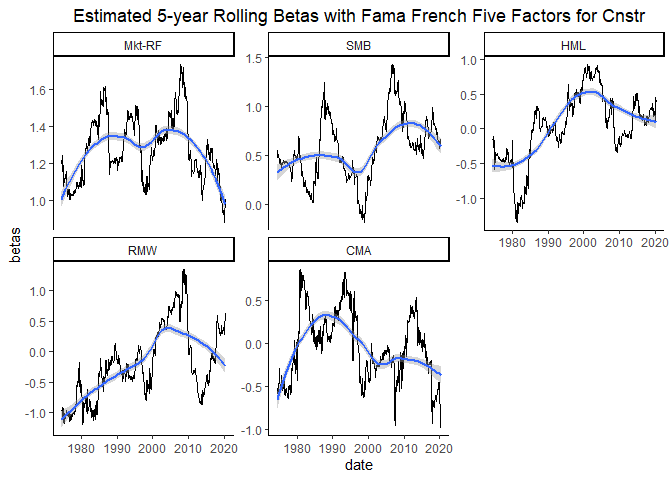<!-- --><!-- --><!-- -->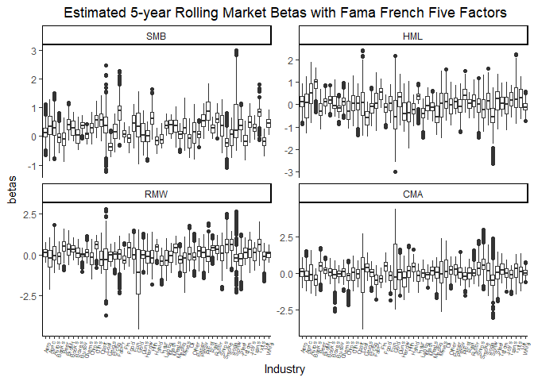<!-- -->

### S3-1-3 Full Sample Estimation with STL Trend

Here, we would try to conduct the STL decomposition before the first
step regression with full sample.

<table class="table table-striped" style="font-size: 10px; width: auto !important; margin-left: auto; margin-right: auto;">
<caption style="font-size: initial !important;">
Fama French Five Factors
</caption>
<thead>
<tr>
<th style="empty-cells: hide;border-bottom:hidden;" colspan="1">
</th>
<th style="border-bottom:hidden;padding-bottom:0; padding-left:3px;padding-right:3px;text-align: center; " colspan="6">

Coefficients

</th>
<th style="border-bottom:hidden;padding-bottom:0; padding-left:3px;padding-right:3px;text-align: center; " colspan="6">

Std. Error

</th>
</tr>
<tr>
<th style="text-align:center;">
Industry
</th>
<th style="text-align:center;">
Alpha
</th>
<th style="text-align:center;">
Mkt-RF
</th>
<th style="text-align:center;">
SMB
</th>
<th style="text-align:center;">
HML
</th>
<th style="text-align:center;">
RMW
</th>
<th style="text-align:center;">
CMA
</th>
<th style="text-align:center;">
Alpha
</th>
<th style="text-align:center;">
Mkt-RF
</th>
<th style="text-align:center;">
SMB
</th>
<th style="text-align:center;">
HML
</th>
<th style="text-align:center;">
RMW
</th>
<th style="text-align:center;">
CMA
</th>
</tr>
</thead>
<tbody>
<tr>
<td style="text-align:center;font-weight: bold;">
Aero
</td>
<td style="text-align:center;">
-0.0012744
</td>
<td style="text-align:center;">
1.2746023
</td>
<td style="text-align:center;">
0.7838737
</td>
<td style="text-align:center;">
0.4368438
</td>
<td style="text-align:center;">
0.1528035
</td>
<td style="text-align:center;">
-0.2526696
</td>
<td style="text-align:center;">
0.0005832
</td>
<td style="text-align:center;">
0.0398914
</td>
<td style="text-align:center;">
0.0505159
</td>
<td style="text-align:center;">
0.0552370
</td>
<td style="text-align:center;">
0.0617538
</td>
<td style="text-align:center;">
0.0964317
</td>
</tr>
<tr>
<td style="text-align:center;font-weight: bold;">
Agric
</td>
<td style="text-align:center;">
0.0016461
</td>
<td style="text-align:center;">
0.5825164
</td>
<td style="text-align:center;">
0.1940582
</td>
<td style="text-align:center;">
0.3703844
</td>
<td style="text-align:center;">
0.4506982
</td>
<td style="text-align:center;">
-0.6421949
</td>
<td style="text-align:center;">
0.0006801
</td>
<td style="text-align:center;">
0.0465185
</td>
<td style="text-align:center;">
0.0589079
</td>
<td style="text-align:center;">
0.0644133
</td>
<td style="text-align:center;">
0.0720127
</td>
<td style="text-align:center;">
0.1124515
</td>
</tr>
<tr>
<td style="text-align:center;font-weight: bold;">
Autos
</td>
<td style="text-align:center;">
-0.0063620
</td>
<td style="text-align:center;">
1.5229823
</td>
<td style="text-align:center;">
0.0053461
</td>
<td style="text-align:center;">
-0.0961469
</td>
<td style="text-align:center;">
0.0515546
</td>
<td style="text-align:center;">
1.0865335
</td>
<td style="text-align:center;">
0.0006652
</td>
<td style="text-align:center;">
0.0455002
</td>
<td style="text-align:center;">
0.0576183
</td>
<td style="text-align:center;">
0.0630033
</td>
<td style="text-align:center;">
0.0704363
</td>
<td style="text-align:center;">
0.1099899
</td>
</tr>
<tr>
<td style="text-align:center;font-weight: bold;">
Banks
</td>
<td style="text-align:center;">
-0.0035956
</td>
<td style="text-align:center;">
1.2475803
</td>
<td style="text-align:center;">
0.0222035
</td>
<td style="text-align:center;">
0.6482096
</td>
<td style="text-align:center;">
0.4262404
</td>
<td style="text-align:center;">
-0.0975272
</td>
<td style="text-align:center;">
0.0003985
</td>
<td style="text-align:center;">
0.0272579
</td>
<td style="text-align:center;">
0.0345176
</td>
<td style="text-align:center;">
0.0377435
</td>
<td style="text-align:center;">
0.0421965
</td>
<td style="text-align:center;">
0.0658919
</td>
</tr>
<tr>
<td style="text-align:center;font-weight: bold;">
Beer
</td>
<td style="text-align:center;">
0.0000426
</td>
<td style="text-align:center;">
0.9099867
</td>
<td style="text-align:center;">
-0.3158099
</td>
<td style="text-align:center;">
-0.1920509
</td>
<td style="text-align:center;">
0.8565533
</td>
<td style="text-align:center;">
0.2840211
</td>
<td style="text-align:center;">
0.0004848
</td>
<td style="text-align:center;">
0.0331595
</td>
<td style="text-align:center;">
0.0419910
</td>
<td style="text-align:center;">
0.0459154
</td>
<td style="text-align:center;">
0.0513324
</td>
<td style="text-align:center;">
0.0801582
</td>
</tr>
<tr>
<td style="text-align:center;font-weight: bold;">
BldMt
</td>
<td style="text-align:center;">
-0.0038180
</td>
<td style="text-align:center;">
1.2256726
</td>
<td style="text-align:center;">
0.2746096
</td>
<td style="text-align:center;">
0.2072977
</td>
<td style="text-align:center;">
0.4985308
</td>
<td style="text-align:center;">
0.3151551
</td>
<td style="text-align:center;">
0.0003777
</td>
<td style="text-align:center;">
0.0258339
</td>
<td style="text-align:center;">
0.0327143
</td>
<td style="text-align:center;">
0.0357717
</td>
<td style="text-align:center;">
0.0399920
</td>
<td style="text-align:center;">
0.0624495
</td>
</tr>
<tr>
<td style="text-align:center;font-weight: bold;">
Books
</td>
<td style="text-align:center;">
-0.0071925
</td>
<td style="text-align:center;">
1.4360719
</td>
<td style="text-align:center;">
0.4600670
</td>
<td style="text-align:center;">
0.1423312
</td>
<td style="text-align:center;">
0.3140638
</td>
<td style="text-align:center;">
0.6229898
</td>
<td style="text-align:center;">
0.0004771
</td>
<td style="text-align:center;">
0.0326318
</td>
<td style="text-align:center;">
0.0413227
</td>
<td style="text-align:center;">
0.0451847
</td>
<td style="text-align:center;">
0.0505155
</td>
<td style="text-align:center;">
0.0788825
</td>
</tr>
<tr>
<td style="text-align:center;font-weight: bold;">
Boxes
</td>
<td style="text-align:center;">
-0.0016011
</td>
<td style="text-align:center;">
0.8638515
</td>
<td style="text-align:center;">
0.0407416
</td>
<td style="text-align:center;">
0.1523267
</td>
<td style="text-align:center;">
0.8222496
</td>
<td style="text-align:center;">
-0.0022294
</td>
<td style="text-align:center;">
0.0005539
</td>
<td style="text-align:center;">
0.0378871
</td>
<td style="text-align:center;">
0.0479777
</td>
<td style="text-align:center;">
0.0524616
</td>
<td style="text-align:center;">
0.0586510
</td>
<td style="text-align:center;">
0.0915865
</td>
</tr>
<tr>
<td style="text-align:center;font-weight: bold;">
BusSv
</td>
<td style="text-align:center;">
0.0003938
</td>
<td style="text-align:center;">
1.0525691
</td>
<td style="text-align:center;">
0.4724090
</td>
<td style="text-align:center;">
-0.1246758
</td>
<td style="text-align:center;">
0.0187068
</td>
<td style="text-align:center;">
-0.2174015
</td>
<td style="text-align:center;">
0.0002714
</td>
<td style="text-align:center;">
0.0185617
</td>
<td style="text-align:center;">
0.0235054
</td>
<td style="text-align:center;">
0.0257021
</td>
<td style="text-align:center;">
0.0287344
</td>
<td style="text-align:center;">
0.0448703
</td>
</tr>
<tr>
<td style="text-align:center;font-weight: bold;">
Chems
</td>
<td style="text-align:center;">
-0.0020329
</td>
<td style="text-align:center;">
1.0479814
</td>
<td style="text-align:center;">
0.0398632
</td>
<td style="text-align:center;">
0.0610439
</td>
<td style="text-align:center;">
0.3658636
</td>
<td style="text-align:center;">
0.3650244
</td>
<td style="text-align:center;">
0.0004627
</td>
<td style="text-align:center;">
0.0316450
</td>
<td style="text-align:center;">
0.0400731
</td>
<td style="text-align:center;">
0.0438183
</td>
<td style="text-align:center;">
0.0489880
</td>
<td style="text-align:center;">
0.0764972
</td>
</tr>
<tr>
<td style="text-align:center;font-weight: bold;">
Chips
</td>
<td style="text-align:center;">
0.0051885
</td>
<td style="text-align:center;">
1.1028458
</td>
<td style="text-align:center;">
0.3129494
</td>
<td style="text-align:center;">
-0.4482885
</td>
<td style="text-align:center;">
-0.9646289
</td>
<td style="text-align:center;">
-0.1232898
</td>
<td style="text-align:center;">
0.0005198
</td>
<td style="text-align:center;">
0.0355509
</td>
<td style="text-align:center;">
0.0450192
</td>
<td style="text-align:center;">
0.0492267
</td>
<td style="text-align:center;">
0.0550344
</td>
<td style="text-align:center;">
0.0859390
</td>
</tr>
<tr>
<td style="text-align:center;font-weight: bold;">
Clths
</td>
<td style="text-align:center;">
-0.0051112
</td>
<td style="text-align:center;">
1.3268703
</td>
<td style="text-align:center;">
0.7822894
</td>
<td style="text-align:center;">
-0.2454161
</td>
<td style="text-align:center;">
0.8865135
</td>
<td style="text-align:center;">
0.5414965
</td>
<td style="text-align:center;">
0.0005851
</td>
<td style="text-align:center;">
0.0400219
</td>
<td style="text-align:center;">
0.0506811
</td>
<td style="text-align:center;">
0.0554176
</td>
<td style="text-align:center;">
0.0619558
</td>
<td style="text-align:center;">
0.0967471
</td>
</tr>
<tr>
<td style="text-align:center;font-weight: bold;">
Cnstr
</td>
<td style="text-align:center;">
-0.0051172
</td>
<td style="text-align:center;">
1.2153172
</td>
<td style="text-align:center;">
0.6550769
</td>
<td style="text-align:center;">
-0.1314116
</td>
<td style="text-align:center;">
0.5204695
</td>
<td style="text-align:center;">
0.4787251
</td>
<td style="text-align:center;">
0.0007152
</td>
<td style="text-align:center;">
0.0489177
</td>
<td style="text-align:center;">
0.0619460
</td>
<td style="text-align:center;">
0.0677354
</td>
<td style="text-align:center;">
0.0757268
</td>
<td style="text-align:center;">
0.1182512
</td>
</tr>
<tr>
<td style="text-align:center;font-weight: bold;">
Coal
</td>
<td style="text-align:center;">
-0.0018927
</td>
<td style="text-align:center;">
0.5321811
</td>
<td style="text-align:center;">
0.7143574
</td>
<td style="text-align:center;">
0.6932167
</td>
<td style="text-align:center;">
-0.5017013
</td>
<td style="text-align:center;">
0.7875115
</td>
<td style="text-align:center;">
0.0017543
</td>
<td style="text-align:center;">
0.1199887
</td>
<td style="text-align:center;">
0.1519456
</td>
<td style="text-align:center;">
0.1661462
</td>
<td style="text-align:center;">
0.1857480
</td>
<td style="text-align:center;">
0.2900548
</td>
</tr>
<tr>
<td style="text-align:center;font-weight: bold;">
Drugs
</td>
<td style="text-align:center;">
0.0013358
</td>
<td style="text-align:center;">
0.8796435
</td>
<td style="text-align:center;">
-0.4621804
</td>
<td style="text-align:center;">
-0.3018292
</td>
<td style="text-align:center;">
0.5003218
</td>
<td style="text-align:center;">
0.3002915
</td>
<td style="text-align:center;">
0.0004381
</td>
<td style="text-align:center;">
0.0299632
</td>
<td style="text-align:center;">
0.0379434
</td>
<td style="text-align:center;">
0.0414896
</td>
<td style="text-align:center;">
0.0463845
</td>
<td style="text-align:center;">
0.0724317
</td>
</tr>
<tr>
<td style="text-align:center;font-weight: bold;">
ElcEq
</td>
<td style="text-align:center;">
0.0013447
</td>
<td style="text-align:center;">
1.1252624
</td>
<td style="text-align:center;">
0.1206725
</td>
<td style="text-align:center;">
-0.1124701
</td>
<td style="text-align:center;">
-0.0878487
</td>
<td style="text-align:center;">
0.1209728
</td>
<td style="text-align:center;">
0.0003518
</td>
<td style="text-align:center;">
0.0240609
</td>
<td style="text-align:center;">
0.0304691
</td>
<td style="text-align:center;">
0.0333167
</td>
<td style="text-align:center;">
0.0372474
</td>
<td style="text-align:center;">
0.0581637
</td>
</tr>
<tr>
<td style="text-align:center;font-weight: bold;">
FabPr
</td>
<td style="text-align:center;">
-0.0022332
</td>
<td style="text-align:center;">
0.8453990
</td>
<td style="text-align:center;">
0.7941666
</td>
<td style="text-align:center;">
0.3626176
</td>
<td style="text-align:center;">
0.1845480
</td>
<td style="text-align:center;">
-0.6243901
</td>
<td style="text-align:center;">
0.0007540
</td>
<td style="text-align:center;">
0.0515686
</td>
<td style="text-align:center;">
0.0653031
</td>
<td style="text-align:center;">
0.0714062
</td>
<td style="text-align:center;">
0.0798306
</td>
<td style="text-align:center;">
0.1246596
</td>
</tr>
<tr>
<td style="text-align:center;font-weight: bold;">
Fin
</td>
<td style="text-align:center;">
-0.0002833
</td>
<td style="text-align:center;">
1.2562560
</td>
<td style="text-align:center;">
0.3107899
</td>
<td style="text-align:center;">
0.5251945
</td>
<td style="text-align:center;">
-0.0987906
</td>
<td style="text-align:center;">
-0.3650579
</td>
<td style="text-align:center;">
0.0004104
</td>
<td style="text-align:center;">
0.0280679
</td>
<td style="text-align:center;">
0.0355434
</td>
<td style="text-align:center;">
0.0388652
</td>
<td style="text-align:center;">
0.0434505
</td>
<td style="text-align:center;">
0.0678501
</td>
</tr>
<tr>
<td style="text-align:center;font-weight: bold;">
Food
</td>
<td style="text-align:center;">
-0.0017027
</td>
<td style="text-align:center;">
0.8819056
</td>
<td style="text-align:center;">
-0.1021610
</td>
<td style="text-align:center;">
0.1128245
</td>
<td style="text-align:center;">
0.7741909
</td>
<td style="text-align:center;">
0.4490797
</td>
<td style="text-align:center;">
0.0004269
</td>
<td style="text-align:center;">
0.0291978
</td>
<td style="text-align:center;">
0.0369741
</td>
<td style="text-align:center;">
0.0404297
</td>
<td style="text-align:center;">
0.0451995
</td>
<td style="text-align:center;">
0.0705813
</td>
</tr>
<tr>
<td style="text-align:center;font-weight: bold;">
Fun
</td>
<td style="text-align:center;">
-0.0013404
</td>
<td style="text-align:center;">
1.4377854
</td>
<td style="text-align:center;">
0.5898860
</td>
<td style="text-align:center;">
-0.0394015
</td>
<td style="text-align:center;">
0.3859710
</td>
<td style="text-align:center;">
0.4124550
</td>
<td style="text-align:center;">
0.0007257
</td>
<td style="text-align:center;">
0.0496341
</td>
<td style="text-align:center;">
0.0628533
</td>
<td style="text-align:center;">
0.0687275
</td>
<td style="text-align:center;">
0.0768359
</td>
<td style="text-align:center;">
0.1199831
</td>
</tr>
<tr>
<td style="text-align:center;font-weight: bold;">
Gold
</td>
<td style="text-align:center;">
0.0003135
</td>
<td style="text-align:center;">
0.3543018
</td>
<td style="text-align:center;">
0.7289414
</td>
<td style="text-align:center;">
-1.0938949
</td>
<td style="text-align:center;">
0.2666569
</td>
<td style="text-align:center;">
1.4469401
</td>
<td style="text-align:center;">
0.0013482
</td>
<td style="text-align:center;">
0.0922090
</td>
<td style="text-align:center;">
0.1167674
</td>
<td style="text-align:center;">
0.1276803
</td>
<td style="text-align:center;">
0.1427438
</td>
<td style="text-align:center;">
0.2229017
</td>
</tr>
<tr>
<td style="text-align:center;font-weight: bold;">
Guns
</td>
<td style="text-align:center;">
-0.0000274
</td>
<td style="text-align:center;">
0.8382648
</td>
<td style="text-align:center;">
0.5745523
</td>
<td style="text-align:center;">
0.3837487
</td>
<td style="text-align:center;">
0.9507868
</td>
<td style="text-align:center;">
-0.0017038
</td>
<td style="text-align:center;">
0.0007288
</td>
<td style="text-align:center;">
0.0498491
</td>
<td style="text-align:center;">
0.0631255
</td>
<td style="text-align:center;">
0.0690251
</td>
<td style="text-align:center;">
0.0771686
</td>
<td style="text-align:center;">
0.1205027
</td>
</tr>
<tr>
<td style="text-align:center;font-weight: bold;">
Hardw
</td>
<td style="text-align:center;">
0.0029049
</td>
<td style="text-align:center;">
1.0231410
</td>
<td style="text-align:center;">
-0.0714698
</td>
<td style="text-align:center;">
-0.3301447
</td>
<td style="text-align:center;">
-0.7731021
</td>
<td style="text-align:center;">
-0.0904900
</td>
<td style="text-align:center;">
0.0006809
</td>
<td style="text-align:center;">
0.0465711
</td>
<td style="text-align:center;">
0.0589745
</td>
<td style="text-align:center;">
0.0644861
</td>
<td style="text-align:center;">
0.0720941
</td>
<td style="text-align:center;">
0.1125786
</td>
</tr>
<tr>
<td style="text-align:center;font-weight: bold;">
Hlth
</td>
<td style="text-align:center;">
-0.0037975
</td>
<td style="text-align:center;">
0.9715977
</td>
<td style="text-align:center;">
1.7326988
</td>
<td style="text-align:center;">
-0.4383371
</td>
<td style="text-align:center;">
0.8772680
</td>
<td style="text-align:center;">
0.3348111
</td>
<td style="text-align:center;">
0.0008389
</td>
<td style="text-align:center;">
0.0573801
</td>
<td style="text-align:center;">
0.0726623
</td>
<td style="text-align:center;">
0.0794532
</td>
<td style="text-align:center;">
0.0888270
</td>
<td style="text-align:center;">
0.1387078
</td>
</tr>
<tr>
<td style="text-align:center;font-weight: bold;">
Hshld
</td>
<td style="text-align:center;">
-0.0031805
</td>
<td style="text-align:center;">
0.9866357
</td>
<td style="text-align:center;">
-0.1890740
</td>
<td style="text-align:center;">
-0.0956830
</td>
<td style="text-align:center;">
0.7730199
</td>
<td style="text-align:center;">
0.3177266
</td>
<td style="text-align:center;">
0.0003387
</td>
<td style="text-align:center;">
0.0231688
</td>
<td style="text-align:center;">
0.0293394
</td>
<td style="text-align:center;">
0.0320815
</td>
<td style="text-align:center;">
0.0358664
</td>
<td style="text-align:center;">
0.0560072
</td>
</tr>
<tr>
<td style="text-align:center;font-weight: bold;">
Insur
</td>
<td style="text-align:center;">
-0.0013155
</td>
<td style="text-align:center;">
1.1047316
</td>
<td style="text-align:center;">
0.2299386
</td>
<td style="text-align:center;">
0.4954510
</td>
<td style="text-align:center;">
0.3090722
</td>
<td style="text-align:center;">
-0.1726943
</td>
<td style="text-align:center;">
0.0003704
</td>
<td style="text-align:center;">
0.0253312
</td>
<td style="text-align:center;">
0.0320778
</td>
<td style="text-align:center;">
0.0350757
</td>
<td style="text-align:center;">
0.0392139
</td>
<td style="text-align:center;">
0.0612345
</td>
</tr>
<tr>
<td style="text-align:center;font-weight: bold;">
LabEq
</td>
<td style="text-align:center;">
0.0027968
</td>
<td style="text-align:center;">
0.9891841
</td>
<td style="text-align:center;">
0.4782318
</td>
<td style="text-align:center;">
-0.3755583
</td>
<td style="text-align:center;">
-0.4922250
</td>
<td style="text-align:center;">
0.0922078
</td>
<td style="text-align:center;">
0.0004329
</td>
<td style="text-align:center;">
0.0296092
</td>
<td style="text-align:center;">
0.0374951
</td>
<td style="text-align:center;">
0.0409993
</td>
<td style="text-align:center;">
0.0458364
</td>
<td style="text-align:center;">
0.0715758
</td>
</tr>
<tr>
<td style="text-align:center;font-weight: bold;">
Mach
</td>
<td style="text-align:center;">
-0.0008106
</td>
<td style="text-align:center;">
1.0301561
</td>
<td style="text-align:center;">
0.3575171
</td>
<td style="text-align:center;">
-0.0547854
</td>
<td style="text-align:center;">
-0.0325099
</td>
<td style="text-align:center;">
0.2949105
</td>
<td style="text-align:center;">
0.0005178
</td>
<td style="text-align:center;">
0.0354144
</td>
<td style="text-align:center;">
0.0448464
</td>
<td style="text-align:center;">
0.0490377
</td>
<td style="text-align:center;">
0.0548231
</td>
<td style="text-align:center;">
0.0856091
</td>
</tr>
<tr>
<td style="text-align:center;font-weight: bold;">
Meals
</td>
<td style="text-align:center;">
-0.0016492
</td>
<td style="text-align:center;">
1.0737487
</td>
<td style="text-align:center;">
0.5459601
</td>
<td style="text-align:center;">
0.1001046
</td>
<td style="text-align:center;">
0.6242171
</td>
<td style="text-align:center;">
-0.1737008
</td>
<td style="text-align:center;">
0.0005212
</td>
<td style="text-align:center;">
0.0356514
</td>
<td style="text-align:center;">
0.0451466
</td>
<td style="text-align:center;">
0.0493659
</td>
<td style="text-align:center;">
0.0551901
</td>
<td style="text-align:center;">
0.0861821
</td>
</tr>
<tr>
<td style="text-align:center;font-weight: bold;">
MedEq
</td>
<td style="text-align:center;">
0.0014561
</td>
<td style="text-align:center;">
0.8053431
</td>
<td style="text-align:center;">
-0.0565824
</td>
<td style="text-align:center;">
-0.3375237
</td>
<td style="text-align:center;">
0.5326186
</td>
<td style="text-align:center;">
0.1033913
</td>
<td style="text-align:center;">
0.0005539
</td>
<td style="text-align:center;">
0.0378871
</td>
<td style="text-align:center;">
0.0479777
</td>
<td style="text-align:center;">
0.0524616
</td>
<td style="text-align:center;">
0.0586510
</td>
<td style="text-align:center;">
0.0915865
</td>
</tr>
<tr>
<td style="text-align:center;font-weight: bold;">
Mines
</td>
<td style="text-align:center;">
0.0014572
</td>
<td style="text-align:center;">
0.7813628
</td>
<td style="text-align:center;">
0.2534132
</td>
<td style="text-align:center;">
0.1187663
</td>
<td style="text-align:center;">
-0.2251123
</td>
<td style="text-align:center;">
0.0825557
</td>
<td style="text-align:center;">
0.0009507
</td>
<td style="text-align:center;">
0.0650268
</td>
<td style="text-align:center;">
0.0823456
</td>
<td style="text-align:center;">
0.0900415
</td>
<td style="text-align:center;">
0.1006645
</td>
<td style="text-align:center;">
0.1571928
</td>
</tr>
<tr>
<td style="text-align:center;font-weight: bold;">
Oil
</td>
<td style="text-align:center;">
-0.0004014
</td>
<td style="text-align:center;">
0.7991301
</td>
<td style="text-align:center;">
0.2298170
</td>
<td style="text-align:center;">
0.4364659
</td>
<td style="text-align:center;">
0.0717533
</td>
<td style="text-align:center;">
-0.1674800
</td>
<td style="text-align:center;">
0.0006965
</td>
<td style="text-align:center;">
0.0476356
</td>
<td style="text-align:center;">
0.0603226
</td>
<td style="text-align:center;">
0.0659602
</td>
<td style="text-align:center;">
0.0737421
</td>
<td style="text-align:center;">
0.1151521
</td>
</tr>
<tr>
<td style="text-align:center;font-weight: bold;">
Other
</td>
<td style="text-align:center;">
-0.0095963
</td>
<td style="text-align:center;">
1.4180793
</td>
<td style="text-align:center;">
0.4039311
</td>
<td style="text-align:center;">
0.0269255
</td>
<td style="text-align:center;">
0.4086910
</td>
<td style="text-align:center;">
0.1984780
</td>
<td style="text-align:center;">
0.0006627
</td>
<td style="text-align:center;">
0.0453283
</td>
<td style="text-align:center;">
0.0574007
</td>
<td style="text-align:center;">
0.0627653
</td>
<td style="text-align:center;">
0.0701702
</td>
<td style="text-align:center;">
0.1095744
</td>
</tr>
<tr>
<td style="text-align:center;font-weight: bold;">
Paper
</td>
<td style="text-align:center;">
-0.0025994
</td>
<td style="text-align:center;">
0.9960178
</td>
<td style="text-align:center;">
0.0411842
</td>
<td style="text-align:center;">
0.1656356
</td>
<td style="text-align:center;">
0.1961619
</td>
<td style="text-align:center;">
0.5961679
</td>
<td style="text-align:center;">
0.0004124
</td>
<td style="text-align:center;">
0.0282042
</td>
<td style="text-align:center;">
0.0357159
</td>
<td style="text-align:center;">
0.0390538
</td>
<td style="text-align:center;">
0.0436613
</td>
<td style="text-align:center;">
0.0681794
</td>
</tr>
<tr>
<td style="text-align:center;font-weight: bold;">
PerSv
</td>
<td style="text-align:center;">
-0.0087342
</td>
<td style="text-align:center;">
1.0919539
</td>
<td style="text-align:center;">
1.1387105
</td>
<td style="text-align:center;">
0.2900208
</td>
<td style="text-align:center;">
0.8993240
</td>
<td style="text-align:center;">
-0.0887214
</td>
<td style="text-align:center;">
0.0006290
</td>
<td style="text-align:center;">
0.0430207
</td>
<td style="text-align:center;">
0.0544786
</td>
<td style="text-align:center;">
0.0595700
</td>
<td style="text-align:center;">
0.0665980
</td>
<td style="text-align:center;">
0.1039962
</td>
</tr>
<tr>
<td style="text-align:center;font-weight: bold;">
RlEst
</td>
<td style="text-align:center;">
-0.0107579
</td>
<td style="text-align:center;">
1.4524244
</td>
<td style="text-align:center;">
1.4426993
</td>
<td style="text-align:center;">
0.3381476
</td>
<td style="text-align:center;">
0.5862133
</td>
<td style="text-align:center;">
-0.1133795
</td>
<td style="text-align:center;">
0.0006743
</td>
<td style="text-align:center;">
0.0461230
</td>
<td style="text-align:center;">
0.0584070
</td>
<td style="text-align:center;">
0.0638657
</td>
<td style="text-align:center;">
0.0714005
</td>
<td style="text-align:center;">
0.1114954
</td>
</tr>
<tr>
<td style="text-align:center;font-weight: bold;">
Rtail
</td>
<td style="text-align:center;">
-0.0006359
</td>
<td style="text-align:center;">
1.0737444
</td>
<td style="text-align:center;">
-0.0120757
</td>
<td style="text-align:center;">
-0.2910815
</td>
<td style="text-align:center;">
0.4432776
</td>
<td style="text-align:center;">
0.4689517
</td>
<td style="text-align:center;">
0.0004659
</td>
<td style="text-align:center;">
0.0318637
</td>
<td style="text-align:center;">
0.0403500
</td>
<td style="text-align:center;">
0.0441211
</td>
<td style="text-align:center;">
0.0493264
</td>
<td style="text-align:center;">
0.0770257
</td>
</tr>
<tr>
<td style="text-align:center;font-weight: bold;">
Rubbr
</td>
<td style="text-align:center;">
-0.0030373
</td>
<td style="text-align:center;">
1.1609331
</td>
<td style="text-align:center;">
0.3844679
</td>
<td style="text-align:center;">
-0.0232771
</td>
<td style="text-align:center;">
0.5958614
</td>
<td style="text-align:center;">
0.2990171
</td>
<td style="text-align:center;">
0.0004376
</td>
<td style="text-align:center;">
0.0299333
</td>
<td style="text-align:center;">
0.0379055
</td>
<td style="text-align:center;">
0.0414481
</td>
<td style="text-align:center;">
0.0463381
</td>
<td style="text-align:center;">
0.0723593
</td>
</tr>
<tr>
<td style="text-align:center;font-weight: bold;">
Ships
</td>
<td style="text-align:center;">
-0.0014874
</td>
<td style="text-align:center;">
0.9450218
</td>
<td style="text-align:center;">
0.4640843
</td>
<td style="text-align:center;">
0.5768058
</td>
<td style="text-align:center;">
0.3004754
</td>
<td style="text-align:center;">
-0.0191941
</td>
<td style="text-align:center;">
0.0007598
</td>
<td style="text-align:center;">
0.0519653
</td>
<td style="text-align:center;">
0.0658053
</td>
<td style="text-align:center;">
0.0719554
</td>
<td style="text-align:center;">
0.0804446
</td>
<td style="text-align:center;">
0.1256183
</td>
</tr>
<tr>
<td style="text-align:center;font-weight: bold;">
Smoke
</td>
<td style="text-align:center;">
-0.0005108
</td>
<td style="text-align:center;">
0.8046435
</td>
<td style="text-align:center;">
-0.1273409
</td>
<td style="text-align:center;">
0.0620524
</td>
<td style="text-align:center;">
1.2041922
</td>
<td style="text-align:center;">
0.8914597
</td>
<td style="text-align:center;">
0.0006825
</td>
<td style="text-align:center;">
0.0466837
</td>
<td style="text-align:center;">
0.0591171
</td>
<td style="text-align:center;">
0.0646421
</td>
<td style="text-align:center;">
0.0722685
</td>
<td style="text-align:center;">
0.1128509
</td>
</tr>
<tr>
<td style="text-align:center;font-weight: bold;">
Soda
</td>
<td style="text-align:center;">
-0.0027393
</td>
<td style="text-align:center;">
1.0846754
</td>
<td style="text-align:center;">
-0.2058664
</td>
<td style="text-align:center;">
0.3111747
</td>
<td style="text-align:center;">
1.0775496
</td>
<td style="text-align:center;">
0.1498779
</td>
<td style="text-align:center;">
0.0006174
</td>
<td style="text-align:center;">
0.0422302
</td>
<td style="text-align:center;">
0.0534775
</td>
<td style="text-align:center;">
0.0584754
</td>
<td style="text-align:center;">
0.0653743
</td>
<td style="text-align:center;">
0.1020853
</td>
</tr>
<tr>
<td style="text-align:center;font-weight: bold;">
Softw
</td>
<td style="text-align:center;">
-0.0000276
</td>
<td style="text-align:center;">
1.3867136
</td>
<td style="text-align:center;">
0.9454751
</td>
<td style="text-align:center;">
-0.9717346
</td>
<td style="text-align:center;">
0.1336157
</td>
<td style="text-align:center;">
0.0082342
</td>
<td style="text-align:center;">
0.0009466
</td>
<td style="text-align:center;">
0.0647470
</td>
<td style="text-align:center;">
0.0819912
</td>
<td style="text-align:center;">
0.0896540
</td>
<td style="text-align:center;">
0.1002313
</td>
<td style="text-align:center;">
0.1565162
</td>
</tr>
<tr>
<td style="text-align:center;font-weight: bold;">
Steel
</td>
<td style="text-align:center;">
-0.0002085
</td>
<td style="text-align:center;">
0.9130251
</td>
<td style="text-align:center;">
0.2016566
</td>
<td style="text-align:center;">
0.4352389
</td>
<td style="text-align:center;">
-1.0450994
</td>
<td style="text-align:center;">
-0.0849308
</td>
<td style="text-align:center;">
0.0007098
</td>
<td style="text-align:center;">
0.0485491
</td>
<td style="text-align:center;">
0.0614794
</td>
<td style="text-align:center;">
0.0672251
</td>
<td style="text-align:center;">
0.0751563
</td>
<td style="text-align:center;">
0.1173603
</td>
</tr>
<tr>
<td style="text-align:center;font-weight: bold;">
Telcm
</td>
<td style="text-align:center;">
0.0025699
</td>
<td style="text-align:center;">
0.8743257
</td>
<td style="text-align:center;">
-0.4497129
</td>
<td style="text-align:center;">
0.3961693
</td>
<td style="text-align:center;">
-0.6882968
</td>
<td style="text-align:center;">
-0.1586806
</td>
<td style="text-align:center;">
0.0004282
</td>
<td style="text-align:center;">
0.0292864
</td>
<td style="text-align:center;">
0.0370863
</td>
<td style="text-align:center;">
0.0405524
</td>
<td style="text-align:center;">
0.0453367
</td>
<td style="text-align:center;">
0.0707955
</td>
</tr>
<tr>
<td style="text-align:center;font-weight: bold;">
Toys
</td>
<td style="text-align:center;">
-0.0087620
</td>
<td style="text-align:center;">
1.3071589
</td>
<td style="text-align:center;">
0.5646103
</td>
<td style="text-align:center;">
-0.1051569
</td>
<td style="text-align:center;">
0.8874877
</td>
<td style="text-align:center;">
0.8351548
</td>
<td style="text-align:center;">
0.0005863
</td>
<td style="text-align:center;">
0.0401014
</td>
<td style="text-align:center;">
0.0507818
</td>
<td style="text-align:center;">
0.0555278
</td>
<td style="text-align:center;">
0.0620789
</td>
<td style="text-align:center;">
0.0969393
</td>
</tr>
<tr>
<td style="text-align:center;font-weight: bold;">
Trans
</td>
<td style="text-align:center;">
-0.0031360
</td>
<td style="text-align:center;">
1.0916931
</td>
<td style="text-align:center;">
0.5913613
</td>
<td style="text-align:center;">
0.2065672
</td>
<td style="text-align:center;">
0.4650208
</td>
<td style="text-align:center;">
-0.0213421
</td>
<td style="text-align:center;">
0.0004102
</td>
<td style="text-align:center;">
0.0280594
</td>
<td style="text-align:center;">
0.0355325
</td>
<td style="text-align:center;">
0.0388533
</td>
<td style="text-align:center;">
0.0434372
</td>
<td style="text-align:center;">
0.0678293
</td>
</tr>
<tr>
<td style="text-align:center;font-weight: bold;">
Txtls
</td>
<td style="text-align:center;">
-0.0074781
</td>
<td style="text-align:center;">
1.3437515
</td>
<td style="text-align:center;">
0.6048901
</td>
<td style="text-align:center;">
0.4749820
</td>
<td style="text-align:center;">
0.5932878
</td>
<td style="text-align:center;">
0.5394235
</td>
<td style="text-align:center;">
0.0007141
</td>
<td style="text-align:center;">
0.0488452
</td>
<td style="text-align:center;">
0.0618543
</td>
<td style="text-align:center;">
0.0676351
</td>
<td style="text-align:center;">
0.0756146
</td>
<td style="text-align:center;">
0.1180760
</td>
</tr>
<tr>
<td style="text-align:center;font-weight: bold;">
Util
</td>
<td style="text-align:center;">
-0.0007362
</td>
<td style="text-align:center;">
0.7831676
</td>
<td style="text-align:center;">
0.0052637
</td>
<td style="text-align:center;">
0.4875585
</td>
<td style="text-align:center;">
0.1963733
</td>
<td style="text-align:center;">
-0.1634922
</td>
<td style="text-align:center;">
0.0003874
</td>
<td style="text-align:center;">
0.0264995
</td>
<td style="text-align:center;">
0.0335572
</td>
<td style="text-align:center;">
0.0366934
</td>
<td style="text-align:center;">
0.0410224
</td>
<td style="text-align:center;">
0.0640586
</td>
</tr>
<tr>
<td style="text-align:center;font-weight: bold;">
Whlsl
</td>
<td style="text-align:center;">
-0.0024205
</td>
<td style="text-align:center;">
1.0757804
</td>
<td style="text-align:center;">
0.5633473
</td>
<td style="text-align:center;">
0.0179133
</td>
<td style="text-align:center;">
0.1885198
</td>
<td style="text-align:center;">
0.1895158
</td>
<td style="text-align:center;">
0.0003568
</td>
<td style="text-align:center;">
0.0244072
</td>
<td style="text-align:center;">
0.0309077
</td>
<td style="text-align:center;">
0.0337962
</td>
<td style="text-align:center;">
0.0377835
</td>
<td style="text-align:center;">
0.0590008
</td>
</tr>
</tbody>
</table>

<!-- -->

### S3-1-4 Rolling Window Estimation with STL Trend

Here, we would try to conduct the STL decomposition before the first
step regression with full sample.

<!-- -->

### S3-1-5 Full Sample Estimation with Panel Regression

There are three sets of regressions here: Panel Regression at 49
Industry Level, Panel Regression at 49 Industry Level and clustering at
5 Industry Level, Micro-Macro Multilevel Linear Models.

<!-- --><!-- --><!-- -->

Next, we get the panel regression clustering at 5 Industry Level.

### S3-1-6 Rolling Window Estimation with Panel Regression

We will show examples of the Real Estate Portfolio (RlEst), Construction
Portfolio (Cnstr), and Food Portfolio (Food) Rolling Betas evolution
here. The smoothing line is based on the loess smoothing. It seems that
the betas are evolving overtime.

<!-- -->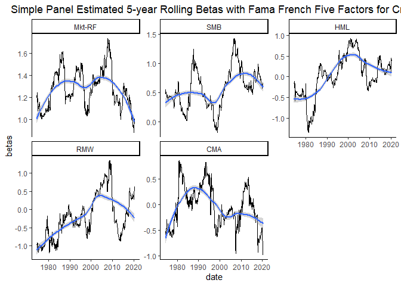<!-- -->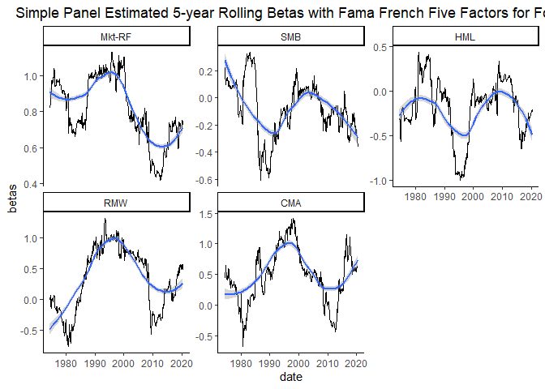<!-- --><!-- --><!-- -->

## S3-2 PRS Five Factor Model

We will then apply the PRS Five Factor Model to estimate the betas.

### S3-2-1 Full Sample Estimation

<table class="table table-striped" style="font-size: 10px; width: auto !important; margin-left: auto; margin-right: auto;">
<caption style="font-size: initial !important;">
PRS Five Factors
</caption>
<thead>
<tr>
<th style="empty-cells: hide;border-bottom:hidden;" colspan="1">
</th>
<th style="border-bottom:hidden;padding-bottom:0; padding-left:3px;padding-right:3px;text-align: center; " colspan="6">

Coefficients

</th>
<th style="border-bottom:hidden;padding-bottom:0; padding-left:3px;padding-right:3px;text-align: center; " colspan="6">

Std. Error

</th>
</tr>
<tr>
<th style="text-align:center;">
Industry
</th>
<th style="text-align:center;">
Alpha
</th>
<th style="text-align:center;">
Mkt-RF
</th>
<th style="text-align:center;">
RMW
</th>
<th style="text-align:center;">
dDP
</th>
<th style="text-align:center;">
dTS
</th>
<th style="text-align:center;">
UNEXPI
</th>
<th style="text-align:center;">
Alpha
</th>
<th style="text-align:center;">
Mkt-RF
</th>
<th style="text-align:center;">
RMW
</th>
<th style="text-align:center;">
dDP
</th>
<th style="text-align:center;">
dTS
</th>
<th style="text-align:center;">
UNEXPI
</th>
</tr>
</thead>
<tbody>
<tr>
<td style="text-align:center;font-weight: bold;">
Aero
</td>
<td style="text-align:center;">
-0.0007264
</td>
<td style="text-align:center;">
1.2147906
</td>
<td style="text-align:center;">
0.4597678
</td>
<td style="text-align:center;">
-1.8739102
</td>
<td style="text-align:center;">
2.6544959
</td>
<td style="text-align:center;">
0.0695108
</td>
<td style="text-align:center;">
0.0017926
</td>
<td style="text-align:center;">
0.0413396
</td>
<td style="text-align:center;">
0.0827289
</td>
<td style="text-align:center;">
1.6994957
</td>
<td style="text-align:center;">
0.7471528
</td>
<td style="text-align:center;">
0.5863563
</td>
</tr>
<tr>
<td style="text-align:center;font-weight: bold;">
Agric
</td>
<td style="text-align:center;">
0.0000335
</td>
<td style="text-align:center;">
0.8921762
</td>
<td style="text-align:center;">
0.0717091
</td>
<td style="text-align:center;">
-0.4604342
</td>
<td style="text-align:center;">
2.0589033
</td>
<td style="text-align:center;">
0.3395515
</td>
<td style="text-align:center;">
0.0021284
</td>
<td style="text-align:center;">
0.0490841
</td>
<td style="text-align:center;">
0.0982271
</td>
<td style="text-align:center;">
2.0178759
</td>
<td style="text-align:center;">
0.8871230
</td>
<td style="text-align:center;">
0.6962031
</td>
</tr>
<tr>
<td style="text-align:center;font-weight: bold;">
Autos
</td>
<td style="text-align:center;">
-0.0030572
</td>
<td style="text-align:center;">
1.1977989
</td>
<td style="text-align:center;">
0.0672278
</td>
<td style="text-align:center;">
6.3544567
</td>
<td style="text-align:center;">
4.1598356
</td>
<td style="text-align:center;">
-0.1737414
</td>
<td style="text-align:center;">
0.0019354
</td>
<td style="text-align:center;">
0.0446335
</td>
<td style="text-align:center;">
0.0893205
</td>
<td style="text-align:center;">
1.8349080
</td>
<td style="text-align:center;">
0.8066844
</td>
<td style="text-align:center;">
0.6330759
</td>
</tr>
<tr>
<td style="text-align:center;font-weight: bold;">
Banks
</td>
<td style="text-align:center;">
-0.0017131
</td>
<td style="text-align:center;">
1.1446243
</td>
<td style="text-align:center;">
0.3036716
</td>
<td style="text-align:center;">
-0.2118326
</td>
<td style="text-align:center;">
1.6994764
</td>
<td style="text-align:center;">
0.8416676
</td>
<td style="text-align:center;">
0.0015119
</td>
<td style="text-align:center;">
0.0348658
</td>
<td style="text-align:center;">
0.0697734
</td>
<td style="text-align:center;">
1.4333525
</td>
<td style="text-align:center;">
0.6301478
</td>
<td style="text-align:center;">
0.4945321
</td>
</tr>
<tr>
<td style="text-align:center;font-weight: bold;">
Beer
</td>
<td style="text-align:center;">
0.0013533
</td>
<td style="text-align:center;">
0.8163077
</td>
<td style="text-align:center;">
0.6502316
</td>
<td style="text-align:center;">
-2.7713156
</td>
<td style="text-align:center;">
-0.3550530
</td>
<td style="text-align:center;">
0.5748237
</td>
<td style="text-align:center;">
0.0015697
</td>
<td style="text-align:center;">
0.0361980
</td>
<td style="text-align:center;">
0.0724395
</td>
<td style="text-align:center;">
1.4881224
</td>
<td style="text-align:center;">
0.6542264
</td>
<td style="text-align:center;">
0.5134287
</td>
</tr>
<tr>
<td style="text-align:center;font-weight: bold;">
BldMt
</td>
<td style="text-align:center;">
-0.0030308
</td>
<td style="text-align:center;">
1.2794322
</td>
<td style="text-align:center;">
0.3978284
</td>
<td style="text-align:center;">
3.0432575
</td>
<td style="text-align:center;">
3.2402758
</td>
<td style="text-align:center;">
1.2188895
</td>
<td style="text-align:center;">
0.0013397
</td>
<td style="text-align:center;">
0.0308961
</td>
<td style="text-align:center;">
0.0618293
</td>
<td style="text-align:center;">
1.2701560
</td>
<td style="text-align:center;">
0.5584013
</td>
<td style="text-align:center;">
0.4382264
</td>
</tr>
<tr>
<td style="text-align:center;font-weight: bold;">
Books
</td>
<td style="text-align:center;">
-0.0036651
</td>
<td style="text-align:center;">
1.1403166
</td>
<td style="text-align:center;">
0.3344491
</td>
<td style="text-align:center;">
3.5192625
</td>
<td style="text-align:center;">
2.8975915
</td>
<td style="text-align:center;">
0.3071983
</td>
<td style="text-align:center;">
0.0013751
</td>
<td style="text-align:center;">
0.0317113
</td>
<td style="text-align:center;">
0.0634607
</td>
<td style="text-align:center;">
1.3036699
</td>
<td style="text-align:center;">
0.5731351
</td>
<td style="text-align:center;">
0.4497893
</td>
</tr>
<tr>
<td style="text-align:center;font-weight: bold;">
Boxes
</td>
<td style="text-align:center;">
-0.0012003
</td>
<td style="text-align:center;">
1.0266425
</td>
<td style="text-align:center;">
0.3245770
</td>
<td style="text-align:center;">
3.6059226
</td>
<td style="text-align:center;">
0.9489560
</td>
<td style="text-align:center;">
1.1834596
</td>
<td style="text-align:center;">
0.0015292
</td>
<td style="text-align:center;">
0.0352642
</td>
<td style="text-align:center;">
0.0705708
</td>
<td style="text-align:center;">
1.4497331
</td>
<td style="text-align:center;">
0.6373492
</td>
<td style="text-align:center;">
0.5001837
</td>
</tr>
<tr>
<td style="text-align:center;font-weight: bold;">
BusSv
</td>
<td style="text-align:center;">
-0.0009844
</td>
<td style="text-align:center;">
1.1808188
</td>
<td style="text-align:center;">
0.0052199
</td>
<td style="text-align:center;">
1.8003838
</td>
<td style="text-align:center;">
1.5340027
</td>
<td style="text-align:center;">
0.5431220
</td>
<td style="text-align:center;">
0.0009649
</td>
<td style="text-align:center;">
0.0222521
</td>
<td style="text-align:center;">
0.0445309
</td>
<td style="text-align:center;">
0.9147962
</td>
<td style="text-align:center;">
0.4021738
</td>
<td style="text-align:center;">
0.3156210
</td>
</tr>
<tr>
<td style="text-align:center;font-weight: bold;">
Chems
</td>
<td style="text-align:center;">
-0.0010222
</td>
<td style="text-align:center;">
1.0942887
</td>
<td style="text-align:center;">
0.3027224
</td>
<td style="text-align:center;">
1.0268845
</td>
<td style="text-align:center;">
0.9222256
</td>
<td style="text-align:center;">
-0.2436988
</td>
<td style="text-align:center;">
0.0013039
</td>
<td style="text-align:center;">
0.0300690
</td>
<td style="text-align:center;">
0.0601741
</td>
<td style="text-align:center;">
1.2361550
</td>
<td style="text-align:center;">
0.5434534
</td>
<td style="text-align:center;">
0.4264955
</td>
</tr>
<tr>
<td style="text-align:center;font-weight: bold;">
Chips
</td>
<td style="text-align:center;">
0.0020900
</td>
<td style="text-align:center;">
1.3194837
</td>
<td style="text-align:center;">
-0.6845575
</td>
<td style="text-align:center;">
2.9293268
</td>
<td style="text-align:center;">
-0.4209634
</td>
<td style="text-align:center;">
0.4134730
</td>
<td style="text-align:center;">
0.0016303
</td>
<td style="text-align:center;">
0.0375961
</td>
<td style="text-align:center;">
0.0752373
</td>
<td style="text-align:center;">
1.5455977
</td>
<td style="text-align:center;">
0.6794943
</td>
<td style="text-align:center;">
0.5332587
</td>
</tr>
<tr>
<td style="text-align:center;font-weight: bold;">
Clths
</td>
<td style="text-align:center;">
-0.0025929
</td>
<td style="text-align:center;">
1.2208061
</td>
<td style="text-align:center;">
0.5499887
</td>
<td style="text-align:center;">
4.4649420
</td>
<td style="text-align:center;">
3.2403675
</td>
<td style="text-align:center;">
1.3608807
</td>
<td style="text-align:center;">
0.0017273
</td>
<td style="text-align:center;">
0.0398331
</td>
<td style="text-align:center;">
0.0797139
</td>
<td style="text-align:center;">
1.6375599
</td>
<td style="text-align:center;">
0.7199239
</td>
<td style="text-align:center;">
0.5649873
</td>
</tr>
<tr>
<td style="text-align:center;font-weight: bold;">
Cnstr
</td>
<td style="text-align:center;">
-0.0036864
</td>
<td style="text-align:center;">
1.3485988
</td>
<td style="text-align:center;">
0.2583720
</td>
<td style="text-align:center;">
-0.0810328
</td>
<td style="text-align:center;">
3.2723505
</td>
<td style="text-align:center;">
0.0993218
</td>
<td style="text-align:center;">
0.0018049
</td>
<td style="text-align:center;">
0.0416221
</td>
<td style="text-align:center;">
0.0832942
</td>
<td style="text-align:center;">
1.7111086
</td>
<td style="text-align:center;">
0.7522582
</td>
<td style="text-align:center;">
0.5903629
</td>
</tr>
<tr>
<td style="text-align:center;font-weight: bold;">
Coal
</td>
<td style="text-align:center;">
-0.0008261
</td>
<td style="text-align:center;">
1.1302559
</td>
<td style="text-align:center;">
-0.1563914
</td>
<td style="text-align:center;">
-2.7173567
</td>
<td style="text-align:center;">
1.2220000
</td>
<td style="text-align:center;">
-1.5478331
</td>
<td style="text-align:center;">
0.0039984
</td>
<td style="text-align:center;">
0.0922079
</td>
<td style="text-align:center;">
0.1845265
</td>
<td style="text-align:center;">
3.7907201
</td>
<td style="text-align:center;">
1.6665222
</td>
<td style="text-align:center;">
1.3078659
</td>
</tr>
<tr>
<td style="text-align:center;font-weight: bold;">
Drugs
</td>
<td style="text-align:center;">
0.0032083
</td>
<td style="text-align:center;">
0.7726803
</td>
<td style="text-align:center;">
0.2510342
</td>
<td style="text-align:center;">
-0.4654955
</td>
<td style="text-align:center;">
-3.7993545
</td>
<td style="text-align:center;">
-0.9603198
</td>
<td style="text-align:center;">
0.0014020
</td>
<td style="text-align:center;">
0.0323307
</td>
<td style="text-align:center;">
0.0647001
</td>
<td style="text-align:center;">
1.3291320
</td>
<td style="text-align:center;">
0.5843291
</td>
<td style="text-align:center;">
0.4585742
</td>
</tr>
<tr>
<td style="text-align:center;font-weight: bold;">
ElcEq
</td>
<td style="text-align:center;">
-0.0000093
</td>
<td style="text-align:center;">
1.2472556
</td>
<td style="text-align:center;">
0.1235728
</td>
<td style="text-align:center;">
0.2140381
</td>
<td style="text-align:center;">
1.1146499
</td>
<td style="text-align:center;">
0.7610827
</td>
<td style="text-align:center;">
0.0013272
</td>
<td style="text-align:center;">
0.0306063
</td>
<td style="text-align:center;">
0.0612494
</td>
<td style="text-align:center;">
1.2582444
</td>
<td style="text-align:center;">
0.5531646
</td>
<td style="text-align:center;">
0.4341167
</td>
</tr>
<tr>
<td style="text-align:center;font-weight: bold;">
FabPr
</td>
<td style="text-align:center;">
-0.0038139
</td>
<td style="text-align:center;">
1.1266090
</td>
<td style="text-align:center;">
0.0762499
</td>
<td style="text-align:center;">
-1.1887465
</td>
<td style="text-align:center;">
3.9521467
</td>
<td style="text-align:center;">
-0.6579375
</td>
<td style="text-align:center;">
0.0022501
</td>
<td style="text-align:center;">
0.0518909
</td>
<td style="text-align:center;">
0.1038441
</td>
<td style="text-align:center;">
2.1332653
</td>
<td style="text-align:center;">
0.9378519
</td>
<td style="text-align:center;">
0.7360145
</td>
</tr>
<tr>
<td style="text-align:center;font-weight: bold;">
Fin
</td>
<td style="text-align:center;">
0.0014107
</td>
<td style="text-align:center;">
1.1949440
</td>
<td style="text-align:center;">
-0.3613530
</td>
<td style="text-align:center;">
1.4712697
</td>
<td style="text-align:center;">
0.1935016
</td>
<td style="text-align:center;">
0.1564705
</td>
<td style="text-align:center;">
0.0011564
</td>
<td style="text-align:center;">
0.0266671
</td>
<td style="text-align:center;">
0.0533662
</td>
<td style="text-align:center;">
1.0962993
</td>
<td style="text-align:center;">
0.4819683
</td>
<td style="text-align:center;">
0.3782428
</td>
</tr>
<tr>
<td style="text-align:center;font-weight: bold;">
Food
</td>
<td style="text-align:center;">
0.0008191
</td>
<td style="text-align:center;">
0.7514778
</td>
<td style="text-align:center;">
0.5673559
</td>
<td style="text-align:center;">
1.8782697
</td>
<td style="text-align:center;">
0.3299690
</td>
<td style="text-align:center;">
0.8080283
</td>
<td style="text-align:center;">
0.0012865
</td>
<td style="text-align:center;">
0.0296684
</td>
<td style="text-align:center;">
0.0593724
</td>
<td style="text-align:center;">
1.2196840
</td>
<td style="text-align:center;">
0.5362122
</td>
<td style="text-align:center;">
0.4208127
</td>
</tr>
<tr>
<td style="text-align:center;font-weight: bold;">
Fun
</td>
<td style="text-align:center;">
0.0016971
</td>
<td style="text-align:center;">
1.3425092
</td>
<td style="text-align:center;">
0.0975973
</td>
<td style="text-align:center;">
-0.0121777
</td>
<td style="text-align:center;">
1.9774675
</td>
<td style="text-align:center;">
-0.7540465
</td>
<td style="text-align:center;">
0.0020157
</td>
<td style="text-align:center;">
0.0464845
</td>
<td style="text-align:center;">
0.0930248
</td>
<td style="text-align:center;">
1.9110044
</td>
<td style="text-align:center;">
0.8401388
</td>
<td style="text-align:center;">
0.6593305
</td>
</tr>
<tr>
<td style="text-align:center;font-weight: bold;">
Gold
</td>
<td style="text-align:center;">
0.0052923
</td>
<td style="text-align:center;">
0.4542444
</td>
<td style="text-align:center;">
-0.1285761
</td>
<td style="text-align:center;">
-15.0501707
</td>
<td style="text-align:center;">
2.1213699
</td>
<td style="text-align:center;">
-6.1825022
</td>
<td style="text-align:center;">
0.0043092
</td>
<td style="text-align:center;">
0.0993757
</td>
<td style="text-align:center;">
0.1988707
</td>
<td style="text-align:center;">
4.0853923
</td>
<td style="text-align:center;">
1.7960695
</td>
<td style="text-align:center;">
1.4095331
</td>
</tr>
<tr>
<td style="text-align:center;font-weight: bold;">
Guns
</td>
<td style="text-align:center;">
0.0010587
</td>
<td style="text-align:center;">
0.9491310
</td>
<td style="text-align:center;">
0.7103798
</td>
<td style="text-align:center;">
-1.9627985
</td>
<td style="text-align:center;">
3.9500245
</td>
<td style="text-align:center;">
1.5746902
</td>
<td style="text-align:center;">
0.0021537
</td>
<td style="text-align:center;">
0.0496656
</td>
<td style="text-align:center;">
0.0993908
</td>
<td style="text-align:center;">
2.0417807
</td>
<td style="text-align:center;">
0.8976323
</td>
<td style="text-align:center;">
0.7044507
</td>
</tr>
<tr>
<td style="text-align:center;font-weight: bold;">
Hardw
</td>
<td style="text-align:center;">
0.0010566
</td>
<td style="text-align:center;">
1.1242786
</td>
<td style="text-align:center;">
-0.6145549
</td>
<td style="text-align:center;">
1.5620568
</td>
<td style="text-align:center;">
-1.0228818
</td>
<td style="text-align:center;">
-0.7295942
</td>
<td style="text-align:center;">
0.0018602
</td>
<td style="text-align:center;">
0.0428974
</td>
<td style="text-align:center;">
0.0858462
</td>
<td style="text-align:center;">
1.7635356
</td>
<td style="text-align:center;">
0.7753068
</td>
<td style="text-align:center;">
0.6084512
</td>
</tr>
<tr>
<td style="text-align:center;font-weight: bold;">
Hlth
</td>
<td style="text-align:center;">
-0.0030009
</td>
<td style="text-align:center;">
1.2233483
</td>
<td style="text-align:center;">
0.7843342
</td>
<td style="text-align:center;">
-1.8573374
</td>
<td style="text-align:center;">
3.0130115
</td>
<td style="text-align:center;">
-0.1316979
</td>
<td style="text-align:center;">
0.0025321
</td>
<td style="text-align:center;">
0.0583941
</td>
<td style="text-align:center;">
0.1168583
</td>
<td style="text-align:center;">
2.4006146
</td>
<td style="text-align:center;">
1.0553872
</td>
<td style="text-align:center;">
0.8282548
</td>
</tr>
<tr>
<td style="text-align:center;font-weight: bold;">
Hshld
</td>
<td style="text-align:center;">
-0.0009809
</td>
<td style="text-align:center;">
0.8439563
</td>
<td style="text-align:center;">
0.5432179
</td>
<td style="text-align:center;">
-1.7767449
</td>
<td style="text-align:center;">
-0.4698350
</td>
<td style="text-align:center;">
0.0327638
</td>
<td style="text-align:center;">
0.0011595
</td>
<td style="text-align:center;">
0.0267387
</td>
<td style="text-align:center;">
0.0535094
</td>
<td style="text-align:center;">
1.0992423
</td>
<td style="text-align:center;">
0.4832622
</td>
<td style="text-align:center;">
0.3792582
</td>
</tr>
<tr>
<td style="text-align:center;font-weight: bold;">
Insur
</td>
<td style="text-align:center;">
0.0001100
</td>
<td style="text-align:center;">
1.0042571
</td>
<td style="text-align:center;">
0.2872893
</td>
<td style="text-align:center;">
0.9704142
</td>
<td style="text-align:center;">
0.8232041
</td>
<td style="text-align:center;">
0.4140088
</td>
<td style="text-align:center;">
0.0014004
</td>
<td style="text-align:center;">
0.0322959
</td>
<td style="text-align:center;">
0.0646306
</td>
<td style="text-align:center;">
1.3277031
</td>
<td style="text-align:center;">
0.5837009
</td>
<td style="text-align:center;">
0.4580812
</td>
</tr>
<tr>
<td style="text-align:center;font-weight: bold;">
LabEq
</td>
<td style="text-align:center;">
0.0011880
</td>
<td style="text-align:center;">
1.2527348
</td>
<td style="text-align:center;">
-0.3991746
</td>
<td style="text-align:center;">
2.1224497
</td>
<td style="text-align:center;">
-0.3740978
</td>
<td style="text-align:center;">
-0.2522120
</td>
<td style="text-align:center;">
0.0016004
</td>
<td style="text-align:center;">
0.0369063
</td>
<td style="text-align:center;">
0.0738569
</td>
<td style="text-align:center;">
1.5172389
</td>
<td style="text-align:center;">
0.6670269
</td>
<td style="text-align:center;">
0.5234744
</td>
</tr>
<tr>
<td style="text-align:center;font-weight: bold;">
Mach
</td>
<td style="text-align:center;">
-0.0008258
</td>
<td style="text-align:center;">
1.2250799
</td>
<td style="text-align:center;">
-0.0896013
</td>
<td style="text-align:center;">
1.9578641
</td>
<td style="text-align:center;">
1.1650949
</td>
<td style="text-align:center;">
0.1923083
</td>
<td style="text-align:center;">
0.0013205
</td>
<td style="text-align:center;">
0.0304529
</td>
<td style="text-align:center;">
0.0609424
</td>
<td style="text-align:center;">
1.2519381
</td>
<td style="text-align:center;">
0.5503921
</td>
<td style="text-align:center;">
0.4319409
</td>
</tr>
<tr>
<td style="text-align:center;font-weight: bold;">
Meals
</td>
<td style="text-align:center;">
-0.0020684
</td>
<td style="text-align:center;">
1.1345247
</td>
<td style="text-align:center;">
0.6679509
</td>
<td style="text-align:center;">
1.7897837
</td>
<td style="text-align:center;">
1.4627125
</td>
<td style="text-align:center;">
0.8186635
</td>
<td style="text-align:center;">
0.0015086
</td>
<td style="text-align:center;">
0.0347892
</td>
<td style="text-align:center;">
0.0696202
</td>
<td style="text-align:center;">
1.4302044
</td>
<td style="text-align:center;">
0.6287637
</td>
<td style="text-align:center;">
0.4934460
</td>
</tr>
<tr>
<td style="text-align:center;font-weight: bold;">
MedEq
</td>
<td style="text-align:center;">
0.0018862
</td>
<td style="text-align:center;">
0.8900137
</td>
<td style="text-align:center;">
0.1622762
</td>
<td style="text-align:center;">
0.2737107
</td>
<td style="text-align:center;">
-1.1681905
</td>
<td style="text-align:center;">
-0.8031269
</td>
<td style="text-align:center;">
0.0014125
</td>
<td style="text-align:center;">
0.0325740
</td>
<td style="text-align:center;">
0.0651871
</td>
<td style="text-align:center;">
1.3391359
</td>
<td style="text-align:center;">
0.5887271
</td>
<td style="text-align:center;">
0.4620257
</td>
</tr>
<tr>
<td style="text-align:center;font-weight: bold;">
Mines
</td>
<td style="text-align:center;">
0.0009360
</td>
<td style="text-align:center;">
1.0444750
</td>
<td style="text-align:center;">
-0.0554772
</td>
<td style="text-align:center;">
-3.3840685
</td>
<td style="text-align:center;">
1.4138771
</td>
<td style="text-align:center;">
-3.0440866
</td>
<td style="text-align:center;">
0.0023771
</td>
<td style="text-align:center;">
0.0548194
</td>
<td style="text-align:center;">
0.1097047
</td>
<td style="text-align:center;">
2.2536587
</td>
<td style="text-align:center;">
0.9907807
</td>
<td style="text-align:center;">
0.7775524
</td>
</tr>
<tr>
<td style="text-align:center;font-weight: bold;">
Oil
</td>
<td style="text-align:center;">
-0.0004856
</td>
<td style="text-align:center;">
0.8956570
</td>
<td style="text-align:center;">
0.3585764
</td>
<td style="text-align:center;">
-4.3787781
</td>
<td style="text-align:center;">
1.5466725
</td>
<td style="text-align:center;">
-0.7985525
</td>
<td style="text-align:center;">
0.0018671
</td>
<td style="text-align:center;">
0.0430567
</td>
<td style="text-align:center;">
0.0861651
</td>
<td style="text-align:center;">
1.7700861
</td>
<td style="text-align:center;">
0.7781867
</td>
<td style="text-align:center;">
0.6107112
</td>
</tr>
<tr>
<td style="text-align:center;font-weight: bold;">
Other
</td>
<td style="text-align:center;">
-0.0061774
</td>
<td style="text-align:center;">
1.1533966
</td>
<td style="text-align:center;">
0.1540438
</td>
<td style="text-align:center;">
-4.6901175
</td>
<td style="text-align:center;">
2.6412491
</td>
<td style="text-align:center;">
-0.7101488
</td>
<td style="text-align:center;">
0.0018041
</td>
<td style="text-align:center;">
0.0416042
</td>
<td style="text-align:center;">
0.0832583
</td>
<td style="text-align:center;">
1.7103711
</td>
<td style="text-align:center;">
0.7519340
</td>
<td style="text-align:center;">
0.5901085
</td>
</tr>
<tr>
<td style="text-align:center;font-weight: bold;">
Paper
</td>
<td style="text-align:center;">
-0.0016085
</td>
<td style="text-align:center;">
1.0257733
</td>
<td style="text-align:center;">
0.3793307
</td>
<td style="text-align:center;">
2.1978096
</td>
<td style="text-align:center;">
1.5520329
</td>
<td style="text-align:center;">
0.3980158
</td>
<td style="text-align:center;">
0.0013812
</td>
<td style="text-align:center;">
0.0318518
</td>
<td style="text-align:center;">
0.0637418
</td>
<td style="text-align:center;">
1.3094453
</td>
<td style="text-align:center;">
0.5756742
</td>
<td style="text-align:center;">
0.4517819
</td>
</tr>
<tr>
<td style="text-align:center;font-weight: bold;">
PerSv
</td>
<td style="text-align:center;">
-0.0071988
</td>
<td style="text-align:center;">
1.1968124
</td>
<td style="text-align:center;">
0.4656690
</td>
<td style="text-align:center;">
4.3326170
</td>
<td style="text-align:center;">
3.8521636
</td>
<td style="text-align:center;">
1.3106456
</td>
<td style="text-align:center;">
0.0017981
</td>
<td style="text-align:center;">
0.0414669
</td>
<td style="text-align:center;">
0.0829835
</td>
<td style="text-align:center;">
1.7047271
</td>
<td style="text-align:center;">
0.7494527
</td>
<td style="text-align:center;">
0.5881612
</td>
</tr>
<tr>
<td style="text-align:center;font-weight: bold;">
RlEst
</td>
<td style="text-align:center;">
-0.0083295
</td>
<td style="text-align:center;">
1.3301310
</td>
<td style="text-align:center;">
0.1860782
</td>
<td style="text-align:center;">
4.1323916
</td>
<td style="text-align:center;">
6.8929026
</td>
<td style="text-align:center;">
0.6621041
</td>
<td style="text-align:center;">
0.0022064
</td>
<td style="text-align:center;">
0.0508823
</td>
<td style="text-align:center;">
0.1018256
</td>
<td style="text-align:center;">
2.0917989
</td>
<td style="text-align:center;">
0.9196219
</td>
<td style="text-align:center;">
0.7217079
</td>
</tr>
<tr>
<td style="text-align:center;font-weight: bold;">
Rtail
</td>
<td style="text-align:center;">
-0.0004245
</td>
<td style="text-align:center;">
1.0816559
</td>
<td style="text-align:center;">
0.3691614
</td>
<td style="text-align:center;">
4.7293914
</td>
<td style="text-align:center;">
0.4775361
</td>
<td style="text-align:center;">
1.5513571
</td>
<td style="text-align:center;">
0.0012589
</td>
<td style="text-align:center;">
0.0290323
</td>
<td style="text-align:center;">
0.0580994
</td>
<td style="text-align:center;">
1.1935331
</td>
<td style="text-align:center;">
0.5247154
</td>
<td style="text-align:center;">
0.4117902
</td>
</tr>
<tr>
<td style="text-align:center;font-weight: bold;">
Rubbr
</td>
<td style="text-align:center;">
-0.0012600
</td>
<td style="text-align:center;">
1.1204273
</td>
<td style="text-align:center;">
0.2024823
</td>
<td style="text-align:center;">
1.1525221
</td>
<td style="text-align:center;">
3.8552101
</td>
<td style="text-align:center;">
0.3925701
</td>
<td style="text-align:center;">
0.0014645
</td>
<td style="text-align:center;">
0.0337735
</td>
<td style="text-align:center;">
0.0675875
</td>
<td style="text-align:center;">
1.3884468
</td>
<td style="text-align:center;">
0.6104058
</td>
<td style="text-align:center;">
0.4790389
</td>
</tr>
<tr>
<td style="text-align:center;font-weight: bold;">
Ships
</td>
<td style="text-align:center;">
-0.0017210
</td>
<td style="text-align:center;">
1.1840183
</td>
<td style="text-align:center;">
0.4887253
</td>
<td style="text-align:center;">
-0.4676993
</td>
<td style="text-align:center;">
2.2800247
</td>
<td style="text-align:center;">
-0.0147524
</td>
<td style="text-align:center;">
0.0022415
</td>
<td style="text-align:center;">
0.0516923
</td>
<td style="text-align:center;">
0.1034467
</td>
<td style="text-align:center;">
2.1251006
</td>
<td style="text-align:center;">
0.9342624
</td>
<td style="text-align:center;">
0.7331976
</td>
</tr>
<tr>
<td style="text-align:center;font-weight: bold;">
Smoke
</td>
<td style="text-align:center;">
0.0038290
</td>
<td style="text-align:center;">
0.7342582
</td>
<td style="text-align:center;">
0.6814776
</td>
<td style="text-align:center;">
2.1172818
</td>
<td style="text-align:center;">
-0.9495259
</td>
<td style="text-align:center;">
0.9852468
</td>
<td style="text-align:center;">
0.0022145
</td>
<td style="text-align:center;">
0.0510683
</td>
<td style="text-align:center;">
0.1021978
</td>
<td style="text-align:center;">
2.0994464
</td>
<td style="text-align:center;">
0.9229840
</td>
<td style="text-align:center;">
0.7243464
</td>
</tr>
<tr>
<td style="text-align:center;font-weight: bold;">
Soda
</td>
<td style="text-align:center;">
0.0007333
</td>
<td style="text-align:center;">
0.8879369
</td>
<td style="text-align:center;">
0.5872698
</td>
<td style="text-align:center;">
1.9990626
</td>
<td style="text-align:center;">
-1.2181298
</td>
<td style="text-align:center;">
0.6465674
</td>
<td style="text-align:center;">
0.0021502
</td>
<td style="text-align:center;">
0.0495866
</td>
<td style="text-align:center;">
0.0992326
</td>
<td style="text-align:center;">
2.0385321
</td>
<td style="text-align:center;">
0.8962041
</td>
<td style="text-align:center;">
0.7033299
</td>
</tr>
<tr>
<td style="text-align:center;font-weight: bold;">
Softw
</td>
<td style="text-align:center;">
-0.0012332
</td>
<td style="text-align:center;">
1.5437263
</td>
<td style="text-align:center;">
-0.2288175
</td>
<td style="text-align:center;">
-4.4606805
</td>
<td style="text-align:center;">
3.7256163
</td>
<td style="text-align:center;">
-0.6181143
</td>
<td style="text-align:center;">
0.0032146
</td>
<td style="text-align:center;">
0.0741315
</td>
<td style="text-align:center;">
0.1483520
</td>
<td style="text-align:center;">
3.0475892
</td>
<td style="text-align:center;">
1.3398180
</td>
<td style="text-align:center;">
1.0514726
</td>
</tr>
<tr>
<td style="text-align:center;font-weight: bold;">
Steel
</td>
<td style="text-align:center;">
-0.0024949
</td>
<td style="text-align:center;">
1.2518243
</td>
<td style="text-align:center;">
-0.5835215
</td>
<td style="text-align:center;">
-1.4425826
</td>
<td style="text-align:center;">
2.1058460
</td>
<td style="text-align:center;">
-0.2147757
</td>
<td style="text-align:center;">
0.0019541
</td>
<td style="text-align:center;">
0.0450640
</td>
<td style="text-align:center;">
0.0901821
</td>
<td style="text-align:center;">
1.8526069
</td>
<td style="text-align:center;">
0.8144654
</td>
<td style="text-align:center;">
0.6391824
</td>
</tr>
<tr>
<td style="text-align:center;font-weight: bold;">
Telcm
</td>
<td style="text-align:center;">
0.0014088
</td>
<td style="text-align:center;">
0.7826801
</td>
<td style="text-align:center;">
-0.1491935
</td>
<td style="text-align:center;">
1.9576403
</td>
<td style="text-align:center;">
0.0525512
</td>
<td style="text-align:center;">
0.1988381
</td>
<td style="text-align:center;">
0.0012836
</td>
<td style="text-align:center;">
0.0296019
</td>
<td style="text-align:center;">
0.0592394
</td>
<td style="text-align:center;">
1.2169531
</td>
<td style="text-align:center;">
0.5350116
</td>
<td style="text-align:center;">
0.4198705
</td>
</tr>
<tr>
<td style="text-align:center;font-weight: bold;">
Toys
</td>
<td style="text-align:center;">
-0.0049002
</td>
<td style="text-align:center;">
1.2423499
</td>
<td style="text-align:center;">
0.4384848
</td>
<td style="text-align:center;">
3.7911029
</td>
<td style="text-align:center;">
2.6697370
</td>
<td style="text-align:center;">
0.2016174
</td>
<td style="text-align:center;">
0.0019887
</td>
<td style="text-align:center;">
0.0458612
</td>
<td style="text-align:center;">
0.0917775
</td>
<td style="text-align:center;">
1.8853811
</td>
<td style="text-align:center;">
0.8288740
</td>
<td style="text-align:center;">
0.6504900
</td>
</tr>
<tr>
<td style="text-align:center;font-weight: bold;">
Trans
</td>
<td style="text-align:center;">
-0.0023420
</td>
<td style="text-align:center;">
1.1269764
</td>
<td style="text-align:center;">
0.3679268
</td>
<td style="text-align:center;">
0.9930022
</td>
<td style="text-align:center;">
2.5143142
</td>
<td style="text-align:center;">
0.5442995
</td>
<td style="text-align:center;">
0.0013575
</td>
<td style="text-align:center;">
0.0313043
</td>
<td style="text-align:center;">
0.0626462
</td>
<td style="text-align:center;">
1.2869388
</td>
<td style="text-align:center;">
0.5657796
</td>
<td style="text-align:center;">
0.4440168
</td>
</tr>
<tr>
<td style="text-align:center;font-weight: bold;">
Txtls
</td>
<td style="text-align:center;">
-0.0046482
</td>
<td style="text-align:center;">
1.2693006
</td>
<td style="text-align:center;">
0.3614604
</td>
<td style="text-align:center;">
7.2068573
</td>
<td style="text-align:center;">
5.2671998
</td>
<td style="text-align:center;">
1.5925489
</td>
<td style="text-align:center;">
0.0021527
</td>
<td style="text-align:center;">
0.0496440
</td>
<td style="text-align:center;">
0.0993477
</td>
<td style="text-align:center;">
2.0408952
</td>
<td style="text-align:center;">
0.8972430
</td>
<td style="text-align:center;">
0.7041452
</td>
</tr>
<tr>
<td style="text-align:center;font-weight: bold;">
Util
</td>
<td style="text-align:center;">
0.0008933
</td>
<td style="text-align:center;">
0.5729589
</td>
<td style="text-align:center;">
0.2307885
</td>
<td style="text-align:center;">
0.0242462
</td>
<td style="text-align:center;">
0.5461290
</td>
<td style="text-align:center;">
1.3811901
</td>
<td style="text-align:center;">
0.0013890
</td>
<td style="text-align:center;">
0.0320330
</td>
<td style="text-align:center;">
0.0641045
</td>
<td style="text-align:center;">
1.3168958
</td>
<td style="text-align:center;">
0.5789497
</td>
<td style="text-align:center;">
0.4543525
</td>
</tr>
<tr>
<td style="text-align:center;font-weight: bold;">
Whlsl
</td>
<td style="text-align:center;">
-0.0019210
</td>
<td style="text-align:center;">
1.0903428
</td>
<td style="text-align:center;">
0.2602262
</td>
<td style="text-align:center;">
1.1158367
</td>
<td style="text-align:center;">
2.9195005
</td>
<td style="text-align:center;">
-0.0552985
</td>
<td style="text-align:center;">
0.0011282
</td>
<td style="text-align:center;">
0.0260184
</td>
<td style="text-align:center;">
0.0520680
</td>
<td style="text-align:center;">
1.0696306
</td>
<td style="text-align:center;">
0.4702439
</td>
<td style="text-align:center;">
0.3690416
</td>
</tr>
</tbody>
</table>

<!-- --><!-- --><!-- -->

### S3-2-2 Rolling Window Estimation

We will show an example of the Real Estate Portfolio (RlEst),
Construction Portfolio (Cnstr), and Food Portfolio (Food) Rolling Betas
evolution here. The smoothing line is based on the loess smoothing. It
seems that the betas are evolving overtime.

<!-- --><!-- --><!-- --><!-- --><!-- -->

### S3-2-3 Full Sample Estimation with STL Trend

Here, we would try to conduct the STL decomposition before the first
step regression with full sample.

<table class="table table-striped" style="font-size: 10px; width: auto !important; margin-left: auto; margin-right: auto;">
<caption style="font-size: initial !important;">
PRS Five Factors
</caption>
<thead>
<tr>
<th style="empty-cells: hide;border-bottom:hidden;" colspan="1">
</th>
<th style="border-bottom:hidden;padding-bottom:0; padding-left:3px;padding-right:3px;text-align: center; " colspan="6">

Coefficients

</th>
<th style="border-bottom:hidden;padding-bottom:0; padding-left:3px;padding-right:3px;text-align: center; " colspan="6">

Std. Error

</th>
</tr>
<tr>
<th style="text-align:center;">
Industry
</th>
<th style="text-align:center;">
Alpha
</th>
<th style="text-align:center;">
Mkt-RF
</th>
<th style="text-align:center;">
RMW
</th>
<th style="text-align:center;">
dDP
</th>
<th style="text-align:center;">
dTS
</th>
<th style="text-align:center;">
UNEXPI
</th>
<th style="text-align:center;">
Alpha
</th>
<th style="text-align:center;">
Mkt-RF
</th>
<th style="text-align:center;">
RMW
</th>
<th style="text-align:center;">
dDP
</th>
<th style="text-align:center;">
dTS
</th>
<th style="text-align:center;">
UNEXPI
</th>
</tr>
</thead>
<tbody>
<tr>
<td style="text-align:center;font-weight: bold;">
Aero
</td>
<td style="text-align:center;">
-0.0004699
</td>
<td style="text-align:center;">
1.2559452
</td>
<td style="text-align:center;">
0.2550885
</td>
<td style="text-align:center;">
-7.4904243
</td>
<td style="text-align:center;">
3.7497689
</td>
<td style="text-align:center;">
1.0467663
</td>
<td style="text-align:center;">
0.0006237
</td>
<td style="text-align:center;">
0.0452933
</td>
<td style="text-align:center;">
0.0759007
</td>
<td style="text-align:center;">
1.3705160
</td>
<td style="text-align:center;">
0.5758848
</td>
<td style="text-align:center;">
0.5059989
</td>
</tr>
<tr>
<td style="text-align:center;font-weight: bold;">
Agric
</td>
<td style="text-align:center;">
0.0004289
</td>
<td style="text-align:center;">
0.6602813
</td>
<td style="text-align:center;">
0.5519335
</td>
<td style="text-align:center;">
-10.5637483
</td>
<td style="text-align:center;">
2.3202084
</td>
<td style="text-align:center;">
1.2059518
</td>
<td style="text-align:center;">
0.0005833
</td>
<td style="text-align:center;">
0.0423558
</td>
<td style="text-align:center;">
0.0709782
</td>
<td style="text-align:center;">
1.2816316
</td>
<td style="text-align:center;">
0.5385360
</td>
<td style="text-align:center;">
0.4731825
</td>
</tr>
<tr>
<td style="text-align:center;font-weight: bold;">
Autos
</td>
<td style="text-align:center;">
-0.0022983
</td>
<td style="text-align:center;">
1.1866378
</td>
<td style="text-align:center;">
0.0706379
</td>
<td style="text-align:center;">
5.1144455
</td>
<td style="text-align:center;">
3.2693485
</td>
<td style="text-align:center;">
-3.1890841
</td>
<td style="text-align:center;">
0.0005963
</td>
<td style="text-align:center;">
0.0433027
</td>
<td style="text-align:center;">
0.0725650
</td>
<td style="text-align:center;">
1.3102834
</td>
<td style="text-align:center;">
0.5505753
</td>
<td style="text-align:center;">
0.4837609
</td>
</tr>
<tr>
<td style="text-align:center;font-weight: bold;">
Banks
</td>
<td style="text-align:center;">
-0.0023066
</td>
<td style="text-align:center;">
1.1340974
</td>
<td style="text-align:center;">
0.5477567
</td>
<td style="text-align:center;">
-4.1858170
</td>
<td style="text-align:center;">
2.3093520
</td>
<td style="text-align:center;">
0.9979255
</td>
<td style="text-align:center;">
0.0004533
</td>
<td style="text-align:center;">
0.0329203
</td>
<td style="text-align:center;">
0.0551666
</td>
<td style="text-align:center;">
0.9961262
</td>
<td style="text-align:center;">
0.4185678
</td>
<td style="text-align:center;">
0.3677730
</td>
</tr>
<tr>
<td style="text-align:center;font-weight: bold;">
Beer
</td>
<td style="text-align:center;">
-0.0000519
</td>
<td style="text-align:center;">
0.9326617
</td>
<td style="text-align:center;">
0.7531810
</td>
<td style="text-align:center;">
6.4028660
</td>
<td style="text-align:center;">
-2.1259455
</td>
<td style="text-align:center;">
1.3059932
</td>
<td style="text-align:center;">
0.0004315
</td>
<td style="text-align:center;">
0.0313359
</td>
<td style="text-align:center;">
0.0525115
</td>
<td style="text-align:center;">
0.9481834
</td>
<td style="text-align:center;">
0.3984225
</td>
<td style="text-align:center;">
0.3500724
</td>
</tr>
<tr>
<td style="text-align:center;font-weight: bold;">
BldMt
</td>
<td style="text-align:center;">
-0.0019669
</td>
<td style="text-align:center;">
1.0769237
</td>
<td style="text-align:center;">
0.5483939
</td>
<td style="text-align:center;">
-4.9986259
</td>
<td style="text-align:center;">
4.6113079
</td>
<td style="text-align:center;">
0.0258730
</td>
<td style="text-align:center;">
0.0003546
</td>
<td style="text-align:center;">
0.0257533
</td>
<td style="text-align:center;">
0.0431563
</td>
<td style="text-align:center;">
0.7792595
</td>
<td style="text-align:center;">
0.3274414
</td>
<td style="text-align:center;">
0.2877051
</td>
</tr>
<tr>
<td style="text-align:center;font-weight: bold;">
Books
</td>
<td style="text-align:center;">
-0.0040879
</td>
<td style="text-align:center;">
1.2287919
</td>
<td style="text-align:center;">
0.3504133
</td>
<td style="text-align:center;">
3.0017092
</td>
<td style="text-align:center;">
2.7518012
</td>
<td style="text-align:center;">
-1.0957991
</td>
<td style="text-align:center;">
0.0005248
</td>
<td style="text-align:center;">
0.0381116
</td>
<td style="text-align:center;">
0.0638659
</td>
<td style="text-align:center;">
1.1532078
</td>
<td style="text-align:center;">
0.4845729
</td>
<td style="text-align:center;">
0.4257681
</td>
</tr>
<tr>
<td style="text-align:center;font-weight: bold;">
Boxes
</td>
<td style="text-align:center;">
-0.0015721
</td>
<td style="text-align:center;">
0.8139235
</td>
<td style="text-align:center;">
0.8367810
</td>
<td style="text-align:center;">
-0.9577129
</td>
<td style="text-align:center;">
3.2508488
</td>
<td style="text-align:center;">
0.0998758
</td>
<td style="text-align:center;">
0.0004751
</td>
<td style="text-align:center;">
0.0345003
</td>
<td style="text-align:center;">
0.0578141
</td>
<td style="text-align:center;">
1.0439323
</td>
<td style="text-align:center;">
0.4386558
</td>
<td style="text-align:center;">
0.3854232
</td>
</tr>
<tr>
<td style="text-align:center;font-weight: bold;">
BusSv
</td>
<td style="text-align:center;">
-0.0007538
</td>
<td style="text-align:center;">
1.1558261
</td>
<td style="text-align:center;">
-0.0259993
</td>
<td style="text-align:center;">
3.7142979
</td>
<td style="text-align:center;">
0.4987557
</td>
<td style="text-align:center;">
0.1792919
</td>
<td style="text-align:center;">
0.0003057
</td>
<td style="text-align:center;">
0.0222009
</td>
<td style="text-align:center;">
0.0372033
</td>
<td style="text-align:center;">
0.6717694
</td>
<td style="text-align:center;">
0.2822746
</td>
<td style="text-align:center;">
0.2480194
</td>
</tr>
<tr>
<td style="text-align:center;font-weight: bold;">
Chems
</td>
<td style="text-align:center;">
-0.0001862
</td>
<td style="text-align:center;">
0.9111439
</td>
<td style="text-align:center;">
0.4126744
</td>
<td style="text-align:center;">
-5.4355384
</td>
<td style="text-align:center;">
2.5115703
</td>
<td style="text-align:center;">
-0.4099628
</td>
<td style="text-align:center;">
0.0004079
</td>
<td style="text-align:center;">
0.0296201
</td>
<td style="text-align:center;">
0.0496361
</td>
<td style="text-align:center;">
0.8962647
</td>
<td style="text-align:center;">
0.3766065
</td>
<td style="text-align:center;">
0.3309038
</td>
</tr>
<tr>
<td style="text-align:center;font-weight: bold;">
Chips
</td>
<td style="text-align:center;">
0.0037892
</td>
<td style="text-align:center;">
1.2177130
</td>
<td style="text-align:center;">
-1.0302893
</td>
<td style="text-align:center;">
2.7482944
</td>
<td style="text-align:center;">
-0.3555615
</td>
<td style="text-align:center;">
-1.1093865
</td>
<td style="text-align:center;">
0.0005194
</td>
<td style="text-align:center;">
0.0377145
</td>
<td style="text-align:center;">
0.0632005
</td>
<td style="text-align:center;">
1.1411924
</td>
<td style="text-align:center;">
0.4795240
</td>
<td style="text-align:center;">
0.4213319
</td>
</tr>
<tr>
<td style="text-align:center;font-weight: bold;">
Clths
</td>
<td style="text-align:center;">
-0.0039466
</td>
<td style="text-align:center;">
1.3081654
</td>
<td style="text-align:center;">
0.7554029
</td>
<td style="text-align:center;">
6.5128374
</td>
<td style="text-align:center;">
2.7042652
</td>
<td style="text-align:center;">
1.3524681
</td>
<td style="text-align:center;">
0.0006108
</td>
<td style="text-align:center;">
0.0443520
</td>
<td style="text-align:center;">
0.0743232
</td>
<td style="text-align:center;">
1.3420319
</td>
<td style="text-align:center;">
0.5639159
</td>
<td style="text-align:center;">
0.4954825
</td>
</tr>
<tr>
<td style="text-align:center;font-weight: bold;">
Cnstr
</td>
<td style="text-align:center;">
-0.0015415
</td>
<td style="text-align:center;">
1.0555971
</td>
<td style="text-align:center;">
0.6562803
</td>
<td style="text-align:center;">
-13.6327199
</td>
<td style="text-align:center;">
1.3012961
</td>
<td style="text-align:center;">
-2.1860200
</td>
<td style="text-align:center;">
0.0006611
</td>
<td style="text-align:center;">
0.0480090
</td>
<td style="text-align:center;">
0.0804515
</td>
<td style="text-align:center;">
1.4526890
</td>
<td style="text-align:center;">
0.6104135
</td>
<td style="text-align:center;">
0.5363375
</td>
</tr>
<tr>
<td style="text-align:center;font-weight: bold;">
Coal
</td>
<td style="text-align:center;">
0.0057387
</td>
<td style="text-align:center;">
0.2554940
</td>
<td style="text-align:center;">
-0.2389224
</td>
<td style="text-align:center;">
-21.9551176
</td>
<td style="text-align:center;">
-2.8332555
</td>
<td style="text-align:center;">
2.6347515
</td>
<td style="text-align:center;">
0.0016160
</td>
<td style="text-align:center;">
0.1173455
</td>
<td style="text-align:center;">
0.1966428
</td>
<td style="text-align:center;">
3.5507193
</td>
<td style="text-align:center;">
1.4919966
</td>
<td style="text-align:center;">
1.3109370
</td>
</tr>
<tr>
<td style="text-align:center;font-weight: bold;">
Drugs
</td>
<td style="text-align:center;">
0.0020116
</td>
<td style="text-align:center;">
0.8733368
</td>
<td style="text-align:center;">
0.4747889
</td>
<td style="text-align:center;">
5.4946034
</td>
<td style="text-align:center;">
-5.8223245
</td>
<td style="text-align:center;">
-1.0432201
</td>
<td style="text-align:center;">
0.0003703
</td>
<td style="text-align:center;">
0.0268932
</td>
<td style="text-align:center;">
0.0450666
</td>
<td style="text-align:center;">
0.8137531
</td>
<td style="text-align:center;">
0.3419355
</td>
<td style="text-align:center;">
0.3004403
</td>
</tr>
<tr>
<td style="text-align:center;font-weight: bold;">
ElcEq
</td>
<td style="text-align:center;">
0.0016198
</td>
<td style="text-align:center;">
1.1213096
</td>
<td style="text-align:center;">
-0.1062051
</td>
<td style="text-align:center;">
1.7791092
</td>
<td style="text-align:center;">
-0.1628531
</td>
<td style="text-align:center;">
-0.2540949
</td>
<td style="text-align:center;">
0.0003164
</td>
<td style="text-align:center;">
0.0229739
</td>
<td style="text-align:center;">
0.0384987
</td>
<td style="text-align:center;">
0.6951593
</td>
<td style="text-align:center;">
0.2921029
</td>
<td style="text-align:center;">
0.2566551
</td>
</tr>
<tr>
<td style="text-align:center;font-weight: bold;">
FabPr
</td>
<td style="text-align:center;">
-0.0035111
</td>
<td style="text-align:center;">
0.9279794
</td>
<td style="text-align:center;">
0.2515102
</td>
<td style="text-align:center;">
-8.1150405
</td>
<td style="text-align:center;">
5.6433532
</td>
<td style="text-align:center;">
1.2928447
</td>
<td style="text-align:center;">
0.0007046
</td>
<td style="text-align:center;">
0.0511691
</td>
<td style="text-align:center;">
0.0857471
</td>
<td style="text-align:center;">
1.5483088
</td>
<td style="text-align:center;">
0.6505926
</td>
<td style="text-align:center;">
0.5716406
</td>
</tr>
<tr>
<td style="text-align:center;font-weight: bold;">
Fin
</td>
<td style="text-align:center;">
0.0001692
</td>
<td style="text-align:center;">
1.2144583
</td>
<td style="text-align:center;">
0.0400154
</td>
<td style="text-align:center;">
-2.7327489
</td>
<td style="text-align:center;">
1.3834701
</td>
<td style="text-align:center;">
-0.3724981
</td>
<td style="text-align:center;">
0.0004437
</td>
<td style="text-align:center;">
0.0322228
</td>
<td style="text-align:center;">
0.0539976
</td>
<td style="text-align:center;">
0.9750189
</td>
<td style="text-align:center;">
0.4096986
</td>
<td style="text-align:center;">
0.3599801
</td>
</tr>
<tr>
<td style="text-align:center;font-weight: bold;">
Food
</td>
<td style="text-align:center;">
-0.0002847
</td>
<td style="text-align:center;">
0.8098713
</td>
<td style="text-align:center;">
0.7171661
</td>
<td style="text-align:center;">
4.8026349
</td>
<td style="text-align:center;">
-0.4076987
</td>
<td style="text-align:center;">
1.9825689
</td>
<td style="text-align:center;">
0.0003966
</td>
<td style="text-align:center;">
0.0287972
</td>
<td style="text-align:center;">
0.0482571
</td>
<td style="text-align:center;">
0.8713647
</td>
<td style="text-align:center;">
0.3661436
</td>
<td style="text-align:center;">
0.3217107
</td>
</tr>
<tr>
<td style="text-align:center;font-weight: bold;">
Fun
</td>
<td style="text-align:center;">
0.0008011
</td>
<td style="text-align:center;">
1.3192623
</td>
<td style="text-align:center;">
0.4148489
</td>
<td style="text-align:center;">
-2.2314608
</td>
<td style="text-align:center;">
2.8780558
</td>
<td style="text-align:center;">
-0.9222569
</td>
<td style="text-align:center;">
0.0006951
</td>
<td style="text-align:center;">
0.0504778
</td>
<td style="text-align:center;">
0.0845887
</td>
<td style="text-align:center;">
1.5273919
</td>
<td style="text-align:center;">
0.6418034
</td>
<td style="text-align:center;">
0.5639180
</td>
</tr>
<tr>
<td style="text-align:center;font-weight: bold;">
Gold
</td>
<td style="text-align:center;">
0.0059198
</td>
<td style="text-align:center;">
-0.0184240
</td>
<td style="text-align:center;">
0.3556824
</td>
<td style="text-align:center;">
-10.2539918
</td>
<td style="text-align:center;">
4.0421823
</td>
<td style="text-align:center;">
-9.0223432
</td>
<td style="text-align:center;">
0.0011985
</td>
<td style="text-align:center;">
0.0870313
</td>
<td style="text-align:center;">
0.1458435
</td>
<td style="text-align:center;">
2.6334526
</td>
<td style="text-align:center;">
1.1065652
</td>
<td style="text-align:center;">
0.9722792
</td>
</tr>
<tr>
<td style="text-align:center;font-weight: bold;">
Guns
</td>
<td style="text-align:center;">
0.0017087
</td>
<td style="text-align:center;">
0.7157908
</td>
<td style="text-align:center;">
1.0838225
</td>
<td style="text-align:center;">
-12.4773141
</td>
<td style="text-align:center;">
5.7094248
</td>
<td style="text-align:center;">
0.0230467
</td>
<td style="text-align:center;">
0.0006620
</td>
<td style="text-align:center;">
0.0480717
</td>
<td style="text-align:center;">
0.0805566
</td>
<td style="text-align:center;">
1.4545860
</td>
<td style="text-align:center;">
0.6112106
</td>
<td style="text-align:center;">
0.5370378
</td>
</tr>
<tr>
<td style="text-align:center;font-weight: bold;">
Hardw
</td>
<td style="text-align:center;">
0.0019391
</td>
<td style="text-align:center;">
1.0782956
</td>
<td style="text-align:center;">
-0.7935466
</td>
<td style="text-align:center;">
5.4459169
</td>
<td style="text-align:center;">
-2.2299181
</td>
<td style="text-align:center;">
-2.1960074
</td>
<td style="text-align:center;">
0.0006066
</td>
<td style="text-align:center;">
0.0440517
</td>
<td style="text-align:center;">
0.0738200
</td>
<td style="text-align:center;">
1.3329457
</td>
<td style="text-align:center;">
0.5600979
</td>
<td style="text-align:center;">
0.4921279
</td>
</tr>
<tr>
<td style="text-align:center;font-weight: bold;">
Hlth
</td>
<td style="text-align:center;">
-0.0025195
</td>
<td style="text-align:center;">
1.0682492
</td>
<td style="text-align:center;">
0.7689546
</td>
<td style="text-align:center;">
4.6726386
</td>
<td style="text-align:center;">
0.8368552
</td>
<td style="text-align:center;">
0.8415230
</td>
<td style="text-align:center;">
0.0010472
</td>
<td style="text-align:center;">
0.0760429
</td>
<td style="text-align:center;">
0.1274297
</td>
<td style="text-align:center;">
2.3009592
</td>
<td style="text-align:center;">
0.9668529
</td>
<td style="text-align:center;">
0.8495216
</td>
</tr>
<tr>
<td style="text-align:center;font-weight: bold;">
Hshld
</td>
<td style="text-align:center;">
-0.0027500
</td>
<td style="text-align:center;">
0.9358847
</td>
<td style="text-align:center;">
0.7169600
</td>
<td style="text-align:center;">
3.3111882
</td>
<td style="text-align:center;">
0.7387057
</td>
<td style="text-align:center;">
0.3448121
</td>
<td style="text-align:center;">
0.0003055
</td>
<td style="text-align:center;">
0.0221867
</td>
<td style="text-align:center;">
0.0371795
</td>
<td style="text-align:center;">
0.6713395
</td>
<td style="text-align:center;">
0.2820939
</td>
<td style="text-align:center;">
0.2478607
</td>
</tr>
<tr>
<td style="text-align:center;font-weight: bold;">
Insur
</td>
<td style="text-align:center;">
-0.0004874
</td>
<td style="text-align:center;">
1.0369537
</td>
<td style="text-align:center;">
0.4156527
</td>
<td style="text-align:center;">
-4.2397802
</td>
<td style="text-align:center;">
2.3745069
</td>
<td style="text-align:center;">
0.5483219
</td>
<td style="text-align:center;">
0.0003994
</td>
<td style="text-align:center;">
0.0290049
</td>
<td style="text-align:center;">
0.0486052
</td>
<td style="text-align:center;">
0.8776499
</td>
<td style="text-align:center;">
0.3687846
</td>
<td style="text-align:center;">
0.3240312
</td>
</tr>
<tr>
<td style="text-align:center;font-weight: bold;">
LabEq
</td>
<td style="text-align:center;">
0.0027187
</td>
<td style="text-align:center;">
1.0611236
</td>
<td style="text-align:center;">
-0.5446032
</td>
<td style="text-align:center;">
0.1077402
</td>
<td style="text-align:center;">
-0.5408806
</td>
<td style="text-align:center;">
-0.2223122
</td>
<td style="text-align:center;">
0.0004507
</td>
<td style="text-align:center;">
0.0327320
</td>
<td style="text-align:center;">
0.0548510
</td>
<td style="text-align:center;">
0.9904271
</td>
<td style="text-align:center;">
0.4161731
</td>
<td style="text-align:center;">
0.3656689
</td>
</tr>
<tr>
<td style="text-align:center;font-weight: bold;">
Mach
</td>
<td style="text-align:center;">
0.0011451
</td>
<td style="text-align:center;">
0.9103207
</td>
<td style="text-align:center;">
0.0461087
</td>
<td style="text-align:center;">
-9.8508194
</td>
<td style="text-align:center;">
3.1017060
</td>
<td style="text-align:center;">
-1.2805745
</td>
<td style="text-align:center;">
0.0004428
</td>
<td style="text-align:center;">
0.0321551
</td>
<td style="text-align:center;">
0.0538843
</td>
<td style="text-align:center;">
0.9729722
</td>
<td style="text-align:center;">
0.4088386
</td>
<td style="text-align:center;">
0.3592245
</td>
</tr>
<tr>
<td style="text-align:center;font-weight: bold;">
Meals
</td>
<td style="text-align:center;">
-0.0026947
</td>
<td style="text-align:center;">
1.1458673
</td>
<td style="text-align:center;">
0.5586733
</td>
<td style="text-align:center;">
3.2747786
</td>
<td style="text-align:center;">
3.5601241
</td>
<td style="text-align:center;">
1.8281175
</td>
<td style="text-align:center;">
0.0004796
</td>
<td style="text-align:center;">
0.0348248
</td>
<td style="text-align:center;">
0.0583579
</td>
<td style="text-align:center;">
1.0537511
</td>
<td style="text-align:center;">
0.4427816
</td>
<td style="text-align:center;">
0.3890483
</td>
</tr>
<tr>
<td style="text-align:center;font-weight: bold;">
MedEq
</td>
<td style="text-align:center;">
0.0012338
</td>
<td style="text-align:center;">
0.8622370
</td>
<td style="text-align:center;">
0.4855784
</td>
<td style="text-align:center;">
2.5380903
</td>
<td style="text-align:center;">
-2.9326052
</td>
<td style="text-align:center;">
-0.4160593
</td>
<td style="text-align:center;">
0.0004975
</td>
<td style="text-align:center;">
0.0361277
</td>
<td style="text-align:center;">
0.0605413
</td>
<td style="text-align:center;">
1.0931762
</td>
<td style="text-align:center;">
0.4593478
</td>
<td style="text-align:center;">
0.4036042
</td>
</tr>
<tr>
<td style="text-align:center;font-weight: bold;">
Mines
</td>
<td style="text-align:center;">
0.0042946
</td>
<td style="text-align:center;">
0.5793633
</td>
<td style="text-align:center;">
0.0318880
</td>
<td style="text-align:center;">
-18.0068969
</td>
<td style="text-align:center;">
2.3640705
</td>
<td style="text-align:center;">
-4.2438814
</td>
<td style="text-align:center;">
0.0007668
</td>
<td style="text-align:center;">
0.0556814
</td>
<td style="text-align:center;">
0.0933086
</td>
<td style="text-align:center;">
1.6848449
</td>
<td style="text-align:center;">
0.7079644
</td>
<td style="text-align:center;">
0.6220502
</td>
</tr>
<tr>
<td style="text-align:center;font-weight: bold;">
Oil
</td>
<td style="text-align:center;">
0.0008542
</td>
<td style="text-align:center;">
0.7436052
</td>
<td style="text-align:center;">
0.2107170
</td>
<td style="text-align:center;">
-12.6711069
</td>
<td style="text-align:center;">
1.8771948
</td>
<td style="text-align:center;">
1.0703727
</td>
<td style="text-align:center;">
0.0006051
</td>
<td style="text-align:center;">
0.0439435
</td>
<td style="text-align:center;">
0.0736387
</td>
<td style="text-align:center;">
1.3296709
</td>
<td style="text-align:center;">
0.5587218
</td>
<td style="text-align:center;">
0.4909188
</td>
</tr>
<tr>
<td style="text-align:center;font-weight: bold;">
Other
</td>
<td style="text-align:center;">
-0.0083802
</td>
<td style="text-align:center;">
1.3825021
</td>
<td style="text-align:center;">
0.4180106
</td>
<td style="text-align:center;">
-2.7136657
</td>
<td style="text-align:center;">
1.1897278
</td>
<td style="text-align:center;">
0.6766868
</td>
<td style="text-align:center;">
0.0006164
</td>
<td style="text-align:center;">
0.0447613
</td>
<td style="text-align:center;">
0.0750091
</td>
<td style="text-align:center;">
1.3544174
</td>
<td style="text-align:center;">
0.5691202
</td>
<td style="text-align:center;">
0.5000553
</td>
</tr>
<tr>
<td style="text-align:center;font-weight: bold;">
Paper
</td>
<td style="text-align:center;">
0.0007505
</td>
<td style="text-align:center;">
0.7635057
</td>
<td style="text-align:center;">
0.2889981
</td>
<td style="text-align:center;">
-4.3612924
</td>
<td style="text-align:center;">
1.7959683
</td>
<td style="text-align:center;">
-1.2592816
</td>
<td style="text-align:center;">
0.0004240
</td>
<td style="text-align:center;">
0.0307880
</td>
<td style="text-align:center;">
0.0515933
</td>
<td style="text-align:center;">
0.9316049
</td>
<td style="text-align:center;">
0.3914563
</td>
<td style="text-align:center;">
0.3439515
</td>
</tr>
<tr>
<td style="text-align:center;font-weight: bold;">
PerSv
</td>
<td style="text-align:center;">
-0.0085266
</td>
<td style="text-align:center;">
1.1011684
</td>
<td style="text-align:center;">
0.8807493
</td>
<td style="text-align:center;">
-2.0986592
</td>
<td style="text-align:center;">
7.1662356
</td>
<td style="text-align:center;">
2.2502485
</td>
<td style="text-align:center;">
0.0006989
</td>
<td style="text-align:center;">
0.0507508
</td>
<td style="text-align:center;">
0.0850461
</td>
<td style="text-align:center;">
1.5356511
</td>
<td style="text-align:center;">
0.6452738
</td>
<td style="text-align:center;">
0.5669674
</td>
</tr>
<tr>
<td style="text-align:center;font-weight: bold;">
RlEst
</td>
<td style="text-align:center;">
-0.0097201
</td>
<td style="text-align:center;">
1.3200730
</td>
<td style="text-align:center;">
0.6904919
</td>
<td style="text-align:center;">
-0.2395192
</td>
<td style="text-align:center;">
10.0352215
</td>
<td style="text-align:center;">
-2.7040297
</td>
<td style="text-align:center;">
0.0007521
</td>
<td style="text-align:center;">
0.0546143
</td>
<td style="text-align:center;">
0.0915204
</td>
<td style="text-align:center;">
1.6525555
</td>
<td style="text-align:center;">
0.6943966
</td>
<td style="text-align:center;">
0.6101288
</td>
</tr>
<tr>
<td style="text-align:center;font-weight: bold;">
Rtail
</td>
<td style="text-align:center;">
-0.0004636
</td>
<td style="text-align:center;">
1.0932934
</td>
<td style="text-align:center;">
0.2826147
</td>
<td style="text-align:center;">
10.6826872
</td>
<td style="text-align:center;">
-1.1567588
</td>
<td style="text-align:center;">
1.5732409
</td>
<td style="text-align:center;">
0.0003793
</td>
<td style="text-align:center;">
0.0275450
</td>
<td style="text-align:center;">
0.0461587
</td>
<td style="text-align:center;">
0.8334744
</td>
<td style="text-align:center;">
0.3502223
</td>
<td style="text-align:center;">
0.3077215
</td>
</tr>
<tr>
<td style="text-align:center;font-weight: bold;">
Rubbr
</td>
<td style="text-align:center;">
-0.0016398
</td>
<td style="text-align:center;">
1.0561186
</td>
<td style="text-align:center;">
0.6175342
</td>
<td style="text-align:center;">
-1.5214037
</td>
<td style="text-align:center;">
3.3120986
</td>
<td style="text-align:center;">
-1.0184067
</td>
<td style="text-align:center;">
0.0004080
</td>
<td style="text-align:center;">
0.0296295
</td>
<td style="text-align:center;">
0.0496519
</td>
<td style="text-align:center;">
0.8965495
</td>
<td style="text-align:center;">
0.3767261
</td>
<td style="text-align:center;">
0.3310090
</td>
</tr>
<tr>
<td style="text-align:center;font-weight: bold;">
Ships
</td>
<td style="text-align:center;">
0.0011604
</td>
<td style="text-align:center;">
0.7126336
</td>
<td style="text-align:center;">
0.5420701
</td>
<td style="text-align:center;">
-12.3165184
</td>
<td style="text-align:center;">
5.7767870
</td>
<td style="text-align:center;">
-2.4924140
</td>
<td style="text-align:center;">
0.0007008
</td>
<td style="text-align:center;">
0.0508907
</td>
<td style="text-align:center;">
0.0852805
</td>
<td style="text-align:center;">
1.5398844
</td>
<td style="text-align:center;">
0.6470526
</td>
<td style="text-align:center;">
0.5685303
</td>
</tr>
<tr>
<td style="text-align:center;font-weight: bold;">
Smoke
</td>
<td style="text-align:center;">
0.0029894
</td>
<td style="text-align:center;">
0.6355655
</td>
<td style="text-align:center;">
1.1680262
</td>
<td style="text-align:center;">
1.4176844
</td>
<td style="text-align:center;">
-1.4322792
</td>
<td style="text-align:center;">
1.9889754
</td>
<td style="text-align:center;">
0.0006519
</td>
<td style="text-align:center;">
0.0473369
</td>
<td style="text-align:center;">
0.0793252
</td>
<td style="text-align:center;">
1.4323514
</td>
<td style="text-align:center;">
0.6018677
</td>
<td style="text-align:center;">
0.5288288
</td>
</tr>
<tr>
<td style="text-align:center;font-weight: bold;">
Soda
</td>
<td style="text-align:center;">
-0.0022793
</td>
<td style="text-align:center;">
0.9911956
</td>
<td style="text-align:center;">
1.0694227
</td>
<td style="text-align:center;">
5.2613134
</td>
<td style="text-align:center;">
2.1772782
</td>
<td style="text-align:center;">
0.7586857
</td>
<td style="text-align:center;">
0.0005562
</td>
<td style="text-align:center;">
0.0403896
</td>
<td style="text-align:center;">
0.0676833
</td>
<td style="text-align:center;">
1.2221367
</td>
<td style="text-align:center;">
0.5135365
</td>
<td style="text-align:center;">
0.4512168
</td>
</tr>
<tr>
<td style="text-align:center;font-weight: bold;">
Softw
</td>
<td style="text-align:center;">
-0.0017483
</td>
<td style="text-align:center;">
1.6128358
</td>
<td style="text-align:center;">
-0.0324200
</td>
<td style="text-align:center;">
7.5734792
</td>
<td style="text-align:center;">
-2.1058664
</td>
<td style="text-align:center;">
-1.5315760
</td>
<td style="text-align:center;">
0.0009934
</td>
<td style="text-align:center;">
0.0721372
</td>
<td style="text-align:center;">
0.1208846
</td>
<td style="text-align:center;">
2.1827758
</td>
<td style="text-align:center;">
0.9171928
</td>
<td style="text-align:center;">
0.8058879
</td>
</tr>
<tr>
<td style="text-align:center;font-weight: bold;">
Steel
</td>
<td style="text-align:center;">
0.0016226
</td>
<td style="text-align:center;">
0.8085927
</td>
<td style="text-align:center;">
-0.8737290
</td>
<td style="text-align:center;">
-13.4512154
</td>
<td style="text-align:center;">
1.9169273
</td>
<td style="text-align:center;">
0.0860896
</td>
<td style="text-align:center;">
0.0006183
</td>
<td style="text-align:center;">
0.0448969
</td>
<td style="text-align:center;">
0.0752364
</td>
<td style="text-align:center;">
1.3585217
</td>
<td style="text-align:center;">
0.5708448
</td>
<td style="text-align:center;">
0.5015706
</td>
</tr>
<tr>
<td style="text-align:center;font-weight: bold;">
Telcm
</td>
<td style="text-align:center;">
0.0021548
</td>
<td style="text-align:center;">
0.8264663
</td>
<td style="text-align:center;">
-0.6534422
</td>
<td style="text-align:center;">
2.0158826
</td>
<td style="text-align:center;">
1.1726066
</td>
<td style="text-align:center;">
0.6936346
</td>
<td style="text-align:center;">
0.0004396
</td>
<td style="text-align:center;">
0.0319220
</td>
<td style="text-align:center;">
0.0534936
</td>
<td style="text-align:center;">
0.9659184
</td>
<td style="text-align:center;">
0.4058747
</td>
<td style="text-align:center;">
0.3566202
</td>
</tr>
<tr>
<td style="text-align:center;font-weight: bold;">
Toys
</td>
<td style="text-align:center;">
-0.0065508
</td>
<td style="text-align:center;">
1.1544288
</td>
<td style="text-align:center;">
0.7702303
</td>
<td style="text-align:center;">
5.6743488
</td>
<td style="text-align:center;">
5.6704359
</td>
<td style="text-align:center;">
1.0876180
</td>
<td style="text-align:center;">
0.0005625
</td>
<td style="text-align:center;">
0.0408470
</td>
<td style="text-align:center;">
0.0684498
</td>
<td style="text-align:center;">
1.2359770
</td>
<td style="text-align:center;">
0.5193521
</td>
<td style="text-align:center;">
0.4563267
</td>
</tr>
<tr>
<td style="text-align:center;font-weight: bold;">
Trans
</td>
<td style="text-align:center;">
-0.0028268
</td>
<td style="text-align:center;">
1.0578052
</td>
<td style="text-align:center;">
0.4748986
</td>
<td style="text-align:center;">
-1.8906329
</td>
<td style="text-align:center;">
5.0980038
</td>
<td style="text-align:center;">
0.7725197
</td>
<td style="text-align:center;">
0.0004092
</td>
<td style="text-align:center;">
0.0297138
</td>
<td style="text-align:center;">
0.0497932
</td>
<td style="text-align:center;">
0.8991006
</td>
<td style="text-align:center;">
0.3777981
</td>
<td style="text-align:center;">
0.3319509
</td>
</tr>
<tr>
<td style="text-align:center;font-weight: bold;">
Txtls
</td>
<td style="text-align:center;">
-0.0045459
</td>
<td style="text-align:center;">
1.1023490
</td>
<td style="text-align:center;">
0.6308306
</td>
<td style="text-align:center;">
0.2432470
</td>
<td style="text-align:center;">
7.5846808
</td>
<td style="text-align:center;">
0.6360910
</td>
<td style="text-align:center;">
0.0007338
</td>
<td style="text-align:center;">
0.0532891
</td>
<td style="text-align:center;">
0.0892998
</td>
<td style="text-align:center;">
1.6124589
</td>
<td style="text-align:center;">
0.6775481
</td>
<td style="text-align:center;">
0.5953250
</td>
</tr>
<tr>
<td style="text-align:center;font-weight: bold;">
Util
</td>
<td style="text-align:center;">
-0.0005086
</td>
<td style="text-align:center;">
0.7759086
</td>
<td style="text-align:center;">
0.2346717
</td>
<td style="text-align:center;">
-2.9536624
</td>
<td style="text-align:center;">
1.2216997
</td>
<td style="text-align:center;">
2.7335259
</td>
<td style="text-align:center;">
0.0003740
</td>
<td style="text-align:center;">
0.0271553
</td>
<td style="text-align:center;">
0.0455057
</td>
<td style="text-align:center;">
0.8216826
</td>
<td style="text-align:center;">
0.3452674
</td>
<td style="text-align:center;">
0.3033679
</td>
</tr>
<tr>
<td style="text-align:center;font-weight: bold;">
Whlsl
</td>
<td style="text-align:center;">
-0.0018305
</td>
<td style="text-align:center;">
1.0649944
</td>
<td style="text-align:center;">
0.1370349
</td>
<td style="text-align:center;">
4.8040164
</td>
<td style="text-align:center;">
2.0207975
</td>
<td style="text-align:center;">
0.8860007
</td>
<td style="text-align:center;">
0.0003900
</td>
<td style="text-align:center;">
0.0283217
</td>
<td style="text-align:center;">
0.0474603
</td>
<td style="text-align:center;">
0.8569768
</td>
<td style="text-align:center;">
0.3600979
</td>
<td style="text-align:center;">
0.3163986
</td>
</tr>
</tbody>
</table>

<!-- -->

### S3-2-4 Rolling Window Estimation with STL Trend

Here, we would try to conduct the STL decomposition before the first
step regression with full sample.

<!-- -->

It seems that the STL decomposition does not help the first step
regression.

# S4 Factor Premium Estimation

In this section, we will describe different ways to estimate the Factor
Premium.

## S4-1 Arithmetic Mean

First, one can take the arithmetic mean of the factors to generate the
expected factor premium. To allow the factor premium to evolve, we also
estimated RAM which is a 5-year Rolling Arithmetic Mean.

<table class="table table-striped" style="font-size: 10px; width: auto !important; margin-left: auto; margin-right: auto;">
<caption style="font-size: initial !important;">
Athrithmetic Mean of Fama French Five Factors Premium
</caption>
<thead>
<tr>
<th style="text-align:center;">
Mkt-RF
</th>
<th style="text-align:center;">
SMB
</th>
<th style="text-align:center;">
HML
</th>
<th style="text-align:center;">
RMW
</th>
<th style="text-align:center;">
CMA
</th>
</tr>
</thead>
<tbody>
<tr>
<td style="text-align:center;">
0.0053662
</td>
<td style="text-align:center;">
0.0021664
</td>
<td style="text-align:center;">
0.0025373
</td>
<td style="text-align:center;">
0.0025544
</td>
<td style="text-align:center;">
0.0026045
</td>
</tr>
</tbody>
</table>
<table class="table table-striped" style="font-size: 10px; width: auto !important; margin-left: auto; margin-right: auto;">
<caption style="font-size: initial !important;">
Athrithmetic Mean of PRS Five Factors Premium
</caption>
<thead>
<tr>
<th style="text-align:center;">
Mkt-RF
</th>
<th style="text-align:center;">
RMW
</th>
<th style="text-align:center;">
dDP
</th>
<th style="text-align:center;">
dTS
</th>
<th style="text-align:center;">
UNEXPI
</th>
</tr>
</thead>
<tbody>
<tr>
<td style="text-align:center;">
0.0053662
</td>
<td style="text-align:center;">
0.0025544
</td>
<td style="text-align:center;">
8.5e-06
</td>
<td style="text-align:center;">
0.0003148
</td>
<td style="text-align:center;">
0.000189
</td>
</tr>
</tbody>
</table>

<!-- --><!-- -->

## S4-2 Geometric Mean

Levi and Welch mentioned in their 2017 paper that geometric mean might
perform better. So in this section, we will calculate the Geometric Mean
as the factor premium. To allow the factor premium to evolve, we also
estimated RAM which is a 5-year Rolling Geometric Mean.

<table class="table table-striped" style="font-size: 10px; width: auto !important; margin-left: auto; margin-right: auto;">
<caption style="font-size: initial !important;">
Geometric Mean of Fama French Five Factors Premium
</caption>
<thead>
<tr>
<th style="text-align:center;">
Mkt-RF
</th>
<th style="text-align:center;">
SMB
</th>
<th style="text-align:center;">
HML
</th>
<th style="text-align:center;">
RMW
</th>
<th style="text-align:center;">
CMA
</th>
</tr>
</thead>
<tbody>
<tr>
<td style="text-align:center;">
0.0043649
</td>
<td style="text-align:center;">
0.0017141
</td>
<td style="text-align:center;">
0.0021243
</td>
<td style="text-align:center;">
0.002322
</td>
<td style="text-align:center;">
0.0024072
</td>
</tr>
</tbody>
</table>
<table class="table table-striped" style="font-size: 10px; width: auto !important; margin-left: auto; margin-right: auto;">
<caption style="font-size: initial !important;">
Geometric Mean of PRS Five Factors Premium
</caption>
<thead>
<tr>
<th style="text-align:center;">
Mkt-RF
</th>
<th style="text-align:center;">
RMW
</th>
<th style="text-align:center;">
dDP
</th>
<th style="text-align:center;">
dTS
</th>
<th style="text-align:center;">
UNEXPI
</th>
</tr>
</thead>
<tbody>
<tr>
<td style="text-align:center;">
0.0043649
</td>
<td style="text-align:center;">
0.002322
</td>
<td style="text-align:center;">
7.9e-06
</td>
<td style="text-align:center;">
0.0003117
</td>
<td style="text-align:center;">
0.000184
</td>
</tr>
</tbody>
</table>

<!-- --><!-- -->

## S4-3 Fama Macbeth Second Step Regression

Fama-Macbeth second regression estimated lambda represents the expected
factor risk premium. In this section, we will apply the second step
regression on the 48 Portfolios (49 portfolios excluding Other) to
estimate the factor risk premium.

<!-- --><!-- -->

Now, we decompose the standard error of the second-step regression
lambdas. At each time t,

 = \hat{\sigma}_e*\frac{1}{\sqrt{SST_{\hat\beta}}}*\frac{1}{\sqrt{1-R^2_{\hat\beta}}}")

where

represents the variation of errors,

represents intra-group beta variation, and

represents inter-group beta variation. We can clearly see that with the
seasonality and time-series noise in the error term, we would get a
larger standard error for estimated
.

^2")

where

comes from auxiliary regression (aka Factor Spanning Regression)

We will rewrite the terms as:

 = \hat{\sigma}_e*\frac{1}{\hat{\sigma}_{\beta,intra}}*\frac{1}{\hat{\sigma}_{\beta,inter}}")

The decomposition would be:

}{ln(se(\hat\lambda))}-\frac{ln(\hat{\sigma}_{\beta,intra})}{ln(se(\hat\lambda))}-\frac{ln(\hat{\sigma}_{\beta,inter})}{ln(se(\hat\lambda))}")

And each term is the effect of variation to the
")
and this effect is associated with the sensitivity of
")
to the specific variation:

}{d\hat{\sigma}_e} = \frac{1}{\hat{\sigma}_{\beta,intra}}*\frac{1}{\hat{\sigma}_{\beta,inter}} = \frac{se(\hat\lambda)}{\hat{\sigma}_e} = se(\hat\lambda)^{1-\frac{ln(\hat{\sigma}_e)}{ln(se(\hat\lambda))}}")

}{d\hat{\sigma}_{\beta,intra}} = \frac{-1}{\hat{\sigma}^2_{\beta,intra}}*\frac{\hat{\sigma}_e}{\hat{\sigma}_{\beta,inter}} = -\frac{se(\hat\lambda)}{\hat{\sigma}_{\beta,intra}} = -se(\hat\lambda)^{1-\frac{ln(\hat{\sigma}_{\beta,intra})}{se(\hat\lambda)}}")

Similarly,

}{d\hat{\sigma}_{\beta,inter}} = \frac{-1}{\hat{\sigma}^2_{\beta,inter}}*\frac{\hat{\sigma}_e}{\hat{\sigma}_{\beta,intra}} = -\frac{se(\hat\lambda)}{\hat{\sigma}_{\beta,inter}} = -se(\hat\lambda)^{1-\frac{ln(\hat{\sigma}_{\beta,inter})}{se(\hat\lambda)}}")

We only care about the magnitude of this sensitivity, since
<1"),
the magnitude of the sensitivity is an increasing function of the
decomposition component.

<table class="table table-striped" style="font-size: 10px; width: auto !important; margin-left: auto; margin-right: auto;">
<caption style="font-size: initial !important;">
FF5 Fama Macbeth lambda SE Decomposition Percent
</caption>
<thead>
<tr>
<th style="empty-cells: hide;border-bottom:hidden;" colspan="2">
</th>
<th style="border-bottom:hidden;padding-bottom:0; padding-left:3px;padding-right:3px;text-align: center; " colspan="5">

stats

</th>
</tr>
<tr>
<th style="text-align:center;">
Factor
</th>
<th style="text-align:center;">
Type
</th>
<th style="text-align:center;">
mean
</th>
<th style="text-align:center;">
median
</th>
<th style="text-align:center;">
variance
</th>
<th style="text-align:center;">
skewness
</th>
<th style="text-align:center;">
kurtosis
</th>
</tr>
</thead>
<tbody>
<tr>
<td style="text-align:center;font-weight: bold;vertical-align: middle !important;" rowspan="3">
Mkt-RF
</td>
<td style="text-align:center;">
sig_e\_FF5
</td>
<td style="text-align:center;">
0.9202457
</td>
<td style="text-align:center;">
0.9162902
</td>
<td style="text-align:center;">
0.0069901
</td>
<td style="text-align:center;">
0.3387119
</td>
<td style="text-align:center;">
2.600725
</td>
</tr>
<tr>
<td style="text-align:center;">
sig_Inter_FF5
</td>
<td style="text-align:center;">
0.0541696
</td>
<td style="text-align:center;">
0.0492186
</td>
<td style="text-align:center;">
0.0035123
</td>
<td style="text-align:center;">
0.6500037
</td>
<td style="text-align:center;">
3.871893
</td>
</tr>
<tr>
<td style="text-align:center;">
sig_Intra_FF5
</td>
<td style="text-align:center;">
-0.1339239
</td>
<td style="text-align:center;">
-0.1318783
</td>
<td style="text-align:center;">
0.0049252
</td>
<td style="text-align:center;">
0.1678332
</td>
<td style="text-align:center;">
2.290173
</td>
</tr>
<tr>
<td style="text-align:center;font-weight: bold;vertical-align: middle !important;" rowspan="3">
SMB
</td>
<td style="text-align:center;">
sig_e\_FF5
</td>
<td style="text-align:center;">
0.7887184
</td>
<td style="text-align:center;">
0.7886925
</td>
<td style="text-align:center;">
0.0019820
</td>
<td style="text-align:center;">
0.0593860
</td>
<td style="text-align:center;">
3.607900
</td>
</tr>
<tr>
<td style="text-align:center;">
sig_Inter_FF5
</td>
<td style="text-align:center;">
0.0327195
</td>
<td style="text-align:center;">
0.0323251
</td>
<td style="text-align:center;">
0.0022025
</td>
<td style="text-align:center;">
0.3546110
</td>
<td style="text-align:center;">
3.567401
</td>
</tr>
<tr>
<td style="text-align:center;">
sig_Intra_FF5
</td>
<td style="text-align:center;">
-0.2440011
</td>
<td style="text-align:center;">
-0.2400781
</td>
<td style="text-align:center;">
0.0008699
</td>
<td style="text-align:center;">
-0.6900268
</td>
<td style="text-align:center;">
3.478217
</td>
</tr>
<tr>
<td style="text-align:center;font-weight: bold;vertical-align: middle !important;" rowspan="3">
HML
</td>
<td style="text-align:center;">
sig_e\_FF5
</td>
<td style="text-align:center;">
0.7782415
</td>
<td style="text-align:center;">
0.7786695
</td>
<td style="text-align:center;">
0.0020406
</td>
<td style="text-align:center;">
0.3500786
</td>
<td style="text-align:center;">
3.603001
</td>
</tr>
<tr>
<td style="text-align:center;">
sig_Inter_FF5
</td>
<td style="text-align:center;">
0.0593943
</td>
<td style="text-align:center;">
0.0538872
</td>
<td style="text-align:center;">
0.0032396
</td>
<td style="text-align:center;">
1.1200564
</td>
<td style="text-align:center;">
7.021683
</td>
</tr>
<tr>
<td style="text-align:center;">
sig_Intra_FF5
</td>
<td style="text-align:center;">
-0.2811528
</td>
<td style="text-align:center;">
-0.2806090
</td>
<td style="text-align:center;">
0.0012649
</td>
<td style="text-align:center;">
-0.2729449
</td>
<td style="text-align:center;">
3.922569
</td>
</tr>
<tr>
<td style="text-align:center;font-weight: bold;vertical-align: middle !important;" rowspan="3">
RMW
</td>
<td style="text-align:center;">
sig_e\_FF5
</td>
<td style="text-align:center;">
0.7516094
</td>
<td style="text-align:center;">
0.7515744
</td>
<td style="text-align:center;">
0.0021709
</td>
<td style="text-align:center;">
0.0818818
</td>
<td style="text-align:center;">
3.896102
</td>
</tr>
<tr>
<td style="text-align:center;">
sig_Inter_FF5
</td>
<td style="text-align:center;">
0.0570850
</td>
<td style="text-align:center;">
0.0521098
</td>
<td style="text-align:center;">
0.0036207
</td>
<td style="text-align:center;">
0.6237924
</td>
<td style="text-align:center;">
4.122122
</td>
</tr>
<tr>
<td style="text-align:center;">
sig_Intra_FF5
</td>
<td style="text-align:center;">
-0.3054755
</td>
<td style="text-align:center;">
-0.3028222
</td>
<td style="text-align:center;">
0.0024940
</td>
<td style="text-align:center;">
-0.3160567
</td>
<td style="text-align:center;">
2.497955
</td>
</tr>
<tr>
<td style="text-align:center;font-weight: bold;vertical-align: middle !important;" rowspan="3">
CMA
</td>
<td style="text-align:center;">
sig_e\_FF5
</td>
<td style="text-align:center;">
0.7510412
</td>
<td style="text-align:center;">
0.7393003
</td>
<td style="text-align:center;">
0.0034946
</td>
<td style="text-align:center;">
0.5709104
</td>
<td style="text-align:center;">
3.403128
</td>
</tr>
<tr>
<td style="text-align:center;">
sig_Inter_FF5
</td>
<td style="text-align:center;">
0.0709069
</td>
<td style="text-align:center;">
0.0657348
</td>
<td style="text-align:center;">
0.0029238
</td>
<td style="text-align:center;">
0.6674758
</td>
<td style="text-align:center;">
3.859638
</td>
</tr>
<tr>
<td style="text-align:center;">
sig_Intra_FF5
</td>
<td style="text-align:center;">
-0.3198657
</td>
<td style="text-align:center;">
-0.3242588
</td>
<td style="text-align:center;">
0.0021213
</td>
<td style="text-align:center;">
0.5220585
</td>
<td style="text-align:center;">
3.716074
</td>
</tr>
<tr>
<td style="text-align:center;font-weight: bold;vertical-align: middle !important;" rowspan="3">
Overall
</td>
<td style="text-align:center;">
sig_e\_FF5
</td>
<td style="text-align:center;">
0.7979712
</td>
<td style="text-align:center;">
0.7820576
</td>
<td style="text-align:center;">
0.0072878
</td>
<td style="text-align:center;">
1.1478966
</td>
<td style="text-align:center;">
4.614380
</td>
</tr>
<tr>
<td style="text-align:center;">
sig_Inter_FF5
</td>
<td style="text-align:center;">
0.0548550
</td>
<td style="text-align:center;">
0.0505288
</td>
<td style="text-align:center;">
0.0032501
</td>
<td style="text-align:center;">
0.7205417
</td>
<td style="text-align:center;">
4.639844
</td>
</tr>
<tr>
<td style="text-align:center;">
sig_Intra_FF5
</td>
<td style="text-align:center;">
-0.2568838
</td>
<td style="text-align:center;">
-0.2662635
</td>
<td style="text-align:center;">
0.0067737
</td>
<td style="text-align:center;">
0.9024052
</td>
<td style="text-align:center;">
3.957138
</td>
</tr>
</tbody>
</table>
<!-- -->
<table class="table table-striped" style="font-size: 10px; width: auto !important; margin-left: auto; margin-right: auto;">
<caption style="font-size: initial !important;">
PRS Fama Macbeth lambda SE Decomposition Percent
</caption>
<thead>
<tr>
<th style="empty-cells: hide;border-bottom:hidden;" colspan="2">
</th>
<th style="border-bottom:hidden;padding-bottom:0; padding-left:3px;padding-right:3px;text-align: center; " colspan="5">

stats

</th>
</tr>
<tr>
<th style="text-align:center;">
Factor
</th>
<th style="text-align:center;">
Type
</th>
<th style="text-align:center;">
mean
</th>
<th style="text-align:center;">
median
</th>
<th style="text-align:center;">
variance
</th>
<th style="text-align:center;">
skewness
</th>
<th style="text-align:center;">
kurtosis
</th>
</tr>
</thead>
<tbody>
<tr>
<td style="text-align:center;font-weight: bold;vertical-align: middle !important;" rowspan="3">
Mkt-RF
</td>
<td style="text-align:center;">
sig_e\_PRS
</td>
<td style="text-align:center;">
0.8863715
</td>
<td style="text-align:center;">
0.8840503
</td>
<td style="text-align:center;">
0.0055825
</td>
<td style="text-align:center;">
0.2535348
</td>
<td style="text-align:center;">
2.348183
</td>
</tr>
<tr>
<td style="text-align:center;">
sig_Inter_PRS
</td>
<td style="text-align:center;">
0.0687302
</td>
<td style="text-align:center;">
0.0639179
</td>
<td style="text-align:center;">
0.0034716
</td>
<td style="text-align:center;">
0.6259408
</td>
<td style="text-align:center;">
4.167884
</td>
</tr>
<tr>
<td style="text-align:center;">
sig_Intra_PRS
</td>
<td style="text-align:center;">
-0.1823587
</td>
<td style="text-align:center;">
-0.1886293
</td>
<td style="text-align:center;">
0.0034359
</td>
<td style="text-align:center;">
0.2536340
</td>
<td style="text-align:center;">
2.675027
</td>
</tr>
<tr>
<td style="text-align:center;font-weight: bold;vertical-align: middle !important;" rowspan="3">
RMW
</td>
<td style="text-align:center;">
sig_e\_PRS
</td>
<td style="text-align:center;">
0.7455529
</td>
<td style="text-align:center;">
0.7446269
</td>
<td style="text-align:center;">
0.0017228
</td>
<td style="text-align:center;">
0.0714474
</td>
<td style="text-align:center;">
2.769358
</td>
</tr>
<tr>
<td style="text-align:center;">
sig_Inter_PRS
</td>
<td style="text-align:center;">
0.0435787
</td>
<td style="text-align:center;">
0.0424090
</td>
<td style="text-align:center;">
0.0019716
</td>
<td style="text-align:center;">
0.3791908
</td>
<td style="text-align:center;">
3.763429
</td>
</tr>
<tr>
<td style="text-align:center;">
sig_Intra_PRS
</td>
<td style="text-align:center;">
-0.2980258
</td>
<td style="text-align:center;">
-0.2921951
</td>
<td style="text-align:center;">
0.0015839
</td>
<td style="text-align:center;">
-0.7533507
</td>
<td style="text-align:center;">
3.923141
</td>
</tr>
<tr>
<td style="text-align:center;font-weight: bold;vertical-align: middle !important;" rowspan="3">
dDP
</td>
<td style="text-align:center;">
sig_e\_PRS
</td>
<td style="text-align:center;">
0.4863080
</td>
<td style="text-align:center;">
0.4880740
</td>
<td style="text-align:center;">
0.0008311
</td>
<td style="text-align:center;">
-0.4266713
</td>
<td style="text-align:center;">
3.415340
</td>
</tr>
<tr>
<td style="text-align:center;">
sig_Inter_PRS
</td>
<td style="text-align:center;">
0.0442519
</td>
<td style="text-align:center;">
0.0419968
</td>
<td style="text-align:center;">
0.0011857
</td>
<td style="text-align:center;">
0.2921538
</td>
<td style="text-align:center;">
2.856368
</td>
</tr>
<tr>
<td style="text-align:center;">
sig_Intra_PRS
</td>
<td style="text-align:center;">
-0.5579439
</td>
<td style="text-align:center;">
-0.5546927
</td>
<td style="text-align:center;">
0.0009137
</td>
<td style="text-align:center;">
-0.5533388
</td>
<td style="text-align:center;">
3.265180
</td>
</tr>
<tr>
<td style="text-align:center;font-weight: bold;vertical-align: middle !important;" rowspan="3">
dTS
</td>
<td style="text-align:center;">
sig_e\_PRS
</td>
<td style="text-align:center;">
0.5446233
</td>
<td style="text-align:center;">
0.5481474
</td>
<td style="text-align:center;">
0.0009658
</td>
<td style="text-align:center;">
-0.5860243
</td>
<td style="text-align:center;">
3.459016
</td>
</tr>
<tr>
<td style="text-align:center;">
sig_Inter_PRS
</td>
<td style="text-align:center;">
0.0437228
</td>
<td style="text-align:center;">
0.0376299
</td>
<td style="text-align:center;">
0.0016396
</td>
<td style="text-align:center;">
0.5933920
</td>
<td style="text-align:center;">
3.450989
</td>
</tr>
<tr>
<td style="text-align:center;">
sig_Intra_PRS
</td>
<td style="text-align:center;">
-0.4990995
</td>
<td style="text-align:center;">
-0.4972175
</td>
<td style="text-align:center;">
0.0013408
</td>
<td style="text-align:center;">
-0.2039930
</td>
<td style="text-align:center;">
2.535622
</td>
</tr>
<tr>
<td style="text-align:center;font-weight: bold;vertical-align: middle !important;" rowspan="3">
UNEXPI
</td>
<td style="text-align:center;">
sig_e\_PRS
</td>
<td style="text-align:center;">
0.5764970
</td>
<td style="text-align:center;">
0.5739325
</td>
<td style="text-align:center;">
0.0013937
</td>
<td style="text-align:center;">
0.2204320
</td>
<td style="text-align:center;">
2.941613
</td>
</tr>
<tr>
<td style="text-align:center;">
sig_Inter_PRS
</td>
<td style="text-align:center;">
0.0529888
</td>
<td style="text-align:center;">
0.0472368
</td>
<td style="text-align:center;">
0.0021806
</td>
<td style="text-align:center;">
0.7426188
</td>
<td style="text-align:center;">
3.671413
</td>
</tr>
<tr>
<td style="text-align:center;">
sig_Intra_PRS
</td>
<td style="text-align:center;">
-0.4764918
</td>
<td style="text-align:center;">
-0.4752967
</td>
<td style="text-align:center;">
0.0016147
</td>
<td style="text-align:center;">
-0.1986976
</td>
<td style="text-align:center;">
2.494332
</td>
</tr>
<tr>
<td style="text-align:center;font-weight: bold;vertical-align: middle !important;" rowspan="3">
Overall
</td>
<td style="text-align:center;">
sig_e\_PRS
</td>
<td style="text-align:center;">
0.6478705
</td>
<td style="text-align:center;">
0.5835444
</td>
<td style="text-align:center;">
0.0237602
</td>
<td style="text-align:center;">
0.6777209
</td>
<td style="text-align:center;">
2.335436
</td>
</tr>
<tr>
<td style="text-align:center;">
sig_Inter_PRS
</td>
<td style="text-align:center;">
0.0506545
</td>
<td style="text-align:center;">
0.0458758
</td>
<td style="text-align:center;">
0.0021811
</td>
<td style="text-align:center;">
0.7798647
</td>
<td style="text-align:center;">
4.678571
</td>
</tr>
<tr>
<td style="text-align:center;">
sig_Intra_PRS
</td>
<td style="text-align:center;">
-0.4027839
</td>
<td style="text-align:center;">
-0.4589547
</td>
<td style="text-align:center;">
0.0214515
</td>
<td style="text-align:center;">
0.5345487
</td>
<td style="text-align:center;">
2.016473
</td>
</tr>
</tbody>
</table>

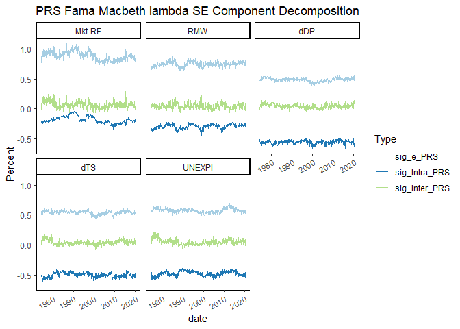<!-- -->

## S4-4 Fama Macbeth Second Step Regression with STL Deseaoned Data

As we can see, Fama Macbeth method would generate an evolving
time-series of factor risk premium, but the volatility in lambda is
unreasonably large. We will try to apply the STL trend in the second
step regression to smooth the lambda.

### S4-4-1 STL Filtering

STL method (Cleveland et al. 1990) would try decompose the time-series
into 3 components: trend, seasonality, and noise. It applies an
iterative smoothing method to extract the trend and seasonality
components. At the same time, one can choose to use a robust weighting
scheme to reduce the effect of large noise to the trend and seasonality
extraction.

We will extract the trend of risk premium of the industry portfolios and
the trend of the betas with the STL method, and then conduct the second
step regression. There are two options with the STL method: the loess
window for seasonal extraction (s_window, large value means no rapidly
evolving seasonal component, needs to be odd and at least 7) and robust
weights for noise (downweight the noisy data in smoothing if
non-Gaussian behavior in the time-series leads to extreme, transient
variation). We will first show the STL decomposition of betas and
returns.

<!-- --><!-- --><!-- --><!-- --><!-- --><!-- --><!-- --><!-- -->

The robustness weighting seems not be appropriate for the Industry Risk
Premiums since the returns variation are mostly caused by Gaussian
behavior. One example is the end of the trend curve: there was a market
crash at the beginning of 2020, so the trend should go down. However,
with the robust weighting, the market crash was given little wight and
disappeared. At the same time, we might just choose s_window = 7, since
there could be changing seasonal patterns in the short-term.

Now, we would compare the cross-sectional distribution before and after
filtering.

<!-- -->

### S4-4-2 Filtered Seasonality and Trend Strength

Now we estimate the strength of trend and strength of seasonality. The
Strength of the trend is defined as:

}{Var(T_t+R_t)})")

The Strength of the seasonality (periodic) is defined as:

}{Var(S_t+R_t)})")

<table class="table table-striped" style="font-size: 10px; width: auto !important; margin-left: auto; margin-right: auto;">
<caption style="font-size: initial !important;">
STL Decomposition Component Strength for Portfolio Risk Premium
</caption>
<thead>
<tr>
<th style="text-align:center;">
Strength
</th>
<th style="text-align:center;">
method
</th>
<th style="text-align:center;">
Aero
</th>
<th style="text-align:center;">
Agric
</th>
<th style="text-align:center;">
Autos
</th>
<th style="text-align:center;">
Banks
</th>
<th style="text-align:center;">
Beer
</th>
<th style="text-align:center;">
BldMt
</th>
<th style="text-align:center;">
Books
</th>
<th style="text-align:center;">
Boxes
</th>
<th style="text-align:center;">
BusSv
</th>
<th style="text-align:center;">
Chems
</th>
<th style="text-align:center;">
Chips
</th>
<th style="text-align:center;">
Clths
</th>
<th style="text-align:center;">
Cnstr
</th>
<th style="text-align:center;">
Coal
</th>
<th style="text-align:center;">
Drugs
</th>
<th style="text-align:center;">
ElcEq
</th>
<th style="text-align:center;">
FabPr
</th>
<th style="text-align:center;">
Fin
</th>
<th style="text-align:center;">
Food
</th>
<th style="text-align:center;">
Fun
</th>
<th style="text-align:center;">
Gold
</th>
<th style="text-align:center;">
Guns
</th>
<th style="text-align:center;">
Hardw
</th>
<th style="text-align:center;">
Hlth
</th>
<th style="text-align:center;">
Hshld
</th>
<th style="text-align:center;">
Insur
</th>
<th style="text-align:center;">
LabEq
</th>
<th style="text-align:center;">
Mach
</th>
<th style="text-align:center;">
Meals
</th>
<th style="text-align:center;">
MedEq
</th>
<th style="text-align:center;">
Mines
</th>
<th style="text-align:center;">
Oil
</th>
<th style="text-align:center;">
Other
</th>
<th style="text-align:center;">
Paper
</th>
<th style="text-align:center;">
PerSv
</th>
<th style="text-align:center;">
RlEst
</th>
<th style="text-align:center;">
Rtail
</th>
<th style="text-align:center;">
Rubbr
</th>
<th style="text-align:center;">
Ships
</th>
<th style="text-align:center;">
Smoke
</th>
<th style="text-align:center;">
Soda
</th>
<th style="text-align:center;">
Softw
</th>
<th style="text-align:center;">
Steel
</th>
<th style="text-align:center;">
Telcm
</th>
<th style="text-align:center;">
Toys
</th>
<th style="text-align:center;">
Trans
</th>
<th style="text-align:center;">
Txtls
</th>
<th style="text-align:center;">
Util
</th>
<th style="text-align:center;">
Whlsl
</th>
</tr>
</thead>
<tbody>
<tr>
<td style="text-align:center;font-weight: bold;vertical-align: middle !important;" rowspan="6">
FS
</td>
<td style="text-align:center;">
s07 norobust
</td>
<td style="text-align:center;">
0.3911851
</td>
<td style="text-align:center;">
0.3725901
</td>
<td style="text-align:center;">
0.4018774
</td>
<td style="text-align:center;">
0.4123642
</td>
<td style="text-align:center;">
0.3927234
</td>
<td style="text-align:center;">
0.4078828
</td>
<td style="text-align:center;">
0.3910922
</td>
<td style="text-align:center;">
0.3648795
</td>
<td style="text-align:center;">
0.3812723
</td>
<td style="text-align:center;">
0.3675350
</td>
<td style="text-align:center;">
0.3616610
</td>
<td style="text-align:center;">
0.4190785
</td>
<td style="text-align:center;">
0.3798464
</td>
<td style="text-align:center;">
0.3773576
</td>
<td style="text-align:center;">
0.3700809
</td>
<td style="text-align:center;">
0.3704741
</td>
<td style="text-align:center;">
0.3684705
</td>
<td style="text-align:center;">
0.3673023
</td>
<td style="text-align:center;">
0.3680159
</td>
<td style="text-align:center;">
0.4094499
</td>
<td style="text-align:center;">
0.3472977
</td>
<td style="text-align:center;">
0.3537860
</td>
<td style="text-align:center;">
0.3597511
</td>
<td style="text-align:center;">
0.3807114
</td>
<td style="text-align:center;">
0.3932478
</td>
<td style="text-align:center;">
0.3934480
</td>
<td style="text-align:center;">
0.3332523
</td>
<td style="text-align:center;">
0.3668646
</td>
<td style="text-align:center;">
0.3629374
</td>
<td style="text-align:center;">
0.3584366
</td>
<td style="text-align:center;">
0.3371663
</td>
<td style="text-align:center;">
0.3550115
</td>
<td style="text-align:center;">
0.3970981
</td>
<td style="text-align:center;">
0.3472353
</td>
<td style="text-align:center;">
0.3540942
</td>
<td style="text-align:center;">
0.4210761
</td>
<td style="text-align:center;">
0.3944570
</td>
<td style="text-align:center;">
0.3988149
</td>
<td style="text-align:center;">
0.3716232
</td>
<td style="text-align:center;">
0.3130075
</td>
<td style="text-align:center;">
0.3659172
</td>
<td style="text-align:center;">
0.3278624
</td>
<td style="text-align:center;">
0.3442852
</td>
<td style="text-align:center;">
0.3609891
</td>
<td style="text-align:center;">
0.3592305
</td>
<td style="text-align:center;">
0.3992945
</td>
<td style="text-align:center;">
0.4088416
</td>
<td style="text-align:center;">
0.3775854
</td>
<td style="text-align:center;">
0.3694408
</td>
</tr>
<tr>
<td style="text-align:center;">
s07 robust
</td>
<td style="text-align:center;">
0.1935022
</td>
<td style="text-align:center;">
0.1330849
</td>
<td style="text-align:center;">
0.1373592
</td>
<td style="text-align:center;">
0.1786056
</td>
<td style="text-align:center;">
0.1579393
</td>
<td style="text-align:center;">
0.1348414
</td>
<td style="text-align:center;">
0.1442415
</td>
<td style="text-align:center;">
0.1368121
</td>
<td style="text-align:center;">
0.1622529
</td>
<td style="text-align:center;">
0.1123085
</td>
<td style="text-align:center;">
0.1806169
</td>
<td style="text-align:center;">
0.1924230
</td>
<td style="text-align:center;">
0.1737184
</td>
<td style="text-align:center;">
0.1818465
</td>
<td style="text-align:center;">
0.1716535
</td>
<td style="text-align:center;">
0.1602079
</td>
<td style="text-align:center;">
0.1653442
</td>
<td style="text-align:center;">
0.1365543
</td>
<td style="text-align:center;">
0.2150892
</td>
<td style="text-align:center;">
0.1515594
</td>
<td style="text-align:center;">
0.1352441
</td>
<td style="text-align:center;">
0.1784574
</td>
<td style="text-align:center;">
0.1794134
</td>
<td style="text-align:center;">
0.1686052
</td>
<td style="text-align:center;">
0.1177779
</td>
<td style="text-align:center;">
0.1909530
</td>
<td style="text-align:center;">
0.1055538
</td>
<td style="text-align:center;">
0.1627177
</td>
<td style="text-align:center;">
0.0888803
</td>
<td style="text-align:center;">
0.1570241
</td>
<td style="text-align:center;">
0.0914811
</td>
<td style="text-align:center;">
0.1353939
</td>
<td style="text-align:center;">
0.2213339
</td>
<td style="text-align:center;">
0.1559026
</td>
<td style="text-align:center;">
0.1508374
</td>
<td style="text-align:center;">
0.1097639
</td>
<td style="text-align:center;">
0.1847783
</td>
<td style="text-align:center;">
0.2223238
</td>
<td style="text-align:center;">
0.1754397
</td>
<td style="text-align:center;">
0.1644021
</td>
<td style="text-align:center;">
0.1154241
</td>
<td style="text-align:center;">
0.0835594
</td>
<td style="text-align:center;">
0.1388996
</td>
<td style="text-align:center;">
0.1721490
</td>
<td style="text-align:center;">
0.1827868
</td>
<td style="text-align:center;">
0.2070766
</td>
<td style="text-align:center;">
0.1616175
</td>
<td style="text-align:center;">
0.1465886
</td>
<td style="text-align:center;">
0.1340354
</td>
</tr>
<tr>
<td style="text-align:center;">
s15 norobust
</td>
<td style="text-align:center;">
0.1715220
</td>
<td style="text-align:center;">
0.1542386
</td>
<td style="text-align:center;">
0.1466074
</td>
<td style="text-align:center;">
0.1530480
</td>
<td style="text-align:center;">
0.1629970
</td>
<td style="text-align:center;">
0.1507389
</td>
<td style="text-align:center;">
0.1425589
</td>
<td style="text-align:center;">
0.1462846
</td>
<td style="text-align:center;">
0.1499812
</td>
<td style="text-align:center;">
0.1554518
</td>
<td style="text-align:center;">
0.1437995
</td>
<td style="text-align:center;">
0.1732677
</td>
<td style="text-align:center;">
0.1592202
</td>
<td style="text-align:center;">
0.1584251
</td>
<td style="text-align:center;">
0.1356105
</td>
<td style="text-align:center;">
0.1468336
</td>
<td style="text-align:center;">
0.1364764
</td>
<td style="text-align:center;">
0.1302110
</td>
<td style="text-align:center;">
0.1434273
</td>
<td style="text-align:center;">
0.1684885
</td>
<td style="text-align:center;">
0.1532860
</td>
<td style="text-align:center;">
0.1455716
</td>
<td style="text-align:center;">
0.1570901
</td>
<td style="text-align:center;">
0.1521780
</td>
<td style="text-align:center;">
0.1346499
</td>
<td style="text-align:center;">
0.1337293
</td>
<td style="text-align:center;">
0.1358997
</td>
<td style="text-align:center;">
0.1452397
</td>
<td style="text-align:center;">
0.1303147
</td>
<td style="text-align:center;">
0.1455287
</td>
<td style="text-align:center;">
0.1229566
</td>
<td style="text-align:center;">
0.1441907
</td>
<td style="text-align:center;">
0.1853615
</td>
<td style="text-align:center;">
0.1412987
</td>
<td style="text-align:center;">
0.1435338
</td>
<td style="text-align:center;">
0.1646089
</td>
<td style="text-align:center;">
0.1462893
</td>
<td style="text-align:center;">
0.1754984
</td>
<td style="text-align:center;">
0.1499311
</td>
<td style="text-align:center;">
0.1391745
</td>
<td style="text-align:center;">
0.1533818
</td>
<td style="text-align:center;">
0.1506773
</td>
<td style="text-align:center;">
0.1417627
</td>
<td style="text-align:center;">
0.1533034
</td>
<td style="text-align:center;">
0.1544247
</td>
<td style="text-align:center;">
0.1641945
</td>
<td style="text-align:center;">
0.1755422
</td>
<td style="text-align:center;">
0.1608538
</td>
<td style="text-align:center;">
0.1414738
</td>
</tr>
<tr>
<td style="text-align:center;">
s15 robust
</td>
<td style="text-align:center;">
0.0932133
</td>
<td style="text-align:center;">
0.0630820
</td>
<td style="text-align:center;">
0.0636732
</td>
<td style="text-align:center;">
0.0817096
</td>
<td style="text-align:center;">
0.0697414
</td>
<td style="text-align:center;">
0.0525724
</td>
<td style="text-align:center;">
0.0654441
</td>
<td style="text-align:center;">
0.0697971
</td>
<td style="text-align:center;">
0.0682196
</td>
<td style="text-align:center;">
0.0665752
</td>
<td style="text-align:center;">
0.0817959
</td>
<td style="text-align:center;">
0.1038690
</td>
<td style="text-align:center;">
0.0931980
</td>
<td style="text-align:center;">
0.0929010
</td>
<td style="text-align:center;">
0.0748362
</td>
<td style="text-align:center;">
0.0922239
</td>
<td style="text-align:center;">
0.0735943
</td>
<td style="text-align:center;">
0.0615121
</td>
<td style="text-align:center;">
0.0560796
</td>
<td style="text-align:center;">
0.0896648
</td>
<td style="text-align:center;">
0.0709464
</td>
<td style="text-align:center;">
0.0728823
</td>
<td style="text-align:center;">
0.0856320
</td>
<td style="text-align:center;">
0.0734410
</td>
<td style="text-align:center;">
0.0392797
</td>
<td style="text-align:center;">
0.0729093
</td>
<td style="text-align:center;">
0.0600954
</td>
<td style="text-align:center;">
0.0791513
</td>
<td style="text-align:center;">
0.0629090
</td>
<td style="text-align:center;">
0.0719507
</td>
<td style="text-align:center;">
0.0405025
</td>
<td style="text-align:center;">
0.0672994
</td>
<td style="text-align:center;">
0.0831488
</td>
<td style="text-align:center;">
0.0756608
</td>
<td style="text-align:center;">
0.0719348
</td>
<td style="text-align:center;">
0.0549216
</td>
<td style="text-align:center;">
0.1015209
</td>
<td style="text-align:center;">
0.1059332
</td>
<td style="text-align:center;">
0.0761996
</td>
<td style="text-align:center;">
0.0945961
</td>
<td style="text-align:center;">
0.0624700
</td>
<td style="text-align:center;">
0.0397197
</td>
<td style="text-align:center;">
0.0834692
</td>
<td style="text-align:center;">
0.0966527
</td>
<td style="text-align:center;">
0.0892999
</td>
<td style="text-align:center;">
0.0813360
</td>
<td style="text-align:center;">
0.0726407
</td>
<td style="text-align:center;">
0.0763601
</td>
<td style="text-align:center;">
0.0562639
</td>
</tr>
<tr>
<td style="text-align:center;">
s40 norobust
</td>
<td style="text-align:center;">
0.0601633
</td>
<td style="text-align:center;">
0.0475928
</td>
<td style="text-align:center;">
0.0765333
</td>
<td style="text-align:center;">
0.0434124
</td>
<td style="text-align:center;">
0.0579168
</td>
<td style="text-align:center;">
0.0552060
</td>
<td style="text-align:center;">
0.0386767
</td>
<td style="text-align:center;">
0.0649526
</td>
<td style="text-align:center;">
0.0409870
</td>
<td style="text-align:center;">
0.0739656
</td>
<td style="text-align:center;">
0.0395210
</td>
<td style="text-align:center;">
0.0581979
</td>
<td style="text-align:center;">
0.0514092
</td>
<td style="text-align:center;">
0.0598806
</td>
<td style="text-align:center;">
0.0303644
</td>
<td style="text-align:center;">
0.0567801
</td>
<td style="text-align:center;">
0.0596509
</td>
<td style="text-align:center;">
0.0341185
</td>
<td style="text-align:center;">
0.0403368
</td>
<td style="text-align:center;">
0.0688779
</td>
<td style="text-align:center;">
0.0462200
</td>
<td style="text-align:center;">
0.0607677
</td>
<td style="text-align:center;">
0.0491420
</td>
<td style="text-align:center;">
0.0502315
</td>
<td style="text-align:center;">
0.0405826
</td>
<td style="text-align:center;">
0.0413409
</td>
<td style="text-align:center;">
0.0437884
</td>
<td style="text-align:center;">
0.0599790
</td>
<td style="text-align:center;">
0.0544320
</td>
<td style="text-align:center;">
0.0421698
</td>
<td style="text-align:center;">
0.0489724
</td>
<td style="text-align:center;">
0.0491735
</td>
<td style="text-align:center;">
0.0641968
</td>
<td style="text-align:center;">
0.0637719
</td>
<td style="text-align:center;">
0.0418764
</td>
<td style="text-align:center;">
0.0671636
</td>
<td style="text-align:center;">
0.0499496
</td>
<td style="text-align:center;">
0.0782749
</td>
<td style="text-align:center;">
0.0561672
</td>
<td style="text-align:center;">
0.0422292
</td>
<td style="text-align:center;">
0.0467096
</td>
<td style="text-align:center;">
0.0500458
</td>
<td style="text-align:center;">
0.0678029
</td>
<td style="text-align:center;">
0.0453633
</td>
<td style="text-align:center;">
0.0563154
</td>
<td style="text-align:center;">
0.0566933
</td>
<td style="text-align:center;">
0.0613601
</td>
<td style="text-align:center;">
0.0558211
</td>
<td style="text-align:center;">
0.0480012
</td>
</tr>
<tr>
<td style="text-align:center;">
s40 robust
</td>
<td style="text-align:center;">
0.0195290
</td>
<td style="text-align:center;">
0.0251790
</td>
<td style="text-align:center;">
0.0436084
</td>
<td style="text-align:center;">
0.0206615
</td>
<td style="text-align:center;">
0.0184751
</td>
<td style="text-align:center;">
0.0271615
</td>
<td style="text-align:center;">
0.0184102
</td>
<td style="text-align:center;">
0.0451552
</td>
<td style="text-align:center;">
0.0161600
</td>
<td style="text-align:center;">
0.0406732
</td>
<td style="text-align:center;">
0.0254891
</td>
<td style="text-align:center;">
0.0289817
</td>
<td style="text-align:center;">
0.0398457
</td>
<td style="text-align:center;">
0.0294088
</td>
<td style="text-align:center;">
0.0173966
</td>
<td style="text-align:center;">
0.0393771
</td>
<td style="text-align:center;">
0.0358616
</td>
<td style="text-align:center;">
0.0173265
</td>
<td style="text-align:center;">
0.0129435
</td>
<td style="text-align:center;">
0.0496558
</td>
<td style="text-align:center;">
0.0325875
</td>
<td style="text-align:center;">
0.0330893
</td>
<td style="text-align:center;">
0.0326774
</td>
<td style="text-align:center;">
0.0252610
</td>
<td style="text-align:center;">
0.0195269
</td>
<td style="text-align:center;">
0.0293054
</td>
<td style="text-align:center;">
0.0302699
</td>
<td style="text-align:center;">
0.0410299
</td>
<td style="text-align:center;">
0.0383096
</td>
<td style="text-align:center;">
0.0285954
</td>
<td style="text-align:center;">
0.0365749
</td>
<td style="text-align:center;">
0.0225854
</td>
<td style="text-align:center;">
0.0280083
</td>
<td style="text-align:center;">
0.0411606
</td>
<td style="text-align:center;">
0.0199753
</td>
<td style="text-align:center;">
0.0302439
</td>
<td style="text-align:center;">
0.0300381
</td>
<td style="text-align:center;">
0.0465594
</td>
<td style="text-align:center;">
0.0432242
</td>
<td style="text-align:center;">
0.0279197
</td>
<td style="text-align:center;">
0.0230431
</td>
<td style="text-align:center;">
0.0100405
</td>
<td style="text-align:center;">
0.0457963
</td>
<td style="text-align:center;">
0.0332615
</td>
<td style="text-align:center;">
0.0369541
</td>
<td style="text-align:center;">
0.0330005
</td>
<td style="text-align:center;">
0.0367820
</td>
<td style="text-align:center;">
0.0359658
</td>
<td style="text-align:center;">
0.0233252
</td>
</tr>
<tr>
<td style="text-align:center;font-weight: bold;vertical-align: middle !important;" rowspan="6">
FT
</td>
<td style="text-align:center;">
s07 norobust
</td>
<td style="text-align:center;">
0.1747301
</td>
<td style="text-align:center;">
0.1218548
</td>
<td style="text-align:center;">
0.1722092
</td>
<td style="text-align:center;">
0.1530624
</td>
<td style="text-align:center;">
0.1444809
</td>
<td style="text-align:center;">
0.1299203
</td>
<td style="text-align:center;">
0.1915024
</td>
<td style="text-align:center;">
0.1342552
</td>
<td style="text-align:center;">
0.1548790
</td>
<td style="text-align:center;">
0.1323798
</td>
<td style="text-align:center;">
0.1731102
</td>
<td style="text-align:center;">
0.1781217
</td>
<td style="text-align:center;">
0.1544956
</td>
<td style="text-align:center;">
0.1934636
</td>
<td style="text-align:center;">
0.1346082
</td>
<td style="text-align:center;">
0.1277598
</td>
<td style="text-align:center;">
0.1373339
</td>
<td style="text-align:center;">
0.1621637
</td>
<td style="text-align:center;">
0.1402085
</td>
<td style="text-align:center;">
0.1668559
</td>
<td style="text-align:center;">
0.1174218
</td>
<td style="text-align:center;">
0.1392205
</td>
<td style="text-align:center;">
0.1688858
</td>
<td style="text-align:center;">
0.1965993
</td>
<td style="text-align:center;">
0.1523608
</td>
<td style="text-align:center;">
0.1570573
</td>
<td style="text-align:center;">
0.1306660
</td>
<td style="text-align:center;">
0.1365207
</td>
<td style="text-align:center;">
0.1473765
</td>
<td style="text-align:center;">
0.1511585
</td>
<td style="text-align:center;">
0.1497665
</td>
<td style="text-align:center;">
0.1316594
</td>
<td style="text-align:center;">
0.1699624
</td>
<td style="text-align:center;">
0.1222298
</td>
<td style="text-align:center;">
0.1515716
</td>
<td style="text-align:center;">
0.2029502
</td>
<td style="text-align:center;">
0.1425971
</td>
<td style="text-align:center;">
0.1441369
</td>
<td style="text-align:center;">
0.1251990
</td>
<td style="text-align:center;">
0.1381937
</td>
<td style="text-align:center;">
0.1379424
</td>
<td style="text-align:center;">
0.1290404
</td>
<td style="text-align:center;">
0.1376526
</td>
<td style="text-align:center;">
0.1838286
</td>
<td style="text-align:center;">
0.1301331
</td>
<td style="text-align:center;">
0.1520290
</td>
<td style="text-align:center;">
0.1622098
</td>
<td style="text-align:center;">
0.1708918
</td>
<td style="text-align:center;">
0.1498722
</td>
</tr>
<tr>
<td style="text-align:center;">
s07 robust
</td>
<td style="text-align:center;">
0.0615722
</td>
<td style="text-align:center;">
0.0310825
</td>
<td style="text-align:center;">
0.0513790
</td>
<td style="text-align:center;">
0.0051914
</td>
<td style="text-align:center;">
0.0480184
</td>
<td style="text-align:center;">
0.0108255
</td>
<td style="text-align:center;">
0.0755777
</td>
<td style="text-align:center;">
0.0000000
</td>
<td style="text-align:center;">
0.0617244
</td>
<td style="text-align:center;">
0.0317907
</td>
<td style="text-align:center;">
0.0788905
</td>
<td style="text-align:center;">
0.0470572
</td>
<td style="text-align:center;">
0.0623079
</td>
<td style="text-align:center;">
0.0886780
</td>
<td style="text-align:center;">
0.0386053
</td>
<td style="text-align:center;">
0.0212144
</td>
<td style="text-align:center;">
0.0290154
</td>
<td style="text-align:center;">
0.0314009
</td>
<td style="text-align:center;">
0.0609016
</td>
<td style="text-align:center;">
0.0495621
</td>
<td style="text-align:center;">
0.0458769
</td>
<td style="text-align:center;">
0.0429066
</td>
<td style="text-align:center;">
0.0669126
</td>
<td style="text-align:center;">
0.0657843
</td>
<td style="text-align:center;">
0.0016019
</td>
<td style="text-align:center;">
0.0502745
</td>
<td style="text-align:center;">
0.0000000
</td>
<td style="text-align:center;">
0.0365109
</td>
<td style="text-align:center;">
0.0552708
</td>
<td style="text-align:center;">
0.0375878
</td>
<td style="text-align:center;">
0.0047704
</td>
<td style="text-align:center;">
0.0351032
</td>
<td style="text-align:center;">
0.0507331
</td>
<td style="text-align:center;">
0.0294042
</td>
<td style="text-align:center;">
0.0800777
</td>
<td style="text-align:center;">
0.0567200
</td>
<td style="text-align:center;">
0.0456076
</td>
<td style="text-align:center;">
0.0515451
</td>
<td style="text-align:center;">
0.0251869
</td>
<td style="text-align:center;">
0.0375225
</td>
<td style="text-align:center;">
0.0453823
</td>
<td style="text-align:center;">
0.0023200
</td>
<td style="text-align:center;">
0.0252830
</td>
<td style="text-align:center;">
0.0698966
</td>
<td style="text-align:center;">
0.0704611
</td>
<td style="text-align:center;">
0.0167496
</td>
<td style="text-align:center;">
0.0664586
</td>
<td style="text-align:center;">
0.0025032
</td>
<td style="text-align:center;">
0.0457656
</td>
</tr>
<tr>
<td style="text-align:center;">
s15 norobust
</td>
<td style="text-align:center;">
0.1407848
</td>
<td style="text-align:center;">
0.1029359
</td>
<td style="text-align:center;">
0.1354323
</td>
<td style="text-align:center;">
0.1209299
</td>
<td style="text-align:center;">
0.1143252
</td>
<td style="text-align:center;">
0.1003318
</td>
<td style="text-align:center;">
0.1502053
</td>
<td style="text-align:center;">
0.1105516
</td>
<td style="text-align:center;">
0.1281721
</td>
<td style="text-align:center;">
0.1114761
</td>
<td style="text-align:center;">
0.1419507
</td>
<td style="text-align:center;">
0.1352655
</td>
<td style="text-align:center;">
0.1278098
</td>
<td style="text-align:center;">
0.1614405
</td>
<td style="text-align:center;">
0.1074691
</td>
<td style="text-align:center;">
0.1046091
</td>
<td style="text-align:center;">
0.1142497
</td>
<td style="text-align:center;">
0.1322714
</td>
<td style="text-align:center;">
0.1098999
</td>
<td style="text-align:center;">
0.1320479
</td>
<td style="text-align:center;">
0.1008032
</td>
<td style="text-align:center;">
0.1114172
</td>
<td style="text-align:center;">
0.1402189
</td>
<td style="text-align:center;">
0.1674478
</td>
<td style="text-align:center;">
0.1172914
</td>
<td style="text-align:center;">
0.1240296
</td>
<td style="text-align:center;">
0.1111200
</td>
<td style="text-align:center;">
0.1148631
</td>
<td style="text-align:center;">
0.1169995
</td>
<td style="text-align:center;">
0.1288658
</td>
<td style="text-align:center;">
0.1301918
</td>
<td style="text-align:center;">
0.1043315
</td>
<td style="text-align:center;">
0.1362260
</td>
<td style="text-align:center;">
0.1029547
</td>
<td style="text-align:center;">
0.1200181
</td>
<td style="text-align:center;">
0.1597103
</td>
<td style="text-align:center;">
0.1105676
</td>
<td style="text-align:center;">
0.1161866
</td>
<td style="text-align:center;">
0.1039593
</td>
<td style="text-align:center;">
0.1200972
</td>
<td style="text-align:center;">
0.1113521
</td>
<td style="text-align:center;">
0.1110099
</td>
<td style="text-align:center;">
0.1156434
</td>
<td style="text-align:center;">
0.1492082
</td>
<td style="text-align:center;">
0.1104237
</td>
<td style="text-align:center;">
0.1213890
</td>
<td style="text-align:center;">
0.1256044
</td>
<td style="text-align:center;">
0.1371936
</td>
<td style="text-align:center;">
0.1203757
</td>
</tr>
<tr>
<td style="text-align:center;">
s15 robust
</td>
<td style="text-align:center;">
0.0697357
</td>
<td style="text-align:center;">
0.0377960
</td>
<td style="text-align:center;">
0.0695943
</td>
<td style="text-align:center;">
0.0444541
</td>
<td style="text-align:center;">
0.0643411
</td>
<td style="text-align:center;">
0.0181430
</td>
<td style="text-align:center;">
0.0962614
</td>
<td style="text-align:center;">
0.0000000
</td>
<td style="text-align:center;">
0.0574438
</td>
<td style="text-align:center;">
0.0420824
</td>
<td style="text-align:center;">
0.0881330
</td>
<td style="text-align:center;">
0.0849883
</td>
<td style="text-align:center;">
0.0770077
</td>
<td style="text-align:center;">
0.1030379
</td>
<td style="text-align:center;">
0.0671929
</td>
<td style="text-align:center;">
0.0481982
</td>
<td style="text-align:center;">
0.0477861
</td>
<td style="text-align:center;">
0.0127605
</td>
<td style="text-align:center;">
0.0360501
</td>
<td style="text-align:center;">
0.0535708
</td>
<td style="text-align:center;">
0.0591903
</td>
<td style="text-align:center;">
0.0614146
</td>
<td style="text-align:center;">
0.0539884
</td>
<td style="text-align:center;">
0.0736465
</td>
<td style="text-align:center;">
0.0315696
</td>
<td style="text-align:center;">
0.0272153
</td>
<td style="text-align:center;">
0.0372867
</td>
<td style="text-align:center;">
0.0646442
</td>
<td style="text-align:center;">
0.0446057
</td>
<td style="text-align:center;">
0.0334147
</td>
<td style="text-align:center;">
0.0578639
</td>
<td style="text-align:center;">
0.0509970
</td>
<td style="text-align:center;">
0.0502580
</td>
<td style="text-align:center;">
0.0502323
</td>
<td style="text-align:center;">
0.0820566
</td>
<td style="text-align:center;">
0.0540329
</td>
<td style="text-align:center;">
0.0797632
</td>
<td style="text-align:center;">
0.0579009
</td>
<td style="text-align:center;">
0.0385608
</td>
<td style="text-align:center;">
0.0580475
</td>
<td style="text-align:center;">
0.0615840
</td>
<td style="text-align:center;">
0.0340669
</td>
<td style="text-align:center;">
0.0293688
</td>
<td style="text-align:center;">
0.0958803
</td>
<td style="text-align:center;">
0.0777113
</td>
<td style="text-align:center;">
0.0384853
</td>
<td style="text-align:center;">
0.0531726
</td>
<td style="text-align:center;">
0.0310471
</td>
<td style="text-align:center;">
0.0478614
</td>
</tr>
<tr>
<td style="text-align:center;">
s40 norobust
</td>
<td style="text-align:center;">
0.1392491
</td>
<td style="text-align:center;">
0.1061359
</td>
<td style="text-align:center;">
0.1370404
</td>
<td style="text-align:center;">
0.1228059
</td>
<td style="text-align:center;">
0.1128373
</td>
<td style="text-align:center;">
0.1046560
</td>
<td style="text-align:center;">
0.1527875
</td>
<td style="text-align:center;">
0.1122508
</td>
<td style="text-align:center;">
0.1315556
</td>
<td style="text-align:center;">
0.1136538
</td>
<td style="text-align:center;">
0.1424726
</td>
<td style="text-align:center;">
0.1297128
</td>
<td style="text-align:center;">
0.1314119
</td>
<td style="text-align:center;">
0.1663026
</td>
<td style="text-align:center;">
0.1058051
</td>
<td style="text-align:center;">
0.1075340
</td>
<td style="text-align:center;">
0.1211150
</td>
<td style="text-align:center;">
0.1374774
</td>
<td style="text-align:center;">
0.1093715
</td>
<td style="text-align:center;">
0.1351366
</td>
<td style="text-align:center;">
0.0999502
</td>
<td style="text-align:center;">
0.1145405
</td>
<td style="text-align:center;">
0.1379634
</td>
<td style="text-align:center;">
0.1762155
</td>
<td style="text-align:center;">
0.1224816
</td>
<td style="text-align:center;">
0.1257258
</td>
<td style="text-align:center;">
0.1160512
</td>
<td style="text-align:center;">
0.1197718
</td>
<td style="text-align:center;">
0.1240796
</td>
<td style="text-align:center;">
0.1310452
</td>
<td style="text-align:center;">
0.1339221
</td>
<td style="text-align:center;">
0.1046548
</td>
<td style="text-align:center;">
0.1344719
</td>
<td style="text-align:center;">
0.1031931
</td>
<td style="text-align:center;">
0.1191116
</td>
<td style="text-align:center;">
0.1628746
</td>
<td style="text-align:center;">
0.1128658
</td>
<td style="text-align:center;">
0.1215241
</td>
<td style="text-align:center;">
0.1089579
</td>
<td style="text-align:center;">
0.1198918
</td>
<td style="text-align:center;">
0.1094232
</td>
<td style="text-align:center;">
0.1117915
</td>
<td style="text-align:center;">
0.1187315
</td>
<td style="text-align:center;">
0.1438505
</td>
<td style="text-align:center;">
0.1144191
</td>
<td style="text-align:center;">
0.1202181
</td>
<td style="text-align:center;">
0.1212746
</td>
<td style="text-align:center;">
0.1337691
</td>
<td style="text-align:center;">
0.1221408
</td>
</tr>
<tr>
<td style="text-align:center;">
s40 robust
</td>
<td style="text-align:center;">
0.0620425
</td>
<td style="text-align:center;">
0.0524872
</td>
<td style="text-align:center;">
0.0787254
</td>
<td style="text-align:center;">
0.0299023
</td>
<td style="text-align:center;">
0.0653389
</td>
<td style="text-align:center;">
0.0345767
</td>
<td style="text-align:center;">
0.1057528
</td>
<td style="text-align:center;">
0.0325341
</td>
<td style="text-align:center;">
0.0764593
</td>
<td style="text-align:center;">
0.0490294
</td>
<td style="text-align:center;">
0.1017065
</td>
<td style="text-align:center;">
0.0784469
</td>
<td style="text-align:center;">
0.0940683
</td>
<td style="text-align:center;">
0.1243466
</td>
<td style="text-align:center;">
0.0745595
</td>
<td style="text-align:center;">
0.0610655
</td>
<td style="text-align:center;">
0.0637757
</td>
<td style="text-align:center;">
0.0645653
</td>
<td style="text-align:center;">
0.0460254
</td>
<td style="text-align:center;">
0.0605526
</td>
<td style="text-align:center;">
0.0686601
</td>
<td style="text-align:center;">
0.0708301
</td>
<td style="text-align:center;">
0.0756040
</td>
<td style="text-align:center;">
0.1048584
</td>
<td style="text-align:center;">
0.0531525
</td>
<td style="text-align:center;">
0.0459628
</td>
<td style="text-align:center;">
0.0578484
</td>
<td style="text-align:center;">
0.0792166
</td>
<td style="text-align:center;">
0.0643925
</td>
<td style="text-align:center;">
0.0663802
</td>
<td style="text-align:center;">
0.0841352
</td>
<td style="text-align:center;">
0.0527248
</td>
<td style="text-align:center;">
0.0639323
</td>
<td style="text-align:center;">
0.0601636
</td>
<td style="text-align:center;">
0.0855092
</td>
<td style="text-align:center;">
0.0640592
</td>
<td style="text-align:center;">
0.0843181
</td>
<td style="text-align:center;">
0.0763113
</td>
<td style="text-align:center;">
0.0602987
</td>
<td style="text-align:center;">
0.0718530
</td>
<td style="text-align:center;">
0.0629026
</td>
<td style="text-align:center;">
0.0356287
</td>
<td style="text-align:center;">
0.0470413
</td>
<td style="text-align:center;">
0.0859378
</td>
<td style="text-align:center;">
0.0830256
</td>
<td style="text-align:center;">
0.0734112
</td>
<td style="text-align:center;">
0.0606631
</td>
<td style="text-align:center;">
0.0579499
</td>
<td style="text-align:center;">
0.0611395
</td>
</tr>
</tbody>
</table>

It seems that the both the trend and seasonal components are weak. No
robust is stronger than robust, and smaller s_window would yield
stronger components.

### S4-4-3 Beta Decomposition

<!-- --><!-- -->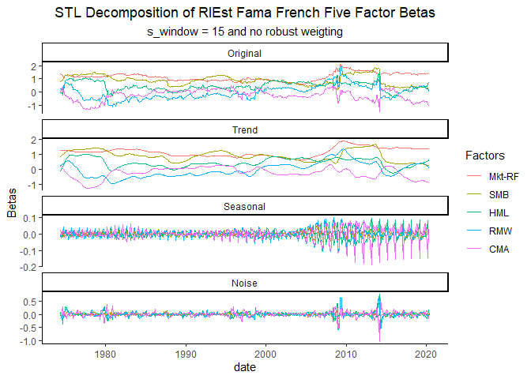<!-- --><!-- --><!-- -->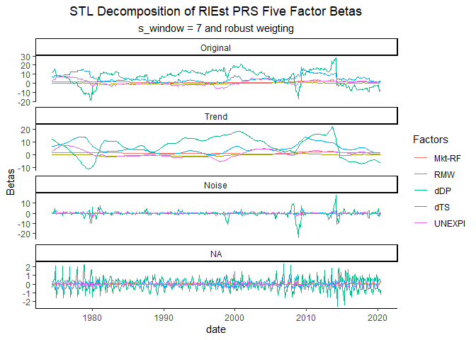<!-- --><!-- --><!-- -->

Beta estimation’s noise or seasonal pattern is much smaller than trend
so the noise weight or the s_window does not impact the result as much.

Now, we will take the desired no robust weighting, s_window = 7 trend
results of the Industry Risk Premium to estimate the factor risk
premium.

### S4-4-4 Filtered Second Pass Regression

<!-- --><!-- -->

For robustness check, we also computed the factor risk premium based on
other filtering.

### S4-4-5 Component Second Pass Regression Comparison

<!-- -->
<table class="table table-striped" style="font-size: 10px; width: auto !important; margin-left: auto; margin-right: auto;">
<caption style="font-size: initial !important;">
R Squared from Regressing (Panel) Fama French Five Factor Betas on STL
Components
</caption>
<thead>
<tr>
<th style="text-align:center;">
component
</th>
<th style="text-align:center;">
r.squared
</th>
</tr>
</thead>
<tbody>
<tr>
<td style="text-align:center;font-weight: bold;">
Original
</td>
<td style="text-align:center;">
0.0002428
</td>
</tr>
<tr>
<td style="text-align:center;font-weight: bold;">
Trend
</td>
<td style="text-align:center;">
0.0027479
</td>
</tr>
<tr>
<td style="text-align:center;font-weight: bold;">
Seasonal
</td>
<td style="text-align:center;">
0.0000137
</td>
</tr>
<tr>
<td style="text-align:center;font-weight: bold;">
Noise
</td>
<td style="text-align:center;">
0.0000424
</td>
</tr>
</tbody>
</table>

### S4-4-6 Regression Standard Error

<!-- -->
<table class="table table-striped" style="font-size: 10px; width: auto !important; margin-left: auto; margin-right: auto;">
<caption style="font-size: initial !important;">
Average Cross-sectional Regression Lambda Error
</caption>
<thead>
<tr>
<th style="text-align:center;">
Factors
</th>
<th style="text-align:center;">
FM
</th>
<th style="text-align:center;">
FM_STL
</th>
<th style="text-align:center;">
ratio
</th>
</tr>
</thead>
<tbody>
<tr>
<td style="text-align:center;">
Mkt-RF
</td>
<td style="text-align:center;">
0.0241975
</td>
<td style="text-align:center;">
0.0065465
</td>
<td style="text-align:center;">
0.2705442
</td>
</tr>
<tr>
<td style="text-align:center;">
SMB
</td>
<td style="text-align:center;">
0.0131768
</td>
<td style="text-align:center;">
0.0036023
</td>
<td style="text-align:center;">
0.2733812
</td>
</tr>
<tr>
<td style="text-align:center;">
HML
</td>
<td style="text-align:center;">
0.0122650
</td>
<td style="text-align:center;">
0.0034898
</td>
<td style="text-align:center;">
0.2845358
</td>
</tr>
<tr>
<td style="text-align:center;">
RMW
</td>
<td style="text-align:center;">
0.0106381
</td>
<td style="text-align:center;">
0.0029752
</td>
<td style="text-align:center;">
0.2796756
</td>
</tr>
<tr>
<td style="text-align:center;">
CMA
</td>
<td style="text-align:center;">
0.0105354
</td>
<td style="text-align:center;">
0.0028469
</td>
<td style="text-align:center;">
0.2702182
</td>
</tr>
</tbody>
</table>

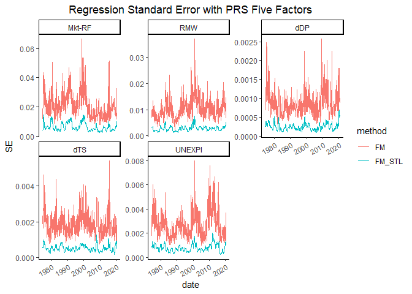<!-- -->

### S4-4-7 Unfiltered and Filtered Lambdas

Let’s plot the unfiltered lambda together with filtered lambda to see
the effect of filtering on lambda.

<!-- --><!-- -->
<table class="table table-striped" style="font-size: 10px; width: auto !important; margin-left: auto; margin-right: auto;">
<caption style="font-size: initial !important;">
Correlation between FM lambda and STL filtered FM lambda
</caption>
<thead>
<tr>
<th style="border-bottom:hidden;padding-bottom:0; padding-left:3px;padding-right:3px;text-align: center; " colspan="2">

FF5

</th>
<th style="border-bottom:hidden;padding-bottom:0; padding-left:3px;padding-right:3px;text-align: center; " colspan="2">

PRS

</th>
</tr>
<tr>
<th style="text-align:center;">
Factors
</th>
<th style="text-align:center;">
FF5
</th>
<th style="text-align:center;">
Factors
</th>
<th style="text-align:center;">
PRS
</th>
</tr>
</thead>
<tbody>
<tr>
<td style="text-align:center;">
Mkt-RF
</td>
<td style="text-align:center;">
0.3076751
</td>
<td style="text-align:center;">
Mkt-RF
</td>
<td style="text-align:center;">
0.3391793
</td>
</tr>
<tr>
<td style="text-align:center;">
SMB
</td>
<td style="text-align:center;">
0.3241830
</td>
<td style="text-align:center;">
RMW
</td>
<td style="text-align:center;">
0.3566414
</td>
</tr>
<tr>
<td style="text-align:center;">
HML
</td>
<td style="text-align:center;">
0.4178838
</td>
<td style="text-align:center;">
dDP
</td>
<td style="text-align:center;">
0.3544000
</td>
</tr>
<tr>
<td style="text-align:center;">
RMW
</td>
<td style="text-align:center;">
0.3184673
</td>
<td style="text-align:center;">
dTS
</td>
<td style="text-align:center;">
0.3891172
</td>
</tr>
<tr>
<td style="text-align:center;">
CMA
</td>
<td style="text-align:center;">
0.3677557
</td>
<td style="text-align:center;">
UNEXPI
</td>
<td style="text-align:center;">
0.3892405
</td>
</tr>
</tbody>
</table>

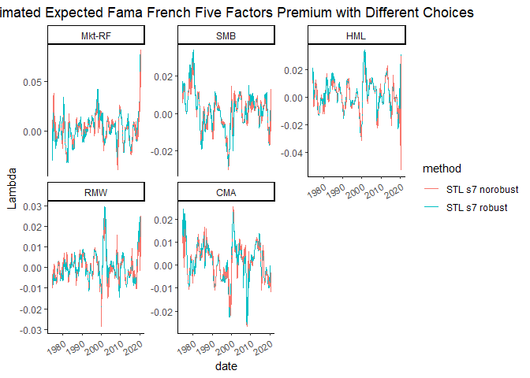<!-- --><!-- --><!-- --><!-- -->

### S4-4-8 KS test and Stats

We also performed a KS test to test the FM lambdas and STL FM lambdas
for different factors. It seems that their distributions are different.

<table class="table table-striped" style="font-size: 10px; width: auto !important; margin-left: auto; margin-right: auto;">
<caption style="font-size: initial !important;">
KS Test for Fama Mecbeth Lambdas and STL FM Lambdas
</caption>
<thead>
<tr>
<th style="text-align:center;">
model
</th>
<th style="text-align:center;">
Factors
</th>
<th style="text-align:center;">
statistic
</th>
<th style="text-align:center;">
p.value
</th>
</tr>
</thead>
<tbody>
<tr>
<td style="text-align:center;font-weight: bold;vertical-align: middle !important;" rowspan="5">
FF5
</td>
<td style="text-align:center;">
Mkt-RF
</td>
<td style="text-align:center;">
0.2947559
</td>
<td style="text-align:center;">
0
</td>
</tr>
<tr>
<td style="text-align:center;">
SMB
</td>
<td style="text-align:center;">
0.3092224
</td>
<td style="text-align:center;">
0
</td>
</tr>
<tr>
<td style="text-align:center;">
HML
</td>
<td style="text-align:center;">
0.2676311
</td>
<td style="text-align:center;">
0
</td>
</tr>
<tr>
<td style="text-align:center;">
RMW
</td>
<td style="text-align:center;">
0.2839060
</td>
<td style="text-align:center;">
0
</td>
</tr>
<tr>
<td style="text-align:center;">
CMA
</td>
<td style="text-align:center;">
0.2567812
</td>
<td style="text-align:center;">
0
</td>
</tr>
<tr>
<td style="text-align:center;font-weight: bold;vertical-align: middle !important;" rowspan="5">
PRS
</td>
<td style="text-align:center;">
Mkt-RF
</td>
<td style="text-align:center;">
0.2766727
</td>
<td style="text-align:center;">
0
</td>
</tr>
<tr>
<td style="text-align:center;">
RMW
</td>
<td style="text-align:center;">
0.2857143
</td>
<td style="text-align:center;">
0
</td>
</tr>
<tr>
<td style="text-align:center;">
dDP
</td>
<td style="text-align:center;">
0.3092224
</td>
<td style="text-align:center;">
0
</td>
</tr>
<tr>
<td style="text-align:center;">
dTS
</td>
<td style="text-align:center;">
0.2603978
</td>
<td style="text-align:center;">
0
</td>
</tr>
<tr>
<td style="text-align:center;">
UNEXPI
</td>
<td style="text-align:center;">
0.2694394
</td>
<td style="text-align:center;">
0
</td>
</tr>
</tbody>
</table>

Here is a comparison of the lambda statistics of the Normal Fama Macbeth
and Fama Macbeth Second Step Regression with STL Trend Data.

<table class="table table-striped" style="font-size: 10px; width: auto !important; margin-left: auto; margin-right: auto;">
<caption style="font-size: initial !important;">
Fama Macbeth/STL Fama Macbeth Lambda0 Stats
</caption>
<thead>
<tr>
<th style="empty-cells: hide;border-bottom:hidden;" colspan="2">
</th>
<th style="border-bottom:hidden;padding-bottom:0; padding-left:3px;padding-right:3px;text-align: center; " colspan="5">

stats

</th>
</tr>
<tr>
<th style="text-align:center;">
model
</th>
<th style="text-align:center;">
method
</th>
<th style="text-align:center;">
mean
</th>
<th style="text-align:center;">
variance
</th>
<th style="text-align:center;">
skewness
</th>
<th style="text-align:center;">
kurtosis
</th>
<th style="text-align:center;">
z_score
</th>
</tr>
</thead>
<tbody>
<tr>
<td style="text-align:center;font-weight: bold;vertical-align: middle !important;" rowspan="2">
FF5
</td>
<td style="text-align:center;">
FM
</td>
<td style="text-align:center;">
0.0055044
</td>
<td style="text-align:center;">
0.0014113
</td>
<td style="text-align:center;">
-0.2326548
</td>
<td style="text-align:center;">
3.751709
</td>
<td style="text-align:center;">
3.445597
</td>
</tr>
<tr>
<td style="text-align:center;">
FM_STL
</td>
<td style="text-align:center;">
0.0054579
</td>
<td style="text-align:center;">
0.0001034
</td>
<td style="text-align:center;">
-0.2494886
</td>
<td style="text-align:center;">
5.252341
</td>
<td style="text-align:center;">
12.619376
</td>
</tr>
<tr>
<td style="text-align:center;font-weight: bold;vertical-align: middle !important;" rowspan="2">
PRS
</td>
<td style="text-align:center;">
FM
</td>
<td style="text-align:center;">
0.0037148
</td>
<td style="text-align:center;">
0.0014838
</td>
<td style="text-align:center;">
-0.1679268
</td>
<td style="text-align:center;">
3.777621
</td>
<td style="text-align:center;">
2.267849
</td>
</tr>
<tr>
<td style="text-align:center;">
FM_STL
</td>
<td style="text-align:center;">
0.0040388
</td>
<td style="text-align:center;">
0.0001288
</td>
<td style="text-align:center;">
0.0995833
</td>
<td style="text-align:center;">
2.938248
</td>
<td style="text-align:center;">
8.367973
</td>
</tr>
</tbody>
</table>
<table class="table table-striped" style="font-size: 10px; width: auto !important; margin-left: auto; margin-right: auto;">
<caption style="font-size: initial !important;">
Fama French Five Factors Lambdas
</caption>
<thead>
<tr>
<th style="text-align:center;">
method
</th>
<th style="text-align:center;">
stats
</th>
<th style="text-align:center;">
Mkt-RF
</th>
<th style="text-align:center;">
SMB
</th>
<th style="text-align:center;">
HML
</th>
<th style="text-align:center;">
RMW
</th>
<th style="text-align:center;">
CMA
</th>
</tr>
</thead>
<tbody>
<tr>
<td style="text-align:center;font-weight: bold;vertical-align: middle !important;" rowspan="4">
FM_FF5
</td>
<td style="text-align:center;">
mean
</td>
<td style="text-align:center;">
0.0010818
</td>
<td style="text-align:center;">
0.0007842
</td>
<td style="text-align:center;">
0.0000102
</td>
<td style="text-align:center;">
-0.0000596
</td>
<td style="text-align:center;">
0.0017493
</td>
</tr>
<tr>
<td style="text-align:center;">
variance
</td>
<td style="text-align:center;">
0.0035660
</td>
<td style="text-align:center;">
0.0011365
</td>
<td style="text-align:center;">
0.0012796
</td>
<td style="text-align:center;">
0.0007818
</td>
<td style="text-align:center;">
0.0006567
</td>
</tr>
<tr>
<td style="text-align:center;">
skewness
</td>
<td style="text-align:center;">
0.0533478
</td>
<td style="text-align:center;">
0.0355414
</td>
<td style="text-align:center;">
-0.3764520
</td>
<td style="text-align:center;">
-0.2164438
</td>
<td style="text-align:center;">
0.0652459
</td>
</tr>
<tr>
<td style="text-align:center;">
kurtosis
</td>
<td style="text-align:center;">
4.7913659
</td>
<td style="text-align:center;">
5.3194745
</td>
<td style="text-align:center;">
5.2950188
</td>
<td style="text-align:center;">
6.4897245
</td>
<td style="text-align:center;">
4.7523338
</td>
</tr>
<tr>
<td style="text-align:center;font-weight: bold;vertical-align: middle !important;" rowspan="4">
FM_STL_7\_N_FF5
</td>
<td style="text-align:center;">
mean
</td>
<td style="text-align:center;">
0.0011720
</td>
<td style="text-align:center;">
0.0008964
</td>
<td style="text-align:center;">
0.0005285
</td>
<td style="text-align:center;">
-0.0000343
</td>
<td style="text-align:center;">
0.0014165
</td>
</tr>
<tr>
<td style="text-align:center;">
variance
</td>
<td style="text-align:center;">
0.0001566
</td>
<td style="text-align:center;">
0.0000780
</td>
<td style="text-align:center;">
0.0001184
</td>
<td style="text-align:center;">
0.0000374
</td>
<td style="text-align:center;">
0.0000633
</td>
</tr>
<tr>
<td style="text-align:center;">
skewness
</td>
<td style="text-align:center;">
-0.1523726
</td>
<td style="text-align:center;">
-0.4725263
</td>
<td style="text-align:center;">
-0.6367399
</td>
<td style="text-align:center;">
0.1081381
</td>
<td style="text-align:center;">
-0.3848396
</td>
</tr>
<tr>
<td style="text-align:center;">
kurtosis
</td>
<td style="text-align:center;">
3.8671042
</td>
<td style="text-align:center;">
3.6902413
</td>
<td style="text-align:center;">
5.0328552
</td>
<td style="text-align:center;">
4.5186998
</td>
<td style="text-align:center;">
3.9429493
</td>
</tr>
<tr>
<td style="text-align:center;font-weight: bold;vertical-align: middle !important;" rowspan="4">
FM_STL_7\_R_FF5
</td>
<td style="text-align:center;">
mean
</td>
<td style="text-align:center;">
0.0020337
</td>
<td style="text-align:center;">
0.0018278
</td>
<td style="text-align:center;">
0.0018790
</td>
<td style="text-align:center;">
0.0005151
</td>
<td style="text-align:center;">
0.0013900
</td>
</tr>
<tr>
<td style="text-align:center;">
variance
</td>
<td style="text-align:center;">
0.0002141
</td>
<td style="text-align:center;">
0.0001214
</td>
<td style="text-align:center;">
0.0001219
</td>
<td style="text-align:center;">
0.0000569
</td>
<td style="text-align:center;">
0.0000789
</td>
</tr>
<tr>
<td style="text-align:center;">
skewness
</td>
<td style="text-align:center;">
0.8574851
</td>
<td style="text-align:center;">
0.1225477
</td>
<td style="text-align:center;">
0.0098612
</td>
<td style="text-align:center;">
1.4172714
</td>
<td style="text-align:center;">
-0.2073834
</td>
</tr>
<tr>
<td style="text-align:center;">
kurtosis
</td>
<td style="text-align:center;">
6.6636022
</td>
<td style="text-align:center;">
3.7024126
</td>
<td style="text-align:center;">
3.8962470
</td>
<td style="text-align:center;">
6.0934547
</td>
<td style="text-align:center;">
3.6632893
</td>
</tr>
<tr>
<td style="text-align:center;font-weight: bold;vertical-align: middle !important;" rowspan="4">
FM_STL_15_N\_FF5
</td>
<td style="text-align:center;">
mean
</td>
<td style="text-align:center;">
0.0011674
</td>
<td style="text-align:center;">
0.0009365
</td>
<td style="text-align:center;">
0.0005217
</td>
<td style="text-align:center;">
-0.0000329
</td>
<td style="text-align:center;">
0.0014384
</td>
</tr>
<tr>
<td style="text-align:center;">
variance
</td>
<td style="text-align:center;">
0.0001720
</td>
<td style="text-align:center;">
0.0000820
</td>
<td style="text-align:center;">
0.0001278
</td>
<td style="text-align:center;">
0.0000411
</td>
<td style="text-align:center;">
0.0000676
</td>
</tr>
<tr>
<td style="text-align:center;">
skewness
</td>
<td style="text-align:center;">
-0.1144051
</td>
<td style="text-align:center;">
-0.4853001
</td>
<td style="text-align:center;">
-0.6464122
</td>
<td style="text-align:center;">
0.0788869
</td>
<td style="text-align:center;">
-0.3672503
</td>
</tr>
<tr>
<td style="text-align:center;">
kurtosis
</td>
<td style="text-align:center;">
3.9579809
</td>
<td style="text-align:center;">
3.7468025
</td>
<td style="text-align:center;">
5.1805032
</td>
<td style="text-align:center;">
4.4705007
</td>
<td style="text-align:center;">
4.0648972
</td>
</tr>
<tr>
<td style="text-align:center;font-weight: bold;vertical-align: middle !important;" rowspan="4">
FM_STL_15_R\_FF5
</td>
<td style="text-align:center;">
mean
</td>
<td style="text-align:center;">
0.0011335
</td>
<td style="text-align:center;">
0.0005364
</td>
<td style="text-align:center;">
0.0030949
</td>
<td style="text-align:center;">
0.0003438
</td>
<td style="text-align:center;">
0.0021351
</td>
</tr>
<tr>
<td style="text-align:center;">
variance
</td>
<td style="text-align:center;">
0.0002354
</td>
<td style="text-align:center;">
0.0001327
</td>
<td style="text-align:center;">
0.0001389
</td>
<td style="text-align:center;">
0.0000670
</td>
<td style="text-align:center;">
0.0000925
</td>
</tr>
<tr>
<td style="text-align:center;">
skewness
</td>
<td style="text-align:center;">
0.3868185
</td>
<td style="text-align:center;">
-0.1294217
</td>
<td style="text-align:center;">
0.3010856
</td>
<td style="text-align:center;">
1.5258402
</td>
<td style="text-align:center;">
-0.2398522
</td>
</tr>
<tr>
<td style="text-align:center;">
kurtosis
</td>
<td style="text-align:center;">
5.5387742
</td>
<td style="text-align:center;">
4.4109514
</td>
<td style="text-align:center;">
4.0258277
</td>
<td style="text-align:center;">
6.4144750
</td>
<td style="text-align:center;">
3.5596498
</td>
</tr>
<tr>
<td style="text-align:center;font-weight: bold;vertical-align: middle !important;" rowspan="4">
FM_STL_40_N\_FF5
</td>
<td style="text-align:center;">
mean
</td>
<td style="text-align:center;">
0.0011389
</td>
<td style="text-align:center;">
0.0009364
</td>
<td style="text-align:center;">
0.0005129
</td>
<td style="text-align:center;">
-0.0000302
</td>
<td style="text-align:center;">
0.0014645
</td>
</tr>
<tr>
<td style="text-align:center;">
variance
</td>
<td style="text-align:center;">
0.0001957
</td>
<td style="text-align:center;">
0.0000888
</td>
<td style="text-align:center;">
0.0001408
</td>
<td style="text-align:center;">
0.0000466
</td>
<td style="text-align:center;">
0.0000734
</td>
</tr>
<tr>
<td style="text-align:center;">
skewness
</td>
<td style="text-align:center;">
-0.0974769
</td>
<td style="text-align:center;">
-0.4980775
</td>
<td style="text-align:center;">
-0.6357321
</td>
<td style="text-align:center;">
0.0046634
</td>
<td style="text-align:center;">
-0.3320899
</td>
</tr>
<tr>
<td style="text-align:center;">
kurtosis
</td>
<td style="text-align:center;">
4.0518101
</td>
<td style="text-align:center;">
3.7992766
</td>
<td style="text-align:center;">
5.2908757
</td>
<td style="text-align:center;">
4.4766374
</td>
<td style="text-align:center;">
4.3037909
</td>
</tr>
<tr>
<td style="text-align:center;font-weight: bold;vertical-align: middle !important;" rowspan="4">
FM_STL_40_R\_FF5
</td>
<td style="text-align:center;">
mean
</td>
<td style="text-align:center;">
0.0002368
</td>
<td style="text-align:center;">
0.0002247
</td>
<td style="text-align:center;">
0.0030628
</td>
<td style="text-align:center;">
0.0013073
</td>
<td style="text-align:center;">
0.0024740
</td>
</tr>
<tr>
<td style="text-align:center;">
variance
</td>
<td style="text-align:center;">
0.0002963
</td>
<td style="text-align:center;">
0.0001429
</td>
<td style="text-align:center;">
0.0001631
</td>
<td style="text-align:center;">
0.0000927
</td>
<td style="text-align:center;">
0.0001050
</td>
</tr>
<tr>
<td style="text-align:center;">
skewness
</td>
<td style="text-align:center;">
0.1637167
</td>
<td style="text-align:center;">
-0.1650968
</td>
<td style="text-align:center;">
0.4722141
</td>
<td style="text-align:center;">
1.8707569
</td>
<td style="text-align:center;">
-0.1212960
</td>
</tr>
<tr>
<td style="text-align:center;">
kurtosis
</td>
<td style="text-align:center;">
4.6983221
</td>
<td style="text-align:center;">
4.0484332
</td>
<td style="text-align:center;">
4.8745436
</td>
<td style="text-align:center;">
7.6667926
</td>
<td style="text-align:center;">
3.9906745
</td>
</tr>
<tr>
<td style="text-align:center;font-weight: bold;vertical-align: middle !important;" rowspan="4">
RAM_FF5
</td>
<td style="text-align:center;">
mean
</td>
<td style="text-align:center;">
0.0051121
</td>
<td style="text-align:center;">
0.0022967
</td>
<td style="text-align:center;">
0.0032389
</td>
<td style="text-align:center;">
0.0027066
</td>
<td style="text-align:center;">
0.0030245
</td>
</tr>
<tr>
<td style="text-align:center;">
variance
</td>
<td style="text-align:center;">
0.0000280
</td>
<td style="text-align:center;">
0.0000284
</td>
<td style="text-align:center;">
0.0000156
</td>
<td style="text-align:center;">
0.0000075
</td>
<td style="text-align:center;">
0.0000093
</td>
</tr>
<tr>
<td style="text-align:center;">
skewness
</td>
<td style="text-align:center;">
0.0223254
</td>
<td style="text-align:center;">
0.3948825
</td>
<td style="text-align:center;">
0.1498031
</td>
<td style="text-align:center;">
0.1038219
</td>
<td style="text-align:center;">
0.5005268
</td>
</tr>
<tr>
<td style="text-align:center;">
kurtosis
</td>
<td style="text-align:center;">
2.3686070
</td>
<td style="text-align:center;">
2.2736340
</td>
<td style="text-align:center;">
2.9118074
</td>
<td style="text-align:center;">
3.4515945
</td>
<td style="text-align:center;">
3.1245590
</td>
</tr>
<tr>
<td style="text-align:center;font-weight: bold;vertical-align: middle !important;" rowspan="4">
RGM_FF5
</td>
<td style="text-align:center;">
mean
</td>
<td style="text-align:center;">
0.0041103
</td>
<td style="text-align:center;">
0.0018484
</td>
<td style="text-align:center;">
0.0028396
</td>
<td style="text-align:center;">
0.0024631
</td>
<td style="text-align:center;">
0.0028268
</td>
</tr>
<tr>
<td style="text-align:center;">
variance
</td>
<td style="text-align:center;">
0.0000300
</td>
<td style="text-align:center;">
0.0000280
</td>
<td style="text-align:center;">
0.0000152
</td>
<td style="text-align:center;">
0.0000070
</td>
<td style="text-align:center;">
0.0000089
</td>
</tr>
<tr>
<td style="text-align:center;">
skewness
</td>
<td style="text-align:center;">
0.0270841
</td>
<td style="text-align:center;">
0.3753467
</td>
<td style="text-align:center;">
0.1104960
</td>
<td style="text-align:center;">
-0.0376499
</td>
<td style="text-align:center;">
0.4463740
</td>
</tr>
<tr>
<td style="text-align:center;">
kurtosis
</td>
<td style="text-align:center;">
2.2899895
</td>
<td style="text-align:center;">
2.2857798
</td>
<td style="text-align:center;">
2.9634918
</td>
<td style="text-align:center;">
3.3248415
</td>
<td style="text-align:center;">
3.0420264
</td>
</tr>
</tbody>
</table>
<table class="table table-striped" style="font-size: 10px; width: auto !important; margin-left: auto; margin-right: auto;">
<caption style="font-size: initial !important;">
PRS Five Factors Lambdas
</caption>
<thead>
<tr>
<th style="text-align:center;">
method
</th>
<th style="text-align:center;">
stats
</th>
<th style="text-align:center;">
Mkt-RF
</th>
<th style="text-align:center;">
RMW
</th>
<th style="text-align:center;">
dDP
</th>
<th style="text-align:center;">
dTS
</th>
<th style="text-align:center;">
UNEXPI
</th>
</tr>
</thead>
<tbody>
<tr>
<td style="text-align:center;font-weight: bold;vertical-align: middle !important;" rowspan="4">
FM_PRS
</td>
<td style="text-align:center;">
mean
</td>
<td style="text-align:center;">
0.0031291
</td>
<td style="text-align:center;">
-0.0003956
</td>
<td style="text-align:center;">
-0.0001026
</td>
<td style="text-align:center;">
-0.0002690
</td>
<td style="text-align:center;">
0.0001386
</td>
</tr>
<tr>
<td style="text-align:center;">
variance
</td>
<td style="text-align:center;">
0.0036451
</td>
<td style="text-align:center;">
0.0007332
</td>
<td style="text-align:center;">
0.0000028
</td>
<td style="text-align:center;">
0.0000144
</td>
<td style="text-align:center;">
0.0000284
</td>
</tr>
<tr>
<td style="text-align:center;">
skewness
</td>
<td style="text-align:center;">
-0.0216479
</td>
<td style="text-align:center;">
-0.4247837
</td>
<td style="text-align:center;">
-0.0610680
</td>
<td style="text-align:center;">
-0.2540825
</td>
<td style="text-align:center;">
-0.1645190
</td>
</tr>
<tr>
<td style="text-align:center;">
kurtosis
</td>
<td style="text-align:center;">
4.6669847
</td>
<td style="text-align:center;">
8.2207426
</td>
<td style="text-align:center;">
4.0613918
</td>
<td style="text-align:center;">
5.5340857
</td>
<td style="text-align:center;">
4.1609630
</td>
</tr>
<tr>
<td style="text-align:center;font-weight: bold;vertical-align: middle !important;" rowspan="4">
FM_STL_7\_N_PRS
</td>
<td style="text-align:center;">
mean
</td>
<td style="text-align:center;">
0.0028228
</td>
<td style="text-align:center;">
0.0000659
</td>
<td style="text-align:center;">
-0.0000786
</td>
<td style="text-align:center;">
-0.0001321
</td>
<td style="text-align:center;">
0.0000898
</td>
</tr>
<tr>
<td style="text-align:center;">
variance
</td>
<td style="text-align:center;">
0.0001892
</td>
<td style="text-align:center;">
0.0000414
</td>
<td style="text-align:center;">
0.0000002
</td>
<td style="text-align:center;">
0.0000013
</td>
<td style="text-align:center;">
0.0000023
</td>
</tr>
<tr>
<td style="text-align:center;">
skewness
</td>
<td style="text-align:center;">
-0.2055986
</td>
<td style="text-align:center;">
0.6881088
</td>
<td style="text-align:center;">
-0.5746100
</td>
<td style="text-align:center;">
-0.2243895
</td>
<td style="text-align:center;">
-0.2065819
</td>
</tr>
<tr>
<td style="text-align:center;">
kurtosis
</td>
<td style="text-align:center;">
2.7048387
</td>
<td style="text-align:center;">
5.4347382
</td>
<td style="text-align:center;">
3.7325505
</td>
<td style="text-align:center;">
3.6548771
</td>
<td style="text-align:center;">
3.9479532
</td>
</tr>
<tr>
<td style="text-align:center;font-weight: bold;vertical-align: middle !important;" rowspan="4">
FM_STL_7\_R_PRS
</td>
<td style="text-align:center;">
mean
</td>
<td style="text-align:center;">
0.0041096
</td>
<td style="text-align:center;">
0.0005276
</td>
<td style="text-align:center;">
-0.0000443
</td>
<td style="text-align:center;">
0.0000382
</td>
<td style="text-align:center;">
0.0001024
</td>
</tr>
<tr>
<td style="text-align:center;">
variance
</td>
<td style="text-align:center;">
0.0003127
</td>
<td style="text-align:center;">
0.0000768
</td>
<td style="text-align:center;">
0.0000003
</td>
<td style="text-align:center;">
0.0000021
</td>
<td style="text-align:center;">
0.0000026
</td>
</tr>
<tr>
<td style="text-align:center;">
skewness
</td>
<td style="text-align:center;">
1.1446756
</td>
<td style="text-align:center;">
1.3360941
</td>
<td style="text-align:center;">
-0.0873533
</td>
<td style="text-align:center;">
-0.1495967
</td>
<td style="text-align:center;">
-0.1464002
</td>
</tr>
<tr>
<td style="text-align:center;">
kurtosis
</td>
<td style="text-align:center;">
5.9157116
</td>
<td style="text-align:center;">
5.9726645
</td>
<td style="text-align:center;">
3.9352891
</td>
<td style="text-align:center;">
3.2361821
</td>
<td style="text-align:center;">
3.4385836
</td>
</tr>
<tr>
<td style="text-align:center;font-weight: bold;vertical-align: middle !important;" rowspan="4">
FM_STL_15_N\_PRS
</td>
<td style="text-align:center;">
mean
</td>
<td style="text-align:center;">
0.0028376
</td>
<td style="text-align:center;">
0.0000643
</td>
<td style="text-align:center;">
-0.0000779
</td>
<td style="text-align:center;">
-0.0001332
</td>
<td style="text-align:center;">
0.0000920
</td>
</tr>
<tr>
<td style="text-align:center;">
variance
</td>
<td style="text-align:center;">
0.0002083
</td>
<td style="text-align:center;">
0.0000457
</td>
<td style="text-align:center;">
0.0000002
</td>
<td style="text-align:center;">
0.0000013
</td>
<td style="text-align:center;">
0.0000025
</td>
</tr>
<tr>
<td style="text-align:center;">
skewness
</td>
<td style="text-align:center;">
-0.1854673
</td>
<td style="text-align:center;">
0.6783948
</td>
<td style="text-align:center;">
-0.5957738
</td>
<td style="text-align:center;">
-0.1637725
</td>
<td style="text-align:center;">
-0.2146738
</td>
</tr>
<tr>
<td style="text-align:center;">
kurtosis
</td>
<td style="text-align:center;">
2.7493410
</td>
<td style="text-align:center;">
5.4852847
</td>
<td style="text-align:center;">
3.8185815
</td>
<td style="text-align:center;">
3.4885478
</td>
<td style="text-align:center;">
4.1531784
</td>
</tr>
<tr>
<td style="text-align:center;font-weight: bold;vertical-align: middle !important;" rowspan="4">
FM_STL_15_R\_PRS
</td>
<td style="text-align:center;">
mean
</td>
<td style="text-align:center;">
0.0023113
</td>
<td style="text-align:center;">
0.0004840
</td>
<td style="text-align:center;">
-0.0000391
</td>
<td style="text-align:center;">
0.0000316
</td>
<td style="text-align:center;">
0.0001112
</td>
</tr>
<tr>
<td style="text-align:center;">
variance
</td>
<td style="text-align:center;">
0.0003395
</td>
<td style="text-align:center;">
0.0000914
</td>
<td style="text-align:center;">
0.0000004
</td>
<td style="text-align:center;">
0.0000017
</td>
<td style="text-align:center;">
0.0000033
</td>
</tr>
<tr>
<td style="text-align:center;">
skewness
</td>
<td style="text-align:center;">
0.6174575
</td>
<td style="text-align:center;">
1.7334369
</td>
<td style="text-align:center;">
-0.0799205
</td>
<td style="text-align:center;">
-0.3431201
</td>
<td style="text-align:center;">
-0.3715099
</td>
</tr>
<tr>
<td style="text-align:center;">
kurtosis
</td>
<td style="text-align:center;">
4.1222697
</td>
<td style="text-align:center;">
7.4632586
</td>
<td style="text-align:center;">
4.7323346
</td>
<td style="text-align:center;">
3.8630750
</td>
<td style="text-align:center;">
3.4043251
</td>
</tr>
<tr>
<td style="text-align:center;font-weight: bold;vertical-align: middle !important;" rowspan="4">
FM_STL_40_N\_PRS
</td>
<td style="text-align:center;">
mean
</td>
<td style="text-align:center;">
0.0028196
</td>
<td style="text-align:center;">
0.0000529
</td>
<td style="text-align:center;">
-0.0000776
</td>
<td style="text-align:center;">
-0.0001394
</td>
<td style="text-align:center;">
0.0000952
</td>
</tr>
<tr>
<td style="text-align:center;">
variance
</td>
<td style="text-align:center;">
0.0002383
</td>
<td style="text-align:center;">
0.0000521
</td>
<td style="text-align:center;">
0.0000002
</td>
<td style="text-align:center;">
0.0000015
</td>
<td style="text-align:center;">
0.0000028
</td>
</tr>
<tr>
<td style="text-align:center;">
skewness
</td>
<td style="text-align:center;">
-0.1326063
</td>
<td style="text-align:center;">
0.6518633
</td>
<td style="text-align:center;">
-0.6099784
</td>
<td style="text-align:center;">
-0.1523493
</td>
<td style="text-align:center;">
-0.2296438
</td>
</tr>
<tr>
<td style="text-align:center;">
kurtosis
</td>
<td style="text-align:center;">
2.8711135
</td>
<td style="text-align:center;">
5.5645710
</td>
<td style="text-align:center;">
3.9238480
</td>
<td style="text-align:center;">
3.5148144
</td>
<td style="text-align:center;">
4.3264261
</td>
</tr>
<tr>
<td style="text-align:center;font-weight: bold;vertical-align: middle !important;" rowspan="4">
FM_STL_40_R\_PRS
</td>
<td style="text-align:center;">
mean
</td>
<td style="text-align:center;">
0.0014976
</td>
<td style="text-align:center;">
0.0013771
</td>
<td style="text-align:center;">
-0.0000314
</td>
<td style="text-align:center;">
0.0000038
</td>
<td style="text-align:center;">
0.0000849
</td>
</tr>
<tr>
<td style="text-align:center;">
variance
</td>
<td style="text-align:center;">
0.0004017
</td>
<td style="text-align:center;">
0.0001082
</td>
<td style="text-align:center;">
0.0000004
</td>
<td style="text-align:center;">
0.0000020
</td>
<td style="text-align:center;">
0.0000036
</td>
</tr>
<tr>
<td style="text-align:center;">
skewness
</td>
<td style="text-align:center;">
0.2425264
</td>
<td style="text-align:center;">
2.0198840
</td>
<td style="text-align:center;">
-0.1387004
</td>
<td style="text-align:center;">
-0.3529148
</td>
<td style="text-align:center;">
-0.3131361
</td>
</tr>
<tr>
<td style="text-align:center;">
kurtosis
</td>
<td style="text-align:center;">
4.0270802
</td>
<td style="text-align:center;">
8.4414977
</td>
<td style="text-align:center;">
4.5680272
</td>
<td style="text-align:center;">
4.3211824
</td>
<td style="text-align:center;">
3.2924629
</td>
</tr>
<tr>
<td style="text-align:center;font-weight: bold;vertical-align: middle !important;" rowspan="4">
RAM_PRS
</td>
<td style="text-align:center;">
mean
</td>
<td style="text-align:center;">
0.0051121
</td>
<td style="text-align:center;">
0.0027066
</td>
<td style="text-align:center;">
0.0000226
</td>
<td style="text-align:center;">
0.0003300
</td>
<td style="text-align:center;">
0.0002188
</td>
</tr>
<tr>
<td style="text-align:center;">
variance
</td>
<td style="text-align:center;">
0.0000280
</td>
<td style="text-align:center;">
0.0000075
</td>
<td style="text-align:center;">
0.0000001
</td>
<td style="text-align:center;">
0.0000002
</td>
<td style="text-align:center;">
0.0000002
</td>
</tr>
<tr>
<td style="text-align:center;">
skewness
</td>
<td style="text-align:center;">
0.0223254
</td>
<td style="text-align:center;">
0.1038219
</td>
<td style="text-align:center;">
-0.0597998
</td>
<td style="text-align:center;">
-0.3634110
</td>
<td style="text-align:center;">
-0.4190866
</td>
</tr>
<tr>
<td style="text-align:center;">
kurtosis
</td>
<td style="text-align:center;">
2.3686070
</td>
<td style="text-align:center;">
3.4515945
</td>
<td style="text-align:center;">
3.4759408
</td>
<td style="text-align:center;">
2.9208853
</td>
<td style="text-align:center;">
3.2613141
</td>
</tr>
<tr>
<td style="text-align:center;font-weight: bold;vertical-align: middle !important;" rowspan="4">
RGM_PRS
</td>
<td style="text-align:center;">
mean
</td>
<td style="text-align:center;">
0.0041103
</td>
<td style="text-align:center;">
0.0024631
</td>
<td style="text-align:center;">
0.0000220
</td>
<td style="text-align:center;">
0.0003271
</td>
<td style="text-align:center;">
0.0002139
</td>
</tr>
<tr>
<td style="text-align:center;">
variance
</td>
<td style="text-align:center;">
0.0000300
</td>
<td style="text-align:center;">
0.0000070
</td>
<td style="text-align:center;">
0.0000001
</td>
<td style="text-align:center;">
0.0000002
</td>
<td style="text-align:center;">
0.0000002
</td>
</tr>
<tr>
<td style="text-align:center;">
skewness
</td>
<td style="text-align:center;">
0.0270841
</td>
<td style="text-align:center;">
-0.0376499
</td>
<td style="text-align:center;">
-0.0610550
</td>
<td style="text-align:center;">
-0.3657935
</td>
<td style="text-align:center;">
-0.4211790
</td>
</tr>
<tr>
<td style="text-align:center;">
kurtosis
</td>
<td style="text-align:center;">
2.2899895
</td>
<td style="text-align:center;">
3.3248415
</td>
<td style="text-align:center;">
3.4770569
</td>
<td style="text-align:center;">
2.9162949
</td>
<td style="text-align:center;">
3.2639812
</td>
</tr>
</tbody>
</table>
<table class="table table-striped" style="font-size: 10px; width: auto !important; margin-left: auto; margin-right: auto;">
<caption style="font-size: initial !important;">
Fama Macbeth/STL Lambda Variance Ratio
</caption>
<thead>
<tr>
<th style="empty-cells: hide;border-bottom:hidden;" colspan="1">
</th>
<th style="border-bottom:hidden;padding-bottom:0; padding-left:3px;padding-right:3px;text-align: center; " colspan="5">

FF5

</th>
<th style="border-bottom:hidden;padding-bottom:0; padding-left:3px;padding-right:3px;text-align: center; " colspan="5">

PRS

</th>
</tr>
<tr>
<th style="text-align:center;">
choice
</th>
<th style="text-align:center;">
Mkt-RF
</th>
<th style="text-align:center;">
SMB
</th>
<th style="text-align:center;">
HML
</th>
<th style="text-align:center;">
RMW
</th>
<th style="text-align:center;">
CMA
</th>
<th style="text-align:center;">
Mkt-RF
</th>
<th style="text-align:center;">
RMW
</th>
<th style="text-align:center;">
dDP
</th>
<th style="text-align:center;">
dTS
</th>
<th style="text-align:center;">
UNEXPI
</th>
</tr>
</thead>
<tbody>
<tr>
<td style="text-align:center;">
s7 norobust
</td>
<td style="text-align:center;">
22.77293
</td>
<td style="text-align:center;">
14.570228
</td>
<td style="text-align:center;">
10.809547
</td>
<td style="text-align:center;">
20.893160
</td>
<td style="text-align:center;">
10.366786
</td>
<td style="text-align:center;">
19.262116
</td>
<td style="text-align:center;">
17.712099
</td>
<td style="text-align:center;">
14.209542
</td>
<td style="text-align:center;">
11.408222
</td>
<td style="text-align:center;">
12.314342
</td>
</tr>
<tr>
<td style="text-align:center;">
s7 robust
</td>
<td style="text-align:center;">
16.65304
</td>
<td style="text-align:center;">
9.362006
</td>
<td style="text-align:center;">
10.495870
</td>
<td style="text-align:center;">
13.743164
</td>
<td style="text-align:center;">
8.319420
</td>
<td style="text-align:center;">
11.655951
</td>
<td style="text-align:center;">
9.553198
</td>
<td style="text-align:center;">
10.032194
</td>
<td style="text-align:center;">
6.952451
</td>
<td style="text-align:center;">
10.985869
</td>
</tr>
<tr>
<td style="text-align:center;">
s15 norobust
</td>
<td style="text-align:center;">
20.73586
</td>
<td style="text-align:center;">
13.857042
</td>
<td style="text-align:center;">
10.009840
</td>
<td style="text-align:center;">
19.041364
</td>
<td style="text-align:center;">
9.718030
</td>
<td style="text-align:center;">
17.496282
</td>
<td style="text-align:center;">
16.062063
</td>
<td style="text-align:center;">
13.190607
</td>
<td style="text-align:center;">
10.851985
</td>
<td style="text-align:center;">
11.260447
</td>
</tr>
<tr>
<td style="text-align:center;">
s15 robust
</td>
<td style="text-align:center;">
15.15100
</td>
<td style="text-align:center;">
8.566009
</td>
<td style="text-align:center;">
9.215179
</td>
<td style="text-align:center;">
11.660960
</td>
<td style="text-align:center;">
7.097194
</td>
<td style="text-align:center;">
10.736748
</td>
<td style="text-align:center;">
8.022251
</td>
<td style="text-align:center;">
7.656805
</td>
<td style="text-align:center;">
8.584696
</td>
<td style="text-align:center;">
8.643621
</td>
</tr>
<tr>
<td style="text-align:center;">
s40 norobust
</td>
<td style="text-align:center;">
18.22296
</td>
<td style="text-align:center;">
12.794837
</td>
<td style="text-align:center;">
9.085651
</td>
<td style="text-align:center;">
16.777416
</td>
<td style="text-align:center;">
8.941123
</td>
<td style="text-align:center;">
15.293874
</td>
<td style="text-align:center;">
14.082761
</td>
<td style="text-align:center;">
11.980914
</td>
<td style="text-align:center;">
9.928302
</td>
<td style="text-align:center;">
10.045692
</td>
</tr>
<tr>
<td style="text-align:center;">
s40 robust
</td>
<td style="text-align:center;">
12.03610
</td>
<td style="text-align:center;">
7.954576
</td>
<td style="text-align:center;">
7.845629
</td>
<td style="text-align:center;">
8.429535
</td>
<td style="text-align:center;">
6.254196
</td>
<td style="text-align:center;">
9.073484
</td>
<td style="text-align:center;">
6.777092
</td>
<td style="text-align:center;">
6.899325
</td>
<td style="text-align:center;">
7.229851
</td>
<td style="text-align:center;">
7.992611
</td>
</tr>
</tbody>
</table>

## S4-5 Why filtering might improve Esimated Lamdba?

### S4-5-1 Biased Regression

There is no need for trend extraction for 1st step regression, no matter
if we use the full sample or rolling window. The window should be large
enough to mitigate the seasonality effect. The second step regression,
however, is a cross sectional regression. A seasonal component in the
time series would disrupt the cross-sectional regression significantly.
So it is possible the the large volatility observed in the second step
regression is due to the seasonality.

Now, assume the return (or risk premium) is formed by the following
equation:

Where beta is the sector specific risk exposure, lambda is the factor
premium, and eta is the idiosyncratic noise.

![E\[\eta\_{it}\|i\] = 0](https://latex.codecogs.com/png.image?%5Cdpi%7B110%7D&space;%5Cbg_white&space;E%5B%5Ceta_%7Bit%7D%7Ci%5D%20%3D%200 "E[\eta_{it}|i] = 0")

However, the eta might actually contain 3 components:
,
,
and
.

eps_t is the universal time-series error, s_i is the sector-specific
seasonality, and eps_it is the idiosyncratic error. Therefore, the
equation is actually:

Again, we would have:

![E\[\epsilon_t + s\_{im} + \epsilon\_{it}\|i\] = 0](https://latex.codecogs.com/png.image?%5Cdpi%7B110%7D&space;%5Cbg_white&space;E%5B%5Cepsilon_t%20%2B%20s_%7Bim%7D%20%2B%20%5Cepsilon_%7Bit%7D%7Ci%5D%20%3D%200 "E[\epsilon_t + s_{im} + \epsilon_{it}|i] = 0")

However, the cross-sectional regression error at each time t:

![E\[\epsilon_t + s\_{im} + \epsilon\_{it}\|t\] = \epsilon_t+s\_{im}](https://latex.codecogs.com/png.image?%5Cdpi%7B110%7D&space;%5Cbg_white&space;E%5B%5Cepsilon_t%20%2B%20s_%7Bim%7D%20%2B%20%5Cepsilon_%7Bit%7D%7Ct%5D%20%3D%20%5Cepsilon_t%2Bs_%7Bim%7D "E[\epsilon_t + s_{im} + \epsilon_{it}|t] = \epsilon_t+s_{im}")

The unbiased least square estimation requires the error term expected to
be 0. The existence of
")
in each cross-sectional regression, therefore, would randomly bias the
estimated lambda. (Biasness is the last thing we want from a
regression.) This might be why we see the FM method lambdas behave so
“abruptly”. If we randomly bias the lambda, the regression error of
lambda is similar to the one without bias at each t. However, this bias
is changing over time, which would add to the regression error of the
lambdas. And therefore, bias might manifest itself in a higher standard
error in the resulting ECC estimates.

The universal time-series error and the seasonality would actually bias
the lambda estimation. Filtering out the universal time-series noise and
seasonality would improve the lambda estimated. Now, I will illustrate
the effect of seasonality and universal time-series noise in the second
step regression through a simulation.

### S4-5-2 Simulation

We will perform 3 different simulations to possible illustrate how the
filtered method would help with the second step regression.

#### S4-5-2-1 Simulation with Random Parameters and Sin Lamdba

Suppose the true 49 sector betas are given (since our focus is lambda)
and each of them follows an ARIMA(1,1,0) process, with AR coefficient
0.9. For demonstration purpose, the Factor Premiums follows a sin
function lambda = sin(t/60\*pi)/10+0.5. The universal time-series noise
is the same for all the sectors, following N(0, 1^2); a sector-specific
seasonality is randomly generated for each sector following N(0,1^2),
and repeats each year; and the idiosyncratic error is also generated
following N(0, 0.3^2). The first value of 49 sector betas are generated
from N(1, 0.3^2). There are 600 data generated to represent monthly data
in 50 years.

<table class="table table-striped" style="font-size: 10px; width: auto !important; margin-left: auto; margin-right: auto;">
<caption style="font-size: initial !important;">
STL Decomposition Component Strength for Simulated Portfolio Risk
Premium: Random Beta and Noise + Sin Lambda
</caption>
<thead>
<tr>
<th style="text-align:center;">
Strength
</th>
<th style="text-align:center;">
V1
</th>
<th style="text-align:center;">
V10
</th>
<th style="text-align:center;">
V11
</th>
<th style="text-align:center;">
V12
</th>
<th style="text-align:center;">
V13
</th>
<th style="text-align:center;">
V14
</th>
<th style="text-align:center;">
V15
</th>
<th style="text-align:center;">
V16
</th>
<th style="text-align:center;">
V17
</th>
<th style="text-align:center;">
V18
</th>
<th style="text-align:center;">
V19
</th>
<th style="text-align:center;">
V2
</th>
<th style="text-align:center;">
V20
</th>
<th style="text-align:center;">
V21
</th>
<th style="text-align:center;">
V22
</th>
<th style="text-align:center;">
V23
</th>
<th style="text-align:center;">
V24
</th>
<th style="text-align:center;">
V25
</th>
<th style="text-align:center;">
V26
</th>
<th style="text-align:center;">
V27
</th>
<th style="text-align:center;">
V28
</th>
<th style="text-align:center;">
V29
</th>
<th style="text-align:center;">
V3
</th>
<th style="text-align:center;">
V30
</th>
<th style="text-align:center;">
V31
</th>
<th style="text-align:center;">
V32
</th>
<th style="text-align:center;">
V33
</th>
<th style="text-align:center;">
V34
</th>
<th style="text-align:center;">
V35
</th>
<th style="text-align:center;">
V36
</th>
<th style="text-align:center;">
V37
</th>
<th style="text-align:center;">
V38
</th>
<th style="text-align:center;">
V39
</th>
<th style="text-align:center;">
V4
</th>
<th style="text-align:center;">
V40
</th>
<th style="text-align:center;">
V41
</th>
<th style="text-align:center;">
V42
</th>
<th style="text-align:center;">
V43
</th>
<th style="text-align:center;">
V44
</th>
<th style="text-align:center;">
V45
</th>
<th style="text-align:center;">
V46
</th>
<th style="text-align:center;">
V47
</th>
<th style="text-align:center;">
V48
</th>
<th style="text-align:center;">
V49
</th>
<th style="text-align:center;">
V5
</th>
<th style="text-align:center;">
V6
</th>
<th style="text-align:center;">
V7
</th>
<th style="text-align:center;">
V8
</th>
<th style="text-align:center;">
V9
</th>
</tr>
</thead>
<tbody>
<tr>
<td style="text-align:center;font-weight: bold;">
FS
</td>
<td style="text-align:center;">
0.2634219
</td>
<td style="text-align:center;">
0.3001354
</td>
<td style="text-align:center;">
0.2798679
</td>
<td style="text-align:center;">
0.2708604
</td>
<td style="text-align:center;">
0.2743259
</td>
<td style="text-align:center;">
0.2603544
</td>
<td style="text-align:center;">
0.2790762
</td>
<td style="text-align:center;">
0.2860069
</td>
<td style="text-align:center;">
0.2654510
</td>
<td style="text-align:center;">
0.2885707
</td>
<td style="text-align:center;">
0.2560516
</td>
<td style="text-align:center;">
0.2772037
</td>
<td style="text-align:center;">
0.2848788
</td>
<td style="text-align:center;">
0.2772704
</td>
<td style="text-align:center;">
0.3140011
</td>
<td style="text-align:center;">
0.3012527
</td>
<td style="text-align:center;">
0.2931627
</td>
<td style="text-align:center;">
0.2989929
</td>
<td style="text-align:center;">
0.2758958
</td>
<td style="text-align:center;">
0.2926436
</td>
<td style="text-align:center;">
0.2982269
</td>
<td style="text-align:center;">
0.2636153
</td>
<td style="text-align:center;">
0.2887117
</td>
<td style="text-align:center;">
0.2732442
</td>
<td style="text-align:center;">
0.2814349
</td>
<td style="text-align:center;">
0.2816012
</td>
<td style="text-align:center;">
0.2665864
</td>
<td style="text-align:center;">
0.2921500
</td>
<td style="text-align:center;">
0.2998514
</td>
<td style="text-align:center;">
0.2980622
</td>
<td style="text-align:center;">
0.2729467
</td>
<td style="text-align:center;">
0.3042912
</td>
<td style="text-align:center;">
0.2534946
</td>
<td style="text-align:center;">
0.3012737
</td>
<td style="text-align:center;">
0.3050266
</td>
<td style="text-align:center;">
0.2860880
</td>
<td style="text-align:center;">
0.3037908
</td>
<td style="text-align:center;">
0.2899671
</td>
<td style="text-align:center;">
0.2852088
</td>
<td style="text-align:center;">
0.3160749
</td>
<td style="text-align:center;">
0.2869484
</td>
<td style="text-align:center;">
0.2881558
</td>
<td style="text-align:center;">
0.2750379
</td>
<td style="text-align:center;">
0.2870901
</td>
<td style="text-align:center;">
0.3021325
</td>
<td style="text-align:center;">
0.3074663
</td>
<td style="text-align:center;">
0.3134360
</td>
<td style="text-align:center;">
0.2990491
</td>
<td style="text-align:center;">
0.3077191
</td>
</tr>
<tr>
<td style="text-align:center;font-weight: bold;">
FT
</td>
<td style="text-align:center;">
0.1780013
</td>
<td style="text-align:center;">
0.1724956
</td>
<td style="text-align:center;">
0.1551467
</td>
<td style="text-align:center;">
0.1678195
</td>
<td style="text-align:center;">
0.1837961
</td>
<td style="text-align:center;">
0.1499207
</td>
<td style="text-align:center;">
0.1962995
</td>
<td style="text-align:center;">
0.1874131
</td>
<td style="text-align:center;">
0.1935601
</td>
<td style="text-align:center;">
0.1798238
</td>
<td style="text-align:center;">
0.1896363
</td>
<td style="text-align:center;">
0.2170076
</td>
<td style="text-align:center;">
0.1500673
</td>
<td style="text-align:center;">
0.1820561
</td>
<td style="text-align:center;">
0.1664470
</td>
<td style="text-align:center;">
0.1514300
</td>
<td style="text-align:center;">
0.1592540
</td>
<td style="text-align:center;">
0.1845145
</td>
<td style="text-align:center;">
0.1486655
</td>
<td style="text-align:center;">
0.1810209
</td>
<td style="text-align:center;">
0.1846337
</td>
<td style="text-align:center;">
0.1649288
</td>
<td style="text-align:center;">
0.1618491
</td>
<td style="text-align:center;">
0.1666709
</td>
<td style="text-align:center;">
0.1811619
</td>
<td style="text-align:center;">
0.2015198
</td>
<td style="text-align:center;">
0.1358103
</td>
<td style="text-align:center;">
0.1976629
</td>
<td style="text-align:center;">
0.1949679
</td>
<td style="text-align:center;">
0.1976755
</td>
<td style="text-align:center;">
0.1725237
</td>
<td style="text-align:center;">
0.1920053
</td>
<td style="text-align:center;">
0.1510259
</td>
<td style="text-align:center;">
0.1895360
</td>
<td style="text-align:center;">
0.1834563
</td>
<td style="text-align:center;">
0.1509972
</td>
<td style="text-align:center;">
0.1617413
</td>
<td style="text-align:center;">
0.1391560
</td>
<td style="text-align:center;">
0.1557675
</td>
<td style="text-align:center;">
0.1490231
</td>
<td style="text-align:center;">
0.1658692
</td>
<td style="text-align:center;">
0.1758902
</td>
<td style="text-align:center;">
0.1693830
</td>
<td style="text-align:center;">
0.1925448
</td>
<td style="text-align:center;">
0.1444220
</td>
<td style="text-align:center;">
0.1905618
</td>
<td style="text-align:center;">
0.1769553
</td>
<td style="text-align:center;">
0.1565983
</td>
<td style="text-align:center;">
0.1483216
</td>
</tr>
</tbody>
</table>

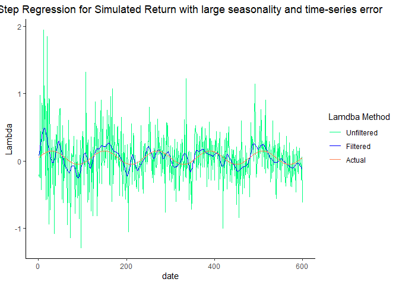<!-- -->

#### S4-5-2-2 Simulation with Random Parameter and Random Smooth Lambda

Now, we are going to replace the sin function with a random smooth
function. The truly expected factor premium should not behave too
crazily so it should be roughly a smooth curve, and for any smooth curve
on earth, we can apply a Fourier Transformation to convert it to a
linear combination of sin and cos equations. If you do not believe that
the truly expected factor premium is smooth, at least it is an impulse
response process (it shifts when information hits it) and therefore can
be Fourier Transformed. So, we can apply a Fourier transformation
equation to simulate a random curve as the true factor premium.

The ramdom Fourier Lambdas are generated by the following Fourier
Equations:

 = a_0+\sum_{i=1}^n(a_i cos(it)+b_isin(it))")

The

is from a normal distribution N(0.01,0.002^2), both

and

are following a normal distribution N(0,0.025^2), and the n is a random
integer between 20 and 100. This is a random smooth function and
")
is the random Fourier Lambda.

<table class="table table-striped" style="font-size: 10px; width: auto !important; margin-left: auto; margin-right: auto;">
<caption style="font-size: initial !important;">
STL Decomposition Component Strength for Simulated Portfolio Risk
Premium: Random Beta and Noise + Random Fourier Lambda
</caption>
<thead>
<tr>
<th style="text-align:center;">
Strength
</th>
<th style="text-align:center;">
V1
</th>
<th style="text-align:center;">
V10
</th>
<th style="text-align:center;">
V11
</th>
<th style="text-align:center;">
V12
</th>
<th style="text-align:center;">
V13
</th>
<th style="text-align:center;">
V14
</th>
<th style="text-align:center;">
V15
</th>
<th style="text-align:center;">
V16
</th>
<th style="text-align:center;">
V17
</th>
<th style="text-align:center;">
V18
</th>
<th style="text-align:center;">
V19
</th>
<th style="text-align:center;">
V2
</th>
<th style="text-align:center;">
V20
</th>
<th style="text-align:center;">
V21
</th>
<th style="text-align:center;">
V22
</th>
<th style="text-align:center;">
V23
</th>
<th style="text-align:center;">
V24
</th>
<th style="text-align:center;">
V25
</th>
<th style="text-align:center;">
V26
</th>
<th style="text-align:center;">
V27
</th>
<th style="text-align:center;">
V28
</th>
<th style="text-align:center;">
V29
</th>
<th style="text-align:center;">
V3
</th>
<th style="text-align:center;">
V30
</th>
<th style="text-align:center;">
V31
</th>
<th style="text-align:center;">
V32
</th>
<th style="text-align:center;">
V33
</th>
<th style="text-align:center;">
V34
</th>
<th style="text-align:center;">
V35
</th>
<th style="text-align:center;">
V36
</th>
<th style="text-align:center;">
V37
</th>
<th style="text-align:center;">
V38
</th>
<th style="text-align:center;">
V39
</th>
<th style="text-align:center;">
V4
</th>
<th style="text-align:center;">
V40
</th>
<th style="text-align:center;">
V41
</th>
<th style="text-align:center;">
V42
</th>
<th style="text-align:center;">
V43
</th>
<th style="text-align:center;">
V44
</th>
<th style="text-align:center;">
V45
</th>
<th style="text-align:center;">
V46
</th>
<th style="text-align:center;">
V47
</th>
<th style="text-align:center;">
V48
</th>
<th style="text-align:center;">
V49
</th>
<th style="text-align:center;">
V5
</th>
<th style="text-align:center;">
V6
</th>
<th style="text-align:center;">
V7
</th>
<th style="text-align:center;">
V8
</th>
<th style="text-align:center;">
V9
</th>
</tr>
</thead>
<tbody>
<tr>
<td style="text-align:center;font-weight: bold;">
FS
</td>
<td style="text-align:center;">
0.2633867
</td>
<td style="text-align:center;">
0.3000740
</td>
<td style="text-align:center;">
0.2797678
</td>
<td style="text-align:center;">
0.2708732
</td>
<td style="text-align:center;">
0.2741302
</td>
<td style="text-align:center;">
0.2603395
</td>
<td style="text-align:center;">
0.2791576
</td>
<td style="text-align:center;">
0.2860439
</td>
<td style="text-align:center;">
0.2654983
</td>
<td style="text-align:center;">
0.2885143
</td>
<td style="text-align:center;">
0.2559847
</td>
<td style="text-align:center;">
0.2771378
</td>
<td style="text-align:center;">
0.2848144
</td>
<td style="text-align:center;">
0.2772531
</td>
<td style="text-align:center;">
0.3141172
</td>
<td style="text-align:center;">
0.3011748
</td>
<td style="text-align:center;">
0.2932418
</td>
<td style="text-align:center;">
0.2989611
</td>
<td style="text-align:center;">
0.2758803
</td>
<td style="text-align:center;">
0.2925153
</td>
<td style="text-align:center;">
0.2980870
</td>
<td style="text-align:center;">
0.2636707
</td>
<td style="text-align:center;">
0.2886450
</td>
<td style="text-align:center;">
0.2732799
</td>
<td style="text-align:center;">
0.2814798
</td>
<td style="text-align:center;">
0.2815420
</td>
<td style="text-align:center;">
0.2665829
</td>
<td style="text-align:center;">
0.2921599
</td>
<td style="text-align:center;">
0.2997897
</td>
<td style="text-align:center;">
0.2980505
</td>
<td style="text-align:center;">
0.2728517
</td>
<td style="text-align:center;">
0.3042208
</td>
<td style="text-align:center;">
0.2533593
</td>
<td style="text-align:center;">
0.3013007
</td>
<td style="text-align:center;">
0.3049950
</td>
<td style="text-align:center;">
0.2861031
</td>
<td style="text-align:center;">
0.3037808
</td>
<td style="text-align:center;">
0.2899034
</td>
<td style="text-align:center;">
0.2851871
</td>
<td style="text-align:center;">
0.3160852
</td>
<td style="text-align:center;">
0.2868628
</td>
<td style="text-align:center;">
0.2880006
</td>
<td style="text-align:center;">
0.275036
</td>
<td style="text-align:center;">
0.2870597
</td>
<td style="text-align:center;">
0.3020272
</td>
<td style="text-align:center;">
0.3073083
</td>
<td style="text-align:center;">
0.3134854
</td>
<td style="text-align:center;">
0.2990815
</td>
<td style="text-align:center;">
0.3076485
</td>
</tr>
<tr>
<td style="text-align:center;font-weight: bold;">
FT
</td>
<td style="text-align:center;">
0.1871198
</td>
<td style="text-align:center;">
0.1844919
</td>
<td style="text-align:center;">
0.1608612
</td>
<td style="text-align:center;">
0.1587881
</td>
<td style="text-align:center;">
0.2521438
</td>
<td style="text-align:center;">
0.1632153
</td>
<td style="text-align:center;">
0.2012987
</td>
<td style="text-align:center;">
0.1998170
</td>
<td style="text-align:center;">
0.1969347
</td>
<td style="text-align:center;">
0.1852086
</td>
<td style="text-align:center;">
0.2533450
</td>
<td style="text-align:center;">
0.2450107
</td>
<td style="text-align:center;">
0.1715273
</td>
<td style="text-align:center;">
0.1998130
</td>
<td style="text-align:center;">
0.1788008
</td>
<td style="text-align:center;">
0.2105572
</td>
<td style="text-align:center;">
0.1622776
</td>
<td style="text-align:center;">
0.1948091
</td>
<td style="text-align:center;">
0.1699433
</td>
<td style="text-align:center;">
0.2322946
</td>
<td style="text-align:center;">
0.2303708
</td>
<td style="text-align:center;">
0.1981500
</td>
<td style="text-align:center;">
0.1676955
</td>
<td style="text-align:center;">
0.2119506
</td>
<td style="text-align:center;">
0.1733729
</td>
<td style="text-align:center;">
0.2355132
</td>
<td style="text-align:center;">
0.1630510
</td>
<td style="text-align:center;">
0.2054606
</td>
<td style="text-align:center;">
0.2040506
</td>
<td style="text-align:center;">
0.1943324
</td>
<td style="text-align:center;">
0.1633744
</td>
<td style="text-align:center;">
0.1967478
</td>
<td style="text-align:center;">
0.1658325
</td>
<td style="text-align:center;">
0.1863226
</td>
<td style="text-align:center;">
0.1881801
</td>
<td style="text-align:center;">
0.1463421
</td>
<td style="text-align:center;">
0.1664503
</td>
<td style="text-align:center;">
0.1582727
</td>
<td style="text-align:center;">
0.1754214
</td>
<td style="text-align:center;">
0.1720033
</td>
<td style="text-align:center;">
0.1746599
</td>
<td style="text-align:center;">
0.2008263
</td>
<td style="text-align:center;">
0.171372
</td>
<td style="text-align:center;">
0.1893007
</td>
<td style="text-align:center;">
0.1569539
</td>
<td style="text-align:center;">
0.2004413
</td>
<td style="text-align:center;">
0.1772307
</td>
<td style="text-align:center;">
0.1548268
</td>
<td style="text-align:center;">
0.1558446
</td>
</tr>
</tbody>
</table>

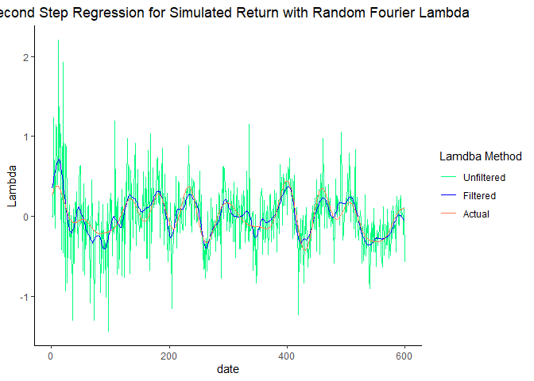<!-- -->

    ## [1] 0.5910278

#### S4-5-2-3 Simulation with Actual Parameters and Smooth Lambdas

Finally, we would like to apply the actual Betas, Seasonality,
Time-series Error, and Idiosyncratic Error with a Fourier Smoothed
Lambda assumed to be the true lambda. This will illustrate how the
lambda estimation in the real data can be possibly improved.

We will extract the Seasonality and Noise from STL method, and then the
idiosyncratic noise from cross-sectional regression. The betas we use
are the 5-year rolling window beta.

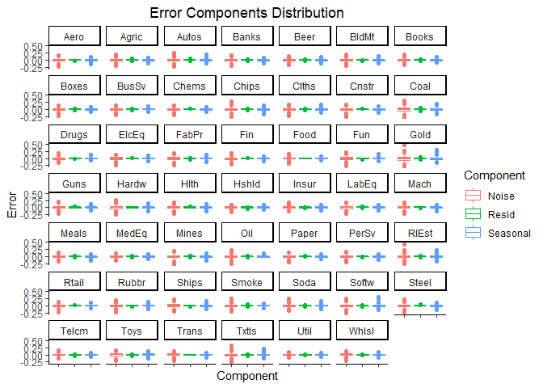<!-- --><!-- -->
<table class="table table-striped" style="font-size: 10px; width: auto !important; margin-left: auto; margin-right: auto;">
<caption style="font-size: initial !important;">
49 Industry Portfolio Error Component Summary Statistics
</caption>
<thead>
<tr>
<th style="empty-cells: hide;border-bottom:hidden;" colspan="2">
</th>
<th style="border-bottom:hidden;padding-bottom:0; padding-left:3px;padding-right:3px;text-align: center; " colspan="3">

Error Component

</th>
</tr>
<tr>
<th style="text-align:center;">
Industry
</th>
<th style="text-align:center;">
stats
</th>
<th style="text-align:center;">
Noise
</th>
<th style="text-align:center;">
Resid
</th>
<th style="text-align:center;">
Seasonal
</th>
</tr>
</thead>
<tbody>
<tr>
<td style="text-align:center;font-weight: bold;vertical-align: middle !important;" rowspan="4">
Aero
</td>
<td style="text-align:center;">
mean
</td>
<td style="text-align:center;">
0.0000509
</td>
<td style="text-align:center;">
0.0020675
</td>
<td style="text-align:center;">
-0.0001170
</td>
</tr>
<tr>
<td style="text-align:center;">
variance
</td>
<td style="text-align:center;">
0.0023188
</td>
<td style="text-align:center;">
0.0000738
</td>
<td style="text-align:center;">
0.0010712
</td>
</tr>
<tr>
<td style="text-align:center;">
skewness
</td>
<td style="text-align:center;">
-0.2969914
</td>
<td style="text-align:center;">
-0.5764202
</td>
<td style="text-align:center;">
-0.5072681
</td>
</tr>
<tr>
<td style="text-align:center;">
kurtosis
</td>
<td style="text-align:center;">
4.4499248
</td>
<td style="text-align:center;">
3.7064000
</td>
<td style="text-align:center;">
4.3562388
</td>
</tr>
<tr>
<td style="text-align:center;font-weight: bold;vertical-align: middle !important;" rowspan="4">
Agric
</td>
<td style="text-align:center;">
mean
</td>
<td style="text-align:center;">
-0.0000531
</td>
<td style="text-align:center;">
-0.0004052
</td>
<td style="text-align:center;">
0.0001342
</td>
</tr>
<tr>
<td style="text-align:center;">
variance
</td>
<td style="text-align:center;">
0.0022339
</td>
<td style="text-align:center;">
0.0001175
</td>
<td style="text-align:center;">
0.0009227
</td>
</tr>
<tr>
<td style="text-align:center;">
skewness
</td>
<td style="text-align:center;">
0.0493232
</td>
<td style="text-align:center;">
1.0604306
</td>
<td style="text-align:center;">
-0.0490256
</td>
</tr>
<tr>
<td style="text-align:center;">
kurtosis
</td>
<td style="text-align:center;">
4.5829899
</td>
<td style="text-align:center;">
7.6558599
</td>
<td style="text-align:center;">
3.7269152
</td>
</tr>
<tr>
<td style="text-align:center;font-weight: bold;vertical-align: middle !important;" rowspan="4">
Autos
</td>
<td style="text-align:center;">
mean
</td>
<td style="text-align:center;">
-0.0002450
</td>
<td style="text-align:center;">
-0.0017548
</td>
<td style="text-align:center;">
-0.0000215
</td>
</tr>
<tr>
<td style="text-align:center;">
variance
</td>
<td style="text-align:center;">
0.0027580
</td>
<td style="text-align:center;">
0.0001352
</td>
<td style="text-align:center;">
0.0011692
</td>
</tr>
<tr>
<td style="text-align:center;">
skewness
</td>
<td style="text-align:center;">
-0.0612042
</td>
<td style="text-align:center;">
2.2025288
</td>
<td style="text-align:center;">
0.7016818
</td>
</tr>
<tr>
<td style="text-align:center;">
kurtosis
</td>
<td style="text-align:center;">
5.3855323
</td>
<td style="text-align:center;">
15.3969204
</td>
<td style="text-align:center;">
7.2443446
</td>
</tr>
<tr>
<td style="text-align:center;font-weight: bold;vertical-align: middle !important;" rowspan="4">
Banks
</td>
<td style="text-align:center;">
mean
</td>
<td style="text-align:center;">
0.0000370
</td>
<td style="text-align:center;">
-0.0010044
</td>
<td style="text-align:center;">
-0.0000132
</td>
</tr>
<tr>
<td style="text-align:center;">
variance
</td>
<td style="text-align:center;">
0.0020135
</td>
<td style="text-align:center;">
0.0000551
</td>
<td style="text-align:center;">
0.0008918
</td>
</tr>
<tr>
<td style="text-align:center;">
skewness
</td>
<td style="text-align:center;">
-0.1460466
</td>
<td style="text-align:center;">
0.1634824
</td>
<td style="text-align:center;">
-0.1401175
</td>
</tr>
<tr>
<td style="text-align:center;">
kurtosis
</td>
<td style="text-align:center;">
4.1473485
</td>
<td style="text-align:center;">
3.1490351
</td>
<td style="text-align:center;">
3.5677840
</td>
</tr>
<tr>
<td style="text-align:center;font-weight: bold;vertical-align: middle !important;" rowspan="4">
Beer
</td>
<td style="text-align:center;">
mean
</td>
<td style="text-align:center;">
-0.0000378
</td>
<td style="text-align:center;">
0.0002925
</td>
<td style="text-align:center;">
-0.0000568
</td>
</tr>
<tr>
<td style="text-align:center;">
variance
</td>
<td style="text-align:center;">
0.0014941
</td>
<td style="text-align:center;">
0.0000624
</td>
<td style="text-align:center;">
0.0006644
</td>
</tr>
<tr>
<td style="text-align:center;">
skewness
</td>
<td style="text-align:center;">
-0.0669276
</td>
<td style="text-align:center;">
0.2343103
</td>
<td style="text-align:center;">
-0.2354574
</td>
</tr>
<tr>
<td style="text-align:center;">
kurtosis
</td>
<td style="text-align:center;">
4.5023577
</td>
<td style="text-align:center;">
3.2703869
</td>
<td style="text-align:center;">
5.3104241
</td>
</tr>
<tr>
<td style="text-align:center;font-weight: bold;vertical-align: middle !important;" rowspan="4">
BldMt
</td>
<td style="text-align:center;">
mean
</td>
<td style="text-align:center;">
-0.0000117
</td>
<td style="text-align:center;">
-0.0006392
</td>
<td style="text-align:center;">
-0.0000278
</td>
</tr>
<tr>
<td style="text-align:center;">
variance
</td>
<td style="text-align:center;">
0.0021939
</td>
<td style="text-align:center;">
0.0000405
</td>
<td style="text-align:center;">
0.0010086
</td>
</tr>
<tr>
<td style="text-align:center;">
skewness
</td>
<td style="text-align:center;">
-0.1908276
</td>
<td style="text-align:center;">
-0.6205342
</td>
<td style="text-align:center;">
0.2074275
</td>
</tr>
<tr>
<td style="text-align:center;">
kurtosis
</td>
<td style="text-align:center;">
5.1165517
</td>
<td style="text-align:center;">
4.7825617
</td>
<td style="text-align:center;">
4.7278995
</td>
</tr>
<tr>
<td style="text-align:center;font-weight: bold;vertical-align: middle !important;" rowspan="4">
Books
</td>
<td style="text-align:center;">
mean
</td>
<td style="text-align:center;">
0.0000251
</td>
<td style="text-align:center;">
-0.0012475
</td>
<td style="text-align:center;">
-0.0000183
</td>
</tr>
<tr>
<td style="text-align:center;">
variance
</td>
<td style="text-align:center;">
0.0017959
</td>
<td style="text-align:center;">
0.0000744
</td>
<td style="text-align:center;">
0.0007603
</td>
</tr>
<tr>
<td style="text-align:center;">
skewness
</td>
<td style="text-align:center;">
0.0023874
</td>
<td style="text-align:center;">
-0.0755728
</td>
<td style="text-align:center;">
0.1670989
</td>
</tr>
<tr>
<td style="text-align:center;">
kurtosis
</td>
<td style="text-align:center;">
4.4111684
</td>
<td style="text-align:center;">
3.3509015
</td>
<td style="text-align:center;">
3.7284200
</td>
</tr>
<tr>
<td style="text-align:center;font-weight: bold;vertical-align: middle !important;" rowspan="4">
Boxes
</td>
<td style="text-align:center;">
mean
</td>
<td style="text-align:center;">
0.0000374
</td>
<td style="text-align:center;">
0.0006542
</td>
<td style="text-align:center;">
-0.0000503
</td>
</tr>
<tr>
<td style="text-align:center;">
variance
</td>
<td style="text-align:center;">
0.0019637
</td>
<td style="text-align:center;">
0.0000756
</td>
<td style="text-align:center;">
0.0007687
</td>
</tr>
<tr>
<td style="text-align:center;">
skewness
</td>
<td style="text-align:center;">
-0.1912494
</td>
<td style="text-align:center;">
-0.1263621
</td>
<td style="text-align:center;">
-0.1700891
</td>
</tr>
<tr>
<td style="text-align:center;">
kurtosis
</td>
<td style="text-align:center;">
4.2168868
</td>
<td style="text-align:center;">
3.9365138
</td>
<td style="text-align:center;">
3.5053433
</td>
</tr>
<tr>
<td style="text-align:center;font-weight: bold;vertical-align: middle !important;" rowspan="4">
BusSv
</td>
<td style="text-align:center;">
mean
</td>
<td style="text-align:center;">
0.0000387
</td>
<td style="text-align:center;">
0.0003407
</td>
<td style="text-align:center;">
0.0000439
</td>
</tr>
<tr>
<td style="text-align:center;">
variance
</td>
<td style="text-align:center;">
0.0017141
</td>
<td style="text-align:center;">
0.0000258
</td>
<td style="text-align:center;">
0.0007256
</td>
</tr>
<tr>
<td style="text-align:center;">
skewness
</td>
<td style="text-align:center;">
-0.3637742
</td>
<td style="text-align:center;">
-0.5382680
</td>
<td style="text-align:center;">
-0.0578777
</td>
</tr>
<tr>
<td style="text-align:center;">
kurtosis
</td>
<td style="text-align:center;">
4.9642851
</td>
<td style="text-align:center;">
4.5428054
</td>
<td style="text-align:center;">
3.8274163
</td>
</tr>
<tr>
<td style="text-align:center;font-weight: bold;vertical-align: middle !important;" rowspan="4">
Chems
</td>
<td style="text-align:center;">
mean
</td>
<td style="text-align:center;">
-0.0000742
</td>
<td style="text-align:center;">
0.0003124
</td>
<td style="text-align:center;">
-0.0000688
</td>
</tr>
<tr>
<td style="text-align:center;">
variance
</td>
<td style="text-align:center;">
0.0019577
</td>
<td style="text-align:center;">
0.0000456
</td>
<td style="text-align:center;">
0.0007803
</td>
</tr>
<tr>
<td style="text-align:center;">
skewness
</td>
<td style="text-align:center;">
-0.1609509
</td>
<td style="text-align:center;">
0.0688291
</td>
<td style="text-align:center;">
0.0341466
</td>
</tr>
<tr>
<td style="text-align:center;">
kurtosis
</td>
<td style="text-align:center;">
4.3013758
</td>
<td style="text-align:center;">
2.8192398
</td>
<td style="text-align:center;">
3.2591208
</td>
</tr>
<tr>
<td style="text-align:center;font-weight: bold;vertical-align: middle !important;" rowspan="4">
Chips
</td>
<td style="text-align:center;">
mean
</td>
<td style="text-align:center;">
-0.0000839
</td>
<td style="text-align:center;">
0.0023300
</td>
<td style="text-align:center;">
-0.0000833
</td>
</tr>
<tr>
<td style="text-align:center;">
variance
</td>
<td style="text-align:center;">
0.0031496
</td>
<td style="text-align:center;">
0.0000819
</td>
<td style="text-align:center;">
0.0012757
</td>
</tr>
<tr>
<td style="text-align:center;">
skewness
</td>
<td style="text-align:center;">
-0.2092896
</td>
<td style="text-align:center;">
0.7349544
</td>
<td style="text-align:center;">
-0.1999405
</td>
</tr>
<tr>
<td style="text-align:center;">
kurtosis
</td>
<td style="text-align:center;">
5.2964874
</td>
<td style="text-align:center;">
3.4335541
</td>
<td style="text-align:center;">
5.1716138
</td>
</tr>
<tr>
<td style="text-align:center;font-weight: bold;vertical-align: middle !important;" rowspan="4">
Clths
</td>
<td style="text-align:center;">
mean
</td>
<td style="text-align:center;">
0.0000441
</td>
<td style="text-align:center;">
0.0015328
</td>
<td style="text-align:center;">
0.0000168
</td>
</tr>
<tr>
<td style="text-align:center;">
variance
</td>
<td style="text-align:center;">
0.0021819
</td>
<td style="text-align:center;">
0.0000685
</td>
<td style="text-align:center;">
0.0010723
</td>
</tr>
<tr>
<td style="text-align:center;">
skewness
</td>
<td style="text-align:center;">
-0.1497544
</td>
<td style="text-align:center;">
-0.3632635
</td>
<td style="text-align:center;">
0.1227580
</td>
</tr>
<tr>
<td style="text-align:center;">
kurtosis
</td>
<td style="text-align:center;">
4.3011460
</td>
<td style="text-align:center;">
3.4463314
</td>
<td style="text-align:center;">
4.3749283
</td>
</tr>
<tr>
<td style="text-align:center;font-weight: bold;vertical-align: middle !important;" rowspan="4">
Cnstr
</td>
<td style="text-align:center;">
mean
</td>
<td style="text-align:center;">
0.0000039
</td>
<td style="text-align:center;">
-0.0014893
</td>
<td style="text-align:center;">
0.0000496
</td>
</tr>
<tr>
<td style="text-align:center;">
variance
</td>
<td style="text-align:center;">
0.0029290
</td>
<td style="text-align:center;">
0.0001036
</td>
<td style="text-align:center;">
0.0012349
</td>
</tr>
<tr>
<td style="text-align:center;">
skewness
</td>
<td style="text-align:center;">
-0.2163360
</td>
<td style="text-align:center;">
0.3731039
</td>
<td style="text-align:center;">
-0.0872456
</td>
</tr>
<tr>
<td style="text-align:center;">
kurtosis
</td>
<td style="text-align:center;">
4.4963979
</td>
<td style="text-align:center;">
2.6781217
</td>
<td style="text-align:center;">
3.2430720
</td>
</tr>
<tr>
<td style="text-align:center;font-weight: bold;vertical-align: middle !important;" rowspan="4">
Coal
</td>
<td style="text-align:center;">
mean
</td>
<td style="text-align:center;">
0.0002183
</td>
<td style="text-align:center;">
-0.0006530
</td>
<td style="text-align:center;">
-0.0001057
</td>
</tr>
<tr>
<td style="text-align:center;">
variance
</td>
<td style="text-align:center;">
0.0064209
</td>
<td style="text-align:center;">
0.0003493
</td>
<td style="text-align:center;">
0.0028125
</td>
</tr>
<tr>
<td style="text-align:center;">
skewness
</td>
<td style="text-align:center;">
-0.0270895
</td>
<td style="text-align:center;">
0.1969015
</td>
<td style="text-align:center;">
0.3194791
</td>
</tr>
<tr>
<td style="text-align:center;">
kurtosis
</td>
<td style="text-align:center;">
4.1617681
</td>
<td style="text-align:center;">
4.3961576
</td>
<td style="text-align:center;">
4.3935656
</td>
</tr>
<tr>
<td style="text-align:center;font-weight: bold;vertical-align: middle !important;" rowspan="4">
Drugs
</td>
<td style="text-align:center;">
mean
</td>
<td style="text-align:center;">
-0.0000338
</td>
<td style="text-align:center;">
0.0000253
</td>
<td style="text-align:center;">
-0.0000760
</td>
</tr>
<tr>
<td style="text-align:center;">
variance
</td>
<td style="text-align:center;">
0.0014868
</td>
<td style="text-align:center;">
0.0000331
</td>
<td style="text-align:center;">
0.0005663
</td>
</tr>
<tr>
<td style="text-align:center;">
skewness
</td>
<td style="text-align:center;">
0.1254102
</td>
<td style="text-align:center;">
-0.0278769
</td>
<td style="text-align:center;">
0.2480485
</td>
</tr>
<tr>
<td style="text-align:center;">
kurtosis
</td>
<td style="text-align:center;">
4.0264767
</td>
<td style="text-align:center;">
2.4855865
</td>
<td style="text-align:center;">
4.6515378
</td>
</tr>
<tr>
<td style="text-align:center;font-weight: bold;vertical-align: middle !important;" rowspan="4">
ElcEq
</td>
<td style="text-align:center;">
mean
</td>
<td style="text-align:center;">
0.0000278
</td>
<td style="text-align:center;">
0.0014520
</td>
<td style="text-align:center;">
-0.0000792
</td>
</tr>
<tr>
<td style="text-align:center;">
variance
</td>
<td style="text-align:center;">
0.0023444
</td>
<td style="text-align:center;">
0.0000329
</td>
<td style="text-align:center;">
0.0009608
</td>
</tr>
<tr>
<td style="text-align:center;">
skewness
</td>
<td style="text-align:center;">
-0.2035731
</td>
<td style="text-align:center;">
0.3281089
</td>
<td style="text-align:center;">
-0.0545667
</td>
</tr>
<tr>
<td style="text-align:center;">
kurtosis
</td>
<td style="text-align:center;">
3.7279423
</td>
<td style="text-align:center;">
3.6285666
</td>
<td style="text-align:center;">
3.3886519
</td>
</tr>
<tr>
<td style="text-align:center;font-weight: bold;vertical-align: middle !important;" rowspan="4">
FabPr
</td>
<td style="text-align:center;">
mean
</td>
<td style="text-align:center;">
0.0000267
</td>
<td style="text-align:center;">
-0.0015071
</td>
<td style="text-align:center;">
0.0000545
</td>
</tr>
<tr>
<td style="text-align:center;">
variance
</td>
<td style="text-align:center;">
0.0031162
</td>
<td style="text-align:center;">
0.0001095
</td>
<td style="text-align:center;">
0.0011838
</td>
</tr>
<tr>
<td style="text-align:center;">
skewness
</td>
<td style="text-align:center;">
-0.0153191
</td>
<td style="text-align:center;">
-0.4976986
</td>
<td style="text-align:center;">
0.2170739
</td>
</tr>
<tr>
<td style="text-align:center;">
kurtosis
</td>
<td style="text-align:center;">
3.8933118
</td>
<td style="text-align:center;">
3.5036933
</td>
<td style="text-align:center;">
4.1327760
</td>
</tr>
<tr>
<td style="text-align:center;font-weight: bold;vertical-align: middle !important;" rowspan="4">
Fin
</td>
<td style="text-align:center;">
mean
</td>
<td style="text-align:center;">
0.0000200
</td>
<td style="text-align:center;">
0.0026142
</td>
<td style="text-align:center;">
0.0000032
</td>
</tr>
<tr>
<td style="text-align:center;">
variance
</td>
<td style="text-align:center;">
0.0021970
</td>
<td style="text-align:center;">
0.0000568
</td>
<td style="text-align:center;">
0.0008348
</td>
</tr>
<tr>
<td style="text-align:center;">
skewness
</td>
<td style="text-align:center;">
-0.3539270
</td>
<td style="text-align:center;">
0.1101744
</td>
<td style="text-align:center;">
-0.1894040
</td>
</tr>
<tr>
<td style="text-align:center;">
kurtosis
</td>
<td style="text-align:center;">
4.7631864
</td>
<td style="text-align:center;">
3.1483761
</td>
<td style="text-align:center;">
3.6709092
</td>
</tr>
<tr>
<td style="text-align:center;font-weight: bold;vertical-align: middle !important;" rowspan="4">
Food
</td>
<td style="text-align:center;">
mean
</td>
<td style="text-align:center;">
-0.0000007
</td>
<td style="text-align:center;">
0.0001537
</td>
<td style="text-align:center;">
-0.0000014
</td>
</tr>
<tr>
<td style="text-align:center;">
variance
</td>
<td style="text-align:center;">
0.0011213
</td>
<td style="text-align:center;">
0.0000311
</td>
<td style="text-align:center;">
0.0004580
</td>
</tr>
<tr>
<td style="text-align:center;">
skewness
</td>
<td style="text-align:center;">
-0.0665311
</td>
<td style="text-align:center;">
0.1624123
</td>
<td style="text-align:center;">
0.0942918
</td>
</tr>
<tr>
<td style="text-align:center;">
kurtosis
</td>
<td style="text-align:center;">
5.9314600
</td>
<td style="text-align:center;">
2.4306959
</td>
<td style="text-align:center;">
3.6390364
</td>
</tr>
<tr>
<td style="text-align:center;font-weight: bold;vertical-align: middle !important;" rowspan="4">
Fun
</td>
<td style="text-align:center;">
mean
</td>
<td style="text-align:center;">
0.0000099
</td>
<td style="text-align:center;">
0.0029695
</td>
<td style="text-align:center;">
-0.0000588
</td>
</tr>
<tr>
<td style="text-align:center;">
variance
</td>
<td style="text-align:center;">
0.0029659
</td>
<td style="text-align:center;">
0.0001241
</td>
<td style="text-align:center;">
0.0014381
</td>
</tr>
<tr>
<td style="text-align:center;">
skewness
</td>
<td style="text-align:center;">
-0.3528272
</td>
<td style="text-align:center;">
-0.3388753
</td>
<td style="text-align:center;">
0.2147968
</td>
</tr>
<tr>
<td style="text-align:center;">
kurtosis
</td>
<td style="text-align:center;">
4.5632775
</td>
<td style="text-align:center;">
3.2237097
</td>
<td style="text-align:center;">
4.1082462
</td>
</tr>
<tr>
<td style="text-align:center;font-weight: bold;vertical-align: middle !important;" rowspan="4">
Gold
</td>
<td style="text-align:center;">
mean
</td>
<td style="text-align:center;">
0.0001407
</td>
<td style="text-align:center;">
0.0009936
</td>
<td style="text-align:center;">
0.0000422
</td>
</tr>
<tr>
<td style="text-align:center;">
variance
</td>
<td style="text-align:center;">
0.0073743
</td>
<td style="text-align:center;">
0.0001900
</td>
<td style="text-align:center;">
0.0027980
</td>
</tr>
<tr>
<td style="text-align:center;">
skewness
</td>
<td style="text-align:center;">
0.2656551
</td>
<td style="text-align:center;">
0.2156768
</td>
<td style="text-align:center;">
0.9138509
</td>
</tr>
<tr>
<td style="text-align:center;">
kurtosis
</td>
<td style="text-align:center;">
4.7344656
</td>
<td style="text-align:center;">
3.1488157
</td>
<td style="text-align:center;">
6.4728123
</td>
</tr>
<tr>
<td style="text-align:center;font-weight: bold;vertical-align: middle !important;" rowspan="4">
Guns
</td>
<td style="text-align:center;">
mean
</td>
<td style="text-align:center;">
0.0000038
</td>
<td style="text-align:center;">
0.0027273
</td>
<td style="text-align:center;">
-0.0000550
</td>
</tr>
<tr>
<td style="text-align:center;">
variance
</td>
<td style="text-align:center;">
0.0023550
</td>
<td style="text-align:center;">
0.0001008
</td>
<td style="text-align:center;">
0.0008961
</td>
</tr>
<tr>
<td style="text-align:center;">
skewness
</td>
<td style="text-align:center;">
-0.1970840
</td>
<td style="text-align:center;">
-0.0900947
</td>
<td style="text-align:center;">
0.0706345
</td>
</tr>
<tr>
<td style="text-align:center;">
kurtosis
</td>
<td style="text-align:center;">
4.8834997
</td>
<td style="text-align:center;">
2.6186833
</td>
<td style="text-align:center;">
4.0091202
</td>
</tr>
<tr>
<td style="text-align:center;font-weight: bold;vertical-align: middle !important;" rowspan="4">
Hardw
</td>
<td style="text-align:center;">
mean
</td>
<td style="text-align:center;">
0.0000209
</td>
<td style="text-align:center;">
-0.0003627
</td>
<td style="text-align:center;">
-0.0000647
</td>
</tr>
<tr>
<td style="text-align:center;">
variance
</td>
<td style="text-align:center;">
0.0031082
</td>
<td style="text-align:center;">
0.0000943
</td>
<td style="text-align:center;">
0.0011867
</td>
</tr>
<tr>
<td style="text-align:center;">
skewness
</td>
<td style="text-align:center;">
0.0016452
</td>
<td style="text-align:center;">
-0.3778307
</td>
<td style="text-align:center;">
0.0536588
</td>
</tr>
<tr>
<td style="text-align:center;">
kurtosis
</td>
<td style="text-align:center;">
4.5292911
</td>
<td style="text-align:center;">
2.3592076
</td>
<td style="text-align:center;">
4.3799688
</td>
</tr>
<tr>
<td style="text-align:center;font-weight: bold;vertical-align: middle !important;" rowspan="4">
Hlth
</td>
<td style="text-align:center;">
mean
</td>
<td style="text-align:center;">
0.0001546
</td>
<td style="text-align:center;">
0.0005925
</td>
<td style="text-align:center;">
0.0000052
</td>
</tr>
<tr>
<td style="text-align:center;">
variance
</td>
<td style="text-align:center;">
0.0027862
</td>
<td style="text-align:center;">
0.0001232
</td>
<td style="text-align:center;">
0.0011752
</td>
</tr>
<tr>
<td style="text-align:center;">
skewness
</td>
<td style="text-align:center;">
-0.1300384
</td>
<td style="text-align:center;">
-0.0261686
</td>
<td style="text-align:center;">
-0.1366119
</td>
</tr>
<tr>
<td style="text-align:center;">
kurtosis
</td>
<td style="text-align:center;">
3.8259132
</td>
<td style="text-align:center;">
2.7739049
</td>
<td style="text-align:center;">
4.0781697
</td>
</tr>
<tr>
<td style="text-align:center;font-weight: bold;vertical-align: middle !important;" rowspan="4">
Hshld
</td>
<td style="text-align:center;">
mean
</td>
<td style="text-align:center;">
-0.0000138
</td>
<td style="text-align:center;">
-0.0014114
</td>
<td style="text-align:center;">
-0.0000795
</td>
</tr>
<tr>
<td style="text-align:center;">
variance
</td>
<td style="text-align:center;">
0.0012039
</td>
<td style="text-align:center;">
0.0000348
</td>
<td style="text-align:center;">
0.0005051
</td>
</tr>
<tr>
<td style="text-align:center;">
skewness
</td>
<td style="text-align:center;">
-0.1787213
</td>
<td style="text-align:center;">
-1.1728778
</td>
<td style="text-align:center;">
0.1067881
</td>
</tr>
<tr>
<td style="text-align:center;">
kurtosis
</td>
<td style="text-align:center;">
3.9298907
</td>
<td style="text-align:center;">
8.1857208
</td>
<td style="text-align:center;">
4.1481763
</td>
</tr>
<tr>
<td style="text-align:center;font-weight: bold;vertical-align: middle !important;" rowspan="4">
Insur
</td>
<td style="text-align:center;">
mean
</td>
<td style="text-align:center;">
0.0000685
</td>
<td style="text-align:center;">
0.0003823
</td>
<td style="text-align:center;">
0.0000243
</td>
</tr>
<tr>
<td style="text-align:center;">
variance
</td>
<td style="text-align:center;">
0.0015070
</td>
<td style="text-align:center;">
0.0000424
</td>
<td style="text-align:center;">
0.0006940
</td>
</tr>
<tr>
<td style="text-align:center;">
skewness
</td>
<td style="text-align:center;">
-0.0145023
</td>
<td style="text-align:center;">
0.0644756
</td>
<td style="text-align:center;">
-0.2234665
</td>
</tr>
<tr>
<td style="text-align:center;">
kurtosis
</td>
<td style="text-align:center;">
4.2261243
</td>
<td style="text-align:center;">
3.3304271
</td>
<td style="text-align:center;">
3.5291096
</td>
</tr>
<tr>
<td style="text-align:center;font-weight: bold;vertical-align: middle !important;" rowspan="4">
LabEq
</td>
<td style="text-align:center;">
mean
</td>
<td style="text-align:center;">
-0.0000549
</td>
<td style="text-align:center;">
0.0011653
</td>
<td style="text-align:center;">
-0.0000852
</td>
</tr>
<tr>
<td style="text-align:center;">
variance
</td>
<td style="text-align:center;">
0.0029874
</td>
<td style="text-align:center;">
0.0000571
</td>
<td style="text-align:center;">
0.0010425
</td>
</tr>
<tr>
<td style="text-align:center;">
skewness
</td>
<td style="text-align:center;">
-0.0369663
</td>
<td style="text-align:center;">
0.9497919
</td>
<td style="text-align:center;">
-0.1640833
</td>
</tr>
<tr>
<td style="text-align:center;">
kurtosis
</td>
<td style="text-align:center;">
3.7963501
</td>
<td style="text-align:center;">
7.7200155
</td>
<td style="text-align:center;">
3.7443458
</td>
</tr>
<tr>
<td style="text-align:center;font-weight: bold;vertical-align: middle !important;" rowspan="4">
Mach
</td>
<td style="text-align:center;">
mean
</td>
<td style="text-align:center;">
0.0000226
</td>
<td style="text-align:center;">
0.0004977
</td>
<td style="text-align:center;">
-0.0000116
</td>
</tr>
<tr>
<td style="text-align:center;">
variance
</td>
<td style="text-align:center;">
0.0024020
</td>
<td style="text-align:center;">
0.0000453
</td>
<td style="text-align:center;">
0.0009513
</td>
</tr>
<tr>
<td style="text-align:center;">
skewness
</td>
<td style="text-align:center;">
-0.2205315
</td>
<td style="text-align:center;">
-0.4003493
</td>
<td style="text-align:center;">
-0.3288396
</td>
</tr>
<tr>
<td style="text-align:center;">
kurtosis
</td>
<td style="text-align:center;">
4.2940837
</td>
<td style="text-align:center;">
3.5020504
</td>
<td style="text-align:center;">
4.5528673
</td>
</tr>
<tr>
<td style="text-align:center;font-weight: bold;vertical-align: middle !important;" rowspan="4">
Meals
</td>
<td style="text-align:center;">
mean
</td>
<td style="text-align:center;">
-0.0000235
</td>
<td style="text-align:center;">
-0.0007214
</td>
<td style="text-align:center;">
-0.0000784
</td>
</tr>
<tr>
<td style="text-align:center;">
variance
</td>
<td style="text-align:center;">
0.0017919
</td>
<td style="text-align:center;">
0.0000472
</td>
<td style="text-align:center;">
0.0007285
</td>
</tr>
<tr>
<td style="text-align:center;">
skewness
</td>
<td style="text-align:center;">
-0.2842865
</td>
<td style="text-align:center;">
-0.6270394
</td>
<td style="text-align:center;">
-0.3432362
</td>
</tr>
<tr>
<td style="text-align:center;">
kurtosis
</td>
<td style="text-align:center;">
4.4797076
</td>
<td style="text-align:center;">
3.4287565
</td>
<td style="text-align:center;">
4.6594096
</td>
</tr>
<tr>
<td style="text-align:center;font-weight: bold;vertical-align: middle !important;" rowspan="4">
MedEq
</td>
<td style="text-align:center;">
mean
</td>
<td style="text-align:center;">
-0.0000708
</td>
<td style="text-align:center;">
-0.0006677
</td>
<td style="text-align:center;">
-0.0000258
</td>
</tr>
<tr>
<td style="text-align:center;">
variance
</td>
<td style="text-align:center;">
0.0016007
</td>
<td style="text-align:center;">
0.0000542
</td>
<td style="text-align:center;">
0.0006379
</td>
</tr>
<tr>
<td style="text-align:center;">
skewness
</td>
<td style="text-align:center;">
-0.1789201
</td>
<td style="text-align:center;">
-0.5510654
</td>
<td style="text-align:center;">
-0.1061039
</td>
</tr>
<tr>
<td style="text-align:center;">
kurtosis
</td>
<td style="text-align:center;">
3.5525295
</td>
<td style="text-align:center;">
4.3175880
</td>
<td style="text-align:center;">
3.2731740
</td>
</tr>
<tr>
<td style="text-align:center;font-weight: bold;vertical-align: middle !important;" rowspan="4">
Mines
</td>
<td style="text-align:center;">
mean
</td>
<td style="text-align:center;">
0.0001195
</td>
<td style="text-align:center;">
0.0021127
</td>
<td style="text-align:center;">
0.0000704
</td>
</tr>
<tr>
<td style="text-align:center;">
variance
</td>
<td style="text-align:center;">
0.0036296
</td>
<td style="text-align:center;">
0.0001071
</td>
<td style="text-align:center;">
0.0011863
</td>
</tr>
<tr>
<td style="text-align:center;">
skewness
</td>
<td style="text-align:center;">
-0.2408983
</td>
<td style="text-align:center;">
-0.1411613
</td>
<td style="text-align:center;">
-0.1343639
</td>
</tr>
<tr>
<td style="text-align:center;">
kurtosis
</td>
<td style="text-align:center;">
4.5478862
</td>
<td style="text-align:center;">
3.4984646
</td>
<td style="text-align:center;">
3.7039445
</td>
</tr>
<tr>
<td style="text-align:center;font-weight: bold;vertical-align: middle !important;" rowspan="4">
Oil
</td>
<td style="text-align:center;">
mean
</td>
<td style="text-align:center;">
0.0001127
</td>
<td style="text-align:center;">
0.0005642
</td>
<td style="text-align:center;">
0.0000597
</td>
</tr>
<tr>
<td style="text-align:center;">
variance
</td>
<td style="text-align:center;">
0.0021707
</td>
<td style="text-align:center;">
0.0000807
</td>
<td style="text-align:center;">
0.0007774
</td>
</tr>
<tr>
<td style="text-align:center;">
skewness
</td>
<td style="text-align:center;">
-0.0853560
</td>
<td style="text-align:center;">
0.3169656
</td>
<td style="text-align:center;">
0.5660070
</td>
</tr>
<tr>
<td style="text-align:center;">
kurtosis
</td>
<td style="text-align:center;">
5.8979075
</td>
<td style="text-align:center;">
3.7381736
</td>
<td style="text-align:center;">
4.0835170
</td>
</tr>
<tr>
<td style="text-align:center;font-weight: bold;vertical-align: middle !important;" rowspan="4">
Paper
</td>
<td style="text-align:center;">
mean
</td>
<td style="text-align:center;">
0.0000109
</td>
<td style="text-align:center;">
-0.0007564
</td>
<td style="text-align:center;">
-0.0000070
</td>
</tr>
<tr>
<td style="text-align:center;">
variance
</td>
<td style="text-align:center;">
0.0017939
</td>
<td style="text-align:center;">
0.0000397
</td>
<td style="text-align:center;">
0.0006619
</td>
</tr>
<tr>
<td style="text-align:center;">
skewness
</td>
<td style="text-align:center;">
-0.1241207
</td>
<td style="text-align:center;">
0.2584164
</td>
<td style="text-align:center;">
0.0460775
</td>
</tr>
<tr>
<td style="text-align:center;">
kurtosis
</td>
<td style="text-align:center;">
4.0556531
</td>
<td style="text-align:center;">
3.8036047
</td>
<td style="text-align:center;">
3.7241459
</td>
</tr>
<tr>
<td style="text-align:center;font-weight: bold;vertical-align: middle !important;" rowspan="4">
PerSv
</td>
<td style="text-align:center;">
mean
</td>
<td style="text-align:center;">
0.0000197
</td>
<td style="text-align:center;">
-0.0030885
</td>
<td style="text-align:center;">
0.0000706
</td>
</tr>
<tr>
<td style="text-align:center;">
variance
</td>
<td style="text-align:center;">
0.0022614
</td>
<td style="text-align:center;">
0.0000611
</td>
<td style="text-align:center;">
0.0008197
</td>
</tr>
<tr>
<td style="text-align:center;">
skewness
</td>
<td style="text-align:center;">
-0.0550326
</td>
<td style="text-align:center;">
-0.3904692
</td>
<td style="text-align:center;">
-0.1294835
</td>
</tr>
<tr>
<td style="text-align:center;">
kurtosis
</td>
<td style="text-align:center;">
4.3823429
</td>
<td style="text-align:center;">
4.1182489
</td>
<td style="text-align:center;">
3.5645186
</td>
</tr>
<tr>
<td style="text-align:center;font-weight: bold;vertical-align: middle !important;" rowspan="4">
RlEst
</td>
<td style="text-align:center;">
mean
</td>
<td style="text-align:center;">
0.0000263
</td>
<td style="text-align:center;">
-0.0041927
</td>
<td style="text-align:center;">
-0.0000286
</td>
</tr>
<tr>
<td style="text-align:center;">
variance
</td>
<td style="text-align:center;">
0.0030640
</td>
<td style="text-align:center;">
0.0000955
</td>
<td style="text-align:center;">
0.0014537
</td>
</tr>
<tr>
<td style="text-align:center;">
skewness
</td>
<td style="text-align:center;">
0.4457618
</td>
<td style="text-align:center;">
-0.2095859
</td>
<td style="text-align:center;">
0.9107560
</td>
</tr>
<tr>
<td style="text-align:center;">
kurtosis
</td>
<td style="text-align:center;">
12.2099242
</td>
<td style="text-align:center;">
3.2073935
</td>
<td style="text-align:center;">
10.4326386
</td>
</tr>
<tr>
<td style="text-align:center;font-weight: bold;vertical-align: middle !important;" rowspan="4">
Rtail
</td>
<td style="text-align:center;">
mean
</td>
<td style="text-align:center;">
-0.0001676
</td>
<td style="text-align:center;">
0.0003091
</td>
<td style="text-align:center;">
-0.0000538
</td>
</tr>
<tr>
<td style="text-align:center;">
variance
</td>
<td style="text-align:center;">
0.0016388
</td>
<td style="text-align:center;">
0.0000536
</td>
<td style="text-align:center;">
0.0007233
</td>
</tr>
<tr>
<td style="text-align:center;">
skewness
</td>
<td style="text-align:center;">
-0.1453546
</td>
<td style="text-align:center;">
0.9577190
</td>
<td style="text-align:center;">
-0.1461251
</td>
</tr>
<tr>
<td style="text-align:center;">
kurtosis
</td>
<td style="text-align:center;">
4.6774274
</td>
<td style="text-align:center;">
4.3060368
</td>
<td style="text-align:center;">
3.3283238
</td>
</tr>
<tr>
<td style="text-align:center;font-weight: bold;vertical-align: middle !important;" rowspan="4">
Rubbr
</td>
<td style="text-align:center;">
mean
</td>
<td style="text-align:center;">
-0.0000359
</td>
<td style="text-align:center;">
-0.0003559
</td>
<td style="text-align:center;">
-0.0000427
</td>
</tr>
<tr>
<td style="text-align:center;">
variance
</td>
<td style="text-align:center;">
0.0019398
</td>
<td style="text-align:center;">
0.0000590
</td>
<td style="text-align:center;">
0.0009062
</td>
</tr>
<tr>
<td style="text-align:center;">
skewness
</td>
<td style="text-align:center;">
-0.1957441
</td>
<td style="text-align:center;">
-0.5902149
</td>
<td style="text-align:center;">
-0.0274027
</td>
</tr>
<tr>
<td style="text-align:center;">
kurtosis
</td>
<td style="text-align:center;">
5.0034896
</td>
<td style="text-align:center;">
3.0755882
</td>
<td style="text-align:center;">
4.7857813
</td>
</tr>
<tr>
<td style="text-align:center;font-weight: bold;vertical-align: middle !important;" rowspan="4">
Ships
</td>
<td style="text-align:center;">
mean
</td>
<td style="text-align:center;">
0.0001153
</td>
<td style="text-align:center;">
0.0000988
</td>
<td style="text-align:center;">
0.0000176
</td>
</tr>
<tr>
<td style="text-align:center;">
variance
</td>
<td style="text-align:center;">
0.0032555
</td>
<td style="text-align:center;">
0.0001015
</td>
<td style="text-align:center;">
0.0013427
</td>
</tr>
<tr>
<td style="text-align:center;">
skewness
</td>
<td style="text-align:center;">
-0.0528730
</td>
<td style="text-align:center;">
-0.4358708
</td>
<td style="text-align:center;">
0.1819941
</td>
</tr>
<tr>
<td style="text-align:center;">
kurtosis
</td>
<td style="text-align:center;">
3.7834371
</td>
<td style="text-align:center;">
3.0507018
</td>
<td style="text-align:center;">
4.3282648
</td>
</tr>
<tr>
<td style="text-align:center;font-weight: bold;vertical-align: middle !important;" rowspan="4">
Smoke
</td>
<td style="text-align:center;">
mean
</td>
<td style="text-align:center;">
0.0000073
</td>
<td style="text-align:center;">
0.0025043
</td>
<td style="text-align:center;">
-0.0000428
</td>
</tr>
<tr>
<td style="text-align:center;">
variance
</td>
<td style="text-align:center;">
0.0024284
</td>
<td style="text-align:center;">
0.0001171
</td>
<td style="text-align:center;">
0.0008113
</td>
</tr>
<tr>
<td style="text-align:center;">
skewness
</td>
<td style="text-align:center;">
-0.1024922
</td>
<td style="text-align:center;">
0.3515208
</td>
<td style="text-align:center;">
0.0545842
</td>
</tr>
<tr>
<td style="text-align:center;">
kurtosis
</td>
<td style="text-align:center;">
5.0838472
</td>
<td style="text-align:center;">
4.1582200
</td>
<td style="text-align:center;">
3.3913118
</td>
</tr>
<tr>
<td style="text-align:center;font-weight: bold;vertical-align: middle !important;" rowspan="4">
Soda
</td>
<td style="text-align:center;">
mean
</td>
<td style="text-align:center;">
0.0000417
</td>
<td style="text-align:center;">
-0.0009015
</td>
<td style="text-align:center;">
-0.0001151
</td>
</tr>
<tr>
<td style="text-align:center;">
variance
</td>
<td style="text-align:center;">
0.0025064
</td>
<td style="text-align:center;">
0.0000957
</td>
<td style="text-align:center;">
0.0010048
</td>
</tr>
<tr>
<td style="text-align:center;">
skewness
</td>
<td style="text-align:center;">
0.3384673
</td>
<td style="text-align:center;">
0.0604317
</td>
<td style="text-align:center;">
0.2385755
</td>
</tr>
<tr>
<td style="text-align:center;">
kurtosis
</td>
<td style="text-align:center;">
5.5470605
</td>
<td style="text-align:center;">
3.1295966
</td>
<td style="text-align:center;">
5.4499185
</td>
</tr>
<tr>
<td style="text-align:center;font-weight: bold;vertical-align: middle !important;" rowspan="4">
Softw
</td>
<td style="text-align:center;">
mean
</td>
<td style="text-align:center;">
-0.0001408
</td>
<td style="text-align:center;">
0.0028715
</td>
<td style="text-align:center;">
-0.0000703
</td>
</tr>
<tr>
<td style="text-align:center;">
variance
</td>
<td style="text-align:center;">
0.0043342
</td>
<td style="text-align:center;">
0.0000782
</td>
<td style="text-align:center;">
0.0019265
</td>
</tr>
<tr>
<td style="text-align:center;">
skewness
</td>
<td style="text-align:center;">
0.0120298
</td>
<td style="text-align:center;">
-0.9550906
</td>
<td style="text-align:center;">
0.8398891
</td>
</tr>
<tr>
<td style="text-align:center;">
kurtosis
</td>
<td style="text-align:center;">
4.4094943
</td>
<td style="text-align:center;">
5.7704356
</td>
<td style="text-align:center;">
9.6853614
</td>
</tr>
<tr>
<td style="text-align:center;font-weight: bold;vertical-align: middle !important;" rowspan="4">
Steel
</td>
<td style="text-align:center;">
mean
</td>
<td style="text-align:center;">
0.0000530
</td>
<td style="text-align:center;">
-0.0012693
</td>
<td style="text-align:center;">
0.0000132
</td>
</tr>
<tr>
<td style="text-align:center;">
variance
</td>
<td style="text-align:center;">
0.0036254
</td>
<td style="text-align:center;">
0.0000872
</td>
<td style="text-align:center;">
0.0012876
</td>
</tr>
<tr>
<td style="text-align:center;">
skewness
</td>
<td style="text-align:center;">
-0.0563650
</td>
<td style="text-align:center;">
0.5874974
</td>
<td style="text-align:center;">
0.0447428
</td>
</tr>
<tr>
<td style="text-align:center;">
kurtosis
</td>
<td style="text-align:center;">
4.1953108
</td>
<td style="text-align:center;">
4.0303039
</td>
<td style="text-align:center;">
4.0433686
</td>
</tr>
<tr>
<td style="text-align:center;font-weight: bold;vertical-align: middle !important;" rowspan="4">
Telcm
</td>
<td style="text-align:center;">
mean
</td>
<td style="text-align:center;">
0.0000567
</td>
<td style="text-align:center;">
-0.0000458
</td>
<td style="text-align:center;">
-0.0000059
</td>
</tr>
<tr>
<td style="text-align:center;">
variance
</td>
<td style="text-align:center;">
0.0012521
</td>
<td style="text-align:center;">
0.0000884
</td>
<td style="text-align:center;">
0.0004921
</td>
</tr>
<tr>
<td style="text-align:center;">
skewness
</td>
<td style="text-align:center;">
-0.1646993
</td>
<td style="text-align:center;">
-0.1365826
</td>
<td style="text-align:center;">
-0.1258483
</td>
</tr>
<tr>
<td style="text-align:center;">
kurtosis
</td>
<td style="text-align:center;">
4.4441432
</td>
<td style="text-align:center;">
4.2250883
</td>
<td style="text-align:center;">
3.3439989
</td>
</tr>
<tr>
<td style="text-align:center;font-weight: bold;vertical-align: middle !important;" rowspan="4">
Toys
</td>
<td style="text-align:center;">
mean
</td>
<td style="text-align:center;">
-0.0000289
</td>
<td style="text-align:center;">
-0.0022756
</td>
<td style="text-align:center;">
-0.0000270
</td>
</tr>
<tr>
<td style="text-align:center;">
variance
</td>
<td style="text-align:center;">
0.0028384
</td>
<td style="text-align:center;">
0.0001114
</td>
<td style="text-align:center;">
0.0011627
</td>
</tr>
<tr>
<td style="text-align:center;">
skewness
</td>
<td style="text-align:center;">
-0.2376400
</td>
<td style="text-align:center;">
-0.4223758
</td>
<td style="text-align:center;">
-0.3036611
</td>
</tr>
<tr>
<td style="text-align:center;">
kurtosis
</td>
<td style="text-align:center;">
3.6166223
</td>
<td style="text-align:center;">
3.9275317
</td>
<td style="text-align:center;">
3.9330825
</td>
</tr>
<tr>
<td style="text-align:center;font-weight: bold;vertical-align: middle !important;" rowspan="4">
Trans
</td>
<td style="text-align:center;">
mean
</td>
<td style="text-align:center;">
-0.0000263
</td>
<td style="text-align:center;">
-0.0009225
</td>
<td style="text-align:center;">
-0.0000225
</td>
</tr>
<tr>
<td style="text-align:center;">
variance
</td>
<td style="text-align:center;">
0.0017235
</td>
<td style="text-align:center;">
0.0000342
</td>
<td style="text-align:center;">
0.0008057
</td>
</tr>
<tr>
<td style="text-align:center;">
skewness
</td>
<td style="text-align:center;">
-0.2809391
</td>
<td style="text-align:center;">
-0.1283863
</td>
<td style="text-align:center;">
-0.0885051
</td>
</tr>
<tr>
<td style="text-align:center;">
kurtosis
</td>
<td style="text-align:center;">
4.2412440
</td>
<td style="text-align:center;">
2.5028582
</td>
<td style="text-align:center;">
3.5668781
</td>
</tr>
<tr>
<td style="text-align:center;font-weight: bold;vertical-align: middle !important;" rowspan="4">
Txtls
</td>
<td style="text-align:center;">
mean
</td>
<td style="text-align:center;">
0.0000065
</td>
<td style="text-align:center;">
-0.0029450
</td>
<td style="text-align:center;">
0.0000378
</td>
</tr>
<tr>
<td style="text-align:center;">
variance
</td>
<td style="text-align:center;">
0.0030480
</td>
<td style="text-align:center;">
0.0001013
</td>
<td style="text-align:center;">
0.0014408
</td>
</tr>
<tr>
<td style="text-align:center;">
skewness
</td>
<td style="text-align:center;">
0.0112919
</td>
<td style="text-align:center;">
0.0192122
</td>
<td style="text-align:center;">
0.7155881
</td>
</tr>
<tr>
<td style="text-align:center;">
kurtosis
</td>
<td style="text-align:center;">
8.0332361
</td>
<td style="text-align:center;">
4.0228921
</td>
<td style="text-align:center;">
8.0101321
</td>
</tr>
<tr>
<td style="text-align:center;font-weight: bold;vertical-align: middle !important;" rowspan="4">
Util
</td>
<td style="text-align:center;">
mean
</td>
<td style="text-align:center;">
0.0001290
</td>
<td style="text-align:center;">
-0.0003171
</td>
<td style="text-align:center;">
0.0000300
</td>
</tr>
<tr>
<td style="text-align:center;">
variance
</td>
<td style="text-align:center;">
0.0008705
</td>
<td style="text-align:center;">
0.0000529
</td>
<td style="text-align:center;">
0.0003717
</td>
</tr>
<tr>
<td style="text-align:center;">
skewness
</td>
<td style="text-align:center;">
-0.0739852
</td>
<td style="text-align:center;">
-0.2271294
</td>
<td style="text-align:center;">
0.1238850
</td>
</tr>
<tr>
<td style="text-align:center;">
kurtosis
</td>
<td style="text-align:center;">
3.3162753
</td>
<td style="text-align:center;">
3.7681855
</td>
<td style="text-align:center;">
3.4544205
</td>
</tr>
<tr>
<td style="text-align:center;font-weight: bold;vertical-align: middle !important;" rowspan="4">
Whlsl
</td>
<td style="text-align:center;">
mean
</td>
<td style="text-align:center;">
-0.0000326
</td>
<td style="text-align:center;">
-0.0006302
</td>
<td style="text-align:center;">
-0.0000055
</td>
</tr>
<tr>
<td style="text-align:center;">
variance
</td>
<td style="text-align:center;">
0.0015439
</td>
<td style="text-align:center;">
0.0000362
</td>
<td style="text-align:center;">
0.0006297
</td>
</tr>
<tr>
<td style="text-align:center;">
skewness
</td>
<td style="text-align:center;">
-0.3479152
</td>
<td style="text-align:center;">
-0.1612281
</td>
<td style="text-align:center;">
-0.2212298
</td>
</tr>
<tr>
<td style="text-align:center;">
kurtosis
</td>
<td style="text-align:center;">
4.8313939
</td>
<td style="text-align:center;">
5.0240942
</td>
<td style="text-align:center;">
3.9759001
</td>
</tr>
</tbody>
</table>

The Noise component is the time-series noise; the Seasonal component is
the Seasonality; the Resid component is the idiosyncratic noise. From
the standard deviation part, we can see in real data, the time-series
noise and seasonality is a large part of noise. Our assumptions about
large seasonality and time-series noise in the previous simulations are
valid.

In this simulation, I performed 100 simulations of random Fourier Fama
French 5 Factor Lambdas. In order to make the lambdas similar to the
estimated lambda, I adjusted the standard deviation of simulated lambdas
to be the same as standard deviation of the Estimated filtered Fama
Macbeth Lambdas.

<table class="table table-striped" style="font-size: 10px; width: auto !important; margin-left: auto; margin-right: auto;">
<caption style="font-size: initial !important;">
STL Decomposition Component Strength for Simulated Portfolio Risk
Premium: Acutal Beta and Noise + Random Fourier Lambda
</caption>
<thead>
<tr>
<th style="text-align:center;">
Strength
</th>
<th style="text-align:center;">
Aero
</th>
<th style="text-align:center;">
Agric
</th>
<th style="text-align:center;">
Autos
</th>
<th style="text-align:center;">
Banks
</th>
<th style="text-align:center;">
Beer
</th>
<th style="text-align:center;">
BldMt
</th>
<th style="text-align:center;">
Books
</th>
<th style="text-align:center;">
Boxes
</th>
<th style="text-align:center;">
BusSv
</th>
<th style="text-align:center;">
Chems
</th>
<th style="text-align:center;">
Chips
</th>
<th style="text-align:center;">
Clths
</th>
<th style="text-align:center;">
Cnstr
</th>
<th style="text-align:center;">
Coal
</th>
<th style="text-align:center;">
Drugs
</th>
<th style="text-align:center;">
ElcEq
</th>
<th style="text-align:center;">
FabPr
</th>
<th style="text-align:center;">
Fin
</th>
<th style="text-align:center;">
Food
</th>
<th style="text-align:center;">
Fun
</th>
<th style="text-align:center;">
Gold
</th>
<th style="text-align:center;">
Guns
</th>
<th style="text-align:center;">
Hardw
</th>
<th style="text-align:center;">
Hlth
</th>
<th style="text-align:center;">
Hshld
</th>
<th style="text-align:center;">
Insur
</th>
<th style="text-align:center;">
LabEq
</th>
<th style="text-align:center;">
Mach
</th>
<th style="text-align:center;">
Meals
</th>
<th style="text-align:center;">
MedEq
</th>
<th style="text-align:center;">
Mines
</th>
<th style="text-align:center;">
Oil
</th>
<th style="text-align:center;">
Paper
</th>
<th style="text-align:center;">
PerSv
</th>
<th style="text-align:center;">
RlEst
</th>
<th style="text-align:center;">
Rtail
</th>
<th style="text-align:center;">
Rubbr
</th>
<th style="text-align:center;">
Ships
</th>
<th style="text-align:center;">
Smoke
</th>
<th style="text-align:center;">
Soda
</th>
<th style="text-align:center;">
Softw
</th>
<th style="text-align:center;">
Steel
</th>
<th style="text-align:center;">
Telcm
</th>
<th style="text-align:center;">
Toys
</th>
<th style="text-align:center;">
Trans
</th>
<th style="text-align:center;">
Txtls
</th>
<th style="text-align:center;">
Util
</th>
<th style="text-align:center;">
Whlsl
</th>
</tr>
</thead>
<tbody>
<tr>
<td style="text-align:center;font-weight: bold;">
FS
</td>
<td style="text-align:center;">
0.4021162
</td>
<td style="text-align:center;">
0.3827723
</td>
<td style="text-align:center;">
0.4054248
</td>
<td style="text-align:center;">
0.4082322
</td>
<td style="text-align:center;">
0.3975650
</td>
<td style="text-align:center;">
0.4159221
</td>
<td style="text-align:center;">
0.3983572
</td>
<td style="text-align:center;">
0.3628132
</td>
<td style="text-align:center;">
0.3891655
</td>
<td style="text-align:center;">
0.3719177
</td>
<td style="text-align:center;">
0.3738527
</td>
<td style="text-align:center;">
0.4179591
</td>
<td style="text-align:center;">
0.3899995
</td>
<td style="text-align:center;">
0.3946648
</td>
<td style="text-align:center;">
0.3568852
</td>
<td style="text-align:center;">
0.3830464
</td>
<td style="text-align:center;">
0.3627027
</td>
<td style="text-align:center;">
0.3764779
</td>
<td style="text-align:center;">
0.3693425
</td>
<td style="text-align:center;">
0.4164169
</td>
<td style="text-align:center;">
0.3487103
</td>
<td style="text-align:center;">
0.3501078
</td>
<td style="text-align:center;">
0.3449885
</td>
<td style="text-align:center;">
0.3847837
</td>
<td style="text-align:center;">
0.3865955
</td>
<td style="text-align:center;">
0.4196497
</td>
<td style="text-align:center;">
0.3257202
</td>
<td style="text-align:center;">
0.3729191
</td>
<td style="text-align:center;">
0.3824538
</td>
<td style="text-align:center;">
0.3686570
</td>
<td style="text-align:center;">
0.3390615
</td>
<td style="text-align:center;">
0.3614583
</td>
<td style="text-align:center;">
0.3546661
</td>
<td style="text-align:center;">
0.3463922
</td>
<td style="text-align:center;">
0.4123199
</td>
<td style="text-align:center;">
0.3923757
</td>
<td style="text-align:center;">
0.4065911
</td>
<td style="text-align:center;">
0.3823240
</td>
<td style="text-align:center;">
0.3195290
</td>
<td style="text-align:center;">
0.3723501
</td>
<td style="text-align:center;">
0.3586652
</td>
<td style="text-align:center;">
0.3509088
</td>
<td style="text-align:center;">
0.3696977
</td>
<td style="text-align:center;">
0.3754767
</td>
<td style="text-align:center;">
0.4065448
</td>
<td style="text-align:center;">
0.4089031
</td>
<td style="text-align:center;">
0.3790026
</td>
<td style="text-align:center;">
0.3775878
</td>
</tr>
<tr>
<td style="text-align:center;font-weight: bold;">
FT
</td>
<td style="text-align:center;">
0.1446934
</td>
<td style="text-align:center;">
0.1486525
</td>
<td style="text-align:center;">
0.1730795
</td>
<td style="text-align:center;">
0.1784139
</td>
<td style="text-align:center;">
0.1555849
</td>
<td style="text-align:center;">
0.1298311
</td>
<td style="text-align:center;">
0.1596021
</td>
<td style="text-align:center;">
0.1457727
</td>
<td style="text-align:center;">
0.1203761
</td>
<td style="text-align:center;">
0.1408368
</td>
<td style="text-align:center;">
0.1305168
</td>
<td style="text-align:center;">
0.1452650
</td>
<td style="text-align:center;">
0.1455374
</td>
<td style="text-align:center;">
0.1564397
</td>
<td style="text-align:center;">
0.1388148
</td>
<td style="text-align:center;">
0.1146677
</td>
<td style="text-align:center;">
0.1313174
</td>
<td style="text-align:center;">
0.1549981
</td>
<td style="text-align:center;">
0.1478477
</td>
<td style="text-align:center;">
0.1344061
</td>
<td style="text-align:center;">
0.1054386
</td>
<td style="text-align:center;">
0.1251149
</td>
<td style="text-align:center;">
0.1186852
</td>
<td style="text-align:center;">
0.1549092
</td>
<td style="text-align:center;">
0.1562856
</td>
<td style="text-align:center;">
0.1606730
</td>
<td style="text-align:center;">
0.1131162
</td>
<td style="text-align:center;">
0.1307856
</td>
<td style="text-align:center;">
0.1331899
</td>
<td style="text-align:center;">
0.1478657
</td>
<td style="text-align:center;">
0.1437432
</td>
<td style="text-align:center;">
0.1400736
</td>
<td style="text-align:center;">
0.1330149
</td>
<td style="text-align:center;">
0.1270480
</td>
<td style="text-align:center;">
0.1409362
</td>
<td style="text-align:center;">
0.1434605
</td>
<td style="text-align:center;">
0.1472872
</td>
<td style="text-align:center;">
0.1217962
</td>
<td style="text-align:center;">
0.1588424
</td>
<td style="text-align:center;">
0.1402271
</td>
<td style="text-align:center;">
0.1076641
</td>
<td style="text-align:center;">
0.1306857
</td>
<td style="text-align:center;">
0.1898176
</td>
<td style="text-align:center;">
0.1241423
</td>
<td style="text-align:center;">
0.1388892
</td>
<td style="text-align:center;">
0.1474151
</td>
<td style="text-align:center;">
0.2035656
</td>
<td style="text-align:center;">
0.1301357
</td>
</tr>
</tbody>
</table>

<!-- --><!-- -->

#### S4-5-2-4 Regression Analysis of Simulation Results

We want two sets of regressions here:

1.  SSE Improvement of Estimated ECC vs. variance of Seasonal, Noise,
    and Resid

2.  
    vs. standard deviation of Seasonal, Noise, and Resid

<!-- -->

    ## 
    ## Call:
    ## lm(formula = Improvement ~ Seasonal + Noise + Resid, data = SSE_Error)
    ## 
    ## Residuals:
    ##     Min      1Q  Median      3Q     Max 
    ## -5.7686 -0.3438  0.0186  0.3676  2.6936 
    ## 
    ## Coefficients:
    ##               Estimate Std. Error t value Pr(>|t|)    
    ## (Intercept)  1.101e+00  2.172e-02   50.71   <2e-16 ***
    ## Seasonal     2.319e+03  8.582e+01   27.02   <2e-16 ***
    ## Noise       -4.262e+02  3.404e+01  -12.52   <2e-16 ***
    ## Resid       -5.612e+03  2.978e+02  -18.84   <2e-16 ***
    ## ---
    ## Signif. codes:  0 '***' 0.001 '**' 0.01 '*' 0.05 '.' 0.1 ' ' 1
    ## 
    ## Residual standard error: 0.6336 on 4796 degrees of freedom
    ## Multiple R-squared:  0.3322, Adjusted R-squared:  0.3318 
    ## F-statistic: 795.2 on 3 and 4796 DF,  p-value: < 2.2e-16

    ##              var_Seasonal var_Noise var_Resid
    ## var_Seasonal    1.0000000 0.9733405 0.8042760
    ## var_Noise       0.9733405 1.0000000 0.7900024
    ## var_Resid       0.8042760 0.7900024 1.0000000

    ##             sd_Seasonal  sd_Noise  sd_Resid
    ## sd_Seasonal   1.0000000 0.9718829 0.7716119
    ## sd_Noise      0.9718829 1.0000000 0.7771335
    ## sd_Resid      0.7716119 0.7771335 1.0000000

    ## 
    ## Call:
    ## lm(formula = Improvement ~ Seasonal, data = SSE_Error)
    ## 
    ## Residuals:
    ##     Min      1Q  Median      3Q     Max 
    ## -5.7969 -0.3772  0.0407  0.4202  2.1988 
    ## 
    ## Coefficients:
    ##              Estimate Std. Error t value Pr(>|t|)    
    ## (Intercept)   1.11902    0.02267   49.36   <2e-16 ***
    ## Seasonal    818.92600   20.08976   40.76   <2e-16 ***
    ## ---
    ## Signif. codes:  0 '***' 0.001 '**' 0.01 '*' 0.05 '.' 0.1 ' ' 1
    ## 
    ## Residual standard error: 0.668 on 4798 degrees of freedom
    ## Multiple R-squared:  0.2572, Adjusted R-squared:  0.2571 
    ## F-statistic:  1662 on 1 and 4798 DF,  p-value: < 2.2e-16

    ## 
    ## Call:
    ## lm(formula = Improvement ~ Resid, data = SSE_Error)
    ## 
    ## Residuals:
    ##     Min      1Q  Median      3Q     Max 
    ## -4.7841 -0.4949  0.0122  0.4846  2.6599 
    ## 
    ## Coefficients:
    ##             Estimate Std. Error t value Pr(>|t|)    
    ## (Intercept)    1.627      0.020   81.34   <2e-16 ***
    ## Resid       4058.112    208.129   19.50   <2e-16 ***
    ## ---
    ## Signif. codes:  0 '***' 0.001 '**' 0.01 '*' 0.05 '.' 0.1 ' ' 1
    ## 
    ## Residual standard error: 0.7461 on 4798 degrees of freedom
    ## Multiple R-squared:  0.07342,    Adjusted R-squared:  0.07323 
    ## F-statistic: 380.2 on 1 and 4798 DF,  p-value: < 2.2e-16

    ## 
    ## Call:
    ## lm(formula = Improvement ~ Noise, data = SSE_Error)
    ## 
    ## Residuals:
    ##     Min      1Q  Median      3Q     Max 
    ## -5.8175 -0.4023  0.0400  0.4332  2.4779 
    ## 
    ## Coefficients:
    ##              Estimate Std. Error t value Pr(>|t|)    
    ## (Intercept)   1.20425    0.02333   51.62   <2e-16 ***
    ## Noise       301.95408    8.48352   35.59   <2e-16 ***
    ## ---
    ## Signif. codes:  0 '***' 0.001 '**' 0.01 '*' 0.05 '.' 0.1 ' ' 1
    ## 
    ## Residual standard error: 0.6894 on 4798 degrees of freedom
    ## Multiple R-squared:  0.2089, Adjusted R-squared:  0.2087 
    ## F-statistic:  1267 on 1 and 4798 DF,  p-value: < 2.2e-16

However, Seasonal, Noise, and Resid variances are really highly
correlated, the linear regression encounter a multicollinearity problem.
Since we have both Seasonal and Noise causing bias in cross-sectional
regression in our theoretical explanation, we combine the Seasonal and
Noise as Bias.

    ##            var_Bias var_Resid
    ## var_Bias  1.0000000 0.8041382
    ## var_Resid 0.8041382 1.0000000

    ##          sd_Bias sd_Resid
    ## sd_Bias  1.00000  0.78046
    ## sd_Resid 0.78046  1.00000

    ## 
    ## Call:
    ## lm(formula = Improvement ~ Bias + Resid, data = SSE_Error2)
    ## 
    ## Residuals:
    ##     Min      1Q  Median      3Q     Max 
    ## -6.1183 -0.3373  0.0383  0.3778  2.9438 
    ## 
    ## Coefficients:
    ##               Estimate Std. Error t value Pr(>|t|)    
    ## (Intercept)  1.073e+00  2.313e-02   46.38   <2e-16 ***
    ## Bias         3.203e+02  8.651e+00   37.02   <2e-16 ***
    ## Resid       -5.135e+03  3.088e+02  -16.63   <2e-16 ***
    ## ---
    ## Signif. codes:  0 '***' 0.001 '**' 0.01 '*' 0.05 '.' 0.1 ' ' 1
    ## 
    ## Residual standard error: 0.6581 on 4797 degrees of freedom
    ## Multiple R-squared:  0.2793, Adjusted R-squared:  0.279 
    ## F-statistic: 929.6 on 2 and 4797 DF,  p-value: < 2.2e-16

    ## 
    ## Call:
    ## lm(formula = sign(Improvement) * sqrt(abs(Improvement)) ~ sqrt(Bias) + 
    ##     sqrt(Resid), data = SSE_Error2)
    ## 
    ## Residuals:
    ##     Min      1Q  Median      3Q     Max 
    ## -3.4654 -0.0977  0.0365  0.1414  0.7715 
    ## 
    ## Coefficients:
    ##              Estimate Std. Error t value Pr(>|t|)    
    ## (Intercept)   0.65722    0.01878   35.00   <2e-16 ***
    ## sqrt(Bias)   18.60106    0.47105   39.49   <2e-16 ***
    ## sqrt(Resid) -52.10497    2.52921  -20.60   <2e-16 ***
    ## ---
    ## Signif. codes:  0 '***' 0.001 '**' 0.01 '*' 0.05 '.' 0.1 ' ' 1
    ## 
    ## Residual standard error: 0.2644 on 4797 degrees of freedom
    ## Multiple R-squared:  0.2758, Adjusted R-squared:  0.2755 
    ## F-statistic: 913.2 on 2 and 4797 DF,  p-value: < 2.2e-16

The correlation of Bias and Resid variances (0.8) is not as much a
problem and we have two new sets of regressions:

1.  SSE Improvement of Estimated ECC vs. variance of Bias and Resid

2.  
    vs. standard deviation of Bias and Resid

From both regression results, we can see that the combined Bias term
encourage the filtering method.

Finally, to further address the Multicollinearity issue, we conducted a
principle component regression.

    ## Importance of components:
    ##                           PC1    PC2
    ## Standard deviation     1.3343 0.4686
    ## Proportion of Variance 0.8902 0.1098
    ## Cumulative Proportion  0.8902 1.0000

    ##              PC1        PC2
    ## Bias  -0.7071068 -0.7071068
    ## Resid -0.7071068  0.7071068

    ## 
    ## Call:
    ## lm(formula = Improvement ~ ., data = data.frame(Improvement = sign(SSE_Error2$Improvement) * 
    ##     sqrt(abs(SSE_Error2$Improvement)), (-SSE_Error2.pca$x)))
    ## 
    ## Residuals:
    ##     Min      1Q  Median      3Q     Max 
    ## -3.4654 -0.0977  0.0365  0.1414  0.7715 
    ## 
    ## Coefficients:
    ##             Estimate Std. Error t value Pr(>|t|)    
    ## (Intercept) 1.365023   0.003817  357.65   <2e-16 ***
    ## PC1         0.081537   0.002861   28.50   <2e-16 ***
    ## PC2         0.259412   0.008146   31.84   <2e-16 ***
    ## ---
    ## Signif. codes:  0 '***' 0.001 '**' 0.01 '*' 0.05 '.' 0.1 ' ' 1
    ## 
    ## Residual standard error: 0.2644 on 4797 degrees of freedom
    ## Multiple R-squared:  0.2758, Adjusted R-squared:  0.2755 
    ## F-statistic: 913.2 on 2 and 4797 DF,  p-value: < 2.2e-16

")

")

where Bias and Resid are standard deviations of Bias and Resid, To make
it easier to interpret, we flipped the sign such that
"),
which is approximately 0.707 times the total Error of the return, and
"),
which represents excess error from bias.

From the regression, we can see the PC1 (total Error) would cost the
accuracy of the ECC estimation and the PC2 (excess error from bias)
would also cost the accuracy of the ECC estimation. The Principal
Component Regression result further confirms our theoretical analysis
that the large bias from Seasonality and Time-series Noise relative to
the idiosyncratic noise (Resid) would cost the accuracy of the
cross-sectional regression.

## S4-6 Robustness Check

### S4-6-1 Auxiliary Regression at each t

In this session, we want to ensure that regression with only trend
component on the left-hand-side gives unbiased result in second-step
regression.

In regular second-step regression, we have:
.

The return series can be decomposed into:
,
where

component the trend component;

is the periodic component; and

is the time-series residual component.

Therefore, an alternative second-step regression would be:
.
And
,
where

is from the Auxiliary regression
.

First of all, we would like to perform the Auxiliary regression at each
time period t:

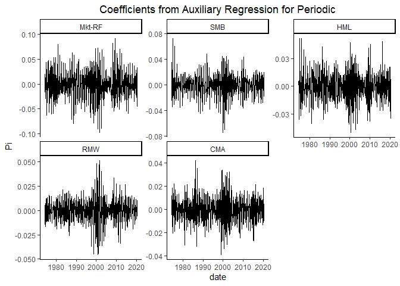<!-- --><!-- -->

    ## [1] "Proportion of siginificant F statistics"

    ## [1] 0.5605787

    ## [1] "Proportion of siginificant t statistics"

    ##    Mkt-RF       SMB       HML       RMW       CMA 
    ## 0.3743219 0.3869801 0.4104882 0.3562387 0.3381555

For Periodic (Seasonal) component. based on the F-test result, we only
reject the null hypothesis that the coefficients are not jointly
different from 0 about half the time. Individually, we have the p-value
about 35% of the time to be less than 0.05.

<!-- --><!-- -->

    ## [1] "Proportion of siginificant F statistics"

    ## [1] 0.5280289

    ## [1] "Proportion of siginificant t statistics"

    ##    Mkt-RF       SMB       HML       RMW       CMA 
    ## 0.3526221 0.3544304 0.3833635 0.3725136 0.3526221

We obtain similar results for noise component.

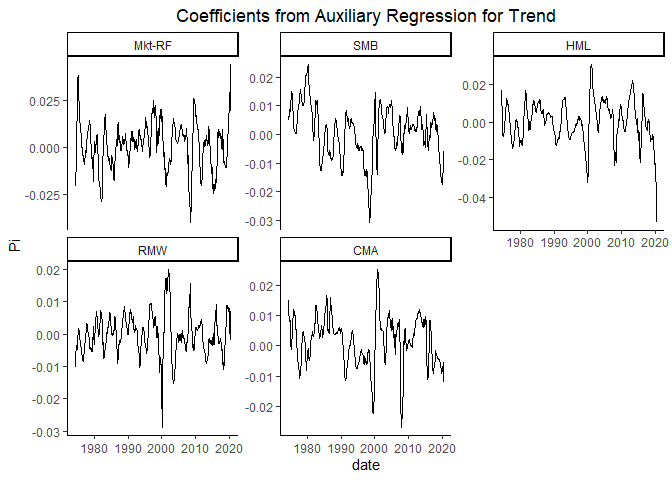<!-- -->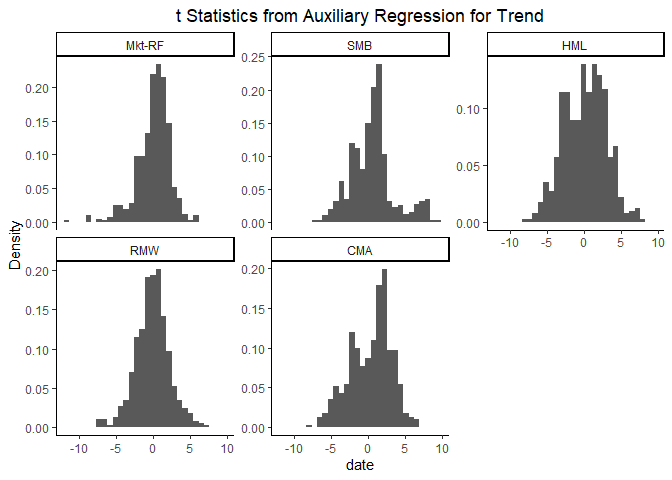<!-- -->

    ## [1] "Proportion of siginificant F statistics"

    ## [1] 0.6654611

    ## [1] "Proportion of siginificant t statistics"

    ##    Mkt-RF       SMB       HML       RMW       CMA 
    ## 0.2947559 0.3453888 0.5533454 0.3218807 0.5189873

We obtain different results for trend component: The market component
significance happens less frequent, and the HML and CMA component
significance happen more frequent.

<table class="table table-striped" style="font-size: 10px; width: auto !important; margin-left: auto; margin-right: auto;">
<caption style="font-size: initial !important;">
Auxilary Regression Results
</caption>
<thead>
<tr>
<th style="text-align:center;">
Factors
</th>
<th style="text-align:center;">
Y_type
</th>
<th style="text-align:center;">
Stat
</th>
<th style="text-align:center;">
Estimate
</th>
<th style="text-align:center;">
T Stat
</th>
<th style="text-align:center;">
p value
</th>
</tr>
</thead>
<tbody>
<tr>
<td style="text-align:center;font-weight: bold;vertical-align: middle !important;" rowspan="24">
Mkt-RF
</td>
<td style="text-align:center;font-weight: bold;vertical-align: middle !important;" rowspan="6">
Trend
</td>
<td style="text-align:center;">
min
</td>
<td style="text-align:center;">
-0.0398405
</td>
<td style="text-align:center;">
-11.5560844
</td>
<td style="text-align:center;">
0.0000000
</td>
</tr>
<tr>
<td style="text-align:center;">
Q25
</td>
<td style="text-align:center;">
-0.0060602
</td>
<td style="text-align:center;">
-0.9775065
</td>
<td style="text-align:center;">
0.0351229
</td>
</tr>
<tr>
<td style="text-align:center;">
Q50
</td>
<td style="text-align:center;">
0.0026565
</td>
<td style="text-align:center;">
0.3851709
</td>
<td style="text-align:center;">
0.2039896
</td>
</tr>
<tr>
<td style="text-align:center;">
Q75
</td>
<td style="text-align:center;">
0.0085026
</td>
<td style="text-align:center;">
1.4797446
</td>
<td style="text-align:center;">
0.5674231
</td>
</tr>
<tr>
<td style="text-align:center;">
max
</td>
<td style="text-align:center;">
0.0442157
</td>
<td style="text-align:center;">
6.0577813
</td>
<td style="text-align:center;">
0.9978172
</td>
</tr>
<tr>
<td style="text-align:center;">
mean
</td>
<td style="text-align:center;">
0.0011720
</td>
<td style="text-align:center;">
0.1016350
</td>
<td style="text-align:center;">
0.3157639
</td>
</tr>
<tr>
<td style="text-align:center;font-weight: bold;vertical-align: middle !important;" rowspan="6">
Periodic
</td>
<td style="text-align:center;">
min
</td>
<td style="text-align:center;">
-0.0973810
</td>
<td style="text-align:center;">
-10.6373440
</td>
<td style="text-align:center;">
0.0000000
</td>
</tr>
<tr>
<td style="text-align:center;">
Q25
</td>
<td style="text-align:center;">
-0.0169633
</td>
<td style="text-align:center;">
-1.5755165
</td>
<td style="text-align:center;">
0.0109273
</td>
</tr>
<tr>
<td style="text-align:center;">
Q50
</td>
<td style="text-align:center;">
0.0002456
</td>
<td style="text-align:center;">
0.0178964
</td>
<td style="text-align:center;">
0.1246608
</td>
</tr>
<tr>
<td style="text-align:center;">
Q75
</td>
<td style="text-align:center;">
0.0164632
</td>
<td style="text-align:center;">
1.5001546
</td>
<td style="text-align:center;">
0.4627756
</td>
</tr>
<tr>
<td style="text-align:center;">
max
</td>
<td style="text-align:center;">
0.0924928
</td>
<td style="text-align:center;">
11.8159094
</td>
<td style="text-align:center;">
0.9972539
</td>
</tr>
<tr>
<td style="text-align:center;">
mean
</td>
<td style="text-align:center;">
-0.0000011
</td>
<td style="text-align:center;">
-0.0025065
</td>
<td style="text-align:center;">
0.2679289
</td>
</tr>
<tr>
<td style="text-align:center;font-weight: bold;vertical-align: middle !important;" rowspan="6">
Noise
</td>
<td style="text-align:center;">
min
</td>
<td style="text-align:center;">
-0.1808531
</td>
<td style="text-align:center;">
-10.9302944
</td>
<td style="text-align:center;">
0.0000000
</td>
</tr>
<tr>
<td style="text-align:center;">
Q25
</td>
<td style="text-align:center;">
-0.0280366
</td>
<td style="text-align:center;">
-1.5515012
</td>
<td style="text-align:center;">
0.0134757
</td>
</tr>
<tr>
<td style="text-align:center;">
Q50
</td>
<td style="text-align:center;">
-0.0006777
</td>
<td style="text-align:center;">
-0.0433206
</td>
<td style="text-align:center;">
0.1390317
</td>
</tr>
<tr>
<td style="text-align:center;">
Q75
</td>
<td style="text-align:center;">
0.0255363
</td>
<td style="text-align:center;">
1.4052607
</td>
<td style="text-align:center;">
0.4812376
</td>
</tr>
<tr>
<td style="text-align:center;">
max
</td>
<td style="text-align:center;">
0.1545158
</td>
<td style="text-align:center;">
10.9690291
</td>
<td style="text-align:center;">
0.9992417
</td>
</tr>
<tr>
<td style="text-align:center;">
mean
</td>
<td style="text-align:center;">
-0.0000892
</td>
<td style="text-align:center;">
-0.0159512
</td>
<td style="text-align:center;">
0.2741039
</td>
</tr>
<tr>
<td style="text-align:center;font-weight: bold;vertical-align: middle !important;" rowspan="6">
Original
</td>
<td style="text-align:center;">
min
</td>
<td style="text-align:center;">
-0.2551590
</td>
<td style="text-align:center;">
-11.2940874
</td>
<td style="text-align:center;">
0.0000000
</td>
</tr>
<tr>
<td style="text-align:center;">
Q25
</td>
<td style="text-align:center;">
-0.0302094
</td>
<td style="text-align:center;">
-1.4031544
</td>
<td style="text-align:center;">
0.0085885
</td>
</tr>
<tr>
<td style="text-align:center;">
Q50
</td>
<td style="text-align:center;">
-0.0003005
</td>
<td style="text-align:center;">
-0.0223560
</td>
<td style="text-align:center;">
0.1685947
</td>
</tr>
<tr>
<td style="text-align:center;">
Q75
</td>
<td style="text-align:center;">
0.0309868
</td>
<td style="text-align:center;">
1.3663303
</td>
<td style="text-align:center;">
0.5232099
</td>
</tr>
<tr>
<td style="text-align:center;">
max
</td>
<td style="text-align:center;">
0.2572051
</td>
<td style="text-align:center;">
13.2027248
</td>
<td style="text-align:center;">
0.9998409
</td>
</tr>
<tr>
<td style="text-align:center;">
mean
</td>
<td style="text-align:center;">
0.0010818
</td>
<td style="text-align:center;">
0.0188948
</td>
<td style="text-align:center;">
0.2890086
</td>
</tr>
<tr>
<td style="text-align:center;font-weight: bold;vertical-align: middle !important;" rowspan="24">
SMB
</td>
<td style="text-align:center;font-weight: bold;vertical-align: middle !important;" rowspan="6">
Trend
</td>
<td style="text-align:center;">
min
</td>
<td style="text-align:center;">
-0.0307587
</td>
<td style="text-align:center;">
-6.9522989
</td>
<td style="text-align:center;">
0.0000000
</td>
</tr>
<tr>
<td style="text-align:center;">
Q25
</td>
<td style="text-align:center;">
-0.0046041
</td>
<td style="text-align:center;">
-1.5518824
</td>
<td style="text-align:center;">
0.0076702
</td>
</tr>
<tr>
<td style="text-align:center;">
Q50
</td>
<td style="text-align:center;">
0.0019438
</td>
<td style="text-align:center;">
0.6090134
</td>
<td style="text-align:center;">
0.1101728
</td>
</tr>
<tr>
<td style="text-align:center;">
Q75
</td>
<td style="text-align:center;">
0.0065249
</td>
<td style="text-align:center;">
1.6691062
</td>
<td style="text-align:center;">
0.3733688
</td>
</tr>
<tr>
<td style="text-align:center;">
max
</td>
<td style="text-align:center;">
0.0245221
</td>
<td style="text-align:center;">
9.5120390
</td>
<td style="text-align:center;">
0.9953018
</td>
</tr>
<tr>
<td style="text-align:center;">
mean
</td>
<td style="text-align:center;">
0.0008964
</td>
<td style="text-align:center;">
0.5451310
</td>
<td style="text-align:center;">
0.2384162
</td>
</tr>
<tr>
<td style="text-align:center;font-weight: bold;vertical-align: middle !important;" rowspan="6">
Periodic
</td>
<td style="text-align:center;">
min
</td>
<td style="text-align:center;">
-0.0744962
</td>
<td style="text-align:center;">
-9.4409819
</td>
<td style="text-align:center;">
0.0000000
</td>
</tr>
<tr>
<td style="text-align:center;">
Q25
</td>
<td style="text-align:center;">
-0.0086036
</td>
<td style="text-align:center;">
-1.4999123
</td>
<td style="text-align:center;">
0.0090108
</td>
</tr>
<tr>
<td style="text-align:center;">
Q50
</td>
<td style="text-align:center;">
0.0006615
</td>
<td style="text-align:center;">
0.1079207
</td>
<td style="text-align:center;">
0.1210583
</td>
</tr>
<tr>
<td style="text-align:center;">
Q75
</td>
<td style="text-align:center;">
0.0098112
</td>
<td style="text-align:center;">
1.6385321
</td>
<td style="text-align:center;">
0.4304968
</td>
</tr>
<tr>
<td style="text-align:center;">
max
</td>
<td style="text-align:center;">
0.0732094
</td>
<td style="text-align:center;">
13.6985439
</td>
<td style="text-align:center;">
0.9952038
</td>
</tr>
<tr>
<td style="text-align:center;">
mean
</td>
<td style="text-align:center;">
-0.0000344
</td>
<td style="text-align:center;">
0.0236706
</td>
<td style="text-align:center;">
0.2478914
</td>
</tr>
<tr>
<td style="text-align:center;font-weight: bold;vertical-align: middle !important;" rowspan="6">
Noise
</td>
<td style="text-align:center;">
min
</td>
<td style="text-align:center;">
-0.0884520
</td>
<td style="text-align:center;">
-10.6175107
</td>
<td style="text-align:center;">
0.0000000
</td>
</tr>
<tr>
<td style="text-align:center;">
Q25
</td>
<td style="text-align:center;">
-0.0153529
</td>
<td style="text-align:center;">
-1.4797745
</td>
<td style="text-align:center;">
0.0138751
</td>
</tr>
<tr>
<td style="text-align:center;">
Q50
</td>
<td style="text-align:center;">
-0.0005976
</td>
<td style="text-align:center;">
-0.0451967
</td>
<td style="text-align:center;">
0.1382779
</td>
</tr>
<tr>
<td style="text-align:center;">
Q75
</td>
<td style="text-align:center;">
0.0132351
</td>
<td style="text-align:center;">
1.5221208
</td>
<td style="text-align:center;">
0.4852495
</td>
</tr>
<tr>
<td style="text-align:center;">
max
</td>
<td style="text-align:center;">
0.1449587
</td>
<td style="text-align:center;">
15.0055952
</td>
<td style="text-align:center;">
0.9998284
</td>
</tr>
<tr>
<td style="text-align:center;">
mean
</td>
<td style="text-align:center;">
-0.0000777
</td>
<td style="text-align:center;">
-0.0034578
</td>
<td style="text-align:center;">
0.2725600
</td>
</tr>
<tr>
<td style="text-align:center;font-weight: bold;vertical-align: middle !important;" rowspan="6">
Original
</td>
<td style="text-align:center;">
min
</td>
<td style="text-align:center;">
-0.1460992
</td>
<td style="text-align:center;">
-10.9556605
</td>
<td style="text-align:center;">
0.0000000
</td>
</tr>
<tr>
<td style="text-align:center;">
Q25
</td>
<td style="text-align:center;">
-0.0183764
</td>
<td style="text-align:center;">
-1.5778195
</td>
<td style="text-align:center;">
0.0103394
</td>
</tr>
<tr>
<td style="text-align:center;">
Q50
</td>
<td style="text-align:center;">
0.0003136
</td>
<td style="text-align:center;">
0.0337380
</td>
<td style="text-align:center;">
0.0975527
</td>
</tr>
<tr>
<td style="text-align:center;">
Q75
</td>
<td style="text-align:center;">
0.0193247
</td>
<td style="text-align:center;">
1.7527749
</td>
<td style="text-align:center;">
0.4529904
</td>
</tr>
<tr>
<td style="text-align:center;">
max
</td>
<td style="text-align:center;">
0.1743482
</td>
<td style="text-align:center;">
14.6007061
</td>
<td style="text-align:center;">
0.9986446
</td>
</tr>
<tr>
<td style="text-align:center;">
mean
</td>
<td style="text-align:center;">
0.0007842
</td>
<td style="text-align:center;">
0.1391887
</td>
<td style="text-align:center;">
0.2581700
</td>
</tr>
<tr>
<td style="text-align:center;font-weight: bold;vertical-align: middle !important;" rowspan="24">
HML
</td>
<td style="text-align:center;font-weight: bold;vertical-align: middle !important;" rowspan="6">
Trend
</td>
<td style="text-align:center;">
min
</td>
<td style="text-align:center;">
-0.0534146
</td>
<td style="text-align:center;">
-8.1966955
</td>
<td style="text-align:center;">
0.0000000
</td>
</tr>
<tr>
<td style="text-align:center;">
Q25
</td>
<td style="text-align:center;">
-0.0056192
</td>
<td style="text-align:center;">
-2.0729057
</td>
<td style="text-align:center;">
0.0026708
</td>
</tr>
<tr>
<td style="text-align:center;">
Q50
</td>
<td style="text-align:center;">
0.0011114
</td>
<td style="text-align:center;">
0.3305723
</td>
<td style="text-align:center;">
0.0336598
</td>
</tr>
<tr>
<td style="text-align:center;">
Q75
</td>
<td style="text-align:center;">
0.0076567
</td>
<td style="text-align:center;">
2.2661691
</td>
<td style="text-align:center;">
0.2787351
</td>
</tr>
<tr>
<td style="text-align:center;">
max
</td>
<td style="text-align:center;">
0.0309480
</td>
<td style="text-align:center;">
7.7876814
</td>
<td style="text-align:center;">
0.9896494
</td>
</tr>
<tr>
<td style="text-align:center;">
mean
</td>
<td style="text-align:center;">
0.0005285
</td>
<td style="text-align:center;">
0.1941107
</td>
<td style="text-align:center;">
0.1911467
</td>
</tr>
<tr>
<td style="text-align:center;font-weight: bold;vertical-align: middle !important;" rowspan="6">
Periodic
</td>
<td style="text-align:center;">
min
</td>
<td style="text-align:center;">
-0.0503378
</td>
<td style="text-align:center;">
-8.6672527
</td>
<td style="text-align:center;">
0.0000000
</td>
</tr>
<tr>
<td style="text-align:center;">
Q25
</td>
<td style="text-align:center;">
-0.0097089
</td>
<td style="text-align:center;">
-1.6328643
</td>
<td style="text-align:center;">
0.0043764
</td>
</tr>
<tr>
<td style="text-align:center;">
Q50
</td>
<td style="text-align:center;">
-0.0001348
</td>
<td style="text-align:center;">
-0.0165312
</td>
<td style="text-align:center;">
0.1065294
</td>
</tr>
<tr>
<td style="text-align:center;">
Q75
</td>
<td style="text-align:center;">
0.0095624
</td>
<td style="text-align:center;">
1.6554350
</td>
<td style="text-align:center;">
0.4257476
</td>
</tr>
<tr>
<td style="text-align:center;">
max
</td>
<td style="text-align:center;">
0.0519526
</td>
<td style="text-align:center;">
13.1077257
</td>
<td style="text-align:center;">
0.9957127
</td>
</tr>
<tr>
<td style="text-align:center;">
mean
</td>
<td style="text-align:center;">
-0.0002253
</td>
<td style="text-align:center;">
-0.0124831
</td>
<td style="text-align:center;">
0.2433092
</td>
</tr>
<tr>
<td style="text-align:center;font-weight: bold;vertical-align: middle !important;" rowspan="6">
Noise
</td>
<td style="text-align:center;">
min
</td>
<td style="text-align:center;">
-0.1202929
</td>
<td style="text-align:center;">
-9.4906678
</td>
<td style="text-align:center;">
0.0000000
</td>
</tr>
<tr>
<td style="text-align:center;">
Q25
</td>
<td style="text-align:center;">
-0.0128314
</td>
<td style="text-align:center;">
-1.5569235
</td>
<td style="text-align:center;">
0.0060560
</td>
</tr>
<tr>
<td style="text-align:center;">
Q50
</td>
<td style="text-align:center;">
-0.0010521
</td>
<td style="text-align:center;">
-0.1163913
</td>
<td style="text-align:center;">
0.1189998
</td>
</tr>
<tr>
<td style="text-align:center;">
Q75
</td>
<td style="text-align:center;">
0.0142367
</td>
<td style="text-align:center;">
1.6597751
</td>
<td style="text-align:center;">
0.4538985
</td>
</tr>
<tr>
<td style="text-align:center;">
max
</td>
<td style="text-align:center;">
0.0956661
</td>
<td style="text-align:center;">
8.9441108
</td>
<td style="text-align:center;">
0.9999672
</td>
</tr>
<tr>
<td style="text-align:center;">
mean
</td>
<td style="text-align:center;">
-0.0002930
</td>
<td style="text-align:center;">
-0.0056426
</td>
<td style="text-align:center;">
0.2546087
</td>
</tr>
<tr>
<td style="text-align:center;font-weight: bold;vertical-align: middle !important;" rowspan="6">
Original
</td>
<td style="text-align:center;">
min
</td>
<td style="text-align:center;">
-0.1717593
</td>
<td style="text-align:center;">
-9.7743758
</td>
<td style="text-align:center;">
0.0000000
</td>
</tr>
<tr>
<td style="text-align:center;">
Q25
</td>
<td style="text-align:center;">
-0.0196948
</td>
<td style="text-align:center;">
-1.6693714
</td>
<td style="text-align:center;">
0.0037867
</td>
</tr>
<tr>
<td style="text-align:center;">
Q50
</td>
<td style="text-align:center;">
-0.0001193
</td>
<td style="text-align:center;">
-0.0168159
</td>
<td style="text-align:center;">
0.0848067
</td>
</tr>
<tr>
<td style="text-align:center;">
Q75
</td>
<td style="text-align:center;">
0.0221896
</td>
<td style="text-align:center;">
1.8334512
</td>
<td style="text-align:center;">
0.3811542
</td>
</tr>
<tr>
<td style="text-align:center;">
max
</td>
<td style="text-align:center;">
0.1322289
</td>
<td style="text-align:center;">
8.8567225
</td>
<td style="text-align:center;">
0.9974577
</td>
</tr>
<tr>
<td style="text-align:center;">
mean
</td>
<td style="text-align:center;">
0.0000102
</td>
<td style="text-align:center;">
0.0580566
</td>
<td style="text-align:center;">
0.2206203
</td>
</tr>
<tr>
<td style="text-align:center;font-weight: bold;vertical-align: middle !important;" rowspan="24">
RMW
</td>
<td style="text-align:center;font-weight: bold;vertical-align: middle !important;" rowspan="6">
Trend
</td>
<td style="text-align:center;">
min
</td>
<td style="text-align:center;">
-0.0289127
</td>
<td style="text-align:center;">
-7.4365160
</td>
<td style="text-align:center;">
0.0000000
</td>
</tr>
<tr>
<td style="text-align:center;">
Q25
</td>
<td style="text-align:center;">
-0.0037460
</td>
<td style="text-align:center;">
-1.4096757
</td>
<td style="text-align:center;">
0.0193845
</td>
</tr>
<tr>
<td style="text-align:center;">
Q50
</td>
<td style="text-align:center;">
-0.0001604
</td>
<td style="text-align:center;">
-0.0653538
</td>
<td style="text-align:center;">
0.1999119
</td>
</tr>
<tr>
<td style="text-align:center;">
Q75
</td>
<td style="text-align:center;">
0.0034351
</td>
<td style="text-align:center;">
1.2546164
</td>
<td style="text-align:center;">
0.5362498
</td>
</tr>
<tr>
<td style="text-align:center;">
max
</td>
<td style="text-align:center;">
0.0200548
</td>
<td style="text-align:center;">
7.0893722
</td>
<td style="text-align:center;">
0.9939530
</td>
</tr>
<tr>
<td style="text-align:center;">
mean
</td>
<td style="text-align:center;">
-0.0000343
</td>
<td style="text-align:center;">
-0.0744750
</td>
<td style="text-align:center;">
0.3030013
</td>
</tr>
<tr>
<td style="text-align:center;font-weight: bold;vertical-align: middle !important;" rowspan="6">
Periodic
</td>
<td style="text-align:center;">
min
</td>
<td style="text-align:center;">
-0.0454677
</td>
<td style="text-align:center;">
-7.9755602
</td>
<td style="text-align:center;">
0.0000000
</td>
</tr>
<tr>
<td style="text-align:center;">
Q25
</td>
<td style="text-align:center;">
-0.0064894
</td>
<td style="text-align:center;">
-1.4297437
</td>
<td style="text-align:center;">
0.0126635
</td>
</tr>
<tr>
<td style="text-align:center;">
Q50
</td>
<td style="text-align:center;">
0.0003853
</td>
<td style="text-align:center;">
0.0795478
</td>
<td style="text-align:center;">
0.1601941
</td>
</tr>
<tr>
<td style="text-align:center;">
Q75
</td>
<td style="text-align:center;">
0.0066687
</td>
<td style="text-align:center;">
1.4095822
</td>
<td style="text-align:center;">
0.4939277
</td>
</tr>
<tr>
<td style="text-align:center;">
max
</td>
<td style="text-align:center;">
0.0513542
</td>
<td style="text-align:center;">
8.5523602
</td>
<td style="text-align:center;">
0.9989308
</td>
</tr>
<tr>
<td style="text-align:center;">
mean
</td>
<td style="text-align:center;">
0.0000771
</td>
<td style="text-align:center;">
0.0137347
</td>
<td style="text-align:center;">
0.2834084
</td>
</tr>
<tr>
<td style="text-align:center;font-weight: bold;vertical-align: middle !important;" rowspan="6">
Noise
</td>
<td style="text-align:center;">
min
</td>
<td style="text-align:center;">
-0.0924241
</td>
<td style="text-align:center;">
-8.1817983
</td>
<td style="text-align:center;">
0.0000000
</td>
</tr>
<tr>
<td style="text-align:center;">
Q25
</td>
<td style="text-align:center;">
-0.0117248
</td>
<td style="text-align:center;">
-1.5756674
</td>
<td style="text-align:center;">
0.0083406
</td>
</tr>
<tr>
<td style="text-align:center;">
Q50
</td>
<td style="text-align:center;">
0.0000614
</td>
<td style="text-align:center;">
0.0103595
</td>
<td style="text-align:center;">
0.1306934
</td>
</tr>
<tr>
<td style="text-align:center;">
Q75
</td>
<td style="text-align:center;">
0.0104561
</td>
<td style="text-align:center;">
1.4679580
</td>
<td style="text-align:center;">
0.4859254
</td>
</tr>
<tr>
<td style="text-align:center;">
max
</td>
<td style="text-align:center;">
0.1196747
</td>
<td style="text-align:center;">
7.6410881
</td>
<td style="text-align:center;">
0.9977478
</td>
</tr>
<tr>
<td style="text-align:center;">
mean
</td>
<td style="text-align:center;">
-0.0001025
</td>
<td style="text-align:center;">
0.0089371
</td>
<td style="text-align:center;">
0.2698500
</td>
</tr>
<tr>
<td style="text-align:center;font-weight: bold;vertical-align: middle !important;" rowspan="6">
Original
</td>
<td style="text-align:center;">
min
</td>
<td style="text-align:center;">
-0.1471339
</td>
<td style="text-align:center;">
-12.4824324
</td>
<td style="text-align:center;">
0.0000000
</td>
</tr>
<tr>
<td style="text-align:center;">
Q25
</td>
<td style="text-align:center;">
-0.0159477
</td>
<td style="text-align:center;">
-1.4738696
</td>
<td style="text-align:center;">
0.0061977
</td>
</tr>
<tr>
<td style="text-align:center;">
Q50
</td>
<td style="text-align:center;">
0.0001729
</td>
<td style="text-align:center;">
0.0263320
</td>
<td style="text-align:center;">
0.1424865
</td>
</tr>
<tr>
<td style="text-align:center;">
Q75
</td>
<td style="text-align:center;">
0.0146190
</td>
<td style="text-align:center;">
1.5017304
</td>
<td style="text-align:center;">
0.5115309
</td>
</tr>
<tr>
<td style="text-align:center;">
max
</td>
<td style="text-align:center;">
0.1356748
</td>
<td style="text-align:center;">
14.2907920
</td>
<td style="text-align:center;">
0.9969235
</td>
</tr>
<tr>
<td style="text-align:center;">
mean
</td>
<td style="text-align:center;">
-0.0000596
</td>
<td style="text-align:center;">
0.0281626
</td>
<td style="text-align:center;">
0.2791047
</td>
</tr>
<tr>
<td style="text-align:center;font-weight: bold;vertical-align: middle !important;" rowspan="24">
CMA
</td>
<td style="text-align:center;font-weight: bold;vertical-align: middle !important;" rowspan="6">
Trend
</td>
<td style="text-align:center;">
min
</td>
<td style="text-align:center;">
-0.0269434
</td>
<td style="text-align:center;">
-8.1039012
</td>
<td style="text-align:center;">
0.0000000
</td>
</tr>
<tr>
<td style="text-align:center;">
Q25
</td>
<td style="text-align:center;">
-0.0041492
</td>
<td style="text-align:center;">
-1.8058511
</td>
<td style="text-align:center;">
0.0019143
</td>
</tr>
<tr>
<td style="text-align:center;">
Q50
</td>
<td style="text-align:center;">
0.0027124
</td>
<td style="text-align:center;">
0.9824828
</td>
<td style="text-align:center;">
0.0396227
</td>
</tr>
<tr>
<td style="text-align:center;">
Q75
</td>
<td style="text-align:center;">
0.0064560
</td>
<td style="text-align:center;">
2.2970989
</td>
<td style="text-align:center;">
0.2228410
</td>
</tr>
<tr>
<td style="text-align:center;">
max
</td>
<td style="text-align:center;">
0.0253075
</td>
<td style="text-align:center;">
6.4311767
</td>
<td style="text-align:center;">
0.9982131
</td>
</tr>
<tr>
<td style="text-align:center;">
mean
</td>
<td style="text-align:center;">
0.0014165
</td>
<td style="text-align:center;">
0.3523583
</td>
<td style="text-align:center;">
0.1635150
</td>
</tr>
<tr>
<td style="text-align:center;font-weight: bold;vertical-align: middle !important;" rowspan="6">
Periodic
</td>
<td style="text-align:center;">
min
</td>
<td style="text-align:center;">
-0.0389650
</td>
<td style="text-align:center;">
-8.2282414
</td>
<td style="text-align:center;">
0.0000000
</td>
</tr>
<tr>
<td style="text-align:center;">
Q25
</td>
<td style="text-align:center;">
-0.0073323
</td>
<td style="text-align:center;">
-1.4107914
</td>
<td style="text-align:center;">
0.0165770
</td>
</tr>
<tr>
<td style="text-align:center;">
Q50
</td>
<td style="text-align:center;">
0.0001684
</td>
<td style="text-align:center;">
0.0233194
</td>
<td style="text-align:center;">
0.1643110
</td>
</tr>
<tr>
<td style="text-align:center;">
Q75
</td>
<td style="text-align:center;">
0.0070997
</td>
<td style="text-align:center;">
1.4154445
</td>
<td style="text-align:center;">
0.4986930
</td>
</tr>
<tr>
<td style="text-align:center;">
max
</td>
<td style="text-align:center;">
0.0423963
</td>
<td style="text-align:center;">
9.2464306
</td>
<td style="text-align:center;">
0.9971714
</td>
</tr>
<tr>
<td style="text-align:center;">
mean
</td>
<td style="text-align:center;">
0.0000245
</td>
<td style="text-align:center;">
0.0103604
</td>
<td style="text-align:center;">
0.2828664
</td>
</tr>
<tr>
<td style="text-align:center;font-weight: bold;vertical-align: middle !important;" rowspan="6">
Noise
</td>
<td style="text-align:center;">
min
</td>
<td style="text-align:center;">
-0.0926402
</td>
<td style="text-align:center;">
-12.1627204
</td>
<td style="text-align:center;">
0.0000000
</td>
</tr>
<tr>
<td style="text-align:center;">
Q25
</td>
<td style="text-align:center;">
-0.0098730
</td>
<td style="text-align:center;">
-1.4153670
</td>
<td style="text-align:center;">
0.0159412
</td>
</tr>
<tr>
<td style="text-align:center;">
Q50
</td>
<td style="text-align:center;">
0.0002332
</td>
<td style="text-align:center;">
0.0273726
</td>
<td style="text-align:center;">
0.1548742
</td>
</tr>
<tr>
<td style="text-align:center;">
Q75
</td>
<td style="text-align:center;">
0.0111944
</td>
<td style="text-align:center;">
1.5051932
</td>
<td style="text-align:center;">
0.5610481
</td>
</tr>
<tr>
<td style="text-align:center;">
max
</td>
<td style="text-align:center;">
0.1057143
</td>
<td style="text-align:center;">
11.6755671
</td>
<td style="text-align:center;">
0.9989292
</td>
</tr>
<tr>
<td style="text-align:center;">
mean
</td>
<td style="text-align:center;">
0.0003083
</td>
<td style="text-align:center;">
0.0486259
</td>
<td style="text-align:center;">
0.2946964
</td>
</tr>
<tr>
<td style="text-align:center;font-weight: bold;vertical-align: middle !important;" rowspan="6">
Original
</td>
<td style="text-align:center;">
min
</td>
<td style="text-align:center;">
-0.0902032
</td>
<td style="text-align:center;">
-10.0094915
</td>
<td style="text-align:center;">
0.0000000
</td>
</tr>
<tr>
<td style="text-align:center;">
Q25
</td>
<td style="text-align:center;">
-0.0123518
</td>
<td style="text-align:center;">
-1.3004498
</td>
<td style="text-align:center;">
0.0110208
</td>
</tr>
<tr>
<td style="text-align:center;">
Q50
</td>
<td style="text-align:center;">
0.0007881
</td>
<td style="text-align:center;">
0.1032370
</td>
<td style="text-align:center;">
0.1629477
</td>
</tr>
<tr>
<td style="text-align:center;">
Q75
</td>
<td style="text-align:center;">
0.0158254
</td>
<td style="text-align:center;">
1.6211250
</td>
<td style="text-align:center;">
0.5251572
</td>
</tr>
<tr>
<td style="text-align:center;">
max
</td>
<td style="text-align:center;">
0.1180741
</td>
<td style="text-align:center;">
12.1056213
</td>
<td style="text-align:center;">
0.9946129
</td>
</tr>
<tr>
<td style="text-align:center;">
mean
</td>
<td style="text-align:center;">
0.0017493
</td>
<td style="text-align:center;">
0.1405435
</td>
<td style="text-align:center;">
0.2921668
</td>
</tr>
</tbody>
</table>
<table class="table table-striped" style="font-size: 10px; width: auto !important; margin-left: auto; margin-right: auto;">
<caption style="font-size: initial !important;">
Auxilary Regression Coefficient Significance Percentage
</caption>
<thead>
<tr>
<th style="text-align:center;">
Y_type
</th>
<th style="text-align:center;">
Mkt-RF
</th>
<th style="text-align:center;">
SMB
</th>
<th style="text-align:center;">
HML
</th>
<th style="text-align:center;">
RMW
</th>
<th style="text-align:center;">
CMA
</th>
</tr>
</thead>
<tbody>
<tr>
<td style="text-align:center;font-weight: bold;">
Trend
</td>
<td style="text-align:center;">
0.2947559
</td>
<td style="text-align:center;">
0.3453888
</td>
<td style="text-align:center;">
0.5533454
</td>
<td style="text-align:center;">
0.3218807
</td>
<td style="text-align:center;">
0.5189873
</td>
</tr>
<tr>
<td style="text-align:center;font-weight: bold;">
Periodic
</td>
<td style="text-align:center;">
0.3743219
</td>
<td style="text-align:center;">
0.3869801
</td>
<td style="text-align:center;">
0.4104882
</td>
<td style="text-align:center;">
0.3562387
</td>
<td style="text-align:center;">
0.3381555
</td>
</tr>
<tr>
<td style="text-align:center;font-weight: bold;">
Noise
</td>
<td style="text-align:center;">
0.3526221
</td>
<td style="text-align:center;">
0.3544304
</td>
<td style="text-align:center;">
0.3833635
</td>
<td style="text-align:center;">
0.3725136
</td>
<td style="text-align:center;">
0.3526221
</td>
</tr>
<tr>
<td style="text-align:center;font-weight: bold;">
Original
</td>
<td style="text-align:center;">
0.3688969
</td>
<td style="text-align:center;">
0.3996383
</td>
<td style="text-align:center;">
0.4448463
</td>
<td style="text-align:center;">
0.3851718
</td>
<td style="text-align:center;">
0.3471971
</td>
</tr>
</tbody>
</table>

This shows that at a given time t, we would have the Noise and Periodic
(Seasonal) component affecting the

estimation.

### S4-6-2 Panel Auxiliary Regression

This session would apply panel regression to each components to see
whether using the trend component is justified in the full sample. We
present 4 separate Panel regressions using all portfolios across all
time. In each regression, Original Return / Trend / Period / Noise is on
the LHS and the betas are on the RHS.

    ## [1] "Original"

    ## 
    ## t test of coefficients:
    ## 
    ##                Estimate  Std. Error t value Pr(>|t|)    
    ## (Intercept)  0.00747840  0.00197321  3.7900 0.000151 ***
    ## `Mkt-RF`    -0.00078642  0.00201241 -0.3908 0.695959    
    ## SMB          0.00220116  0.00115708  1.9023 0.057138 .  
    ## HML         -0.00006808  0.00110670 -0.0615 0.950949    
    ## RMW          0.00036242  0.00098327  0.3686 0.712440    
    ## CMA          0.00049586  0.00092656  0.5352 0.592544    
    ## ---
    ## Signif. codes:  0 '***' 0.001 '**' 0.01 '*' 0.05 '.' 0.1 ' ' 1

    ## [1] "Trend"

    ## 
    ## t test of coefficients:
    ## 
    ##                Estimate  Std. Error t value  Pr(>|t|)    
    ## (Intercept)  7.6232e-03  4.9570e-04 15.3787 < 2.2e-16 ***
    ## `Mkt-RF`    -7.8648e-04  5.0636e-04 -1.5532  0.120392    
    ## SMB          1.6607e-03  2.9518e-04  5.6261 1.862e-08 ***
    ## HML          8.6388e-05  2.7241e-04  0.3171  0.751148    
    ## RMW          6.1470e-04  2.1770e-04  2.8236  0.004752 ** 
    ## CMA          5.1244e-05  2.2506e-04  0.2277  0.819885    
    ## ---
    ## Signif. codes:  0 '***' 0.001 '**' 0.01 '*' 0.05 '.' 0.1 ' ' 1

    ## [1] "Periodic (Seasonal)"

    ## 
    ## t test of coefficients:
    ## 
    ##                Estimate  Std. Error t value Pr(>|t|)
    ## (Intercept) -8.7507e-05  9.0080e-04 -0.0971   0.9226
    ## `Mkt-RF`     4.8122e-05  9.1712e-04  0.0525   0.9582
    ## SMB          6.5905e-05  5.8018e-04  0.1136   0.9096
    ## HML         -1.0095e-04  5.0139e-04 -0.2013   0.8404
    ## RMW          1.0216e-05  4.6034e-04  0.0222   0.9823
    ## CMA          1.2405e-04  4.2764e-04  0.2901   0.7718

    ## [1] "Noise"

    ## 
    ## t test of coefficients:
    ## 
    ##                Estimate  Std. Error t value Pr(>|t|)
    ## (Intercept) -5.7313e-05  1.4487e-03 -0.0396   0.9684
    ## `Mkt-RF`    -4.8068e-05  1.4613e-03 -0.0329   0.9738
    ## SMB          4.7455e-04  8.3714e-04  0.5669   0.5708
    ## HML         -5.3519e-05  8.1602e-04 -0.0656   0.9477
    ## RMW         -2.6250e-04  7.0698e-04 -0.3713   0.7104
    ## CMA          3.2057e-04  6.8930e-04  0.4651   0.6419

We can clearly see that overall the Periodic (Seasonal) and Noise cannot
be explained by the betas (they should not matter for the expected
return estimation). The coefficients for Periodic (Seasonal) and Noise
are indistinguishable from 0 and the F test p-value is close to 1 (not
significant from 0). Therefore, Periodic (Seasonal) and Noise should not
matter in the second-path regression. The Original (actual return) and
Trend regression coefficients are similar and the F test p-values are
all small. This result suggests that only the trend component matters in
the

estimation in the second-path regression.

From the previous section, yet, Periodic and Noise Components can alter
the monthly

estimations, which is inappropriate according to the Panel regression
results. If we want one long-term
,
using trend or return on the left-hand side would yield similar
estimates. However, since our primary goal is to estimate monthly
expected return, we should only use trend on the left-hand side,
excluding Noise and Periodic.

Here are the mathematical explanations: the regression are with
assumptions that:

![E\[R\_{i,t}\|\hat{\beta}\_{i,t}\] = a + a_1 \hat{\beta}\_{i,t}](https://latex.codecogs.com/png.image?%5Cdpi%7B110%7D&space;%5Cbg_white&space;E%5BR_%7Bi%2Ct%7D%7C%5Chat%7B%5Cbeta%7D_%7Bi%2Ct%7D%5D%20%3D%20a%20%2B%20a_1%20%5Chat%7B%5Cbeta%7D_%7Bi%2Ct%7D "E[R_{i,t}|\hat{\beta}_{i,t}] = a + a_1 \hat{\beta}_{i,t}")

![E\[T\_{i,t}\|\hat{\beta}\_{i,t}\] = b + b_1 \hat{\beta}\_{i,t}](https://latex.codecogs.com/png.image?%5Cdpi%7B110%7D&space;%5Cbg_white&space;E%5BT_%7Bi%2Ct%7D%7C%5Chat%7B%5Cbeta%7D_%7Bi%2Ct%7D%5D%20%3D%20b%20%2B%20b_1%20%5Chat%7B%5Cbeta%7D_%7Bi%2Ct%7D "E[T_{i,t}|\hat{\beta}_{i,t}] = b + b_1 \hat{\beta}_{i,t}")

![E\[P\_{i,t}\|\hat{\beta}\_{i,t}\] = c + c_1 \hat{\beta}\_{i,t}](https://latex.codecogs.com/png.image?%5Cdpi%7B110%7D&space;%5Cbg_white&space;E%5BP_%7Bi%2Ct%7D%7C%5Chat%7B%5Cbeta%7D_%7Bi%2Ct%7D%5D%20%3D%20c%20%2B%20c_1%20%5Chat%7B%5Cbeta%7D_%7Bi%2Ct%7D "E[P_{i,t}|\hat{\beta}_{i,t}] = c + c_1 \hat{\beta}_{i,t}")

![E\[N\_{i,t}\|\hat{\beta}\_{i,t}\] = d + d_1 \hat{\beta}\_{i,t}](https://latex.codecogs.com/png.image?%5Cdpi%7B110%7D&space;%5Cbg_white&space;E%5BN_%7Bi%2Ct%7D%7C%5Chat%7B%5Cbeta%7D_%7Bi%2Ct%7D%5D%20%3D%20d%20%2B%20d_1%20%5Chat%7B%5Cbeta%7D_%7Bi%2Ct%7D "E[N_{i,t}|\hat{\beta}_{i,t}] = d + d_1 \hat{\beta}_{i,t}")

With
,

and
.
However, we have
,
,

and

almost being 0 from regression 3 and 4.

and
.
which means we should be able to use trend (2nd regression) to recover
the expected ECC. This is an informal illustration.

### S4-6-3 Long Regression with omitted variable (Periodic and Noise)

In this session, we present the longer version of second step
regression, where

We would use the result of this longer version regression to compare
with the original Fama Macbeth second step regression to test whether
periodic and noise terms would affect the regression result.

<!-- --><!-- -->

    ## [1] "Proportion of siginificant F statistics"

    ## [1] 0.7830018

    ## [1] "Proportion of siginificant t statistics"

    ##  Periodic     Noise    Mkt-RF       SMB       HML       RMW       CMA 
    ## 0.2603978 0.2531646 0.2947559 0.3797468 0.5189873 0.3218807 0.4918626

The proportion of significant lambda numbers is closer to the ACL
regression (or the trend auxiliary regression).

Now, let’s compare the long-regression lambdas with the original
second-path result:

<table class="table table-striped" style="font-size: 10px; width: auto !important; margin-left: auto; margin-right: auto;">
<caption style="font-size: initial !important;">
Long vs. Original Regression Results
</caption>
<thead>
<tr>
<th style="text-align:center;">
Factors
</th>
<th style="text-align:center;">
Stat
</th>
<th style="text-align:center;">
Long_Estimate
</th>
<th style="text-align:center;">
Long_Std. Error
</th>
<th style="text-align:center;">
Original_Estimate
</th>
<th style="text-align:center;">
Original_Std. Error
</th>
<th style="text-align:center;">
Diff_Estimate
</th>
<th style="text-align:center;">
Diff_Std. Error
</th>
<th style="text-align:center;">
Diff_t\_stat
</th>
<th style="text-align:center;">
Diff_P\_value
</th>
</tr>
</thead>
<tbody>
<tr>
<td style="text-align:center;font-weight: bold;vertical-align: middle !important;" rowspan="6">
Mkt-RF
</td>
<td style="text-align:center;font-weight: bold;">
min
</td>
<td style="text-align:center;">
-0.0480560
</td>
<td style="text-align:center;">
0.0020119
</td>
<td style="text-align:center;">
-0.2551590
</td>
<td style="text-align:center;">
0.0070778
</td>
<td style="text-align:center;">
-0.2533239
</td>
<td style="text-align:center;">
-0.0596762
</td>
<td style="text-align:center;">
-29.7087668
</td>
<td style="text-align:center;">
0.0000000
</td>
</tr>
<tr>
<td style="text-align:center;font-weight: bold;">
Q25
</td>
<td style="text-align:center;">
-0.0059243
</td>
<td style="text-align:center;">
0.0047247
</td>
<td style="text-align:center;">
-0.0302094
</td>
<td style="text-align:center;">
0.0178901
</td>
<td style="text-align:center;">
-0.0295718
</td>
<td style="text-align:center;">
-0.0214706
</td>
<td style="text-align:center;">
-1.9631914
</td>
<td style="text-align:center;">
0.0343796
</td>
</tr>
<tr>
<td style="text-align:center;font-weight: bold;">
Q50
</td>
<td style="text-align:center;">
0.0029808
</td>
<td style="text-align:center;">
0.0060109
</td>
<td style="text-align:center;">
-0.0003005
</td>
<td style="text-align:center;">
0.0225425
</td>
<td style="text-align:center;">
0.0018570
</td>
<td style="text-align:center;">
-0.0160961
</td>
<td style="text-align:center;">
-0.0993259
</td>
<td style="text-align:center;">
0.5395512
</td>
</tr>
<tr>
<td style="text-align:center;font-weight: bold;">
Q75
</td>
<td style="text-align:center;">
0.0088201
</td>
<td style="text-align:center;">
0.0078613
</td>
<td style="text-align:center;">
0.0309868
</td>
<td style="text-align:center;">
0.0292714
</td>
<td style="text-align:center;">
0.0341044
</td>
<td style="text-align:center;">
-0.0119799
</td>
<td style="text-align:center;">
1.8217772
</td>
<td style="text-align:center;">
0.9750627
</td>
</tr>
<tr>
<td style="text-align:center;font-weight: bold;">
max
</td>
<td style="text-align:center;">
0.0437299
</td>
<td style="text-align:center;">
0.0172735
</td>
<td style="text-align:center;">
0.2572051
</td>
<td style="text-align:center;">
0.0647344
</td>
<td style="text-align:center;">
0.2169964
</td>
<td style="text-align:center;">
-0.0028672
</td>
<td style="text-align:center;">
27.2862027
</td>
<td style="text-align:center;">
1.0000000
</td>
</tr>
<tr>
<td style="text-align:center;font-weight: bold;">
mean
</td>
<td style="text-align:center;">
0.0014498
</td>
<td style="text-align:center;">
0.0066538
</td>
<td style="text-align:center;">
0.0010818
</td>
<td style="text-align:center;">
0.0241975
</td>
<td style="text-align:center;">
0.0003680
</td>
<td style="text-align:center;">
-0.0175437
</td>
<td style="text-align:center;">
-0.0472883
</td>
<td style="text-align:center;">
0.5156322
</td>
</tr>
<tr>
<td style="text-align:center;font-weight: bold;vertical-align: middle !important;" rowspan="6">
SMB
</td>
<td style="text-align:center;font-weight: bold;">
min
</td>
<td style="text-align:center;">
-0.0385885
</td>
<td style="text-align:center;">
0.0013246
</td>
<td style="text-align:center;">
-0.1460992
</td>
<td style="text-align:center;">
0.0042591
</td>
<td style="text-align:center;">
-0.1443598
</td>
<td style="text-align:center;">
-0.0325967
</td>
<td style="text-align:center;">
-87.4662260
</td>
<td style="text-align:center;">
0.0000000
</td>
</tr>
<tr>
<td style="text-align:center;font-weight: bold;">
Q25
</td>
<td style="text-align:center;">
-0.0046071
</td>
<td style="text-align:center;">
0.0026814
</td>
<td style="text-align:center;">
-0.0183764
</td>
<td style="text-align:center;">
0.0092698
</td>
<td style="text-align:center;">
-0.0180497
</td>
<td style="text-align:center;">
-0.0118195
</td>
<td style="text-align:center;">
-2.2694751
</td>
<td style="text-align:center;">
0.0122330
</td>
</tr>
<tr>
<td style="text-align:center;font-weight: bold;">
Q50
</td>
<td style="text-align:center;">
0.0019741
</td>
<td style="text-align:center;">
0.0033320
</td>
<td style="text-align:center;">
0.0003136
</td>
<td style="text-align:center;">
0.0121029
</td>
<td style="text-align:center;">
-0.0006971
</td>
<td style="text-align:center;">
-0.0086813
</td>
<td style="text-align:center;">
0.0977739
</td>
<td style="text-align:center;">
0.4610648
</td>
</tr>
<tr>
<td style="text-align:center;font-weight: bold;">
Q75
</td>
<td style="text-align:center;">
0.0066251
</td>
<td style="text-align:center;">
0.0043940
</td>
<td style="text-align:center;">
0.0193247
</td>
<td style="text-align:center;">
0.0156304
</td>
<td style="text-align:center;">
0.0184378
</td>
<td style="text-align:center;">
-0.0060240
</td>
<td style="text-align:center;">
2.2528242
</td>
<td style="text-align:center;">
0.9882842
</td>
</tr>
<tr>
<td style="text-align:center;font-weight: bold;">
max
</td>
<td style="text-align:center;">
0.0370270
</td>
<td style="text-align:center;">
0.0112625
</td>
<td style="text-align:center;">
0.1743482
</td>
<td style="text-align:center;">
0.0392316
</td>
<td style="text-align:center;">
0.1655418
</td>
<td style="text-align:center;">
0.0016373
</td>
<td style="text-align:center;">
109.5779270
</td>
<td style="text-align:center;">
1.0000000
</td>
</tr>
<tr>
<td style="text-align:center;font-weight: bold;">
mean
</td>
<td style="text-align:center;">
0.0008089
</td>
<td style="text-align:center;">
0.0036684
</td>
<td style="text-align:center;">
0.0007842
</td>
<td style="text-align:center;">
0.0131768
</td>
<td style="text-align:center;">
0.0000247
</td>
<td style="text-align:center;">
-0.0095084
</td>
<td style="text-align:center;">
-0.2217230
</td>
<td style="text-align:center;">
0.4961706
</td>
</tr>
<tr>
<td style="text-align:center;font-weight: bold;vertical-align: middle !important;" rowspan="6">
HML
</td>
<td style="text-align:center;font-weight: bold;">
min
</td>
<td style="text-align:center;">
-0.0573502
</td>
<td style="text-align:center;">
0.0012517
</td>
<td style="text-align:center;">
-0.1717593
</td>
<td style="text-align:center;">
0.0042443
</td>
<td style="text-align:center;">
-0.1346646
</td>
<td style="text-align:center;">
-0.0479267
</td>
<td style="text-align:center;">
-24.3715550
</td>
<td style="text-align:center;">
0.0000000
</td>
</tr>
<tr>
<td style="text-align:center;font-weight: bold;">
Q25
</td>
<td style="text-align:center;">
-0.0059190
</td>
<td style="text-align:center;">
0.0026921
</td>
<td style="text-align:center;">
-0.0196948
</td>
<td style="text-align:center;">
0.0091743
</td>
<td style="text-align:center;">
-0.0178740
</td>
<td style="text-align:center;">
-0.0108118
</td>
<td style="text-align:center;">
-2.2797721
</td>
<td style="text-align:center;">
0.0130360
</td>
</tr>
<tr>
<td style="text-align:center;font-weight: bold;">
Q50
</td>
<td style="text-align:center;">
0.0010277
</td>
<td style="text-align:center;">
0.0033245
</td>
<td style="text-align:center;">
-0.0001193
</td>
<td style="text-align:center;">
0.0115813
</td>
<td style="text-align:center;">
0.0006492
</td>
<td style="text-align:center;">
-0.0080693
</td>
<td style="text-align:center;">
-0.1131069
</td>
<td style="text-align:center;">
0.5450168
</td>
</tr>
<tr>
<td style="text-align:center;font-weight: bold;">
Q75
</td>
<td style="text-align:center;">
0.0075175
</td>
<td style="text-align:center;">
0.0041238
</td>
<td style="text-align:center;">
0.0221896
</td>
<td style="text-align:center;">
0.0145976
</td>
<td style="text-align:center;">
0.0179807
</td>
<td style="text-align:center;">
-0.0057351
</td>
<td style="text-align:center;">
2.2281405
</td>
<td style="text-align:center;">
0.9885944
</td>
</tr>
<tr>
<td style="text-align:center;font-weight: bold;">
max
</td>
<td style="text-align:center;">
0.0366834
</td>
<td style="text-align:center;">
0.0139116
</td>
<td style="text-align:center;">
0.1322289
</td>
<td style="text-align:center;">
0.0500856
</td>
<td style="text-align:center;">
0.1276300
</td>
<td style="text-align:center;">
-0.0009458
</td>
<td style="text-align:center;">
16.5499331
</td>
<td style="text-align:center;">
1.0000000
</td>
</tr>
<tr>
<td style="text-align:center;font-weight: bold;">
mean
</td>
<td style="text-align:center;">
0.0004073
</td>
<td style="text-align:center;">
0.0036190
</td>
<td style="text-align:center;">
0.0000102
</td>
<td style="text-align:center;">
0.0122650
</td>
<td style="text-align:center;">
0.0003971
</td>
<td style="text-align:center;">
-0.0086460
</td>
<td style="text-align:center;">
0.0064283
</td>
<td style="text-align:center;">
0.5044602
</td>
</tr>
<tr>
<td style="text-align:center;font-weight: bold;vertical-align: middle !important;" rowspan="6">
RMW
</td>
<td style="text-align:center;font-weight: bold;">
min
</td>
<td style="text-align:center;">
-0.0509486
</td>
<td style="text-align:center;">
0.0010515
</td>
<td style="text-align:center;">
-0.1471339
</td>
<td style="text-align:center;">
0.0037281
</td>
<td style="text-align:center;">
-0.1866234
</td>
<td style="text-align:center;">
-0.0332109
</td>
<td style="text-align:center;">
-100.0151642
</td>
<td style="text-align:center;">
0.0000000
</td>
</tr>
<tr>
<td style="text-align:center;font-weight: bold;">
Q25
</td>
<td style="text-align:center;">
-0.0037605
</td>
<td style="text-align:center;">
0.0021908
</td>
<td style="text-align:center;">
-0.0159477
</td>
<td style="text-align:center;">
0.0074791
</td>
<td style="text-align:center;">
-0.0151219
</td>
<td style="text-align:center;">
-0.0089046
</td>
<td style="text-align:center;">
-1.8366984
</td>
<td style="text-align:center;">
0.0159984
</td>
</tr>
<tr>
<td style="text-align:center;font-weight: bold;">
Q50
</td>
<td style="text-align:center;">
-0.0001530
</td>
<td style="text-align:center;">
0.0027702
</td>
<td style="text-align:center;">
0.0001729
</td>
<td style="text-align:center;">
0.0096283
</td>
<td style="text-align:center;">
-0.0002369
</td>
<td style="text-align:center;">
-0.0065752
</td>
<td style="text-align:center;">
0.0178862
</td>
<td style="text-align:center;">
0.4928664
</td>
</tr>
<tr>
<td style="text-align:center;font-weight: bold;">
Q75
</td>
<td style="text-align:center;">
0.0030406
</td>
<td style="text-align:center;">
0.0035131
</td>
<td style="text-align:center;">
0.0146190
</td>
<td style="text-align:center;">
0.0121935
</td>
<td style="text-align:center;">
0.0142433
</td>
<td style="text-align:center;">
-0.0048933
</td>
<td style="text-align:center;">
2.1471722
</td>
<td style="text-align:center;">
0.9667384
</td>
</tr>
<tr>
<td style="text-align:center;font-weight: bold;">
max
</td>
<td style="text-align:center;">
0.0252767
</td>
<td style="text-align:center;">
0.0141462
</td>
<td style="text-align:center;">
0.1356748
</td>
<td style="text-align:center;">
0.0374597
</td>
<td style="text-align:center;">
0.1138824
</td>
<td style="text-align:center;">
0.0005101
</td>
<td style="text-align:center;">
28.6360413
</td>
<td style="text-align:center;">
1.0000000
</td>
</tr>
<tr>
<td style="text-align:center;font-weight: bold;">
mean
</td>
<td style="text-align:center;">
-0.0001189
</td>
<td style="text-align:center;">
0.0029928
</td>
<td style="text-align:center;">
-0.0000596
</td>
<td style="text-align:center;">
0.0106381
</td>
<td style="text-align:center;">
-0.0000593
</td>
<td style="text-align:center;">
-0.0076453
</td>
<td style="text-align:center;">
-0.1415703
</td>
<td style="text-align:center;">
0.4925608
</td>
</tr>
<tr>
<td style="text-align:center;font-weight: bold;vertical-align: middle !important;" rowspan="6">
CMA
</td>
<td style="text-align:center;font-weight: bold;">
min
</td>
<td style="text-align:center;">
-0.0248250
</td>
<td style="text-align:center;">
0.0010408
</td>
<td style="text-align:center;">
-0.0902032
</td>
<td style="text-align:center;">
0.0034985
</td>
<td style="text-align:center;">
-0.1079040
</td>
<td style="text-align:center;">
-0.0365704
</td>
<td style="text-align:center;">
-66.4267037
</td>
<td style="text-align:center;">
0.0000000
</td>
</tr>
<tr>
<td style="text-align:center;font-weight: bold;">
Q25
</td>
<td style="text-align:center;">
-0.0040767
</td>
<td style="text-align:center;">
0.0019963
</td>
<td style="text-align:center;">
-0.0123518
</td>
<td style="text-align:center;">
0.0073836
</td>
<td style="text-align:center;">
-0.0138593
</td>
<td style="text-align:center;">
-0.0093635
</td>
<td style="text-align:center;">
-1.7410804
</td>
<td style="text-align:center;">
0.0259373
</td>
</tr>
<tr>
<td style="text-align:center;font-weight: bold;">
Q50
</td>
<td style="text-align:center;">
0.0019743
</td>
<td style="text-align:center;">
0.0025802
</td>
<td style="text-align:center;">
0.0007881
</td>
<td style="text-align:center;">
0.0094724
</td>
<td style="text-align:center;">
0.0008993
</td>
<td style="text-align:center;">
-0.0068526
</td>
<td style="text-align:center;">
-0.1349773
</td>
<td style="text-align:center;">
0.5536728
</td>
</tr>
<tr>
<td style="text-align:center;font-weight: bold;">
Q75
</td>
<td style="text-align:center;">
0.0063788
</td>
<td style="text-align:center;">
0.0034776
</td>
<td style="text-align:center;">
0.0158254
</td>
<td style="text-align:center;">
0.0125296
</td>
<td style="text-align:center;">
0.0127675
</td>
<td style="text-align:center;">
-0.0048197
</td>
<td style="text-align:center;">
1.9462790
</td>
<td style="text-align:center;">
0.9590260
</td>
</tr>
<tr>
<td style="text-align:center;font-weight: bold;">
max
</td>
<td style="text-align:center;">
0.0279110
</td>
<td style="text-align:center;">
0.0075542
</td>
<td style="text-align:center;">
0.1180741
</td>
<td style="text-align:center;">
0.0384205
</td>
<td style="text-align:center;">
0.1080476
</td>
<td style="text-align:center;">
-0.0004355
</td>
<td style="text-align:center;">
91.0079405
</td>
<td style="text-align:center;">
1.0000000
</td>
</tr>
<tr>
<td style="text-align:center;font-weight: bold;">
mean
</td>
<td style="text-align:center;">
0.0012399
</td>
<td style="text-align:center;">
0.0028632
</td>
<td style="text-align:center;">
0.0017493
</td>
<td style="text-align:center;">
0.0105354
</td>
<td style="text-align:center;">
-0.0005095
</td>
<td style="text-align:center;">
-0.0076723
</td>
<td style="text-align:center;">
0.1489364
</td>
<td style="text-align:center;">
0.4986151
</td>
</tr>
</tbody>
</table>
<table class="table table-striped" style="font-size: 10px; width: auto !important; margin-left: auto; margin-right: auto;">
<caption style="font-size: initial !important;">
Long vs. Original Difference Significance Percentage
</caption>
<thead>
<tr>
<th style="text-align:center;">
Factors
</th>
<th style="text-align:center;">
Sig_Percent
</th>
</tr>
</thead>
<tbody>
<tr>
<td style="text-align:center;font-weight: bold;">
Mkt-RF
</td>
<td style="text-align:center;">
0.2640145
</td>
</tr>
<tr>
<td style="text-align:center;font-weight: bold;">
SMB
</td>
<td style="text-align:center;">
0.3074141
</td>
</tr>
<tr>
<td style="text-align:center;font-weight: bold;">
HML
</td>
<td style="text-align:center;">
0.3164557
</td>
</tr>
<tr>
<td style="text-align:center;font-weight: bold;">
RMW
</td>
<td style="text-align:center;">
0.3110307
</td>
</tr>
<tr>
<td style="text-align:center;font-weight: bold;">
CMA
</td>
<td style="text-align:center;">
0.2839060
</td>
</tr>
</tbody>
</table>

It seems that 30% of the time, the result from long regression would be
different from the second-step regression. This result is consistent
with previous short regressions, which showed Period and Noise are
associated with

and would introduce a bias to the second-step regression.

Next, let’s compare the long-regression lambdas with the ACL second-path
result:

<table class="table table-striped" style="font-size: 10px; width: auto !important; margin-left: auto; margin-right: auto;">
<caption style="font-size: initial !important;">
Long vs. ACL Regression Results
</caption>
<thead>
<tr>
<th style="text-align:center;">
Factors
</th>
<th style="text-align:center;">
Stat
</th>
<th style="text-align:center;">
Long_Estimate
</th>
<th style="text-align:center;">
Long_Std. Error
</th>
<th style="text-align:center;">
ACL_Estimate
</th>
<th style="text-align:center;">
ACL_Std. Error
</th>
<th style="text-align:center;">
Diff_Estimate
</th>
<th style="text-align:center;">
Diff_Std. Error
</th>
<th style="text-align:center;">
Diff_t\_stat
</th>
<th style="text-align:center;">
Diff_P\_value
</th>
</tr>
</thead>
<tbody>
<tr>
<td style="text-align:center;font-weight: bold;vertical-align: middle !important;" rowspan="6">
Mkt-RF
</td>
<td style="text-align:center;font-weight: bold;">
min
</td>
<td style="text-align:center;">
-0.0480560
</td>
<td style="text-align:center;">
0.0020119
</td>
<td style="text-align:center;">
-0.0398405
</td>
<td style="text-align:center;">
0.0025091
</td>
<td style="text-align:center;">
-0.0525505
</td>
<td style="text-align:center;">
-0.0074914
</td>
<td style="text-align:center;">
-2.353063e+03
</td>
<td style="text-align:center;">
0.0000000
</td>
</tr>
<tr>
<td style="text-align:center;font-weight: bold;">
Q25
</td>
<td style="text-align:center;">
-0.0059243
</td>
<td style="text-align:center;">
0.0047247
</td>
<td style="text-align:center;">
-0.0060602
</td>
<td style="text-align:center;">
0.0046435
</td>
<td style="text-align:center;">
-0.0018922
</td>
<td style="text-align:center;">
-0.0004935
</td>
<td style="text-align:center;">
-3.424856e+00
</td>
<td style="text-align:center;">
0.0000006
</td>
</tr>
<tr>
<td style="text-align:center;font-weight: bold;">
Q50
</td>
<td style="text-align:center;">
0.0029808
</td>
<td style="text-align:center;">
0.0060109
</td>
<td style="text-align:center;">
0.0026565
</td>
<td style="text-align:center;">
0.0058138
</td>
<td style="text-align:center;">
0.0003332
</td>
<td style="text-align:center;">
0.0000828
</td>
<td style="text-align:center;">
5.514064e-01
</td>
<td style="text-align:center;">
0.2907333
</td>
</tr>
<tr>
<td style="text-align:center;font-weight: bold;">
Q75
</td>
<td style="text-align:center;">
0.0088201
</td>
<td style="text-align:center;">
0.0078613
</td>
<td style="text-align:center;">
0.0085026
</td>
<td style="text-align:center;">
0.0079965
</td>
<td style="text-align:center;">
0.0026341
</td>
<td style="text-align:center;">
0.0006118
</td>
<td style="text-align:center;">
4.886085e+00
</td>
<td style="text-align:center;">
0.9996811
</td>
</tr>
<tr>
<td style="text-align:center;font-weight: bold;">
max
</td>
<td style="text-align:center;">
0.0437299
</td>
<td style="text-align:center;">
0.0172735
</td>
<td style="text-align:center;">
0.0442157
</td>
<td style="text-align:center;">
0.0176941
</td>
<td style="text-align:center;">
0.0215825
</td>
<td style="text-align:center;">
0.0077158
</td>
<td style="text-align:center;">
3.051051e+03
</td>
<td style="text-align:center;">
1.0000000
</td>
</tr>
<tr>
<td style="text-align:center;font-weight: bold;">
mean
</td>
<td style="text-align:center;">
0.0014498
</td>
<td style="text-align:center;">
0.0066538
</td>
<td style="text-align:center;">
0.0011720
</td>
<td style="text-align:center;">
0.0065465
</td>
<td style="text-align:center;">
0.0002778
</td>
<td style="text-align:center;">
0.0001073
</td>
<td style="text-align:center;">
6.825874e+00
</td>
<td style="text-align:center;">
0.4566290
</td>
</tr>
<tr>
<td style="text-align:center;font-weight: bold;vertical-align: middle !important;" rowspan="6">
SMB
</td>
<td style="text-align:center;font-weight: bold;">
min
</td>
<td style="text-align:center;">
-0.0385885
</td>
<td style="text-align:center;">
0.0013246
</td>
<td style="text-align:center;">
-0.0307587
</td>
<td style="text-align:center;">
0.0012858
</td>
<td style="text-align:center;">
-0.0180104
</td>
<td style="text-align:center;">
-0.0044781
</td>
<td style="text-align:center;">
-5.503604e+02
</td>
<td style="text-align:center;">
0.0000000
</td>
</tr>
<tr>
<td style="text-align:center;font-weight: bold;">
Q25
</td>
<td style="text-align:center;">
-0.0046071
</td>
<td style="text-align:center;">
0.0026814
</td>
<td style="text-align:center;">
-0.0046041
</td>
<td style="text-align:center;">
0.0025747
</td>
<td style="text-align:center;">
-0.0014396
</td>
<td style="text-align:center;">
-0.0002758
</td>
<td style="text-align:center;">
-4.880446e+00
</td>
<td style="text-align:center;">
0.0000596
</td>
</tr>
<tr>
<td style="text-align:center;font-weight: bold;">
Q50
</td>
<td style="text-align:center;">
0.0019741
</td>
<td style="text-align:center;">
0.0033320
</td>
<td style="text-align:center;">
0.0019438
</td>
<td style="text-align:center;">
0.0032558
</td>
<td style="text-align:center;">
-0.0000672
</td>
<td style="text-align:center;">
0.0000210
</td>
<td style="text-align:center;">
-2.204599e-01
</td>
<td style="text-align:center;">
0.5872231
</td>
</tr>
<tr>
<td style="text-align:center;font-weight: bold;">
Q75
</td>
<td style="text-align:center;">
0.0066251
</td>
<td style="text-align:center;">
0.0043940
</td>
<td style="text-align:center;">
0.0065249
</td>
<td style="text-align:center;">
0.0041824
</td>
<td style="text-align:center;">
0.0013014
</td>
<td style="text-align:center;">
0.0003058
</td>
<td style="text-align:center;">
3.861678e+00
</td>
<td style="text-align:center;">
0.9999994
</td>
</tr>
<tr>
<td style="text-align:center;font-weight: bold;">
max
</td>
<td style="text-align:center;">
0.0370270
</td>
<td style="text-align:center;">
0.0112625
</td>
<td style="text-align:center;">
0.0245221
</td>
<td style="text-align:center;">
0.0090355
</td>
<td style="text-align:center;">
0.0294353
</td>
<td style="text-align:center;">
0.0065837
</td>
<td style="text-align:center;">
2.797010e+04
</td>
<td style="text-align:center;">
1.0000000
</td>
</tr>
<tr>
<td style="text-align:center;font-weight: bold;">
mean
</td>
<td style="text-align:center;">
0.0008089
</td>
<td style="text-align:center;">
0.0036684
</td>
<td style="text-align:center;">
0.0008964
</td>
<td style="text-align:center;">
0.0036023
</td>
<td style="text-align:center;">
-0.0000874
</td>
<td style="text-align:center;">
0.0000661
</td>
<td style="text-align:center;">
5.248372e+01
</td>
<td style="text-align:center;">
0.5190328
</td>
</tr>
<tr>
<td style="text-align:center;font-weight: bold;vertical-align: middle !important;" rowspan="6">
HML
</td>
<td style="text-align:center;font-weight: bold;">
min
</td>
<td style="text-align:center;">
-0.0573502
</td>
<td style="text-align:center;">
0.0012517
</td>
<td style="text-align:center;">
-0.0534146
</td>
<td style="text-align:center;">
0.0013283
</td>
<td style="text-align:center;">
-0.0196224
</td>
<td style="text-align:center;">
-0.0036322
</td>
<td style="text-align:center;">
-4.599624e+02
</td>
<td style="text-align:center;">
0.0000000
</td>
</tr>
<tr>
<td style="text-align:center;font-weight: bold;">
Q25
</td>
<td style="text-align:center;">
-0.0059190
</td>
<td style="text-align:center;">
0.0026921
</td>
<td style="text-align:center;">
-0.0056192
</td>
<td style="text-align:center;">
0.0025774
</td>
<td style="text-align:center;">
-0.0014049
</td>
<td style="text-align:center;">
-0.0002754
</td>
<td style="text-align:center;">
-4.063946e+00
</td>
<td style="text-align:center;">
0.0001695
</td>
</tr>
<tr>
<td style="text-align:center;font-weight: bold;">
Q50
</td>
<td style="text-align:center;">
0.0010277
</td>
<td style="text-align:center;">
0.0033245
</td>
<td style="text-align:center;">
0.0011114
</td>
<td style="text-align:center;">
0.0032366
</td>
<td style="text-align:center;">
-0.0000936
</td>
<td style="text-align:center;">
0.0000637
</td>
<td style="text-align:center;">
-3.917100e-02
</td>
<td style="text-align:center;">
0.5156194
</td>
</tr>
<tr>
<td style="text-align:center;font-weight: bold;">
Q75
</td>
<td style="text-align:center;">
0.0075175
</td>
<td style="text-align:center;">
0.0041238
</td>
<td style="text-align:center;">
0.0076567
</td>
<td style="text-align:center;">
0.0040988
</td>
<td style="text-align:center;">
0.0012795
</td>
<td style="text-align:center;">
0.0004514
</td>
<td style="text-align:center;">
3.594842e+00
</td>
<td style="text-align:center;">
0.9999742
</td>
</tr>
<tr>
<td style="text-align:center;font-weight: bold;">
max
</td>
<td style="text-align:center;">
0.0366834
</td>
<td style="text-align:center;">
0.0139116
</td>
<td style="text-align:center;">
0.0309480
</td>
<td style="text-align:center;">
0.0088335
</td>
<td style="text-align:center;">
0.0151270
</td>
<td style="text-align:center;">
0.0060448
</td>
<td style="text-align:center;">
5.222603e+02
</td>
<td style="text-align:center;">
1.0000000
</td>
</tr>
<tr>
<td style="text-align:center;font-weight: bold;">
mean
</td>
<td style="text-align:center;">
0.0004073
</td>
<td style="text-align:center;">
0.0036190
</td>
<td style="text-align:center;">
0.0005285
</td>
<td style="text-align:center;">
0.0034898
</td>
<td style="text-align:center;">
-0.0001212
</td>
<td style="text-align:center;">
0.0001291
</td>
<td style="text-align:center;">
3.557271e-01
</td>
<td style="text-align:center;">
0.5118067
</td>
</tr>
<tr>
<td style="text-align:center;font-weight: bold;vertical-align: middle !important;" rowspan="6">
RMW
</td>
<td style="text-align:center;font-weight: bold;">
min
</td>
<td style="text-align:center;">
-0.0509486
</td>
<td style="text-align:center;">
0.0010515
</td>
<td style="text-align:center;">
-0.0289127
</td>
<td style="text-align:center;">
0.0010084
</td>
<td style="text-align:center;">
-0.0318972
</td>
<td style="text-align:center;">
-0.0038033
</td>
<td style="text-align:center;">
-3.701795e+04
</td>
<td style="text-align:center;">
0.0000000
</td>
</tr>
<tr>
<td style="text-align:center;font-weight: bold;">
Q25
</td>
<td style="text-align:center;">
-0.0037605
</td>
<td style="text-align:center;">
0.0021908
</td>
<td style="text-align:center;">
-0.0037460
</td>
<td style="text-align:center;">
0.0021026
</td>
<td style="text-align:center;">
-0.0010313
</td>
<td style="text-align:center;">
-0.0002670
</td>
<td style="text-align:center;">
-3.336954e+00
</td>
<td style="text-align:center;">
0.0000005
</td>
</tr>
<tr>
<td style="text-align:center;font-weight: bold;">
Q50
</td>
<td style="text-align:center;">
-0.0001530
</td>
<td style="text-align:center;">
0.0027702
</td>
<td style="text-align:center;">
-0.0001604
</td>
<td style="text-align:center;">
0.0027580
</td>
<td style="text-align:center;">
-0.0000627
</td>
<td style="text-align:center;">
-0.0000089
</td>
<td style="text-align:center;">
9.221600e-03
</td>
<td style="text-align:center;">
0.4963220
</td>
</tr>
<tr>
<td style="text-align:center;font-weight: bold;">
Q75
</td>
<td style="text-align:center;">
0.0030406
</td>
<td style="text-align:center;">
0.0035131
</td>
<td style="text-align:center;">
0.0034351
</td>
<td style="text-align:center;">
0.0034652
</td>
<td style="text-align:center;">
0.0010131
</td>
<td style="text-align:center;">
0.0002983
</td>
<td style="text-align:center;">
4.927599e+00
</td>
<td style="text-align:center;">
0.9995624
</td>
</tr>
<tr>
<td style="text-align:center;font-weight: bold;">
max
</td>
<td style="text-align:center;">
0.0252767
</td>
<td style="text-align:center;">
0.0141462
</td>
<td style="text-align:center;">
0.0200548
</td>
<td style="text-align:center;">
0.0123153
</td>
<td style="text-align:center;">
0.0168576
</td>
<td style="text-align:center;">
0.0026572
</td>
<td style="text-align:center;">
2.871068e+03
</td>
<td style="text-align:center;">
1.0000000
</td>
</tr>
<tr>
<td style="text-align:center;font-weight: bold;">
mean
</td>
<td style="text-align:center;">
-0.0001189
</td>
<td style="text-align:center;">
0.0029928
</td>
<td style="text-align:center;">
-0.0000343
</td>
<td style="text-align:center;">
0.0029752
</td>
<td style="text-align:center;">
-0.0000847
</td>
<td style="text-align:center;">
0.0000176
</td>
<td style="text-align:center;">
-5.862925e+01
</td>
<td style="text-align:center;">
0.4900768
</td>
</tr>
<tr>
<td style="text-align:center;font-weight: bold;vertical-align: middle !important;" rowspan="6">
CMA
</td>
<td style="text-align:center;font-weight: bold;">
min
</td>
<td style="text-align:center;">
-0.0248250
</td>
<td style="text-align:center;">
0.0010408
</td>
<td style="text-align:center;">
-0.0269434
</td>
<td style="text-align:center;">
0.0009693
</td>
<td style="text-align:center;">
-0.0129144
</td>
<td style="text-align:center;">
-0.0025551
</td>
<td style="text-align:center;">
-7.113879e+02
</td>
<td style="text-align:center;">
0.0000000
</td>
</tr>
<tr>
<td style="text-align:center;font-weight: bold;">
Q25
</td>
<td style="text-align:center;">
-0.0040767
</td>
<td style="text-align:center;">
0.0019963
</td>
<td style="text-align:center;">
-0.0041492
</td>
<td style="text-align:center;">
0.0019538
</td>
<td style="text-align:center;">
-0.0012697
</td>
<td style="text-align:center;">
-0.0002664
</td>
<td style="text-align:center;">
-3.096461e+00
</td>
<td style="text-align:center;">
0.0000050
</td>
</tr>
<tr>
<td style="text-align:center;font-weight: bold;">
Q50
</td>
<td style="text-align:center;">
0.0019743
</td>
<td style="text-align:center;">
0.0025802
</td>
<td style="text-align:center;">
0.0027124
</td>
<td style="text-align:center;">
0.0025127
</td>
<td style="text-align:center;">
-0.0000462
</td>
<td style="text-align:center;">
0.0000058
</td>
<td style="text-align:center;">
4.355542e-01
</td>
<td style="text-align:center;">
0.3316227
</td>
</tr>
<tr>
<td style="text-align:center;font-weight: bold;">
Q75
</td>
<td style="text-align:center;">
0.0063788
</td>
<td style="text-align:center;">
0.0034776
</td>
<td style="text-align:center;">
0.0064560
</td>
<td style="text-align:center;">
0.0034655
</td>
<td style="text-align:center;">
0.0008171
</td>
<td style="text-align:center;">
0.0003107
</td>
<td style="text-align:center;">
4.439795e+00
</td>
<td style="text-align:center;">
0.9989961
</td>
</tr>
<tr>
<td style="text-align:center;font-weight: bold;">
max
</td>
<td style="text-align:center;">
0.0279110
</td>
<td style="text-align:center;">
0.0075542
</td>
<td style="text-align:center;">
0.0253075
</td>
<td style="text-align:center;">
0.0067121
</td>
<td style="text-align:center;">
0.0140954
</td>
<td style="text-align:center;">
0.0028524
</td>
<td style="text-align:center;">
8.587771e+02
</td>
<td style="text-align:center;">
1.0000000
</td>
</tr>
<tr>
<td style="text-align:center;font-weight: bold;">
mean
</td>
<td style="text-align:center;">
0.0012399
</td>
<td style="text-align:center;">
0.0028632
</td>
<td style="text-align:center;">
0.0014165
</td>
<td style="text-align:center;">
0.0028469
</td>
<td style="text-align:center;">
-0.0001766
</td>
<td style="text-align:center;">
0.0000163
</td>
<td style="text-align:center;">
1.737181e+00
</td>
<td style="text-align:center;">
0.4656472
</td>
</tr>
</tbody>
</table>
<table class="table table-striped" style="font-size: 10px; width: auto !important; margin-left: auto; margin-right: auto;">
<caption style="font-size: initial !important;">
Long vs. ACL Difference Significance Percentage
</caption>
<thead>
<tr>
<th style="text-align:center;">
Factors
</th>
<th style="text-align:center;">
Sig_Percent
</th>
</tr>
</thead>
<tbody>
<tr>
<td style="text-align:center;font-weight: bold;">
Mkt-RF
</td>
<td style="text-align:center;">
0.4141049
</td>
</tr>
<tr>
<td style="text-align:center;font-weight: bold;">
SMB
</td>
<td style="text-align:center;">
0.3508137
</td>
</tr>
<tr>
<td style="text-align:center;font-weight: bold;">
HML
</td>
<td style="text-align:center;">
0.3508137
</td>
</tr>
<tr>
<td style="text-align:center;font-weight: bold;">
RMW
</td>
<td style="text-align:center;">
0.3670886
</td>
</tr>
<tr>
<td style="text-align:center;font-weight: bold;">
CMA
</td>
<td style="text-align:center;">
0.4086799
</td>
</tr>
</tbody>
</table>

It seems that 35-40% of the time, the result from long regression would
be different from the ACL regression. This result is consistent with
previous short regressions, which showed Period and Noise are associated
with

and would introduce a bias to the second-step regression.

Finally, let’s compare the ACL-regression lambdas with the original
second-path result:

<table class="table table-striped" style="font-size: 10px; width: auto !important; margin-left: auto; margin-right: auto;">
<caption style="font-size: initial !important;">
Original FM vs. ACL Regression Results
</caption>
<thead>
<tr>
<th style="text-align:center;">
Factors
</th>
<th style="text-align:center;">
Stat
</th>
<th style="text-align:center;">
Original_Estimate
</th>
<th style="text-align:center;">
Original_Std. Error
</th>
<th style="text-align:center;">
ACL_Estimate
</th>
<th style="text-align:center;">
ACL_Std. Error
</th>
<th style="text-align:center;">
Diff_Estimate
</th>
<th style="text-align:center;">
Diff_Std. Error
</th>
<th style="text-align:center;">
Diff_t\_stat
</th>
<th style="text-align:center;">
Diff_P\_value
</th>
</tr>
</thead>
<tbody>
<tr>
<td style="text-align:center;font-weight: bold;vertical-align: middle !important;" rowspan="6">
Mkt-RF
</td>
<td style="text-align:center;font-weight: bold;">
min
</td>
<td style="text-align:center;">
-0.2551590
</td>
<td style="text-align:center;">
0.0070778
</td>
<td style="text-align:center;">
-0.0398405
</td>
<td style="text-align:center;">
0.0025091
</td>
<td style="text-align:center;">
-0.2596535
</td>
<td style="text-align:center;">
0.0022277
</td>
<td style="text-align:center;">
-18.0151083
</td>
<td style="text-align:center;">
0.0000000
</td>
</tr>
<tr>
<td style="text-align:center;font-weight: bold;">
Q25
</td>
<td style="text-align:center;">
-0.0302094
</td>
<td style="text-align:center;">
0.0178901
</td>
<td style="text-align:center;">
-0.0060602
</td>
<td style="text-align:center;">
0.0046435
</td>
<td style="text-align:center;">
-0.0336436
</td>
<td style="text-align:center;">
0.0120998
</td>
<td style="text-align:center;">
-1.7988387
</td>
<td style="text-align:center;">
0.0319374
</td>
</tr>
<tr>
<td style="text-align:center;font-weight: bold;">
Q50
</td>
<td style="text-align:center;">
-0.0003005
</td>
<td style="text-align:center;">
0.0225425
</td>
<td style="text-align:center;">
0.0026565
</td>
<td style="text-align:center;">
0.0058138
</td>
<td style="text-align:center;">
-0.0014057
</td>
<td style="text-align:center;">
0.0160405
</td>
<td style="text-align:center;">
-0.0872787
</td>
<td style="text-align:center;">
0.5347671
</td>
</tr>
<tr>
<td style="text-align:center;font-weight: bold;">
Q75
</td>
<td style="text-align:center;">
0.0309868
</td>
<td style="text-align:center;">
0.0292714
</td>
<td style="text-align:center;">
0.0085026
</td>
<td style="text-align:center;">
0.0079965
</td>
<td style="text-align:center;">
0.0289037
</td>
<td style="text-align:center;">
0.0214004
</td>
<td style="text-align:center;">
1.8549149
</td>
<td style="text-align:center;">
0.9638414
</td>
</tr>
<tr>
<td style="text-align:center;font-weight: bold;">
max
</td>
<td style="text-align:center;">
0.2572051
</td>
<td style="text-align:center;">
0.0647344
</td>
<td style="text-align:center;">
0.0442157
</td>
<td style="text-align:center;">
0.0176941
</td>
<td style="text-align:center;">
0.2470086
</td>
<td style="text-align:center;">
0.0596812
</td>
<td style="text-align:center;">
29.4561851
</td>
<td style="text-align:center;">
1.0000000
</td>
</tr>
<tr>
<td style="text-align:center;font-weight: bold;">
mean
</td>
<td style="text-align:center;">
0.0010818
</td>
<td style="text-align:center;">
0.0241975
</td>
<td style="text-align:center;">
0.0011720
</td>
<td style="text-align:center;">
0.0065465
</td>
<td style="text-align:center;">
-0.0000903
</td>
<td style="text-align:center;">
0.0176510
</td>
<td style="text-align:center;">
0.0309069
</td>
<td style="text-align:center;">
0.5137231
</td>
</tr>
<tr>
<td style="text-align:center;font-weight: bold;vertical-align: middle !important;" rowspan="6">
SMB
</td>
<td style="text-align:center;font-weight: bold;">
min
</td>
<td style="text-align:center;">
-0.1460992
</td>
<td style="text-align:center;">
0.0042591
</td>
<td style="text-align:center;">
-0.0307587
</td>
<td style="text-align:center;">
0.0012858
</td>
<td style="text-align:center;">
-0.1501891
</td>
<td style="text-align:center;">
-0.0007188
</td>
<td style="text-align:center;">
-31.0161713
</td>
<td style="text-align:center;">
0.0000000
</td>
</tr>
<tr>
<td style="text-align:center;font-weight: bold;">
Q25
</td>
<td style="text-align:center;">
-0.0183764
</td>
<td style="text-align:center;">
0.0092698
</td>
<td style="text-align:center;">
-0.0046041
</td>
<td style="text-align:center;">
0.0025747
</td>
<td style="text-align:center;">
-0.0186013
</td>
<td style="text-align:center;">
0.0061716
</td>
<td style="text-align:center;">
-2.2454789
</td>
<td style="text-align:center;">
0.0188157
</td>
</tr>
<tr>
<td style="text-align:center;font-weight: bold;">
Q50
</td>
<td style="text-align:center;">
0.0003136
</td>
<td style="text-align:center;">
0.0121029
</td>
<td style="text-align:center;">
0.0019438
</td>
<td style="text-align:center;">
0.0032558
</td>
<td style="text-align:center;">
0.0003381
</td>
<td style="text-align:center;">
0.0085649
</td>
<td style="text-align:center;">
0.0296107
</td>
<td style="text-align:center;">
0.4881914
</td>
</tr>
<tr>
<td style="text-align:center;font-weight: bold;">
Q75
</td>
<td style="text-align:center;">
0.0193247
</td>
<td style="text-align:center;">
0.0156304
</td>
<td style="text-align:center;">
0.0065249
</td>
<td style="text-align:center;">
0.0041824
</td>
<td style="text-align:center;">
0.0174872
</td>
<td style="text-align:center;">
0.0118303
</td>
<td style="text-align:center;">
2.0813552
</td>
<td style="text-align:center;">
0.9875327
</td>
</tr>
<tr>
<td style="text-align:center;font-weight: bold;">
max
</td>
<td style="text-align:center;">
0.1743482
</td>
<td style="text-align:center;">
0.0392316
</td>
<td style="text-align:center;">
0.0245221
</td>
<td style="text-align:center;">
0.0090355
</td>
<td style="text-align:center;">
0.1597702
</td>
<td style="text-align:center;">
0.0324076
</td>
<td style="text-align:center;">
33.8728575
</td>
<td style="text-align:center;">
1.0000000
</td>
</tr>
<tr>
<td style="text-align:center;font-weight: bold;">
mean
</td>
<td style="text-align:center;">
0.0007842
</td>
<td style="text-align:center;">
0.0131768
</td>
<td style="text-align:center;">
0.0008964
</td>
<td style="text-align:center;">
0.0036023
</td>
<td style="text-align:center;">
-0.0001121
</td>
<td style="text-align:center;">
0.0095745
</td>
<td style="text-align:center;">
-0.0859173
</td>
<td style="text-align:center;">
0.4959377
</td>
</tr>
<tr>
<td style="text-align:center;font-weight: bold;vertical-align: middle !important;" rowspan="6">
HML
</td>
<td style="text-align:center;font-weight: bold;">
min
</td>
<td style="text-align:center;">
-0.1717593
</td>
<td style="text-align:center;">
0.0042443
</td>
<td style="text-align:center;">
-0.0534146
</td>
<td style="text-align:center;">
0.0013283
</td>
<td style="text-align:center;">
-0.1359275
</td>
<td style="text-align:center;">
0.0013709
</td>
<td style="text-align:center;">
-23.5489971
</td>
<td style="text-align:center;">
0.0000000
</td>
</tr>
<tr>
<td style="text-align:center;font-weight: bold;">
Q25
</td>
<td style="text-align:center;">
-0.0196948
</td>
<td style="text-align:center;">
0.0091743
</td>
<td style="text-align:center;">
-0.0056192
</td>
<td style="text-align:center;">
0.0025774
</td>
<td style="text-align:center;">
-0.0179036
</td>
<td style="text-align:center;">
0.0059802
</td>
<td style="text-align:center;">
-2.3208528
</td>
<td style="text-align:center;">
0.0123653
</td>
</tr>
<tr>
<td style="text-align:center;font-weight: bold;">
Q50
</td>
<td style="text-align:center;">
-0.0001193
</td>
<td style="text-align:center;">
0.0115813
</td>
<td style="text-align:center;">
0.0011114
</td>
<td style="text-align:center;">
0.0032366
</td>
<td style="text-align:center;">
-0.0005878
</td>
<td style="text-align:center;">
0.0081478
</td>
<td style="text-align:center;">
-0.0525011
</td>
<td style="text-align:center;">
0.5209305
</td>
</tr>
<tr>
<td style="text-align:center;font-weight: bold;">
Q75
</td>
<td style="text-align:center;">
0.0221896
</td>
<td style="text-align:center;">
0.0145976
</td>
<td style="text-align:center;">
0.0076567
</td>
<td style="text-align:center;">
0.0040988
</td>
<td style="text-align:center;">
0.0184508
</td>
<td style="text-align:center;">
0.0107359
</td>
<td style="text-align:center;">
2.2486625
</td>
<td style="text-align:center;">
0.9897619
</td>
</tr>
<tr>
<td style="text-align:center;font-weight: bold;">
max
</td>
<td style="text-align:center;">
0.1322289
</td>
<td style="text-align:center;">
0.0500856
</td>
<td style="text-align:center;">
0.0309480
</td>
<td style="text-align:center;">
0.0088335
</td>
<td style="text-align:center;">
0.1310020
</td>
<td style="text-align:center;">
0.0447653
</td>
<td style="text-align:center;">
18.0777101
</td>
<td style="text-align:center;">
1.0000000
</td>
</tr>
<tr>
<td style="text-align:center;font-weight: bold;">
mean
</td>
<td style="text-align:center;">
0.0000102
</td>
<td style="text-align:center;">
0.0122650
</td>
<td style="text-align:center;">
0.0005285
</td>
<td style="text-align:center;">
0.0034898
</td>
<td style="text-align:center;">
-0.0005183
</td>
<td style="text-align:center;">
0.0087752
</td>
<td style="text-align:center;">
0.0216432
</td>
<td style="text-align:center;">
0.5028635
</td>
</tr>
<tr>
<td style="text-align:center;font-weight: bold;vertical-align: middle !important;" rowspan="6">
RMW
</td>
<td style="text-align:center;font-weight: bold;">
min
</td>
<td style="text-align:center;">
-0.1471339
</td>
<td style="text-align:center;">
0.0037281
</td>
<td style="text-align:center;">
-0.0289127
</td>
<td style="text-align:center;">
0.0010084
</td>
<td style="text-align:center;">
-0.1182212
</td>
<td style="text-align:center;">
0.0006501
</td>
<td style="text-align:center;">
-22.9325006
</td>
<td style="text-align:center;">
0.0000000
</td>
</tr>
<tr>
<td style="text-align:center;font-weight: bold;">
Q25
</td>
<td style="text-align:center;">
-0.0159477
</td>
<td style="text-align:center;">
0.0074791
</td>
<td style="text-align:center;">
-0.0037460
</td>
<td style="text-align:center;">
0.0021026
</td>
<td style="text-align:center;">
-0.0143553
</td>
<td style="text-align:center;">
0.0050025
</td>
<td style="text-align:center;">
-2.0328646
</td>
<td style="text-align:center;">
0.0186813
</td>
</tr>
<tr>
<td style="text-align:center;font-weight: bold;">
Q50
</td>
<td style="text-align:center;">
0.0001729
</td>
<td style="text-align:center;">
0.0096283
</td>
<td style="text-align:center;">
-0.0001604
</td>
<td style="text-align:center;">
0.0027580
</td>
<td style="text-align:center;">
0.0002001
</td>
<td style="text-align:center;">
0.0066279
</td>
<td style="text-align:center;">
0.0433295
</td>
<td style="text-align:center;">
0.4827234
</td>
</tr>
<tr>
<td style="text-align:center;font-weight: bold;">
Q75
</td>
<td style="text-align:center;">
0.0146190
</td>
<td style="text-align:center;">
0.0121935
</td>
<td style="text-align:center;">
0.0034351
</td>
<td style="text-align:center;">
0.0034652
</td>
<td style="text-align:center;">
0.0147495
</td>
<td style="text-align:center;">
0.0089275
</td>
<td style="text-align:center;">
2.0842962
</td>
<td style="text-align:center;">
0.9788475
</td>
</tr>
<tr>
<td style="text-align:center;font-weight: bold;">
max
</td>
<td style="text-align:center;">
0.1356748
</td>
<td style="text-align:center;">
0.0374597
</td>
<td style="text-align:center;">
0.0200548
</td>
<td style="text-align:center;">
0.0123153
</td>
<td style="text-align:center;">
0.1547261
</td>
<td style="text-align:center;">
0.0342151
</td>
<td style="text-align:center;">
104.4144845
</td>
<td style="text-align:center;">
1.0000000
</td>
</tr>
<tr>
<td style="text-align:center;font-weight: bold;">
mean
</td>
<td style="text-align:center;">
-0.0000596
</td>
<td style="text-align:center;">
0.0106381
</td>
<td style="text-align:center;">
-0.0000343
</td>
<td style="text-align:center;">
0.0029752
</td>
<td style="text-align:center;">
-0.0000253
</td>
<td style="text-align:center;">
0.0076629
</td>
<td style="text-align:center;">
0.2137739
</td>
<td style="text-align:center;">
0.4923876
</td>
</tr>
<tr>
<td style="text-align:center;font-weight: bold;vertical-align: middle !important;" rowspan="6">
CMA
</td>
<td style="text-align:center;font-weight: bold;">
min
</td>
<td style="text-align:center;">
-0.0902032
</td>
<td style="text-align:center;">
0.0034985
</td>
<td style="text-align:center;">
-0.0269434
</td>
<td style="text-align:center;">
0.0009693
</td>
<td style="text-align:center;">
-0.1141192
</td>
<td style="text-align:center;">
0.0001058
</td>
<td style="text-align:center;">
-39.6272224
</td>
<td style="text-align:center;">
0.0000000
</td>
</tr>
<tr>
<td style="text-align:center;font-weight: bold;">
Q25
</td>
<td style="text-align:center;">
-0.0123518
</td>
<td style="text-align:center;">
0.0073836
</td>
<td style="text-align:center;">
-0.0041492
</td>
<td style="text-align:center;">
0.0019538
</td>
<td style="text-align:center;">
-0.0128155
</td>
<td style="text-align:center;">
0.0049454
</td>
<td style="text-align:center;">
-1.7662421
</td>
<td style="text-align:center;">
0.0335302
</td>
</tr>
<tr>
<td style="text-align:center;font-weight: bold;">
Q50
</td>
<td style="text-align:center;">
0.0007881
</td>
<td style="text-align:center;">
0.0094724
</td>
<td style="text-align:center;">
0.0027124
</td>
<td style="text-align:center;">
0.0025127
</td>
<td style="text-align:center;">
-0.0010934
</td>
<td style="text-align:center;">
0.0069092
</td>
<td style="text-align:center;">
-0.1322684
</td>
<td style="text-align:center;">
0.5526020
</td>
</tr>
<tr>
<td style="text-align:center;font-weight: bold;">
Q75
</td>
<td style="text-align:center;">
0.0158254
</td>
<td style="text-align:center;">
0.0125296
</td>
<td style="text-align:center;">
0.0064560
</td>
<td style="text-align:center;">
0.0034655
</td>
<td style="text-align:center;">
0.0131405
</td>
<td style="text-align:center;">
0.0094124
</td>
<td style="text-align:center;">
1.8330764
</td>
<td style="text-align:center;">
0.9611842
</td>
</tr>
<tr>
<td style="text-align:center;font-weight: bold;">
max
</td>
<td style="text-align:center;">
0.1180741
</td>
<td style="text-align:center;">
0.0384205
</td>
<td style="text-align:center;">
0.0253075
</td>
<td style="text-align:center;">
0.0067121
</td>
<td style="text-align:center;">
0.0960152
</td>
<td style="text-align:center;">
0.0354202
</td>
<td style="text-align:center;">
21.7457379
</td>
<td style="text-align:center;">
1.0000000
</td>
</tr>
<tr>
<td style="text-align:center;font-weight: bold;">
mean
</td>
<td style="text-align:center;">
0.0017493
</td>
<td style="text-align:center;">
0.0105354
</td>
<td style="text-align:center;">
0.0014165
</td>
<td style="text-align:center;">
0.0028469
</td>
<td style="text-align:center;">
0.0003329
</td>
<td style="text-align:center;">
0.0076886
</td>
<td style="text-align:center;">
-0.0344049
</td>
<td style="text-align:center;">
0.5026644
</td>
</tr>
</tbody>
</table>
<table class="table table-striped" style="font-size: 10px; width: auto !important; margin-left: auto; margin-right: auto;">
<caption style="font-size: initial !important;">
Original FM vs. ACL Difference Significance Percentage
</caption>
<thead>
<tr>
<th style="text-align:center;">
Factors
</th>
<th style="text-align:center;">
Sig_Percent
</th>
</tr>
</thead>
<tbody>
<tr>
<td style="text-align:center;font-weight: bold;">
Mkt-RF
</td>
<td style="text-align:center;">
0.2658228
</td>
</tr>
<tr>
<td style="text-align:center;font-weight: bold;">
SMB
</td>
<td style="text-align:center;">
0.3019892
</td>
</tr>
<tr>
<td style="text-align:center;font-weight: bold;">
HML
</td>
<td style="text-align:center;">
0.3092224
</td>
</tr>
<tr>
<td style="text-align:center;font-weight: bold;">
RMW
</td>
<td style="text-align:center;">
0.3037975
</td>
</tr>
<tr>
<td style="text-align:center;font-weight: bold;">
CMA
</td>
<td style="text-align:center;">
0.2766727
</td>
</tr>
</tbody>
</table>

It seems that 30% of the time, the result from original regression would
be different from the ACL regression. This result is consistent with
previous short regressions, which showed Period and Noise are associated
with

and would introduce a bias to the second-step regression.

Finally, I conduct a panel regression for the long regression:

    ## 
    ## t test of coefficients:
    ## 
    ##                Estimate  Std. Error t value  Pr(>|t|)    
    ## (Intercept)  7.6244e-03  4.9147e-04 15.5133 < 2.2e-16 ***
    ## Seasonal    -8.8063e-03  4.0389e-03 -2.1804  0.029239 *  
    ## Noise        3.3847e-02  2.6970e-03 12.5500 < 2.2e-16 ***
    ## `Mkt-RF`    -7.8442e-04  5.0161e-04 -1.5638  0.117872    
    ## SMB          1.6452e-03  2.9398e-04  5.5964  2.21e-08 ***
    ## HML          8.7311e-05  2.6960e-04  0.3239  0.746047    
    ## RMW          6.2367e-04  2.1586e-04  2.8893  0.003865 ** 
    ## CMA          4.1487e-05  2.2337e-04  0.1857  0.852661    
    ## ---
    ## Signif. codes:  0 '***' 0.001 '**' 0.01 '*' 0.05 '.' 0.1 ' ' 1

It seems that overall, the periodic(seasonal) component and Noise
component are not orthogonal to the Trend. This is a result due to our
local smoothing method.

### S4-6-4 Second Pass Panel Regression Comparison

Now, we would like to compare the original second pass regression
vs. ACL second pass regression in a rolling panel setting:

where

stands for year-month for the monthly return. For example, in 5-year
rolling panel regression, we use estimated betas and returns(or trend)
from January 1993 through December 1997 to estimate the lambda for
December 1997. We then iterate forward, using February 1993 through
January 1998 to estimate the lambda for January 1998, and so on. In the
ACL regression, we simply replace

with the trend component,
.

We apply this rolling panel regression for the original FM and ACL with
1-year, 3-year, and 5-year horizon. 0-year is the regular
cross-sectional monthly regression.

<!-- --><!-- --><!-- --><!-- --><!-- --><!-- --><!-- --><!-- --><!-- --><!-- -->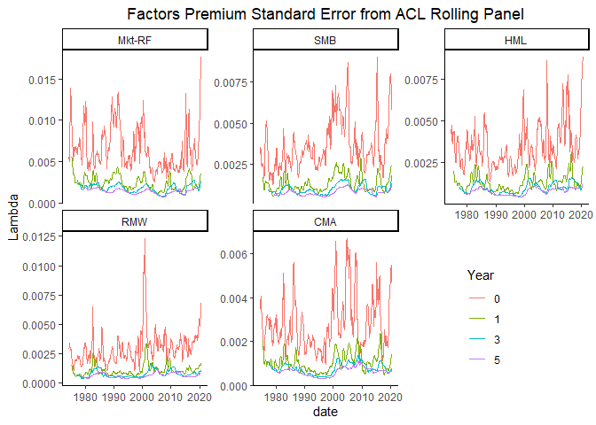<!-- --><!-- -->

From the figures above, it seems that with longer panel:

1.  the estimates of ACL and Fama Macbeth regression are converging

2.  the standard error of ACL and Fama Macbeth regression are converging

For any given length of Panel, ACL panel regression can produce lambda
with relatively low risk.

### S4-6-5 Plot Comparison when Estimates are Different

In this section, we will plot regressions again but indicating where
second step regression estimates are different.

<!-- --><!-- --><!-- --><!-- -->

We had the lambda estimations of Long-regression (T = a + b Beta + c
Periodic + d Noise + error), ACL regression(T = a + b Beta + error), and
Originial Second-pass regression (R = a + b Beta + error).

The shaded areas indicate when we have significantly different estimates
between a pair of methods. For example, red area indicates “Long
vs. ACL” which means long regression and ACL method produce
significantly different results.

The shaded areas are transparent. I chose “red, green, and blue” to have
them blend together. So, the light green area is where we only have
“original vs. ACL” differences. However, when we have dark blue, it
means that we have both green and blue, so we have “original vs. ACL”
and “Long vs. original” differences. When we get gray bar, it means all
there pairs of methods produce different estimates.

The black lines on the plots are: 1. The original Fama French 5 Factors
time series. 2. The coefficients of Noise Auxiliary Regression: N = a +
b Beta + error 3. The coefficients of Periodic Auxiliary Regression: P =
a + b Beta + error 4. The coefficients of ACL Regression: T = a + b
Beta + error

## S4-7 Other Test Portfolios under Filtering

In this session, we will apply the filter again to a new set of test
portfolios. Lu Zhang at Ohio State has provided a huge amount of these
test portfolios, and breaks them into some categories. We selected some
of these portfolios: Friction (30), Intangible (60), Investment (81),
Profitability (66), VVG (63).

### S4-7-1 Strength of each component

First, we would like to see whether a strong periodic component is
common in all testing portfolios.

The Strength of the trend is defined as:

}{Var(T_t+R_t)})")

The Strength of the seasonality (periodic) is defined as:

}{Var(S_t+R_t)})")

<table class="table table-striped" style="font-size: 10px; width: auto !important; margin-left: auto; margin-right: auto;">
<caption style="font-size: initial !important;">
Strength of Period \> Strength of Trend
</caption>
<thead>
<tr>
<th style="text-align:center;">
Type
</th>
<th style="text-align:center;">
Percentage
</th>
<th style="text-align:center;">
Number
</th>
</tr>
</thead>
<tbody>
<tr>
<td style="text-align:center;font-weight: bold;">
Friction
</td>
<td style="text-align:center;">
100%
</td>
<td style="text-align:center;">
30
</td>
</tr>
<tr>
<td style="text-align:center;font-weight: bold;">
Intangible
</td>
<td style="text-align:center;">
100%
</td>
<td style="text-align:center;">
60
</td>
</tr>
<tr>
<td style="text-align:center;font-weight: bold;">
Investment
</td>
<td style="text-align:center;">
100%
</td>
<td style="text-align:center;">
81
</td>
</tr>
<tr>
<td style="text-align:center;font-weight: bold;">
Profitability
</td>
<td style="text-align:center;">
100%
</td>
<td style="text-align:center;">
66
</td>
</tr>
<tr>
<td style="text-align:center;font-weight: bold;">
VVG
</td>
<td style="text-align:center;">
100%
</td>
<td style="text-align:center;">
63
</td>
</tr>
</tbody>
</table>

<!-- -->

As the table suggests, all of the test portfolios we have suffer from
strong periodic component (stronger than trend strength). This shows
that the ACL regression can be used in the general setting of ECC
estimation.

### S4-7-2 5-year Rolling FF5 Betas

In this section, we estimate the FF5 betas applying a 5-year rolling
window.

### S4-7-3 Second-pass and Auxilary Regressions

In this session, we will perform the second-pass and the same set of
Auxilary regressions as S4-6-1. Note that the Trend Auxilary regressoin
is also the ACL regression. Orignial is referring to the Fama Macbeth
second-pass regression.

<!-- --><!-- -->

    ## [1] "Proportion of siginificant F statistics"

    ## [1] 0.9731664

    ## [1] "Proportion of siginificant t statistics"

    ##    Mkt-RF       SMB       HML       RMW       CMA 
    ## 0.6314848 0.7191413 0.7370304 0.6332737 0.7137746

<!-- --><!-- -->

    ## [1] "Proportion of siginificant F statistics"

    ## [1] 0.9660107

    ## [1] "Proportion of siginificant t statistics"

    ##    Mkt-RF       SMB       HML       RMW       CMA 
    ## 0.6082290 0.6565295 0.7066190 0.6243292 0.6905188

<!-- --><!-- -->

    ## [1] "Proportion of siginificant F statistics"

    ## [1] 0.960644

    ## [1] "Proportion of siginificant t statistics"

    ##    Mkt-RF       SMB       HML       RMW       CMA 
    ## 0.6207513 0.7119857 0.7316637 0.6332737 0.7173524

<!-- --><!-- -->

    ## [1] "Proportion of siginificant F statistics"

    ## [1] 0.9892665

    ## [1] "Proportion of siginificant t statistics"

    ##    Mkt-RF       SMB       HML       RMW       CMA 
    ## 0.5617174 0.7459750 0.7567084 0.6225403 0.7513417

<table class="table table-striped" style="font-size: 10px; width: auto !important; margin-left: auto; margin-right: auto;">
<caption style="font-size: initial !important;">
Auxilary Regression Results for Other Portfolios
</caption>
<thead>
<tr>
<th style="text-align:center;">
Factors
</th>
<th style="text-align:center;">
Y_type
</th>
<th style="text-align:center;">
Stat
</th>
<th style="text-align:center;">
Estimate
</th>
<th style="text-align:center;">
T Stat
</th>
<th style="text-align:center;">
p value
</th>
</tr>
</thead>
<tbody>
<tr>
<td style="text-align:center;font-weight: bold;vertical-align: middle !important;" rowspan="24">
Mkt-RF
</td>
<td style="text-align:center;font-weight: bold;vertical-align: middle !important;" rowspan="6">
Trend
</td>
<td style="text-align:center;">
min
</td>
<td style="text-align:center;">
-0.0424174
</td>
<td style="text-align:center;">
-10.0714404
</td>
<td style="text-align:center;">
0.0000000
</td>
</tr>
<tr>
<td style="text-align:center;">
Q25
</td>
<td style="text-align:center;">
-0.0055314
</td>
<td style="text-align:center;">
-1.7553348
</td>
<td style="text-align:center;">
0.0000119
</td>
</tr>
<tr>
<td style="text-align:center;">
Q50
</td>
<td style="text-align:center;">
0.0011009
</td>
<td style="text-align:center;">
0.4353346
</td>
<td style="text-align:center;">
0.0181910
</td>
</tr>
<tr>
<td style="text-align:center;">
Q75
</td>
<td style="text-align:center;">
0.0080663
</td>
<td style="text-align:center;">
2.8638635
</td>
<td style="text-align:center;">
0.3976552
</td>
</tr>
<tr>
<td style="text-align:center;">
max
</td>
<td style="text-align:center;">
0.0482622
</td>
<td style="text-align:center;">
12.5887125
</td>
<td style="text-align:center;">
0.9945830
</td>
</tr>
<tr>
<td style="text-align:center;">
mean
</td>
<td style="text-align:center;">
0.0004947
</td>
<td style="text-align:center;">
0.3925077
</td>
<td style="text-align:center;">
0.2109804
</td>
</tr>
<tr>
<td style="text-align:center;font-weight: bold;vertical-align: middle !important;" rowspan="6">
Periodic
</td>
<td style="text-align:center;">
min
</td>
<td style="text-align:center;">
-0.0763323
</td>
<td style="text-align:center;">
-13.9577767
</td>
<td style="text-align:center;">
0.0000000
</td>
</tr>
<tr>
<td style="text-align:center;">
Q25
</td>
<td style="text-align:center;">
-0.0136128
</td>
<td style="text-align:center;">
-2.7772557
</td>
<td style="text-align:center;">
0.0000242
</td>
</tr>
<tr>
<td style="text-align:center;">
Q50
</td>
<td style="text-align:center;">
-0.0008673
</td>
<td style="text-align:center;">
-0.1153090
</td>
<td style="text-align:center;">
0.0103341
</td>
</tr>
<tr>
<td style="text-align:center;">
Q75
</td>
<td style="text-align:center;">
0.0137000
</td>
<td style="text-align:center;">
2.3949875
</td>
<td style="text-align:center;">
0.2492396
</td>
</tr>
<tr>
<td style="text-align:center;">
max
</td>
<td style="text-align:center;">
0.0860314
</td>
<td style="text-align:center;">
13.5856268
</td>
<td style="text-align:center;">
0.9998042
</td>
</tr>
<tr>
<td style="text-align:center;">
mean
</td>
<td style="text-align:center;">
-0.0000560
</td>
<td style="text-align:center;">
-0.0631450
</td>
<td style="text-align:center;">
0.1648707
</td>
</tr>
<tr>
<td style="text-align:center;font-weight: bold;vertical-align: middle !important;" rowspan="6">
Noise
</td>
<td style="text-align:center;">
min
</td>
<td style="text-align:center;">
-0.2271084
</td>
<td style="text-align:center;">
-23.1790686
</td>
<td style="text-align:center;">
0.0000000
</td>
</tr>
<tr>
<td style="text-align:center;">
Q25
</td>
<td style="text-align:center;">
-0.0219411
</td>
<td style="text-align:center;">
-2.8200580
</td>
<td style="text-align:center;">
0.0000124
</td>
</tr>
<tr>
<td style="text-align:center;">
Q50
</td>
<td style="text-align:center;">
-0.0000485
</td>
<td style="text-align:center;">
-0.0039452
</td>
<td style="text-align:center;">
0.0061125
</td>
</tr>
<tr>
<td style="text-align:center;">
Q75
</td>
<td style="text-align:center;">
0.0228860
</td>
<td style="text-align:center;">
2.7508720
</td>
<td style="text-align:center;">
0.2173288
</td>
</tr>
<tr>
<td style="text-align:center;">
max
</td>
<td style="text-align:center;">
0.1721614
</td>
<td style="text-align:center;">
18.6596663
</td>
<td style="text-align:center;">
0.9968549
</td>
</tr>
<tr>
<td style="text-align:center;">
mean
</td>
<td style="text-align:center;">
-0.0002092
</td>
<td style="text-align:center;">
-0.1011082
</td>
<td style="text-align:center;">
0.1568979
</td>
</tr>
<tr>
<td style="text-align:center;font-weight: bold;vertical-align: middle !important;" rowspan="6">
Original
</td>
<td style="text-align:center;">
min
</td>
<td style="text-align:center;">
-0.3028151
</td>
<td style="text-align:center;">
-30.4115671
</td>
<td style="text-align:center;">
0.0000000
</td>
</tr>
<tr>
<td style="text-align:center;">
Q25
</td>
<td style="text-align:center;">
-0.0234925
</td>
<td style="text-align:center;">
-2.6246538
</td>
<td style="text-align:center;">
0.0000035
</td>
</tr>
<tr>
<td style="text-align:center;">
Q50
</td>
<td style="text-align:center;">
0.0005594
</td>
<td style="text-align:center;">
0.0441336
</td>
<td style="text-align:center;">
0.0076990
</td>
</tr>
<tr>
<td style="text-align:center;">
Q75
</td>
<td style="text-align:center;">
0.0273094
</td>
<td style="text-align:center;">
2.7647366
</td>
<td style="text-align:center;">
0.1620444
</td>
</tr>
<tr>
<td style="text-align:center;">
max
</td>
<td style="text-align:center;">
0.2685491
</td>
<td style="text-align:center;">
20.3208125
</td>
<td style="text-align:center;">
0.9978700
</td>
</tr>
<tr>
<td style="text-align:center;">
mean
</td>
<td style="text-align:center;">
0.0002295
</td>
<td style="text-align:center;">
-0.0896088
</td>
<td style="text-align:center;">
0.1376343
</td>
</tr>
<tr>
<td style="text-align:center;font-weight: bold;vertical-align: middle !important;" rowspan="24">
SMB
</td>
<td style="text-align:center;font-weight: bold;vertical-align: middle !important;" rowspan="6">
Trend
</td>
<td style="text-align:center;">
min
</td>
<td style="text-align:center;">
-0.0224870
</td>
<td style="text-align:center;">
-12.4201395
</td>
<td style="text-align:center;">
0.0000000
</td>
</tr>
<tr>
<td style="text-align:center;">
Q25
</td>
<td style="text-align:center;">
-0.0033968
</td>
<td style="text-align:center;">
-2.6851291
</td>
<td style="text-align:center;">
0.0000000
</td>
</tr>
<tr>
<td style="text-align:center;">
Q50
</td>
<td style="text-align:center;">
0.0011931
</td>
<td style="text-align:center;">
0.9187186
</td>
<td style="text-align:center;">
0.0000615
</td>
</tr>
<tr>
<td style="text-align:center;">
Q75
</td>
<td style="text-align:center;">
0.0066437
</td>
<td style="text-align:center;">
4.9123736
</td>
<td style="text-align:center;">
0.0511689
</td>
</tr>
<tr>
<td style="text-align:center;">
max
</td>
<td style="text-align:center;">
0.0180109
</td>
<td style="text-align:center;">
11.0162832
</td>
<td style="text-align:center;">
0.9996359
</td>
</tr>
<tr>
<td style="text-align:center;">
mean
</td>
<td style="text-align:center;">
0.0014000
</td>
<td style="text-align:center;">
0.7741361
</td>
<td style="text-align:center;">
0.1005154
</td>
</tr>
<tr>
<td style="text-align:center;font-weight: bold;vertical-align: middle !important;" rowspan="6">
Periodic
</td>
<td style="text-align:center;">
min
</td>
<td style="text-align:center;">
-0.0540334
</td>
<td style="text-align:center;">
-21.3731681
</td>
<td style="text-align:center;">
0.0000000
</td>
</tr>
<tr>
<td style="text-align:center;">
Q25
</td>
<td style="text-align:center;">
-0.0077479
</td>
<td style="text-align:center;">
-3.1438580
</td>
<td style="text-align:center;">
0.0000001
</td>
</tr>
<tr>
<td style="text-align:center;">
Q50
</td>
<td style="text-align:center;">
0.0002545
</td>
<td style="text-align:center;">
0.1522616
</td>
<td style="text-align:center;">
0.0025528
</td>
</tr>
<tr>
<td style="text-align:center;">
Q75
</td>
<td style="text-align:center;">
0.0071378
</td>
<td style="text-align:center;">
2.9922777
</td>
<td style="text-align:center;">
0.1432749
</td>
</tr>
<tr>
<td style="text-align:center;">
max
</td>
<td style="text-align:center;">
0.0755784
</td>
<td style="text-align:center;">
34.3209960
</td>
<td style="text-align:center;">
0.9902291
</td>
</tr>
<tr>
<td style="text-align:center;">
mean
</td>
<td style="text-align:center;">
0.0001207
</td>
<td style="text-align:center;">
0.0075373
</td>
<td style="text-align:center;">
0.1339217
</td>
</tr>
<tr>
<td style="text-align:center;font-weight: bold;vertical-align: middle !important;" rowspan="6">
Noise
</td>
<td style="text-align:center;">
min
</td>
<td style="text-align:center;">
-0.0858665
</td>
<td style="text-align:center;">
-17.1414976
</td>
<td style="text-align:center;">
0.0000000
</td>
</tr>
<tr>
<td style="text-align:center;">
Q25
</td>
<td style="text-align:center;">
-0.0120812
</td>
<td style="text-align:center;">
-3.2726939
</td>
<td style="text-align:center;">
0.0000000
</td>
</tr>
<tr>
<td style="text-align:center;">
Q50
</td>
<td style="text-align:center;">
-0.0005044
</td>
<td style="text-align:center;">
-0.1705685
</td>
<td style="text-align:center;">
0.0011501
</td>
</tr>
<tr>
<td style="text-align:center;">
Q75
</td>
<td style="text-align:center;">
0.0117289
</td>
<td style="text-align:center;">
3.2785705
</td>
<td style="text-align:center;">
0.0909377
</td>
</tr>
<tr>
<td style="text-align:center;">
max
</td>
<td style="text-align:center;">
0.1423391
</td>
<td style="text-align:center;">
24.6930618
</td>
<td style="text-align:center;">
0.9853423
</td>
</tr>
<tr>
<td style="text-align:center;">
mean
</td>
<td style="text-align:center;">
0.0000790
</td>
<td style="text-align:center;">
-0.0387331
</td>
<td style="text-align:center;">
0.1177467
</td>
</tr>
<tr>
<td style="text-align:center;font-weight: bold;vertical-align: middle !important;" rowspan="6">
Original
</td>
<td style="text-align:center;">
min
</td>
<td style="text-align:center;">
-0.1273334
</td>
<td style="text-align:center;">
-21.7084607
</td>
<td style="text-align:center;">
0.0000000
</td>
</tr>
<tr>
<td style="text-align:center;">
Q25
</td>
<td style="text-align:center;">
-0.0135619
</td>
<td style="text-align:center;">
-3.4252351
</td>
<td style="text-align:center;">
0.0000000
</td>
</tr>
<tr>
<td style="text-align:center;">
Q50
</td>
<td style="text-align:center;">
0.0006881
</td>
<td style="text-align:center;">
0.1531817
</td>
<td style="text-align:center;">
0.0001962
</td>
</tr>
<tr>
<td style="text-align:center;">
Q75
</td>
<td style="text-align:center;">
0.0179969
</td>
<td style="text-align:center;">
4.2108726
</td>
<td style="text-align:center;">
0.1076782
</td>
</tr>
<tr>
<td style="text-align:center;">
max
</td>
<td style="text-align:center;">
0.1854985
</td>
<td style="text-align:center;">
34.2019258
</td>
<td style="text-align:center;">
0.9964796
</td>
</tr>
<tr>
<td style="text-align:center;">
mean
</td>
<td style="text-align:center;">
0.0015997
</td>
<td style="text-align:center;">
0.2737845
</td>
<td style="text-align:center;">
0.1250731
</td>
</tr>
<tr>
<td style="text-align:center;font-weight: bold;vertical-align: middle !important;" rowspan="24">
HML
</td>
<td style="text-align:center;font-weight: bold;vertical-align: middle !important;" rowspan="6">
Trend
</td>
<td style="text-align:center;">
min
</td>
<td style="text-align:center;">
-0.0768238
</td>
<td style="text-align:center;">
-23.1490790
</td>
<td style="text-align:center;">
0.0000000
</td>
</tr>
<tr>
<td style="text-align:center;">
Q25
</td>
<td style="text-align:center;">
-0.0045141
</td>
<td style="text-align:center;">
-3.8756190
</td>
<td style="text-align:center;">
0.0000000
</td>
</tr>
<tr>
<td style="text-align:center;">
Q50
</td>
<td style="text-align:center;">
0.0007921
</td>
<td style="text-align:center;">
0.7505187
</td>
<td style="text-align:center;">
0.0000045
</td>
</tr>
<tr>
<td style="text-align:center;">
Q75
</td>
<td style="text-align:center;">
0.0059828
</td>
<td style="text-align:center;">
6.1456087
</td>
<td style="text-align:center;">
0.0413342
</td>
</tr>
<tr>
<td style="text-align:center;">
max
</td>
<td style="text-align:center;">
0.0312503
</td>
<td style="text-align:center;">
25.8868857
</td>
<td style="text-align:center;">
0.9976890
</td>
</tr>
<tr>
<td style="text-align:center;">
mean
</td>
<td style="text-align:center;">
0.0001080
</td>
<td style="text-align:center;">
1.1217791
</td>
<td style="text-align:center;">
0.0930044
</td>
</tr>
<tr>
<td style="text-align:center;font-weight: bold;vertical-align: middle !important;" rowspan="6">
Periodic
</td>
<td style="text-align:center;">
min
</td>
<td style="text-align:center;">
-0.0589381
</td>
<td style="text-align:center;">
-29.0868594
</td>
<td style="text-align:center;">
0.0000000
</td>
</tr>
<tr>
<td style="text-align:center;">
Q25
</td>
<td style="text-align:center;">
-0.0076776
</td>
<td style="text-align:center;">
-3.6476437
</td>
<td style="text-align:center;">
0.0000000
</td>
</tr>
<tr>
<td style="text-align:center;">
Q50
</td>
<td style="text-align:center;">
0.0000918
</td>
<td style="text-align:center;">
0.0310594
</td>
<td style="text-align:center;">
0.0001374
</td>
</tr>
<tr>
<td style="text-align:center;">
Q75
</td>
<td style="text-align:center;">
0.0078695
</td>
<td style="text-align:center;">
4.0613623
</td>
<td style="text-align:center;">
0.0818809
</td>
</tr>
<tr>
<td style="text-align:center;">
max
</td>
<td style="text-align:center;">
0.0525076
</td>
<td style="text-align:center;">
30.1615497
</td>
<td style="text-align:center;">
0.9752475
</td>
</tr>
<tr>
<td style="text-align:center;">
mean
</td>
<td style="text-align:center;">
-0.0001205
</td>
<td style="text-align:center;">
-0.0281111
</td>
<td style="text-align:center;">
0.1054837
</td>
</tr>
<tr>
<td style="text-align:center;font-weight: bold;vertical-align: middle !important;" rowspan="6">
Noise
</td>
<td style="text-align:center;">
min
</td>
<td style="text-align:center;">
-0.1192794
</td>
<td style="text-align:center;">
-30.5177393
</td>
<td style="text-align:center;">
0.0000000
</td>
</tr>
<tr>
<td style="text-align:center;">
Q25
</td>
<td style="text-align:center;">
-0.0119810
</td>
<td style="text-align:center;">
-3.6981283
</td>
<td style="text-align:center;">
0.0000000
</td>
</tr>
<tr>
<td style="text-align:center;">
Q50
</td>
<td style="text-align:center;">
-0.0008521
</td>
<td style="text-align:center;">
-0.2611058
</td>
<td style="text-align:center;">
0.0002085
</td>
</tr>
<tr>
<td style="text-align:center;">
Q75
</td>
<td style="text-align:center;">
0.0116446
</td>
<td style="text-align:center;">
3.9094501
</td>
<td style="text-align:center;">
0.0746790
</td>
</tr>
<tr>
<td style="text-align:center;">
max
</td>
<td style="text-align:center;">
0.0880867
</td>
<td style="text-align:center;">
24.5395759
</td>
<td style="text-align:center;">
0.9743048
</td>
</tr>
<tr>
<td style="text-align:center;">
mean
</td>
<td style="text-align:center;">
-0.0002862
</td>
<td style="text-align:center;">
-0.0939937
</td>
<td style="text-align:center;">
0.1143986
</td>
</tr>
<tr>
<td style="text-align:center;font-weight: bold;vertical-align: middle !important;" rowspan="6">
Original
</td>
<td style="text-align:center;">
min
</td>
<td style="text-align:center;">
-0.2100010
</td>
<td style="text-align:center;">
-42.9862954
</td>
<td style="text-align:center;">
0.0000000
</td>
</tr>
<tr>
<td style="text-align:center;">
Q25
</td>
<td style="text-align:center;">
-0.0150061
</td>
<td style="text-align:center;">
-3.9644469
</td>
<td style="text-align:center;">
0.0000000
</td>
</tr>
<tr>
<td style="text-align:center;">
Q50
</td>
<td style="text-align:center;">
0.0000577
</td>
<td style="text-align:center;">
0.0138704
</td>
<td style="text-align:center;">
0.0000510
</td>
</tr>
<tr>
<td style="text-align:center;">
Q75
</td>
<td style="text-align:center;">
0.0150988
</td>
<td style="text-align:center;">
4.1470844
</td>
<td style="text-align:center;">
0.0576455
</td>
</tr>
<tr>
<td style="text-align:center;">
max
</td>
<td style="text-align:center;">
0.1233449
</td>
<td style="text-align:center;">
25.6605540
</td>
<td style="text-align:center;">
0.9889427
</td>
</tr>
<tr>
<td style="text-align:center;">
mean
</td>
<td style="text-align:center;">
-0.0002987
</td>
<td style="text-align:center;">
0.1451109
</td>
<td style="text-align:center;">
0.1066770
</td>
</tr>
<tr>
<td style="text-align:center;font-weight: bold;vertical-align: middle !important;" rowspan="24">
RMW
</td>
<td style="text-align:center;font-weight: bold;vertical-align: middle !important;" rowspan="6">
Trend
</td>
<td style="text-align:center;">
min
</td>
<td style="text-align:center;">
-0.0200597
</td>
<td style="text-align:center;">
-12.1474571
</td>
<td style="text-align:center;">
0.0000000
</td>
</tr>
<tr>
<td style="text-align:center;">
Q25
</td>
<td style="text-align:center;">
-0.0030460
</td>
<td style="text-align:center;">
-2.8147657
</td>
<td style="text-align:center;">
0.0000006
</td>
</tr>
<tr>
<td style="text-align:center;">
Q50
</td>
<td style="text-align:center;">
-0.0001290
</td>
<td style="text-align:center;">
-0.1308248
</td>
<td style="text-align:center;">
0.0032414
</td>
</tr>
<tr>
<td style="text-align:center;">
Q75
</td>
<td style="text-align:center;">
0.0033298
</td>
<td style="text-align:center;">
3.0648352
</td>
<td style="text-align:center;">
0.2450576
</td>
</tr>
<tr>
<td style="text-align:center;">
max
</td>
<td style="text-align:center;">
0.0276064
</td>
<td style="text-align:center;">
14.3888811
</td>
<td style="text-align:center;">
0.9921308
</td>
</tr>
<tr>
<td style="text-align:center;">
mean
</td>
<td style="text-align:center;">
0.0003334
</td>
<td style="text-align:center;">
0.0695775
</td>
<td style="text-align:center;">
0.1673272
</td>
</tr>
<tr>
<td style="text-align:center;font-weight: bold;vertical-align: middle !important;" rowspan="6">
Periodic
</td>
<td style="text-align:center;">
min
</td>
<td style="text-align:center;">
-0.0386570
</td>
<td style="text-align:center;">
-15.6746762
</td>
<td style="text-align:center;">
0.0000000
</td>
</tr>
<tr>
<td style="text-align:center;">
Q25
</td>
<td style="text-align:center;">
-0.0049669
</td>
<td style="text-align:center;">
-2.8049549
</td>
<td style="text-align:center;">
0.0000034
</td>
</tr>
<tr>
<td style="text-align:center;">
Q50
</td>
<td style="text-align:center;">
0.0003593
</td>
<td style="text-align:center;">
0.2172773
</td>
<td style="text-align:center;">
0.0043366
</td>
</tr>
<tr>
<td style="text-align:center;">
Q75
</td>
<td style="text-align:center;">
0.0055861
</td>
<td style="text-align:center;">
2.9197555
</td>
<td style="text-align:center;">
0.2346908
</td>
</tr>
<tr>
<td style="text-align:center;">
max
</td>
<td style="text-align:center;">
0.0369123
</td>
<td style="text-align:center;">
20.4715795
</td>
<td style="text-align:center;">
0.9967126
</td>
</tr>
<tr>
<td style="text-align:center;">
mean
</td>
<td style="text-align:center;">
-0.0000298
</td>
<td style="text-align:center;">
0.0405801
</td>
<td style="text-align:center;">
0.1692257
</td>
</tr>
<tr>
<td style="text-align:center;font-weight: bold;vertical-align: middle !important;" rowspan="6">
Noise
</td>
<td style="text-align:center;">
min
</td>
<td style="text-align:center;">
-0.1480806
</td>
<td style="text-align:center;">
-29.1084888
</td>
<td style="text-align:center;">
0.0000000
</td>
</tr>
<tr>
<td style="text-align:center;">
Q25
</td>
<td style="text-align:center;">
-0.0082806
</td>
<td style="text-align:center;">
-2.6752435
</td>
<td style="text-align:center;">
0.0000043
</td>
</tr>
<tr>
<td style="text-align:center;">
Q50
</td>
<td style="text-align:center;">
-0.0005965
</td>
<td style="text-align:center;">
-0.2125250
</td>
<td style="text-align:center;">
0.0068822
</td>
</tr>
<tr>
<td style="text-align:center;">
Q75
</td>
<td style="text-align:center;">
0.0078933
</td>
<td style="text-align:center;">
2.8059364
</td>
<td style="text-align:center;">
0.1985535
</td>
</tr>
<tr>
<td style="text-align:center;">
max
</td>
<td style="text-align:center;">
0.1098604
</td>
<td style="text-align:center;">
18.1413914
</td>
<td style="text-align:center;">
0.9990649
</td>
</tr>
<tr>
<td style="text-align:center;">
mean
</td>
<td style="text-align:center;">
-0.0000825
</td>
<td style="text-align:center;">
-0.0182239
</td>
<td style="text-align:center;">
0.1389839
</td>
</tr>
<tr>
<td style="text-align:center;font-weight: bold;vertical-align: middle !important;" rowspan="6">
Original
</td>
<td style="text-align:center;">
min
</td>
<td style="text-align:center;">
-0.2055540
</td>
<td style="text-align:center;">
-41.5268012
</td>
<td style="text-align:center;">
0.0000000
</td>
</tr>
<tr>
<td style="text-align:center;">
Q25
</td>
<td style="text-align:center;">
-0.0102533
</td>
<td style="text-align:center;">
-2.8409467
</td>
<td style="text-align:center;">
0.0000016
</td>
</tr>
<tr>
<td style="text-align:center;">
Q50
</td>
<td style="text-align:center;">
-0.0005593
</td>
<td style="text-align:center;">
-0.1523737
</td>
<td style="text-align:center;">
0.0062296
</td>
</tr>
<tr>
<td style="text-align:center;">
Q75
</td>
<td style="text-align:center;">
0.0102646
</td>
<td style="text-align:center;">
2.6304769
</td>
<td style="text-align:center;">
0.1794076
</td>
</tr>
<tr>
<td style="text-align:center;">
max
</td>
<td style="text-align:center;">
0.1458251
</td>
<td style="text-align:center;">
20.6931160
</td>
<td style="text-align:center;">
0.9981020
</td>
</tr>
<tr>
<td style="text-align:center;">
mean
</td>
<td style="text-align:center;">
0.0002212
</td>
<td style="text-align:center;">
-0.0271513
</td>
<td style="text-align:center;">
0.1516328
</td>
</tr>
<tr>
<td style="text-align:center;font-weight: bold;vertical-align: middle !important;" rowspan="24">
CMA
</td>
<td style="text-align:center;font-weight: bold;vertical-align: middle !important;" rowspan="6">
Trend
</td>
<td style="text-align:center;">
min
</td>
<td style="text-align:center;">
-0.0172650
</td>
<td style="text-align:center;">
-12.7369987
</td>
<td style="text-align:center;">
0.0000000
</td>
</tr>
<tr>
<td style="text-align:center;">
Q25
</td>
<td style="text-align:center;">
-0.0024544
</td>
<td style="text-align:center;">
-2.8504983
</td>
<td style="text-align:center;">
0.0000000
</td>
</tr>
<tr>
<td style="text-align:center;">
Q50
</td>
<td style="text-align:center;">
0.0014575
</td>
<td style="text-align:center;">
1.6412282
</td>
<td style="text-align:center;">
0.0000460
</td>
</tr>
<tr>
<td style="text-align:center;">
Q75
</td>
<td style="text-align:center;">
0.0046704
</td>
<td style="text-align:center;">
5.0855574
</td>
<td style="text-align:center;">
0.0465475
</td>
</tr>
<tr>
<td style="text-align:center;">
max
</td>
<td style="text-align:center;">
0.0200050
</td>
<td style="text-align:center;">
14.9317649
</td>
<td style="text-align:center;">
0.9840900
</td>
</tr>
<tr>
<td style="text-align:center;">
mean
</td>
<td style="text-align:center;">
0.0011180
</td>
<td style="text-align:center;">
1.2319080
</td>
<td style="text-align:center;">
0.0936055
</td>
</tr>
<tr>
<td style="text-align:center;font-weight: bold;vertical-align: middle !important;" rowspan="6">
Periodic
</td>
<td style="text-align:center;">
min
</td>
<td style="text-align:center;">
-0.0311253
</td>
<td style="text-align:center;">
-15.5170563
</td>
<td style="text-align:center;">
0.0000000
</td>
</tr>
<tr>
<td style="text-align:center;">
Q25
</td>
<td style="text-align:center;">
-0.0050754
</td>
<td style="text-align:center;">
-3.2032413
</td>
<td style="text-align:center;">
0.0000000
</td>
</tr>
<tr>
<td style="text-align:center;">
Q50
</td>
<td style="text-align:center;">
-0.0002656
</td>
<td style="text-align:center;">
-0.2121648
</td>
<td style="text-align:center;">
0.0011092
</td>
</tr>
<tr>
<td style="text-align:center;">
Q75
</td>
<td style="text-align:center;">
0.0054121
</td>
<td style="text-align:center;">
3.4429371
</td>
<td style="text-align:center;">
0.1111236
</td>
</tr>
<tr>
<td style="text-align:center;">
max
</td>
<td style="text-align:center;">
0.0327982
</td>
<td style="text-align:center;">
18.3321983
</td>
<td style="text-align:center;">
0.9951381
</td>
</tr>
<tr>
<td style="text-align:center;">
mean
</td>
<td style="text-align:center;">
0.0001043
</td>
<td style="text-align:center;">
0.1728117
</td>
<td style="text-align:center;">
0.1330930
</td>
</tr>
<tr>
<td style="text-align:center;font-weight: bold;vertical-align: middle !important;" rowspan="6">
Noise
</td>
<td style="text-align:center;">
min
</td>
<td style="text-align:center;">
-0.0929242
</td>
<td style="text-align:center;">
-19.5949822
</td>
<td style="text-align:center;">
0.0000000
</td>
</tr>
<tr>
<td style="text-align:center;">
Q25
</td>
<td style="text-align:center;">
-0.0074041
</td>
<td style="text-align:center;">
-3.1376984
</td>
<td style="text-align:center;">
0.0000000
</td>
</tr>
<tr>
<td style="text-align:center;">
Q50
</td>
<td style="text-align:center;">
0.0000597
</td>
<td style="text-align:center;">
0.0280853
</td>
<td style="text-align:center;">
0.0006815
</td>
</tr>
<tr>
<td style="text-align:center;">
Q75
</td>
<td style="text-align:center;">
0.0092577
</td>
<td style="text-align:center;">
3.6064523
</td>
<td style="text-align:center;">
0.0801522
</td>
</tr>
<tr>
<td style="text-align:center;">
max
</td>
<td style="text-align:center;">
0.0861939
</td>
<td style="text-align:center;">
22.9259997
</td>
<td style="text-align:center;">
0.9810112
</td>
</tr>
<tr>
<td style="text-align:center;">
mean
</td>
<td style="text-align:center;">
0.0004581
</td>
<td style="text-align:center;">
0.1394822
</td>
<td style="text-align:center;">
0.1097210
</td>
</tr>
<tr>
<td style="text-align:center;font-weight: bold;vertical-align: middle !important;" rowspan="6">
Original
</td>
<td style="text-align:center;">
min
</td>
<td style="text-align:center;">
-0.1029742
</td>
<td style="text-align:center;">
-22.6585572
</td>
<td style="text-align:center;">
0.0000000
</td>
</tr>
<tr>
<td style="text-align:center;">
Q25
</td>
<td style="text-align:center;">
-0.0094183
</td>
<td style="text-align:center;">
-3.2026969
</td>
<td style="text-align:center;">
0.0000000
</td>
</tr>
<tr>
<td style="text-align:center;">
Q50
</td>
<td style="text-align:center;">
0.0014734
</td>
<td style="text-align:center;">
0.4599165
</td>
<td style="text-align:center;">
0.0002850
</td>
</tr>
<tr>
<td style="text-align:center;">
Q75
</td>
<td style="text-align:center;">
0.0125810
</td>
<td style="text-align:center;">
3.9697977
</td>
<td style="text-align:center;">
0.0842672
</td>
</tr>
<tr>
<td style="text-align:center;">
max
</td>
<td style="text-align:center;">
0.0969707
</td>
<td style="text-align:center;">
24.2520622
</td>
<td style="text-align:center;">
0.9772304
</td>
</tr>
<tr>
<td style="text-align:center;">
mean
</td>
<td style="text-align:center;">
0.0016803
</td>
<td style="text-align:center;">
0.4723094
</td>
<td style="text-align:center;">
0.1254085
</td>
</tr>
</tbody>
</table>
<table class="table table-striped" style="font-size: 10px; width: auto !important; margin-left: auto; margin-right: auto;">
<caption style="font-size: initial !important;">
Auxilary Regression Coefficient Significance Percentage for Other
Portfolios
</caption>
<thead>
<tr>
<th style="text-align:center;">
Y_type
</th>
<th style="text-align:center;">
Mkt-RF
</th>
<th style="text-align:center;">
SMB
</th>
<th style="text-align:center;">
HML
</th>
<th style="text-align:center;">
RMW
</th>
<th style="text-align:center;">
CMA
</th>
</tr>
</thead>
<tbody>
<tr>
<td style="text-align:center;font-weight: bold;">
Trend
</td>
<td style="text-align:center;">
0.5617174
</td>
<td style="text-align:center;">
0.7459750
</td>
<td style="text-align:center;">
0.7567084
</td>
<td style="text-align:center;">
0.6225403
</td>
<td style="text-align:center;">
0.7513417
</td>
</tr>
<tr>
<td style="text-align:center;font-weight: bold;">
Periodic
</td>
<td style="text-align:center;">
0.6082290
</td>
<td style="text-align:center;">
0.6565295
</td>
<td style="text-align:center;">
0.7066190
</td>
<td style="text-align:center;">
0.6243292
</td>
<td style="text-align:center;">
0.6905188
</td>
</tr>
<tr>
<td style="text-align:center;font-weight: bold;">
Noise
</td>
<td style="text-align:center;">
0.6207513
</td>
<td style="text-align:center;">
0.7119857
</td>
<td style="text-align:center;">
0.7316637
</td>
<td style="text-align:center;">
0.6332737
</td>
<td style="text-align:center;">
0.7173524
</td>
</tr>
<tr>
<td style="text-align:center;font-weight: bold;">
Original
</td>
<td style="text-align:center;">
0.6314848
</td>
<td style="text-align:center;">
0.7191413
</td>
<td style="text-align:center;">
0.7370304
</td>
<td style="text-align:center;">
0.6332737
</td>
<td style="text-align:center;">
0.7137746
</td>
</tr>
</tbody>
</table>

    ## [1] "Auxilary Panel Regressoin for Other Portfolios"

    ## [1] "Original"

    ## 
    ## t test of coefficients:
    ## 
    ##                Estimate  Std. Error t value  Pr(>|t|)    
    ## (Intercept)  0.94627070  0.12899865  7.3355 2.219e-13 ***
    ## `Mkt-RF`     0.00099360  0.00131431  0.7560    0.4497    
    ## SMB         -0.00073300  0.00065341 -1.1218    0.2619    
    ## HML          0.00017400  0.00051912  0.3352    0.7375    
    ## RMW         -0.00249825  0.00050840 -4.9140 8.934e-07 ***
    ## CMA          0.00050294  0.00043232  1.1633    0.2447    
    ## ---
    ## Signif. codes:  0 '***' 0.001 '**' 0.01 '*' 0.05 '.' 0.1 ' ' 1

    ## [1] "Trend"

    ## 
    ## t test of coefficients:
    ## 
    ##                Estimate  Std. Error  t value  Pr(>|t|)    
    ## (Intercept)  0.76408671  0.03259413  23.4425 < 2.2e-16 ***
    ## `Mkt-RF`     0.00279392  0.00033031   8.4586 < 2.2e-16 ***
    ## SMB         -0.00127561  0.00015686  -8.1323 4.242e-16 ***
    ## HML          0.00028996  0.00012928   2.2428 0.0249080 *  
    ## RMW         -0.00171133  0.00012324 -13.8857 < 2.2e-16 ***
    ## CMA          0.00038312  0.00010704   3.5794 0.0003445 ***
    ## ---
    ## Signif. codes:  0 '***' 0.001 '**' 0.01 '*' 0.05 '.' 0.1 ' ' 1

    ## [1] "Periodic (Seasonal)"

    ## 
    ## t test of coefficients:
    ## 
    ##                Estimate  Std. Error t value Pr(>|t|)
    ## (Intercept)  6.1586e-02  5.9737e-02  1.0310   0.3026
    ## `Mkt-RF`    -5.6136e-04  6.0930e-04 -0.9213   0.3569
    ## SMB          2.4430e-04  3.1213e-04  0.7827   0.4338
    ## HML         -6.6634e-05  2.4656e-04 -0.2703   0.7870
    ## RMW         -1.7248e-04  2.3793e-04 -0.7249   0.4685
    ## CMA         -5.1322e-05  1.9794e-04 -0.2593   0.7954

    ## [1] "Noise"

    ## 
    ## t test of coefficients:
    ## 
    ##                Estimate  Std. Error t value Pr(>|t|)
    ## (Intercept)  1.2060e-01  9.6031e-02  1.2558   0.2092
    ## `Mkt-RF`    -1.2389e-03  9.7513e-04 -1.2705   0.2039
    ## SMB          2.9831e-04  4.9014e-04  0.6086   0.5428
    ## HML         -4.9326e-05  3.8374e-04 -0.1285   0.8977
    ## RMW         -6.1444e-04  3.8084e-04 -1.6134   0.1067
    ## CMA          1.7113e-04  3.2658e-04  0.5240   0.6003

We get similar results as before, only that at each t, all factors are
significant in the auxilary regressions more. The Panel regression still
suggests that the trend should be explained by the factors while we do
not have enough evidence to support that the other components (Noise,
Periodic) are explained by the factors. This still validates our
Approach of ACL regression.

### S4-7-4 Long-regression and Comparisons

In this session, we present the longer version of second step
regression, where

We would use the result of this longer version regression to compare
with the original Fama Macbeth second step regression to test whether
periodic and noise terms would affect the regression result.

<!-- --><!-- -->

    ## [1] "Proportion of siginificant F statistics for Other Portfolio Long Regression"

    ## [1] 0.9982111

    ## [1] "Proportion of siginificant t statistics for Other Portfolio Long Regression"

    ##  Periodic     Noise    Mkt-RF       SMB       HML       RMW       CMA 
    ## 0.4812165 0.4973166 0.5402504 0.7048301 0.7638640 0.6153846 0.7316637

Similarly, the proportion of significant lambda numbers is closer to the
ACL regression (or the trend auxiliary regression).

Now, let’s compare the long-regression lambdas with the original
second-path result:

<table class="table table-striped" style="font-size: 10px; width: auto !important; margin-left: auto; margin-right: auto;">
<caption style="font-size: initial !important;">
Long vs. Original Regression Results for Other Portfolios
</caption>
<thead>
<tr>
<th style="text-align:center;">
Factors
</th>
<th style="text-align:center;">
Stat
</th>
<th style="text-align:center;">
Long_Estimate
</th>
<th style="text-align:center;">
Long_Std. Error
</th>
<th style="text-align:center;">
Original_Estimate
</th>
<th style="text-align:center;">
Original_Std. Error
</th>
<th style="text-align:center;">
Diff_Estimate
</th>
<th style="text-align:center;">
Diff_Std. Error
</th>
<th style="text-align:center;">
Diff_t\_stat
</th>
<th style="text-align:center;">
Diff_P\_value
</th>
</tr>
</thead>
<tbody>
<tr>
<td style="text-align:center;font-weight: bold;vertical-align: middle !important;" rowspan="6">
Mkt-RF
</td>
<td style="text-align:center;font-weight: bold;">
min
</td>
<td style="text-align:center;">
-0.0489795
</td>
<td style="text-align:center;">
0.0011214
</td>
<td style="text-align:center;">
-0.3028151
</td>
<td style="text-align:center;">
0.0070778
</td>
<td style="text-align:center;">
-0.2727110
</td>
<td style="text-align:center;">
-0.0602657
</td>
<td style="text-align:center;">
-27.4242540
</td>
<td style="text-align:center;">
0.0000000
</td>
</tr>
<tr>
<td style="text-align:center;font-weight: bold;">
Q25
</td>
<td style="text-align:center;">
-0.0060088
</td>
<td style="text-align:center;">
0.0024814
</td>
<td style="text-align:center;">
-0.0238195
</td>
<td style="text-align:center;">
0.0178901
</td>
<td style="text-align:center;">
-0.0256298
</td>
<td style="text-align:center;">
-0.0257277
</td>
<td style="text-align:center;">
-1.1919385
</td>
<td style="text-align:center;">
0.0867676
</td>
</tr>
<tr>
<td style="text-align:center;font-weight: bold;">
Q50
</td>
<td style="text-align:center;">
0.0010847
</td>
<td style="text-align:center;">
0.0031302
</td>
<td style="text-align:center;">
0.0005594
</td>
<td style="text-align:center;">
0.0225425
</td>
<td style="text-align:center;">
0.0022337
</td>
<td style="text-align:center;">
-0.0191003
</td>
<td style="text-align:center;">
-0.1300740
</td>
<td style="text-align:center;">
0.5517344
</td>
</tr>
<tr>
<td style="text-align:center;font-weight: bold;">
Q75
</td>
<td style="text-align:center;">
0.0073548
</td>
<td style="text-align:center;">
0.0038895
</td>
<td style="text-align:center;">
0.0278059
</td>
<td style="text-align:center;">
0.0292714
</td>
<td style="text-align:center;">
0.0235380
</td>
<td style="text-align:center;">
-0.0146862
</td>
<td style="text-align:center;">
1.3618018
</td>
<td style="text-align:center;">
0.8832306
</td>
</tr>
<tr>
<td style="text-align:center;font-weight: bold;">
max
</td>
<td style="text-align:center;">
0.0419978
</td>
<td style="text-align:center;">
0.0128998
</td>
<td style="text-align:center;">
0.2685491
</td>
<td style="text-align:center;">
0.0647344
</td>
<td style="text-align:center;">
0.2723515
</td>
<td style="text-align:center;">
-0.0056584
</td>
<td style="text-align:center;">
21.0951020
</td>
<td style="text-align:center;">
1.0000000
</td>
</tr>
<tr>
<td style="text-align:center;font-weight: bold;">
mean
</td>
<td style="text-align:center;">
0.0000190
</td>
<td style="text-align:center;">
0.0033136
</td>
<td style="text-align:center;">
0.0002214
</td>
<td style="text-align:center;">
0.0241975
</td>
<td style="text-align:center;">
-0.0002025
</td>
<td style="text-align:center;">
-0.0208839
</td>
<td style="text-align:center;">
-0.0563401
</td>
<td style="text-align:center;">
0.5111281
</td>
</tr>
<tr>
<td style="text-align:center;font-weight: bold;vertical-align: middle !important;" rowspan="6">
SMB
</td>
<td style="text-align:center;font-weight: bold;">
min
</td>
<td style="text-align:center;">
-0.0228123
</td>
<td style="text-align:center;">
0.0005739
</td>
<td style="text-align:center;">
-0.1273334
</td>
<td style="text-align:center;">
0.0042591
</td>
<td style="text-align:center;">
-0.1496203
</td>
<td style="text-align:center;">
-0.0367700
</td>
<td style="text-align:center;">
-20.0855034
</td>
<td style="text-align:center;">
0.0000000
</td>
</tr>
<tr>
<td style="text-align:center;font-weight: bold;">
Q25
</td>
<td style="text-align:center;">
-0.0031680
</td>
<td style="text-align:center;">
0.0011558
</td>
<td style="text-align:center;">
-0.0135559
</td>
<td style="text-align:center;">
0.0092698
</td>
<td style="text-align:center;">
-0.0157928
</td>
<td style="text-align:center;">
-0.0141573
</td>
<td style="text-align:center;">
-1.4047321
</td>
<td style="text-align:center;">
0.0868212
</td>
</tr>
<tr>
<td style="text-align:center;font-weight: bold;">
Q50
</td>
<td style="text-align:center;">
0.0008951
</td>
<td style="text-align:center;">
0.0013628
</td>
<td style="text-align:center;">
0.0006199
</td>
<td style="text-align:center;">
0.0121029
</td>
<td style="text-align:center;">
0.0006733
</td>
<td style="text-align:center;">
-0.0107814
</td>
<td style="text-align:center;">
-0.0728065
</td>
<td style="text-align:center;">
0.5290134
</td>
</tr>
<tr>
<td style="text-align:center;font-weight: bold;">
Q75
</td>
<td style="text-align:center;">
0.0058674
</td>
<td style="text-align:center;">
0.0016384
</td>
<td style="text-align:center;">
0.0180382
</td>
<td style="text-align:center;">
0.0156304
</td>
<td style="text-align:center;">
0.0138509
</td>
<td style="text-align:center;">
-0.0079264
</td>
<td style="text-align:center;">
1.3614621
</td>
<td style="text-align:center;">
0.9198104
</td>
</tr>
<tr>
<td style="text-align:center;font-weight: bold;">
max
</td>
<td style="text-align:center;">
0.0358782
</td>
<td style="text-align:center;">
0.0048092
</td>
<td style="text-align:center;">
0.1854985
</td>
<td style="text-align:center;">
0.0392316
</td>
<td style="text-align:center;">
0.1479423
</td>
<td style="text-align:center;">
-0.0025190
</td>
<td style="text-align:center;">
30.9286187
</td>
<td style="text-align:center;">
1.0000000
</td>
</tr>
<tr>
<td style="text-align:center;font-weight: bold;">
mean
</td>
<td style="text-align:center;">
0.0013183
</td>
<td style="text-align:center;">
0.0014908
</td>
<td style="text-align:center;">
0.0014859
</td>
<td style="text-align:center;">
0.0131768
</td>
<td style="text-align:center;">
-0.0001676
</td>
<td style="text-align:center;">
-0.0116860
</td>
<td style="text-align:center;">
0.0634744
</td>
<td style="text-align:center;">
0.5052062
</td>
</tr>
<tr>
<td style="text-align:center;font-weight: bold;vertical-align: middle !important;" rowspan="6">
HML
</td>
<td style="text-align:center;font-weight: bold;">
min
</td>
<td style="text-align:center;">
-0.0756990
</td>
<td style="text-align:center;">
0.0005402
</td>
<td style="text-align:center;">
-0.2100010
</td>
<td style="text-align:center;">
0.0042443
</td>
<td style="text-align:center;">
-0.1105139
</td>
<td style="text-align:center;">
-0.0487858
</td>
<td style="text-align:center;">
-16.4598124
</td>
<td style="text-align:center;">
0.0000000
</td>
</tr>
<tr>
<td style="text-align:center;font-weight: bold;">
Q25
</td>
<td style="text-align:center;">
-0.0043194
</td>
<td style="text-align:center;">
0.0009737
</td>
<td style="text-align:center;">
-0.0151348
</td>
<td style="text-align:center;">
0.0091743
</td>
<td style="text-align:center;">
-0.0139759
</td>
<td style="text-align:center;">
-0.0132091
</td>
<td style="text-align:center;">
-1.3830147
</td>
<td style="text-align:center;">
0.0713251
</td>
</tr>
<tr>
<td style="text-align:center;font-weight: bold;">
Q50
</td>
<td style="text-align:center;">
0.0007148
</td>
<td style="text-align:center;">
0.0012386
</td>
<td style="text-align:center;">
0.0000577
</td>
<td style="text-align:center;">
0.0115813
</td>
<td style="text-align:center;">
0.0003763
</td>
<td style="text-align:center;">
-0.0102010
</td>
<td style="text-align:center;">
-0.0241450
</td>
<td style="text-align:center;">
0.5096294
</td>
</tr>
<tr>
<td style="text-align:center;font-weight: bold;">
Q75
</td>
<td style="text-align:center;">
0.0056180
</td>
<td style="text-align:center;">
0.0015509
</td>
<td style="text-align:center;">
0.0148999
</td>
<td style="text-align:center;">
0.0145976
</td>
<td style="text-align:center;">
0.0146513
</td>
<td style="text-align:center;">
-0.0079947
</td>
<td style="text-align:center;">
1.4670282
</td>
<td style="text-align:center;">
0.9165315
</td>
</tr>
<tr>
<td style="text-align:center;font-weight: bold;">
max
</td>
<td style="text-align:center;">
0.0326630
</td>
<td style="text-align:center;">
0.0060615
</td>
<td style="text-align:center;">
0.1233449
</td>
<td style="text-align:center;">
0.0500856
</td>
<td style="text-align:center;">
0.1424622
</td>
<td style="text-align:center;">
-0.0035193
</td>
<td style="text-align:center;">
10.7614310
</td>
<td style="text-align:center;">
1.0000000
</td>
</tr>
<tr>
<td style="text-align:center;font-weight: bold;">
mean
</td>
<td style="text-align:center;">
0.0000316
</td>
<td style="text-align:center;">
0.0013377
</td>
<td style="text-align:center;">
-0.0004444
</td>
<td style="text-align:center;">
0.0122650
</td>
<td style="text-align:center;">
0.0004759
</td>
<td style="text-align:center;">
-0.0109273
</td>
<td style="text-align:center;">
-0.0316603
</td>
<td style="text-align:center;">
0.5000151
</td>
</tr>
<tr>
<td style="text-align:center;font-weight: bold;vertical-align: middle !important;" rowspan="6">
RMW
</td>
<td style="text-align:center;font-weight: bold;">
min
</td>
<td style="text-align:center;">
-0.0423918
</td>
<td style="text-align:center;">
0.0003917
</td>
<td style="text-align:center;">
-0.2055540
</td>
<td style="text-align:center;">
0.0037281
</td>
<td style="text-align:center;">
-0.1198085
</td>
<td style="text-align:center;">
-0.0354894
</td>
<td style="text-align:center;">
-12.3739390
</td>
<td style="text-align:center;">
0.0000000
</td>
</tr>
<tr>
<td style="text-align:center;font-weight: bold;">
Q25
</td>
<td style="text-align:center;">
-0.0028210
</td>
<td style="text-align:center;">
0.0009612
</td>
<td style="text-align:center;">
-0.0101581
</td>
<td style="text-align:center;">
0.0074791
</td>
<td style="text-align:center;">
-0.0092931
</td>
<td style="text-align:center;">
-0.0110372
</td>
<td style="text-align:center;">
-1.1838367
</td>
<td style="text-align:center;">
0.1410458
</td>
</tr>
<tr>
<td style="text-align:center;font-weight: bold;">
Q50
</td>
<td style="text-align:center;">
0.0001377
</td>
<td style="text-align:center;">
0.0011457
</td>
<td style="text-align:center;">
-0.0005593
</td>
<td style="text-align:center;">
0.0096283
</td>
<td style="text-align:center;">
0.0001301
</td>
<td style="text-align:center;">
-0.0083958
</td>
<td style="text-align:center;">
-0.0185248
</td>
<td style="text-align:center;">
0.5073883
</td>
</tr>
<tr>
<td style="text-align:center;font-weight: bold;">
Q75
</td>
<td style="text-align:center;">
0.0031269
</td>
<td style="text-align:center;">
0.0013675
</td>
<td style="text-align:center;">
0.0100329
</td>
<td style="text-align:center;">
0.0121935
</td>
<td style="text-align:center;">
0.0105374
</td>
<td style="text-align:center;">
-0.0063383
</td>
<td style="text-align:center;">
1.0761528
</td>
<td style="text-align:center;">
0.8816351
</td>
</tr>
<tr>
<td style="text-align:center;font-weight: bold;">
max
</td>
<td style="text-align:center;">
0.0288385
</td>
<td style="text-align:center;">
0.0033571
</td>
<td style="text-align:center;">
0.1458251
</td>
<td style="text-align:center;">
0.0374597
</td>
<td style="text-align:center;">
0.1631622
</td>
<td style="text-align:center;">
-0.0025190
</td>
<td style="text-align:center;">
9.2581257
</td>
<td style="text-align:center;">
1.0000000
</td>
</tr>
<tr>
<td style="text-align:center;font-weight: bold;">
mean
</td>
<td style="text-align:center;">
0.0004048
</td>
<td style="text-align:center;">
0.0012342
</td>
<td style="text-align:center;">
0.0002154
</td>
<td style="text-align:center;">
0.0106381
</td>
<td style="text-align:center;">
0.0001894
</td>
<td style="text-align:center;">
-0.0094038
</td>
<td style="text-align:center;">
-0.0455133
</td>
<td style="text-align:center;">
0.5043460
</td>
</tr>
<tr>
<td style="text-align:center;font-weight: bold;vertical-align: middle !important;" rowspan="6">
CMA
</td>
<td style="text-align:center;font-weight: bold;">
min
</td>
<td style="text-align:center;">
-0.0206467
</td>
<td style="text-align:center;">
0.0005709
</td>
<td style="text-align:center;">
-0.1029742
</td>
<td style="text-align:center;">
0.0034985
</td>
<td style="text-align:center;">
-0.0822766
</td>
<td style="text-align:center;">
-0.0374875
</td>
<td style="text-align:center;">
-18.9678543
</td>
<td style="text-align:center;">
0.0000000
</td>
</tr>
<tr>
<td style="text-align:center;font-weight: bold;">
Q25
</td>
<td style="text-align:center;">
-0.0021554
</td>
<td style="text-align:center;">
0.0007849
</td>
<td style="text-align:center;">
-0.0094639
</td>
<td style="text-align:center;">
0.0073836
</td>
<td style="text-align:center;">
-0.0106379
</td>
<td style="text-align:center;">
-0.0114825
</td>
<td style="text-align:center;">
-1.0117113
</td>
<td style="text-align:center;">
0.0900751
</td>
</tr>
<tr>
<td style="text-align:center;font-weight: bold;">
Q50
</td>
<td style="text-align:center;">
0.0012091
</td>
<td style="text-align:center;">
0.0009189
</td>
<td style="text-align:center;">
0.0011288
</td>
<td style="text-align:center;">
0.0094724
</td>
<td style="text-align:center;">
-0.0003569
</td>
<td style="text-align:center;">
-0.0085117
</td>
<td style="text-align:center;">
0.0352316
</td>
<td style="text-align:center;">
0.4859507
</td>
</tr>
<tr>
<td style="text-align:center;font-weight: bold;">
Q75
</td>
<td style="text-align:center;">
0.0044083
</td>
<td style="text-align:center;">
0.0011280
</td>
<td style="text-align:center;">
0.0124296
</td>
<td style="text-align:center;">
0.0125296
</td>
<td style="text-align:center;">
0.0091143
</td>
<td style="text-align:center;">
-0.0064241
</td>
<td style="text-align:center;">
1.3411329
</td>
<td style="text-align:center;">
0.8440523
</td>
</tr>
<tr>
<td style="text-align:center;font-weight: bold;">
max
</td>
<td style="text-align:center;">
0.0217369
</td>
<td style="text-align:center;">
0.0024369
</td>
<td style="text-align:center;">
0.0969707
</td>
<td style="text-align:center;">
0.0384205
</td>
<td style="text-align:center;">
0.1247110
</td>
<td style="text-align:center;">
-0.0024038
</td>
<td style="text-align:center;">
14.8787463
</td>
<td style="text-align:center;">
1.0000000
</td>
</tr>
<tr>
<td style="text-align:center;font-weight: bold;">
mean
</td>
<td style="text-align:center;">
0.0010812
</td>
<td style="text-align:center;">
0.0009878
</td>
<td style="text-align:center;">
0.0015410
</td>
<td style="text-align:center;">
0.0105354
</td>
<td style="text-align:center;">
-0.0004597
</td>
<td style="text-align:center;">
-0.0095476
</td>
<td style="text-align:center;">
0.0763927
</td>
<td style="text-align:center;">
0.4871052
</td>
</tr>
</tbody>
</table>
<table class="table table-striped" style="font-size: 10px; width: auto !important; margin-left: auto; margin-right: auto;">
<caption style="font-size: initial !important;">
Long vs. Original Difference Significance Percentage for Other
Portfolios
</caption>
<thead>
<tr>
<th style="text-align:center;">
Factors
</th>
<th style="text-align:center;">
Sig_Percent
</th>
</tr>
</thead>
<tbody>
<tr>
<td style="text-align:center;font-weight: bold;">
Mkt-RF
</td>
<td style="text-align:center;">
0.2079566
</td>
</tr>
<tr>
<td style="text-align:center;font-weight: bold;">
SMB
</td>
<td style="text-align:center;">
0.2206148
</td>
</tr>
<tr>
<td style="text-align:center;font-weight: bold;">
HML
</td>
<td style="text-align:center;">
0.2242315
</td>
</tr>
<tr>
<td style="text-align:center;font-weight: bold;">
RMW
</td>
<td style="text-align:center;">
0.1735986
</td>
</tr>
<tr>
<td style="text-align:center;font-weight: bold;">
CMA
</td>
<td style="text-align:center;">
0.2079566
</td>
</tr>
</tbody>
</table>

It seems that 20% of the time, the result from long regression would be
different from the second-step regression. Similar to the result in
s4-6-3, this result is consistent with previous short regressions, which
showed Period and Noise are associated with

and would introduce a bias to the second-step regression. With more
portfolios, it seems though the results are less frequently different.

<table class="table table-striped" style="font-size: 10px; width: auto !important; margin-left: auto; margin-right: auto;">
<caption style="font-size: initial !important;">
Long vs. ACL Regression Results for Other Portfolios
</caption>
<thead>
<tr>
<th style="text-align:center;">
Factors
</th>
<th style="text-align:center;">
Stat
</th>
<th style="text-align:center;">
Long_Estimate
</th>
<th style="text-align:center;">
Long_Std. Error
</th>
<th style="text-align:center;">
ACL_Estimate
</th>
<th style="text-align:center;">
ACL_Std. Error
</th>
<th style="text-align:center;">
Diff_Estimate
</th>
<th style="text-align:center;">
Diff_Std. Error
</th>
<th style="text-align:center;">
Diff_t\_stat
</th>
<th style="text-align:center;">
Diff_P\_value
</th>
</tr>
</thead>
<tbody>
<tr>
<td style="text-align:center;font-weight: bold;vertical-align: middle !important;" rowspan="6">
Mkt-RF
</td>
<td style="text-align:center;font-weight: bold;">
min
</td>
<td style="text-align:center;">
-0.0489795
</td>
<td style="text-align:center;">
0.0011214
</td>
<td style="text-align:center;">
-0.0424174
</td>
<td style="text-align:center;">
0.0025091
</td>
<td style="text-align:center;">
-0.0299571
</td>
<td style="text-align:center;">
-0.0100429
</td>
<td style="text-align:center;">
-96.9798691
</td>
<td style="text-align:center;">
0.0000000
</td>
</tr>
<tr>
<td style="text-align:center;font-weight: bold;">
Q25
</td>
<td style="text-align:center;">
-0.0060088
</td>
<td style="text-align:center;">
0.0024814
</td>
<td style="text-align:center;">
-0.0052534
</td>
<td style="text-align:center;">
0.0046435
</td>
<td style="text-align:center;">
-0.0020524
</td>
<td style="text-align:center;">
-0.0042046
</td>
<td style="text-align:center;">
-0.4646576
</td>
<td style="text-align:center;">
0.2637987
</td>
</tr>
<tr>
<td style="text-align:center;font-weight: bold;">
Q50
</td>
<td style="text-align:center;">
0.0010847
</td>
<td style="text-align:center;">
0.0031302
</td>
<td style="text-align:center;">
0.0011382
</td>
<td style="text-align:center;">
0.0058138
</td>
<td style="text-align:center;">
-0.0001965
</td>
<td style="text-align:center;">
-0.0028644
</td>
<td style="text-align:center;">
0.0351770
</td>
<td style="text-align:center;">
0.4859724
</td>
</tr>
<tr>
<td style="text-align:center;font-weight: bold;">
Q75
</td>
<td style="text-align:center;">
0.0073548
</td>
<td style="text-align:center;">
0.0038895
</td>
<td style="text-align:center;">
0.0081871
</td>
<td style="text-align:center;">
0.0079965
</td>
<td style="text-align:center;">
0.0012456
</td>
<td style="text-align:center;">
-0.0017278
</td>
<td style="text-align:center;">
0.6318760
</td>
<td style="text-align:center;">
0.6788663
</td>
</tr>
<tr>
<td style="text-align:center;font-weight: bold;">
max
</td>
<td style="text-align:center;">
0.0419978
</td>
<td style="text-align:center;">
0.0128998
</td>
<td style="text-align:center;">
0.0482622
</td>
<td style="text-align:center;">
0.0176941
</td>
<td style="text-align:center;">
0.0117540
</td>
<td style="text-align:center;">
0.0065018
</td>
<td style="text-align:center;">
58.8935676
</td>
<td style="text-align:center;">
1.0000000
</td>
</tr>
<tr>
<td style="text-align:center;font-weight: bold;">
mean
</td>
<td style="text-align:center;">
0.0000190
</td>
<td style="text-align:center;">
0.0033136
</td>
<td style="text-align:center;">
0.0006955
</td>
<td style="text-align:center;">
0.0065465
</td>
<td style="text-align:center;">
-0.0006765
</td>
<td style="text-align:center;">
-0.0032329
</td>
<td style="text-align:center;">
-0.2593463
</td>
<td style="text-align:center;">
0.4807528
</td>
</tr>
<tr>
<td style="text-align:center;font-weight: bold;vertical-align: middle !important;" rowspan="6">
SMB
</td>
<td style="text-align:center;font-weight: bold;">
min
</td>
<td style="text-align:center;">
-0.0228123
</td>
<td style="text-align:center;">
0.0005739
</td>
<td style="text-align:center;">
-0.0224870
</td>
<td style="text-align:center;">
0.0012858
</td>
<td style="text-align:center;">
-0.0251000
</td>
<td style="text-align:center;">
-0.0076543
</td>
<td style="text-align:center;">
-112.7521511
</td>
<td style="text-align:center;">
0.0000000
</td>
</tr>
<tr>
<td style="text-align:center;font-weight: bold;">
Q25
</td>
<td style="text-align:center;">
-0.0031680
</td>
<td style="text-align:center;">
0.0011558
</td>
<td style="text-align:center;">
-0.0034151
</td>
<td style="text-align:center;">
0.0025747
</td>
<td style="text-align:center;">
-0.0007788
</td>
<td style="text-align:center;">
-0.0027592
</td>
<td style="text-align:center;">
-0.4469742
</td>
<td style="text-align:center;">
0.3426656
</td>
</tr>
<tr>
<td style="text-align:center;font-weight: bold;">
Q50
</td>
<td style="text-align:center;">
0.0008951
</td>
<td style="text-align:center;">
0.0013628
</td>
<td style="text-align:center;">
0.0011099
</td>
<td style="text-align:center;">
0.0032558
</td>
<td style="text-align:center;">
-0.0000072
</td>
<td style="text-align:center;">
-0.0019596
</td>
<td style="text-align:center;">
-0.0032125
</td>
<td style="text-align:center;">
0.5012813
</td>
</tr>
<tr>
<td style="text-align:center;font-weight: bold;">
Q75
</td>
<td style="text-align:center;">
0.0058674
</td>
<td style="text-align:center;">
0.0016384
</td>
<td style="text-align:center;">
0.0066790
</td>
<td style="text-align:center;">
0.0041824
</td>
<td style="text-align:center;">
0.0007474
</td>
<td style="text-align:center;">
-0.0012280
</td>
<td style="text-align:center;">
0.4053048
</td>
<td style="text-align:center;">
0.6725098
</td>
</tr>
<tr>
<td style="text-align:center;font-weight: bold;">
max
</td>
<td style="text-align:center;">
0.0358782
</td>
<td style="text-align:center;">
0.0048092
</td>
<td style="text-align:center;">
0.0180109
</td>
<td style="text-align:center;">
0.0090355
</td>
<td style="text-align:center;">
0.0208547
</td>
<td style="text-align:center;">
0.0016680
</td>
<td style="text-align:center;">
101.3731972
</td>
<td style="text-align:center;">
1.0000000
</td>
</tr>
<tr>
<td style="text-align:center;font-weight: bold;">
mean
</td>
<td style="text-align:center;">
0.0013183
</td>
<td style="text-align:center;">
0.0014908
</td>
<td style="text-align:center;">
0.0013878
</td>
<td style="text-align:center;">
0.0036023
</td>
<td style="text-align:center;">
-0.0000696
</td>
<td style="text-align:center;">
-0.0021115
</td>
<td style="text-align:center;">
-0.0785261
</td>
<td style="text-align:center;">
0.5055134
</td>
</tr>
<tr>
<td style="text-align:center;font-weight: bold;vertical-align: middle !important;" rowspan="6">
HML
</td>
<td style="text-align:center;font-weight: bold;">
min
</td>
<td style="text-align:center;">
-0.0756990
</td>
<td style="text-align:center;">
0.0005402
</td>
<td style="text-align:center;">
-0.0768238
</td>
<td style="text-align:center;">
0.0013283
</td>
<td style="text-align:center;">
-0.0316481
</td>
<td style="text-align:center;">
-0.0074396
</td>
<td style="text-align:center;">
-102.8273152
</td>
<td style="text-align:center;">
0.0000000
</td>
</tr>
<tr>
<td style="text-align:center;font-weight: bold;">
Q25
</td>
<td style="text-align:center;">
-0.0043194
</td>
<td style="text-align:center;">
0.0009737
</td>
<td style="text-align:center;">
-0.0045683
</td>
<td style="text-align:center;">
0.0025774
</td>
<td style="text-align:center;">
-0.0006467
</td>
<td style="text-align:center;">
-0.0027590
</td>
<td style="text-align:center;">
-0.5319634
</td>
<td style="text-align:center;">
0.3877899
</td>
</tr>
<tr>
<td style="text-align:center;font-weight: bold;">
Q50
</td>
<td style="text-align:center;">
0.0007148
</td>
<td style="text-align:center;">
0.0012386
</td>
<td style="text-align:center;">
0.0007101
</td>
<td style="text-align:center;">
0.0032366
</td>
<td style="text-align:center;">
0.0001226
</td>
<td style="text-align:center;">
-0.0019216
</td>
<td style="text-align:center;">
-0.0575078
</td>
<td style="text-align:center;">
0.5229245
</td>
</tr>
<tr>
<td style="text-align:center;font-weight: bold;">
Q75
</td>
<td style="text-align:center;">
0.0056180
</td>
<td style="text-align:center;">
0.0015509
</td>
<td style="text-align:center;">
0.0057361
</td>
<td style="text-align:center;">
0.0040988
</td>
<td style="text-align:center;">
0.0009216
</td>
<td style="text-align:center;">
-0.0013482
</td>
<td style="text-align:center;">
0.2851530
</td>
<td style="text-align:center;">
0.7025714
</td>
</tr>
<tr>
<td style="text-align:center;font-weight: bold;">
max
</td>
<td style="text-align:center;">
0.0326630
</td>
<td style="text-align:center;">
0.0060615
</td>
<td style="text-align:center;">
0.0312503
</td>
<td style="text-align:center;">
0.0088335
</td>
<td style="text-align:center;">
0.0125796
</td>
<td style="text-align:center;">
0.0005007
</td>
<td style="text-align:center;">
431.2729650
</td>
<td style="text-align:center;">
1.0000000
</td>
</tr>
<tr>
<td style="text-align:center;font-weight: bold;">
mean
</td>
<td style="text-align:center;">
0.0000316
</td>
<td style="text-align:center;">
0.0013377
</td>
<td style="text-align:center;">
-0.0000431
</td>
<td style="text-align:center;">
0.0034898
</td>
<td style="text-align:center;">
0.0000747
</td>
<td style="text-align:center;">
-0.0021521
</td>
<td style="text-align:center;">
0.4219002
</td>
<td style="text-align:center;">
0.5323267
</td>
</tr>
<tr>
<td style="text-align:center;font-weight: bold;vertical-align: middle !important;" rowspan="6">
RMW
</td>
<td style="text-align:center;font-weight: bold;">
min
</td>
<td style="text-align:center;">
-0.0423918
</td>
<td style="text-align:center;">
0.0003917
</td>
<td style="text-align:center;">
-0.0200597
</td>
<td style="text-align:center;">
0.0010084
</td>
<td style="text-align:center;">
-0.0223322
</td>
<td style="text-align:center;">
-0.0092293
</td>
<td style="text-align:center;">
-303.3916795
</td>
<td style="text-align:center;">
0.0000000
</td>
</tr>
<tr>
<td style="text-align:center;font-weight: bold;">
Q25
</td>
<td style="text-align:center;">
-0.0028210
</td>
<td style="text-align:center;">
0.0009612
</td>
<td style="text-align:center;">
-0.0028270
</td>
<td style="text-align:center;">
0.0021026
</td>
<td style="text-align:center;">
-0.0005708
</td>
<td style="text-align:center;">
-0.0022650
</td>
<td style="text-align:center;">
-0.3345555
</td>
<td style="text-align:center;">
0.3475744
</td>
</tr>
<tr>
<td style="text-align:center;font-weight: bold;">
Q50
</td>
<td style="text-align:center;">
0.0001377
</td>
<td style="text-align:center;">
0.0011457
</td>
<td style="text-align:center;">
-0.0000704
</td>
<td style="text-align:center;">
0.0027580
</td>
<td style="text-align:center;">
-0.0000135
</td>
<td style="text-align:center;">
-0.0015512
</td>
<td style="text-align:center;">
0.0027533
</td>
<td style="text-align:center;">
0.4989018
</td>
</tr>
<tr>
<td style="text-align:center;font-weight: bold;">
Q75
</td>
<td style="text-align:center;">
0.0031269
</td>
<td style="text-align:center;">
0.0013675
</td>
<td style="text-align:center;">
0.0033914
</td>
<td style="text-align:center;">
0.0034652
</td>
<td style="text-align:center;">
0.0005633
</td>
<td style="text-align:center;">
-0.0009811
</td>
<td style="text-align:center;">
0.3919786
</td>
<td style="text-align:center;">
0.6309884
</td>
</tr>
<tr>
<td style="text-align:center;font-weight: bold;">
max
</td>
<td style="text-align:center;">
0.0288385
</td>
<td style="text-align:center;">
0.0033571
</td>
<td style="text-align:center;">
0.0276064
</td>
<td style="text-align:center;">
0.0123153
</td>
<td style="text-align:center;">
0.0140115
</td>
<td style="text-align:center;">
0.0008642
</td>
<td style="text-align:center;">
34.5072519
</td>
<td style="text-align:center;">
1.0000000
</td>
</tr>
<tr>
<td style="text-align:center;font-weight: bold;">
mean
</td>
<td style="text-align:center;">
0.0004048
</td>
<td style="text-align:center;">
0.0012342
</td>
<td style="text-align:center;">
0.0004667
</td>
<td style="text-align:center;">
0.0029752
</td>
<td style="text-align:center;">
-0.0000620
</td>
<td style="text-align:center;">
-0.0017410
</td>
<td style="text-align:center;">
-0.5354044
</td>
<td style="text-align:center;">
0.5040274
</td>
</tr>
<tr>
<td style="text-align:center;font-weight: bold;vertical-align: middle !important;" rowspan="6">
CMA
</td>
<td style="text-align:center;font-weight: bold;">
min
</td>
<td style="text-align:center;">
-0.0206467
</td>
<td style="text-align:center;">
0.0005709
</td>
<td style="text-align:center;">
-0.0172650
</td>
<td style="text-align:center;">
0.0009693
</td>
<td style="text-align:center;">
-0.0057628
</td>
<td style="text-align:center;">
-0.0058091
</td>
<td style="text-align:center;">
-81.3209088
</td>
<td style="text-align:center;">
0.0000000
</td>
</tr>
<tr>
<td style="text-align:center;font-weight: bold;">
Q25
</td>
<td style="text-align:center;">
-0.0021554
</td>
<td style="text-align:center;">
0.0007849
</td>
<td style="text-align:center;">
-0.0024629
</td>
<td style="text-align:center;">
0.0019538
</td>
<td style="text-align:center;">
-0.0004944
</td>
<td style="text-align:center;">
-0.0024832
</td>
<td style="text-align:center;">
-0.3926476
</td>
<td style="text-align:center;">
0.3706922
</td>
</tr>
<tr>
<td style="text-align:center;font-weight: bold;">
Q50
</td>
<td style="text-align:center;">
0.0012091
</td>
<td style="text-align:center;">
0.0009189
</td>
<td style="text-align:center;">
0.0013610
</td>
<td style="text-align:center;">
0.0025127
</td>
<td style="text-align:center;">
0.0000475
</td>
<td style="text-align:center;">
-0.0015569
</td>
<td style="text-align:center;">
-0.0215678
</td>
<td style="text-align:center;">
0.5086017
</td>
</tr>
<tr>
<td style="text-align:center;font-weight: bold;">
Q75
</td>
<td style="text-align:center;">
0.0044083
</td>
<td style="text-align:center;">
0.0011280
</td>
<td style="text-align:center;">
0.0045348
</td>
<td style="text-align:center;">
0.0034655
</td>
<td style="text-align:center;">
0.0005939
</td>
<td style="text-align:center;">
-0.0010010
</td>
<td style="text-align:center;">
0.3301025
</td>
<td style="text-align:center;">
0.6526726
</td>
</tr>
<tr>
<td style="text-align:center;font-weight: bold;">
max
</td>
<td style="text-align:center;">
0.0217369
</td>
<td style="text-align:center;">
0.0024369
</td>
<td style="text-align:center;">
0.0200050
</td>
<td style="text-align:center;">
0.0067121
</td>
<td style="text-align:center;">
0.0073646
</td>
<td style="text-align:center;">
-0.0000680
</td>
<td style="text-align:center;">
12.2793899
</td>
<td style="text-align:center;">
1.0000000
</td>
</tr>
<tr>
<td style="text-align:center;font-weight: bold;">
mean
</td>
<td style="text-align:center;">
0.0010812
</td>
<td style="text-align:center;">
0.0009878
</td>
<td style="text-align:center;">
0.0009693
</td>
<td style="text-align:center;">
0.0028469
</td>
<td style="text-align:center;">
0.0001119
</td>
<td style="text-align:center;">
-0.0018590
</td>
<td style="text-align:center;">
-0.4078934
</td>
<td style="text-align:center;">
0.5157794
</td>
</tr>
</tbody>
</table>
<table class="table table-striped" style="font-size: 10px; width: auto !important; margin-left: auto; margin-right: auto;">
<caption style="font-size: initial !important;">
Long vs. ACL Difference Significance Percentage for Other Portfolios
</caption>
<thead>
<tr>
<th style="text-align:center;">
Factors
</th>
<th style="text-align:center;">
Sig_Percent
</th>
</tr>
</thead>
<tbody>
<tr>
<td style="text-align:center;font-weight: bold;">
Mkt-RF
</td>
<td style="text-align:center;">
0.1084991
</td>
</tr>
<tr>
<td style="text-align:center;font-weight: bold;">
SMB
</td>
<td style="text-align:center;">
0.0813743
</td>
</tr>
<tr>
<td style="text-align:center;font-weight: bold;">
HML
</td>
<td style="text-align:center;">
0.0560579
</td>
</tr>
<tr>
<td style="text-align:center;font-weight: bold;">
RMW
</td>
<td style="text-align:center;">
0.0506329
</td>
</tr>
<tr>
<td style="text-align:center;font-weight: bold;">
CMA
</td>
<td style="text-align:center;">
0.0379747
</td>
</tr>
</tbody>
</table>

It seems that less than 10% of the time, the result from Long regression
would be different from the ACL regression. This result is consistent
with previous short regressions, which showed Period and Noise are
associated with

and would introduce a bias to the second-step regression. This result
further shows the validity of ACL approach.

Finally, let’s compare the ACL-regression lambdas with the original
second-path result:

<table class="table table-striped" style="font-size: 10px; width: auto !important; margin-left: auto; margin-right: auto;">
<caption style="font-size: initial !important;">
Original FM vs. ACL Regression Results for Other Portfolios
</caption>
<thead>
<tr>
<th style="text-align:center;">
Factors
</th>
<th style="text-align:center;">
Stat
</th>
<th style="text-align:center;">
Original_Estimate
</th>
<th style="text-align:center;">
Original_Std. Error
</th>
<th style="text-align:center;">
ACL_Estimate
</th>
<th style="text-align:center;">
ACL_Std. Error
</th>
<th style="text-align:center;">
Diff_Estimate
</th>
<th style="text-align:center;">
Diff_Std. Error
</th>
<th style="text-align:center;">
Diff_t\_stat
</th>
<th style="text-align:center;">
Diff_P\_value
</th>
</tr>
</thead>
<tbody>
<tr>
<td style="text-align:center;font-weight: bold;vertical-align: middle !important;" rowspan="6">
Mkt-RF
</td>
<td style="text-align:center;font-weight: bold;">
min
</td>
<td style="text-align:center;">
-0.3028151
</td>
<td style="text-align:center;">
0.0044347
</td>
<td style="text-align:center;">
-0.0424174
</td>
<td style="text-align:center;">
0.0011375
</td>
<td style="text-align:center;">
-0.2975616
</td>
<td style="text-align:center;">
0.0010359
</td>
<td style="text-align:center;">
-46.5365398
</td>
<td style="text-align:center;">
0.0000000
</td>
</tr>
<tr>
<td style="text-align:center;font-weight: bold;">
Q25
</td>
<td style="text-align:center;">
-0.0234925
</td>
<td style="text-align:center;">
0.0080556
</td>
<td style="text-align:center;">
-0.0055314
</td>
<td style="text-align:center;">
0.0023896
</td>
<td style="text-align:center;">
-0.0236880
</td>
<td style="text-align:center;">
0.0053672
</td>
<td style="text-align:center;">
-3.6783385
</td>
<td style="text-align:center;">
0.0002283
</td>
</tr>
<tr>
<td style="text-align:center;font-weight: bold;">
Q50
</td>
<td style="text-align:center;">
0.0005594
</td>
<td style="text-align:center;">
0.0100495
</td>
<td style="text-align:center;">
0.0011009
</td>
<td style="text-align:center;">
0.0030457
</td>
<td style="text-align:center;">
-0.0020232
</td>
<td style="text-align:center;">
0.0071779
</td>
<td style="text-align:center;">
-0.2777854
</td>
<td style="text-align:center;">
0.6093857
</td>
</tr>
<tr>
<td style="text-align:center;font-weight: bold;">
Q75
</td>
<td style="text-align:center;">
0.0273094
</td>
<td style="text-align:center;">
0.0132653
</td>
<td style="text-align:center;">
0.0080663
</td>
<td style="text-align:center;">
0.0038320
</td>
<td style="text-align:center;">
0.0251938
</td>
<td style="text-align:center;">
0.0095520
</td>
<td style="text-align:center;">
3.5184877
</td>
<td style="text-align:center;">
0.9998763
</td>
</tr>
<tr>
<td style="text-align:center;font-weight: bold;">
max
</td>
<td style="text-align:center;">
0.2685491
</td>
<td style="text-align:center;">
0.0277422
</td>
<td style="text-align:center;">
0.0482622
</td>
<td style="text-align:center;">
0.0071777
</td>
<td style="text-align:center;">
0.2581929
</td>
<td style="text-align:center;">
0.0229567
</td>
<td style="text-align:center;">
26.9368821
</td>
<td style="text-align:center;">
1.0000000
</td>
</tr>
<tr>
<td style="text-align:center;font-weight: bold;">
mean
</td>
<td style="text-align:center;">
0.0002295
</td>
<td style="text-align:center;">
0.0109785
</td>
<td style="text-align:center;">
0.0004947
</td>
<td style="text-align:center;">
0.0032004
</td>
<td style="text-align:center;">
-0.0002652
</td>
<td style="text-align:center;">
0.0077780
</td>
<td style="text-align:center;">
-0.3743955
</td>
<td style="text-align:center;">
0.5192536
</td>
</tr>
<tr>
<td style="text-align:center;font-weight: bold;vertical-align: middle !important;" rowspan="6">
SMB
</td>
<td style="text-align:center;font-weight: bold;">
min
</td>
<td style="text-align:center;">
-0.1273334
</td>
<td style="text-align:center;">
0.0019860
</td>
<td style="text-align:center;">
-0.0224870
</td>
<td style="text-align:center;">
0.0005854
</td>
<td style="text-align:center;">
-0.1398999
</td>
<td style="text-align:center;">
0.0003037
</td>
<td style="text-align:center;">
-26.3343868
</td>
<td style="text-align:center;">
0.0000000
</td>
</tr>
<tr>
<td style="text-align:center;font-weight: bold;">
Q25
</td>
<td style="text-align:center;">
-0.0135619
</td>
<td style="text-align:center;">
0.0035807
</td>
<td style="text-align:center;">
-0.0033968
</td>
<td style="text-align:center;">
0.0011084
</td>
<td style="text-align:center;">
-0.0135575
</td>
<td style="text-align:center;">
0.0023851
</td>
<td style="text-align:center;">
-4.9750241
</td>
<td style="text-align:center;">
0.0000010
</td>
</tr>
<tr>
<td style="text-align:center;font-weight: bold;">
Q50
</td>
<td style="text-align:center;">
0.0006881
</td>
<td style="text-align:center;">
0.0043365
</td>
<td style="text-align:center;">
0.0011931
</td>
<td style="text-align:center;">
0.0012626
</td>
<td style="text-align:center;">
-0.0005022
</td>
<td style="text-align:center;">
0.0030405
</td>
<td style="text-align:center;">
-0.1485022
</td>
<td style="text-align:center;">
0.5590133
</td>
</tr>
<tr>
<td style="text-align:center;font-weight: bold;">
Q75
</td>
<td style="text-align:center;">
0.0179969
</td>
<td style="text-align:center;">
0.0053269
</td>
<td style="text-align:center;">
0.0066437
</td>
<td style="text-align:center;">
0.0015385
</td>
<td style="text-align:center;">
0.0158831
</td>
<td style="text-align:center;">
0.0039328
</td>
<td style="text-align:center;">
4.7739251
</td>
<td style="text-align:center;">
0.9999996
</td>
</tr>
<tr>
<td style="text-align:center;font-weight: bold;">
max
</td>
<td style="text-align:center;">
0.1854985
</td>
<td style="text-align:center;">
0.0132629
</td>
<td style="text-align:center;">
0.0180109
</td>
<td style="text-align:center;">
0.0038718
</td>
<td style="text-align:center;">
0.1704750
</td>
<td style="text-align:center;">
0.0119273
</td>
<td style="text-align:center;">
47.9399563
</td>
<td style="text-align:center;">
1.0000000
</td>
</tr>
<tr>
<td style="text-align:center;font-weight: bold;">
mean
</td>
<td style="text-align:center;">
0.0015997
</td>
<td style="text-align:center;">
0.0047211
</td>
<td style="text-align:center;">
0.0014000
</td>
<td style="text-align:center;">
0.0013754
</td>
<td style="text-align:center;">
0.0001997
</td>
<td style="text-align:center;">
0.0033457
</td>
<td style="text-align:center;">
0.0557592
</td>
<td style="text-align:center;">
0.5063288
</td>
</tr>
<tr>
<td style="text-align:center;font-weight: bold;vertical-align: middle !important;" rowspan="6">
HML
</td>
<td style="text-align:center;font-weight: bold;">
min
</td>
<td style="text-align:center;">
-0.2100010
</td>
<td style="text-align:center;">
0.0016341
</td>
<td style="text-align:center;">
-0.0768238
</td>
<td style="text-align:center;">
0.0005649
</td>
<td style="text-align:center;">
-0.1659502
</td>
<td style="text-align:center;">
0.0007686
</td>
<td style="text-align:center;">
-88.9813363
</td>
<td style="text-align:center;">
0.0000000
</td>
</tr>
<tr>
<td style="text-align:center;font-weight: bold;">
Q25
</td>
<td style="text-align:center;">
-0.0150061
</td>
<td style="text-align:center;">
0.0030564
</td>
<td style="text-align:center;">
-0.0045141
</td>
<td style="text-align:center;">
0.0008703
</td>
<td style="text-align:center;">
-0.0145426
</td>
<td style="text-align:center;">
0.0021069
</td>
<td style="text-align:center;">
-5.5991033
</td>
<td style="text-align:center;">
0.0000000
</td>
</tr>
<tr>
<td style="text-align:center;font-weight: bold;">
Q50
</td>
<td style="text-align:center;">
0.0000577
</td>
<td style="text-align:center;">
0.0038927
</td>
<td style="text-align:center;">
0.0007921
</td>
<td style="text-align:center;">
0.0011090
</td>
<td style="text-align:center;">
-0.0000866
</td>
<td style="text-align:center;">
0.0027114
</td>
<td style="text-align:center;">
-0.0552639
</td>
<td style="text-align:center;">
0.5220309
</td>
</tr>
<tr>
<td style="text-align:center;font-weight: bold;">
Q75
</td>
<td style="text-align:center;">
0.0150988
</td>
<td style="text-align:center;">
0.0051264
</td>
<td style="text-align:center;">
0.0059828
</td>
<td style="text-align:center;">
0.0014127
</td>
<td style="text-align:center;">
0.0142511
</td>
<td style="text-align:center;">
0.0038189
</td>
<td style="text-align:center;">
5.4385142
</td>
<td style="text-align:center;">
1.0000000
</td>
</tr>
<tr>
<td style="text-align:center;font-weight: bold;">
max
</td>
<td style="text-align:center;">
0.1233449
</td>
<td style="text-align:center;">
0.0107644
</td>
<td style="text-align:center;">
0.0312503
</td>
<td style="text-align:center;">
0.0034580
</td>
<td style="text-align:center;">
0.1023257
</td>
<td style="text-align:center;">
0.0092458
</td>
<td style="text-align:center;">
29.4806822
</td>
<td style="text-align:center;">
1.0000000
</td>
</tr>
<tr>
<td style="text-align:center;font-weight: bold;">
mean
</td>
<td style="text-align:center;">
-0.0002987
</td>
<td style="text-align:center;">
0.0042120
</td>
<td style="text-align:center;">
0.0001080
</td>
<td style="text-align:center;">
0.0011890
</td>
<td style="text-align:center;">
-0.0004067
</td>
<td style="text-align:center;">
0.0030229
</td>
<td style="text-align:center;">
-0.1478496
</td>
<td style="text-align:center;">
0.5049861
</td>
</tr>
<tr>
<td style="text-align:center;font-weight: bold;vertical-align: middle !important;" rowspan="6">
RMW
</td>
<td style="text-align:center;font-weight: bold;">
min
</td>
<td style="text-align:center;">
-0.2055540
</td>
<td style="text-align:center;">
0.0018093
</td>
<td style="text-align:center;">
-0.0200597
</td>
<td style="text-align:center;">
0.0003951
</td>
<td style="text-align:center;">
-0.1854943
</td>
<td style="text-align:center;">
0.0007877
</td>
<td style="text-align:center;">
-56.3049554
</td>
<td style="text-align:center;">
0.0000000
</td>
</tr>
<tr>
<td style="text-align:center;font-weight: bold;">
Q25
</td>
<td style="text-align:center;">
-0.0102533
</td>
<td style="text-align:center;">
0.0031308
</td>
<td style="text-align:center;">
-0.0030460
</td>
<td style="text-align:center;">
0.0009509
</td>
<td style="text-align:center;">
-0.0104378
</td>
<td style="text-align:center;">
0.0020704
</td>
<td style="text-align:center;">
-4.0202904
</td>
<td style="text-align:center;">
0.0001156
</td>
</tr>
<tr>
<td style="text-align:center;font-weight: bold;">
Q50
</td>
<td style="text-align:center;">
-0.0005593
</td>
<td style="text-align:center;">
0.0038136
</td>
<td style="text-align:center;">
-0.0001290
</td>
<td style="text-align:center;">
0.0011183
</td>
<td style="text-align:center;">
-0.0001142
</td>
<td style="text-align:center;">
0.0026049
</td>
<td style="text-align:center;">
-0.0668822
</td>
<td style="text-align:center;">
0.5266563
</td>
</tr>
<tr>
<td style="text-align:center;font-weight: bold;">
Q75
</td>
<td style="text-align:center;">
0.0102646
</td>
<td style="text-align:center;">
0.0046689
</td>
<td style="text-align:center;">
0.0033298
</td>
<td style="text-align:center;">
0.0013871
</td>
<td style="text-align:center;">
0.0091000
</td>
<td style="text-align:center;">
0.0033815
</td>
<td style="text-align:center;">
3.6944532
</td>
<td style="text-align:center;">
0.9999690
</td>
</tr>
<tr>
<td style="text-align:center;font-weight: bold;">
max
</td>
<td style="text-align:center;">
0.1458251
</td>
<td style="text-align:center;">
0.0129502
</td>
<td style="text-align:center;">
0.0276064
</td>
<td style="text-align:center;">
0.0030924
</td>
<td style="text-align:center;">
0.1195513
</td>
<td style="text-align:center;">
0.0108243
</td>
<td style="text-align:center;">
30.9390790
</td>
<td style="text-align:center;">
1.0000000
</td>
</tr>
<tr>
<td style="text-align:center;font-weight: bold;">
mean
</td>
<td style="text-align:center;">
0.0002212
</td>
<td style="text-align:center;">
0.0040451
</td>
<td style="text-align:center;">
0.0003334
</td>
<td style="text-align:center;">
0.0011945
</td>
<td style="text-align:center;">
-0.0001122
</td>
<td style="text-align:center;">
0.0028506
</td>
<td style="text-align:center;">
-0.0171065
</td>
<td style="text-align:center;">
0.5070621
</td>
</tr>
<tr>
<td style="text-align:center;font-weight: bold;vertical-align: middle !important;" rowspan="6">
CMA
</td>
<td style="text-align:center;font-weight: bold;">
min
</td>
<td style="text-align:center;">
-0.1029742
</td>
<td style="text-align:center;">
0.0015686
</td>
<td style="text-align:center;">
-0.0172650
</td>
<td style="text-align:center;">
0.0005274
</td>
<td style="text-align:center;">
-0.1218954
</td>
<td style="text-align:center;">
0.0006640
</td>
<td style="text-align:center;">
-27.5075840
</td>
<td style="text-align:center;">
0.0000000
</td>
</tr>
<tr>
<td style="text-align:center;font-weight: bold;">
Q25
</td>
<td style="text-align:center;">
-0.0094183
</td>
<td style="text-align:center;">
0.0024954
</td>
<td style="text-align:center;">
-0.0024544
</td>
<td style="text-align:center;">
0.0007392
</td>
<td style="text-align:center;">
-0.0093468
</td>
<td style="text-align:center;">
0.0016532
</td>
<td style="text-align:center;">
-4.7638159
</td>
<td style="text-align:center;">
0.0000003
</td>
</tr>
<tr>
<td style="text-align:center;font-weight: bold;">
Q50
</td>
<td style="text-align:center;">
0.0014734
</td>
<td style="text-align:center;">
0.0029773
</td>
<td style="text-align:center;">
0.0014575
</td>
<td style="text-align:center;">
0.0008728
</td>
<td style="text-align:center;">
0.0003545
</td>
<td style="text-align:center;">
0.0021289
</td>
<td style="text-align:center;">
0.1765146
</td>
<td style="text-align:center;">
0.4299608
</td>
</tr>
<tr>
<td style="text-align:center;font-weight: bold;">
Q75
</td>
<td style="text-align:center;">
0.0125810
</td>
<td style="text-align:center;">
0.0036948
</td>
<td style="text-align:center;">
0.0046704
</td>
<td style="text-align:center;">
0.0010443
</td>
<td style="text-align:center;">
0.0105993
</td>
<td style="text-align:center;">
0.0026909
</td>
<td style="text-align:center;">
5.0133704
</td>
<td style="text-align:center;">
0.9999989
</td>
</tr>
<tr>
<td style="text-align:center;font-weight: bold;">
max
</td>
<td style="text-align:center;">
0.0969707
</td>
<td style="text-align:center;">
0.0095712
</td>
<td style="text-align:center;">
0.0200050
</td>
<td style="text-align:center;">
0.0021045
</td>
<td style="text-align:center;">
0.0789406
</td>
<td style="text-align:center;">
0.0080931
</td>
<td style="text-align:center;">
43.4298285
</td>
<td style="text-align:center;">
1.0000000
</td>
</tr>
<tr>
<td style="text-align:center;font-weight: bold;">
mean
</td>
<td style="text-align:center;">
0.0016803
</td>
<td style="text-align:center;">
0.0031934
</td>
<td style="text-align:center;">
0.0011180
</td>
<td style="text-align:center;">
0.0009214
</td>
<td style="text-align:center;">
0.0005624
</td>
<td style="text-align:center;">
0.0022720
</td>
<td style="text-align:center;">
0.3334291
</td>
<td style="text-align:center;">
0.4950030
</td>
</tr>
</tbody>
</table>
<table class="table table-striped" style="font-size: 10px; width: auto !important; margin-left: auto; margin-right: auto;">
<caption style="font-size: initial !important;">
Original FM vs. ACL Difference Significance Percentage for Other
Portfolios
</caption>
<thead>
<tr>
<th style="text-align:center;">
Factors
</th>
<th style="text-align:center;">
Sig_Percent
</th>
</tr>
</thead>
<tbody>
<tr>
<td style="text-align:center;font-weight: bold;">
Mkt-RF
</td>
<td style="text-align:center;">
0.2658228
</td>
</tr>
<tr>
<td style="text-align:center;font-weight: bold;">
SMB
</td>
<td style="text-align:center;">
0.3019892
</td>
</tr>
<tr>
<td style="text-align:center;font-weight: bold;">
HML
</td>
<td style="text-align:center;">
0.3092224
</td>
</tr>
<tr>
<td style="text-align:center;font-weight: bold;">
RMW
</td>
<td style="text-align:center;">
0.3037975
</td>
</tr>
<tr>
<td style="text-align:center;font-weight: bold;">
CMA
</td>
<td style="text-align:center;">
0.2766727
</td>
</tr>
</tbody>
</table>

It seems that 30% of the time, the result from original regression would
be different from the ACL regression. This result is consistent with
previous short regressions, which showed Period and Noise are associated
with

and would introduce a bias to the second-step regression.

Finally, I conduct a panel regression for the long regression:

    ## 
    ## t test of coefficients:
    ## 
    ##                Estimate  Std. Error  t value  Pr(>|t|)    
    ## (Intercept)  0.76094490  0.03238636  23.4958 < 2.2e-16 ***
    ## Seasonal    -0.01150999  0.00154393  -7.4550 9.031e-14 ***
    ## Noise        0.03192989  0.00097578  32.7223 < 2.2e-16 ***
    ## `Mkt-RF`     0.00282701  0.00032808   8.6167 < 2.2e-16 ***
    ## SMB         -0.00128232  0.00015602  -8.2188 < 2.2e-16 ***
    ## HML          0.00029076  0.00012845   2.2637 0.0235951 *  
    ## RMW         -0.00169369  0.00012248 -13.8284 < 2.2e-16 ***
    ## CMA          0.00037707  0.00010661   3.5368 0.0004051 ***
    ## ---
    ## Signif. codes:  0 '***' 0.001 '**' 0.01 '*' 0.05 '.' 0.1 ' ' 1

It seems that overall, the periodic(seasonal) component and Noise
component are not orthogonal to the Trend. This is a result due to our
local smoothing method.

# S5 Equity Cost of Captial

## S5-1 Estimated Equity Cost of Captial

As the equation indicates,
![ECC = \sum\_{i \in F} \beta_i\*E\[F_i\] + R_f](https://latex.codecogs.com/png.image?%5Cdpi%7B110%7D&space;%5Cbg_white&space;ECC%20%3D%20%5Csum_%7Bi%20%5Cin%20F%7D%20%5Cbeta_i%2AE%5BF_i%5D%20%2B%20R_f "ECC = \sum_{i \in F} \beta_i*E[F_i] + R_f").
We will ignore the risk free rate part and the Equity Cost of Capital in
this section refers to the estimated risk premium.

### S5-1-1 Arithmetic Mean

<!-- --><!-- -->

### S5-1-2 Geometric Mean

<!-- --><!-- -->

### S5-1-3 Fama Macbeth Second Step Regression

<!-- --><!-- --><!-- --><!-- -->

### S5-1-4 Fama Macbeth Second Step Regression with STL Trend Data

<!-- --><!-- --><!-- --><!-- -->

## S5-2 Comparative Statics

<table class="table table-striped" style="font-size: 10px; width: auto !important; margin-left: auto; margin-right: auto;">
<caption style="font-size: initial !important;">
Different Lambda Method Estimated ECC SSE
</caption>
<thead>
<tr>
<th style="text-align:center;">
Model
</th>
<th style="text-align:center;">
AM
</th>
<th style="text-align:center;">
GM
</th>
<th style="text-align:center;">
RAM
</th>
<th style="text-align:center;">
RGM
</th>
<th style="text-align:center;">
FM
</th>
<th style="text-align:center;">
FM_STL_7\_N
</th>
<th style="text-align:center;">
FM_STL_7\_R
</th>
<th style="text-align:center;">
FM_STL_15_N
</th>
<th style="text-align:center;">
FM_STL_15_R
</th>
<th style="text-align:center;">
FM_STL_40_N
</th>
<th style="text-align:center;">
FM_STL_40_R
</th>
<th style="text-align:center;">
0
</th>
<th style="text-align:center;">
Total Mean
</th>
<th style="text-align:center;">
Industry Mean
</th>
</tr>
</thead>
<tbody>
<tr>
<td style="text-align:center;font-weight: bold;">
FF5
</td>
<td style="text-align:center;">
121.1423
</td>
<td style="text-align:center;">
121.1661
</td>
<td style="text-align:center;">
120.6818
</td>
<td style="text-align:center;">
120.8422
</td>
<td style="text-align:center;">
68.62919
</td>
<td style="text-align:center;">
114.0071
</td>
<td style="text-align:center;">
122.4111
</td>
<td style="text-align:center;">
113.1796
</td>
<td style="text-align:center;">
122.5372
</td>
<td style="text-align:center;">
111.9175
</td>
<td style="text-align:center;">
121.6108
</td>
<td style="text-align:center;">
122.2910
</td>
<td style="text-align:center;">
120.8953
</td>
<td style="text-align:center;">
120.738
</td>
</tr>
<tr>
<td style="text-align:center;font-weight: bold;">
PRS
</td>
<td style="text-align:center;">
120.9655
</td>
<td style="text-align:center;">
121.0273
</td>
<td style="text-align:center;">
120.6923
</td>
<td style="text-align:center;">
120.9091
</td>
<td style="text-align:center;">
71.56407
</td>
<td style="text-align:center;">
114.5524
</td>
<td style="text-align:center;">
125.7734
</td>
<td style="text-align:center;">
113.8148
</td>
<td style="text-align:center;">
125.4193
</td>
<td style="text-align:center;">
112.7350
</td>
<td style="text-align:center;">
123.5410
</td>
<td style="text-align:center;">
122.2386
</td>
<td style="text-align:center;">
120.8257
</td>
<td style="text-align:center;">
120.738
</td>
</tr>
</tbody>
</table>

Based on the Sum Squared Error, the Fama Macbeth Method has the lowest
error explaining the Portfolio Risk Premium (This is because the FM
second step regression applied the least square method). The STL
decomposition with no robust weight works better than the one with
robust weight; the FM_STL lambda works slightly better than the
Arithmetic Mean and the Geometric Mean.

Here we would compare the Estimated ECC from FM method and Filtered FM
method:

<!-- --><!-- -->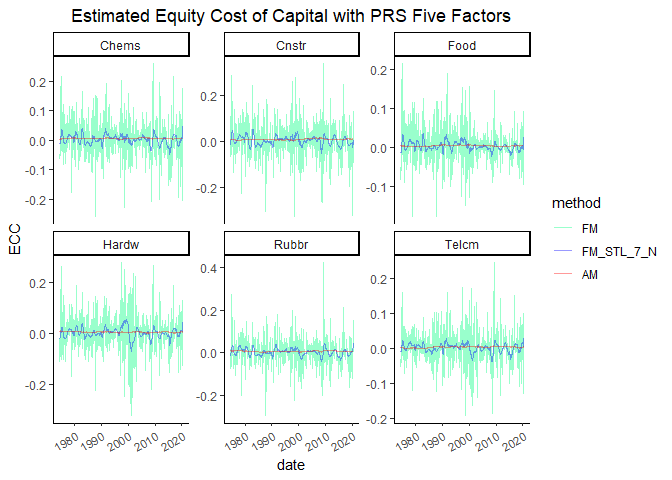<!-- -->

We also performed a KS test to test the FM ECC and STL FM ECC for
different sectors. It seems that the distributions are different from FM
ECC and STL FM ECC.

<table class="table table-striped" style="font-size: 10px; width: auto !important; margin-left: auto; margin-right: auto;">
<caption style="font-size: initial !important;">
KS Test for Fama Mecbeth ECC and STL FM ECC
</caption>
<thead>
<tr>
<th style="empty-cells: hide;border-bottom:hidden;" colspan="1">
</th>
<th style="border-bottom:hidden;padding-bottom:0; padding-left:3px;padding-right:3px;text-align: center; " colspan="2">

FF5

</th>
<th style="border-bottom:hidden;padding-bottom:0; padding-left:3px;padding-right:3px;text-align: center; " colspan="2">

PRS

</th>
</tr>
<tr>
<th style="text-align:center;">
Industry
</th>
<th style="text-align:center;">
statistic
</th>
<th style="text-align:center;">
p.value
</th>
<th style="text-align:center;">
statistic
</th>
<th style="text-align:center;">
p.value
</th>
</tr>
</thead>
<tbody>
<tr>
<td style="text-align:center;font-weight: bold;">
Aero
</td>
<td style="text-align:center;">
0.2929476
</td>
<td style="text-align:center;">
0
</td>
<td style="text-align:center;">
0.2893309
</td>
<td style="text-align:center;">
0
</td>
</tr>
<tr>
<td style="text-align:center;font-weight: bold;">
Agric
</td>
<td style="text-align:center;">
0.2965642
</td>
<td style="text-align:center;">
0
</td>
<td style="text-align:center;">
0.2802893
</td>
<td style="text-align:center;">
0
</td>
</tr>
<tr>
<td style="text-align:center;font-weight: bold;">
Autos
</td>
<td style="text-align:center;">
0.3092224
</td>
<td style="text-align:center;">
0
</td>
<td style="text-align:center;">
0.2712477
</td>
<td style="text-align:center;">
0
</td>
</tr>
<tr>
<td style="text-align:center;font-weight: bold;">
Banks
</td>
<td style="text-align:center;">
0.2820976
</td>
<td style="text-align:center;">
0
</td>
<td style="text-align:center;">
0.2766727
</td>
<td style="text-align:center;">
0
</td>
</tr>
<tr>
<td style="text-align:center;font-weight: bold;">
Beer
</td>
<td style="text-align:center;">
0.3218807
</td>
<td style="text-align:center;">
0
</td>
<td style="text-align:center;">
0.3110307
</td>
<td style="text-align:center;">
0
</td>
</tr>
<tr>
<td style="text-align:center;font-weight: bold;">
BldMt
</td>
<td style="text-align:center;">
0.2857143
</td>
<td style="text-align:center;">
0
</td>
<td style="text-align:center;">
0.2730561
</td>
<td style="text-align:center;">
0
</td>
</tr>
<tr>
<td style="text-align:center;font-weight: bold;">
Books
</td>
<td style="text-align:center;">
0.2983725
</td>
<td style="text-align:center;">
0
</td>
<td style="text-align:center;">
0.2784810
</td>
<td style="text-align:center;">
0
</td>
</tr>
<tr>
<td style="text-align:center;font-weight: bold;">
Boxes
</td>
<td style="text-align:center;">
0.3056058
</td>
<td style="text-align:center;">
0
</td>
<td style="text-align:center;">
0.2893309
</td>
<td style="text-align:center;">
0
</td>
</tr>
<tr>
<td style="text-align:center;font-weight: bold;">
BusSv
</td>
<td style="text-align:center;">
0.3056058
</td>
<td style="text-align:center;">
0
</td>
<td style="text-align:center;">
0.2658228
</td>
<td style="text-align:center;">
0
</td>
</tr>
<tr>
<td style="text-align:center;font-weight: bold;">
Chems
</td>
<td style="text-align:center;">
0.3092224
</td>
<td style="text-align:center;">
0
</td>
<td style="text-align:center;">
0.2929476
</td>
<td style="text-align:center;">
0
</td>
</tr>
<tr>
<td style="text-align:center;font-weight: bold;">
Chips
</td>
<td style="text-align:center;">
0.2929476
</td>
<td style="text-align:center;">
0
</td>
<td style="text-align:center;">
0.2766727
</td>
<td style="text-align:center;">
0
</td>
</tr>
<tr>
<td style="text-align:center;font-weight: bold;">
Clths
</td>
<td style="text-align:center;">
0.3128391
</td>
<td style="text-align:center;">
0
</td>
<td style="text-align:center;">
0.2965642
</td>
<td style="text-align:center;">
0
</td>
</tr>
<tr>
<td style="text-align:center;font-weight: bold;">
Cnstr
</td>
<td style="text-align:center;">
0.3273056
</td>
<td style="text-align:center;">
0
</td>
<td style="text-align:center;">
0.2983725
</td>
<td style="text-align:center;">
0
</td>
</tr>
<tr>
<td style="text-align:center;font-weight: bold;">
Coal
</td>
<td style="text-align:center;">
0.2585895
</td>
<td style="text-align:center;">
0
</td>
<td style="text-align:center;">
0.2423146
</td>
<td style="text-align:center;">
0
</td>
</tr>
<tr>
<td style="text-align:center;font-weight: bold;">
Drugs
</td>
<td style="text-align:center;">
0.3146474
</td>
<td style="text-align:center;">
0
</td>
<td style="text-align:center;">
0.3092224
</td>
<td style="text-align:center;">
0
</td>
</tr>
<tr>
<td style="text-align:center;font-weight: bold;">
ElcEq
</td>
<td style="text-align:center;">
0.2893309
</td>
<td style="text-align:center;">
0
</td>
<td style="text-align:center;">
0.2857143
</td>
<td style="text-align:center;">
0
</td>
</tr>
<tr>
<td style="text-align:center;font-weight: bold;">
FabPr
</td>
<td style="text-align:center;">
0.3037975
</td>
<td style="text-align:center;">
0
</td>
<td style="text-align:center;">
0.3037975
</td>
<td style="text-align:center;">
0
</td>
</tr>
<tr>
<td style="text-align:center;font-weight: bold;">
Fin
</td>
<td style="text-align:center;">
0.3037975
</td>
<td style="text-align:center;">
0
</td>
<td style="text-align:center;">
0.2622061
</td>
<td style="text-align:center;">
0
</td>
</tr>
<tr>
<td style="text-align:center;font-weight: bold;">
Food
</td>
<td style="text-align:center;">
0.2929476
</td>
<td style="text-align:center;">
0
</td>
<td style="text-align:center;">
0.2947559
</td>
<td style="text-align:center;">
0
</td>
</tr>
<tr>
<td style="text-align:center;font-weight: bold;">
Fun
</td>
<td style="text-align:center;">
0.2911392
</td>
<td style="text-align:center;">
0
</td>
<td style="text-align:center;">
0.2911392
</td>
<td style="text-align:center;">
0
</td>
</tr>
<tr>
<td style="text-align:center;font-weight: bold;">
Gold
</td>
<td style="text-align:center;">
0.2658228
</td>
<td style="text-align:center;">
0
</td>
<td style="text-align:center;">
0.2603978
</td>
<td style="text-align:center;">
0
</td>
</tr>
<tr>
<td style="text-align:center;font-weight: bold;">
Guns
</td>
<td style="text-align:center;">
0.2857143
</td>
<td style="text-align:center;">
0
</td>
<td style="text-align:center;">
0.2929476
</td>
<td style="text-align:center;">
0
</td>
</tr>
<tr>
<td style="text-align:center;font-weight: bold;">
Hardw
</td>
<td style="text-align:center;">
0.2983725
</td>
<td style="text-align:center;">
0
</td>
<td style="text-align:center;">
0.2893309
</td>
<td style="text-align:center;">
0
</td>
</tr>
<tr>
<td style="text-align:center;font-weight: bold;">
Hlth
</td>
<td style="text-align:center;">
0.2802893
</td>
<td style="text-align:center;">
0
</td>
<td style="text-align:center;">
0.2983725
</td>
<td style="text-align:center;">
0
</td>
</tr>
<tr>
<td style="text-align:center;font-weight: bold;">
Hshld
</td>
<td style="text-align:center;">
0.3056058
</td>
<td style="text-align:center;">
0
</td>
<td style="text-align:center;">
0.2802893
</td>
<td style="text-align:center;">
0
</td>
</tr>
<tr>
<td style="text-align:center;font-weight: bold;">
Insur
</td>
<td style="text-align:center;">
0.2947559
</td>
<td style="text-align:center;">
0
</td>
<td style="text-align:center;">
0.2766727
</td>
<td style="text-align:center;">
0
</td>
</tr>
<tr>
<td style="text-align:center;font-weight: bold;">
LabEq
</td>
<td style="text-align:center;">
0.3164557
</td>
<td style="text-align:center;">
0
</td>
<td style="text-align:center;">
0.2784810
</td>
<td style="text-align:center;">
0
</td>
</tr>
<tr>
<td style="text-align:center;font-weight: bold;">
Mach
</td>
<td style="text-align:center;">
0.3074141
</td>
<td style="text-align:center;">
0
</td>
<td style="text-align:center;">
0.3056058
</td>
<td style="text-align:center;">
0
</td>
</tr>
<tr>
<td style="text-align:center;font-weight: bold;">
Meals
</td>
<td style="text-align:center;">
0.3291139
</td>
<td style="text-align:center;">
0
</td>
<td style="text-align:center;">
0.3092224
</td>
<td style="text-align:center;">
0
</td>
</tr>
<tr>
<td style="text-align:center;font-weight: bold;">
MedEq
</td>
<td style="text-align:center;">
0.3056058
</td>
<td style="text-align:center;">
0
</td>
<td style="text-align:center;">
0.2911392
</td>
<td style="text-align:center;">
0
</td>
</tr>
<tr>
<td style="text-align:center;font-weight: bold;">
Mines
</td>
<td style="text-align:center;">
0.2839060
</td>
<td style="text-align:center;">
0
</td>
<td style="text-align:center;">
0.2911392
</td>
<td style="text-align:center;">
0
</td>
</tr>
<tr>
<td style="text-align:center;font-weight: bold;">
Oil
</td>
<td style="text-align:center;">
0.3074141
</td>
<td style="text-align:center;">
0
</td>
<td style="text-align:center;">
0.3019892
</td>
<td style="text-align:center;">
0
</td>
</tr>
<tr>
<td style="text-align:center;font-weight: bold;">
Other
</td>
<td style="text-align:center;">
0.2875226
</td>
<td style="text-align:center;">
0
</td>
<td style="text-align:center;">
0.2965642
</td>
<td style="text-align:center;">
0
</td>
</tr>
<tr>
<td style="text-align:center;font-weight: bold;">
Paper
</td>
<td style="text-align:center;">
0.2929476
</td>
<td style="text-align:center;">
0
</td>
<td style="text-align:center;">
0.2820976
</td>
<td style="text-align:center;">
0
</td>
</tr>
<tr>
<td style="text-align:center;font-weight: bold;">
PerSv
</td>
<td style="text-align:center;">
0.3092224
</td>
<td style="text-align:center;">
0
</td>
<td style="text-align:center;">
0.2730561
</td>
<td style="text-align:center;">
0
</td>
</tr>
<tr>
<td style="text-align:center;font-weight: bold;">
RlEst
</td>
<td style="text-align:center;">
0.2730561
</td>
<td style="text-align:center;">
0
</td>
<td style="text-align:center;">
0.2748644
</td>
<td style="text-align:center;">
0
</td>
</tr>
<tr>
<td style="text-align:center;font-weight: bold;">
Rtail
</td>
<td style="text-align:center;">
0.3254973
</td>
<td style="text-align:center;">
0
</td>
<td style="text-align:center;">
0.2983725
</td>
<td style="text-align:center;">
0
</td>
</tr>
<tr>
<td style="text-align:center;font-weight: bold;">
Rubbr
</td>
<td style="text-align:center;">
0.3164557
</td>
<td style="text-align:center;">
0
</td>
<td style="text-align:center;">
0.2820976
</td>
<td style="text-align:center;">
0
</td>
</tr>
<tr>
<td style="text-align:center;font-weight: bold;">
Ships
</td>
<td style="text-align:center;">
0.2929476
</td>
<td style="text-align:center;">
0
</td>
<td style="text-align:center;">
0.2839060
</td>
<td style="text-align:center;">
0
</td>
</tr>
<tr>
<td style="text-align:center;font-weight: bold;">
Smoke
</td>
<td style="text-align:center;">
0.2839060
</td>
<td style="text-align:center;">
0
</td>
<td style="text-align:center;">
0.2947559
</td>
<td style="text-align:center;">
0
</td>
</tr>
<tr>
<td style="text-align:center;font-weight: bold;">
Soda
</td>
<td style="text-align:center;">
0.3146474
</td>
<td style="text-align:center;">
0
</td>
<td style="text-align:center;">
0.2857143
</td>
<td style="text-align:center;">
0
</td>
</tr>
<tr>
<td style="text-align:center;font-weight: bold;">
Softw
</td>
<td style="text-align:center;">
0.2784810
</td>
<td style="text-align:center;">
0
</td>
<td style="text-align:center;">
0.2477396
</td>
<td style="text-align:center;">
0
</td>
</tr>
<tr>
<td style="text-align:center;font-weight: bold;">
Steel
</td>
<td style="text-align:center;">
0.2983725
</td>
<td style="text-align:center;">
0
</td>
<td style="text-align:center;">
0.3001808
</td>
<td style="text-align:center;">
0
</td>
</tr>
<tr>
<td style="text-align:center;font-weight: bold;">
Telcm
</td>
<td style="text-align:center;">
0.2875226
</td>
<td style="text-align:center;">
0
</td>
<td style="text-align:center;">
0.2893309
</td>
<td style="text-align:center;">
0
</td>
</tr>
<tr>
<td style="text-align:center;font-weight: bold;">
Toys
</td>
<td style="text-align:center;">
0.3037975
</td>
<td style="text-align:center;">
0
</td>
<td style="text-align:center;">
0.2712477
</td>
<td style="text-align:center;">
0
</td>
</tr>
<tr>
<td style="text-align:center;font-weight: bold;">
Trans
</td>
<td style="text-align:center;">
0.3037975
</td>
<td style="text-align:center;">
0
</td>
<td style="text-align:center;">
0.2712477
</td>
<td style="text-align:center;">
0
</td>
</tr>
<tr>
<td style="text-align:center;font-weight: bold;">
Txtls
</td>
<td style="text-align:center;">
0.2766727
</td>
<td style="text-align:center;">
0
</td>
<td style="text-align:center;">
0.2839060
</td>
<td style="text-align:center;">
0
</td>
</tr>
<tr>
<td style="text-align:center;font-weight: bold;">
Util
</td>
<td style="text-align:center;">
0.3001808
</td>
<td style="text-align:center;">
0
</td>
<td style="text-align:center;">
0.2712477
</td>
<td style="text-align:center;">
0
</td>
</tr>
<tr>
<td style="text-align:center;font-weight: bold;">
Whlsl
</td>
<td style="text-align:center;">
0.2983725
</td>
<td style="text-align:center;">
0
</td>
<td style="text-align:center;">
0.2875226
</td>
<td style="text-align:center;">
0
</td>
</tr>
</tbody>
</table>

Next, we plot the plots for FM vs. STL Filtered FM statistics.

 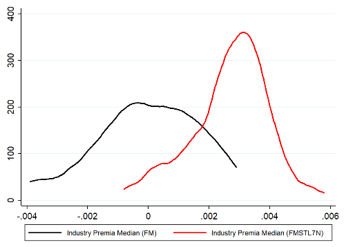
 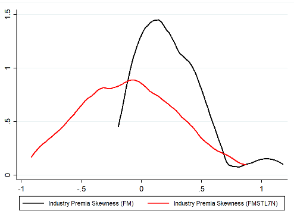

## S5-3 Bootstrap Standard Error

In this section, we would apply the bootstrap method to estimated the
standard error of estimated ECC’s with different methods.

First, we estimate the average ECC across 48 Sectors (without Other)
statistics from simulation; simulate 1000 samples of 250 average ECCs
with replacement; and calculate the mean from each sample; then the
standard error is the standard deviation of sample mean.

Second, we simulated 1000 samples of 250 average ECCs with replacement
for each Industry; calculate the mean from each sample; then the
standard error for each Industry ECC is the standard deviation of sample
mean.

<table class="table table-striped" style="font-size: 10px; width: auto !important; margin-left: auto; margin-right: auto;">
<caption style="font-size: initial !important;">
Bootstrap Estimated ECC Standard Error
</caption>
<thead>
<tr>
<th style="text-align:center;">
AM
</th>
<th style="text-align:center;">
GM
</th>
<th style="text-align:center;">
RAM
</th>
<th style="text-align:center;">
RGM
</th>
<th style="text-align:center;">
FM
</th>
<th style="text-align:center;">
FM_STL_7\_N
</th>
<th style="text-align:center;">
FM_STL_7\_R
</th>
<th style="text-align:center;">
FM_STL_15_N
</th>
<th style="text-align:center;">
FM_STL_15_R
</th>
<th style="text-align:center;">
FM_STL_40_N
</th>
<th style="text-align:center;">
FM_STL_40_R
</th>
<th style="text-align:center;">
RP
</th>
</tr>
</thead>
<tbody>
<tr>
<td style="text-align:center;">
5.25e-05
</td>
<td style="text-align:center;">
4.57e-05
</td>
<td style="text-align:center;">
0.0003272
</td>
<td style="text-align:center;">
0.0003409
</td>
<td style="text-align:center;">
0.0038481
</td>
<td style="text-align:center;">
0.0008239
</td>
<td style="text-align:center;">
0.0009794
</td>
<td style="text-align:center;">
0.0008675
</td>
<td style="text-align:center;">
0.0010532
</td>
<td style="text-align:center;">
0.000929
</td>
<td style="text-align:center;">
0.0011181
</td>
<td style="text-align:center;">
0.0030506
</td>
</tr>
</tbody>
</table>
<table class="table table-striped" style="font-size: 10px; width: auto !important; margin-left: auto; margin-right: auto;">
<caption style="font-size: initial !important;">
Bootstrap Estimated Industry ECC Standard Error
</caption>
<thead>
<tr>
<th style="text-align:center;">
Industry
</th>
<th style="text-align:center;">
AM
</th>
<th style="text-align:center;">
GM
</th>
<th style="text-align:center;">
RAM
</th>
<th style="text-align:center;">
RGM
</th>
<th style="text-align:center;">
FM
</th>
<th style="text-align:center;">
FM_STL_7\_N
</th>
<th style="text-align:center;">
FM_STL_7\_R
</th>
<th style="text-align:center;">
FM_STL_15_N
</th>
<th style="text-align:center;">
FM_STL_15_R
</th>
<th style="text-align:center;">
FM_STL_40_N
</th>
<th style="text-align:center;">
FM_STL_40_R
</th>
<th style="text-align:center;">
RP
</th>
</tr>
</thead>
<tbody>
<tr>
<td style="text-align:center;">
Aero
</td>
<td style="text-align:center;">
0.0001584
</td>
<td style="text-align:center;">
0.0001368
</td>
<td style="text-align:center;">
0.0004144
</td>
<td style="text-align:center;">
0.0004147
</td>
<td style="text-align:center;">
0.0045928
</td>
<td style="text-align:center;">
0.0010012
</td>
<td style="text-align:center;">
0.0011768
</td>
<td style="text-align:center;">
0.0010502
</td>
<td style="text-align:center;">
0.0012695
</td>
<td style="text-align:center;">
0.0011173
</td>
<td style="text-align:center;">
0.0012451
</td>
<td style="text-align:center;">
0.0042458
</td>
</tr>
<tr>
<td style="text-align:center;">
Agric
</td>
<td style="text-align:center;">
0.0002068
</td>
<td style="text-align:center;">
0.0001780
</td>
<td style="text-align:center;">
0.0004868
</td>
<td style="text-align:center;">
0.0004809
</td>
<td style="text-align:center;">
0.0037058
</td>
<td style="text-align:center;">
0.0008066
</td>
<td style="text-align:center;">
0.0009706
</td>
<td style="text-align:center;">
0.0008492
</td>
<td style="text-align:center;">
0.0010656
</td>
<td style="text-align:center;">
0.0009137
</td>
<td style="text-align:center;">
0.0010973
</td>
<td style="text-align:center;">
0.0041157
</td>
</tr>
<tr>
<td style="text-align:center;">
Autos
</td>
<td style="text-align:center;">
0.0002127
</td>
<td style="text-align:center;">
0.0001856
</td>
<td style="text-align:center;">
0.0003623
</td>
<td style="text-align:center;">
0.0003740
</td>
<td style="text-align:center;">
0.0048268
</td>
<td style="text-align:center;">
0.0011570
</td>
<td style="text-align:center;">
0.0011018
</td>
<td style="text-align:center;">
0.0012092
</td>
<td style="text-align:center;">
0.0012265
</td>
<td style="text-align:center;">
0.0012889
</td>
<td style="text-align:center;">
0.0013571
</td>
<td style="text-align:center;">
0.0044525
</td>
</tr>
<tr>
<td style="text-align:center;">
Banks
</td>
<td style="text-align:center;">
0.0001536
</td>
<td style="text-align:center;">
0.0001318
</td>
<td style="text-align:center;">
0.0005544
</td>
<td style="text-align:center;">
0.0005603
</td>
<td style="text-align:center;">
0.0047027
</td>
<td style="text-align:center;">
0.0009471
</td>
<td style="text-align:center;">
0.0011725
</td>
<td style="text-align:center;">
0.0009898
</td>
<td style="text-align:center;">
0.0012554
</td>
<td style="text-align:center;">
0.0010590
</td>
<td style="text-align:center;">
0.0012349
</td>
<td style="text-align:center;">
0.0039556
</td>
</tr>
<tr>
<td style="text-align:center;">
Beer
</td>
<td style="text-align:center;">
0.0001674
</td>
<td style="text-align:center;">
0.0001450
</td>
<td style="text-align:center;">
0.0004221
</td>
<td style="text-align:center;">
0.0004131
</td>
<td style="text-align:center;">
0.0033362
</td>
<td style="text-align:center;">
0.0006559
</td>
<td style="text-align:center;">
0.0009726
</td>
<td style="text-align:center;">
0.0006830
</td>
<td style="text-align:center;">
0.0009123
</td>
<td style="text-align:center;">
0.0007292
</td>
<td style="text-align:center;">
0.0008880
</td>
<td style="text-align:center;">
0.0033264
</td>
</tr>
<tr>
<td style="text-align:center;">
BldMt
</td>
<td style="text-align:center;">
0.0001603
</td>
<td style="text-align:center;">
0.0001388
</td>
<td style="text-align:center;">
0.0003486
</td>
<td style="text-align:center;">
0.0003564
</td>
<td style="text-align:center;">
0.0046554
</td>
<td style="text-align:center;">
0.0009163
</td>
<td style="text-align:center;">
0.0011608
</td>
<td style="text-align:center;">
0.0009637
</td>
<td style="text-align:center;">
0.0011914
</td>
<td style="text-align:center;">
0.0010291
</td>
<td style="text-align:center;">
0.0012882
</td>
<td style="text-align:center;">
0.0040398
</td>
</tr>
<tr>
<td style="text-align:center;">
Books
</td>
<td style="text-align:center;">
0.0001190
</td>
<td style="text-align:center;">
0.0001026
</td>
<td style="text-align:center;">
0.0003623
</td>
<td style="text-align:center;">
0.0003777
</td>
<td style="text-align:center;">
0.0039246
</td>
<td style="text-align:center;">
0.0008537
</td>
<td style="text-align:center;">
0.0009883
</td>
<td style="text-align:center;">
0.0009024
</td>
<td style="text-align:center;">
0.0010365
</td>
<td style="text-align:center;">
0.0009701
</td>
<td style="text-align:center;">
0.0011205
</td>
<td style="text-align:center;">
0.0035939
</td>
</tr>
<tr>
<td style="text-align:center;">
Boxes
</td>
<td style="text-align:center;">
0.0002107
</td>
<td style="text-align:center;">
0.0001814
</td>
<td style="text-align:center;">
0.0003978
</td>
<td style="text-align:center;">
0.0003948
</td>
<td style="text-align:center;">
0.0037812
</td>
<td style="text-align:center;">
0.0007894
</td>
<td style="text-align:center;">
0.0008348
</td>
<td style="text-align:center;">
0.0008349
</td>
<td style="text-align:center;">
0.0008644
</td>
<td style="text-align:center;">
0.0008986
</td>
<td style="text-align:center;">
0.0009016
</td>
<td style="text-align:center;">
0.0035907
</td>
</tr>
<tr>
<td style="text-align:center;">
BusSv
</td>
<td style="text-align:center;">
0.0000593
</td>
<td style="text-align:center;">
0.0000533
</td>
<td style="text-align:center;">
0.0003936
</td>
<td style="text-align:center;">
0.0004065
</td>
<td style="text-align:center;">
0.0042707
</td>
<td style="text-align:center;">
0.0009281
</td>
<td style="text-align:center;">
0.0010547
</td>
<td style="text-align:center;">
0.0009786
</td>
<td style="text-align:center;">
0.0011302
</td>
<td style="text-align:center;">
0.0010480
</td>
<td style="text-align:center;">
0.0012578
</td>
<td style="text-align:center;">
0.0034894
</td>
</tr>
<tr>
<td style="text-align:center;">
Chems
</td>
<td style="text-align:center;">
0.0001273
</td>
<td style="text-align:center;">
0.0001132
</td>
<td style="text-align:center;">
0.0003055
</td>
<td style="text-align:center;">
0.0003178
</td>
<td style="text-align:center;">
0.0043624
</td>
<td style="text-align:center;">
0.0009150
</td>
<td style="text-align:center;">
0.0011480
</td>
<td style="text-align:center;">
0.0009662
</td>
<td style="text-align:center;">
0.0012178
</td>
<td style="text-align:center;">
0.0010382
</td>
<td style="text-align:center;">
0.0012651
</td>
<td style="text-align:center;">
0.0038913
</td>
</tr>
<tr>
<td style="text-align:center;">
Chips
</td>
<td style="text-align:center;">
0.0001530
</td>
<td style="text-align:center;">
0.0001315
</td>
<td style="text-align:center;">
0.0005662
</td>
<td style="text-align:center;">
0.0005699
</td>
<td style="text-align:center;">
0.0051593
</td>
<td style="text-align:center;">
0.0012304
</td>
<td style="text-align:center;">
0.0014222
</td>
<td style="text-align:center;">
0.0012874
</td>
<td style="text-align:center;">
0.0015290
</td>
<td style="text-align:center;">
0.0013625
</td>
<td style="text-align:center;">
0.0018393
</td>
<td style="text-align:center;">
0.0046930
</td>
</tr>
<tr>
<td style="text-align:center;">
Clths
</td>
<td style="text-align:center;">
0.0001660
</td>
<td style="text-align:center;">
0.0001407
</td>
<td style="text-align:center;">
0.0003047
</td>
<td style="text-align:center;">
0.0003261
</td>
<td style="text-align:center;">
0.0042705
</td>
<td style="text-align:center;">
0.0008497
</td>
<td style="text-align:center;">
0.0009575
</td>
<td style="text-align:center;">
0.0009007
</td>
<td style="text-align:center;">
0.0009910
</td>
<td style="text-align:center;">
0.0009732
</td>
<td style="text-align:center;">
0.0010851
</td>
<td style="text-align:center;">
0.0039804
</td>
</tr>
<tr>
<td style="text-align:center;">
Cnstr
</td>
<td style="text-align:center;">
0.0002019
</td>
<td style="text-align:center;">
0.0001731
</td>
<td style="text-align:center;">
0.0004860
</td>
<td style="text-align:center;">
0.0004877
</td>
<td style="text-align:center;">
0.0049195
</td>
<td style="text-align:center;">
0.0010863
</td>
<td style="text-align:center;">
0.0012769
</td>
<td style="text-align:center;">
0.0011439
</td>
<td style="text-align:center;">
0.0013989
</td>
<td style="text-align:center;">
0.0012357
</td>
<td style="text-align:center;">
0.0014788
</td>
<td style="text-align:center;">
0.0045027
</td>
</tr>
<tr>
<td style="text-align:center;">
Coal
</td>
<td style="text-align:center;">
0.0003020
</td>
<td style="text-align:center;">
0.0002687
</td>
<td style="text-align:center;">
0.0005115
</td>
<td style="text-align:center;">
0.0005102
</td>
<td style="text-align:center;">
0.0059923
</td>
<td style="text-align:center;">
0.0014194
</td>
<td style="text-align:center;">
0.0014510
</td>
<td style="text-align:center;">
0.0014746
</td>
<td style="text-align:center;">
0.0015897
</td>
<td style="text-align:center;">
0.0015664
</td>
<td style="text-align:center;">
0.0017007
</td>
<td style="text-align:center;">
0.0069547
</td>
</tr>
<tr>
<td style="text-align:center;">
Drugs
</td>
<td style="text-align:center;">
0.0000982
</td>
<td style="text-align:center;">
0.0000874
</td>
<td style="text-align:center;">
0.0004109
</td>
<td style="text-align:center;">
0.0004107
</td>
<td style="text-align:center;">
0.0035988
</td>
<td style="text-align:center;">
0.0007399
</td>
<td style="text-align:center;">
0.0008479
</td>
<td style="text-align:center;">
0.0007747
</td>
<td style="text-align:center;">
0.0008664
</td>
<td style="text-align:center;">
0.0008255
</td>
<td style="text-align:center;">
0.0009059
</td>
<td style="text-align:center;">
0.0032738
</td>
</tr>
<tr>
<td style="text-align:center;">
ElcEq
</td>
<td style="text-align:center;">
0.0001818
</td>
<td style="text-align:center;">
0.0001583
</td>
<td style="text-align:center;">
0.0004926
</td>
<td style="text-align:center;">
0.0004990
</td>
<td style="text-align:center;">
0.0048085
</td>
<td style="text-align:center;">
0.0010317
</td>
<td style="text-align:center;">
0.0012187
</td>
<td style="text-align:center;">
0.0010827
</td>
<td style="text-align:center;">
0.0012886
</td>
<td style="text-align:center;">
0.0011552
</td>
<td style="text-align:center;">
0.0014581
</td>
<td style="text-align:center;">
0.0040325
</td>
</tr>
<tr>
<td style="text-align:center;">
FabPr
</td>
<td style="text-align:center;">
0.0002428
</td>
<td style="text-align:center;">
0.0002100
</td>
<td style="text-align:center;">
0.0003993
</td>
<td style="text-align:center;">
0.0003925
</td>
<td style="text-align:center;">
0.0046047
</td>
<td style="text-align:center;">
0.0009947
</td>
<td style="text-align:center;">
0.0011648
</td>
<td style="text-align:center;">
0.0010472
</td>
<td style="text-align:center;">
0.0012511
</td>
<td style="text-align:center;">
0.0011304
</td>
<td style="text-align:center;">
0.0013640
</td>
<td style="text-align:center;">
0.0044812
</td>
</tr>
<tr>
<td style="text-align:center;">
Fin
</td>
<td style="text-align:center;">
0.0001187
</td>
<td style="text-align:center;">
0.0001025
</td>
<td style="text-align:center;">
0.0004950
</td>
<td style="text-align:center;">
0.0005062
</td>
<td style="text-align:center;">
0.0046853
</td>
<td style="text-align:center;">
0.0010229
</td>
<td style="text-align:center;">
0.0010863
</td>
<td style="text-align:center;">
0.0010661
</td>
<td style="text-align:center;">
0.0011728
</td>
<td style="text-align:center;">
0.0011408
</td>
<td style="text-align:center;">
0.0013270
</td>
<td style="text-align:center;">
0.0039428
</td>
</tr>
<tr>
<td style="text-align:center;">
Food
</td>
<td style="text-align:center;">
0.0001632
</td>
<td style="text-align:center;">
0.0001463
</td>
<td style="text-align:center;">
0.0003837
</td>
<td style="text-align:center;">
0.0003779
</td>
<td style="text-align:center;">
0.0030348
</td>
<td style="text-align:center;">
0.0006842
</td>
<td style="text-align:center;">
0.0007719
</td>
<td style="text-align:center;">
0.0007109
</td>
<td style="text-align:center;">
0.0007768
</td>
<td style="text-align:center;">
0.0007536
</td>
<td style="text-align:center;">
0.0008028
</td>
<td style="text-align:center;">
0.0028799
</td>
</tr>
<tr>
<td style="text-align:center;">
Fun
</td>
<td style="text-align:center;">
0.0001841
</td>
<td style="text-align:center;">
0.0001588
</td>
<td style="text-align:center;">
0.0004539
</td>
<td style="text-align:center;">
0.0004817
</td>
<td style="text-align:center;">
0.0051789
</td>
<td style="text-align:center;">
0.0011328
</td>
<td style="text-align:center;">
0.0011570
</td>
<td style="text-align:center;">
0.0011922
</td>
<td style="text-align:center;">
0.0012901
</td>
<td style="text-align:center;">
0.0012734
</td>
<td style="text-align:center;">
0.0014028
</td>
<td style="text-align:center;">
0.0047852
</td>
</tr>
<tr>
<td style="text-align:center;">
Gold
</td>
<td style="text-align:center;">
0.0003343
</td>
<td style="text-align:center;">
0.0003025
</td>
<td style="text-align:center;">
0.0004871
</td>
<td style="text-align:center;">
0.0004718
</td>
<td style="text-align:center;">
0.0050755
</td>
<td style="text-align:center;">
0.0011603
</td>
<td style="text-align:center;">
0.0012388
</td>
<td style="text-align:center;">
0.0012153
</td>
<td style="text-align:center;">
0.0013408
</td>
<td style="text-align:center;">
0.0012882
</td>
<td style="text-align:center;">
0.0014834
</td>
<td style="text-align:center;">
0.0071254
</td>
</tr>
<tr>
<td style="text-align:center;">
Guns
</td>
<td style="text-align:center;">
0.0001903
</td>
<td style="text-align:center;">
0.0001655
</td>
<td style="text-align:center;">
0.0003364
</td>
<td style="text-align:center;">
0.0003283
</td>
<td style="text-align:center;">
0.0037806
</td>
<td style="text-align:center;">
0.0008328
</td>
<td style="text-align:center;">
0.0010510
</td>
<td style="text-align:center;">
0.0008687
</td>
<td style="text-align:center;">
0.0011249
</td>
<td style="text-align:center;">
0.0009203
</td>
<td style="text-align:center;">
0.0011474
</td>
<td style="text-align:center;">
0.0041205
</td>
</tr>
<tr>
<td style="text-align:center;">
Hardw
</td>
<td style="text-align:center;">
0.0002035
</td>
<td style="text-align:center;">
0.0001798
</td>
<td style="text-align:center;">
0.0004727
</td>
<td style="text-align:center;">
0.0004700
</td>
<td style="text-align:center;">
0.0048074
</td>
<td style="text-align:center;">
0.0011953
</td>
<td style="text-align:center;">
0.0014278
</td>
<td style="text-align:center;">
0.0012382
</td>
<td style="text-align:center;">
0.0015220
</td>
<td style="text-align:center;">
0.0012994
</td>
<td style="text-align:center;">
0.0017914
</td>
<td style="text-align:center;">
0.0047711
</td>
</tr>
<tr>
<td style="text-align:center;">
Hlth
</td>
<td style="text-align:center;">
0.0002788
</td>
<td style="text-align:center;">
0.0002448
</td>
<td style="text-align:center;">
0.0006298
</td>
<td style="text-align:center;">
0.0006036
</td>
<td style="text-align:center;">
0.0047473
</td>
<td style="text-align:center;">
0.0010395
</td>
<td style="text-align:center;">
0.0012732
</td>
<td style="text-align:center;">
0.0010922
</td>
<td style="text-align:center;">
0.0013616
</td>
<td style="text-align:center;">
0.0011707
</td>
<td style="text-align:center;">
0.0012919
</td>
<td style="text-align:center;">
0.0046224
</td>
</tr>
<tr>
<td style="text-align:center;">
Hshld
</td>
<td style="text-align:center;">
0.0001279
</td>
<td style="text-align:center;">
0.0001098
</td>
<td style="text-align:center;">
0.0003738
</td>
<td style="text-align:center;">
0.0003785
</td>
<td style="text-align:center;">
0.0034685
</td>
<td style="text-align:center;">
0.0006873
</td>
<td style="text-align:center;">
0.0008685
</td>
<td style="text-align:center;">
0.0007165
</td>
<td style="text-align:center;">
0.0008764
</td>
<td style="text-align:center;">
0.0007625
</td>
<td style="text-align:center;">
0.0009039
</td>
<td style="text-align:center;">
0.0029608
</td>
</tr>
<tr>
<td style="text-align:center;">
Insur
</td>
<td style="text-align:center;">
0.0001801
</td>
<td style="text-align:center;">
0.0001607
</td>
<td style="text-align:center;">
0.0004260
</td>
<td style="text-align:center;">
0.0004274
</td>
<td style="text-align:center;">
0.0040925
</td>
<td style="text-align:center;">
0.0008078
</td>
<td style="text-align:center;">
0.0009975
</td>
<td style="text-align:center;">
0.0008522
</td>
<td style="text-align:center;">
0.0011016
</td>
<td style="text-align:center;">
0.0009240
</td>
<td style="text-align:center;">
0.0010685
</td>
<td style="text-align:center;">
0.0034270
</td>
</tr>
<tr>
<td style="text-align:center;">
LabEq
</td>
<td style="text-align:center;">
0.0001803
</td>
<td style="text-align:center;">
0.0001562
</td>
<td style="text-align:center;">
0.0005065
</td>
<td style="text-align:center;">
0.0005116
</td>
<td style="text-align:center;">
0.0048274
</td>
<td style="text-align:center;">
0.0010344
</td>
<td style="text-align:center;">
0.0011664
</td>
<td style="text-align:center;">
0.0010872
</td>
<td style="text-align:center;">
0.0012698
</td>
<td style="text-align:center;">
0.0011564
</td>
<td style="text-align:center;">
0.0014318
</td>
<td style="text-align:center;">
0.0044467
</td>
</tr>
<tr>
<td style="text-align:center;">
Mach
</td>
<td style="text-align:center;">
0.0001688
</td>
<td style="text-align:center;">
0.0001441
</td>
<td style="text-align:center;">
0.0004165
</td>
<td style="text-align:center;">
0.0004227
</td>
<td style="text-align:center;">
0.0049446
</td>
<td style="text-align:center;">
0.0009344
</td>
<td style="text-align:center;">
0.0011278
</td>
<td style="text-align:center;">
0.0009973
</td>
<td style="text-align:center;">
0.0012361
</td>
<td style="text-align:center;">
0.0010900
</td>
<td style="text-align:center;">
0.0013424
</td>
<td style="text-align:center;">
0.0042228
</td>
</tr>
<tr>
<td style="text-align:center;">
Meals
</td>
<td style="text-align:center;">
0.0001552
</td>
<td style="text-align:center;">
0.0001314
</td>
<td style="text-align:center;">
0.0003983
</td>
<td style="text-align:center;">
0.0004101
</td>
<td style="text-align:center;">
0.0039468
</td>
<td style="text-align:center;">
0.0007996
</td>
<td style="text-align:center;">
0.0010172
</td>
<td style="text-align:center;">
0.0008416
</td>
<td style="text-align:center;">
0.0010658
</td>
<td style="text-align:center;">
0.0009132
</td>
<td style="text-align:center;">
0.0010662
</td>
<td style="text-align:center;">
0.0035498
</td>
</tr>
<tr>
<td style="text-align:center;">
MedEq
</td>
<td style="text-align:center;">
0.0001309
</td>
<td style="text-align:center;">
0.0001179
</td>
<td style="text-align:center;">
0.0003897
</td>
<td style="text-align:center;">
0.0003904
</td>
<td style="text-align:center;">
0.0037047
</td>
<td style="text-align:center;">
0.0007631
</td>
<td style="text-align:center;">
0.0009046
</td>
<td style="text-align:center;">
0.0008034
</td>
<td style="text-align:center;">
0.0009514
</td>
<td style="text-align:center;">
0.0008561
</td>
<td style="text-align:center;">
0.0009807
</td>
<td style="text-align:center;">
0.0033273
</td>
</tr>
<tr>
<td style="text-align:center;">
Mines
</td>
<td style="text-align:center;">
0.0002300
</td>
<td style="text-align:center;">
0.0002032
</td>
<td style="text-align:center;">
0.0004895
</td>
<td style="text-align:center;">
0.0004879
</td>
<td style="text-align:center;">
0.0050126
</td>
<td style="text-align:center;">
0.0011994
</td>
<td style="text-align:center;">
0.0013661
</td>
<td style="text-align:center;">
0.0012666
</td>
<td style="text-align:center;">
0.0014778
</td>
<td style="text-align:center;">
0.0013612
</td>
<td style="text-align:center;">
0.0015796
</td>
<td style="text-align:center;">
0.0049717
</td>
</tr>
<tr>
<td style="text-align:center;">
Oil
</td>
<td style="text-align:center;">
0.0001838
</td>
<td style="text-align:center;">
0.0001608
</td>
<td style="text-align:center;">
0.0004077
</td>
<td style="text-align:center;">
0.0004012
</td>
<td style="text-align:center;">
0.0036820
</td>
<td style="text-align:center;">
0.0008507
</td>
<td style="text-align:center;">
0.0011828
</td>
<td style="text-align:center;">
0.0008916
</td>
<td style="text-align:center;">
0.0012301
</td>
<td style="text-align:center;">
0.0009522
</td>
<td style="text-align:center;">
0.0012499
</td>
<td style="text-align:center;">
0.0037882
</td>
</tr>
<tr>
<td style="text-align:center;">
Paper
</td>
<td style="text-align:center;">
0.0001519
</td>
<td style="text-align:center;">
0.0001338
</td>
<td style="text-align:center;">
0.0003441
</td>
<td style="text-align:center;">
0.0003407
</td>
<td style="text-align:center;">
0.0039114
</td>
<td style="text-align:center;">
0.0008679
</td>
<td style="text-align:center;">
0.0010355
</td>
<td style="text-align:center;">
0.0009115
</td>
<td style="text-align:center;">
0.0010715
</td>
<td style="text-align:center;">
0.0009743
</td>
<td style="text-align:center;">
0.0010977
</td>
<td style="text-align:center;">
0.0034934
</td>
</tr>
<tr>
<td style="text-align:center;">
PerSv
</td>
<td style="text-align:center;">
0.0001797
</td>
<td style="text-align:center;">
0.0001542
</td>
<td style="text-align:center;">
0.0004724
</td>
<td style="text-align:center;">
0.0004680
</td>
<td style="text-align:center;">
0.0041148
</td>
<td style="text-align:center;">
0.0008919
</td>
<td style="text-align:center;">
0.0010335
</td>
<td style="text-align:center;">
0.0009393
</td>
<td style="text-align:center;">
0.0010971
</td>
<td style="text-align:center;">
0.0010096
</td>
<td style="text-align:center;">
0.0011325
</td>
<td style="text-align:center;">
0.0039313
</td>
</tr>
<tr>
<td style="text-align:center;">
RlEst
</td>
<td style="text-align:center;">
0.0001884
</td>
<td style="text-align:center;">
0.0001599
</td>
<td style="text-align:center;">
0.0004342
</td>
<td style="text-align:center;">
0.0004507
</td>
<td style="text-align:center;">
0.0052856
</td>
<td style="text-align:center;">
0.0012224
</td>
<td style="text-align:center;">
0.0014252
</td>
<td style="text-align:center;">
0.0012828
</td>
<td style="text-align:center;">
0.0014704
</td>
<td style="text-align:center;">
0.0013712
</td>
<td style="text-align:center;">
0.0015974
</td>
<td style="text-align:center;">
0.0048584
</td>
</tr>
<tr>
<td style="text-align:center;">
Rtail
</td>
<td style="text-align:center;">
0.0001058
</td>
<td style="text-align:center;">
0.0000923
</td>
<td style="text-align:center;">
0.0003246
</td>
<td style="text-align:center;">
0.0003463
</td>
<td style="text-align:center;">
0.0037981
</td>
<td style="text-align:center;">
0.0007877
</td>
<td style="text-align:center;">
0.0008209
</td>
<td style="text-align:center;">
0.0008250
</td>
<td style="text-align:center;">
0.0008504
</td>
<td style="text-align:center;">
0.0008760
</td>
<td style="text-align:center;">
0.0009727
</td>
<td style="text-align:center;">
0.0035357
</td>
</tr>
<tr>
<td style="text-align:center;">
Rubbr
</td>
<td style="text-align:center;">
0.0001245
</td>
<td style="text-align:center;">
0.0001100
</td>
<td style="text-align:center;">
0.0003672
</td>
<td style="text-align:center;">
0.0003799
</td>
<td style="text-align:center;">
0.0041496
</td>
<td style="text-align:center;">
0.0008454
</td>
<td style="text-align:center;">
0.0009794
</td>
<td style="text-align:center;">
0.0008892
</td>
<td style="text-align:center;">
0.0010246
</td>
<td style="text-align:center;">
0.0009459
</td>
<td style="text-align:center;">
0.0011022
</td>
<td style="text-align:center;">
0.0037432
</td>
</tr>
<tr>
<td style="text-align:center;">
Ships
</td>
<td style="text-align:center;">
0.0002733
</td>
<td style="text-align:center;">
0.0002400
</td>
<td style="text-align:center;">
0.0004757
</td>
<td style="text-align:center;">
0.0004662
</td>
<td style="text-align:center;">
0.0046059
</td>
<td style="text-align:center;">
0.0009167
</td>
<td style="text-align:center;">
0.0011987
</td>
<td style="text-align:center;">
0.0009644
</td>
<td style="text-align:center;">
0.0012895
</td>
<td style="text-align:center;">
0.0010347
</td>
<td style="text-align:center;">
0.0013046
</td>
<td style="text-align:center;">
0.0048598
</td>
</tr>
<tr>
<td style="text-align:center;">
Smoke
</td>
<td style="text-align:center;">
0.0002471
</td>
<td style="text-align:center;">
0.0002188
</td>
<td style="text-align:center;">
0.0004687
</td>
<td style="text-align:center;">
0.0004457
</td>
<td style="text-align:center;">
0.0033137
</td>
<td style="text-align:center;">
0.0008563
</td>
<td style="text-align:center;">
0.0010383
</td>
<td style="text-align:center;">
0.0008820
</td>
<td style="text-align:center;">
0.0010207
</td>
<td style="text-align:center;">
0.0009242
</td>
<td style="text-align:center;">
0.0010541
</td>
<td style="text-align:center;">
0.0038224
</td>
</tr>
<tr>
<td style="text-align:center;">
Soda
</td>
<td style="text-align:center;">
0.0002252
</td>
<td style="text-align:center;">
0.0001936
</td>
<td style="text-align:center;">
0.0005185
</td>
<td style="text-align:center;">
0.0005043
</td>
<td style="text-align:center;">
0.0040331
</td>
<td style="text-align:center;">
0.0007821
</td>
<td style="text-align:center;">
0.0010878
</td>
<td style="text-align:center;">
0.0008271
</td>
<td style="text-align:center;">
0.0010724
</td>
<td style="text-align:center;">
0.0008960
</td>
<td style="text-align:center;">
0.0009317
</td>
<td style="text-align:center;">
0.0041634
</td>
</tr>
<tr>
<td style="text-align:center;">
Softw
</td>
<td style="text-align:center;">
0.0003608
</td>
<td style="text-align:center;">
0.0003143
</td>
<td style="text-align:center;">
0.0008863
</td>
<td style="text-align:center;">
0.0008670
</td>
<td style="text-align:center;">
0.0061699
</td>
<td style="text-align:center;">
0.0014882
</td>
<td style="text-align:center;">
0.0019124
</td>
<td style="text-align:center;">
0.0015421
</td>
<td style="text-align:center;">
0.0020434
</td>
<td style="text-align:center;">
0.0016233
</td>
<td style="text-align:center;">
0.0022636
</td>
<td style="text-align:center;">
0.0057091
</td>
</tr>
<tr>
<td style="text-align:center;">
Steel
</td>
<td style="text-align:center;">
0.0002063
</td>
<td style="text-align:center;">
0.0001788
</td>
<td style="text-align:center;">
0.0004330
</td>
<td style="text-align:center;">
0.0004438
</td>
<td style="text-align:center;">
0.0054263
</td>
<td style="text-align:center;">
0.0011952
</td>
<td style="text-align:center;">
0.0012723
</td>
<td style="text-align:center;">
0.0012572
</td>
<td style="text-align:center;">
0.0013412
</td>
<td style="text-align:center;">
0.0013401
</td>
<td style="text-align:center;">
0.0015280
</td>
<td style="text-align:center;">
0.0048519
</td>
</tr>
<tr>
<td style="text-align:center;">
Telcm
</td>
<td style="text-align:center;">
0.0001357
</td>
<td style="text-align:center;">
0.0001198
</td>
<td style="text-align:center;">
0.0004089
</td>
<td style="text-align:center;">
0.0004019
</td>
<td style="text-align:center;">
0.0033936
</td>
<td style="text-align:center;">
0.0007511
</td>
<td style="text-align:center;">
0.0008288
</td>
<td style="text-align:center;">
0.0007807
</td>
<td style="text-align:center;">
0.0008293
</td>
<td style="text-align:center;">
0.0008251
</td>
<td style="text-align:center;">
0.0009629
</td>
<td style="text-align:center;">
0.0030401
</td>
</tr>
<tr>
<td style="text-align:center;">
Toys
</td>
<td style="text-align:center;">
0.0002237
</td>
<td style="text-align:center;">
0.0001951
</td>
<td style="text-align:center;">
0.0004063
</td>
<td style="text-align:center;">
0.0004103
</td>
<td style="text-align:center;">
0.0046592
</td>
<td style="text-align:center;">
0.0010044
</td>
<td style="text-align:center;">
0.0011490
</td>
<td style="text-align:center;">
0.0010542
</td>
<td style="text-align:center;">
0.0012008
</td>
<td style="text-align:center;">
0.0011188
</td>
<td style="text-align:center;">
0.0012660
</td>
<td style="text-align:center;">
0.0043925
</td>
</tr>
<tr>
<td style="text-align:center;">
Trans
</td>
<td style="text-align:center;">
0.0001295
</td>
<td style="text-align:center;">
0.0001158
</td>
<td style="text-align:center;">
0.0003229
</td>
<td style="text-align:center;">
0.0003320
</td>
<td style="text-align:center;">
0.0040921
</td>
<td style="text-align:center;">
0.0008266
</td>
<td style="text-align:center;">
0.0010340
</td>
<td style="text-align:center;">
0.0008660
</td>
<td style="text-align:center;">
0.0010747
</td>
<td style="text-align:center;">
0.0009179
</td>
<td style="text-align:center;">
0.0010998
</td>
<td style="text-align:center;">
0.0034197
</td>
</tr>
<tr>
<td style="text-align:center;">
Txtls
</td>
<td style="text-align:center;">
0.0002215
</td>
<td style="text-align:center;">
0.0001855
</td>
<td style="text-align:center;">
0.0003394
</td>
<td style="text-align:center;">
0.0003536
</td>
<td style="text-align:center;">
0.0047476
</td>
<td style="text-align:center;">
0.0010385
</td>
<td style="text-align:center;">
0.0012050
</td>
<td style="text-align:center;">
0.0010920
</td>
<td style="text-align:center;">
0.0012239
</td>
<td style="text-align:center;">
0.0011673
</td>
<td style="text-align:center;">
0.0013549
</td>
<td style="text-align:center;">
0.0047777
</td>
</tr>
<tr>
<td style="text-align:center;">
Util
</td>
<td style="text-align:center;">
0.0001408
</td>
<td style="text-align:center;">
0.0001281
</td>
<td style="text-align:center;">
0.0002368
</td>
<td style="text-align:center;">
0.0002337
</td>
<td style="text-align:center;">
0.0025807
</td>
<td style="text-align:center;">
0.0006402
</td>
<td style="text-align:center;">
0.0007597
</td>
<td style="text-align:center;">
0.0006682
</td>
<td style="text-align:center;">
0.0008068
</td>
<td style="text-align:center;">
0.0007161
</td>
<td style="text-align:center;">
0.0008117
</td>
<td style="text-align:center;">
0.0026138
</td>
</tr>
<tr>
<td style="text-align:center;">
Whlsl
</td>
<td style="text-align:center;">
0.0000836
</td>
<td style="text-align:center;">
0.0000741
</td>
<td style="text-align:center;">
0.0003453
</td>
<td style="text-align:center;">
0.0003549
</td>
<td style="text-align:center;">
0.0038575
</td>
<td style="text-align:center;">
0.0008520
</td>
<td style="text-align:center;">
0.0009988
</td>
<td style="text-align:center;">
0.0008917
</td>
<td style="text-align:center;">
0.0010830
</td>
<td style="text-align:center;">
0.0009471
</td>
<td style="text-align:center;">
0.0011241
</td>
<td style="text-align:center;">
0.0031538
</td>
</tr>
</tbody>
</table>

## S5-4 Decomposition of the Equity Cost of Captial

In this section, we would try to decompose the ECC.

Based on the Model, at each period t, the estimated Risk Premium is
calculated as follows:

![E\[RP\] = \vec\beta\*\vec\lambda'](https://latex.codecogs.com/png.image?%5Cdpi%7B110%7D&space;%5Cbg_white&space;E%5BRP%5D%20%3D%20%5Cvec%5Cbeta%2A%5Cvec%5Clambda%27 "E[RP] = \vec\beta*\vec\lambda'")

is the 1xk vecotr which represents k factor exposures;

is the 1xk Matrix which represents k factor premium across T periods. In
order to decompose the
![E\[RP\]](https://latex.codecogs.com/png.image?%5Cdpi%7B110%7D&space;%5Cbg_white&space;E%5BRP%5D "E[RP]")
into one

and one

components, we apply the property of vector product:

![E\[RP\] = \|\vec\beta\|\*\|\vec\lambda\|\*cos(\vec\beta,\vec\lambda)](https://latex.codecogs.com/png.image?%5Cdpi%7B110%7D&space;%5Cbg_white&space;E%5BRP%5D%20%3D%20%7C%5Cvec%5Cbeta%7C%2A%7C%5Cvec%5Clambda%7C%2Acos%28%5Cvec%5Cbeta%2C%5Cvec%5Clambda%29 "E[RP] = |\vec\beta|*|\vec\lambda|*cos(\vec\beta,\vec\lambda)")

We would call the
")
part projection parameter
(),
since it is how effective the L2 norms,

and
,
work together to form the expected risk premium. If
=0"),
no matter how large

and

are, the expected risk premium would be 0.

![E\[RP\] = \|\vec\beta\|\*\|\vec\lambda\|\*PP](https://latex.codecogs.com/png.image?%5Cdpi%7B110%7D&space;%5Cbg_white&space;E%5BRP%5D%20%3D%20%7C%5Cvec%5Cbeta%7C%2A%7C%5Cvec%5Clambda%7C%2APP "E[RP] = |\vec\beta|*|\vec\lambda|*PP")

and,
![\|E\[RP\]\| = \|\vec\beta\|\*\|\vec\lambda\|\*\|PP\|](https://latex.codecogs.com/png.image?%5Cdpi%7B110%7D&space;%5Cbg_white&space;%7CE%5BRP%5D%7C%20%3D%20%7C%5Cvec%5Cbeta%7C%2A%7C%5Cvec%5Clambda%7C%2A%7CPP%7C "|E[RP]| = |\vec\beta|*|\vec\lambda|*|PP|")

The decomposition would be more intuitive with an additive form. We take
the log of both sides:

![ln(\|E\[RP\]\|) = ln(\|\vec\beta\|\*\|\vec\lambda\|\*\|PP\|) = ln(\|\vec\beta\|) + ln(\|\vec\lambda\|) + ln(\|PP\|)](https://latex.codecogs.com/png.image?%5Cdpi%7B110%7D&space;%5Cbg_white&space;ln%28%7CE%5BRP%5D%7C%29%20%3D%20ln%28%7C%5Cvec%5Cbeta%7C%2A%7C%5Cvec%5Clambda%7C%2A%7CPP%7C%29%20%3D%20ln%28%7C%5Cvec%5Cbeta%7C%29%20%2B%20ln%28%7C%5Cvec%5Clambda%7C%29%20%2B%20ln%28%7CPP%7C%29 "ln(|E[RP]|) = ln(|\vec\beta|*|\vec\lambda|*|PP|) = ln(|\vec\beta|) + ln(|\vec\lambda|) + ln(|PP|)")

Therefore,

![1 = \frac{ln(\|\vec\beta\|)}{ln(\|E\[RP\]\|)} + \frac{ln(\|\vec\lambda\|))}{ln(\|E\[RP\]\|)} + \frac{ln(\|PP\|)}{ln(\|E\[RP\]\|)}](https://latex.codecogs.com/png.image?%5Cdpi%7B110%7D&space;%5Cbg_white&space;1%20%3D%20%5Cfrac%7Bln%28%7C%5Cvec%5Cbeta%7C%29%7D%7Bln%28%7CE%5BRP%5D%7C%29%7D%20%2B%20%5Cfrac%7Bln%28%7C%5Cvec%5Clambda%7C%29%29%7D%7Bln%28%7CE%5BRP%5D%7C%29%7D%20%2B%20%5Cfrac%7Bln%28%7CPP%7C%29%7D%7Bln%28%7CE%5BRP%5D%7C%29%7D "1 = \frac{ln(|\vec\beta|)}{ln(|E[RP]|)} + \frac{ln(|\vec\lambda|))}{ln(|E[RP]|)} + \frac{ln(|PP|)}{ln(|E[RP]|)}")

The
![\frac{ln(\|\vec\beta\|)}{ln(\|E\[RP\]\|)}](https://latex.codecogs.com/png.image?%5Cdpi%7B110%7D&space;%5Cbg_white&space;%5Cfrac%7Bln%28%7C%5Cvec%5Cbeta%7C%29%7D%7Bln%28%7CE%5BRP%5D%7C%29%7D "\frac{ln(|\vec\beta|)}{ln(|E[RP]|)}")
can be interpreted as importance of

in forming the expected risk premium; the
![\frac{ln(\|\vec\lambda\|)}{ln(\|E\[RP\]\|)}](https://latex.codecogs.com/png.image?%5Cdpi%7B110%7D&space;%5Cbg_white&space;%5Cfrac%7Bln%28%7C%5Cvec%5Clambda%7C%29%7D%7Bln%28%7CE%5BRP%5D%7C%29%7D "\frac{ln(|\vec\lambda|)}{ln(|E[RP]|)}")
can be interpreted as importance of

in forming the expected risk premium; the
![\frac{ln(\|PP\|)}{ln(\|E\[RP\]\|)}](https://latex.codecogs.com/png.image?%5Cdpi%7B110%7D&space;%5Cbg_white&space;%5Cfrac%7Bln%28%7CPP%7C%29%7D%7Bln%28%7CE%5BRP%5D%7C%29%7D "\frac{ln(|PP|)}{ln(|E[RP]|)}")
can be interpreted as importance of projection parameter (PP) in forming
the expected risk premium.

<!-- --><!-- --><!-- --><!-- --><!-- --><!-- --><!-- --><!-- -->

<!-- -->

## S5-5 Forcasting???

We can try to apply the previous methods to forecast the ECC and compare
the accuracy. There is a STL method of forecasting so we might be able
to use STL to forcast betas and industry risk premium and perform the
second step regression to obtain the lambda. Then we can calculate the
ECC.

## S5-6 ECC with Consumption Growth???

We might look at whether the filter affects the correlation of ECC with
consumption growth or the volatility of consumption growth. In some
asset pricing models, premia should vary across time in response to
consumption growth, and in some models, the volatility of consumption
growth. Maybe we should preemptively look at whether the filter
increases the correlation with these measures in the aggregate.

The focus of the original Fama-French (JFE, 1997) paper was whether
factor models and existing modeling technology could generate relatively
precise estimates of ECC at the industry level. The answer was a
resounding no. I think we are showing that a different model can change
this answer to yes.

To me, a logical next question is whether the resulting premia move over
the cycle as theory suggests.

## S5-7 Improve AM GM with Markov-switching model???

We might ‘improve’ on the simple AM/GM approach by filtering the data,
and then using a two-state Markov-switching model on these filtered
series to capture changes in factor premia over time in a compact way.
In effect, we are saying that we think the factor premiums are either
high or low, and we are going to estimate the values in these states and
estimate which periods have high vs. low premia.

## S5-8 Levi-Welch Beta???

In this section, we will combine the Levi-Welch Betas with our Filtered
Estimated Lambdas to construct the ECC and compare it with other method
estimated ECC. Welch has published estimated betas for the entire CRSP
universe in his website: <https://www.ivo-welch.info/research/>. The
code is available here: <https://www.ivo-welch.info/research/betas/>.

## S5-9 Filtering Method in Other Second-pass Regression???

What we show is that using asset-pricing models to estimate the equity
cost of capital is compromised by these seasonal factors in the
second-pass regressions. The impact of this finding might actually be
far more widespread. The first stage is about estimating betas, but the
second stage is where we are trying to find whether something is being
priced: this involves the cross-sectional regressions of returns on
betas. This is the spot where what we are showing in the paper may be
particularly important.

# S6 Recreated Figures for ACL

This section contains figures produced for ACL paper specially.

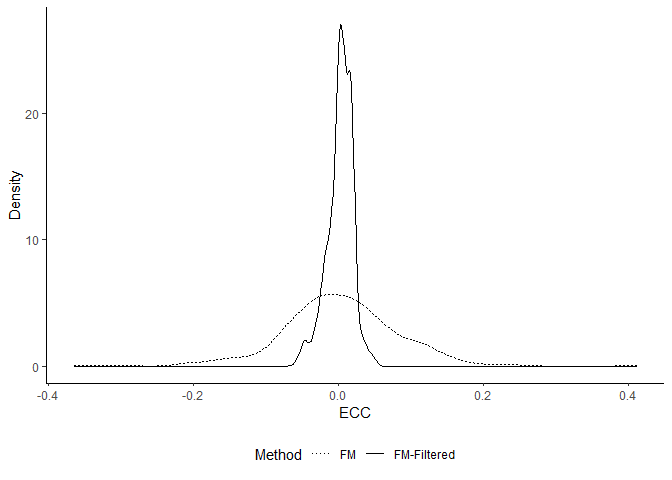<!-- --><!-- --><!-- --><!-- --><!-- -->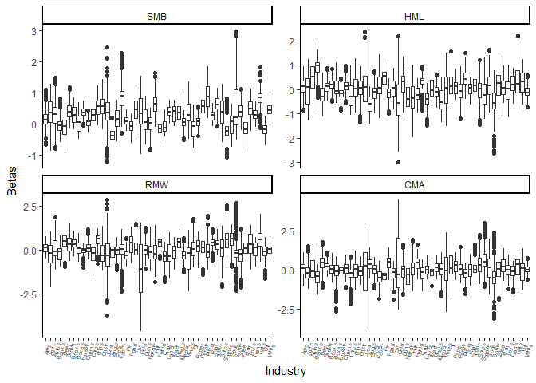<!-- --><!-- --><!-- --><!-- -->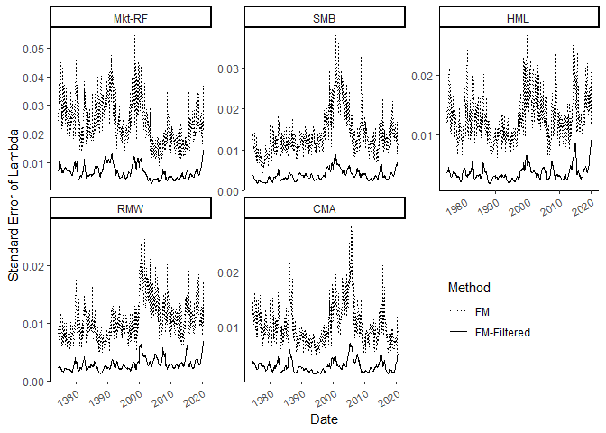<!-- -->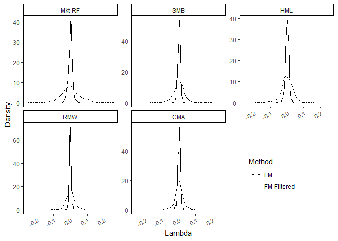<!-- --><!-- -->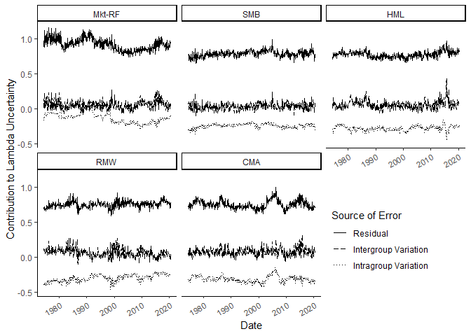<!-- --><!-- --><!-- --><!-- -->

Figures for Appendix:

<!-- -->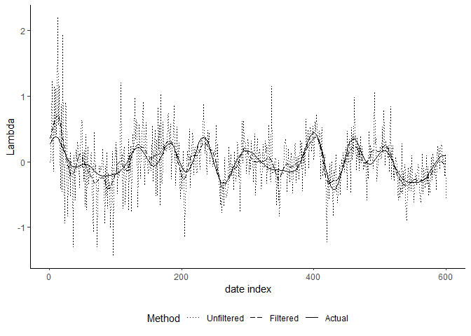<!-- --><!-- --><!-- --><!-- --><!-- -->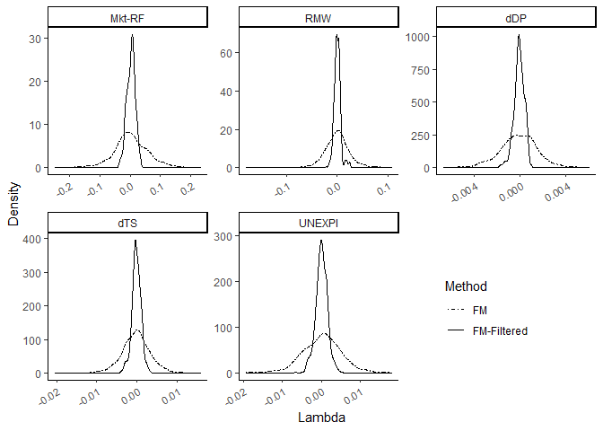<!-- --><!-- -->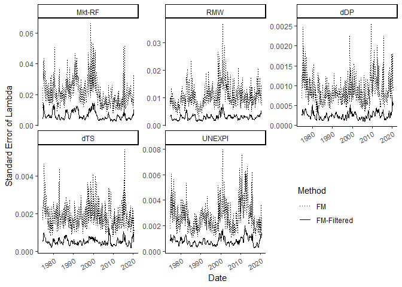<!-- --><!-- --><!-- -->

Here are the tables:

<table class="table table-striped" style="font-size: 10px; width: auto !important; margin-left: auto; margin-right: auto;">
<caption style="font-size: initial !important;">
FF5 Factors Lambda Stats
</caption>
<thead>
<tr>
<th style="text-align:center;">
Factors
</th>
<th style="text-align:center;">
method
</th>
<th style="text-align:center;">
Mean
</th>
<th style="text-align:center;">
Median
</th>
<th style="text-align:center;">
StdDev
</th>
<th style="text-align:center;">
5th Pct
</th>
<th style="text-align:center;">
95th Pct
</th>
<th style="text-align:center;">
T-test
</th>
<th style="text-align:center;">
F-test
</th>
</tr>
</thead>
<tbody>
<tr>
<td style="text-align:center;font-weight: bold;vertical-align: middle !important;" rowspan="2">
Mkt-RF
</td>
<td style="text-align:center;">
FM
</td>
<td style="text-align:center;">
0.0011
</td>
<td style="text-align:center;">
-0.0003
</td>
<td style="text-align:center;">
0.0597
</td>
<td style="text-align:center;">
-0.0897
</td>
<td style="text-align:center;">
0.1013
</td>
<td style="text-align:center;">
-0.035
</td>
<td style="text-align:center;">
22.77
</td>
</tr>
<tr>
<td style="text-align:center;">
Fil. FM
</td>
<td style="text-align:center;">
0.0012
</td>
<td style="text-align:center;">
0.0027
</td>
<td style="text-align:center;">
0.0125
</td>
<td style="text-align:center;">
-0.0209
</td>
<td style="text-align:center;">
0.0199
</td>
<td style="text-align:center;">
(0.97)
</td>
<td style="text-align:center;">
(0.00)
</td>
</tr>
<tr>
<td style="text-align:center;font-weight: bold;vertical-align: middle !important;" rowspan="2">
SMB
</td>
<td style="text-align:center;">
FM
</td>
<td style="text-align:center;">
0.0008
</td>
<td style="text-align:center;">
0.0003
</td>
<td style="text-align:center;">
0.0337
</td>
<td style="text-align:center;">
-0.0545
</td>
<td style="text-align:center;">
0.0526
</td>
<td style="text-align:center;">
-0.076
</td>
<td style="text-align:center;">
14.57
</td>
</tr>
<tr>
<td style="text-align:center;">
Fil. FM
</td>
<td style="text-align:center;">
0.0009
</td>
<td style="text-align:center;">
0.0019
</td>
<td style="text-align:center;">
0.0088
</td>
<td style="text-align:center;">
-0.0142
</td>
<td style="text-align:center;">
0.0135
</td>
<td style="text-align:center;">
(0.94)
</td>
<td style="text-align:center;">
(0.00)
</td>
</tr>
<tr>
<td style="text-align:center;font-weight: bold;vertical-align: middle !important;" rowspan="2">
HML
</td>
<td style="text-align:center;">
FM
</td>
<td style="text-align:center;">
0.0000
</td>
<td style="text-align:center;">
-0.0001
</td>
<td style="text-align:center;">
0.0358
</td>
<td style="text-align:center;">
-0.0578
</td>
<td style="text-align:center;">
0.0515
</td>
<td style="text-align:center;">
-0.326
</td>
<td style="text-align:center;">
10.81
</td>
</tr>
<tr>
<td style="text-align:center;">
Fil. FM
</td>
<td style="text-align:center;">
0.0005
</td>
<td style="text-align:center;">
0.0011
</td>
<td style="text-align:center;">
0.0109
</td>
<td style="text-align:center;">
-0.0180
</td>
<td style="text-align:center;">
0.0157
</td>
<td style="text-align:center;">
(0.74)
</td>
<td style="text-align:center;">
(0.00)
</td>
</tr>
<tr>
<td style="text-align:center;font-weight: bold;vertical-align: middle !important;" rowspan="2">
RMW
</td>
<td style="text-align:center;">
FM
</td>
<td style="text-align:center;">
-0.0001
</td>
<td style="text-align:center;">
0.0002
</td>
<td style="text-align:center;">
0.0280
</td>
<td style="text-align:center;">
-0.0406
</td>
<td style="text-align:center;">
0.0454
</td>
<td style="text-align:center;">
-0.021
</td>
<td style="text-align:center;">
20.89
</td>
</tr>
<tr>
<td style="text-align:center;">
Fil. FM
</td>
<td style="text-align:center;">
0.0000
</td>
<td style="text-align:center;">
-0.0002
</td>
<td style="text-align:center;">
0.0061
</td>
<td style="text-align:center;">
-0.0092
</td>
<td style="text-align:center;">
0.0091
</td>
<td style="text-align:center;">
(0.98)
</td>
<td style="text-align:center;">
(0.00)
</td>
</tr>
<tr>
<td style="text-align:center;font-weight: bold;vertical-align: middle !important;" rowspan="2">
CMA
</td>
<td style="text-align:center;">
FM
</td>
<td style="text-align:center;">
0.0017
</td>
<td style="text-align:center;">
0.0008
</td>
<td style="text-align:center;">
0.0256
</td>
<td style="text-align:center;">
-0.0402
</td>
<td style="text-align:center;">
0.0444
</td>
<td style="text-align:center;">
0.292
</td>
<td style="text-align:center;">
10.37
</td>
</tr>
<tr>
<td style="text-align:center;">
Fil. FM
</td>
<td style="text-align:center;">
0.0014
</td>
<td style="text-align:center;">
0.0027
</td>
<td style="text-align:center;">
0.0080
</td>
<td style="text-align:center;">
-0.0110
</td>
<td style="text-align:center;">
0.0122
</td>
<td style="text-align:center;">
(0.77)
</td>
<td style="text-align:center;">
(0.00)
</td>
</tr>
</tbody>
</table>
<table class="table table-striped" style="font-size: 10px; width: auto !important; margin-left: auto; margin-right: auto;">
<caption style="font-size: initial !important;">
PRS Factors Lambda Stats
</caption>
<thead>
<tr>
<th style="text-align:center;">
Factors
</th>
<th style="text-align:center;">
method
</th>
<th style="text-align:center;">
Mean
</th>
<th style="text-align:center;">
Median
</th>
<th style="text-align:center;">
StdDev
</th>
<th style="text-align:center;">
5th Pct
</th>
<th style="text-align:center;">
95th Pct
</th>
<th style="text-align:center;">
T-test
</th>
<th style="text-align:center;">
F-test
</th>
</tr>
</thead>
<tbody>
<tr>
<td style="text-align:center;font-weight: bold;vertical-align: middle !important;" rowspan="2">
Mkt-RF
</td>
<td style="text-align:center;">
FM
</td>
<td style="text-align:center;">
0.0031
</td>
<td style="text-align:center;">
0.0013
</td>
<td style="text-align:center;">
0.0604
</td>
<td style="text-align:center;">
-0.0899
</td>
<td style="text-align:center;">
0.1057
</td>
<td style="text-align:center;">
0.116
</td>
<td style="text-align:center;">
19.26
</td>
</tr>
<tr>
<td style="text-align:center;">
Fil. FM
</td>
<td style="text-align:center;">
0.0028
</td>
<td style="text-align:center;">
0.0045
</td>
<td style="text-align:center;">
0.0138
</td>
<td style="text-align:center;">
-0.0196
</td>
<td style="text-align:center;">
0.0241
</td>
<td style="text-align:center;">
(0.91)
</td>
<td style="text-align:center;">
(0.00)
</td>
</tr>
<tr>
<td style="text-align:center;font-weight: bold;vertical-align: middle !important;" rowspan="2">
RMW
</td>
<td style="text-align:center;">
FM
</td>
<td style="text-align:center;">
-0.0004
</td>
<td style="text-align:center;">
-0.0003
</td>
<td style="text-align:center;">
0.0271
</td>
<td style="text-align:center;">
-0.0399
</td>
<td style="text-align:center;">
0.0419
</td>
<td style="text-align:center;">
-0.39
</td>
<td style="text-align:center;">
17.71
</td>
</tr>
<tr>
<td style="text-align:center;">
Fil. FM
</td>
<td style="text-align:center;">
0.0001
</td>
<td style="text-align:center;">
-0.0002
</td>
<td style="text-align:center;">
0.0064
</td>
<td style="text-align:center;">
-0.0093
</td>
<td style="text-align:center;">
0.0084
</td>
<td style="text-align:center;">
(0.70)
</td>
<td style="text-align:center;">
(0.00)
</td>
</tr>
<tr>
<td style="text-align:center;font-weight: bold;vertical-align: middle !important;" rowspan="2">
dDP
</td>
<td style="text-align:center;">
FM
</td>
<td style="text-align:center;">
-0.0001
</td>
<td style="text-align:center;">
-0.0001
</td>
<td style="text-align:center;">
0.0017
</td>
<td style="text-align:center;">
-0.0030
</td>
<td style="text-align:center;">
0.0025
</td>
<td style="text-align:center;">
-0.324
</td>
<td style="text-align:center;">
14.21
</td>
</tr>
<tr>
<td style="text-align:center;">
Fil. FM
</td>
<td style="text-align:center;">
-0.0001
</td>
<td style="text-align:center;">
-0.0001
</td>
<td style="text-align:center;">
0.0004
</td>
<td style="text-align:center;">
-0.0008
</td>
<td style="text-align:center;">
0.0006
</td>
<td style="text-align:center;">
(0.75)
</td>
<td style="text-align:center;">
(0.00)
</td>
</tr>
<tr>
<td style="text-align:center;font-weight: bold;vertical-align: middle !important;" rowspan="2">
dTS
</td>
<td style="text-align:center;">
FM
</td>
<td style="text-align:center;">
-0.0003
</td>
<td style="text-align:center;">
-0.0002
</td>
<td style="text-align:center;">
0.0038
</td>
<td style="text-align:center;">
-0.0063
</td>
<td style="text-align:center;">
0.0057
</td>
<td style="text-align:center;">
-0.813
</td>
<td style="text-align:center;">
11.41
</td>
</tr>
<tr>
<td style="text-align:center;">
Fil. FM
</td>
<td style="text-align:center;">
-0.0001
</td>
<td style="text-align:center;">
-0.0002
</td>
<td style="text-align:center;">
0.0011
</td>
<td style="text-align:center;">
-0.0020
</td>
<td style="text-align:center;">
0.0016
</td>
<td style="text-align:center;">
(0.42)
</td>
<td style="text-align:center;">
(0.00)
</td>
</tr>
<tr>
<td style="text-align:center;font-weight: bold;vertical-align: middle !important;" rowspan="2">
UNEXPI
</td>
<td style="text-align:center;">
FM
</td>
<td style="text-align:center;">
0.0001
</td>
<td style="text-align:center;">
0.0004
</td>
<td style="text-align:center;">
0.0053
</td>
<td style="text-align:center;">
-0.0080
</td>
<td style="text-align:center;">
0.0082
</td>
<td style="text-align:center;">
0.207
</td>
<td style="text-align:center;">
12.31
</td>
</tr>
<tr>
<td style="text-align:center;">
Fil. FM
</td>
<td style="text-align:center;">
0.0001
</td>
<td style="text-align:center;">
0.0001
</td>
<td style="text-align:center;">
0.0015
</td>
<td style="text-align:center;">
-0.0026
</td>
<td style="text-align:center;">
0.0024
</td>
<td style="text-align:center;">
(0.84)
</td>
<td style="text-align:center;">
(0.00)
</td>
</tr>
</tbody>
</table>
