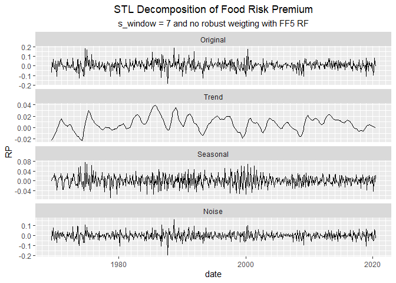
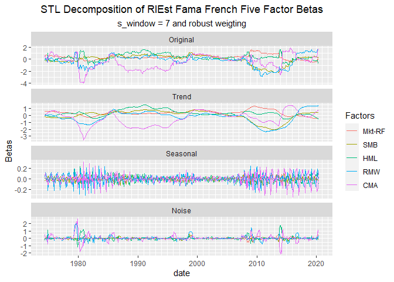
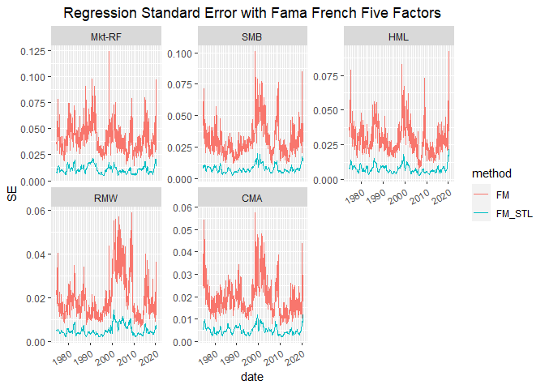
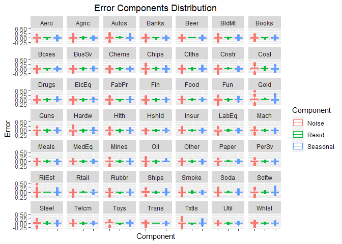

Industry Equity Cost of Capital
================
Mike Aguilar, Bob Connolly, and Jiaxi Li

-   [S1 Introduction](#s1-introduction)
-   [S2 Data](#s2-data)
    -   [S2-1 Industry Return and Fama French Five
        Factors](#s2-1-industry-return-and-fama-french-five-factors)
    -   [S2-2 Traded PRS Five Factors](#s2-2-traded-prs-five-factors)
-   [S3 First-Pass Regression](#s3-first-pass-regression)
    -   [S3-1 Fama French Five Factor
        Model](#s3-1-fama-french-five-factor-model)
        -   [S3-1-1 Full Sample
            Estimation](#s3-1-1-full-sample-estimation)
        -   [S3-1-2 Rolling Window
            Estimation](#s3-1-2-rolling-window-estimation)
        -   [S3-1-3 Full Sample Estimation with STL
            Trend](#s3-1-3-full-sample-estimation-with-stl-trend)
        -   [S3-1-4 Rolling Window Estimation with STL
            Trend](#s3-1-4-rolling-window-estimation-with-stl-trend)
    -   [S3-2 PRS Five Factor Model](#s3-2-prs-five-factor-model)
        -   [S3-2-1 Full Sample
            Estimation](#s3-2-1-full-sample-estimation)
        -   [S3-2-2 Rolling Window
            Estimation](#s3-2-2-rolling-window-estimation)
        -   [S3-2-3 Full Sample Estimation with STL
            Trend](#s3-2-3-full-sample-estimation-with-stl-trend)
        -   [S3-2-4 Rolling Window Estimation with STL
            Trend](#s3-2-4-rolling-window-estimation-with-stl-trend)
-   [S4 Factor Premium Estimation](#s4-factor-premium-estimation)
    -   [S4-1 Arithmetic Mean](#s4-1-arithmetic-mean)
    -   [S4-2 Geometric Mean](#s4-2-geometric-mean)
    -   [S4-3 Fama Macbeth Second Step
        Regression](#s4-3-fama-macbeth-second-step-regression)
    -   [S4-4 Fama Macbeth Second Step Regression with STL Deseaoned
        Data](#s4-4-fama-macbeth-second-step-regression-with-stl-deseaoned-data)
        -   [S4-4-1 STL Filtering](#s4-4-1-stl-filtering)
        -   [S4-4-2 Filtered Seasonality and Trend
            Strength](#s4-4-2-filtered-seasonality-and-trend-strength)
        -   [S4-4-3 Beta Decomposition](#s4-4-3-beta-decomposition)
        -   [S4-4-4 Filtered Second Pass
            Regression](#s4-4-4-filtered-second-pass-regression)
        -   [S4-4-5 Regression Standard
            Error](#s4-4-5-regression-standard-error)
        -   [S4-4-6 Unfiltered and Filtered
            Lambdas](#s4-4-6-unfiltered-and-filtered-lambdas)
        -   [S4-4-7 KS test and Stats](#s4-4-7-ks-test-and-stats)
    -   [S4-5 Why filtering might improve Esimated
        Lamdba?](#s4-5-why-filtering-might-improve-esimated-lamdba)
        -   [S4-5-1 Biased Regression](#s4-5-1-biased-regression)
        -   [S4-5-2 Simulation](#s4-5-2-simulation)
            -   [S4-5-2-1 Simulation with Random Parameters and Sin
                Lamdba](#s4-5-2-1-simulation-with-random-parameters-and-sin-lamdba)
            -   [S4-5-2-2 Simulation with Random Parameter and Random
                Smooth
                Lambda](#s4-5-2-2-simulation-with-random-parameter-and-random-smooth-lambda)
            -   [S4-5-2-3 Simulation with Actual Parameters and Smooth
                Lambdas](#s4-5-2-3-simulation-with-actual-parameters-and-smooth-lambdas)
            -   [S4-5-2-4 Regression Analysis of Simulation
                Results](#s4-5-2-4-regression-analysis-of-simulation-results)
-   [S5 Equity Cost of Captial](#s5-equity-cost-of-captial)
    -   [S5-1 Estimated Equity Cost of
        Captial](#s5-1-estimated-equity-cost-of-captial)
        -   [S5-1-1 Arithmetic Mean](#s5-1-1-arithmetic-mean)
        -   [S5-1-2 Geometric Mean](#s5-1-2-geometric-mean)
        -   [S5-1-3 Fama Macbeth Second Step
            Regression](#s5-1-3-fama-macbeth-second-step-regression)
        -   [S5-1-4 Fama Macbeth Second Step Regression with STL Trend
            Data](#s5-1-4-fama-macbeth-second-step-regression-with-stl-trend-data)
    -   [S5-2 Comparative Statics](#s5-2-comparative-statics)
    -   [S5-3 Bootstrap Standard Error](#s5-3-bootstrap-standard-error)
    -   [S5-4 Decomposition of the Equity Cost of
        Captial](#s5-4-decomposition-of-the-equity-cost-of-captial)
    -   [S5-5 Forcasting???](#s5-5-forcasting)
    -   [S5-6 ECC with Consumption
        Growth???](#s5-6-ecc-with-consumption-growth)
    -   [S5-7 Improve AM GM with Markov-switching
        model?](#s5-7-improve-am-gm-with-markov-switching-model)

# S1 Introduction

In 1997, Fama and French attempted to calculate the equity cost of
capital (ECC) for the industry portfolios. They employed the CAPM and
Fama French three-factor model and applied various techniques to
estimate the factor loadings. The conclusion was the ECC estimation is
not reliable due to the imprecise factor risk premium and the uncertain
risk loadings. It has been 23 years and we will try to find a possible
improvement of the ECC estimation in this paper.

For the model selection, we will apply the Fama French five-factor model
(2013) and the PRS five-factor model (2018). Since the five-factor model
is an update of the three-factor model, it should work better than the
three-factor model. Pukthuanthong et al. (2018) showed that there are 5
factors are reasonable: the market factor, profitability factor, and
traded version of credit spread, term spread, and unexpected inflation.
We will also use their result to form the Industry Equity Cost of
Capital.

We will use the 5-year rolling window to estimate the factor loadings of
the ECC. Many other methods such as Bayes shrinkage, and Levi-Welch
(2017) method. Levi and Welch tried to estimate the ECC while focusing
on the factor exposure estimation and let the reader choose their own
methods of expected factor premium. However, we found that the factor
risk premiums is the more important piece in ECC estimation. In this
paper, we will focus on finding a way to estimate the expected factor
premium better.

Many papers mentioned that the expected factor premiums are evolving. We
will therefore apply the Fama Macbeth (1973) method to estimate the
expected factor premium. Since the 2nd step regression result is
extremely volatile, we will apply the STL filtering to smooth the
result.

# S2 Data

We get the monthly industry return, Fama French five-factor, and the
risk-free rate for the Fama French five factors data from the [Ken
French Data
Library](https://mba.tuck.dartmouth.edu/pages/faculty/ken.french/data_library.html).
The market factor and profitability factor of the PRS five factors are
from the Fama French five factors. The other 3 traded macro factors and
risk-free rates are extracted from the [Federal Reserve Bank of
St. Louis Economic Data (FRED)](https://fred.stlouisfed.org/) and
constructed based on Pukthuanthong et al. (2018).

## S2-1 Industry Return and Fama French Five Factors

The [Fama French Five
Factors](https://mba.tuck.dartmouth.edu/pages/faculty/ken.french/data_library.html)
are simple returns from July 1963 to June 2020. They are as follows:
Rm-Rf, SMB, HML, RMW, CMA. The 49 Industry Portfolios are value-weighted
simple returns July 1926 to June 2020. The 49 Industry Portfolios
without any missing values started in July 1969, so we will start the
analysis in July 1969. The risk-free rate is one-month Treasury bill
rate.

## S2-2 Traded PRS Five Factors

In order to construct the traded version of PRS Factor, we first obtain
the risk-free rate and the raw CRR Five Factors: the Default Premium
(dDP), the Industrial Production Growth Rate (dIP), the Term Premium
(dTS), the Unexpected Inflation (UNEXPI), and the Change in Expected
Inflation (dEI). We obtained following macro variables from the Federal
Reserve Bank of St. Louis Economic Data: [Moody’s Seasoned Aaa Corporate
Bond Yield (Aaa)](https://fred.stlouisfed.org/series/AAA), [Moody’s
Seasoned Baa Corporate Bond Yield
(Baa)](https://fred.stlouisfed.org/series/BAA), [Industrial Production
Index (IP)](https://fred.stlouisfed.org/series/INDPRO), [10-Year
Treasury Constant Maturity Rate
(GS10)](https://fred.stlouisfed.org/series/GS10), [1-Year Treasury
Constant Maturity Rate (GS1)](https://fred.stlouisfed.org/series/GS1),
[Seasonally Adjusted CPI derived Inflation Rate
(INF)](https://fred.stlouisfed.org/series/CPIAUCSL), [University of
Michigan Inflation Expectation
(MICH)](https://fred.stlouisfed.org/series/MICH), [3-Month Treasury
Bill: Secondary Market Rate
(TB3MS)](https://fred.stlouisfed.org/series/TB3MS).

Here are the ways that the raw factors are calculated:

 - ln(IP_{t-1})")

![EXPINF\_{raw, t} = E\_{t-12}\[MICH\_t\]](https://latex.codecogs.com/png.latex?EXPINF_%7Braw%2C%20t%7D%20%3D%20E_%7Bt-12%7D%5BMICH_t%5D "EXPINF_{raw, t} = E_{t-12}[MICH_t]")

The Default Premium started in Janurary 1919; the Industrial Production
Growth Rate stared in Feburary 1919; the Term Premium started in April
1953; the Unexpected Inflation started in Janurary 1979; and the Change
in Expected Inflation started in Feburary 1979; 3-Month Treasury Bill:
Secondary Market Rate (TB3MS) started in Janurary 1934. Therefore, the
raw PRS factors would start in Feburary 1979. The Default Premium (dDP),
the Term Premium (dTS), the Unexpected Inflation (UNEXPI), the Change in
Expected Inflation (dEI), and 3-month Treasury Rate are annual rates so
they need to be converted to monthly frequency.

After obtaining the raw factors, we need to create the traded version of
these 5 factors. Similar to the Pukthuanthong et al. (2018) procedure,
we applied the 50 portfolios,
, (the ten
equal-weighted size portfolios, ten equal-weighted book-to-market
portfolios, ten equal-weighted investment portfolios and ten
equal-weighted operating profitability portfolios, and ten
value-weighted momentum portfolios) from the [Ken French Data
Library](https://mba.tuck.dartmouth.edu/pages/faculty/ken.french/data_library.html)
to construct the mimicking portfolios. These 50 portfolios all exist
after July 1963. We first regress each of the 50 assets against the raw
factors to get the coefficient matrix B (50x5) and the diagonal matrix
of the covariance matrix of the error term V (50x50). The weight of the
factor mimicking portfolio is
^{-1}B'V^{-1}").
The traded factors are PRS = wR, and they would start in July 1963.

# S3 First-Pass Regression

In this section, we will try to apply the simple first-pass regression
to estimate the betas of the 49 industry portfolios. The period would be
from July 1969 to June 2020. Since the focus of this paper is about the
factor risk premium estimation, we will use the most basic first pass
regressions (full sample and 5-year rolling window) to estimate the
betas and compare which lambda method would work better.

Here, we perform a one-step-ahead regression:

## S3-1 Fama French Five Factor Model

We will first apply the Fama French Five Factor Model to estimate the
betas. We will use the Five Factor Model as the base model.

### S3-1-1 Full Sample Estimation

<table class="table table-striped" style="font-size: 10px; width: auto !important; margin-left: auto; margin-right: auto;">
<caption style="font-size: initial !important;">
Fama French Five Factors
</caption>
<thead>
<tr>
<th style="empty-cells: hide;border-bottom:hidden;" colspan="1">
</th>
<th style="border-bottom:hidden;padding-bottom:0; padding-left:3px;padding-right:3px;text-align: center; " colspan="6">

Coefficients

</th>
<th style="border-bottom:hidden;padding-bottom:0; padding-left:3px;padding-right:3px;text-align: center; " colspan="6">

Std. Error

</th>
</tr>
<tr>
<th style="text-align:center;">
Industry
</th>
<th style="text-align:center;">
Alpha
</th>
<th style="text-align:center;">
Mkt-RF
</th>
<th style="text-align:center;">
SMB
</th>
<th style="text-align:center;">
HML
</th>
<th style="text-align:center;">
RMW
</th>
<th style="text-align:center;">
CMA
</th>
<th style="text-align:center;">
Alpha
</th>
<th style="text-align:center;">
Mkt-RF
</th>
<th style="text-align:center;">
SMB
</th>
<th style="text-align:center;">
HML
</th>
<th style="text-align:center;">
RMW
</th>
<th style="text-align:center;">
CMA
</th>
</tr>
</thead>
<tbody>
<tr>
<td style="text-align:center;font-weight: bold;">
Aero
</td>
<td style="text-align:center;">
0.0069751
</td>
<td style="text-align:center;">
0.1818065
</td>
<td style="text-align:center;">
0.0780464
</td>
<td style="text-align:center;">
0.0660396
</td>
<td style="text-align:center;">
-0.0353722
</td>
<td style="text-align:center;">
-0.1782401
</td>
<td style="text-align:center;">
0.0028740
</td>
<td style="text-align:center;">
0.0686100
</td>
<td style="text-align:center;">
0.0996401
</td>
<td style="text-align:center;">
0.1291886
</td>
<td style="text-align:center;">
0.1365051
</td>
<td style="text-align:center;">
0.2036073
</td>
</tr>
<tr>
<td style="text-align:center;font-weight: bold;">
Agric
</td>
<td style="text-align:center;">
0.0057957
</td>
<td style="text-align:center;">
0.0472194
</td>
<td style="text-align:center;">
0.0471530
</td>
<td style="text-align:center;">
-0.0580092
</td>
<td style="text-align:center;">
-0.0479229
</td>
<td style="text-align:center;">
-0.1149258
</td>
<td style="text-align:center;">
0.0027250
</td>
<td style="text-align:center;">
0.0650541
</td>
<td style="text-align:center;">
0.0944760
</td>
<td style="text-align:center;">
0.1224931
</td>
<td style="text-align:center;">
0.1294304
</td>
<td style="text-align:center;">
0.1930549
</td>
</tr>
<tr>
<td style="text-align:center;font-weight: bold;">
Autos
</td>
<td style="text-align:center;">
0.0046039
</td>
<td style="text-align:center;">
0.1671739
</td>
<td style="text-align:center;">
0.0054034
</td>
<td style="text-align:center;">
-0.1710038
</td>
<td style="text-align:center;">
-0.1625442
</td>
<td style="text-align:center;">
0.1332945
</td>
<td style="text-align:center;">
0.0029992
</td>
<td style="text-align:center;">
0.0715990
</td>
<td style="text-align:center;">
0.1039809
</td>
<td style="text-align:center;">
0.1348167
</td>
<td style="text-align:center;">
0.1424519
</td>
<td style="text-align:center;">
0.2124775
</td>
</tr>
<tr>
<td style="text-align:center;font-weight: bold;">
Banks
</td>
<td style="text-align:center;">
0.0054857
</td>
<td style="text-align:center;">
0.0706638
</td>
<td style="text-align:center;">
0.0584675
</td>
<td style="text-align:center;">
0.0531345
</td>
<td style="text-align:center;">
0.0032083
</td>
<td style="text-align:center;">
-0.0924357
</td>
<td style="text-align:center;">
0.0026110
</td>
<td style="text-align:center;">
0.0623331
</td>
<td style="text-align:center;">
0.0905243
</td>
<td style="text-align:center;">
0.1173696
</td>
<td style="text-align:center;">
0.1240167
</td>
<td style="text-align:center;">
0.1849800
</td>
</tr>
<tr>
<td style="text-align:center;font-weight: bold;">
Beer
</td>
<td style="text-align:center;">
0.0075629
</td>
<td style="text-align:center;">
0.0116456
</td>
<td style="text-align:center;">
-0.0090502
</td>
<td style="text-align:center;">
-0.0244192
</td>
<td style="text-align:center;">
0.0650901
</td>
<td style="text-align:center;">
-0.1248526
</td>
<td style="text-align:center;">
0.0022127
</td>
<td style="text-align:center;">
0.0528249
</td>
<td style="text-align:center;">
0.0767159
</td>
<td style="text-align:center;">
0.0994662
</td>
<td style="text-align:center;">
0.1050993
</td>
<td style="text-align:center;">
0.1567634
</td>
</tr>
<tr>
<td style="text-align:center;font-weight: bold;">
BldMt
</td>
<td style="text-align:center;">
0.0058429
</td>
<td style="text-align:center;">
0.1365818
</td>
<td style="text-align:center;">
-0.0214945
</td>
<td style="text-align:center;">
0.0535194
</td>
<td style="text-align:center;">
-0.0668346
</td>
<td style="text-align:center;">
-0.1126161
</td>
<td style="text-align:center;">
0.0027019
</td>
<td style="text-align:center;">
0.0645014
</td>
<td style="text-align:center;">
0.0936733
</td>
<td style="text-align:center;">
0.1214523
</td>
<td style="text-align:center;">
0.1283306
</td>
<td style="text-align:center;">
0.1914146
</td>
</tr>
<tr>
<td style="text-align:center;font-weight: bold;">
Books
</td>
<td style="text-align:center;">
0.0040937
</td>
<td style="text-align:center;">
0.1293250
</td>
<td style="text-align:center;">
0.1390773
</td>
<td style="text-align:center;">
0.0211622
</td>
<td style="text-align:center;">
0.0103553
</td>
<td style="text-align:center;">
-0.2214745
</td>
<td style="text-align:center;">
0.0025092
</td>
<td style="text-align:center;">
0.0599012
</td>
<td style="text-align:center;">
0.0869926
</td>
<td style="text-align:center;">
0.1127904
</td>
<td style="text-align:center;">
0.1191782
</td>
<td style="text-align:center;">
0.1777630
</td>
</tr>
<tr>
<td style="text-align:center;font-weight: bold;">
Boxes
</td>
<td style="text-align:center;">
0.0059441
</td>
<td style="text-align:center;">
-0.0023580
</td>
<td style="text-align:center;">
0.0776978
</td>
<td style="text-align:center;">
0.0203439
</td>
<td style="text-align:center;">
0.0212049
</td>
<td style="text-align:center;">
-0.0718049
</td>
<td style="text-align:center;">
0.0024393
</td>
<td style="text-align:center;">
0.0582334
</td>
<td style="text-align:center;">
0.0845706
</td>
<td style="text-align:center;">
0.1096502
</td>
<td style="text-align:center;">
0.1158601
</td>
<td style="text-align:center;">
0.1728139
</td>
</tr>
<tr>
<td style="text-align:center;font-weight: bold;">
BusSv
</td>
<td style="text-align:center;">
0.0062993
</td>
<td style="text-align:center;">
0.0772582
</td>
<td style="text-align:center;">
0.0049330
</td>
<td style="text-align:center;">
-0.1360406
</td>
<td style="text-align:center;">
-0.0637766
</td>
<td style="text-align:center;">
-0.0882478
</td>
<td style="text-align:center;">
0.0024367
</td>
<td style="text-align:center;">
0.0581706
</td>
<td style="text-align:center;">
0.0844793
</td>
<td style="text-align:center;">
0.1095319
</td>
<td style="text-align:center;">
0.1157351
</td>
<td style="text-align:center;">
0.1726274
</td>
</tr>
<tr>
<td style="text-align:center;font-weight: bold;">
Chems
</td>
<td style="text-align:center;">
0.0062332
</td>
<td style="text-align:center;">
0.0058380
</td>
<td style="text-align:center;">
0.0239570
</td>
<td style="text-align:center;">
-0.0226123
</td>
<td style="text-align:center;">
-0.0545055
</td>
<td style="text-align:center;">
-0.0343020
</td>
<td style="text-align:center;">
0.0024575
</td>
<td style="text-align:center;">
0.0586687
</td>
<td style="text-align:center;">
0.0852027
</td>
<td style="text-align:center;">
0.1104699
</td>
<td style="text-align:center;">
0.1167262
</td>
<td style="text-align:center;">
0.1741057
</td>
</tr>
<tr>
<td style="text-align:center;font-weight: bold;">
Chips
</td>
<td style="text-align:center;">
0.0081409
</td>
<td style="text-align:center;">
0.0486612
</td>
<td style="text-align:center;">
0.0221514
</td>
<td style="text-align:center;">
-0.1348998
</td>
<td style="text-align:center;">
-0.1900550
</td>
<td style="text-align:center;">
-0.0394462
</td>
<td style="text-align:center;">
0.0031965
</td>
<td style="text-align:center;">
0.0763104
</td>
<td style="text-align:center;">
0.1108232
</td>
<td style="text-align:center;">
0.1436881
</td>
<td style="text-align:center;">
0.1518257
</td>
<td style="text-align:center;">
0.2264592
</td>
</tr>
<tr>
<td style="text-align:center;font-weight: bold;">
Clths
</td>
<td style="text-align:center;">
0.0064694
</td>
<td style="text-align:center;">
0.1183436
</td>
<td style="text-align:center;">
0.1554010
</td>
<td style="text-align:center;">
-0.0537252
</td>
<td style="text-align:center;">
0.0490962
</td>
<td style="text-align:center;">
-0.1617711
</td>
<td style="text-align:center;">
0.0028029
</td>
<td style="text-align:center;">
0.0669125
</td>
<td style="text-align:center;">
0.0971750
</td>
<td style="text-align:center;">
0.1259925
</td>
<td style="text-align:center;">
0.1331279
</td>
<td style="text-align:center;">
0.1985700
</td>
</tr>
<tr>
<td style="text-align:center;font-weight: bold;">
Cnstr
</td>
<td style="text-align:center;">
0.0040221
</td>
<td style="text-align:center;">
0.1947740
</td>
<td style="text-align:center;">
0.0128165
</td>
<td style="text-align:center;">
-0.0239011
</td>
<td style="text-align:center;">
0.0246071
</td>
<td style="text-align:center;">
-0.0115246
</td>
<td style="text-align:center;">
0.0031107
</td>
<td style="text-align:center;">
0.0742616
</td>
<td style="text-align:center;">
0.1078477
</td>
<td style="text-align:center;">
0.1398302
</td>
<td style="text-align:center;">
0.1477494
</td>
<td style="text-align:center;">
0.2203790
</td>
</tr>
<tr>
<td style="text-align:center;font-weight: bold;">
Coal
</td>
<td style="text-align:center;">
0.0047068
</td>
<td style="text-align:center;">
0.0405148
</td>
<td style="text-align:center;">
-0.0311444
</td>
<td style="text-align:center;">
-0.0920271
</td>
<td style="text-align:center;">
-0.2251279
</td>
<td style="text-align:center;">
0.2165852
</td>
<td style="text-align:center;">
0.0046352
</td>
<td style="text-align:center;">
0.1106551
</td>
<td style="text-align:center;">
0.1607009
</td>
<td style="text-align:center;">
0.2083572
</td>
<td style="text-align:center;">
0.2201573
</td>
<td style="text-align:center;">
0.3283808
</td>
</tr>
<tr>
<td style="text-align:center;font-weight: bold;">
Drugs
</td>
<td style="text-align:center;">
0.0074009
</td>
<td style="text-align:center;">
-0.0492037
</td>
<td style="text-align:center;">
0.0380664
</td>
<td style="text-align:center;">
-0.0443624
</td>
<td style="text-align:center;">
0.1372199
</td>
<td style="text-align:center;">
-0.1521105
</td>
<td style="text-align:center;">
0.0021291
</td>
<td style="text-align:center;">
0.0508274
</td>
<td style="text-align:center;">
0.0738150
</td>
<td style="text-align:center;">
0.0957051
</td>
<td style="text-align:center;">
0.1011252
</td>
<td style="text-align:center;">
0.1508357
</td>
</tr>
<tr>
<td style="text-align:center;font-weight: bold;">
ElcEq
</td>
<td style="text-align:center;">
0.0080113
</td>
<td style="text-align:center;">
0.0299915
</td>
<td style="text-align:center;">
0.0546435
</td>
<td style="text-align:center;">
-0.0496354
</td>
<td style="text-align:center;">
-0.1488087
</td>
<td style="text-align:center;">
-0.0851898
</td>
<td style="text-align:center;">
0.0027007
</td>
<td style="text-align:center;">
0.0644747
</td>
<td style="text-align:center;">
0.0936346
</td>
<td style="text-align:center;">
0.1214022
</td>
<td style="text-align:center;">
0.1282776
</td>
<td style="text-align:center;">
0.1913355
</td>
</tr>
<tr>
<td style="text-align:center;font-weight: bold;">
FabPr
</td>
<td style="text-align:center;">
0.0022057
</td>
<td style="text-align:center;">
0.2566900
</td>
<td style="text-align:center;">
-0.0136212
</td>
<td style="text-align:center;">
-0.0355429
</td>
<td style="text-align:center;">
-0.0716550
</td>
<td style="text-align:center;">
-0.0383378
</td>
<td style="text-align:center;">
0.0031110
</td>
<td style="text-align:center;">
0.0742692
</td>
<td style="text-align:center;">
0.1078587
</td>
<td style="text-align:center;">
0.1398445
</td>
<td style="text-align:center;">
0.1477645
</td>
<td style="text-align:center;">
0.2204016
</td>
</tr>
<tr>
<td style="text-align:center;font-weight: bold;">
Fin
</td>
<td style="text-align:center;">
0.0073622
</td>
<td style="text-align:center;">
0.0931335
</td>
<td style="text-align:center;">
0.0121659
</td>
<td style="text-align:center;">
-0.1099708
</td>
<td style="text-align:center;">
-0.1715332
</td>
<td style="text-align:center;">
-0.0402296
</td>
<td style="text-align:center;">
0.0026540
</td>
<td style="text-align:center;">
0.0633597
</td>
<td style="text-align:center;">
0.0920152
</td>
<td style="text-align:center;">
0.1193026
</td>
<td style="text-align:center;">
0.1260591
</td>
<td style="text-align:center;">
0.1880265
</td>
</tr>
<tr>
<td style="text-align:center;font-weight: bold;">
Food
</td>
<td style="text-align:center;">
0.0066249
</td>
<td style="text-align:center;">
-0.0184423
</td>
<td style="text-align:center;">
0.1343524
</td>
<td style="text-align:center;">
0.0028876
</td>
<td style="text-align:center;">
0.0554494
</td>
<td style="text-align:center;">
-0.0115603
</td>
<td style="text-align:center;">
0.0019016
</td>
<td style="text-align:center;">
0.0453968
</td>
<td style="text-align:center;">
0.0659283
</td>
<td style="text-align:center;">
0.0854795
</td>
<td style="text-align:center;">
0.0903205
</td>
<td style="text-align:center;">
0.1347197
</td>
</tr>
<tr>
<td style="text-align:center;font-weight: bold;">
Fun
</td>
<td style="text-align:center;">
0.0100564
</td>
<td style="text-align:center;">
0.1383295
</td>
<td style="text-align:center;">
0.0591120
</td>
<td style="text-align:center;">
0.1608585
</td>
<td style="text-align:center;">
-0.1869571
</td>
<td style="text-align:center;">
-0.4120183
</td>
<td style="text-align:center;">
0.0032654
</td>
<td style="text-align:center;">
0.0779546
</td>
<td style="text-align:center;">
0.1132110
</td>
<td style="text-align:center;">
0.1467840
</td>
<td style="text-align:center;">
0.1550969
</td>
<td style="text-align:center;">
0.2313385
</td>
</tr>
<tr>
<td style="text-align:center;font-weight: bold;">
Gold
</td>
<td style="text-align:center;">
0.0039957
</td>
<td style="text-align:center;">
-0.0068878
</td>
<td style="text-align:center;">
-0.0347206
</td>
<td style="text-align:center;">
-0.3631521
</td>
<td style="text-align:center;">
0.1904613
</td>
<td style="text-align:center;">
0.7143887
</td>
<td style="text-align:center;">
0.0045708
</td>
<td style="text-align:center;">
0.1091180
</td>
<td style="text-align:center;">
0.1584686
</td>
<td style="text-align:center;">
0.2054629
</td>
<td style="text-align:center;">
0.2170990
</td>
<td style="text-align:center;">
0.3238191
</td>
</tr>
<tr>
<td style="text-align:center;font-weight: bold;">
Guns
</td>
<td style="text-align:center;">
0.0084791
</td>
<td style="text-align:center;">
0.1129456
</td>
<td style="text-align:center;">
-0.0135175
</td>
<td style="text-align:center;">
-0.0008728
</td>
<td style="text-align:center;">
0.0034802
</td>
<td style="text-align:center;">
0.0314818
</td>
<td style="text-align:center;">
0.0027766
</td>
<td style="text-align:center;">
0.0662857
</td>
<td style="text-align:center;">
0.0962647
</td>
<td style="text-align:center;">
0.1248122
</td>
<td style="text-align:center;">
0.1318808
</td>
<td style="text-align:center;">
0.1967099
</td>
</tr>
<tr>
<td style="text-align:center;font-weight: bold;">
Hardw
</td>
<td style="text-align:center;">
0.0060461
</td>
<td style="text-align:center;">
0.0653903
</td>
<td style="text-align:center;">
-0.0394103
</td>
<td style="text-align:center;">
-0.2080799
</td>
<td style="text-align:center;">
-0.2199526
</td>
<td style="text-align:center;">
-0.0259030
</td>
<td style="text-align:center;">
0.0030309
</td>
<td style="text-align:center;">
0.0723577
</td>
<td style="text-align:center;">
0.1050828
</td>
<td style="text-align:center;">
0.1362454
</td>
<td style="text-align:center;">
0.1439615
</td>
<td style="text-align:center;">
0.2147291
</td>
</tr>
<tr>
<td style="text-align:center;font-weight: bold;">
Hlth
</td>
<td style="text-align:center;">
0.0053062
</td>
<td style="text-align:center;">
0.1993900
</td>
<td style="text-align:center;">
0.1711320
</td>
<td style="text-align:center;">
-0.0762070
</td>
<td style="text-align:center;">
0.0685335
</td>
<td style="text-align:center;">
-0.0900037
</td>
<td style="text-align:center;">
0.0033928
</td>
<td style="text-align:center;">
0.0809963
</td>
<td style="text-align:center;">
0.1176283
</td>
<td style="text-align:center;">
0.1525113
</td>
<td style="text-align:center;">
0.1611486
</td>
<td style="text-align:center;">
0.2403650
</td>
</tr>
<tr>
<td style="text-align:center;font-weight: bold;">
Hshld
</td>
<td style="text-align:center;">
0.0044695
</td>
<td style="text-align:center;">
0.0580517
</td>
<td style="text-align:center;">
0.0089545
</td>
<td style="text-align:center;">
0.0895072
</td>
<td style="text-align:center;">
0.2019239
</td>
<td style="text-align:center;">
-0.2550788
</td>
<td style="text-align:center;">
0.0019700
</td>
<td style="text-align:center;">
0.0470308
</td>
<td style="text-align:center;">
0.0683014
</td>
<td style="text-align:center;">
0.0885563
</td>
<td style="text-align:center;">
0.0935716
</td>
<td style="text-align:center;">
0.1395689
</td>
</tr>
<tr>
<td style="text-align:center;font-weight: bold;">
Insur
</td>
<td style="text-align:center;">
0.0072220
</td>
<td style="text-align:center;">
0.0279619
</td>
<td style="text-align:center;">
0.0113575
</td>
<td style="text-align:center;">
0.0320614
</td>
<td style="text-align:center;">
-0.1098542
</td>
<td style="text-align:center;">
-0.1687918
</td>
<td style="text-align:center;">
0.0023434
</td>
<td style="text-align:center;">
0.0559444
</td>
<td style="text-align:center;">
0.0812463
</td>
<td style="text-align:center;">
0.1053401
</td>
<td style="text-align:center;">
0.1113059
</td>
<td style="text-align:center;">
0.1660209
</td>
</tr>
<tr>
<td style="text-align:center;font-weight: bold;">
LabEq
</td>
<td style="text-align:center;">
0.0074161
</td>
<td style="text-align:center;">
0.0937510
</td>
<td style="text-align:center;">
0.0196201
</td>
<td style="text-align:center;">
0.0229449
</td>
<td style="text-align:center;">
-0.1586310
</td>
<td style="text-align:center;">
-0.2432368
</td>
<td style="text-align:center;">
0.0029993
</td>
<td style="text-align:center;">
0.0716033
</td>
<td style="text-align:center;">
0.1039872
</td>
<td style="text-align:center;">
0.1348250
</td>
<td style="text-align:center;">
0.1424606
</td>
<td style="text-align:center;">
0.2124905
</td>
</tr>
<tr>
<td style="text-align:center;font-weight: bold;">
Mach
</td>
<td style="text-align:center;">
0.0065241
</td>
<td style="text-align:center;">
0.0602864
</td>
<td style="text-align:center;">
-0.0049022
</td>
<td style="text-align:center;">
0.0191631
</td>
<td style="text-align:center;">
-0.1273243
</td>
<td style="text-align:center;">
-0.1954189
</td>
<td style="text-align:center;">
0.0027157
</td>
<td style="text-align:center;">
0.0648321
</td>
<td style="text-align:center;">
0.0941536
</td>
<td style="text-align:center;">
0.1220751
</td>
<td style="text-align:center;">
0.1289887
</td>
<td style="text-align:center;">
0.1923961
</td>
</tr>
<tr>
<td style="text-align:center;font-weight: bold;">
Meals
</td>
<td style="text-align:center;">
0.0066446
</td>
<td style="text-align:center;">
0.0811832
</td>
<td style="text-align:center;">
0.0786702
</td>
<td style="text-align:center;">
0.0278872
</td>
<td style="text-align:center;">
-0.0494361
</td>
<td style="text-align:center;">
-0.1905590
</td>
<td style="text-align:center;">
0.0025752
</td>
<td style="text-align:center;">
0.0614773
</td>
<td style="text-align:center;">
0.0892816
</td>
<td style="text-align:center;">
0.1157583
</td>
<td style="text-align:center;">
0.1223141
</td>
<td style="text-align:center;">
0.1824405
</td>
</tr>
<tr>
<td style="text-align:center;font-weight: bold;">
MedEq
</td>
<td style="text-align:center;">
0.0071297
</td>
<td style="text-align:center;">
0.0389573
</td>
<td style="text-align:center;">
0.0617667
</td>
<td style="text-align:center;">
-0.0583161
</td>
<td style="text-align:center;">
0.0372788
</td>
<td style="text-align:center;">
-0.2141767
</td>
<td style="text-align:center;">
0.0022404
</td>
<td style="text-align:center;">
0.0534858
</td>
<td style="text-align:center;">
0.0776758
</td>
<td style="text-align:center;">
0.1007107
</td>
<td style="text-align:center;">
0.1064144
</td>
<td style="text-align:center;">
0.1587248
</td>
</tr>
<tr>
<td style="text-align:center;font-weight: bold;">
Mines
</td>
<td style="text-align:center;">
0.0060282
</td>
<td style="text-align:center;">
0.1160768
</td>
<td style="text-align:center;">
0.0207737
</td>
<td style="text-align:center;">
-0.1446353
</td>
<td style="text-align:center;">
-0.0778100
</td>
<td style="text-align:center;">
-0.0467210
</td>
<td style="text-align:center;">
0.0032280
</td>
<td style="text-align:center;">
0.0770609
</td>
<td style="text-align:center;">
0.1119131
</td>
<td style="text-align:center;">
0.1451012
</td>
<td style="text-align:center;">
0.1533188
</td>
<td style="text-align:center;">
0.2286863
</td>
</tr>
<tr>
<td style="text-align:center;font-weight: bold;">
Oil
</td>
<td style="text-align:center;">
0.0053774
</td>
<td style="text-align:center;">
-0.0219412
</td>
<td style="text-align:center;">
0.0188315
</td>
<td style="text-align:center;">
-0.0546044
</td>
<td style="text-align:center;">
-0.1457610
</td>
<td style="text-align:center;">
0.1738918
</td>
<td style="text-align:center;">
0.0025487
</td>
<td style="text-align:center;">
0.0608448
</td>
<td style="text-align:center;">
0.0883630
</td>
<td style="text-align:center;">
0.1145673
</td>
<td style="text-align:center;">
0.1210556
</td>
<td style="text-align:center;">
0.1805634
</td>
</tr>
<tr>
<td style="text-align:center;font-weight: bold;">
Other
</td>
<td style="text-align:center;">
0.0007358
</td>
<td style="text-align:center;">
0.0922992
</td>
<td style="text-align:center;">
0.0426236
</td>
<td style="text-align:center;">
0.1452131
</td>
<td style="text-align:center;">
-0.0243612
</td>
<td style="text-align:center;">
-0.3487050
</td>
<td style="text-align:center;">
0.0028674
</td>
<td style="text-align:center;">
0.0684546
</td>
<td style="text-align:center;">
0.0994144
</td>
<td style="text-align:center;">
0.1288961
</td>
<td style="text-align:center;">
0.1361959
</td>
<td style="text-align:center;">
0.2031463
</td>
</tr>
<tr>
<td style="text-align:center;font-weight: bold;">
Paper
</td>
<td style="text-align:center;">
0.0062026
</td>
<td style="text-align:center;">
-0.0001250
</td>
<td style="text-align:center;">
0.0541570
</td>
<td style="text-align:center;">
0.1167985
</td>
<td style="text-align:center;">
-0.0488818
</td>
<td style="text-align:center;">
-0.2917503
</td>
<td style="text-align:center;">
0.0023555
</td>
<td style="text-align:center;">
0.0562331
</td>
<td style="text-align:center;">
0.0816656
</td>
<td style="text-align:center;">
0.1058838
</td>
<td style="text-align:center;">
0.1118804
</td>
<td style="text-align:center;">
0.1668778
</td>
</tr>
<tr>
<td style="text-align:center;font-weight: bold;">
PerSv
</td>
<td style="text-align:center;">
0.0021187
</td>
<td style="text-align:center;">
0.0477990
</td>
<td style="text-align:center;">
0.0917074
</td>
<td style="text-align:center;">
0.1383720
</td>
<td style="text-align:center;">
-0.0363344
</td>
<td style="text-align:center;">
-0.2568702
</td>
<td style="text-align:center;">
0.0028369
</td>
<td style="text-align:center;">
0.0677245
</td>
<td style="text-align:center;">
0.0983541
</td>
<td style="text-align:center;">
0.1275213
</td>
<td style="text-align:center;">
0.1347433
</td>
<td style="text-align:center;">
0.2009795
</td>
</tr>
<tr>
<td style="text-align:center;font-weight: bold;">
RlEst
</td>
<td style="text-align:center;">
-0.0006049
</td>
<td style="text-align:center;">
0.3657394
</td>
<td style="text-align:center;">
0.0435370
</td>
<td style="text-align:center;">
0.1363206
</td>
<td style="text-align:center;">
-0.1136588
</td>
<td style="text-align:center;">
-0.0166327
</td>
<td style="text-align:center;">
0.0032907
</td>
<td style="text-align:center;">
0.0785596
</td>
<td style="text-align:center;">
0.1140896
</td>
<td style="text-align:center;">
0.1479232
</td>
<td style="text-align:center;">
0.1563007
</td>
<td style="text-align:center;">
0.2331339
</td>
</tr>
<tr>
<td style="text-align:center;font-weight: bold;">
Rtail
</td>
<td style="text-align:center;">
0.0075869
</td>
<td style="text-align:center;">
0.0270341
</td>
<td style="text-align:center;">
0.0671041
</td>
<td style="text-align:center;">
-0.1826936
</td>
<td style="text-align:center;">
-0.0707252
</td>
<td style="text-align:center;">
0.0049935
</td>
<td style="text-align:center;">
0.0023419
</td>
<td style="text-align:center;">
0.0559084
</td>
<td style="text-align:center;">
0.0811940
</td>
<td style="text-align:center;">
0.1052723
</td>
<td style="text-align:center;">
0.1112342
</td>
<td style="text-align:center;">
0.1659140
</td>
</tr>
<tr>
<td style="text-align:center;font-weight: bold;">
Rubbr
</td>
<td style="text-align:center;">
0.0050805
</td>
<td style="text-align:center;">
0.1737768
</td>
<td style="text-align:center;">
-0.0072318
</td>
<td style="text-align:center;">
0.0577932
</td>
<td style="text-align:center;">
0.1541259
</td>
<td style="text-align:center;">
-0.0809827
</td>
<td style="text-align:center;">
0.0025545
</td>
<td style="text-align:center;">
0.0609833
</td>
<td style="text-align:center;">
0.0885641
</td>
<td style="text-align:center;">
0.1148280
</td>
<td style="text-align:center;">
0.1213312
</td>
<td style="text-align:center;">
0.1809744
</td>
</tr>
<tr>
<td style="text-align:center;font-weight: bold;">
Ships
</td>
<td style="text-align:center;">
0.0063855
</td>
<td style="text-align:center;">
0.1127523
</td>
<td style="text-align:center;">
0.0098347
</td>
<td style="text-align:center;">
0.2424500
</td>
<td style="text-align:center;">
-0.1056866
</td>
<td style="text-align:center;">
-0.2615009
</td>
<td style="text-align:center;">
0.0031498
</td>
<td style="text-align:center;">
0.0751940
</td>
<td style="text-align:center;">
0.1092019
</td>
<td style="text-align:center;">
0.1415860
</td>
<td style="text-align:center;">
0.1496046
</td>
<td style="text-align:center;">
0.2231462
</td>
</tr>
<tr>
<td style="text-align:center;font-weight: bold;">
Smoke
</td>
<td style="text-align:center;">
0.0082874
</td>
<td style="text-align:center;">
0.0455762
</td>
<td style="text-align:center;">
0.0546170
</td>
<td style="text-align:center;">
0.0452721
</td>
<td style="text-align:center;">
0.1964077
</td>
<td style="text-align:center;">
0.1984593
</td>
<td style="text-align:center;">
0.0026279
</td>
<td style="text-align:center;">
0.0627353
</td>
<td style="text-align:center;">
0.0911085
</td>
<td style="text-align:center;">
0.1181270
</td>
<td style="text-align:center;">
0.1248170
</td>
<td style="text-align:center;">
0.1861737
</td>
</tr>
<tr>
<td style="text-align:center;font-weight: bold;">
Soda
</td>
<td style="text-align:center;">
0.0073621
</td>
<td style="text-align:center;">
0.0198543
</td>
<td style="text-align:center;">
0.0672116
</td>
<td style="text-align:center;">
0.0013144
</td>
<td style="text-align:center;">
0.0239713
</td>
<td style="text-align:center;">
-0.1539304
</td>
<td style="text-align:center;">
0.0027411
</td>
<td style="text-align:center;">
0.0654393
</td>
<td style="text-align:center;">
0.0950355
</td>
<td style="text-align:center;">
0.1232185
</td>
<td style="text-align:center;">
0.1301969
</td>
<td style="text-align:center;">
0.1941982
</td>
</tr>
<tr>
<td style="text-align:center;font-weight: bold;">
Softw
</td>
<td style="text-align:center;">
0.0064489
</td>
<td style="text-align:center;">
0.1478989
</td>
<td style="text-align:center;">
0.0313978
</td>
<td style="text-align:center;">
-0.3039965
</td>
<td style="text-align:center;">
-0.0928374
</td>
<td style="text-align:center;">
0.1830056
</td>
<td style="text-align:center;">
0.0044492
</td>
<td style="text-align:center;">
0.1062151
</td>
<td style="text-align:center;">
0.1542527
</td>
<td style="text-align:center;">
0.1999968
</td>
<td style="text-align:center;">
0.2113234
</td>
<td style="text-align:center;">
0.3152044
</td>
</tr>
<tr>
<td style="text-align:center;font-weight: bold;">
Steel
</td>
<td style="text-align:center;">
0.0032854
</td>
<td style="text-align:center;">
0.0888274
</td>
<td style="text-align:center;">
-0.1168638
</td>
<td style="text-align:center;">
-0.0055621
</td>
<td style="text-align:center;">
-0.1861787
</td>
<td style="text-align:center;">
-0.0610338
</td>
<td style="text-align:center;">
0.0032680
</td>
<td style="text-align:center;">
0.0780174
</td>
<td style="text-align:center;">
0.1133021
</td>
<td style="text-align:center;">
0.1469022
</td>
<td style="text-align:center;">
0.1552218
</td>
<td style="text-align:center;">
0.2315248
</td>
</tr>
<tr>
<td style="text-align:center;font-weight: bold;">
Telcm
</td>
<td style="text-align:center;">
0.0065979
</td>
<td style="text-align:center;">
-0.0139257
</td>
<td style="text-align:center;">
-0.0517788
</td>
<td style="text-align:center;">
0.0063251
</td>
<td style="text-align:center;">
-0.2717073
</td>
<td style="text-align:center;">
-0.1049302
</td>
<td style="text-align:center;">
0.0020018
</td>
<td style="text-align:center;">
0.0477894
</td>
<td style="text-align:center;">
0.0694030
</td>
<td style="text-align:center;">
0.0899847
</td>
<td style="text-align:center;">
0.0950808
</td>
<td style="text-align:center;">
0.1418200
</td>
</tr>
<tr>
<td style="text-align:center;font-weight: bold;">
Toys
</td>
<td style="text-align:center;">
0.0033808
</td>
<td style="text-align:center;">
0.1414629
</td>
<td style="text-align:center;">
0.0532020
</td>
<td style="text-align:center;">
0.0200458
</td>
<td style="text-align:center;">
0.0115463
</td>
<td style="text-align:center;">
-0.1060666
</td>
<td style="text-align:center;">
0.0030533
</td>
<td style="text-align:center;">
0.0728903
</td>
<td style="text-align:center;">
0.1058563
</td>
<td style="text-align:center;">
0.1372483
</td>
<td style="text-align:center;">
0.1450212
</td>
<td style="text-align:center;">
0.2163097
</td>
</tr>
<tr>
<td style="text-align:center;font-weight: bold;">
Trans
</td>
<td style="text-align:center;">
0.0056395
</td>
<td style="text-align:center;">
0.0370303
</td>
<td style="text-align:center;">
0.0919023
</td>
<td style="text-align:center;">
0.0721208
</td>
<td style="text-align:center;">
-0.0582365
</td>
<td style="text-align:center;">
-0.1601582
</td>
<td style="text-align:center;">
0.0024936
</td>
<td style="text-align:center;">
0.0595295
</td>
<td style="text-align:center;">
0.0864528
</td>
<td style="text-align:center;">
0.1120906
</td>
<td style="text-align:center;">
0.1184387
</td>
<td style="text-align:center;">
0.1766601
</td>
</tr>
<tr>
<td style="text-align:center;font-weight: bold;">
Txtls
</td>
<td style="text-align:center;">
0.0044571
</td>
<td style="text-align:center;">
0.2285255
</td>
<td style="text-align:center;">
0.0292678
</td>
<td style="text-align:center;">
0.2678720
</td>
<td style="text-align:center;">
-0.1044838
</td>
<td style="text-align:center;">
-0.2887349
</td>
<td style="text-align:center;">
0.0031516
</td>
<td style="text-align:center;">
0.0752381
</td>
<td style="text-align:center;">
0.1092659
</td>
<td style="text-align:center;">
0.1416690
</td>
<td style="text-align:center;">
0.1496923
</td>
<td style="text-align:center;">
0.2232771
</td>
</tr>
<tr>
<td style="text-align:center;font-weight: bold;">
Util
</td>
<td style="text-align:center;">
0.0054446
</td>
<td style="text-align:center;">
0.0052351
</td>
<td style="text-align:center;">
-0.1234120
</td>
<td style="text-align:center;">
0.0490449
</td>
<td style="text-align:center;">
-0.1105146
</td>
<td style="text-align:center;">
-0.0547537
</td>
<td style="text-align:center;">
0.0017332
</td>
<td style="text-align:center;">
0.0413767
</td>
<td style="text-align:center;">
0.0600901
</td>
<td style="text-align:center;">
0.0779100
</td>
<td style="text-align:center;">
0.0823223
</td>
<td style="text-align:center;">
0.1227898
</td>
</tr>
<tr>
<td style="text-align:center;font-weight: bold;">
Whlsl
</td>
<td style="text-align:center;">
0.0048809
</td>
<td style="text-align:center;">
0.1143578
</td>
<td style="text-align:center;">
0.1148004
</td>
<td style="text-align:center;">
0.0304155
</td>
<td style="text-align:center;">
-0.0115086
</td>
<td style="text-align:center;">
-0.0880012
</td>
<td style="text-align:center;">
0.0023320
</td>
<td style="text-align:center;">
0.0556719
</td>
<td style="text-align:center;">
0.0808506
</td>
<td style="text-align:center;">
0.1048270
</td>
<td style="text-align:center;">
0.1107638
</td>
<td style="text-align:center;">
0.1652123
</td>
</tr>
</tbody>
</table>

<!-- --><!-- --><!-- -->

### S3-1-2 Rolling Window Estimation

We will show examples of the Real Estate Portfolio (RlEst), Construction
Portfolio (Cnstr), and Food Portfolio (Food) Rolling Betas evolution
here. The smoothing line is based on the loess smoothing. It seems that
the betas are evolving overtime.

<!-- --><!-- --><!-- --><!-- --><!-- -->

### S3-1-3 Full Sample Estimation with STL Trend

Here, we would try to conduct the STL decomposition before the first
step regression with full sample.

<table class="table table-striped" style="font-size: 10px; width: auto !important; margin-left: auto; margin-right: auto;">
<caption style="font-size: initial !important;">
Fama French Five Factors
</caption>
<thead>
<tr>
<th style="empty-cells: hide;border-bottom:hidden;" colspan="1">
</th>
<th style="border-bottom:hidden;padding-bottom:0; padding-left:3px;padding-right:3px;text-align: center; " colspan="6">

Coefficients

</th>
<th style="border-bottom:hidden;padding-bottom:0; padding-left:3px;padding-right:3px;text-align: center; " colspan="6">

Std. Error

</th>
</tr>
<tr>
<th style="text-align:center;">
Industry
</th>
<th style="text-align:center;">
Alpha
</th>
<th style="text-align:center;">
Mkt-RF
</th>
<th style="text-align:center;">
SMB
</th>
<th style="text-align:center;">
HML
</th>
<th style="text-align:center;">
RMW
</th>
<th style="text-align:center;">
CMA
</th>
<th style="text-align:center;">
Alpha
</th>
<th style="text-align:center;">
Mkt-RF
</th>
<th style="text-align:center;">
SMB
</th>
<th style="text-align:center;">
HML
</th>
<th style="text-align:center;">
RMW
</th>
<th style="text-align:center;">
CMA
</th>
</tr>
</thead>
<tbody>
<tr>
<td style="text-align:center;font-weight: bold;">
Aero
</td>
<td style="text-align:center;">
-0.0012744
</td>
<td style="text-align:center;">
1.2746023
</td>
<td style="text-align:center;">
0.7838737
</td>
<td style="text-align:center;">
0.4368438
</td>
<td style="text-align:center;">
0.1528035
</td>
<td style="text-align:center;">
-0.2526696
</td>
<td style="text-align:center;">
0.0005832
</td>
<td style="text-align:center;">
0.0398914
</td>
<td style="text-align:center;">
0.0505159
</td>
<td style="text-align:center;">
0.0552370
</td>
<td style="text-align:center;">
0.0617538
</td>
<td style="text-align:center;">
0.0964317
</td>
</tr>
<tr>
<td style="text-align:center;font-weight: bold;">
Agric
</td>
<td style="text-align:center;">
0.0016461
</td>
<td style="text-align:center;">
0.5825164
</td>
<td style="text-align:center;">
0.1940582
</td>
<td style="text-align:center;">
0.3703844
</td>
<td style="text-align:center;">
0.4506982
</td>
<td style="text-align:center;">
-0.6421949
</td>
<td style="text-align:center;">
0.0006801
</td>
<td style="text-align:center;">
0.0465185
</td>
<td style="text-align:center;">
0.0589079
</td>
<td style="text-align:center;">
0.0644133
</td>
<td style="text-align:center;">
0.0720127
</td>
<td style="text-align:center;">
0.1124515
</td>
</tr>
<tr>
<td style="text-align:center;font-weight: bold;">
Autos
</td>
<td style="text-align:center;">
-0.0063620
</td>
<td style="text-align:center;">
1.5229823
</td>
<td style="text-align:center;">
0.0053461
</td>
<td style="text-align:center;">
-0.0961469
</td>
<td style="text-align:center;">
0.0515546
</td>
<td style="text-align:center;">
1.0865335
</td>
<td style="text-align:center;">
0.0006652
</td>
<td style="text-align:center;">
0.0455002
</td>
<td style="text-align:center;">
0.0576183
</td>
<td style="text-align:center;">
0.0630033
</td>
<td style="text-align:center;">
0.0704363
</td>
<td style="text-align:center;">
0.1099899
</td>
</tr>
<tr>
<td style="text-align:center;font-weight: bold;">
Banks
</td>
<td style="text-align:center;">
-0.0035956
</td>
<td style="text-align:center;">
1.2475803
</td>
<td style="text-align:center;">
0.0222035
</td>
<td style="text-align:center;">
0.6482096
</td>
<td style="text-align:center;">
0.4262404
</td>
<td style="text-align:center;">
-0.0975272
</td>
<td style="text-align:center;">
0.0003985
</td>
<td style="text-align:center;">
0.0272579
</td>
<td style="text-align:center;">
0.0345176
</td>
<td style="text-align:center;">
0.0377435
</td>
<td style="text-align:center;">
0.0421965
</td>
<td style="text-align:center;">
0.0658919
</td>
</tr>
<tr>
<td style="text-align:center;font-weight: bold;">
Beer
</td>
<td style="text-align:center;">
0.0000426
</td>
<td style="text-align:center;">
0.9099867
</td>
<td style="text-align:center;">
-0.3158099
</td>
<td style="text-align:center;">
-0.1920509
</td>
<td style="text-align:center;">
0.8565533
</td>
<td style="text-align:center;">
0.2840211
</td>
<td style="text-align:center;">
0.0004848
</td>
<td style="text-align:center;">
0.0331595
</td>
<td style="text-align:center;">
0.0419910
</td>
<td style="text-align:center;">
0.0459154
</td>
<td style="text-align:center;">
0.0513324
</td>
<td style="text-align:center;">
0.0801582
</td>
</tr>
<tr>
<td style="text-align:center;font-weight: bold;">
BldMt
</td>
<td style="text-align:center;">
-0.0038180
</td>
<td style="text-align:center;">
1.2256726
</td>
<td style="text-align:center;">
0.2746096
</td>
<td style="text-align:center;">
0.2072977
</td>
<td style="text-align:center;">
0.4985308
</td>
<td style="text-align:center;">
0.3151551
</td>
<td style="text-align:center;">
0.0003777
</td>
<td style="text-align:center;">
0.0258339
</td>
<td style="text-align:center;">
0.0327143
</td>
<td style="text-align:center;">
0.0357717
</td>
<td style="text-align:center;">
0.0399920
</td>
<td style="text-align:center;">
0.0624495
</td>
</tr>
<tr>
<td style="text-align:center;font-weight: bold;">
Books
</td>
<td style="text-align:center;">
-0.0071925
</td>
<td style="text-align:center;">
1.4360719
</td>
<td style="text-align:center;">
0.4600670
</td>
<td style="text-align:center;">
0.1423312
</td>
<td style="text-align:center;">
0.3140638
</td>
<td style="text-align:center;">
0.6229898
</td>
<td style="text-align:center;">
0.0004771
</td>
<td style="text-align:center;">
0.0326318
</td>
<td style="text-align:center;">
0.0413227
</td>
<td style="text-align:center;">
0.0451847
</td>
<td style="text-align:center;">
0.0505155
</td>
<td style="text-align:center;">
0.0788825
</td>
</tr>
<tr>
<td style="text-align:center;font-weight: bold;">
Boxes
</td>
<td style="text-align:center;">
-0.0016011
</td>
<td style="text-align:center;">
0.8638515
</td>
<td style="text-align:center;">
0.0407416
</td>
<td style="text-align:center;">
0.1523267
</td>
<td style="text-align:center;">
0.8222496
</td>
<td style="text-align:center;">
-0.0022294
</td>
<td style="text-align:center;">
0.0005539
</td>
<td style="text-align:center;">
0.0378871
</td>
<td style="text-align:center;">
0.0479777
</td>
<td style="text-align:center;">
0.0524616
</td>
<td style="text-align:center;">
0.0586510
</td>
<td style="text-align:center;">
0.0915865
</td>
</tr>
<tr>
<td style="text-align:center;font-weight: bold;">
BusSv
</td>
<td style="text-align:center;">
0.0003938
</td>
<td style="text-align:center;">
1.0525691
</td>
<td style="text-align:center;">
0.4724090
</td>
<td style="text-align:center;">
-0.1246758
</td>
<td style="text-align:center;">
0.0187068
</td>
<td style="text-align:center;">
-0.2174015
</td>
<td style="text-align:center;">
0.0002714
</td>
<td style="text-align:center;">
0.0185617
</td>
<td style="text-align:center;">
0.0235054
</td>
<td style="text-align:center;">
0.0257021
</td>
<td style="text-align:center;">
0.0287344
</td>
<td style="text-align:center;">
0.0448703
</td>
</tr>
<tr>
<td style="text-align:center;font-weight: bold;">
Chems
</td>
<td style="text-align:center;">
-0.0020329
</td>
<td style="text-align:center;">
1.0479814
</td>
<td style="text-align:center;">
0.0398632
</td>
<td style="text-align:center;">
0.0610439
</td>
<td style="text-align:center;">
0.3658636
</td>
<td style="text-align:center;">
0.3650244
</td>
<td style="text-align:center;">
0.0004627
</td>
<td style="text-align:center;">
0.0316450
</td>
<td style="text-align:center;">
0.0400731
</td>
<td style="text-align:center;">
0.0438183
</td>
<td style="text-align:center;">
0.0489880
</td>
<td style="text-align:center;">
0.0764972
</td>
</tr>
<tr>
<td style="text-align:center;font-weight: bold;">
Chips
</td>
<td style="text-align:center;">
0.0051885
</td>
<td style="text-align:center;">
1.1028458
</td>
<td style="text-align:center;">
0.3129494
</td>
<td style="text-align:center;">
-0.4482885
</td>
<td style="text-align:center;">
-0.9646289
</td>
<td style="text-align:center;">
-0.1232898
</td>
<td style="text-align:center;">
0.0005198
</td>
<td style="text-align:center;">
0.0355509
</td>
<td style="text-align:center;">
0.0450192
</td>
<td style="text-align:center;">
0.0492267
</td>
<td style="text-align:center;">
0.0550344
</td>
<td style="text-align:center;">
0.0859390
</td>
</tr>
<tr>
<td style="text-align:center;font-weight: bold;">
Clths
</td>
<td style="text-align:center;">
-0.0051112
</td>
<td style="text-align:center;">
1.3268703
</td>
<td style="text-align:center;">
0.7822894
</td>
<td style="text-align:center;">
-0.2454161
</td>
<td style="text-align:center;">
0.8865135
</td>
<td style="text-align:center;">
0.5414965
</td>
<td style="text-align:center;">
0.0005851
</td>
<td style="text-align:center;">
0.0400219
</td>
<td style="text-align:center;">
0.0506811
</td>
<td style="text-align:center;">
0.0554176
</td>
<td style="text-align:center;">
0.0619558
</td>
<td style="text-align:center;">
0.0967471
</td>
</tr>
<tr>
<td style="text-align:center;font-weight: bold;">
Cnstr
</td>
<td style="text-align:center;">
-0.0051172
</td>
<td style="text-align:center;">
1.2153172
</td>
<td style="text-align:center;">
0.6550769
</td>
<td style="text-align:center;">
-0.1314116
</td>
<td style="text-align:center;">
0.5204695
</td>
<td style="text-align:center;">
0.4787251
</td>
<td style="text-align:center;">
0.0007152
</td>
<td style="text-align:center;">
0.0489177
</td>
<td style="text-align:center;">
0.0619460
</td>
<td style="text-align:center;">
0.0677354
</td>
<td style="text-align:center;">
0.0757268
</td>
<td style="text-align:center;">
0.1182512
</td>
</tr>
<tr>
<td style="text-align:center;font-weight: bold;">
Coal
</td>
<td style="text-align:center;">
-0.0018927
</td>
<td style="text-align:center;">
0.5321811
</td>
<td style="text-align:center;">
0.7143574
</td>
<td style="text-align:center;">
0.6932167
</td>
<td style="text-align:center;">
-0.5017013
</td>
<td style="text-align:center;">
0.7875115
</td>
<td style="text-align:center;">
0.0017543
</td>
<td style="text-align:center;">
0.1199887
</td>
<td style="text-align:center;">
0.1519456
</td>
<td style="text-align:center;">
0.1661462
</td>
<td style="text-align:center;">
0.1857480
</td>
<td style="text-align:center;">
0.2900548
</td>
</tr>
<tr>
<td style="text-align:center;font-weight: bold;">
Drugs
</td>
<td style="text-align:center;">
0.0013358
</td>
<td style="text-align:center;">
0.8796435
</td>
<td style="text-align:center;">
-0.4621804
</td>
<td style="text-align:center;">
-0.3018292
</td>
<td style="text-align:center;">
0.5003218
</td>
<td style="text-align:center;">
0.3002915
</td>
<td style="text-align:center;">
0.0004381
</td>
<td style="text-align:center;">
0.0299632
</td>
<td style="text-align:center;">
0.0379434
</td>
<td style="text-align:center;">
0.0414896
</td>
<td style="text-align:center;">
0.0463845
</td>
<td style="text-align:center;">
0.0724317
</td>
</tr>
<tr>
<td style="text-align:center;font-weight: bold;">
ElcEq
</td>
<td style="text-align:center;">
0.0013447
</td>
<td style="text-align:center;">
1.1252624
</td>
<td style="text-align:center;">
0.1206725
</td>
<td style="text-align:center;">
-0.1124701
</td>
<td style="text-align:center;">
-0.0878487
</td>
<td style="text-align:center;">
0.1209728
</td>
<td style="text-align:center;">
0.0003518
</td>
<td style="text-align:center;">
0.0240609
</td>
<td style="text-align:center;">
0.0304691
</td>
<td style="text-align:center;">
0.0333167
</td>
<td style="text-align:center;">
0.0372474
</td>
<td style="text-align:center;">
0.0581637
</td>
</tr>
<tr>
<td style="text-align:center;font-weight: bold;">
FabPr
</td>
<td style="text-align:center;">
-0.0022332
</td>
<td style="text-align:center;">
0.8453990
</td>
<td style="text-align:center;">
0.7941666
</td>
<td style="text-align:center;">
0.3626176
</td>
<td style="text-align:center;">
0.1845480
</td>
<td style="text-align:center;">
-0.6243901
</td>
<td style="text-align:center;">
0.0007540
</td>
<td style="text-align:center;">
0.0515686
</td>
<td style="text-align:center;">
0.0653031
</td>
<td style="text-align:center;">
0.0714062
</td>
<td style="text-align:center;">
0.0798306
</td>
<td style="text-align:center;">
0.1246596
</td>
</tr>
<tr>
<td style="text-align:center;font-weight: bold;">
Fin
</td>
<td style="text-align:center;">
-0.0002833
</td>
<td style="text-align:center;">
1.2562560
</td>
<td style="text-align:center;">
0.3107899
</td>
<td style="text-align:center;">
0.5251945
</td>
<td style="text-align:center;">
-0.0987906
</td>
<td style="text-align:center;">
-0.3650579
</td>
<td style="text-align:center;">
0.0004104
</td>
<td style="text-align:center;">
0.0280679
</td>
<td style="text-align:center;">
0.0355434
</td>
<td style="text-align:center;">
0.0388652
</td>
<td style="text-align:center;">
0.0434505
</td>
<td style="text-align:center;">
0.0678501
</td>
</tr>
<tr>
<td style="text-align:center;font-weight: bold;">
Food
</td>
<td style="text-align:center;">
-0.0017027
</td>
<td style="text-align:center;">
0.8819056
</td>
<td style="text-align:center;">
-0.1021610
</td>
<td style="text-align:center;">
0.1128245
</td>
<td style="text-align:center;">
0.7741909
</td>
<td style="text-align:center;">
0.4490797
</td>
<td style="text-align:center;">
0.0004269
</td>
<td style="text-align:center;">
0.0291978
</td>
<td style="text-align:center;">
0.0369741
</td>
<td style="text-align:center;">
0.0404297
</td>
<td style="text-align:center;">
0.0451995
</td>
<td style="text-align:center;">
0.0705813
</td>
</tr>
<tr>
<td style="text-align:center;font-weight: bold;">
Fun
</td>
<td style="text-align:center;">
-0.0013404
</td>
<td style="text-align:center;">
1.4377854
</td>
<td style="text-align:center;">
0.5898860
</td>
<td style="text-align:center;">
-0.0394015
</td>
<td style="text-align:center;">
0.3859710
</td>
<td style="text-align:center;">
0.4124550
</td>
<td style="text-align:center;">
0.0007257
</td>
<td style="text-align:center;">
0.0496341
</td>
<td style="text-align:center;">
0.0628533
</td>
<td style="text-align:center;">
0.0687275
</td>
<td style="text-align:center;">
0.0768359
</td>
<td style="text-align:center;">
0.1199831
</td>
</tr>
<tr>
<td style="text-align:center;font-weight: bold;">
Gold
</td>
<td style="text-align:center;">
0.0003135
</td>
<td style="text-align:center;">
0.3543018
</td>
<td style="text-align:center;">
0.7289414
</td>
<td style="text-align:center;">
-1.0938949
</td>
<td style="text-align:center;">
0.2666569
</td>
<td style="text-align:center;">
1.4469401
</td>
<td style="text-align:center;">
0.0013482
</td>
<td style="text-align:center;">
0.0922090
</td>
<td style="text-align:center;">
0.1167674
</td>
<td style="text-align:center;">
0.1276803
</td>
<td style="text-align:center;">
0.1427438
</td>
<td style="text-align:center;">
0.2229017
</td>
</tr>
<tr>
<td style="text-align:center;font-weight: bold;">
Guns
</td>
<td style="text-align:center;">
-0.0000274
</td>
<td style="text-align:center;">
0.8382648
</td>
<td style="text-align:center;">
0.5745523
</td>
<td style="text-align:center;">
0.3837487
</td>
<td style="text-align:center;">
0.9507868
</td>
<td style="text-align:center;">
-0.0017038
</td>
<td style="text-align:center;">
0.0007288
</td>
<td style="text-align:center;">
0.0498491
</td>
<td style="text-align:center;">
0.0631255
</td>
<td style="text-align:center;">
0.0690251
</td>
<td style="text-align:center;">
0.0771686
</td>
<td style="text-align:center;">
0.1205027
</td>
</tr>
<tr>
<td style="text-align:center;font-weight: bold;">
Hardw
</td>
<td style="text-align:center;">
0.0029049
</td>
<td style="text-align:center;">
1.0231410
</td>
<td style="text-align:center;">
-0.0714698
</td>
<td style="text-align:center;">
-0.3301447
</td>
<td style="text-align:center;">
-0.7731021
</td>
<td style="text-align:center;">
-0.0904900
</td>
<td style="text-align:center;">
0.0006809
</td>
<td style="text-align:center;">
0.0465711
</td>
<td style="text-align:center;">
0.0589745
</td>
<td style="text-align:center;">
0.0644861
</td>
<td style="text-align:center;">
0.0720941
</td>
<td style="text-align:center;">
0.1125786
</td>
</tr>
<tr>
<td style="text-align:center;font-weight: bold;">
Hlth
</td>
<td style="text-align:center;">
-0.0037975
</td>
<td style="text-align:center;">
0.9715977
</td>
<td style="text-align:center;">
1.7326988
</td>
<td style="text-align:center;">
-0.4383371
</td>
<td style="text-align:center;">
0.8772680
</td>
<td style="text-align:center;">
0.3348111
</td>
<td style="text-align:center;">
0.0008389
</td>
<td style="text-align:center;">
0.0573801
</td>
<td style="text-align:center;">
0.0726623
</td>
<td style="text-align:center;">
0.0794532
</td>
<td style="text-align:center;">
0.0888270
</td>
<td style="text-align:center;">
0.1387078
</td>
</tr>
<tr>
<td style="text-align:center;font-weight: bold;">
Hshld
</td>
<td style="text-align:center;">
-0.0031805
</td>
<td style="text-align:center;">
0.9866357
</td>
<td style="text-align:center;">
-0.1890740
</td>
<td style="text-align:center;">
-0.0956830
</td>
<td style="text-align:center;">
0.7730199
</td>
<td style="text-align:center;">
0.3177266
</td>
<td style="text-align:center;">
0.0003387
</td>
<td style="text-align:center;">
0.0231688
</td>
<td style="text-align:center;">
0.0293394
</td>
<td style="text-align:center;">
0.0320815
</td>
<td style="text-align:center;">
0.0358664
</td>
<td style="text-align:center;">
0.0560072
</td>
</tr>
<tr>
<td style="text-align:center;font-weight: bold;">
Insur
</td>
<td style="text-align:center;">
-0.0013155
</td>
<td style="text-align:center;">
1.1047316
</td>
<td style="text-align:center;">
0.2299386
</td>
<td style="text-align:center;">
0.4954510
</td>
<td style="text-align:center;">
0.3090722
</td>
<td style="text-align:center;">
-0.1726943
</td>
<td style="text-align:center;">
0.0003704
</td>
<td style="text-align:center;">
0.0253312
</td>
<td style="text-align:center;">
0.0320778
</td>
<td style="text-align:center;">
0.0350757
</td>
<td style="text-align:center;">
0.0392139
</td>
<td style="text-align:center;">
0.0612345
</td>
</tr>
<tr>
<td style="text-align:center;font-weight: bold;">
LabEq
</td>
<td style="text-align:center;">
0.0027968
</td>
<td style="text-align:center;">
0.9891841
</td>
<td style="text-align:center;">
0.4782318
</td>
<td style="text-align:center;">
-0.3755583
</td>
<td style="text-align:center;">
-0.4922250
</td>
<td style="text-align:center;">
0.0922078
</td>
<td style="text-align:center;">
0.0004329
</td>
<td style="text-align:center;">
0.0296092
</td>
<td style="text-align:center;">
0.0374951
</td>
<td style="text-align:center;">
0.0409993
</td>
<td style="text-align:center;">
0.0458364
</td>
<td style="text-align:center;">
0.0715758
</td>
</tr>
<tr>
<td style="text-align:center;font-weight: bold;">
Mach
</td>
<td style="text-align:center;">
-0.0008106
</td>
<td style="text-align:center;">
1.0301561
</td>
<td style="text-align:center;">
0.3575171
</td>
<td style="text-align:center;">
-0.0547854
</td>
<td style="text-align:center;">
-0.0325099
</td>
<td style="text-align:center;">
0.2949105
</td>
<td style="text-align:center;">
0.0005178
</td>
<td style="text-align:center;">
0.0354144
</td>
<td style="text-align:center;">
0.0448464
</td>
<td style="text-align:center;">
0.0490377
</td>
<td style="text-align:center;">
0.0548231
</td>
<td style="text-align:center;">
0.0856091
</td>
</tr>
<tr>
<td style="text-align:center;font-weight: bold;">
Meals
</td>
<td style="text-align:center;">
-0.0016492
</td>
<td style="text-align:center;">
1.0737487
</td>
<td style="text-align:center;">
0.5459601
</td>
<td style="text-align:center;">
0.1001046
</td>
<td style="text-align:center;">
0.6242171
</td>
<td style="text-align:center;">
-0.1737008
</td>
<td style="text-align:center;">
0.0005212
</td>
<td style="text-align:center;">
0.0356514
</td>
<td style="text-align:center;">
0.0451466
</td>
<td style="text-align:center;">
0.0493659
</td>
<td style="text-align:center;">
0.0551901
</td>
<td style="text-align:center;">
0.0861821
</td>
</tr>
<tr>
<td style="text-align:center;font-weight: bold;">
MedEq
</td>
<td style="text-align:center;">
0.0014561
</td>
<td style="text-align:center;">
0.8053431
</td>
<td style="text-align:center;">
-0.0565824
</td>
<td style="text-align:center;">
-0.3375237
</td>
<td style="text-align:center;">
0.5326186
</td>
<td style="text-align:center;">
0.1033913
</td>
<td style="text-align:center;">
0.0005539
</td>
<td style="text-align:center;">
0.0378871
</td>
<td style="text-align:center;">
0.0479777
</td>
<td style="text-align:center;">
0.0524616
</td>
<td style="text-align:center;">
0.0586510
</td>
<td style="text-align:center;">
0.0915865
</td>
</tr>
<tr>
<td style="text-align:center;font-weight: bold;">
Mines
</td>
<td style="text-align:center;">
0.0014572
</td>
<td style="text-align:center;">
0.7813628
</td>
<td style="text-align:center;">
0.2534132
</td>
<td style="text-align:center;">
0.1187663
</td>
<td style="text-align:center;">
-0.2251123
</td>
<td style="text-align:center;">
0.0825557
</td>
<td style="text-align:center;">
0.0009507
</td>
<td style="text-align:center;">
0.0650268
</td>
<td style="text-align:center;">
0.0823456
</td>
<td style="text-align:center;">
0.0900415
</td>
<td style="text-align:center;">
0.1006645
</td>
<td style="text-align:center;">
0.1571928
</td>
</tr>
<tr>
<td style="text-align:center;font-weight: bold;">
Oil
</td>
<td style="text-align:center;">
-0.0004014
</td>
<td style="text-align:center;">
0.7991301
</td>
<td style="text-align:center;">
0.2298170
</td>
<td style="text-align:center;">
0.4364659
</td>
<td style="text-align:center;">
0.0717533
</td>
<td style="text-align:center;">
-0.1674800
</td>
<td style="text-align:center;">
0.0006965
</td>
<td style="text-align:center;">
0.0476356
</td>
<td style="text-align:center;">
0.0603226
</td>
<td style="text-align:center;">
0.0659602
</td>
<td style="text-align:center;">
0.0737421
</td>
<td style="text-align:center;">
0.1151521
</td>
</tr>
<tr>
<td style="text-align:center;font-weight: bold;">
Other
</td>
<td style="text-align:center;">
-0.0095963
</td>
<td style="text-align:center;">
1.4180793
</td>
<td style="text-align:center;">
0.4039311
</td>
<td style="text-align:center;">
0.0269255
</td>
<td style="text-align:center;">
0.4086910
</td>
<td style="text-align:center;">
0.1984780
</td>
<td style="text-align:center;">
0.0006627
</td>
<td style="text-align:center;">
0.0453283
</td>
<td style="text-align:center;">
0.0574007
</td>
<td style="text-align:center;">
0.0627653
</td>
<td style="text-align:center;">
0.0701702
</td>
<td style="text-align:center;">
0.1095744
</td>
</tr>
<tr>
<td style="text-align:center;font-weight: bold;">
Paper
</td>
<td style="text-align:center;">
-0.0025994
</td>
<td style="text-align:center;">
0.9960178
</td>
<td style="text-align:center;">
0.0411842
</td>
<td style="text-align:center;">
0.1656356
</td>
<td style="text-align:center;">
0.1961619
</td>
<td style="text-align:center;">
0.5961679
</td>
<td style="text-align:center;">
0.0004124
</td>
<td style="text-align:center;">
0.0282042
</td>
<td style="text-align:center;">
0.0357159
</td>
<td style="text-align:center;">
0.0390538
</td>
<td style="text-align:center;">
0.0436613
</td>
<td style="text-align:center;">
0.0681794
</td>
</tr>
<tr>
<td style="text-align:center;font-weight: bold;">
PerSv
</td>
<td style="text-align:center;">
-0.0087342
</td>
<td style="text-align:center;">
1.0919539
</td>
<td style="text-align:center;">
1.1387105
</td>
<td style="text-align:center;">
0.2900208
</td>
<td style="text-align:center;">
0.8993240
</td>
<td style="text-align:center;">
-0.0887214
</td>
<td style="text-align:center;">
0.0006290
</td>
<td style="text-align:center;">
0.0430207
</td>
<td style="text-align:center;">
0.0544786
</td>
<td style="text-align:center;">
0.0595700
</td>
<td style="text-align:center;">
0.0665980
</td>
<td style="text-align:center;">
0.1039962
</td>
</tr>
<tr>
<td style="text-align:center;font-weight: bold;">
RlEst
</td>
<td style="text-align:center;">
-0.0107579
</td>
<td style="text-align:center;">
1.4524244
</td>
<td style="text-align:center;">
1.4426993
</td>
<td style="text-align:center;">
0.3381476
</td>
<td style="text-align:center;">
0.5862133
</td>
<td style="text-align:center;">
-0.1133795
</td>
<td style="text-align:center;">
0.0006743
</td>
<td style="text-align:center;">
0.0461230
</td>
<td style="text-align:center;">
0.0584070
</td>
<td style="text-align:center;">
0.0638657
</td>
<td style="text-align:center;">
0.0714005
</td>
<td style="text-align:center;">
0.1114954
</td>
</tr>
<tr>
<td style="text-align:center;font-weight: bold;">
Rtail
</td>
<td style="text-align:center;">
-0.0006359
</td>
<td style="text-align:center;">
1.0737444
</td>
<td style="text-align:center;">
-0.0120757
</td>
<td style="text-align:center;">
-0.2910815
</td>
<td style="text-align:center;">
0.4432776
</td>
<td style="text-align:center;">
0.4689517
</td>
<td style="text-align:center;">
0.0004659
</td>
<td style="text-align:center;">
0.0318637
</td>
<td style="text-align:center;">
0.0403500
</td>
<td style="text-align:center;">
0.0441211
</td>
<td style="text-align:center;">
0.0493264
</td>
<td style="text-align:center;">
0.0770257
</td>
</tr>
<tr>
<td style="text-align:center;font-weight: bold;">
Rubbr
</td>
<td style="text-align:center;">
-0.0030373
</td>
<td style="text-align:center;">
1.1609331
</td>
<td style="text-align:center;">
0.3844679
</td>
<td style="text-align:center;">
-0.0232771
</td>
<td style="text-align:center;">
0.5958614
</td>
<td style="text-align:center;">
0.2990171
</td>
<td style="text-align:center;">
0.0004376
</td>
<td style="text-align:center;">
0.0299333
</td>
<td style="text-align:center;">
0.0379055
</td>
<td style="text-align:center;">
0.0414481
</td>
<td style="text-align:center;">
0.0463381
</td>
<td style="text-align:center;">
0.0723593
</td>
</tr>
<tr>
<td style="text-align:center;font-weight: bold;">
Ships
</td>
<td style="text-align:center;">
-0.0014874
</td>
<td style="text-align:center;">
0.9450218
</td>
<td style="text-align:center;">
0.4640843
</td>
<td style="text-align:center;">
0.5768058
</td>
<td style="text-align:center;">
0.3004754
</td>
<td style="text-align:center;">
-0.0191941
</td>
<td style="text-align:center;">
0.0007598
</td>
<td style="text-align:center;">
0.0519653
</td>
<td style="text-align:center;">
0.0658053
</td>
<td style="text-align:center;">
0.0719554
</td>
<td style="text-align:center;">
0.0804446
</td>
<td style="text-align:center;">
0.1256183
</td>
</tr>
<tr>
<td style="text-align:center;font-weight: bold;">
Smoke
</td>
<td style="text-align:center;">
-0.0005108
</td>
<td style="text-align:center;">
0.8046435
</td>
<td style="text-align:center;">
-0.1273409
</td>
<td style="text-align:center;">
0.0620524
</td>
<td style="text-align:center;">
1.2041922
</td>
<td style="text-align:center;">
0.8914597
</td>
<td style="text-align:center;">
0.0006825
</td>
<td style="text-align:center;">
0.0466837
</td>
<td style="text-align:center;">
0.0591171
</td>
<td style="text-align:center;">
0.0646421
</td>
<td style="text-align:center;">
0.0722685
</td>
<td style="text-align:center;">
0.1128509
</td>
</tr>
<tr>
<td style="text-align:center;font-weight: bold;">
Soda
</td>
<td style="text-align:center;">
-0.0027393
</td>
<td style="text-align:center;">
1.0846754
</td>
<td style="text-align:center;">
-0.2058664
</td>
<td style="text-align:center;">
0.3111747
</td>
<td style="text-align:center;">
1.0775496
</td>
<td style="text-align:center;">
0.1498779
</td>
<td style="text-align:center;">
0.0006174
</td>
<td style="text-align:center;">
0.0422302
</td>
<td style="text-align:center;">
0.0534775
</td>
<td style="text-align:center;">
0.0584754
</td>
<td style="text-align:center;">
0.0653743
</td>
<td style="text-align:center;">
0.1020853
</td>
</tr>
<tr>
<td style="text-align:center;font-weight: bold;">
Softw
</td>
<td style="text-align:center;">
-0.0000276
</td>
<td style="text-align:center;">
1.3867136
</td>
<td style="text-align:center;">
0.9454751
</td>
<td style="text-align:center;">
-0.9717346
</td>
<td style="text-align:center;">
0.1336157
</td>
<td style="text-align:center;">
0.0082342
</td>
<td style="text-align:center;">
0.0009466
</td>
<td style="text-align:center;">
0.0647470
</td>
<td style="text-align:center;">
0.0819912
</td>
<td style="text-align:center;">
0.0896540
</td>
<td style="text-align:center;">
0.1002313
</td>
<td style="text-align:center;">
0.1565162
</td>
</tr>
<tr>
<td style="text-align:center;font-weight: bold;">
Steel
</td>
<td style="text-align:center;">
-0.0002085
</td>
<td style="text-align:center;">
0.9130251
</td>
<td style="text-align:center;">
0.2016566
</td>
<td style="text-align:center;">
0.4352389
</td>
<td style="text-align:center;">
-1.0450994
</td>
<td style="text-align:center;">
-0.0849308
</td>
<td style="text-align:center;">
0.0007098
</td>
<td style="text-align:center;">
0.0485491
</td>
<td style="text-align:center;">
0.0614794
</td>
<td style="text-align:center;">
0.0672251
</td>
<td style="text-align:center;">
0.0751563
</td>
<td style="text-align:center;">
0.1173603
</td>
</tr>
<tr>
<td style="text-align:center;font-weight: bold;">
Telcm
</td>
<td style="text-align:center;">
0.0025699
</td>
<td style="text-align:center;">
0.8743257
</td>
<td style="text-align:center;">
-0.4497129
</td>
<td style="text-align:center;">
0.3961693
</td>
<td style="text-align:center;">
-0.6882968
</td>
<td style="text-align:center;">
-0.1586806
</td>
<td style="text-align:center;">
0.0004282
</td>
<td style="text-align:center;">
0.0292864
</td>
<td style="text-align:center;">
0.0370863
</td>
<td style="text-align:center;">
0.0405524
</td>
<td style="text-align:center;">
0.0453367
</td>
<td style="text-align:center;">
0.0707955
</td>
</tr>
<tr>
<td style="text-align:center;font-weight: bold;">
Toys
</td>
<td style="text-align:center;">
-0.0087620
</td>
<td style="text-align:center;">
1.3071589
</td>
<td style="text-align:center;">
0.5646103
</td>
<td style="text-align:center;">
-0.1051569
</td>
<td style="text-align:center;">
0.8874877
</td>
<td style="text-align:center;">
0.8351548
</td>
<td style="text-align:center;">
0.0005863
</td>
<td style="text-align:center;">
0.0401014
</td>
<td style="text-align:center;">
0.0507818
</td>
<td style="text-align:center;">
0.0555278
</td>
<td style="text-align:center;">
0.0620789
</td>
<td style="text-align:center;">
0.0969393
</td>
</tr>
<tr>
<td style="text-align:center;font-weight: bold;">
Trans
</td>
<td style="text-align:center;">
-0.0031360
</td>
<td style="text-align:center;">
1.0916931
</td>
<td style="text-align:center;">
0.5913613
</td>
<td style="text-align:center;">
0.2065672
</td>
<td style="text-align:center;">
0.4650208
</td>
<td style="text-align:center;">
-0.0213421
</td>
<td style="text-align:center;">
0.0004102
</td>
<td style="text-align:center;">
0.0280594
</td>
<td style="text-align:center;">
0.0355325
</td>
<td style="text-align:center;">
0.0388533
</td>
<td style="text-align:center;">
0.0434372
</td>
<td style="text-align:center;">
0.0678293
</td>
</tr>
<tr>
<td style="text-align:center;font-weight: bold;">
Txtls
</td>
<td style="text-align:center;">
-0.0074781
</td>
<td style="text-align:center;">
1.3437515
</td>
<td style="text-align:center;">
0.6048901
</td>
<td style="text-align:center;">
0.4749820
</td>
<td style="text-align:center;">
0.5932878
</td>
<td style="text-align:center;">
0.5394235
</td>
<td style="text-align:center;">
0.0007141
</td>
<td style="text-align:center;">
0.0488452
</td>
<td style="text-align:center;">
0.0618543
</td>
<td style="text-align:center;">
0.0676351
</td>
<td style="text-align:center;">
0.0756146
</td>
<td style="text-align:center;">
0.1180760
</td>
</tr>
<tr>
<td style="text-align:center;font-weight: bold;">
Util
</td>
<td style="text-align:center;">
-0.0007362
</td>
<td style="text-align:center;">
0.7831676
</td>
<td style="text-align:center;">
0.0052637
</td>
<td style="text-align:center;">
0.4875585
</td>
<td style="text-align:center;">
0.1963733
</td>
<td style="text-align:center;">
-0.1634922
</td>
<td style="text-align:center;">
0.0003874
</td>
<td style="text-align:center;">
0.0264995
</td>
<td style="text-align:center;">
0.0335572
</td>
<td style="text-align:center;">
0.0366934
</td>
<td style="text-align:center;">
0.0410224
</td>
<td style="text-align:center;">
0.0640586
</td>
</tr>
<tr>
<td style="text-align:center;font-weight: bold;">
Whlsl
</td>
<td style="text-align:center;">
-0.0024205
</td>
<td style="text-align:center;">
1.0757804
</td>
<td style="text-align:center;">
0.5633473
</td>
<td style="text-align:center;">
0.0179133
</td>
<td style="text-align:center;">
0.1885198
</td>
<td style="text-align:center;">
0.1895158
</td>
<td style="text-align:center;">
0.0003568
</td>
<td style="text-align:center;">
0.0244072
</td>
<td style="text-align:center;">
0.0309077
</td>
<td style="text-align:center;">
0.0337962
</td>
<td style="text-align:center;">
0.0377835
</td>
<td style="text-align:center;">
0.0590008
</td>
</tr>
</tbody>
</table>

<!-- -->

### S3-1-4 Rolling Window Estimation with STL Trend

Here, we would try to conduct the STL decomposition before the first
step regression with full sample.

<!-- -->

## S3-2 PRS Five Factor Model

We will then apply the PRS Five Factor Model to estimate the betas.

### S3-2-1 Full Sample Estimation

<table class="table table-striped" style="font-size: 10px; width: auto !important; margin-left: auto; margin-right: auto;">
<caption style="font-size: initial !important;">
PRS Five Factors
</caption>
<thead>
<tr>
<th style="empty-cells: hide;border-bottom:hidden;" colspan="1">
</th>
<th style="border-bottom:hidden;padding-bottom:0; padding-left:3px;padding-right:3px;text-align: center; " colspan="6">

Coefficients

</th>
<th style="border-bottom:hidden;padding-bottom:0; padding-left:3px;padding-right:3px;text-align: center; " colspan="6">

Std. Error

</th>
</tr>
<tr>
<th style="text-align:center;">
Industry
</th>
<th style="text-align:center;">
Alpha
</th>
<th style="text-align:center;">
Mkt-RF
</th>
<th style="text-align:center;">
RMW
</th>
<th style="text-align:center;">
dDP
</th>
<th style="text-align:center;">
dTS
</th>
<th style="text-align:center;">
UNEXPI
</th>
<th style="text-align:center;">
Alpha
</th>
<th style="text-align:center;">
Mkt-RF
</th>
<th style="text-align:center;">
RMW
</th>
<th style="text-align:center;">
dDP
</th>
<th style="text-align:center;">
dTS
</th>
<th style="text-align:center;">
UNEXPI
</th>
</tr>
</thead>
<tbody>
<tr>
<td style="text-align:center;font-weight: bold;">
Aero
</td>
<td style="text-align:center;">
0.0066621
</td>
<td style="text-align:center;">
0.2062059
</td>
<td style="text-align:center;">
-0.0533306
</td>
<td style="text-align:center;">
0.5847129
</td>
<td style="text-align:center;">
0.2741544
</td>
<td style="text-align:center;">
-0.4545206
</td>
<td style="text-align:center;">
0.0028546
</td>
<td style="text-align:center;">
0.0657546
</td>
<td style="text-align:center;">
0.1315393
</td>
<td style="text-align:center;">
2.700260
</td>
<td style="text-align:center;">
1.1877396
</td>
<td style="text-align:center;">
0.9475447
</td>
</tr>
<tr>
<td style="text-align:center;font-weight: bold;">
Agric
</td>
<td style="text-align:center;">
0.0053836
</td>
<td style="text-align:center;">
0.0843977
</td>
<td style="text-align:center;">
-0.0528873
</td>
<td style="text-align:center;">
-1.7415755
</td>
<td style="text-align:center;">
-0.1840894
</td>
<td style="text-align:center;">
0.2624326
</td>
<td style="text-align:center;">
0.0027076
</td>
<td style="text-align:center;">
0.0623687
</td>
<td style="text-align:center;">
0.1247658
</td>
<td style="text-align:center;">
2.561214
</td>
<td style="text-align:center;">
1.1265786
</td>
<td style="text-align:center;">
0.8987521
</td>
</tr>
<tr>
<td style="text-align:center;font-weight: bold;">
Autos
</td>
<td style="text-align:center;">
0.0047584
</td>
<td style="text-align:center;">
0.1390570
</td>
<td style="text-align:center;">
-0.2359492
</td>
<td style="text-align:center;">
5.6620618
</td>
<td style="text-align:center;">
0.1066378
</td>
<td style="text-align:center;">
-1.4970928
</td>
<td style="text-align:center;">
0.0029597
</td>
<td style="text-align:center;">
0.0681763
</td>
<td style="text-align:center;">
0.1363838
</td>
<td style="text-align:center;">
2.799709
</td>
<td style="text-align:center;">
1.2314834
</td>
<td style="text-align:center;">
0.9824422
</td>
</tr>
<tr>
<td style="text-align:center;font-weight: bold;">
Banks
</td>
<td style="text-align:center;">
0.0055123
</td>
<td style="text-align:center;">
0.0738927
</td>
<td style="text-align:center;">
-0.0255634
</td>
<td style="text-align:center;">
1.4540346
</td>
<td style="text-align:center;">
0.0536469
</td>
<td style="text-align:center;">
-0.6439013
</td>
<td style="text-align:center;">
0.0025913
</td>
<td style="text-align:center;">
0.0596890
</td>
<td style="text-align:center;">
0.1194052
</td>
<td style="text-align:center;">
2.451170
</td>
<td style="text-align:center;">
1.0781746
</td>
<td style="text-align:center;">
0.8601368
</td>
</tr>
<tr>
<td style="text-align:center;font-weight: bold;">
Beer
</td>
<td style="text-align:center;">
0.0067116
</td>
<td style="text-align:center;">
0.0410488
</td>
<td style="text-align:center;">
0.0725975
</td>
<td style="text-align:center;">
2.2179666
</td>
<td style="text-align:center;">
0.4301138
</td>
<td style="text-align:center;">
0.0782397
</td>
<td style="text-align:center;">
0.0021974
</td>
<td style="text-align:center;">
0.0506167
</td>
<td style="text-align:center;">
0.1012566
</td>
<td style="text-align:center;">
2.078612
</td>
<td style="text-align:center;">
0.9143007
</td>
<td style="text-align:center;">
0.7294029
</td>
</tr>
<tr>
<td style="text-align:center;font-weight: bold;">
BldMt
</td>
<td style="text-align:center;">
0.0052653
</td>
<td style="text-align:center;">
0.1368704
</td>
<td style="text-align:center;">
-0.0492579
</td>
<td style="text-align:center;">
3.0857776
</td>
<td style="text-align:center;">
1.1535639
</td>
<td style="text-align:center;">
-0.8649353
</td>
<td style="text-align:center;">
0.0026727
</td>
<td style="text-align:center;">
0.0615655
</td>
<td style="text-align:center;">
0.1231592
</td>
<td style="text-align:center;">
2.528233
</td>
<td style="text-align:center;">
1.1120717
</td>
<td style="text-align:center;">
0.8871789
</td>
</tr>
<tr>
<td style="text-align:center;font-weight: bold;">
Books
</td>
<td style="text-align:center;">
0.0037511
</td>
<td style="text-align:center;">
0.1533648
</td>
<td style="text-align:center;">
-0.0655012
</td>
<td style="text-align:center;">
3.5482294
</td>
<td style="text-align:center;">
0.2836760
</td>
<td style="text-align:center;">
-1.5670151
</td>
<td style="text-align:center;">
0.0024839
</td>
<td style="text-align:center;">
0.0572152
</td>
<td style="text-align:center;">
0.1144565
</td>
<td style="text-align:center;">
2.349582
</td>
<td style="text-align:center;">
1.0334898
</td>
<td style="text-align:center;">
0.8244886
</td>
</tr>
<tr>
<td style="text-align:center;font-weight: bold;">
Boxes
</td>
<td style="text-align:center;">
0.0056074
</td>
<td style="text-align:center;">
0.0186531
</td>
<td style="text-align:center;">
-0.0132318
</td>
<td style="text-align:center;">
2.7613172
</td>
<td style="text-align:center;">
0.5195893
</td>
<td style="text-align:center;">
-0.1816568
</td>
<td style="text-align:center;">
0.0024190
</td>
<td style="text-align:center;">
0.0557212
</td>
<td style="text-align:center;">
0.1114678
</td>
<td style="text-align:center;">
2.288230
</td>
<td style="text-align:center;">
1.0065035
</td>
<td style="text-align:center;">
0.8029597
</td>
</tr>
<tr>
<td style="text-align:center;font-weight: bold;">
BusSv
</td>
<td style="text-align:center;">
0.0057318
</td>
<td style="text-align:center;">
0.0874685
</td>
<td style="text-align:center;">
-0.0954324
</td>
<td style="text-align:center;">
2.9625159
</td>
<td style="text-align:center;">
0.2962994
</td>
<td style="text-align:center;">
-1.2886871
</td>
<td style="text-align:center;">
0.0024167
</td>
<td style="text-align:center;">
0.0556671
</td>
<td style="text-align:center;">
0.1113597
</td>
<td style="text-align:center;">
2.286011
</td>
<td style="text-align:center;">
1.0055276
</td>
<td style="text-align:center;">
0.8021811
</td>
</tr>
<tr>
<td style="text-align:center;font-weight: bold;">
Chems
</td>
<td style="text-align:center;">
0.0060918
</td>
<td style="text-align:center;">
0.0057350
</td>
<td style="text-align:center;">
-0.0835965
</td>
<td style="text-align:center;">
2.7109702
</td>
<td style="text-align:center;">
0.1924406
</td>
<td style="text-align:center;">
-0.6777605
</td>
<td style="text-align:center;">
0.0024341
</td>
<td style="text-align:center;">
0.0560691
</td>
<td style="text-align:center;">
0.1121638
</td>
<td style="text-align:center;">
2.302518
</td>
<td style="text-align:center;">
1.0127883
</td>
<td style="text-align:center;">
0.8079735
</td>
</tr>
<tr>
<td style="text-align:center;font-weight: bold;">
Chips
</td>
<td style="text-align:center;">
0.0078176
</td>
<td style="text-align:center;">
0.0621055
</td>
<td style="text-align:center;">
-0.2454343
</td>
<td style="text-align:center;">
3.2524566
</td>
<td style="text-align:center;">
-0.5958191
</td>
<td style="text-align:center;">
-0.5399206
</td>
<td style="text-align:center;">
0.0031729
</td>
<td style="text-align:center;">
0.0730873
</td>
<td style="text-align:center;">
0.1462081
</td>
<td style="text-align:center;">
3.001384
</td>
<td style="text-align:center;">
1.3201923
</td>
<td style="text-align:center;">
1.0532116
</td>
</tr>
<tr>
<td style="text-align:center;font-weight: bold;">
Clths
</td>
<td style="text-align:center;">
0.0055391
</td>
<td style="text-align:center;">
0.1721149
</td>
<td style="text-align:center;">
-0.0242803
</td>
<td style="text-align:center;">
4.7324343
</td>
<td style="text-align:center;">
1.0397721
</td>
<td style="text-align:center;">
-0.5874843
</td>
<td style="text-align:center;">
0.0027809
</td>
<td style="text-align:center;">
0.0640581
</td>
<td style="text-align:center;">
0.1281455
</td>
<td style="text-align:center;">
2.630592
</td>
<td style="text-align:center;">
1.1570953
</td>
<td style="text-align:center;">
0.9230975
</td>
</tr>
<tr>
<td style="text-align:center;font-weight: bold;">
Cnstr
</td>
<td style="text-align:center;">
0.0041754
</td>
<td style="text-align:center;">
0.1815208
</td>
<td style="text-align:center;">
0.0178636
</td>
<td style="text-align:center;">
-0.0150562
</td>
<td style="text-align:center;">
0.4379881
</td>
<td style="text-align:center;">
-1.0591225
</td>
<td style="text-align:center;">
0.0030841
</td>
<td style="text-align:center;">
0.0710421
</td>
<td style="text-align:center;">
0.1421166
</td>
<td style="text-align:center;">
2.917393
</td>
<td style="text-align:center;">
1.2832480
</td>
<td style="text-align:center;">
1.0237385
</td>
</tr>
<tr>
<td style="text-align:center;font-weight: bold;">
Coal
</td>
<td style="text-align:center;">
0.0063749
</td>
<td style="text-align:center;">
-0.0415937
</td>
<td style="text-align:center;">
-0.3323486
</td>
<td style="text-align:center;">
3.8997134
</td>
<td style="text-align:center;">
-2.7084211
</td>
<td style="text-align:center;">
-1.5538065
</td>
<td style="text-align:center;">
0.0045857
</td>
<td style="text-align:center;">
0.1056303
</td>
<td style="text-align:center;">
0.2113088
</td>
<td style="text-align:center;">
4.337782
</td>
<td style="text-align:center;">
1.9080221
</td>
<td style="text-align:center;">
1.5221654
</td>
</tr>
<tr>
<td style="text-align:center;font-weight: bold;">
Drugs
</td>
<td style="text-align:center;">
0.0069683
</td>
<td style="text-align:center;">
-0.0212933
</td>
<td style="text-align:center;">
0.1263128
</td>
<td style="text-align:center;">
-0.5116835
</td>
<td style="text-align:center;">
-0.1082053
</td>
<td style="text-align:center;">
-0.3786238
</td>
<td style="text-align:center;">
0.0021189
</td>
<td style="text-align:center;">
0.0488079
</td>
<td style="text-align:center;">
0.0976382
</td>
<td style="text-align:center;">
2.004332
</td>
<td style="text-align:center;">
0.8816280
</td>
<td style="text-align:center;">
0.7033376
</td>
</tr>
<tr>
<td style="text-align:center;font-weight: bold;">
ElcEq
</td>
<td style="text-align:center;">
0.0076404
</td>
<td style="text-align:center;">
0.0481265
</td>
<td style="text-align:center;">
-0.1933027
</td>
<td style="text-align:center;">
2.9503809
</td>
<td style="text-align:center;">
0.0410686
</td>
<td style="text-align:center;">
-0.5646078
</td>
<td style="text-align:center;">
0.0026787
</td>
<td style="text-align:center;">
0.0617028
</td>
<td style="text-align:center;">
0.1234339
</td>
<td style="text-align:center;">
2.533871
</td>
<td style="text-align:center;">
1.1145514
</td>
<td style="text-align:center;">
0.8891572
</td>
</tr>
<tr>
<td style="text-align:center;font-weight: bold;">
FabPr
</td>
<td style="text-align:center;">
0.0021322
</td>
<td style="text-align:center;">
0.2433221
</td>
<td style="text-align:center;">
-0.0768320
</td>
<td style="text-align:center;">
1.3658947
</td>
<td style="text-align:center;">
0.4462972
</td>
<td style="text-align:center;">
-1.2270215
</td>
<td style="text-align:center;">
0.0030829
</td>
<td style="text-align:center;">
0.0710135
</td>
<td style="text-align:center;">
0.1420594
</td>
<td style="text-align:center;">
2.916218
</td>
<td style="text-align:center;">
1.2827313
</td>
<td style="text-align:center;">
1.0233263
</td>
</tr>
<tr>
<td style="text-align:center;font-weight: bold;">
Fin
</td>
<td style="text-align:center;">
0.0073417
</td>
<td style="text-align:center;">
0.0865028
</td>
<td style="text-align:center;">
-0.2217050
</td>
<td style="text-align:center;">
2.5550451
</td>
<td style="text-align:center;">
-0.4907411
</td>
<td style="text-align:center;">
-1.2711814
</td>
<td style="text-align:center;">
0.0026295
</td>
<td style="text-align:center;">
0.0605686
</td>
<td style="text-align:center;">
0.1211649
</td>
<td style="text-align:center;">
2.487294
</td>
<td style="text-align:center;">
1.0940640
</td>
<td style="text-align:center;">
0.8728129
</td>
</tr>
<tr>
<td style="text-align:center;font-weight: bold;">
Food
</td>
<td style="text-align:center;">
0.0064179
</td>
<td style="text-align:center;">
0.0070007
</td>
<td style="text-align:center;">
-0.0043041
</td>
<td style="text-align:center;">
3.2325300
</td>
<td style="text-align:center;">
0.8091491
</td>
<td style="text-align:center;">
-0.0700059
</td>
<td style="text-align:center;">
0.0018877
</td>
<td style="text-align:center;">
0.0434831
</td>
<td style="text-align:center;">
0.0869862
</td>
<td style="text-align:center;">
1.785666
</td>
<td style="text-align:center;">
0.7854453
</td>
<td style="text-align:center;">
0.6266058
</td>
</tr>
<tr>
<td style="text-align:center;font-weight: bold;">
Fun
</td>
<td style="text-align:center;">
0.0092746
</td>
<td style="text-align:center;">
0.1689989
</td>
<td style="text-align:center;">
-0.1855214
</td>
<td style="text-align:center;">
1.2748620
</td>
<td style="text-align:center;">
0.4244655
</td>
<td style="text-align:center;">
-1.3960391
</td>
<td style="text-align:center;">
0.0032437
</td>
<td style="text-align:center;">
0.0747169
</td>
<td style="text-align:center;">
0.1494680
</td>
<td style="text-align:center;">
3.068304
</td>
<td style="text-align:center;">
1.3496278
</td>
<td style="text-align:center;">
1.0766944
</td>
</tr>
<tr>
<td style="text-align:center;font-weight: bold;">
Gold
</td>
<td style="text-align:center;">
0.0047993
</td>
<td style="text-align:center;">
-0.0578513
</td>
<td style="text-align:center;">
0.1715478
</td>
<td style="text-align:center;">
1.6527943
</td>
<td style="text-align:center;">
2.0347800
</td>
<td style="text-align:center;">
0.5830731
</td>
<td style="text-align:center;">
0.0045502
</td>
<td style="text-align:center;">
0.1048114
</td>
<td style="text-align:center;">
0.2096707
</td>
<td style="text-align:center;">
4.304154
</td>
<td style="text-align:center;">
1.8932305
</td>
<td style="text-align:center;">
1.5103651
</td>
</tr>
<tr>
<td style="text-align:center;font-weight: bold;">
Guns
</td>
<td style="text-align:center;">
0.0083588
</td>
<td style="text-align:center;">
0.1046314
</td>
<td style="text-align:center;">
0.0212697
</td>
<td style="text-align:center;">
0.8621117
</td>
<td style="text-align:center;">
1.0482523
</td>
<td style="text-align:center;">
-0.4058586
</td>
<td style="text-align:center;">
0.0027533
</td>
<td style="text-align:center;">
0.0634205
</td>
<td style="text-align:center;">
0.1268700
</td>
<td style="text-align:center;">
2.604407
</td>
<td style="text-align:center;">
1.1455778
</td>
<td style="text-align:center;">
0.9139091
</td>
</tr>
<tr>
<td style="text-align:center;font-weight: bold;">
Hardw
</td>
<td style="text-align:center;">
0.0056796
</td>
<td style="text-align:center;">
0.0614989
</td>
<td style="text-align:center;">
-0.2597250
</td>
<td style="text-align:center;">
3.1379652
</td>
<td style="text-align:center;">
-0.4267187
</td>
<td style="text-align:center;">
-1.3723712
</td>
<td style="text-align:center;">
0.0030099
</td>
<td style="text-align:center;">
0.0693312
</td>
<td style="text-align:center;">
0.1386941
</td>
<td style="text-align:center;">
2.847135
</td>
<td style="text-align:center;">
1.2523441
</td>
<td style="text-align:center;">
0.9990843
</td>
</tr>
<tr>
<td style="text-align:center;font-weight: bold;">
Hlth
</td>
<td style="text-align:center;">
0.0049530
</td>
<td style="text-align:center;">
0.2440299
</td>
<td style="text-align:center;">
-0.0175477
</td>
<td style="text-align:center;">
2.3801973
</td>
<td style="text-align:center;">
0.2158101
</td>
<td style="text-align:center;">
-0.3260516
</td>
<td style="text-align:center;">
0.0033744
</td>
<td style="text-align:center;">
0.0777284
</td>
<td style="text-align:center;">
0.1554924
</td>
<td style="text-align:center;">
3.191974
</td>
<td style="text-align:center;">
1.4040254
</td>
<td style="text-align:center;">
1.1200912
</td>
</tr>
<tr>
<td style="text-align:center;font-weight: bold;">
Hshld
</td>
<td style="text-align:center;">
0.0033185
</td>
<td style="text-align:center;">
0.0914511
</td>
<td style="text-align:center;">
0.2336056
</td>
<td style="text-align:center;">
2.4602904
</td>
<td style="text-align:center;">
1.5010797
</td>
<td style="text-align:center;">
-0.5519084
</td>
<td style="text-align:center;">
0.0019498
</td>
<td style="text-align:center;">
0.0449126
</td>
<td style="text-align:center;">
0.0898457
</td>
<td style="text-align:center;">
1.844368
</td>
<td style="text-align:center;">
0.8112659
</td>
<td style="text-align:center;">
0.6472047
</td>
</tr>
<tr>
<td style="text-align:center;font-weight: bold;">
Insur
</td>
<td style="text-align:center;">
0.0070519
</td>
<td style="text-align:center;">
0.0310978
</td>
<td style="text-align:center;">
-0.1185268
</td>
<td style="text-align:center;">
0.6133054
</td>
<td style="text-align:center;">
-0.1990906
</td>
<td style="text-align:center;">
-0.9962201
</td>
<td style="text-align:center;">
0.0023251
</td>
<td style="text-align:center;">
0.0535568
</td>
<td style="text-align:center;">
0.1071380
</td>
<td style="text-align:center;">
2.199347
</td>
<td style="text-align:center;">
0.9674076
</td>
<td style="text-align:center;">
0.7717701
</td>
</tr>
<tr>
<td style="text-align:center;font-weight: bold;">
LabEq
</td>
<td style="text-align:center;">
0.0065037
</td>
<td style="text-align:center;">
0.1258274
</td>
<td style="text-align:center;">
-0.1615461
</td>
<td style="text-align:center;">
2.4736535
</td>
<td style="text-align:center;">
0.4198201
</td>
<td style="text-align:center;">
-0.6330114
</td>
<td style="text-align:center;">
0.0029767
</td>
<td style="text-align:center;">
0.0685667
</td>
<td style="text-align:center;">
0.1371647
</td>
<td style="text-align:center;">
2.815740
</td>
<td style="text-align:center;">
1.2385347
</td>
<td style="text-align:center;">
0.9880675
</td>
</tr>
<tr>
<td style="text-align:center;font-weight: bold;">
Mach
</td>
<td style="text-align:center;">
0.0058596
</td>
<td style="text-align:center;">
0.0781989
</td>
<td style="text-align:center;">
-0.1288190
</td>
<td style="text-align:center;">
2.3109399
</td>
<td style="text-align:center;">
0.1250525
</td>
<td style="text-align:center;">
-0.6646276
</td>
<td style="text-align:center;">
0.0026942
</td>
<td style="text-align:center;">
0.0620596
</td>
<td style="text-align:center;">
0.1241477
</td>
<td style="text-align:center;">
2.548523
</td>
<td style="text-align:center;">
1.1209965
</td>
<td style="text-align:center;">
0.8942990
</td>
</tr>
<tr>
<td style="text-align:center;font-weight: bold;">
Meals
</td>
<td style="text-align:center;">
0.0055720
</td>
<td style="text-align:center;">
0.1323462
</td>
<td style="text-align:center;">
-0.0678305
</td>
<td style="text-align:center;">
3.5244181
</td>
<td style="text-align:center;">
0.9722617
</td>
<td style="text-align:center;">
0.1172959
</td>
<td style="text-align:center;">
0.0025541
</td>
<td style="text-align:center;">
0.0588328
</td>
<td style="text-align:center;">
0.1176926
</td>
<td style="text-align:center;">
2.416012
</td>
<td style="text-align:center;">
1.0627099
</td>
<td style="text-align:center;">
0.8477996
</td>
</tr>
<tr>
<td style="text-align:center;font-weight: bold;">
MedEq
</td>
<td style="text-align:center;">
0.0063293
</td>
<td style="text-align:center;">
0.0802515
</td>
<td style="text-align:center;">
0.0068585
</td>
<td style="text-align:center;">
1.6222773
</td>
<td style="text-align:center;">
0.0863020
</td>
<td style="text-align:center;">
-0.6201541
</td>
<td style="text-align:center;">
0.0022324
</td>
<td style="text-align:center;">
0.0514215
</td>
<td style="text-align:center;">
0.1028666
</td>
<td style="text-align:center;">
2.111662
</td>
<td style="text-align:center;">
0.9288383
</td>
<td style="text-align:center;">
0.7410006
</td>
</tr>
<tr>
<td style="text-align:center;font-weight: bold;">
Mines
</td>
<td style="text-align:center;">
0.0060439
</td>
<td style="text-align:center;">
0.1141228
</td>
<td style="text-align:center;">
-0.1186179
</td>
<td style="text-align:center;">
0.3847782
</td>
<td style="text-align:center;">
-0.4055519
</td>
<td style="text-align:center;">
-1.3605727
</td>
<td style="text-align:center;">
0.0032048
</td>
<td style="text-align:center;">
0.0738208
</td>
<td style="text-align:center;">
0.1476753
</td>
<td style="text-align:center;">
3.031503
</td>
<td style="text-align:center;">
1.3334405
</td>
<td style="text-align:center;">
1.0637807
</td>
</tr>
<tr>
<td style="text-align:center;font-weight: bold;">
Oil
</td>
<td style="text-align:center;">
0.0062161
</td>
<td style="text-align:center;">
-0.0625120
</td>
<td style="text-align:center;">
-0.1768928
</td>
<td style="text-align:center;">
0.3409855
</td>
<td style="text-align:center;">
0.1751600
</td>
<td style="text-align:center;">
-0.9748526
</td>
<td style="text-align:center;">
0.0025283
</td>
<td style="text-align:center;">
0.0582396
</td>
<td style="text-align:center;">
0.1165059
</td>
<td style="text-align:center;">
2.391652
</td>
<td style="text-align:center;">
1.0519950
</td>
<td style="text-align:center;">
0.8392515
</td>
</tr>
<tr>
<td style="text-align:center;font-weight: bold;">
Other
</td>
<td style="text-align:center;">
-0.0001369
</td>
<td style="text-align:center;">
0.1265365
</td>
<td style="text-align:center;">
-0.0078132
</td>
<td style="text-align:center;">
1.0960184
</td>
<td style="text-align:center;">
0.7000123
</td>
<td style="text-align:center;">
-0.8088420
</td>
<td style="text-align:center;">
0.0028505
</td>
<td style="text-align:center;">
0.0656608
</td>
<td style="text-align:center;">
0.1313517
</td>
<td style="text-align:center;">
2.696409
</td>
<td style="text-align:center;">
1.1860456
</td>
<td style="text-align:center;">
0.9461932
</td>
</tr>
<tr>
<td style="text-align:center;font-weight: bold;">
Paper
</td>
<td style="text-align:center;">
0.0054982
</td>
<td style="text-align:center;">
0.0276296
</td>
<td style="text-align:center;">
-0.0621357
</td>
<td style="text-align:center;">
2.7697414
</td>
<td style="text-align:center;">
0.3383000
</td>
<td style="text-align:center;">
-0.8172352
</td>
<td style="text-align:center;">
0.0023374
</td>
<td style="text-align:center;">
0.0538417
</td>
<td style="text-align:center;">
0.1077081
</td>
<td style="text-align:center;">
2.211050
</td>
<td style="text-align:center;">
0.9725550
</td>
<td style="text-align:center;">
0.7758765
</td>
</tr>
<tr>
<td style="text-align:center;font-weight: bold;">
PerSv
</td>
<td style="text-align:center;">
0.0008917
</td>
<td style="text-align:center;">
0.1096599
</td>
<td style="text-align:center;">
-0.0003597
</td>
<td style="text-align:center;">
0.4538131
</td>
<td style="text-align:center;">
2.0951515
</td>
<td style="text-align:center;">
0.3854881
</td>
<td style="text-align:center;">
0.0028147
</td>
<td style="text-align:center;">
0.0648368
</td>
<td style="text-align:center;">
0.1297032
</td>
<td style="text-align:center;">
2.662569
</td>
<td style="text-align:center;">
1.1711610
</td>
<td style="text-align:center;">
0.9343187
</td>
</tr>
<tr>
<td style="text-align:center;font-weight: bold;">
RlEst
</td>
<td style="text-align:center;">
0.0000118
</td>
<td style="text-align:center;">
0.3131108
</td>
<td style="text-align:center;">
-0.1508600
</td>
<td style="text-align:center;">
4.2363697
</td>
<td style="text-align:center;">
1.0376319
</td>
<td style="text-align:center;">
-2.3984200
</td>
<td style="text-align:center;">
0.0032447
</td>
<td style="text-align:center;">
0.0747408
</td>
<td style="text-align:center;">
0.1495157
</td>
<td style="text-align:center;">
3.069284
</td>
<td style="text-align:center;">
1.3500589
</td>
<td style="text-align:center;">
1.0770383
</td>
</tr>
<tr>
<td style="text-align:center;font-weight: bold;">
Rtail
</td>
<td style="text-align:center;">
0.0070476
</td>
<td style="text-align:center;">
0.0476313
</td>
<td style="text-align:center;">
-0.1300920
</td>
<td style="text-align:center;">
3.7484067
</td>
<td style="text-align:center;">
0.7579821
</td>
<td style="text-align:center;">
-0.9252078
</td>
<td style="text-align:center;">
0.0023236
</td>
<td style="text-align:center;">
0.0535243
</td>
<td style="text-align:center;">
0.1070731
</td>
<td style="text-align:center;">
2.198014
</td>
<td style="text-align:center;">
0.9668210
</td>
<td style="text-align:center;">
0.7713021
</td>
</tr>
<tr>
<td style="text-align:center;font-weight: bold;">
Rubbr
</td>
<td style="text-align:center;">
0.0050398
</td>
<td style="text-align:center;">
0.1549284
</td>
<td style="text-align:center;">
0.1632076
</td>
<td style="text-align:center;">
1.4189198
</td>
<td style="text-align:center;">
0.8964821
</td>
<td style="text-align:center;">
-1.4247202
</td>
<td style="text-align:center;">
0.0025253
</td>
<td style="text-align:center;">
0.0581688
</td>
<td style="text-align:center;">
0.1163643
</td>
<td style="text-align:center;">
2.388745
</td>
<td style="text-align:center;">
1.0507164
</td>
<td style="text-align:center;">
0.8382314
</td>
</tr>
<tr>
<td style="text-align:center;font-weight: bold;">
Ships
</td>
<td style="text-align:center;">
0.0063691
</td>
<td style="text-align:center;">
0.1054927
</td>
<td style="text-align:center;">
-0.0776313
</td>
<td style="text-align:center;">
-0.1287899
</td>
<td style="text-align:center;">
0.2399258
</td>
<td style="text-align:center;">
-1.0011100
</td>
<td style="text-align:center;">
0.0031308
</td>
<td style="text-align:center;">
0.0721171
</td>
<td style="text-align:center;">
0.1442672
</td>
<td style="text-align:center;">
2.961540
</td>
<td style="text-align:center;">
1.3026667
</td>
<td style="text-align:center;">
1.0392302
</td>
</tr>
<tr>
<td style="text-align:center;font-weight: bold;">
Smoke
</td>
<td style="text-align:center;">
0.0085505
</td>
<td style="text-align:center;">
0.0420025
</td>
<td style="text-align:center;">
0.1964329
</td>
<td style="text-align:center;">
1.0087494
</td>
<td style="text-align:center;">
1.3207514
</td>
<td style="text-align:center;">
0.9329299
</td>
<td style="text-align:center;">
0.0026117
</td>
<td style="text-align:center;">
0.0601604
</td>
<td style="text-align:center;">
0.1203482
</td>
<td style="text-align:center;">
2.470528
</td>
<td style="text-align:center;">
1.0866893
</td>
<td style="text-align:center;">
0.8669296
</td>
</tr>
<tr>
<td style="text-align:center;font-weight: bold;">
Soda
</td>
<td style="text-align:center;">
0.0067811
</td>
<td style="text-align:center;">
0.0371714
</td>
<td style="text-align:center;">
-0.0080934
</td>
<td style="text-align:center;">
3.4901134
</td>
<td style="text-align:center;">
0.9863598
</td>
<td style="text-align:center;">
-1.2539566
</td>
<td style="text-align:center;">
0.0027104
</td>
<td style="text-align:center;">
0.0624337
</td>
<td style="text-align:center;">
0.1248960
</td>
<td style="text-align:center;">
2.563885
</td>
<td style="text-align:center;">
1.1277535
</td>
<td style="text-align:center;">
0.8996894
</td>
</tr>
<tr>
<td style="text-align:center;font-weight: bold;">
Softw
</td>
<td style="text-align:center;">
0.0061903
</td>
<td style="text-align:center;">
0.1622682
</td>
<td style="text-align:center;">
-0.1417115
</td>
<td style="text-align:center;">
1.5698047
</td>
<td style="text-align:center;">
0.4618443
</td>
<td style="text-align:center;">
-0.1725174
</td>
<td style="text-align:center;">
0.0044257
</td>
<td style="text-align:center;">
0.1019452
</td>
<td style="text-align:center;">
0.2039370
</td>
<td style="text-align:center;">
4.186452
</td>
<td style="text-align:center;">
1.8414577
</td>
<td style="text-align:center;">
1.4690622
</td>
</tr>
<tr>
<td style="text-align:center;font-weight: bold;">
Steel
</td>
<td style="text-align:center;">
0.0035843
</td>
<td style="text-align:center;">
0.0358644
</td>
<td style="text-align:center;">
-0.1513438
</td>
<td style="text-align:center;">
-0.3165550
</td>
<td style="text-align:center;">
0.0531348
</td>
<td style="text-align:center;">
-2.2221711
</td>
<td style="text-align:center;">
0.0032346
</td>
<td style="text-align:center;">
0.0745085
</td>
<td style="text-align:center;">
0.1490511
</td>
<td style="text-align:center;">
3.059744
</td>
<td style="text-align:center;">
1.3458629
</td>
<td style="text-align:center;">
1.0736909
</td>
</tr>
<tr>
<td style="text-align:center;font-weight: bold;">
Telcm
</td>
<td style="text-align:center;">
0.0063250
</td>
<td style="text-align:center;">
-0.0178913
</td>
<td style="text-align:center;">
-0.2610200
</td>
<td style="text-align:center;">
1.3471403
</td>
<td style="text-align:center;">
-0.2570792
</td>
<td style="text-align:center;">
-0.5758167
</td>
<td style="text-align:center;">
0.0019865
</td>
<td style="text-align:center;">
0.0457583
</td>
<td style="text-align:center;">
0.0915374
</td>
<td style="text-align:center;">
1.879095
</td>
<td style="text-align:center;">
0.8265411
</td>
<td style="text-align:center;">
0.6593908
</td>
</tr>
<tr>
<td style="text-align:center;font-weight: bold;">
Toys
</td>
<td style="text-align:center;">
0.0026023
</td>
<td style="text-align:center;">
0.1614883
</td>
<td style="text-align:center;">
0.0099223
</td>
<td style="text-align:center;">
3.2912740
</td>
<td style="text-align:center;">
1.9485586
</td>
<td style="text-align:center;">
-0.8662461
</td>
<td style="text-align:center;">
0.0030180
</td>
<td style="text-align:center;">
0.0695181
</td>
<td style="text-align:center;">
0.1390681
</td>
<td style="text-align:center;">
2.854812
</td>
<td style="text-align:center;">
1.2557210
</td>
<td style="text-align:center;">
1.0017783
</td>
</tr>
<tr>
<td style="text-align:center;font-weight: bold;">
Trans
</td>
<td style="text-align:center;">
0.0046247
</td>
<td style="text-align:center;">
0.0858535
</td>
<td style="text-align:center;">
-0.0498668
</td>
<td style="text-align:center;">
2.0043375
</td>
<td style="text-align:center;">
1.9346112
</td>
<td style="text-align:center;">
0.1560317
</td>
<td style="text-align:center;">
0.0024702
</td>
<td style="text-align:center;">
0.0568996
</td>
<td style="text-align:center;">
0.1138253
</td>
<td style="text-align:center;">
2.336624
</td>
<td style="text-align:center;">
1.0277901
</td>
<td style="text-align:center;">
0.8199415
</td>
</tr>
<tr>
<td style="text-align:center;font-weight: bold;">
Txtls
</td>
<td style="text-align:center;">
0.0039672
</td>
<td style="text-align:center;">
0.2292391
</td>
<td style="text-align:center;">
-0.0909748
</td>
<td style="text-align:center;">
3.9017746
</td>
<td style="text-align:center;">
1.1198977
</td>
<td style="text-align:center;">
-1.2184159
</td>
<td style="text-align:center;">
0.0031246
</td>
<td style="text-align:center;">
0.0719739
</td>
<td style="text-align:center;">
0.1439808
</td>
<td style="text-align:center;">
2.955661
</td>
<td style="text-align:center;">
1.3000807
</td>
<td style="text-align:center;">
1.0371672
</td>
</tr>
<tr>
<td style="text-align:center;font-weight: bold;">
Util
</td>
<td style="text-align:center;">
0.0055363
</td>
<td style="text-align:center;">
-0.0244218
</td>
<td style="text-align:center;">
-0.0696891
</td>
<td style="text-align:center;">
0.2122377
</td>
<td style="text-align:center;">
-0.6818744
</td>
<td style="text-align:center;">
-0.4580573
</td>
<td style="text-align:center;">
0.0017265
</td>
<td style="text-align:center;">
0.0397687
</td>
<td style="text-align:center;">
0.0795557
</td>
<td style="text-align:center;">
1.633132
</td>
<td style="text-align:center;">
0.7183513
</td>
<td style="text-align:center;">
0.5730801
</td>
</tr>
<tr>
<td style="text-align:center;font-weight: bold;">
Whlsl
</td>
<td style="text-align:center;">
0.0045161
</td>
<td style="text-align:center;">
0.1428701
</td>
<td style="text-align:center;">
-0.0612329
</td>
<td style="text-align:center;">
3.2264872
</td>
<td style="text-align:center;">
0.6033707
</td>
<td style="text-align:center;">
-0.1743720
</td>
<td style="text-align:center;">
0.0023131
</td>
<td style="text-align:center;">
0.0532818
</td>
<td style="text-align:center;">
0.1065880
</td>
<td style="text-align:center;">
2.188057
</td>
<td style="text-align:center;">
0.9624413
</td>
<td style="text-align:center;">
0.7678081
</td>
</tr>
</tbody>
</table>

<!-- --><!-- --><!-- -->

### S3-2-2 Rolling Window Estimation

We will show an example of the Real Estate Portfolio (RlEst),
Construction Portfolio (Cnstr), and Food Portfolio (Food) Rolling Betas
evolution here. The smoothing line is based on the loess smoothing. It
seems that the betas are evolving overtime.

<!-- --><!-- --><!-- --><!-- --><!-- -->

### S3-2-3 Full Sample Estimation with STL Trend

Here, we would try to conduct the STL decomposition before the first
step regression with full sample.

<table class="table table-striped" style="font-size: 10px; width: auto !important; margin-left: auto; margin-right: auto;">
<caption style="font-size: initial !important;">
PRS Five Factors
</caption>
<thead>
<tr>
<th style="empty-cells: hide;border-bottom:hidden;" colspan="1">
</th>
<th style="border-bottom:hidden;padding-bottom:0; padding-left:3px;padding-right:3px;text-align: center; " colspan="6">

Coefficients

</th>
<th style="border-bottom:hidden;padding-bottom:0; padding-left:3px;padding-right:3px;text-align: center; " colspan="6">

Std. Error

</th>
</tr>
<tr>
<th style="text-align:center;">
Industry
</th>
<th style="text-align:center;">
Alpha
</th>
<th style="text-align:center;">
Mkt-RF
</th>
<th style="text-align:center;">
RMW
</th>
<th style="text-align:center;">
dDP
</th>
<th style="text-align:center;">
dTS
</th>
<th style="text-align:center;">
UNEXPI
</th>
<th style="text-align:center;">
Alpha
</th>
<th style="text-align:center;">
Mkt-RF
</th>
<th style="text-align:center;">
RMW
</th>
<th style="text-align:center;">
dDP
</th>
<th style="text-align:center;">
dTS
</th>
<th style="text-align:center;">
UNEXPI
</th>
</tr>
</thead>
<tbody>
<tr>
<td style="text-align:center;font-weight: bold;">
Aero
</td>
<td style="text-align:center;">
-0.0004699
</td>
<td style="text-align:center;">
1.2559452
</td>
<td style="text-align:center;">
0.2550885
</td>
<td style="text-align:center;">
-7.4904243
</td>
<td style="text-align:center;">
3.7497689
</td>
<td style="text-align:center;">
1.0467663
</td>
<td style="text-align:center;">
0.0006237
</td>
<td style="text-align:center;">
0.0452933
</td>
<td style="text-align:center;">
0.0759007
</td>
<td style="text-align:center;">
1.3705160
</td>
<td style="text-align:center;">
0.5758848
</td>
<td style="text-align:center;">
0.5059989
</td>
</tr>
<tr>
<td style="text-align:center;font-weight: bold;">
Agric
</td>
<td style="text-align:center;">
0.0004289
</td>
<td style="text-align:center;">
0.6602813
</td>
<td style="text-align:center;">
0.5519335
</td>
<td style="text-align:center;">
-10.5637483
</td>
<td style="text-align:center;">
2.3202084
</td>
<td style="text-align:center;">
1.2059518
</td>
<td style="text-align:center;">
0.0005833
</td>
<td style="text-align:center;">
0.0423558
</td>
<td style="text-align:center;">
0.0709782
</td>
<td style="text-align:center;">
1.2816316
</td>
<td style="text-align:center;">
0.5385360
</td>
<td style="text-align:center;">
0.4731825
</td>
</tr>
<tr>
<td style="text-align:center;font-weight: bold;">
Autos
</td>
<td style="text-align:center;">
-0.0022983
</td>
<td style="text-align:center;">
1.1866378
</td>
<td style="text-align:center;">
0.0706379
</td>
<td style="text-align:center;">
5.1144455
</td>
<td style="text-align:center;">
3.2693485
</td>
<td style="text-align:center;">
-3.1890841
</td>
<td style="text-align:center;">
0.0005963
</td>
<td style="text-align:center;">
0.0433027
</td>
<td style="text-align:center;">
0.0725650
</td>
<td style="text-align:center;">
1.3102834
</td>
<td style="text-align:center;">
0.5505753
</td>
<td style="text-align:center;">
0.4837609
</td>
</tr>
<tr>
<td style="text-align:center;font-weight: bold;">
Banks
</td>
<td style="text-align:center;">
-0.0023066
</td>
<td style="text-align:center;">
1.1340974
</td>
<td style="text-align:center;">
0.5477567
</td>
<td style="text-align:center;">
-4.1858170
</td>
<td style="text-align:center;">
2.3093520
</td>
<td style="text-align:center;">
0.9979255
</td>
<td style="text-align:center;">
0.0004533
</td>
<td style="text-align:center;">
0.0329203
</td>
<td style="text-align:center;">
0.0551666
</td>
<td style="text-align:center;">
0.9961262
</td>
<td style="text-align:center;">
0.4185678
</td>
<td style="text-align:center;">
0.3677730
</td>
</tr>
<tr>
<td style="text-align:center;font-weight: bold;">
Beer
</td>
<td style="text-align:center;">
-0.0000519
</td>
<td style="text-align:center;">
0.9326617
</td>
<td style="text-align:center;">
0.7531810
</td>
<td style="text-align:center;">
6.4028660
</td>
<td style="text-align:center;">
-2.1259455
</td>
<td style="text-align:center;">
1.3059932
</td>
<td style="text-align:center;">
0.0004315
</td>
<td style="text-align:center;">
0.0313359
</td>
<td style="text-align:center;">
0.0525115
</td>
<td style="text-align:center;">
0.9481834
</td>
<td style="text-align:center;">
0.3984225
</td>
<td style="text-align:center;">
0.3500724
</td>
</tr>
<tr>
<td style="text-align:center;font-weight: bold;">
BldMt
</td>
<td style="text-align:center;">
-0.0019669
</td>
<td style="text-align:center;">
1.0769237
</td>
<td style="text-align:center;">
0.5483939
</td>
<td style="text-align:center;">
-4.9986259
</td>
<td style="text-align:center;">
4.6113079
</td>
<td style="text-align:center;">
0.0258730
</td>
<td style="text-align:center;">
0.0003546
</td>
<td style="text-align:center;">
0.0257533
</td>
<td style="text-align:center;">
0.0431563
</td>
<td style="text-align:center;">
0.7792595
</td>
<td style="text-align:center;">
0.3274414
</td>
<td style="text-align:center;">
0.2877051
</td>
</tr>
<tr>
<td style="text-align:center;font-weight: bold;">
Books
</td>
<td style="text-align:center;">
-0.0040879
</td>
<td style="text-align:center;">
1.2287919
</td>
<td style="text-align:center;">
0.3504133
</td>
<td style="text-align:center;">
3.0017092
</td>
<td style="text-align:center;">
2.7518012
</td>
<td style="text-align:center;">
-1.0957991
</td>
<td style="text-align:center;">
0.0005248
</td>
<td style="text-align:center;">
0.0381116
</td>
<td style="text-align:center;">
0.0638659
</td>
<td style="text-align:center;">
1.1532078
</td>
<td style="text-align:center;">
0.4845729
</td>
<td style="text-align:center;">
0.4257681
</td>
</tr>
<tr>
<td style="text-align:center;font-weight: bold;">
Boxes
</td>
<td style="text-align:center;">
-0.0015721
</td>
<td style="text-align:center;">
0.8139235
</td>
<td style="text-align:center;">
0.8367810
</td>
<td style="text-align:center;">
-0.9577129
</td>
<td style="text-align:center;">
3.2508488
</td>
<td style="text-align:center;">
0.0998758
</td>
<td style="text-align:center;">
0.0004751
</td>
<td style="text-align:center;">
0.0345003
</td>
<td style="text-align:center;">
0.0578141
</td>
<td style="text-align:center;">
1.0439323
</td>
<td style="text-align:center;">
0.4386558
</td>
<td style="text-align:center;">
0.3854232
</td>
</tr>
<tr>
<td style="text-align:center;font-weight: bold;">
BusSv
</td>
<td style="text-align:center;">
-0.0007538
</td>
<td style="text-align:center;">
1.1558261
</td>
<td style="text-align:center;">
-0.0259993
</td>
<td style="text-align:center;">
3.7142979
</td>
<td style="text-align:center;">
0.4987557
</td>
<td style="text-align:center;">
0.1792919
</td>
<td style="text-align:center;">
0.0003057
</td>
<td style="text-align:center;">
0.0222009
</td>
<td style="text-align:center;">
0.0372033
</td>
<td style="text-align:center;">
0.6717694
</td>
<td style="text-align:center;">
0.2822746
</td>
<td style="text-align:center;">
0.2480194
</td>
</tr>
<tr>
<td style="text-align:center;font-weight: bold;">
Chems
</td>
<td style="text-align:center;">
-0.0001862
</td>
<td style="text-align:center;">
0.9111439
</td>
<td style="text-align:center;">
0.4126744
</td>
<td style="text-align:center;">
-5.4355384
</td>
<td style="text-align:center;">
2.5115703
</td>
<td style="text-align:center;">
-0.4099628
</td>
<td style="text-align:center;">
0.0004079
</td>
<td style="text-align:center;">
0.0296201
</td>
<td style="text-align:center;">
0.0496361
</td>
<td style="text-align:center;">
0.8962647
</td>
<td style="text-align:center;">
0.3766065
</td>
<td style="text-align:center;">
0.3309038
</td>
</tr>
<tr>
<td style="text-align:center;font-weight: bold;">
Chips
</td>
<td style="text-align:center;">
0.0037892
</td>
<td style="text-align:center;">
1.2177130
</td>
<td style="text-align:center;">
-1.0302893
</td>
<td style="text-align:center;">
2.7482944
</td>
<td style="text-align:center;">
-0.3555615
</td>
<td style="text-align:center;">
-1.1093865
</td>
<td style="text-align:center;">
0.0005194
</td>
<td style="text-align:center;">
0.0377145
</td>
<td style="text-align:center;">
0.0632005
</td>
<td style="text-align:center;">
1.1411924
</td>
<td style="text-align:center;">
0.4795240
</td>
<td style="text-align:center;">
0.4213319
</td>
</tr>
<tr>
<td style="text-align:center;font-weight: bold;">
Clths
</td>
<td style="text-align:center;">
-0.0039466
</td>
<td style="text-align:center;">
1.3081654
</td>
<td style="text-align:center;">
0.7554029
</td>
<td style="text-align:center;">
6.5128374
</td>
<td style="text-align:center;">
2.7042652
</td>
<td style="text-align:center;">
1.3524681
</td>
<td style="text-align:center;">
0.0006108
</td>
<td style="text-align:center;">
0.0443520
</td>
<td style="text-align:center;">
0.0743232
</td>
<td style="text-align:center;">
1.3420319
</td>
<td style="text-align:center;">
0.5639159
</td>
<td style="text-align:center;">
0.4954825
</td>
</tr>
<tr>
<td style="text-align:center;font-weight: bold;">
Cnstr
</td>
<td style="text-align:center;">
-0.0015415
</td>
<td style="text-align:center;">
1.0555971
</td>
<td style="text-align:center;">
0.6562803
</td>
<td style="text-align:center;">
-13.6327199
</td>
<td style="text-align:center;">
1.3012961
</td>
<td style="text-align:center;">
-2.1860200
</td>
<td style="text-align:center;">
0.0006611
</td>
<td style="text-align:center;">
0.0480090
</td>
<td style="text-align:center;">
0.0804515
</td>
<td style="text-align:center;">
1.4526890
</td>
<td style="text-align:center;">
0.6104135
</td>
<td style="text-align:center;">
0.5363375
</td>
</tr>
<tr>
<td style="text-align:center;font-weight: bold;">
Coal
</td>
<td style="text-align:center;">
0.0057387
</td>
<td style="text-align:center;">
0.2554940
</td>
<td style="text-align:center;">
-0.2389224
</td>
<td style="text-align:center;">
-21.9551176
</td>
<td style="text-align:center;">
-2.8332555
</td>
<td style="text-align:center;">
2.6347515
</td>
<td style="text-align:center;">
0.0016160
</td>
<td style="text-align:center;">
0.1173455
</td>
<td style="text-align:center;">
0.1966428
</td>
<td style="text-align:center;">
3.5507193
</td>
<td style="text-align:center;">
1.4919966
</td>
<td style="text-align:center;">
1.3109370
</td>
</tr>
<tr>
<td style="text-align:center;font-weight: bold;">
Drugs
</td>
<td style="text-align:center;">
0.0020116
</td>
<td style="text-align:center;">
0.8733368
</td>
<td style="text-align:center;">
0.4747889
</td>
<td style="text-align:center;">
5.4946034
</td>
<td style="text-align:center;">
-5.8223245
</td>
<td style="text-align:center;">
-1.0432201
</td>
<td style="text-align:center;">
0.0003703
</td>
<td style="text-align:center;">
0.0268932
</td>
<td style="text-align:center;">
0.0450666
</td>
<td style="text-align:center;">
0.8137531
</td>
<td style="text-align:center;">
0.3419355
</td>
<td style="text-align:center;">
0.3004403
</td>
</tr>
<tr>
<td style="text-align:center;font-weight: bold;">
ElcEq
</td>
<td style="text-align:center;">
0.0016198
</td>
<td style="text-align:center;">
1.1213096
</td>
<td style="text-align:center;">
-0.1062051
</td>
<td style="text-align:center;">
1.7791092
</td>
<td style="text-align:center;">
-0.1628531
</td>
<td style="text-align:center;">
-0.2540949
</td>
<td style="text-align:center;">
0.0003164
</td>
<td style="text-align:center;">
0.0229739
</td>
<td style="text-align:center;">
0.0384987
</td>
<td style="text-align:center;">
0.6951593
</td>
<td style="text-align:center;">
0.2921029
</td>
<td style="text-align:center;">
0.2566551
</td>
</tr>
<tr>
<td style="text-align:center;font-weight: bold;">
FabPr
</td>
<td style="text-align:center;">
-0.0035111
</td>
<td style="text-align:center;">
0.9279794
</td>
<td style="text-align:center;">
0.2515102
</td>
<td style="text-align:center;">
-8.1150405
</td>
<td style="text-align:center;">
5.6433532
</td>
<td style="text-align:center;">
1.2928447
</td>
<td style="text-align:center;">
0.0007046
</td>
<td style="text-align:center;">
0.0511691
</td>
<td style="text-align:center;">
0.0857471
</td>
<td style="text-align:center;">
1.5483088
</td>
<td style="text-align:center;">
0.6505926
</td>
<td style="text-align:center;">
0.5716406
</td>
</tr>
<tr>
<td style="text-align:center;font-weight: bold;">
Fin
</td>
<td style="text-align:center;">
0.0001692
</td>
<td style="text-align:center;">
1.2144583
</td>
<td style="text-align:center;">
0.0400154
</td>
<td style="text-align:center;">
-2.7327489
</td>
<td style="text-align:center;">
1.3834701
</td>
<td style="text-align:center;">
-0.3724981
</td>
<td style="text-align:center;">
0.0004437
</td>
<td style="text-align:center;">
0.0322228
</td>
<td style="text-align:center;">
0.0539976
</td>
<td style="text-align:center;">
0.9750189
</td>
<td style="text-align:center;">
0.4096986
</td>
<td style="text-align:center;">
0.3599801
</td>
</tr>
<tr>
<td style="text-align:center;font-weight: bold;">
Food
</td>
<td style="text-align:center;">
-0.0002847
</td>
<td style="text-align:center;">
0.8098713
</td>
<td style="text-align:center;">
0.7171661
</td>
<td style="text-align:center;">
4.8026349
</td>
<td style="text-align:center;">
-0.4076987
</td>
<td style="text-align:center;">
1.9825689
</td>
<td style="text-align:center;">
0.0003966
</td>
<td style="text-align:center;">
0.0287972
</td>
<td style="text-align:center;">
0.0482571
</td>
<td style="text-align:center;">
0.8713647
</td>
<td style="text-align:center;">
0.3661436
</td>
<td style="text-align:center;">
0.3217107
</td>
</tr>
<tr>
<td style="text-align:center;font-weight: bold;">
Fun
</td>
<td style="text-align:center;">
0.0008011
</td>
<td style="text-align:center;">
1.3192623
</td>
<td style="text-align:center;">
0.4148489
</td>
<td style="text-align:center;">
-2.2314608
</td>
<td style="text-align:center;">
2.8780558
</td>
<td style="text-align:center;">
-0.9222569
</td>
<td style="text-align:center;">
0.0006951
</td>
<td style="text-align:center;">
0.0504778
</td>
<td style="text-align:center;">
0.0845887
</td>
<td style="text-align:center;">
1.5273919
</td>
<td style="text-align:center;">
0.6418034
</td>
<td style="text-align:center;">
0.5639180
</td>
</tr>
<tr>
<td style="text-align:center;font-weight: bold;">
Gold
</td>
<td style="text-align:center;">
0.0059198
</td>
<td style="text-align:center;">
-0.0184240
</td>
<td style="text-align:center;">
0.3556824
</td>
<td style="text-align:center;">
-10.2539918
</td>
<td style="text-align:center;">
4.0421823
</td>
<td style="text-align:center;">
-9.0223432
</td>
<td style="text-align:center;">
0.0011985
</td>
<td style="text-align:center;">
0.0870313
</td>
<td style="text-align:center;">
0.1458435
</td>
<td style="text-align:center;">
2.6334526
</td>
<td style="text-align:center;">
1.1065652
</td>
<td style="text-align:center;">
0.9722792
</td>
</tr>
<tr>
<td style="text-align:center;font-weight: bold;">
Guns
</td>
<td style="text-align:center;">
0.0017087
</td>
<td style="text-align:center;">
0.7157908
</td>
<td style="text-align:center;">
1.0838225
</td>
<td style="text-align:center;">
-12.4773141
</td>
<td style="text-align:center;">
5.7094248
</td>
<td style="text-align:center;">
0.0230467
</td>
<td style="text-align:center;">
0.0006620
</td>
<td style="text-align:center;">
0.0480717
</td>
<td style="text-align:center;">
0.0805566
</td>
<td style="text-align:center;">
1.4545860
</td>
<td style="text-align:center;">
0.6112106
</td>
<td style="text-align:center;">
0.5370378
</td>
</tr>
<tr>
<td style="text-align:center;font-weight: bold;">
Hardw
</td>
<td style="text-align:center;">
0.0019391
</td>
<td style="text-align:center;">
1.0782956
</td>
<td style="text-align:center;">
-0.7935466
</td>
<td style="text-align:center;">
5.4459169
</td>
<td style="text-align:center;">
-2.2299181
</td>
<td style="text-align:center;">
-2.1960074
</td>
<td style="text-align:center;">
0.0006066
</td>
<td style="text-align:center;">
0.0440517
</td>
<td style="text-align:center;">
0.0738200
</td>
<td style="text-align:center;">
1.3329457
</td>
<td style="text-align:center;">
0.5600979
</td>
<td style="text-align:center;">
0.4921279
</td>
</tr>
<tr>
<td style="text-align:center;font-weight: bold;">
Hlth
</td>
<td style="text-align:center;">
-0.0025195
</td>
<td style="text-align:center;">
1.0682492
</td>
<td style="text-align:center;">
0.7689546
</td>
<td style="text-align:center;">
4.6726386
</td>
<td style="text-align:center;">
0.8368552
</td>
<td style="text-align:center;">
0.8415230
</td>
<td style="text-align:center;">
0.0010472
</td>
<td style="text-align:center;">
0.0760429
</td>
<td style="text-align:center;">
0.1274297
</td>
<td style="text-align:center;">
2.3009592
</td>
<td style="text-align:center;">
0.9668529
</td>
<td style="text-align:center;">
0.8495216
</td>
</tr>
<tr>
<td style="text-align:center;font-weight: bold;">
Hshld
</td>
<td style="text-align:center;">
-0.0027500
</td>
<td style="text-align:center;">
0.9358847
</td>
<td style="text-align:center;">
0.7169600
</td>
<td style="text-align:center;">
3.3111882
</td>
<td style="text-align:center;">
0.7387057
</td>
<td style="text-align:center;">
0.3448121
</td>
<td style="text-align:center;">
0.0003055
</td>
<td style="text-align:center;">
0.0221867
</td>
<td style="text-align:center;">
0.0371795
</td>
<td style="text-align:center;">
0.6713395
</td>
<td style="text-align:center;">
0.2820939
</td>
<td style="text-align:center;">
0.2478607
</td>
</tr>
<tr>
<td style="text-align:center;font-weight: bold;">
Insur
</td>
<td style="text-align:center;">
-0.0004874
</td>
<td style="text-align:center;">
1.0369537
</td>
<td style="text-align:center;">
0.4156527
</td>
<td style="text-align:center;">
-4.2397802
</td>
<td style="text-align:center;">
2.3745069
</td>
<td style="text-align:center;">
0.5483219
</td>
<td style="text-align:center;">
0.0003994
</td>
<td style="text-align:center;">
0.0290049
</td>
<td style="text-align:center;">
0.0486052
</td>
<td style="text-align:center;">
0.8776499
</td>
<td style="text-align:center;">
0.3687846
</td>
<td style="text-align:center;">
0.3240312
</td>
</tr>
<tr>
<td style="text-align:center;font-weight: bold;">
LabEq
</td>
<td style="text-align:center;">
0.0027187
</td>
<td style="text-align:center;">
1.0611236
</td>
<td style="text-align:center;">
-0.5446032
</td>
<td style="text-align:center;">
0.1077402
</td>
<td style="text-align:center;">
-0.5408806
</td>
<td style="text-align:center;">
-0.2223122
</td>
<td style="text-align:center;">
0.0004507
</td>
<td style="text-align:center;">
0.0327320
</td>
<td style="text-align:center;">
0.0548510
</td>
<td style="text-align:center;">
0.9904271
</td>
<td style="text-align:center;">
0.4161731
</td>
<td style="text-align:center;">
0.3656689
</td>
</tr>
<tr>
<td style="text-align:center;font-weight: bold;">
Mach
</td>
<td style="text-align:center;">
0.0011451
</td>
<td style="text-align:center;">
0.9103207
</td>
<td style="text-align:center;">
0.0461087
</td>
<td style="text-align:center;">
-9.8508194
</td>
<td style="text-align:center;">
3.1017060
</td>
<td style="text-align:center;">
-1.2805745
</td>
<td style="text-align:center;">
0.0004428
</td>
<td style="text-align:center;">
0.0321551
</td>
<td style="text-align:center;">
0.0538843
</td>
<td style="text-align:center;">
0.9729722
</td>
<td style="text-align:center;">
0.4088386
</td>
<td style="text-align:center;">
0.3592245
</td>
</tr>
<tr>
<td style="text-align:center;font-weight: bold;">
Meals
</td>
<td style="text-align:center;">
-0.0026947
</td>
<td style="text-align:center;">
1.1458673
</td>
<td style="text-align:center;">
0.5586733
</td>
<td style="text-align:center;">
3.2747786
</td>
<td style="text-align:center;">
3.5601241
</td>
<td style="text-align:center;">
1.8281175
</td>
<td style="text-align:center;">
0.0004796
</td>
<td style="text-align:center;">
0.0348248
</td>
<td style="text-align:center;">
0.0583579
</td>
<td style="text-align:center;">
1.0537511
</td>
<td style="text-align:center;">
0.4427816
</td>
<td style="text-align:center;">
0.3890483
</td>
</tr>
<tr>
<td style="text-align:center;font-weight: bold;">
MedEq
</td>
<td style="text-align:center;">
0.0012338
</td>
<td style="text-align:center;">
0.8622370
</td>
<td style="text-align:center;">
0.4855784
</td>
<td style="text-align:center;">
2.5380903
</td>
<td style="text-align:center;">
-2.9326052
</td>
<td style="text-align:center;">
-0.4160593
</td>
<td style="text-align:center;">
0.0004975
</td>
<td style="text-align:center;">
0.0361277
</td>
<td style="text-align:center;">
0.0605413
</td>
<td style="text-align:center;">
1.0931762
</td>
<td style="text-align:center;">
0.4593478
</td>
<td style="text-align:center;">
0.4036042
</td>
</tr>
<tr>
<td style="text-align:center;font-weight: bold;">
Mines
</td>
<td style="text-align:center;">
0.0042946
</td>
<td style="text-align:center;">
0.5793633
</td>
<td style="text-align:center;">
0.0318880
</td>
<td style="text-align:center;">
-18.0068969
</td>
<td style="text-align:center;">
2.3640705
</td>
<td style="text-align:center;">
-4.2438814
</td>
<td style="text-align:center;">
0.0007668
</td>
<td style="text-align:center;">
0.0556814
</td>
<td style="text-align:center;">
0.0933086
</td>
<td style="text-align:center;">
1.6848449
</td>
<td style="text-align:center;">
0.7079644
</td>
<td style="text-align:center;">
0.6220502
</td>
</tr>
<tr>
<td style="text-align:center;font-weight: bold;">
Oil
</td>
<td style="text-align:center;">
0.0008542
</td>
<td style="text-align:center;">
0.7436052
</td>
<td style="text-align:center;">
0.2107170
</td>
<td style="text-align:center;">
-12.6711069
</td>
<td style="text-align:center;">
1.8771948
</td>
<td style="text-align:center;">
1.0703727
</td>
<td style="text-align:center;">
0.0006051
</td>
<td style="text-align:center;">
0.0439435
</td>
<td style="text-align:center;">
0.0736387
</td>
<td style="text-align:center;">
1.3296709
</td>
<td style="text-align:center;">
0.5587218
</td>
<td style="text-align:center;">
0.4909188
</td>
</tr>
<tr>
<td style="text-align:center;font-weight: bold;">
Other
</td>
<td style="text-align:center;">
-0.0083802
</td>
<td style="text-align:center;">
1.3825021
</td>
<td style="text-align:center;">
0.4180106
</td>
<td style="text-align:center;">
-2.7136657
</td>
<td style="text-align:center;">
1.1897278
</td>
<td style="text-align:center;">
0.6766868
</td>
<td style="text-align:center;">
0.0006164
</td>
<td style="text-align:center;">
0.0447613
</td>
<td style="text-align:center;">
0.0750091
</td>
<td style="text-align:center;">
1.3544174
</td>
<td style="text-align:center;">
0.5691202
</td>
<td style="text-align:center;">
0.5000553
</td>
</tr>
<tr>
<td style="text-align:center;font-weight: bold;">
Paper
</td>
<td style="text-align:center;">
0.0007505
</td>
<td style="text-align:center;">
0.7635057
</td>
<td style="text-align:center;">
0.2889981
</td>
<td style="text-align:center;">
-4.3612924
</td>
<td style="text-align:center;">
1.7959683
</td>
<td style="text-align:center;">
-1.2592816
</td>
<td style="text-align:center;">
0.0004240
</td>
<td style="text-align:center;">
0.0307880
</td>
<td style="text-align:center;">
0.0515933
</td>
<td style="text-align:center;">
0.9316049
</td>
<td style="text-align:center;">
0.3914563
</td>
<td style="text-align:center;">
0.3439515
</td>
</tr>
<tr>
<td style="text-align:center;font-weight: bold;">
PerSv
</td>
<td style="text-align:center;">
-0.0085266
</td>
<td style="text-align:center;">
1.1011684
</td>
<td style="text-align:center;">
0.8807493
</td>
<td style="text-align:center;">
-2.0986592
</td>
<td style="text-align:center;">
7.1662356
</td>
<td style="text-align:center;">
2.2502485
</td>
<td style="text-align:center;">
0.0006989
</td>
<td style="text-align:center;">
0.0507508
</td>
<td style="text-align:center;">
0.0850461
</td>
<td style="text-align:center;">
1.5356511
</td>
<td style="text-align:center;">
0.6452738
</td>
<td style="text-align:center;">
0.5669674
</td>
</tr>
<tr>
<td style="text-align:center;font-weight: bold;">
RlEst
</td>
<td style="text-align:center;">
-0.0097201
</td>
<td style="text-align:center;">
1.3200730
</td>
<td style="text-align:center;">
0.6904919
</td>
<td style="text-align:center;">
-0.2395192
</td>
<td style="text-align:center;">
10.0352215
</td>
<td style="text-align:center;">
-2.7040297
</td>
<td style="text-align:center;">
0.0007521
</td>
<td style="text-align:center;">
0.0546143
</td>
<td style="text-align:center;">
0.0915204
</td>
<td style="text-align:center;">
1.6525555
</td>
<td style="text-align:center;">
0.6943966
</td>
<td style="text-align:center;">
0.6101288
</td>
</tr>
<tr>
<td style="text-align:center;font-weight: bold;">
Rtail
</td>
<td style="text-align:center;">
-0.0004636
</td>
<td style="text-align:center;">
1.0932934
</td>
<td style="text-align:center;">
0.2826147
</td>
<td style="text-align:center;">
10.6826872
</td>
<td style="text-align:center;">
-1.1567588
</td>
<td style="text-align:center;">
1.5732409
</td>
<td style="text-align:center;">
0.0003793
</td>
<td style="text-align:center;">
0.0275450
</td>
<td style="text-align:center;">
0.0461587
</td>
<td style="text-align:center;">
0.8334744
</td>
<td style="text-align:center;">
0.3502223
</td>
<td style="text-align:center;">
0.3077215
</td>
</tr>
<tr>
<td style="text-align:center;font-weight: bold;">
Rubbr
</td>
<td style="text-align:center;">
-0.0016398
</td>
<td style="text-align:center;">
1.0561186
</td>
<td style="text-align:center;">
0.6175342
</td>
<td style="text-align:center;">
-1.5214037
</td>
<td style="text-align:center;">
3.3120986
</td>
<td style="text-align:center;">
-1.0184067
</td>
<td style="text-align:center;">
0.0004080
</td>
<td style="text-align:center;">
0.0296295
</td>
<td style="text-align:center;">
0.0496519
</td>
<td style="text-align:center;">
0.8965495
</td>
<td style="text-align:center;">
0.3767261
</td>
<td style="text-align:center;">
0.3310090
</td>
</tr>
<tr>
<td style="text-align:center;font-weight: bold;">
Ships
</td>
<td style="text-align:center;">
0.0011604
</td>
<td style="text-align:center;">
0.7126336
</td>
<td style="text-align:center;">
0.5420701
</td>
<td style="text-align:center;">
-12.3165184
</td>
<td style="text-align:center;">
5.7767870
</td>
<td style="text-align:center;">
-2.4924140
</td>
<td style="text-align:center;">
0.0007008
</td>
<td style="text-align:center;">
0.0508907
</td>
<td style="text-align:center;">
0.0852805
</td>
<td style="text-align:center;">
1.5398844
</td>
<td style="text-align:center;">
0.6470526
</td>
<td style="text-align:center;">
0.5685303
</td>
</tr>
<tr>
<td style="text-align:center;font-weight: bold;">
Smoke
</td>
<td style="text-align:center;">
0.0029894
</td>
<td style="text-align:center;">
0.6355655
</td>
<td style="text-align:center;">
1.1680262
</td>
<td style="text-align:center;">
1.4176844
</td>
<td style="text-align:center;">
-1.4322792
</td>
<td style="text-align:center;">
1.9889754
</td>
<td style="text-align:center;">
0.0006519
</td>
<td style="text-align:center;">
0.0473369
</td>
<td style="text-align:center;">
0.0793252
</td>
<td style="text-align:center;">
1.4323514
</td>
<td style="text-align:center;">
0.6018677
</td>
<td style="text-align:center;">
0.5288288
</td>
</tr>
<tr>
<td style="text-align:center;font-weight: bold;">
Soda
</td>
<td style="text-align:center;">
-0.0022793
</td>
<td style="text-align:center;">
0.9911956
</td>
<td style="text-align:center;">
1.0694227
</td>
<td style="text-align:center;">
5.2613134
</td>
<td style="text-align:center;">
2.1772782
</td>
<td style="text-align:center;">
0.7586857
</td>
<td style="text-align:center;">
0.0005562
</td>
<td style="text-align:center;">
0.0403896
</td>
<td style="text-align:center;">
0.0676833
</td>
<td style="text-align:center;">
1.2221367
</td>
<td style="text-align:center;">
0.5135365
</td>
<td style="text-align:center;">
0.4512168
</td>
</tr>
<tr>
<td style="text-align:center;font-weight: bold;">
Softw
</td>
<td style="text-align:center;">
-0.0017483
</td>
<td style="text-align:center;">
1.6128358
</td>
<td style="text-align:center;">
-0.0324200
</td>
<td style="text-align:center;">
7.5734792
</td>
<td style="text-align:center;">
-2.1058664
</td>
<td style="text-align:center;">
-1.5315760
</td>
<td style="text-align:center;">
0.0009934
</td>
<td style="text-align:center;">
0.0721372
</td>
<td style="text-align:center;">
0.1208846
</td>
<td style="text-align:center;">
2.1827758
</td>
<td style="text-align:center;">
0.9171928
</td>
<td style="text-align:center;">
0.8058879
</td>
</tr>
<tr>
<td style="text-align:center;font-weight: bold;">
Steel
</td>
<td style="text-align:center;">
0.0016226
</td>
<td style="text-align:center;">
0.8085927
</td>
<td style="text-align:center;">
-0.8737290
</td>
<td style="text-align:center;">
-13.4512154
</td>
<td style="text-align:center;">
1.9169273
</td>
<td style="text-align:center;">
0.0860896
</td>
<td style="text-align:center;">
0.0006183
</td>
<td style="text-align:center;">
0.0448969
</td>
<td style="text-align:center;">
0.0752364
</td>
<td style="text-align:center;">
1.3585217
</td>
<td style="text-align:center;">
0.5708448
</td>
<td style="text-align:center;">
0.5015706
</td>
</tr>
<tr>
<td style="text-align:center;font-weight: bold;">
Telcm
</td>
<td style="text-align:center;">
0.0021548
</td>
<td style="text-align:center;">
0.8264663
</td>
<td style="text-align:center;">
-0.6534422
</td>
<td style="text-align:center;">
2.0158826
</td>
<td style="text-align:center;">
1.1726066
</td>
<td style="text-align:center;">
0.6936346
</td>
<td style="text-align:center;">
0.0004396
</td>
<td style="text-align:center;">
0.0319220
</td>
<td style="text-align:center;">
0.0534936
</td>
<td style="text-align:center;">
0.9659184
</td>
<td style="text-align:center;">
0.4058747
</td>
<td style="text-align:center;">
0.3566202
</td>
</tr>
<tr>
<td style="text-align:center;font-weight: bold;">
Toys
</td>
<td style="text-align:center;">
-0.0065508
</td>
<td style="text-align:center;">
1.1544288
</td>
<td style="text-align:center;">
0.7702303
</td>
<td style="text-align:center;">
5.6743488
</td>
<td style="text-align:center;">
5.6704359
</td>
<td style="text-align:center;">
1.0876180
</td>
<td style="text-align:center;">
0.0005625
</td>
<td style="text-align:center;">
0.0408470
</td>
<td style="text-align:center;">
0.0684498
</td>
<td style="text-align:center;">
1.2359770
</td>
<td style="text-align:center;">
0.5193521
</td>
<td style="text-align:center;">
0.4563267
</td>
</tr>
<tr>
<td style="text-align:center;font-weight: bold;">
Trans
</td>
<td style="text-align:center;">
-0.0028268
</td>
<td style="text-align:center;">
1.0578052
</td>
<td style="text-align:center;">
0.4748986
</td>
<td style="text-align:center;">
-1.8906329
</td>
<td style="text-align:center;">
5.0980038
</td>
<td style="text-align:center;">
0.7725197
</td>
<td style="text-align:center;">
0.0004092
</td>
<td style="text-align:center;">
0.0297138
</td>
<td style="text-align:center;">
0.0497932
</td>
<td style="text-align:center;">
0.8991006
</td>
<td style="text-align:center;">
0.3777981
</td>
<td style="text-align:center;">
0.3319509
</td>
</tr>
<tr>
<td style="text-align:center;font-weight: bold;">
Txtls
</td>
<td style="text-align:center;">
-0.0045459
</td>
<td style="text-align:center;">
1.1023490
</td>
<td style="text-align:center;">
0.6308306
</td>
<td style="text-align:center;">
0.2432470
</td>
<td style="text-align:center;">
7.5846808
</td>
<td style="text-align:center;">
0.6360910
</td>
<td style="text-align:center;">
0.0007338
</td>
<td style="text-align:center;">
0.0532891
</td>
<td style="text-align:center;">
0.0892998
</td>
<td style="text-align:center;">
1.6124589
</td>
<td style="text-align:center;">
0.6775481
</td>
<td style="text-align:center;">
0.5953250
</td>
</tr>
<tr>
<td style="text-align:center;font-weight: bold;">
Util
</td>
<td style="text-align:center;">
-0.0005086
</td>
<td style="text-align:center;">
0.7759086
</td>
<td style="text-align:center;">
0.2346717
</td>
<td style="text-align:center;">
-2.9536624
</td>
<td style="text-align:center;">
1.2216997
</td>
<td style="text-align:center;">
2.7335259
</td>
<td style="text-align:center;">
0.0003740
</td>
<td style="text-align:center;">
0.0271553
</td>
<td style="text-align:center;">
0.0455057
</td>
<td style="text-align:center;">
0.8216826
</td>
<td style="text-align:center;">
0.3452674
</td>
<td style="text-align:center;">
0.3033679
</td>
</tr>
<tr>
<td style="text-align:center;font-weight: bold;">
Whlsl
</td>
<td style="text-align:center;">
-0.0018305
</td>
<td style="text-align:center;">
1.0649944
</td>
<td style="text-align:center;">
0.1370349
</td>
<td style="text-align:center;">
4.8040164
</td>
<td style="text-align:center;">
2.0207975
</td>
<td style="text-align:center;">
0.8860007
</td>
<td style="text-align:center;">
0.0003900
</td>
<td style="text-align:center;">
0.0283217
</td>
<td style="text-align:center;">
0.0474603
</td>
<td style="text-align:center;">
0.8569768
</td>
<td style="text-align:center;">
0.3600979
</td>
<td style="text-align:center;">
0.3163986
</td>
</tr>
</tbody>
</table>

<!-- -->

### S3-2-4 Rolling Window Estimation with STL Trend

Here, we would try to conduct the STL decomposition before the first
step regression with full sample.

<!-- -->

It seems that the STL decomposition does not help the first step
regression.

# S4 Factor Premium Estimation

In this section, we will describe different ways to estimate the Factor
Premium.

This is also the one-step ahead measure:

## S4-1 Arithmetic Mean

First, one can take the arithmetic mean of the factors to generate the
expected factor premium. To allow the factor premium to evolve, we also
estimated RAM which is a 5-year Rolling Arithmetic Mean.

<table class="table table-striped" style="font-size: 10px; width: auto !important; margin-left: auto; margin-right: auto;">
<caption style="font-size: initial !important;">
Athrithmetic Mean of Fama French Five Factors Premium
</caption>
<thead>
<tr>
<th style="text-align:center;">
Mkt-RF
</th>
<th style="text-align:center;">
SMB
</th>
<th style="text-align:center;">
HML
</th>
<th style="text-align:center;">
RMW
</th>
<th style="text-align:center;">
CMA
</th>
</tr>
</thead>
<tbody>
<tr>
<td style="text-align:center;">
0.0053662
</td>
<td style="text-align:center;">
0.0021664
</td>
<td style="text-align:center;">
0.0025373
</td>
<td style="text-align:center;">
0.0025544
</td>
<td style="text-align:center;">
0.0026045
</td>
</tr>
</tbody>
</table>
<table class="table table-striped" style="font-size: 10px; width: auto !important; margin-left: auto; margin-right: auto;">
<caption style="font-size: initial !important;">
Athrithmetic Mean of PRS Five Factors Premium
</caption>
<thead>
<tr>
<th style="text-align:center;">
Mkt-RF
</th>
<th style="text-align:center;">
RMW
</th>
<th style="text-align:center;">
dDP
</th>
<th style="text-align:center;">
dTS
</th>
<th style="text-align:center;">
UNEXPI
</th>
</tr>
</thead>
<tbody>
<tr>
<td style="text-align:center;">
0.0053662
</td>
<td style="text-align:center;">
0.0025544
</td>
<td style="text-align:center;">
8.5e-06
</td>
<td style="text-align:center;">
0.0003148
</td>
<td style="text-align:center;">
0.000189
</td>
</tr>
</tbody>
</table>

<!-- --><!-- -->

## S4-2 Geometric Mean

Levi and Welch mentioned in their 2017 paper that geometric mean might
perform better. So in this section, we will calculate the Geometric Mean
as the factor premium. To allow the factor premium to evolve, we also
estimated RAM which is a 5-year Rolling Geometric Mean.

<table class="table table-striped" style="font-size: 10px; width: auto !important; margin-left: auto; margin-right: auto;">
<caption style="font-size: initial !important;">
Geometric Mean of Fama French Five Factors Premium
</caption>
<thead>
<tr>
<th style="text-align:center;">
Mkt-RF
</th>
<th style="text-align:center;">
SMB
</th>
<th style="text-align:center;">
HML
</th>
<th style="text-align:center;">
RMW
</th>
<th style="text-align:center;">
CMA
</th>
</tr>
</thead>
<tbody>
<tr>
<td style="text-align:center;">
0.0043649
</td>
<td style="text-align:center;">
0.0017141
</td>
<td style="text-align:center;">
0.0021243
</td>
<td style="text-align:center;">
0.002322
</td>
<td style="text-align:center;">
0.0024072
</td>
</tr>
</tbody>
</table>
<table class="table table-striped" style="font-size: 10px; width: auto !important; margin-left: auto; margin-right: auto;">
<caption style="font-size: initial !important;">
Geometric Mean of PRS Five Factors Premium
</caption>
<thead>
<tr>
<th style="text-align:center;">
Mkt-RF
</th>
<th style="text-align:center;">
RMW
</th>
<th style="text-align:center;">
dDP
</th>
<th style="text-align:center;">
dTS
</th>
<th style="text-align:center;">
UNEXPI
</th>
</tr>
</thead>
<tbody>
<tr>
<td style="text-align:center;">
0.0043649
</td>
<td style="text-align:center;">
0.002322
</td>
<td style="text-align:center;">
7.9e-06
</td>
<td style="text-align:center;">
0.0003117
</td>
<td style="text-align:center;">
0.000184
</td>
</tr>
</tbody>
</table>

<!-- --><!-- -->

## S4-3 Fama Macbeth Second Step Regression

Fama-Macbeth second regression estimated lambda represents the expected
factor risk premium. In this section, we will apply the second step
regression to estimate the factor risk premium.

<!-- --><!-- -->

## S4-4 Fama Macbeth Second Step Regression with STL Deseaoned Data

As we can see, Fama Macbeth method would generate an evolving
time-series of factor risk premium, but the volatility in lambda is
unreasonably large. We will try to apply the STL trend in the second
step regression to smooth the lambda.

### S4-4-1 STL Filtering

STL method (Cleveland et al. 1990) would try decompose the time-series
into 3 components: trend, seasonality, and noise. It applies an
iterative smoothing method to extract the trend and seasonality
components. At the same time, one can choose to use a robust weighting
scheme to reduce the effect of large noise to the trend and seasonality
extraction.

We will extract the trend of risk premium of the industry portfolios and
the trend of the betas with the STL method, and then conduct the second
step regression. There are two options with the STL method: the loess
window for seasonal extraction (s\_window, large value means no rapidly
evolving seasonal component, needs to be odd and at least 7) and robust
weights for noise (downweight the noisy data in smoothing if
non-Gaussian behavior in the time-series leads to extreme, transient
variation). We will first show the STL decomposition of betas and
returns.

<!-- --><!-- --><!-- --><!-- --><!-- --><!-- --><!-- --><!-- -->

The robustness weighting seems not be appropriate for the Industry Risk
Premiums since the returns variation are mostly caused by Gaussian
behavior. One example is the end of the trend curve: there was a market
crash at the beginning of 2020, so the trend should go down. However,
with the robust weighting, the market crash was given little wight and
disappeared. At the same time, we might just choose s\_window = 7, since
there could be changing seasonal patterns in the short-term.

Now, we would compare the cross-sectional distribution before and after
filtering.

<!-- -->

### S4-4-2 Filtered Seasonality and Trend Strength

Now we estimate the strength of trend and strength of seasonality. The
Strength of the trend is defined as:

}{Var(T_t+R_t)})")

}{Var(S_t+R_t)})")

<table class="table table-striped" style="font-size: 10px; width: auto !important; margin-left: auto; margin-right: auto;">
<caption style="font-size: initial !important;">
STL Decomposition Component Strength for Portfolio Risk Premium
</caption>
<thead>
<tr>
<th style="text-align:center;">
Strength
</th>
<th style="text-align:center;">
method
</th>
<th style="text-align:center;">
Aero
</th>
<th style="text-align:center;">
Agric
</th>
<th style="text-align:center;">
Autos
</th>
<th style="text-align:center;">
Banks
</th>
<th style="text-align:center;">
Beer
</th>
<th style="text-align:center;">
BldMt
</th>
<th style="text-align:center;">
Books
</th>
<th style="text-align:center;">
Boxes
</th>
<th style="text-align:center;">
BusSv
</th>
<th style="text-align:center;">
Chems
</th>
<th style="text-align:center;">
Chips
</th>
<th style="text-align:center;">
Clths
</th>
<th style="text-align:center;">
Cnstr
</th>
<th style="text-align:center;">
Coal
</th>
<th style="text-align:center;">
Drugs
</th>
<th style="text-align:center;">
ElcEq
</th>
<th style="text-align:center;">
FabPr
</th>
<th style="text-align:center;">
Fin
</th>
<th style="text-align:center;">
Food
</th>
<th style="text-align:center;">
Fun
</th>
<th style="text-align:center;">
Gold
</th>
<th style="text-align:center;">
Guns
</th>
<th style="text-align:center;">
Hardw
</th>
<th style="text-align:center;">
Hlth
</th>
<th style="text-align:center;">
Hshld
</th>
<th style="text-align:center;">
Insur
</th>
<th style="text-align:center;">
LabEq
</th>
<th style="text-align:center;">
Mach
</th>
<th style="text-align:center;">
Meals
</th>
<th style="text-align:center;">
MedEq
</th>
<th style="text-align:center;">
Mines
</th>
<th style="text-align:center;">
Oil
</th>
<th style="text-align:center;">
Other
</th>
<th style="text-align:center;">
Paper
</th>
<th style="text-align:center;">
PerSv
</th>
<th style="text-align:center;">
RlEst
</th>
<th style="text-align:center;">
Rtail
</th>
<th style="text-align:center;">
Rubbr
</th>
<th style="text-align:center;">
Ships
</th>
<th style="text-align:center;">
Smoke
</th>
<th style="text-align:center;">
Soda
</th>
<th style="text-align:center;">
Softw
</th>
<th style="text-align:center;">
Steel
</th>
<th style="text-align:center;">
Telcm
</th>
<th style="text-align:center;">
Toys
</th>
<th style="text-align:center;">
Trans
</th>
<th style="text-align:center;">
Txtls
</th>
<th style="text-align:center;">
Util
</th>
<th style="text-align:center;">
Whlsl
</th>
</tr>
</thead>
<tbody>
<tr>
<td style="text-align:center;font-weight: bold;vertical-align: middle !important;" rowspan="6">
FS
</td>
<td style="text-align:center;">
s07 norobust
</td>
<td style="text-align:center;">
0.3911851
</td>
<td style="text-align:center;">
0.3725901
</td>
<td style="text-align:center;">
0.4018774
</td>
<td style="text-align:center;">
0.4123642
</td>
<td style="text-align:center;">
0.3927234
</td>
<td style="text-align:center;">
0.4078828
</td>
<td style="text-align:center;">
0.3910922
</td>
<td style="text-align:center;">
0.3648795
</td>
<td style="text-align:center;">
0.3812723
</td>
<td style="text-align:center;">
0.3675350
</td>
<td style="text-align:center;">
0.3616610
</td>
<td style="text-align:center;">
0.4190785
</td>
<td style="text-align:center;">
0.3798464
</td>
<td style="text-align:center;">
0.3773576
</td>
<td style="text-align:center;">
0.3700809
</td>
<td style="text-align:center;">
0.3704741
</td>
<td style="text-align:center;">
0.3684705
</td>
<td style="text-align:center;">
0.3673023
</td>
<td style="text-align:center;">
0.3680159
</td>
<td style="text-align:center;">
0.4094499
</td>
<td style="text-align:center;">
0.3472977
</td>
<td style="text-align:center;">
0.3537860
</td>
<td style="text-align:center;">
0.3597511
</td>
<td style="text-align:center;">
0.3807114
</td>
<td style="text-align:center;">
0.3932478
</td>
<td style="text-align:center;">
0.3934480
</td>
<td style="text-align:center;">
0.3332523
</td>
<td style="text-align:center;">
0.3668646
</td>
<td style="text-align:center;">
0.3629374
</td>
<td style="text-align:center;">
0.3584366
</td>
<td style="text-align:center;">
0.3371663
</td>
<td style="text-align:center;">
0.3550115
</td>
<td style="text-align:center;">
0.3970981
</td>
<td style="text-align:center;">
0.3472353
</td>
<td style="text-align:center;">
0.3540942
</td>
<td style="text-align:center;">
0.4210761
</td>
<td style="text-align:center;">
0.3944570
</td>
<td style="text-align:center;">
0.3988149
</td>
<td style="text-align:center;">
0.3716232
</td>
<td style="text-align:center;">
0.3130075
</td>
<td style="text-align:center;">
0.3659172
</td>
<td style="text-align:center;">
0.3278624
</td>
<td style="text-align:center;">
0.3442852
</td>
<td style="text-align:center;">
0.3609891
</td>
<td style="text-align:center;">
0.3592305
</td>
<td style="text-align:center;">
0.3992945
</td>
<td style="text-align:center;">
0.4088416
</td>
<td style="text-align:center;">
0.3775854
</td>
<td style="text-align:center;">
0.3694408
</td>
</tr>
<tr>
<td style="text-align:center;">
s07 robust
</td>
<td style="text-align:center;">
0.1935022
</td>
<td style="text-align:center;">
0.1330849
</td>
<td style="text-align:center;">
0.1373592
</td>
<td style="text-align:center;">
0.1786056
</td>
<td style="text-align:center;">
0.1579393
</td>
<td style="text-align:center;">
0.1348414
</td>
<td style="text-align:center;">
0.1442415
</td>
<td style="text-align:center;">
0.1368121
</td>
<td style="text-align:center;">
0.1622529
</td>
<td style="text-align:center;">
0.1123085
</td>
<td style="text-align:center;">
0.1806169
</td>
<td style="text-align:center;">
0.1924230
</td>
<td style="text-align:center;">
0.1737184
</td>
<td style="text-align:center;">
0.1818465
</td>
<td style="text-align:center;">
0.1716535
</td>
<td style="text-align:center;">
0.1602079
</td>
<td style="text-align:center;">
0.1653442
</td>
<td style="text-align:center;">
0.1365543
</td>
<td style="text-align:center;">
0.2150892
</td>
<td style="text-align:center;">
0.1515594
</td>
<td style="text-align:center;">
0.1352441
</td>
<td style="text-align:center;">
0.1784574
</td>
<td style="text-align:center;">
0.1794134
</td>
<td style="text-align:center;">
0.1686052
</td>
<td style="text-align:center;">
0.1177779
</td>
<td style="text-align:center;">
0.1909530
</td>
<td style="text-align:center;">
0.1055538
</td>
<td style="text-align:center;">
0.1627177
</td>
<td style="text-align:center;">
0.0888803
</td>
<td style="text-align:center;">
0.1570241
</td>
<td style="text-align:center;">
0.0914811
</td>
<td style="text-align:center;">
0.1353939
</td>
<td style="text-align:center;">
0.2213339
</td>
<td style="text-align:center;">
0.1559026
</td>
<td style="text-align:center;">
0.1508374
</td>
<td style="text-align:center;">
0.1097639
</td>
<td style="text-align:center;">
0.1847783
</td>
<td style="text-align:center;">
0.2223238
</td>
<td style="text-align:center;">
0.1754397
</td>
<td style="text-align:center;">
0.1644021
</td>
<td style="text-align:center;">
0.1154241
</td>
<td style="text-align:center;">
0.0835594
</td>
<td style="text-align:center;">
0.1388996
</td>
<td style="text-align:center;">
0.1721490
</td>
<td style="text-align:center;">
0.1827868
</td>
<td style="text-align:center;">
0.2070766
</td>
<td style="text-align:center;">
0.1616175
</td>
<td style="text-align:center;">
0.1465886
</td>
<td style="text-align:center;">
0.1340354
</td>
</tr>
<tr>
<td style="text-align:center;">
s15 norobust
</td>
<td style="text-align:center;">
0.1715220
</td>
<td style="text-align:center;">
0.1542386
</td>
<td style="text-align:center;">
0.1466074
</td>
<td style="text-align:center;">
0.1530480
</td>
<td style="text-align:center;">
0.1629970
</td>
<td style="text-align:center;">
0.1507389
</td>
<td style="text-align:center;">
0.1425589
</td>
<td style="text-align:center;">
0.1462846
</td>
<td style="text-align:center;">
0.1499812
</td>
<td style="text-align:center;">
0.1554518
</td>
<td style="text-align:center;">
0.1437995
</td>
<td style="text-align:center;">
0.1732677
</td>
<td style="text-align:center;">
0.1592202
</td>
<td style="text-align:center;">
0.1584251
</td>
<td style="text-align:center;">
0.1356105
</td>
<td style="text-align:center;">
0.1468336
</td>
<td style="text-align:center;">
0.1364764
</td>
<td style="text-align:center;">
0.1302110
</td>
<td style="text-align:center;">
0.1434273
</td>
<td style="text-align:center;">
0.1684885
</td>
<td style="text-align:center;">
0.1532860
</td>
<td style="text-align:center;">
0.1455716
</td>
<td style="text-align:center;">
0.1570901
</td>
<td style="text-align:center;">
0.1521780
</td>
<td style="text-align:center;">
0.1346499
</td>
<td style="text-align:center;">
0.1337293
</td>
<td style="text-align:center;">
0.1358997
</td>
<td style="text-align:center;">
0.1452397
</td>
<td style="text-align:center;">
0.1303147
</td>
<td style="text-align:center;">
0.1455287
</td>
<td style="text-align:center;">
0.1229566
</td>
<td style="text-align:center;">
0.1441907
</td>
<td style="text-align:center;">
0.1853615
</td>
<td style="text-align:center;">
0.1412987
</td>
<td style="text-align:center;">
0.1435338
</td>
<td style="text-align:center;">
0.1646089
</td>
<td style="text-align:center;">
0.1462893
</td>
<td style="text-align:center;">
0.1754984
</td>
<td style="text-align:center;">
0.1499311
</td>
<td style="text-align:center;">
0.1391745
</td>
<td style="text-align:center;">
0.1533818
</td>
<td style="text-align:center;">
0.1506773
</td>
<td style="text-align:center;">
0.1417627
</td>
<td style="text-align:center;">
0.1533034
</td>
<td style="text-align:center;">
0.1544247
</td>
<td style="text-align:center;">
0.1641945
</td>
<td style="text-align:center;">
0.1755422
</td>
<td style="text-align:center;">
0.1608538
</td>
<td style="text-align:center;">
0.1414738
</td>
</tr>
<tr>
<td style="text-align:center;">
s15 robust
</td>
<td style="text-align:center;">
0.0932133
</td>
<td style="text-align:center;">
0.0630820
</td>
<td style="text-align:center;">
0.0636732
</td>
<td style="text-align:center;">
0.0817096
</td>
<td style="text-align:center;">
0.0697414
</td>
<td style="text-align:center;">
0.0525724
</td>
<td style="text-align:center;">
0.0654441
</td>
<td style="text-align:center;">
0.0697971
</td>
<td style="text-align:center;">
0.0682196
</td>
<td style="text-align:center;">
0.0665752
</td>
<td style="text-align:center;">
0.0817959
</td>
<td style="text-align:center;">
0.1038690
</td>
<td style="text-align:center;">
0.0931980
</td>
<td style="text-align:center;">
0.0929010
</td>
<td style="text-align:center;">
0.0748362
</td>
<td style="text-align:center;">
0.0922239
</td>
<td style="text-align:center;">
0.0735943
</td>
<td style="text-align:center;">
0.0615121
</td>
<td style="text-align:center;">
0.0560796
</td>
<td style="text-align:center;">
0.0896648
</td>
<td style="text-align:center;">
0.0709464
</td>
<td style="text-align:center;">
0.0728823
</td>
<td style="text-align:center;">
0.0856320
</td>
<td style="text-align:center;">
0.0734410
</td>
<td style="text-align:center;">
0.0392797
</td>
<td style="text-align:center;">
0.0729093
</td>
<td style="text-align:center;">
0.0600954
</td>
<td style="text-align:center;">
0.0791513
</td>
<td style="text-align:center;">
0.0629090
</td>
<td style="text-align:center;">
0.0719507
</td>
<td style="text-align:center;">
0.0405025
</td>
<td style="text-align:center;">
0.0672994
</td>
<td style="text-align:center;">
0.0831488
</td>
<td style="text-align:center;">
0.0756608
</td>
<td style="text-align:center;">
0.0719348
</td>
<td style="text-align:center;">
0.0549216
</td>
<td style="text-align:center;">
0.1015209
</td>
<td style="text-align:center;">
0.1059332
</td>
<td style="text-align:center;">
0.0761996
</td>
<td style="text-align:center;">
0.0945961
</td>
<td style="text-align:center;">
0.0624700
</td>
<td style="text-align:center;">
0.0397197
</td>
<td style="text-align:center;">
0.0834692
</td>
<td style="text-align:center;">
0.0966527
</td>
<td style="text-align:center;">
0.0892999
</td>
<td style="text-align:center;">
0.0813360
</td>
<td style="text-align:center;">
0.0726407
</td>
<td style="text-align:center;">
0.0763601
</td>
<td style="text-align:center;">
0.0562639
</td>
</tr>
<tr>
<td style="text-align:center;">
s40 norobust
</td>
<td style="text-align:center;">
0.0601633
</td>
<td style="text-align:center;">
0.0475928
</td>
<td style="text-align:center;">
0.0765333
</td>
<td style="text-align:center;">
0.0434124
</td>
<td style="text-align:center;">
0.0579168
</td>
<td style="text-align:center;">
0.0552060
</td>
<td style="text-align:center;">
0.0386767
</td>
<td style="text-align:center;">
0.0649526
</td>
<td style="text-align:center;">
0.0409870
</td>
<td style="text-align:center;">
0.0739656
</td>
<td style="text-align:center;">
0.0395210
</td>
<td style="text-align:center;">
0.0581979
</td>
<td style="text-align:center;">
0.0514092
</td>
<td style="text-align:center;">
0.0598806
</td>
<td style="text-align:center;">
0.0303644
</td>
<td style="text-align:center;">
0.0567801
</td>
<td style="text-align:center;">
0.0596509
</td>
<td style="text-align:center;">
0.0341185
</td>
<td style="text-align:center;">
0.0403368
</td>
<td style="text-align:center;">
0.0688779
</td>
<td style="text-align:center;">
0.0462200
</td>
<td style="text-align:center;">
0.0607677
</td>
<td style="text-align:center;">
0.0491420
</td>
<td style="text-align:center;">
0.0502315
</td>
<td style="text-align:center;">
0.0405826
</td>
<td style="text-align:center;">
0.0413409
</td>
<td style="text-align:center;">
0.0437884
</td>
<td style="text-align:center;">
0.0599790
</td>
<td style="text-align:center;">
0.0544320
</td>
<td style="text-align:center;">
0.0421698
</td>
<td style="text-align:center;">
0.0489724
</td>
<td style="text-align:center;">
0.0491735
</td>
<td style="text-align:center;">
0.0641968
</td>
<td style="text-align:center;">
0.0637719
</td>
<td style="text-align:center;">
0.0418764
</td>
<td style="text-align:center;">
0.0671636
</td>
<td style="text-align:center;">
0.0499496
</td>
<td style="text-align:center;">
0.0782749
</td>
<td style="text-align:center;">
0.0561672
</td>
<td style="text-align:center;">
0.0422292
</td>
<td style="text-align:center;">
0.0467096
</td>
<td style="text-align:center;">
0.0500458
</td>
<td style="text-align:center;">
0.0678029
</td>
<td style="text-align:center;">
0.0453633
</td>
<td style="text-align:center;">
0.0563154
</td>
<td style="text-align:center;">
0.0566933
</td>
<td style="text-align:center;">
0.0613601
</td>
<td style="text-align:center;">
0.0558211
</td>
<td style="text-align:center;">
0.0480012
</td>
</tr>
<tr>
<td style="text-align:center;">
s40 robust
</td>
<td style="text-align:center;">
0.0195290
</td>
<td style="text-align:center;">
0.0251790
</td>
<td style="text-align:center;">
0.0436084
</td>
<td style="text-align:center;">
0.0206615
</td>
<td style="text-align:center;">
0.0184751
</td>
<td style="text-align:center;">
0.0271615
</td>
<td style="text-align:center;">
0.0184102
</td>
<td style="text-align:center;">
0.0451552
</td>
<td style="text-align:center;">
0.0161600
</td>
<td style="text-align:center;">
0.0406732
</td>
<td style="text-align:center;">
0.0254891
</td>
<td style="text-align:center;">
0.0289817
</td>
<td style="text-align:center;">
0.0398457
</td>
<td style="text-align:center;">
0.0294088
</td>
<td style="text-align:center;">
0.0173966
</td>
<td style="text-align:center;">
0.0393771
</td>
<td style="text-align:center;">
0.0358616
</td>
<td style="text-align:center;">
0.0173265
</td>
<td style="text-align:center;">
0.0129435
</td>
<td style="text-align:center;">
0.0496558
</td>
<td style="text-align:center;">
0.0325875
</td>
<td style="text-align:center;">
0.0330893
</td>
<td style="text-align:center;">
0.0326774
</td>
<td style="text-align:center;">
0.0252610
</td>
<td style="text-align:center;">
0.0195269
</td>
<td style="text-align:center;">
0.0293054
</td>
<td style="text-align:center;">
0.0302699
</td>
<td style="text-align:center;">
0.0410299
</td>
<td style="text-align:center;">
0.0383096
</td>
<td style="text-align:center;">
0.0285954
</td>
<td style="text-align:center;">
0.0365749
</td>
<td style="text-align:center;">
0.0225854
</td>
<td style="text-align:center;">
0.0280083
</td>
<td style="text-align:center;">
0.0411606
</td>
<td style="text-align:center;">
0.0199753
</td>
<td style="text-align:center;">
0.0302439
</td>
<td style="text-align:center;">
0.0300381
</td>
<td style="text-align:center;">
0.0465594
</td>
<td style="text-align:center;">
0.0432242
</td>
<td style="text-align:center;">
0.0279197
</td>
<td style="text-align:center;">
0.0230431
</td>
<td style="text-align:center;">
0.0100405
</td>
<td style="text-align:center;">
0.0457963
</td>
<td style="text-align:center;">
0.0332615
</td>
<td style="text-align:center;">
0.0369541
</td>
<td style="text-align:center;">
0.0330005
</td>
<td style="text-align:center;">
0.0367820
</td>
<td style="text-align:center;">
0.0359658
</td>
<td style="text-align:center;">
0.0233252
</td>
</tr>
<tr>
<td style="text-align:center;font-weight: bold;vertical-align: middle !important;" rowspan="6">
FT
</td>
<td style="text-align:center;">
s07 norobust
</td>
<td style="text-align:center;">
0.1747301
</td>
<td style="text-align:center;">
0.1218548
</td>
<td style="text-align:center;">
0.1722092
</td>
<td style="text-align:center;">
0.1530624
</td>
<td style="text-align:center;">
0.1444809
</td>
<td style="text-align:center;">
0.1299203
</td>
<td style="text-align:center;">
0.1915024
</td>
<td style="text-align:center;">
0.1342552
</td>
<td style="text-align:center;">
0.1548790
</td>
<td style="text-align:center;">
0.1323798
</td>
<td style="text-align:center;">
0.1731102
</td>
<td style="text-align:center;">
0.1781217
</td>
<td style="text-align:center;">
0.1544956
</td>
<td style="text-align:center;">
0.1934636
</td>
<td style="text-align:center;">
0.1346082
</td>
<td style="text-align:center;">
0.1277598
</td>
<td style="text-align:center;">
0.1373339
</td>
<td style="text-align:center;">
0.1621637
</td>
<td style="text-align:center;">
0.1402085
</td>
<td style="text-align:center;">
0.1668559
</td>
<td style="text-align:center;">
0.1174218
</td>
<td style="text-align:center;">
0.1392205
</td>
<td style="text-align:center;">
0.1688858
</td>
<td style="text-align:center;">
0.1965993
</td>
<td style="text-align:center;">
0.1523608
</td>
<td style="text-align:center;">
0.1570573
</td>
<td style="text-align:center;">
0.1306660
</td>
<td style="text-align:center;">
0.1365207
</td>
<td style="text-align:center;">
0.1473765
</td>
<td style="text-align:center;">
0.1511585
</td>
<td style="text-align:center;">
0.1497665
</td>
<td style="text-align:center;">
0.1316594
</td>
<td style="text-align:center;">
0.1699624
</td>
<td style="text-align:center;">
0.1222298
</td>
<td style="text-align:center;">
0.1515716
</td>
<td style="text-align:center;">
0.2029502
</td>
<td style="text-align:center;">
0.1425971
</td>
<td style="text-align:center;">
0.1441369
</td>
<td style="text-align:center;">
0.1251990
</td>
<td style="text-align:center;">
0.1381937
</td>
<td style="text-align:center;">
0.1379424
</td>
<td style="text-align:center;">
0.1290404
</td>
<td style="text-align:center;">
0.1376526
</td>
<td style="text-align:center;">
0.1838286
</td>
<td style="text-align:center;">
0.1301331
</td>
<td style="text-align:center;">
0.1520290
</td>
<td style="text-align:center;">
0.1622098
</td>
<td style="text-align:center;">
0.1708918
</td>
<td style="text-align:center;">
0.1498722
</td>
</tr>
<tr>
<td style="text-align:center;">
s07 robust
</td>
<td style="text-align:center;">
0.0615722
</td>
<td style="text-align:center;">
0.0310825
</td>
<td style="text-align:center;">
0.0513790
</td>
<td style="text-align:center;">
0.0051914
</td>
<td style="text-align:center;">
0.0480184
</td>
<td style="text-align:center;">
0.0108255
</td>
<td style="text-align:center;">
0.0755777
</td>
<td style="text-align:center;">
0.0000000
</td>
<td style="text-align:center;">
0.0617244
</td>
<td style="text-align:center;">
0.0317907
</td>
<td style="text-align:center;">
0.0788905
</td>
<td style="text-align:center;">
0.0470572
</td>
<td style="text-align:center;">
0.0623079
</td>
<td style="text-align:center;">
0.0886780
</td>
<td style="text-align:center;">
0.0386053
</td>
<td style="text-align:center;">
0.0212144
</td>
<td style="text-align:center;">
0.0290154
</td>
<td style="text-align:center;">
0.0314009
</td>
<td style="text-align:center;">
0.0609016
</td>
<td style="text-align:center;">
0.0495621
</td>
<td style="text-align:center;">
0.0458769
</td>
<td style="text-align:center;">
0.0429066
</td>
<td style="text-align:center;">
0.0669126
</td>
<td style="text-align:center;">
0.0657843
</td>
<td style="text-align:center;">
0.0016019
</td>
<td style="text-align:center;">
0.0502745
</td>
<td style="text-align:center;">
0.0000000
</td>
<td style="text-align:center;">
0.0365109
</td>
<td style="text-align:center;">
0.0552708
</td>
<td style="text-align:center;">
0.0375878
</td>
<td style="text-align:center;">
0.0047704
</td>
<td style="text-align:center;">
0.0351032
</td>
<td style="text-align:center;">
0.0507331
</td>
<td style="text-align:center;">
0.0294042
</td>
<td style="text-align:center;">
0.0800777
</td>
<td style="text-align:center;">
0.0567200
</td>
<td style="text-align:center;">
0.0456076
</td>
<td style="text-align:center;">
0.0515451
</td>
<td style="text-align:center;">
0.0251869
</td>
<td style="text-align:center;">
0.0375225
</td>
<td style="text-align:center;">
0.0453823
</td>
<td style="text-align:center;">
0.0023200
</td>
<td style="text-align:center;">
0.0252830
</td>
<td style="text-align:center;">
0.0698966
</td>
<td style="text-align:center;">
0.0704611
</td>
<td style="text-align:center;">
0.0167496
</td>
<td style="text-align:center;">
0.0664586
</td>
<td style="text-align:center;">
0.0025032
</td>
<td style="text-align:center;">
0.0457656
</td>
</tr>
<tr>
<td style="text-align:center;">
s15 norobust
</td>
<td style="text-align:center;">
0.1407848
</td>
<td style="text-align:center;">
0.1029359
</td>
<td style="text-align:center;">
0.1354323
</td>
<td style="text-align:center;">
0.1209299
</td>
<td style="text-align:center;">
0.1143252
</td>
<td style="text-align:center;">
0.1003318
</td>
<td style="text-align:center;">
0.1502053
</td>
<td style="text-align:center;">
0.1105516
</td>
<td style="text-align:center;">
0.1281721
</td>
<td style="text-align:center;">
0.1114761
</td>
<td style="text-align:center;">
0.1419507
</td>
<td style="text-align:center;">
0.1352655
</td>
<td style="text-align:center;">
0.1278098
</td>
<td style="text-align:center;">
0.1614405
</td>
<td style="text-align:center;">
0.1074691
</td>
<td style="text-align:center;">
0.1046091
</td>
<td style="text-align:center;">
0.1142497
</td>
<td style="text-align:center;">
0.1322714
</td>
<td style="text-align:center;">
0.1098999
</td>
<td style="text-align:center;">
0.1320479
</td>
<td style="text-align:center;">
0.1008032
</td>
<td style="text-align:center;">
0.1114172
</td>
<td style="text-align:center;">
0.1402189
</td>
<td style="text-align:center;">
0.1674478
</td>
<td style="text-align:center;">
0.1172914
</td>
<td style="text-align:center;">
0.1240296
</td>
<td style="text-align:center;">
0.1111200
</td>
<td style="text-align:center;">
0.1148631
</td>
<td style="text-align:center;">
0.1169995
</td>
<td style="text-align:center;">
0.1288658
</td>
<td style="text-align:center;">
0.1301918
</td>
<td style="text-align:center;">
0.1043315
</td>
<td style="text-align:center;">
0.1362260
</td>
<td style="text-align:center;">
0.1029547
</td>
<td style="text-align:center;">
0.1200181
</td>
<td style="text-align:center;">
0.1597103
</td>
<td style="text-align:center;">
0.1105676
</td>
<td style="text-align:center;">
0.1161866
</td>
<td style="text-align:center;">
0.1039593
</td>
<td style="text-align:center;">
0.1200972
</td>
<td style="text-align:center;">
0.1113521
</td>
<td style="text-align:center;">
0.1110099
</td>
<td style="text-align:center;">
0.1156434
</td>
<td style="text-align:center;">
0.1492082
</td>
<td style="text-align:center;">
0.1104237
</td>
<td style="text-align:center;">
0.1213890
</td>
<td style="text-align:center;">
0.1256044
</td>
<td style="text-align:center;">
0.1371936
</td>
<td style="text-align:center;">
0.1203757
</td>
</tr>
<tr>
<td style="text-align:center;">
s15 robust
</td>
<td style="text-align:center;">
0.0697357
</td>
<td style="text-align:center;">
0.0377960
</td>
<td style="text-align:center;">
0.0695943
</td>
<td style="text-align:center;">
0.0444541
</td>
<td style="text-align:center;">
0.0643411
</td>
<td style="text-align:center;">
0.0181430
</td>
<td style="text-align:center;">
0.0962614
</td>
<td style="text-align:center;">
0.0000000
</td>
<td style="text-align:center;">
0.0574438
</td>
<td style="text-align:center;">
0.0420824
</td>
<td style="text-align:center;">
0.0881330
</td>
<td style="text-align:center;">
0.0849883
</td>
<td style="text-align:center;">
0.0770077
</td>
<td style="text-align:center;">
0.1030379
</td>
<td style="text-align:center;">
0.0671929
</td>
<td style="text-align:center;">
0.0481982
</td>
<td style="text-align:center;">
0.0477861
</td>
<td style="text-align:center;">
0.0127605
</td>
<td style="text-align:center;">
0.0360501
</td>
<td style="text-align:center;">
0.0535708
</td>
<td style="text-align:center;">
0.0591903
</td>
<td style="text-align:center;">
0.0614146
</td>
<td style="text-align:center;">
0.0539884
</td>
<td style="text-align:center;">
0.0736465
</td>
<td style="text-align:center;">
0.0315696
</td>
<td style="text-align:center;">
0.0272153
</td>
<td style="text-align:center;">
0.0372867
</td>
<td style="text-align:center;">
0.0646442
</td>
<td style="text-align:center;">
0.0446057
</td>
<td style="text-align:center;">
0.0334147
</td>
<td style="text-align:center;">
0.0578639
</td>
<td style="text-align:center;">
0.0509970
</td>
<td style="text-align:center;">
0.0502580
</td>
<td style="text-align:center;">
0.0502323
</td>
<td style="text-align:center;">
0.0820566
</td>
<td style="text-align:center;">
0.0540329
</td>
<td style="text-align:center;">
0.0797632
</td>
<td style="text-align:center;">
0.0579009
</td>
<td style="text-align:center;">
0.0385608
</td>
<td style="text-align:center;">
0.0580475
</td>
<td style="text-align:center;">
0.0615840
</td>
<td style="text-align:center;">
0.0340669
</td>
<td style="text-align:center;">
0.0293688
</td>
<td style="text-align:center;">
0.0958803
</td>
<td style="text-align:center;">
0.0777113
</td>
<td style="text-align:center;">
0.0384853
</td>
<td style="text-align:center;">
0.0531726
</td>
<td style="text-align:center;">
0.0310471
</td>
<td style="text-align:center;">
0.0478614
</td>
</tr>
<tr>
<td style="text-align:center;">
s40 norobust
</td>
<td style="text-align:center;">
0.1392491
</td>
<td style="text-align:center;">
0.1061359
</td>
<td style="text-align:center;">
0.1370404
</td>
<td style="text-align:center;">
0.1228059
</td>
<td style="text-align:center;">
0.1128373
</td>
<td style="text-align:center;">
0.1046560
</td>
<td style="text-align:center;">
0.1527875
</td>
<td style="text-align:center;">
0.1122508
</td>
<td style="text-align:center;">
0.1315556
</td>
<td style="text-align:center;">
0.1136538
</td>
<td style="text-align:center;">
0.1424726
</td>
<td style="text-align:center;">
0.1297128
</td>
<td style="text-align:center;">
0.1314119
</td>
<td style="text-align:center;">
0.1663026
</td>
<td style="text-align:center;">
0.1058051
</td>
<td style="text-align:center;">
0.1075340
</td>
<td style="text-align:center;">
0.1211150
</td>
<td style="text-align:center;">
0.1374774
</td>
<td style="text-align:center;">
0.1093715
</td>
<td style="text-align:center;">
0.1351366
</td>
<td style="text-align:center;">
0.0999502
</td>
<td style="text-align:center;">
0.1145405
</td>
<td style="text-align:center;">
0.1379634
</td>
<td style="text-align:center;">
0.1762155
</td>
<td style="text-align:center;">
0.1224816
</td>
<td style="text-align:center;">
0.1257258
</td>
<td style="text-align:center;">
0.1160512
</td>
<td style="text-align:center;">
0.1197718
</td>
<td style="text-align:center;">
0.1240796
</td>
<td style="text-align:center;">
0.1310452
</td>
<td style="text-align:center;">
0.1339221
</td>
<td style="text-align:center;">
0.1046548
</td>
<td style="text-align:center;">
0.1344719
</td>
<td style="text-align:center;">
0.1031931
</td>
<td style="text-align:center;">
0.1191116
</td>
<td style="text-align:center;">
0.1628746
</td>
<td style="text-align:center;">
0.1128658
</td>
<td style="text-align:center;">
0.1215241
</td>
<td style="text-align:center;">
0.1089579
</td>
<td style="text-align:center;">
0.1198918
</td>
<td style="text-align:center;">
0.1094232
</td>
<td style="text-align:center;">
0.1117915
</td>
<td style="text-align:center;">
0.1187315
</td>
<td style="text-align:center;">
0.1438505
</td>
<td style="text-align:center;">
0.1144191
</td>
<td style="text-align:center;">
0.1202181
</td>
<td style="text-align:center;">
0.1212746
</td>
<td style="text-align:center;">
0.1337691
</td>
<td style="text-align:center;">
0.1221408
</td>
</tr>
<tr>
<td style="text-align:center;">
s40 robust
</td>
<td style="text-align:center;">
0.0620425
</td>
<td style="text-align:center;">
0.0524872
</td>
<td style="text-align:center;">
0.0787254
</td>
<td style="text-align:center;">
0.0299023
</td>
<td style="text-align:center;">
0.0653389
</td>
<td style="text-align:center;">
0.0345767
</td>
<td style="text-align:center;">
0.1057528
</td>
<td style="text-align:center;">
0.0325341
</td>
<td style="text-align:center;">
0.0764593
</td>
<td style="text-align:center;">
0.0490294
</td>
<td style="text-align:center;">
0.1017065
</td>
<td style="text-align:center;">
0.0784469
</td>
<td style="text-align:center;">
0.0940683
</td>
<td style="text-align:center;">
0.1243466
</td>
<td style="text-align:center;">
0.0745595
</td>
<td style="text-align:center;">
0.0610655
</td>
<td style="text-align:center;">
0.0637757
</td>
<td style="text-align:center;">
0.0645653
</td>
<td style="text-align:center;">
0.0460254
</td>
<td style="text-align:center;">
0.0605526
</td>
<td style="text-align:center;">
0.0686601
</td>
<td style="text-align:center;">
0.0708301
</td>
<td style="text-align:center;">
0.0756040
</td>
<td style="text-align:center;">
0.1048584
</td>
<td style="text-align:center;">
0.0531525
</td>
<td style="text-align:center;">
0.0459628
</td>
<td style="text-align:center;">
0.0578484
</td>
<td style="text-align:center;">
0.0792166
</td>
<td style="text-align:center;">
0.0643925
</td>
<td style="text-align:center;">
0.0663802
</td>
<td style="text-align:center;">
0.0841352
</td>
<td style="text-align:center;">
0.0527248
</td>
<td style="text-align:center;">
0.0639323
</td>
<td style="text-align:center;">
0.0601636
</td>
<td style="text-align:center;">
0.0855092
</td>
<td style="text-align:center;">
0.0640592
</td>
<td style="text-align:center;">
0.0843181
</td>
<td style="text-align:center;">
0.0763113
</td>
<td style="text-align:center;">
0.0602987
</td>
<td style="text-align:center;">
0.0718530
</td>
<td style="text-align:center;">
0.0629026
</td>
<td style="text-align:center;">
0.0356287
</td>
<td style="text-align:center;">
0.0470413
</td>
<td style="text-align:center;">
0.0859378
</td>
<td style="text-align:center;">
0.0830256
</td>
<td style="text-align:center;">
0.0734112
</td>
<td style="text-align:center;">
0.0606631
</td>
<td style="text-align:center;">
0.0579499
</td>
<td style="text-align:center;">
0.0611395
</td>
</tr>
</tbody>
</table>

It seems that the both the trend and seasonal components are weak. No
robust is stronger than robust, and smaller s\_window would yield
stronger components.

### S4-4-3 Beta Decomposition

<!-- --><!-- --><!-- --><!-- --><!-- --><!-- --><!-- --><!-- -->

Beta estimation’s noise or seasonal pattern is much smaller than trend
so the noise weight or the s\_window does not impact the result as much.

Now, we will take the desired no robust weighting, s\_window = 7 trend
results of the Industry Risk Premium to estimate the factor risk
premium.

### S4-4-4 Filtered Second Pass Regression

<!-- --><!-- -->

For robustness check, we also computed the factor risk premium based on
other filtering.

### S4-4-5 Regression Standard Error

<!-- --><!-- -->

### S4-4-6 Unfiltered and Filtered Lambdas

Let’s plot the unfiltered lambda together with filtered lambda to see
the effect of filtering on lambda.

<!-- --><!-- -->
<table class="table table-striped" style="font-size: 10px; width: auto !important; margin-left: auto; margin-right: auto;">
<caption style="font-size: initial !important;">
Correlation between FM lambda and STL filtered FM lambda
</caption>
<thead>
<tr>
<th style="border-bottom:hidden;padding-bottom:0; padding-left:3px;padding-right:3px;text-align: center; " colspan="2">

FF5

</th>
<th style="border-bottom:hidden;padding-bottom:0; padding-left:3px;padding-right:3px;text-align: center; " colspan="2">

PRS

</th>
</tr>
<tr>
<th style="text-align:center;">
Factors
</th>
<th style="text-align:center;">
FF5
</th>
<th style="text-align:center;">
Factors
</th>
<th style="text-align:center;">
PRS
</th>
</tr>
</thead>
<tbody>
<tr>
<td style="text-align:center;">
Mkt-RF
</td>
<td style="text-align:center;">
0.3958405
</td>
<td style="text-align:center;">
Mkt-RF
</td>
<td style="text-align:center;">
0.3578621
</td>
</tr>
<tr>
<td style="text-align:center;">
SMB
</td>
<td style="text-align:center;">
0.3432571
</td>
<td style="text-align:center;">
RMW
</td>
<td style="text-align:center;">
0.3658529
</td>
</tr>
<tr>
<td style="text-align:center;">
HML
</td>
<td style="text-align:center;">
0.3124004
</td>
<td style="text-align:center;">
dDP
</td>
<td style="text-align:center;">
0.3278093
</td>
</tr>
<tr>
<td style="text-align:center;">
RMW
</td>
<td style="text-align:center;">
0.3337271
</td>
<td style="text-align:center;">
dTS
</td>
<td style="text-align:center;">
0.3524877
</td>
</tr>
<tr>
<td style="text-align:center;">
CMA
</td>
<td style="text-align:center;">
0.2851034
</td>
<td style="text-align:center;">
UNEXPI
</td>
<td style="text-align:center;">
0.3181179
</td>
</tr>
</tbody>
</table>

<!-- --><!-- --><!-- --><!-- -->

### S4-4-7 KS test and Stats

We also performed a KS test to test the FM lambdas and STL FM lambdas
for different factors. It seems that their distributions are different.

<table class="table table-striped" style="font-size: 10px; width: auto !important; margin-left: auto; margin-right: auto;">
<caption style="font-size: initial !important;">
KS Test for Fama Mecbeth Lambdas and STL FM Lambdas
</caption>
<thead>
<tr>
<th style="text-align:center;">
model
</th>
<th style="text-align:center;">
Factors
</th>
<th style="text-align:center;">
statistic
</th>
<th style="text-align:center;">
p.value
</th>
</tr>
</thead>
<tbody>
<tr>
<td style="text-align:center;font-weight: bold;vertical-align: middle !important;" rowspan="5">
FF5
</td>
<td style="text-align:center;">
Mkt-RF
</td>
<td style="text-align:center;">
0.2766727
</td>
<td style="text-align:center;">
0
</td>
</tr>
<tr>
<td style="text-align:center;">
SMB
</td>
<td style="text-align:center;">
0.2893309
</td>
<td style="text-align:center;">
0
</td>
</tr>
<tr>
<td style="text-align:center;">
HML
</td>
<td style="text-align:center;">
0.2947559
</td>
<td style="text-align:center;">
0
</td>
</tr>
<tr>
<td style="text-align:center;">
RMW
</td>
<td style="text-align:center;">
0.2603978
</td>
<td style="text-align:center;">
0
</td>
</tr>
<tr>
<td style="text-align:center;">
CMA
</td>
<td style="text-align:center;">
0.2983725
</td>
<td style="text-align:center;">
0
</td>
</tr>
<tr>
<td style="text-align:center;font-weight: bold;vertical-align: middle !important;" rowspan="5">
PRS
</td>
<td style="text-align:center;">
Mkt-RF
</td>
<td style="text-align:center;">
0.2622061
</td>
<td style="text-align:center;">
0
</td>
</tr>
<tr>
<td style="text-align:center;">
RMW
</td>
<td style="text-align:center;">
0.2839060
</td>
<td style="text-align:center;">
0
</td>
</tr>
<tr>
<td style="text-align:center;">
dDP
</td>
<td style="text-align:center;">
0.2567812
</td>
<td style="text-align:center;">
0
</td>
</tr>
<tr>
<td style="text-align:center;">
dTS
</td>
<td style="text-align:center;">
0.2748644
</td>
<td style="text-align:center;">
0
</td>
</tr>
<tr>
<td style="text-align:center;">
UNEXPI
</td>
<td style="text-align:center;">
0.2694394
</td>
<td style="text-align:center;">
0
</td>
</tr>
</tbody>
</table>

Here is a comparison of the lambda statistics of the Normal Fama Macbeth
and Fama Macbeth Second Step Regression with STL Trend Data.

<table class="table table-striped" style="font-size: 10px; width: auto !important; margin-left: auto; margin-right: auto;">
<caption style="font-size: initial !important;">
Fama French Five Factors Lambdas
</caption>
<thead>
<tr>
<th style="text-align:center;">
method
</th>
<th style="text-align:center;">
stats
</th>
<th style="text-align:center;">
Mkt-RF
</th>
<th style="text-align:center;">
SMB
</th>
<th style="text-align:center;">
HML
</th>
<th style="text-align:center;">
RMW
</th>
<th style="text-align:center;">
CMA
</th>
</tr>
</thead>
<tbody>
<tr>
<td style="text-align:center;font-weight: bold;vertical-align: middle !important;" rowspan="4">
FM\_FF5
</td>
<td style="text-align:center;">
mean
</td>
<td style="text-align:center;">
-0.0008071
</td>
<td style="text-align:center;">
0.0007377
</td>
<td style="text-align:center;">
-0.0012589
</td>
<td style="text-align:center;">
-0.0012959
</td>
<td style="text-align:center;">
0.0022716
</td>
</tr>
<tr>
<td style="text-align:center;">
variance
</td>
<td style="text-align:center;">
0.0064994
</td>
<td style="text-align:center;">
0.0028997
</td>
<td style="text-align:center;">
0.0030159
</td>
<td style="text-align:center;">
0.0018875
</td>
<td style="text-align:center;">
0.0012510
</td>
</tr>
<tr>
<td style="text-align:center;">
skewness
</td>
<td style="text-align:center;">
-0.2872884
</td>
<td style="text-align:center;">
0.4563110
</td>
<td style="text-align:center;">
-0.1121597
</td>
<td style="text-align:center;">
0.3464327
</td>
<td style="text-align:center;">
0.2662722
</td>
</tr>
<tr>
<td style="text-align:center;">
kurtosis
</td>
<td style="text-align:center;">
5.2386159
</td>
<td style="text-align:center;">
5.2913193
</td>
<td style="text-align:center;">
4.1698297
</td>
<td style="text-align:center;">
7.6169350
</td>
<td style="text-align:center;">
4.7240172
</td>
</tr>
<tr>
<td style="text-align:center;font-weight: bold;vertical-align: middle !important;" rowspan="4">
FM\_STL\_7\_N\_FF5
</td>
<td style="text-align:center;">
mean
</td>
<td style="text-align:center;">
0.0012845
</td>
<td style="text-align:center;">
0.0002727
</td>
<td style="text-align:center;">
0.0013289
</td>
<td style="text-align:center;">
-0.0007836
</td>
<td style="text-align:center;">
0.0027260
</td>
</tr>
<tr>
<td style="text-align:center;">
variance
</td>
<td style="text-align:center;">
0.0005346
</td>
<td style="text-align:center;">
0.0001672
</td>
<td style="text-align:center;">
0.0002273
</td>
<td style="text-align:center;">
0.0001517
</td>
<td style="text-align:center;">
0.0000747
</td>
</tr>
<tr>
<td style="text-align:center;">
skewness
</td>
<td style="text-align:center;">
0.1995044
</td>
<td style="text-align:center;">
0.0087758
</td>
<td style="text-align:center;">
0.4877943
</td>
<td style="text-align:center;">
1.6360208
</td>
<td style="text-align:center;">
0.3436469
</td>
</tr>
<tr>
<td style="text-align:center;">
kurtosis
</td>
<td style="text-align:center;">
4.7725763
</td>
<td style="text-align:center;">
3.0519730
</td>
<td style="text-align:center;">
3.6487089
</td>
<td style="text-align:center;">
8.9843784
</td>
<td style="text-align:center;">
4.2053421
</td>
</tr>
<tr>
<td style="text-align:center;font-weight: bold;vertical-align: middle !important;" rowspan="4">
FM\_STL\_7\_R\_FF5
</td>
<td style="text-align:center;">
mean
</td>
<td style="text-align:center;">
0.0048585
</td>
<td style="text-align:center;">
0.0012792
</td>
<td style="text-align:center;">
0.0018529
</td>
<td style="text-align:center;">
-0.0009632
</td>
<td style="text-align:center;">
0.0025986
</td>
</tr>
<tr>
<td style="text-align:center;">
variance
</td>
<td style="text-align:center;">
0.0007657
</td>
<td style="text-align:center;">
0.0002349
</td>
<td style="text-align:center;">
0.0003879
</td>
<td style="text-align:center;">
0.0001402
</td>
<td style="text-align:center;">
0.0001262
</td>
</tr>
<tr>
<td style="text-align:center;">
skewness
</td>
<td style="text-align:center;">
0.6726760
</td>
<td style="text-align:center;">
0.2665425
</td>
<td style="text-align:center;">
0.2823173
</td>
<td style="text-align:center;">
1.8465147
</td>
<td style="text-align:center;">
0.5861303
</td>
</tr>
<tr>
<td style="text-align:center;">
kurtosis
</td>
<td style="text-align:center;">
4.6850365
</td>
<td style="text-align:center;">
4.3185171
</td>
<td style="text-align:center;">
3.0767776
</td>
<td style="text-align:center;">
9.0731747
</td>
<td style="text-align:center;">
6.7726770
</td>
</tr>
<tr>
<td style="text-align:center;font-weight: bold;vertical-align: middle !important;" rowspan="4">
FM\_STL\_15\_N\_FF5
</td>
<td style="text-align:center;">
mean
</td>
<td style="text-align:center;">
0.0012915
</td>
<td style="text-align:center;">
0.0002191
</td>
<td style="text-align:center;">
0.0012443
</td>
<td style="text-align:center;">
-0.0007280
</td>
<td style="text-align:center;">
0.0026920
</td>
</tr>
<tr>
<td style="text-align:center;">
variance
</td>
<td style="text-align:center;">
0.0005784
</td>
<td style="text-align:center;">
0.0001766
</td>
<td style="text-align:center;">
0.0002414
</td>
<td style="text-align:center;">
0.0001630
</td>
<td style="text-align:center;">
0.0000797
</td>
</tr>
<tr>
<td style="text-align:center;">
skewness
</td>
<td style="text-align:center;">
0.2118285
</td>
<td style="text-align:center;">
0.0183736
</td>
<td style="text-align:center;">
0.4204687
</td>
<td style="text-align:center;">
1.5280564
</td>
<td style="text-align:center;">
0.3111392
</td>
</tr>
<tr>
<td style="text-align:center;">
kurtosis
</td>
<td style="text-align:center;">
4.6917768
</td>
<td style="text-align:center;">
3.0470670
</td>
<td style="text-align:center;">
3.4992415
</td>
<td style="text-align:center;">
8.5091905
</td>
<td style="text-align:center;">
3.9458074
</td>
</tr>
<tr>
<td style="text-align:center;font-weight: bold;vertical-align: middle !important;" rowspan="4">
FM\_STL\_15\_R\_FF5
</td>
<td style="text-align:center;">
mean
</td>
<td style="text-align:center;">
0.0035360
</td>
<td style="text-align:center;">
0.0000101
</td>
<td style="text-align:center;">
0.0030497
</td>
<td style="text-align:center;">
-0.0002234
</td>
<td style="text-align:center;">
0.0026219
</td>
</tr>
<tr>
<td style="text-align:center;">
variance
</td>
<td style="text-align:center;">
0.0007270
</td>
<td style="text-align:center;">
0.0001987
</td>
<td style="text-align:center;">
0.0003632
</td>
<td style="text-align:center;">
0.0001616
</td>
<td style="text-align:center;">
0.0001199
</td>
</tr>
<tr>
<td style="text-align:center;">
skewness
</td>
<td style="text-align:center;">
0.7988962
</td>
<td style="text-align:center;">
0.1544306
</td>
<td style="text-align:center;">
0.3275851
</td>
<td style="text-align:center;">
1.8429960
</td>
<td style="text-align:center;">
0.4155475
</td>
</tr>
<tr>
<td style="text-align:center;">
kurtosis
</td>
<td style="text-align:center;">
4.5830227
</td>
<td style="text-align:center;">
4.2325664
</td>
<td style="text-align:center;">
3.5281594
</td>
<td style="text-align:center;">
8.6400782
</td>
<td style="text-align:center;">
6.4810156
</td>
</tr>
<tr>
<td style="text-align:center;font-weight: bold;vertical-align: middle !important;" rowspan="4">
FM\_STL\_40\_N\_FF5
</td>
<td style="text-align:center;">
mean
</td>
<td style="text-align:center;">
0.0012975
</td>
<td style="text-align:center;">
0.0001793
</td>
<td style="text-align:center;">
0.0012337
</td>
<td style="text-align:center;">
-0.0006809
</td>
<td style="text-align:center;">
0.0026619
</td>
</tr>
<tr>
<td style="text-align:center;">
variance
</td>
<td style="text-align:center;">
0.0006464
</td>
<td style="text-align:center;">
0.0001927
</td>
<td style="text-align:center;">
0.0002663
</td>
<td style="text-align:center;">
0.0001805
</td>
<td style="text-align:center;">
0.0000875
</td>
</tr>
<tr>
<td style="text-align:center;">
skewness
</td>
<td style="text-align:center;">
0.2653525
</td>
<td style="text-align:center;">
0.0517590
</td>
<td style="text-align:center;">
0.3822120
</td>
<td style="text-align:center;">
1.3775281
</td>
<td style="text-align:center;">
0.2467810
</td>
</tr>
<tr>
<td style="text-align:center;">
kurtosis
</td>
<td style="text-align:center;">
4.6648221
</td>
<td style="text-align:center;">
3.0825678
</td>
<td style="text-align:center;">
3.4548947
</td>
<td style="text-align:center;">
8.0381925
</td>
<td style="text-align:center;">
3.6296361
</td>
</tr>
<tr>
<td style="text-align:center;font-weight: bold;vertical-align: middle !important;" rowspan="4">
FM\_STL\_40\_R\_FF5
</td>
<td style="text-align:center;">
mean
</td>
<td style="text-align:center;">
0.0031536
</td>
<td style="text-align:center;">
-0.0015376
</td>
<td style="text-align:center;">
0.0051810
</td>
<td style="text-align:center;">
0.0017909
</td>
<td style="text-align:center;">
0.0032913
</td>
</tr>
<tr>
<td style="text-align:center;">
variance
</td>
<td style="text-align:center;">
0.0008800
</td>
<td style="text-align:center;">
0.0002721
</td>
<td style="text-align:center;">
0.0004276
</td>
<td style="text-align:center;">
0.0002833
</td>
<td style="text-align:center;">
0.0001313
</td>
</tr>
<tr>
<td style="text-align:center;">
skewness
</td>
<td style="text-align:center;">
0.5719815
</td>
<td style="text-align:center;">
-0.5806952
</td>
<td style="text-align:center;">
0.4471754
</td>
<td style="text-align:center;">
2.4030269
</td>
<td style="text-align:center;">
0.1753221
</td>
</tr>
<tr>
<td style="text-align:center;">
kurtosis
</td>
<td style="text-align:center;">
3.9055825
</td>
<td style="text-align:center;">
4.7152931
</td>
<td style="text-align:center;">
3.7480796
</td>
<td style="text-align:center;">
10.6084504
</td>
<td style="text-align:center;">
4.5245589
</td>
</tr>
<tr>
<td style="text-align:center;font-weight: bold;vertical-align: middle !important;" rowspan="4">
RAM\_FF5
</td>
<td style="text-align:center;">
mean
</td>
<td style="text-align:center;">
0.0051121
</td>
<td style="text-align:center;">
0.0022967
</td>
<td style="text-align:center;">
0.0032389
</td>
<td style="text-align:center;">
0.0027066
</td>
<td style="text-align:center;">
0.0030245
</td>
</tr>
<tr>
<td style="text-align:center;">
variance
</td>
<td style="text-align:center;">
0.0000280
</td>
<td style="text-align:center;">
0.0000284
</td>
<td style="text-align:center;">
0.0000156
</td>
<td style="text-align:center;">
0.0000075
</td>
<td style="text-align:center;">
0.0000093
</td>
</tr>
<tr>
<td style="text-align:center;">
skewness
</td>
<td style="text-align:center;">
0.0223254
</td>
<td style="text-align:center;">
0.3948825
</td>
<td style="text-align:center;">
0.1498031
</td>
<td style="text-align:center;">
0.1038219
</td>
<td style="text-align:center;">
0.5005268
</td>
</tr>
<tr>
<td style="text-align:center;">
kurtosis
</td>
<td style="text-align:center;">
2.3686070
</td>
<td style="text-align:center;">
2.2736340
</td>
<td style="text-align:center;">
2.9118074
</td>
<td style="text-align:center;">
3.4515945
</td>
<td style="text-align:center;">
3.1245590
</td>
</tr>
<tr>
<td style="text-align:center;font-weight: bold;vertical-align: middle !important;" rowspan="4">
RGM\_FF5
</td>
<td style="text-align:center;">
mean
</td>
<td style="text-align:center;">
0.0041103
</td>
<td style="text-align:center;">
0.0018484
</td>
<td style="text-align:center;">
0.0028396
</td>
<td style="text-align:center;">
0.0024631
</td>
<td style="text-align:center;">
0.0028268
</td>
</tr>
<tr>
<td style="text-align:center;">
variance
</td>
<td style="text-align:center;">
0.0000300
</td>
<td style="text-align:center;">
0.0000280
</td>
<td style="text-align:center;">
0.0000152
</td>
<td style="text-align:center;">
0.0000070
</td>
<td style="text-align:center;">
0.0000089
</td>
</tr>
<tr>
<td style="text-align:center;">
skewness
</td>
<td style="text-align:center;">
0.0270841
</td>
<td style="text-align:center;">
0.3753467
</td>
<td style="text-align:center;">
0.1104960
</td>
<td style="text-align:center;">
-0.0376499
</td>
<td style="text-align:center;">
0.4463740
</td>
</tr>
<tr>
<td style="text-align:center;">
kurtosis
</td>
<td style="text-align:center;">
2.2899895
</td>
<td style="text-align:center;">
2.2857798
</td>
<td style="text-align:center;">
2.9634918
</td>
<td style="text-align:center;">
3.3248415
</td>
<td style="text-align:center;">
3.0420264
</td>
</tr>
</tbody>
</table>
<table class="table table-striped" style="font-size: 10px; width: auto !important; margin-left: auto; margin-right: auto;">
<caption style="font-size: initial !important;">
PRS Five Factors Lambdas
</caption>
<thead>
<tr>
<th style="text-align:center;">
method
</th>
<th style="text-align:center;">
stats
</th>
<th style="text-align:center;">
Mkt-RF
</th>
<th style="text-align:center;">
RMW
</th>
<th style="text-align:center;">
dDP
</th>
<th style="text-align:center;">
dTS
</th>
<th style="text-align:center;">
UNEXPI
</th>
</tr>
</thead>
<tbody>
<tr>
<td style="text-align:center;font-weight: bold;vertical-align: middle !important;" rowspan="4">
FM\_PRS
</td>
<td style="text-align:center;">
mean
</td>
<td style="text-align:center;">
-0.0012042
</td>
<td style="text-align:center;">
0.0002784
</td>
<td style="text-align:center;">
-0.0000350
</td>
<td style="text-align:center;">
-0.0004869
</td>
<td style="text-align:center;">
0.0002537
</td>
</tr>
<tr>
<td style="text-align:center;">
variance
</td>
<td style="text-align:center;">
0.0072705
</td>
<td style="text-align:center;">
0.0019166
</td>
<td style="text-align:center;">
0.0000044
</td>
<td style="text-align:center;">
0.0000202
</td>
<td style="text-align:center;">
0.0000380
</td>
</tr>
<tr>
<td style="text-align:center;">
skewness
</td>
<td style="text-align:center;">
-0.2846978
</td>
<td style="text-align:center;">
0.3714346
</td>
<td style="text-align:center;">
0.0498376
</td>
<td style="text-align:center;">
0.0112397
</td>
<td style="text-align:center;">
0.1097246
</td>
</tr>
<tr>
<td style="text-align:center;">
kurtosis
</td>
<td style="text-align:center;">
5.5359168
</td>
<td style="text-align:center;">
7.8729824
</td>
<td style="text-align:center;">
5.3970587
</td>
<td style="text-align:center;">
3.9749924
</td>
<td style="text-align:center;">
4.4975683
</td>
</tr>
<tr>
<td style="text-align:center;font-weight: bold;vertical-align: middle !important;" rowspan="4">
FM\_STL\_7\_N\_PRS
</td>
<td style="text-align:center;">
mean
</td>
<td style="text-align:center;">
0.0012755
</td>
<td style="text-align:center;">
0.0003616
</td>
<td style="text-align:center;">
-0.0000709
</td>
<td style="text-align:center;">
-0.0004798
</td>
<td style="text-align:center;">
0.0002519
</td>
</tr>
<tr>
<td style="text-align:center;">
variance
</td>
<td style="text-align:center;">
0.0005775
</td>
<td style="text-align:center;">
0.0001388
</td>
<td style="text-align:center;">
0.0000004
</td>
<td style="text-align:center;">
0.0000016
</td>
<td style="text-align:center;">
0.0000023
</td>
</tr>
<tr>
<td style="text-align:center;">
skewness
</td>
<td style="text-align:center;">
0.0406987
</td>
<td style="text-align:center;">
2.1509609
</td>
<td style="text-align:center;">
0.3844512
</td>
<td style="text-align:center;">
-0.0142791
</td>
<td style="text-align:center;">
-0.2335709
</td>
</tr>
<tr>
<td style="text-align:center;">
kurtosis
</td>
<td style="text-align:center;">
5.2002837
</td>
<td style="text-align:center;">
11.9670237
</td>
<td style="text-align:center;">
3.2261193
</td>
<td style="text-align:center;">
3.3500284
</td>
<td style="text-align:center;">
3.4525265
</td>
</tr>
<tr>
<td style="text-align:center;font-weight: bold;vertical-align: middle !important;" rowspan="4">
FM\_STL\_7\_R\_PRS
</td>
<td style="text-align:center;">
mean
</td>
<td style="text-align:center;">
0.0061723
</td>
<td style="text-align:center;">
0.0010470
</td>
<td style="text-align:center;">
0.0000386
</td>
<td style="text-align:center;">
-0.0005678
</td>
<td style="text-align:center;">
0.0000591
</td>
</tr>
<tr>
<td style="text-align:center;">
variance
</td>
<td style="text-align:center;">
0.0008041
</td>
<td style="text-align:center;">
0.0001817
</td>
<td style="text-align:center;">
0.0000004
</td>
<td style="text-align:center;">
0.0000024
</td>
<td style="text-align:center;">
0.0000032
</td>
</tr>
<tr>
<td style="text-align:center;">
skewness
</td>
<td style="text-align:center;">
0.6974472
</td>
<td style="text-align:center;">
2.2439245
</td>
<td style="text-align:center;">
-0.2447960
</td>
<td style="text-align:center;">
-0.6867566
</td>
<td style="text-align:center;">
-0.2555521
</td>
</tr>
<tr>
<td style="text-align:center;">
kurtosis
</td>
<td style="text-align:center;">
4.2784747
</td>
<td style="text-align:center;">
9.6933472
</td>
<td style="text-align:center;">
4.2151551
</td>
<td style="text-align:center;">
6.3010551
</td>
<td style="text-align:center;">
4.0051413
</td>
</tr>
<tr>
<td style="text-align:center;font-weight: bold;vertical-align: middle !important;" rowspan="4">
FM\_STL\_15\_N\_PRS
</td>
<td style="text-align:center;">
mean
</td>
<td style="text-align:center;">
0.0012866
</td>
<td style="text-align:center;">
0.0004170
</td>
<td style="text-align:center;">
-0.0000729
</td>
<td style="text-align:center;">
-0.0004889
</td>
<td style="text-align:center;">
0.0002497
</td>
</tr>
<tr>
<td style="text-align:center;">
variance
</td>
<td style="text-align:center;">
0.0006233
</td>
<td style="text-align:center;">
0.0001481
</td>
<td style="text-align:center;">
0.0000004
</td>
<td style="text-align:center;">
0.0000017
</td>
<td style="text-align:center;">
0.0000026
</td>
</tr>
<tr>
<td style="text-align:center;">
skewness
</td>
<td style="text-align:center;">
-0.0042479
</td>
<td style="text-align:center;">
1.9978023
</td>
<td style="text-align:center;">
0.3837458
</td>
<td style="text-align:center;">
-0.0210745
</td>
<td style="text-align:center;">
-0.2056917
</td>
</tr>
<tr>
<td style="text-align:center;">
kurtosis
</td>
<td style="text-align:center;">
5.2158665
</td>
<td style="text-align:center;">
11.2982104
</td>
<td style="text-align:center;">
3.3369501
</td>
<td style="text-align:center;">
3.3017570
</td>
<td style="text-align:center;">
3.4402416
</td>
</tr>
<tr>
<td style="text-align:center;font-weight: bold;vertical-align: middle !important;" rowspan="4">
FM\_STL\_15\_R\_PRS
</td>
<td style="text-align:center;">
mean
</td>
<td style="text-align:center;">
0.0049199
</td>
<td style="text-align:center;">
0.0013480
</td>
<td style="text-align:center;">
-0.0000557
</td>
<td style="text-align:center;">
-0.0004762
</td>
<td style="text-align:center;">
0.0000142
</td>
</tr>
<tr>
<td style="text-align:center;">
variance
</td>
<td style="text-align:center;">
0.0008001
</td>
<td style="text-align:center;">
0.0001816
</td>
<td style="text-align:center;">
0.0000004
</td>
<td style="text-align:center;">
0.0000024
</td>
<td style="text-align:center;">
0.0000029
</td>
</tr>
<tr>
<td style="text-align:center;">
skewness
</td>
<td style="text-align:center;">
0.6821270
</td>
<td style="text-align:center;">
2.2874179
</td>
<td style="text-align:center;">
-0.1953201
</td>
<td style="text-align:center;">
-0.4408848
</td>
<td style="text-align:center;">
-0.3973661
</td>
</tr>
<tr>
<td style="text-align:center;">
kurtosis
</td>
<td style="text-align:center;">
4.7127440
</td>
<td style="text-align:center;">
10.1838233
</td>
<td style="text-align:center;">
3.7518320
</td>
<td style="text-align:center;">
4.3593263
</td>
<td style="text-align:center;">
3.3374289
</td>
</tr>
<tr>
<td style="text-align:center;font-weight: bold;vertical-align: middle !important;" rowspan="4">
FM\_STL\_40\_N\_PRS
</td>
<td style="text-align:center;">
mean
</td>
<td style="text-align:center;">
0.0013083
</td>
<td style="text-align:center;">
0.0004584
</td>
<td style="text-align:center;">
-0.0000729
</td>
<td style="text-align:center;">
-0.0004927
</td>
<td style="text-align:center;">
0.0002506
</td>
</tr>
<tr>
<td style="text-align:center;">
variance
</td>
<td style="text-align:center;">
0.0006833
</td>
<td style="text-align:center;">
0.0001642
</td>
<td style="text-align:center;">
0.0000004
</td>
<td style="text-align:center;">
0.0000018
</td>
<td style="text-align:center;">
0.0000031
</td>
</tr>
<tr>
<td style="text-align:center;">
skewness
</td>
<td style="text-align:center;">
0.0399652
</td>
<td style="text-align:center;">
1.8192250
</td>
<td style="text-align:center;">
0.3683651
</td>
<td style="text-align:center;">
-0.0355004
</td>
<td style="text-align:center;">
-0.1616597
</td>
</tr>
<tr>
<td style="text-align:center;">
kurtosis
</td>
<td style="text-align:center;">
5.0582833
</td>
<td style="text-align:center;">
10.8734864
</td>
<td style="text-align:center;">
3.5129485
</td>
<td style="text-align:center;">
3.2599014
</td>
<td style="text-align:center;">
3.4950537
</td>
</tr>
<tr>
<td style="text-align:center;font-weight: bold;vertical-align: middle !important;" rowspan="4">
FM\_STL\_40\_R\_PRS
</td>
<td style="text-align:center;">
mean
</td>
<td style="text-align:center;">
0.0040028
</td>
<td style="text-align:center;">
0.0032942
</td>
<td style="text-align:center;">
-0.0001043
</td>
<td style="text-align:center;">
-0.0004572
</td>
<td style="text-align:center;">
-0.0000079
</td>
</tr>
<tr>
<td style="text-align:center;">
variance
</td>
<td style="text-align:center;">
0.0009688
</td>
<td style="text-align:center;">
0.0002988
</td>
<td style="text-align:center;">
0.0000005
</td>
<td style="text-align:center;">
0.0000024
</td>
<td style="text-align:center;">
0.0000035
</td>
</tr>
<tr>
<td style="text-align:center;">
skewness
</td>
<td style="text-align:center;">
0.5806184
</td>
<td style="text-align:center;">
2.7544442
</td>
<td style="text-align:center;">
-0.5839452
</td>
<td style="text-align:center;">
-0.2952095
</td>
<td style="text-align:center;">
-0.8253169
</td>
</tr>
<tr>
<td style="text-align:center;">
kurtosis
</td>
<td style="text-align:center;">
4.3281018
</td>
<td style="text-align:center;">
12.4497051
</td>
<td style="text-align:center;">
4.7619248
</td>
<td style="text-align:center;">
3.8899953
</td>
<td style="text-align:center;">
4.2782141
</td>
</tr>
<tr>
<td style="text-align:center;font-weight: bold;vertical-align: middle !important;" rowspan="4">
RAM\_PRS
</td>
<td style="text-align:center;">
mean
</td>
<td style="text-align:center;">
0.0051121
</td>
<td style="text-align:center;">
0.0027066
</td>
<td style="text-align:center;">
0.0000226
</td>
<td style="text-align:center;">
0.0003300
</td>
<td style="text-align:center;">
0.0002188
</td>
</tr>
<tr>
<td style="text-align:center;">
variance
</td>
<td style="text-align:center;">
0.0000280
</td>
<td style="text-align:center;">
0.0000075
</td>
<td style="text-align:center;">
0.0000001
</td>
<td style="text-align:center;">
0.0000002
</td>
<td style="text-align:center;">
0.0000002
</td>
</tr>
<tr>
<td style="text-align:center;">
skewness
</td>
<td style="text-align:center;">
0.0223254
</td>
<td style="text-align:center;">
0.1038219
</td>
<td style="text-align:center;">
-0.0597998
</td>
<td style="text-align:center;">
-0.3634110
</td>
<td style="text-align:center;">
-0.4190866
</td>
</tr>
<tr>
<td style="text-align:center;">
kurtosis
</td>
<td style="text-align:center;">
2.3686070
</td>
<td style="text-align:center;">
3.4515945
</td>
<td style="text-align:center;">
3.4759408
</td>
<td style="text-align:center;">
2.9208853
</td>
<td style="text-align:center;">
3.2613141
</td>
</tr>
<tr>
<td style="text-align:center;font-weight: bold;vertical-align: middle !important;" rowspan="4">
RGM\_PRS
</td>
<td style="text-align:center;">
mean
</td>
<td style="text-align:center;">
0.0041103
</td>
<td style="text-align:center;">
0.0024631
</td>
<td style="text-align:center;">
0.0000220
</td>
<td style="text-align:center;">
0.0003271
</td>
<td style="text-align:center;">
0.0002139
</td>
</tr>
<tr>
<td style="text-align:center;">
variance
</td>
<td style="text-align:center;">
0.0000300
</td>
<td style="text-align:center;">
0.0000070
</td>
<td style="text-align:center;">
0.0000001
</td>
<td style="text-align:center;">
0.0000002
</td>
<td style="text-align:center;">
0.0000002
</td>
</tr>
<tr>
<td style="text-align:center;">
skewness
</td>
<td style="text-align:center;">
0.0270841
</td>
<td style="text-align:center;">
-0.0376499
</td>
<td style="text-align:center;">
-0.0610550
</td>
<td style="text-align:center;">
-0.3657935
</td>
<td style="text-align:center;">
-0.4211790
</td>
</tr>
<tr>
<td style="text-align:center;">
kurtosis
</td>
<td style="text-align:center;">
2.2899895
</td>
<td style="text-align:center;">
3.3248415
</td>
<td style="text-align:center;">
3.4770569
</td>
<td style="text-align:center;">
2.9162949
</td>
<td style="text-align:center;">
3.2639812
</td>
</tr>
</tbody>
</table>
<table class="table table-striped" style="font-size: 10px; width: auto !important; margin-left: auto; margin-right: auto;">
<caption style="font-size: initial !important;">
Fama Macbeth/STL Lambda Variance Ratio
</caption>
<thead>
<tr>
<th style="empty-cells: hide;border-bottom:hidden;" colspan="1">
</th>
<th style="border-bottom:hidden;padding-bottom:0; padding-left:3px;padding-right:3px;text-align: center; " colspan="5">

FF5

</th>
<th style="border-bottom:hidden;padding-bottom:0; padding-left:3px;padding-right:3px;text-align: center; " colspan="5">

PRS

</th>
</tr>
<tr>
<th style="text-align:center;">
choice
</th>
<th style="text-align:center;">
Mkt-RF
</th>
<th style="text-align:center;">
SMB
</th>
<th style="text-align:center;">
HML
</th>
<th style="text-align:center;">
RMW
</th>
<th style="text-align:center;">
CMA
</th>
<th style="text-align:center;">
Mkt-RF
</th>
<th style="text-align:center;">
RMW
</th>
<th style="text-align:center;">
dDP
</th>
<th style="text-align:center;">
dTS
</th>
<th style="text-align:center;">
UNEXPI
</th>
</tr>
</thead>
<tbody>
<tr>
<td style="text-align:center;">
s7 norobust
</td>
<td style="text-align:center;">
12.157660
</td>
<td style="text-align:center;">
17.34266
</td>
<td style="text-align:center;">
13.265908
</td>
<td style="text-align:center;">
12.440495
</td>
<td style="text-align:center;">
16.744275
</td>
<td style="text-align:center;">
12.589937
</td>
<td style="text-align:center;">
13.81330
</td>
<td style="text-align:center;">
12.418486
</td>
<td style="text-align:center;">
13.011171
</td>
<td style="text-align:center;">
16.40239
</td>
</tr>
<tr>
<td style="text-align:center;">
s7 robust
</td>
<td style="text-align:center;">
8.487913
</td>
<td style="text-align:center;">
12.34318
</td>
<td style="text-align:center;">
7.775632
</td>
<td style="text-align:center;">
13.463492
</td>
<td style="text-align:center;">
9.915901
</td>
<td style="text-align:center;">
9.041768
</td>
<td style="text-align:center;">
10.54571
</td>
<td style="text-align:center;">
9.954009
</td>
<td style="text-align:center;">
8.445015
</td>
<td style="text-align:center;">
11.83632
</td>
</tr>
<tr>
<td style="text-align:center;">
s15 norobust
</td>
<td style="text-align:center;">
11.236083
</td>
<td style="text-align:center;">
16.42164
</td>
<td style="text-align:center;">
12.495588
</td>
<td style="text-align:center;">
11.581975
</td>
<td style="text-align:center;">
15.700546
</td>
<td style="text-align:center;">
11.663851
</td>
<td style="text-align:center;">
12.94147
</td>
<td style="text-align:center;">
11.618912
</td>
<td style="text-align:center;">
12.249669
</td>
<td style="text-align:center;">
14.57034
</td>
</tr>
<tr>
<td style="text-align:center;">
s15 robust
</td>
<td style="text-align:center;">
8.939692
</td>
<td style="text-align:center;">
14.59114
</td>
<td style="text-align:center;">
8.304217
</td>
<td style="text-align:center;">
11.680284
</td>
<td style="text-align:center;">
10.434609
</td>
<td style="text-align:center;">
9.087566
</td>
<td style="text-align:center;">
10.55649
</td>
<td style="text-align:center;">
10.274938
</td>
<td style="text-align:center;">
8.332862
</td>
<td style="text-align:center;">
13.31487
</td>
</tr>
<tr>
<td style="text-align:center;">
s40 norobust
</td>
<td style="text-align:center;">
10.054552
</td>
<td style="text-align:center;">
15.04848
</td>
<td style="text-align:center;">
11.323112
</td>
<td style="text-align:center;">
10.457107
</td>
<td style="text-align:center;">
14.301779
</td>
<td style="text-align:center;">
10.640546
</td>
<td style="text-align:center;">
11.67515
</td>
<td style="text-align:center;">
10.695365
</td>
<td style="text-align:center;">
11.273322
</td>
<td style="text-align:center;">
12.45895
</td>
</tr>
<tr>
<td style="text-align:center;">
s40 robust
</td>
<td style="text-align:center;">
7.386048
</td>
<td style="text-align:center;">
10.65516
</td>
<td style="text-align:center;">
7.053507
</td>
<td style="text-align:center;">
6.663343
</td>
<td style="text-align:center;">
9.529663
</td>
<td style="text-align:center;">
7.504532
</td>
<td style="text-align:center;">
6.41345
</td>
<td style="text-align:center;">
8.589160
</td>
<td style="text-align:center;">
8.348949
</td>
<td style="text-align:center;">
11.00437
</td>
</tr>
</tbody>
</table>

## S4-5 Why filtering might improve Esimated Lamdba?

### S4-5-1 Biased Regression

There is no need for trend extraction for 1st step regression, no matter
if we use the full sample or rolling window. The window should be large
enough to mitigate the seasonality effect. The second step regression,
however, is a cross sectional regression. A seasonal component in the
time series would disrupt the cross-sectional regression significantly.
So it is possible the the large volatility observed in the second step
regression is due to the seasonality.

Now, assume the return (or risk premium) is formed by the following
equation:

Where beta is the sector specific risk exposure, lambda is the factor
premium, and eta is the idiosyncratic noise.

![E\[\\eta\_{it}\|i\] = 0](https://latex.codecogs.com/png.latex?E%5B%5Ceta_%7Bit%7D%7Ci%5D%20%3D%200 "E[\eta_{it}|i] = 0")

However, the eta might actually contain 3 components:
,
,
and
.

eps\_t is the universal time-series error, s\_i is the sector-specific
seasonality, and eps\_it is the idiosyncratic error. Therefore, the
equation is actually:

Again, we would have:

![E\[\\epsilon\_t + s\_{im} + \\epsilon\_{it}\|i\] = 0](https://latex.codecogs.com/png.latex?E%5B%5Cepsilon_t%20%2B%20s_%7Bim%7D%20%2B%20%5Cepsilon_%7Bit%7D%7Ci%5D%20%3D%200 "E[\epsilon_t + s_{im} + \epsilon_{it}|i] = 0")

However, the cross-sectional regression error at each time t:

![E\[\\epsilon\_t + s\_{im} + \\epsilon\_{it}\|t\] = \\epsilon\_t+s\_{im}](https://latex.codecogs.com/png.latex?E%5B%5Cepsilon_t%20%2B%20s_%7Bim%7D%20%2B%20%5Cepsilon_%7Bit%7D%7Ct%5D%20%3D%20%5Cepsilon_t%2Bs_%7Bim%7D "E[\epsilon_t + s_{im} + \epsilon_{it}|t] = \epsilon_t+s_{im}")

The unbiased least square estimation requires the error term expected to
be 0. The existence of
")
in each cross-sectional regression, therefore, would randomly bias the
estimated lambda. (Biasness is the last thing we want from a
regression.) This might be why we see the FM method lambdas behave so
“abruptly”. If we randomly bias the lambda, the regression error of
lambda is similar to the one without bias at each t. However, this bias
is changing over time, which would add to the regression error of the
lambdas. And therefore, bias might manifest itself in a higher standard
error in the resulting ECC estimates.

The universal time-series error and the seasonality would actually bias
the lambda estimation. Filtering out the universal time-series noise and
seasonality would improve the lambda estimated. Now, I will illustrate
the effect of seasonality and universal time-series noise in the second
step regression through a simulation.

### S4-5-2 Simulation

We will perform 3 different simulations to possible illustrate how the
filtered method would help with the second step regression.

#### S4-5-2-1 Simulation with Random Parameters and Sin Lamdba

Suppose the true 49 sector betas are given (since our focus is lambda)
and each of them follows an ARIMA(1,1,0) process, with AR coefficient
0.9. For demonstration purpose, the Factor Premiums follows a sin
function lambda = sin(t/60\*pi)/10+0.5. The universal time-series noise
is the same for all the sectors, following N(0, 1^2); a sector-specific
seasonality is randomly generated for each sector following N(0,1^2),
and repeats each year; and the idiosyncratic error is also generated
following N(0, 0.3^2). The first value of 49 sector betas are generated
from N(1, 0.3^2). There are 600 data generated to represent monthly data
in 50 years.

<table class="table table-striped" style="font-size: 10px; width: auto !important; margin-left: auto; margin-right: auto;">
<caption style="font-size: initial !important;">
STL Decomposition Component Strength for Simulated Portfolio Risk
Premium: Random Beta and Noise + Sin Lambda
</caption>
<thead>
<tr>
<th style="text-align:center;">
Strength
</th>
<th style="text-align:center;">
V1
</th>
<th style="text-align:center;">
V10
</th>
<th style="text-align:center;">
V11
</th>
<th style="text-align:center;">
V12
</th>
<th style="text-align:center;">
V13
</th>
<th style="text-align:center;">
V14
</th>
<th style="text-align:center;">
V15
</th>
<th style="text-align:center;">
V16
</th>
<th style="text-align:center;">
V17
</th>
<th style="text-align:center;">
V18
</th>
<th style="text-align:center;">
V19
</th>
<th style="text-align:center;">
V2
</th>
<th style="text-align:center;">
V20
</th>
<th style="text-align:center;">
V21
</th>
<th style="text-align:center;">
V22
</th>
<th style="text-align:center;">
V23
</th>
<th style="text-align:center;">
V24
</th>
<th style="text-align:center;">
V25
</th>
<th style="text-align:center;">
V26
</th>
<th style="text-align:center;">
V27
</th>
<th style="text-align:center;">
V28
</th>
<th style="text-align:center;">
V29
</th>
<th style="text-align:center;">
V3
</th>
<th style="text-align:center;">
V30
</th>
<th style="text-align:center;">
V31
</th>
<th style="text-align:center;">
V32
</th>
<th style="text-align:center;">
V33
</th>
<th style="text-align:center;">
V34
</th>
<th style="text-align:center;">
V35
</th>
<th style="text-align:center;">
V36
</th>
<th style="text-align:center;">
V37
</th>
<th style="text-align:center;">
V38
</th>
<th style="text-align:center;">
V39
</th>
<th style="text-align:center;">
V4
</th>
<th style="text-align:center;">
V40
</th>
<th style="text-align:center;">
V41
</th>
<th style="text-align:center;">
V42
</th>
<th style="text-align:center;">
V43
</th>
<th style="text-align:center;">
V44
</th>
<th style="text-align:center;">
V45
</th>
<th style="text-align:center;">
V46
</th>
<th style="text-align:center;">
V47
</th>
<th style="text-align:center;">
V48
</th>
<th style="text-align:center;">
V49
</th>
<th style="text-align:center;">
V5
</th>
<th style="text-align:center;">
V6
</th>
<th style="text-align:center;">
V7
</th>
<th style="text-align:center;">
V8
</th>
<th style="text-align:center;">
V9
</th>
</tr>
</thead>
<tbody>
<tr>
<td style="text-align:center;font-weight: bold;">
FS
</td>
<td style="text-align:center;">
0.2999765
</td>
<td style="text-align:center;">
0.3719163
</td>
<td style="text-align:center;">
0.3269031
</td>
<td style="text-align:center;">
0.3373984
</td>
<td style="text-align:center;">
0.3432930
</td>
<td style="text-align:center;">
0.3409738
</td>
<td style="text-align:center;">
0.3091378
</td>
<td style="text-align:center;">
0.3525491
</td>
<td style="text-align:center;">
0.3237255
</td>
<td style="text-align:center;">
0.3299015
</td>
<td style="text-align:center;">
0.3538989
</td>
<td style="text-align:center;">
0.2925690
</td>
<td style="text-align:center;">
0.3572504
</td>
<td style="text-align:center;">
0.3673082
</td>
<td style="text-align:center;">
0.3591014
</td>
<td style="text-align:center;">
0.3359116
</td>
<td style="text-align:center;">
0.3383896
</td>
<td style="text-align:center;">
0.3292906
</td>
<td style="text-align:center;">
0.3339418
</td>
<td style="text-align:center;">
0.3430556
</td>
<td style="text-align:center;">
0.3678938
</td>
<td style="text-align:center;">
0.3527394
</td>
<td style="text-align:center;">
0.3337915
</td>
<td style="text-align:center;">
0.3344049
</td>
<td style="text-align:center;">
0.3314000
</td>
<td style="text-align:center;">
0.3422483
</td>
<td style="text-align:center;">
0.3431554
</td>
<td style="text-align:center;">
0.3438289
</td>
<td style="text-align:center;">
0.3187652
</td>
<td style="text-align:center;">
0.3197387
</td>
<td style="text-align:center;">
0.3122362
</td>
<td style="text-align:center;">
0.3049755
</td>
<td style="text-align:center;">
0.3526532
</td>
<td style="text-align:center;">
0.3487958
</td>
<td style="text-align:center;">
0.3580827
</td>
<td style="text-align:center;">
0.3625525
</td>
<td style="text-align:center;">
0.3463739
</td>
<td style="text-align:center;">
0.3191101
</td>
<td style="text-align:center;">
0.3506886
</td>
<td style="text-align:center;">
0.3285556
</td>
<td style="text-align:center;">
0.3727213
</td>
<td style="text-align:center;">
0.3844110
</td>
<td style="text-align:center;">
0.3227588
</td>
<td style="text-align:center;">
0.3459803
</td>
<td style="text-align:center;">
0.3470592
</td>
<td style="text-align:center;">
0.3672670
</td>
<td style="text-align:center;">
0.3725297
</td>
<td style="text-align:center;">
0.3619574
</td>
<td style="text-align:center;">
0.3137781
</td>
</tr>
<tr>
<td style="text-align:center;font-weight: bold;">
FT
</td>
<td style="text-align:center;">
0.1991294
</td>
<td style="text-align:center;">
0.1551634
</td>
<td style="text-align:center;">
0.1620547
</td>
<td style="text-align:center;">
0.1888683
</td>
<td style="text-align:center;">
0.2046933
</td>
<td style="text-align:center;">
0.1981559
</td>
<td style="text-align:center;">
0.1661948
</td>
<td style="text-align:center;">
0.1755738
</td>
<td style="text-align:center;">
0.1475268
</td>
<td style="text-align:center;">
0.1544831
</td>
<td style="text-align:center;">
0.1738112
</td>
<td style="text-align:center;">
0.2022336
</td>
<td style="text-align:center;">
0.1917431
</td>
<td style="text-align:center;">
0.1787390
</td>
<td style="text-align:center;">
0.1536952
</td>
<td style="text-align:center;">
0.1399244
</td>
<td style="text-align:center;">
0.1917274
</td>
<td style="text-align:center;">
0.1731217
</td>
<td style="text-align:center;">
0.1601661
</td>
<td style="text-align:center;">
0.2050766
</td>
<td style="text-align:center;">
0.1840986
</td>
<td style="text-align:center;">
0.1664870
</td>
<td style="text-align:center;">
0.1985572
</td>
<td style="text-align:center;">
0.1544450
</td>
<td style="text-align:center;">
0.2025706
</td>
<td style="text-align:center;">
0.1976070
</td>
<td style="text-align:center;">
0.1847255
</td>
<td style="text-align:center;">
0.1744779
</td>
<td style="text-align:center;">
0.1882665
</td>
<td style="text-align:center;">
0.1725714
</td>
<td style="text-align:center;">
0.1898791
</td>
<td style="text-align:center;">
0.1509697
</td>
<td style="text-align:center;">
0.1780070
</td>
<td style="text-align:center;">
0.1604013
</td>
<td style="text-align:center;">
0.2440558
</td>
<td style="text-align:center;">
0.1661134
</td>
<td style="text-align:center;">
0.1962656
</td>
<td style="text-align:center;">
0.1990190
</td>
<td style="text-align:center;">
0.1781339
</td>
<td style="text-align:center;">
0.1380465
</td>
<td style="text-align:center;">
0.1445896
</td>
<td style="text-align:center;">
0.1591883
</td>
<td style="text-align:center;">
0.1656474
</td>
<td style="text-align:center;">
0.2019755
</td>
<td style="text-align:center;">
0.1946833
</td>
<td style="text-align:center;">
0.1890441
</td>
<td style="text-align:center;">
0.2002365
</td>
<td style="text-align:center;">
0.2067068
</td>
<td style="text-align:center;">
0.1413417
</td>
</tr>
</tbody>
</table>

<!-- -->

#### S4-5-2-2 Simulation with Random Parameter and Random Smooth Lambda

Now, we are going to replace the sin function with a random smooth
function. The truly expected factor premium should not behave too
crazily so it should be roughly a smooth curve, and for any smooth curve
on earth, we can apply a Fourier Transformation to convert it to a
linear combination of sin and cos equations. If you do not believe that
the truly expected factor premium is smooth, at least it is an impulse
response process (it shifts when information hits it) and therefore can
be Fourier Transformed. So, we can apply a Fourier transformation
equation to simulate a random curve as the true factor premium.

The ramdom Fourier Lambdas are generated by the following Fourier
Equations:

 = a_0+\sum_{i=1}^n(a_i cos(it)+b_isin(it))")

The  is from a
normal distribution N(0.01,0.002^2), both
 and
 are following a
normal distribution N(0,0.025^2), and the n is a random integer between
20 and 100. This is a random smooth function and
") is the
random Fourier Lambda.

<table class="table table-striped" style="font-size: 10px; width: auto !important; margin-left: auto; margin-right: auto;">
<caption style="font-size: initial !important;">
STL Decomposition Component Strength for Simulated Portfolio Risk
Premium: Random Beta and Noise + Random Fourier Lambda
</caption>
<thead>
<tr>
<th style="text-align:center;">
Strength
</th>
<th style="text-align:center;">
V1
</th>
<th style="text-align:center;">
V10
</th>
<th style="text-align:center;">
V11
</th>
<th style="text-align:center;">
V12
</th>
<th style="text-align:center;">
V13
</th>
<th style="text-align:center;">
V14
</th>
<th style="text-align:center;">
V15
</th>
<th style="text-align:center;">
V16
</th>
<th style="text-align:center;">
V17
</th>
<th style="text-align:center;">
V18
</th>
<th style="text-align:center;">
V19
</th>
<th style="text-align:center;">
V2
</th>
<th style="text-align:center;">
V20
</th>
<th style="text-align:center;">
V21
</th>
<th style="text-align:center;">
V22
</th>
<th style="text-align:center;">
V23
</th>
<th style="text-align:center;">
V24
</th>
<th style="text-align:center;">
V25
</th>
<th style="text-align:center;">
V26
</th>
<th style="text-align:center;">
V27
</th>
<th style="text-align:center;">
V28
</th>
<th style="text-align:center;">
V29
</th>
<th style="text-align:center;">
V3
</th>
<th style="text-align:center;">
V30
</th>
<th style="text-align:center;">
V31
</th>
<th style="text-align:center;">
V32
</th>
<th style="text-align:center;">
V33
</th>
<th style="text-align:center;">
V34
</th>
<th style="text-align:center;">
V35
</th>
<th style="text-align:center;">
V36
</th>
<th style="text-align:center;">
V37
</th>
<th style="text-align:center;">
V38
</th>
<th style="text-align:center;">
V39
</th>
<th style="text-align:center;">
V4
</th>
<th style="text-align:center;">
V40
</th>
<th style="text-align:center;">
V41
</th>
<th style="text-align:center;">
V42
</th>
<th style="text-align:center;">
V43
</th>
<th style="text-align:center;">
V44
</th>
<th style="text-align:center;">
V45
</th>
<th style="text-align:center;">
V46
</th>
<th style="text-align:center;">
V47
</th>
<th style="text-align:center;">
V48
</th>
<th style="text-align:center;">
V49
</th>
<th style="text-align:center;">
V5
</th>
<th style="text-align:center;">
V6
</th>
<th style="text-align:center;">
V7
</th>
<th style="text-align:center;">
V8
</th>
<th style="text-align:center;">
V9
</th>
</tr>
</thead>
<tbody>
<tr>
<td style="text-align:center;font-weight: bold;">
FS
</td>
<td style="text-align:center;">
0.2999672
</td>
<td style="text-align:center;">
0.3718939
</td>
<td style="text-align:center;">
0.3265660
</td>
<td style="text-align:center;">
0.3372630
</td>
<td style="text-align:center;">
0.3432709
</td>
<td style="text-align:center;">
0.3409110
</td>
<td style="text-align:center;">
0.3090229
</td>
<td style="text-align:center;">
0.3524654
</td>
<td style="text-align:center;">
0.3234686
</td>
<td style="text-align:center;">
0.3298499
</td>
<td style="text-align:center;">
0.3537497
</td>
<td style="text-align:center;">
0.2925411
</td>
<td style="text-align:center;">
0.3572620
</td>
<td style="text-align:center;">
0.3672853
</td>
<td style="text-align:center;">
0.3588722
</td>
<td style="text-align:center;">
0.3359702
</td>
<td style="text-align:center;">
0.3380669
</td>
<td style="text-align:center;">
0.3292756
</td>
<td style="text-align:center;">
0.3340149
</td>
<td style="text-align:center;">
0.3430851
</td>
<td style="text-align:center;">
0.3678493
</td>
<td style="text-align:center;">
0.3527410
</td>
<td style="text-align:center;">
0.3336516
</td>
<td style="text-align:center;">
0.3343763
</td>
<td style="text-align:center;">
0.3312675
</td>
<td style="text-align:center;">
0.3422310
</td>
<td style="text-align:center;">
0.3430963
</td>
<td style="text-align:center;">
0.3437746
</td>
<td style="text-align:center;">
0.3187475
</td>
<td style="text-align:center;">
0.3197119
</td>
<td style="text-align:center;">
0.311980
</td>
<td style="text-align:center;">
0.3049209
</td>
<td style="text-align:center;">
0.3523587
</td>
<td style="text-align:center;">
0.3488098
</td>
<td style="text-align:center;">
0.3576765
</td>
<td style="text-align:center;">
0.3625421
</td>
<td style="text-align:center;">
0.3459502
</td>
<td style="text-align:center;">
0.3188080
</td>
<td style="text-align:center;">
0.3505201
</td>
<td style="text-align:center;">
0.3283523
</td>
<td style="text-align:center;">
0.3724170
</td>
<td style="text-align:center;">
0.3843858
</td>
<td style="text-align:center;">
0.3227033
</td>
<td style="text-align:center;">
0.3458242
</td>
<td style="text-align:center;">
0.3465876
</td>
<td style="text-align:center;">
0.3672722
</td>
<td style="text-align:center;">
0.3722871
</td>
<td style="text-align:center;">
0.3617147
</td>
<td style="text-align:center;">
0.3136689
</td>
</tr>
<tr>
<td style="text-align:center;font-weight: bold;">
FT
</td>
<td style="text-align:center;">
0.1944817
</td>
<td style="text-align:center;">
0.1569603
</td>
<td style="text-align:center;">
0.2072239
</td>
<td style="text-align:center;">
0.2030897
</td>
<td style="text-align:center;">
0.2111094
</td>
<td style="text-align:center;">
0.2054697
</td>
<td style="text-align:center;">
0.1793644
</td>
<td style="text-align:center;">
0.2143248
</td>
<td style="text-align:center;">
0.2357326
</td>
<td style="text-align:center;">
0.1967986
</td>
<td style="text-align:center;">
0.2348262
</td>
<td style="text-align:center;">
0.1953821
</td>
<td style="text-align:center;">
0.2160406
</td>
<td style="text-align:center;">
0.1749410
</td>
<td style="text-align:center;">
0.1885377
</td>
<td style="text-align:center;">
0.1427595
</td>
<td style="text-align:center;">
0.2387398
</td>
<td style="text-align:center;">
0.1744662
</td>
<td style="text-align:center;">
0.1528443
</td>
<td style="text-align:center;">
0.2059120
</td>
<td style="text-align:center;">
0.1959958
</td>
<td style="text-align:center;">
0.1872452
</td>
<td style="text-align:center;">
0.2136876
</td>
<td style="text-align:center;">
0.1802254
</td>
<td style="text-align:center;">
0.2397059
</td>
<td style="text-align:center;">
0.2381602
</td>
<td style="text-align:center;">
0.1846342
</td>
<td style="text-align:center;">
0.1591718
</td>
<td style="text-align:center;">
0.2061806
</td>
<td style="text-align:center;">
0.1766014
</td>
<td style="text-align:center;">
0.254809
</td>
<td style="text-align:center;">
0.1661835
</td>
<td style="text-align:center;">
0.2208744
</td>
<td style="text-align:center;">
0.1631379
</td>
<td style="text-align:center;">
0.3038937
</td>
<td style="text-align:center;">
0.1705713
</td>
<td style="text-align:center;">
0.2738812
</td>
<td style="text-align:center;">
0.2696266
</td>
<td style="text-align:center;">
0.2383682
</td>
<td style="text-align:center;">
0.1421206
</td>
<td style="text-align:center;">
0.1469503
</td>
<td style="text-align:center;">
0.1598976
</td>
<td style="text-align:center;">
0.1730233
</td>
<td style="text-align:center;">
0.2111967
</td>
<td style="text-align:center;">
0.2861530
</td>
<td style="text-align:center;">
0.1979567
</td>
<td style="text-align:center;">
0.2688791
</td>
<td style="text-align:center;">
0.2509760
</td>
<td style="text-align:center;">
0.1566466
</td>
</tr>
</tbody>
</table>

<!-- -->

    ## [1] 0.6509806

#### S4-5-2-3 Simulation with Actual Parameters and Smooth Lambdas

Finally, we would like to apply the actual Betas, Seasonality,
Time-series Error, and Idiosyncratic Error with a Fourier Smoothed
Lambda assumed to be the true lambda. This will illustrate how the
lambda estimation in the real data can be possibly improved.

We will extract the Seasonality and Noise from STL method, and then the
idiosyncratic noise from cross-sectional regression. The betas we use
are the 5-year rolling window beta.

<!-- --><!-- -->
<table class="table table-striped" style="font-size: 10px; width: auto !important; margin-left: auto; margin-right: auto;">
<caption style="font-size: initial !important;">
49 Industry Portfolio Error Component Summary Statistics
</caption>
<thead>
<tr>
<th style="empty-cells: hide;border-bottom:hidden;" colspan="2">
</th>
<th style="border-bottom:hidden;padding-bottom:0; padding-left:3px;padding-right:3px;text-align: center; " colspan="3">

Error Component

</th>
</tr>
<tr>
<th style="text-align:center;">
Industry
</th>
<th style="text-align:center;">
stats
</th>
<th style="text-align:center;">
Noise
</th>
<th style="text-align:center;">
Resid
</th>
<th style="text-align:center;">
Seasonal
</th>
</tr>
</thead>
<tbody>
<tr>
<td style="text-align:center;font-weight: bold;vertical-align: middle !important;" rowspan="4">
Aero
</td>
<td style="text-align:center;">
mean
</td>
<td style="text-align:center;">
0.0000509
</td>
<td style="text-align:center;">
0.0031833
</td>
<td style="text-align:center;">
-0.0001170
</td>
</tr>
<tr>
<td style="text-align:center;">
variance
</td>
<td style="text-align:center;">
0.0023188
</td>
<td style="text-align:center;">
0.0000633
</td>
<td style="text-align:center;">
0.0010712
</td>
</tr>
<tr>
<td style="text-align:center;">
skewness
</td>
<td style="text-align:center;">
-0.2969914
</td>
<td style="text-align:center;">
-0.5747612
</td>
<td style="text-align:center;">
-0.5072681
</td>
</tr>
<tr>
<td style="text-align:center;">
kurtosis
</td>
<td style="text-align:center;">
4.4499248
</td>
<td style="text-align:center;">
3.6349729
</td>
<td style="text-align:center;">
4.3562388
</td>
</tr>
<tr>
<td style="text-align:center;font-weight: bold;vertical-align: middle !important;" rowspan="4">
Agric
</td>
<td style="text-align:center;">
mean
</td>
<td style="text-align:center;">
-0.0000531
</td>
<td style="text-align:center;">
-0.0002488
</td>
<td style="text-align:center;">
0.0001342
</td>
</tr>
<tr>
<td style="text-align:center;">
variance
</td>
<td style="text-align:center;">
0.0022339
</td>
<td style="text-align:center;">
0.0001303
</td>
<td style="text-align:center;">
0.0009227
</td>
</tr>
<tr>
<td style="text-align:center;">
skewness
</td>
<td style="text-align:center;">
0.0493232
</td>
<td style="text-align:center;">
0.6339299
</td>
<td style="text-align:center;">
-0.0490256
</td>
</tr>
<tr>
<td style="text-align:center;">
kurtosis
</td>
<td style="text-align:center;">
4.5829899
</td>
<td style="text-align:center;">
4.7952830
</td>
<td style="text-align:center;">
3.7269152
</td>
</tr>
<tr>
<td style="text-align:center;font-weight: bold;vertical-align: middle !important;" rowspan="4">
Autos
</td>
<td style="text-align:center;">
mean
</td>
<td style="text-align:center;">
-0.0002450
</td>
<td style="text-align:center;">
-0.0000418
</td>
<td style="text-align:center;">
-0.0000215
</td>
</tr>
<tr>
<td style="text-align:center;">
variance
</td>
<td style="text-align:center;">
0.0027580
</td>
<td style="text-align:center;">
0.0001077
</td>
<td style="text-align:center;">
0.0011692
</td>
</tr>
<tr>
<td style="text-align:center;">
skewness
</td>
<td style="text-align:center;">
-0.0612042
</td>
<td style="text-align:center;">
0.1402495
</td>
<td style="text-align:center;">
0.7016818
</td>
</tr>
<tr>
<td style="text-align:center;">
kurtosis
</td>
<td style="text-align:center;">
5.3855323
</td>
<td style="text-align:center;">
2.7350445
</td>
<td style="text-align:center;">
7.2443446
</td>
</tr>
<tr>
<td style="text-align:center;font-weight: bold;vertical-align: middle !important;" rowspan="4">
Banks
</td>
<td style="text-align:center;">
mean
</td>
<td style="text-align:center;">
0.0000370
</td>
<td style="text-align:center;">
-0.0007717
</td>
<td style="text-align:center;">
-0.0000132
</td>
</tr>
<tr>
<td style="text-align:center;">
variance
</td>
<td style="text-align:center;">
0.0020135
</td>
<td style="text-align:center;">
0.0000639
</td>
<td style="text-align:center;">
0.0008918
</td>
</tr>
<tr>
<td style="text-align:center;">
skewness
</td>
<td style="text-align:center;">
-0.1460466
</td>
<td style="text-align:center;">
-0.3223283
</td>
<td style="text-align:center;">
-0.1401175
</td>
</tr>
<tr>
<td style="text-align:center;">
kurtosis
</td>
<td style="text-align:center;">
4.1473485
</td>
<td style="text-align:center;">
3.0952347
</td>
<td style="text-align:center;">
3.5677840
</td>
</tr>
<tr>
<td style="text-align:center;font-weight: bold;vertical-align: middle !important;" rowspan="4">
Beer
</td>
<td style="text-align:center;">
mean
</td>
<td style="text-align:center;">
-0.0000378
</td>
<td style="text-align:center;">
0.0000603
</td>
<td style="text-align:center;">
-0.0000568
</td>
</tr>
<tr>
<td style="text-align:center;">
variance
</td>
<td style="text-align:center;">
0.0014941
</td>
<td style="text-align:center;">
0.0000713
</td>
<td style="text-align:center;">
0.0006644
</td>
</tr>
<tr>
<td style="text-align:center;">
skewness
</td>
<td style="text-align:center;">
-0.0669276
</td>
<td style="text-align:center;">
-0.0944884
</td>
<td style="text-align:center;">
-0.2354574
</td>
</tr>
<tr>
<td style="text-align:center;">
kurtosis
</td>
<td style="text-align:center;">
4.5023577
</td>
<td style="text-align:center;">
2.5621124
</td>
<td style="text-align:center;">
5.3104241
</td>
</tr>
<tr>
<td style="text-align:center;font-weight: bold;vertical-align: middle !important;" rowspan="4">
BldMt
</td>
<td style="text-align:center;">
mean
</td>
<td style="text-align:center;">
-0.0000117
</td>
<td style="text-align:center;">
0.0006800
</td>
<td style="text-align:center;">
-0.0000278
</td>
</tr>
<tr>
<td style="text-align:center;">
variance
</td>
<td style="text-align:center;">
0.0021939
</td>
<td style="text-align:center;">
0.0000320
</td>
<td style="text-align:center;">
0.0010086
</td>
</tr>
<tr>
<td style="text-align:center;">
skewness
</td>
<td style="text-align:center;">
-0.1908276
</td>
<td style="text-align:center;">
-0.2057321
</td>
<td style="text-align:center;">
0.2074275
</td>
</tr>
<tr>
<td style="text-align:center;">
kurtosis
</td>
<td style="text-align:center;">
5.1165517
</td>
<td style="text-align:center;">
3.2569035
</td>
<td style="text-align:center;">
4.7278995
</td>
</tr>
<tr>
<td style="text-align:center;font-weight: bold;vertical-align: middle !important;" rowspan="4">
Books
</td>
<td style="text-align:center;">
mean
</td>
<td style="text-align:center;">
0.0000251
</td>
<td style="text-align:center;">
-0.0000336
</td>
<td style="text-align:center;">
-0.0000183
</td>
</tr>
<tr>
<td style="text-align:center;">
variance
</td>
<td style="text-align:center;">
0.0017959
</td>
<td style="text-align:center;">
0.0000760
</td>
<td style="text-align:center;">
0.0007603
</td>
</tr>
<tr>
<td style="text-align:center;">
skewness
</td>
<td style="text-align:center;">
0.0023874
</td>
<td style="text-align:center;">
0.0452163
</td>
<td style="text-align:center;">
0.1670989
</td>
</tr>
<tr>
<td style="text-align:center;">
kurtosis
</td>
<td style="text-align:center;">
4.4111684
</td>
<td style="text-align:center;">
2.5789008
</td>
<td style="text-align:center;">
3.7284200
</td>
</tr>
<tr>
<td style="text-align:center;font-weight: bold;vertical-align: middle !important;" rowspan="4">
Boxes
</td>
<td style="text-align:center;">
mean
</td>
<td style="text-align:center;">
0.0000374
</td>
<td style="text-align:center;">
0.0007142
</td>
<td style="text-align:center;">
-0.0000503
</td>
</tr>
<tr>
<td style="text-align:center;">
variance
</td>
<td style="text-align:center;">
0.0019637
</td>
<td style="text-align:center;">
0.0000653
</td>
<td style="text-align:center;">
0.0007687
</td>
</tr>
<tr>
<td style="text-align:center;">
skewness
</td>
<td style="text-align:center;">
-0.1912494
</td>
<td style="text-align:center;">
-0.8023161
</td>
<td style="text-align:center;">
-0.1700891
</td>
</tr>
<tr>
<td style="text-align:center;">
kurtosis
</td>
<td style="text-align:center;">
4.2168868
</td>
<td style="text-align:center;">
5.2503472
</td>
<td style="text-align:center;">
3.5053433
</td>
</tr>
<tr>
<td style="text-align:center;font-weight: bold;vertical-align: middle !important;" rowspan="4">
BusSv
</td>
<td style="text-align:center;">
mean
</td>
<td style="text-align:center;">
0.0000387
</td>
<td style="text-align:center;">
0.0009068
</td>
<td style="text-align:center;">
0.0000439
</td>
</tr>
<tr>
<td style="text-align:center;">
variance
</td>
<td style="text-align:center;">
0.0017141
</td>
<td style="text-align:center;">
0.0000364
</td>
<td style="text-align:center;">
0.0007256
</td>
</tr>
<tr>
<td style="text-align:center;">
skewness
</td>
<td style="text-align:center;">
-0.3637742
</td>
<td style="text-align:center;">
-0.0337189
</td>
<td style="text-align:center;">
-0.0578777
</td>
</tr>
<tr>
<td style="text-align:center;">
kurtosis
</td>
<td style="text-align:center;">
4.9642851
</td>
<td style="text-align:center;">
3.2232953
</td>
<td style="text-align:center;">
3.8274163
</td>
</tr>
<tr>
<td style="text-align:center;font-weight: bold;vertical-align: middle !important;" rowspan="4">
Chems
</td>
<td style="text-align:center;">
mean
</td>
<td style="text-align:center;">
-0.0000742
</td>
<td style="text-align:center;">
0.0005697
</td>
<td style="text-align:center;">
-0.0000688
</td>
</tr>
<tr>
<td style="text-align:center;">
variance
</td>
<td style="text-align:center;">
0.0019577
</td>
<td style="text-align:center;">
0.0000442
</td>
<td style="text-align:center;">
0.0007803
</td>
</tr>
<tr>
<td style="text-align:center;">
skewness
</td>
<td style="text-align:center;">
-0.1609509
</td>
<td style="text-align:center;">
0.3555579
</td>
<td style="text-align:center;">
0.0341466
</td>
</tr>
<tr>
<td style="text-align:center;">
kurtosis
</td>
<td style="text-align:center;">
4.3013758
</td>
<td style="text-align:center;">
3.4038537
</td>
<td style="text-align:center;">
3.2591208
</td>
</tr>
<tr>
<td style="text-align:center;font-weight: bold;vertical-align: middle !important;" rowspan="4">
Chips
</td>
<td style="text-align:center;">
mean
</td>
<td style="text-align:center;">
-0.0000839
</td>
<td style="text-align:center;">
0.0025908
</td>
<td style="text-align:center;">
-0.0000833
</td>
</tr>
<tr>
<td style="text-align:center;">
variance
</td>
<td style="text-align:center;">
0.0031496
</td>
<td style="text-align:center;">
0.0001713
</td>
<td style="text-align:center;">
0.0012757
</td>
</tr>
<tr>
<td style="text-align:center;">
skewness
</td>
<td style="text-align:center;">
-0.2092896
</td>
<td style="text-align:center;">
1.2225084
</td>
<td style="text-align:center;">
-0.1999405
</td>
</tr>
<tr>
<td style="text-align:center;">
kurtosis
</td>
<td style="text-align:center;">
5.2964874
</td>
<td style="text-align:center;">
5.9610084
</td>
<td style="text-align:center;">
5.1716138
</td>
</tr>
<tr>
<td style="text-align:center;font-weight: bold;vertical-align: middle !important;" rowspan="4">
Clths
</td>
<td style="text-align:center;">
mean
</td>
<td style="text-align:center;">
0.0000441
</td>
<td style="text-align:center;">
0.0010186
</td>
<td style="text-align:center;">
0.0000168
</td>
</tr>
<tr>
<td style="text-align:center;">
variance
</td>
<td style="text-align:center;">
0.0021819
</td>
<td style="text-align:center;">
0.0000658
</td>
<td style="text-align:center;">
0.0010723
</td>
</tr>
<tr>
<td style="text-align:center;">
skewness
</td>
<td style="text-align:center;">
-0.1497544
</td>
<td style="text-align:center;">
-0.3492743
</td>
<td style="text-align:center;">
0.1227580
</td>
</tr>
<tr>
<td style="text-align:center;">
kurtosis
</td>
<td style="text-align:center;">
4.3011460
</td>
<td style="text-align:center;">
3.4975362
</td>
<td style="text-align:center;">
4.3749283
</td>
</tr>
<tr>
<td style="text-align:center;font-weight: bold;vertical-align: middle !important;" rowspan="4">
Cnstr
</td>
<td style="text-align:center;">
mean
</td>
<td style="text-align:center;">
0.0000039
</td>
<td style="text-align:center;">
0.0009831
</td>
<td style="text-align:center;">
0.0000496
</td>
</tr>
<tr>
<td style="text-align:center;">
variance
</td>
<td style="text-align:center;">
0.0029290
</td>
<td style="text-align:center;">
0.0001003
</td>
<td style="text-align:center;">
0.0012349
</td>
</tr>
<tr>
<td style="text-align:center;">
skewness
</td>
<td style="text-align:center;">
-0.2163360
</td>
<td style="text-align:center;">
0.2585457
</td>
<td style="text-align:center;">
-0.0872456
</td>
</tr>
<tr>
<td style="text-align:center;">
kurtosis
</td>
<td style="text-align:center;">
4.4963979
</td>
<td style="text-align:center;">
2.7677366
</td>
<td style="text-align:center;">
3.2430720
</td>
</tr>
<tr>
<td style="text-align:center;font-weight: bold;vertical-align: middle !important;" rowspan="4">
Coal
</td>
<td style="text-align:center;">
mean
</td>
<td style="text-align:center;">
0.0002183
</td>
<td style="text-align:center;">
-0.0028946
</td>
<td style="text-align:center;">
-0.0001057
</td>
</tr>
<tr>
<td style="text-align:center;">
variance
</td>
<td style="text-align:center;">
0.0064209
</td>
<td style="text-align:center;">
0.0003718
</td>
<td style="text-align:center;">
0.0028125
</td>
</tr>
<tr>
<td style="text-align:center;">
skewness
</td>
<td style="text-align:center;">
-0.0270895
</td>
<td style="text-align:center;">
0.5308616
</td>
<td style="text-align:center;">
0.3194791
</td>
</tr>
<tr>
<td style="text-align:center;">
kurtosis
</td>
<td style="text-align:center;">
4.1617681
</td>
<td style="text-align:center;">
4.1659799
</td>
<td style="text-align:center;">
4.3935656
</td>
</tr>
<tr>
<td style="text-align:center;font-weight: bold;vertical-align: middle !important;" rowspan="4">
Drugs
</td>
<td style="text-align:center;">
mean
</td>
<td style="text-align:center;">
-0.0000338
</td>
<td style="text-align:center;">
0.0009133
</td>
<td style="text-align:center;">
-0.0000760
</td>
</tr>
<tr>
<td style="text-align:center;">
variance
</td>
<td style="text-align:center;">
0.0014868
</td>
<td style="text-align:center;">
0.0000870
</td>
<td style="text-align:center;">
0.0005663
</td>
</tr>
<tr>
<td style="text-align:center;">
skewness
</td>
<td style="text-align:center;">
0.1254102
</td>
<td style="text-align:center;">
-0.0342745
</td>
<td style="text-align:center;">
0.2480485
</td>
</tr>
<tr>
<td style="text-align:center;">
kurtosis
</td>
<td style="text-align:center;">
4.0264767
</td>
<td style="text-align:center;">
2.8253365
</td>
<td style="text-align:center;">
4.6515378
</td>
</tr>
<tr>
<td style="text-align:center;font-weight: bold;vertical-align: middle !important;" rowspan="4">
ElcEq
</td>
<td style="text-align:center;">
mean
</td>
<td style="text-align:center;">
0.0000278
</td>
<td style="text-align:center;">
0.0010193
</td>
<td style="text-align:center;">
-0.0000792
</td>
</tr>
<tr>
<td style="text-align:center;">
variance
</td>
<td style="text-align:center;">
0.0023444
</td>
<td style="text-align:center;">
0.0000471
</td>
<td style="text-align:center;">
0.0009608
</td>
</tr>
<tr>
<td style="text-align:center;">
skewness
</td>
<td style="text-align:center;">
-0.2035731
</td>
<td style="text-align:center;">
-0.7494403
</td>
<td style="text-align:center;">
-0.0545667
</td>
</tr>
<tr>
<td style="text-align:center;">
kurtosis
</td>
<td style="text-align:center;">
3.7279423
</td>
<td style="text-align:center;">
7.6040156
</td>
<td style="text-align:center;">
3.3886519
</td>
</tr>
<tr>
<td style="text-align:center;font-weight: bold;vertical-align: middle !important;" rowspan="4">
FabPr
</td>
<td style="text-align:center;">
mean
</td>
<td style="text-align:center;">
0.0000267
</td>
<td style="text-align:center;">
-0.0034307
</td>
<td style="text-align:center;">
0.0000545
</td>
</tr>
<tr>
<td style="text-align:center;">
variance
</td>
<td style="text-align:center;">
0.0031162
</td>
<td style="text-align:center;">
0.0001214
</td>
<td style="text-align:center;">
0.0011838
</td>
</tr>
<tr>
<td style="text-align:center;">
skewness
</td>
<td style="text-align:center;">
-0.0153191
</td>
<td style="text-align:center;">
-0.3752581
</td>
<td style="text-align:center;">
0.2170739
</td>
</tr>
<tr>
<td style="text-align:center;">
kurtosis
</td>
<td style="text-align:center;">
3.8933118
</td>
<td style="text-align:center;">
3.2958051
</td>
<td style="text-align:center;">
4.1327760
</td>
</tr>
<tr>
<td style="text-align:center;font-weight: bold;vertical-align: middle !important;" rowspan="4">
Fin
</td>
<td style="text-align:center;">
mean
</td>
<td style="text-align:center;">
0.0000200
</td>
<td style="text-align:center;">
0.0018342
</td>
<td style="text-align:center;">
0.0000032
</td>
</tr>
<tr>
<td style="text-align:center;">
variance
</td>
<td style="text-align:center;">
0.0021970
</td>
<td style="text-align:center;">
0.0000806
</td>
<td style="text-align:center;">
0.0008348
</td>
</tr>
<tr>
<td style="text-align:center;">
skewness
</td>
<td style="text-align:center;">
-0.3539270
</td>
<td style="text-align:center;">
-0.5437569
</td>
<td style="text-align:center;">
-0.1894040
</td>
</tr>
<tr>
<td style="text-align:center;">
kurtosis
</td>
<td style="text-align:center;">
4.7631864
</td>
<td style="text-align:center;">
3.6422172
</td>
<td style="text-align:center;">
3.6709092
</td>
</tr>
<tr>
<td style="text-align:center;font-weight: bold;vertical-align: middle !important;" rowspan="4">
Food
</td>
<td style="text-align:center;">
mean
</td>
<td style="text-align:center;">
-0.0000007
</td>
<td style="text-align:center;">
-0.0009270
</td>
<td style="text-align:center;">
-0.0000014
</td>
</tr>
<tr>
<td style="text-align:center;">
variance
</td>
<td style="text-align:center;">
0.0011213
</td>
<td style="text-align:center;">
0.0000580
</td>
<td style="text-align:center;">
0.0004580
</td>
</tr>
<tr>
<td style="text-align:center;">
skewness
</td>
<td style="text-align:center;">
-0.0665311
</td>
<td style="text-align:center;">
0.1689379
</td>
<td style="text-align:center;">
0.0942918
</td>
</tr>
<tr>
<td style="text-align:center;">
kurtosis
</td>
<td style="text-align:center;">
5.9314600
</td>
<td style="text-align:center;">
3.6570684
</td>
<td style="text-align:center;">
3.6390364
</td>
</tr>
<tr>
<td style="text-align:center;font-weight: bold;vertical-align: middle !important;" rowspan="4">
Fun
</td>
<td style="text-align:center;">
mean
</td>
<td style="text-align:center;">
0.0000099
</td>
<td style="text-align:center;">
0.0019391
</td>
<td style="text-align:center;">
-0.0000588
</td>
</tr>
<tr>
<td style="text-align:center;">
variance
</td>
<td style="text-align:center;">
0.0029659
</td>
<td style="text-align:center;">
0.0001241
</td>
<td style="text-align:center;">
0.0014381
</td>
</tr>
<tr>
<td style="text-align:center;">
skewness
</td>
<td style="text-align:center;">
-0.3528272
</td>
<td style="text-align:center;">
-0.1346556
</td>
<td style="text-align:center;">
0.2147968
</td>
</tr>
<tr>
<td style="text-align:center;">
kurtosis
</td>
<td style="text-align:center;">
4.5632775
</td>
<td style="text-align:center;">
3.3798115
</td>
<td style="text-align:center;">
4.1082462
</td>
</tr>
<tr>
<td style="text-align:center;font-weight: bold;vertical-align: middle !important;" rowspan="4">
Gold
</td>
<td style="text-align:center;">
mean
</td>
<td style="text-align:center;">
0.0001407
</td>
<td style="text-align:center;">
-0.0013208
</td>
<td style="text-align:center;">
0.0000422
</td>
</tr>
<tr>
<td style="text-align:center;">
variance
</td>
<td style="text-align:center;">
0.0073743
</td>
<td style="text-align:center;">
0.0001749
</td>
<td style="text-align:center;">
0.0027980
</td>
</tr>
<tr>
<td style="text-align:center;">
skewness
</td>
<td style="text-align:center;">
0.2656551
</td>
<td style="text-align:center;">
0.3108190
</td>
<td style="text-align:center;">
0.9138509
</td>
</tr>
<tr>
<td style="text-align:center;">
kurtosis
</td>
<td style="text-align:center;">
4.7344656
</td>
<td style="text-align:center;">
2.8211604
</td>
<td style="text-align:center;">
6.4728123
</td>
</tr>
<tr>
<td style="text-align:center;font-weight: bold;vertical-align: middle !important;" rowspan="4">
Guns
</td>
<td style="text-align:center;">
mean
</td>
<td style="text-align:center;">
0.0000038
</td>
<td style="text-align:center;">
0.0025569
</td>
<td style="text-align:center;">
-0.0000550
</td>
</tr>
<tr>
<td style="text-align:center;">
variance
</td>
<td style="text-align:center;">
0.0023550
</td>
<td style="text-align:center;">
0.0001738
</td>
<td style="text-align:center;">
0.0008961
</td>
</tr>
<tr>
<td style="text-align:center;">
skewness
</td>
<td style="text-align:center;">
-0.1970840
</td>
<td style="text-align:center;">
-0.1136807
</td>
<td style="text-align:center;">
0.0706345
</td>
</tr>
<tr>
<td style="text-align:center;">
kurtosis
</td>
<td style="text-align:center;">
4.8834997
</td>
<td style="text-align:center;">
4.4767787
</td>
<td style="text-align:center;">
4.0091202
</td>
</tr>
<tr>
<td style="text-align:center;font-weight: bold;vertical-align: middle !important;" rowspan="4">
Hardw
</td>
<td style="text-align:center;">
mean
</td>
<td style="text-align:center;">
0.0000209
</td>
<td style="text-align:center;">
-0.0005470
</td>
<td style="text-align:center;">
-0.0000647
</td>
</tr>
<tr>
<td style="text-align:center;">
variance
</td>
<td style="text-align:center;">
0.0031082
</td>
<td style="text-align:center;">
0.0001355
</td>
<td style="text-align:center;">
0.0011867
</td>
</tr>
<tr>
<td style="text-align:center;">
skewness
</td>
<td style="text-align:center;">
0.0016452
</td>
<td style="text-align:center;">
0.2398722
</td>
<td style="text-align:center;">
0.0536588
</td>
</tr>
<tr>
<td style="text-align:center;">
kurtosis
</td>
<td style="text-align:center;">
4.5292911
</td>
<td style="text-align:center;">
3.9368193
</td>
<td style="text-align:center;">
4.3799688
</td>
</tr>
<tr>
<td style="text-align:center;font-weight: bold;vertical-align: middle !important;" rowspan="4">
Hlth
</td>
<td style="text-align:center;">
mean
</td>
<td style="text-align:center;">
0.0001546
</td>
<td style="text-align:center;">
0.0018502
</td>
<td style="text-align:center;">
0.0000052
</td>
</tr>
<tr>
<td style="text-align:center;">
variance
</td>
<td style="text-align:center;">
0.0027862
</td>
<td style="text-align:center;">
0.0001308
</td>
<td style="text-align:center;">
0.0011752
</td>
</tr>
<tr>
<td style="text-align:center;">
skewness
</td>
<td style="text-align:center;">
-0.1300384
</td>
<td style="text-align:center;">
0.2634522
</td>
<td style="text-align:center;">
-0.1366119
</td>
</tr>
<tr>
<td style="text-align:center;">
kurtosis
</td>
<td style="text-align:center;">
3.8259132
</td>
<td style="text-align:center;">
3.3343998
</td>
<td style="text-align:center;">
4.0781697
</td>
</tr>
<tr>
<td style="text-align:center;font-weight: bold;vertical-align: middle !important;" rowspan="4">
Hshld
</td>
<td style="text-align:center;">
mean
</td>
<td style="text-align:center;">
-0.0000138
</td>
<td style="text-align:center;">
-0.0021647
</td>
<td style="text-align:center;">
-0.0000795
</td>
</tr>
<tr>
<td style="text-align:center;">
variance
</td>
<td style="text-align:center;">
0.0012039
</td>
<td style="text-align:center;">
0.0000435
</td>
<td style="text-align:center;">
0.0005051
</td>
</tr>
<tr>
<td style="text-align:center;">
skewness
</td>
<td style="text-align:center;">
-0.1787213
</td>
<td style="text-align:center;">
-0.5567467
</td>
<td style="text-align:center;">
0.1067881
</td>
</tr>
<tr>
<td style="text-align:center;">
kurtosis
</td>
<td style="text-align:center;">
3.9298907
</td>
<td style="text-align:center;">
4.7080613
</td>
<td style="text-align:center;">
4.1481763
</td>
</tr>
<tr>
<td style="text-align:center;font-weight: bold;vertical-align: middle !important;" rowspan="4">
Insur
</td>
<td style="text-align:center;">
mean
</td>
<td style="text-align:center;">
0.0000685
</td>
<td style="text-align:center;">
0.0012381
</td>
<td style="text-align:center;">
0.0000243
</td>
</tr>
<tr>
<td style="text-align:center;">
variance
</td>
<td style="text-align:center;">
0.0015070
</td>
<td style="text-align:center;">
0.0000394
</td>
<td style="text-align:center;">
0.0006940
</td>
</tr>
<tr>
<td style="text-align:center;">
skewness
</td>
<td style="text-align:center;">
-0.0145023
</td>
<td style="text-align:center;">
0.3624720
</td>
<td style="text-align:center;">
-0.2234665
</td>
</tr>
<tr>
<td style="text-align:center;">
kurtosis
</td>
<td style="text-align:center;">
4.2261243
</td>
<td style="text-align:center;">
3.5610276
</td>
<td style="text-align:center;">
3.5291096
</td>
</tr>
<tr>
<td style="text-align:center;font-weight: bold;vertical-align: middle !important;" rowspan="4">
LabEq
</td>
<td style="text-align:center;">
mean
</td>
<td style="text-align:center;">
-0.0000549
</td>
<td style="text-align:center;">
0.0009323
</td>
<td style="text-align:center;">
-0.0000852
</td>
</tr>
<tr>
<td style="text-align:center;">
variance
</td>
<td style="text-align:center;">
0.0029874
</td>
<td style="text-align:center;">
0.0000786
</td>
<td style="text-align:center;">
0.0010425
</td>
</tr>
<tr>
<td style="text-align:center;">
skewness
</td>
<td style="text-align:center;">
-0.0369663
</td>
<td style="text-align:center;">
1.4309631
</td>
<td style="text-align:center;">
-0.1640833
</td>
</tr>
<tr>
<td style="text-align:center;">
kurtosis
</td>
<td style="text-align:center;">
3.7963501
</td>
<td style="text-align:center;">
10.6138073
</td>
<td style="text-align:center;">
3.7443458
</td>
</tr>
<tr>
<td style="text-align:center;font-weight: bold;vertical-align: middle !important;" rowspan="4">
Mach
</td>
<td style="text-align:center;">
mean
</td>
<td style="text-align:center;">
0.0000226
</td>
<td style="text-align:center;">
0.0006945
</td>
<td style="text-align:center;">
-0.0000116
</td>
</tr>
<tr>
<td style="text-align:center;">
variance
</td>
<td style="text-align:center;">
0.0024020
</td>
<td style="text-align:center;">
0.0000593
</td>
<td style="text-align:center;">
0.0009513
</td>
</tr>
<tr>
<td style="text-align:center;">
skewness
</td>
<td style="text-align:center;">
-0.2205315
</td>
<td style="text-align:center;">
-0.4727944
</td>
<td style="text-align:center;">
-0.3288396
</td>
</tr>
<tr>
<td style="text-align:center;">
kurtosis
</td>
<td style="text-align:center;">
4.2940837
</td>
<td style="text-align:center;">
3.9302006
</td>
<td style="text-align:center;">
4.5528673
</td>
</tr>
<tr>
<td style="text-align:center;font-weight: bold;vertical-align: middle !important;" rowspan="4">
Meals
</td>
<td style="text-align:center;">
mean
</td>
<td style="text-align:center;">
-0.0000235
</td>
<td style="text-align:center;">
0.0002200
</td>
<td style="text-align:center;">
-0.0000784
</td>
</tr>
<tr>
<td style="text-align:center;">
variance
</td>
<td style="text-align:center;">
0.0017919
</td>
<td style="text-align:center;">
0.0000609
</td>
<td style="text-align:center;">
0.0007285
</td>
</tr>
<tr>
<td style="text-align:center;">
skewness
</td>
<td style="text-align:center;">
-0.2842865
</td>
<td style="text-align:center;">
0.3200211
</td>
<td style="text-align:center;">
-0.3432362
</td>
</tr>
<tr>
<td style="text-align:center;">
kurtosis
</td>
<td style="text-align:center;">
4.4797076
</td>
<td style="text-align:center;">
3.5121723
</td>
<td style="text-align:center;">
4.6594096
</td>
</tr>
<tr>
<td style="text-align:center;font-weight: bold;vertical-align: middle !important;" rowspan="4">
MedEq
</td>
<td style="text-align:center;">
mean
</td>
<td style="text-align:center;">
-0.0000708
</td>
<td style="text-align:center;">
0.0003438
</td>
<td style="text-align:center;">
-0.0000258
</td>
</tr>
<tr>
<td style="text-align:center;">
variance
</td>
<td style="text-align:center;">
0.0016007
</td>
<td style="text-align:center;">
0.0000733
</td>
<td style="text-align:center;">
0.0006379
</td>
</tr>
<tr>
<td style="text-align:center;">
skewness
</td>
<td style="text-align:center;">
-0.1789201
</td>
<td style="text-align:center;">
-0.2594463
</td>
<td style="text-align:center;">
-0.1061039
</td>
</tr>
<tr>
<td style="text-align:center;">
kurtosis
</td>
<td style="text-align:center;">
3.5525295
</td>
<td style="text-align:center;">
3.4087579
</td>
<td style="text-align:center;">
3.2731740
</td>
</tr>
<tr>
<td style="text-align:center;font-weight: bold;vertical-align: middle !important;" rowspan="4">
Mines
</td>
<td style="text-align:center;">
mean
</td>
<td style="text-align:center;">
0.0001195
</td>
<td style="text-align:center;">
0.0005093
</td>
<td style="text-align:center;">
0.0000704
</td>
</tr>
<tr>
<td style="text-align:center;">
variance
</td>
<td style="text-align:center;">
0.0036296
</td>
<td style="text-align:center;">
0.0001157
</td>
<td style="text-align:center;">
0.0011863
</td>
</tr>
<tr>
<td style="text-align:center;">
skewness
</td>
<td style="text-align:center;">
-0.2408983
</td>
<td style="text-align:center;">
0.0208984
</td>
<td style="text-align:center;">
-0.1343639
</td>
</tr>
<tr>
<td style="text-align:center;">
kurtosis
</td>
<td style="text-align:center;">
4.5478862
</td>
<td style="text-align:center;">
3.5254724
</td>
<td style="text-align:center;">
3.7039445
</td>
</tr>
<tr>
<td style="text-align:center;font-weight: bold;vertical-align: middle !important;" rowspan="4">
Oil
</td>
<td style="text-align:center;">
mean
</td>
<td style="text-align:center;">
0.0001127
</td>
<td style="text-align:center;">
-0.0013806
</td>
<td style="text-align:center;">
0.0000597
</td>
</tr>
<tr>
<td style="text-align:center;">
variance
</td>
<td style="text-align:center;">
0.0021707
</td>
<td style="text-align:center;">
0.0001186
</td>
<td style="text-align:center;">
0.0007774
</td>
</tr>
<tr>
<td style="text-align:center;">
skewness
</td>
<td style="text-align:center;">
-0.0853560
</td>
<td style="text-align:center;">
-0.7741203
</td>
<td style="text-align:center;">
0.5660070
</td>
</tr>
<tr>
<td style="text-align:center;">
kurtosis
</td>
<td style="text-align:center;">
5.8979075
</td>
<td style="text-align:center;">
6.3316607
</td>
<td style="text-align:center;">
4.0835170
</td>
</tr>
<tr>
<td style="text-align:center;font-weight: bold;vertical-align: middle !important;" rowspan="4">
Other
</td>
<td style="text-align:center;">
mean
</td>
<td style="text-align:center;">
-0.0000187
</td>
<td style="text-align:center;">
-0.0036698
</td>
<td style="text-align:center;">
0.0000225
</td>
</tr>
<tr>
<td style="text-align:center;">
variance
</td>
<td style="text-align:center;">
0.0022094
</td>
<td style="text-align:center;">
0.0000560
</td>
<td style="text-align:center;">
0.0009034
</td>
</tr>
<tr>
<td style="text-align:center;">
skewness
</td>
<td style="text-align:center;">
-0.2100342
</td>
<td style="text-align:center;">
-0.3444744
</td>
<td style="text-align:center;">
-0.1168204
</td>
</tr>
<tr>
<td style="text-align:center;">
kurtosis
</td>
<td style="text-align:center;">
4.1664205
</td>
<td style="text-align:center;">
3.8410577
</td>
<td style="text-align:center;">
3.7191726
</td>
</tr>
<tr>
<td style="text-align:center;font-weight: bold;vertical-align: middle !important;" rowspan="4">
Paper
</td>
<td style="text-align:center;">
mean
</td>
<td style="text-align:center;">
0.0000109
</td>
<td style="text-align:center;">
0.0004357
</td>
<td style="text-align:center;">
-0.0000070
</td>
</tr>
<tr>
<td style="text-align:center;">
variance
</td>
<td style="text-align:center;">
0.0017939
</td>
<td style="text-align:center;">
0.0000339
</td>
<td style="text-align:center;">
0.0006619
</td>
</tr>
<tr>
<td style="text-align:center;">
skewness
</td>
<td style="text-align:center;">
-0.1241207
</td>
<td style="text-align:center;">
0.3759266
</td>
<td style="text-align:center;">
0.0460775
</td>
</tr>
<tr>
<td style="text-align:center;">
kurtosis
</td>
<td style="text-align:center;">
4.0556531
</td>
<td style="text-align:center;">
3.1141375
</td>
<td style="text-align:center;">
3.7241459
</td>
</tr>
<tr>
<td style="text-align:center;font-weight: bold;vertical-align: middle !important;" rowspan="4">
PerSv
</td>
<td style="text-align:center;">
mean
</td>
<td style="text-align:center;">
0.0000197
</td>
<td style="text-align:center;">
-0.0020156
</td>
<td style="text-align:center;">
0.0000706
</td>
</tr>
<tr>
<td style="text-align:center;">
variance
</td>
<td style="text-align:center;">
0.0022614
</td>
<td style="text-align:center;">
0.0000756
</td>
<td style="text-align:center;">
0.0008197
</td>
</tr>
<tr>
<td style="text-align:center;">
skewness
</td>
<td style="text-align:center;">
-0.0550326
</td>
<td style="text-align:center;">
-0.1468168
</td>
<td style="text-align:center;">
-0.1294835
</td>
</tr>
<tr>
<td style="text-align:center;">
kurtosis
</td>
<td style="text-align:center;">
4.3823429
</td>
<td style="text-align:center;">
3.4397071
</td>
<td style="text-align:center;">
3.5645186
</td>
</tr>
<tr>
<td style="text-align:center;font-weight: bold;vertical-align: middle !important;" rowspan="4">
RlEst
</td>
<td style="text-align:center;">
mean
</td>
<td style="text-align:center;">
0.0000263
</td>
<td style="text-align:center;">
-0.0043191
</td>
<td style="text-align:center;">
-0.0000286
</td>
</tr>
<tr>
<td style="text-align:center;">
variance
</td>
<td style="text-align:center;">
0.0030640
</td>
<td style="text-align:center;">
0.0001279
</td>
<td style="text-align:center;">
0.0014537
</td>
</tr>
<tr>
<td style="text-align:center;">
skewness
</td>
<td style="text-align:center;">
0.4457618
</td>
<td style="text-align:center;">
-0.0616337
</td>
<td style="text-align:center;">
0.9107560
</td>
</tr>
<tr>
<td style="text-align:center;">
kurtosis
</td>
<td style="text-align:center;">
12.2099242
</td>
<td style="text-align:center;">
2.6200411
</td>
<td style="text-align:center;">
10.4326386
</td>
</tr>
<tr>
<td style="text-align:center;font-weight: bold;vertical-align: middle !important;" rowspan="4">
Rtail
</td>
<td style="text-align:center;">
mean
</td>
<td style="text-align:center;">
-0.0001676
</td>
<td style="text-align:center;">
0.0008737
</td>
<td style="text-align:center;">
-0.0000538
</td>
</tr>
<tr>
<td style="text-align:center;">
variance
</td>
<td style="text-align:center;">
0.0016388
</td>
<td style="text-align:center;">
0.0000499
</td>
<td style="text-align:center;">
0.0007233
</td>
</tr>
<tr>
<td style="text-align:center;">
skewness
</td>
<td style="text-align:center;">
-0.1453546
</td>
<td style="text-align:center;">
0.8010512
</td>
<td style="text-align:center;">
-0.1461251
</td>
</tr>
<tr>
<td style="text-align:center;">
kurtosis
</td>
<td style="text-align:center;">
4.6774274
</td>
<td style="text-align:center;">
3.9202548
</td>
<td style="text-align:center;">
3.3283238
</td>
</tr>
<tr>
<td style="text-align:center;font-weight: bold;vertical-align: middle !important;" rowspan="4">
Rubbr
</td>
<td style="text-align:center;">
mean
</td>
<td style="text-align:center;">
-0.0000359
</td>
<td style="text-align:center;">
-0.0001503
</td>
<td style="text-align:center;">
-0.0000427
</td>
</tr>
<tr>
<td style="text-align:center;">
variance
</td>
<td style="text-align:center;">
0.0019398
</td>
<td style="text-align:center;">
0.0000478
</td>
<td style="text-align:center;">
0.0009062
</td>
</tr>
<tr>
<td style="text-align:center;">
skewness
</td>
<td style="text-align:center;">
-0.1957441
</td>
<td style="text-align:center;">
-0.6017555
</td>
<td style="text-align:center;">
-0.0274027
</td>
</tr>
<tr>
<td style="text-align:center;">
kurtosis
</td>
<td style="text-align:center;">
5.0034896
</td>
<td style="text-align:center;">
3.3134951
</td>
<td style="text-align:center;">
4.7857813
</td>
</tr>
<tr>
<td style="text-align:center;font-weight: bold;vertical-align: middle !important;" rowspan="4">
Ships
</td>
<td style="text-align:center;">
mean
</td>
<td style="text-align:center;">
0.0001153
</td>
<td style="text-align:center;">
0.0002714
</td>
<td style="text-align:center;">
0.0000176
</td>
</tr>
<tr>
<td style="text-align:center;">
variance
</td>
<td style="text-align:center;">
0.0032555
</td>
<td style="text-align:center;">
0.0001116
</td>
<td style="text-align:center;">
0.0013427
</td>
</tr>
<tr>
<td style="text-align:center;">
skewness
</td>
<td style="text-align:center;">
-0.0528730
</td>
<td style="text-align:center;">
-0.5497471
</td>
<td style="text-align:center;">
0.1819941
</td>
</tr>
<tr>
<td style="text-align:center;">
kurtosis
</td>
<td style="text-align:center;">
3.7834371
</td>
<td style="text-align:center;">
3.6531598
</td>
<td style="text-align:center;">
4.3282648
</td>
</tr>
<tr>
<td style="text-align:center;font-weight: bold;vertical-align: middle !important;" rowspan="4">
Smoke
</td>
<td style="text-align:center;">
mean
</td>
<td style="text-align:center;">
0.0000073
</td>
<td style="text-align:center;">
0.0009644
</td>
<td style="text-align:center;">
-0.0000428
</td>
</tr>
<tr>
<td style="text-align:center;">
variance
</td>
<td style="text-align:center;">
0.0024284
</td>
<td style="text-align:center;">
0.0001871
</td>
<td style="text-align:center;">
0.0008113
</td>
</tr>
<tr>
<td style="text-align:center;">
skewness
</td>
<td style="text-align:center;">
-0.1024922
</td>
<td style="text-align:center;">
0.3080285
</td>
<td style="text-align:center;">
0.0545842
</td>
</tr>
<tr>
<td style="text-align:center;">
kurtosis
</td>
<td style="text-align:center;">
5.0838472
</td>
<td style="text-align:center;">
5.0484871
</td>
<td style="text-align:center;">
3.3913118
</td>
</tr>
<tr>
<td style="text-align:center;font-weight: bold;vertical-align: middle !important;" rowspan="4">
Soda
</td>
<td style="text-align:center;">
mean
</td>
<td style="text-align:center;">
0.0000417
</td>
<td style="text-align:center;">
0.0002873
</td>
<td style="text-align:center;">
-0.0001151
</td>
</tr>
<tr>
<td style="text-align:center;">
variance
</td>
<td style="text-align:center;">
0.0025064
</td>
<td style="text-align:center;">
0.0000955
</td>
<td style="text-align:center;">
0.0010048
</td>
</tr>
<tr>
<td style="text-align:center;">
skewness
</td>
<td style="text-align:center;">
0.3384673
</td>
<td style="text-align:center;">
0.0869490
</td>
<td style="text-align:center;">
0.2385755
</td>
</tr>
<tr>
<td style="text-align:center;">
kurtosis
</td>
<td style="text-align:center;">
5.5470605
</td>
<td style="text-align:center;">
2.7766777
</td>
<td style="text-align:center;">
5.4499185
</td>
</tr>
<tr>
<td style="text-align:center;font-weight: bold;vertical-align: middle !important;" rowspan="4">
Softw
</td>
<td style="text-align:center;">
mean
</td>
<td style="text-align:center;">
-0.0001408
</td>
<td style="text-align:center;">
0.0031635
</td>
<td style="text-align:center;">
-0.0000703
</td>
</tr>
<tr>
<td style="text-align:center;">
variance
</td>
<td style="text-align:center;">
0.0043342
</td>
<td style="text-align:center;">
0.0001581
</td>
<td style="text-align:center;">
0.0019265
</td>
</tr>
<tr>
<td style="text-align:center;">
skewness
</td>
<td style="text-align:center;">
0.0120298
</td>
<td style="text-align:center;">
0.1141938
</td>
<td style="text-align:center;">
0.8398891
</td>
</tr>
<tr>
<td style="text-align:center;">
kurtosis
</td>
<td style="text-align:center;">
4.4094943
</td>
<td style="text-align:center;">
3.2429768
</td>
<td style="text-align:center;">
9.6853614
</td>
</tr>
<tr>
<td style="text-align:center;font-weight: bold;vertical-align: middle !important;" rowspan="4">
Steel
</td>
<td style="text-align:center;">
mean
</td>
<td style="text-align:center;">
0.0000530
</td>
<td style="text-align:center;">
-0.0028709
</td>
<td style="text-align:center;">
0.0000132
</td>
</tr>
<tr>
<td style="text-align:center;">
variance
</td>
<td style="text-align:center;">
0.0036254
</td>
<td style="text-align:center;">
0.0001356
</td>
<td style="text-align:center;">
0.0012876
</td>
</tr>
<tr>
<td style="text-align:center;">
skewness
</td>
<td style="text-align:center;">
-0.0563650
</td>
<td style="text-align:center;">
0.3401391
</td>
<td style="text-align:center;">
0.0447428
</td>
</tr>
<tr>
<td style="text-align:center;">
kurtosis
</td>
<td style="text-align:center;">
4.1953108
</td>
<td style="text-align:center;">
3.6249230
</td>
<td style="text-align:center;">
4.0433686
</td>
</tr>
<tr>
<td style="text-align:center;font-weight: bold;vertical-align: middle !important;" rowspan="4">
Telcm
</td>
<td style="text-align:center;">
mean
</td>
<td style="text-align:center;">
0.0000567
</td>
<td style="text-align:center;">
-0.0000914
</td>
<td style="text-align:center;">
-0.0000059
</td>
</tr>
<tr>
<td style="text-align:center;">
variance
</td>
<td style="text-align:center;">
0.0012521
</td>
<td style="text-align:center;">
0.0000829
</td>
<td style="text-align:center;">
0.0004921
</td>
</tr>
<tr>
<td style="text-align:center;">
skewness
</td>
<td style="text-align:center;">
-0.1646993
</td>
<td style="text-align:center;">
-0.4670148
</td>
<td style="text-align:center;">
-0.1258483
</td>
</tr>
<tr>
<td style="text-align:center;">
kurtosis
</td>
<td style="text-align:center;">
4.4441432
</td>
<td style="text-align:center;">
5.2583664
</td>
<td style="text-align:center;">
3.3439989
</td>
</tr>
<tr>
<td style="text-align:center;font-weight: bold;vertical-align: middle !important;" rowspan="4">
Toys
</td>
<td style="text-align:center;">
mean
</td>
<td style="text-align:center;">
-0.0000289
</td>
<td style="text-align:center;">
-0.0013317
</td>
<td style="text-align:center;">
-0.0000270
</td>
</tr>
<tr>
<td style="text-align:center;">
variance
</td>
<td style="text-align:center;">
0.0028384
</td>
<td style="text-align:center;">
0.0001136
</td>
<td style="text-align:center;">
0.0011627
</td>
</tr>
<tr>
<td style="text-align:center;">
skewness
</td>
<td style="text-align:center;">
-0.2376400
</td>
<td style="text-align:center;">
-0.1454724
</td>
<td style="text-align:center;">
-0.3036611
</td>
</tr>
<tr>
<td style="text-align:center;">
kurtosis
</td>
<td style="text-align:center;">
3.6166223
</td>
<td style="text-align:center;">
2.7527089
</td>
<td style="text-align:center;">
3.9330825
</td>
</tr>
<tr>
<td style="text-align:center;font-weight: bold;vertical-align: middle !important;" rowspan="4">
Trans
</td>
<td style="text-align:center;">
mean
</td>
<td style="text-align:center;">
-0.0000263
</td>
<td style="text-align:center;">
0.0005545
</td>
<td style="text-align:center;">
-0.0000225
</td>
</tr>
<tr>
<td style="text-align:center;">
variance
</td>
<td style="text-align:center;">
0.0017235
</td>
<td style="text-align:center;">
0.0000372
</td>
<td style="text-align:center;">
0.0008057
</td>
</tr>
<tr>
<td style="text-align:center;">
skewness
</td>
<td style="text-align:center;">
-0.2809391
</td>
<td style="text-align:center;">
-0.0720516
</td>
<td style="text-align:center;">
-0.0885051
</td>
</tr>
<tr>
<td style="text-align:center;">
kurtosis
</td>
<td style="text-align:center;">
4.2412440
</td>
<td style="text-align:center;">
2.5265746
</td>
<td style="text-align:center;">
3.5668781
</td>
</tr>
<tr>
<td style="text-align:center;font-weight: bold;vertical-align: middle !important;" rowspan="4">
Txtls
</td>
<td style="text-align:center;">
mean
</td>
<td style="text-align:center;">
0.0000065
</td>
<td style="text-align:center;">
-0.0010487
</td>
<td style="text-align:center;">
0.0000378
</td>
</tr>
<tr>
<td style="text-align:center;">
variance
</td>
<td style="text-align:center;">
0.0030480
</td>
<td style="text-align:center;">
0.0000908
</td>
<td style="text-align:center;">
0.0014408
</td>
</tr>
<tr>
<td style="text-align:center;">
skewness
</td>
<td style="text-align:center;">
0.0112919
</td>
<td style="text-align:center;">
-0.2158354
</td>
<td style="text-align:center;">
0.7155881
</td>
</tr>
<tr>
<td style="text-align:center;">
kurtosis
</td>
<td style="text-align:center;">
8.0332361
</td>
<td style="text-align:center;">
3.1308205
</td>
<td style="text-align:center;">
8.0101321
</td>
</tr>
<tr>
<td style="text-align:center;font-weight: bold;vertical-align: middle !important;" rowspan="4">
Util
</td>
<td style="text-align:center;">
mean
</td>
<td style="text-align:center;">
0.0001290
</td>
<td style="text-align:center;">
-0.0022815
</td>
<td style="text-align:center;">
0.0000300
</td>
</tr>
<tr>
<td style="text-align:center;">
variance
</td>
<td style="text-align:center;">
0.0008705
</td>
<td style="text-align:center;">
0.0000514
</td>
<td style="text-align:center;">
0.0003717
</td>
</tr>
<tr>
<td style="text-align:center;">
skewness
</td>
<td style="text-align:center;">
-0.0739852
</td>
<td style="text-align:center;">
-0.0945402
</td>
<td style="text-align:center;">
0.1238850
</td>
</tr>
<tr>
<td style="text-align:center;">
kurtosis
</td>
<td style="text-align:center;">
3.3162753
</td>
<td style="text-align:center;">
3.4658620
</td>
<td style="text-align:center;">
3.4544205
</td>
</tr>
<tr>
<td style="text-align:center;font-weight: bold;vertical-align: middle !important;" rowspan="4">
Whlsl
</td>
<td style="text-align:center;">
mean
</td>
<td style="text-align:center;">
-0.0000326
</td>
<td style="text-align:center;">
0.0002319
</td>
<td style="text-align:center;">
-0.0000055
</td>
</tr>
<tr>
<td style="text-align:center;">
variance
</td>
<td style="text-align:center;">
0.0015439
</td>
<td style="text-align:center;">
0.0000402
</td>
<td style="text-align:center;">
0.0006297
</td>
</tr>
<tr>
<td style="text-align:center;">
skewness
</td>
<td style="text-align:center;">
-0.3479152
</td>
<td style="text-align:center;">
-0.2085821
</td>
<td style="text-align:center;">
-0.2212298
</td>
</tr>
<tr>
<td style="text-align:center;">
kurtosis
</td>
<td style="text-align:center;">
4.8313939
</td>
<td style="text-align:center;">
4.9718565
</td>
<td style="text-align:center;">
3.9759001
</td>
</tr>
</tbody>
</table>

The Noise component is the time-series noise; the Seasonal component is
the Seasonality; the Resid component is the idiosyncratic noise. From
the standard deviation part, we can see in real data, the time-series
noise and seasonality is a large part of noise. Our assumptions about
large seasonality and time-series noise in the previous simulations are
valid.

In this simulation, I performed 100 simulations of random Fourier Fama
French 5 Factor Lambdas. In order to make the lambdas similar to the
estimated lambda, I adjusted the standard deviation of simulated lambdas
to be the same as standard deviation of the Estimated filtered Fama
Macbeth Lambdas.

<table class="table table-striped" style="font-size: 10px; width: auto !important; margin-left: auto; margin-right: auto;">
<caption style="font-size: initial !important;">
STL Decomposition Component Strength for Simulated Portfolio Risk
Premium: Acutal Beta and Noise + Random Fourier Lambda
</caption>
<thead>
<tr>
<th style="text-align:center;">
Strength
</th>
<th style="text-align:center;">
Aero
</th>
<th style="text-align:center;">
Agric
</th>
<th style="text-align:center;">
Autos
</th>
<th style="text-align:center;">
Banks
</th>
<th style="text-align:center;">
Beer
</th>
<th style="text-align:center;">
BldMt
</th>
<th style="text-align:center;">
Books
</th>
<th style="text-align:center;">
Boxes
</th>
<th style="text-align:center;">
BusSv
</th>
<th style="text-align:center;">
Chems
</th>
<th style="text-align:center;">
Chips
</th>
<th style="text-align:center;">
Clths
</th>
<th style="text-align:center;">
Cnstr
</th>
<th style="text-align:center;">
Coal
</th>
<th style="text-align:center;">
Drugs
</th>
<th style="text-align:center;">
ElcEq
</th>
<th style="text-align:center;">
FabPr
</th>
<th style="text-align:center;">
Fin
</th>
<th style="text-align:center;">
Food
</th>
<th style="text-align:center;">
Fun
</th>
<th style="text-align:center;">
Gold
</th>
<th style="text-align:center;">
Guns
</th>
<th style="text-align:center;">
Hardw
</th>
<th style="text-align:center;">
Hlth
</th>
<th style="text-align:center;">
Hshld
</th>
<th style="text-align:center;">
Insur
</th>
<th style="text-align:center;">
LabEq
</th>
<th style="text-align:center;">
Mach
</th>
<th style="text-align:center;">
Meals
</th>
<th style="text-align:center;">
MedEq
</th>
<th style="text-align:center;">
Mines
</th>
<th style="text-align:center;">
Oil
</th>
<th style="text-align:center;">
Other
</th>
<th style="text-align:center;">
Paper
</th>
<th style="text-align:center;">
PerSv
</th>
<th style="text-align:center;">
RlEst
</th>
<th style="text-align:center;">
Rtail
</th>
<th style="text-align:center;">
Rubbr
</th>
<th style="text-align:center;">
Ships
</th>
<th style="text-align:center;">
Smoke
</th>
<th style="text-align:center;">
Soda
</th>
<th style="text-align:center;">
Softw
</th>
<th style="text-align:center;">
Steel
</th>
<th style="text-align:center;">
Telcm
</th>
<th style="text-align:center;">
Toys
</th>
<th style="text-align:center;">
Trans
</th>
<th style="text-align:center;">
Txtls
</th>
<th style="text-align:center;">
Util
</th>
<th style="text-align:center;">
Whlsl
</th>
</tr>
</thead>
<tbody>
<tr>
<td style="text-align:center;font-weight: bold;">
FS
</td>
<td style="text-align:center;">
0.4062002
</td>
<td style="text-align:center;">
0.3825265
</td>
<td style="text-align:center;">
0.4041081
</td>
<td style="text-align:center;">
0.4075192
</td>
<td style="text-align:center;">
0.3992365
</td>
<td style="text-align:center;">
0.4140460
</td>
<td style="text-align:center;">
0.3963017
</td>
<td style="text-align:center;">
0.3626215
</td>
<td style="text-align:center;">
0.3867347
</td>
<td style="text-align:center;">
0.3719062
</td>
<td style="text-align:center;">
0.3737392
</td>
<td style="text-align:center;">
0.4174375
</td>
<td style="text-align:center;">
0.3887377
</td>
<td style="text-align:center;">
0.3963415
</td>
<td style="text-align:center;">
0.3614281
</td>
<td style="text-align:center;">
0.3813192
</td>
<td style="text-align:center;">
0.3612398
</td>
<td style="text-align:center;">
0.3753669
</td>
<td style="text-align:center;">
0.3724493
</td>
<td style="text-align:center;">
0.4189029
</td>
<td style="text-align:center;">
0.3501247
</td>
<td style="text-align:center;">
0.3534072
</td>
<td style="text-align:center;">
0.3424235
</td>
<td style="text-align:center;">
0.3862403
</td>
<td style="text-align:center;">
0.3861861
</td>
<td style="text-align:center;">
0.4201720
</td>
<td style="text-align:center;">
0.3278513
</td>
<td style="text-align:center;">
0.3731332
</td>
<td style="text-align:center;">
0.3850261
</td>
<td style="text-align:center;">
0.3688041
</td>
<td style="text-align:center;">
0.3403457
</td>
<td style="text-align:center;">
0.3592597
</td>
<td style="text-align:center;">
0.3760611
</td>
<td style="text-align:center;">
0.3544114
</td>
<td style="text-align:center;">
0.3437185
</td>
<td style="text-align:center;">
0.4119073
</td>
<td style="text-align:center;">
0.3908346
</td>
<td style="text-align:center;">
0.4094536
</td>
<td style="text-align:center;">
0.3839809
</td>
<td style="text-align:center;">
0.3206715
</td>
<td style="text-align:center;">
0.3711981
</td>
<td style="text-align:center;">
0.3579550
</td>
<td style="text-align:center;">
0.3514163
</td>
<td style="text-align:center;">
0.3700145
</td>
<td style="text-align:center;">
0.3761725
</td>
<td style="text-align:center;">
0.4054580
</td>
<td style="text-align:center;">
0.4073916
</td>
<td style="text-align:center;">
0.3806902
</td>
<td style="text-align:center;">
0.3784959
</td>
</tr>
<tr>
<td style="text-align:center;font-weight: bold;">
FT
</td>
<td style="text-align:center;">
0.1517351
</td>
<td style="text-align:center;">
0.1711445
</td>
<td style="text-align:center;">
0.1774740
</td>
<td style="text-align:center;">
0.1408952
</td>
<td style="text-align:center;">
0.1345494
</td>
<td style="text-align:center;">
0.1333326
</td>
<td style="text-align:center;">
0.1520333
</td>
<td style="text-align:center;">
0.1409499
</td>
<td style="text-align:center;">
0.1261565
</td>
<td style="text-align:center;">
0.1374003
</td>
<td style="text-align:center;">
0.1586448
</td>
<td style="text-align:center;">
0.1497810
</td>
<td style="text-align:center;">
0.1637669
</td>
<td style="text-align:center;">
0.1769764
</td>
<td style="text-align:center;">
0.1307956
</td>
<td style="text-align:center;">
0.1320088
</td>
<td style="text-align:center;">
0.1457541
</td>
<td style="text-align:center;">
0.1530521
</td>
<td style="text-align:center;">
0.1327556
</td>
<td style="text-align:center;">
0.1444963
</td>
<td style="text-align:center;">
0.1122070
</td>
<td style="text-align:center;">
0.1529416
</td>
<td style="text-align:center;">
0.1352011
</td>
<td style="text-align:center;">
0.1665819
</td>
<td style="text-align:center;">
0.1073653
</td>
<td style="text-align:center;">
0.1616387
</td>
<td style="text-align:center;">
0.1359567
</td>
<td style="text-align:center;">
0.1471697
</td>
<td style="text-align:center;">
0.1353350
</td>
<td style="text-align:center;">
0.1337753
</td>
<td style="text-align:center;">
0.1527229
</td>
<td style="text-align:center;">
0.1351320
</td>
<td style="text-align:center;">
0.1383092
</td>
<td style="text-align:center;">
0.1359804
</td>
<td style="text-align:center;">
0.1493482
</td>
<td style="text-align:center;">
0.1797105
</td>
<td style="text-align:center;">
0.1144607
</td>
<td style="text-align:center;">
0.1443489
</td>
<td style="text-align:center;">
0.1632563
</td>
<td style="text-align:center;">
0.1648658
</td>
<td style="text-align:center;">
0.1095390
</td>
<td style="text-align:center;">
0.1175694
</td>
<td style="text-align:center;">
0.1445277
</td>
<td style="text-align:center;">
0.1555572
</td>
<td style="text-align:center;">
0.1389129
</td>
<td style="text-align:center;">
0.1555307
</td>
<td style="text-align:center;">
0.1543835
</td>
<td style="text-align:center;">
0.1646713
</td>
<td style="text-align:center;">
0.1394816
</td>
</tr>
</tbody>
</table>

<!-- --><!-- -->

#### S4-5-2-4 Regression Analysis of Simulation Results

We want two sets of regressions here:

1.  SSE Improvement of Estimated ECC vs. variance of Seasonal, Noise,
    and Resid

2.  
    vs. standard deviation of Seasonal, Noise, and Resid

<!-- -->

    ## 
    ## Call:
    ## lm(formula = Improvement ~ Seasonal + Noise + Resid, data = SSE_Error)
    ## 
    ## Residuals:
    ##     Min      1Q  Median      3Q     Max 
    ## -3.7196 -0.1989  0.0559  0.2462  2.5094 
    ## 
    ## Coefficients:
    ##              Estimate Std. Error t value Pr(>|t|)    
    ## (Intercept)  -0.23042    0.01515 -15.207  < 2e-16 ***
    ## Seasonal    446.56371   58.68867   7.609 3.29e-14 ***
    ## Noise       -15.07678   24.43089  -0.617  0.53718    
    ## Resid       493.12765  169.99918   2.901  0.00374 ** 
    ## ---
    ## Signif. codes:  0 '***' 0.001 '**' 0.01 '*' 0.05 '.' 0.1 ' ' 1
    ## 
    ## Residual standard error: 0.4465 on 4896 degrees of freedom
    ## Multiple R-squared:  0.1916, Adjusted R-squared:  0.1911 
    ## F-statistic: 386.9 on 3 and 4896 DF,  p-value: < 2.2e-16

    ##              var_Seasonal var_Noise var_Resid
    ## var_Seasonal    1.0000000 0.9733714 0.7489995
    ## var_Noise       0.9733714 1.0000000 0.7588314
    ## var_Resid       0.7489995 0.7588314 1.0000000

    ##             sd_Seasonal  sd_Noise  sd_Resid
    ## sd_Seasonal   1.0000000 0.9718994 0.7134930
    ## sd_Noise      0.9718994 1.0000000 0.7544021
    ## sd_Resid      0.7134930 0.7544021 1.0000000

    ## 
    ## Call:
    ## lm(formula = Improvement ~ Seasonal, data = SSE_Error)
    ## 
    ## Residuals:
    ##     Min      1Q  Median      3Q     Max 
    ## -3.7256 -0.2022  0.0565  0.2494  2.4593 
    ## 
    ## Coefficients:
    ##             Estimate Std. Error t value Pr(>|t|)    
    ## (Intercept)  -0.2306     0.0151  -15.27   <2e-16 ***
    ## Seasonal    455.5796    13.4297   33.92   <2e-16 ***
    ## ---
    ## Signif. codes:  0 '***' 0.001 '**' 0.01 '*' 0.05 '.' 0.1 ' ' 1
    ## 
    ## Residual standard error: 0.4468 on 4898 degrees of freedom
    ## Multiple R-squared:  0.1903, Adjusted R-squared:  0.1901 
    ## F-statistic:  1151 on 1 and 4898 DF,  p-value: < 2.2e-16

    ## 
    ## Call:
    ## lm(formula = Improvement ~ Resid, data = SSE_Error)
    ## 
    ## Residuals:
    ##     Min      1Q  Median      3Q     Max 
    ## -3.6306 -0.2036  0.0260  0.2362  3.0266 
    ## 
    ## Coefficients:
    ##               Estimate Std. Error t value Pr(>|t|)    
    ## (Intercept)   -0.05055    0.01271  -3.977 7.08e-05 ***
    ## Resid       3015.68295  115.01559  26.220  < 2e-16 ***
    ## ---
    ## Signif. codes:  0 '***' 0.001 '**' 0.01 '*' 0.05 '.' 0.1 ' ' 1
    ## 
    ## Residual standard error: 0.465 on 4898 degrees of freedom
    ## Multiple R-squared:  0.1231, Adjusted R-squared:  0.1229 
    ## F-statistic: 687.5 on 1 and 4898 DF,  p-value: < 2.2e-16

    ## 
    ## Call:
    ## lm(formula = Improvement ~ Noise, data = SSE_Error)
    ## 
    ## Residuals:
    ##     Min      1Q  Median      3Q     Max 
    ## -3.7184 -0.2040  0.0541  0.2466  2.3824 
    ## 
    ## Coefficients:
    ##              Estimate Std. Error t value Pr(>|t|)    
    ## (Intercept)  -0.21657    0.01515  -14.29   <2e-16 ***
    ## Noise       181.39253    5.52953   32.80   <2e-16 ***
    ## ---
    ## Signif. codes:  0 '***' 0.001 '**' 0.01 '*' 0.05 '.' 0.1 ' ' 1
    ## 
    ## Residual standard error: 0.4496 on 4898 degrees of freedom
    ## Multiple R-squared:  0.1801, Adjusted R-squared:   0.18 
    ## F-statistic:  1076 on 1 and 4898 DF,  p-value: < 2.2e-16

However, Seasonal, Noise, and Resid variances are really highly
correlated, the linear regression encounter a multicollinearity problem.
Since we have both Seasonal and Noise causing bias in cross-sectional
regression in our theoretical explanation, we combine the Seasonal and
Noise as Bias.

    ##            var_Bias var_Resid
    ## var_Bias  1.0000000 0.7601514
    ## var_Resid 0.7601514 1.0000000

    ##            sd_Bias  sd_Resid
    ## sd_Bias  1.0000000 0.7408788
    ## sd_Resid 0.7408788 1.0000000

    ## 
    ## Call:
    ## lm(formula = Improvement ~ Bias + Resid, data = SSE_Error2)
    ## 
    ## Residuals:
    ##     Min      1Q  Median      3Q     Max 
    ## -3.7171 -0.2013  0.0554  0.2475  2.4552 
    ## 
    ## Coefficients:
    ##              Estimate Std. Error t value Pr(>|t|)    
    ## (Intercept)  -0.23977    0.01552 -15.453  < 2e-16 ***
    ## Bias        106.58646    5.37795  19.819  < 2e-16 ***
    ## Resid       449.49595  170.33459   2.639  0.00834 ** 
    ## ---
    ## Signif. codes:  0 '***' 0.001 '**' 0.01 '*' 0.05 '.' 0.1 ' ' 1
    ## 
    ## Residual standard error: 0.4474 on 4897 degrees of freedom
    ## Multiple R-squared:  0.1882, Adjusted R-squared:  0.1879 
    ## F-statistic: 567.6 on 2 and 4897 DF,  p-value: < 2.2e-16

    ## 
    ## Call:
    ## lm(formula = sign(Improvement) * sqrt(abs(Improvement)) ~ sqrt(Bias) + 
    ##     sqrt(Resid), data = SSE_Error2)
    ## 
    ## Residuals:
    ##     Min      1Q  Median      3Q     Max 
    ## -2.2566 -0.3313  0.1883  0.3643  1.0975 
    ## 
    ## Coefficients:
    ##             Estimate Std. Error t value Pr(>|t|)    
    ## (Intercept) -0.39797    0.03688 -10.792  < 2e-16 ***
    ## sqrt(Bias)   8.87547    0.86338  10.280  < 2e-16 ***
    ## sqrt(Resid) 17.14744    4.24329   4.041  5.4e-05 ***
    ## ---
    ## Signif. codes:  0 '***' 0.001 '**' 0.01 '*' 0.05 '.' 0.1 ' ' 1
    ## 
    ## Residual standard error: 0.5209 on 4897 degrees of freedom
    ## Multiple R-squared:  0.07672,    Adjusted R-squared:  0.07634 
    ## F-statistic: 203.5 on 2 and 4897 DF,  p-value: < 2.2e-16

The correlation of Bias and Resid variances (0.8) is not as much a
problem and we have two new sets of regressions:

1.  SSE Improvement of Estimated ECC vs. variance of Bias and Resid

2.  
    vs. standard deviation of Bias and Resid

From both regression results, we can see that the combined Bias term
encourage the filtering method.

Finally, to further address the Multicollinearity issue, we conducted a
principle component regression.

    ## Importance of components:
    ##                           PC1    PC2
    ## Standard deviation     1.3194 0.5090
    ## Proportion of Variance 0.8704 0.1296
    ## Cumulative Proportion  0.8704 1.0000

    ##              PC1        PC2
    ## Bias  -0.7071068 -0.7071068
    ## Resid -0.7071068  0.7071068

    ## 
    ## Call:
    ## lm(formula = Improvement ~ ., data = data.frame(Improvement = sign(SSE_Error2$Improvement) * 
    ##     sqrt(abs(SSE_Error2$Improvement)), (-SSE_Error2.pca$x)))
    ## 
    ## Residuals:
    ##     Min      1Q  Median      3Q     Max 
    ## -2.2566 -0.3313  0.1883  0.3643  1.0975 
    ## 
    ## Coefficients:
    ##             Estimate Std. Error t value Pr(>|t|)    
    ## (Intercept) 0.315140   0.007441  42.353  < 2e-16 ***
    ## PC1         0.112200   0.005640  19.893  < 2e-16 ***
    ## PC2         0.048879   0.014619   3.344 0.000833 ***
    ## ---
    ## Signif. codes:  0 '***' 0.001 '**' 0.01 '*' 0.05 '.' 0.1 ' ' 1
    ## 
    ## Residual standard error: 0.5209 on 4897 degrees of freedom
    ## Multiple R-squared:  0.07672,    Adjusted R-squared:  0.07634 
    ## F-statistic: 203.5 on 2 and 4897 DF,  p-value: < 2.2e-16

")

")

where Bias and Resid are standard deviations of Bias and Resid, To make
it easier to interpret, we flipped the sign such that
"),
which is approximately 0.707 times the total Error of the return, and
"),
which represents excess error from bias.

From the regression, we can see the PC1 (total Error) would cost the
accuracy of the ECC estimation and the PC2 (excess error from bias)
would also cost the accuracy of the ECC estimation. The Principal
Component Regression result further confirms our theoretical analysis
that the large bias from Seasonality and Time-series Noise relative to
the idiosyncratic noise (Resid) would cost the accuracy of the
cross-sectional regression.

# S5 Equity Cost of Captial

## S5-1 Estimated Equity Cost of Captial

As the equation indicates,
![ECC = \\sum\_{i \\in F} \\beta\_i\*E\[F\_i\] + R\_f](https://latex.codecogs.com/png.latex?ECC%20%3D%20%5Csum_%7Bi%20%5Cin%20F%7D%20%5Cbeta_i%2AE%5BF_i%5D%20%2B%20R_f "ECC = \sum_{i \in F} \beta_i*E[F_i] + R_f").
We will ignore the risk free rate part and the Equity Cost of Capital in
this section refers to the estimated risk premium.

### S5-1-1 Arithmetic Mean

<!-- --><!-- -->

### S5-1-2 Geometric Mean

<!-- --><!-- -->

### S5-1-3 Fama Macbeth Second Step Regression

<!-- --><!-- --><!-- --><!-- -->

### S5-1-4 Fama Macbeth Second Step Regression with STL Trend Data

<!-- --><!-- --><!-- --><!-- -->

## S5-2 Comparative Statics

<table class="table table-striped" style="font-size: 10px; width: auto !important; margin-left: auto; margin-right: auto;">
<caption style="font-size: initial !important;">
Different Lambda Method Estimated ECC SSE
</caption>
<thead>
<tr>
<th style="text-align:center;">
Model
</th>
<th style="text-align:center;">
AM
</th>
<th style="text-align:center;">
GM
</th>
<th style="text-align:center;">
RAM
</th>
<th style="text-align:center;">
RGM
</th>
<th style="text-align:center;">
FM
</th>
<th style="text-align:center;">
FM\_STL\_7\_N
</th>
<th style="text-align:center;">
FM\_STL\_7\_R
</th>
<th style="text-align:center;">
FM\_STL\_15\_N
</th>
<th style="text-align:center;">
FM\_STL\_15\_R
</th>
<th style="text-align:center;">
FM\_STL\_40\_N
</th>
<th style="text-align:center;">
FM\_STL\_40\_R
</th>
<th style="text-align:center;">
0
</th>
<th style="text-align:center;">
Total Mean
</th>
<th style="text-align:center;">
Industry Mean
</th>
</tr>
</thead>
<tbody>
<tr>
<td style="text-align:center;font-weight: bold;">
FF5
</td>
<td style="text-align:center;">
123.3673
</td>
<td style="text-align:center;">
123.2910
</td>
<td style="text-align:center;">
124.3925
</td>
<td style="text-align:center;">
124.3947
</td>
<td style="text-align:center;">
167.5510
</td>
<td style="text-align:center;">
121.7685
</td>
<td style="text-align:center;">
124.0337
</td>
<td style="text-align:center;">
121.5353
</td>
<td style="text-align:center;">
123.9742
</td>
<td style="text-align:center;">
121.0266
</td>
<td style="text-align:center;">
123.8220
</td>
<td style="text-align:center;">
122.5963
</td>
<td style="text-align:center;">
121.2325
</td>
<td style="text-align:center;">
121.0779
</td>
</tr>
<tr>
<td style="text-align:center;font-weight: bold;">
PRS
</td>
<td style="text-align:center;">
123.0170
</td>
<td style="text-align:center;">
122.9859
</td>
<td style="text-align:center;">
124.1058
</td>
<td style="text-align:center;">
124.0930
</td>
<td style="text-align:center;">
165.9946
</td>
<td style="text-align:center;">
119.8812
</td>
<td style="text-align:center;">
121.5243
</td>
<td style="text-align:center;">
119.6090
</td>
<td style="text-align:center;">
121.1741
</td>
<td style="text-align:center;">
119.1148
</td>
<td style="text-align:center;">
120.7177
</td>
<td style="text-align:center;">
122.5454
</td>
<td style="text-align:center;">
121.1647
</td>
<td style="text-align:center;">
121.0779
</td>
</tr>
</tbody>
</table>

Based on the Sum Squared Error, the Fama Macbeth Method has the lowest
error explaining the Portfolio Risk Premium (This is because the FM
second step regression applied the least square method). The STL
decomposition with no robust weight works better than the one with
robust weight; the FM\_STL lambda works slightly better than the
Arithmetic Mean and the Geometric Mean.

Here we would compare the Estimated ECC from FM method and Filtered FM
method:

<!-- --><!-- -->

We also performed a KS test to test the FM ECC and STL FM ECC for
different sectors. It seems that the distributions are different from FM
ECC and STL FM ECC.

<table class="table table-striped" style="font-size: 10px; width: auto !important; margin-left: auto; margin-right: auto;">
<caption style="font-size: initial !important;">
KS Test for Fama Mecbeth ECC and STL FM ECC
</caption>
<thead>
<tr>
<th style="empty-cells: hide;border-bottom:hidden;" colspan="1">
</th>
<th style="border-bottom:hidden;padding-bottom:0; padding-left:3px;padding-right:3px;text-align: center; " colspan="2">

FF5

</th>
<th style="border-bottom:hidden;padding-bottom:0; padding-left:3px;padding-right:3px;text-align: center; " colspan="2">

PRS

</th>
</tr>
<tr>
<th style="text-align:center;">
Industry
</th>
<th style="text-align:center;">
statistic
</th>
<th style="text-align:center;">
p.value
</th>
<th style="text-align:center;">
statistic
</th>
<th style="text-align:center;">
p.value
</th>
</tr>
</thead>
<tbody>
<tr>
<td style="text-align:center;font-weight: bold;">
Aero
</td>
<td style="text-align:center;">
0.2459313
</td>
<td style="text-align:center;">
0
</td>
<td style="text-align:center;">
0.2640145
</td>
<td style="text-align:center;">
0
</td>
</tr>
<tr>
<td style="text-align:center;font-weight: bold;">
Agric
</td>
<td style="text-align:center;">
0.2807971
</td>
<td style="text-align:center;">
0
</td>
<td style="text-align:center;">
0.2862319
</td>
<td style="text-align:center;">
0
</td>
</tr>
<tr>
<td style="text-align:center;font-weight: bold;">
Autos
</td>
<td style="text-align:center;">
0.2513562
</td>
<td style="text-align:center;">
0
</td>
<td style="text-align:center;">
0.2459313
</td>
<td style="text-align:center;">
0
</td>
</tr>
<tr>
<td style="text-align:center;font-weight: bold;">
Banks
</td>
<td style="text-align:center;">
0.2242315
</td>
<td style="text-align:center;">
0
</td>
<td style="text-align:center;">
0.2748644
</td>
<td style="text-align:center;">
0
</td>
</tr>
<tr>
<td style="text-align:center;font-weight: bold;">
Beer
</td>
<td style="text-align:center;">
0.2802893
</td>
<td style="text-align:center;">
0
</td>
<td style="text-align:center;">
0.2712477
</td>
<td style="text-align:center;">
0
</td>
</tr>
<tr>
<td style="text-align:center;font-weight: bold;">
BldMt
</td>
<td style="text-align:center;">
0.2350814
</td>
<td style="text-align:center;">
0
</td>
<td style="text-align:center;">
0.2441230
</td>
<td style="text-align:center;">
0
</td>
</tr>
<tr>
<td style="text-align:center;font-weight: bold;">
Books
</td>
<td style="text-align:center;">
0.2640145
</td>
<td style="text-align:center;">
0
</td>
<td style="text-align:center;">
0.2260398
</td>
<td style="text-align:center;">
0
</td>
</tr>
<tr>
<td style="text-align:center;font-weight: bold;">
Boxes
</td>
<td style="text-align:center;">
0.2603978
</td>
<td style="text-align:center;">
0
</td>
<td style="text-align:center;">
0.2585895
</td>
<td style="text-align:center;">
0
</td>
</tr>
<tr>
<td style="text-align:center;font-weight: bold;">
BusSv
</td>
<td style="text-align:center;">
0.2730561
</td>
<td style="text-align:center;">
0
</td>
<td style="text-align:center;">
0.2603978
</td>
<td style="text-align:center;">
0
</td>
</tr>
<tr>
<td style="text-align:center;font-weight: bold;">
Chems
</td>
<td style="text-align:center;">
0.2784810
</td>
<td style="text-align:center;">
0
</td>
<td style="text-align:center;">
0.2441230
</td>
<td style="text-align:center;">
0
</td>
</tr>
<tr>
<td style="text-align:center;font-weight: bold;">
Chips
</td>
<td style="text-align:center;">
0.2875226
</td>
<td style="text-align:center;">
0
</td>
<td style="text-align:center;">
0.2712477
</td>
<td style="text-align:center;">
0
</td>
</tr>
<tr>
<td style="text-align:center;font-weight: bold;">
Clths
</td>
<td style="text-align:center;">
0.2549729
</td>
<td style="text-align:center;">
0
</td>
<td style="text-align:center;">
0.2766727
</td>
<td style="text-align:center;">
0
</td>
</tr>
<tr>
<td style="text-align:center;font-weight: bold;">
Cnstr
</td>
<td style="text-align:center;">
0.2820976
</td>
<td style="text-align:center;">
0
</td>
<td style="text-align:center;">
0.2730561
</td>
<td style="text-align:center;">
0
</td>
</tr>
<tr>
<td style="text-align:center;font-weight: bold;">
Coal
</td>
<td style="text-align:center;">
0.2386980
</td>
<td style="text-align:center;">
0
</td>
<td style="text-align:center;">
0.2405063
</td>
<td style="text-align:center;">
0
</td>
</tr>
<tr>
<td style="text-align:center;font-weight: bold;">
Drugs
</td>
<td style="text-align:center;">
0.2676311
</td>
<td style="text-align:center;">
0
</td>
<td style="text-align:center;">
0.2405063
</td>
<td style="text-align:center;">
0
</td>
</tr>
<tr>
<td style="text-align:center;font-weight: bold;">
ElcEq
</td>
<td style="text-align:center;">
0.2712477
</td>
<td style="text-align:center;">
0
</td>
<td style="text-align:center;">
0.2748644
</td>
<td style="text-align:center;">
0
</td>
</tr>
<tr>
<td style="text-align:center;font-weight: bold;">
FabPr
</td>
<td style="text-align:center;">
0.2603978
</td>
<td style="text-align:center;">
0
</td>
<td style="text-align:center;">
0.2368897
</td>
<td style="text-align:center;">
0
</td>
</tr>
<tr>
<td style="text-align:center;font-weight: bold;">
Fin
</td>
<td style="text-align:center;">
0.2549729
</td>
<td style="text-align:center;">
0
</td>
<td style="text-align:center;">
0.2423146
</td>
<td style="text-align:center;">
0
</td>
</tr>
<tr>
<td style="text-align:center;font-weight: bold;">
Food
</td>
<td style="text-align:center;">
0.2350814
</td>
<td style="text-align:center;">
0
</td>
<td style="text-align:center;">
0.2603978
</td>
<td style="text-align:center;">
0
</td>
</tr>
<tr>
<td style="text-align:center;font-weight: bold;">
Fun
</td>
<td style="text-align:center;">
0.2676311
</td>
<td style="text-align:center;">
0
</td>
<td style="text-align:center;">
0.2712477
</td>
<td style="text-align:center;">
0
</td>
</tr>
<tr>
<td style="text-align:center;font-weight: bold;">
Gold
</td>
<td style="text-align:center;">
0.2802893
</td>
<td style="text-align:center;">
0
</td>
<td style="text-align:center;">
0.2405063
</td>
<td style="text-align:center;">
0
</td>
</tr>
<tr>
<td style="text-align:center;font-weight: bold;">
Guns
</td>
<td style="text-align:center;">
0.2495479
</td>
<td style="text-align:center;">
0
</td>
<td style="text-align:center;">
0.2712477
</td>
<td style="text-align:center;">
0
</td>
</tr>
<tr>
<td style="text-align:center;font-weight: bold;">
Hardw
</td>
<td style="text-align:center;">
0.2676311
</td>
<td style="text-align:center;">
0
</td>
<td style="text-align:center;">
0.2531646
</td>
<td style="text-align:center;">
0
</td>
</tr>
<tr>
<td style="text-align:center;font-weight: bold;">
Hlth
</td>
<td style="text-align:center;">
0.2640145
</td>
<td style="text-align:center;">
0
</td>
<td style="text-align:center;">
0.2820976
</td>
<td style="text-align:center;">
0
</td>
</tr>
<tr>
<td style="text-align:center;font-weight: bold;">
Hshld
</td>
<td style="text-align:center;">
0.2694394
</td>
<td style="text-align:center;">
0
</td>
<td style="text-align:center;">
0.2567812
</td>
<td style="text-align:center;">
0
</td>
</tr>
<tr>
<td style="text-align:center;font-weight: bold;">
Insur
</td>
<td style="text-align:center;">
0.2730561
</td>
<td style="text-align:center;">
0
</td>
<td style="text-align:center;">
0.2585895
</td>
<td style="text-align:center;">
0
</td>
</tr>
<tr>
<td style="text-align:center;font-weight: bold;">
LabEq
</td>
<td style="text-align:center;">
0.2802893
</td>
<td style="text-align:center;">
0
</td>
<td style="text-align:center;">
0.2820976
</td>
<td style="text-align:center;">
0
</td>
</tr>
<tr>
<td style="text-align:center;font-weight: bold;">
Mach
</td>
<td style="text-align:center;">
0.2531646
</td>
<td style="text-align:center;">
0
</td>
<td style="text-align:center;">
0.2513562
</td>
<td style="text-align:center;">
0
</td>
</tr>
<tr>
<td style="text-align:center;font-weight: bold;">
Meals
</td>
<td style="text-align:center;">
0.2857143
</td>
<td style="text-align:center;">
0
</td>
<td style="text-align:center;">
0.2784810
</td>
<td style="text-align:center;">
0
</td>
</tr>
<tr>
<td style="text-align:center;font-weight: bold;">
MedEq
</td>
<td style="text-align:center;">
0.2965642
</td>
<td style="text-align:center;">
0
</td>
<td style="text-align:center;">
0.2495479
</td>
<td style="text-align:center;">
0
</td>
</tr>
<tr>
<td style="text-align:center;font-weight: bold;">
Mines
</td>
<td style="text-align:center;">
0.2441230
</td>
<td style="text-align:center;">
0
</td>
<td style="text-align:center;">
0.2622061
</td>
<td style="text-align:center;">
0
</td>
</tr>
<tr>
<td style="text-align:center;font-weight: bold;">
Oil
</td>
<td style="text-align:center;">
0.2513562
</td>
<td style="text-align:center;">
0
</td>
<td style="text-align:center;">
0.2567812
</td>
<td style="text-align:center;">
0
</td>
</tr>
<tr>
<td style="text-align:center;font-weight: bold;">
Other
</td>
<td style="text-align:center;">
0.2676311
</td>
<td style="text-align:center;">
0
</td>
<td style="text-align:center;">
0.2929476
</td>
<td style="text-align:center;">
0
</td>
</tr>
<tr>
<td style="text-align:center;font-weight: bold;">
Paper
</td>
<td style="text-align:center;">
0.2640145
</td>
<td style="text-align:center;">
0
</td>
<td style="text-align:center;">
0.2585895
</td>
<td style="text-align:center;">
0
</td>
</tr>
<tr>
<td style="text-align:center;font-weight: bold;">
PerSv
</td>
<td style="text-align:center;">
0.2585895
</td>
<td style="text-align:center;">
0
</td>
<td style="text-align:center;">
0.2567812
</td>
<td style="text-align:center;">
0
</td>
</tr>
<tr>
<td style="text-align:center;font-weight: bold;">
RlEst
</td>
<td style="text-align:center;">
0.2531646
</td>
<td style="text-align:center;">
0
</td>
<td style="text-align:center;">
0.2459313
</td>
<td style="text-align:center;">
0
</td>
</tr>
<tr>
<td style="text-align:center;font-weight: bold;">
Rtail
</td>
<td style="text-align:center;">
0.3001808
</td>
<td style="text-align:center;">
0
</td>
<td style="text-align:center;">
0.2712477
</td>
<td style="text-align:center;">
0
</td>
</tr>
<tr>
<td style="text-align:center;font-weight: bold;">
Rubbr
</td>
<td style="text-align:center;">
0.2820976
</td>
<td style="text-align:center;">
0
</td>
<td style="text-align:center;">
0.2531646
</td>
<td style="text-align:center;">
0
</td>
</tr>
<tr>
<td style="text-align:center;font-weight: bold;">
Ships
</td>
<td style="text-align:center;">
0.2658228
</td>
<td style="text-align:center;">
0
</td>
<td style="text-align:center;">
0.2676311
</td>
<td style="text-align:center;">
0
</td>
</tr>
<tr>
<td style="text-align:center;font-weight: bold;">
Smoke
</td>
<td style="text-align:center;">
0.2531646
</td>
<td style="text-align:center;">
0
</td>
<td style="text-align:center;">
0.2549729
</td>
<td style="text-align:center;">
0
</td>
</tr>
<tr>
<td style="text-align:center;font-weight: bold;">
Soda
</td>
<td style="text-align:center;">
0.2585895
</td>
<td style="text-align:center;">
0
</td>
<td style="text-align:center;">
0.2314647
</td>
<td style="text-align:center;">
0
</td>
</tr>
<tr>
<td style="text-align:center;font-weight: bold;">
Softw
</td>
<td style="text-align:center;">
0.2332731
</td>
<td style="text-align:center;">
0
</td>
<td style="text-align:center;">
0.2495479
</td>
<td style="text-align:center;">
0
</td>
</tr>
<tr>
<td style="text-align:center;font-weight: bold;">
Steel
</td>
<td style="text-align:center;">
0.2603978
</td>
<td style="text-align:center;">
0
</td>
<td style="text-align:center;">
0.2585895
</td>
<td style="text-align:center;">
0
</td>
</tr>
<tr>
<td style="text-align:center;font-weight: bold;">
Telcm
</td>
<td style="text-align:center;">
0.2875226
</td>
<td style="text-align:center;">
0
</td>
<td style="text-align:center;">
0.2513562
</td>
<td style="text-align:center;">
0
</td>
</tr>
<tr>
<td style="text-align:center;font-weight: bold;">
Toys
</td>
<td style="text-align:center;">
0.2567812
</td>
<td style="text-align:center;">
0
</td>
<td style="text-align:center;">
0.2658228
</td>
<td style="text-align:center;">
0
</td>
</tr>
<tr>
<td style="text-align:center;font-weight: bold;">
Trans
</td>
<td style="text-align:center;">
0.2441230
</td>
<td style="text-align:center;">
0
</td>
<td style="text-align:center;">
0.2730561
</td>
<td style="text-align:center;">
0
</td>
</tr>
<tr>
<td style="text-align:center;font-weight: bold;">
Txtls
</td>
<td style="text-align:center;">
0.2459313
</td>
<td style="text-align:center;">
0
</td>
<td style="text-align:center;">
0.2622061
</td>
<td style="text-align:center;">
0
</td>
</tr>
<tr>
<td style="text-align:center;font-weight: bold;">
Util
</td>
<td style="text-align:center;">
0.2748644
</td>
<td style="text-align:center;">
0
</td>
<td style="text-align:center;">
0.2603978
</td>
<td style="text-align:center;">
0
</td>
</tr>
<tr>
<td style="text-align:center;font-weight: bold;">
Whlsl
</td>
<td style="text-align:center;">
0.2748644
</td>
<td style="text-align:center;">
0
</td>
<td style="text-align:center;">
0.2730561
</td>
<td style="text-align:center;">
0
</td>
</tr>
</tbody>
</table>

Next, we plot the plots for FM vs. STL Filtered FM statistics.

 
 

## S5-3 Bootstrap Standard Error

In this section, we would apply the bootstrap method to estimated the
standard error of estimated ECC’s with different methods.

First, we estimate the average ECC across 48 Sectors (without Other)
statistics from simulation; simulate 1000 samples of 250 average ECCs
with replacement; and calculate the mean from each sample; then the
standard error is the standard deviation of sample mean.

Second, we simulated 1000 samples of 250 average ECCs with replacement
for each Industry; calculate the mean from each sample; then the
standard error for each Industry ECC is the standard deviation of sample
mean.

<table class="table table-striped" style="font-size: 10px; width: auto !important; margin-left: auto; margin-right: auto;">
<caption style="font-size: initial !important;">
Bootstrap Estimated ECC Standard Error
</caption>
<thead>
<tr>
<th style="text-align:center;">
AM
</th>
<th style="text-align:center;">
GM
</th>
<th style="text-align:center;">
RAM
</th>
<th style="text-align:center;">
RGM
</th>
<th style="text-align:center;">
FM
</th>
<th style="text-align:center;">
FM\_STL\_7\_N
</th>
<th style="text-align:center;">
FM\_STL\_7\_R
</th>
<th style="text-align:center;">
FM\_STL\_15\_N
</th>
<th style="text-align:center;">
FM\_STL\_15\_R
</th>
<th style="text-align:center;">
FM\_STL\_40\_N
</th>
<th style="text-align:center;">
FM\_STL\_40\_R
</th>
<th style="text-align:center;">
RP
</th>
</tr>
</thead>
<tbody>
<tr>
<td style="text-align:center;">
0.0001604
</td>
<td style="text-align:center;">
0.0001424
</td>
<td style="text-align:center;">
0.0001905
</td>
<td style="text-align:center;">
0.000188
</td>
<td style="text-align:center;">
0.0019744
</td>
<td style="text-align:center;">
0.0005109
</td>
<td style="text-align:center;">
0.0006729
</td>
<td style="text-align:center;">
0.0005338
</td>
<td style="text-align:center;">
0.0006726
</td>
<td style="text-align:center;">
0.000561
</td>
<td style="text-align:center;">
0.0007364
</td>
<td style="text-align:center;">
0.0031073
</td>
</tr>
</tbody>
</table>
<table class="table table-striped" style="font-size: 10px; width: auto !important; margin-left: auto; margin-right: auto;">
<caption style="font-size: initial !important;">
Bootstrap Estimated Industry ECC Standard Error
</caption>
<thead>
<tr>
<th style="text-align:center;">
Industry
</th>
<th style="text-align:center;">
AM
</th>
<th style="text-align:center;">
GM
</th>
<th style="text-align:center;">
RAM
</th>
<th style="text-align:center;">
RGM
</th>
<th style="text-align:center;">
FM
</th>
<th style="text-align:center;">
FM\_STL\_7\_N
</th>
<th style="text-align:center;">
FM\_STL\_7\_R
</th>
<th style="text-align:center;">
FM\_STL\_15\_N
</th>
<th style="text-align:center;">
FM\_STL\_15\_R
</th>
<th style="text-align:center;">
FM\_STL\_40\_N
</th>
<th style="text-align:center;">
FM\_STL\_40\_R
</th>
<th style="text-align:center;">
RP
</th>
</tr>
</thead>
<tbody>
<tr>
<td style="text-align:center;">
Aero
</td>
<td style="text-align:center;">
0.0002594
</td>
<td style="text-align:center;">
0.0002276
</td>
<td style="text-align:center;">
0.0002066
</td>
<td style="text-align:center;">
0.0001950
</td>
<td style="text-align:center;">
0.0026183
</td>
<td style="text-align:center;">
0.0006545
</td>
<td style="text-align:center;">
0.0008312
</td>
<td style="text-align:center;">
0.0006759
</td>
<td style="text-align:center;">
0.0008807
</td>
<td style="text-align:center;">
0.0007029
</td>
<td style="text-align:center;">
0.0009507
</td>
<td style="text-align:center;">
0.0041981
</td>
</tr>
<tr>
<td style="text-align:center;">
Agric
</td>
<td style="text-align:center;">
0.0002454
</td>
<td style="text-align:center;">
0.0002193
</td>
<td style="text-align:center;">
0.0002742
</td>
<td style="text-align:center;">
0.0002588
</td>
<td style="text-align:center;">
0.0026731
</td>
<td style="text-align:center;">
0.0006988
</td>
<td style="text-align:center;">
0.0007864
</td>
<td style="text-align:center;">
0.0007279
</td>
<td style="text-align:center;">
0.0008354
</td>
<td style="text-align:center;">
0.0007715
</td>
<td style="text-align:center;">
0.0009441
</td>
<td style="text-align:center;">
0.0039610
</td>
</tr>
<tr>
<td style="text-align:center;">
Autos
</td>
<td style="text-align:center;">
0.0003319
</td>
<td style="text-align:center;">
0.0002910
</td>
<td style="text-align:center;">
0.0004237
</td>
<td style="text-align:center;">
0.0003986
</td>
<td style="text-align:center;">
0.0029973
</td>
<td style="text-align:center;">
0.0009011
</td>
<td style="text-align:center;">
0.0010993
</td>
<td style="text-align:center;">
0.0009368
</td>
<td style="text-align:center;">
0.0010899
</td>
<td style="text-align:center;">
0.0009765
</td>
<td style="text-align:center;">
0.0011958
</td>
<td style="text-align:center;">
0.0044812
</td>
</tr>
<tr>
<td style="text-align:center;">
Banks
</td>
<td style="text-align:center;">
0.0001593
</td>
<td style="text-align:center;">
0.0001412
</td>
<td style="text-align:center;">
0.0001872
</td>
<td style="text-align:center;">
0.0001833
</td>
<td style="text-align:center;">
0.0022401
</td>
<td style="text-align:center;">
0.0005308
</td>
<td style="text-align:center;">
0.0006955
</td>
<td style="text-align:center;">
0.0005526
</td>
<td style="text-align:center;">
0.0006815
</td>
<td style="text-align:center;">
0.0005830
</td>
<td style="text-align:center;">
0.0007341
</td>
<td style="text-align:center;">
0.0038235
</td>
</tr>
<tr>
<td style="text-align:center;">
Beer
</td>
<td style="text-align:center;">
0.0001847
</td>
<td style="text-align:center;">
0.0001612
</td>
<td style="text-align:center;">
0.0001612
</td>
<td style="text-align:center;">
0.0001541
</td>
<td style="text-align:center;">
0.0018038
</td>
<td style="text-align:center;">
0.0004441
</td>
<td style="text-align:center;">
0.0006120
</td>
<td style="text-align:center;">
0.0004579
</td>
<td style="text-align:center;">
0.0005690
</td>
<td style="text-align:center;">
0.0004759
</td>
<td style="text-align:center;">
0.0006096
</td>
<td style="text-align:center;">
0.0034200
</td>
</tr>
<tr>
<td style="text-align:center;">
BldMt
</td>
<td style="text-align:center;">
0.0002101
</td>
<td style="text-align:center;">
0.0001855
</td>
<td style="text-align:center;">
0.0002876
</td>
<td style="text-align:center;">
0.0002789
</td>
<td style="text-align:center;">
0.0026777
</td>
<td style="text-align:center;">
0.0006332
</td>
<td style="text-align:center;">
0.0008239
</td>
<td style="text-align:center;">
0.0006614
</td>
<td style="text-align:center;">
0.0008371
</td>
<td style="text-align:center;">
0.0007000
</td>
<td style="text-align:center;">
0.0009245
</td>
<td style="text-align:center;">
0.0039565
</td>
</tr>
<tr>
<td style="text-align:center;">
Books
</td>
<td style="text-align:center;">
0.0001793
</td>
<td style="text-align:center;">
0.0001591
</td>
<td style="text-align:center;">
0.0002236
</td>
<td style="text-align:center;">
0.0002198
</td>
<td style="text-align:center;">
0.0024376
</td>
<td style="text-align:center;">
0.0005908
</td>
<td style="text-align:center;">
0.0007543
</td>
<td style="text-align:center;">
0.0006202
</td>
<td style="text-align:center;">
0.0007512
</td>
<td style="text-align:center;">
0.0006642
</td>
<td style="text-align:center;">
0.0008559
</td>
<td style="text-align:center;">
0.0036439
</td>
</tr>
<tr>
<td style="text-align:center;">
Boxes
</td>
<td style="text-align:center;">
0.0001788
</td>
<td style="text-align:center;">
0.0001550
</td>
<td style="text-align:center;">
0.0002516
</td>
<td style="text-align:center;">
0.0002348
</td>
<td style="text-align:center;">
0.0021149
</td>
<td style="text-align:center;">
0.0005533
</td>
<td style="text-align:center;">
0.0007183
</td>
<td style="text-align:center;">
0.0005673
</td>
<td style="text-align:center;">
0.0006875
</td>
<td style="text-align:center;">
0.0005854
</td>
<td style="text-align:center;">
0.0007697
</td>
<td style="text-align:center;">
0.0037413
</td>
</tr>
<tr>
<td style="text-align:center;">
BusSv
</td>
<td style="text-align:center;">
0.0001726
</td>
<td style="text-align:center;">
0.0001548
</td>
<td style="text-align:center;">
0.0002033
</td>
<td style="text-align:center;">
0.0002014
</td>
<td style="text-align:center;">
0.0021935
</td>
<td style="text-align:center;">
0.0005568
</td>
<td style="text-align:center;">
0.0008254
</td>
<td style="text-align:center;">
0.0005814
</td>
<td style="text-align:center;">
0.0008017
</td>
<td style="text-align:center;">
0.0006142
</td>
<td style="text-align:center;">
0.0008614
</td>
<td style="text-align:center;">
0.0036033
</td>
</tr>
<tr>
<td style="text-align:center;">
Chems
</td>
<td style="text-align:center;">
0.0001908
</td>
<td style="text-align:center;">
0.0001704
</td>
<td style="text-align:center;">
0.0002369
</td>
<td style="text-align:center;">
0.0002309
</td>
<td style="text-align:center;">
0.0021907
</td>
<td style="text-align:center;">
0.0005817
</td>
<td style="text-align:center;">
0.0007320
</td>
<td style="text-align:center;">
0.0006090
</td>
<td style="text-align:center;">
0.0007417
</td>
<td style="text-align:center;">
0.0006375
</td>
<td style="text-align:center;">
0.0008283
</td>
<td style="text-align:center;">
0.0038526
</td>
</tr>
<tr>
<td style="text-align:center;">
Chips
</td>
<td style="text-align:center;">
0.0002150
</td>
<td style="text-align:center;">
0.0001893
</td>
<td style="text-align:center;">
0.0002597
</td>
<td style="text-align:center;">
0.0002522
</td>
<td style="text-align:center;">
0.0027848
</td>
<td style="text-align:center;">
0.0006780
</td>
<td style="text-align:center;">
0.0010152
</td>
<td style="text-align:center;">
0.0007016
</td>
<td style="text-align:center;">
0.0009938
</td>
<td style="text-align:center;">
0.0007334
</td>
<td style="text-align:center;">
0.0010938
</td>
<td style="text-align:center;">
0.0049961
</td>
</tr>
<tr>
<td style="text-align:center;">
Clths
</td>
<td style="text-align:center;">
0.0001827
</td>
<td style="text-align:center;">
0.0001597
</td>
<td style="text-align:center;">
0.0002429
</td>
<td style="text-align:center;">
0.0002372
</td>
<td style="text-align:center;">
0.0026574
</td>
<td style="text-align:center;">
0.0006054
</td>
<td style="text-align:center;">
0.0007127
</td>
<td style="text-align:center;">
0.0006393
</td>
<td style="text-align:center;">
0.0006812
</td>
<td style="text-align:center;">
0.0006850
</td>
<td style="text-align:center;">
0.0007956
</td>
<td style="text-align:center;">
0.0042871
</td>
</tr>
<tr>
<td style="text-align:center;">
Cnstr
</td>
<td style="text-align:center;">
0.0002536
</td>
<td style="text-align:center;">
0.0002247
</td>
<td style="text-align:center;">
0.0003249
</td>
<td style="text-align:center;">
0.0003142
</td>
<td style="text-align:center;">
0.0030352
</td>
<td style="text-align:center;">
0.0008040
</td>
<td style="text-align:center;">
0.0009498
</td>
<td style="text-align:center;">
0.0008389
</td>
<td style="text-align:center;">
0.0010083
</td>
<td style="text-align:center;">
0.0008858
</td>
<td style="text-align:center;">
0.0011048
</td>
<td style="text-align:center;">
0.0046155
</td>
</tr>
<tr>
<td style="text-align:center;">
Coal
</td>
<td style="text-align:center;">
0.0003581
</td>
<td style="text-align:center;">
0.0003201
</td>
<td style="text-align:center;">
0.0004180
</td>
<td style="text-align:center;">
0.0004122
</td>
<td style="text-align:center;">
0.0049388
</td>
<td style="text-align:center;">
0.0013284
</td>
<td style="text-align:center;">
0.0011704
</td>
<td style="text-align:center;">
0.0013880
</td>
<td style="text-align:center;">
0.0012166
</td>
<td style="text-align:center;">
0.0014787
</td>
<td style="text-align:center;">
0.0014841
</td>
<td style="text-align:center;">
0.0070160
</td>
</tr>
<tr>
<td style="text-align:center;">
Drugs
</td>
<td style="text-align:center;">
0.0001671
</td>
<td style="text-align:center;">
0.0001409
</td>
<td style="text-align:center;">
0.0002099
</td>
<td style="text-align:center;">
0.0001919
</td>
<td style="text-align:center;">
0.0018303
</td>
<td style="text-align:center;">
0.0004377
</td>
<td style="text-align:center;">
0.0005263
</td>
<td style="text-align:center;">
0.0004548
</td>
<td style="text-align:center;">
0.0004984
</td>
<td style="text-align:center;">
0.0004831
</td>
<td style="text-align:center;">
0.0005444
</td>
<td style="text-align:center;">
0.0033080
</td>
</tr>
<tr>
<td style="text-align:center;">
ElcEq
</td>
<td style="text-align:center;">
0.0002117
</td>
<td style="text-align:center;">
0.0001874
</td>
<td style="text-align:center;">
0.0002673
</td>
<td style="text-align:center;">
0.0002597
</td>
<td style="text-align:center;">
0.0027810
</td>
<td style="text-align:center;">
0.0006822
</td>
<td style="text-align:center;">
0.0009367
</td>
<td style="text-align:center;">
0.0007134
</td>
<td style="text-align:center;">
0.0009206
</td>
<td style="text-align:center;">
0.0007534
</td>
<td style="text-align:center;">
0.0010309
</td>
<td style="text-align:center;">
0.0040292
</td>
</tr>
<tr>
<td style="text-align:center;">
FabPr
</td>
<td style="text-align:center;">
0.0003172
</td>
<td style="text-align:center;">
0.0002838
</td>
<td style="text-align:center;">
0.0003535
</td>
<td style="text-align:center;">
0.0003438
</td>
<td style="text-align:center;">
0.0031042
</td>
<td style="text-align:center;">
0.0007828
</td>
<td style="text-align:center;">
0.0009838
</td>
<td style="text-align:center;">
0.0008152
</td>
<td style="text-align:center;">
0.0010053
</td>
<td style="text-align:center;">
0.0008604
</td>
<td style="text-align:center;">
0.0010483
</td>
<td style="text-align:center;">
0.0046103
</td>
</tr>
<tr>
<td style="text-align:center;">
Fin
</td>
<td style="text-align:center;">
0.0001937
</td>
<td style="text-align:center;">
0.0001682
</td>
<td style="text-align:center;">
0.0002473
</td>
<td style="text-align:center;">
0.0002355
</td>
<td style="text-align:center;">
0.0026393
</td>
<td style="text-align:center;">
0.0006370
</td>
<td style="text-align:center;">
0.0007606
</td>
<td style="text-align:center;">
0.0006709
</td>
<td style="text-align:center;">
0.0007678
</td>
<td style="text-align:center;">
0.0007185
</td>
<td style="text-align:center;">
0.0008986
</td>
<td style="text-align:center;">
0.0040325
</td>
</tr>
<tr>
<td style="text-align:center;">
Food
</td>
<td style="text-align:center;">
0.0001504
</td>
<td style="text-align:center;">
0.0001304
</td>
<td style="text-align:center;">
0.0001601
</td>
<td style="text-align:center;">
0.0001535
</td>
<td style="text-align:center;">
0.0017121
</td>
<td style="text-align:center;">
0.0004770
</td>
<td style="text-align:center;">
0.0005517
</td>
<td style="text-align:center;">
0.0004952
</td>
<td style="text-align:center;">
0.0004925
</td>
<td style="text-align:center;">
0.0005207
</td>
<td style="text-align:center;">
0.0005520
</td>
<td style="text-align:center;">
0.0028758
</td>
</tr>
<tr>
<td style="text-align:center;">
Fun
</td>
<td style="text-align:center;">
0.0001868
</td>
<td style="text-align:center;">
0.0001626
</td>
<td style="text-align:center;">
0.0002587
</td>
<td style="text-align:center;">
0.0002584
</td>
<td style="text-align:center;">
0.0029414
</td>
<td style="text-align:center;">
0.0007512
</td>
<td style="text-align:center;">
0.0008398
</td>
<td style="text-align:center;">
0.0007843
</td>
<td style="text-align:center;">
0.0008711
</td>
<td style="text-align:center;">
0.0008302
</td>
<td style="text-align:center;">
0.0010068
</td>
<td style="text-align:center;">
0.0047739
</td>
</tr>
<tr>
<td style="text-align:center;">
Gold
</td>
<td style="text-align:center;">
0.0004085
</td>
<td style="text-align:center;">
0.0003646
</td>
<td style="text-align:center;">
0.0005398
</td>
<td style="text-align:center;">
0.0005047
</td>
<td style="text-align:center;">
0.0047063
</td>
<td style="text-align:center;">
0.0012036
</td>
<td style="text-align:center;">
0.0013194
</td>
<td style="text-align:center;">
0.0012504
</td>
<td style="text-align:center;">
0.0013501
</td>
<td style="text-align:center;">
0.0013073
</td>
<td style="text-align:center;">
0.0014571
</td>
<td style="text-align:center;">
0.0065209
</td>
</tr>
<tr>
<td style="text-align:center;">
Guns
</td>
<td style="text-align:center;">
0.0002326
</td>
<td style="text-align:center;">
0.0002051
</td>
<td style="text-align:center;">
0.0002149
</td>
<td style="text-align:center;">
0.0002007
</td>
<td style="text-align:center;">
0.0020928
</td>
<td style="text-align:center;">
0.0005224
</td>
<td style="text-align:center;">
0.0005758
</td>
<td style="text-align:center;">
0.0005393
</td>
<td style="text-align:center;">
0.0006370
</td>
<td style="text-align:center;">
0.0005658
</td>
<td style="text-align:center;">
0.0006747
</td>
<td style="text-align:center;">
0.0040524
</td>
</tr>
<tr>
<td style="text-align:center;">
Hardw
</td>
<td style="text-align:center;">
0.0002487
</td>
<td style="text-align:center;">
0.0002151
</td>
<td style="text-align:center;">
0.0003662
</td>
<td style="text-align:center;">
0.0003382
</td>
<td style="text-align:center;">
0.0032362
</td>
<td style="text-align:center;">
0.0008617
</td>
<td style="text-align:center;">
0.0011481
</td>
<td style="text-align:center;">
0.0008926
</td>
<td style="text-align:center;">
0.0011350
</td>
<td style="text-align:center;">
0.0009396
</td>
<td style="text-align:center;">
0.0013127
</td>
<td style="text-align:center;">
0.0046470
</td>
</tr>
<tr>
<td style="text-align:center;">
Hlth
</td>
<td style="text-align:center;">
0.0003243
</td>
<td style="text-align:center;">
0.0002789
</td>
<td style="text-align:center;">
0.0003524
</td>
<td style="text-align:center;">
0.0003204
</td>
<td style="text-align:center;">
0.0029388
</td>
<td style="text-align:center;">
0.0007742
</td>
<td style="text-align:center;">
0.0010042
</td>
<td style="text-align:center;">
0.0008032
</td>
<td style="text-align:center;">
0.0009731
</td>
<td style="text-align:center;">
0.0008431
</td>
<td style="text-align:center;">
0.0009887
</td>
<td style="text-align:center;">
0.0044635
</td>
</tr>
<tr>
<td style="text-align:center;">
Hshld
</td>
<td style="text-align:center;">
0.0001332
</td>
<td style="text-align:center;">
0.0001177
</td>
<td style="text-align:center;">
0.0001770
</td>
<td style="text-align:center;">
0.0001693
</td>
<td style="text-align:center;">
0.0017491
</td>
<td style="text-align:center;">
0.0004153
</td>
<td style="text-align:center;">
0.0004929
</td>
<td style="text-align:center;">
0.0004331
</td>
<td style="text-align:center;">
0.0004985
</td>
<td style="text-align:center;">
0.0004559
</td>
<td style="text-align:center;">
0.0005945
</td>
<td style="text-align:center;">
0.0029620
</td>
</tr>
<tr>
<td style="text-align:center;">
Insur
</td>
<td style="text-align:center;">
0.0001752
</td>
<td style="text-align:center;">
0.0001556
</td>
<td style="text-align:center;">
0.0001682
</td>
<td style="text-align:center;">
0.0001603
</td>
<td style="text-align:center;">
0.0022111
</td>
<td style="text-align:center;">
0.0005029
</td>
<td style="text-align:center;">
0.0006281
</td>
<td style="text-align:center;">
0.0005236
</td>
<td style="text-align:center;">
0.0006075
</td>
<td style="text-align:center;">
0.0005540
</td>
<td style="text-align:center;">
0.0006667
</td>
<td style="text-align:center;">
0.0034200
</td>
</tr>
<tr>
<td style="text-align:center;">
LabEq
</td>
<td style="text-align:center;">
0.0002031
</td>
<td style="text-align:center;">
0.0001812
</td>
<td style="text-align:center;">
0.0003097
</td>
<td style="text-align:center;">
0.0003029
</td>
<td style="text-align:center;">
0.0027181
</td>
<td style="text-align:center;">
0.0007030
</td>
<td style="text-align:center;">
0.0008381
</td>
<td style="text-align:center;">
0.0007301
</td>
<td style="text-align:center;">
0.0008611
</td>
<td style="text-align:center;">
0.0007639
</td>
<td style="text-align:center;">
0.0009450
</td>
<td style="text-align:center;">
0.0043202
</td>
</tr>
<tr>
<td style="text-align:center;">
Mach
</td>
<td style="text-align:center;">
0.0002157
</td>
<td style="text-align:center;">
0.0001907
</td>
<td style="text-align:center;">
0.0002969
</td>
<td style="text-align:center;">
0.0002869
</td>
<td style="text-align:center;">
0.0025741
</td>
<td style="text-align:center;">
0.0006080
</td>
<td style="text-align:center;">
0.0008104
</td>
<td style="text-align:center;">
0.0006364
</td>
<td style="text-align:center;">
0.0008169
</td>
<td style="text-align:center;">
0.0006743
</td>
<td style="text-align:center;">
0.0008940
</td>
<td style="text-align:center;">
0.0039996
</td>
</tr>
<tr>
<td style="text-align:center;">
Meals
</td>
<td style="text-align:center;">
0.0001421
</td>
<td style="text-align:center;">
0.0001274
</td>
<td style="text-align:center;">
0.0001850
</td>
<td style="text-align:center;">
0.0001816
</td>
<td style="text-align:center;">
0.0021033
</td>
<td style="text-align:center;">
0.0004694
</td>
<td style="text-align:center;">
0.0006550
</td>
<td style="text-align:center;">
0.0004918
</td>
<td style="text-align:center;">
0.0006395
</td>
<td style="text-align:center;">
0.0005191
</td>
<td style="text-align:center;">
0.0006860
</td>
<td style="text-align:center;">
0.0037271
</td>
</tr>
<tr>
<td style="text-align:center;">
MedEq
</td>
<td style="text-align:center;">
0.0002145
</td>
<td style="text-align:center;">
0.0001852
</td>
<td style="text-align:center;">
0.0002115
</td>
<td style="text-align:center;">
0.0001984
</td>
<td style="text-align:center;">
0.0020306
</td>
<td style="text-align:center;">
0.0004573
</td>
<td style="text-align:center;">
0.0006065
</td>
<td style="text-align:center;">
0.0004755
</td>
<td style="text-align:center;">
0.0005913
</td>
<td style="text-align:center;">
0.0005020
</td>
<td style="text-align:center;">
0.0006242
</td>
<td style="text-align:center;">
0.0033964
</td>
</tr>
<tr>
<td style="text-align:center;">
Mines
</td>
<td style="text-align:center;">
0.0002491
</td>
<td style="text-align:center;">
0.0002188
</td>
<td style="text-align:center;">
0.0003048
</td>
<td style="text-align:center;">
0.0002899
</td>
<td style="text-align:center;">
0.0032953
</td>
<td style="text-align:center;">
0.0009472
</td>
<td style="text-align:center;">
0.0011423
</td>
<td style="text-align:center;">
0.0009857
</td>
<td style="text-align:center;">
0.0011850
</td>
<td style="text-align:center;">
0.0010349
</td>
<td style="text-align:center;">
0.0013540
</td>
<td style="text-align:center;">
0.0049317
</td>
</tr>
<tr>
<td style="text-align:center;">
Oil
</td>
<td style="text-align:center;">
0.0001955
</td>
<td style="text-align:center;">
0.0001715
</td>
<td style="text-align:center;">
0.0002497
</td>
<td style="text-align:center;">
0.0002407
</td>
<td style="text-align:center;">
0.0024265
</td>
<td style="text-align:center;">
0.0006368
</td>
<td style="text-align:center;">
0.0007908
</td>
<td style="text-align:center;">
0.0006653
</td>
<td style="text-align:center;">
0.0007769
</td>
<td style="text-align:center;">
0.0006947
</td>
<td style="text-align:center;">
0.0008414
</td>
<td style="text-align:center;">
0.0038042
</td>
</tr>
<tr>
<td style="text-align:center;">
Paper
</td>
<td style="text-align:center;">
0.0001936
</td>
<td style="text-align:center;">
0.0001744
</td>
<td style="text-align:center;">
0.0002936
</td>
<td style="text-align:center;">
0.0002839
</td>
<td style="text-align:center;">
0.0020557
</td>
<td style="text-align:center;">
0.0005174
</td>
<td style="text-align:center;">
0.0006506
</td>
<td style="text-align:center;">
0.0005355
</td>
<td style="text-align:center;">
0.0006494
</td>
<td style="text-align:center;">
0.0005615
</td>
<td style="text-align:center;">
0.0006884
</td>
<td style="text-align:center;">
0.0035891
</td>
</tr>
<tr>
<td style="text-align:center;">
PerSv
</td>
<td style="text-align:center;">
0.0002492
</td>
<td style="text-align:center;">
0.0002179
</td>
<td style="text-align:center;">
0.0002857
</td>
<td style="text-align:center;">
0.0002626
</td>
<td style="text-align:center;">
0.0023806
</td>
<td style="text-align:center;">
0.0005884
</td>
<td style="text-align:center;">
0.0008420
</td>
<td style="text-align:center;">
0.0006096
</td>
<td style="text-align:center;">
0.0008423
</td>
<td style="text-align:center;">
0.0006381
</td>
<td style="text-align:center;">
0.0008889
</td>
<td style="text-align:center;">
0.0038420
</td>
</tr>
<tr>
<td style="text-align:center;">
RlEst
</td>
<td style="text-align:center;">
0.0003158
</td>
<td style="text-align:center;">
0.0002779
</td>
<td style="text-align:center;">
0.0004438
</td>
<td style="text-align:center;">
0.0004328
</td>
<td style="text-align:center;">
0.0039688
</td>
<td style="text-align:center;">
0.0009466
</td>
<td style="text-align:center;">
0.0011444
</td>
<td style="text-align:center;">
0.0009973
</td>
<td style="text-align:center;">
0.0012021
</td>
<td style="text-align:center;">
0.0010659
</td>
<td style="text-align:center;">
0.0013261
</td>
<td style="text-align:center;">
0.0048241
</td>
</tr>
<tr>
<td style="text-align:center;">
Rtail
</td>
<td style="text-align:center;">
0.0001528
</td>
<td style="text-align:center;">
0.0001323
</td>
<td style="text-align:center;">
0.0001731
</td>
<td style="text-align:center;">
0.0001643
</td>
<td style="text-align:center;">
0.0018096
</td>
<td style="text-align:center;">
0.0004778
</td>
<td style="text-align:center;">
0.0005710
</td>
<td style="text-align:center;">
0.0005017
</td>
<td style="text-align:center;">
0.0005409
</td>
<td style="text-align:center;">
0.0005283
</td>
<td style="text-align:center;">
0.0006408
</td>
<td style="text-align:center;">
0.0035352
</td>
</tr>
<tr>
<td style="text-align:center;">
Rubbr
</td>
<td style="text-align:center;">
0.0002052
</td>
<td style="text-align:center;">
0.0001825
</td>
<td style="text-align:center;">
0.0002882
</td>
<td style="text-align:center;">
0.0002774
</td>
<td style="text-align:center;">
0.0024712
</td>
<td style="text-align:center;">
0.0006364
</td>
<td style="text-align:center;">
0.0008448
</td>
<td style="text-align:center;">
0.0006631
</td>
<td style="text-align:center;">
0.0008140
</td>
<td style="text-align:center;">
0.0006881
</td>
<td style="text-align:center;">
0.0009233
</td>
<td style="text-align:center;">
0.0037409
</td>
</tr>
<tr>
<td style="text-align:center;">
Ships
</td>
<td style="text-align:center;">
0.0002687
</td>
<td style="text-align:center;">
0.0002352
</td>
<td style="text-align:center;">
0.0003294
</td>
<td style="text-align:center;">
0.0003190
</td>
<td style="text-align:center;">
0.0030116
</td>
<td style="text-align:center;">
0.0007608
</td>
<td style="text-align:center;">
0.0008963
</td>
<td style="text-align:center;">
0.0007893
</td>
<td style="text-align:center;">
0.0009566
</td>
<td style="text-align:center;">
0.0008225
</td>
<td style="text-align:center;">
0.0010700
</td>
<td style="text-align:center;">
0.0046474
</td>
</tr>
<tr>
<td style="text-align:center;">
Smoke
</td>
<td style="text-align:center;">
0.0002239
</td>
<td style="text-align:center;">
0.0001973
</td>
<td style="text-align:center;">
0.0003378
</td>
<td style="text-align:center;">
0.0003127
</td>
<td style="text-align:center;">
0.0025127
</td>
<td style="text-align:center;">
0.0006768
</td>
<td style="text-align:center;">
0.0007548
</td>
<td style="text-align:center;">
0.0007041
</td>
<td style="text-align:center;">
0.0007620
</td>
<td style="text-align:center;">
0.0007434
</td>
<td style="text-align:center;">
0.0008903
</td>
<td style="text-align:center;">
0.0039849
</td>
</tr>
<tr>
<td style="text-align:center;">
Soda
</td>
<td style="text-align:center;">
0.0001983
</td>
<td style="text-align:center;">
0.0001736
</td>
<td style="text-align:center;">
0.0002320
</td>
<td style="text-align:center;">
0.0002137
</td>
<td style="text-align:center;">
0.0022177
</td>
<td style="text-align:center;">
0.0005124
</td>
<td style="text-align:center;">
0.0006759
</td>
<td style="text-align:center;">
0.0005364
</td>
<td style="text-align:center;">
0.0006609
</td>
<td style="text-align:center;">
0.0005698
</td>
<td style="text-align:center;">
0.0006837
</td>
<td style="text-align:center;">
0.0042057
</td>
</tr>
<tr>
<td style="text-align:center;">
Softw
</td>
<td style="text-align:center;">
0.0003388
</td>
<td style="text-align:center;">
0.0002960
</td>
<td style="text-align:center;">
0.0003959
</td>
<td style="text-align:center;">
0.0003589
</td>
<td style="text-align:center;">
0.0036759
</td>
<td style="text-align:center;">
0.0009898
</td>
<td style="text-align:center;">
0.0013932
</td>
<td style="text-align:center;">
0.0010279
</td>
<td style="text-align:center;">
0.0014099
</td>
<td style="text-align:center;">
0.0010775
</td>
<td style="text-align:center;">
0.0015323
</td>
<td style="text-align:center;">
0.0055613
</td>
</tr>
<tr>
<td style="text-align:center;">
Steel
</td>
<td style="text-align:center;">
0.0002002
</td>
<td style="text-align:center;">
0.0001811
</td>
<td style="text-align:center;">
0.0002832
</td>
<td style="text-align:center;">
0.0002827
</td>
<td style="text-align:center;">
0.0031827
</td>
<td style="text-align:center;">
0.0007315
</td>
<td style="text-align:center;">
0.0010406
</td>
<td style="text-align:center;">
0.0007678
</td>
<td style="text-align:center;">
0.0009931
</td>
<td style="text-align:center;">
0.0008083
</td>
<td style="text-align:center;">
0.0010814
</td>
<td style="text-align:center;">
0.0048996
</td>
</tr>
<tr>
<td style="text-align:center;">
Telcm
</td>
<td style="text-align:center;">
0.0001330
</td>
<td style="text-align:center;">
0.0001169
</td>
<td style="text-align:center;">
0.0001862
</td>
<td style="text-align:center;">
0.0001798
</td>
<td style="text-align:center;">
0.0019151
</td>
<td style="text-align:center;">
0.0004835
</td>
<td style="text-align:center;">
0.0006176
</td>
<td style="text-align:center;">
0.0005003
</td>
<td style="text-align:center;">
0.0006169
</td>
<td style="text-align:center;">
0.0005224
</td>
<td style="text-align:center;">
0.0007207
</td>
<td style="text-align:center;">
0.0029725
</td>
</tr>
<tr>
<td style="text-align:center;">
Toys
</td>
<td style="text-align:center;">
0.0001661
</td>
<td style="text-align:center;">
0.0001497
</td>
<td style="text-align:center;">
0.0002881
</td>
<td style="text-align:center;">
0.0002854
</td>
<td style="text-align:center;">
0.0027572
</td>
<td style="text-align:center;">
0.0006702
</td>
<td style="text-align:center;">
0.0008260
</td>
<td style="text-align:center;">
0.0007007
</td>
<td style="text-align:center;">
0.0008285
</td>
<td style="text-align:center;">
0.0007375
</td>
<td style="text-align:center;">
0.0009173
</td>
<td style="text-align:center;">
0.0043596
</td>
</tr>
<tr>
<td style="text-align:center;">
Trans
</td>
<td style="text-align:center;">
0.0002004
</td>
<td style="text-align:center;">
0.0001788
</td>
<td style="text-align:center;">
0.0001948
</td>
<td style="text-align:center;">
0.0001892
</td>
<td style="text-align:center;">
0.0021831
</td>
<td style="text-align:center;">
0.0005903
</td>
<td style="text-align:center;">
0.0008219
</td>
<td style="text-align:center;">
0.0006075
</td>
<td style="text-align:center;">
0.0008080
</td>
<td style="text-align:center;">
0.0006298
</td>
<td style="text-align:center;">
0.0008623
</td>
<td style="text-align:center;">
0.0035766
</td>
</tr>
<tr>
<td style="text-align:center;">
Txtls
</td>
<td style="text-align:center;">
0.0002912
</td>
<td style="text-align:center;">
0.0002537
</td>
<td style="text-align:center;">
0.0003770
</td>
<td style="text-align:center;">
0.0003584
</td>
<td style="text-align:center;">
0.0031514
</td>
<td style="text-align:center;">
0.0007150
</td>
<td style="text-align:center;">
0.0008279
</td>
<td style="text-align:center;">
0.0007513
</td>
<td style="text-align:center;">
0.0009183
</td>
<td style="text-align:center;">
0.0008049
</td>
<td style="text-align:center;">
0.0009833
</td>
<td style="text-align:center;">
0.0047353
</td>
</tr>
<tr>
<td style="text-align:center;">
Util
</td>
<td style="text-align:center;">
0.0001393
</td>
<td style="text-align:center;">
0.0001229
</td>
<td style="text-align:center;">
0.0001481
</td>
<td style="text-align:center;">
0.0001428
</td>
<td style="text-align:center;">
0.0015684
</td>
<td style="text-align:center;">
0.0004307
</td>
<td style="text-align:center;">
0.0005299
</td>
<td style="text-align:center;">
0.0004454
</td>
<td style="text-align:center;">
0.0005192
</td>
<td style="text-align:center;">
0.0004657
</td>
<td style="text-align:center;">
0.0005365
</td>
<td style="text-align:center;">
0.0025123
</td>
</tr>
<tr>
<td style="text-align:center;">
Whlsl
</td>
<td style="text-align:center;">
0.0001741
</td>
<td style="text-align:center;">
0.0001548
</td>
<td style="text-align:center;">
0.0002068
</td>
<td style="text-align:center;">
0.0002010
</td>
<td style="text-align:center;">
0.0021051
</td>
<td style="text-align:center;">
0.0005576
</td>
<td style="text-align:center;">
0.0006919
</td>
<td style="text-align:center;">
0.0005791
</td>
<td style="text-align:center;">
0.0006991
</td>
<td style="text-align:center;">
0.0006087
</td>
<td style="text-align:center;">
0.0007397
</td>
<td style="text-align:center;">
0.0034684
</td>
</tr>
</tbody>
</table>

## S5-4 Decomposition of the Equity Cost of Captial

In this section, we would try to decompose the ECC.

Based on the Model, at each period t, the estimated Risk Premium is
calculated as follows:

![E\[RP\] = \\vec\\beta\*\\vec\\lambda'](https://latex.codecogs.com/png.latex?E%5BRP%5D%20%3D%20%5Cvec%5Cbeta%2A%5Cvec%5Clambda%27 "E[RP] = \vec\beta*\vec\lambda'")

is the 1xk vecotr which represents k factor exposures;

is the 1xk Matrix which represents k factor premium across T periods. In
order to decompose the
![E\[RP\]](https://latex.codecogs.com/png.latex?E%5BRP%5D "E[RP]") into
one  and
one

components, we apply the property of vector product:

![E\[RP\] = \|\\vec\\beta\|\*\|\\vec\\lambda\|\*cos(\\vec\\beta,\\vec\\lambda)](https://latex.codecogs.com/png.latex?E%5BRP%5D%20%3D%20%7C%5Cvec%5Cbeta%7C%2A%7C%5Cvec%5Clambda%7C%2Acos%28%5Cvec%5Cbeta%2C%5Cvec%5Clambda%29 "E[RP] = |\vec\beta|*|\vec\lambda|*cos(\vec\beta,\vec\lambda)")

We would call the
")
part projection parameter
(),
since it is how effective the L2 norms,

and
,
work together to form the expected risk premium. If
=0"),
no matter how large

and

are, the expected risk premium would be 0.

![E\[RP\] = \|\\vec\\beta\|\*\|\\vec\\lambda\|\*PP](https://latex.codecogs.com/png.latex?E%5BRP%5D%20%3D%20%7C%5Cvec%5Cbeta%7C%2A%7C%5Cvec%5Clambda%7C%2APP "E[RP] = |\vec\beta|*|\vec\lambda|*PP")

and,
![\|E\[RP\]\| = \|\\vec\\beta\|\*\|\\vec\\lambda\|\*\|PP\|](https://latex.codecogs.com/png.latex?%7CE%5BRP%5D%7C%20%3D%20%7C%5Cvec%5Cbeta%7C%2A%7C%5Cvec%5Clambda%7C%2A%7CPP%7C "|E[RP]| = |\vec\beta|*|\vec\lambda|*|PP|")

The decomposition would be more intuitive with an additive form. We take
the log of both sides:

![ln(\|E\[RP\]\|) = ln(\|\\vec\\beta\|\*\|\\vec\\lambda\|\*\|PP\|) = ln(\|\\vec\\beta\|) + ln(\|\\vec\\lambda\|) + ln(\|PP\|)](https://latex.codecogs.com/png.latex?ln%28%7CE%5BRP%5D%7C%29%20%3D%20ln%28%7C%5Cvec%5Cbeta%7C%2A%7C%5Cvec%5Clambda%7C%2A%7CPP%7C%29%20%3D%20ln%28%7C%5Cvec%5Cbeta%7C%29%20%2B%20ln%28%7C%5Cvec%5Clambda%7C%29%20%2B%20ln%28%7CPP%7C%29 "ln(|E[RP]|) = ln(|\vec\beta|*|\vec\lambda|*|PP|) = ln(|\vec\beta|) + ln(|\vec\lambda|) + ln(|PP|)")

Therefore,

![1 = \\frac{ln(\|\\vec\\beta\|)}{ln(\|E\[RP\]\|)} + \\frac{ln(\|\\vec\\lambda\|))}{ln(\|E\[RP\]\|)} + \\frac{ln(\|PP\|)}{ln(\|E\[RP\]\|)}](https://latex.codecogs.com/png.latex?1%20%3D%20%5Cfrac%7Bln%28%7C%5Cvec%5Cbeta%7C%29%7D%7Bln%28%7CE%5BRP%5D%7C%29%7D%20%2B%20%5Cfrac%7Bln%28%7C%5Cvec%5Clambda%7C%29%29%7D%7Bln%28%7CE%5BRP%5D%7C%29%7D%20%2B%20%5Cfrac%7Bln%28%7CPP%7C%29%7D%7Bln%28%7CE%5BRP%5D%7C%29%7D "1 = \frac{ln(|\vec\beta|)}{ln(|E[RP]|)} + \frac{ln(|\vec\lambda|))}{ln(|E[RP]|)} + \frac{ln(|PP|)}{ln(|E[RP]|)}")

The
![\\frac{ln(\|\\vec\\beta\|)}{ln(\|E\[RP\]\|)}](https://latex.codecogs.com/png.latex?%5Cfrac%7Bln%28%7C%5Cvec%5Cbeta%7C%29%7D%7Bln%28%7CE%5BRP%5D%7C%29%7D "\frac{ln(|\vec\beta|)}{ln(|E[RP]|)}")
can be interpreted as importance of
 in
forming the expected risk premium; the
![\\frac{ln(\|\\vec\\lambda\|)}{ln(\|E\[RP\]\|)}](https://latex.codecogs.com/png.latex?%5Cfrac%7Bln%28%7C%5Cvec%5Clambda%7C%29%7D%7Bln%28%7CE%5BRP%5D%7C%29%7D "\frac{ln(|\vec\lambda|)}{ln(|E[RP]|)}")
can be interpreted as importance of
 in
forming the expected risk premium; the
![\\frac{ln(\|PP\|)}{ln(\|E\[RP\]\|)}](https://latex.codecogs.com/png.latex?%5Cfrac%7Bln%28%7CPP%7C%29%7D%7Bln%28%7CE%5BRP%5D%7C%29%7D "\frac{ln(|PP|)}{ln(|E[RP]|)}")
can be interpreted as importance of projection parameter (PP) in forming
the expected risk premium.

<!-- --><!-- --><!-- --><!-- --><!-- --><!-- --><!-- --><!-- -->

## S5-5 Forcasting???

We can try to apply the previous methods to forecast the ECC and compare
the accuracy. There is a STL method of forecasting so we might be able
to use STL to forcast betas and industry risk premium and perform the
second step regression to obtain the lambda. Then we can calculate the
ECC.

## S5-6 ECC with Consumption Growth???

We might look at whether the filter affects the correlation of ECC with
consumption growth or the volatility of consumption growth. In some
asset pricing models, premia should vary across time in response to
consumption growth, and in some models, the volatility of consumption
growth. Maybe we should preemptively look at whether the filter
increases the correlation with these measures in the aggregate.

The focus of the original Fama-French (JFE, 1997) paper was whether
factor models and existing modeling technology could generate relatively
precise estimates of ECC at the industry level. The answer was a
resounding no. I think we are showing that a different model can change
this answer to yes.

To me, a logical next question is whether the resulting premia move over
the cycle as theory suggests.

## S5-7 Improve AM GM with Markov-switching model?

We might ‘improve’ on the simple AM/GM approach by filtering the data,
and then using a two-state Markov-switching model on these filtered
series to capture changes in factor premia over time in a compact way.
In effect, we are saying that we think the factor premiums are either
high or low, and we are going to estimate the values in these states and
estimate which periods have high vs. low premia.
