Industry Equity Cost of Capital
================
Mike Aguilar, Bob Connolly, and Jiaxi Li

- <a href="#s1-introduction" id="toc-s1-introduction">S1 Introduction</a>
- <a href="#s2-data" id="toc-s2-data">S2 Data</a>
  - <a href="#s2-1-industry-return-and-fama-french-five-factors"
    id="toc-s2-1-industry-return-and-fama-french-five-factors">S2-1 Industry
    Return and Fama French Five Factors</a>
  - <a href="#s2-2-traded-prs-five-factors"
    id="toc-s2-2-traded-prs-five-factors">S2-2 Traded PRS Five Factors</a>
- <a href="#s3-first-pass-regression" id="toc-s3-first-pass-regression">S3
  First-Pass Regression</a>
  - <a href="#s3-1-fama-french-five-factor-model"
    id="toc-s3-1-fama-french-five-factor-model">S3-1 Fama French Five Factor
    Model</a>
    - <a href="#s3-1-1-full-sample-estimation"
      id="toc-s3-1-1-full-sample-estimation">S3-1-1 Full Sample Estimation</a>
    - <a href="#s3-1-2-rolling-window-estimation"
      id="toc-s3-1-2-rolling-window-estimation">S3-1-2 Rolling Window
      Estimation</a>
    - <a href="#s3-1-3-full-sample-estimation-with-stl-trend"
      id="toc-s3-1-3-full-sample-estimation-with-stl-trend">S3-1-3 Full Sample
      Estimation with STL Trend</a>
    - <a href="#s3-1-4-rolling-window-estimation-with-stl-trend"
      id="toc-s3-1-4-rolling-window-estimation-with-stl-trend">S3-1-4 Rolling
      Window Estimation with STL Trend</a>
    - <a href="#s3-1-5-full-sample-estimation-with-panel-regression"
      id="toc-s3-1-5-full-sample-estimation-with-panel-regression">S3-1-5 Full
      Sample Estimation with Panel Regression</a>
    - <a href="#s3-1-6-rolling-window-estimation-with-panel-regression"
      id="toc-s3-1-6-rolling-window-estimation-with-panel-regression">S3-1-6
      Rolling Window Estimation with Panel Regression</a>
  - <a href="#s3-2-prs-five-factor-model"
    id="toc-s3-2-prs-five-factor-model">S3-2 PRS Five Factor Model</a>
    - <a href="#s3-2-1-full-sample-estimation"
      id="toc-s3-2-1-full-sample-estimation">S3-2-1 Full Sample Estimation</a>
    - <a href="#s3-2-2-rolling-window-estimation"
      id="toc-s3-2-2-rolling-window-estimation">S3-2-2 Rolling Window
      Estimation</a>
    - <a href="#s3-2-3-full-sample-estimation-with-stl-trend"
      id="toc-s3-2-3-full-sample-estimation-with-stl-trend">S3-2-3 Full Sample
      Estimation with STL Trend</a>
    - <a href="#s3-2-4-rolling-window-estimation-with-stl-trend"
      id="toc-s3-2-4-rolling-window-estimation-with-stl-trend">S3-2-4 Rolling
      Window Estimation with STL Trend</a>
- <a href="#s4-factor-premium-estimation"
  id="toc-s4-factor-premium-estimation">S4 Factor Premium Estimation</a>
  - <a href="#s4-1-arithmetic-mean" id="toc-s4-1-arithmetic-mean">S4-1
    Arithmetic Mean</a>
  - <a href="#s4-2-geometric-mean" id="toc-s4-2-geometric-mean">S4-2
    Geometric Mean</a>
  - <a href="#s4-3-fama-macbeth-second-step-regression"
    id="toc-s4-3-fama-macbeth-second-step-regression">S4-3 Fama Macbeth
    Second Step Regression</a>
  - <a
    href="#s4-4-fama-macbeth-second-step-regression-with-stl-deseaoned-data"
    id="toc-s4-4-fama-macbeth-second-step-regression-with-stl-deseaoned-data">S4-4
    Fama Macbeth Second Step Regression with STL Deseaoned Data</a>
    - <a href="#s4-4-1-stl-filtering" id="toc-s4-4-1-stl-filtering">S4-4-1 STL
      Filtering</a>
    - <a href="#s4-4-2-filtered-seasonality-and-trend-strength"
      id="toc-s4-4-2-filtered-seasonality-and-trend-strength">S4-4-2 Filtered
      Seasonality and Trend Strength</a>
    - <a href="#s4-4-3-beta-decomposition"
      id="toc-s4-4-3-beta-decomposition">S4-4-3 Beta Decomposition</a>
    - <a href="#s4-4-4-filtered-second-pass-regression"
      id="toc-s4-4-4-filtered-second-pass-regression">S4-4-4 Filtered Second
      Pass Regression</a>
    - <a href="#s4-4-5-component-second-pass-regression-comparison"
      id="toc-s4-4-5-component-second-pass-regression-comparison">S4-4-5
      Component Second Pass Regression Comparison</a>
    - <a href="#s4-4-6-regression-standard-error"
      id="toc-s4-4-6-regression-standard-error">S4-4-6 Regression Standard
      Error</a>
    - <a href="#s4-4-7-unfiltered-and-filtered-lambdas"
      id="toc-s4-4-7-unfiltered-and-filtered-lambdas">S4-4-7 Unfiltered and
      Filtered Lambdas</a>
    - <a href="#s4-4-8-ks-test-and-stats"
      id="toc-s4-4-8-ks-test-and-stats">S4-4-8 KS test and Stats</a>
  - <a href="#s4-5-why-filtering-might-improve-esimated-lamdba"
    id="toc-s4-5-why-filtering-might-improve-esimated-lamdba">S4-5 Why
    filtering might improve Esimated Lamdba?</a>
    - <a href="#s4-5-1-biased-regression"
      id="toc-s4-5-1-biased-regression">S4-5-1 Biased Regression</a>
    - <a href="#s4-5-2-simulation" id="toc-s4-5-2-simulation">S4-5-2
      Simulation</a>
      - <a href="#s4-5-2-1-simulation-with-random-parameters-and-sin-lamdba"
        id="toc-s4-5-2-1-simulation-with-random-parameters-and-sin-lamdba">S4-5-2-1
        Simulation with Random Parameters and Sin Lamdba</a>
      - <a
        href="#s4-5-2-2-simulation-with-random-parameter-and-random-smooth-lambda"
        id="toc-s4-5-2-2-simulation-with-random-parameter-and-random-smooth-lambda">S4-5-2-2
        Simulation with Random Parameter and Random Smooth Lambda</a>
      - <a href="#s4-5-2-3-simulation-with-actual-parameters-and-smooth-lambdas"
        id="toc-s4-5-2-3-simulation-with-actual-parameters-and-smooth-lambdas">S4-5-2-3
        Simulation with Actual Parameters and Smooth Lambdas</a>
      - <a href="#s4-5-2-4-regression-analysis-of-simulation-results"
        id="toc-s4-5-2-4-regression-analysis-of-simulation-results">S4-5-2-4
        Regression Analysis of Simulation Results</a>
  - <a href="#s4-6-robustness-check" id="toc-s4-6-robustness-check">S4-6
    Robustness Check</a>
    - <a href="#s4-6-1-auxiliary-regression-at-each-t"
      id="toc-s4-6-1-auxiliary-regression-at-each-t">S4-6-1 Auxiliary
      Regression at each t</a>
    - <a href="#s4-6-2-panel-auxiliary-regression"
      id="toc-s4-6-2-panel-auxiliary-regression">S4-6-2 Panel Auxiliary
      Regression</a>
    - <a
      href="#s4-6-3-long-regression-with-omitted-variable-periodic-and-noise"
      id="toc-s4-6-3-long-regression-with-omitted-variable-periodic-and-noise">S4-6-3
      Long Regression with omitted variable (Periodic and Noise)</a>
    - <a href="#s4-6-4-second-pass-panel-regression-comparison"
      id="toc-s4-6-4-second-pass-panel-regression-comparison">S4-6-4 Second
      Pass Panel Regression Comparison</a>
    - <a href="#s4-6-5-plot-comparison-when-estimates-are-different"
      id="toc-s4-6-5-plot-comparison-when-estimates-are-different">S4-6-5 Plot
      Comparison when Estimates are Different</a>
  - <a href="#s4-7-other-test-portfolios-under-filtering"
    id="toc-s4-7-other-test-portfolios-under-filtering">S4-7 Other Test
    Portfolios under Filtering</a>
    - <a href="#s4-7-1-strength-of-each-component"
      id="toc-s4-7-1-strength-of-each-component">S4-7-1 Strength of each
      component</a>
    - <a href="#s4-7-2-5-year-rolling-ff5-betas"
      id="toc-s4-7-2-5-year-rolling-ff5-betas">S4-7-2 5-year Rolling FF5
      Betas</a>
    - <a href="#s4-7-3-second-pass-and-auxilary-regressions"
      id="toc-s4-7-3-second-pass-and-auxilary-regressions">S4-7-3 Second-pass
      and Auxilary Regressions</a>
    - <a href="#s4-7-4-long-regression-and-comparisons"
      id="toc-s4-7-4-long-regression-and-comparisons">S4-7-4 Long-regression
      and Comparisons</a>
    - <a
      href="#s4-7-5-second-pass-panel-regression-comparison-for-other-portfolios"
      id="toc-s4-7-5-second-pass-panel-regression-comparison-for-other-portfolios">S4-7-5
      Second Pass Panel Regression Comparison for Other Portfolios</a>
- <a href="#s5-equity-cost-of-captial"
  id="toc-s5-equity-cost-of-captial">S5 Equity Cost of Captial</a>
  - <a href="#s5-1-estimated-equity-cost-of-captial"
    id="toc-s5-1-estimated-equity-cost-of-captial">S5-1 Estimated Equity
    Cost of Captial</a>
    - <a href="#s5-1-1-arithmetic-mean" id="toc-s5-1-1-arithmetic-mean">S5-1-1
      Arithmetic Mean</a>
    - <a href="#s5-1-2-geometric-mean" id="toc-s5-1-2-geometric-mean">S5-1-2
      Geometric Mean</a>
    - <a href="#s5-1-3-fama-macbeth-second-step-regression"
      id="toc-s5-1-3-fama-macbeth-second-step-regression">S5-1-3 Fama Macbeth
      Second Step Regression</a>
    - <a
      href="#s5-1-4-fama-macbeth-second-step-regression-with-stl-trend-data"
      id="toc-s5-1-4-fama-macbeth-second-step-regression-with-stl-trend-data">S5-1-4
      Fama Macbeth Second Step Regression with STL Trend Data</a>
  - <a href="#s5-2-comparative-statics"
    id="toc-s5-2-comparative-statics">S5-2 Comparative Statics</a>
  - <a href="#s5-3-bootstrap-standard-error"
    id="toc-s5-3-bootstrap-standard-error">S5-3 Bootstrap Standard Error</a>
  - <a href="#s5-4-decomposition-of-the-equity-cost-of-captial"
    id="toc-s5-4-decomposition-of-the-equity-cost-of-captial">S5-4
    Decomposition of the Equity Cost of Captial</a>
  - <a href="#s5-5-forcasting" id="toc-s5-5-forcasting">S5-5
    Forcasting???</a>
  - <a href="#s5-6-ecc-with-consumption-growth"
    id="toc-s5-6-ecc-with-consumption-growth">S5-6 ECC with Consumption
    Growth???</a>
  - <a href="#s5-7-improve-am-gm-with-markov-switching-model"
    id="toc-s5-7-improve-am-gm-with-markov-switching-model">S5-7 Improve AM
    GM with Markov-switching model???</a>
  - <a href="#s5-8-levi-welch-beta" id="toc-s5-8-levi-welch-beta">S5-8
    Levi-Welch Beta???</a>
  - <a href="#s5-9-filtering-method-in-other-second-pass-regression"
    id="toc-s5-9-filtering-method-in-other-second-pass-regression">S5-9
    Filtering Method in Other Second-pass Regression???</a>
- <a href="#s6-recreated-figures-for-acl"
  id="toc-s6-recreated-figures-for-acl">S6 Recreated Figures for ACL</a>

# S1 Introduction

In 1997, Fama and French attempted to calculate the equity cost of
capital (ECC) for the industry portfolios. They employed the CAPM and
Fama French three-factor model and applied various techniques to
estimate the factor loadings. The conclusion was the ECC estimation is
not reliable due to the imprecise factor risk premium and the uncertain
risk loadings. It has been 23 years and we will try to find a possible
improvement of the ECC estimation in this paper.

For the model selection, we will apply the Fama French five-factor model
(2013) and the PRS five-factor model (2018). Since the five-factor model
is an update of the three-factor model, it should work better than the
three-factor model. Pukthuanthong et al. (2018) showed that there are 5
factors are reasonable: the market factor, profitability factor, and
traded version of credit spread, term spread, and unexpected inflation.
We will also use their result to form the Industry Equity Cost of
Capital.

We will use the 5-year rolling window to estimate the factor loadings of
the ECC. Many other methods such as Bayes shrinkage, and Levi-Welch
(2017) method. Levi and Welch tried to estimate the ECC while focusing
on the factor exposure estimation and let the reader choose their own
methods of expected factor premium. However, we found that the factor
risk premiums is the more important piece in ECC estimation. In this
paper, we will focus on finding a way to estimate the expected factor
premium better.

Many papers mentioned that the expected factor premiums are evolving. We
will therefore apply the Fama Macbeth (1973) method to estimate the
expected factor premium. Since the 2nd step regression result is
extremely volatile, we will apply the STL filtering to smooth the
result.

# S2 Data

We get the monthly industry return, Fama French five-factor, and the
risk-free rate for the Fama French five factors data from the [Ken
French Data
Library](https://mba.tuck.dartmouth.edu/pages/faculty/ken.french/data_library.html).
The market factor and profitability factor of the PRS five factors are
from the Fama French five factors. The other 3 traded macro factors and
risk-free rates are extracted from the [Federal Reserve Bank of
St. Louis Economic Data (FRED)](https://fred.stlouisfed.org/) and
constructed based on Pukthuanthong et al. (2018).

## S2-1 Industry Return and Fama French Five Factors

The [Fama French Five
Factors](https://mba.tuck.dartmouth.edu/pages/faculty/ken.french/data_library.html)
are simple returns from July 1963 to June 2020. They are as follows:
Rm-Rf, SMB, HML, RMW, CMA. The 49 Industry Portfolios are value-weighted
simple returns July 1926 to June 2020. The 49 Industry Portfolios
without any missing values started in July 1969, so we will start the
analysis in July 1969. The risk-free rate is one-month Treasury bill
rate.

<table class="table table-striped" style="font-size: 10px; width: auto !important; margin-left: auto; margin-right: auto;">
<caption style="font-size: initial !important;">
Descriptive Statistics for the FF5 Factors
</caption>
<thead>
<tr>
<th style="empty-cells: hide;border-bottom:hidden;" colspan="1">
</th>
<th style="border-bottom:hidden;padding-bottom:0; padding-left:3px;padding-right:3px;text-align: center; " colspan="7">

Statistics

</th>
</tr>
<tr>
<th style="text-align:center;">
Factors
</th>
<th style="text-align:center;">
mean
</th>
<th style="text-align:center;">
Median
</th>
<th style="text-align:center;">
5th Pct
</th>
<th style="text-align:center;">
95th Pct
</th>
<th style="text-align:center;">
StdDev
</th>
<th style="text-align:center;">
Skew
</th>
<th style="text-align:center;">
Kurt
</th>
</tr>
</thead>
<tbody>
<tr>
<td style="text-align:center;">
Mkt-RF
</td>
<td style="text-align:center;">
0.0054
</td>
<td style="text-align:center;">
0.0093
</td>
<td style="text-align:center;">
-0.0763
</td>
<td style="text-align:center;">
-0.0763
</td>
<td style="text-align:center;">
0.0457
</td>
<td style="text-align:center;">
-0.5410
</td>
<td style="text-align:center;">
4.8275
</td>
</tr>
<tr>
<td style="text-align:center;">
SMB
</td>
<td style="text-align:center;">
0.0014
</td>
<td style="text-align:center;">
0.0006
</td>
<td style="text-align:center;">
-0.0429
</td>
<td style="text-align:center;">
-0.0429
</td>
<td style="text-align:center;">
0.0302
</td>
<td style="text-align:center;">
0.3863
</td>
<td style="text-align:center;">
6.4993
</td>
</tr>
<tr>
<td style="text-align:center;">
HML
</td>
<td style="text-align:center;">
0.0024
</td>
<td style="text-align:center;">
0.0015
</td>
<td style="text-align:center;">
-0.0407
</td>
<td style="text-align:center;">
-0.0407
</td>
<td style="text-align:center;">
0.0298
</td>
<td style="text-align:center;">
-0.0627
</td>
<td style="text-align:center;">
5.3074
</td>
</tr>
<tr>
<td style="text-align:center;">
RMW
</td>
<td style="text-align:center;">
0.0029
</td>
<td style="text-align:center;">
0.0024
</td>
<td style="text-align:center;">
-0.0264
</td>
<td style="text-align:center;">
-0.0264
</td>
<td style="text-align:center;">
0.0221
</td>
<td style="text-align:center;">
-0.3422
</td>
<td style="text-align:center;">
15.4073
</td>
</tr>
<tr>
<td style="text-align:center;">
CMA
</td>
<td style="text-align:center;">
0.0029
</td>
<td style="text-align:center;">
0.0014
</td>
<td style="text-align:center;">
-0.0256
</td>
<td style="text-align:center;">
-0.0256
</td>
<td style="text-align:center;">
0.0199
</td>
<td style="text-align:center;">
0.3481
</td>
<td style="text-align:center;">
4.5915
</td>
</tr>
<tr>
<td style="text-align:center;">
RF
</td>
<td style="text-align:center;">
0.0038
</td>
<td style="text-align:center;">
0.0040
</td>
<td style="text-align:center;">
0.0000
</td>
<td style="text-align:center;">
0.0000
</td>
<td style="text-align:center;">
0.0028
</td>
<td style="text-align:center;">
0.6020
</td>
<td style="text-align:center;">
3.3587
</td>
</tr>
</tbody>
</table>
<table class="table table-striped" style="font-size: 10px; width: auto !important; margin-left: auto; margin-right: auto;">
<caption style="font-size: initial !important;">
Descriptive Statistics for the 49 Industry Portfolio Returns
</caption>
<thead>
<tr>
<th style="empty-cells: hide;border-bottom:hidden;" colspan="1">
</th>
<th style="border-bottom:hidden;padding-bottom:0; padding-left:3px;padding-right:3px;text-align: center; " colspan="7">

statistics

</th>
</tr>
<tr>
<th style="text-align:center;">
Industry
</th>
<th style="text-align:center;">
mean
</th>
<th style="text-align:center;">
Median
</th>
<th style="text-align:center;">
5th Pct
</th>
<th style="text-align:center;">
95th Pct
</th>
<th style="text-align:center;">
StdDev
</th>
<th style="text-align:center;">
Skew
</th>
<th style="text-align:center;">
Kurt
</th>
</tr>
</thead>
<tbody>
<tr>
<td style="text-align:center;">
Agric
</td>
<td style="text-align:center;">
0.0093
</td>
<td style="text-align:center;">
0.0082
</td>
<td style="text-align:center;">
-0.0920
</td>
<td style="text-align:center;">
-0.0920
</td>
<td style="text-align:center;">
0.0644
</td>
<td style="text-align:center;">
0.0339
</td>
<td style="text-align:center;">
4.7321
</td>
</tr>
<tr>
<td style="text-align:center;">
Food
</td>
<td style="text-align:center;">
0.0106
</td>
<td style="text-align:center;">
0.0101
</td>
<td style="text-align:center;">
-0.0633
</td>
<td style="text-align:center;">
-0.0633
</td>
<td style="text-align:center;">
0.0450
</td>
<td style="text-align:center;">
0.1026
</td>
<td style="text-align:center;">
5.0085
</td>
</tr>
<tr>
<td style="text-align:center;">
Soda
</td>
<td style="text-align:center;">
0.0110
</td>
<td style="text-align:center;">
0.0139
</td>
<td style="text-align:center;">
-0.0934
</td>
<td style="text-align:center;">
-0.0934
</td>
<td style="text-align:center;">
0.0646
</td>
<td style="text-align:center;">
0.1156
</td>
<td style="text-align:center;">
7.0876
</td>
</tr>
<tr>
<td style="text-align:center;">
Beer
</td>
<td style="text-align:center;">
0.0112
</td>
<td style="text-align:center;">
0.0112
</td>
<td style="text-align:center;">
-0.0733
</td>
<td style="text-align:center;">
-0.0733
</td>
<td style="text-align:center;">
0.0522
</td>
<td style="text-align:center;">
-0.0461
</td>
<td style="text-align:center;">
5.4091
</td>
</tr>
<tr>
<td style="text-align:center;">
Smoke
</td>
<td style="text-align:center;">
0.0136
</td>
<td style="text-align:center;">
0.0179
</td>
<td style="text-align:center;">
-0.0845
</td>
<td style="text-align:center;">
-0.0845
</td>
<td style="text-align:center;">
0.0622
</td>
<td style="text-align:center;">
-0.1316
</td>
<td style="text-align:center;">
5.4598
</td>
</tr>
<tr>
<td style="text-align:center;">
Toys
</td>
<td style="text-align:center;">
0.0077
</td>
<td style="text-align:center;">
0.0107
</td>
<td style="text-align:center;">
-0.1070
</td>
<td style="text-align:center;">
-0.1070
</td>
<td style="text-align:center;">
0.0722
</td>
<td style="text-align:center;">
-0.2487
</td>
<td style="text-align:center;">
4.3053
</td>
</tr>
<tr>
<td style="text-align:center;">
Fun
</td>
<td style="text-align:center;">
0.0133
</td>
<td style="text-align:center;">
0.0141
</td>
<td style="text-align:center;">
-0.1074
</td>
<td style="text-align:center;">
-0.1074
</td>
<td style="text-align:center;">
0.0777
</td>
<td style="text-align:center;">
-0.2208
</td>
<td style="text-align:center;">
5.8883
</td>
</tr>
<tr>
<td style="text-align:center;">
Books
</td>
<td style="text-align:center;">
0.0082
</td>
<td style="text-align:center;">
0.0051
</td>
<td style="text-align:center;">
-0.0849
</td>
<td style="text-align:center;">
-0.0849
</td>
<td style="text-align:center;">
0.0599
</td>
<td style="text-align:center;">
-0.0458
</td>
<td style="text-align:center;">
5.1192
</td>
</tr>
<tr>
<td style="text-align:center;">
Hshld
</td>
<td style="text-align:center;">
0.0086
</td>
<td style="text-align:center;">
0.0108
</td>
<td style="text-align:center;">
-0.0713
</td>
<td style="text-align:center;">
-0.0713
</td>
<td style="text-align:center;">
0.0467
</td>
<td style="text-align:center;">
-0.2878
</td>
<td style="text-align:center;">
4.9551
</td>
</tr>
<tr>
<td style="text-align:center;">
Clths
</td>
<td style="text-align:center;">
0.0106
</td>
<td style="text-align:center;">
0.0110
</td>
<td style="text-align:center;">
-0.0976
</td>
<td style="text-align:center;">
-0.0976
</td>
<td style="text-align:center;">
0.0666
</td>
<td style="text-align:center;">
-0.0852
</td>
<td style="text-align:center;">
5.3365
</td>
</tr>
<tr>
<td style="text-align:center;">
Hlth
</td>
<td style="text-align:center;">
0.0101
</td>
<td style="text-align:center;">
0.0106
</td>
<td style="text-align:center;">
-0.1147
</td>
<td style="text-align:center;">
-0.1147
</td>
<td style="text-align:center;">
0.0809
</td>
<td style="text-align:center;">
-0.0572
</td>
<td style="text-align:center;">
5.6450
</td>
</tr>
<tr>
<td style="text-align:center;">
MedEq
</td>
<td style="text-align:center;">
0.0106
</td>
<td style="text-align:center;">
0.0134
</td>
<td style="text-align:center;">
-0.0790
</td>
<td style="text-align:center;">
-0.0790
</td>
<td style="text-align:center;">
0.0531
</td>
<td style="text-align:center;">
-0.3774
</td>
<td style="text-align:center;">
4.3351
</td>
</tr>
<tr>
<td style="text-align:center;">
Drugs
</td>
<td style="text-align:center;">
0.0108
</td>
<td style="text-align:center;">
0.0105
</td>
<td style="text-align:center;">
-0.0731
</td>
<td style="text-align:center;">
-0.0731
</td>
<td style="text-align:center;">
0.0504
</td>
<td style="text-align:center;">
0.1545
</td>
<td style="text-align:center;">
5.6416
</td>
</tr>
<tr>
<td style="text-align:center;">
Chems
</td>
<td style="text-align:center;">
0.0098
</td>
<td style="text-align:center;">
0.0110
</td>
<td style="text-align:center;">
-0.0794
</td>
<td style="text-align:center;">
-0.0794
</td>
<td style="text-align:center;">
0.0578
</td>
<td style="text-align:center;">
-0.1793
</td>
<td style="text-align:center;">
5.1858
</td>
</tr>
<tr>
<td style="text-align:center;">
Rubbr
</td>
<td style="text-align:center;">
0.0101
</td>
<td style="text-align:center;">
0.0130
</td>
<td style="text-align:center;">
-0.0867
</td>
<td style="text-align:center;">
-0.0867
</td>
<td style="text-align:center;">
0.0605
</td>
<td style="text-align:center;">
-0.2301
</td>
<td style="text-align:center;">
5.7682
</td>
</tr>
<tr>
<td style="text-align:center;">
Txtls
</td>
<td style="text-align:center;">
0.0090
</td>
<td style="text-align:center;">
0.0114
</td>
<td style="text-align:center;">
-0.0958
</td>
<td style="text-align:center;">
-0.0958
</td>
<td style="text-align:center;">
0.0753
</td>
<td style="text-align:center;">
0.2066
</td>
<td style="text-align:center;">
11.8632
</td>
</tr>
<tr>
<td style="text-align:center;">
BldMt
</td>
<td style="text-align:center;">
0.0099
</td>
<td style="text-align:center;">
0.0121
</td>
<td style="text-align:center;">
-0.0890
</td>
<td style="text-align:center;">
-0.0890
</td>
<td style="text-align:center;">
0.0638
</td>
<td style="text-align:center;">
-0.1655
</td>
<td style="text-align:center;">
6.8245
</td>
</tr>
<tr>
<td style="text-align:center;">
Cnstr
</td>
<td style="text-align:center;">
0.0088
</td>
<td style="text-align:center;">
0.0088
</td>
<td style="text-align:center;">
-0.1040
</td>
<td style="text-align:center;">
-0.1040
</td>
<td style="text-align:center;">
0.0736
</td>
<td style="text-align:center;">
-0.2105
</td>
<td style="text-align:center;">
4.3162
</td>
</tr>
<tr>
<td style="text-align:center;">
Steel
</td>
<td style="text-align:center;">
0.0067
</td>
<td style="text-align:center;">
0.0065
</td>
<td style="text-align:center;">
-0.1154
</td>
<td style="text-align:center;">
-0.1154
</td>
<td style="text-align:center;">
0.0771
</td>
<td style="text-align:center;">
-0.2077
</td>
<td style="text-align:center;">
4.8999
</td>
</tr>
<tr>
<td style="text-align:center;">
FabPr
</td>
<td style="text-align:center;">
0.0069
</td>
<td style="text-align:center;">
0.0066
</td>
<td style="text-align:center;">
-0.1084
</td>
<td style="text-align:center;">
-0.1084
</td>
<td style="text-align:center;">
0.0742
</td>
<td style="text-align:center;">
-0.2411
</td>
<td style="text-align:center;">
4.5885
</td>
</tr>
<tr>
<td style="text-align:center;">
Mach
</td>
<td style="text-align:center;">
0.0097
</td>
<td style="text-align:center;">
0.0133
</td>
<td style="text-align:center;">
-0.0941
</td>
<td style="text-align:center;">
-0.0941
</td>
<td style="text-align:center;">
0.0640
</td>
<td style="text-align:center;">
-0.4279
</td>
<td style="text-align:center;">
5.2166
</td>
</tr>
<tr>
<td style="text-align:center;">
ElcEq
</td>
<td style="text-align:center;">
0.0112
</td>
<td style="text-align:center;">
0.0096
</td>
<td style="text-align:center;">
-0.0925
</td>
<td style="text-align:center;">
-0.0925
</td>
<td style="text-align:center;">
0.0638
</td>
<td style="text-align:center;">
-0.2499
</td>
<td style="text-align:center;">
4.5951
</td>
</tr>
<tr>
<td style="text-align:center;">
Autos
</td>
<td style="text-align:center;">
0.0088
</td>
<td style="text-align:center;">
0.0085
</td>
<td style="text-align:center;">
-0.0999
</td>
<td style="text-align:center;">
-0.0999
</td>
<td style="text-align:center;">
0.0712
</td>
<td style="text-align:center;">
0.2136
</td>
<td style="text-align:center;">
8.4154
</td>
</tr>
<tr>
<td style="text-align:center;">
Aero
</td>
<td style="text-align:center;">
0.0114
</td>
<td style="text-align:center;">
0.0148
</td>
<td style="text-align:center;">
-0.0983
</td>
<td style="text-align:center;">
-0.0983
</td>
<td style="text-align:center;">
0.0684
</td>
<td style="text-align:center;">
-0.5716
</td>
<td style="text-align:center;">
5.7663
</td>
</tr>
<tr>
<td style="text-align:center;">
Ships
</td>
<td style="text-align:center;">
0.0103
</td>
<td style="text-align:center;">
0.0116
</td>
<td style="text-align:center;">
-0.0988
</td>
<td style="text-align:center;">
-0.0988
</td>
<td style="text-align:center;">
0.0744
</td>
<td style="text-align:center;">
-0.0768
</td>
<td style="text-align:center;">
4.4743
</td>
</tr>
<tr>
<td style="text-align:center;">
Guns
</td>
<td style="text-align:center;">
0.0129
</td>
<td style="text-align:center;">
0.0139
</td>
<td style="text-align:center;">
-0.0940
</td>
<td style="text-align:center;">
-0.0940
</td>
<td style="text-align:center;">
0.0654
</td>
<td style="text-align:center;">
-0.2047
</td>
<td style="text-align:center;">
5.2214
</td>
</tr>
<tr>
<td style="text-align:center;">
Gold
</td>
<td style="text-align:center;">
0.0094
</td>
<td style="text-align:center;">
0.0053
</td>
<td style="text-align:center;">
-0.1583
</td>
<td style="text-align:center;">
-0.1583
</td>
<td style="text-align:center;">
0.1081
</td>
<td style="text-align:center;">
0.7748
</td>
<td style="text-align:center;">
7.5669
</td>
</tr>
<tr>
<td style="text-align:center;">
Mines
</td>
<td style="text-align:center;">
0.0097
</td>
<td style="text-align:center;">
0.0059
</td>
<td style="text-align:center;">
-0.1075
</td>
<td style="text-align:center;">
-0.1075
</td>
<td style="text-align:center;">
0.0764
</td>
<td style="text-align:center;">
-0.3025
</td>
<td style="text-align:center;">
4.6989
</td>
</tr>
<tr>
<td style="text-align:center;">
Coal
</td>
<td style="text-align:center;">
0.0084
</td>
<td style="text-align:center;">
0.0065
</td>
<td style="text-align:center;">
-0.1533
</td>
<td style="text-align:center;">
-0.1533
</td>
<td style="text-align:center;">
0.1094
</td>
<td style="text-align:center;">
0.1033
</td>
<td style="text-align:center;">
4.7758
</td>
</tr>
<tr>
<td style="text-align:center;">
Oil
</td>
<td style="text-align:center;">
0.0090
</td>
<td style="text-align:center;">
0.0088
</td>
<td style="text-align:center;">
-0.0961
</td>
<td style="text-align:center;">
-0.0961
</td>
<td style="text-align:center;">
0.0602
</td>
<td style="text-align:center;">
-0.0956
</td>
<td style="text-align:center;">
6.5773
</td>
</tr>
<tr>
<td style="text-align:center;">
Util
</td>
<td style="text-align:center;">
0.0087
</td>
<td style="text-align:center;">
0.0102
</td>
<td style="text-align:center;">
-0.0581
</td>
<td style="text-align:center;">
-0.0581
</td>
<td style="text-align:center;">
0.0410
</td>
<td style="text-align:center;">
-0.1991
</td>
<td style="text-align:center;">
4.1021
</td>
</tr>
<tr>
<td style="text-align:center;">
Telcm
</td>
<td style="text-align:center;">
0.0092
</td>
<td style="text-align:center;">
0.0116
</td>
<td style="text-align:center;">
-0.0748
</td>
<td style="text-align:center;">
-0.0748
</td>
<td style="text-align:center;">
0.0475
</td>
<td style="text-align:center;">
-0.2646
</td>
<td style="text-align:center;">
4.1808
</td>
</tr>
<tr>
<td style="text-align:center;">
PerSv
</td>
<td style="text-align:center;">
0.0058
</td>
<td style="text-align:center;">
0.0086
</td>
<td style="text-align:center;">
-0.1074
</td>
<td style="text-align:center;">
-0.1074
</td>
<td style="text-align:center;">
0.0670
</td>
<td style="text-align:center;">
-0.3687
</td>
<td style="text-align:center;">
4.8655
</td>
</tr>
<tr>
<td style="text-align:center;">
BusSv
</td>
<td style="text-align:center;">
0.0097
</td>
<td style="text-align:center;">
0.0150
</td>
<td style="text-align:center;">
-0.0796
</td>
<td style="text-align:center;">
-0.0796
</td>
<td style="text-align:center;">
0.0578
</td>
<td style="text-align:center;">
-0.4441
</td>
<td style="text-align:center;">
5.3757
</td>
</tr>
<tr>
<td style="text-align:center;">
Hardw
</td>
<td style="text-align:center;">
0.0089
</td>
<td style="text-align:center;">
0.0077
</td>
<td style="text-align:center;">
-0.0974
</td>
<td style="text-align:center;">
-0.0974
</td>
<td style="text-align:center;">
0.0718
</td>
<td style="text-align:center;">
-0.1928
</td>
<td style="text-align:center;">
4.6415
</td>
</tr>
<tr>
<td style="text-align:center;">
Softw
</td>
<td style="text-align:center;">
0.0106
</td>
<td style="text-align:center;">
0.0153
</td>
<td style="text-align:center;">
-0.1500
</td>
<td style="text-align:center;">
-0.1500
</td>
<td style="text-align:center;">
0.1053
</td>
<td style="text-align:center;">
0.6292
</td>
<td style="text-align:center;">
8.0571
</td>
</tr>
<tr>
<td style="text-align:center;">
Chips
</td>
<td style="text-align:center;">
0.0112
</td>
<td style="text-align:center;">
0.0163
</td>
<td style="text-align:center;">
-0.1009
</td>
<td style="text-align:center;">
-0.1009
</td>
<td style="text-align:center;">
0.0755
</td>
<td style="text-align:center;">
-0.3844
</td>
<td style="text-align:center;">
4.5711
</td>
</tr>
<tr>
<td style="text-align:center;">
LabEq
</td>
<td style="text-align:center;">
0.0106
</td>
<td style="text-align:center;">
0.0130
</td>
<td style="text-align:center;">
-0.0997
</td>
<td style="text-align:center;">
-0.0997
</td>
<td style="text-align:center;">
0.0710
</td>
<td style="text-align:center;">
-0.1871
</td>
<td style="text-align:center;">
4.1734
</td>
</tr>
<tr>
<td style="text-align:center;">
Paper
</td>
<td style="text-align:center;">
0.0094
</td>
<td style="text-align:center;">
0.0110
</td>
<td style="text-align:center;">
-0.0748
</td>
<td style="text-align:center;">
-0.0748
</td>
<td style="text-align:center;">
0.0556
</td>
<td style="text-align:center;">
0.0872
</td>
<td style="text-align:center;">
5.2398
</td>
</tr>
<tr>
<td style="text-align:center;">
Boxes
</td>
<td style="text-align:center;">
0.0097
</td>
<td style="text-align:center;">
0.0109
</td>
<td style="text-align:center;">
-0.0875
</td>
<td style="text-align:center;">
-0.0875
</td>
<td style="text-align:center;">
0.0574
</td>
<td style="text-align:center;">
-0.4038
</td>
<td style="text-align:center;">
4.9025
</td>
</tr>
<tr>
<td style="text-align:center;">
Trans
</td>
<td style="text-align:center;">
0.0093
</td>
<td style="text-align:center;">
0.0124
</td>
<td style="text-align:center;">
-0.0900
</td>
<td style="text-align:center;">
-0.0900
</td>
<td style="text-align:center;">
0.0588
</td>
<td style="text-align:center;">
-0.3041
</td>
<td style="text-align:center;">
4.2192
</td>
</tr>
<tr>
<td style="text-align:center;">
Whlsl
</td>
<td style="text-align:center;">
0.0092
</td>
<td style="text-align:center;">
0.0122
</td>
<td style="text-align:center;">
-0.0774
</td>
<td style="text-align:center;">
-0.0774
</td>
<td style="text-align:center;">
0.0554
</td>
<td style="text-align:center;">
-0.3764
</td>
<td style="text-align:center;">
5.4793
</td>
</tr>
<tr>
<td style="text-align:center;">
Rtail
</td>
<td style="text-align:center;">
0.0110
</td>
<td style="text-align:center;">
0.0084
</td>
<td style="text-align:center;">
-0.0798
</td>
<td style="text-align:center;">
-0.0798
</td>
<td style="text-align:center;">
0.0555
</td>
<td style="text-align:center;">
-0.1527
</td>
<td style="text-align:center;">
5.0659
</td>
</tr>
<tr>
<td style="text-align:center;">
Meals
</td>
<td style="text-align:center;">
0.0103
</td>
<td style="text-align:center;">
0.0138
</td>
<td style="text-align:center;">
-0.0882
</td>
<td style="text-align:center;">
-0.0882
</td>
<td style="text-align:center;">
0.0609
</td>
<td style="text-align:center;">
-0.5697
</td>
<td style="text-align:center;">
5.9677
</td>
</tr>
<tr>
<td style="text-align:center;">
Banks
</td>
<td style="text-align:center;">
0.0096
</td>
<td style="text-align:center;">
0.0114
</td>
<td style="text-align:center;">
-0.0956
</td>
<td style="text-align:center;">
-0.0956
</td>
<td style="text-align:center;">
0.0616
</td>
<td style="text-align:center;">
-0.3724
</td>
<td style="text-align:center;">
5.0932
</td>
</tr>
<tr>
<td style="text-align:center;">
Insur
</td>
<td style="text-align:center;">
0.0104
</td>
<td style="text-align:center;">
0.0150
</td>
<td style="text-align:center;">
-0.0875
</td>
<td style="text-align:center;">
-0.0875
</td>
<td style="text-align:center;">
0.0553
</td>
<td style="text-align:center;">
-0.3089
</td>
<td style="text-align:center;">
5.1223
</td>
</tr>
<tr>
<td style="text-align:center;">
RlEst
</td>
<td style="text-align:center;">
0.0051
</td>
<td style="text-align:center;">
0.0066
</td>
<td style="text-align:center;">
-0.1183
</td>
<td style="text-align:center;">
-0.1183
</td>
<td style="text-align:center;">
0.0793
</td>
<td style="text-align:center;">
0.6970
</td>
<td style="text-align:center;">
15.3387
</td>
</tr>
<tr>
<td style="text-align:center;">
Fin
</td>
<td style="text-align:center;">
0.0108
</td>
<td style="text-align:center;">
0.0139
</td>
<td style="text-align:center;">
-0.1064
</td>
<td style="text-align:center;">
-0.1064
</td>
<td style="text-align:center;">
0.0630
</td>
<td style="text-align:center;">
-0.4311
</td>
<td style="text-align:center;">
4.2221
</td>
</tr>
<tr>
<td style="text-align:center;">
Other
</td>
<td style="text-align:center;">
0.0043
</td>
<td style="text-align:center;">
0.0063
</td>
<td style="text-align:center;">
-0.1098
</td>
<td style="text-align:center;">
-0.1098
</td>
<td style="text-align:center;">
0.0680
</td>
<td style="text-align:center;">
-0.4956
</td>
<td style="text-align:center;">
4.7414
</td>
</tr>
</tbody>
</table>

## S2-2 Traded PRS Five Factors

In order to construct the traded version of PRS Factor, we first obtain
the risk-free rate and the raw CRR Five Factors: the Default Premium
(dDP), the Industrial Production Growth Rate (dIP), the Term Premium
(dTS), the Unexpected Inflation (UNEXPI), and the Change in Expected
Inflation (dEI). We obtained following macro variables from the Federal
Reserve Bank of St. Louis Economic Data: [Moody’s Seasoned Aaa Corporate
Bond Yield (Aaa)](https://fred.stlouisfed.org/series/AAA), [Moody’s
Seasoned Baa Corporate Bond Yield
(Baa)](https://fred.stlouisfed.org/series/BAA), [Industrial Production
Index (IP)](https://fred.stlouisfed.org/series/INDPRO), [10-Year
Treasury Constant Maturity Rate
(GS10)](https://fred.stlouisfed.org/series/GS10), [1-Year Treasury
Constant Maturity Rate (GS1)](https://fred.stlouisfed.org/series/GS1),
[Seasonally Adjusted CPI derived Inflation Rate
(INF)](https://fred.stlouisfed.org/series/CPIAUCSL), [University of
Michigan Inflation Expectation
(MICH)](https://fred.stlouisfed.org/series/MICH), [3-Month Treasury
Bill: Secondary Market Rate
(TB3MS)](https://fred.stlouisfed.org/series/TB3MS).

Here are the ways that the raw factors are calculated:

 - ln(IP_{t-1})")

![EXPINF\_{raw, t} = E\_{t-12}\[MICH_t\]](https://latex.codecogs.com/png.image?%5Cdpi%7B110%7D&space;%5Cbg_white&space;EXPINF_%7Braw%2C%20t%7D%20%3D%20E_%7Bt-12%7D%5BMICH_t%5D "EXPINF_{raw, t} = E_{t-12}[MICH_t]")

The Default Premium started in Janurary 1919; the Industrial Production
Growth Rate stared in Feburary 1919; the Term Premium started in April
1953; the Unexpected Inflation started in Janurary 1979; and the Change
in Expected Inflation started in Feburary 1979; 3-Month Treasury Bill:
Secondary Market Rate (TB3MS) started in Janurary 1934. Therefore, the
raw PRS factors would start in Feburary 1979. The Default Premium (dDP),
the Term Premium (dTS), the Unexpected Inflation (UNEXPI), the Change in
Expected Inflation (dEI), and 3-month Treasury Rate are annual rates so
they need to be converted to monthly frequency.

After obtaining the raw factors, we need to create the traded version of
these 5 factors. Similar to the Pukthuanthong et al. (2018) procedure,
we applied the 50 portfolios,
,
(the ten equal-weighted size portfolios, ten equal-weighted
book-to-market portfolios, ten equal-weighted investment portfolios and
ten equal-weighted operating profitability portfolios, and ten
value-weighted momentum portfolios) from the [Ken French Data
Library](https://mba.tuck.dartmouth.edu/pages/faculty/ken.french/data_library.html)
to construct the mimicking portfolios. These 50 portfolios all exist
after July 1963. We first regress each of the 50 assets against the raw
factors to get the coefficient matrix B (50x5) and the diagonal matrix
of the covariance matrix of the error term V (50x50). The weight of the
factor mimicking portfolio is
^{-1}B'V^{-1}").
The traded factors are PRS = wR, and they would start in July 1963.

# S3 First-Pass Regression

In this section, we will try to apply the simple first-pass regression
to estimate the betas of the 49 industry portfolios. The period would be
from July 1969 to June 2020. Since the focus of this paper is about the
factor risk premium estimation, we will use the most basic first pass
regressions (full sample and 5-year rolling window) to estimate the
betas and compare which lambda method would work better.

## S3-1 Fama French Five Factor Model

We will first apply the Fama French Five Factor Model to estimate the
betas. We will use the Five Factor Model as the base model.

### S3-1-1 Full Sample Estimation

<table class="table table-striped" style="font-size: 10px; width: auto !important; margin-left: auto; margin-right: auto;">
<caption style="font-size: initial !important;">
Fama French Five Factors
</caption>
<thead>
<tr>
<th style="empty-cells: hide;border-bottom:hidden;" colspan="1">
</th>
<th style="border-bottom:hidden;padding-bottom:0; padding-left:3px;padding-right:3px;text-align: center; " colspan="6">

Coefficients

</th>
<th style="border-bottom:hidden;padding-bottom:0; padding-left:3px;padding-right:3px;text-align: center; " colspan="6">

Std. Error

</th>
</tr>
<tr>
<th style="text-align:center;">
Industry
</th>
<th style="text-align:center;">
Alpha
</th>
<th style="text-align:center;">
Mkt-RF
</th>
<th style="text-align:center;">
SMB
</th>
<th style="text-align:center;">
HML
</th>
<th style="text-align:center;">
RMW
</th>
<th style="text-align:center;">
CMA
</th>
<th style="text-align:center;">
Alpha
</th>
<th style="text-align:center;">
Mkt-RF
</th>
<th style="text-align:center;">
SMB
</th>
<th style="text-align:center;">
HML
</th>
<th style="text-align:center;">
RMW
</th>
<th style="text-align:center;">
CMA
</th>
</tr>
</thead>
<tbody>
<tr>
<td style="text-align:center;font-weight: bold;">
Aero
</td>
<td style="text-align:center;">
-0.0017060
</td>
<td style="text-align:center;">
1.2085983
</td>
<td style="text-align:center;">
0.2931223
</td>
<td style="text-align:center;">
0.2753853
</td>
<td style="text-align:center;">
0.4994864
</td>
<td style="text-align:center;">
0.0879383
</td>
<td style="text-align:center;">
0.0017527
</td>
<td style="text-align:center;">
0.0418819
</td>
<td style="text-align:center;">
0.0607440
</td>
<td style="text-align:center;">
0.0786255
</td>
<td style="text-align:center;">
0.0832089
</td>
<td style="text-align:center;">
0.1241392
</td>
</tr>
<tr>
<td style="text-align:center;font-weight: bold;">
Agric
</td>
<td style="text-align:center;">
-0.0003846
</td>
<td style="text-align:center;">
0.8254045
</td>
<td style="text-align:center;">
0.4258726
</td>
<td style="text-align:center;">
-0.0810419
</td>
<td style="text-align:center;">
0.2175820
</td>
<td style="text-align:center;">
0.1406175
</td>
<td style="text-align:center;">
0.0020985
</td>
<td style="text-align:center;">
0.0501455
</td>
<td style="text-align:center;">
0.0727292
</td>
<td style="text-align:center;">
0.0941389
</td>
<td style="text-align:center;">
0.0996267
</td>
<td style="text-align:center;">
0.1486328
</td>
</tr>
<tr>
<td style="text-align:center;font-weight: bold;">
Autos
</td>
<td style="text-align:center;">
-0.0036580
</td>
<td style="text-align:center;">
1.2273182
</td>
<td style="text-align:center;">
0.2149694
</td>
<td style="text-align:center;">
0.5925738
</td>
<td style="text-align:center;">
0.0694061
</td>
<td style="text-align:center;">
0.0348842
</td>
<td style="text-align:center;">
0.0018550
</td>
<td style="text-align:center;">
0.0443260
</td>
<td style="text-align:center;">
0.0642888
</td>
<td style="text-align:center;">
0.0832137
</td>
<td style="text-align:center;">
0.0880647
</td>
<td style="text-align:center;">
0.1313835
</td>
</tr>
<tr>
<td style="text-align:center;font-weight: bold;">
Banks
</td>
<td style="text-align:center;">
-0.0015445
</td>
<td style="text-align:center;">
1.1722823
</td>
<td style="text-align:center;">
-0.1066541
</td>
<td style="text-align:center;">
0.8167257
</td>
<td style="text-align:center;">
0.1229449
</td>
<td style="text-align:center;">
-0.3985589
</td>
<td style="text-align:center;">
0.0012937
</td>
<td style="text-align:center;">
0.0309150
</td>
<td style="text-align:center;">
0.0448380
</td>
<td style="text-align:center;">
0.0580372
</td>
<td style="text-align:center;">
0.0614205
</td>
<td style="text-align:center;">
0.0916330
</td>
</tr>
<tr>
<td style="text-align:center;font-weight: bold;">
Beer
</td>
<td style="text-align:center;">
-0.0000880
</td>
<td style="text-align:center;">
0.8635333
</td>
<td style="text-align:center;">
-0.0050819
</td>
<td style="text-align:center;">
-0.1625288
</td>
<td style="text-align:center;">
0.6717286
</td>
<td style="text-align:center;">
0.4416518
</td>
<td style="text-align:center;">
0.0015715
</td>
<td style="text-align:center;">
0.0375532
</td>
<td style="text-align:center;">
0.0544658
</td>
<td style="text-align:center;">
0.0704991
</td>
<td style="text-align:center;">
0.0746089
</td>
<td style="text-align:center;">
0.1113088
</td>
</tr>
<tr>
<td style="text-align:center;font-weight: bold;">
BldMt
</td>
<td style="text-align:center;">
-0.0039339
</td>
<td style="text-align:center;">
1.2552070
</td>
<td style="text-align:center;">
0.3907534
</td>
<td style="text-align:center;">
0.3157648
</td>
<td style="text-align:center;">
0.4904084
</td>
<td style="text-align:center;">
0.2082103
</td>
<td style="text-align:center;">
0.0012156
</td>
<td style="text-align:center;">
0.0290481
</td>
<td style="text-align:center;">
0.0421303
</td>
<td style="text-align:center;">
0.0545323
</td>
<td style="text-align:center;">
0.0577113
</td>
<td style="text-align:center;">
0.0860993
</td>
</tr>
<tr>
<td style="text-align:center;font-weight: bold;">
Books
</td>
<td style="text-align:center;">
-0.0038772
</td>
<td style="text-align:center;">
1.0984117
</td>
<td style="text-align:center;">
0.3571583
</td>
<td style="text-align:center;">
0.2266649
</td>
<td style="text-align:center;">
0.4282332
</td>
<td style="text-align:center;">
0.0268060
</td>
<td style="text-align:center;">
0.0013279
</td>
<td style="text-align:center;">
0.0317302
</td>
<td style="text-align:center;">
0.0460204
</td>
<td style="text-align:center;">
0.0595676
</td>
<td style="text-align:center;">
0.0630401
</td>
<td style="text-align:center;">
0.0940494
</td>
</tr>
<tr>
<td style="text-align:center;font-weight: bold;">
Boxes
</td>
<td style="text-align:center;">
-0.0002691
</td>
<td style="text-align:center;">
0.9980460
</td>
<td style="text-align:center;">
-0.0347087
</td>
<td style="text-align:center;">
0.1279435
</td>
<td style="text-align:center;">
0.2836173
</td>
<td style="text-align:center;">
-0.0943480
</td>
<td style="text-align:center;">
0.0015530
</td>
<td style="text-align:center;">
0.0371104
</td>
<td style="text-align:center;">
0.0538236
</td>
<td style="text-align:center;">
0.0696680
</td>
<td style="text-align:center;">
0.0737293
</td>
<td style="text-align:center;">
0.1099965
</td>
</tr>
<tr>
<td style="text-align:center;font-weight: bold;">
BusSv
</td>
<td style="text-align:center;">
-0.0004619
</td>
<td style="text-align:center;">
1.0772166
</td>
<td style="text-align:center;">
0.4047467
</td>
<td style="text-align:center;">
-0.1044015
</td>
<td style="text-align:center;">
0.1547087
</td>
<td style="text-align:center;">
-0.0578629
</td>
<td style="text-align:center;">
0.0008560
</td>
<td style="text-align:center;">
0.0204539
</td>
<td style="text-align:center;">
0.0296656
</td>
<td style="text-align:center;">
0.0383984
</td>
<td style="text-align:center;">
0.0406368
</td>
<td style="text-align:center;">
0.0606260
</td>
</tr>
<tr>
<td style="text-align:center;font-weight: bold;">
Chems
</td>
<td style="text-align:center;">
-0.0024657
</td>
<td style="text-align:center;">
1.1597086
</td>
<td style="text-align:center;">
0.0465431
</td>
<td style="text-align:center;">
0.2367452
</td>
<td style="text-align:center;">
0.3082250
</td>
<td style="text-align:center;">
0.2301914
</td>
<td style="text-align:center;">
0.0012458
</td>
<td style="text-align:center;">
0.0297682
</td>
<td style="text-align:center;">
0.0431747
</td>
<td style="text-align:center;">
0.0558843
</td>
<td style="text-align:center;">
0.0591421
</td>
<td style="text-align:center;">
0.0882339
</td>
</tr>
<tr>
<td style="text-align:center;font-weight: bold;">
Chips
</td>
<td style="text-align:center;">
0.0039846
</td>
<td style="text-align:center;">
1.1798212
</td>
<td style="text-align:center;">
0.2389137
</td>
<td style="text-align:center;">
-0.3144479
</td>
<td style="text-align:center;">
-0.5561211
</td>
<td style="text-align:center;">
-0.3200445
</td>
<td style="text-align:center;">
0.0015209
</td>
<td style="text-align:center;">
0.0363424
</td>
<td style="text-align:center;">
0.0527097
</td>
<td style="text-align:center;">
0.0682262
</td>
<td style="text-align:center;">
0.0722034
</td>
<td style="text-align:center;">
0.1077201
</td>
</tr>
<tr>
<td style="text-align:center;font-weight: bold;">
Clths
</td>
<td style="text-align:center;">
-0.0023532
</td>
<td style="text-align:center;">
1.1145901
</td>
<td style="text-align:center;">
0.5484879
</td>
<td style="text-align:center;">
0.3320528
</td>
<td style="text-align:center;">
0.6946888
</td>
<td style="text-align:center;">
-0.1286381
</td>
<td style="text-align:center;">
0.0016247
</td>
<td style="text-align:center;">
0.0388233
</td>
<td style="text-align:center;">
0.0563079
</td>
<td style="text-align:center;">
0.0728835
</td>
<td style="text-align:center;">
0.0771323
</td>
<td style="text-align:center;">
0.1150735
</td>
</tr>
<tr>
<td style="text-align:center;font-weight: bold;">
Cnstr
</td>
<td style="text-align:center;">
-0.0043263
</td>
<td style="text-align:center;">
1.2827549
</td>
<td style="text-align:center;">
0.5336958
</td>
<td style="text-align:center;">
0.2138833
</td>
<td style="text-align:center;">
0.3989391
</td>
<td style="text-align:center;">
0.0171826
</td>
<td style="text-align:center;">
0.0017163
</td>
<td style="text-align:center;">
0.0410122
</td>
<td style="text-align:center;">
0.0594826
</td>
<td style="text-align:center;">
0.0769928
</td>
<td style="text-align:center;">
0.0814811
</td>
<td style="text-align:center;">
0.1215614
</td>
</tr>
<tr>
<td style="text-align:center;font-weight: bold;">
Coal
</td>
<td style="text-align:center;">
-0.0038319
</td>
<td style="text-align:center;">
1.1819738
</td>
<td style="text-align:center;">
0.4471589
</td>
<td style="text-align:center;">
0.2479553
</td>
<td style="text-align:center;">
0.0066664
</td>
<td style="text-align:center;">
0.2912234
</td>
<td style="text-align:center;">
0.0039763
</td>
<td style="text-align:center;">
0.0950160
</td>
<td style="text-align:center;">
0.1378078
</td>
<td style="text-align:center;">
0.1783749
</td>
<td style="text-align:center;">
0.1887733
</td>
<td style="text-align:center;">
0.2816303
</td>
</tr>
<tr>
<td style="text-align:center;font-weight: bold;">
Drugs
</td>
<td style="text-align:center;">
0.0017628
</td>
<td style="text-align:center;">
0.8716268
</td>
<td style="text-align:center;">
-0.2811213
</td>
<td style="text-align:center;">
-0.5057393
</td>
<td style="text-align:center;">
0.2873540
</td>
<td style="text-align:center;">
0.4640041
</td>
<td style="text-align:center;">
0.0013488
</td>
<td style="text-align:center;">
0.0322301
</td>
<td style="text-align:center;">
0.0467453
</td>
<td style="text-align:center;">
0.0605060
</td>
<td style="text-align:center;">
0.0640332
</td>
<td style="text-align:center;">
0.0955309
</td>
</tr>
<tr>
<td style="text-align:center;font-weight: bold;">
ElcEq
</td>
<td style="text-align:center;">
0.0002728
</td>
<td style="text-align:center;">
1.2175987
</td>
<td style="text-align:center;">
0.0801531
</td>
<td style="text-align:center;">
0.0226345
</td>
<td style="text-align:center;">
0.1260678
</td>
<td style="text-align:center;">
0.0175188
</td>
<td style="text-align:center;">
0.0013435
</td>
<td style="text-align:center;">
0.0321036
</td>
<td style="text-align:center;">
0.0465619
</td>
<td style="text-align:center;">
0.0602686
</td>
<td style="text-align:center;">
0.0637820
</td>
<td style="text-align:center;">
0.0951561
</td>
</tr>
<tr>
<td style="text-align:center;font-weight: bold;">
FabPr
</td>
<td style="text-align:center;">
-0.0038979
</td>
<td style="text-align:center;">
1.0036897
</td>
<td style="text-align:center;">
0.7297908
</td>
<td style="text-align:center;">
0.3474556
</td>
<td style="text-align:center;">
0.2546453
</td>
<td style="text-align:center;">
-0.3305400
</td>
<td style="text-align:center;">
0.0021110
</td>
<td style="text-align:center;">
0.0504432
</td>
<td style="text-align:center;">
0.0731610
</td>
<td style="text-align:center;">
0.0946978
</td>
<td style="text-align:center;">
0.1002182
</td>
<td style="text-align:center;">
0.1495152
</td>
</tr>
<tr>
<td style="text-align:center;font-weight: bold;">
Fin
</td>
<td style="text-align:center;">
0.0019238
</td>
<td style="text-align:center;">
1.1770110
</td>
<td style="text-align:center;">
0.0106150
</td>
<td style="text-align:center;">
0.4035061
</td>
<td style="text-align:center;">
-0.4091644
</td>
<td style="text-align:center;">
-0.3845337
</td>
<td style="text-align:center;">
0.0011090
</td>
<td style="text-align:center;">
0.0265001
</td>
<td style="text-align:center;">
0.0384348
</td>
<td style="text-align:center;">
0.0497490
</td>
<td style="text-align:center;">
0.0526491
</td>
<td style="text-align:center;">
0.0785471
</td>
</tr>
<tr>
<td style="text-align:center;font-weight: bold;">
Food
</td>
<td style="text-align:center;">
-0.0003939
</td>
<td style="text-align:center;">
0.8133815
</td>
<td style="text-align:center;">
-0.0524832
</td>
<td style="text-align:center;">
-0.0945994
</td>
<td style="text-align:center;">
0.5802765
</td>
<td style="text-align:center;">
0.5053513
</td>
<td style="text-align:center;">
0.0012587
</td>
<td style="text-align:center;">
0.0300785
</td>
<td style="text-align:center;">
0.0436247
</td>
<td style="text-align:center;">
0.0564667
</td>
<td style="text-align:center;">
0.0597585
</td>
<td style="text-align:center;">
0.0891535
</td>
</tr>
<tr>
<td style="text-align:center;font-weight: bold;">
Fun
</td>
<td style="text-align:center;">
0.0018343
</td>
<td style="text-align:center;">
1.2499559
</td>
<td style="text-align:center;">
0.4911755
</td>
<td style="text-align:center;">
0.1628531
</td>
<td style="text-align:center;">
0.2417360
</td>
<td style="text-align:center;">
-0.2880831
</td>
<td style="text-align:center;">
0.0019544
</td>
<td style="text-align:center;">
0.0467018
</td>
<td style="text-align:center;">
0.0677346
</td>
<td style="text-align:center;">
0.0876739
</td>
<td style="text-align:center;">
0.0927848
</td>
<td style="text-align:center;">
0.1384255
</td>
</tr>
<tr>
<td style="text-align:center;font-weight: bold;">
Gold
</td>
<td style="text-align:center;">
0.0011335
</td>
<td style="text-align:center;">
0.5837386
</td>
<td style="text-align:center;">
0.3634198
</td>
<td style="text-align:center;">
-0.2602619
</td>
<td style="text-align:center;">
0.0036185
</td>
<td style="text-align:center;">
0.5086043
</td>
<td style="text-align:center;">
0.0044154
</td>
<td style="text-align:center;">
0.1055100
</td>
<td style="text-align:center;">
0.1530279
</td>
<td style="text-align:center;">
0.1980754
</td>
<td style="text-align:center;">
0.2096222
</td>
<td style="text-align:center;">
0.3127349
</td>
</tr>
<tr>
<td style="text-align:center;font-weight: bold;">
Guns
</td>
<td style="text-align:center;">
0.0006980
</td>
<td style="text-align:center;">
0.9055074
</td>
<td style="text-align:center;">
0.3202853
</td>
<td style="text-align:center;">
0.2902131
</td>
<td style="text-align:center;">
0.7185617
</td>
<td style="text-align:center;">
0.1268888
</td>
<td style="text-align:center;">
0.0021436
</td>
<td style="text-align:center;">
0.0512228
</td>
<td style="text-align:center;">
0.0742917
</td>
<td style="text-align:center;">
0.0961613
</td>
<td style="text-align:center;">
0.1017670
</td>
<td style="text-align:center;">
0.1518259
</td>
</tr>
<tr>
<td style="text-align:center;font-weight: bold;">
Hardw
</td>
<td style="text-align:center;">
0.0032294
</td>
<td style="text-align:center;">
1.0267954
</td>
<td style="text-align:center;">
-0.0011180
</td>
<td style="text-align:center;">
-0.3041928
</td>
<td style="text-align:center;">
-0.5806640
</td>
<td style="text-align:center;">
-0.4430579
</td>
<td style="text-align:center;">
0.0017661
</td>
<td style="text-align:center;">
0.0422015
</td>
<td style="text-align:center;">
0.0612076
</td>
<td style="text-align:center;">
0.0792255
</td>
<td style="text-align:center;">
0.0838440
</td>
<td style="text-align:center;">
0.1250866
</td>
</tr>
<tr>
<td style="text-align:center;font-weight: bold;">
Hlth
</td>
<td style="text-align:center;">
-0.0039421
</td>
<td style="text-align:center;">
1.0854593
</td>
<td style="text-align:center;">
0.8942400
</td>
<td style="text-align:center;">
-0.0598781
</td>
<td style="text-align:center;">
1.0988021
</td>
<td style="text-align:center;">
0.0571197
</td>
<td style="text-align:center;">
0.0023503
</td>
<td style="text-align:center;">
0.0561630
</td>
<td style="text-align:center;">
0.0814568
</td>
<td style="text-align:center;">
0.1054356
</td>
<td style="text-align:center;">
0.1115819
</td>
<td style="text-align:center;">
0.1664688
</td>
</tr>
<tr>
<td style="text-align:center;font-weight: bold;">
Hshld
</td>
<td style="text-align:center;">
-0.0020860
</td>
<td style="text-align:center;">
0.8901395
</td>
<td style="text-align:center;">
-0.0414269
</td>
<td style="text-align:center;">
-0.1871243
</td>
<td style="text-align:center;">
0.5605051
</td>
<td style="text-align:center;">
0.3581377
</td>
<td style="text-align:center;">
0.0011536
</td>
<td style="text-align:center;">
0.0275659
</td>
<td style="text-align:center;">
0.0399806
</td>
<td style="text-align:center;">
0.0517499
</td>
<td style="text-align:center;">
0.0547667
</td>
<td style="text-align:center;">
0.0817063
</td>
</tr>
<tr>
<td style="text-align:center;font-weight: bold;">
Insur
</td>
<td style="text-align:center;">
-0.0004908
</td>
<td style="text-align:center;">
1.0621447
</td>
<td style="text-align:center;">
-0.1112492
</td>
<td style="text-align:center;">
0.3811060
</td>
<td style="text-align:center;">
0.1961882
</td>
<td style="text-align:center;">
0.0288185
</td>
<td style="text-align:center;">
0.0013260
</td>
<td style="text-align:center;">
0.0316868
</td>
<td style="text-align:center;">
0.0459574
</td>
<td style="text-align:center;">
0.0594861
</td>
<td style="text-align:center;">
0.0629538
</td>
<td style="text-align:center;">
0.0939206
</td>
</tr>
<tr>
<td style="text-align:center;font-weight: bold;">
LabEq
</td>
<td style="text-align:center;">
0.0011405
</td>
<td style="text-align:center;">
1.1592554
</td>
<td style="text-align:center;">
0.4285268
</td>
<td style="text-align:center;">
-0.5027346
</td>
<td style="text-align:center;">
-0.1441310
</td>
<td style="text-align:center;">
0.1545286
</td>
<td style="text-align:center;">
0.0014500
</td>
<td style="text-align:center;">
0.0346498
</td>
<td style="text-align:center;">
0.0502549
</td>
<td style="text-align:center;">
0.0650487
</td>
<td style="text-align:center;">
0.0688407
</td>
<td style="text-align:center;">
0.1027032
</td>
</tr>
<tr>
<td style="text-align:center;font-weight: bold;">
Mach
</td>
<td style="text-align:center;">
-0.0011806
</td>
<td style="text-align:center;">
1.1894700
</td>
<td style="text-align:center;">
0.2848769
</td>
<td style="text-align:center;">
0.0982099
</td>
<td style="text-align:center;">
0.0105856
</td>
<td style="text-align:center;">
0.0159399
</td>
<td style="text-align:center;">
0.0012917
</td>
<td style="text-align:center;">
0.0308666
</td>
<td style="text-align:center;">
0.0447679
</td>
<td style="text-align:center;">
0.0579464
</td>
<td style="text-align:center;">
0.0613244
</td>
<td style="text-align:center;">
0.0914897
</td>
</tr>
<tr>
<td style="text-align:center;font-weight: bold;">
Meals
</td>
<td style="text-align:center;">
-0.0025867
</td>
<td style="text-align:center;">
1.0812673
</td>
<td style="text-align:center;">
0.3762794
</td>
<td style="text-align:center;">
-0.0105822
</td>
<td style="text-align:center;">
0.8105843
</td>
<td style="text-align:center;">
0.1622857
</td>
<td style="text-align:center;">
0.0014646
</td>
<td style="text-align:center;">
0.0349971
</td>
<td style="text-align:center;">
0.0507585
</td>
<td style="text-align:center;">
0.0657006
</td>
<td style="text-align:center;">
0.0695306
</td>
<td style="text-align:center;">
0.1037325
</td>
</tr>
<tr>
<td style="text-align:center;font-weight: bold;">
MedEq
</td>
<td style="text-align:center;">
0.0016029
</td>
<td style="text-align:center;">
0.8744119
</td>
<td style="text-align:center;">
0.1031781
</td>
<td style="text-align:center;">
-0.3305774
</td>
<td style="text-align:center;">
0.2731120
</td>
<td style="text-align:center;">
0.1035343
</td>
<td style="text-align:center;">
0.0013851
</td>
<td style="text-align:center;">
0.0330982
</td>
<td style="text-align:center;">
0.0480045
</td>
<td style="text-align:center;">
0.0621358
</td>
<td style="text-align:center;">
0.0657580
</td>
<td style="text-align:center;">
0.0981042
</td>
</tr>
<tr>
<td style="text-align:center;font-weight: bold;">
Mines
</td>
<td style="text-align:center;">
-0.0022027
</td>
<td style="text-align:center;">
1.1386038
</td>
<td style="text-align:center;">
0.3314773
</td>
<td style="text-align:center;">
0.1934266
</td>
<td style="text-align:center;">
0.0714566
</td>
<td style="text-align:center;">
0.3088411
</td>
<td style="text-align:center;">
0.0023607
</td>
<td style="text-align:center;">
0.0564106
</td>
<td style="text-align:center;">
0.0818159
</td>
<td style="text-align:center;">
0.1059004
</td>
<td style="text-align:center;">
0.1120738
</td>
<td style="text-align:center;">
0.1672027
</td>
</tr>
<tr>
<td style="text-align:center;font-weight: bold;">
Oil
</td>
<td style="text-align:center;">
-0.0023745
</td>
<td style="text-align:center;">
1.0014272
</td>
<td style="text-align:center;">
-0.0682213
</td>
<td style="text-align:center;">
0.2534753
</td>
<td style="text-align:center;">
0.2765152
</td>
<td style="text-align:center;">
0.3031233
</td>
<td style="text-align:center;">
0.0018314
</td>
<td style="text-align:center;">
0.0437622
</td>
<td style="text-align:center;">
0.0634711
</td>
<td style="text-align:center;">
0.0821554
</td>
<td style="text-align:center;">
0.0869447
</td>
<td style="text-align:center;">
0.1297125
</td>
</tr>
<tr>
<td style="text-align:center;font-weight: bold;">
Other
</td>
<td style="text-align:center;">
-0.0068442
</td>
<td style="text-align:center;">
1.1388078
</td>
<td style="text-align:center;">
0.2549218
</td>
<td style="text-align:center;">
0.0668335
</td>
<td style="text-align:center;">
0.1832071
</td>
<td style="text-align:center;">
0.0732465
</td>
<td style="text-align:center;">
0.0018194
</td>
<td style="text-align:center;">
0.0434749
</td>
<td style="text-align:center;">
0.0630544
</td>
<td style="text-align:center;">
0.0816160
</td>
<td style="text-align:center;">
0.0863738
</td>
<td style="text-align:center;">
0.1288608
</td>
</tr>
<tr>
<td style="text-align:center;font-weight: bold;">
Paper
</td>
<td style="text-align:center;">
-0.0030838
</td>
<td style="text-align:center;">
1.0826153
</td>
<td style="text-align:center;">
0.0947014
</td>
<td style="text-align:center;">
0.1514737
</td>
<td style="text-align:center;">
0.4096624
</td>
<td style="text-align:center;">
0.3961297
</td>
<td style="text-align:center;">
0.0013249
</td>
<td style="text-align:center;">
0.0316596
</td>
<td style="text-align:center;">
0.0459180
</td>
<td style="text-align:center;">
0.0594350
</td>
<td style="text-align:center;">
0.0628998
</td>
<td style="text-align:center;">
0.0938401
</td>
</tr>
<tr>
<td style="text-align:center;font-weight: bold;">
PerSv
</td>
<td style="text-align:center;">
-0.0067203
</td>
<td style="text-align:center;">
1.0680857
</td>
<td style="text-align:center;">
0.6052475
</td>
<td style="text-align:center;">
0.0264087
</td>
<td style="text-align:center;">
0.6561786
</td>
<td style="text-align:center;">
0.0508338
</td>
<td style="text-align:center;">
0.0017252
</td>
<td style="text-align:center;">
0.0412259
</td>
<td style="text-align:center;">
0.0597926
</td>
<td style="text-align:center;">
0.0773940
</td>
<td style="text-align:center;">
0.0819057
</td>
<td style="text-align:center;">
0.1221949
</td>
</tr>
<tr>
<td style="text-align:center;font-weight: bold;">
RlEst
</td>
<td style="text-align:center;">
-0.0085585
</td>
<td style="text-align:center;">
1.1825155
</td>
<td style="text-align:center;">
0.9911820
</td>
<td style="text-align:center;">
0.7245494
</td>
<td style="text-align:center;">
0.4083650
</td>
<td style="text-align:center;">
-0.2667029
</td>
<td style="text-align:center;">
0.0018547
</td>
<td style="text-align:center;">
0.0443193
</td>
<td style="text-align:center;">
0.0642791
</td>
<td style="text-align:center;">
0.0832012
</td>
<td style="text-align:center;">
0.0880514
</td>
<td style="text-align:center;">
0.1313636
</td>
</tr>
<tr>
<td style="text-align:center;font-weight: bold;">
Rtail
</td>
<td style="text-align:center;">
0.0001220
</td>
<td style="text-align:center;">
1.0154299
</td>
<td style="text-align:center;">
0.1914579
</td>
<td style="text-align:center;">
-0.0531875
</td>
<td style="text-align:center;">
0.4601537
</td>
<td style="text-align:center;">
0.0368127
</td>
<td style="text-align:center;">
0.0012751
</td>
<td style="text-align:center;">
0.0304706
</td>
<td style="text-align:center;">
0.0441935
</td>
<td style="text-align:center;">
0.0572030
</td>
<td style="text-align:center;">
0.0605376
</td>
<td style="text-align:center;">
0.0903159
</td>
</tr>
<tr>
<td style="text-align:center;font-weight: bold;">
Rubbr
</td>
<td style="text-align:center;">
-0.0019858
</td>
<td style="text-align:center;">
1.0381702
</td>
<td style="text-align:center;">
0.6421157
</td>
<td style="text-align:center;">
0.1301219
</td>
<td style="text-align:center;">
0.3957909
</td>
<td style="text-align:center;">
0.1384205
</td>
<td style="text-align:center;">
0.0013032
</td>
<td style="text-align:center;">
0.0311415
</td>
<td style="text-align:center;">
0.0451666
</td>
<td style="text-align:center;">
0.0584624
</td>
<td style="text-align:center;">
0.0618705
</td>
<td style="text-align:center;">
0.0923044
</td>
</tr>
<tr>
<td style="text-align:center;font-weight: bold;">
Ships
</td>
<td style="text-align:center;">
-0.0038423
</td>
<td style="text-align:center;">
1.2237949
</td>
<td style="text-align:center;">
0.3197487
</td>
<td style="text-align:center;">
0.2578553
</td>
<td style="text-align:center;">
0.5764006
</td>
<td style="text-align:center;">
0.3599753
</td>
<td style="text-align:center;">
0.0021729
</td>
<td style="text-align:center;">
0.0519227
</td>
<td style="text-align:center;">
0.0753069
</td>
<td style="text-align:center;">
0.0974753
</td>
<td style="text-align:center;">
0.1031576
</td>
<td style="text-align:center;">
0.1539006
</td>
</tr>
<tr>
<td style="text-align:center;font-weight: bold;">
Smoke
</td>
<td style="text-align:center;">
0.0014748
</td>
<td style="text-align:center;">
0.8539572
</td>
<td style="text-align:center;">
-0.1365032
</td>
<td style="text-align:center;">
-0.2084596
</td>
<td style="text-align:center;">
0.7146263
</td>
<td style="text-align:center;">
0.8267503
</td>
<td style="text-align:center;">
0.0021751
</td>
<td style="text-align:center;">
0.0519762
</td>
<td style="text-align:center;">
0.0753844
</td>
<td style="text-align:center;">
0.0975757
</td>
<td style="text-align:center;">
0.1032638
</td>
<td style="text-align:center;">
0.1540590
</td>
</tr>
<tr>
<td style="text-align:center;font-weight: bold;">
Soda
</td>
<td style="text-align:center;">
-0.0006067
</td>
<td style="text-align:center;">
0.9415169
</td>
<td style="text-align:center;">
-0.0162179
</td>
<td style="text-align:center;">
0.0905335
</td>
<td style="text-align:center;">
0.6206460
</td>
<td style="text-align:center;">
0.2508099
</td>
<td style="text-align:center;">
0.0021578
</td>
<td style="text-align:center;">
0.0515622
</td>
<td style="text-align:center;">
0.0747840
</td>
<td style="text-align:center;">
0.0967985
</td>
<td style="text-align:center;">
0.1024413
</td>
<td style="text-align:center;">
0.1528319
</td>
</tr>
<tr>
<td style="text-align:center;font-weight: bold;">
Softw
</td>
<td style="text-align:center;">
0.0022694
</td>
<td style="text-align:center;">
1.2036278
</td>
<td style="text-align:center;">
0.9190520
</td>
<td style="text-align:center;">
-0.3505056
</td>
<td style="text-align:center;">
0.0324944
</td>
<td style="text-align:center;">
-0.8756008
</td>
<td style="text-align:center;">
0.0029187
</td>
<td style="text-align:center;">
0.0697435
</td>
<td style="text-align:center;">
0.1011535
</td>
<td style="text-align:center;">
0.1309305
</td>
<td style="text-align:center;">
0.1385631
</td>
<td style="text-align:center;">
0.2067220
</td>
</tr>
<tr>
<td style="text-align:center;font-weight: bold;">
Steel
</td>
<td style="text-align:center;">
-0.0038405
</td>
<td style="text-align:center;">
1.2570695
</td>
<td style="text-align:center;">
0.3171997
</td>
<td style="text-align:center;">
0.3274615
</td>
<td style="text-align:center;">
-0.5210510
</td>
<td style="text-align:center;">
0.0716646
</td>
<td style="text-align:center;">
0.0018950
</td>
<td style="text-align:center;">
0.0452826
</td>
<td style="text-align:center;">
0.0656762
</td>
<td style="text-align:center;">
0.0850096
</td>
<td style="text-align:center;">
0.0899652
</td>
<td style="text-align:center;">
0.1342189
</td>
</tr>
<tr>
<td style="text-align:center;font-weight: bold;">
Telcm
</td>
<td style="text-align:center;">
0.0013014
</td>
<td style="text-align:center;">
0.8432036
</td>
<td style="text-align:center;">
-0.2434141
</td>
<td style="text-align:center;">
0.1086228
</td>
<td style="text-align:center;">
-0.2459422
</td>
<td style="text-align:center;">
0.1025583
</td>
<td style="text-align:center;">
0.0012521
</td>
<td style="text-align:center;">
0.0299193
</td>
<td style="text-align:center;">
0.0433939
</td>
<td style="text-align:center;">
0.0561679
</td>
<td style="text-align:center;">
0.0594422
</td>
<td style="text-align:center;">
0.0886817
</td>
</tr>
<tr>
<td style="text-align:center;font-weight: bold;">
Toys
</td>
<td style="text-align:center;">
-0.0057075
</td>
<td style="text-align:center;">
1.1643575
</td>
<td style="text-align:center;">
0.6314689
</td>
<td style="text-align:center;">
-0.0221004
</td>
<td style="text-align:center;">
0.6875766
</td>
<td style="text-align:center;">
0.2072822
</td>
<td style="text-align:center;">
0.0018874
</td>
<td style="text-align:center;">
0.0451021
</td>
<td style="text-align:center;">
0.0654144
</td>
<td style="text-align:center;">
0.0846707
</td>
<td style="text-align:center;">
0.0896066
</td>
<td style="text-align:center;">
0.1336839
</td>
</tr>
<tr>
<td style="text-align:center;font-weight: bold;">
Trans
</td>
<td style="text-align:center;">
-0.0027263
</td>
<td style="text-align:center;">
1.0973879
</td>
<td style="text-align:center;">
0.2882354
</td>
<td style="text-align:center;">
0.2579734
</td>
<td style="text-align:center;">
0.4191563
</td>
<td style="text-align:center;">
0.0252591
</td>
<td style="text-align:center;">
0.0013084
</td>
<td style="text-align:center;">
0.0312659
</td>
<td style="text-align:center;">
0.0453469
</td>
<td style="text-align:center;">
0.0586958
</td>
<td style="text-align:center;">
0.0621175
</td>
<td style="text-align:center;">
0.0926730
</td>
</tr>
<tr>
<td style="text-align:center;font-weight: bold;">
Txtls
</td>
<td style="text-align:center;">
-0.0055147
</td>
<td style="text-align:center;">
1.1833862
</td>
<td style="text-align:center;">
0.7780645
</td>
<td style="text-align:center;">
0.6083072
</td>
<td style="text-align:center;">
0.5672194
</td>
<td style="text-align:center;">
0.0656111
</td>
<td style="text-align:center;">
0.0019001
</td>
<td style="text-align:center;">
0.0454044
</td>
<td style="text-align:center;">
0.0658530
</td>
<td style="text-align:center;">
0.0852384
</td>
<td style="text-align:center;">
0.0902074
</td>
<td style="text-align:center;">
0.1345801
</td>
</tr>
<tr>
<td style="text-align:center;font-weight: bold;">
Util
</td>
<td style="text-align:center;">
-0.0000637
</td>
<td style="text-align:center;">
0.6404511
</td>
<td style="text-align:center;">
-0.1488908
</td>
<td style="text-align:center;">
0.2200972
</td>
<td style="text-align:center;">
0.1418424
</td>
<td style="text-align:center;">
0.2881115
</td>
<td style="text-align:center;">
0.0013268
</td>
<td style="text-align:center;">
0.0317044
</td>
<td style="text-align:center;">
0.0459830
</td>
<td style="text-align:center;">
0.0595192
</td>
<td style="text-align:center;">
0.0629889
</td>
<td style="text-align:center;">
0.0939729
</td>
</tr>
<tr>
<td style="text-align:center;font-weight: bold;">
Whlsl
</td>
<td style="text-align:center;">
-0.0024485
</td>
<td style="text-align:center;">
1.0192465
</td>
<td style="text-align:center;">
0.5300667
</td>
<td style="text-align:center;">
-0.0255673
</td>
<td style="text-align:center;">
0.4426080
</td>
<td style="text-align:center;">
0.1441173
</td>
<td style="text-align:center;">
0.0009947
</td>
<td style="text-align:center;">
0.0237680
</td>
<td style="text-align:center;">
0.0344722
</td>
<td style="text-align:center;">
0.0446199
</td>
<td style="text-align:center;">
0.0472211
</td>
<td style="text-align:center;">
0.0704490
</td>
</tr>
</tbody>
</table>

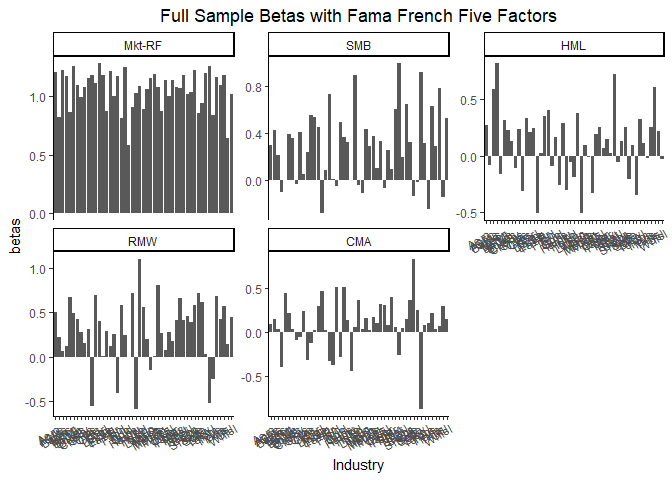<!-- -->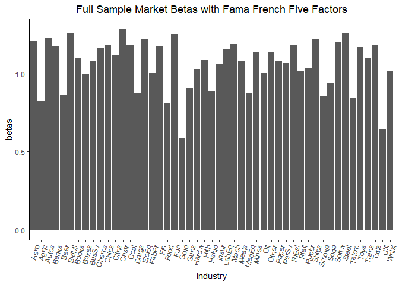<!-- -->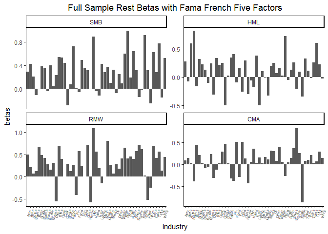<!-- -->

### S3-1-2 Rolling Window Estimation

We will show examples of the Real Estate Portfolio (RlEst), Construction
Portfolio (Cnstr), and Food Portfolio (Food) Rolling Betas evolution
here. The smoothing line is based on the loess smoothing. It seems that
the betas are evolving overtime.

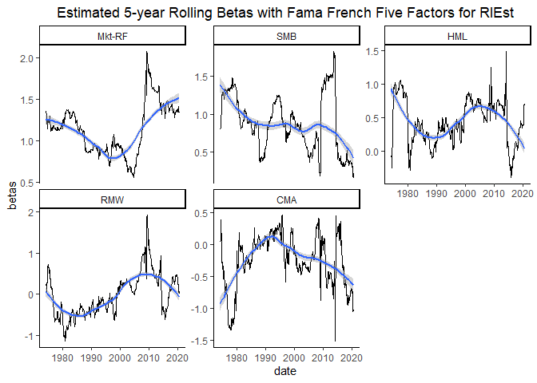<!-- -->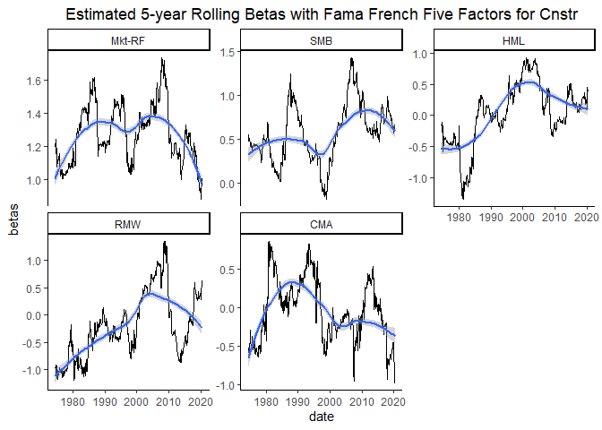<!-- -->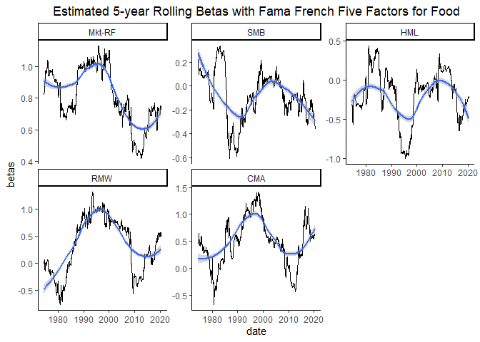<!-- -->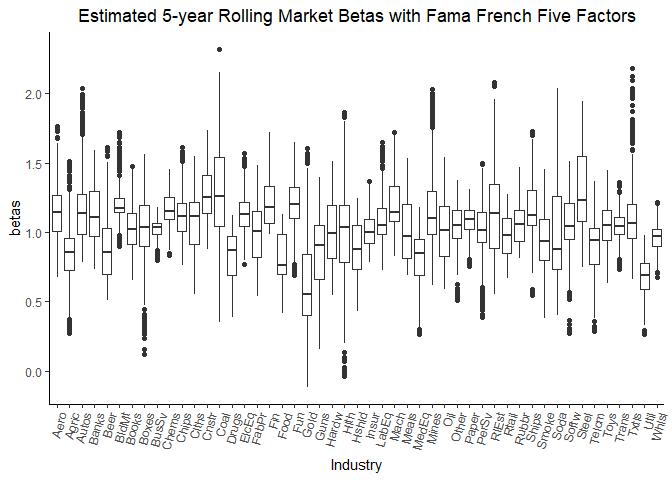<!-- -->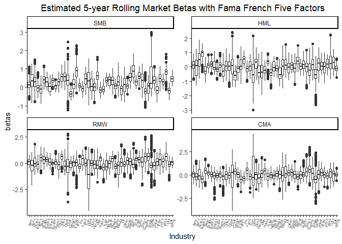<!-- -->

### S3-1-3 Full Sample Estimation with STL Trend

Here, we would try to conduct the STL decomposition before the first
step regression with full sample.

<table class="table table-striped" style="font-size: 10px; width: auto !important; margin-left: auto; margin-right: auto;">
<caption style="font-size: initial !important;">
Fama French Five Factors
</caption>
<thead>
<tr>
<th style="empty-cells: hide;border-bottom:hidden;" colspan="1">
</th>
<th style="border-bottom:hidden;padding-bottom:0; padding-left:3px;padding-right:3px;text-align: center; " colspan="6">

Coefficients

</th>
<th style="border-bottom:hidden;padding-bottom:0; padding-left:3px;padding-right:3px;text-align: center; " colspan="6">

Std. Error

</th>
</tr>
<tr>
<th style="text-align:center;">
Industry
</th>
<th style="text-align:center;">
Alpha
</th>
<th style="text-align:center;">
Mkt-RF
</th>
<th style="text-align:center;">
SMB
</th>
<th style="text-align:center;">
HML
</th>
<th style="text-align:center;">
RMW
</th>
<th style="text-align:center;">
CMA
</th>
<th style="text-align:center;">
Alpha
</th>
<th style="text-align:center;">
Mkt-RF
</th>
<th style="text-align:center;">
SMB
</th>
<th style="text-align:center;">
HML
</th>
<th style="text-align:center;">
RMW
</th>
<th style="text-align:center;">
CMA
</th>
</tr>
</thead>
<tbody>
<tr>
<td style="text-align:center;font-weight: bold;">
Aero
</td>
<td style="text-align:center;">
-0.0012744
</td>
<td style="text-align:center;">
1.2746023
</td>
<td style="text-align:center;">
0.7838737
</td>
<td style="text-align:center;">
0.4368438
</td>
<td style="text-align:center;">
0.1528035
</td>
<td style="text-align:center;">
-0.2526696
</td>
<td style="text-align:center;">
0.0005832
</td>
<td style="text-align:center;">
0.0398914
</td>
<td style="text-align:center;">
0.0505159
</td>
<td style="text-align:center;">
0.0552370
</td>
<td style="text-align:center;">
0.0617538
</td>
<td style="text-align:center;">
0.0964317
</td>
</tr>
<tr>
<td style="text-align:center;font-weight: bold;">
Agric
</td>
<td style="text-align:center;">
0.0016461
</td>
<td style="text-align:center;">
0.5825164
</td>
<td style="text-align:center;">
0.1940582
</td>
<td style="text-align:center;">
0.3703844
</td>
<td style="text-align:center;">
0.4506982
</td>
<td style="text-align:center;">
-0.6421949
</td>
<td style="text-align:center;">
0.0006801
</td>
<td style="text-align:center;">
0.0465185
</td>
<td style="text-align:center;">
0.0589079
</td>
<td style="text-align:center;">
0.0644133
</td>
<td style="text-align:center;">
0.0720127
</td>
<td style="text-align:center;">
0.1124515
</td>
</tr>
<tr>
<td style="text-align:center;font-weight: bold;">
Autos
</td>
<td style="text-align:center;">
-0.0063620
</td>
<td style="text-align:center;">
1.5229823
</td>
<td style="text-align:center;">
0.0053461
</td>
<td style="text-align:center;">
-0.0961469
</td>
<td style="text-align:center;">
0.0515546
</td>
<td style="text-align:center;">
1.0865335
</td>
<td style="text-align:center;">
0.0006652
</td>
<td style="text-align:center;">
0.0455002
</td>
<td style="text-align:center;">
0.0576183
</td>
<td style="text-align:center;">
0.0630033
</td>
<td style="text-align:center;">
0.0704363
</td>
<td style="text-align:center;">
0.1099899
</td>
</tr>
<tr>
<td style="text-align:center;font-weight: bold;">
Banks
</td>
<td style="text-align:center;">
-0.0035956
</td>
<td style="text-align:center;">
1.2475803
</td>
<td style="text-align:center;">
0.0222035
</td>
<td style="text-align:center;">
0.6482096
</td>
<td style="text-align:center;">
0.4262404
</td>
<td style="text-align:center;">
-0.0975272
</td>
<td style="text-align:center;">
0.0003985
</td>
<td style="text-align:center;">
0.0272579
</td>
<td style="text-align:center;">
0.0345176
</td>
<td style="text-align:center;">
0.0377435
</td>
<td style="text-align:center;">
0.0421965
</td>
<td style="text-align:center;">
0.0658919
</td>
</tr>
<tr>
<td style="text-align:center;font-weight: bold;">
Beer
</td>
<td style="text-align:center;">
0.0000426
</td>
<td style="text-align:center;">
0.9099867
</td>
<td style="text-align:center;">
-0.3158099
</td>
<td style="text-align:center;">
-0.1920509
</td>
<td style="text-align:center;">
0.8565533
</td>
<td style="text-align:center;">
0.2840211
</td>
<td style="text-align:center;">
0.0004848
</td>
<td style="text-align:center;">
0.0331595
</td>
<td style="text-align:center;">
0.0419910
</td>
<td style="text-align:center;">
0.0459154
</td>
<td style="text-align:center;">
0.0513324
</td>
<td style="text-align:center;">
0.0801582
</td>
</tr>
<tr>
<td style="text-align:center;font-weight: bold;">
BldMt
</td>
<td style="text-align:center;">
-0.0038180
</td>
<td style="text-align:center;">
1.2256726
</td>
<td style="text-align:center;">
0.2746096
</td>
<td style="text-align:center;">
0.2072977
</td>
<td style="text-align:center;">
0.4985308
</td>
<td style="text-align:center;">
0.3151551
</td>
<td style="text-align:center;">
0.0003777
</td>
<td style="text-align:center;">
0.0258339
</td>
<td style="text-align:center;">
0.0327143
</td>
<td style="text-align:center;">
0.0357717
</td>
<td style="text-align:center;">
0.0399920
</td>
<td style="text-align:center;">
0.0624495
</td>
</tr>
<tr>
<td style="text-align:center;font-weight: bold;">
Books
</td>
<td style="text-align:center;">
-0.0071925
</td>
<td style="text-align:center;">
1.4360719
</td>
<td style="text-align:center;">
0.4600670
</td>
<td style="text-align:center;">
0.1423312
</td>
<td style="text-align:center;">
0.3140638
</td>
<td style="text-align:center;">
0.6229898
</td>
<td style="text-align:center;">
0.0004771
</td>
<td style="text-align:center;">
0.0326318
</td>
<td style="text-align:center;">
0.0413227
</td>
<td style="text-align:center;">
0.0451847
</td>
<td style="text-align:center;">
0.0505155
</td>
<td style="text-align:center;">
0.0788825
</td>
</tr>
<tr>
<td style="text-align:center;font-weight: bold;">
Boxes
</td>
<td style="text-align:center;">
-0.0016011
</td>
<td style="text-align:center;">
0.8638515
</td>
<td style="text-align:center;">
0.0407416
</td>
<td style="text-align:center;">
0.1523267
</td>
<td style="text-align:center;">
0.8222496
</td>
<td style="text-align:center;">
-0.0022294
</td>
<td style="text-align:center;">
0.0005539
</td>
<td style="text-align:center;">
0.0378871
</td>
<td style="text-align:center;">
0.0479777
</td>
<td style="text-align:center;">
0.0524616
</td>
<td style="text-align:center;">
0.0586510
</td>
<td style="text-align:center;">
0.0915865
</td>
</tr>
<tr>
<td style="text-align:center;font-weight: bold;">
BusSv
</td>
<td style="text-align:center;">
0.0003938
</td>
<td style="text-align:center;">
1.0525691
</td>
<td style="text-align:center;">
0.4724090
</td>
<td style="text-align:center;">
-0.1246758
</td>
<td style="text-align:center;">
0.0187068
</td>
<td style="text-align:center;">
-0.2174015
</td>
<td style="text-align:center;">
0.0002714
</td>
<td style="text-align:center;">
0.0185617
</td>
<td style="text-align:center;">
0.0235054
</td>
<td style="text-align:center;">
0.0257021
</td>
<td style="text-align:center;">
0.0287344
</td>
<td style="text-align:center;">
0.0448703
</td>
</tr>
<tr>
<td style="text-align:center;font-weight: bold;">
Chems
</td>
<td style="text-align:center;">
-0.0020329
</td>
<td style="text-align:center;">
1.0479814
</td>
<td style="text-align:center;">
0.0398632
</td>
<td style="text-align:center;">
0.0610439
</td>
<td style="text-align:center;">
0.3658636
</td>
<td style="text-align:center;">
0.3650244
</td>
<td style="text-align:center;">
0.0004627
</td>
<td style="text-align:center;">
0.0316450
</td>
<td style="text-align:center;">
0.0400731
</td>
<td style="text-align:center;">
0.0438183
</td>
<td style="text-align:center;">
0.0489880
</td>
<td style="text-align:center;">
0.0764972
</td>
</tr>
<tr>
<td style="text-align:center;font-weight: bold;">
Chips
</td>
<td style="text-align:center;">
0.0051885
</td>
<td style="text-align:center;">
1.1028458
</td>
<td style="text-align:center;">
0.3129494
</td>
<td style="text-align:center;">
-0.4482885
</td>
<td style="text-align:center;">
-0.9646289
</td>
<td style="text-align:center;">
-0.1232898
</td>
<td style="text-align:center;">
0.0005198
</td>
<td style="text-align:center;">
0.0355509
</td>
<td style="text-align:center;">
0.0450192
</td>
<td style="text-align:center;">
0.0492267
</td>
<td style="text-align:center;">
0.0550344
</td>
<td style="text-align:center;">
0.0859390
</td>
</tr>
<tr>
<td style="text-align:center;font-weight: bold;">
Clths
</td>
<td style="text-align:center;">
-0.0051112
</td>
<td style="text-align:center;">
1.3268703
</td>
<td style="text-align:center;">
0.7822894
</td>
<td style="text-align:center;">
-0.2454161
</td>
<td style="text-align:center;">
0.8865135
</td>
<td style="text-align:center;">
0.5414965
</td>
<td style="text-align:center;">
0.0005851
</td>
<td style="text-align:center;">
0.0400219
</td>
<td style="text-align:center;">
0.0506811
</td>
<td style="text-align:center;">
0.0554176
</td>
<td style="text-align:center;">
0.0619558
</td>
<td style="text-align:center;">
0.0967471
</td>
</tr>
<tr>
<td style="text-align:center;font-weight: bold;">
Cnstr
</td>
<td style="text-align:center;">
-0.0051172
</td>
<td style="text-align:center;">
1.2153172
</td>
<td style="text-align:center;">
0.6550769
</td>
<td style="text-align:center;">
-0.1314116
</td>
<td style="text-align:center;">
0.5204695
</td>
<td style="text-align:center;">
0.4787251
</td>
<td style="text-align:center;">
0.0007152
</td>
<td style="text-align:center;">
0.0489177
</td>
<td style="text-align:center;">
0.0619460
</td>
<td style="text-align:center;">
0.0677354
</td>
<td style="text-align:center;">
0.0757268
</td>
<td style="text-align:center;">
0.1182512
</td>
</tr>
<tr>
<td style="text-align:center;font-weight: bold;">
Coal
</td>
<td style="text-align:center;">
-0.0018927
</td>
<td style="text-align:center;">
0.5321811
</td>
<td style="text-align:center;">
0.7143574
</td>
<td style="text-align:center;">
0.6932167
</td>
<td style="text-align:center;">
-0.5017013
</td>
<td style="text-align:center;">
0.7875115
</td>
<td style="text-align:center;">
0.0017543
</td>
<td style="text-align:center;">
0.1199887
</td>
<td style="text-align:center;">
0.1519456
</td>
<td style="text-align:center;">
0.1661462
</td>
<td style="text-align:center;">
0.1857480
</td>
<td style="text-align:center;">
0.2900548
</td>
</tr>
<tr>
<td style="text-align:center;font-weight: bold;">
Drugs
</td>
<td style="text-align:center;">
0.0013358
</td>
<td style="text-align:center;">
0.8796435
</td>
<td style="text-align:center;">
-0.4621804
</td>
<td style="text-align:center;">
-0.3018292
</td>
<td style="text-align:center;">
0.5003218
</td>
<td style="text-align:center;">
0.3002915
</td>
<td style="text-align:center;">
0.0004381
</td>
<td style="text-align:center;">
0.0299632
</td>
<td style="text-align:center;">
0.0379434
</td>
<td style="text-align:center;">
0.0414896
</td>
<td style="text-align:center;">
0.0463845
</td>
<td style="text-align:center;">
0.0724317
</td>
</tr>
<tr>
<td style="text-align:center;font-weight: bold;">
ElcEq
</td>
<td style="text-align:center;">
0.0013447
</td>
<td style="text-align:center;">
1.1252624
</td>
<td style="text-align:center;">
0.1206725
</td>
<td style="text-align:center;">
-0.1124701
</td>
<td style="text-align:center;">
-0.0878487
</td>
<td style="text-align:center;">
0.1209728
</td>
<td style="text-align:center;">
0.0003518
</td>
<td style="text-align:center;">
0.0240609
</td>
<td style="text-align:center;">
0.0304691
</td>
<td style="text-align:center;">
0.0333167
</td>
<td style="text-align:center;">
0.0372474
</td>
<td style="text-align:center;">
0.0581637
</td>
</tr>
<tr>
<td style="text-align:center;font-weight: bold;">
FabPr
</td>
<td style="text-align:center;">
-0.0022332
</td>
<td style="text-align:center;">
0.8453990
</td>
<td style="text-align:center;">
0.7941666
</td>
<td style="text-align:center;">
0.3626176
</td>
<td style="text-align:center;">
0.1845480
</td>
<td style="text-align:center;">
-0.6243901
</td>
<td style="text-align:center;">
0.0007540
</td>
<td style="text-align:center;">
0.0515686
</td>
<td style="text-align:center;">
0.0653031
</td>
<td style="text-align:center;">
0.0714062
</td>
<td style="text-align:center;">
0.0798306
</td>
<td style="text-align:center;">
0.1246596
</td>
</tr>
<tr>
<td style="text-align:center;font-weight: bold;">
Fin
</td>
<td style="text-align:center;">
-0.0002833
</td>
<td style="text-align:center;">
1.2562560
</td>
<td style="text-align:center;">
0.3107899
</td>
<td style="text-align:center;">
0.5251945
</td>
<td style="text-align:center;">
-0.0987906
</td>
<td style="text-align:center;">
-0.3650579
</td>
<td style="text-align:center;">
0.0004104
</td>
<td style="text-align:center;">
0.0280679
</td>
<td style="text-align:center;">
0.0355434
</td>
<td style="text-align:center;">
0.0388652
</td>
<td style="text-align:center;">
0.0434505
</td>
<td style="text-align:center;">
0.0678501
</td>
</tr>
<tr>
<td style="text-align:center;font-weight: bold;">
Food
</td>
<td style="text-align:center;">
-0.0017027
</td>
<td style="text-align:center;">
0.8819056
</td>
<td style="text-align:center;">
-0.1021610
</td>
<td style="text-align:center;">
0.1128245
</td>
<td style="text-align:center;">
0.7741909
</td>
<td style="text-align:center;">
0.4490797
</td>
<td style="text-align:center;">
0.0004269
</td>
<td style="text-align:center;">
0.0291978
</td>
<td style="text-align:center;">
0.0369741
</td>
<td style="text-align:center;">
0.0404297
</td>
<td style="text-align:center;">
0.0451995
</td>
<td style="text-align:center;">
0.0705813
</td>
</tr>
<tr>
<td style="text-align:center;font-weight: bold;">
Fun
</td>
<td style="text-align:center;">
-0.0013404
</td>
<td style="text-align:center;">
1.4377854
</td>
<td style="text-align:center;">
0.5898860
</td>
<td style="text-align:center;">
-0.0394015
</td>
<td style="text-align:center;">
0.3859710
</td>
<td style="text-align:center;">
0.4124550
</td>
<td style="text-align:center;">
0.0007257
</td>
<td style="text-align:center;">
0.0496341
</td>
<td style="text-align:center;">
0.0628533
</td>
<td style="text-align:center;">
0.0687275
</td>
<td style="text-align:center;">
0.0768359
</td>
<td style="text-align:center;">
0.1199831
</td>
</tr>
<tr>
<td style="text-align:center;font-weight: bold;">
Gold
</td>
<td style="text-align:center;">
0.0003135
</td>
<td style="text-align:center;">
0.3543018
</td>
<td style="text-align:center;">
0.7289414
</td>
<td style="text-align:center;">
-1.0938949
</td>
<td style="text-align:center;">
0.2666569
</td>
<td style="text-align:center;">
1.4469401
</td>
<td style="text-align:center;">
0.0013482
</td>
<td style="text-align:center;">
0.0922090
</td>
<td style="text-align:center;">
0.1167674
</td>
<td style="text-align:center;">
0.1276803
</td>
<td style="text-align:center;">
0.1427438
</td>
<td style="text-align:center;">
0.2229017
</td>
</tr>
<tr>
<td style="text-align:center;font-weight: bold;">
Guns
</td>
<td style="text-align:center;">
-0.0000274
</td>
<td style="text-align:center;">
0.8382648
</td>
<td style="text-align:center;">
0.5745523
</td>
<td style="text-align:center;">
0.3837487
</td>
<td style="text-align:center;">
0.9507868
</td>
<td style="text-align:center;">
-0.0017038
</td>
<td style="text-align:center;">
0.0007288
</td>
<td style="text-align:center;">
0.0498491
</td>
<td style="text-align:center;">
0.0631255
</td>
<td style="text-align:center;">
0.0690251
</td>
<td style="text-align:center;">
0.0771686
</td>
<td style="text-align:center;">
0.1205027
</td>
</tr>
<tr>
<td style="text-align:center;font-weight: bold;">
Hardw
</td>
<td style="text-align:center;">
0.0029049
</td>
<td style="text-align:center;">
1.0231410
</td>
<td style="text-align:center;">
-0.0714698
</td>
<td style="text-align:center;">
-0.3301447
</td>
<td style="text-align:center;">
-0.7731021
</td>
<td style="text-align:center;">
-0.0904900
</td>
<td style="text-align:center;">
0.0006809
</td>
<td style="text-align:center;">
0.0465711
</td>
<td style="text-align:center;">
0.0589745
</td>
<td style="text-align:center;">
0.0644861
</td>
<td style="text-align:center;">
0.0720941
</td>
<td style="text-align:center;">
0.1125786
</td>
</tr>
<tr>
<td style="text-align:center;font-weight: bold;">
Hlth
</td>
<td style="text-align:center;">
-0.0037975
</td>
<td style="text-align:center;">
0.9715977
</td>
<td style="text-align:center;">
1.7326988
</td>
<td style="text-align:center;">
-0.4383371
</td>
<td style="text-align:center;">
0.8772680
</td>
<td style="text-align:center;">
0.3348111
</td>
<td style="text-align:center;">
0.0008389
</td>
<td style="text-align:center;">
0.0573801
</td>
<td style="text-align:center;">
0.0726623
</td>
<td style="text-align:center;">
0.0794532
</td>
<td style="text-align:center;">
0.0888270
</td>
<td style="text-align:center;">
0.1387078
</td>
</tr>
<tr>
<td style="text-align:center;font-weight: bold;">
Hshld
</td>
<td style="text-align:center;">
-0.0031805
</td>
<td style="text-align:center;">
0.9866357
</td>
<td style="text-align:center;">
-0.1890740
</td>
<td style="text-align:center;">
-0.0956830
</td>
<td style="text-align:center;">
0.7730199
</td>
<td style="text-align:center;">
0.3177266
</td>
<td style="text-align:center;">
0.0003387
</td>
<td style="text-align:center;">
0.0231688
</td>
<td style="text-align:center;">
0.0293394
</td>
<td style="text-align:center;">
0.0320815
</td>
<td style="text-align:center;">
0.0358664
</td>
<td style="text-align:center;">
0.0560072
</td>
</tr>
<tr>
<td style="text-align:center;font-weight: bold;">
Insur
</td>
<td style="text-align:center;">
-0.0013155
</td>
<td style="text-align:center;">
1.1047316
</td>
<td style="text-align:center;">
0.2299386
</td>
<td style="text-align:center;">
0.4954510
</td>
<td style="text-align:center;">
0.3090722
</td>
<td style="text-align:center;">
-0.1726943
</td>
<td style="text-align:center;">
0.0003704
</td>
<td style="text-align:center;">
0.0253312
</td>
<td style="text-align:center;">
0.0320778
</td>
<td style="text-align:center;">
0.0350757
</td>
<td style="text-align:center;">
0.0392139
</td>
<td style="text-align:center;">
0.0612345
</td>
</tr>
<tr>
<td style="text-align:center;font-weight: bold;">
LabEq
</td>
<td style="text-align:center;">
0.0027968
</td>
<td style="text-align:center;">
0.9891841
</td>
<td style="text-align:center;">
0.4782318
</td>
<td style="text-align:center;">
-0.3755583
</td>
<td style="text-align:center;">
-0.4922250
</td>
<td style="text-align:center;">
0.0922078
</td>
<td style="text-align:center;">
0.0004329
</td>
<td style="text-align:center;">
0.0296092
</td>
<td style="text-align:center;">
0.0374951
</td>
<td style="text-align:center;">
0.0409993
</td>
<td style="text-align:center;">
0.0458364
</td>
<td style="text-align:center;">
0.0715758
</td>
</tr>
<tr>
<td style="text-align:center;font-weight: bold;">
Mach
</td>
<td style="text-align:center;">
-0.0008106
</td>
<td style="text-align:center;">
1.0301561
</td>
<td style="text-align:center;">
0.3575171
</td>
<td style="text-align:center;">
-0.0547854
</td>
<td style="text-align:center;">
-0.0325099
</td>
<td style="text-align:center;">
0.2949105
</td>
<td style="text-align:center;">
0.0005178
</td>
<td style="text-align:center;">
0.0354144
</td>
<td style="text-align:center;">
0.0448464
</td>
<td style="text-align:center;">
0.0490377
</td>
<td style="text-align:center;">
0.0548231
</td>
<td style="text-align:center;">
0.0856091
</td>
</tr>
<tr>
<td style="text-align:center;font-weight: bold;">
Meals
</td>
<td style="text-align:center;">
-0.0016492
</td>
<td style="text-align:center;">
1.0737487
</td>
<td style="text-align:center;">
0.5459601
</td>
<td style="text-align:center;">
0.1001046
</td>
<td style="text-align:center;">
0.6242171
</td>
<td style="text-align:center;">
-0.1737008
</td>
<td style="text-align:center;">
0.0005212
</td>
<td style="text-align:center;">
0.0356514
</td>
<td style="text-align:center;">
0.0451466
</td>
<td style="text-align:center;">
0.0493659
</td>
<td style="text-align:center;">
0.0551901
</td>
<td style="text-align:center;">
0.0861821
</td>
</tr>
<tr>
<td style="text-align:center;font-weight: bold;">
MedEq
</td>
<td style="text-align:center;">
0.0014561
</td>
<td style="text-align:center;">
0.8053431
</td>
<td style="text-align:center;">
-0.0565824
</td>
<td style="text-align:center;">
-0.3375237
</td>
<td style="text-align:center;">
0.5326186
</td>
<td style="text-align:center;">
0.1033913
</td>
<td style="text-align:center;">
0.0005539
</td>
<td style="text-align:center;">
0.0378871
</td>
<td style="text-align:center;">
0.0479777
</td>
<td style="text-align:center;">
0.0524616
</td>
<td style="text-align:center;">
0.0586510
</td>
<td style="text-align:center;">
0.0915865
</td>
</tr>
<tr>
<td style="text-align:center;font-weight: bold;">
Mines
</td>
<td style="text-align:center;">
0.0014572
</td>
<td style="text-align:center;">
0.7813628
</td>
<td style="text-align:center;">
0.2534132
</td>
<td style="text-align:center;">
0.1187663
</td>
<td style="text-align:center;">
-0.2251123
</td>
<td style="text-align:center;">
0.0825557
</td>
<td style="text-align:center;">
0.0009507
</td>
<td style="text-align:center;">
0.0650268
</td>
<td style="text-align:center;">
0.0823456
</td>
<td style="text-align:center;">
0.0900415
</td>
<td style="text-align:center;">
0.1006645
</td>
<td style="text-align:center;">
0.1571928
</td>
</tr>
<tr>
<td style="text-align:center;font-weight: bold;">
Oil
</td>
<td style="text-align:center;">
-0.0004014
</td>
<td style="text-align:center;">
0.7991301
</td>
<td style="text-align:center;">
0.2298170
</td>
<td style="text-align:center;">
0.4364659
</td>
<td style="text-align:center;">
0.0717533
</td>
<td style="text-align:center;">
-0.1674800
</td>
<td style="text-align:center;">
0.0006965
</td>
<td style="text-align:center;">
0.0476356
</td>
<td style="text-align:center;">
0.0603226
</td>
<td style="text-align:center;">
0.0659602
</td>
<td style="text-align:center;">
0.0737421
</td>
<td style="text-align:center;">
0.1151521
</td>
</tr>
<tr>
<td style="text-align:center;font-weight: bold;">
Other
</td>
<td style="text-align:center;">
-0.0095963
</td>
<td style="text-align:center;">
1.4180793
</td>
<td style="text-align:center;">
0.4039311
</td>
<td style="text-align:center;">
0.0269255
</td>
<td style="text-align:center;">
0.4086910
</td>
<td style="text-align:center;">
0.1984780
</td>
<td style="text-align:center;">
0.0006627
</td>
<td style="text-align:center;">
0.0453283
</td>
<td style="text-align:center;">
0.0574007
</td>
<td style="text-align:center;">
0.0627653
</td>
<td style="text-align:center;">
0.0701702
</td>
<td style="text-align:center;">
0.1095744
</td>
</tr>
<tr>
<td style="text-align:center;font-weight: bold;">
Paper
</td>
<td style="text-align:center;">
-0.0025994
</td>
<td style="text-align:center;">
0.9960178
</td>
<td style="text-align:center;">
0.0411842
</td>
<td style="text-align:center;">
0.1656356
</td>
<td style="text-align:center;">
0.1961619
</td>
<td style="text-align:center;">
0.5961679
</td>
<td style="text-align:center;">
0.0004124
</td>
<td style="text-align:center;">
0.0282042
</td>
<td style="text-align:center;">
0.0357159
</td>
<td style="text-align:center;">
0.0390538
</td>
<td style="text-align:center;">
0.0436613
</td>
<td style="text-align:center;">
0.0681794
</td>
</tr>
<tr>
<td style="text-align:center;font-weight: bold;">
PerSv
</td>
<td style="text-align:center;">
-0.0087342
</td>
<td style="text-align:center;">
1.0919539
</td>
<td style="text-align:center;">
1.1387105
</td>
<td style="text-align:center;">
0.2900208
</td>
<td style="text-align:center;">
0.8993240
</td>
<td style="text-align:center;">
-0.0887214
</td>
<td style="text-align:center;">
0.0006290
</td>
<td style="text-align:center;">
0.0430207
</td>
<td style="text-align:center;">
0.0544786
</td>
<td style="text-align:center;">
0.0595700
</td>
<td style="text-align:center;">
0.0665980
</td>
<td style="text-align:center;">
0.1039962
</td>
</tr>
<tr>
<td style="text-align:center;font-weight: bold;">
RlEst
</td>
<td style="text-align:center;">
-0.0107579
</td>
<td style="text-align:center;">
1.4524244
</td>
<td style="text-align:center;">
1.4426993
</td>
<td style="text-align:center;">
0.3381476
</td>
<td style="text-align:center;">
0.5862133
</td>
<td style="text-align:center;">
-0.1133795
</td>
<td style="text-align:center;">
0.0006743
</td>
<td style="text-align:center;">
0.0461230
</td>
<td style="text-align:center;">
0.0584070
</td>
<td style="text-align:center;">
0.0638657
</td>
<td style="text-align:center;">
0.0714005
</td>
<td style="text-align:center;">
0.1114954
</td>
</tr>
<tr>
<td style="text-align:center;font-weight: bold;">
Rtail
</td>
<td style="text-align:center;">
-0.0006359
</td>
<td style="text-align:center;">
1.0737444
</td>
<td style="text-align:center;">
-0.0120757
</td>
<td style="text-align:center;">
-0.2910815
</td>
<td style="text-align:center;">
0.4432776
</td>
<td style="text-align:center;">
0.4689517
</td>
<td style="text-align:center;">
0.0004659
</td>
<td style="text-align:center;">
0.0318637
</td>
<td style="text-align:center;">
0.0403500
</td>
<td style="text-align:center;">
0.0441211
</td>
<td style="text-align:center;">
0.0493264
</td>
<td style="text-align:center;">
0.0770257
</td>
</tr>
<tr>
<td style="text-align:center;font-weight: bold;">
Rubbr
</td>
<td style="text-align:center;">
-0.0030373
</td>
<td style="text-align:center;">
1.1609331
</td>
<td style="text-align:center;">
0.3844679
</td>
<td style="text-align:center;">
-0.0232771
</td>
<td style="text-align:center;">
0.5958614
</td>
<td style="text-align:center;">
0.2990171
</td>
<td style="text-align:center;">
0.0004376
</td>
<td style="text-align:center;">
0.0299333
</td>
<td style="text-align:center;">
0.0379055
</td>
<td style="text-align:center;">
0.0414481
</td>
<td style="text-align:center;">
0.0463381
</td>
<td style="text-align:center;">
0.0723593
</td>
</tr>
<tr>
<td style="text-align:center;font-weight: bold;">
Ships
</td>
<td style="text-align:center;">
-0.0014874
</td>
<td style="text-align:center;">
0.9450218
</td>
<td style="text-align:center;">
0.4640843
</td>
<td style="text-align:center;">
0.5768058
</td>
<td style="text-align:center;">
0.3004754
</td>
<td style="text-align:center;">
-0.0191941
</td>
<td style="text-align:center;">
0.0007598
</td>
<td style="text-align:center;">
0.0519653
</td>
<td style="text-align:center;">
0.0658053
</td>
<td style="text-align:center;">
0.0719554
</td>
<td style="text-align:center;">
0.0804446
</td>
<td style="text-align:center;">
0.1256183
</td>
</tr>
<tr>
<td style="text-align:center;font-weight: bold;">
Smoke
</td>
<td style="text-align:center;">
-0.0005108
</td>
<td style="text-align:center;">
0.8046435
</td>
<td style="text-align:center;">
-0.1273409
</td>
<td style="text-align:center;">
0.0620524
</td>
<td style="text-align:center;">
1.2041922
</td>
<td style="text-align:center;">
0.8914597
</td>
<td style="text-align:center;">
0.0006825
</td>
<td style="text-align:center;">
0.0466837
</td>
<td style="text-align:center;">
0.0591171
</td>
<td style="text-align:center;">
0.0646421
</td>
<td style="text-align:center;">
0.0722685
</td>
<td style="text-align:center;">
0.1128509
</td>
</tr>
<tr>
<td style="text-align:center;font-weight: bold;">
Soda
</td>
<td style="text-align:center;">
-0.0027393
</td>
<td style="text-align:center;">
1.0846754
</td>
<td style="text-align:center;">
-0.2058664
</td>
<td style="text-align:center;">
0.3111747
</td>
<td style="text-align:center;">
1.0775496
</td>
<td style="text-align:center;">
0.1498779
</td>
<td style="text-align:center;">
0.0006174
</td>
<td style="text-align:center;">
0.0422302
</td>
<td style="text-align:center;">
0.0534775
</td>
<td style="text-align:center;">
0.0584754
</td>
<td style="text-align:center;">
0.0653743
</td>
<td style="text-align:center;">
0.1020853
</td>
</tr>
<tr>
<td style="text-align:center;font-weight: bold;">
Softw
</td>
<td style="text-align:center;">
-0.0000276
</td>
<td style="text-align:center;">
1.3867136
</td>
<td style="text-align:center;">
0.9454751
</td>
<td style="text-align:center;">
-0.9717346
</td>
<td style="text-align:center;">
0.1336157
</td>
<td style="text-align:center;">
0.0082342
</td>
<td style="text-align:center;">
0.0009466
</td>
<td style="text-align:center;">
0.0647470
</td>
<td style="text-align:center;">
0.0819912
</td>
<td style="text-align:center;">
0.0896540
</td>
<td style="text-align:center;">
0.1002313
</td>
<td style="text-align:center;">
0.1565162
</td>
</tr>
<tr>
<td style="text-align:center;font-weight: bold;">
Steel
</td>
<td style="text-align:center;">
-0.0002085
</td>
<td style="text-align:center;">
0.9130251
</td>
<td style="text-align:center;">
0.2016566
</td>
<td style="text-align:center;">
0.4352389
</td>
<td style="text-align:center;">
-1.0450994
</td>
<td style="text-align:center;">
-0.0849308
</td>
<td style="text-align:center;">
0.0007098
</td>
<td style="text-align:center;">
0.0485491
</td>
<td style="text-align:center;">
0.0614794
</td>
<td style="text-align:center;">
0.0672251
</td>
<td style="text-align:center;">
0.0751563
</td>
<td style="text-align:center;">
0.1173603
</td>
</tr>
<tr>
<td style="text-align:center;font-weight: bold;">
Telcm
</td>
<td style="text-align:center;">
0.0025699
</td>
<td style="text-align:center;">
0.8743257
</td>
<td style="text-align:center;">
-0.4497129
</td>
<td style="text-align:center;">
0.3961693
</td>
<td style="text-align:center;">
-0.6882968
</td>
<td style="text-align:center;">
-0.1586806
</td>
<td style="text-align:center;">
0.0004282
</td>
<td style="text-align:center;">
0.0292864
</td>
<td style="text-align:center;">
0.0370863
</td>
<td style="text-align:center;">
0.0405524
</td>
<td style="text-align:center;">
0.0453367
</td>
<td style="text-align:center;">
0.0707955
</td>
</tr>
<tr>
<td style="text-align:center;font-weight: bold;">
Toys
</td>
<td style="text-align:center;">
-0.0087620
</td>
<td style="text-align:center;">
1.3071589
</td>
<td style="text-align:center;">
0.5646103
</td>
<td style="text-align:center;">
-0.1051569
</td>
<td style="text-align:center;">
0.8874877
</td>
<td style="text-align:center;">
0.8351548
</td>
<td style="text-align:center;">
0.0005863
</td>
<td style="text-align:center;">
0.0401014
</td>
<td style="text-align:center;">
0.0507818
</td>
<td style="text-align:center;">
0.0555278
</td>
<td style="text-align:center;">
0.0620789
</td>
<td style="text-align:center;">
0.0969393
</td>
</tr>
<tr>
<td style="text-align:center;font-weight: bold;">
Trans
</td>
<td style="text-align:center;">
-0.0031360
</td>
<td style="text-align:center;">
1.0916931
</td>
<td style="text-align:center;">
0.5913613
</td>
<td style="text-align:center;">
0.2065672
</td>
<td style="text-align:center;">
0.4650208
</td>
<td style="text-align:center;">
-0.0213421
</td>
<td style="text-align:center;">
0.0004102
</td>
<td style="text-align:center;">
0.0280594
</td>
<td style="text-align:center;">
0.0355325
</td>
<td style="text-align:center;">
0.0388533
</td>
<td style="text-align:center;">
0.0434372
</td>
<td style="text-align:center;">
0.0678293
</td>
</tr>
<tr>
<td style="text-align:center;font-weight: bold;">
Txtls
</td>
<td style="text-align:center;">
-0.0074781
</td>
<td style="text-align:center;">
1.3437515
</td>
<td style="text-align:center;">
0.6048901
</td>
<td style="text-align:center;">
0.4749820
</td>
<td style="text-align:center;">
0.5932878
</td>
<td style="text-align:center;">
0.5394235
</td>
<td style="text-align:center;">
0.0007141
</td>
<td style="text-align:center;">
0.0488452
</td>
<td style="text-align:center;">
0.0618543
</td>
<td style="text-align:center;">
0.0676351
</td>
<td style="text-align:center;">
0.0756146
</td>
<td style="text-align:center;">
0.1180760
</td>
</tr>
<tr>
<td style="text-align:center;font-weight: bold;">
Util
</td>
<td style="text-align:center;">
-0.0007362
</td>
<td style="text-align:center;">
0.7831676
</td>
<td style="text-align:center;">
0.0052637
</td>
<td style="text-align:center;">
0.4875585
</td>
<td style="text-align:center;">
0.1963733
</td>
<td style="text-align:center;">
-0.1634922
</td>
<td style="text-align:center;">
0.0003874
</td>
<td style="text-align:center;">
0.0264995
</td>
<td style="text-align:center;">
0.0335572
</td>
<td style="text-align:center;">
0.0366934
</td>
<td style="text-align:center;">
0.0410224
</td>
<td style="text-align:center;">
0.0640586
</td>
</tr>
<tr>
<td style="text-align:center;font-weight: bold;">
Whlsl
</td>
<td style="text-align:center;">
-0.0024205
</td>
<td style="text-align:center;">
1.0757804
</td>
<td style="text-align:center;">
0.5633473
</td>
<td style="text-align:center;">
0.0179133
</td>
<td style="text-align:center;">
0.1885198
</td>
<td style="text-align:center;">
0.1895158
</td>
<td style="text-align:center;">
0.0003568
</td>
<td style="text-align:center;">
0.0244072
</td>
<td style="text-align:center;">
0.0309077
</td>
<td style="text-align:center;">
0.0337962
</td>
<td style="text-align:center;">
0.0377835
</td>
<td style="text-align:center;">
0.0590008
</td>
</tr>
</tbody>
</table>

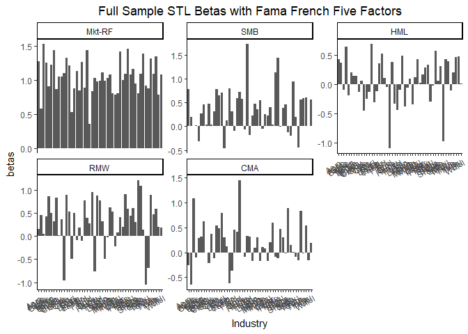<!-- -->

### S3-1-4 Rolling Window Estimation with STL Trend

Here, we would try to conduct the STL decomposition before the first
step regression with full sample.

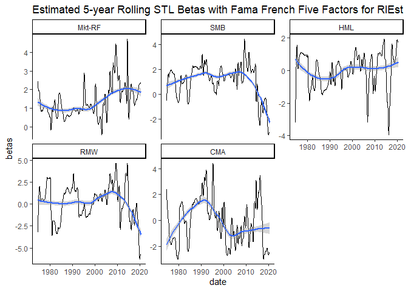<!-- -->

### S3-1-5 Full Sample Estimation with Panel Regression

There are three sets of regressions here: Panel Regression at 49
Industry Level, Panel Regression at 49 Industry Level and clustering at
5 Industry Level, Micro-Macro Multilevel Linear Models.

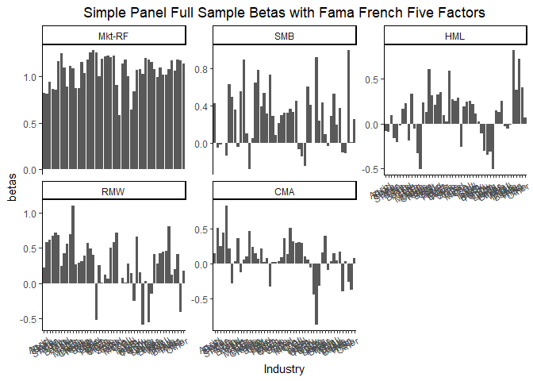<!-- -->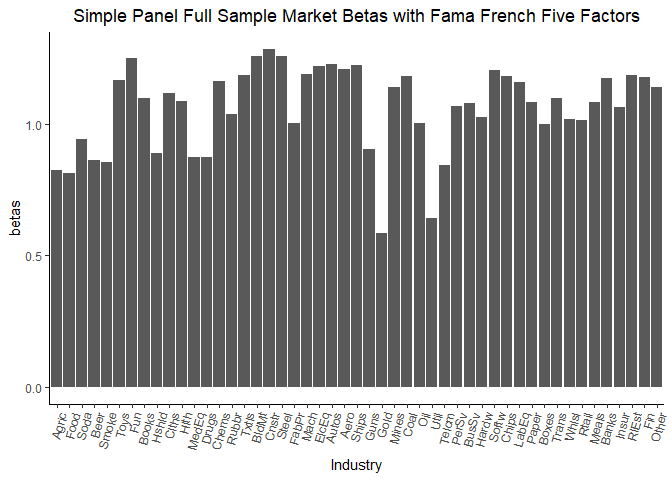<!-- -->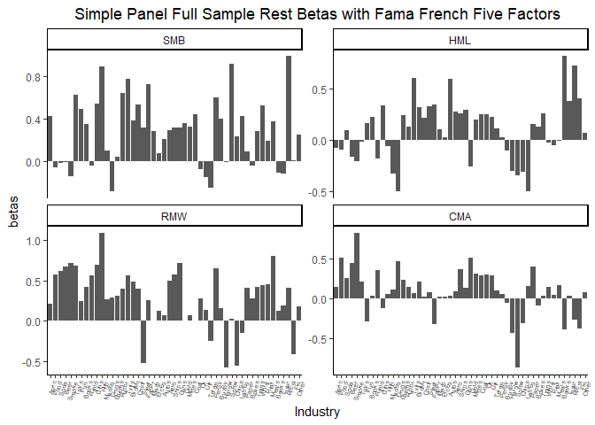<!-- -->

Next, we get the panel regression clustering at 5 Industry Level.

### S3-1-6 Rolling Window Estimation with Panel Regression

We will show examples of the Real Estate Portfolio (RlEst), Construction
Portfolio (Cnstr), and Food Portfolio (Food) Rolling Betas evolution
here. The smoothing line is based on the loess smoothing. It seems that
the betas are evolving overtime.

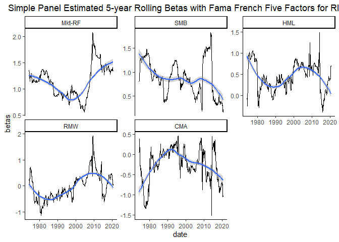<!-- -->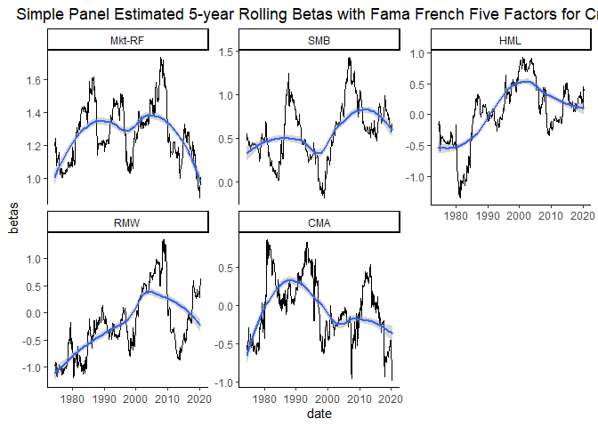<!-- -->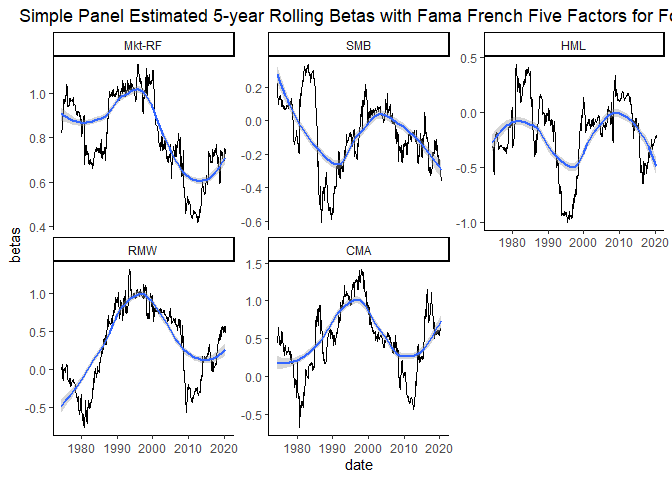<!-- -->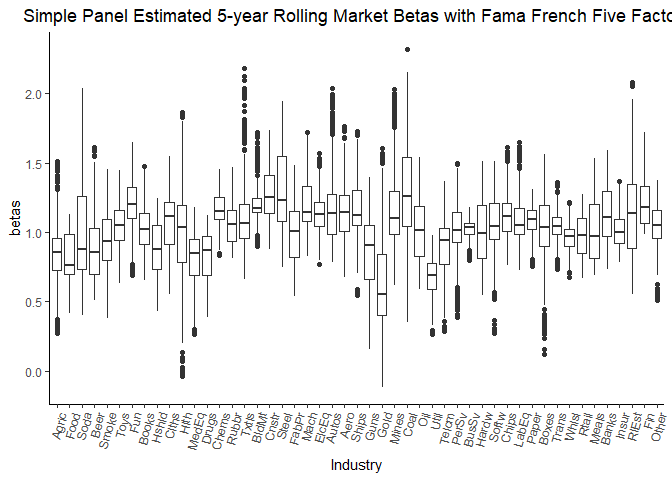<!-- -->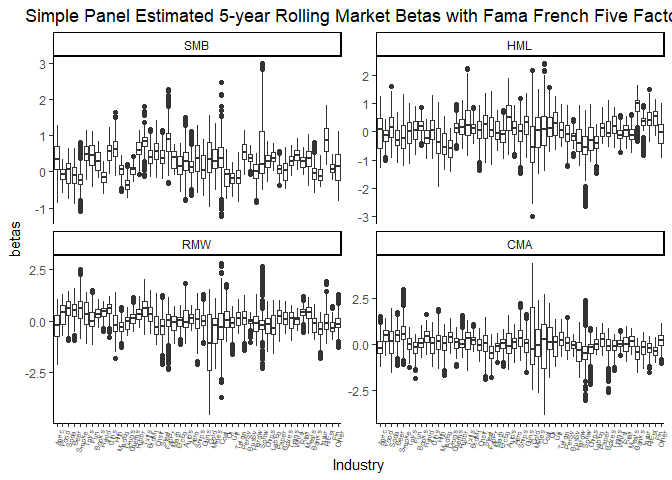<!-- -->

## S3-2 PRS Five Factor Model

We will then apply the PRS Five Factor Model to estimate the betas.

### S3-2-1 Full Sample Estimation

<table class="table table-striped" style="font-size: 10px; width: auto !important; margin-left: auto; margin-right: auto;">
<caption style="font-size: initial !important;">
PRS Five Factors
</caption>
<thead>
<tr>
<th style="empty-cells: hide;border-bottom:hidden;" colspan="1">
</th>
<th style="border-bottom:hidden;padding-bottom:0; padding-left:3px;padding-right:3px;text-align: center; " colspan="6">

Coefficients

</th>
<th style="border-bottom:hidden;padding-bottom:0; padding-left:3px;padding-right:3px;text-align: center; " colspan="6">

Std. Error

</th>
</tr>
<tr>
<th style="text-align:center;">
Industry
</th>
<th style="text-align:center;">
Alpha
</th>
<th style="text-align:center;">
Mkt-RF
</th>
<th style="text-align:center;">
RMW
</th>
<th style="text-align:center;">
dDP
</th>
<th style="text-align:center;">
dTS
</th>
<th style="text-align:center;">
UNEXPI
</th>
<th style="text-align:center;">
Alpha
</th>
<th style="text-align:center;">
Mkt-RF
</th>
<th style="text-align:center;">
RMW
</th>
<th style="text-align:center;">
dDP
</th>
<th style="text-align:center;">
dTS
</th>
<th style="text-align:center;">
UNEXPI
</th>
</tr>
</thead>
<tbody>
<tr>
<td style="text-align:center;font-weight: bold;">
Aero
</td>
<td style="text-align:center;">
-0.0007264
</td>
<td style="text-align:center;">
1.2147906
</td>
<td style="text-align:center;">
0.4597678
</td>
<td style="text-align:center;">
-1.8739102
</td>
<td style="text-align:center;">
2.6544959
</td>
<td style="text-align:center;">
0.0695108
</td>
<td style="text-align:center;">
0.0017926
</td>
<td style="text-align:center;">
0.0413396
</td>
<td style="text-align:center;">
0.0827289
</td>
<td style="text-align:center;">
1.6994957
</td>
<td style="text-align:center;">
0.7471528
</td>
<td style="text-align:center;">
0.5863563
</td>
</tr>
<tr>
<td style="text-align:center;font-weight: bold;">
Agric
</td>
<td style="text-align:center;">
0.0000335
</td>
<td style="text-align:center;">
0.8921762
</td>
<td style="text-align:center;">
0.0717091
</td>
<td style="text-align:center;">
-0.4604342
</td>
<td style="text-align:center;">
2.0589033
</td>
<td style="text-align:center;">
0.3395515
</td>
<td style="text-align:center;">
0.0021284
</td>
<td style="text-align:center;">
0.0490841
</td>
<td style="text-align:center;">
0.0982271
</td>
<td style="text-align:center;">
2.0178759
</td>
<td style="text-align:center;">
0.8871230
</td>
<td style="text-align:center;">
0.6962031
</td>
</tr>
<tr>
<td style="text-align:center;font-weight: bold;">
Autos
</td>
<td style="text-align:center;">
-0.0030572
</td>
<td style="text-align:center;">
1.1977989
</td>
<td style="text-align:center;">
0.0672278
</td>
<td style="text-align:center;">
6.3544567
</td>
<td style="text-align:center;">
4.1598356
</td>
<td style="text-align:center;">
-0.1737414
</td>
<td style="text-align:center;">
0.0019354
</td>
<td style="text-align:center;">
0.0446335
</td>
<td style="text-align:center;">
0.0893205
</td>
<td style="text-align:center;">
1.8349080
</td>
<td style="text-align:center;">
0.8066844
</td>
<td style="text-align:center;">
0.6330759
</td>
</tr>
<tr>
<td style="text-align:center;font-weight: bold;">
Banks
</td>
<td style="text-align:center;">
-0.0017131
</td>
<td style="text-align:center;">
1.1446243
</td>
<td style="text-align:center;">
0.3036716
</td>
<td style="text-align:center;">
-0.2118326
</td>
<td style="text-align:center;">
1.6994764
</td>
<td style="text-align:center;">
0.8416676
</td>
<td style="text-align:center;">
0.0015119
</td>
<td style="text-align:center;">
0.0348658
</td>
<td style="text-align:center;">
0.0697734
</td>
<td style="text-align:center;">
1.4333525
</td>
<td style="text-align:center;">
0.6301478
</td>
<td style="text-align:center;">
0.4945321
</td>
</tr>
<tr>
<td style="text-align:center;font-weight: bold;">
Beer
</td>
<td style="text-align:center;">
0.0013533
</td>
<td style="text-align:center;">
0.8163077
</td>
<td style="text-align:center;">
0.6502316
</td>
<td style="text-align:center;">
-2.7713156
</td>
<td style="text-align:center;">
-0.3550530
</td>
<td style="text-align:center;">
0.5748237
</td>
<td style="text-align:center;">
0.0015697
</td>
<td style="text-align:center;">
0.0361980
</td>
<td style="text-align:center;">
0.0724395
</td>
<td style="text-align:center;">
1.4881224
</td>
<td style="text-align:center;">
0.6542264
</td>
<td style="text-align:center;">
0.5134287
</td>
</tr>
<tr>
<td style="text-align:center;font-weight: bold;">
BldMt
</td>
<td style="text-align:center;">
-0.0030308
</td>
<td style="text-align:center;">
1.2794322
</td>
<td style="text-align:center;">
0.3978284
</td>
<td style="text-align:center;">
3.0432575
</td>
<td style="text-align:center;">
3.2402758
</td>
<td style="text-align:center;">
1.2188895
</td>
<td style="text-align:center;">
0.0013397
</td>
<td style="text-align:center;">
0.0308961
</td>
<td style="text-align:center;">
0.0618293
</td>
<td style="text-align:center;">
1.2701560
</td>
<td style="text-align:center;">
0.5584013
</td>
<td style="text-align:center;">
0.4382264
</td>
</tr>
<tr>
<td style="text-align:center;font-weight: bold;">
Books
</td>
<td style="text-align:center;">
-0.0036651
</td>
<td style="text-align:center;">
1.1403166
</td>
<td style="text-align:center;">
0.3344491
</td>
<td style="text-align:center;">
3.5192625
</td>
<td style="text-align:center;">
2.8975915
</td>
<td style="text-align:center;">
0.3071983
</td>
<td style="text-align:center;">
0.0013751
</td>
<td style="text-align:center;">
0.0317113
</td>
<td style="text-align:center;">
0.0634607
</td>
<td style="text-align:center;">
1.3036699
</td>
<td style="text-align:center;">
0.5731351
</td>
<td style="text-align:center;">
0.4497893
</td>
</tr>
<tr>
<td style="text-align:center;font-weight: bold;">
Boxes
</td>
<td style="text-align:center;">
-0.0012003
</td>
<td style="text-align:center;">
1.0266425
</td>
<td style="text-align:center;">
0.3245770
</td>
<td style="text-align:center;">
3.6059226
</td>
<td style="text-align:center;">
0.9489560
</td>
<td style="text-align:center;">
1.1834596
</td>
<td style="text-align:center;">
0.0015292
</td>
<td style="text-align:center;">
0.0352642
</td>
<td style="text-align:center;">
0.0705708
</td>
<td style="text-align:center;">
1.4497331
</td>
<td style="text-align:center;">
0.6373492
</td>
<td style="text-align:center;">
0.5001837
</td>
</tr>
<tr>
<td style="text-align:center;font-weight: bold;">
BusSv
</td>
<td style="text-align:center;">
-0.0009844
</td>
<td style="text-align:center;">
1.1808188
</td>
<td style="text-align:center;">
0.0052199
</td>
<td style="text-align:center;">
1.8003838
</td>
<td style="text-align:center;">
1.5340027
</td>
<td style="text-align:center;">
0.5431220
</td>
<td style="text-align:center;">
0.0009649
</td>
<td style="text-align:center;">
0.0222521
</td>
<td style="text-align:center;">
0.0445309
</td>
<td style="text-align:center;">
0.9147962
</td>
<td style="text-align:center;">
0.4021738
</td>
<td style="text-align:center;">
0.3156210
</td>
</tr>
<tr>
<td style="text-align:center;font-weight: bold;">
Chems
</td>
<td style="text-align:center;">
-0.0010222
</td>
<td style="text-align:center;">
1.0942887
</td>
<td style="text-align:center;">
0.3027224
</td>
<td style="text-align:center;">
1.0268845
</td>
<td style="text-align:center;">
0.9222256
</td>
<td style="text-align:center;">
-0.2436988
</td>
<td style="text-align:center;">
0.0013039
</td>
<td style="text-align:center;">
0.0300690
</td>
<td style="text-align:center;">
0.0601741
</td>
<td style="text-align:center;">
1.2361550
</td>
<td style="text-align:center;">
0.5434534
</td>
<td style="text-align:center;">
0.4264955
</td>
</tr>
<tr>
<td style="text-align:center;font-weight: bold;">
Chips
</td>
<td style="text-align:center;">
0.0020900
</td>
<td style="text-align:center;">
1.3194837
</td>
<td style="text-align:center;">
-0.6845575
</td>
<td style="text-align:center;">
2.9293268
</td>
<td style="text-align:center;">
-0.4209634
</td>
<td style="text-align:center;">
0.4134730
</td>
<td style="text-align:center;">
0.0016303
</td>
<td style="text-align:center;">
0.0375961
</td>
<td style="text-align:center;">
0.0752373
</td>
<td style="text-align:center;">
1.5455977
</td>
<td style="text-align:center;">
0.6794943
</td>
<td style="text-align:center;">
0.5332587
</td>
</tr>
<tr>
<td style="text-align:center;font-weight: bold;">
Clths
</td>
<td style="text-align:center;">
-0.0025929
</td>
<td style="text-align:center;">
1.2208061
</td>
<td style="text-align:center;">
0.5499887
</td>
<td style="text-align:center;">
4.4649420
</td>
<td style="text-align:center;">
3.2403675
</td>
<td style="text-align:center;">
1.3608807
</td>
<td style="text-align:center;">
0.0017273
</td>
<td style="text-align:center;">
0.0398331
</td>
<td style="text-align:center;">
0.0797139
</td>
<td style="text-align:center;">
1.6375599
</td>
<td style="text-align:center;">
0.7199239
</td>
<td style="text-align:center;">
0.5649873
</td>
</tr>
<tr>
<td style="text-align:center;font-weight: bold;">
Cnstr
</td>
<td style="text-align:center;">
-0.0036864
</td>
<td style="text-align:center;">
1.3485988
</td>
<td style="text-align:center;">
0.2583720
</td>
<td style="text-align:center;">
-0.0810328
</td>
<td style="text-align:center;">
3.2723505
</td>
<td style="text-align:center;">
0.0993218
</td>
<td style="text-align:center;">
0.0018049
</td>
<td style="text-align:center;">
0.0416221
</td>
<td style="text-align:center;">
0.0832942
</td>
<td style="text-align:center;">
1.7111086
</td>
<td style="text-align:center;">
0.7522582
</td>
<td style="text-align:center;">
0.5903629
</td>
</tr>
<tr>
<td style="text-align:center;font-weight: bold;">
Coal
</td>
<td style="text-align:center;">
-0.0008261
</td>
<td style="text-align:center;">
1.1302559
</td>
<td style="text-align:center;">
-0.1563914
</td>
<td style="text-align:center;">
-2.7173567
</td>
<td style="text-align:center;">
1.2220000
</td>
<td style="text-align:center;">
-1.5478331
</td>
<td style="text-align:center;">
0.0039984
</td>
<td style="text-align:center;">
0.0922079
</td>
<td style="text-align:center;">
0.1845265
</td>
<td style="text-align:center;">
3.7907201
</td>
<td style="text-align:center;">
1.6665222
</td>
<td style="text-align:center;">
1.3078659
</td>
</tr>
<tr>
<td style="text-align:center;font-weight: bold;">
Drugs
</td>
<td style="text-align:center;">
0.0032083
</td>
<td style="text-align:center;">
0.7726803
</td>
<td style="text-align:center;">
0.2510342
</td>
<td style="text-align:center;">
-0.4654955
</td>
<td style="text-align:center;">
-3.7993545
</td>
<td style="text-align:center;">
-0.9603198
</td>
<td style="text-align:center;">
0.0014020
</td>
<td style="text-align:center;">
0.0323307
</td>
<td style="text-align:center;">
0.0647001
</td>
<td style="text-align:center;">
1.3291320
</td>
<td style="text-align:center;">
0.5843291
</td>
<td style="text-align:center;">
0.4585742
</td>
</tr>
<tr>
<td style="text-align:center;font-weight: bold;">
ElcEq
</td>
<td style="text-align:center;">
-0.0000093
</td>
<td style="text-align:center;">
1.2472556
</td>
<td style="text-align:center;">
0.1235728
</td>
<td style="text-align:center;">
0.2140381
</td>
<td style="text-align:center;">
1.1146499
</td>
<td style="text-align:center;">
0.7610827
</td>
<td style="text-align:center;">
0.0013272
</td>
<td style="text-align:center;">
0.0306063
</td>
<td style="text-align:center;">
0.0612494
</td>
<td style="text-align:center;">
1.2582444
</td>
<td style="text-align:center;">
0.5531646
</td>
<td style="text-align:center;">
0.4341167
</td>
</tr>
<tr>
<td style="text-align:center;font-weight: bold;">
FabPr
</td>
<td style="text-align:center;">
-0.0038139
</td>
<td style="text-align:center;">
1.1266090
</td>
<td style="text-align:center;">
0.0762499
</td>
<td style="text-align:center;">
-1.1887465
</td>
<td style="text-align:center;">
3.9521467
</td>
<td style="text-align:center;">
-0.6579375
</td>
<td style="text-align:center;">
0.0022501
</td>
<td style="text-align:center;">
0.0518909
</td>
<td style="text-align:center;">
0.1038441
</td>
<td style="text-align:center;">
2.1332653
</td>
<td style="text-align:center;">
0.9378519
</td>
<td style="text-align:center;">
0.7360145
</td>
</tr>
<tr>
<td style="text-align:center;font-weight: bold;">
Fin
</td>
<td style="text-align:center;">
0.0014107
</td>
<td style="text-align:center;">
1.1949440
</td>
<td style="text-align:center;">
-0.3613530
</td>
<td style="text-align:center;">
1.4712697
</td>
<td style="text-align:center;">
0.1935016
</td>
<td style="text-align:center;">
0.1564705
</td>
<td style="text-align:center;">
0.0011564
</td>
<td style="text-align:center;">
0.0266671
</td>
<td style="text-align:center;">
0.0533662
</td>
<td style="text-align:center;">
1.0962993
</td>
<td style="text-align:center;">
0.4819683
</td>
<td style="text-align:center;">
0.3782428
</td>
</tr>
<tr>
<td style="text-align:center;font-weight: bold;">
Food
</td>
<td style="text-align:center;">
0.0008191
</td>
<td style="text-align:center;">
0.7514778
</td>
<td style="text-align:center;">
0.5673559
</td>
<td style="text-align:center;">
1.8782697
</td>
<td style="text-align:center;">
0.3299690
</td>
<td style="text-align:center;">
0.8080283
</td>
<td style="text-align:center;">
0.0012865
</td>
<td style="text-align:center;">
0.0296684
</td>
<td style="text-align:center;">
0.0593724
</td>
<td style="text-align:center;">
1.2196840
</td>
<td style="text-align:center;">
0.5362122
</td>
<td style="text-align:center;">
0.4208127
</td>
</tr>
<tr>
<td style="text-align:center;font-weight: bold;">
Fun
</td>
<td style="text-align:center;">
0.0016971
</td>
<td style="text-align:center;">
1.3425092
</td>
<td style="text-align:center;">
0.0975973
</td>
<td style="text-align:center;">
-0.0121777
</td>
<td style="text-align:center;">
1.9774675
</td>
<td style="text-align:center;">
-0.7540465
</td>
<td style="text-align:center;">
0.0020157
</td>
<td style="text-align:center;">
0.0464845
</td>
<td style="text-align:center;">
0.0930248
</td>
<td style="text-align:center;">
1.9110044
</td>
<td style="text-align:center;">
0.8401388
</td>
<td style="text-align:center;">
0.6593305
</td>
</tr>
<tr>
<td style="text-align:center;font-weight: bold;">
Gold
</td>
<td style="text-align:center;">
0.0052923
</td>
<td style="text-align:center;">
0.4542444
</td>
<td style="text-align:center;">
-0.1285761
</td>
<td style="text-align:center;">
-15.0501707
</td>
<td style="text-align:center;">
2.1213699
</td>
<td style="text-align:center;">
-6.1825022
</td>
<td style="text-align:center;">
0.0043092
</td>
<td style="text-align:center;">
0.0993757
</td>
<td style="text-align:center;">
0.1988707
</td>
<td style="text-align:center;">
4.0853923
</td>
<td style="text-align:center;">
1.7960695
</td>
<td style="text-align:center;">
1.4095331
</td>
</tr>
<tr>
<td style="text-align:center;font-weight: bold;">
Guns
</td>
<td style="text-align:center;">
0.0010587
</td>
<td style="text-align:center;">
0.9491310
</td>
<td style="text-align:center;">
0.7103798
</td>
<td style="text-align:center;">
-1.9627985
</td>
<td style="text-align:center;">
3.9500245
</td>
<td style="text-align:center;">
1.5746902
</td>
<td style="text-align:center;">
0.0021537
</td>
<td style="text-align:center;">
0.0496656
</td>
<td style="text-align:center;">
0.0993908
</td>
<td style="text-align:center;">
2.0417807
</td>
<td style="text-align:center;">
0.8976323
</td>
<td style="text-align:center;">
0.7044507
</td>
</tr>
<tr>
<td style="text-align:center;font-weight: bold;">
Hardw
</td>
<td style="text-align:center;">
0.0010566
</td>
<td style="text-align:center;">
1.1242786
</td>
<td style="text-align:center;">
-0.6145549
</td>
<td style="text-align:center;">
1.5620568
</td>
<td style="text-align:center;">
-1.0228818
</td>
<td style="text-align:center;">
-0.7295942
</td>
<td style="text-align:center;">
0.0018602
</td>
<td style="text-align:center;">
0.0428974
</td>
<td style="text-align:center;">
0.0858462
</td>
<td style="text-align:center;">
1.7635356
</td>
<td style="text-align:center;">
0.7753068
</td>
<td style="text-align:center;">
0.6084512
</td>
</tr>
<tr>
<td style="text-align:center;font-weight: bold;">
Hlth
</td>
<td style="text-align:center;">
-0.0030009
</td>
<td style="text-align:center;">
1.2233483
</td>
<td style="text-align:center;">
0.7843342
</td>
<td style="text-align:center;">
-1.8573374
</td>
<td style="text-align:center;">
3.0130115
</td>
<td style="text-align:center;">
-0.1316979
</td>
<td style="text-align:center;">
0.0025321
</td>
<td style="text-align:center;">
0.0583941
</td>
<td style="text-align:center;">
0.1168583
</td>
<td style="text-align:center;">
2.4006146
</td>
<td style="text-align:center;">
1.0553872
</td>
<td style="text-align:center;">
0.8282548
</td>
</tr>
<tr>
<td style="text-align:center;font-weight: bold;">
Hshld
</td>
<td style="text-align:center;">
-0.0009809
</td>
<td style="text-align:center;">
0.8439563
</td>
<td style="text-align:center;">
0.5432179
</td>
<td style="text-align:center;">
-1.7767449
</td>
<td style="text-align:center;">
-0.4698350
</td>
<td style="text-align:center;">
0.0327638
</td>
<td style="text-align:center;">
0.0011595
</td>
<td style="text-align:center;">
0.0267387
</td>
<td style="text-align:center;">
0.0535094
</td>
<td style="text-align:center;">
1.0992423
</td>
<td style="text-align:center;">
0.4832622
</td>
<td style="text-align:center;">
0.3792582
</td>
</tr>
<tr>
<td style="text-align:center;font-weight: bold;">
Insur
</td>
<td style="text-align:center;">
0.0001100
</td>
<td style="text-align:center;">
1.0042571
</td>
<td style="text-align:center;">
0.2872893
</td>
<td style="text-align:center;">
0.9704142
</td>
<td style="text-align:center;">
0.8232041
</td>
<td style="text-align:center;">
0.4140088
</td>
<td style="text-align:center;">
0.0014004
</td>
<td style="text-align:center;">
0.0322959
</td>
<td style="text-align:center;">
0.0646306
</td>
<td style="text-align:center;">
1.3277031
</td>
<td style="text-align:center;">
0.5837009
</td>
<td style="text-align:center;">
0.4580812
</td>
</tr>
<tr>
<td style="text-align:center;font-weight: bold;">
LabEq
</td>
<td style="text-align:center;">
0.0011880
</td>
<td style="text-align:center;">
1.2527348
</td>
<td style="text-align:center;">
-0.3991746
</td>
<td style="text-align:center;">
2.1224497
</td>
<td style="text-align:center;">
-0.3740978
</td>
<td style="text-align:center;">
-0.2522120
</td>
<td style="text-align:center;">
0.0016004
</td>
<td style="text-align:center;">
0.0369063
</td>
<td style="text-align:center;">
0.0738569
</td>
<td style="text-align:center;">
1.5172389
</td>
<td style="text-align:center;">
0.6670269
</td>
<td style="text-align:center;">
0.5234744
</td>
</tr>
<tr>
<td style="text-align:center;font-weight: bold;">
Mach
</td>
<td style="text-align:center;">
-0.0008258
</td>
<td style="text-align:center;">
1.2250799
</td>
<td style="text-align:center;">
-0.0896013
</td>
<td style="text-align:center;">
1.9578641
</td>
<td style="text-align:center;">
1.1650949
</td>
<td style="text-align:center;">
0.1923083
</td>
<td style="text-align:center;">
0.0013205
</td>
<td style="text-align:center;">
0.0304529
</td>
<td style="text-align:center;">
0.0609424
</td>
<td style="text-align:center;">
1.2519381
</td>
<td style="text-align:center;">
0.5503921
</td>
<td style="text-align:center;">
0.4319409
</td>
</tr>
<tr>
<td style="text-align:center;font-weight: bold;">
Meals
</td>
<td style="text-align:center;">
-0.0020684
</td>
<td style="text-align:center;">
1.1345247
</td>
<td style="text-align:center;">
0.6679509
</td>
<td style="text-align:center;">
1.7897837
</td>
<td style="text-align:center;">
1.4627125
</td>
<td style="text-align:center;">
0.8186635
</td>
<td style="text-align:center;">
0.0015086
</td>
<td style="text-align:center;">
0.0347892
</td>
<td style="text-align:center;">
0.0696202
</td>
<td style="text-align:center;">
1.4302044
</td>
<td style="text-align:center;">
0.6287637
</td>
<td style="text-align:center;">
0.4934460
</td>
</tr>
<tr>
<td style="text-align:center;font-weight: bold;">
MedEq
</td>
<td style="text-align:center;">
0.0018862
</td>
<td style="text-align:center;">
0.8900137
</td>
<td style="text-align:center;">
0.1622762
</td>
<td style="text-align:center;">
0.2737107
</td>
<td style="text-align:center;">
-1.1681905
</td>
<td style="text-align:center;">
-0.8031269
</td>
<td style="text-align:center;">
0.0014125
</td>
<td style="text-align:center;">
0.0325740
</td>
<td style="text-align:center;">
0.0651871
</td>
<td style="text-align:center;">
1.3391359
</td>
<td style="text-align:center;">
0.5887271
</td>
<td style="text-align:center;">
0.4620257
</td>
</tr>
<tr>
<td style="text-align:center;font-weight: bold;">
Mines
</td>
<td style="text-align:center;">
0.0009360
</td>
<td style="text-align:center;">
1.0444750
</td>
<td style="text-align:center;">
-0.0554772
</td>
<td style="text-align:center;">
-3.3840685
</td>
<td style="text-align:center;">
1.4138771
</td>
<td style="text-align:center;">
-3.0440866
</td>
<td style="text-align:center;">
0.0023771
</td>
<td style="text-align:center;">
0.0548194
</td>
<td style="text-align:center;">
0.1097047
</td>
<td style="text-align:center;">
2.2536587
</td>
<td style="text-align:center;">
0.9907807
</td>
<td style="text-align:center;">
0.7775524
</td>
</tr>
<tr>
<td style="text-align:center;font-weight: bold;">
Oil
</td>
<td style="text-align:center;">
-0.0004856
</td>
<td style="text-align:center;">
0.8956570
</td>
<td style="text-align:center;">
0.3585764
</td>
<td style="text-align:center;">
-4.3787781
</td>
<td style="text-align:center;">
1.5466725
</td>
<td style="text-align:center;">
-0.7985525
</td>
<td style="text-align:center;">
0.0018671
</td>
<td style="text-align:center;">
0.0430567
</td>
<td style="text-align:center;">
0.0861651
</td>
<td style="text-align:center;">
1.7700861
</td>
<td style="text-align:center;">
0.7781867
</td>
<td style="text-align:center;">
0.6107112
</td>
</tr>
<tr>
<td style="text-align:center;font-weight: bold;">
Other
</td>
<td style="text-align:center;">
-0.0061774
</td>
<td style="text-align:center;">
1.1533966
</td>
<td style="text-align:center;">
0.1540438
</td>
<td style="text-align:center;">
-4.6901175
</td>
<td style="text-align:center;">
2.6412491
</td>
<td style="text-align:center;">
-0.7101488
</td>
<td style="text-align:center;">
0.0018041
</td>
<td style="text-align:center;">
0.0416042
</td>
<td style="text-align:center;">
0.0832583
</td>
<td style="text-align:center;">
1.7103711
</td>
<td style="text-align:center;">
0.7519340
</td>
<td style="text-align:center;">
0.5901085
</td>
</tr>
<tr>
<td style="text-align:center;font-weight: bold;">
Paper
</td>
<td style="text-align:center;">
-0.0016085
</td>
<td style="text-align:center;">
1.0257733
</td>
<td style="text-align:center;">
0.3793307
</td>
<td style="text-align:center;">
2.1978096
</td>
<td style="text-align:center;">
1.5520329
</td>
<td style="text-align:center;">
0.3980158
</td>
<td style="text-align:center;">
0.0013812
</td>
<td style="text-align:center;">
0.0318518
</td>
<td style="text-align:center;">
0.0637418
</td>
<td style="text-align:center;">
1.3094453
</td>
<td style="text-align:center;">
0.5756742
</td>
<td style="text-align:center;">
0.4517819
</td>
</tr>
<tr>
<td style="text-align:center;font-weight: bold;">
PerSv
</td>
<td style="text-align:center;">
-0.0071988
</td>
<td style="text-align:center;">
1.1968124
</td>
<td style="text-align:center;">
0.4656690
</td>
<td style="text-align:center;">
4.3326170
</td>
<td style="text-align:center;">
3.8521636
</td>
<td style="text-align:center;">
1.3106456
</td>
<td style="text-align:center;">
0.0017981
</td>
<td style="text-align:center;">
0.0414669
</td>
<td style="text-align:center;">
0.0829835
</td>
<td style="text-align:center;">
1.7047271
</td>
<td style="text-align:center;">
0.7494527
</td>
<td style="text-align:center;">
0.5881612
</td>
</tr>
<tr>
<td style="text-align:center;font-weight: bold;">
RlEst
</td>
<td style="text-align:center;">
-0.0083295
</td>
<td style="text-align:center;">
1.3301310
</td>
<td style="text-align:center;">
0.1860782
</td>
<td style="text-align:center;">
4.1323916
</td>
<td style="text-align:center;">
6.8929026
</td>
<td style="text-align:center;">
0.6621041
</td>
<td style="text-align:center;">
0.0022064
</td>
<td style="text-align:center;">
0.0508823
</td>
<td style="text-align:center;">
0.1018256
</td>
<td style="text-align:center;">
2.0917989
</td>
<td style="text-align:center;">
0.9196219
</td>
<td style="text-align:center;">
0.7217079
</td>
</tr>
<tr>
<td style="text-align:center;font-weight: bold;">
Rtail
</td>
<td style="text-align:center;">
-0.0004245
</td>
<td style="text-align:center;">
1.0816559
</td>
<td style="text-align:center;">
0.3691614
</td>
<td style="text-align:center;">
4.7293914
</td>
<td style="text-align:center;">
0.4775361
</td>
<td style="text-align:center;">
1.5513571
</td>
<td style="text-align:center;">
0.0012589
</td>
<td style="text-align:center;">
0.0290323
</td>
<td style="text-align:center;">
0.0580994
</td>
<td style="text-align:center;">
1.1935331
</td>
<td style="text-align:center;">
0.5247154
</td>
<td style="text-align:center;">
0.4117902
</td>
</tr>
<tr>
<td style="text-align:center;font-weight: bold;">
Rubbr
</td>
<td style="text-align:center;">
-0.0012600
</td>
<td style="text-align:center;">
1.1204273
</td>
<td style="text-align:center;">
0.2024823
</td>
<td style="text-align:center;">
1.1525221
</td>
<td style="text-align:center;">
3.8552101
</td>
<td style="text-align:center;">
0.3925701
</td>
<td style="text-align:center;">
0.0014645
</td>
<td style="text-align:center;">
0.0337735
</td>
<td style="text-align:center;">
0.0675875
</td>
<td style="text-align:center;">
1.3884468
</td>
<td style="text-align:center;">
0.6104058
</td>
<td style="text-align:center;">
0.4790389
</td>
</tr>
<tr>
<td style="text-align:center;font-weight: bold;">
Ships
</td>
<td style="text-align:center;">
-0.0017210
</td>
<td style="text-align:center;">
1.1840183
</td>
<td style="text-align:center;">
0.4887253
</td>
<td style="text-align:center;">
-0.4676993
</td>
<td style="text-align:center;">
2.2800247
</td>
<td style="text-align:center;">
-0.0147524
</td>
<td style="text-align:center;">
0.0022415
</td>
<td style="text-align:center;">
0.0516923
</td>
<td style="text-align:center;">
0.1034467
</td>
<td style="text-align:center;">
2.1251006
</td>
<td style="text-align:center;">
0.9342624
</td>
<td style="text-align:center;">
0.7331976
</td>
</tr>
<tr>
<td style="text-align:center;font-weight: bold;">
Smoke
</td>
<td style="text-align:center;">
0.0038290
</td>
<td style="text-align:center;">
0.7342582
</td>
<td style="text-align:center;">
0.6814776
</td>
<td style="text-align:center;">
2.1172818
</td>
<td style="text-align:center;">
-0.9495259
</td>
<td style="text-align:center;">
0.9852468
</td>
<td style="text-align:center;">
0.0022145
</td>
<td style="text-align:center;">
0.0510683
</td>
<td style="text-align:center;">
0.1021978
</td>
<td style="text-align:center;">
2.0994464
</td>
<td style="text-align:center;">
0.9229840
</td>
<td style="text-align:center;">
0.7243464
</td>
</tr>
<tr>
<td style="text-align:center;font-weight: bold;">
Soda
</td>
<td style="text-align:center;">
0.0007333
</td>
<td style="text-align:center;">
0.8879369
</td>
<td style="text-align:center;">
0.5872698
</td>
<td style="text-align:center;">
1.9990626
</td>
<td style="text-align:center;">
-1.2181298
</td>
<td style="text-align:center;">
0.6465674
</td>
<td style="text-align:center;">
0.0021502
</td>
<td style="text-align:center;">
0.0495866
</td>
<td style="text-align:center;">
0.0992326
</td>
<td style="text-align:center;">
2.0385321
</td>
<td style="text-align:center;">
0.8962041
</td>
<td style="text-align:center;">
0.7033299
</td>
</tr>
<tr>
<td style="text-align:center;font-weight: bold;">
Softw
</td>
<td style="text-align:center;">
-0.0012332
</td>
<td style="text-align:center;">
1.5437263
</td>
<td style="text-align:center;">
-0.2288175
</td>
<td style="text-align:center;">
-4.4606805
</td>
<td style="text-align:center;">
3.7256163
</td>
<td style="text-align:center;">
-0.6181143
</td>
<td style="text-align:center;">
0.0032146
</td>
<td style="text-align:center;">
0.0741315
</td>
<td style="text-align:center;">
0.1483520
</td>
<td style="text-align:center;">
3.0475892
</td>
<td style="text-align:center;">
1.3398180
</td>
<td style="text-align:center;">
1.0514726
</td>
</tr>
<tr>
<td style="text-align:center;font-weight: bold;">
Steel
</td>
<td style="text-align:center;">
-0.0024949
</td>
<td style="text-align:center;">
1.2518243
</td>
<td style="text-align:center;">
-0.5835215
</td>
<td style="text-align:center;">
-1.4425826
</td>
<td style="text-align:center;">
2.1058460
</td>
<td style="text-align:center;">
-0.2147757
</td>
<td style="text-align:center;">
0.0019541
</td>
<td style="text-align:center;">
0.0450640
</td>
<td style="text-align:center;">
0.0901821
</td>
<td style="text-align:center;">
1.8526069
</td>
<td style="text-align:center;">
0.8144654
</td>
<td style="text-align:center;">
0.6391824
</td>
</tr>
<tr>
<td style="text-align:center;font-weight: bold;">
Telcm
</td>
<td style="text-align:center;">
0.0014088
</td>
<td style="text-align:center;">
0.7826801
</td>
<td style="text-align:center;">
-0.1491935
</td>
<td style="text-align:center;">
1.9576403
</td>
<td style="text-align:center;">
0.0525512
</td>
<td style="text-align:center;">
0.1988381
</td>
<td style="text-align:center;">
0.0012836
</td>
<td style="text-align:center;">
0.0296019
</td>
<td style="text-align:center;">
0.0592394
</td>
<td style="text-align:center;">
1.2169531
</td>
<td style="text-align:center;">
0.5350116
</td>
<td style="text-align:center;">
0.4198705
</td>
</tr>
<tr>
<td style="text-align:center;font-weight: bold;">
Toys
</td>
<td style="text-align:center;">
-0.0049002
</td>
<td style="text-align:center;">
1.2423499
</td>
<td style="text-align:center;">
0.4384848
</td>
<td style="text-align:center;">
3.7911029
</td>
<td style="text-align:center;">
2.6697370
</td>
<td style="text-align:center;">
0.2016174
</td>
<td style="text-align:center;">
0.0019887
</td>
<td style="text-align:center;">
0.0458612
</td>
<td style="text-align:center;">
0.0917775
</td>
<td style="text-align:center;">
1.8853811
</td>
<td style="text-align:center;">
0.8288740
</td>
<td style="text-align:center;">
0.6504900
</td>
</tr>
<tr>
<td style="text-align:center;font-weight: bold;">
Trans
</td>
<td style="text-align:center;">
-0.0023420
</td>
<td style="text-align:center;">
1.1269764
</td>
<td style="text-align:center;">
0.3679268
</td>
<td style="text-align:center;">
0.9930022
</td>
<td style="text-align:center;">
2.5143142
</td>
<td style="text-align:center;">
0.5442995
</td>
<td style="text-align:center;">
0.0013575
</td>
<td style="text-align:center;">
0.0313043
</td>
<td style="text-align:center;">
0.0626462
</td>
<td style="text-align:center;">
1.2869388
</td>
<td style="text-align:center;">
0.5657796
</td>
<td style="text-align:center;">
0.4440168
</td>
</tr>
<tr>
<td style="text-align:center;font-weight: bold;">
Txtls
</td>
<td style="text-align:center;">
-0.0046482
</td>
<td style="text-align:center;">
1.2693006
</td>
<td style="text-align:center;">
0.3614604
</td>
<td style="text-align:center;">
7.2068573
</td>
<td style="text-align:center;">
5.2671998
</td>
<td style="text-align:center;">
1.5925489
</td>
<td style="text-align:center;">
0.0021527
</td>
<td style="text-align:center;">
0.0496440
</td>
<td style="text-align:center;">
0.0993477
</td>
<td style="text-align:center;">
2.0408952
</td>
<td style="text-align:center;">
0.8972430
</td>
<td style="text-align:center;">
0.7041452
</td>
</tr>
<tr>
<td style="text-align:center;font-weight: bold;">
Util
</td>
<td style="text-align:center;">
0.0008933
</td>
<td style="text-align:center;">
0.5729589
</td>
<td style="text-align:center;">
0.2307885
</td>
<td style="text-align:center;">
0.0242462
</td>
<td style="text-align:center;">
0.5461290
</td>
<td style="text-align:center;">
1.3811901
</td>
<td style="text-align:center;">
0.0013890
</td>
<td style="text-align:center;">
0.0320330
</td>
<td style="text-align:center;">
0.0641045
</td>
<td style="text-align:center;">
1.3168958
</td>
<td style="text-align:center;">
0.5789497
</td>
<td style="text-align:center;">
0.4543525
</td>
</tr>
<tr>
<td style="text-align:center;font-weight: bold;">
Whlsl
</td>
<td style="text-align:center;">
-0.0019210
</td>
<td style="text-align:center;">
1.0903428
</td>
<td style="text-align:center;">
0.2602262
</td>
<td style="text-align:center;">
1.1158367
</td>
<td style="text-align:center;">
2.9195005
</td>
<td style="text-align:center;">
-0.0552985
</td>
<td style="text-align:center;">
0.0011282
</td>
<td style="text-align:center;">
0.0260184
</td>
<td style="text-align:center;">
0.0520680
</td>
<td style="text-align:center;">
1.0696306
</td>
<td style="text-align:center;">
0.4702439
</td>
<td style="text-align:center;">
0.3690416
</td>
</tr>
</tbody>
</table>

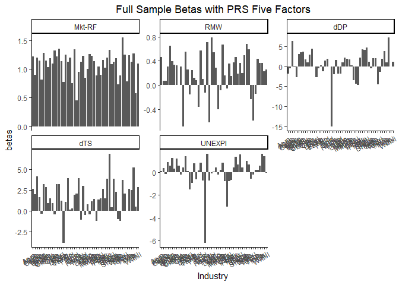<!-- -->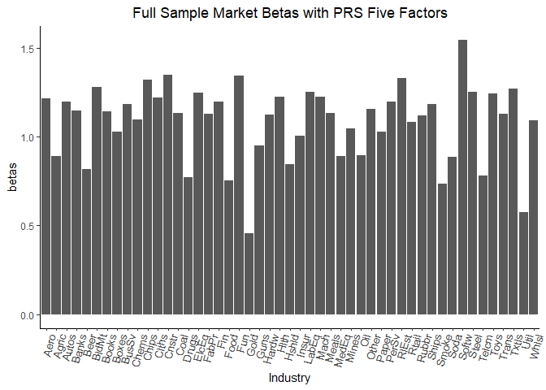<!-- -->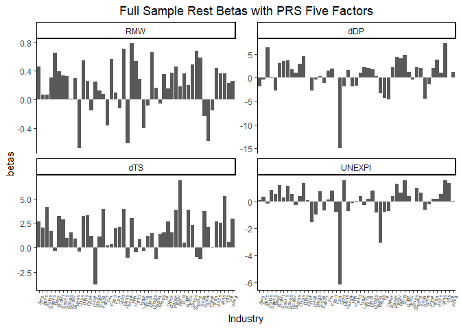<!-- -->

### S3-2-2 Rolling Window Estimation

We will show an example of the Real Estate Portfolio (RlEst),
Construction Portfolio (Cnstr), and Food Portfolio (Food) Rolling Betas
evolution here. The smoothing line is based on the loess smoothing. It
seems that the betas are evolving overtime.

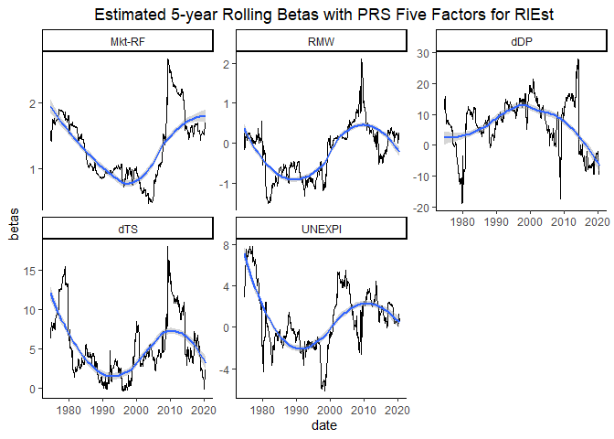<!-- -->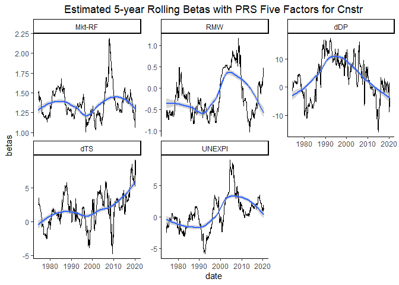<!-- -->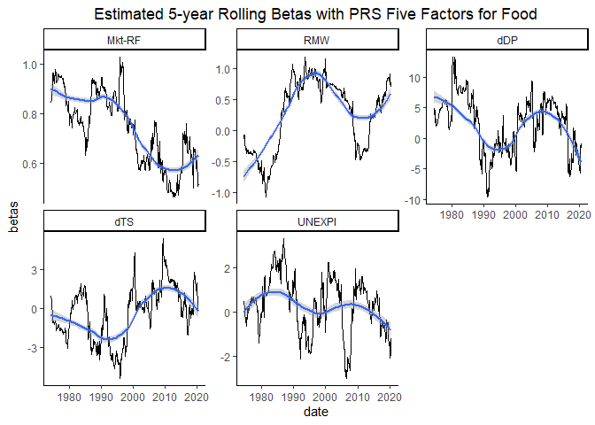<!-- -->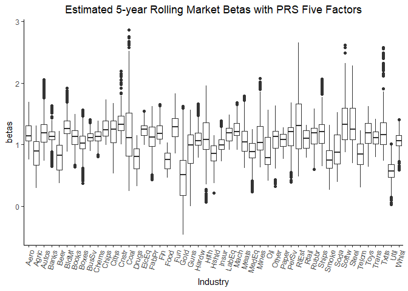<!-- -->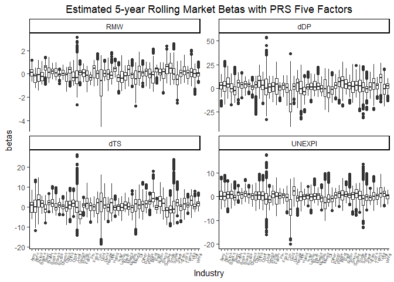<!-- -->

### S3-2-3 Full Sample Estimation with STL Trend

Here, we would try to conduct the STL decomposition before the first
step regression with full sample.

<table class="table table-striped" style="font-size: 10px; width: auto !important; margin-left: auto; margin-right: auto;">
<caption style="font-size: initial !important;">
PRS Five Factors
</caption>
<thead>
<tr>
<th style="empty-cells: hide;border-bottom:hidden;" colspan="1">
</th>
<th style="border-bottom:hidden;padding-bottom:0; padding-left:3px;padding-right:3px;text-align: center; " colspan="6">

Coefficients

</th>
<th style="border-bottom:hidden;padding-bottom:0; padding-left:3px;padding-right:3px;text-align: center; " colspan="6">

Std. Error

</th>
</tr>
<tr>
<th style="text-align:center;">
Industry
</th>
<th style="text-align:center;">
Alpha
</th>
<th style="text-align:center;">
Mkt-RF
</th>
<th style="text-align:center;">
RMW
</th>
<th style="text-align:center;">
dDP
</th>
<th style="text-align:center;">
dTS
</th>
<th style="text-align:center;">
UNEXPI
</th>
<th style="text-align:center;">
Alpha
</th>
<th style="text-align:center;">
Mkt-RF
</th>
<th style="text-align:center;">
RMW
</th>
<th style="text-align:center;">
dDP
</th>
<th style="text-align:center;">
dTS
</th>
<th style="text-align:center;">
UNEXPI
</th>
</tr>
</thead>
<tbody>
<tr>
<td style="text-align:center;font-weight: bold;">
Aero
</td>
<td style="text-align:center;">
-0.0004699
</td>
<td style="text-align:center;">
1.2559452
</td>
<td style="text-align:center;">
0.2550885
</td>
<td style="text-align:center;">
-7.4904243
</td>
<td style="text-align:center;">
3.7497689
</td>
<td style="text-align:center;">
1.0467663
</td>
<td style="text-align:center;">
0.0006237
</td>
<td style="text-align:center;">
0.0452933
</td>
<td style="text-align:center;">
0.0759007
</td>
<td style="text-align:center;">
1.3705160
</td>
<td style="text-align:center;">
0.5758848
</td>
<td style="text-align:center;">
0.5059989
</td>
</tr>
<tr>
<td style="text-align:center;font-weight: bold;">
Agric
</td>
<td style="text-align:center;">
0.0004289
</td>
<td style="text-align:center;">
0.6602813
</td>
<td style="text-align:center;">
0.5519335
</td>
<td style="text-align:center;">
-10.5637483
</td>
<td style="text-align:center;">
2.3202084
</td>
<td style="text-align:center;">
1.2059518
</td>
<td style="text-align:center;">
0.0005833
</td>
<td style="text-align:center;">
0.0423558
</td>
<td style="text-align:center;">
0.0709782
</td>
<td style="text-align:center;">
1.2816316
</td>
<td style="text-align:center;">
0.5385360
</td>
<td style="text-align:center;">
0.4731825
</td>
</tr>
<tr>
<td style="text-align:center;font-weight: bold;">
Autos
</td>
<td style="text-align:center;">
-0.0022983
</td>
<td style="text-align:center;">
1.1866378
</td>
<td style="text-align:center;">
0.0706379
</td>
<td style="text-align:center;">
5.1144455
</td>
<td style="text-align:center;">
3.2693485
</td>
<td style="text-align:center;">
-3.1890841
</td>
<td style="text-align:center;">
0.0005963
</td>
<td style="text-align:center;">
0.0433027
</td>
<td style="text-align:center;">
0.0725650
</td>
<td style="text-align:center;">
1.3102834
</td>
<td style="text-align:center;">
0.5505753
</td>
<td style="text-align:center;">
0.4837609
</td>
</tr>
<tr>
<td style="text-align:center;font-weight: bold;">
Banks
</td>
<td style="text-align:center;">
-0.0023066
</td>
<td style="text-align:center;">
1.1340974
</td>
<td style="text-align:center;">
0.5477567
</td>
<td style="text-align:center;">
-4.1858170
</td>
<td style="text-align:center;">
2.3093520
</td>
<td style="text-align:center;">
0.9979255
</td>
<td style="text-align:center;">
0.0004533
</td>
<td style="text-align:center;">
0.0329203
</td>
<td style="text-align:center;">
0.0551666
</td>
<td style="text-align:center;">
0.9961262
</td>
<td style="text-align:center;">
0.4185678
</td>
<td style="text-align:center;">
0.3677730
</td>
</tr>
<tr>
<td style="text-align:center;font-weight: bold;">
Beer
</td>
<td style="text-align:center;">
-0.0000519
</td>
<td style="text-align:center;">
0.9326617
</td>
<td style="text-align:center;">
0.7531810
</td>
<td style="text-align:center;">
6.4028660
</td>
<td style="text-align:center;">
-2.1259455
</td>
<td style="text-align:center;">
1.3059932
</td>
<td style="text-align:center;">
0.0004315
</td>
<td style="text-align:center;">
0.0313359
</td>
<td style="text-align:center;">
0.0525115
</td>
<td style="text-align:center;">
0.9481834
</td>
<td style="text-align:center;">
0.3984225
</td>
<td style="text-align:center;">
0.3500724
</td>
</tr>
<tr>
<td style="text-align:center;font-weight: bold;">
BldMt
</td>
<td style="text-align:center;">
-0.0019669
</td>
<td style="text-align:center;">
1.0769237
</td>
<td style="text-align:center;">
0.5483939
</td>
<td style="text-align:center;">
-4.9986259
</td>
<td style="text-align:center;">
4.6113079
</td>
<td style="text-align:center;">
0.0258730
</td>
<td style="text-align:center;">
0.0003546
</td>
<td style="text-align:center;">
0.0257533
</td>
<td style="text-align:center;">
0.0431563
</td>
<td style="text-align:center;">
0.7792595
</td>
<td style="text-align:center;">
0.3274414
</td>
<td style="text-align:center;">
0.2877051
</td>
</tr>
<tr>
<td style="text-align:center;font-weight: bold;">
Books
</td>
<td style="text-align:center;">
-0.0040879
</td>
<td style="text-align:center;">
1.2287919
</td>
<td style="text-align:center;">
0.3504133
</td>
<td style="text-align:center;">
3.0017092
</td>
<td style="text-align:center;">
2.7518012
</td>
<td style="text-align:center;">
-1.0957991
</td>
<td style="text-align:center;">
0.0005248
</td>
<td style="text-align:center;">
0.0381116
</td>
<td style="text-align:center;">
0.0638659
</td>
<td style="text-align:center;">
1.1532078
</td>
<td style="text-align:center;">
0.4845729
</td>
<td style="text-align:center;">
0.4257681
</td>
</tr>
<tr>
<td style="text-align:center;font-weight: bold;">
Boxes
</td>
<td style="text-align:center;">
-0.0015721
</td>
<td style="text-align:center;">
0.8139235
</td>
<td style="text-align:center;">
0.8367810
</td>
<td style="text-align:center;">
-0.9577129
</td>
<td style="text-align:center;">
3.2508488
</td>
<td style="text-align:center;">
0.0998758
</td>
<td style="text-align:center;">
0.0004751
</td>
<td style="text-align:center;">
0.0345003
</td>
<td style="text-align:center;">
0.0578141
</td>
<td style="text-align:center;">
1.0439323
</td>
<td style="text-align:center;">
0.4386558
</td>
<td style="text-align:center;">
0.3854232
</td>
</tr>
<tr>
<td style="text-align:center;font-weight: bold;">
BusSv
</td>
<td style="text-align:center;">
-0.0007538
</td>
<td style="text-align:center;">
1.1558261
</td>
<td style="text-align:center;">
-0.0259993
</td>
<td style="text-align:center;">
3.7142979
</td>
<td style="text-align:center;">
0.4987557
</td>
<td style="text-align:center;">
0.1792919
</td>
<td style="text-align:center;">
0.0003057
</td>
<td style="text-align:center;">
0.0222009
</td>
<td style="text-align:center;">
0.0372033
</td>
<td style="text-align:center;">
0.6717694
</td>
<td style="text-align:center;">
0.2822746
</td>
<td style="text-align:center;">
0.2480194
</td>
</tr>
<tr>
<td style="text-align:center;font-weight: bold;">
Chems
</td>
<td style="text-align:center;">
-0.0001862
</td>
<td style="text-align:center;">
0.9111439
</td>
<td style="text-align:center;">
0.4126744
</td>
<td style="text-align:center;">
-5.4355384
</td>
<td style="text-align:center;">
2.5115703
</td>
<td style="text-align:center;">
-0.4099628
</td>
<td style="text-align:center;">
0.0004079
</td>
<td style="text-align:center;">
0.0296201
</td>
<td style="text-align:center;">
0.0496361
</td>
<td style="text-align:center;">
0.8962647
</td>
<td style="text-align:center;">
0.3766065
</td>
<td style="text-align:center;">
0.3309038
</td>
</tr>
<tr>
<td style="text-align:center;font-weight: bold;">
Chips
</td>
<td style="text-align:center;">
0.0037892
</td>
<td style="text-align:center;">
1.2177130
</td>
<td style="text-align:center;">
-1.0302893
</td>
<td style="text-align:center;">
2.7482944
</td>
<td style="text-align:center;">
-0.3555615
</td>
<td style="text-align:center;">
-1.1093865
</td>
<td style="text-align:center;">
0.0005194
</td>
<td style="text-align:center;">
0.0377145
</td>
<td style="text-align:center;">
0.0632005
</td>
<td style="text-align:center;">
1.1411924
</td>
<td style="text-align:center;">
0.4795240
</td>
<td style="text-align:center;">
0.4213319
</td>
</tr>
<tr>
<td style="text-align:center;font-weight: bold;">
Clths
</td>
<td style="text-align:center;">
-0.0039466
</td>
<td style="text-align:center;">
1.3081654
</td>
<td style="text-align:center;">
0.7554029
</td>
<td style="text-align:center;">
6.5128374
</td>
<td style="text-align:center;">
2.7042652
</td>
<td style="text-align:center;">
1.3524681
</td>
<td style="text-align:center;">
0.0006108
</td>
<td style="text-align:center;">
0.0443520
</td>
<td style="text-align:center;">
0.0743232
</td>
<td style="text-align:center;">
1.3420319
</td>
<td style="text-align:center;">
0.5639159
</td>
<td style="text-align:center;">
0.4954825
</td>
</tr>
<tr>
<td style="text-align:center;font-weight: bold;">
Cnstr
</td>
<td style="text-align:center;">
-0.0015415
</td>
<td style="text-align:center;">
1.0555971
</td>
<td style="text-align:center;">
0.6562803
</td>
<td style="text-align:center;">
-13.6327199
</td>
<td style="text-align:center;">
1.3012961
</td>
<td style="text-align:center;">
-2.1860200
</td>
<td style="text-align:center;">
0.0006611
</td>
<td style="text-align:center;">
0.0480090
</td>
<td style="text-align:center;">
0.0804515
</td>
<td style="text-align:center;">
1.4526890
</td>
<td style="text-align:center;">
0.6104135
</td>
<td style="text-align:center;">
0.5363375
</td>
</tr>
<tr>
<td style="text-align:center;font-weight: bold;">
Coal
</td>
<td style="text-align:center;">
0.0057387
</td>
<td style="text-align:center;">
0.2554940
</td>
<td style="text-align:center;">
-0.2389224
</td>
<td style="text-align:center;">
-21.9551176
</td>
<td style="text-align:center;">
-2.8332555
</td>
<td style="text-align:center;">
2.6347515
</td>
<td style="text-align:center;">
0.0016160
</td>
<td style="text-align:center;">
0.1173455
</td>
<td style="text-align:center;">
0.1966428
</td>
<td style="text-align:center;">
3.5507193
</td>
<td style="text-align:center;">
1.4919966
</td>
<td style="text-align:center;">
1.3109370
</td>
</tr>
<tr>
<td style="text-align:center;font-weight: bold;">
Drugs
</td>
<td style="text-align:center;">
0.0020116
</td>
<td style="text-align:center;">
0.8733368
</td>
<td style="text-align:center;">
0.4747889
</td>
<td style="text-align:center;">
5.4946034
</td>
<td style="text-align:center;">
-5.8223245
</td>
<td style="text-align:center;">
-1.0432201
</td>
<td style="text-align:center;">
0.0003703
</td>
<td style="text-align:center;">
0.0268932
</td>
<td style="text-align:center;">
0.0450666
</td>
<td style="text-align:center;">
0.8137531
</td>
<td style="text-align:center;">
0.3419355
</td>
<td style="text-align:center;">
0.3004403
</td>
</tr>
<tr>
<td style="text-align:center;font-weight: bold;">
ElcEq
</td>
<td style="text-align:center;">
0.0016198
</td>
<td style="text-align:center;">
1.1213096
</td>
<td style="text-align:center;">
-0.1062051
</td>
<td style="text-align:center;">
1.7791092
</td>
<td style="text-align:center;">
-0.1628531
</td>
<td style="text-align:center;">
-0.2540949
</td>
<td style="text-align:center;">
0.0003164
</td>
<td style="text-align:center;">
0.0229739
</td>
<td style="text-align:center;">
0.0384987
</td>
<td style="text-align:center;">
0.6951593
</td>
<td style="text-align:center;">
0.2921029
</td>
<td style="text-align:center;">
0.2566551
</td>
</tr>
<tr>
<td style="text-align:center;font-weight: bold;">
FabPr
</td>
<td style="text-align:center;">
-0.0035111
</td>
<td style="text-align:center;">
0.9279794
</td>
<td style="text-align:center;">
0.2515102
</td>
<td style="text-align:center;">
-8.1150405
</td>
<td style="text-align:center;">
5.6433532
</td>
<td style="text-align:center;">
1.2928447
</td>
<td style="text-align:center;">
0.0007046
</td>
<td style="text-align:center;">
0.0511691
</td>
<td style="text-align:center;">
0.0857471
</td>
<td style="text-align:center;">
1.5483088
</td>
<td style="text-align:center;">
0.6505926
</td>
<td style="text-align:center;">
0.5716406
</td>
</tr>
<tr>
<td style="text-align:center;font-weight: bold;">
Fin
</td>
<td style="text-align:center;">
0.0001692
</td>
<td style="text-align:center;">
1.2144583
</td>
<td style="text-align:center;">
0.0400154
</td>
<td style="text-align:center;">
-2.7327489
</td>
<td style="text-align:center;">
1.3834701
</td>
<td style="text-align:center;">
-0.3724981
</td>
<td style="text-align:center;">
0.0004437
</td>
<td style="text-align:center;">
0.0322228
</td>
<td style="text-align:center;">
0.0539976
</td>
<td style="text-align:center;">
0.9750189
</td>
<td style="text-align:center;">
0.4096986
</td>
<td style="text-align:center;">
0.3599801
</td>
</tr>
<tr>
<td style="text-align:center;font-weight: bold;">
Food
</td>
<td style="text-align:center;">
-0.0002847
</td>
<td style="text-align:center;">
0.8098713
</td>
<td style="text-align:center;">
0.7171661
</td>
<td style="text-align:center;">
4.8026349
</td>
<td style="text-align:center;">
-0.4076987
</td>
<td style="text-align:center;">
1.9825689
</td>
<td style="text-align:center;">
0.0003966
</td>
<td style="text-align:center;">
0.0287972
</td>
<td style="text-align:center;">
0.0482571
</td>
<td style="text-align:center;">
0.8713647
</td>
<td style="text-align:center;">
0.3661436
</td>
<td style="text-align:center;">
0.3217107
</td>
</tr>
<tr>
<td style="text-align:center;font-weight: bold;">
Fun
</td>
<td style="text-align:center;">
0.0008011
</td>
<td style="text-align:center;">
1.3192623
</td>
<td style="text-align:center;">
0.4148489
</td>
<td style="text-align:center;">
-2.2314608
</td>
<td style="text-align:center;">
2.8780558
</td>
<td style="text-align:center;">
-0.9222569
</td>
<td style="text-align:center;">
0.0006951
</td>
<td style="text-align:center;">
0.0504778
</td>
<td style="text-align:center;">
0.0845887
</td>
<td style="text-align:center;">
1.5273919
</td>
<td style="text-align:center;">
0.6418034
</td>
<td style="text-align:center;">
0.5639180
</td>
</tr>
<tr>
<td style="text-align:center;font-weight: bold;">
Gold
</td>
<td style="text-align:center;">
0.0059198
</td>
<td style="text-align:center;">
-0.0184240
</td>
<td style="text-align:center;">
0.3556824
</td>
<td style="text-align:center;">
-10.2539918
</td>
<td style="text-align:center;">
4.0421823
</td>
<td style="text-align:center;">
-9.0223432
</td>
<td style="text-align:center;">
0.0011985
</td>
<td style="text-align:center;">
0.0870313
</td>
<td style="text-align:center;">
0.1458435
</td>
<td style="text-align:center;">
2.6334526
</td>
<td style="text-align:center;">
1.1065652
</td>
<td style="text-align:center;">
0.9722792
</td>
</tr>
<tr>
<td style="text-align:center;font-weight: bold;">
Guns
</td>
<td style="text-align:center;">
0.0017087
</td>
<td style="text-align:center;">
0.7157908
</td>
<td style="text-align:center;">
1.0838225
</td>
<td style="text-align:center;">
-12.4773141
</td>
<td style="text-align:center;">
5.7094248
</td>
<td style="text-align:center;">
0.0230467
</td>
<td style="text-align:center;">
0.0006620
</td>
<td style="text-align:center;">
0.0480717
</td>
<td style="text-align:center;">
0.0805566
</td>
<td style="text-align:center;">
1.4545860
</td>
<td style="text-align:center;">
0.6112106
</td>
<td style="text-align:center;">
0.5370378
</td>
</tr>
<tr>
<td style="text-align:center;font-weight: bold;">
Hardw
</td>
<td style="text-align:center;">
0.0019391
</td>
<td style="text-align:center;">
1.0782956
</td>
<td style="text-align:center;">
-0.7935466
</td>
<td style="text-align:center;">
5.4459169
</td>
<td style="text-align:center;">
-2.2299181
</td>
<td style="text-align:center;">
-2.1960074
</td>
<td style="text-align:center;">
0.0006066
</td>
<td style="text-align:center;">
0.0440517
</td>
<td style="text-align:center;">
0.0738200
</td>
<td style="text-align:center;">
1.3329457
</td>
<td style="text-align:center;">
0.5600979
</td>
<td style="text-align:center;">
0.4921279
</td>
</tr>
<tr>
<td style="text-align:center;font-weight: bold;">
Hlth
</td>
<td style="text-align:center;">
-0.0025195
</td>
<td style="text-align:center;">
1.0682492
</td>
<td style="text-align:center;">
0.7689546
</td>
<td style="text-align:center;">
4.6726386
</td>
<td style="text-align:center;">
0.8368552
</td>
<td style="text-align:center;">
0.8415230
</td>
<td style="text-align:center;">
0.0010472
</td>
<td style="text-align:center;">
0.0760429
</td>
<td style="text-align:center;">
0.1274297
</td>
<td style="text-align:center;">
2.3009592
</td>
<td style="text-align:center;">
0.9668529
</td>
<td style="text-align:center;">
0.8495216
</td>
</tr>
<tr>
<td style="text-align:center;font-weight: bold;">
Hshld
</td>
<td style="text-align:center;">
-0.0027500
</td>
<td style="text-align:center;">
0.9358847
</td>
<td style="text-align:center;">
0.7169600
</td>
<td style="text-align:center;">
3.3111882
</td>
<td style="text-align:center;">
0.7387057
</td>
<td style="text-align:center;">
0.3448121
</td>
<td style="text-align:center;">
0.0003055
</td>
<td style="text-align:center;">
0.0221867
</td>
<td style="text-align:center;">
0.0371795
</td>
<td style="text-align:center;">
0.6713395
</td>
<td style="text-align:center;">
0.2820939
</td>
<td style="text-align:center;">
0.2478607
</td>
</tr>
<tr>
<td style="text-align:center;font-weight: bold;">
Insur
</td>
<td style="text-align:center;">
-0.0004874
</td>
<td style="text-align:center;">
1.0369537
</td>
<td style="text-align:center;">
0.4156527
</td>
<td style="text-align:center;">
-4.2397802
</td>
<td style="text-align:center;">
2.3745069
</td>
<td style="text-align:center;">
0.5483219
</td>
<td style="text-align:center;">
0.0003994
</td>
<td style="text-align:center;">
0.0290049
</td>
<td style="text-align:center;">
0.0486052
</td>
<td style="text-align:center;">
0.8776499
</td>
<td style="text-align:center;">
0.3687846
</td>
<td style="text-align:center;">
0.3240312
</td>
</tr>
<tr>
<td style="text-align:center;font-weight: bold;">
LabEq
</td>
<td style="text-align:center;">
0.0027187
</td>
<td style="text-align:center;">
1.0611236
</td>
<td style="text-align:center;">
-0.5446032
</td>
<td style="text-align:center;">
0.1077402
</td>
<td style="text-align:center;">
-0.5408806
</td>
<td style="text-align:center;">
-0.2223122
</td>
<td style="text-align:center;">
0.0004507
</td>
<td style="text-align:center;">
0.0327320
</td>
<td style="text-align:center;">
0.0548510
</td>
<td style="text-align:center;">
0.9904271
</td>
<td style="text-align:center;">
0.4161731
</td>
<td style="text-align:center;">
0.3656689
</td>
</tr>
<tr>
<td style="text-align:center;font-weight: bold;">
Mach
</td>
<td style="text-align:center;">
0.0011451
</td>
<td style="text-align:center;">
0.9103207
</td>
<td style="text-align:center;">
0.0461087
</td>
<td style="text-align:center;">
-9.8508194
</td>
<td style="text-align:center;">
3.1017060
</td>
<td style="text-align:center;">
-1.2805745
</td>
<td style="text-align:center;">
0.0004428
</td>
<td style="text-align:center;">
0.0321551
</td>
<td style="text-align:center;">
0.0538843
</td>
<td style="text-align:center;">
0.9729722
</td>
<td style="text-align:center;">
0.4088386
</td>
<td style="text-align:center;">
0.3592245
</td>
</tr>
<tr>
<td style="text-align:center;font-weight: bold;">
Meals
</td>
<td style="text-align:center;">
-0.0026947
</td>
<td style="text-align:center;">
1.1458673
</td>
<td style="text-align:center;">
0.5586733
</td>
<td style="text-align:center;">
3.2747786
</td>
<td style="text-align:center;">
3.5601241
</td>
<td style="text-align:center;">
1.8281175
</td>
<td style="text-align:center;">
0.0004796
</td>
<td style="text-align:center;">
0.0348248
</td>
<td style="text-align:center;">
0.0583579
</td>
<td style="text-align:center;">
1.0537511
</td>
<td style="text-align:center;">
0.4427816
</td>
<td style="text-align:center;">
0.3890483
</td>
</tr>
<tr>
<td style="text-align:center;font-weight: bold;">
MedEq
</td>
<td style="text-align:center;">
0.0012338
</td>
<td style="text-align:center;">
0.8622370
</td>
<td style="text-align:center;">
0.4855784
</td>
<td style="text-align:center;">
2.5380903
</td>
<td style="text-align:center;">
-2.9326052
</td>
<td style="text-align:center;">
-0.4160593
</td>
<td style="text-align:center;">
0.0004975
</td>
<td style="text-align:center;">
0.0361277
</td>
<td style="text-align:center;">
0.0605413
</td>
<td style="text-align:center;">
1.0931762
</td>
<td style="text-align:center;">
0.4593478
</td>
<td style="text-align:center;">
0.4036042
</td>
</tr>
<tr>
<td style="text-align:center;font-weight: bold;">
Mines
</td>
<td style="text-align:center;">
0.0042946
</td>
<td style="text-align:center;">
0.5793633
</td>
<td style="text-align:center;">
0.0318880
</td>
<td style="text-align:center;">
-18.0068969
</td>
<td style="text-align:center;">
2.3640705
</td>
<td style="text-align:center;">
-4.2438814
</td>
<td style="text-align:center;">
0.0007668
</td>
<td style="text-align:center;">
0.0556814
</td>
<td style="text-align:center;">
0.0933086
</td>
<td style="text-align:center;">
1.6848449
</td>
<td style="text-align:center;">
0.7079644
</td>
<td style="text-align:center;">
0.6220502
</td>
</tr>
<tr>
<td style="text-align:center;font-weight: bold;">
Oil
</td>
<td style="text-align:center;">
0.0008542
</td>
<td style="text-align:center;">
0.7436052
</td>
<td style="text-align:center;">
0.2107170
</td>
<td style="text-align:center;">
-12.6711069
</td>
<td style="text-align:center;">
1.8771948
</td>
<td style="text-align:center;">
1.0703727
</td>
<td style="text-align:center;">
0.0006051
</td>
<td style="text-align:center;">
0.0439435
</td>
<td style="text-align:center;">
0.0736387
</td>
<td style="text-align:center;">
1.3296709
</td>
<td style="text-align:center;">
0.5587218
</td>
<td style="text-align:center;">
0.4909188
</td>
</tr>
<tr>
<td style="text-align:center;font-weight: bold;">
Other
</td>
<td style="text-align:center;">
-0.0083802
</td>
<td style="text-align:center;">
1.3825021
</td>
<td style="text-align:center;">
0.4180106
</td>
<td style="text-align:center;">
-2.7136657
</td>
<td style="text-align:center;">
1.1897278
</td>
<td style="text-align:center;">
0.6766868
</td>
<td style="text-align:center;">
0.0006164
</td>
<td style="text-align:center;">
0.0447613
</td>
<td style="text-align:center;">
0.0750091
</td>
<td style="text-align:center;">
1.3544174
</td>
<td style="text-align:center;">
0.5691202
</td>
<td style="text-align:center;">
0.5000553
</td>
</tr>
<tr>
<td style="text-align:center;font-weight: bold;">
Paper
</td>
<td style="text-align:center;">
0.0007505
</td>
<td style="text-align:center;">
0.7635057
</td>
<td style="text-align:center;">
0.2889981
</td>
<td style="text-align:center;">
-4.3612924
</td>
<td style="text-align:center;">
1.7959683
</td>
<td style="text-align:center;">
-1.2592816
</td>
<td style="text-align:center;">
0.0004240
</td>
<td style="text-align:center;">
0.0307880
</td>
<td style="text-align:center;">
0.0515933
</td>
<td style="text-align:center;">
0.9316049
</td>
<td style="text-align:center;">
0.3914563
</td>
<td style="text-align:center;">
0.3439515
</td>
</tr>
<tr>
<td style="text-align:center;font-weight: bold;">
PerSv
</td>
<td style="text-align:center;">
-0.0085266
</td>
<td style="text-align:center;">
1.1011684
</td>
<td style="text-align:center;">
0.8807493
</td>
<td style="text-align:center;">
-2.0986592
</td>
<td style="text-align:center;">
7.1662356
</td>
<td style="text-align:center;">
2.2502485
</td>
<td style="text-align:center;">
0.0006989
</td>
<td style="text-align:center;">
0.0507508
</td>
<td style="text-align:center;">
0.0850461
</td>
<td style="text-align:center;">
1.5356511
</td>
<td style="text-align:center;">
0.6452738
</td>
<td style="text-align:center;">
0.5669674
</td>
</tr>
<tr>
<td style="text-align:center;font-weight: bold;">
RlEst
</td>
<td style="text-align:center;">
-0.0097201
</td>
<td style="text-align:center;">
1.3200730
</td>
<td style="text-align:center;">
0.6904919
</td>
<td style="text-align:center;">
-0.2395192
</td>
<td style="text-align:center;">
10.0352215
</td>
<td style="text-align:center;">
-2.7040297
</td>
<td style="text-align:center;">
0.0007521
</td>
<td style="text-align:center;">
0.0546143
</td>
<td style="text-align:center;">
0.0915204
</td>
<td style="text-align:center;">
1.6525555
</td>
<td style="text-align:center;">
0.6943966
</td>
<td style="text-align:center;">
0.6101288
</td>
</tr>
<tr>
<td style="text-align:center;font-weight: bold;">
Rtail
</td>
<td style="text-align:center;">
-0.0004636
</td>
<td style="text-align:center;">
1.0932934
</td>
<td style="text-align:center;">
0.2826147
</td>
<td style="text-align:center;">
10.6826872
</td>
<td style="text-align:center;">
-1.1567588
</td>
<td style="text-align:center;">
1.5732409
</td>
<td style="text-align:center;">
0.0003793
</td>
<td style="text-align:center;">
0.0275450
</td>
<td style="text-align:center;">
0.0461587
</td>
<td style="text-align:center;">
0.8334744
</td>
<td style="text-align:center;">
0.3502223
</td>
<td style="text-align:center;">
0.3077215
</td>
</tr>
<tr>
<td style="text-align:center;font-weight: bold;">
Rubbr
</td>
<td style="text-align:center;">
-0.0016398
</td>
<td style="text-align:center;">
1.0561186
</td>
<td style="text-align:center;">
0.6175342
</td>
<td style="text-align:center;">
-1.5214037
</td>
<td style="text-align:center;">
3.3120986
</td>
<td style="text-align:center;">
-1.0184067
</td>
<td style="text-align:center;">
0.0004080
</td>
<td style="text-align:center;">
0.0296295
</td>
<td style="text-align:center;">
0.0496519
</td>
<td style="text-align:center;">
0.8965495
</td>
<td style="text-align:center;">
0.3767261
</td>
<td style="text-align:center;">
0.3310090
</td>
</tr>
<tr>
<td style="text-align:center;font-weight: bold;">
Ships
</td>
<td style="text-align:center;">
0.0011604
</td>
<td style="text-align:center;">
0.7126336
</td>
<td style="text-align:center;">
0.5420701
</td>
<td style="text-align:center;">
-12.3165184
</td>
<td style="text-align:center;">
5.7767870
</td>
<td style="text-align:center;">
-2.4924140
</td>
<td style="text-align:center;">
0.0007008
</td>
<td style="text-align:center;">
0.0508907
</td>
<td style="text-align:center;">
0.0852805
</td>
<td style="text-align:center;">
1.5398844
</td>
<td style="text-align:center;">
0.6470526
</td>
<td style="text-align:center;">
0.5685303
</td>
</tr>
<tr>
<td style="text-align:center;font-weight: bold;">
Smoke
</td>
<td style="text-align:center;">
0.0029894
</td>
<td style="text-align:center;">
0.6355655
</td>
<td style="text-align:center;">
1.1680262
</td>
<td style="text-align:center;">
1.4176844
</td>
<td style="text-align:center;">
-1.4322792
</td>
<td style="text-align:center;">
1.9889754
</td>
<td style="text-align:center;">
0.0006519
</td>
<td style="text-align:center;">
0.0473369
</td>
<td style="text-align:center;">
0.0793252
</td>
<td style="text-align:center;">
1.4323514
</td>
<td style="text-align:center;">
0.6018677
</td>
<td style="text-align:center;">
0.5288288
</td>
</tr>
<tr>
<td style="text-align:center;font-weight: bold;">
Soda
</td>
<td style="text-align:center;">
-0.0022793
</td>
<td style="text-align:center;">
0.9911956
</td>
<td style="text-align:center;">
1.0694227
</td>
<td style="text-align:center;">
5.2613134
</td>
<td style="text-align:center;">
2.1772782
</td>
<td style="text-align:center;">
0.7586857
</td>
<td style="text-align:center;">
0.0005562
</td>
<td style="text-align:center;">
0.0403896
</td>
<td style="text-align:center;">
0.0676833
</td>
<td style="text-align:center;">
1.2221367
</td>
<td style="text-align:center;">
0.5135365
</td>
<td style="text-align:center;">
0.4512168
</td>
</tr>
<tr>
<td style="text-align:center;font-weight: bold;">
Softw
</td>
<td style="text-align:center;">
-0.0017483
</td>
<td style="text-align:center;">
1.6128358
</td>
<td style="text-align:center;">
-0.0324200
</td>
<td style="text-align:center;">
7.5734792
</td>
<td style="text-align:center;">
-2.1058664
</td>
<td style="text-align:center;">
-1.5315760
</td>
<td style="text-align:center;">
0.0009934
</td>
<td style="text-align:center;">
0.0721372
</td>
<td style="text-align:center;">
0.1208846
</td>
<td style="text-align:center;">
2.1827758
</td>
<td style="text-align:center;">
0.9171928
</td>
<td style="text-align:center;">
0.8058879
</td>
</tr>
<tr>
<td style="text-align:center;font-weight: bold;">
Steel
</td>
<td style="text-align:center;">
0.0016226
</td>
<td style="text-align:center;">
0.8085927
</td>
<td style="text-align:center;">
-0.8737290
</td>
<td style="text-align:center;">
-13.4512154
</td>
<td style="text-align:center;">
1.9169273
</td>
<td style="text-align:center;">
0.0860896
</td>
<td style="text-align:center;">
0.0006183
</td>
<td style="text-align:center;">
0.0448969
</td>
<td style="text-align:center;">
0.0752364
</td>
<td style="text-align:center;">
1.3585217
</td>
<td style="text-align:center;">
0.5708448
</td>
<td style="text-align:center;">
0.5015706
</td>
</tr>
<tr>
<td style="text-align:center;font-weight: bold;">
Telcm
</td>
<td style="text-align:center;">
0.0021548
</td>
<td style="text-align:center;">
0.8264663
</td>
<td style="text-align:center;">
-0.6534422
</td>
<td style="text-align:center;">
2.0158826
</td>
<td style="text-align:center;">
1.1726066
</td>
<td style="text-align:center;">
0.6936346
</td>
<td style="text-align:center;">
0.0004396
</td>
<td style="text-align:center;">
0.0319220
</td>
<td style="text-align:center;">
0.0534936
</td>
<td style="text-align:center;">
0.9659184
</td>
<td style="text-align:center;">
0.4058747
</td>
<td style="text-align:center;">
0.3566202
</td>
</tr>
<tr>
<td style="text-align:center;font-weight: bold;">
Toys
</td>
<td style="text-align:center;">
-0.0065508
</td>
<td style="text-align:center;">
1.1544288
</td>
<td style="text-align:center;">
0.7702303
</td>
<td style="text-align:center;">
5.6743488
</td>
<td style="text-align:center;">
5.6704359
</td>
<td style="text-align:center;">
1.0876180
</td>
<td style="text-align:center;">
0.0005625
</td>
<td style="text-align:center;">
0.0408470
</td>
<td style="text-align:center;">
0.0684498
</td>
<td style="text-align:center;">
1.2359770
</td>
<td style="text-align:center;">
0.5193521
</td>
<td style="text-align:center;">
0.4563267
</td>
</tr>
<tr>
<td style="text-align:center;font-weight: bold;">
Trans
</td>
<td style="text-align:center;">
-0.0028268
</td>
<td style="text-align:center;">
1.0578052
</td>
<td style="text-align:center;">
0.4748986
</td>
<td style="text-align:center;">
-1.8906329
</td>
<td style="text-align:center;">
5.0980038
</td>
<td style="text-align:center;">
0.7725197
</td>
<td style="text-align:center;">
0.0004092
</td>
<td style="text-align:center;">
0.0297138
</td>
<td style="text-align:center;">
0.0497932
</td>
<td style="text-align:center;">
0.8991006
</td>
<td style="text-align:center;">
0.3777981
</td>
<td style="text-align:center;">
0.3319509
</td>
</tr>
<tr>
<td style="text-align:center;font-weight: bold;">
Txtls
</td>
<td style="text-align:center;">
-0.0045459
</td>
<td style="text-align:center;">
1.1023490
</td>
<td style="text-align:center;">
0.6308306
</td>
<td style="text-align:center;">
0.2432470
</td>
<td style="text-align:center;">
7.5846808
</td>
<td style="text-align:center;">
0.6360910
</td>
<td style="text-align:center;">
0.0007338
</td>
<td style="text-align:center;">
0.0532891
</td>
<td style="text-align:center;">
0.0892998
</td>
<td style="text-align:center;">
1.6124589
</td>
<td style="text-align:center;">
0.6775481
</td>
<td style="text-align:center;">
0.5953250
</td>
</tr>
<tr>
<td style="text-align:center;font-weight: bold;">
Util
</td>
<td style="text-align:center;">
-0.0005086
</td>
<td style="text-align:center;">
0.7759086
</td>
<td style="text-align:center;">
0.2346717
</td>
<td style="text-align:center;">
-2.9536624
</td>
<td style="text-align:center;">
1.2216997
</td>
<td style="text-align:center;">
2.7335259
</td>
<td style="text-align:center;">
0.0003740
</td>
<td style="text-align:center;">
0.0271553
</td>
<td style="text-align:center;">
0.0455057
</td>
<td style="text-align:center;">
0.8216826
</td>
<td style="text-align:center;">
0.3452674
</td>
<td style="text-align:center;">
0.3033679
</td>
</tr>
<tr>
<td style="text-align:center;font-weight: bold;">
Whlsl
</td>
<td style="text-align:center;">
-0.0018305
</td>
<td style="text-align:center;">
1.0649944
</td>
<td style="text-align:center;">
0.1370349
</td>
<td style="text-align:center;">
4.8040164
</td>
<td style="text-align:center;">
2.0207975
</td>
<td style="text-align:center;">
0.8860007
</td>
<td style="text-align:center;">
0.0003900
</td>
<td style="text-align:center;">
0.0283217
</td>
<td style="text-align:center;">
0.0474603
</td>
<td style="text-align:center;">
0.8569768
</td>
<td style="text-align:center;">
0.3600979
</td>
<td style="text-align:center;">
0.3163986
</td>
</tr>
</tbody>
</table>

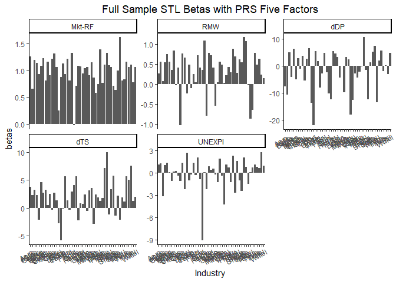<!-- -->

### S3-2-4 Rolling Window Estimation with STL Trend

Here, we would try to conduct the STL decomposition before the first
step regression with full sample.

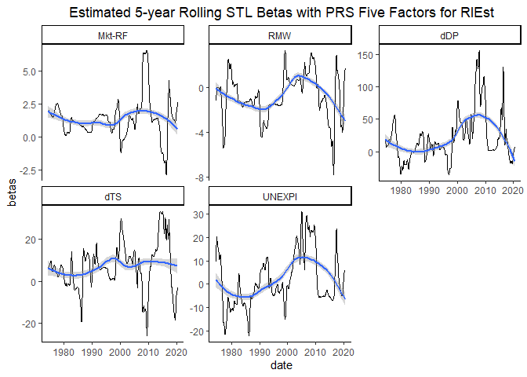<!-- -->

It seems that the STL decomposition does not help the first step
regression.

# S4 Factor Premium Estimation

In this section, we will describe different ways to estimate the Factor
Premium.

In the factor premium estimation, we would use the information from the
previous month to estimate the lambdas of the current month.

## S4-1 Arithmetic Mean

First, one can take the arithmetic mean of the factors to generate the
expected factor premium. To allow the factor premium to evolve, we also
estimated RAM which is a 5-year Rolling Arithmetic Mean.

<table class="table table-striped" style="font-size: 10px; width: auto !important; margin-left: auto; margin-right: auto;">
<caption style="font-size: initial !important;">
Athrithmetic Mean of Fama French Five Factors Premium
</caption>
<thead>
<tr>
<th style="text-align:center;">
Mkt-RF
</th>
<th style="text-align:center;">
SMB
</th>
<th style="text-align:center;">
HML
</th>
<th style="text-align:center;">
RMW
</th>
<th style="text-align:center;">
CMA
</th>
</tr>
</thead>
<tbody>
<tr>
<td style="text-align:center;">
0.0053662
</td>
<td style="text-align:center;">
0.0021664
</td>
<td style="text-align:center;">
0.0025373
</td>
<td style="text-align:center;">
0.0025544
</td>
<td style="text-align:center;">
0.0026045
</td>
</tr>
</tbody>
</table>
<table class="table table-striped" style="font-size: 10px; width: auto !important; margin-left: auto; margin-right: auto;">
<caption style="font-size: initial !important;">
Athrithmetic Mean of PRS Five Factors Premium
</caption>
<thead>
<tr>
<th style="text-align:center;">
Mkt-RF
</th>
<th style="text-align:center;">
RMW
</th>
<th style="text-align:center;">
dDP
</th>
<th style="text-align:center;">
dTS
</th>
<th style="text-align:center;">
UNEXPI
</th>
</tr>
</thead>
<tbody>
<tr>
<td style="text-align:center;">
0.0053662
</td>
<td style="text-align:center;">
0.0025544
</td>
<td style="text-align:center;">
8.5e-06
</td>
<td style="text-align:center;">
0.0003148
</td>
<td style="text-align:center;">
0.000189
</td>
</tr>
</tbody>
</table>

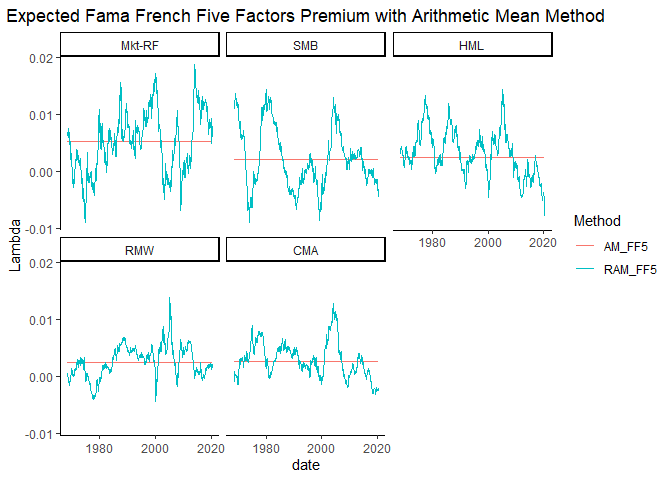<!-- --><!-- -->

## S4-2 Geometric Mean

Levi and Welch mentioned in their 2017 paper that geometric mean might
perform better. So in this section, we will calculate the Geometric Mean
as the factor premium. To allow the factor premium to evolve, we also
estimated RAM which is a 5-year Rolling Geometric Mean.

<table class="table table-striped" style="font-size: 10px; width: auto !important; margin-left: auto; margin-right: auto;">
<caption style="font-size: initial !important;">
Geometric Mean of Fama French Five Factors Premium
</caption>
<thead>
<tr>
<th style="text-align:center;">
Mkt-RF
</th>
<th style="text-align:center;">
SMB
</th>
<th style="text-align:center;">
HML
</th>
<th style="text-align:center;">
RMW
</th>
<th style="text-align:center;">
CMA
</th>
</tr>
</thead>
<tbody>
<tr>
<td style="text-align:center;">
0.0043649
</td>
<td style="text-align:center;">
0.0017141
</td>
<td style="text-align:center;">
0.0021243
</td>
<td style="text-align:center;">
0.002322
</td>
<td style="text-align:center;">
0.0024072
</td>
</tr>
</tbody>
</table>
<table class="table table-striped" style="font-size: 10px; width: auto !important; margin-left: auto; margin-right: auto;">
<caption style="font-size: initial !important;">
Geometric Mean of PRS Five Factors Premium
</caption>
<thead>
<tr>
<th style="text-align:center;">
Mkt-RF
</th>
<th style="text-align:center;">
RMW
</th>
<th style="text-align:center;">
dDP
</th>
<th style="text-align:center;">
dTS
</th>
<th style="text-align:center;">
UNEXPI
</th>
</tr>
</thead>
<tbody>
<tr>
<td style="text-align:center;">
0.0043649
</td>
<td style="text-align:center;">
0.002322
</td>
<td style="text-align:center;">
7.9e-06
</td>
<td style="text-align:center;">
0.0003117
</td>
<td style="text-align:center;">
0.000184
</td>
</tr>
</tbody>
</table>

<!-- -->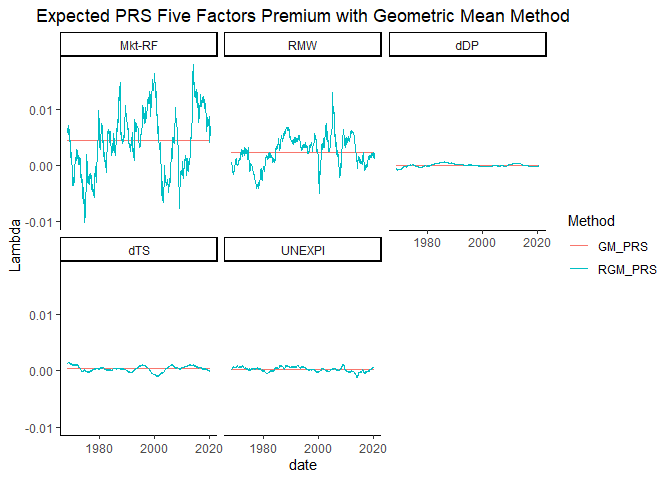<!-- -->

## S4-3 Fama Macbeth Second Step Regression

Fama-Macbeth second regression estimated lambda represents the expected
factor risk premium. In this section, we will apply the second step
regression on the 48 Portfolios (49 portfolios excluding Other) to
estimate the factor risk premium.

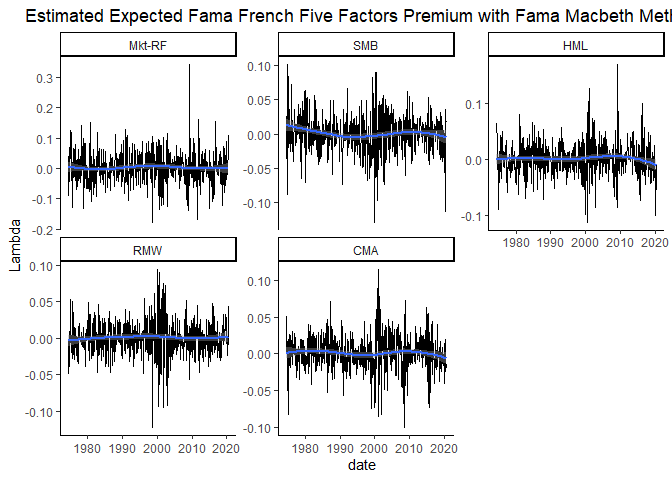<!-- -->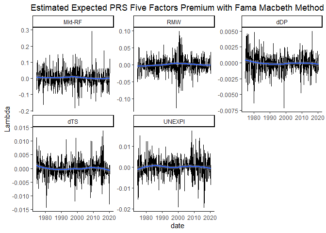<!-- -->

Now, we decompose the standard error of the second-step regression
lambdas. At each time t,

 = \hat{\sigma}_e*\frac{1}{\sqrt{SST_{\hat\beta}}}*\frac{1}{\sqrt{1-R^2_{\hat\beta}}}")

where

represents the variation of errors,

represents intra-group beta variation, and

represents inter-group beta variation. We can clearly see that with the
seasonality and time-series noise in the error term, we would get a
larger standard error for estimated
.

^2")

where

comes from auxiliary regression (aka Factor Spanning Regression)

We will rewrite the terms as:

 = \hat{\sigma}_e*\frac{1}{\hat{\sigma}_{\beta,intra}}*\frac{1}{\hat{\sigma}_{\beta,inter}}")

The decomposition would be:

}{ln(se(\hat\lambda))}-\frac{ln(\hat{\sigma}_{\beta,intra})}{ln(se(\hat\lambda))}-\frac{ln(\hat{\sigma}_{\beta,inter})}{ln(se(\hat\lambda))}")

And each term is the effect of variation to the
")
and this effect is associated with the sensitivity of
")
to the specific variation:

}{d\hat{\sigma}_e} = \frac{1}{\hat{\sigma}_{\beta,intra}}*\frac{1}{\hat{\sigma}_{\beta,inter}} = \frac{se(\hat\lambda)}{\hat{\sigma}_e} = se(\hat\lambda)^{1-\frac{ln(\hat{\sigma}_e)}{ln(se(\hat\lambda))}}")

}{d\hat{\sigma}_{\beta,intra}} = \frac{-1}{\hat{\sigma}^2_{\beta,intra}}*\frac{\hat{\sigma}_e}{\hat{\sigma}_{\beta,inter}} = -\frac{se(\hat\lambda)}{\hat{\sigma}_{\beta,intra}} = -se(\hat\lambda)^{1-\frac{ln(\hat{\sigma}_{\beta,intra})}{se(\hat\lambda)}}")

Similarly,

}{d\hat{\sigma}_{\beta,inter}} = \frac{-1}{\hat{\sigma}^2_{\beta,inter}}*\frac{\hat{\sigma}_e}{\hat{\sigma}_{\beta,intra}} = -\frac{se(\hat\lambda)}{\hat{\sigma}_{\beta,inter}} = -se(\hat\lambda)^{1-\frac{ln(\hat{\sigma}_{\beta,inter})}{se(\hat\lambda)}}")

We only care about the magnitude of this sensitivity, since
<1"),
the magnitude of the sensitivity is an increasing function of the
decomposition component.

<table class="table table-striped" style="font-size: 10px; width: auto !important; margin-left: auto; margin-right: auto;">
<caption style="font-size: initial !important;">
FF5 Fama Macbeth lambda SE Decomposition Percent
</caption>
<thead>
<tr>
<th style="empty-cells: hide;border-bottom:hidden;" colspan="2">
</th>
<th style="border-bottom:hidden;padding-bottom:0; padding-left:3px;padding-right:3px;text-align: center; " colspan="5">

stats

</th>
</tr>
<tr>
<th style="text-align:center;">
Factor
</th>
<th style="text-align:center;">
Type
</th>
<th style="text-align:center;">
mean
</th>
<th style="text-align:center;">
median
</th>
<th style="text-align:center;">
variance
</th>
<th style="text-align:center;">
skewness
</th>
<th style="text-align:center;">
kurtosis
</th>
</tr>
</thead>
<tbody>
<tr>
<td style="text-align:center;font-weight: bold;">
Mkt-RF
</td>
<td style="text-align:center;">
sig_e\_FF5
</td>
<td style="text-align:center;">
0.9182040
</td>
<td style="text-align:center;">
0.9153789
</td>
<td style="text-align:center;">
0.0072754
</td>
<td style="text-align:center;">
0.3386419
</td>
<td style="text-align:center;">
2.631980
</td>
</tr>
<tr>
<td style="text-align:center;font-weight: bold;">
Mkt-RF
</td>
<td style="text-align:center;">
sig_Inter_FF5
</td>
<td style="text-align:center;">
0.0551903
</td>
<td style="text-align:center;">
0.0493008
</td>
<td style="text-align:center;">
0.0037033
</td>
<td style="text-align:center;">
0.5724396
</td>
<td style="text-align:center;">
3.609334
</td>
</tr>
<tr>
<td style="text-align:center;font-weight: bold;">
Mkt-RF
</td>
<td style="text-align:center;">
sig_Intra_FF5
</td>
<td style="text-align:center;">
-0.1369863
</td>
<td style="text-align:center;">
-0.1352051
</td>
<td style="text-align:center;">
0.0052267
</td>
<td style="text-align:center;">
0.1314828
</td>
<td style="text-align:center;">
2.341135
</td>
</tr>
<tr>
<td style="text-align:center;font-weight: bold;">
SMB
</td>
<td style="text-align:center;">
sig_e\_FF5
</td>
<td style="text-align:center;">
0.7842757
</td>
<td style="text-align:center;">
0.7844735
</td>
<td style="text-align:center;">
0.0020140
</td>
<td style="text-align:center;">
0.0295439
</td>
<td style="text-align:center;">
3.588520
</td>
</tr>
<tr>
<td style="text-align:center;font-weight: bold;">
SMB
</td>
<td style="text-align:center;">
sig_Inter_FF5
</td>
<td style="text-align:center;">
0.0327539
</td>
<td style="text-align:center;">
0.0311613
</td>
<td style="text-align:center;">
0.0022112
</td>
<td style="text-align:center;">
0.3916627
</td>
<td style="text-align:center;">
3.395379
</td>
</tr>
<tr>
<td style="text-align:center;font-weight: bold;">
SMB
</td>
<td style="text-align:center;">
sig_Intra_FF5
</td>
<td style="text-align:center;">
-0.2484783
</td>
<td style="text-align:center;">
-0.2453501
</td>
<td style="text-align:center;">
0.0009941
</td>
<td style="text-align:center;">
-0.7191947
</td>
<td style="text-align:center;">
3.545787
</td>
</tr>
<tr>
<td style="text-align:center;font-weight: bold;">
HML
</td>
<td style="text-align:center;">
sig_e\_FF5
</td>
<td style="text-align:center;">
0.7747285
</td>
<td style="text-align:center;">
0.7748400
</td>
<td style="text-align:center;">
0.0021146
</td>
<td style="text-align:center;">
0.2165646
</td>
<td style="text-align:center;">
3.232397
</td>
</tr>
<tr>
<td style="text-align:center;font-weight: bold;">
HML
</td>
<td style="text-align:center;">
sig_Inter_FF5
</td>
<td style="text-align:center;">
0.0616298
</td>
<td style="text-align:center;">
0.0557540
</td>
<td style="text-align:center;">
0.0033073
</td>
<td style="text-align:center;">
0.7967711
</td>
<td style="text-align:center;">
4.616204
</td>
</tr>
<tr>
<td style="text-align:center;font-weight: bold;">
HML
</td>
<td style="text-align:center;">
sig_Intra_FF5
</td>
<td style="text-align:center;">
-0.2869014
</td>
<td style="text-align:center;">
-0.2864407
</td>
<td style="text-align:center;">
0.0014665
</td>
<td style="text-align:center;">
-0.2346089
</td>
<td style="text-align:center;">
3.183892
</td>
</tr>
<tr>
<td style="text-align:center;font-weight: bold;">
RMW
</td>
<td style="text-align:center;">
sig_e\_FF5
</td>
<td style="text-align:center;">
0.7455566
</td>
<td style="text-align:center;">
0.7468591
</td>
<td style="text-align:center;">
0.0024737
</td>
<td style="text-align:center;">
-0.1914391
</td>
<td style="text-align:center;">
3.938057
</td>
</tr>
<tr>
<td style="text-align:center;font-weight: bold;">
RMW
</td>
<td style="text-align:center;">
sig_Inter_FF5
</td>
<td style="text-align:center;">
0.0559504
</td>
<td style="text-align:center;">
0.0500978
</td>
<td style="text-align:center;">
0.0037294
</td>
<td style="text-align:center;">
0.8267787
</td>
<td style="text-align:center;">
4.454552
</td>
</tr>
<tr>
<td style="text-align:center;font-weight: bold;">
RMW
</td>
<td style="text-align:center;">
sig_Intra_FF5
</td>
<td style="text-align:center;">
-0.3103938
</td>
<td style="text-align:center;">
-0.3086301
</td>
<td style="text-align:center;">
0.0027221
</td>
<td style="text-align:center;">
-0.4532663
</td>
<td style="text-align:center;">
3.012957
</td>
</tr>
<tr>
<td style="text-align:center;font-weight: bold;">
CMA
</td>
<td style="text-align:center;">
sig_e\_FF5
</td>
<td style="text-align:center;">
0.7454791
</td>
<td style="text-align:center;">
0.7358105
</td>
<td style="text-align:center;">
0.0038303
</td>
<td style="text-align:center;">
0.4664620
</td>
<td style="text-align:center;">
3.339234
</td>
</tr>
<tr>
<td style="text-align:center;font-weight: bold;">
CMA
</td>
<td style="text-align:center;">
sig_Inter_FF5
</td>
<td style="text-align:center;">
0.0706917
</td>
<td style="text-align:center;">
0.0643498
</td>
<td style="text-align:center;">
0.0029803
</td>
<td style="text-align:center;">
0.5856014
</td>
<td style="text-align:center;">
3.590136
</td>
</tr>
<tr>
<td style="text-align:center;font-weight: bold;">
CMA
</td>
<td style="text-align:center;">
sig_Intra_FF5
</td>
<td style="text-align:center;">
-0.3252126
</td>
<td style="text-align:center;">
-0.3292688
</td>
<td style="text-align:center;">
0.0024128
</td>
<td style="text-align:center;">
0.4387760
</td>
<td style="text-align:center;">
3.498855
</td>
</tr>
<tr>
<td style="text-align:center;font-weight: bold;">
Overall
</td>
<td style="text-align:center;">
sig_e\_FF5
</td>
<td style="text-align:center;">
0.7936488
</td>
<td style="text-align:center;">
0.7790290
</td>
<td style="text-align:center;">
0.0076566
</td>
<td style="text-align:center;">
1.0903018
</td>
<td style="text-align:center;">
4.599389
</td>
</tr>
<tr>
<td style="text-align:center;font-weight: bold;">
Overall
</td>
<td style="text-align:center;">
sig_Inter_FF5
</td>
<td style="text-align:center;">
0.0552432
</td>
<td style="text-align:center;">
0.0508109
</td>
<td style="text-align:center;">
0.0033389
</td>
<td style="text-align:center;">
0.6796869
</td>
<td style="text-align:center;">
4.099650
</td>
</tr>
<tr>
<td style="text-align:center;font-weight: bold;">
Overall
</td>
<td style="text-align:center;">
sig_Intra_FF5
</td>
<td style="text-align:center;">
-0.2615945
</td>
<td style="text-align:center;">
-0.2709449
</td>
<td style="text-align:center;">
0.0071160
</td>
<td style="text-align:center;">
0.8565790
</td>
<td style="text-align:center;">
3.930170
</td>
</tr>
</tbody>
</table>
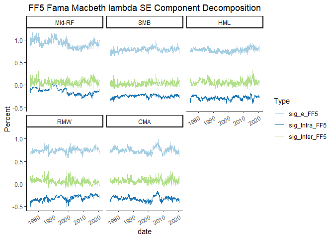<!-- -->
<table class="table table-striped" style="font-size: 10px; width: auto !important; margin-left: auto; margin-right: auto;">
<caption style="font-size: initial !important;">
PRS Fama Macbeth lambda SE Decomposition Percent
</caption>
<thead>
<tr>
<th style="empty-cells: hide;border-bottom:hidden;" colspan="2">
</th>
<th style="border-bottom:hidden;padding-bottom:0; padding-left:3px;padding-right:3px;text-align: center; " colspan="5">

stats

</th>
</tr>
<tr>
<th style="text-align:center;">
Factor
</th>
<th style="text-align:center;">
Type
</th>
<th style="text-align:center;">
mean
</th>
<th style="text-align:center;">
median
</th>
<th style="text-align:center;">
variance
</th>
<th style="text-align:center;">
skewness
</th>
<th style="text-align:center;">
kurtosis
</th>
</tr>
</thead>
<tbody>
<tr>
<td style="text-align:center;font-weight: bold;">
Mkt-RF
</td>
<td style="text-align:center;">
sig_e\_PRS
</td>
<td style="text-align:center;">
0.8848130
</td>
<td style="text-align:center;">
0.8809556
</td>
<td style="text-align:center;">
0.0058356
</td>
<td style="text-align:center;">
0.2944836
</td>
<td style="text-align:center;">
2.414368
</td>
</tr>
<tr>
<td style="text-align:center;font-weight: bold;">
Mkt-RF
</td>
<td style="text-align:center;">
sig_Inter_PRS
</td>
<td style="text-align:center;">
0.0707009
</td>
<td style="text-align:center;">
0.0646034
</td>
<td style="text-align:center;">
0.0036295
</td>
<td style="text-align:center;">
0.5926467
</td>
<td style="text-align:center;">
3.590388
</td>
</tr>
<tr>
<td style="text-align:center;font-weight: bold;">
Mkt-RF
</td>
<td style="text-align:center;">
sig_Intra_PRS
</td>
<td style="text-align:center;">
-0.1858878
</td>
<td style="text-align:center;">
-0.1921695
</td>
<td style="text-align:center;">
0.0035758
</td>
<td style="text-align:center;">
0.2128154
</td>
<td style="text-align:center;">
2.729019
</td>
</tr>
<tr>
<td style="text-align:center;font-weight: bold;">
RMW
</td>
<td style="text-align:center;">
sig_e\_PRS
</td>
<td style="text-align:center;">
0.7400037
</td>
<td style="text-align:center;">
0.7385695
</td>
<td style="text-align:center;">
0.0019424
</td>
<td style="text-align:center;">
-0.0546739
</td>
<td style="text-align:center;">
2.960735
</td>
</tr>
<tr>
<td style="text-align:center;font-weight: bold;">
RMW
</td>
<td style="text-align:center;">
sig_Inter_PRS
</td>
<td style="text-align:center;">
0.0425830
</td>
<td style="text-align:center;">
0.0366592
</td>
<td style="text-align:center;">
0.0021942
</td>
<td style="text-align:center;">
0.7564774
</td>
<td style="text-align:center;">
6.581030
</td>
</tr>
<tr>
<td style="text-align:center;font-weight: bold;">
RMW
</td>
<td style="text-align:center;">
sig_Intra_PRS
</td>
<td style="text-align:center;">
-0.3025794
</td>
<td style="text-align:center;">
-0.2988016
</td>
<td style="text-align:center;">
0.0018528
</td>
<td style="text-align:center;">
-1.0165092
</td>
<td style="text-align:center;">
5.283378
</td>
</tr>
<tr>
<td style="text-align:center;font-weight: bold;">
dDP
</td>
<td style="text-align:center;">
sig_e\_PRS
</td>
<td style="text-align:center;">
0.4805614
</td>
<td style="text-align:center;">
0.4825909
</td>
<td style="text-align:center;">
0.0010641
</td>
<td style="text-align:center;">
-0.5761163
</td>
<td style="text-align:center;">
3.565545
</td>
</tr>
<tr>
<td style="text-align:center;font-weight: bold;">
dDP
</td>
<td style="text-align:center;">
sig_Inter_PRS
</td>
<td style="text-align:center;">
0.0437666
</td>
<td style="text-align:center;">
0.0425164
</td>
<td style="text-align:center;">
0.0012435
</td>
<td style="text-align:center;">
0.3196051
</td>
<td style="text-align:center;">
3.011570
</td>
</tr>
<tr>
<td style="text-align:center;font-weight: bold;">
dDP
</td>
<td style="text-align:center;">
sig_Intra_PRS
</td>
<td style="text-align:center;">
-0.5632052
</td>
<td style="text-align:center;">
-0.5599517
</td>
<td style="text-align:center;">
0.0010030
</td>
<td style="text-align:center;">
-0.5845834
</td>
<td style="text-align:center;">
3.433912
</td>
</tr>
<tr>
<td style="text-align:center;font-weight: bold;">
dTS
</td>
<td style="text-align:center;">
sig_e\_PRS
</td>
<td style="text-align:center;">
0.5398860
</td>
<td style="text-align:center;">
0.5425591
</td>
<td style="text-align:center;">
0.0011480
</td>
<td style="text-align:center;">
-0.6297697
</td>
<td style="text-align:center;">
3.563760
</td>
</tr>
<tr>
<td style="text-align:center;font-weight: bold;">
dTS
</td>
<td style="text-align:center;">
sig_Inter_PRS
</td>
<td style="text-align:center;">
0.0453300
</td>
<td style="text-align:center;">
0.0408445
</td>
<td style="text-align:center;">
0.0016972
</td>
<td style="text-align:center;">
0.6351167
</td>
<td style="text-align:center;">
3.418116
</td>
</tr>
<tr>
<td style="text-align:center;font-weight: bold;">
dTS
</td>
<td style="text-align:center;">
sig_Intra_PRS
</td>
<td style="text-align:center;">
-0.5054440
</td>
<td style="text-align:center;">
-0.5021324
</td>
<td style="text-align:center;">
0.0014474
</td>
<td style="text-align:center;">
-0.2864542
</td>
<td style="text-align:center;">
2.727893
</td>
</tr>
<tr>
<td style="text-align:center;font-weight: bold;">
UNEXPI
</td>
<td style="text-align:center;">
sig_e\_PRS
</td>
<td style="text-align:center;">
0.5708058
</td>
<td style="text-align:center;">
0.5698308
</td>
<td style="text-align:center;">
0.0016075
</td>
<td style="text-align:center;">
0.1082007
</td>
<td style="text-align:center;">
3.018200
</td>
</tr>
<tr>
<td style="text-align:center;font-weight: bold;">
UNEXPI
</td>
<td style="text-align:center;">
sig_Inter_PRS
</td>
<td style="text-align:center;">
0.0528149
</td>
<td style="text-align:center;">
0.0477405
</td>
<td style="text-align:center;">
0.0022399
</td>
<td style="text-align:center;">
0.6258754
</td>
<td style="text-align:center;">
3.421866
</td>
</tr>
<tr>
<td style="text-align:center;font-weight: bold;">
UNEXPI
</td>
<td style="text-align:center;">
sig_Intra_PRS
</td>
<td style="text-align:center;">
-0.4820091
</td>
<td style="text-align:center;">
-0.4831229
</td>
<td style="text-align:center;">
0.0017143
</td>
<td style="text-align:center;">
-0.2088483
</td>
<td style="text-align:center;">
2.574198
</td>
</tr>
<tr>
<td style="text-align:center;font-weight: bold;">
Overall
</td>
<td style="text-align:center;">
sig_e\_PRS
</td>
<td style="text-align:center;">
0.6432140
</td>
<td style="text-align:center;">
0.5784662
</td>
<td style="text-align:center;">
0.0243469
</td>
<td style="text-align:center;">
0.6781646
</td>
<td style="text-align:center;">
2.374651
</td>
</tr>
<tr>
<td style="text-align:center;font-weight: bold;">
Overall
</td>
<td style="text-align:center;">
sig_Inter_PRS
</td>
<td style="text-align:center;">
0.0510391
</td>
<td style="text-align:center;">
0.0462740
</td>
<td style="text-align:center;">
0.0023070
</td>
<td style="text-align:center;">
0.8155056
</td>
<td style="text-align:center;">
4.779944
</td>
</tr>
<tr>
<td style="text-align:center;font-weight: bold;">
Overall
</td>
<td style="text-align:center;">
sig_Intra_PRS
</td>
<td style="text-align:center;">
-0.4078251
</td>
<td style="text-align:center;">
-0.4644760
</td>
<td style="text-align:center;">
0.0218248
</td>
<td style="text-align:center;">
0.5345593
</td>
<td style="text-align:center;">
2.022189
</td>
</tr>
</tbody>
</table>

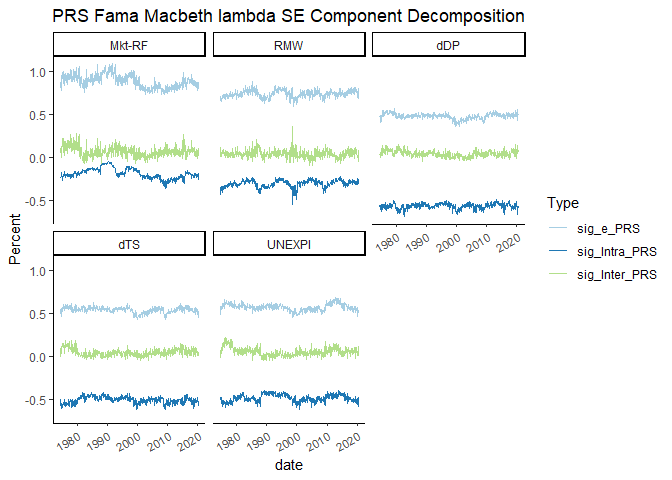<!-- -->

## S4-4 Fama Macbeth Second Step Regression with STL Deseaoned Data

As we can see, Fama Macbeth method would generate an evolving
time-series of factor risk premium, but the volatility in lambda is
unreasonably large. We will try to apply the STL trend in the second
step regression to smooth the lambda.

### S4-4-1 STL Filtering

STL method (Cleveland et al. 1990) would try decompose the time-series
into 3 components: trend, seasonality, and noise. It applies an
iterative smoothing method to extract the trend and seasonality
components. At the same time, one can choose to use a robust weighting
scheme to reduce the effect of large noise to the trend and seasonality
extraction.

We will extract the trend of risk premium of the industry portfolios and
the trend of the betas with the STL method, and then conduct the second
step regression. There are two options with the STL method: the loess
window for seasonal extraction (s_window, large value means no rapidly
evolving seasonal component, needs to be odd and at least 7) and robust
weights for noise (downweight the noisy data in smoothing if
non-Gaussian behavior in the time-series leads to extreme, transient
variation). We will first show the STL decomposition of betas and
returns.

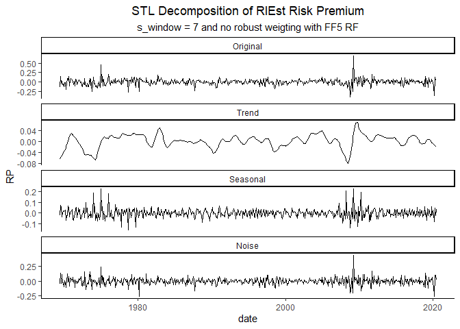<!-- -->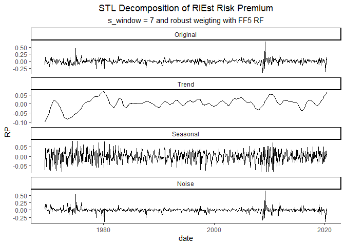<!-- -->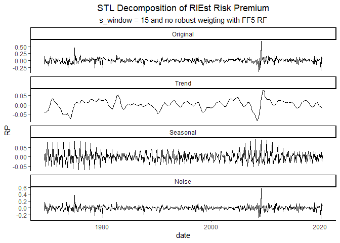<!-- -->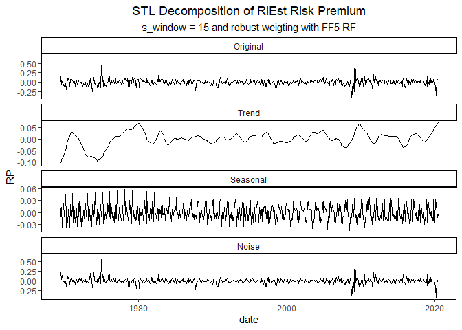<!-- -->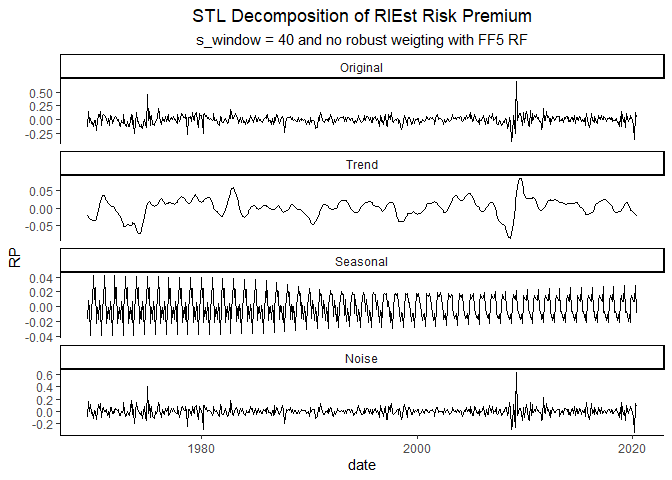<!-- -->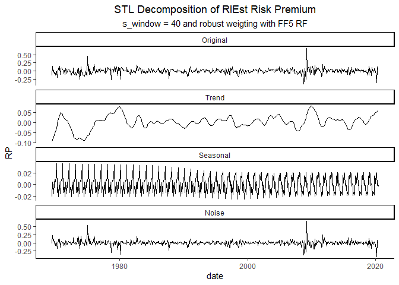<!-- -->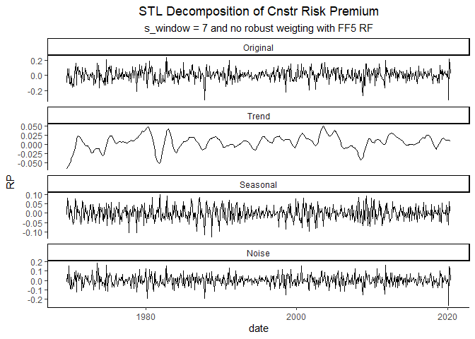<!-- --><!-- -->

The robustness weighting seems not be appropriate for the Industry Risk
Premiums since the returns variation are mostly caused by Gaussian
behavior. One example is the end of the trend curve: there was a market
crash at the beginning of 2020, so the trend should go down. However,
with the robust weighting, the market crash was given little wight and
disappeared. At the same time, we might just choose s_window = 7, since
there could be changing seasonal patterns in the short-term.

Now, we would compare the cross-sectional distribution before and after
filtering.

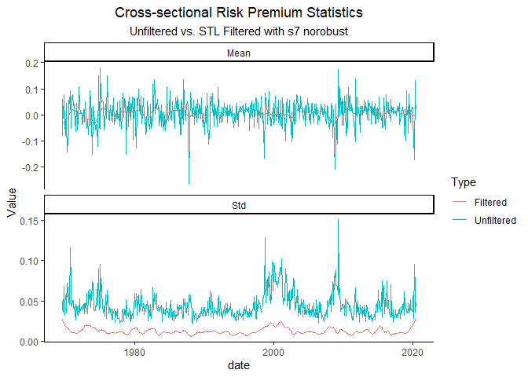<!-- -->

### S4-4-2 Filtered Seasonality and Trend Strength

Now we estimate the strength of trend and strength of seasonality. The
Strength of the trend is defined as:

}{Var(T_t+R_t)})")

The Strength of the seasonality (periodic) is defined as:

}{Var(S_t+R_t)})")

<table class="table table-striped" style="font-size: 10px; width: auto !important; margin-left: auto; margin-right: auto;">
<caption style="font-size: initial !important;">
STL Decomposition Component Strength for Portfolio Risk Premium
</caption>
<thead>
<tr>
<th style="text-align:center;">
Strength
</th>
<th style="text-align:center;">
method
</th>
<th style="text-align:center;">
Aero
</th>
<th style="text-align:center;">
Agric
</th>
<th style="text-align:center;">
Autos
</th>
<th style="text-align:center;">
Banks
</th>
<th style="text-align:center;">
Beer
</th>
<th style="text-align:center;">
BldMt
</th>
<th style="text-align:center;">
Books
</th>
<th style="text-align:center;">
Boxes
</th>
<th style="text-align:center;">
BusSv
</th>
<th style="text-align:center;">
Chems
</th>
<th style="text-align:center;">
Chips
</th>
<th style="text-align:center;">
Clths
</th>
<th style="text-align:center;">
Cnstr
</th>
<th style="text-align:center;">
Coal
</th>
<th style="text-align:center;">
Drugs
</th>
<th style="text-align:center;">
ElcEq
</th>
<th style="text-align:center;">
FabPr
</th>
<th style="text-align:center;">
Fin
</th>
<th style="text-align:center;">
Food
</th>
<th style="text-align:center;">
Fun
</th>
<th style="text-align:center;">
Gold
</th>
<th style="text-align:center;">
Guns
</th>
<th style="text-align:center;">
Hardw
</th>
<th style="text-align:center;">
Hlth
</th>
<th style="text-align:center;">
Hshld
</th>
<th style="text-align:center;">
Insur
</th>
<th style="text-align:center;">
LabEq
</th>
<th style="text-align:center;">
Mach
</th>
<th style="text-align:center;">
Meals
</th>
<th style="text-align:center;">
MedEq
</th>
<th style="text-align:center;">
Mines
</th>
<th style="text-align:center;">
Oil
</th>
<th style="text-align:center;">
Other
</th>
<th style="text-align:center;">
Paper
</th>
<th style="text-align:center;">
PerSv
</th>
<th style="text-align:center;">
RlEst
</th>
<th style="text-align:center;">
Rtail
</th>
<th style="text-align:center;">
Rubbr
</th>
<th style="text-align:center;">
Ships
</th>
<th style="text-align:center;">
Smoke
</th>
<th style="text-align:center;">
Soda
</th>
<th style="text-align:center;">
Softw
</th>
<th style="text-align:center;">
Steel
</th>
<th style="text-align:center;">
Telcm
</th>
<th style="text-align:center;">
Toys
</th>
<th style="text-align:center;">
Trans
</th>
<th style="text-align:center;">
Txtls
</th>
<th style="text-align:center;">
Util
</th>
<th style="text-align:center;">
Whlsl
</th>
</tr>
</thead>
<tbody>
<tr>
<td style="text-align:center;font-weight: bold;">
FS
</td>
<td style="text-align:center;">
s07 norobust
</td>
<td style="text-align:center;">
0.3911851
</td>
<td style="text-align:center;">
0.3725901
</td>
<td style="text-align:center;">
0.4018774
</td>
<td style="text-align:center;">
0.4123642
</td>
<td style="text-align:center;">
0.3927234
</td>
<td style="text-align:center;">
0.4078828
</td>
<td style="text-align:center;">
0.3910922
</td>
<td style="text-align:center;">
0.3648795
</td>
<td style="text-align:center;">
0.3812723
</td>
<td style="text-align:center;">
0.3675350
</td>
<td style="text-align:center;">
0.3616610
</td>
<td style="text-align:center;">
0.4190785
</td>
<td style="text-align:center;">
0.3798464
</td>
<td style="text-align:center;">
0.3773576
</td>
<td style="text-align:center;">
0.3700809
</td>
<td style="text-align:center;">
0.3704741
</td>
<td style="text-align:center;">
0.3684705
</td>
<td style="text-align:center;">
0.3673023
</td>
<td style="text-align:center;">
0.3680159
</td>
<td style="text-align:center;">
0.4094499
</td>
<td style="text-align:center;">
0.3472977
</td>
<td style="text-align:center;">
0.3537860
</td>
<td style="text-align:center;">
0.3597511
</td>
<td style="text-align:center;">
0.3807114
</td>
<td style="text-align:center;">
0.3932478
</td>
<td style="text-align:center;">
0.3934480
</td>
<td style="text-align:center;">
0.3332523
</td>
<td style="text-align:center;">
0.3668646
</td>
<td style="text-align:center;">
0.3629374
</td>
<td style="text-align:center;">
0.3584366
</td>
<td style="text-align:center;">
0.3371663
</td>
<td style="text-align:center;">
0.3550115
</td>
<td style="text-align:center;">
0.3970981
</td>
<td style="text-align:center;">
0.3472353
</td>
<td style="text-align:center;">
0.3540942
</td>
<td style="text-align:center;">
0.4210761
</td>
<td style="text-align:center;">
0.3944570
</td>
<td style="text-align:center;">
0.3988149
</td>
<td style="text-align:center;">
0.3716232
</td>
<td style="text-align:center;">
0.3130075
</td>
<td style="text-align:center;">
0.3659172
</td>
<td style="text-align:center;">
0.3278624
</td>
<td style="text-align:center;">
0.3442852
</td>
<td style="text-align:center;">
0.3609891
</td>
<td style="text-align:center;">
0.3592305
</td>
<td style="text-align:center;">
0.3992945
</td>
<td style="text-align:center;">
0.4088416
</td>
<td style="text-align:center;">
0.3775854
</td>
<td style="text-align:center;">
0.3694408
</td>
</tr>
<tr>
<td style="text-align:center;font-weight: bold;">
FS
</td>
<td style="text-align:center;">
s07 robust
</td>
<td style="text-align:center;">
0.1935022
</td>
<td style="text-align:center;">
0.1330849
</td>
<td style="text-align:center;">
0.1373592
</td>
<td style="text-align:center;">
0.1786056
</td>
<td style="text-align:center;">
0.1579393
</td>
<td style="text-align:center;">
0.1348414
</td>
<td style="text-align:center;">
0.1442415
</td>
<td style="text-align:center;">
0.1368121
</td>
<td style="text-align:center;">
0.1622529
</td>
<td style="text-align:center;">
0.1123085
</td>
<td style="text-align:center;">
0.1806169
</td>
<td style="text-align:center;">
0.1924230
</td>
<td style="text-align:center;">
0.1737184
</td>
<td style="text-align:center;">
0.1818465
</td>
<td style="text-align:center;">
0.1716535
</td>
<td style="text-align:center;">
0.1602079
</td>
<td style="text-align:center;">
0.1653442
</td>
<td style="text-align:center;">
0.1365543
</td>
<td style="text-align:center;">
0.2150892
</td>
<td style="text-align:center;">
0.1515594
</td>
<td style="text-align:center;">
0.1352441
</td>
<td style="text-align:center;">
0.1784574
</td>
<td style="text-align:center;">
0.1794134
</td>
<td style="text-align:center;">
0.1686052
</td>
<td style="text-align:center;">
0.1177779
</td>
<td style="text-align:center;">
0.1909530
</td>
<td style="text-align:center;">
0.1055538
</td>
<td style="text-align:center;">
0.1627177
</td>
<td style="text-align:center;">
0.0888803
</td>
<td style="text-align:center;">
0.1570241
</td>
<td style="text-align:center;">
0.0914811
</td>
<td style="text-align:center;">
0.1353939
</td>
<td style="text-align:center;">
0.2213339
</td>
<td style="text-align:center;">
0.1559026
</td>
<td style="text-align:center;">
0.1508374
</td>
<td style="text-align:center;">
0.1097639
</td>
<td style="text-align:center;">
0.1847783
</td>
<td style="text-align:center;">
0.2223238
</td>
<td style="text-align:center;">
0.1754397
</td>
<td style="text-align:center;">
0.1644021
</td>
<td style="text-align:center;">
0.1154241
</td>
<td style="text-align:center;">
0.0835594
</td>
<td style="text-align:center;">
0.1388996
</td>
<td style="text-align:center;">
0.1721490
</td>
<td style="text-align:center;">
0.1827868
</td>
<td style="text-align:center;">
0.2070766
</td>
<td style="text-align:center;">
0.1616175
</td>
<td style="text-align:center;">
0.1465886
</td>
<td style="text-align:center;">
0.1340354
</td>
</tr>
<tr>
<td style="text-align:center;font-weight: bold;">
FS
</td>
<td style="text-align:center;">
s15 norobust
</td>
<td style="text-align:center;">
0.1715220
</td>
<td style="text-align:center;">
0.1542386
</td>
<td style="text-align:center;">
0.1466074
</td>
<td style="text-align:center;">
0.1530480
</td>
<td style="text-align:center;">
0.1629970
</td>
<td style="text-align:center;">
0.1507389
</td>
<td style="text-align:center;">
0.1425589
</td>
<td style="text-align:center;">
0.1462846
</td>
<td style="text-align:center;">
0.1499812
</td>
<td style="text-align:center;">
0.1554518
</td>
<td style="text-align:center;">
0.1437995
</td>
<td style="text-align:center;">
0.1732677
</td>
<td style="text-align:center;">
0.1592202
</td>
<td style="text-align:center;">
0.1584251
</td>
<td style="text-align:center;">
0.1356105
</td>
<td style="text-align:center;">
0.1468336
</td>
<td style="text-align:center;">
0.1364764
</td>
<td style="text-align:center;">
0.1302110
</td>
<td style="text-align:center;">
0.1434273
</td>
<td style="text-align:center;">
0.1684885
</td>
<td style="text-align:center;">
0.1532860
</td>
<td style="text-align:center;">
0.1455716
</td>
<td style="text-align:center;">
0.1570901
</td>
<td style="text-align:center;">
0.1521780
</td>
<td style="text-align:center;">
0.1346499
</td>
<td style="text-align:center;">
0.1337293
</td>
<td style="text-align:center;">
0.1358997
</td>
<td style="text-align:center;">
0.1452397
</td>
<td style="text-align:center;">
0.1303147
</td>
<td style="text-align:center;">
0.1455287
</td>
<td style="text-align:center;">
0.1229566
</td>
<td style="text-align:center;">
0.1441907
</td>
<td style="text-align:center;">
0.1853615
</td>
<td style="text-align:center;">
0.1412987
</td>
<td style="text-align:center;">
0.1435338
</td>
<td style="text-align:center;">
0.1646089
</td>
<td style="text-align:center;">
0.1462893
</td>
<td style="text-align:center;">
0.1754984
</td>
<td style="text-align:center;">
0.1499311
</td>
<td style="text-align:center;">
0.1391745
</td>
<td style="text-align:center;">
0.1533818
</td>
<td style="text-align:center;">
0.1506773
</td>
<td style="text-align:center;">
0.1417627
</td>
<td style="text-align:center;">
0.1533034
</td>
<td style="text-align:center;">
0.1544247
</td>
<td style="text-align:center;">
0.1641945
</td>
<td style="text-align:center;">
0.1755422
</td>
<td style="text-align:center;">
0.1608538
</td>
<td style="text-align:center;">
0.1414738
</td>
</tr>
<tr>
<td style="text-align:center;font-weight: bold;">
FS
</td>
<td style="text-align:center;">
s15 robust
</td>
<td style="text-align:center;">
0.0932133
</td>
<td style="text-align:center;">
0.0630820
</td>
<td style="text-align:center;">
0.0636732
</td>
<td style="text-align:center;">
0.0817096
</td>
<td style="text-align:center;">
0.0697414
</td>
<td style="text-align:center;">
0.0525724
</td>
<td style="text-align:center;">
0.0654441
</td>
<td style="text-align:center;">
0.0697971
</td>
<td style="text-align:center;">
0.0682196
</td>
<td style="text-align:center;">
0.0665752
</td>
<td style="text-align:center;">
0.0817959
</td>
<td style="text-align:center;">
0.1038690
</td>
<td style="text-align:center;">
0.0931980
</td>
<td style="text-align:center;">
0.0929010
</td>
<td style="text-align:center;">
0.0748362
</td>
<td style="text-align:center;">
0.0922239
</td>
<td style="text-align:center;">
0.0735943
</td>
<td style="text-align:center;">
0.0615121
</td>
<td style="text-align:center;">
0.0560796
</td>
<td style="text-align:center;">
0.0896648
</td>
<td style="text-align:center;">
0.0709464
</td>
<td style="text-align:center;">
0.0728823
</td>
<td style="text-align:center;">
0.0856320
</td>
<td style="text-align:center;">
0.0734410
</td>
<td style="text-align:center;">
0.0392797
</td>
<td style="text-align:center;">
0.0729093
</td>
<td style="text-align:center;">
0.0600954
</td>
<td style="text-align:center;">
0.0791513
</td>
<td style="text-align:center;">
0.0629090
</td>
<td style="text-align:center;">
0.0719507
</td>
<td style="text-align:center;">
0.0405025
</td>
<td style="text-align:center;">
0.0672994
</td>
<td style="text-align:center;">
0.0831488
</td>
<td style="text-align:center;">
0.0756608
</td>
<td style="text-align:center;">
0.0719348
</td>
<td style="text-align:center;">
0.0549216
</td>
<td style="text-align:center;">
0.1015209
</td>
<td style="text-align:center;">
0.1059332
</td>
<td style="text-align:center;">
0.0761996
</td>
<td style="text-align:center;">
0.0945961
</td>
<td style="text-align:center;">
0.0624700
</td>
<td style="text-align:center;">
0.0397197
</td>
<td style="text-align:center;">
0.0834692
</td>
<td style="text-align:center;">
0.0966527
</td>
<td style="text-align:center;">
0.0892999
</td>
<td style="text-align:center;">
0.0813360
</td>
<td style="text-align:center;">
0.0726407
</td>
<td style="text-align:center;">
0.0763601
</td>
<td style="text-align:center;">
0.0562639
</td>
</tr>
<tr>
<td style="text-align:center;font-weight: bold;">
FS
</td>
<td style="text-align:center;">
s40 norobust
</td>
<td style="text-align:center;">
0.0601633
</td>
<td style="text-align:center;">
0.0475928
</td>
<td style="text-align:center;">
0.0765333
</td>
<td style="text-align:center;">
0.0434124
</td>
<td style="text-align:center;">
0.0579168
</td>
<td style="text-align:center;">
0.0552060
</td>
<td style="text-align:center;">
0.0386767
</td>
<td style="text-align:center;">
0.0649526
</td>
<td style="text-align:center;">
0.0409870
</td>
<td style="text-align:center;">
0.0739656
</td>
<td style="text-align:center;">
0.0395210
</td>
<td style="text-align:center;">
0.0581979
</td>
<td style="text-align:center;">
0.0514092
</td>
<td style="text-align:center;">
0.0598806
</td>
<td style="text-align:center;">
0.0303644
</td>
<td style="text-align:center;">
0.0567801
</td>
<td style="text-align:center;">
0.0596509
</td>
<td style="text-align:center;">
0.0341185
</td>
<td style="text-align:center;">
0.0403368
</td>
<td style="text-align:center;">
0.0688779
</td>
<td style="text-align:center;">
0.0462200
</td>
<td style="text-align:center;">
0.0607677
</td>
<td style="text-align:center;">
0.0491420
</td>
<td style="text-align:center;">
0.0502315
</td>
<td style="text-align:center;">
0.0405826
</td>
<td style="text-align:center;">
0.0413409
</td>
<td style="text-align:center;">
0.0437884
</td>
<td style="text-align:center;">
0.0599790
</td>
<td style="text-align:center;">
0.0544320
</td>
<td style="text-align:center;">
0.0421698
</td>
<td style="text-align:center;">
0.0489724
</td>
<td style="text-align:center;">
0.0491735
</td>
<td style="text-align:center;">
0.0641968
</td>
<td style="text-align:center;">
0.0637719
</td>
<td style="text-align:center;">
0.0418764
</td>
<td style="text-align:center;">
0.0671636
</td>
<td style="text-align:center;">
0.0499496
</td>
<td style="text-align:center;">
0.0782749
</td>
<td style="text-align:center;">
0.0561672
</td>
<td style="text-align:center;">
0.0422292
</td>
<td style="text-align:center;">
0.0467096
</td>
<td style="text-align:center;">
0.0500458
</td>
<td style="text-align:center;">
0.0678029
</td>
<td style="text-align:center;">
0.0453633
</td>
<td style="text-align:center;">
0.0563154
</td>
<td style="text-align:center;">
0.0566933
</td>
<td style="text-align:center;">
0.0613601
</td>
<td style="text-align:center;">
0.0558211
</td>
<td style="text-align:center;">
0.0480012
</td>
</tr>
<tr>
<td style="text-align:center;font-weight: bold;">
FS
</td>
<td style="text-align:center;">
s40 robust
</td>
<td style="text-align:center;">
0.0195290
</td>
<td style="text-align:center;">
0.0251790
</td>
<td style="text-align:center;">
0.0436084
</td>
<td style="text-align:center;">
0.0206615
</td>
<td style="text-align:center;">
0.0184751
</td>
<td style="text-align:center;">
0.0271615
</td>
<td style="text-align:center;">
0.0184102
</td>
<td style="text-align:center;">
0.0451552
</td>
<td style="text-align:center;">
0.0161600
</td>
<td style="text-align:center;">
0.0406732
</td>
<td style="text-align:center;">
0.0254891
</td>
<td style="text-align:center;">
0.0289817
</td>
<td style="text-align:center;">
0.0398457
</td>
<td style="text-align:center;">
0.0294088
</td>
<td style="text-align:center;">
0.0173966
</td>
<td style="text-align:center;">
0.0393771
</td>
<td style="text-align:center;">
0.0358616
</td>
<td style="text-align:center;">
0.0173265
</td>
<td style="text-align:center;">
0.0129435
</td>
<td style="text-align:center;">
0.0496558
</td>
<td style="text-align:center;">
0.0325875
</td>
<td style="text-align:center;">
0.0330893
</td>
<td style="text-align:center;">
0.0326774
</td>
<td style="text-align:center;">
0.0252610
</td>
<td style="text-align:center;">
0.0195269
</td>
<td style="text-align:center;">
0.0293054
</td>
<td style="text-align:center;">
0.0302699
</td>
<td style="text-align:center;">
0.0410299
</td>
<td style="text-align:center;">
0.0383096
</td>
<td style="text-align:center;">
0.0285954
</td>
<td style="text-align:center;">
0.0365749
</td>
<td style="text-align:center;">
0.0225854
</td>
<td style="text-align:center;">
0.0280083
</td>
<td style="text-align:center;">
0.0411606
</td>
<td style="text-align:center;">
0.0199753
</td>
<td style="text-align:center;">
0.0302439
</td>
<td style="text-align:center;">
0.0300381
</td>
<td style="text-align:center;">
0.0465594
</td>
<td style="text-align:center;">
0.0432242
</td>
<td style="text-align:center;">
0.0279197
</td>
<td style="text-align:center;">
0.0230431
</td>
<td style="text-align:center;">
0.0100405
</td>
<td style="text-align:center;">
0.0457963
</td>
<td style="text-align:center;">
0.0332615
</td>
<td style="text-align:center;">
0.0369541
</td>
<td style="text-align:center;">
0.0330005
</td>
<td style="text-align:center;">
0.0367820
</td>
<td style="text-align:center;">
0.0359658
</td>
<td style="text-align:center;">
0.0233252
</td>
</tr>
<tr>
<td style="text-align:center;font-weight: bold;">
FT
</td>
<td style="text-align:center;">
s07 norobust
</td>
<td style="text-align:center;">
0.1747301
</td>
<td style="text-align:center;">
0.1218548
</td>
<td style="text-align:center;">
0.1722092
</td>
<td style="text-align:center;">
0.1530624
</td>
<td style="text-align:center;">
0.1444809
</td>
<td style="text-align:center;">
0.1299203
</td>
<td style="text-align:center;">
0.1915024
</td>
<td style="text-align:center;">
0.1342552
</td>
<td style="text-align:center;">
0.1548790
</td>
<td style="text-align:center;">
0.1323798
</td>
<td style="text-align:center;">
0.1731102
</td>
<td style="text-align:center;">
0.1781217
</td>
<td style="text-align:center;">
0.1544956
</td>
<td style="text-align:center;">
0.1934636
</td>
<td style="text-align:center;">
0.1346082
</td>
<td style="text-align:center;">
0.1277598
</td>
<td style="text-align:center;">
0.1373339
</td>
<td style="text-align:center;">
0.1621637
</td>
<td style="text-align:center;">
0.1402085
</td>
<td style="text-align:center;">
0.1668559
</td>
<td style="text-align:center;">
0.1174218
</td>
<td style="text-align:center;">
0.1392205
</td>
<td style="text-align:center;">
0.1688858
</td>
<td style="text-align:center;">
0.1965993
</td>
<td style="text-align:center;">
0.1523608
</td>
<td style="text-align:center;">
0.1570573
</td>
<td style="text-align:center;">
0.1306660
</td>
<td style="text-align:center;">
0.1365207
</td>
<td style="text-align:center;">
0.1473765
</td>
<td style="text-align:center;">
0.1511585
</td>
<td style="text-align:center;">
0.1497665
</td>
<td style="text-align:center;">
0.1316594
</td>
<td style="text-align:center;">
0.1699624
</td>
<td style="text-align:center;">
0.1222298
</td>
<td style="text-align:center;">
0.1515716
</td>
<td style="text-align:center;">
0.2029502
</td>
<td style="text-align:center;">
0.1425971
</td>
<td style="text-align:center;">
0.1441369
</td>
<td style="text-align:center;">
0.1251990
</td>
<td style="text-align:center;">
0.1381937
</td>
<td style="text-align:center;">
0.1379424
</td>
<td style="text-align:center;">
0.1290404
</td>
<td style="text-align:center;">
0.1376526
</td>
<td style="text-align:center;">
0.1838286
</td>
<td style="text-align:center;">
0.1301331
</td>
<td style="text-align:center;">
0.1520290
</td>
<td style="text-align:center;">
0.1622098
</td>
<td style="text-align:center;">
0.1708918
</td>
<td style="text-align:center;">
0.1498722
</td>
</tr>
<tr>
<td style="text-align:center;font-weight: bold;">
FT
</td>
<td style="text-align:center;">
s07 robust
</td>
<td style="text-align:center;">
0.0615722
</td>
<td style="text-align:center;">
0.0310825
</td>
<td style="text-align:center;">
0.0513790
</td>
<td style="text-align:center;">
0.0051914
</td>
<td style="text-align:center;">
0.0480184
</td>
<td style="text-align:center;">
0.0108255
</td>
<td style="text-align:center;">
0.0755777
</td>
<td style="text-align:center;">
0.0000000
</td>
<td style="text-align:center;">
0.0617244
</td>
<td style="text-align:center;">
0.0317907
</td>
<td style="text-align:center;">
0.0788905
</td>
<td style="text-align:center;">
0.0470572
</td>
<td style="text-align:center;">
0.0623079
</td>
<td style="text-align:center;">
0.0886780
</td>
<td style="text-align:center;">
0.0386053
</td>
<td style="text-align:center;">
0.0212144
</td>
<td style="text-align:center;">
0.0290154
</td>
<td style="text-align:center;">
0.0314009
</td>
<td style="text-align:center;">
0.0609016
</td>
<td style="text-align:center;">
0.0495621
</td>
<td style="text-align:center;">
0.0458769
</td>
<td style="text-align:center;">
0.0429066
</td>
<td style="text-align:center;">
0.0669126
</td>
<td style="text-align:center;">
0.0657843
</td>
<td style="text-align:center;">
0.0016019
</td>
<td style="text-align:center;">
0.0502745
</td>
<td style="text-align:center;">
0.0000000
</td>
<td style="text-align:center;">
0.0365109
</td>
<td style="text-align:center;">
0.0552708
</td>
<td style="text-align:center;">
0.0375878
</td>
<td style="text-align:center;">
0.0047704
</td>
<td style="text-align:center;">
0.0351032
</td>
<td style="text-align:center;">
0.0507331
</td>
<td style="text-align:center;">
0.0294042
</td>
<td style="text-align:center;">
0.0800777
</td>
<td style="text-align:center;">
0.0567200
</td>
<td style="text-align:center;">
0.0456076
</td>
<td style="text-align:center;">
0.0515451
</td>
<td style="text-align:center;">
0.0251869
</td>
<td style="text-align:center;">
0.0375225
</td>
<td style="text-align:center;">
0.0453823
</td>
<td style="text-align:center;">
0.0023200
</td>
<td style="text-align:center;">
0.0252830
</td>
<td style="text-align:center;">
0.0698966
</td>
<td style="text-align:center;">
0.0704611
</td>
<td style="text-align:center;">
0.0167496
</td>
<td style="text-align:center;">
0.0664586
</td>
<td style="text-align:center;">
0.0025032
</td>
<td style="text-align:center;">
0.0457656
</td>
</tr>
<tr>
<td style="text-align:center;font-weight: bold;">
FT
</td>
<td style="text-align:center;">
s15 norobust
</td>
<td style="text-align:center;">
0.1407848
</td>
<td style="text-align:center;">
0.1029359
</td>
<td style="text-align:center;">
0.1354323
</td>
<td style="text-align:center;">
0.1209299
</td>
<td style="text-align:center;">
0.1143252
</td>
<td style="text-align:center;">
0.1003318
</td>
<td style="text-align:center;">
0.1502053
</td>
<td style="text-align:center;">
0.1105516
</td>
<td style="text-align:center;">
0.1281721
</td>
<td style="text-align:center;">
0.1114761
</td>
<td style="text-align:center;">
0.1419507
</td>
<td style="text-align:center;">
0.1352655
</td>
<td style="text-align:center;">
0.1278098
</td>
<td style="text-align:center;">
0.1614405
</td>
<td style="text-align:center;">
0.1074691
</td>
<td style="text-align:center;">
0.1046091
</td>
<td style="text-align:center;">
0.1142497
</td>
<td style="text-align:center;">
0.1322714
</td>
<td style="text-align:center;">
0.1098999
</td>
<td style="text-align:center;">
0.1320479
</td>
<td style="text-align:center;">
0.1008032
</td>
<td style="text-align:center;">
0.1114172
</td>
<td style="text-align:center;">
0.1402189
</td>
<td style="text-align:center;">
0.1674478
</td>
<td style="text-align:center;">
0.1172914
</td>
<td style="text-align:center;">
0.1240296
</td>
<td style="text-align:center;">
0.1111200
</td>
<td style="text-align:center;">
0.1148631
</td>
<td style="text-align:center;">
0.1169995
</td>
<td style="text-align:center;">
0.1288658
</td>
<td style="text-align:center;">
0.1301918
</td>
<td style="text-align:center;">
0.1043315
</td>
<td style="text-align:center;">
0.1362260
</td>
<td style="text-align:center;">
0.1029547
</td>
<td style="text-align:center;">
0.1200181
</td>
<td style="text-align:center;">
0.1597103
</td>
<td style="text-align:center;">
0.1105676
</td>
<td style="text-align:center;">
0.1161866
</td>
<td style="text-align:center;">
0.1039593
</td>
<td style="text-align:center;">
0.1200972
</td>
<td style="text-align:center;">
0.1113521
</td>
<td style="text-align:center;">
0.1110099
</td>
<td style="text-align:center;">
0.1156434
</td>
<td style="text-align:center;">
0.1492082
</td>
<td style="text-align:center;">
0.1104237
</td>
<td style="text-align:center;">
0.1213890
</td>
<td style="text-align:center;">
0.1256044
</td>
<td style="text-align:center;">
0.1371936
</td>
<td style="text-align:center;">
0.1203757
</td>
</tr>
<tr>
<td style="text-align:center;font-weight: bold;">
FT
</td>
<td style="text-align:center;">
s15 robust
</td>
<td style="text-align:center;">
0.0697357
</td>
<td style="text-align:center;">
0.0377960
</td>
<td style="text-align:center;">
0.0695943
</td>
<td style="text-align:center;">
0.0444541
</td>
<td style="text-align:center;">
0.0643411
</td>
<td style="text-align:center;">
0.0181430
</td>
<td style="text-align:center;">
0.0962614
</td>
<td style="text-align:center;">
0.0000000
</td>
<td style="text-align:center;">
0.0574438
</td>
<td style="text-align:center;">
0.0420824
</td>
<td style="text-align:center;">
0.0881330
</td>
<td style="text-align:center;">
0.0849883
</td>
<td style="text-align:center;">
0.0770077
</td>
<td style="text-align:center;">
0.1030379
</td>
<td style="text-align:center;">
0.0671929
</td>
<td style="text-align:center;">
0.0481982
</td>
<td style="text-align:center;">
0.0477861
</td>
<td style="text-align:center;">
0.0127605
</td>
<td style="text-align:center;">
0.0360501
</td>
<td style="text-align:center;">
0.0535708
</td>
<td style="text-align:center;">
0.0591903
</td>
<td style="text-align:center;">
0.0614146
</td>
<td style="text-align:center;">
0.0539884
</td>
<td style="text-align:center;">
0.0736465
</td>
<td style="text-align:center;">
0.0315696
</td>
<td style="text-align:center;">
0.0272153
</td>
<td style="text-align:center;">
0.0372867
</td>
<td style="text-align:center;">
0.0646442
</td>
<td style="text-align:center;">
0.0446057
</td>
<td style="text-align:center;">
0.0334147
</td>
<td style="text-align:center;">
0.0578639
</td>
<td style="text-align:center;">
0.0509970
</td>
<td style="text-align:center;">
0.0502580
</td>
<td style="text-align:center;">
0.0502323
</td>
<td style="text-align:center;">
0.0820566
</td>
<td style="text-align:center;">
0.0540329
</td>
<td style="text-align:center;">
0.0797632
</td>
<td style="text-align:center;">
0.0579009
</td>
<td style="text-align:center;">
0.0385608
</td>
<td style="text-align:center;">
0.0580475
</td>
<td style="text-align:center;">
0.0615840
</td>
<td style="text-align:center;">
0.0340669
</td>
<td style="text-align:center;">
0.0293688
</td>
<td style="text-align:center;">
0.0958803
</td>
<td style="text-align:center;">
0.0777113
</td>
<td style="text-align:center;">
0.0384853
</td>
<td style="text-align:center;">
0.0531726
</td>
<td style="text-align:center;">
0.0310471
</td>
<td style="text-align:center;">
0.0478614
</td>
</tr>
<tr>
<td style="text-align:center;font-weight: bold;">
FT
</td>
<td style="text-align:center;">
s40 norobust
</td>
<td style="text-align:center;">
0.1392491
</td>
<td style="text-align:center;">
0.1061359
</td>
<td style="text-align:center;">
0.1370404
</td>
<td style="text-align:center;">
0.1228059
</td>
<td style="text-align:center;">
0.1128373
</td>
<td style="text-align:center;">
0.1046560
</td>
<td style="text-align:center;">
0.1527875
</td>
<td style="text-align:center;">
0.1122508
</td>
<td style="text-align:center;">
0.1315556
</td>
<td style="text-align:center;">
0.1136538
</td>
<td style="text-align:center;">
0.1424726
</td>
<td style="text-align:center;">
0.1297128
</td>
<td style="text-align:center;">
0.1314119
</td>
<td style="text-align:center;">
0.1663026
</td>
<td style="text-align:center;">
0.1058051
</td>
<td style="text-align:center;">
0.1075340
</td>
<td style="text-align:center;">
0.1211150
</td>
<td style="text-align:center;">
0.1374774
</td>
<td style="text-align:center;">
0.1093715
</td>
<td style="text-align:center;">
0.1351366
</td>
<td style="text-align:center;">
0.0999502
</td>
<td style="text-align:center;">
0.1145405
</td>
<td style="text-align:center;">
0.1379634
</td>
<td style="text-align:center;">
0.1762155
</td>
<td style="text-align:center;">
0.1224816
</td>
<td style="text-align:center;">
0.1257258
</td>
<td style="text-align:center;">
0.1160512
</td>
<td style="text-align:center;">
0.1197718
</td>
<td style="text-align:center;">
0.1240796
</td>
<td style="text-align:center;">
0.1310452
</td>
<td style="text-align:center;">
0.1339221
</td>
<td style="text-align:center;">
0.1046548
</td>
<td style="text-align:center;">
0.1344719
</td>
<td style="text-align:center;">
0.1031931
</td>
<td style="text-align:center;">
0.1191116
</td>
<td style="text-align:center;">
0.1628746
</td>
<td style="text-align:center;">
0.1128658
</td>
<td style="text-align:center;">
0.1215241
</td>
<td style="text-align:center;">
0.1089579
</td>
<td style="text-align:center;">
0.1198918
</td>
<td style="text-align:center;">
0.1094232
</td>
<td style="text-align:center;">
0.1117915
</td>
<td style="text-align:center;">
0.1187315
</td>
<td style="text-align:center;">
0.1438505
</td>
<td style="text-align:center;">
0.1144191
</td>
<td style="text-align:center;">
0.1202181
</td>
<td style="text-align:center;">
0.1212746
</td>
<td style="text-align:center;">
0.1337691
</td>
<td style="text-align:center;">
0.1221408
</td>
</tr>
<tr>
<td style="text-align:center;font-weight: bold;">
FT
</td>
<td style="text-align:center;">
s40 robust
</td>
<td style="text-align:center;">
0.0620425
</td>
<td style="text-align:center;">
0.0524872
</td>
<td style="text-align:center;">
0.0787254
</td>
<td style="text-align:center;">
0.0299023
</td>
<td style="text-align:center;">
0.0653389
</td>
<td style="text-align:center;">
0.0345767
</td>
<td style="text-align:center;">
0.1057528
</td>
<td style="text-align:center;">
0.0325341
</td>
<td style="text-align:center;">
0.0764593
</td>
<td style="text-align:center;">
0.0490294
</td>
<td style="text-align:center;">
0.1017065
</td>
<td style="text-align:center;">
0.0784469
</td>
<td style="text-align:center;">
0.0940683
</td>
<td style="text-align:center;">
0.1243466
</td>
<td style="text-align:center;">
0.0745595
</td>
<td style="text-align:center;">
0.0610655
</td>
<td style="text-align:center;">
0.0637757
</td>
<td style="text-align:center;">
0.0645653
</td>
<td style="text-align:center;">
0.0460254
</td>
<td style="text-align:center;">
0.0605526
</td>
<td style="text-align:center;">
0.0686601
</td>
<td style="text-align:center;">
0.0708301
</td>
<td style="text-align:center;">
0.0756040
</td>
<td style="text-align:center;">
0.1048584
</td>
<td style="text-align:center;">
0.0531525
</td>
<td style="text-align:center;">
0.0459628
</td>
<td style="text-align:center;">
0.0578484
</td>
<td style="text-align:center;">
0.0792166
</td>
<td style="text-align:center;">
0.0643925
</td>
<td style="text-align:center;">
0.0663802
</td>
<td style="text-align:center;">
0.0841352
</td>
<td style="text-align:center;">
0.0527248
</td>
<td style="text-align:center;">
0.0639323
</td>
<td style="text-align:center;">
0.0601636
</td>
<td style="text-align:center;">
0.0855092
</td>
<td style="text-align:center;">
0.0640592
</td>
<td style="text-align:center;">
0.0843181
</td>
<td style="text-align:center;">
0.0763113
</td>
<td style="text-align:center;">
0.0602987
</td>
<td style="text-align:center;">
0.0718530
</td>
<td style="text-align:center;">
0.0629026
</td>
<td style="text-align:center;">
0.0356287
</td>
<td style="text-align:center;">
0.0470413
</td>
<td style="text-align:center;">
0.0859378
</td>
<td style="text-align:center;">
0.0830256
</td>
<td style="text-align:center;">
0.0734112
</td>
<td style="text-align:center;">
0.0606631
</td>
<td style="text-align:center;">
0.0579499
</td>
<td style="text-align:center;">
0.0611395
</td>
</tr>
</tbody>
</table>

It seems that the both the trend and seasonal components are weak. No
robust is stronger than robust, and smaller s_window would yield
stronger components.

### S4-4-3 Beta Decomposition

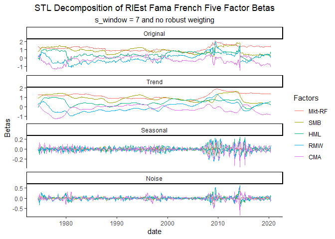<!-- -->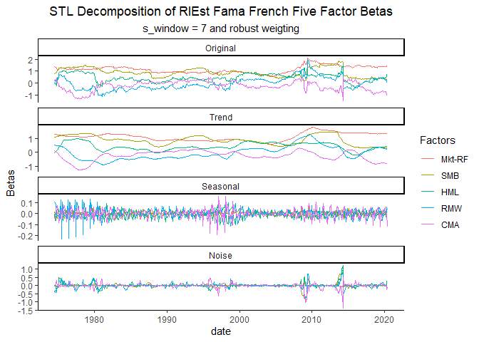<!-- -->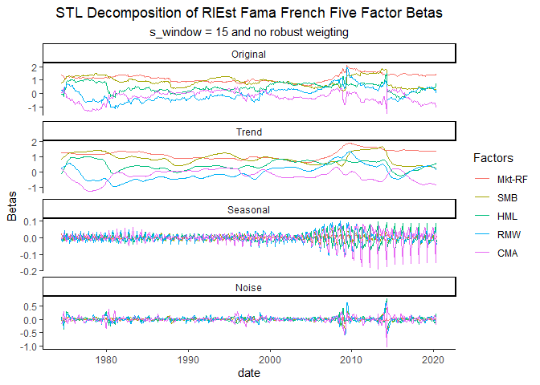<!-- -->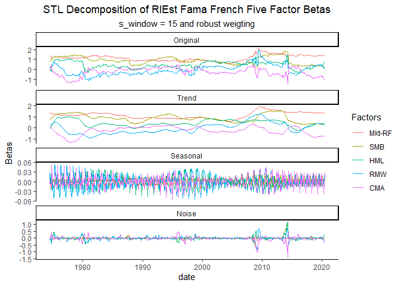<!-- -->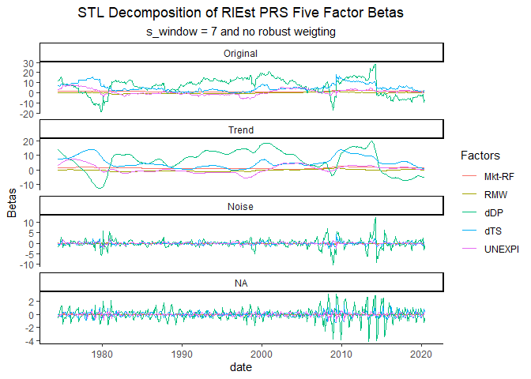<!-- -->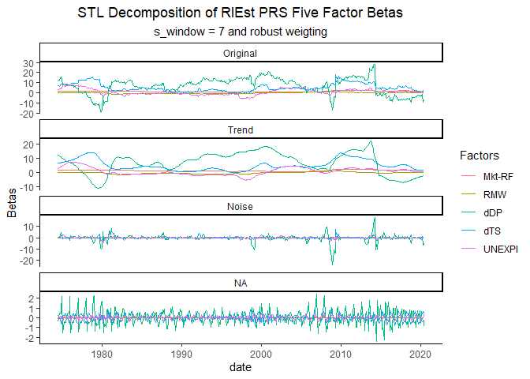<!-- -->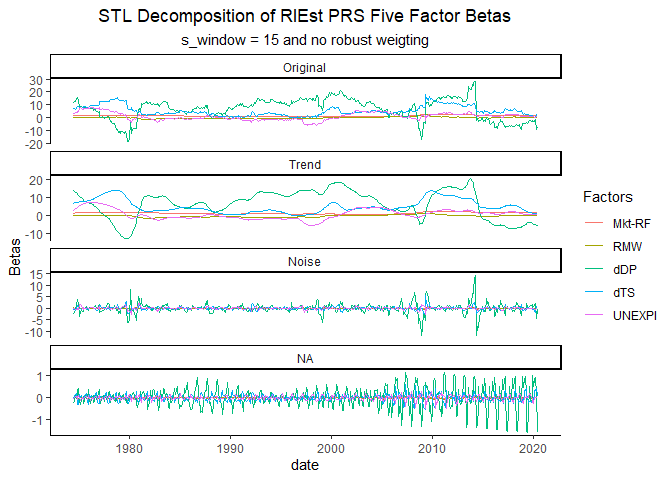<!-- -->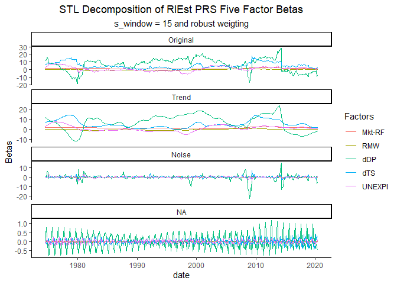<!-- -->

Beta estimation’s noise or seasonal pattern is much smaller than trend
so the noise weight or the s_window does not impact the result as much.

Now, we will take the desired no robust weighting, s_window = 7 trend
results of the Industry Risk Premium to estimate the factor risk
premium.

### S4-4-4 Filtered Second Pass Regression

<!-- --><!-- -->

For robustness check, we also computed the factor risk premium based on
other filtering.

### S4-4-5 Component Second Pass Regression Comparison

<!-- -->
<table class="table table-striped" style="font-size: 10px; width: auto !important; margin-left: auto; margin-right: auto;">
<caption style="font-size: initial !important;">
R Squared from Regressing (Panel) Fama French Five Factor Betas on STL
Components
</caption>
<thead>
<tr>
<th style="text-align:center;">
component
</th>
<th style="text-align:center;">
r.squared
</th>
</tr>
</thead>
<tbody>
<tr>
<td style="text-align:center;font-weight: bold;">
Original
</td>
<td style="text-align:center;">
0.0003962
</td>
</tr>
<tr>
<td style="text-align:center;font-weight: bold;">
Trend
</td>
<td style="text-align:center;">
0.0031480
</td>
</tr>
<tr>
<td style="text-align:center;font-weight: bold;">
Seasonal
</td>
<td style="text-align:center;">
0.0000151
</td>
</tr>
<tr>
<td style="text-align:center;font-weight: bold;">
Noise
</td>
<td style="text-align:center;">
0.0000668
</td>
</tr>
</tbody>
</table>

### S4-4-6 Regression Standard Error

<!-- -->
<table class="table table-striped" style="font-size: 10px; width: auto !important; margin-left: auto; margin-right: auto;">
<caption style="font-size: initial !important;">
Average Cross-sectional Regression Lambda Error
</caption>
<thead>
<tr>
<th style="text-align:center;">
Factors
</th>
<th style="text-align:center;">
FM
</th>
<th style="text-align:center;">
FM_STL
</th>
<th style="text-align:center;">
ratio
</th>
</tr>
</thead>
<tbody>
<tr>
<td style="text-align:center;">
Mkt-RF
</td>
<td style="text-align:center;">
0.0263577
</td>
<td style="text-align:center;">
0.0065958
</td>
<td style="text-align:center;">
0.2502424
</td>
</tr>
<tr>
<td style="text-align:center;">
SMB
</td>
<td style="text-align:center;">
0.0143599
</td>
<td style="text-align:center;">
0.0036449
</td>
<td style="text-align:center;">
0.2538224
</td>
</tr>
<tr>
<td style="text-align:center;">
HML
</td>
<td style="text-align:center;">
0.0134312
</td>
<td style="text-align:center;">
0.0035215
</td>
<td style="text-align:center;">
0.2621890
</td>
</tr>
<tr>
<td style="text-align:center;">
RMW
</td>
<td style="text-align:center;">
0.0114618
</td>
<td style="text-align:center;">
0.0030153
</td>
<td style="text-align:center;">
0.2630740
</td>
</tr>
<tr>
<td style="text-align:center;">
CMA
</td>
<td style="text-align:center;">
0.0113411
</td>
<td style="text-align:center;">
0.0028815
</td>
<td style="text-align:center;">
0.2540736
</td>
</tr>
</tbody>
</table>

<!-- -->

### S4-4-7 Unfiltered and Filtered Lambdas

Let’s plot the unfiltered lambda together with filtered lambda to see
the effect of filtering on lambda.

<!-- --><!-- -->
<table class="table table-striped" style="font-size: 10px; width: auto !important; margin-left: auto; margin-right: auto;">
<caption style="font-size: initial !important;">
Correlation between FM lambda and STL filtered FM lambda
</caption>
<thead>
<tr>
<th style="border-bottom:hidden;padding-bottom:0; padding-left:3px;padding-right:3px;text-align: center; " colspan="2">

FF5

</th>
<th style="border-bottom:hidden;padding-bottom:0; padding-left:3px;padding-right:3px;text-align: center; " colspan="2">

PRS

</th>
</tr>
<tr>
<th style="text-align:center;">
Factors
</th>
<th style="text-align:center;">
FF5
</th>
<th style="text-align:center;">
Factors
</th>
<th style="text-align:center;">
PRS
</th>
</tr>
</thead>
<tbody>
<tr>
<td style="text-align:center;">
Mkt-RF
</td>
<td style="text-align:center;">
0.2925711
</td>
<td style="text-align:center;">
Mkt-RF
</td>
<td style="text-align:center;">
0.3114318
</td>
</tr>
<tr>
<td style="text-align:center;">
SMB
</td>
<td style="text-align:center;">
0.3140591
</td>
<td style="text-align:center;">
RMW
</td>
<td style="text-align:center;">
0.2832085
</td>
</tr>
<tr>
<td style="text-align:center;">
HML
</td>
<td style="text-align:center;">
0.3631462
</td>
<td style="text-align:center;">
dDP
</td>
<td style="text-align:center;">
0.3239998
</td>
</tr>
<tr>
<td style="text-align:center;">
RMW
</td>
<td style="text-align:center;">
0.2256346
</td>
<td style="text-align:center;">
dTS
</td>
<td style="text-align:center;">
0.3312754
</td>
</tr>
<tr>
<td style="text-align:center;">
CMA
</td>
<td style="text-align:center;">
0.3874740
</td>
<td style="text-align:center;">
UNEXPI
</td>
<td style="text-align:center;">
0.3387802
</td>
</tr>
</tbody>
</table>

<!-- --><!-- --><!-- --><!-- -->

### S4-4-8 KS test and Stats

We also performed a KS test to test the FM lambdas and STL FM lambdas
for different factors. It seems that their distributions are different.

<table class="table table-striped" style="font-size: 10px; width: auto !important; margin-left: auto; margin-right: auto;">
<caption style="font-size: initial !important;">
KS Test for Fama Mecbeth Lambdas and STL FM Lambdas
</caption>
<thead>
<tr>
<th style="text-align:center;">
model
</th>
<th style="text-align:center;">
Factors
</th>
<th style="text-align:center;">
statistic
</th>
<th style="text-align:center;">
p.value
</th>
</tr>
</thead>
<tbody>
<tr>
<td style="text-align:center;font-weight: bold;">
FF5
</td>
<td style="text-align:center;">
Mkt-RF
</td>
<td style="text-align:center;">
0.2844203
</td>
<td style="text-align:center;">
0
</td>
</tr>
<tr>
<td style="text-align:center;font-weight: bold;">
FF5
</td>
<td style="text-align:center;">
SMB
</td>
<td style="text-align:center;">
0.2789855
</td>
<td style="text-align:center;">
0
</td>
</tr>
<tr>
<td style="text-align:center;font-weight: bold;">
FF5
</td>
<td style="text-align:center;">
HML
</td>
<td style="text-align:center;">
0.2500000
</td>
<td style="text-align:center;">
0
</td>
</tr>
<tr>
<td style="text-align:center;font-weight: bold;">
FF5
</td>
<td style="text-align:center;">
RMW
</td>
<td style="text-align:center;">
0.2590580
</td>
<td style="text-align:center;">
0
</td>
</tr>
<tr>
<td style="text-align:center;font-weight: bold;">
FF5
</td>
<td style="text-align:center;">
CMA
</td>
<td style="text-align:center;">
0.2481884
</td>
<td style="text-align:center;">
0
</td>
</tr>
<tr>
<td style="text-align:center;font-weight: bold;">
PRS
</td>
<td style="text-align:center;">
Mkt-RF
</td>
<td style="text-align:center;">
0.2717391
</td>
<td style="text-align:center;">
0
</td>
</tr>
<tr>
<td style="text-align:center;font-weight: bold;">
PRS
</td>
<td style="text-align:center;">
RMW
</td>
<td style="text-align:center;">
0.2681159
</td>
<td style="text-align:center;">
0
</td>
</tr>
<tr>
<td style="text-align:center;font-weight: bold;">
PRS
</td>
<td style="text-align:center;">
dDP
</td>
<td style="text-align:center;">
0.2807971
</td>
<td style="text-align:center;">
0
</td>
</tr>
<tr>
<td style="text-align:center;font-weight: bold;">
PRS
</td>
<td style="text-align:center;">
dTS
</td>
<td style="text-align:center;">
0.2445652
</td>
<td style="text-align:center;">
0
</td>
</tr>
<tr>
<td style="text-align:center;font-weight: bold;">
PRS
</td>
<td style="text-align:center;">
UNEXPI
</td>
<td style="text-align:center;">
0.2644928
</td>
<td style="text-align:center;">
0
</td>
</tr>
</tbody>
</table>

Here is a comparison of the lambda statistics of the Normal Fama Macbeth
and Fama Macbeth Second Step Regression with STL Trend Data.

<table class="table table-striped" style="font-size: 10px; width: auto !important; margin-left: auto; margin-right: auto;">
<caption style="font-size: initial !important;">
Fama Macbeth/STL Fama Macbeth Lambda0 Stats
</caption>
<thead>
<tr>
<th style="empty-cells: hide;border-bottom:hidden;" colspan="2">
</th>
<th style="border-bottom:hidden;padding-bottom:0; padding-left:3px;padding-right:3px;text-align: center; " colspan="5">

stats

</th>
</tr>
<tr>
<th style="text-align:center;">
model
</th>
<th style="text-align:center;">
method
</th>
<th style="text-align:center;">
mean
</th>
<th style="text-align:center;">
variance
</th>
<th style="text-align:center;">
skewness
</th>
<th style="text-align:center;">
kurtosis
</th>
<th style="text-align:center;">
z_score
</th>
</tr>
</thead>
<tbody>
<tr>
<td style="text-align:center;font-weight: bold;">
FF5
</td>
<td style="text-align:center;">
FM
</td>
<td style="text-align:center;">
0.0061713
</td>
<td style="text-align:center;">
0.0021381
</td>
<td style="text-align:center;">
-0.2941276
</td>
<td style="text-align:center;">
5.824028
</td>
<td style="text-align:center;">
3.135669
</td>
</tr>
<tr>
<td style="text-align:center;font-weight: bold;">
FF5
</td>
<td style="text-align:center;">
FM_STL
</td>
<td style="text-align:center;">
0.0056638
</td>
<td style="text-align:center;">
0.0001059
</td>
<td style="text-align:center;">
-0.1463652
</td>
<td style="text-align:center;">
4.925051
</td>
<td style="text-align:center;">
12.928193
</td>
</tr>
<tr>
<td style="text-align:center;font-weight: bold;">
PRS
</td>
<td style="text-align:center;">
FM
</td>
<td style="text-align:center;">
0.0039738
</td>
<td style="text-align:center;">
0.0019346
</td>
<td style="text-align:center;">
-0.1580587
</td>
<td style="text-align:center;">
4.667186
</td>
<td style="text-align:center;">
2.122661
</td>
</tr>
<tr>
<td style="text-align:center;font-weight: bold;">
PRS
</td>
<td style="text-align:center;">
FM_STL
</td>
<td style="text-align:center;">
0.0040908
</td>
<td style="text-align:center;">
0.0001333
</td>
<td style="text-align:center;">
0.0305967
</td>
<td style="text-align:center;">
3.051766
</td>
<td style="text-align:center;">
8.324786
</td>
</tr>
</tbody>
</table>
<table class="table table-striped" style="font-size: 10px; width: auto !important; margin-left: auto; margin-right: auto;">
<caption style="font-size: initial !important;">
Fama French Five Factors Lambdas
</caption>
<thead>
<tr>
<th style="text-align:center;">
method
</th>
<th style="text-align:center;">
stats
</th>
<th style="text-align:center;">
Mkt-RF
</th>
<th style="text-align:center;">
SMB
</th>
<th style="text-align:center;">
HML
</th>
<th style="text-align:center;">
RMW
</th>
<th style="text-align:center;">
CMA
</th>
</tr>
</thead>
<tbody>
<tr>
<td style="text-align:center;font-weight: bold;">
FM_FF5
</td>
<td style="text-align:center;">
mean
</td>
<td style="text-align:center;">
0.0002983
</td>
<td style="text-align:center;">
0.0012902
</td>
<td style="text-align:center;">
0.0015499
</td>
<td style="text-align:center;">
0.0002129
</td>
<td style="text-align:center;">
0.0012824
</td>
</tr>
<tr>
<td style="text-align:center;font-weight: bold;">
FM_FF5
</td>
<td style="text-align:center;">
variance
</td>
<td style="text-align:center;">
0.0028131
</td>
<td style="text-align:center;">
0.0008383
</td>
<td style="text-align:center;">
0.0009503
</td>
<td style="text-align:center;">
0.0005728
</td>
<td style="text-align:center;">
0.0005960
</td>
</tr>
<tr>
<td style="text-align:center;font-weight: bold;">
FM_FF5
</td>
<td style="text-align:center;">
skewness
</td>
<td style="text-align:center;">
0.4835451
</td>
<td style="text-align:center;">
-0.2346895
</td>
<td style="text-align:center;">
0.1955102
</td>
<td style="text-align:center;">
-0.1515282
</td>
<td style="text-align:center;">
-0.1354554
</td>
</tr>
<tr>
<td style="text-align:center;font-weight: bold;">
FM_FF5
</td>
<td style="text-align:center;">
kurtosis
</td>
<td style="text-align:center;">
6.2856877
</td>
<td style="text-align:center;">
4.5380405
</td>
<td style="text-align:center;">
5.6831071
</td>
<td style="text-align:center;">
5.7804104
</td>
<td style="text-align:center;">
5.2139386
</td>
</tr>
<tr>
<td style="text-align:center;font-weight: bold;">
FM_STL_7\_N_FF5
</td>
<td style="text-align:center;">
mean
</td>
<td style="text-align:center;">
0.0009825
</td>
<td style="text-align:center;">
0.0009301
</td>
<td style="text-align:center;">
0.0007070
</td>
<td style="text-align:center;">
-0.0000658
</td>
<td style="text-align:center;">
0.0014254
</td>
</tr>
<tr>
<td style="text-align:center;font-weight: bold;">
FM_STL_7\_N_FF5
</td>
<td style="text-align:center;">
variance
</td>
<td style="text-align:center;">
0.0001552
</td>
<td style="text-align:center;">
0.0000762
</td>
<td style="text-align:center;">
0.0001111
</td>
<td style="text-align:center;">
0.0000354
</td>
<td style="text-align:center;">
0.0000622
</td>
</tr>
<tr>
<td style="text-align:center;font-weight: bold;">
FM_STL_7\_N_FF5
</td>
<td style="text-align:center;">
skewness
</td>
<td style="text-align:center;">
-0.1638804
</td>
<td style="text-align:center;">
-0.4122302
</td>
<td style="text-align:center;">
-0.5401803
</td>
<td style="text-align:center;">
0.2162641
</td>
<td style="text-align:center;">
-0.3769710
</td>
</tr>
<tr>
<td style="text-align:center;font-weight: bold;">
FM_STL_7\_N_FF5
</td>
<td style="text-align:center;">
kurtosis
</td>
<td style="text-align:center;">
3.7178361
</td>
<td style="text-align:center;">
3.4945006
</td>
<td style="text-align:center;">
4.6611790
</td>
<td style="text-align:center;">
4.2113647
</td>
<td style="text-align:center;">
3.8959601
</td>
</tr>
<tr>
<td style="text-align:center;font-weight: bold;">
FM_STL_7\_R_FF5
</td>
<td style="text-align:center;">
mean
</td>
<td style="text-align:center;">
0.0019487
</td>
<td style="text-align:center;">
0.0018542
</td>
<td style="text-align:center;">
0.0020299
</td>
<td style="text-align:center;">
0.0004367
</td>
<td style="text-align:center;">
0.0014392
</td>
</tr>
<tr>
<td style="text-align:center;font-weight: bold;">
FM_STL_7\_R_FF5
</td>
<td style="text-align:center;">
variance
</td>
<td style="text-align:center;">
0.0002056
</td>
<td style="text-align:center;">
0.0001193
</td>
<td style="text-align:center;">
0.0001204
</td>
<td style="text-align:center;">
0.0000563
</td>
<td style="text-align:center;">
0.0000776
</td>
</tr>
<tr>
<td style="text-align:center;font-weight: bold;">
FM_STL_7\_R_FF5
</td>
<td style="text-align:center;">
skewness
</td>
<td style="text-align:center;">
0.8317459
</td>
<td style="text-align:center;">
0.1424632
</td>
<td style="text-align:center;">
0.0601560
</td>
<td style="text-align:center;">
1.4638694
</td>
<td style="text-align:center;">
-0.2076510
</td>
</tr>
<tr>
<td style="text-align:center;font-weight: bold;">
FM_STL_7\_R_FF5
</td>
<td style="text-align:center;">
kurtosis
</td>
<td style="text-align:center;">
6.3879350
</td>
<td style="text-align:center;">
3.6645302
</td>
<td style="text-align:center;">
3.9483479
</td>
<td style="text-align:center;">
6.1673506
</td>
<td style="text-align:center;">
3.6679100
</td>
</tr>
<tr>
<td style="text-align:center;font-weight: bold;">
FM_STL_15_N\_FF5
</td>
<td style="text-align:center;">
mean
</td>
<td style="text-align:center;">
0.0009719
</td>
<td style="text-align:center;">
0.0009713
</td>
<td style="text-align:center;">
0.0007052
</td>
<td style="text-align:center;">
-0.0000622
</td>
<td style="text-align:center;">
0.0014467
</td>
</tr>
<tr>
<td style="text-align:center;font-weight: bold;">
FM_STL_15_N\_FF5
</td>
<td style="text-align:center;">
variance
</td>
<td style="text-align:center;">
0.0001701
</td>
<td style="text-align:center;">
0.0000801
</td>
<td style="text-align:center;">
0.0001196
</td>
<td style="text-align:center;">
0.0000387
</td>
<td style="text-align:center;">
0.0000661
</td>
</tr>
<tr>
<td style="text-align:center;font-weight: bold;">
FM_STL_15_N\_FF5
</td>
<td style="text-align:center;">
skewness
</td>
<td style="text-align:center;">
-0.1288973
</td>
<td style="text-align:center;">
-0.4250522
</td>
<td style="text-align:center;">
-0.5422064
</td>
<td style="text-align:center;">
0.1876632
</td>
<td style="text-align:center;">
-0.3621075
</td>
</tr>
<tr>
<td style="text-align:center;font-weight: bold;">
FM_STL_15_N\_FF5
</td>
<td style="text-align:center;">
kurtosis
</td>
<td style="text-align:center;">
3.7647575
</td>
<td style="text-align:center;">
3.5505349
</td>
<td style="text-align:center;">
4.7718256
</td>
<td style="text-align:center;">
4.1216185
</td>
<td style="text-align:center;">
4.0253113
</td>
</tr>
<tr>
<td style="text-align:center;font-weight: bold;">
FM_STL_15_R\_FF5
</td>
<td style="text-align:center;">
mean
</td>
<td style="text-align:center;">
0.0010617
</td>
<td style="text-align:center;">
0.0005554
</td>
<td style="text-align:center;">
0.0032158
</td>
<td style="text-align:center;">
0.0002892
</td>
<td style="text-align:center;">
0.0021477
</td>
</tr>
<tr>
<td style="text-align:center;font-weight: bold;">
FM_STL_15_R\_FF5
</td>
<td style="text-align:center;">
variance
</td>
<td style="text-align:center;">
0.0002311
</td>
<td style="text-align:center;">
0.0001304
</td>
<td style="text-align:center;">
0.0001351
</td>
<td style="text-align:center;">
0.0000661
</td>
<td style="text-align:center;">
0.0000908
</td>
</tr>
<tr>
<td style="text-align:center;font-weight: bold;">
FM_STL_15_R\_FF5
</td>
<td style="text-align:center;">
skewness
</td>
<td style="text-align:center;">
0.3981009
</td>
<td style="text-align:center;">
-0.1389654
</td>
<td style="text-align:center;">
0.3388173
</td>
<td style="text-align:center;">
1.5517472
</td>
<td style="text-align:center;">
-0.2401390
</td>
</tr>
<tr>
<td style="text-align:center;font-weight: bold;">
FM_STL_15_R\_FF5
</td>
<td style="text-align:center;">
kurtosis
</td>
<td style="text-align:center;">
5.5000860
</td>
<td style="text-align:center;">
4.4561519
</td>
<td style="text-align:center;">
3.9991444
</td>
<td style="text-align:center;">
6.4385050
</td>
<td style="text-align:center;">
3.5175360
</td>
</tr>
<tr>
<td style="text-align:center;font-weight: bold;">
FM_STL_40_N\_FF5
</td>
<td style="text-align:center;">
mean
</td>
<td style="text-align:center;">
0.0009215
</td>
<td style="text-align:center;">
0.0009762
</td>
<td style="text-align:center;">
0.0007007
</td>
<td style="text-align:center;">
-0.0000543
</td>
<td style="text-align:center;">
0.0014683
</td>
</tr>
<tr>
<td style="text-align:center;font-weight: bold;">
FM_STL_40_N\_FF5
</td>
<td style="text-align:center;">
variance
</td>
<td style="text-align:center;">
0.0001931
</td>
<td style="text-align:center;">
0.0000868
</td>
<td style="text-align:center;">
0.0001317
</td>
<td style="text-align:center;">
0.0000437
</td>
<td style="text-align:center;">
0.0000716
</td>
</tr>
<tr>
<td style="text-align:center;font-weight: bold;">
FM_STL_40_N\_FF5
</td>
<td style="text-align:center;">
skewness
</td>
<td style="text-align:center;">
-0.1167437
</td>
<td style="text-align:center;">
-0.4403560
</td>
<td style="text-align:center;">
-0.5385364
</td>
<td style="text-align:center;">
0.1181815
</td>
<td style="text-align:center;">
-0.3317210
</td>
</tr>
<tr>
<td style="text-align:center;font-weight: bold;">
FM_STL_40_N\_FF5
</td>
<td style="text-align:center;">
kurtosis
</td>
<td style="text-align:center;">
3.8014965
</td>
<td style="text-align:center;">
3.6291371
</td>
<td style="text-align:center;">
4.9207669
</td>
<td style="text-align:center;">
4.1207388
</td>
<td style="text-align:center;">
4.2768315
</td>
</tr>
<tr>
<td style="text-align:center;font-weight: bold;">
FM_STL_40_R\_FF5
</td>
<td style="text-align:center;">
mean
</td>
<td style="text-align:center;">
0.0000146
</td>
<td style="text-align:center;">
0.0002698
</td>
<td style="text-align:center;">
0.0032042
</td>
<td style="text-align:center;">
0.0012396
</td>
<td style="text-align:center;">
0.0024899
</td>
</tr>
<tr>
<td style="text-align:center;font-weight: bold;">
FM_STL_40_R\_FF5
</td>
<td style="text-align:center;">
variance
</td>
<td style="text-align:center;">
0.0002924
</td>
<td style="text-align:center;">
0.0001397
</td>
<td style="text-align:center;">
0.0001588
</td>
<td style="text-align:center;">
0.0000909
</td>
<td style="text-align:center;">
0.0001031
</td>
</tr>
<tr>
<td style="text-align:center;font-weight: bold;">
FM_STL_40_R\_FF5
</td>
<td style="text-align:center;">
skewness
</td>
<td style="text-align:center;">
0.1432330
</td>
<td style="text-align:center;">
-0.1700013
</td>
<td style="text-align:center;">
0.5366181
</td>
<td style="text-align:center;">
1.8811148
</td>
<td style="text-align:center;">
-0.1092126
</td>
</tr>
<tr>
<td style="text-align:center;font-weight: bold;">
FM_STL_40_R\_FF5
</td>
<td style="text-align:center;">
kurtosis
</td>
<td style="text-align:center;">
4.5431941
</td>
<td style="text-align:center;">
4.0730868
</td>
<td style="text-align:center;">
4.9219724
</td>
<td style="text-align:center;">
7.6692941
</td>
<td style="text-align:center;">
3.9219053
</td>
</tr>
<tr>
<td style="text-align:center;font-weight: bold;">
RAM_FF5
</td>
<td style="text-align:center;">
mean
</td>
<td style="text-align:center;">
0.0051067
</td>
<td style="text-align:center;">
0.0023057
</td>
<td style="text-align:center;">
0.0032571
</td>
<td style="text-align:center;">
0.0027076
</td>
<td style="text-align:center;">
0.0030331
</td>
</tr>
<tr>
<td style="text-align:center;font-weight: bold;">
RAM_FF5
</td>
<td style="text-align:center;">
variance
</td>
<td style="text-align:center;">
0.0000281
</td>
<td style="text-align:center;">
0.0000284
</td>
<td style="text-align:center;">
0.0000155
</td>
<td style="text-align:center;">
0.0000075
</td>
<td style="text-align:center;">
0.0000093
</td>
</tr>
<tr>
<td style="text-align:center;font-weight: bold;">
RAM_FF5
</td>
<td style="text-align:center;">
skewness
</td>
<td style="text-align:center;">
0.0249920
</td>
<td style="text-align:center;">
0.3924338
</td>
<td style="text-align:center;">
0.1771098
</td>
<td style="text-align:center;">
0.1026737
</td>
<td style="text-align:center;">
0.5041615
</td>
</tr>
<tr>
<td style="text-align:center;font-weight: bold;">
RAM_FF5
</td>
<td style="text-align:center;">
kurtosis
</td>
<td style="text-align:center;">
2.3677710
</td>
<td style="text-align:center;">
2.2734575
</td>
<td style="text-align:center;">
2.8714457
</td>
<td style="text-align:center;">
3.4464927
</td>
<td style="text-align:center;">
3.1295406
</td>
</tr>
<tr>
<td style="text-align:center;font-weight: bold;">
RGM_FF5
</td>
<td style="text-align:center;">
mean
</td>
<td style="text-align:center;">
0.0041048
</td>
<td style="text-align:center;">
0.0018572
</td>
<td style="text-align:center;">
0.0028580
</td>
<td style="text-align:center;">
0.0024638
</td>
<td style="text-align:center;">
0.0028353
</td>
</tr>
<tr>
<td style="text-align:center;font-weight: bold;">
RGM_FF5
</td>
<td style="text-align:center;">
variance
</td>
<td style="text-align:center;">
0.0000301
</td>
<td style="text-align:center;">
0.0000280
</td>
<td style="text-align:center;">
0.0000150
</td>
<td style="text-align:center;">
0.0000070
</td>
<td style="text-align:center;">
0.0000088
</td>
</tr>
<tr>
<td style="text-align:center;font-weight: bold;">
RGM_FF5
</td>
<td style="text-align:center;">
skewness
</td>
<td style="text-align:center;">
0.0296898
</td>
<td style="text-align:center;">
0.3728401
</td>
<td style="text-align:center;">
0.1400034
</td>
<td style="text-align:center;">
-0.0384781
</td>
<td style="text-align:center;">
0.4500492
</td>
</tr>
<tr>
<td style="text-align:center;font-weight: bold;">
RGM_FF5
</td>
<td style="text-align:center;">
kurtosis
</td>
<td style="text-align:center;">
2.2890320
</td>
<td style="text-align:center;">
2.2857105
</td>
<td style="text-align:center;">
2.9169470
</td>
<td style="text-align:center;">
3.3199087
</td>
<td style="text-align:center;">
3.0468134
</td>
</tr>
</tbody>
</table>
<table class="table table-striped" style="font-size: 10px; width: auto !important; margin-left: auto; margin-right: auto;">
<caption style="font-size: initial !important;">
PRS Five Factors Lambdas
</caption>
<thead>
<tr>
<th style="text-align:center;">
method
</th>
<th style="text-align:center;">
stats
</th>
<th style="text-align:center;">
Mkt-RF
</th>
<th style="text-align:center;">
RMW
</th>
<th style="text-align:center;">
dDP
</th>
<th style="text-align:center;">
dTS
</th>
<th style="text-align:center;">
UNEXPI
</th>
</tr>
</thead>
<tbody>
<tr>
<td style="text-align:center;font-weight: bold;">
FM_PRS
</td>
<td style="text-align:center;">
mean
</td>
<td style="text-align:center;">
0.0026921
</td>
<td style="text-align:center;">
0.0000930
</td>
<td style="text-align:center;">
-0.0000783
</td>
<td style="text-align:center;">
-0.0000684
</td>
<td style="text-align:center;">
0.0001190
</td>
</tr>
<tr>
<td style="text-align:center;font-weight: bold;">
FM_PRS
</td>
<td style="text-align:center;">
variance
</td>
<td style="text-align:center;">
0.0027459
</td>
<td style="text-align:center;">
0.0005564
</td>
<td style="text-align:center;">
0.0000023
</td>
<td style="text-align:center;">
0.0000109
</td>
<td style="text-align:center;">
0.0000220
</td>
</tr>
<tr>
<td style="text-align:center;font-weight: bold;">
FM_PRS
</td>
<td style="text-align:center;">
skewness
</td>
<td style="text-align:center;">
0.3395715
</td>
<td style="text-align:center;">
0.0445070
</td>
<td style="text-align:center;">
-0.2030738
</td>
<td style="text-align:center;">
0.0670185
</td>
<td style="text-align:center;">
-0.3244733
</td>
</tr>
<tr>
<td style="text-align:center;font-weight: bold;">
FM_PRS
</td>
<td style="text-align:center;">
kurtosis
</td>
<td style="text-align:center;">
5.2718717
</td>
<td style="text-align:center;">
6.2160859
</td>
<td style="text-align:center;">
4.8143461
</td>
<td style="text-align:center;">
5.2695227
</td>
<td style="text-align:center;">
4.7068057
</td>
</tr>
<tr>
<td style="text-align:center;font-weight: bold;">
FM_STL_7\_N_PRS
</td>
<td style="text-align:center;">
mean
</td>
<td style="text-align:center;">
0.0027866
</td>
<td style="text-align:center;">
0.0000741
</td>
<td style="text-align:center;">
-0.0000781
</td>
<td style="text-align:center;">
-0.0001071
</td>
<td style="text-align:center;">
0.0000892
</td>
</tr>
<tr>
<td style="text-align:center;font-weight: bold;">
FM_STL_7\_N_PRS
</td>
<td style="text-align:center;">
variance
</td>
<td style="text-align:center;">
0.0001873
</td>
<td style="text-align:center;">
0.0000391
</td>
<td style="text-align:center;">
0.0000002
</td>
<td style="text-align:center;">
0.0000012
</td>
<td style="text-align:center;">
0.0000022
</td>
</tr>
<tr>
<td style="text-align:center;font-weight: bold;">
FM_STL_7\_N_PRS
</td>
<td style="text-align:center;">
skewness
</td>
<td style="text-align:center;">
-0.1668917
</td>
<td style="text-align:center;">
0.8320178
</td>
<td style="text-align:center;">
-0.6583480
</td>
<td style="text-align:center;">
-0.2647033
</td>
<td style="text-align:center;">
-0.2126956
</td>
</tr>
<tr>
<td style="text-align:center;font-weight: bold;">
FM_STL_7\_N_PRS
</td>
<td style="text-align:center;">
kurtosis
</td>
<td style="text-align:center;">
2.6925109
</td>
<td style="text-align:center;">
5.5229652
</td>
<td style="text-align:center;">
4.0193324
</td>
<td style="text-align:center;">
3.7082543
</td>
<td style="text-align:center;">
3.5089541
</td>
</tr>
<tr>
<td style="text-align:center;font-weight: bold;">
FM_STL_7\_R_PRS
</td>
<td style="text-align:center;">
mean
</td>
<td style="text-align:center;">
0.0041071
</td>
<td style="text-align:center;">
0.0004654
</td>
<td style="text-align:center;">
-0.0000437
</td>
<td style="text-align:center;">
0.0000424
</td>
<td style="text-align:center;">
0.0001127
</td>
</tr>
<tr>
<td style="text-align:center;font-weight: bold;">
FM_STL_7\_R_PRS
</td>
<td style="text-align:center;">
variance
</td>
<td style="text-align:center;">
0.0003130
</td>
<td style="text-align:center;">
0.0000756
</td>
<td style="text-align:center;">
0.0000003
</td>
<td style="text-align:center;">
0.0000020
</td>
<td style="text-align:center;">
0.0000025
</td>
</tr>
<tr>
<td style="text-align:center;font-weight: bold;">
FM_STL_7\_R_PRS
</td>
<td style="text-align:center;">
skewness
</td>
<td style="text-align:center;">
1.1769612
</td>
<td style="text-align:center;">
1.3691582
</td>
<td style="text-align:center;">
-0.1780526
</td>
<td style="text-align:center;">
-0.1609849
</td>
<td style="text-align:center;">
-0.1105431
</td>
</tr>
<tr>
<td style="text-align:center;font-weight: bold;">
FM_STL_7\_R_PRS
</td>
<td style="text-align:center;">
kurtosis
</td>
<td style="text-align:center;">
5.9490558
</td>
<td style="text-align:center;">
6.0150664
</td>
<td style="text-align:center;">
4.2936790
</td>
<td style="text-align:center;">
3.2500332
</td>
<td style="text-align:center;">
3.2742700
</td>
</tr>
<tr>
<td style="text-align:center;font-weight: bold;">
FM_STL_15_N\_PRS
</td>
<td style="text-align:center;">
mean
</td>
<td style="text-align:center;">
0.0028041
</td>
<td style="text-align:center;">
0.0000782
</td>
<td style="text-align:center;">
-0.0000773
</td>
<td style="text-align:center;">
-0.0001057
</td>
<td style="text-align:center;">
0.0000899
</td>
</tr>
<tr>
<td style="text-align:center;font-weight: bold;">
FM_STL_15_N\_PRS
</td>
<td style="text-align:center;">
variance
</td>
<td style="text-align:center;">
0.0002061
</td>
<td style="text-align:center;">
0.0000429
</td>
<td style="text-align:center;">
0.0000002
</td>
<td style="text-align:center;">
0.0000012
</td>
<td style="text-align:center;">
0.0000024
</td>
</tr>
<tr>
<td style="text-align:center;font-weight: bold;">
FM_STL_15_N\_PRS
</td>
<td style="text-align:center;">
skewness
</td>
<td style="text-align:center;">
-0.1419199
</td>
<td style="text-align:center;">
0.8277203
</td>
<td style="text-align:center;">
-0.6639376
</td>
<td style="text-align:center;">
-0.1913763
</td>
<td style="text-align:center;">
-0.2310907
</td>
</tr>
<tr>
<td style="text-align:center;font-weight: bold;">
FM_STL_15_N\_PRS
</td>
<td style="text-align:center;">
kurtosis
</td>
<td style="text-align:center;">
2.7366802
</td>
<td style="text-align:center;">
5.5434315
</td>
<td style="text-align:center;">
4.0728834
</td>
<td style="text-align:center;">
3.5243728
</td>
<td style="text-align:center;">
3.6662461
</td>
</tr>
<tr>
<td style="text-align:center;font-weight: bold;">
FM_STL_15_R\_PRS
</td>
<td style="text-align:center;">
mean
</td>
<td style="text-align:center;">
0.0022922
</td>
<td style="text-align:center;">
0.0004605
</td>
<td style="text-align:center;">
-0.0000340
</td>
<td style="text-align:center;">
0.0000396
</td>
<td style="text-align:center;">
0.0001110
</td>
</tr>
<tr>
<td style="text-align:center;font-weight: bold;">
FM_STL_15_R\_PRS
</td>
<td style="text-align:center;">
variance
</td>
<td style="text-align:center;">
0.0003380
</td>
<td style="text-align:center;">
0.0000902
</td>
<td style="text-align:center;">
0.0000004
</td>
<td style="text-align:center;">
0.0000016
</td>
<td style="text-align:center;">
0.0000032
</td>
</tr>
<tr>
<td style="text-align:center;font-weight: bold;">
FM_STL_15_R\_PRS
</td>
<td style="text-align:center;">
skewness
</td>
<td style="text-align:center;">
0.7044593
</td>
<td style="text-align:center;">
1.7866078
</td>
<td style="text-align:center;">
-0.0603044
</td>
<td style="text-align:center;">
-0.3284462
</td>
<td style="text-align:center;">
-0.4302102
</td>
</tr>
<tr>
<td style="text-align:center;font-weight: bold;">
FM_STL_15_R\_PRS
</td>
<td style="text-align:center;">
kurtosis
</td>
<td style="text-align:center;">
4.3324926
</td>
<td style="text-align:center;">
7.5970964
</td>
<td style="text-align:center;">
4.8219947
</td>
<td style="text-align:center;">
3.7768717
</td>
<td style="text-align:center;">
3.3507971
</td>
</tr>
<tr>
<td style="text-align:center;font-weight: bold;">
FM_STL_40_N\_PRS
</td>
<td style="text-align:center;">
mean
</td>
<td style="text-align:center;">
0.0027864
</td>
<td style="text-align:center;">
0.0000797
</td>
<td style="text-align:center;">
-0.0000769
</td>
<td style="text-align:center;">
-0.0001085
</td>
<td style="text-align:center;">
0.0000913
</td>
</tr>
<tr>
<td style="text-align:center;font-weight: bold;">
FM_STL_40_N\_PRS
</td>
<td style="text-align:center;">
variance
</td>
<td style="text-align:center;">
0.0002355
</td>
<td style="text-align:center;">
0.0000488
</td>
<td style="text-align:center;">
0.0000002
</td>
<td style="text-align:center;">
0.0000014
</td>
<td style="text-align:center;">
0.0000027
</td>
</tr>
<tr>
<td style="text-align:center;font-weight: bold;">
FM_STL_40_N\_PRS
</td>
<td style="text-align:center;">
skewness
</td>
<td style="text-align:center;">
-0.0921332
</td>
<td style="text-align:center;">
0.8150156
</td>
<td style="text-align:center;">
-0.6681229
</td>
<td style="text-align:center;">
-0.1605655
</td>
<td style="text-align:center;">
-0.2651314
</td>
</tr>
<tr>
<td style="text-align:center;font-weight: bold;">
FM_STL_40_N\_PRS
</td>
<td style="text-align:center;">
kurtosis
</td>
<td style="text-align:center;">
2.8441505
</td>
<td style="text-align:center;">
5.6057138
</td>
<td style="text-align:center;">
4.1374778
</td>
<td style="text-align:center;">
3.5504974
</td>
<td style="text-align:center;">
3.8123784
</td>
</tr>
<tr>
<td style="text-align:center;font-weight: bold;">
FM_STL_40_R\_PRS
</td>
<td style="text-align:center;">
mean
</td>
<td style="text-align:center;">
0.0014067
</td>
<td style="text-align:center;">
0.0013828
</td>
<td style="text-align:center;">
-0.0000262
</td>
<td style="text-align:center;">
0.0000216
</td>
<td style="text-align:center;">
0.0000729
</td>
</tr>
<tr>
<td style="text-align:center;font-weight: bold;">
FM_STL_40_R\_PRS
</td>
<td style="text-align:center;">
variance
</td>
<td style="text-align:center;">
0.0003979
</td>
<td style="text-align:center;">
0.0001067
</td>
<td style="text-align:center;">
0.0000004
</td>
<td style="text-align:center;">
0.0000019
</td>
<td style="text-align:center;">
0.0000035
</td>
</tr>
<tr>
<td style="text-align:center;font-weight: bold;">
FM_STL_40_R\_PRS
</td>
<td style="text-align:center;">
skewness
</td>
<td style="text-align:center;">
0.3066397
</td>
<td style="text-align:center;">
2.0644240
</td>
<td style="text-align:center;">
-0.1596514
</td>
<td style="text-align:center;">
-0.2952477
</td>
<td style="text-align:center;">
-0.4032387
</td>
</tr>
<tr>
<td style="text-align:center;font-weight: bold;">
FM_STL_40_R\_PRS
</td>
<td style="text-align:center;">
kurtosis
</td>
<td style="text-align:center;">
4.1138929
</td>
<td style="text-align:center;">
8.5336020
</td>
<td style="text-align:center;">
4.8828302
</td>
<td style="text-align:center;">
4.1407494
</td>
<td style="text-align:center;">
3.3293207
</td>
</tr>
<tr>
<td style="text-align:center;font-weight: bold;">
RAM_PRS
</td>
<td style="text-align:center;">
mean
</td>
<td style="text-align:center;">
0.0051067
</td>
<td style="text-align:center;">
0.0027076
</td>
<td style="text-align:center;">
0.0000227
</td>
<td style="text-align:center;">
0.0003309
</td>
<td style="text-align:center;">
0.0002190
</td>
</tr>
<tr>
<td style="text-align:center;font-weight: bold;">
RAM_PRS
</td>
<td style="text-align:center;">
variance
</td>
<td style="text-align:center;">
0.0000281
</td>
<td style="text-align:center;">
0.0000075
</td>
<td style="text-align:center;">
0.0000001
</td>
<td style="text-align:center;">
0.0000002
</td>
<td style="text-align:center;">
0.0000002
</td>
</tr>
<tr>
<td style="text-align:center;font-weight: bold;">
RAM_PRS
</td>
<td style="text-align:center;">
skewness
</td>
<td style="text-align:center;">
0.0249920
</td>
<td style="text-align:center;">
0.1026737
</td>
<td style="text-align:center;">
-0.0608053
</td>
<td style="text-align:center;">
-0.3673479
</td>
<td style="text-align:center;">
-0.4199377
</td>
</tr>
<tr>
<td style="text-align:center;font-weight: bold;">
RAM_PRS
</td>
<td style="text-align:center;">
kurtosis
</td>
<td style="text-align:center;">
2.3677710
</td>
<td style="text-align:center;">
3.4464927
</td>
<td style="text-align:center;">
3.4710064
</td>
<td style="text-align:center;">
2.9280135
</td>
<td style="text-align:center;">
3.2573331
</td>
</tr>
<tr>
<td style="text-align:center;font-weight: bold;">
RGM_PRS
</td>
<td style="text-align:center;">
mean
</td>
<td style="text-align:center;">
0.0041048
</td>
<td style="text-align:center;">
0.0024638
</td>
<td style="text-align:center;">
0.0000221
</td>
<td style="text-align:center;">
0.0003280
</td>
<td style="text-align:center;">
0.0002141
</td>
</tr>
<tr>
<td style="text-align:center;font-weight: bold;">
RGM_PRS
</td>
<td style="text-align:center;">
variance
</td>
<td style="text-align:center;">
0.0000301
</td>
<td style="text-align:center;">
0.0000070
</td>
<td style="text-align:center;">
0.0000001
</td>
<td style="text-align:center;">
0.0000002
</td>
<td style="text-align:center;">
0.0000002
</td>
</tr>
<tr>
<td style="text-align:center;font-weight: bold;">
RGM_PRS
</td>
<td style="text-align:center;">
skewness
</td>
<td style="text-align:center;">
0.0296898
</td>
<td style="text-align:center;">
-0.0384781
</td>
<td style="text-align:center;">
-0.0620566
</td>
<td style="text-align:center;">
-0.3697359
</td>
<td style="text-align:center;">
-0.4220518
</td>
</tr>
<tr>
<td style="text-align:center;font-weight: bold;">
RGM_PRS
</td>
<td style="text-align:center;">
kurtosis
</td>
<td style="text-align:center;">
2.2890320
</td>
<td style="text-align:center;">
3.3199087
</td>
<td style="text-align:center;">
3.4721191
</td>
<td style="text-align:center;">
2.9234332
</td>
<td style="text-align:center;">
3.2600349
</td>
</tr>
</tbody>
</table>
<table class="table table-striped" style="font-size: 10px; width: auto !important; margin-left: auto; margin-right: auto;">
<caption style="font-size: initial !important;">
Fama Macbeth/STL Lambda Variance Ratio
</caption>
<thead>
<tr>
<th style="empty-cells: hide;border-bottom:hidden;" colspan="1">
</th>
<th style="border-bottom:hidden;padding-bottom:0; padding-left:3px;padding-right:3px;text-align: center; " colspan="5">

FF5

</th>
<th style="border-bottom:hidden;padding-bottom:0; padding-left:3px;padding-right:3px;text-align: center; " colspan="5">

PRS

</th>
</tr>
<tr>
<th style="text-align:center;">
choice
</th>
<th style="text-align:center;">
Mkt-RF
</th>
<th style="text-align:center;">
SMB
</th>
<th style="text-align:center;">
HML
</th>
<th style="text-align:center;">
RMW
</th>
<th style="text-align:center;">
CMA
</th>
<th style="text-align:center;">
Mkt-RF
</th>
<th style="text-align:center;">
RMW
</th>
<th style="text-align:center;">
dDP
</th>
<th style="text-align:center;">
dTS
</th>
<th style="text-align:center;">
UNEXPI
</th>
</tr>
</thead>
<tbody>
<tr>
<td style="text-align:center;">
s7 norobust
</td>
<td style="text-align:center;">
18.126757
</td>
<td style="text-align:center;">
10.996167
</td>
<td style="text-align:center;">
8.550275
</td>
<td style="text-align:center;">
16.200457
</td>
<td style="text-align:center;">
9.586633
</td>
<td style="text-align:center;">
14.658470
</td>
<td style="text-align:center;">
14.246328
</td>
<td style="text-align:center;">
11.775125
</td>
<td style="text-align:center;">
9.197594
</td>
<td style="text-align:center;">
10.054535
</td>
</tr>
<tr>
<td style="text-align:center;">
s7 robust
</td>
<td style="text-align:center;">
13.685407
</td>
<td style="text-align:center;">
7.028708
</td>
<td style="text-align:center;">
7.895173
</td>
<td style="text-align:center;">
10.172146
</td>
<td style="text-align:center;">
7.678397
</td>
<td style="text-align:center;">
8.773801
</td>
<td style="text-align:center;">
7.357992
</td>
<td style="text-align:center;">
8.467321
</td>
<td style="text-align:center;">
5.568872
</td>
<td style="text-align:center;">
8.680601
</td>
</tr>
<tr>
<td style="text-align:center;">
s15 norobust
</td>
<td style="text-align:center;">
16.541930
</td>
<td style="text-align:center;">
10.471370
</td>
<td style="text-align:center;">
7.944460
</td>
<td style="text-align:center;">
14.810444
</td>
<td style="text-align:center;">
9.016375
</td>
<td style="text-align:center;">
13.325571
</td>
<td style="text-align:center;">
12.958432
</td>
<td style="text-align:center;">
10.950680
</td>
<td style="text-align:center;">
8.780806
</td>
<td style="text-align:center;">
9.238983
</td>
</tr>
<tr>
<td style="text-align:center;">
s15 robust
</td>
<td style="text-align:center;">
12.172374
</td>
<td style="text-align:center;">
6.428312
</td>
<td style="text-align:center;">
7.032972
</td>
<td style="text-align:center;">
8.662499
</td>
<td style="text-align:center;">
6.563533
</td>
<td style="text-align:center;">
8.124695
</td>
<td style="text-align:center;">
6.166773
</td>
<td style="text-align:center;">
6.512879
</td>
<td style="text-align:center;">
6.953170
</td>
<td style="text-align:center;">
6.868974
</td>
</tr>
<tr>
<td style="text-align:center;">
s40 norobust
</td>
<td style="text-align:center;">
14.568750
</td>
<td style="text-align:center;">
9.661742
</td>
<td style="text-align:center;">
7.215986
</td>
<td style="text-align:center;">
13.092673
</td>
<td style="text-align:center;">
8.323628
</td>
<td style="text-align:center;">
11.660846
</td>
<td style="text-align:center;">
11.407993
</td>
<td style="text-align:center;">
9.980050
</td>
<td style="text-align:center;">
8.061212
</td>
<td style="text-align:center;">
8.269579
</td>
</tr>
<tr>
<td style="text-align:center;">
s40 robust
</td>
<td style="text-align:center;">
9.620079
</td>
<td style="text-align:center;">
6.002886
</td>
<td style="text-align:center;">
5.984856
</td>
<td style="text-align:center;">
6.301343
</td>
<td style="text-align:center;">
5.779696
</td>
<td style="text-align:center;">
6.900516
</td>
<td style="text-align:center;">
5.214123
</td>
<td style="text-align:center;">
5.773746
</td>
<td style="text-align:center;">
5.892337
</td>
<td style="text-align:center;">
6.366063
</td>
</tr>
</tbody>
</table>

## S4-5 Why filtering might improve Esimated Lamdba?

### S4-5-1 Biased Regression

There is no need for trend extraction for 1st step regression, no matter
if we use the full sample or rolling window. The window should be large
enough to mitigate the seasonality effect. The second step regression,
however, is a cross sectional regression. A seasonal component in the
time series would disrupt the cross-sectional regression significantly.
So it is possible the the large volatility observed in the second step
regression is due to the seasonality.

Now, assume the return (or risk premium) is formed by the following
equation:

Where beta is the sector specific risk exposure, lambda is the factor
premium, and eta is the idiosyncratic noise.

![E\[\eta\_{it}\|i\] = 0](https://latex.codecogs.com/png.image?%5Cdpi%7B110%7D&space;%5Cbg_white&space;E%5B%5Ceta_%7Bit%7D%7Ci%5D%20%3D%200 "E[\eta_{it}|i] = 0")

However, the eta might actually contain 3 components:
,
,
and
.

eps_t is the universal time-series error, s_i is the sector-specific
seasonality, and eps_it is the idiosyncratic error. Therefore, the
equation is actually:

Again, we would have:

![E\[\epsilon_t + s\_{im} + \epsilon\_{it}\|i\] = 0](https://latex.codecogs.com/png.image?%5Cdpi%7B110%7D&space;%5Cbg_white&space;E%5B%5Cepsilon_t%20%2B%20s_%7Bim%7D%20%2B%20%5Cepsilon_%7Bit%7D%7Ci%5D%20%3D%200 "E[\epsilon_t + s_{im} + \epsilon_{it}|i] = 0")

However, the cross-sectional regression error at each time t:

![E\[\epsilon_t + s\_{im} + \epsilon\_{it}\|t\] = \epsilon_t+s\_{im}](https://latex.codecogs.com/png.image?%5Cdpi%7B110%7D&space;%5Cbg_white&space;E%5B%5Cepsilon_t%20%2B%20s_%7Bim%7D%20%2B%20%5Cepsilon_%7Bit%7D%7Ct%5D%20%3D%20%5Cepsilon_t%2Bs_%7Bim%7D "E[\epsilon_t + s_{im} + \epsilon_{it}|t] = \epsilon_t+s_{im}")

The unbiased least square estimation requires the error term expected to
be 0. The existence of
")
in each cross-sectional regression, therefore, would randomly bias the
estimated lambda. (Biasness is the last thing we want from a
regression.) This might be why we see the FM method lambdas behave so
“abruptly”. If we randomly bias the lambda, the regression error of
lambda is similar to the one without bias at each t. However, this bias
is changing over time, which would add to the regression error of the
lambdas. And therefore, bias might manifest itself in a higher standard
error in the resulting ECC estimates.

The universal time-series error and the seasonality would actually bias
the lambda estimation. Filtering out the universal time-series noise and
seasonality would improve the lambda estimated. Now, I will illustrate
the effect of seasonality and universal time-series noise in the second
step regression through a simulation.

### S4-5-2 Simulation

We will perform 3 different simulations to possible illustrate how the
filtered method would help with the second step regression.

#### S4-5-2-1 Simulation with Random Parameters and Sin Lamdba

Suppose the true 49 sector betas are given (since our focus is lambda)
and each of them follows an ARIMA(1,1,0) process, with AR coefficient
0.9. For demonstration purpose, the Factor Premiums follows a sin
function lambda = sin(t/60\*pi)/10+0.5. The universal time-series noise
is the same for all the sectors, following N(0, 1^2); a sector-specific
seasonality is randomly generated for each sector following N(0,1^2),
and repeats each year; and the idiosyncratic error is also generated
following N(0, 0.3^2). The first value of 49 sector betas are generated
from N(1, 0.3^2). There are 600 data generated to represent monthly data
in 50 years.

<table class="table table-striped" style="font-size: 10px; width: auto !important; margin-left: auto; margin-right: auto;">
<caption style="font-size: initial !important;">
STL Decomposition Component Strength for Simulated Portfolio Risk
Premium: Random Beta and Noise + Sin Lambda
</caption>
<thead>
<tr>
<th style="text-align:center;">
Strength
</th>
<th style="text-align:center;">
V1
</th>
<th style="text-align:center;">
V10
</th>
<th style="text-align:center;">
V11
</th>
<th style="text-align:center;">
V12
</th>
<th style="text-align:center;">
V13
</th>
<th style="text-align:center;">
V14
</th>
<th style="text-align:center;">
V15
</th>
<th style="text-align:center;">
V16
</th>
<th style="text-align:center;">
V17
</th>
<th style="text-align:center;">
V18
</th>
<th style="text-align:center;">
V19
</th>
<th style="text-align:center;">
V2
</th>
<th style="text-align:center;">
V20
</th>
<th style="text-align:center;">
V21
</th>
<th style="text-align:center;">
V22
</th>
<th style="text-align:center;">
V23
</th>
<th style="text-align:center;">
V24
</th>
<th style="text-align:center;">
V25
</th>
<th style="text-align:center;">
V26
</th>
<th style="text-align:center;">
V27
</th>
<th style="text-align:center;">
V28
</th>
<th style="text-align:center;">
V29
</th>
<th style="text-align:center;">
V3
</th>
<th style="text-align:center;">
V30
</th>
<th style="text-align:center;">
V31
</th>
<th style="text-align:center;">
V32
</th>
<th style="text-align:center;">
V33
</th>
<th style="text-align:center;">
V34
</th>
<th style="text-align:center;">
V35
</th>
<th style="text-align:center;">
V36
</th>
<th style="text-align:center;">
V37
</th>
<th style="text-align:center;">
V38
</th>
<th style="text-align:center;">
V39
</th>
<th style="text-align:center;">
V4
</th>
<th style="text-align:center;">
V40
</th>
<th style="text-align:center;">
V41
</th>
<th style="text-align:center;">
V42
</th>
<th style="text-align:center;">
V43
</th>
<th style="text-align:center;">
V44
</th>
<th style="text-align:center;">
V45
</th>
<th style="text-align:center;">
V46
</th>
<th style="text-align:center;">
V47
</th>
<th style="text-align:center;">
V48
</th>
<th style="text-align:center;">
V49
</th>
<th style="text-align:center;">
V5
</th>
<th style="text-align:center;">
V6
</th>
<th style="text-align:center;">
V7
</th>
<th style="text-align:center;">
V8
</th>
<th style="text-align:center;">
V9
</th>
</tr>
</thead>
<tbody>
<tr>
<td style="text-align:center;font-weight: bold;">
FS
</td>
<td style="text-align:center;">
0.3939723
</td>
<td style="text-align:center;">
0.3216188
</td>
<td style="text-align:center;">
0.3203135
</td>
<td style="text-align:center;">
0.3163152
</td>
<td style="text-align:center;">
0.3374095
</td>
<td style="text-align:center;">
0.3397422
</td>
<td style="text-align:center;">
0.3153075
</td>
<td style="text-align:center;">
0.3416003
</td>
<td style="text-align:center;">
0.3393851
</td>
<td style="text-align:center;">
0.3518094
</td>
<td style="text-align:center;">
0.3325776
</td>
<td style="text-align:center;">
0.3714926
</td>
<td style="text-align:center;">
0.3376995
</td>
<td style="text-align:center;">
0.3227847
</td>
<td style="text-align:center;">
0.3330955
</td>
<td style="text-align:center;">
0.3390708
</td>
<td style="text-align:center;">
0.3607422
</td>
<td style="text-align:center;">
0.3456044
</td>
<td style="text-align:center;">
0.3715831
</td>
<td style="text-align:center;">
0.3467810
</td>
<td style="text-align:center;">
0.3406338
</td>
<td style="text-align:center;">
0.360507
</td>
<td style="text-align:center;">
0.3814584
</td>
<td style="text-align:center;">
0.3787239
</td>
<td style="text-align:center;">
0.3620878
</td>
<td style="text-align:center;">
0.3624854
</td>
<td style="text-align:center;">
0.3784212
</td>
<td style="text-align:center;">
0.3702636
</td>
<td style="text-align:center;">
0.3419433
</td>
<td style="text-align:center;">
0.3840757
</td>
<td style="text-align:center;">
0.3830958
</td>
<td style="text-align:center;">
0.3443935
</td>
<td style="text-align:center;">
0.3538996
</td>
<td style="text-align:center;">
0.3436960
</td>
<td style="text-align:center;">
0.3704883
</td>
<td style="text-align:center;">
0.3751735
</td>
<td style="text-align:center;">
0.3625581
</td>
<td style="text-align:center;">
0.3737434
</td>
<td style="text-align:center;">
0.3612406
</td>
<td style="text-align:center;">
0.3552016
</td>
<td style="text-align:center;">
0.3601379
</td>
<td style="text-align:center;">
0.3441794
</td>
<td style="text-align:center;">
0.3779924
</td>
<td style="text-align:center;">
0.3729046
</td>
<td style="text-align:center;">
0.3727074
</td>
<td style="text-align:center;">
0.3511765
</td>
<td style="text-align:center;">
0.3603998
</td>
<td style="text-align:center;">
0.3389141
</td>
<td style="text-align:center;">
0.3240341
</td>
</tr>
<tr>
<td style="text-align:center;font-weight: bold;">
FT
</td>
<td style="text-align:center;">
0.1385471
</td>
<td style="text-align:center;">
0.1708474
</td>
<td style="text-align:center;">
0.1687270
</td>
<td style="text-align:center;">
0.1594788
</td>
<td style="text-align:center;">
0.1479559
</td>
<td style="text-align:center;">
0.1614768
</td>
<td style="text-align:center;">
0.1324919
</td>
<td style="text-align:center;">
0.1882050
</td>
<td style="text-align:center;">
0.1678681
</td>
<td style="text-align:center;">
0.1752331
</td>
<td style="text-align:center;">
0.1456492
</td>
<td style="text-align:center;">
0.1520426
</td>
<td style="text-align:center;">
0.2013508
</td>
<td style="text-align:center;">
0.1610592
</td>
<td style="text-align:center;">
0.1793766
</td>
<td style="text-align:center;">
0.1934840
</td>
<td style="text-align:center;">
0.1694356
</td>
<td style="text-align:center;">
0.1868733
</td>
<td style="text-align:center;">
0.1778628
</td>
<td style="text-align:center;">
0.1727206
</td>
<td style="text-align:center;">
0.1838472
</td>
<td style="text-align:center;">
0.183777
</td>
<td style="text-align:center;">
0.1757679
</td>
<td style="text-align:center;">
0.1932777
</td>
<td style="text-align:center;">
0.1723675
</td>
<td style="text-align:center;">
0.1363419
</td>
<td style="text-align:center;">
0.1754032
</td>
<td style="text-align:center;">
0.1719308
</td>
<td style="text-align:center;">
0.1647790
</td>
<td style="text-align:center;">
0.1610353
</td>
<td style="text-align:center;">
0.1743316
</td>
<td style="text-align:center;">
0.1496300
</td>
<td style="text-align:center;">
0.1623471
</td>
<td style="text-align:center;">
0.1585914
</td>
<td style="text-align:center;">
0.1812393
</td>
<td style="text-align:center;">
0.1406031
</td>
<td style="text-align:center;">
0.1551591
</td>
<td style="text-align:center;">
0.1545444
</td>
<td style="text-align:center;">
0.1334249
</td>
<td style="text-align:center;">
0.1599266
</td>
<td style="text-align:center;">
0.1453462
</td>
<td style="text-align:center;">
0.1279332
</td>
<td style="text-align:center;">
0.1544259
</td>
<td style="text-align:center;">
0.1601153
</td>
<td style="text-align:center;">
0.1436699
</td>
<td style="text-align:center;">
0.1363771
</td>
<td style="text-align:center;">
0.1557736
</td>
<td style="text-align:center;">
0.1479067
</td>
<td style="text-align:center;">
0.1422789
</td>
</tr>
</tbody>
</table>

<!-- -->

#### S4-5-2-2 Simulation with Random Parameter and Random Smooth Lambda

Now, we are going to replace the sin function with a random smooth
function. The truly expected factor premium should not behave too
crazily so it should be roughly a smooth curve, and for any smooth curve
on earth, we can apply a Fourier Transformation to convert it to a
linear combination of sin and cos equations. If you do not believe that
the truly expected factor premium is smooth, at least it is an impulse
response process (it shifts when information hits it) and therefore can
be Fourier Transformed. So, we can apply a Fourier transformation
equation to simulate a random curve as the true factor premium.

The ramdom Fourier Lambdas are generated by the following Fourier
Equations:

 = a_0+\sum_{i=1}^n(a_i cos(it)+b_isin(it))")

The

is from a normal distribution N(0.01,0.002^2), both

and

are following a normal distribution N(0,0.025^2), and the n is a random
integer between 20 and 100. This is a random smooth function and
")
is the random Fourier Lambda.

<table class="table table-striped" style="font-size: 10px; width: auto !important; margin-left: auto; margin-right: auto;">
<caption style="font-size: initial !important;">
STL Decomposition Component Strength for Simulated Portfolio Risk
Premium: Random Beta and Noise + Random Fourier Lambda
</caption>
<thead>
<tr>
<th style="text-align:center;">
Strength
</th>
<th style="text-align:center;">
V1
</th>
<th style="text-align:center;">
V10
</th>
<th style="text-align:center;">
V11
</th>
<th style="text-align:center;">
V12
</th>
<th style="text-align:center;">
V13
</th>
<th style="text-align:center;">
V14
</th>
<th style="text-align:center;">
V15
</th>
<th style="text-align:center;">
V16
</th>
<th style="text-align:center;">
V17
</th>
<th style="text-align:center;">
V18
</th>
<th style="text-align:center;">
V19
</th>
<th style="text-align:center;">
V2
</th>
<th style="text-align:center;">
V20
</th>
<th style="text-align:center;">
V21
</th>
<th style="text-align:center;">
V22
</th>
<th style="text-align:center;">
V23
</th>
<th style="text-align:center;">
V24
</th>
<th style="text-align:center;">
V25
</th>
<th style="text-align:center;">
V26
</th>
<th style="text-align:center;">
V27
</th>
<th style="text-align:center;">
V28
</th>
<th style="text-align:center;">
V29
</th>
<th style="text-align:center;">
V3
</th>
<th style="text-align:center;">
V30
</th>
<th style="text-align:center;">
V31
</th>
<th style="text-align:center;">
V32
</th>
<th style="text-align:center;">
V33
</th>
<th style="text-align:center;">
V34
</th>
<th style="text-align:center;">
V35
</th>
<th style="text-align:center;">
V36
</th>
<th style="text-align:center;">
V37
</th>
<th style="text-align:center;">
V38
</th>
<th style="text-align:center;">
V39
</th>
<th style="text-align:center;">
V4
</th>
<th style="text-align:center;">
V40
</th>
<th style="text-align:center;">
V41
</th>
<th style="text-align:center;">
V42
</th>
<th style="text-align:center;">
V43
</th>
<th style="text-align:center;">
V44
</th>
<th style="text-align:center;">
V45
</th>
<th style="text-align:center;">
V46
</th>
<th style="text-align:center;">
V47
</th>
<th style="text-align:center;">
V48
</th>
<th style="text-align:center;">
V49
</th>
<th style="text-align:center;">
V5
</th>
<th style="text-align:center;">
V6
</th>
<th style="text-align:center;">
V7
</th>
<th style="text-align:center;">
V8
</th>
<th style="text-align:center;">
V9
</th>
</tr>
</thead>
<tbody>
<tr>
<td style="text-align:center;font-weight: bold;">
FS
</td>
<td style="text-align:center;">
0.3939683
</td>
<td style="text-align:center;">
0.3216226
</td>
<td style="text-align:center;">
0.3203232
</td>
<td style="text-align:center;">
0.3163043
</td>
<td style="text-align:center;">
0.3374197
</td>
<td style="text-align:center;">
0.3397543
</td>
<td style="text-align:center;">
0.3153179
</td>
<td style="text-align:center;">
0.3416068
</td>
<td style="text-align:center;">
0.3394042
</td>
<td style="text-align:center;">
0.3518129
</td>
<td style="text-align:center;">
0.3325424
</td>
<td style="text-align:center;">
0.3714637
</td>
<td style="text-align:center;">
0.3376967
</td>
<td style="text-align:center;">
0.3227832
</td>
<td style="text-align:center;">
0.3330994
</td>
<td style="text-align:center;">
0.3390602
</td>
<td style="text-align:center;">
0.3607397
</td>
<td style="text-align:center;">
0.3456130
</td>
<td style="text-align:center;">
0.3715552
</td>
<td style="text-align:center;">
0.3467749
</td>
<td style="text-align:center;">
0.3406271
</td>
<td style="text-align:center;">
0.3604964
</td>
<td style="text-align:center;">
0.3814766
</td>
<td style="text-align:center;">
0.3787259
</td>
<td style="text-align:center;">
0.3620892
</td>
<td style="text-align:center;">
0.3625043
</td>
<td style="text-align:center;">
0.3784264
</td>
<td style="text-align:center;">
0.3702755
</td>
<td style="text-align:center;">
0.3419468
</td>
<td style="text-align:center;">
0.3840659
</td>
<td style="text-align:center;">
0.3830897
</td>
<td style="text-align:center;">
0.3444109
</td>
<td style="text-align:center;">
0.3538868
</td>
<td style="text-align:center;">
0.3436684
</td>
<td style="text-align:center;">
0.3704698
</td>
<td style="text-align:center;">
0.3751909
</td>
<td style="text-align:center;">
0.3625781
</td>
<td style="text-align:center;">
0.3737346
</td>
<td style="text-align:center;">
0.3612274
</td>
<td style="text-align:center;">
0.3552058
</td>
<td style="text-align:center;">
0.3601536
</td>
<td style="text-align:center;">
0.3441547
</td>
<td style="text-align:center;">
0.3780290
</td>
<td style="text-align:center;">
0.3728870
</td>
<td style="text-align:center;">
0.3727179
</td>
<td style="text-align:center;">
0.3511907
</td>
<td style="text-align:center;">
0.3604206
</td>
<td style="text-align:center;">
0.3389184
</td>
<td style="text-align:center;">
0.3240042
</td>
</tr>
<tr>
<td style="text-align:center;font-weight: bold;">
FT
</td>
<td style="text-align:center;">
0.1439921
</td>
<td style="text-align:center;">
0.1704369
</td>
<td style="text-align:center;">
0.1668488
</td>
<td style="text-align:center;">
0.1633622
</td>
<td style="text-align:center;">
0.1483794
</td>
<td style="text-align:center;">
0.1619065
</td>
<td style="text-align:center;">
0.1254289
</td>
<td style="text-align:center;">
0.1823107
</td>
<td style="text-align:center;">
0.1610945
</td>
<td style="text-align:center;">
0.1731993
</td>
<td style="text-align:center;">
0.1396112
</td>
<td style="text-align:center;">
0.1575386
</td>
<td style="text-align:center;">
0.1907947
</td>
<td style="text-align:center;">
0.1542841
</td>
<td style="text-align:center;">
0.1738404
</td>
<td style="text-align:center;">
0.1830296
</td>
<td style="text-align:center;">
0.1735346
</td>
<td style="text-align:center;">
0.1801075
</td>
<td style="text-align:center;">
0.1714482
</td>
<td style="text-align:center;">
0.1641153
</td>
<td style="text-align:center;">
0.1892938
</td>
<td style="text-align:center;">
0.1838227
</td>
<td style="text-align:center;">
0.1804258
</td>
<td style="text-align:center;">
0.1999820
</td>
<td style="text-align:center;">
0.1745827
</td>
<td style="text-align:center;">
0.1405639
</td>
<td style="text-align:center;">
0.1806968
</td>
<td style="text-align:center;">
0.1789492
</td>
<td style="text-align:center;">
0.1673705
</td>
<td style="text-align:center;">
0.1645899
</td>
<td style="text-align:center;">
0.1760700
</td>
<td style="text-align:center;">
0.1496668
</td>
<td style="text-align:center;">
0.1664731
</td>
<td style="text-align:center;">
0.1575792
</td>
<td style="text-align:center;">
0.1739626
</td>
<td style="text-align:center;">
0.1354341
</td>
<td style="text-align:center;">
0.1462776
</td>
<td style="text-align:center;">
0.1466138
</td>
<td style="text-align:center;">
0.1350104
</td>
<td style="text-align:center;">
0.1718846
</td>
<td style="text-align:center;">
0.1492929
</td>
<td style="text-align:center;">
0.1503150
</td>
<td style="text-align:center;">
0.1599309
</td>
<td style="text-align:center;">
0.1656912
</td>
<td style="text-align:center;">
0.1462875
</td>
<td style="text-align:center;">
0.1375076
</td>
<td style="text-align:center;">
0.1649727
</td>
<td style="text-align:center;">
0.1615503
</td>
<td style="text-align:center;">
0.1529160
</td>
</tr>
</tbody>
</table>

<!-- -->

    ## [1] 0.4746685

#### S4-5-2-3 Simulation with Actual Parameters and Smooth Lambdas

Finally, we would like to apply the actual Betas, Seasonality,
Time-series Error, and Idiosyncratic Error with a Fourier Smoothed
Lambda assumed to be the true lambda. This will illustrate how the
lambda estimation in the real data can be possibly improved.

We will extract the Seasonality and Noise from STL method, and then the
idiosyncratic noise from cross-sectional regression. The betas we use
are the 5-year rolling window beta.

<!-- --><!-- -->
<table class="table table-striped" style="font-size: 10px; width: auto !important; margin-left: auto; margin-right: auto;">
<caption style="font-size: initial !important;">
49 Industry Portfolio Error Component Summary Statistics
</caption>
<thead>
<tr>
<th style="empty-cells: hide;border-bottom:hidden;" colspan="2">
</th>
<th style="border-bottom:hidden;padding-bottom:0; padding-left:3px;padding-right:3px;text-align: center; " colspan="3">

Error Component

</th>
</tr>
<tr>
<th style="text-align:center;">
Industry
</th>
<th style="text-align:center;">
stats
</th>
<th style="text-align:center;">
Noise
</th>
<th style="text-align:center;">
Resid
</th>
<th style="text-align:center;">
Seasonal
</th>
</tr>
</thead>
<tbody>
<tr>
<td style="text-align:center;font-weight: bold;">
Aero
</td>
<td style="text-align:center;">
mean
</td>
<td style="text-align:center;">
0.0000710
</td>
<td style="text-align:center;">
0.0020264
</td>
<td style="text-align:center;">
-0.0000981
</td>
</tr>
<tr>
<td style="text-align:center;font-weight: bold;">
Aero
</td>
<td style="text-align:center;">
variance
</td>
<td style="text-align:center;">
0.0023228
</td>
<td style="text-align:center;">
0.0000760
</td>
<td style="text-align:center;">
0.0010729
</td>
</tr>
<tr>
<td style="text-align:center;font-weight: bold;">
Aero
</td>
<td style="text-align:center;">
skewness
</td>
<td style="text-align:center;">
-0.2979980
</td>
<td style="text-align:center;">
-0.6740203
</td>
<td style="text-align:center;">
-0.5086249
</td>
</tr>
<tr>
<td style="text-align:center;font-weight: bold;">
Aero
</td>
<td style="text-align:center;">
kurtosis
</td>
<td style="text-align:center;">
4.4432293
</td>
<td style="text-align:center;">
4.1361806
</td>
<td style="text-align:center;">
4.3511235
</td>
</tr>
<tr>
<td style="text-align:center;font-weight: bold;">
Agric
</td>
<td style="text-align:center;">
mean
</td>
<td style="text-align:center;">
0.0001447
</td>
<td style="text-align:center;">
-0.0003945
</td>
<td style="text-align:center;">
0.0001285
</td>
</tr>
<tr>
<td style="text-align:center;font-weight: bold;">
Agric
</td>
<td style="text-align:center;">
variance
</td>
<td style="text-align:center;">
0.0022163
</td>
<td style="text-align:center;">
0.0001215
</td>
<td style="text-align:center;">
0.0009243
</td>
</tr>
<tr>
<td style="text-align:center;font-weight: bold;">
Agric
</td>
<td style="text-align:center;">
skewness
</td>
<td style="text-align:center;">
0.0600514
</td>
<td style="text-align:center;">
1.1658292
</td>
<td style="text-align:center;">
-0.0484177
</td>
</tr>
<tr>
<td style="text-align:center;font-weight: bold;">
Agric
</td>
<td style="text-align:center;">
kurtosis
</td>
<td style="text-align:center;">
4.6108965
</td>
<td style="text-align:center;">
8.3040337
</td>
<td style="text-align:center;">
3.7202857
</td>
</tr>
<tr>
<td style="text-align:center;font-weight: bold;">
Autos
</td>
<td style="text-align:center;">
mean
</td>
<td style="text-align:center;">
-0.0002065
</td>
<td style="text-align:center;">
-0.0018238
</td>
<td style="text-align:center;">
-0.0000338
</td>
</tr>
<tr>
<td style="text-align:center;font-weight: bold;">
Autos
</td>
<td style="text-align:center;">
variance
</td>
<td style="text-align:center;">
0.0027622
</td>
<td style="text-align:center;">
0.0001415
</td>
<td style="text-align:center;">
0.0011713
</td>
</tr>
<tr>
<td style="text-align:center;font-weight: bold;">
Autos
</td>
<td style="text-align:center;">
skewness
</td>
<td style="text-align:center;">
-0.0632566
</td>
<td style="text-align:center;">
2.3688072
</td>
<td style="text-align:center;">
0.7021923
</td>
</tr>
<tr>
<td style="text-align:center;font-weight: bold;">
Autos
</td>
<td style="text-align:center;">
kurtosis
</td>
<td style="text-align:center;">
5.3791276
</td>
<td style="text-align:center;">
16.3118813
</td>
<td style="text-align:center;">
7.2332992
</td>
</tr>
<tr>
<td style="text-align:center;font-weight: bold;">
Banks
</td>
<td style="text-align:center;">
mean
</td>
<td style="text-align:center;">
0.0001939
</td>
<td style="text-align:center;">
-0.0011762
</td>
<td style="text-align:center;">
-0.0000309
</td>
</tr>
<tr>
<td style="text-align:center;font-weight: bold;">
Banks
</td>
<td style="text-align:center;">
variance
</td>
<td style="text-align:center;">
0.0020035
</td>
<td style="text-align:center;">
0.0000548
</td>
<td style="text-align:center;">
0.0008932
</td>
</tr>
<tr>
<td style="text-align:center;font-weight: bold;">
Banks
</td>
<td style="text-align:center;">
skewness
</td>
<td style="text-align:center;">
-0.1447729
</td>
<td style="text-align:center;">
0.1443788
</td>
<td style="text-align:center;">
-0.1383210
</td>
</tr>
<tr>
<td style="text-align:center;font-weight: bold;">
Banks
</td>
<td style="text-align:center;">
kurtosis
</td>
<td style="text-align:center;">
4.1728739
</td>
<td style="text-align:center;">
3.1011660
</td>
<td style="text-align:center;">
3.5623589
</td>
</tr>
<tr>
<td style="text-align:center;font-weight: bold;">
Beer
</td>
<td style="text-align:center;">
mean
</td>
<td style="text-align:center;">
-0.0000189
</td>
<td style="text-align:center;">
0.0003735
</td>
<td style="text-align:center;">
-0.0000856
</td>
</tr>
<tr>
<td style="text-align:center;font-weight: bold;">
Beer
</td>
<td style="text-align:center;">
variance
</td>
<td style="text-align:center;">
0.0014966
</td>
<td style="text-align:center;">
0.0000649
</td>
<td style="text-align:center;">
0.0006651
</td>
</tr>
<tr>
<td style="text-align:center;font-weight: bold;">
Beer
</td>
<td style="text-align:center;">
skewness
</td>
<td style="text-align:center;">
-0.0683166
</td>
<td style="text-align:center;">
0.2512308
</td>
<td style="text-align:center;">
-0.2325600
</td>
</tr>
<tr>
<td style="text-align:center;font-weight: bold;">
Beer
</td>
<td style="text-align:center;">
kurtosis
</td>
<td style="text-align:center;">
4.4955362
</td>
<td style="text-align:center;">
3.2954489
</td>
<td style="text-align:center;">
5.3068427
</td>
</tr>
<tr>
<td style="text-align:center;font-weight: bold;">
BldMt
</td>
<td style="text-align:center;">
mean
</td>
<td style="text-align:center;">
0.0000168
</td>
<td style="text-align:center;">
-0.0006420
</td>
<td style="text-align:center;">
-0.0000054
</td>
</tr>
<tr>
<td style="text-align:center;font-weight: bold;">
BldMt
</td>
<td style="text-align:center;">
variance
</td>
<td style="text-align:center;">
0.0021974
</td>
<td style="text-align:center;">
0.0000413
</td>
<td style="text-align:center;">
0.0010102
</td>
</tr>
<tr>
<td style="text-align:center;font-weight: bold;">
BldMt
</td>
<td style="text-align:center;">
skewness
</td>
<td style="text-align:center;">
-0.1924721
</td>
<td style="text-align:center;">
-0.6654453
</td>
<td style="text-align:center;">
0.2053135
</td>
</tr>
<tr>
<td style="text-align:center;font-weight: bold;">
BldMt
</td>
<td style="text-align:center;">
kurtosis
</td>
<td style="text-align:center;">
5.1098389
</td>
<td style="text-align:center;">
4.8576062
</td>
<td style="text-align:center;">
4.7213309
</td>
</tr>
<tr>
<td style="text-align:center;font-weight: bold;">
Books
</td>
<td style="text-align:center;">
mean
</td>
<td style="text-align:center;">
-0.0000372
</td>
<td style="text-align:center;">
-0.0012645
</td>
<td style="text-align:center;">
-0.0000237
</td>
</tr>
<tr>
<td style="text-align:center;font-weight: bold;">
Books
</td>
<td style="text-align:center;">
variance
</td>
<td style="text-align:center;">
0.0017970
</td>
<td style="text-align:center;">
0.0000759
</td>
<td style="text-align:center;">
0.0007617
</td>
</tr>
<tr>
<td style="text-align:center;font-weight: bold;">
Books
</td>
<td style="text-align:center;">
skewness
</td>
<td style="text-align:center;">
0.0058346
</td>
<td style="text-align:center;">
-0.0697323
</td>
<td style="text-align:center;">
0.1675420
</td>
</tr>
<tr>
<td style="text-align:center;font-weight: bold;">
Books
</td>
<td style="text-align:center;">
kurtosis
</td>
<td style="text-align:center;">
4.4129925
</td>
<td style="text-align:center;">
3.3873086
</td>
<td style="text-align:center;">
3.7219692
</td>
</tr>
<tr>
<td style="text-align:center;font-weight: bold;">
Boxes
</td>
<td style="text-align:center;">
mean
</td>
<td style="text-align:center;">
-0.0000129
</td>
<td style="text-align:center;">
0.0006132
</td>
<td style="text-align:center;">
-0.0000772
</td>
</tr>
<tr>
<td style="text-align:center;font-weight: bold;">
Boxes
</td>
<td style="text-align:center;">
variance
</td>
<td style="text-align:center;">
0.0019658
</td>
<td style="text-align:center;">
0.0000770
</td>
<td style="text-align:center;">
0.0007697
</td>
</tr>
<tr>
<td style="text-align:center;font-weight: bold;">
Boxes
</td>
<td style="text-align:center;">
skewness
</td>
<td style="text-align:center;">
-0.1883202
</td>
<td style="text-align:center;">
-0.1697275
</td>
<td style="text-align:center;">
-0.1674327
</td>
</tr>
<tr>
<td style="text-align:center;font-weight: bold;">
Boxes
</td>
<td style="text-align:center;">
kurtosis
</td>
<td style="text-align:center;">
4.2141245
</td>
<td style="text-align:center;">
3.9560571
</td>
<td style="text-align:center;">
3.5018535
</td>
</tr>
<tr>
<td style="text-align:center;font-weight: bold;">
BusSv
</td>
<td style="text-align:center;">
mean
</td>
<td style="text-align:center;">
0.0000466
</td>
<td style="text-align:center;">
0.0004218
</td>
<td style="text-align:center;">
0.0000406
</td>
</tr>
<tr>
<td style="text-align:center;font-weight: bold;">
BusSv
</td>
<td style="text-align:center;">
variance
</td>
<td style="text-align:center;">
0.0017171
</td>
<td style="text-align:center;">
0.0000267
</td>
<td style="text-align:center;">
0.0007269
</td>
</tr>
<tr>
<td style="text-align:center;font-weight: bold;">
BusSv
</td>
<td style="text-align:center;">
skewness
</td>
<td style="text-align:center;">
-0.3640265
</td>
<td style="text-align:center;">
-0.5764568
</td>
<td style="text-align:center;">
-0.0574593
</td>
</tr>
<tr>
<td style="text-align:center;font-weight: bold;">
BusSv
</td>
<td style="text-align:center;">
kurtosis
</td>
<td style="text-align:center;">
4.9557850
</td>
<td style="text-align:center;">
4.6383385
</td>
<td style="text-align:center;">
3.8205302
</td>
</tr>
<tr>
<td style="text-align:center;font-weight: bold;">
Chems
</td>
<td style="text-align:center;">
mean
</td>
<td style="text-align:center;">
-0.0000997
</td>
<td style="text-align:center;">
0.0003345
</td>
<td style="text-align:center;">
-0.0000598
</td>
</tr>
<tr>
<td style="text-align:center;font-weight: bold;">
Chems
</td>
<td style="text-align:center;">
variance
</td>
<td style="text-align:center;">
0.0019609
</td>
<td style="text-align:center;">
0.0000473
</td>
<td style="text-align:center;">
0.0007817
</td>
</tr>
<tr>
<td style="text-align:center;font-weight: bold;">
Chems
</td>
<td style="text-align:center;">
skewness
</td>
<td style="text-align:center;">
-0.1591785
</td>
<td style="text-align:center;">
0.0805192
</td>
<td style="text-align:center;">
0.0331644
</td>
</tr>
<tr>
<td style="text-align:center;font-weight: bold;">
Chems
</td>
<td style="text-align:center;">
kurtosis
</td>
<td style="text-align:center;">
4.2947884
</td>
<td style="text-align:center;">
2.8091697
</td>
<td style="text-align:center;">
3.2535540
</td>
</tr>
<tr>
<td style="text-align:center;font-weight: bold;">
Chips
</td>
<td style="text-align:center;">
mean
</td>
<td style="text-align:center;">
-0.0000178
</td>
<td style="text-align:center;">
0.0023668
</td>
<td style="text-align:center;">
-0.0000729
</td>
</tr>
<tr>
<td style="text-align:center;font-weight: bold;">
Chips
</td>
<td style="text-align:center;">
variance
</td>
<td style="text-align:center;">
0.0031529
</td>
<td style="text-align:center;">
0.0000850
</td>
<td style="text-align:center;">
0.0012780
</td>
</tr>
<tr>
<td style="text-align:center;font-weight: bold;">
Chips
</td>
<td style="text-align:center;">
skewness
</td>
<td style="text-align:center;">
-0.2123750
</td>
<td style="text-align:center;">
0.7318404
</td>
<td style="text-align:center;">
-0.2006399
</td>
</tr>
<tr>
<td style="text-align:center;font-weight: bold;">
Chips
</td>
<td style="text-align:center;">
kurtosis
</td>
<td style="text-align:center;">
5.2956837
</td>
<td style="text-align:center;">
3.5220514
</td>
<td style="text-align:center;">
5.1629782
</td>
</tr>
<tr>
<td style="text-align:center;font-weight: bold;">
Clths
</td>
<td style="text-align:center;">
mean
</td>
<td style="text-align:center;">
0.0000293
</td>
<td style="text-align:center;">
0.0014279
</td>
<td style="text-align:center;">
0.0000436
</td>
</tr>
<tr>
<td style="text-align:center;font-weight: bold;">
Clths
</td>
<td style="text-align:center;">
variance
</td>
<td style="text-align:center;">
0.0021858
</td>
<td style="text-align:center;">
0.0000714
</td>
<td style="text-align:center;">
0.0010739
</td>
</tr>
<tr>
<td style="text-align:center;font-weight: bold;">
Clths
</td>
<td style="text-align:center;">
skewness
</td>
<td style="text-align:center;">
-0.1486894
</td>
<td style="text-align:center;">
-0.3882908
</td>
<td style="text-align:center;">
0.1204320
</td>
</tr>
<tr>
<td style="text-align:center;font-weight: bold;">
Clths
</td>
<td style="text-align:center;">
kurtosis
</td>
<td style="text-align:center;">
4.2936551
</td>
<td style="text-align:center;">
3.4678872
</td>
<td style="text-align:center;">
4.3697627
</td>
</tr>
<tr>
<td style="text-align:center;font-weight: bold;">
Cnstr
</td>
<td style="text-align:center;">
mean
</td>
<td style="text-align:center;">
0.0000615
</td>
<td style="text-align:center;">
-0.0014241
</td>
<td style="text-align:center;">
-0.0000078
</td>
</tr>
<tr>
<td style="text-align:center;font-weight: bold;">
Cnstr
</td>
<td style="text-align:center;">
variance
</td>
<td style="text-align:center;">
0.0029325
</td>
<td style="text-align:center;">
0.0001082
</td>
<td style="text-align:center;">
0.0012353
</td>
</tr>
<tr>
<td style="text-align:center;font-weight: bold;">
Cnstr
</td>
<td style="text-align:center;">
skewness
</td>
<td style="text-align:center;">
-0.2191704
</td>
<td style="text-align:center;">
0.3612743
</td>
<td style="text-align:center;">
-0.0837871
</td>
</tr>
<tr>
<td style="text-align:center;font-weight: bold;">
Cnstr
</td>
<td style="text-align:center;">
kurtosis
</td>
<td style="text-align:center;">
4.4946085
</td>
<td style="text-align:center;">
2.7014438
</td>
<td style="text-align:center;">
3.2450112
</td>
</tr>
<tr>
<td style="text-align:center;font-weight: bold;">
Coal
</td>
<td style="text-align:center;">
mean
</td>
<td style="text-align:center;">
0.0002338
</td>
<td style="text-align:center;">
-0.0004942
</td>
<td style="text-align:center;">
0.0000541
</td>
</tr>
<tr>
<td style="text-align:center;font-weight: bold;">
Coal
</td>
<td style="text-align:center;">
variance
</td>
<td style="text-align:center;">
0.0064325
</td>
<td style="text-align:center;">
0.0003705
</td>
<td style="text-align:center;">
0.0028034
</td>
</tr>
<tr>
<td style="text-align:center;font-weight: bold;">
Coal
</td>
<td style="text-align:center;">
skewness
</td>
<td style="text-align:center;">
-0.0276409
</td>
<td style="text-align:center;">
0.1799996
</td>
<td style="text-align:center;">
0.3209457
</td>
</tr>
<tr>
<td style="text-align:center;font-weight: bold;">
Coal
</td>
<td style="text-align:center;">
kurtosis
</td>
<td style="text-align:center;">
4.1544333
</td>
<td style="text-align:center;">
4.6670535
</td>
<td style="text-align:center;">
4.4120551
</td>
</tr>
<tr>
<td style="text-align:center;font-weight: bold;">
Drugs
</td>
<td style="text-align:center;">
mean
</td>
<td style="text-align:center;">
-0.0000173
</td>
<td style="text-align:center;">
0.0001112
</td>
<td style="text-align:center;">
-0.0000919
</td>
</tr>
<tr>
<td style="text-align:center;font-weight: bold;">
Drugs
</td>
<td style="text-align:center;">
variance
</td>
<td style="text-align:center;">
0.0014893
</td>
<td style="text-align:center;">
0.0000344
</td>
<td style="text-align:center;">
0.0005671
</td>
</tr>
<tr>
<td style="text-align:center;font-weight: bold;">
Drugs
</td>
<td style="text-align:center;">
skewness
</td>
<td style="text-align:center;">
0.1240541
</td>
<td style="text-align:center;">
-0.0276831
</td>
<td style="text-align:center;">
0.2498342
</td>
</tr>
<tr>
<td style="text-align:center;font-weight: bold;">
Drugs
</td>
<td style="text-align:center;">
kurtosis
</td>
<td style="text-align:center;">
4.0197927
</td>
<td style="text-align:center;">
2.4390073
</td>
<td style="text-align:center;">
4.6460632
</td>
</tr>
<tr>
<td style="text-align:center;font-weight: bold;">
ElcEq
</td>
<td style="text-align:center;">
mean
</td>
<td style="text-align:center;">
0.0001113
</td>
<td style="text-align:center;">
0.0015138
</td>
<td style="text-align:center;">
-0.0000780
</td>
</tr>
<tr>
<td style="text-align:center;font-weight: bold;">
ElcEq
</td>
<td style="text-align:center;">
variance
</td>
<td style="text-align:center;">
0.0023448
</td>
<td style="text-align:center;">
0.0000350
</td>
<td style="text-align:center;">
0.0009626
</td>
</tr>
<tr>
<td style="text-align:center;font-weight: bold;">
ElcEq
</td>
<td style="text-align:center;">
skewness
</td>
<td style="text-align:center;">
-0.2075025
</td>
<td style="text-align:center;">
0.3511732
</td>
<td style="text-align:center;">
-0.0546392
</td>
</tr>
<tr>
<td style="text-align:center;font-weight: bold;">
ElcEq
</td>
<td style="text-align:center;">
kurtosis
</td>
<td style="text-align:center;">
3.7333871
</td>
<td style="text-align:center;">
3.8663051
</td>
<td style="text-align:center;">
3.3825392
</td>
</tr>
<tr>
<td style="text-align:center;font-weight: bold;">
FabPr
</td>
<td style="text-align:center;">
mean
</td>
<td style="text-align:center;">
0.0000616
</td>
<td style="text-align:center;">
-0.0016399
</td>
<td style="text-align:center;">
0.0000034
</td>
</tr>
<tr>
<td style="text-align:center;font-weight: bold;">
FabPr
</td>
<td style="text-align:center;">
variance
</td>
<td style="text-align:center;">
0.0031212
</td>
<td style="text-align:center;">
0.0001117
</td>
<td style="text-align:center;">
0.0011845
</td>
</tr>
<tr>
<td style="text-align:center;font-weight: bold;">
FabPr
</td>
<td style="text-align:center;">
skewness
</td>
<td style="text-align:center;">
-0.0171108
</td>
<td style="text-align:center;">
-0.5146284
</td>
<td style="text-align:center;">
0.2207359
</td>
</tr>
<tr>
<td style="text-align:center;font-weight: bold;">
FabPr
</td>
<td style="text-align:center;">
kurtosis
</td>
<td style="text-align:center;">
3.8879653
</td>
<td style="text-align:center;">
3.6471557
</td>
<td style="text-align:center;">
4.1358854
</td>
</tr>
<tr>
<td style="text-align:center;font-weight: bold;">
Fin
</td>
<td style="text-align:center;">
mean
</td>
<td style="text-align:center;">
0.0000833
</td>
<td style="text-align:center;">
0.0025745
</td>
<td style="text-align:center;">
-0.0000141
</td>
</tr>
<tr>
<td style="text-align:center;font-weight: bold;">
Fin
</td>
<td style="text-align:center;">
variance
</td>
<td style="text-align:center;">
0.0021988
</td>
<td style="text-align:center;">
0.0000583
</td>
<td style="text-align:center;">
0.0008362
</td>
</tr>
<tr>
<td style="text-align:center;font-weight: bold;">
Fin
</td>
<td style="text-align:center;">
skewness
</td>
<td style="text-align:center;">
-0.3574460
</td>
<td style="text-align:center;">
0.0963507
</td>
<td style="text-align:center;">
-0.1875593
</td>
</tr>
<tr>
<td style="text-align:center;font-weight: bold;">
Fin
</td>
<td style="text-align:center;">
kurtosis
</td>
<td style="text-align:center;">
4.7655493
</td>
<td style="text-align:center;">
3.0279124
</td>
<td style="text-align:center;">
3.6652492
</td>
</tr>
<tr>
<td style="text-align:center;font-weight: bold;">
Food
</td>
<td style="text-align:center;">
mean
</td>
<td style="text-align:center;">
-0.0000027
</td>
<td style="text-align:center;">
0.0001309
</td>
<td style="text-align:center;">
0.0000031
</td>
</tr>
<tr>
<td style="text-align:center;font-weight: bold;">
Food
</td>
<td style="text-align:center;">
variance
</td>
<td style="text-align:center;">
0.0011233
</td>
<td style="text-align:center;">
0.0000319
</td>
<td style="text-align:center;">
0.0004588
</td>
</tr>
<tr>
<td style="text-align:center;font-weight: bold;">
Food
</td>
<td style="text-align:center;">
skewness
</td>
<td style="text-align:center;">
-0.0662983
</td>
<td style="text-align:center;">
0.1174609
</td>
<td style="text-align:center;">
0.0935774
</td>
</tr>
<tr>
<td style="text-align:center;font-weight: bold;">
Food
</td>
<td style="text-align:center;">
kurtosis
</td>
<td style="text-align:center;">
5.9207405
</td>
<td style="text-align:center;">
2.4519801
</td>
<td style="text-align:center;">
3.6325562
</td>
</tr>
<tr>
<td style="text-align:center;font-weight: bold;">
Fun
</td>
<td style="text-align:center;">
mean
</td>
<td style="text-align:center;">
-0.0000060
</td>
<td style="text-align:center;">
0.0029429
</td>
<td style="text-align:center;">
-0.0000326
</td>
</tr>
<tr>
<td style="text-align:center;font-weight: bold;">
Fun
</td>
<td style="text-align:center;">
variance
</td>
<td style="text-align:center;">
0.0029712
</td>
<td style="text-align:center;">
0.0001240
</td>
<td style="text-align:center;">
0.0014403
</td>
</tr>
<tr>
<td style="text-align:center;font-weight: bold;">
Fun
</td>
<td style="text-align:center;">
skewness
</td>
<td style="text-align:center;">
-0.3516630
</td>
<td style="text-align:center;">
-0.3591629
</td>
<td style="text-align:center;">
0.2127180
</td>
</tr>
<tr>
<td style="text-align:center;font-weight: bold;">
Fun
</td>
<td style="text-align:center;">
kurtosis
</td>
<td style="text-align:center;">
4.5550436
</td>
<td style="text-align:center;">
3.3607402
</td>
<td style="text-align:center;">
4.1023472
</td>
</tr>
<tr>
<td style="text-align:center;font-weight: bold;">
Gold
</td>
<td style="text-align:center;">
mean
</td>
<td style="text-align:center;">
0.0001160
</td>
<td style="text-align:center;">
0.0010961
</td>
<td style="text-align:center;">
0.0000236
</td>
</tr>
<tr>
<td style="text-align:center;font-weight: bold;">
Gold
</td>
<td style="text-align:center;">
variance
</td>
<td style="text-align:center;">
0.0073873
</td>
<td style="text-align:center;">
0.0001985
</td>
<td style="text-align:center;">
0.0028029
</td>
</tr>
<tr>
<td style="text-align:center;font-weight: bold;">
Gold
</td>
<td style="text-align:center;">
skewness
</td>
<td style="text-align:center;">
0.2662891
</td>
<td style="text-align:center;">
0.2437485
</td>
<td style="text-align:center;">
0.9141637
</td>
</tr>
<tr>
<td style="text-align:center;font-weight: bold;">
Gold
</td>
<td style="text-align:center;">
kurtosis
</td>
<td style="text-align:center;">
4.7266419
</td>
<td style="text-align:center;">
3.2025882
</td>
<td style="text-align:center;">
6.4632839
</td>
</tr>
<tr>
<td style="text-align:center;font-weight: bold;">
Guns
</td>
<td style="text-align:center;">
mean
</td>
<td style="text-align:center;">
0.0000439
</td>
<td style="text-align:center;">
0.0026814
</td>
<td style="text-align:center;">
-0.0000615
</td>
</tr>
<tr>
<td style="text-align:center;font-weight: bold;">
Guns
</td>
<td style="text-align:center;">
variance
</td>
<td style="text-align:center;">
0.0023584
</td>
<td style="text-align:center;">
0.0001020
</td>
<td style="text-align:center;">
0.0008977
</td>
</tr>
<tr>
<td style="text-align:center;font-weight: bold;">
Guns
</td>
<td style="text-align:center;">
skewness
</td>
<td style="text-align:center;">
-0.1993297
</td>
<td style="text-align:center;">
-0.1182203
</td>
<td style="text-align:center;">
0.0712200
</td>
</tr>
<tr>
<td style="text-align:center;font-weight: bold;">
Guns
</td>
<td style="text-align:center;">
kurtosis
</td>
<td style="text-align:center;">
4.8789462
</td>
<td style="text-align:center;">
2.6104890
</td>
<td style="text-align:center;">
4.0021392
</td>
</tr>
<tr>
<td style="text-align:center;font-weight: bold;">
Hardw
</td>
<td style="text-align:center;">
mean
</td>
<td style="text-align:center;">
0.0000113
</td>
<td style="text-align:center;">
-0.0003120
</td>
<td style="text-align:center;">
-0.0000758
</td>
</tr>
<tr>
<td style="text-align:center;font-weight: bold;">
Hardw
</td>
<td style="text-align:center;">
variance
</td>
<td style="text-align:center;">
0.0031138
</td>
<td style="text-align:center;">
0.0000963
</td>
<td style="text-align:center;">
0.0011888
</td>
</tr>
<tr>
<td style="text-align:center;font-weight: bold;">
Hardw
</td>
<td style="text-align:center;">
skewness
</td>
<td style="text-align:center;">
0.0021588
</td>
<td style="text-align:center;">
-0.3724542
</td>
<td style="text-align:center;">
0.0545743
</td>
</tr>
<tr>
<td style="text-align:center;font-weight: bold;">
Hardw
</td>
<td style="text-align:center;">
kurtosis
</td>
<td style="text-align:center;">
4.5212502
</td>
<td style="text-align:center;">
2.3286373
</td>
<td style="text-align:center;">
4.3726217
</td>
</tr>
<tr>
<td style="text-align:center;font-weight: bold;">
Hlth
</td>
<td style="text-align:center;">
mean
</td>
<td style="text-align:center;">
0.0001534
</td>
<td style="text-align:center;">
0.0005117
</td>
<td style="text-align:center;">
0.0001192
</td>
</tr>
<tr>
<td style="text-align:center;font-weight: bold;">
Hlth
</td>
<td style="text-align:center;">
variance
</td>
<td style="text-align:center;">
0.0027912
</td>
<td style="text-align:center;">
0.0001257
</td>
<td style="text-align:center;">
0.0011702
</td>
</tr>
<tr>
<td style="text-align:center;font-weight: bold;">
Hlth
</td>
<td style="text-align:center;">
skewness
</td>
<td style="text-align:center;">
-0.1298500
</td>
<td style="text-align:center;">
-0.0079657
</td>
<td style="text-align:center;">
-0.1364426
</td>
</tr>
<tr>
<td style="text-align:center;font-weight: bold;">
Hlth
</td>
<td style="text-align:center;">
kurtosis
</td>
<td style="text-align:center;">
3.8189849
</td>
<td style="text-align:center;">
2.6469054
</td>
<td style="text-align:center;">
4.1019802
</td>
</tr>
<tr>
<td style="text-align:center;font-weight: bold;">
Hshld
</td>
<td style="text-align:center;">
mean
</td>
<td style="text-align:center;">
-0.0000213
</td>
<td style="text-align:center;">
-0.0013361
</td>
<td style="text-align:center;">
-0.0001171
</td>
</tr>
<tr>
<td style="text-align:center;font-weight: bold;">
Hshld
</td>
<td style="text-align:center;">
variance
</td>
<td style="text-align:center;">
0.0012061
</td>
<td style="text-align:center;">
0.0000352
</td>
<td style="text-align:center;">
0.0005052
</td>
</tr>
<tr>
<td style="text-align:center;font-weight: bold;">
Hshld
</td>
<td style="text-align:center;">
skewness
</td>
<td style="text-align:center;">
-0.1779216
</td>
<td style="text-align:center;">
-1.0519241
</td>
<td style="text-align:center;">
0.1105318
</td>
</tr>
<tr>
<td style="text-align:center;font-weight: bold;">
Hshld
</td>
<td style="text-align:center;">
kurtosis
</td>
<td style="text-align:center;">
3.9228323
</td>
<td style="text-align:center;">
7.6866711
</td>
<td style="text-align:center;">
4.1529134
</td>
</tr>
<tr>
<td style="text-align:center;font-weight: bold;">
Insur
</td>
<td style="text-align:center;">
mean
</td>
<td style="text-align:center;">
0.0001162
</td>
<td style="text-align:center;">
0.0002994
</td>
<td style="text-align:center;">
0.0000088
</td>
</tr>
<tr>
<td style="text-align:center;font-weight: bold;">
Insur
</td>
<td style="text-align:center;">
variance
</td>
<td style="text-align:center;">
0.0015084
</td>
<td style="text-align:center;">
0.0000423
</td>
<td style="text-align:center;">
0.0006951
</td>
</tr>
<tr>
<td style="text-align:center;font-weight: bold;">
Insur
</td>
<td style="text-align:center;">
skewness
</td>
<td style="text-align:center;">
-0.0176317
</td>
<td style="text-align:center;">
0.0170651
</td>
<td style="text-align:center;">
-0.2216222
</td>
</tr>
<tr>
<td style="text-align:center;font-weight: bold;">
Insur
</td>
<td style="text-align:center;">
kurtosis
</td>
<td style="text-align:center;">
4.2252442
</td>
<td style="text-align:center;">
3.3029057
</td>
<td style="text-align:center;">
3.5235376
</td>
</tr>
<tr>
<td style="text-align:center;font-weight: bold;">
LabEq
</td>
<td style="text-align:center;">
mean
</td>
<td style="text-align:center;">
-0.0000147
</td>
<td style="text-align:center;">
0.0012130
</td>
<td style="text-align:center;">
-0.0000818
</td>
</tr>
<tr>
<td style="text-align:center;font-weight: bold;">
LabEq
</td>
<td style="text-align:center;">
variance
</td>
<td style="text-align:center;">
0.0029919
</td>
<td style="text-align:center;">
0.0000601
</td>
<td style="text-align:center;">
0.0010444
</td>
</tr>
<tr>
<td style="text-align:center;font-weight: bold;">
LabEq
</td>
<td style="text-align:center;">
skewness
</td>
<td style="text-align:center;">
-0.0390325
</td>
<td style="text-align:center;">
1.0284198
</td>
<td style="text-align:center;">
-0.1642511
</td>
</tr>
<tr>
<td style="text-align:center;font-weight: bold;">
LabEq
</td>
<td style="text-align:center;">
kurtosis
</td>
<td style="text-align:center;">
3.7918097
</td>
<td style="text-align:center;">
7.9778014
</td>
<td style="text-align:center;">
3.7376894
</td>
</tr>
<tr>
<td style="text-align:center;font-weight: bold;">
Mach
</td>
<td style="text-align:center;">
mean
</td>
<td style="text-align:center;">
0.0000179
</td>
<td style="text-align:center;">
0.0004596
</td>
<td style="text-align:center;">
-0.0000214
</td>
</tr>
<tr>
<td style="text-align:center;font-weight: bold;">
Mach
</td>
<td style="text-align:center;">
variance
</td>
<td style="text-align:center;">
0.0024063
</td>
<td style="text-align:center;">
0.0000464
</td>
<td style="text-align:center;">
0.0009530
</td>
</tr>
<tr>
<td style="text-align:center;font-weight: bold;">
Mach
</td>
<td style="text-align:center;">
skewness
</td>
<td style="text-align:center;">
-0.2200414
</td>
<td style="text-align:center;">
-0.4162759
</td>
<td style="text-align:center;">
-0.3276194
</td>
</tr>
<tr>
<td style="text-align:center;font-weight: bold;">
Mach
</td>
<td style="text-align:center;">
kurtosis
</td>
<td style="text-align:center;">
4.2862778
</td>
<td style="text-align:center;">
3.4390817
</td>
<td style="text-align:center;">
4.5447277
</td>
</tr>
<tr>
<td style="text-align:center;font-weight: bold;">
Meals
</td>
<td style="text-align:center;">
mean
</td>
<td style="text-align:center;">
0.0000169
</td>
<td style="text-align:center;">
-0.0007015
</td>
<td style="text-align:center;">
-0.0000407
</td>
</tr>
<tr>
<td style="text-align:center;font-weight: bold;">
Meals
</td>
<td style="text-align:center;">
variance
</td>
<td style="text-align:center;">
0.0017943
</td>
<td style="text-align:center;">
0.0000484
</td>
<td style="text-align:center;">
0.0007290
</td>
</tr>
<tr>
<td style="text-align:center;font-weight: bold;">
Meals
</td>
<td style="text-align:center;">
skewness
</td>
<td style="text-align:center;">
-0.2868431
</td>
<td style="text-align:center;">
-0.6097347
</td>
<td style="text-align:center;">
-0.3468423
</td>
</tr>
<tr>
<td style="text-align:center;font-weight: bold;">
Meals
</td>
<td style="text-align:center;">
kurtosis
</td>
<td style="text-align:center;">
4.4770662
</td>
<td style="text-align:center;">
3.3574083
</td>
<td style="text-align:center;">
4.6623214
</td>
</tr>
<tr>
<td style="text-align:center;font-weight: bold;">
MedEq
</td>
<td style="text-align:center;">
mean
</td>
<td style="text-align:center;">
-0.0000777
</td>
<td style="text-align:center;">
-0.0006129
</td>
<td style="text-align:center;">
-0.0000244
</td>
</tr>
<tr>
<td style="text-align:center;font-weight: bold;">
MedEq
</td>
<td style="text-align:center;">
variance
</td>
<td style="text-align:center;">
0.0016035
</td>
<td style="text-align:center;">
0.0000555
</td>
<td style="text-align:center;">
0.0006390
</td>
</tr>
<tr>
<td style="text-align:center;font-weight: bold;">
MedEq
</td>
<td style="text-align:center;">
skewness
</td>
<td style="text-align:center;">
-0.1782462
</td>
<td style="text-align:center;">
-0.5535796
</td>
<td style="text-align:center;">
-0.1061784
</td>
</tr>
<tr>
<td style="text-align:center;font-weight: bold;">
MedEq
</td>
<td style="text-align:center;">
kurtosis
</td>
<td style="text-align:center;">
3.5460989
</td>
<td style="text-align:center;">
4.3900098
</td>
<td style="text-align:center;">
3.2672908
</td>
</tr>
<tr>
<td style="text-align:center;font-weight: bold;">
Mines
</td>
<td style="text-align:center;">
mean
</td>
<td style="text-align:center;">
0.0001061
</td>
<td style="text-align:center;">
0.0021721
</td>
<td style="text-align:center;">
0.0000375
</td>
</tr>
<tr>
<td style="text-align:center;font-weight: bold;">
Mines
</td>
<td style="text-align:center;">
variance
</td>
<td style="text-align:center;">
0.0036361
</td>
<td style="text-align:center;">
0.0001087
</td>
<td style="text-align:center;">
0.0011879
</td>
</tr>
<tr>
<td style="text-align:center;font-weight: bold;">
Mines
</td>
<td style="text-align:center;">
skewness
</td>
<td style="text-align:center;">
-0.2400238
</td>
<td style="text-align:center;">
-0.1549824
</td>
<td style="text-align:center;">
-0.1317440
</td>
</tr>
<tr>
<td style="text-align:center;font-weight: bold;">
Mines
</td>
<td style="text-align:center;">
kurtosis
</td>
<td style="text-align:center;">
4.5396974
</td>
<td style="text-align:center;">
3.4533473
</td>
<td style="text-align:center;">
3.7003297
</td>
</tr>
<tr>
<td style="text-align:center;font-weight: bold;">
Oil
</td>
<td style="text-align:center;">
mean
</td>
<td style="text-align:center;">
0.0001244
</td>
<td style="text-align:center;">
0.0006515
</td>
<td style="text-align:center;">
0.0000276
</td>
</tr>
<tr>
<td style="text-align:center;font-weight: bold;">
Oil
</td>
<td style="text-align:center;">
variance
</td>
<td style="text-align:center;">
0.0021746
</td>
<td style="text-align:center;">
0.0000791
</td>
<td style="text-align:center;">
0.0007783
</td>
</tr>
<tr>
<td style="text-align:center;font-weight: bold;">
Oil
</td>
<td style="text-align:center;">
skewness
</td>
<td style="text-align:center;">
-0.0860273
</td>
<td style="text-align:center;">
0.3528340
</td>
<td style="text-align:center;">
0.5691025
</td>
</tr>
<tr>
<td style="text-align:center;font-weight: bold;">
Oil
</td>
<td style="text-align:center;">
kurtosis
</td>
<td style="text-align:center;">
5.8877328
</td>
<td style="text-align:center;">
3.6930646
</td>
<td style="text-align:center;">
4.0844145
</td>
</tr>
<tr>
<td style="text-align:center;font-weight: bold;">
Paper
</td>
<td style="text-align:center;">
mean
</td>
<td style="text-align:center;">
-0.0000548
</td>
<td style="text-align:center;">
-0.0007588
</td>
<td style="text-align:center;">
0.0000117
</td>
</tr>
<tr>
<td style="text-align:center;font-weight: bold;">
Paper
</td>
<td style="text-align:center;">
variance
</td>
<td style="text-align:center;">
0.0017948
</td>
<td style="text-align:center;">
0.0000395
</td>
<td style="text-align:center;">
0.0006629
</td>
</tr>
<tr>
<td style="text-align:center;font-weight: bold;">
Paper
</td>
<td style="text-align:center;">
skewness
</td>
<td style="text-align:center;">
-0.1207401
</td>
<td style="text-align:center;">
0.2609292
</td>
<td style="text-align:center;">
0.0439990
</td>
</tr>
<tr>
<td style="text-align:center;font-weight: bold;">
Paper
</td>
<td style="text-align:center;">
kurtosis
</td>
<td style="text-align:center;">
4.0573541
</td>
<td style="text-align:center;">
3.7726717
</td>
<td style="text-align:center;">
3.7193912
</td>
</tr>
<tr>
<td style="text-align:center;font-weight: bold;">
PerSv
</td>
<td style="text-align:center;">
mean
</td>
<td style="text-align:center;">
0.0001557
</td>
<td style="text-align:center;">
-0.0031624
</td>
<td style="text-align:center;">
0.0000955
</td>
</tr>
<tr>
<td style="text-align:center;font-weight: bold;">
PerSv
</td>
<td style="text-align:center;">
variance
</td>
<td style="text-align:center;">
0.0022553
</td>
<td style="text-align:center;">
0.0000638
</td>
<td style="text-align:center;">
0.0008208
</td>
</tr>
<tr>
<td style="text-align:center;font-weight: bold;">
PerSv
</td>
<td style="text-align:center;">
skewness
</td>
<td style="text-align:center;">
-0.0567810
</td>
<td style="text-align:center;">
-0.3389670
</td>
<td style="text-align:center;">
-0.1318606
</td>
</tr>
<tr>
<td style="text-align:center;font-weight: bold;">
PerSv
</td>
<td style="text-align:center;">
kurtosis
</td>
<td style="text-align:center;">
4.4035072
</td>
<td style="text-align:center;">
4.2403363
</td>
<td style="text-align:center;">
3.5614201
</td>
</tr>
<tr>
<td style="text-align:center;font-weight: bold;">
RlEst
</td>
<td style="text-align:center;">
mean
</td>
<td style="text-align:center;">
0.0001820
</td>
<td style="text-align:center;">
-0.0042140
</td>
<td style="text-align:center;">
-0.0000340
</td>
</tr>
<tr>
<td style="text-align:center;font-weight: bold;">
RlEst
</td>
<td style="text-align:center;">
variance
</td>
<td style="text-align:center;">
0.0030561
</td>
<td style="text-align:center;">
0.0001002
</td>
<td style="text-align:center;">
0.0014564
</td>
</tr>
<tr>
<td style="text-align:center;font-weight: bold;">
RlEst
</td>
<td style="text-align:center;">
skewness
</td>
<td style="text-align:center;">
0.4466724
</td>
<td style="text-align:center;">
-0.2401699
</td>
<td style="text-align:center;">
0.9103731
</td>
</tr>
<tr>
<td style="text-align:center;font-weight: bold;">
RlEst
</td>
<td style="text-align:center;">
kurtosis
</td>
<td style="text-align:center;">
12.2795506
</td>
<td style="text-align:center;">
3.1582488
</td>
<td style="text-align:center;">
10.4145237
</td>
</tr>
<tr>
<td style="text-align:center;font-weight: bold;">
Rtail
</td>
<td style="text-align:center;">
mean
</td>
<td style="text-align:center;">
-0.0001738
</td>
<td style="text-align:center;">
0.0003716
</td>
<td style="text-align:center;">
-0.0000527
</td>
</tr>
<tr>
<td style="text-align:center;font-weight: bold;">
Rtail
</td>
<td style="text-align:center;">
variance
</td>
<td style="text-align:center;">
0.0016417
</td>
<td style="text-align:center;">
0.0000559
</td>
<td style="text-align:center;">
0.0007246
</td>
</tr>
<tr>
<td style="text-align:center;font-weight: bold;">
Rtail
</td>
<td style="text-align:center;">
skewness
</td>
<td style="text-align:center;">
-0.1447633
</td>
<td style="text-align:center;">
0.9976468
</td>
<td style="text-align:center;">
-0.1461114
</td>
</tr>
<tr>
<td style="text-align:center;font-weight: bold;">
Rtail
</td>
<td style="text-align:center;">
kurtosis
</td>
<td style="text-align:center;">
4.6690028
</td>
<td style="text-align:center;">
4.4045484
</td>
<td style="text-align:center;">
3.3223339
</td>
</tr>
<tr>
<td style="text-align:center;font-weight: bold;">
Rubbr
</td>
<td style="text-align:center;">
mean
</td>
<td style="text-align:center;">
-0.0000833
</td>
<td style="text-align:center;">
-0.0003845
</td>
<td style="text-align:center;">
-0.0000295
</td>
</tr>
<tr>
<td style="text-align:center;font-weight: bold;">
Rubbr
</td>
<td style="text-align:center;">
variance
</td>
<td style="text-align:center;">
0.0019421
</td>
<td style="text-align:center;">
0.0000606
</td>
<td style="text-align:center;">
0.0009078
</td>
</tr>
<tr>
<td style="text-align:center;font-weight: bold;">
Rubbr
</td>
<td style="text-align:center;">
skewness
</td>
<td style="text-align:center;">
-0.1929071
</td>
<td style="text-align:center;">
-0.5695949
</td>
<td style="text-align:center;">
-0.0286713
</td>
</tr>
<tr>
<td style="text-align:center;font-weight: bold;">
Rubbr
</td>
<td style="text-align:center;">
kurtosis
</td>
<td style="text-align:center;">
4.9997727
</td>
<td style="text-align:center;">
3.1541231
</td>
<td style="text-align:center;">
4.7781848
</td>
</tr>
<tr>
<td style="text-align:center;font-weight: bold;">
Ships
</td>
<td style="text-align:center;">
mean
</td>
<td style="text-align:center;">
0.0000106
</td>
<td style="text-align:center;">
0.0001141
</td>
<td style="text-align:center;">
-0.0000349
</td>
</tr>
<tr>
<td style="text-align:center;font-weight: bold;">
Ships
</td>
<td style="text-align:center;">
variance
</td>
<td style="text-align:center;">
0.0032554
</td>
<td style="text-align:center;">
0.0001034
</td>
<td style="text-align:center;">
0.0013436
</td>
</tr>
<tr>
<td style="text-align:center;font-weight: bold;">
Ships
</td>
<td style="text-align:center;">
skewness
</td>
<td style="text-align:center;">
-0.0493509
</td>
<td style="text-align:center;">
-0.4587153
</td>
<td style="text-align:center;">
0.1855406
</td>
</tr>
<tr>
<td style="text-align:center;font-weight: bold;">
Ships
</td>
<td style="text-align:center;">
kurtosis
</td>
<td style="text-align:center;">
3.7884007
</td>
<td style="text-align:center;">
3.0734620
</td>
<td style="text-align:center;">
4.3305899
</td>
</tr>
<tr>
<td style="text-align:center;font-weight: bold;">
Smoke
</td>
<td style="text-align:center;">
mean
</td>
<td style="text-align:center;">
0.0000376
</td>
<td style="text-align:center;">
0.0025082
</td>
<td style="text-align:center;">
-0.0000654
</td>
</tr>
<tr>
<td style="text-align:center;font-weight: bold;">
Smoke
</td>
<td style="text-align:center;">
variance
</td>
<td style="text-align:center;">
0.0024323
</td>
<td style="text-align:center;">
0.0001215
</td>
<td style="text-align:center;">
0.0008125
</td>
</tr>
<tr>
<td style="text-align:center;font-weight: bold;">
Smoke
</td>
<td style="text-align:center;">
skewness
</td>
<td style="text-align:center;">
-0.1042066
</td>
<td style="text-align:center;">
0.4201957
</td>
<td style="text-align:center;">
0.0567852
</td>
</tr>
<tr>
<td style="text-align:center;font-weight: bold;">
Smoke
</td>
<td style="text-align:center;">
kurtosis
</td>
<td style="text-align:center;">
5.0770093
</td>
<td style="text-align:center;">
4.3793138
</td>
<td style="text-align:center;">
3.3876318
</td>
</tr>
<tr>
<td style="text-align:center;font-weight: bold;">
Soda
</td>
<td style="text-align:center;">
mean
</td>
<td style="text-align:center;">
-0.0000407
</td>
<td style="text-align:center;">
-0.0009034
</td>
<td style="text-align:center;">
-0.0001503
</td>
</tr>
<tr>
<td style="text-align:center;font-weight: bold;">
Soda
</td>
<td style="text-align:center;">
variance
</td>
<td style="text-align:center;">
0.0025071
</td>
<td style="text-align:center;">
0.0000964
</td>
<td style="text-align:center;">
0.0010060
</td>
</tr>
<tr>
<td style="text-align:center;font-weight: bold;">
Soda
</td>
<td style="text-align:center;">
skewness
</td>
<td style="text-align:center;">
0.3425016
</td>
<td style="text-align:center;">
0.0936720
</td>
<td style="text-align:center;">
0.2415148
</td>
</tr>
<tr>
<td style="text-align:center;font-weight: bold;">
Soda
</td>
<td style="text-align:center;">
kurtosis
</td>
<td style="text-align:center;">
5.5546516
</td>
<td style="text-align:center;">
3.0566241
</td>
<td style="text-align:center;">
5.4482779
</td>
</tr>
<tr>
<td style="text-align:center;font-weight: bold;">
Softw
</td>
<td style="text-align:center;">
mean
</td>
<td style="text-align:center;">
-0.0001317
</td>
<td style="text-align:center;">
0.0030537
</td>
<td style="text-align:center;">
0.0000047
</td>
</tr>
<tr>
<td style="text-align:center;font-weight: bold;">
Softw
</td>
<td style="text-align:center;">
variance
</td>
<td style="text-align:center;">
0.0043420
</td>
<td style="text-align:center;">
0.0000804
</td>
<td style="text-align:center;">
0.0019269
</td>
</tr>
<tr>
<td style="text-align:center;font-weight: bold;">
Softw
</td>
<td style="text-align:center;">
skewness
</td>
<td style="text-align:center;">
0.0116083
</td>
<td style="text-align:center;">
-0.9510564
</td>
<td style="text-align:center;">
0.8375588
</td>
</tr>
<tr>
<td style="text-align:center;font-weight: bold;">
Softw
</td>
<td style="text-align:center;">
kurtosis
</td>
<td style="text-align:center;">
4.4016056
</td>
<td style="text-align:center;">
5.7125655
</td>
<td style="text-align:center;">
9.6919490
</td>
</tr>
<tr>
<td style="text-align:center;font-weight: bold;">
Steel
</td>
<td style="text-align:center;">
mean
</td>
<td style="text-align:center;">
0.0000131
</td>
<td style="text-align:center;">
-0.0013091
</td>
<td style="text-align:center;">
0.0000066
</td>
</tr>
<tr>
<td style="text-align:center;font-weight: bold;">
Steel
</td>
<td style="text-align:center;">
variance
</td>
<td style="text-align:center;">
0.0036311
</td>
<td style="text-align:center;">
0.0000890
</td>
<td style="text-align:center;">
0.0012900
</td>
</tr>
<tr>
<td style="text-align:center;font-weight: bold;">
Steel
</td>
<td style="text-align:center;">
skewness
</td>
<td style="text-align:center;">
-0.0544362
</td>
<td style="text-align:center;">
0.6461616
</td>
<td style="text-align:center;">
0.0452562
</td>
</tr>
<tr>
<td style="text-align:center;font-weight: bold;">
Steel
</td>
<td style="text-align:center;">
kurtosis
</td>
<td style="text-align:center;">
4.1895767
</td>
<td style="text-align:center;">
4.2231495
</td>
<td style="text-align:center;">
4.0362425
</td>
</tr>
<tr>
<td style="text-align:center;font-weight: bold;">
Telcm
</td>
<td style="text-align:center;">
mean
</td>
<td style="text-align:center;">
0.0000553
</td>
<td style="text-align:center;">
-0.0000776
</td>
<td style="text-align:center;">
-0.0000130
</td>
</tr>
<tr>
<td style="text-align:center;font-weight: bold;">
Telcm
</td>
<td style="text-align:center;">
variance
</td>
<td style="text-align:center;">
0.0012543
</td>
<td style="text-align:center;">
0.0000926
</td>
<td style="text-align:center;">
0.0004929
</td>
</tr>
<tr>
<td style="text-align:center;font-weight: bold;">
Telcm
</td>
<td style="text-align:center;">
skewness
</td>
<td style="text-align:center;">
-0.1644368
</td>
<td style="text-align:center;">
-0.1217709
</td>
<td style="text-align:center;">
-0.1247926
</td>
</tr>
<tr>
<td style="text-align:center;font-weight: bold;">
Telcm
</td>
<td style="text-align:center;">
kurtosis
</td>
<td style="text-align:center;">
4.4360888
</td>
<td style="text-align:center;">
4.2141909
</td>
<td style="text-align:center;">
3.3381695
</td>
</tr>
<tr>
<td style="text-align:center;font-weight: bold;">
Toys
</td>
<td style="text-align:center;">
mean
</td>
<td style="text-align:center;">
0.0000253
</td>
<td style="text-align:center;">
-0.0023421
</td>
<td style="text-align:center;">
0.0000205
</td>
</tr>
<tr>
<td style="text-align:center;font-weight: bold;">
Toys
</td>
<td style="text-align:center;">
variance
</td>
<td style="text-align:center;">
0.0028420
</td>
<td style="text-align:center;">
0.0001116
</td>
<td style="text-align:center;">
0.0011636
</td>
</tr>
<tr>
<td style="text-align:center;font-weight: bold;">
Toys
</td>
<td style="text-align:center;">
skewness
</td>
<td style="text-align:center;">
-0.2403584
</td>
<td style="text-align:center;">
-0.3724139
</td>
<td style="text-align:center;">
-0.3072301
</td>
</tr>
<tr>
<td style="text-align:center;font-weight: bold;">
Toys
</td>
<td style="text-align:center;">
kurtosis
</td>
<td style="text-align:center;">
3.6150019
</td>
<td style="text-align:center;">
3.6186416
</td>
<td style="text-align:center;">
3.9354665
</td>
</tr>
<tr>
<td style="text-align:center;font-weight: bold;">
Trans
</td>
<td style="text-align:center;">
mean
</td>
<td style="text-align:center;">
-0.0000431
</td>
<td style="text-align:center;">
-0.0009199
</td>
<td style="text-align:center;">
-0.0000025
</td>
</tr>
<tr>
<td style="text-align:center;font-weight: bold;">
Trans
</td>
<td style="text-align:center;">
variance
</td>
<td style="text-align:center;">
0.0017264
</td>
<td style="text-align:center;">
0.0000342
</td>
<td style="text-align:center;">
0.0008069
</td>
</tr>
<tr>
<td style="text-align:center;font-weight: bold;">
Trans
</td>
<td style="text-align:center;">
skewness
</td>
<td style="text-align:center;">
-0.2795301
</td>
<td style="text-align:center;">
-0.1089575
</td>
<td style="text-align:center;">
-0.0904730
</td>
</tr>
<tr>
<td style="text-align:center;font-weight: bold;">
Trans
</td>
<td style="text-align:center;">
kurtosis
</td>
<td style="text-align:center;">
4.2338825
</td>
<td style="text-align:center;">
2.4155294
</td>
<td style="text-align:center;">
3.5626032
</td>
</tr>
<tr>
<td style="text-align:center;font-weight: bold;">
Txtls
</td>
<td style="text-align:center;">
mean
</td>
<td style="text-align:center;">
0.0000012
</td>
<td style="text-align:center;">
-0.0030187
</td>
<td style="text-align:center;">
0.0000412
</td>
</tr>
<tr>
<td style="text-align:center;font-weight: bold;">
Txtls
</td>
<td style="text-align:center;">
variance
</td>
<td style="text-align:center;">
0.0030535
</td>
<td style="text-align:center;">
0.0001037
</td>
<td style="text-align:center;">
0.0014434
</td>
</tr>
<tr>
<td style="text-align:center;font-weight: bold;">
Txtls
</td>
<td style="text-align:center;">
skewness
</td>
<td style="text-align:center;">
0.0115679
</td>
<td style="text-align:center;">
0.0316851
</td>
<td style="text-align:center;">
0.7146812
</td>
</tr>
<tr>
<td style="text-align:center;font-weight: bold;">
Txtls
</td>
<td style="text-align:center;">
kurtosis
</td>
<td style="text-align:center;">
8.0187947
</td>
<td style="text-align:center;">
4.0074714
</td>
<td style="text-align:center;">
7.9954639
</td>
</tr>
<tr>
<td style="text-align:center;font-weight: bold;">
Util
</td>
<td style="text-align:center;">
mean
</td>
<td style="text-align:center;">
0.0002223
</td>
<td style="text-align:center;">
-0.0003732
</td>
<td style="text-align:center;">
0.0000252
</td>
</tr>
<tr>
<td style="text-align:center;font-weight: bold;">
Util
</td>
<td style="text-align:center;">
variance
</td>
<td style="text-align:center;">
0.0008672
</td>
<td style="text-align:center;">
0.0000550
</td>
<td style="text-align:center;">
0.0003723
</td>
</tr>
<tr>
<td style="text-align:center;font-weight: bold;">
Util
</td>
<td style="text-align:center;">
skewness
</td>
<td style="text-align:center;">
-0.0743301
</td>
<td style="text-align:center;">
-0.2203284
</td>
<td style="text-align:center;">
0.1245195
</td>
</tr>
<tr>
<td style="text-align:center;font-weight: bold;">
Util
</td>
<td style="text-align:center;">
kurtosis
</td>
<td style="text-align:center;">
3.3310723
</td>
<td style="text-align:center;">
3.7925437
</td>
<td style="text-align:center;">
3.4485317
</td>
</tr>
<tr>
<td style="text-align:center;font-weight: bold;">
Whlsl
</td>
<td style="text-align:center;">
mean
</td>
<td style="text-align:center;">
-0.0000030
</td>
<td style="text-align:center;">
-0.0006845
</td>
<td style="text-align:center;">
0.0000210
</td>
</tr>
<tr>
<td style="text-align:center;font-weight: bold;">
Whlsl
</td>
<td style="text-align:center;">
variance
</td>
<td style="text-align:center;">
0.0015462
</td>
<td style="text-align:center;">
0.0000368
</td>
<td style="text-align:center;">
0.0006304
</td>
</tr>
<tr>
<td style="text-align:center;font-weight: bold;">
Whlsl
</td>
<td style="text-align:center;">
skewness
</td>
<td style="text-align:center;">
-0.3498918
</td>
<td style="text-align:center;">
-0.1846632
</td>
<td style="text-align:center;">
-0.2240439
</td>
</tr>
<tr>
<td style="text-align:center;font-weight: bold;">
Whlsl
</td>
<td style="text-align:center;">
kurtosis
</td>
<td style="text-align:center;">
4.8266749
</td>
<td style="text-align:center;">
4.9863743
</td>
<td style="text-align:center;">
3.9743393
</td>
</tr>
</tbody>
</table>

The Noise component is the time-series noise; the Seasonal component is
the Seasonality; the Resid component is the idiosyncratic noise. From
the standard deviation part, we can see in real data, the time-series
noise and seasonality is a large part of noise. Our assumptions about
large seasonality and time-series noise in the previous simulations are
valid.

In this simulation, I performed 100 simulations of random Fourier Fama
French 5 Factor Lambdas. In order to make the lambdas similar to the
estimated lambda, I adjusted the standard deviation of simulated lambdas
to be the same as standard deviation of the Estimated filtered Fama
Macbeth Lambdas.

<table class="table table-striped" style="font-size: 10px; width: auto !important; margin-left: auto; margin-right: auto;">
<caption style="font-size: initial !important;">
STL Decomposition Component Strength for Simulated Portfolio Risk
Premium: Acutal Beta and Noise + Random Fourier Lambda
</caption>
<thead>
<tr>
<th style="text-align:center;">
Strength
</th>
<th style="text-align:center;">
Aero
</th>
<th style="text-align:center;">
Agric
</th>
<th style="text-align:center;">
Autos
</th>
<th style="text-align:center;">
Banks
</th>
<th style="text-align:center;">
Beer
</th>
<th style="text-align:center;">
BldMt
</th>
<th style="text-align:center;">
Books
</th>
<th style="text-align:center;">
Boxes
</th>
<th style="text-align:center;">
BusSv
</th>
<th style="text-align:center;">
Chems
</th>
<th style="text-align:center;">
Chips
</th>
<th style="text-align:center;">
Clths
</th>
<th style="text-align:center;">
Cnstr
</th>
<th style="text-align:center;">
Coal
</th>
<th style="text-align:center;">
Drugs
</th>
<th style="text-align:center;">
ElcEq
</th>
<th style="text-align:center;">
FabPr
</th>
<th style="text-align:center;">
Fin
</th>
<th style="text-align:center;">
Food
</th>
<th style="text-align:center;">
Fun
</th>
<th style="text-align:center;">
Gold
</th>
<th style="text-align:center;">
Guns
</th>
<th style="text-align:center;">
Hardw
</th>
<th style="text-align:center;">
Hlth
</th>
<th style="text-align:center;">
Hshld
</th>
<th style="text-align:center;">
Insur
</th>
<th style="text-align:center;">
LabEq
</th>
<th style="text-align:center;">
Mach
</th>
<th style="text-align:center;">
Meals
</th>
<th style="text-align:center;">
MedEq
</th>
<th style="text-align:center;">
Mines
</th>
<th style="text-align:center;">
Oil
</th>
<th style="text-align:center;">
Paper
</th>
<th style="text-align:center;">
PerSv
</th>
<th style="text-align:center;">
RlEst
</th>
<th style="text-align:center;">
Rtail
</th>
<th style="text-align:center;">
Rubbr
</th>
<th style="text-align:center;">
Ships
</th>
<th style="text-align:center;">
Smoke
</th>
<th style="text-align:center;">
Soda
</th>
<th style="text-align:center;">
Softw
</th>
<th style="text-align:center;">
Steel
</th>
<th style="text-align:center;">
Telcm
</th>
<th style="text-align:center;">
Toys
</th>
<th style="text-align:center;">
Trans
</th>
<th style="text-align:center;">
Txtls
</th>
<th style="text-align:center;">
Util
</th>
<th style="text-align:center;">
Whlsl
</th>
</tr>
</thead>
<tbody>
<tr>
<td style="text-align:center;font-weight: bold;">
FS
</td>
<td style="text-align:center;">
0.4053404
</td>
<td style="text-align:center;">
0.3845226
</td>
<td style="text-align:center;">
0.4066267
</td>
<td style="text-align:center;">
0.4134838
</td>
<td style="text-align:center;">
0.3983204
</td>
<td style="text-align:center;">
0.4156956
</td>
<td style="text-align:center;">
0.3983099
</td>
<td style="text-align:center;">
0.3616575
</td>
<td style="text-align:center;">
0.3919855
</td>
<td style="text-align:center;">
0.3720456
</td>
<td style="text-align:center;">
0.3745063
</td>
<td style="text-align:center;">
0.4178692
</td>
<td style="text-align:center;">
0.3932057
</td>
<td style="text-align:center;">
0.3934398
</td>
<td style="text-align:center;">
0.3572523
</td>
<td style="text-align:center;">
0.3843233
</td>
<td style="text-align:center;">
0.3657292
</td>
<td style="text-align:center;">
0.3740494
</td>
<td style="text-align:center;">
0.3693597
</td>
<td style="text-align:center;">
0.4172175
</td>
<td style="text-align:center;">
0.3494252
</td>
<td style="text-align:center;">
0.3521850
</td>
<td style="text-align:center;">
0.3428528
</td>
<td style="text-align:center;">
0.3852723
</td>
<td style="text-align:center;">
0.3860451
</td>
<td style="text-align:center;">
0.4228829
</td>
<td style="text-align:center;">
0.3284033
</td>
<td style="text-align:center;">
0.3726374
</td>
<td style="text-align:center;">
0.3842248
</td>
<td style="text-align:center;">
0.3677986
</td>
<td style="text-align:center;">
0.3394887
</td>
<td style="text-align:center;">
0.3614919
</td>
<td style="text-align:center;">
0.3552062
</td>
<td style="text-align:center;">
0.3492840
</td>
<td style="text-align:center;">
0.4150563
</td>
<td style="text-align:center;">
0.3926381
</td>
<td style="text-align:center;">
0.4061821
</td>
<td style="text-align:center;">
0.3797627
</td>
<td style="text-align:center;">
0.3200649
</td>
<td style="text-align:center;">
0.3676488
</td>
<td style="text-align:center;">
0.3593292
</td>
<td style="text-align:center;">
0.3503438
</td>
<td style="text-align:center;">
0.3696372
</td>
<td style="text-align:center;">
0.3763091
</td>
<td style="text-align:center;">
0.4057483
</td>
<td style="text-align:center;">
0.4077164
</td>
<td style="text-align:center;">
0.3844807
</td>
<td style="text-align:center;">
0.3790798
</td>
</tr>
<tr>
<td style="text-align:center;font-weight: bold;">
FT
</td>
<td style="text-align:center;">
0.1415025
</td>
<td style="text-align:center;">
0.1483045
</td>
<td style="text-align:center;">
0.1702079
</td>
<td style="text-align:center;">
0.1743540
</td>
<td style="text-align:center;">
0.1533853
</td>
<td style="text-align:center;">
0.1272813
</td>
<td style="text-align:center;">
0.1590548
</td>
<td style="text-align:center;">
0.1450424
</td>
<td style="text-align:center;">
0.1202486
</td>
<td style="text-align:center;">
0.1412227
</td>
<td style="text-align:center;">
0.1268473
</td>
<td style="text-align:center;">
0.1444820
</td>
<td style="text-align:center;">
0.1453112
</td>
<td style="text-align:center;">
0.1567689
</td>
<td style="text-align:center;">
0.1349144
</td>
<td style="text-align:center;">
0.1105309
</td>
<td style="text-align:center;">
0.1314632
</td>
<td style="text-align:center;">
0.1483990
</td>
<td style="text-align:center;">
0.1448928
</td>
<td style="text-align:center;">
0.1296117
</td>
<td style="text-align:center;">
0.1048342
</td>
<td style="text-align:center;">
0.1230398
</td>
<td style="text-align:center;">
0.1152867
</td>
<td style="text-align:center;">
0.1546461
</td>
<td style="text-align:center;">
0.1549989
</td>
<td style="text-align:center;">
0.1565727
</td>
<td style="text-align:center;">
0.1104123
</td>
<td style="text-align:center;">
0.1295597
</td>
<td style="text-align:center;">
0.1279059
</td>
<td style="text-align:center;">
0.1456886
</td>
<td style="text-align:center;">
0.1441717
</td>
<td style="text-align:center;">
0.1347770
</td>
<td style="text-align:center;">
0.1330498
</td>
<td style="text-align:center;">
0.1283337
</td>
<td style="text-align:center;">
0.1381264
</td>
<td style="text-align:center;">
0.1420528
</td>
<td style="text-align:center;">
0.1447708
</td>
<td style="text-align:center;">
0.1192688
</td>
<td style="text-align:center;">
0.1571920
</td>
<td style="text-align:center;">
0.1380055
</td>
<td style="text-align:center;">
0.1063725
</td>
<td style="text-align:center;">
0.1292724
</td>
<td style="text-align:center;">
0.1908816
</td>
<td style="text-align:center;">
0.1213659
</td>
<td style="text-align:center;">
0.1369603
</td>
<td style="text-align:center;">
0.1446399
</td>
<td style="text-align:center;">
0.2052700
</td>
<td style="text-align:center;">
0.1288128
</td>
</tr>
</tbody>
</table>

<!-- --><!-- -->

#### S4-5-2-4 Regression Analysis of Simulation Results

We want two sets of regressions here:

1.  SSE Improvement of Estimated ECC vs. variance of Seasonal, Noise,
    and Resid

2.  
    vs. standard deviation of Seasonal, Noise, and Resid

<!-- -->

    ## 
    ## Call:
    ## lm(formula = Improvement ~ Seasonal + Noise + Resid, data = SSE_Error)
    ## 
    ## Residuals:
    ##     Min      1Q  Median      3Q     Max 
    ## -4.9743 -0.3314  0.0168  0.3463  2.0248 
    ## 
    ## Coefficients:
    ##               Estimate Std. Error t value Pr(>|t|)    
    ## (Intercept)  8.035e-01  1.981e-02   40.56   <2e-16 ***
    ## Seasonal     1.965e+03  7.818e+01   25.13   <2e-16 ***
    ## Noise       -3.567e+02  3.093e+01  -11.53   <2e-16 ***
    ## Resid       -5.372e+03  2.561e+02  -20.98   <2e-16 ***
    ## ---
    ## Signif. codes:  0 '***' 0.001 '**' 0.01 '*' 0.05 '.' 0.1 ' ' 1
    ## 
    ## Residual standard error: 0.5757 on 4796 degrees of freedom
    ## Multiple R-squared:  0.2829, Adjusted R-squared:  0.2824 
    ## F-statistic: 630.7 on 3 and 4796 DF,  p-value: < 2.2e-16

    ##              var_Seasonal var_Noise var_Resid
    ## var_Seasonal    1.0000000 0.9734607 0.8033312
    ## var_Noise       0.9734607 1.0000000 0.7892085
    ## var_Resid       0.8033312 0.7892085 1.0000000

    ##             sd_Seasonal  sd_Noise  sd_Resid
    ## sd_Seasonal   1.0000000 0.9718843 0.7726288
    ## sd_Noise      0.9718843 1.0000000 0.7778770
    ## sd_Resid      0.7726288 0.7778770 1.0000000

    ## 
    ## Call:
    ## lm(formula = Improvement ~ Seasonal, data = SSE_Error)
    ## 
    ## Residuals:
    ##     Min      1Q  Median      3Q     Max 
    ## -4.9503 -0.3552  0.0187  0.3915  2.2583 
    ## 
    ## Coefficients:
    ##              Estimate Std. Error t value Pr(>|t|)    
    ## (Intercept)   0.83957    0.02075   40.46   <2e-16 ***
    ## Seasonal    622.71713   18.37535   33.89   <2e-16 ***
    ## ---
    ## Signif. codes:  0 '***' 0.001 '**' 0.01 '*' 0.05 '.' 0.1 ' ' 1
    ## 
    ## Residual standard error: 0.6105 on 4798 degrees of freedom
    ## Multiple R-squared:  0.1931, Adjusted R-squared:  0.193 
    ## F-statistic:  1148 on 1 and 4798 DF,  p-value: < 2.2e-16

    ## 
    ## Call:
    ## lm(formula = Improvement ~ Resid, data = SSE_Error)
    ## 
    ## Residuals:
    ##     Min      1Q  Median      3Q     Max 
    ## -4.1221 -0.4537 -0.0102  0.4332  2.8287 
    ## 
    ## Coefficients:
    ##              Estimate Std. Error t value Pr(>|t|)    
    ## (Intercept) 1.273e+00  1.756e-02   72.48   <2e-16 ***
    ## Resid       2.436e+03  1.763e+02   13.82   <2e-16 ***
    ## ---
    ## Signif. codes:  0 '***' 0.001 '**' 0.01 '*' 0.05 '.' 0.1 ' ' 1
    ## 
    ## Residual standard error: 0.6665 on 4798 degrees of freedom
    ## Multiple R-squared:  0.03826,    Adjusted R-squared:  0.03806 
    ## F-statistic: 190.9 on 1 and 4798 DF,  p-value: < 2.2e-16

    ## 
    ## Call:
    ## lm(formula = Improvement ~ Noise, data = SSE_Error)
    ## 
    ## Residuals:
    ##     Min      1Q  Median      3Q     Max 
    ## -4.9525 -0.3712  0.0192  0.3992  2.4014 
    ## 
    ## Coefficients:
    ##              Estimate Std. Error t value Pr(>|t|)    
    ## (Intercept)   0.91133    0.02114   43.12   <2e-16 ***
    ## Noise       226.85506    7.67717   29.55   <2e-16 ***
    ## ---
    ## Signif. codes:  0 '***' 0.001 '**' 0.01 '*' 0.05 '.' 0.1 ' ' 1
    ## 
    ## Residual standard error: 0.6251 on 4798 degrees of freedom
    ## Multiple R-squared:  0.154,  Adjusted R-squared:  0.1538 
    ## F-statistic: 873.2 on 1 and 4798 DF,  p-value: < 2.2e-16

However, Seasonal, Noise, and Resid variances are really highly
correlated, the linear regression encounter a multicollinearity problem.
Since we have both Seasonal and Noise causing bias in cross-sectional
regression in our theoretical explanation, we combine the Seasonal and
Noise as Bias.

    ##           var_Bias var_Resid
    ## var_Bias  1.000000  0.803312
    ## var_Resid 0.803312  1.000000

    ##           sd_Bias sd_Resid
    ## sd_Bias  1.000000 0.781287
    ## sd_Resid 0.781287 1.000000

    ## 
    ## Call:
    ## lm(formula = Improvement ~ Bias + Resid, data = SSE_Error2)
    ## 
    ## Residuals:
    ##     Min      1Q  Median      3Q     Max 
    ## -5.2556 -0.3239  0.0294  0.3555  2.2187 
    ## 
    ## Coefficients:
    ##               Estimate Std. Error t value Pr(>|t|)    
    ## (Intercept)  7.872e-01  2.101e-02   37.46   <2e-16 ***
    ## Bias         2.716e+02  7.808e+00   34.78   <2e-16 ***
    ## Resid       -4.957e+03  2.646e+02  -18.73   <2e-16 ***
    ## ---
    ## Signif. codes:  0 '***' 0.001 '**' 0.01 '*' 0.05 '.' 0.1 ' ' 1
    ## 
    ## Residual standard error: 0.5957 on 4797 degrees of freedom
    ## Multiple R-squared:  0.232,  Adjusted R-squared:  0.2317 
    ## F-statistic: 724.5 on 2 and 4797 DF,  p-value: < 2.2e-16

    ## 
    ## Call:
    ## lm(formula = sign(Improvement) * sqrt(abs(Improvement)) ~ sqrt(Bias) + 
    ##     sqrt(Resid), data = SSE_Error2)
    ## 
    ## Residuals:
    ##     Min      1Q  Median      3Q     Max 
    ## -3.2252 -0.1040  0.0451  0.1681  0.6910 
    ## 
    ## Coefficients:
    ##              Estimate Std. Error t value Pr(>|t|)    
    ## (Intercept)   0.52071    0.02069   25.17   <2e-16 ***
    ## sqrt(Bias)   18.58893    0.51907   35.81   <2e-16 ***
    ## sqrt(Resid) -57.86829    2.71615  -21.30   <2e-16 ***
    ## ---
    ## Signif. codes:  0 '***' 0.001 '**' 0.01 '*' 0.05 '.' 0.1 ' ' 1
    ## 
    ## Residual standard error: 0.291 on 4797 degrees of freedom
    ## Multiple R-squared:  0.2255, Adjusted R-squared:  0.2252 
    ## F-statistic: 698.4 on 2 and 4797 DF,  p-value: < 2.2e-16

The correlation of Bias and Resid variances (0.8) is not as much a
problem and we have two new sets of regressions:

1.  SSE Improvement of Estimated ECC vs. variance of Bias and Resid

2.  
    vs. standard deviation of Bias and Resid

From both regression results, we can see that the combined Bias term
encourage the filtering method.

Finally, to further address the Multicollinearity issue, we conducted a
principle component regression.

    ## Importance of components:
    ##                           PC1    PC2
    ## Standard deviation     1.3346 0.4677
    ## Proportion of Variance 0.8906 0.1094
    ## Cumulative Proportion  0.8906 1.0000

    ##              PC1        PC2
    ## Bias  -0.7071068 -0.7071068
    ## Resid -0.7071068  0.7071068

    ## 
    ## Call:
    ## lm(formula = Improvement ~ ., data = data.frame(Improvement = sign(SSE_Error2$Improvement) * 
    ##     sqrt(abs(SSE_Error2$Improvement)), (-SSE_Error2.pca$x)))
    ## 
    ## Residuals:
    ##     Min      1Q  Median      3Q     Max 
    ## -3.2252 -0.1040  0.0451  0.1681  0.6910 
    ## 
    ## Coefficients:
    ##             Estimate Std. Error t value Pr(>|t|)    
    ## (Intercept) 1.171595   0.004201  278.89   <2e-16 ***
    ## PC1         0.069045   0.003148   21.93   <2e-16 ***
    ## PC2         0.271851   0.008983   30.26   <2e-16 ***
    ## ---
    ## Signif. codes:  0 '***' 0.001 '**' 0.01 '*' 0.05 '.' 0.1 ' ' 1
    ## 
    ## Residual standard error: 0.291 on 4797 degrees of freedom
    ## Multiple R-squared:  0.2255, Adjusted R-squared:  0.2252 
    ## F-statistic: 698.4 on 2 and 4797 DF,  p-value: < 2.2e-16

")

")

where Bias and Resid are standard deviations of Bias and Resid, To make
it easier to interpret, we flipped the sign such that
"),
which is approximately 0.707 times the total Error of the return, and
"),
which represents excess error from bias.

From the regression, we can see the PC1 (total Error) would cost the
accuracy of the ECC estimation and the PC2 (excess error from bias)
would also cost the accuracy of the ECC estimation. The Principal
Component Regression result further confirms our theoretical analysis
that the large bias from Seasonality and Time-series Noise relative to
the idiosyncratic noise (Resid) would cost the accuracy of the
cross-sectional regression.

## S4-6 Robustness Check

### S4-6-1 Auxiliary Regression at each t

In this session, we want to ensure that regression with only trend
component on the left-hand-side gives unbiased result in second-step
regression.

In regular second-step regression, we have:
.

The return series can be decomposed into:
,
where

component the trend component;

is the periodic component; and

is the time-series residual component.

Therefore, an alternative second-step regression would be:
.
And
,
where

is from the Auxiliary regression
.

First of all, we would like to perform the Auxiliary regression at each
time period t:

<!-- --><!-- -->

    ## [1] "Proportion of siginificant F statistics"

    ## [1] 0.4764493

    ## [1] "Proportion of siginificant t statistics"

    ##    Mkt-RF       SMB       HML       RMW       CMA 
    ## 0.3659420 0.3442029 0.3876812 0.3387681 0.3315217

For Periodic (Seasonal) component. based on the F-test result, we only
reject the null hypothesis that the coefficients are not jointly
different from 0 about half the time. Individually, we have the p-value
about 35% of the time to be less than 0.05.

<!-- --><!-- -->

    ## [1] "Proportion of siginificant F statistics"

    ## [1] 0.3949275

    ## [1] "Proportion of siginificant t statistics"

    ##    Mkt-RF       SMB       HML       RMW       CMA 
    ## 0.2898551 0.3043478 0.3297101 0.3061594 0.3152174

We obtain similar results for noise component.

<!-- --><!-- -->

    ## [1] "Proportion of siginificant F statistics"

    ## [1] 0.6594203

    ## [1] "Proportion of siginificant t statistics"

    ##    Mkt-RF       SMB       HML       RMW       CMA 
    ## 0.2862319 0.3460145 0.5380435 0.3170290 0.5144928

We obtain different results for trend component: The market component
significance happens less frequent, and the HML and CMA component
significance happen more frequent.

<table class="table table-striped" style="font-size: 10px; width: auto !important; margin-left: auto; margin-right: auto;">
<caption style="font-size: initial !important;">
Auxilary Regression Results
</caption>
<thead>
<tr>
<th style="text-align:center;">
Factors
</th>
<th style="text-align:center;">
Y_type
</th>
<th style="text-align:center;">
Stat
</th>
<th style="text-align:center;">
Estimate
</th>
<th style="text-align:center;">
T Stat
</th>
<th style="text-align:center;">
p value
</th>
</tr>
</thead>
<tbody>
<tr>
<td style="text-align:center;font-weight: bold;">
Mkt-RF
</td>
<td style="text-align:center;font-weight: bold;">
Trend
</td>
<td style="text-align:center;">
min
</td>
<td style="text-align:center;">
-0.0363441
</td>
<td style="text-align:center;">
-11.0236916
</td>
<td style="text-align:center;">
0.0000000
</td>
</tr>
<tr>
<td style="text-align:center;font-weight: bold;">
Mkt-RF
</td>
<td style="text-align:center;font-weight: bold;">
Trend
</td>
<td style="text-align:center;">
Q25
</td>
<td style="text-align:center;">
-0.0064300
</td>
<td style="text-align:center;">
-0.9582848
</td>
<td style="text-align:center;">
0.0364538
</td>
</tr>
<tr>
<td style="text-align:center;font-weight: bold;">
Mkt-RF
</td>
<td style="text-align:center;font-weight: bold;">
Trend
</td>
<td style="text-align:center;">
Q50
</td>
<td style="text-align:center;">
0.0023678
</td>
<td style="text-align:center;">
0.3867541
</td>
<td style="text-align:center;">
0.2136433
</td>
</tr>
<tr>
<td style="text-align:center;font-weight: bold;">
Mkt-RF
</td>
<td style="text-align:center;font-weight: bold;">
Trend
</td>
<td style="text-align:center;">
Q75
</td>
<td style="text-align:center;">
0.0081286
</td>
<td style="text-align:center;">
1.4055402
</td>
<td style="text-align:center;">
0.5719557
</td>
</tr>
<tr>
<td style="text-align:center;font-weight: bold;">
Mkt-RF
</td>
<td style="text-align:center;font-weight: bold;">
Trend
</td>
<td style="text-align:center;">
max
</td>
<td style="text-align:center;">
0.0466775
</td>
<td style="text-align:center;">
5.9914253
</td>
<td style="text-align:center;">
0.9995834
</td>
</tr>
<tr>
<td style="text-align:center;font-weight: bold;">
Mkt-RF
</td>
<td style="text-align:center;font-weight: bold;">
Trend
</td>
<td style="text-align:center;">
mean
</td>
<td style="text-align:center;">
0.0009825
</td>
<td style="text-align:center;">
0.0831416
</td>
<td style="text-align:center;">
0.3150862
</td>
</tr>
<tr>
<td style="text-align:center;font-weight: bold;">
Mkt-RF
</td>
<td style="text-align:center;font-weight: bold;">
Periodic
</td>
<td style="text-align:center;">
min
</td>
<td style="text-align:center;">
-0.0875603
</td>
<td style="text-align:center;">
-10.2114932
</td>
<td style="text-align:center;">
0.0000000
</td>
</tr>
<tr>
<td style="text-align:center;font-weight: bold;">
Mkt-RF
</td>
<td style="text-align:center;font-weight: bold;">
Periodic
</td>
<td style="text-align:center;">
Q25
</td>
<td style="text-align:center;">
-0.0171094
</td>
<td style="text-align:center;">
-1.4886368
</td>
<td style="text-align:center;">
0.0157325
</td>
</tr>
<tr>
<td style="text-align:center;font-weight: bold;">
Mkt-RF
</td>
<td style="text-align:center;font-weight: bold;">
Periodic
</td>
<td style="text-align:center;">
Q50
</td>
<td style="text-align:center;">
-0.0002271
</td>
<td style="text-align:center;">
-0.0207725
</td>
<td style="text-align:center;">
0.1483272
</td>
</tr>
<tr>
<td style="text-align:center;font-weight: bold;">
Mkt-RF
</td>
<td style="text-align:center;font-weight: bold;">
Periodic
</td>
<td style="text-align:center;">
Q75
</td>
<td style="text-align:center;">
0.0158825
</td>
<td style="text-align:center;">
1.4302875
</td>
<td style="text-align:center;">
0.5025611
</td>
</tr>
<tr>
<td style="text-align:center;font-weight: bold;">
Mkt-RF
</td>
<td style="text-align:center;font-weight: bold;">
Periodic
</td>
<td style="text-align:center;">
max
</td>
<td style="text-align:center;">
0.1273934
</td>
<td style="text-align:center;">
11.7107921
</td>
<td style="text-align:center;">
0.9991301
</td>
</tr>
<tr>
<td style="text-align:center;font-weight: bold;">
Mkt-RF
</td>
<td style="text-align:center;font-weight: bold;">
Periodic
</td>
<td style="text-align:center;">
mean
</td>
<td style="text-align:center;">
0.0000899
</td>
<td style="text-align:center;">
-0.0087260
</td>
<td style="text-align:center;">
0.2823909
</td>
</tr>
<tr>
<td style="text-align:center;font-weight: bold;">
Mkt-RF
</td>
<td style="text-align:center;font-weight: bold;">
Noise
</td>
<td style="text-align:center;">
min
</td>
<td style="text-align:center;">
-0.1346079
</td>
<td style="text-align:center;">
-7.5295622
</td>
<td style="text-align:center;">
0.0000000
</td>
</tr>
<tr>
<td style="text-align:center;font-weight: bold;">
Mkt-RF
</td>
<td style="text-align:center;font-weight: bold;">
Noise
</td>
<td style="text-align:center;">
Q25
</td>
<td style="text-align:center;">
-0.0249915
</td>
<td style="text-align:center;">
-1.3659474
</td>
<td style="text-align:center;">
0.0311822
</td>
</tr>
<tr>
<td style="text-align:center;font-weight: bold;">
Mkt-RF
</td>
<td style="text-align:center;font-weight: bold;">
Noise
</td>
<td style="text-align:center;">
Q50
</td>
<td style="text-align:center;">
-0.0003504
</td>
<td style="text-align:center;">
-0.0264985
</td>
<td style="text-align:center;">
0.2151849
</td>
</tr>
<tr>
<td style="text-align:center;font-weight: bold;">
Mkt-RF
</td>
<td style="text-align:center;font-weight: bold;">
Noise
</td>
<td style="text-align:center;">
Q75
</td>
<td style="text-align:center;">
0.0219160
</td>
<td style="text-align:center;">
1.1512673
</td>
<td style="text-align:center;">
0.5149837
</td>
</tr>
<tr>
<td style="text-align:center;font-weight: bold;">
Mkt-RF
</td>
<td style="text-align:center;font-weight: bold;">
Noise
</td>
<td style="text-align:center;">
max
</td>
<td style="text-align:center;">
0.2041915
</td>
<td style="text-align:center;">
9.4354625
</td>
<td style="text-align:center;">
0.9982908
</td>
</tr>
<tr>
<td style="text-align:center;font-weight: bold;">
Mkt-RF
</td>
<td style="text-align:center;font-weight: bold;">
Noise
</td>
<td style="text-align:center;">
mean
</td>
<td style="text-align:center;">
-0.0007741
</td>
<td style="text-align:center;">
-0.0329562
</td>
<td style="text-align:center;">
0.3164702
</td>
</tr>
<tr>
<td style="text-align:center;font-weight: bold;">
Mkt-RF
</td>
<td style="text-align:center;font-weight: bold;">
Original
</td>
<td style="text-align:center;">
min
</td>
<td style="text-align:center;">
-0.1783960
</td>
<td style="text-align:center;">
-8.0617922
</td>
<td style="text-align:center;">
0.0000000
</td>
</tr>
<tr>
<td style="text-align:center;font-weight: bold;">
Mkt-RF
</td>
<td style="text-align:center;font-weight: bold;">
Original
</td>
<td style="text-align:center;">
Q25
</td>
<td style="text-align:center;">
-0.0318460
</td>
<td style="text-align:center;">
-1.2522627
</td>
<td style="text-align:center;">
0.0312749
</td>
</tr>
<tr>
<td style="text-align:center;font-weight: bold;">
Mkt-RF
</td>
<td style="text-align:center;font-weight: bold;">
Original
</td>
<td style="text-align:center;">
Q50
</td>
<td style="text-align:center;">
0.0003407
</td>
<td style="text-align:center;">
0.0150025
</td>
<td style="text-align:center;">
0.2291675
</td>
</tr>
<tr>
<td style="text-align:center;font-weight: bold;">
Mkt-RF
</td>
<td style="text-align:center;font-weight: bold;">
Original
</td>
<td style="text-align:center;">
Q75
</td>
<td style="text-align:center;">
0.0275809
</td>
<td style="text-align:center;">
1.1631921
</td>
<td style="text-align:center;">
0.5712989
</td>
</tr>
<tr>
<td style="text-align:center;font-weight: bold;">
Mkt-RF
</td>
<td style="text-align:center;font-weight: bold;">
Original
</td>
<td style="text-align:center;">
max
</td>
<td style="text-align:center;">
0.3436614
</td>
<td style="text-align:center;">
10.1733734
</td>
<td style="text-align:center;">
0.9964545
</td>
</tr>
<tr>
<td style="text-align:center;font-weight: bold;">
Mkt-RF
</td>
<td style="text-align:center;font-weight: bold;">
Original
</td>
<td style="text-align:center;">
mean
</td>
<td style="text-align:center;">
0.0002983
</td>
<td style="text-align:center;">
0.0074916
</td>
<td style="text-align:center;">
0.3252012
</td>
</tr>
<tr>
<td style="text-align:center;font-weight: bold;">
SMB
</td>
<td style="text-align:center;font-weight: bold;">
Trend
</td>
<td style="text-align:center;">
min
</td>
<td style="text-align:center;">
-0.0283996
</td>
<td style="text-align:center;">
-6.4667991
</td>
<td style="text-align:center;">
0.0000000
</td>
</tr>
<tr>
<td style="text-align:center;font-weight: bold;">
SMB
</td>
<td style="text-align:center;font-weight: bold;">
Trend
</td>
<td style="text-align:center;">
Q25
</td>
<td style="text-align:center;">
-0.0045811
</td>
<td style="text-align:center;">
-1.4832037
</td>
<td style="text-align:center;">
0.0084010
</td>
</tr>
<tr>
<td style="text-align:center;font-weight: bold;">
SMB
</td>
<td style="text-align:center;font-weight: bold;">
Trend
</td>
<td style="text-align:center;">
Q50
</td>
<td style="text-align:center;">
0.0018910
</td>
<td style="text-align:center;">
0.6110491
</td>
<td style="text-align:center;">
0.1192594
</td>
</tr>
<tr>
<td style="text-align:center;font-weight: bold;">
SMB
</td>
<td style="text-align:center;font-weight: bold;">
Trend
</td>
<td style="text-align:center;">
Q75
</td>
<td style="text-align:center;">
0.0063910
</td>
<td style="text-align:center;">
1.6880702
</td>
<td style="text-align:center;">
0.3921527
</td>
</tr>
<tr>
<td style="text-align:center;font-weight: bold;">
SMB
</td>
<td style="text-align:center;font-weight: bold;">
Trend
</td>
<td style="text-align:center;">
max
</td>
<td style="text-align:center;">
0.0239892
</td>
<td style="text-align:center;">
9.7185969
</td>
<td style="text-align:center;">
0.9902926
</td>
</tr>
<tr>
<td style="text-align:center;font-weight: bold;">
SMB
</td>
<td style="text-align:center;font-weight: bold;">
Trend
</td>
<td style="text-align:center;">
mean
</td>
<td style="text-align:center;">
0.0009301
</td>
<td style="text-align:center;">
0.5548460
</td>
<td style="text-align:center;">
0.2431383
</td>
</tr>
<tr>
<td style="text-align:center;font-weight: bold;">
SMB
</td>
<td style="text-align:center;font-weight: bold;">
Periodic
</td>
<td style="text-align:center;">
min
</td>
<td style="text-align:center;">
-0.0758498
</td>
<td style="text-align:center;">
-9.1062013
</td>
<td style="text-align:center;">
0.0000000
</td>
</tr>
<tr>
<td style="text-align:center;font-weight: bold;">
SMB
</td>
<td style="text-align:center;font-weight: bold;">
Periodic
</td>
<td style="text-align:center;">
Q25
</td>
<td style="text-align:center;">
-0.0079678
</td>
<td style="text-align:center;">
-1.4308669
</td>
<td style="text-align:center;">
0.0157545
</td>
</tr>
<tr>
<td style="text-align:center;font-weight: bold;">
SMB
</td>
<td style="text-align:center;font-weight: bold;">
Periodic
</td>
<td style="text-align:center;">
Q50
</td>
<td style="text-align:center;">
0.0009063
</td>
<td style="text-align:center;">
0.1716504
</td>
<td style="text-align:center;">
0.1449056
</td>
</tr>
<tr>
<td style="text-align:center;font-weight: bold;">
SMB
</td>
<td style="text-align:center;font-weight: bold;">
Periodic
</td>
<td style="text-align:center;">
Q75
</td>
<td style="text-align:center;">
0.0092196
</td>
<td style="text-align:center;">
1.5374211
</td>
<td style="text-align:center;">
0.4541306
</td>
</tr>
<tr>
<td style="text-align:center;font-weight: bold;">
SMB
</td>
<td style="text-align:center;font-weight: bold;">
Periodic
</td>
<td style="text-align:center;">
max
</td>
<td style="text-align:center;">
0.0688461
</td>
<td style="text-align:center;">
10.5680290
</td>
<td style="text-align:center;">
0.9991785
</td>
</tr>
<tr>
<td style="text-align:center;font-weight: bold;">
SMB
</td>
<td style="text-align:center;font-weight: bold;">
Periodic
</td>
<td style="text-align:center;">
mean
</td>
<td style="text-align:center;">
0.0001931
</td>
<td style="text-align:center;">
0.0366776
</td>
<td style="text-align:center;">
0.2632239
</td>
</tr>
<tr>
<td style="text-align:center;font-weight: bold;">
SMB
</td>
<td style="text-align:center;font-weight: bold;">
Noise
</td>
<td style="text-align:center;">
min
</td>
<td style="text-align:center;">
-0.0863404
</td>
<td style="text-align:center;">
-7.8548890
</td>
<td style="text-align:center;">
0.0000000
</td>
</tr>
<tr>
<td style="text-align:center;font-weight: bold;">
SMB
</td>
<td style="text-align:center;font-weight: bold;">
Noise
</td>
<td style="text-align:center;">
Q25
</td>
<td style="text-align:center;">
-0.0119701
</td>
<td style="text-align:center;">
-1.2637633
</td>
<td style="text-align:center;">
0.0313454
</td>
</tr>
<tr>
<td style="text-align:center;font-weight: bold;">
SMB
</td>
<td style="text-align:center;font-weight: bold;">
Noise
</td>
<td style="text-align:center;">
Q50
</td>
<td style="text-align:center;">
-0.0000068
</td>
<td style="text-align:center;">
-0.0010815
</td>
<td style="text-align:center;">
0.2190872
</td>
</tr>
<tr>
<td style="text-align:center;font-weight: bold;">
SMB
</td>
<td style="text-align:center;font-weight: bold;">
Noise
</td>
<td style="text-align:center;">
Q75
</td>
<td style="text-align:center;">
0.0127793
</td>
<td style="text-align:center;">
1.2219302
</td>
<td style="text-align:center;">
0.5372421
</td>
</tr>
<tr>
<td style="text-align:center;font-weight: bold;">
SMB
</td>
<td style="text-align:center;font-weight: bold;">
Noise
</td>
<td style="text-align:center;">
max
</td>
<td style="text-align:center;">
0.0819380
</td>
<td style="text-align:center;">
12.5222250
</td>
<td style="text-align:center;">
0.9969198
</td>
</tr>
<tr>
<td style="text-align:center;font-weight: bold;">
SMB
</td>
<td style="text-align:center;font-weight: bold;">
Noise
</td>
<td style="text-align:center;">
mean
</td>
<td style="text-align:center;">
0.0001670
</td>
<td style="text-align:center;">
0.0505169
</td>
<td style="text-align:center;">
0.3062460
</td>
</tr>
<tr>
<td style="text-align:center;font-weight: bold;">
SMB
</td>
<td style="text-align:center;font-weight: bold;">
Original
</td>
<td style="text-align:center;">
min
</td>
<td style="text-align:center;">
-0.1285014
</td>
<td style="text-align:center;">
-8.9968668
</td>
<td style="text-align:center;">
0.0000000
</td>
</tr>
<tr>
<td style="text-align:center;font-weight: bold;">
SMB
</td>
<td style="text-align:center;font-weight: bold;">
Original
</td>
<td style="text-align:center;">
Q25
</td>
<td style="text-align:center;">
-0.0153287
</td>
<td style="text-align:center;">
-1.1674659
</td>
<td style="text-align:center;">
0.0299377
</td>
</tr>
<tr>
<td style="text-align:center;font-weight: bold;">
SMB
</td>
<td style="text-align:center;font-weight: bold;">
Original
</td>
<td style="text-align:center;">
Q50
</td>
<td style="text-align:center;">
0.0023836
</td>
<td style="text-align:center;">
0.1931530
</td>
<td style="text-align:center;">
0.2014582
</td>
</tr>
<tr>
<td style="text-align:center;font-weight: bold;">
SMB
</td>
<td style="text-align:center;font-weight: bold;">
Original
</td>
<td style="text-align:center;">
Q75
</td>
<td style="text-align:center;">
0.0180396
</td>
<td style="text-align:center;">
1.4688232
</td>
<td style="text-align:center;">
0.5680162
</td>
</tr>
<tr>
<td style="text-align:center;font-weight: bold;">
SMB
</td>
<td style="text-align:center;font-weight: bold;">
Original
</td>
<td style="text-align:center;">
max
</td>
<td style="text-align:center;">
0.1021543
</td>
<td style="text-align:center;">
11.7771287
</td>
<td style="text-align:center;">
0.9830548
</td>
</tr>
<tr>
<td style="text-align:center;font-weight: bold;">
SMB
</td>
<td style="text-align:center;font-weight: bold;">
Original
</td>
<td style="text-align:center;">
mean
</td>
<td style="text-align:center;">
0.0012902
</td>
<td style="text-align:center;">
0.1850885
</td>
<td style="text-align:center;">
0.3066695
</td>
</tr>
<tr>
<td style="text-align:center;font-weight: bold;">
HML
</td>
<td style="text-align:center;font-weight: bold;">
Trend
</td>
<td style="text-align:center;">
min
</td>
<td style="text-align:center;">
-0.0503888
</td>
<td style="text-align:center;">
-6.9279859
</td>
<td style="text-align:center;">
0.0000000
</td>
</tr>
<tr>
<td style="text-align:center;font-weight: bold;">
HML
</td>
<td style="text-align:center;font-weight: bold;">
Trend
</td>
<td style="text-align:center;">
Q25
</td>
<td style="text-align:center;">
-0.0055227
</td>
<td style="text-align:center;">
-2.0260215
</td>
<td style="text-align:center;">
0.0027795
</td>
</tr>
<tr>
<td style="text-align:center;font-weight: bold;">
HML
</td>
<td style="text-align:center;font-weight: bold;">
Trend
</td>
<td style="text-align:center;">
Q50
</td>
<td style="text-align:center;">
0.0012739
</td>
<td style="text-align:center;">
0.4414070
</td>
<td style="text-align:center;">
0.0349681
</td>
</tr>
<tr>
<td style="text-align:center;font-weight: bold;">
HML
</td>
<td style="text-align:center;font-weight: bold;">
Trend
</td>
<td style="text-align:center;">
Q75
</td>
<td style="text-align:center;">
0.0078957
</td>
<td style="text-align:center;">
2.2845894
</td>
<td style="text-align:center;">
0.2890431
</td>
</tr>
<tr>
<td style="text-align:center;font-weight: bold;">
HML
</td>
<td style="text-align:center;font-weight: bold;">
Trend
</td>
<td style="text-align:center;">
max
</td>
<td style="text-align:center;">
0.0307404
</td>
<td style="text-align:center;">
7.5421584
</td>
<td style="text-align:center;">
0.9952221
</td>
</tr>
<tr>
<td style="text-align:center;font-weight: bold;">
HML
</td>
<td style="text-align:center;font-weight: bold;">
Trend
</td>
<td style="text-align:center;">
mean
</td>
<td style="text-align:center;">
0.0007070
</td>
<td style="text-align:center;">
0.2339047
</td>
<td style="text-align:center;">
0.1922715
</td>
</tr>
<tr>
<td style="text-align:center;font-weight: bold;">
HML
</td>
<td style="text-align:center;font-weight: bold;">
Periodic
</td>
<td style="text-align:center;">
min
</td>
<td style="text-align:center;">
-0.0468006
</td>
<td style="text-align:center;">
-7.9575810
</td>
<td style="text-align:center;">
0.0000000
</td>
</tr>
<tr>
<td style="text-align:center;font-weight: bold;">
HML
</td>
<td style="text-align:center;font-weight: bold;">
Periodic
</td>
<td style="text-align:center;">
Q25
</td>
<td style="text-align:center;">
-0.0099258
</td>
<td style="text-align:center;">
-1.6726506
</td>
<td style="text-align:center;">
0.0066197
</td>
</tr>
<tr>
<td style="text-align:center;font-weight: bold;">
HML
</td>
<td style="text-align:center;font-weight: bold;">
Periodic
</td>
<td style="text-align:center;">
Q50
</td>
<td style="text-align:center;">
0.0001599
</td>
<td style="text-align:center;">
0.0225258
</td>
<td style="text-align:center;">
0.1081000
</td>
</tr>
<tr>
<td style="text-align:center;font-weight: bold;">
HML
</td>
<td style="text-align:center;font-weight: bold;">
Periodic
</td>
<td style="text-align:center;">
Q75
</td>
<td style="text-align:center;">
0.0094627
</td>
<td style="text-align:center;">
1.5932503
</td>
<td style="text-align:center;">
0.4485104
</td>
</tr>
<tr>
<td style="text-align:center;font-weight: bold;">
HML
</td>
<td style="text-align:center;font-weight: bold;">
Periodic
</td>
<td style="text-align:center;">
max
</td>
<td style="text-align:center;">
0.0577440
</td>
<td style="text-align:center;">
10.7479377
</td>
<td style="text-align:center;">
0.9910840
</td>
</tr>
<tr>
<td style="text-align:center;font-weight: bold;">
HML
</td>
<td style="text-align:center;font-weight: bold;">
Periodic
</td>
<td style="text-align:center;">
mean
</td>
<td style="text-align:center;">
0.0001209
</td>
<td style="text-align:center;">
0.0118091
</td>
<td style="text-align:center;">
0.2587867
</td>
</tr>
<tr>
<td style="text-align:center;font-weight: bold;">
HML
</td>
<td style="text-align:center;font-weight: bold;">
Noise
</td>
<td style="text-align:center;">
min
</td>
<td style="text-align:center;">
-0.0962138
</td>
<td style="text-align:center;">
-8.0309443
</td>
<td style="text-align:center;">
0.0000000
</td>
</tr>
<tr>
<td style="text-align:center;font-weight: bold;">
HML
</td>
<td style="text-align:center;font-weight: bold;">
Noise
</td>
<td style="text-align:center;">
Q25
</td>
<td style="text-align:center;">
-0.0120338
</td>
<td style="text-align:center;">
-1.3570445
</td>
<td style="text-align:center;">
0.0178718
</td>
</tr>
<tr>
<td style="text-align:center;font-weight: bold;">
HML
</td>
<td style="text-align:center;font-weight: bold;">
Noise
</td>
<td style="text-align:center;">
Q50
</td>
<td style="text-align:center;">
0.0006607
</td>
<td style="text-align:center;">
0.0728859
</td>
<td style="text-align:center;">
0.1627263
</td>
</tr>
<tr>
<td style="text-align:center;font-weight: bold;">
HML
</td>
<td style="text-align:center;font-weight: bold;">
Noise
</td>
<td style="text-align:center;">
Q75
</td>
<td style="text-align:center;">
0.0137802
</td>
<td style="text-align:center;">
1.4829012
</td>
<td style="text-align:center;">
0.4856899
</td>
</tr>
<tr>
<td style="text-align:center;font-weight: bold;">
HML
</td>
<td style="text-align:center;font-weight: bold;">
Noise
</td>
<td style="text-align:center;">
max
</td>
<td style="text-align:center;">
0.1118014
</td>
<td style="text-align:center;">
7.4493567
</td>
<td style="text-align:center;">
0.9983130
</td>
</tr>
<tr>
<td style="text-align:center;font-weight: bold;">
HML
</td>
<td style="text-align:center;font-weight: bold;">
Noise
</td>
<td style="text-align:center;">
mean
</td>
<td style="text-align:center;">
0.0007221
</td>
<td style="text-align:center;">
0.0657444
</td>
<td style="text-align:center;">
0.2819587
</td>
</tr>
<tr>
<td style="text-align:center;font-weight: bold;">
HML
</td>
<td style="text-align:center;font-weight: bold;">
Original
</td>
<td style="text-align:center;">
min
</td>
<td style="text-align:center;">
-0.1133639
</td>
<td style="text-align:center;">
-7.6494500
</td>
<td style="text-align:center;">
0.0000000
</td>
</tr>
<tr>
<td style="text-align:center;font-weight: bold;">
HML
</td>
<td style="text-align:center;font-weight: bold;">
Original
</td>
<td style="text-align:center;">
Q25
</td>
<td style="text-align:center;">
-0.0162705
</td>
<td style="text-align:center;">
-1.3503158
</td>
<td style="text-align:center;">
0.0188278
</td>
</tr>
<tr>
<td style="text-align:center;font-weight: bold;">
HML
</td>
<td style="text-align:center;font-weight: bold;">
Original
</td>
<td style="text-align:center;">
Q50
</td>
<td style="text-align:center;">
0.0023089
</td>
<td style="text-align:center;">
0.1761916
</td>
<td style="text-align:center;">
0.1442306
</td>
</tr>
<tr>
<td style="text-align:center;font-weight: bold;">
HML
</td>
<td style="text-align:center;font-weight: bold;">
Original
</td>
<td style="text-align:center;">
Q75
</td>
<td style="text-align:center;">
0.0202901
</td>
<td style="text-align:center;">
1.6247615
</td>
<td style="text-align:center;">
0.4612454
</td>
</tr>
<tr>
<td style="text-align:center;font-weight: bold;">
HML
</td>
<td style="text-align:center;font-weight: bold;">
Original
</td>
<td style="text-align:center;">
max
</td>
<td style="text-align:center;">
0.1714767
</td>
<td style="text-align:center;">
6.8982659
</td>
<td style="text-align:center;">
0.9881220
</td>
</tr>
<tr>
<td style="text-align:center;font-weight: bold;">
HML
</td>
<td style="text-align:center;font-weight: bold;">
Original
</td>
<td style="text-align:center;">
mean
</td>
<td style="text-align:center;">
0.0015499
</td>
<td style="text-align:center;">
0.1343928
</td>
<td style="text-align:center;">
0.2681763
</td>
</tr>
<tr>
<td style="text-align:center;font-weight: bold;">
RMW
</td>
<td style="text-align:center;font-weight: bold;">
Trend
</td>
<td style="text-align:center;">
min
</td>
<td style="text-align:center;">
-0.0260848
</td>
<td style="text-align:center;">
-7.0966853
</td>
<td style="text-align:center;">
0.0000000
</td>
</tr>
<tr>
<td style="text-align:center;font-weight: bold;">
RMW
</td>
<td style="text-align:center;font-weight: bold;">
Trend
</td>
<td style="text-align:center;">
Q25
</td>
<td style="text-align:center;">
-0.0038624
</td>
<td style="text-align:center;">
-1.4189250
</td>
<td style="text-align:center;">
0.0251380
</td>
</tr>
<tr>
<td style="text-align:center;font-weight: bold;">
RMW
</td>
<td style="text-align:center;font-weight: bold;">
Trend
</td>
<td style="text-align:center;">
Q50
</td>
<td style="text-align:center;">
-0.0002377
</td>
<td style="text-align:center;">
-0.0895043
</td>
<td style="text-align:center;">
0.2116311
</td>
</tr>
<tr>
<td style="text-align:center;font-weight: bold;">
RMW
</td>
<td style="text-align:center;font-weight: bold;">
Trend
</td>
<td style="text-align:center;">
Q75
</td>
<td style="text-align:center;">
0.0031144
</td>
<td style="text-align:center;">
1.1898872
</td>
<td style="text-align:center;">
0.5751309
</td>
</tr>
<tr>
<td style="text-align:center;font-weight: bold;">
RMW
</td>
<td style="text-align:center;font-weight: bold;">
Trend
</td>
<td style="text-align:center;">
max
</td>
<td style="text-align:center;">
0.0197708
</td>
<td style="text-align:center;">
6.4523104
</td>
<td style="text-align:center;">
0.9984499
</td>
</tr>
<tr>
<td style="text-align:center;font-weight: bold;">
RMW
</td>
<td style="text-align:center;font-weight: bold;">
Trend
</td>
<td style="text-align:center;">
mean
</td>
<td style="text-align:center;">
-0.0000658
</td>
<td style="text-align:center;">
-0.0892142
</td>
<td style="text-align:center;">
0.3124913
</td>
</tr>
<tr>
<td style="text-align:center;font-weight: bold;">
RMW
</td>
<td style="text-align:center;font-weight: bold;">
Periodic
</td>
<td style="text-align:center;">
min
</td>
<td style="text-align:center;">
-0.0485272
</td>
<td style="text-align:center;">
-8.1259919
</td>
<td style="text-align:center;">
0.0000000
</td>
</tr>
<tr>
<td style="text-align:center;font-weight: bold;">
RMW
</td>
<td style="text-align:center;font-weight: bold;">
Periodic
</td>
<td style="text-align:center;">
Q25
</td>
<td style="text-align:center;">
-0.0065783
</td>
<td style="text-align:center;">
-1.3565206
</td>
<td style="text-align:center;">
0.0178874
</td>
</tr>
<tr>
<td style="text-align:center;font-weight: bold;">
RMW
</td>
<td style="text-align:center;font-weight: bold;">
Periodic
</td>
<td style="text-align:center;">
Q50
</td>
<td style="text-align:center;">
0.0006075
</td>
<td style="text-align:center;">
0.1374837
</td>
<td style="text-align:center;">
0.1912152
</td>
</tr>
<tr>
<td style="text-align:center;font-weight: bold;">
RMW
</td>
<td style="text-align:center;font-weight: bold;">
Periodic
</td>
<td style="text-align:center;">
Q75
</td>
<td style="text-align:center;">
0.0066317
</td>
<td style="text-align:center;">
1.3087512
</td>
<td style="text-align:center;">
0.5356584
</td>
</tr>
<tr>
<td style="text-align:center;font-weight: bold;">
RMW
</td>
<td style="text-align:center;font-weight: bold;">
Periodic
</td>
<td style="text-align:center;">
max
</td>
<td style="text-align:center;">
0.0515326
</td>
<td style="text-align:center;">
7.3127604
</td>
<td style="text-align:center;">
0.9959538
</td>
</tr>
<tr>
<td style="text-align:center;font-weight: bold;">
RMW
</td>
<td style="text-align:center;font-weight: bold;">
Periodic
</td>
<td style="text-align:center;">
mean
</td>
<td style="text-align:center;">
0.0000422
</td>
<td style="text-align:center;">
0.0045104
</td>
<td style="text-align:center;">
0.2926878
</td>
</tr>
<tr>
<td style="text-align:center;font-weight: bold;">
RMW
</td>
<td style="text-align:center;font-weight: bold;">
Noise
</td>
<td style="text-align:center;">
min
</td>
<td style="text-align:center;">
-0.0911212
</td>
<td style="text-align:center;">
-7.9680724
</td>
<td style="text-align:center;">
0.0000000
</td>
</tr>
<tr>
<td style="text-align:center;font-weight: bold;">
RMW
</td>
<td style="text-align:center;font-weight: bold;">
Noise
</td>
<td style="text-align:center;">
Q25
</td>
<td style="text-align:center;">
-0.0103104
</td>
<td style="text-align:center;">
-1.3457690
</td>
<td style="text-align:center;">
0.0218861
</td>
</tr>
<tr>
<td style="text-align:center;font-weight: bold;">
RMW
</td>
<td style="text-align:center;font-weight: bold;">
Noise
</td>
<td style="text-align:center;">
Q50
</td>
<td style="text-align:center;">
0.0004133
</td>
<td style="text-align:center;">
0.0358545
</td>
<td style="text-align:center;">
0.1879767
</td>
</tr>
<tr>
<td style="text-align:center;font-weight: bold;">
RMW
</td>
<td style="text-align:center;font-weight: bold;">
Noise
</td>
<td style="text-align:center;">
Q75
</td>
<td style="text-align:center;">
0.0098003
</td>
<td style="text-align:center;">
1.3329367
</td>
<td style="text-align:center;">
0.5655313
</td>
</tr>
<tr>
<td style="text-align:center;font-weight: bold;">
RMW
</td>
<td style="text-align:center;font-weight: bold;">
Noise
</td>
<td style="text-align:center;">
max
</td>
<td style="text-align:center;">
0.0960843
</td>
<td style="text-align:center;">
6.7761905
</td>
<td style="text-align:center;">
0.9912617
</td>
</tr>
<tr>
<td style="text-align:center;font-weight: bold;">
RMW
</td>
<td style="text-align:center;font-weight: bold;">
Noise
</td>
<td style="text-align:center;">
mean
</td>
<td style="text-align:center;">
0.0002365
</td>
<td style="text-align:center;">
0.0335566
</td>
<td style="text-align:center;">
0.3125492
</td>
</tr>
<tr>
<td style="text-align:center;font-weight: bold;">
RMW
</td>
<td style="text-align:center;font-weight: bold;">
Original
</td>
<td style="text-align:center;">
min
</td>
<td style="text-align:center;">
-0.1226385
</td>
<td style="text-align:center;">
-8.6455835
</td>
<td style="text-align:center;">
0.0000000
</td>
</tr>
<tr>
<td style="text-align:center;font-weight: bold;">
RMW
</td>
<td style="text-align:center;font-weight: bold;">
Original
</td>
<td style="text-align:center;">
Q25
</td>
<td style="text-align:center;">
-0.0135323
</td>
<td style="text-align:center;">
-1.2684424
</td>
<td style="text-align:center;">
0.0221148
</td>
</tr>
<tr>
<td style="text-align:center;font-weight: bold;">
RMW
</td>
<td style="text-align:center;font-weight: bold;">
Original
</td>
<td style="text-align:center;">
Q50
</td>
<td style="text-align:center;">
0.0007445
</td>
<td style="text-align:center;">
0.0727568
</td>
<td style="text-align:center;">
0.2156945
</td>
</tr>
<tr>
<td style="text-align:center;font-weight: bold;">
RMW
</td>
<td style="text-align:center;font-weight: bold;">
Original
</td>
<td style="text-align:center;">
Q75
</td>
<td style="text-align:center;">
0.0130558
</td>
<td style="text-align:center;">
1.2293561
</td>
<td style="text-align:center;">
0.6019626
</td>
</tr>
<tr>
<td style="text-align:center;font-weight: bold;">
RMW
</td>
<td style="text-align:center;font-weight: bold;">
Original
</td>
<td style="text-align:center;">
max
</td>
<td style="text-align:center;">
0.0946775
</td>
<td style="text-align:center;">
14.1574962
</td>
<td style="text-align:center;">
0.9959925
</td>
</tr>
<tr>
<td style="text-align:center;font-weight: bold;">
RMW
</td>
<td style="text-align:center;font-weight: bold;">
Original
</td>
<td style="text-align:center;">
mean
</td>
<td style="text-align:center;">
0.0002129
</td>
<td style="text-align:center;">
0.0327004
</td>
<td style="text-align:center;">
0.3260382
</td>
</tr>
<tr>
<td style="text-align:center;font-weight: bold;">
CMA
</td>
<td style="text-align:center;font-weight: bold;">
Trend
</td>
<td style="text-align:center;">
min
</td>
<td style="text-align:center;">
-0.0265310
</td>
<td style="text-align:center;">
-8.0507808
</td>
<td style="text-align:center;">
0.0000000
</td>
</tr>
<tr>
<td style="text-align:center;font-weight: bold;">
CMA
</td>
<td style="text-align:center;font-weight: bold;">
Trend
</td>
<td style="text-align:center;">
Q25
</td>
<td style="text-align:center;">
-0.0041099
</td>
<td style="text-align:center;">
-1.7093427
</td>
<td style="text-align:center;">
0.0022225
</td>
</tr>
<tr>
<td style="text-align:center;font-weight: bold;">
CMA
</td>
<td style="text-align:center;font-weight: bold;">
Trend
</td>
<td style="text-align:center;">
Q50
</td>
<td style="text-align:center;">
0.0027847
</td>
<td style="text-align:center;">
0.9814815
</td>
<td style="text-align:center;">
0.0448586
</td>
</tr>
<tr>
<td style="text-align:center;font-weight: bold;">
CMA
</td>
<td style="text-align:center;font-weight: bold;">
Trend
</td>
<td style="text-align:center;">
Q75
</td>
<td style="text-align:center;">
0.0066185
</td>
<td style="text-align:center;">
2.2467810
</td>
<td style="text-align:center;">
0.1981361
</td>
</tr>
<tr>
<td style="text-align:center;font-weight: bold;">
CMA
</td>
<td style="text-align:center;font-weight: bold;">
Trend
</td>
<td style="text-align:center;">
max
</td>
<td style="text-align:center;">
0.0251937
</td>
<td style="text-align:center;">
6.6208869
</td>
<td style="text-align:center;">
0.9957671
</td>
</tr>
<tr>
<td style="text-align:center;font-weight: bold;">
CMA
</td>
<td style="text-align:center;font-weight: bold;">
Trend
</td>
<td style="text-align:center;">
mean
</td>
<td style="text-align:center;">
0.0014254
</td>
<td style="text-align:center;">
0.3465742
</td>
<td style="text-align:center;">
0.1620170
</td>
</tr>
<tr>
<td style="text-align:center;font-weight: bold;">
CMA
</td>
<td style="text-align:center;font-weight: bold;">
Periodic
</td>
<td style="text-align:center;">
min
</td>
<td style="text-align:center;">
-0.0510726
</td>
<td style="text-align:center;">
-8.4146943
</td>
<td style="text-align:center;">
0.0000000
</td>
</tr>
<tr>
<td style="text-align:center;font-weight: bold;">
CMA
</td>
<td style="text-align:center;font-weight: bold;">
Periodic
</td>
<td style="text-align:center;">
Q25
</td>
<td style="text-align:center;">
-0.0074145
</td>
<td style="text-align:center;">
-1.4215468
</td>
<td style="text-align:center;">
0.0197537
</td>
</tr>
<tr>
<td style="text-align:center;font-weight: bold;">
CMA
</td>
<td style="text-align:center;font-weight: bold;">
Periodic
</td>
<td style="text-align:center;">
Q50
</td>
<td style="text-align:center;">
0.0002165
</td>
<td style="text-align:center;">
0.0494766
</td>
<td style="text-align:center;">
0.1716012
</td>
</tr>
<tr>
<td style="text-align:center;font-weight: bold;">
CMA
</td>
<td style="text-align:center;font-weight: bold;">
Periodic
</td>
<td style="text-align:center;">
Q75
</td>
<td style="text-align:center;">
0.0065740
</td>
<td style="text-align:center;">
1.3397722
</td>
<td style="text-align:center;">
0.5540155
</td>
</tr>
<tr>
<td style="text-align:center;font-weight: bold;">
CMA
</td>
<td style="text-align:center;font-weight: bold;">
Periodic
</td>
<td style="text-align:center;">
max
</td>
<td style="text-align:center;">
0.0391772
</td>
<td style="text-align:center;">
8.8068169
</td>
<td style="text-align:center;">
0.9990330
</td>
</tr>
<tr>
<td style="text-align:center;font-weight: bold;">
CMA
</td>
<td style="text-align:center;font-weight: bold;">
Periodic
</td>
<td style="text-align:center;">
mean
</td>
<td style="text-align:center;">
-0.0001702
</td>
<td style="text-align:center;">
-0.0246834
</td>
<td style="text-align:center;">
0.3004394
</td>
</tr>
<tr>
<td style="text-align:center;font-weight: bold;">
CMA
</td>
<td style="text-align:center;font-weight: bold;">
Noise
</td>
<td style="text-align:center;">
min
</td>
<td style="text-align:center;">
-0.0903502
</td>
<td style="text-align:center;">
-8.4418619
</td>
<td style="text-align:center;">
0.0000000
</td>
</tr>
<tr>
<td style="text-align:center;font-weight: bold;">
CMA
</td>
<td style="text-align:center;font-weight: bold;">
Noise
</td>
<td style="text-align:center;">
Q25
</td>
<td style="text-align:center;">
-0.0099817
</td>
<td style="text-align:center;">
-1.3439296
</td>
<td style="text-align:center;">
0.0260759
</td>
</tr>
<tr>
<td style="text-align:center;font-weight: bold;">
CMA
</td>
<td style="text-align:center;font-weight: bold;">
Noise
</td>
<td style="text-align:center;">
Q50
</td>
<td style="text-align:center;">
0.0000515
</td>
<td style="text-align:center;">
0.0100662
</td>
<td style="text-align:center;">
0.1933015
</td>
</tr>
<tr>
<td style="text-align:center;font-weight: bold;">
CMA
</td>
<td style="text-align:center;font-weight: bold;">
Noise
</td>
<td style="text-align:center;">
Q75
</td>
<td style="text-align:center;">
0.0107266
</td>
<td style="text-align:center;">
1.2779852
</td>
<td style="text-align:center;">
0.5561512
</td>
</tr>
<tr>
<td style="text-align:center;font-weight: bold;">
CMA
</td>
<td style="text-align:center;font-weight: bold;">
Noise
</td>
<td style="text-align:center;">
max
</td>
<td style="text-align:center;">
0.0810175
</td>
<td style="text-align:center;">
6.9600437
</td>
<td style="text-align:center;">
0.9996527
</td>
</tr>
<tr>
<td style="text-align:center;font-weight: bold;">
CMA
</td>
<td style="text-align:center;font-weight: bold;">
Noise
</td>
<td style="text-align:center;">
mean
</td>
<td style="text-align:center;">
0.0000272
</td>
<td style="text-align:center;">
0.0031087
</td>
<td style="text-align:center;">
0.3070752
</td>
</tr>
<tr>
<td style="text-align:center;font-weight: bold;">
CMA
</td>
<td style="text-align:center;font-weight: bold;">
Original
</td>
<td style="text-align:center;">
min
</td>
<td style="text-align:center;">
-0.0996205
</td>
<td style="text-align:center;">
-7.2920675
</td>
<td style="text-align:center;">
0.0000000
</td>
</tr>
<tr>
<td style="text-align:center;font-weight: bold;">
CMA
</td>
<td style="text-align:center;font-weight: bold;">
Original
</td>
<td style="text-align:center;">
Q25
</td>
<td style="text-align:center;">
-0.0112566
</td>
<td style="text-align:center;">
-1.1977181
</td>
<td style="text-align:center;">
0.0296296
</td>
</tr>
<tr>
<td style="text-align:center;font-weight: bold;">
CMA
</td>
<td style="text-align:center;font-weight: bold;">
Original
</td>
<td style="text-align:center;">
Q50
</td>
<td style="text-align:center;">
0.0010433
</td>
<td style="text-align:center;">
0.1085789
</td>
<td style="text-align:center;">
0.1989424
</td>
</tr>
<tr>
<td style="text-align:center;font-weight: bold;">
CMA
</td>
<td style="text-align:center;font-weight: bold;">
Original
</td>
<td style="text-align:center;">
Q75
</td>
<td style="text-align:center;">
0.0154465
</td>
<td style="text-align:center;">
1.3731303
</td>
<td style="text-align:center;">
0.5382660
</td>
</tr>
<tr>
<td style="text-align:center;font-weight: bold;">
CMA
</td>
<td style="text-align:center;font-weight: bold;">
Original
</td>
<td style="text-align:center;">
max
</td>
<td style="text-align:center;">
0.1146058
</td>
<td style="text-align:center;">
7.2382767
</td>
<td style="text-align:center;">
0.9971631
</td>
</tr>
<tr>
<td style="text-align:center;font-weight: bold;">
CMA
</td>
<td style="text-align:center;font-weight: bold;">
Original
</td>
<td style="text-align:center;">
mean
</td>
<td style="text-align:center;">
0.0012824
</td>
<td style="text-align:center;">
0.0929182
</td>
<td style="text-align:center;">
0.3092824
</td>
</tr>
</tbody>
</table>
<table class="table table-striped" style="font-size: 10px; width: auto !important; margin-left: auto; margin-right: auto;">
<caption style="font-size: initial !important;">
Auxilary Regression Coefficient Significance Percentage
</caption>
<thead>
<tr>
<th style="text-align:center;">
Y_type
</th>
<th style="text-align:center;">
Mkt-RF
</th>
<th style="text-align:center;">
SMB
</th>
<th style="text-align:center;">
HML
</th>
<th style="text-align:center;">
RMW
</th>
<th style="text-align:center;">
CMA
</th>
</tr>
</thead>
<tbody>
<tr>
<td style="text-align:center;font-weight: bold;">
Trend
</td>
<td style="text-align:center;">
0.2862319
</td>
<td style="text-align:center;">
0.3460145
</td>
<td style="text-align:center;">
0.5380435
</td>
<td style="text-align:center;">
0.3170290
</td>
<td style="text-align:center;">
0.5144928
</td>
</tr>
<tr>
<td style="text-align:center;font-weight: bold;">
Periodic
</td>
<td style="text-align:center;">
0.3659420
</td>
<td style="text-align:center;">
0.3442029
</td>
<td style="text-align:center;">
0.3876812
</td>
<td style="text-align:center;">
0.3387681
</td>
<td style="text-align:center;">
0.3315217
</td>
</tr>
<tr>
<td style="text-align:center;font-weight: bold;">
Noise
</td>
<td style="text-align:center;">
0.2898551
</td>
<td style="text-align:center;">
0.3043478
</td>
<td style="text-align:center;">
0.3297101
</td>
<td style="text-align:center;">
0.3061594
</td>
<td style="text-align:center;">
0.3152174
</td>
</tr>
<tr>
<td style="text-align:center;font-weight: bold;">
Original
</td>
<td style="text-align:center;">
0.2862319
</td>
<td style="text-align:center;">
0.3061594
</td>
<td style="text-align:center;">
0.3297101
</td>
<td style="text-align:center;">
0.3278986
</td>
<td style="text-align:center;">
0.2934783
</td>
</tr>
</tbody>
</table>

This shows that at a given time t, we would have the Noise and Periodic
(Seasonal) component affecting the

estimation.

### S4-6-2 Panel Auxiliary Regression

This session would apply panel regression to each components to see
whether using the trend component is justified in the full sample. We
present 4 separate Panel regressions using all portfolios across all
time. In each regression, Original Return / Trend / Period / Noise is on
the LHS and the betas are on the RHS.

    ## [1] "Original"

    ## 
    ## t test of coefficients:
    ## 
    ##                Estimate  Std. Error t value  Pr(>|t|)    
    ## (Intercept)  0.00836629  0.00191890  4.3599 1.306e-05 ***
    ## `Mkt-RF`    -0.00166454  0.00193597 -0.8598   0.38991    
    ## SMB          0.00260133  0.00115515  2.2519   0.02433 *  
    ## HML          0.00054162  0.00108357  0.4998   0.61719    
    ## RMW          0.00061182  0.00091660  0.6675   0.50447    
    ## CMA         -0.00034887  0.00091816 -0.3800   0.70397    
    ## ---
    ## Signif. codes:  0 '***' 0.001 '**' 0.01 '*' 0.05 '.' 0.1 ' ' 1

    ## [1] "Trend"

    ## 
    ## t test of coefficients:
    ## 
    ##                Estimate  Std. Error t value  Pr(>|t|)    
    ## (Intercept)  7.6646e-03  4.9039e-04 15.6296 < 2.2e-16 ***
    ## `Mkt-RF`    -8.0090e-04  4.9903e-04 -1.6049  0.108520    
    ## SMB          1.7878e-03  2.8904e-04  6.1854 6.287e-10 ***
    ## HML          1.4653e-04  2.6990e-04  0.5429  0.587191    
    ## RMW          6.1331e-04  2.1670e-04  2.8303  0.004654 ** 
    ## CMA         -6.5548e-05  2.2475e-04 -0.2917  0.770553    
    ## ---
    ## Signif. codes:  0 '***' 0.001 '**' 0.01 '*' 0.05 '.' 0.1 ' ' 1

    ## [1] "Periodic (Seasonal)"

    ## 
    ## t test of coefficients:
    ## 
    ##                Estimate  Std. Error t value Pr(>|t|)
    ## (Intercept)  1.1914e-04  8.8485e-04  0.1346   0.8929
    ## `Mkt-RF`    -1.5997e-04  8.9704e-04 -0.1783   0.8585
    ## SMB          1.2273e-04  5.7923e-04  0.2119   0.8322
    ## HML          7.0485e-05  5.0102e-04  0.1407   0.8881
    ## RMW          2.4214e-05  4.4480e-04  0.0544   0.9566
    ## CMA         -1.2564e-04  4.3052e-04 -0.2918   0.7704

    ## [1] "Noise"

    ## 
    ## t test of coefficients:
    ## 
    ##                Estimate  Std. Error t value Pr(>|t|)
    ## (Intercept)  5.8260e-04  1.4345e-03  0.4061   0.6847
    ## `Mkt-RF`    -7.0367e-04  1.4345e-03 -0.4905   0.6238
    ## SMB          6.9077e-04  8.3819e-04  0.8241   0.4099
    ## HML          3.2460e-04  8.0394e-04  0.4038   0.6864
    ## RMW         -2.5707e-05  6.7221e-04 -0.0382   0.9695
    ## CMA         -1.5768e-04  6.8329e-04 -0.2308   0.8175

We can clearly see that overall the Periodic (Seasonal) and Noise cannot
be explained by the betas (they should not matter for the expected
return estimation). The coefficients for Periodic (Seasonal) and Noise
are indistinguishable from 0 and the F test p-value is close to 1 (not
significant from 0). Therefore, Periodic (Seasonal) and Noise should not
matter in the second-path regression. The Original (actual return) and
Trend regression coefficients are similar and the F test p-values are
all small. This result suggests that only the trend component matters in
the

estimation in the second-path regression.

From the previous section, yet, Periodic and Noise Components can alter
the monthly

estimations, which is inappropriate according to the Panel regression
results. If we want one long-term
,
using trend or return on the left-hand side would yield similar
estimates. However, since our primary goal is to estimate monthly
expected return, we should only use trend on the left-hand side,
excluding Noise and Periodic.

Here are the mathematical explanations: the regression are with
assumptions that:

![E\[R\_{i,t}\|\hat{\beta}\_{i,t}\] = a + a_1 \hat{\beta}\_{i,t}](https://latex.codecogs.com/png.image?%5Cdpi%7B110%7D&space;%5Cbg_white&space;E%5BR_%7Bi%2Ct%7D%7C%5Chat%7B%5Cbeta%7D_%7Bi%2Ct%7D%5D%20%3D%20a%20%2B%20a_1%20%5Chat%7B%5Cbeta%7D_%7Bi%2Ct%7D "E[R_{i,t}|\hat{\beta}_{i,t}] = a + a_1 \hat{\beta}_{i,t}")

![E\[T\_{i,t}\|\hat{\beta}\_{i,t}\] = b + b_1 \hat{\beta}\_{i,t}](https://latex.codecogs.com/png.image?%5Cdpi%7B110%7D&space;%5Cbg_white&space;E%5BT_%7Bi%2Ct%7D%7C%5Chat%7B%5Cbeta%7D_%7Bi%2Ct%7D%5D%20%3D%20b%20%2B%20b_1%20%5Chat%7B%5Cbeta%7D_%7Bi%2Ct%7D "E[T_{i,t}|\hat{\beta}_{i,t}] = b + b_1 \hat{\beta}_{i,t}")

![E\[P\_{i,t}\|\hat{\beta}\_{i,t}\] = c + c_1 \hat{\beta}\_{i,t}](https://latex.codecogs.com/png.image?%5Cdpi%7B110%7D&space;%5Cbg_white&space;E%5BP_%7Bi%2Ct%7D%7C%5Chat%7B%5Cbeta%7D_%7Bi%2Ct%7D%5D%20%3D%20c%20%2B%20c_1%20%5Chat%7B%5Cbeta%7D_%7Bi%2Ct%7D "E[P_{i,t}|\hat{\beta}_{i,t}] = c + c_1 \hat{\beta}_{i,t}")

![E\[N\_{i,t}\|\hat{\beta}\_{i,t}\] = d + d_1 \hat{\beta}\_{i,t}](https://latex.codecogs.com/png.image?%5Cdpi%7B110%7D&space;%5Cbg_white&space;E%5BN_%7Bi%2Ct%7D%7C%5Chat%7B%5Cbeta%7D_%7Bi%2Ct%7D%5D%20%3D%20d%20%2B%20d_1%20%5Chat%7B%5Cbeta%7D_%7Bi%2Ct%7D "E[N_{i,t}|\hat{\beta}_{i,t}] = d + d_1 \hat{\beta}_{i,t}")

With
,

and
.
However, we have
,
,

and

almost being 0 from regression 3 and 4.

and
.
which means we should be able to use trend (2nd regression) to recover
the expected ECC. This is an informal illustration.

### S4-6-3 Long Regression with omitted variable (Periodic and Noise)

In this session, we present the longer version of second step
regression, where

We would use the result of this longer version regression to compare
with the original Fama Macbeth second step regression to test whether
periodic and noise terms would affect the regression result.

<!-- --><!-- -->

    ## [1] "Proportion of siginificant F statistics"

    ## [1] 0.7753623

    ## [1] "Proportion of siginificant t statistics"

    ##  Periodic     Noise    Mkt-RF       SMB       HML       RMW       CMA 
    ## 0.2644928 0.2735507 0.2789855 0.3858696 0.5054348 0.3061594 0.4692029

The proportion of significant lambda numbers is closer to the ACL
regression (or the trend auxiliary regression).

Now, let’s compare the long-regression lambdas with the original
second-path result:

<table class="table table-striped" style="font-size: 10px; width: auto !important; margin-left: auto; margin-right: auto;">
<caption style="font-size: initial !important;">
Long vs. Original Regression Results
</caption>
<thead>
<tr>
<th style="text-align:center;">
Factors
</th>
<th style="text-align:center;">
Stat
</th>
<th style="text-align:center;">
Long_Estimate
</th>
<th style="text-align:center;">
Long_Std. Error
</th>
<th style="text-align:center;">
Original_Estimate
</th>
<th style="text-align:center;">
Original_Std. Error
</th>
<th style="text-align:center;">
Diff_Estimate
</th>
<th style="text-align:center;">
Diff_Std. Error
</th>
<th style="text-align:center;">
Diff_t\_stat
</th>
<th style="text-align:center;">
Diff_P\_value
</th>
</tr>
</thead>
<tbody>
<tr>
<td style="text-align:center;font-weight: bold;">
Mkt-RF
</td>
<td style="text-align:center;font-weight: bold;">
min
</td>
<td style="text-align:center;">
-0.0385779
</td>
<td style="text-align:center;">
0.0021032
</td>
<td style="text-align:center;">
-0.1783960
</td>
<td style="text-align:center;">
0.0074493
</td>
<td style="text-align:center;">
-0.3423657
</td>
<td style="text-align:center;">
-0.0756727
</td>
<td style="text-align:center;">
-10.4582419
</td>
<td style="text-align:center;">
0.0000000
</td>
</tr>
<tr>
<td style="text-align:center;font-weight: bold;">
Mkt-RF
</td>
<td style="text-align:center;font-weight: bold;">
Q25
</td>
<td style="text-align:center;">
-0.0056090
</td>
<td style="text-align:center;">
0.0045838
</td>
<td style="text-align:center;">
-0.0318460
</td>
<td style="text-align:center;">
0.0188798
</td>
<td style="text-align:center;">
-0.0263373
</td>
<td style="text-align:center;">
-0.0242572
</td>
<td style="text-align:center;">
-1.7079340
</td>
<td style="text-align:center;">
0.0875411
</td>
</tr>
<tr>
<td style="text-align:center;font-weight: bold;">
Mkt-RF
</td>
<td style="text-align:center;font-weight: bold;">
Q50
</td>
<td style="text-align:center;">
0.0027714
</td>
<td style="text-align:center;">
0.0060233
</td>
<td style="text-align:center;">
0.0003407
</td>
<td style="text-align:center;">
0.0243403
</td>
<td style="text-align:center;">
0.0023508
</td>
<td style="text-align:center;">
-0.0182110
</td>
<td style="text-align:center;">
-0.1280658
</td>
<td style="text-align:center;">
0.5509390
</td>
</tr>
<tr>
<td style="text-align:center;font-weight: bold;">
Mkt-RF
</td>
<td style="text-align:center;font-weight: bold;">
Q75
</td>
<td style="text-align:center;">
0.0084015
</td>
<td style="text-align:center;">
0.0076891
</td>
<td style="text-align:center;">
0.0275809
</td>
<td style="text-align:center;">
0.0318949
</td>
<td style="text-align:center;">
0.0314504
</td>
<td style="text-align:center;">
-0.0129226
</td>
<td style="text-align:center;">
1.3570157
</td>
<td style="text-align:center;">
0.9560251
</td>
</tr>
<tr>
<td style="text-align:center;font-weight: bold;">
Mkt-RF
</td>
<td style="text-align:center;font-weight: bold;">
max
</td>
<td style="text-align:center;">
0.0433232
</td>
<td style="text-align:center;">
0.0161774
</td>
<td style="text-align:center;">
0.3436614
</td>
<td style="text-align:center;">
0.0842745
</td>
<td style="text-align:center;">
0.1609101
</td>
<td style="text-align:center;">
-0.0026720
</td>
<td style="text-align:center;">
19.9290556
</td>
<td style="text-align:center;">
1.0000000
</td>
</tr>
<tr>
<td style="text-align:center;font-weight: bold;">
Mkt-RF
</td>
<td style="text-align:center;font-weight: bold;">
mean
</td>
<td style="text-align:center;">
0.0015475
</td>
<td style="text-align:center;">
0.0065695
</td>
<td style="text-align:center;">
0.0002983
</td>
<td style="text-align:center;">
0.0263577
</td>
<td style="text-align:center;">
0.0012492
</td>
<td style="text-align:center;">
-0.0197882
</td>
<td style="text-align:center;">
-0.0397848
</td>
<td style="text-align:center;">
0.5249539
</td>
</tr>
<tr>
<td style="text-align:center;font-weight: bold;">
SMB
</td>
<td style="text-align:center;font-weight: bold;">
min
</td>
<td style="text-align:center;">
-0.0339678
</td>
<td style="text-align:center;">
0.0013604
</td>
<td style="text-align:center;">
-0.1285014
</td>
<td style="text-align:center;">
0.0041184
</td>
<td style="text-align:center;">
-0.1083819
</td>
<td style="text-align:center;">
-0.0493009
</td>
<td style="text-align:center;">
-25.5048535
</td>
<td style="text-align:center;">
0.0000000
</td>
</tr>
<tr>
<td style="text-align:center;font-weight: bold;">
SMB
</td>
<td style="text-align:center;font-weight: bold;">
Q25
</td>
<td style="text-align:center;">
-0.0046448
</td>
<td style="text-align:center;">
0.0026483
</td>
<td style="text-align:center;">
-0.0153287
</td>
<td style="text-align:center;">
0.0099501
</td>
<td style="text-align:center;">
-0.0164396
</td>
<td style="text-align:center;">
-0.0131553
</td>
<td style="text-align:center;">
-1.6336443
</td>
<td style="text-align:center;">
0.0372397
</td>
</tr>
<tr>
<td style="text-align:center;font-weight: bold;">
SMB
</td>
<td style="text-align:center;font-weight: bold;">
Q50
</td>
<td style="text-align:center;">
0.0018984
</td>
<td style="text-align:center;">
0.0032678
</td>
<td style="text-align:center;">
0.0023836
</td>
<td style="text-align:center;">
0.0129477
</td>
<td style="text-align:center;">
-0.0010052
</td>
<td style="text-align:center;">
-0.0094274
</td>
<td style="text-align:center;">
0.1102566
</td>
<td style="text-align:center;">
0.4561130
</td>
</tr>
<tr>
<td style="text-align:center;font-weight: bold;">
SMB
</td>
<td style="text-align:center;font-weight: bold;">
Q75
</td>
<td style="text-align:center;">
0.0064410
</td>
<td style="text-align:center;">
0.0043189
</td>
<td style="text-align:center;">
0.0180396
</td>
<td style="text-align:center;">
0.0170897
</td>
<td style="text-align:center;">
0.0161958
</td>
<td style="text-align:center;">
-0.0067152
</td>
<td style="text-align:center;">
1.7853533
</td>
<td style="text-align:center;">
0.9486855
</td>
</tr>
<tr>
<td style="text-align:center;font-weight: bold;">
SMB
</td>
<td style="text-align:center;font-weight: bold;">
max
</td>
<td style="text-align:center;">
0.0237777
</td>
<td style="text-align:center;">
0.0103218
</td>
<td style="text-align:center;">
0.1021543
</td>
<td style="text-align:center;">
0.0549318
</td>
<td style="text-align:center;">
0.1377187
</td>
<td style="text-align:center;">
0.0012396
</td>
<td style="text-align:center;">
34.9723700
</td>
<td style="text-align:center;">
1.0000000
</td>
</tr>
<tr>
<td style="text-align:center;font-weight: bold;">
SMB
</td>
<td style="text-align:center;font-weight: bold;">
mean
</td>
<td style="text-align:center;">
0.0007676
</td>
<td style="text-align:center;">
0.0036283
</td>
<td style="text-align:center;">
0.0012902
</td>
<td style="text-align:center;">
0.0143599
</td>
<td style="text-align:center;">
-0.0005225
</td>
<td style="text-align:center;">
-0.0107316
</td>
<td style="text-align:center;">
0.0460279
</td>
<td style="text-align:center;">
0.4823601
</td>
</tr>
<tr>
<td style="text-align:center;font-weight: bold;">
HML
</td>
<td style="text-align:center;font-weight: bold;">
min
</td>
<td style="text-align:center;">
-0.0540769
</td>
<td style="text-align:center;">
0.0012856
</td>
<td style="text-align:center;">
-0.1133639
</td>
<td style="text-align:center;">
0.0045713
</td>
<td style="text-align:center;">
-0.1751710
</td>
<td style="text-align:center;">
-0.0403539
</td>
<td style="text-align:center;">
-17.7658976
</td>
<td style="text-align:center;">
0.0000000
</td>
</tr>
<tr>
<td style="text-align:center;font-weight: bold;">
HML
</td>
<td style="text-align:center;font-weight: bold;">
Q25
</td>
<td style="text-align:center;">
-0.0055785
</td>
<td style="text-align:center;">
0.0026660
</td>
<td style="text-align:center;">
-0.0162705
</td>
<td style="text-align:center;">
0.0097810
</td>
<td style="text-align:center;">
-0.0192294
</td>
<td style="text-align:center;">
-0.0123664
</td>
<td style="text-align:center;">
-1.8330214
</td>
<td style="text-align:center;">
0.0217698
</td>
</tr>
<tr>
<td style="text-align:center;font-weight: bold;">
HML
</td>
<td style="text-align:center;font-weight: bold;">
Q50
</td>
<td style="text-align:center;">
0.0011416
</td>
<td style="text-align:center;">
0.0032696
</td>
<td style="text-align:center;">
0.0023089
</td>
<td style="text-align:center;">
0.0124318
</td>
<td style="text-align:center;">
0.0000142
</td>
<td style="text-align:center;">
-0.0089192
</td>
<td style="text-align:center;">
-0.0001786
</td>
<td style="text-align:center;">
0.5000712
</td>
</tr>
<tr>
<td style="text-align:center;font-weight: bold;">
HML
</td>
<td style="text-align:center;font-weight: bold;">
Q75
</td>
<td style="text-align:center;">
0.0073554
</td>
<td style="text-align:center;">
0.0041230
</td>
<td style="text-align:center;">
0.0202901
</td>
<td style="text-align:center;">
0.0163818
</td>
<td style="text-align:center;">
0.0161791
</td>
<td style="text-align:center;">
-0.0063883
</td>
<td style="text-align:center;">
2.0211459
</td>
<td style="text-align:center;">
0.9664655
</td>
</tr>
<tr>
<td style="text-align:center;font-weight: bold;">
HML
</td>
<td style="text-align:center;font-weight: bold;">
max
</td>
<td style="text-align:center;">
0.0355291
</td>
<td style="text-align:center;">
0.0103926
</td>
<td style="text-align:center;">
0.1714767
</td>
<td style="text-align:center;">
0.0424031
</td>
<td style="text-align:center;">
0.1178981
</td>
<td style="text-align:center;">
-0.0012424
</td>
<td style="text-align:center;">
17.8589033
</td>
<td style="text-align:center;">
1.0000000
</td>
</tr>
<tr>
<td style="text-align:center;font-weight: bold;">
HML
</td>
<td style="text-align:center;font-weight: bold;">
mean
</td>
<td style="text-align:center;">
0.0006050
</td>
<td style="text-align:center;">
0.0035408
</td>
<td style="text-align:center;">
0.0015499
</td>
<td style="text-align:center;">
0.0134312
</td>
<td style="text-align:center;">
-0.0009449
</td>
<td style="text-align:center;">
-0.0098904
</td>
<td style="text-align:center;">
0.1244915
</td>
<td style="text-align:center;">
0.4917380
</td>
</tr>
<tr>
<td style="text-align:center;font-weight: bold;">
RMW
</td>
<td style="text-align:center;font-weight: bold;">
min
</td>
<td style="text-align:center;">
-0.0379796
</td>
<td style="text-align:center;">
0.0010470
</td>
<td style="text-align:center;">
-0.1226385
</td>
<td style="text-align:center;">
0.0041168
</td>
<td style="text-align:center;">
-0.1326571
</td>
<td style="text-align:center;">
-0.0479009
</td>
<td style="text-align:center;">
-217.7504139
</td>
<td style="text-align:center;">
0.0000000
</td>
</tr>
<tr>
<td style="text-align:center;font-weight: bold;">
RMW
</td>
<td style="text-align:center;font-weight: bold;">
Q25
</td>
<td style="text-align:center;">
-0.0038674
</td>
<td style="text-align:center;">
0.0021745
</td>
<td style="text-align:center;">
-0.0135323
</td>
<td style="text-align:center;">
0.0077819
</td>
<td style="text-align:center;">
-0.0140599
</td>
<td style="text-align:center;">
-0.0102090
</td>
<td style="text-align:center;">
-1.5492594
</td>
<td style="text-align:center;">
0.0478526
</td>
</tr>
<tr>
<td style="text-align:center;font-weight: bold;">
RMW
</td>
<td style="text-align:center;font-weight: bold;">
Q50
</td>
<td style="text-align:center;">
-0.0001981
</td>
<td style="text-align:center;">
0.0027591
</td>
<td style="text-align:center;">
0.0007445
</td>
<td style="text-align:center;">
0.0102155
</td>
<td style="text-align:center;">
-0.0001980
</td>
<td style="text-align:center;">
-0.0073448
</td>
<td style="text-align:center;">
0.0350827
</td>
<td style="text-align:center;">
0.4860110
</td>
</tr>
<tr>
<td style="text-align:center;font-weight: bold;">
RMW
</td>
<td style="text-align:center;font-weight: bold;">
Q75
</td>
<td style="text-align:center;">
0.0029708
</td>
<td style="text-align:center;">
0.0034209
</td>
<td style="text-align:center;">
0.0130558
</td>
<td style="text-align:center;">
0.0134074
</td>
<td style="text-align:center;">
0.0121260
</td>
<td style="text-align:center;">
-0.0052330
</td>
<td style="text-align:center;">
1.6674703
</td>
<td style="text-align:center;">
0.9391914
</td>
</tr>
<tr>
<td style="text-align:center;font-weight: bold;">
RMW
</td>
<td style="text-align:center;font-weight: bold;">
max
</td>
<td style="text-align:center;">
0.0244602
</td>
<td style="text-align:center;">
0.0122854
</td>
<td style="text-align:center;">
0.0946775
</td>
<td style="text-align:center;">
0.0534930
</td>
<td style="text-align:center;">
0.1263501
</td>
<td style="text-align:center;">
0.0002541
</td>
<td style="text-align:center;">
22.2189190
</td>
<td style="text-align:center;">
1.0000000
</td>
</tr>
<tr>
<td style="text-align:center;font-weight: bold;">
RMW
</td>
<td style="text-align:center;font-weight: bold;">
mean
</td>
<td style="text-align:center;">
-0.0000840
</td>
<td style="text-align:center;">
0.0029584
</td>
<td style="text-align:center;">
0.0002129
</td>
<td style="text-align:center;">
0.0114618
</td>
<td style="text-align:center;">
-0.0002969
</td>
<td style="text-align:center;">
-0.0085034
</td>
<td style="text-align:center;">
-0.3291954
</td>
<td style="text-align:center;">
0.4885427
</td>
</tr>
<tr>
<td style="text-align:center;font-weight: bold;">
CMA
</td>
<td style="text-align:center;font-weight: bold;">
min
</td>
<td style="text-align:center;">
-0.0237452
</td>
<td style="text-align:center;">
0.0010010
</td>
<td style="text-align:center;">
-0.0996205
</td>
<td style="text-align:center;">
0.0044769
</td>
<td style="text-align:center;">
-0.1075437
</td>
<td style="text-align:center;">
-0.0354030
</td>
<td style="text-align:center;">
-19.5199416
</td>
<td style="text-align:center;">
0.0000000
</td>
</tr>
<tr>
<td style="text-align:center;font-weight: bold;">
CMA
</td>
<td style="text-align:center;font-weight: bold;">
Q25
</td>
<td style="text-align:center;">
-0.0039571
</td>
<td style="text-align:center;">
0.0019902
</td>
<td style="text-align:center;">
-0.0112566
</td>
<td style="text-align:center;">
0.0078242
</td>
<td style="text-align:center;">
-0.0135702
</td>
<td style="text-align:center;">
-0.0104254
</td>
<td style="text-align:center;">
-1.4554044
</td>
<td style="text-align:center;">
0.0508785
</td>
</tr>
<tr>
<td style="text-align:center;font-weight: bold;">
CMA
</td>
<td style="text-align:center;font-weight: bold;">
Q50
</td>
<td style="text-align:center;">
0.0017942
</td>
<td style="text-align:center;">
0.0025655
</td>
<td style="text-align:center;">
0.0010433
</td>
<td style="text-align:center;">
0.0100821
</td>
<td style="text-align:center;">
0.0004221
</td>
<td style="text-align:center;">
-0.0074336
</td>
<td style="text-align:center;">
-0.0503725
</td>
<td style="text-align:center;">
0.5200814
</td>
</tr>
<tr>
<td style="text-align:center;font-weight: bold;">
CMA
</td>
<td style="text-align:center;font-weight: bold;">
Q75
</td>
<td style="text-align:center;">
0.0064759
</td>
<td style="text-align:center;">
0.0033900
</td>
<td style="text-align:center;">
0.0154465
</td>
<td style="text-align:center;">
0.0135202
</td>
<td style="text-align:center;">
0.0120676
</td>
<td style="text-align:center;">
-0.0053092
</td>
<td style="text-align:center;">
1.6377869
</td>
<td style="text-align:center;">
0.9270739
</td>
</tr>
<tr>
<td style="text-align:center;font-weight: bold;">
CMA
</td>
<td style="text-align:center;font-weight: bold;">
max
</td>
<td style="text-align:center;">
0.0290998
</td>
<td style="text-align:center;">
0.0072124
</td>
<td style="text-align:center;">
0.1146058
</td>
<td style="text-align:center;">
0.0385682
</td>
<td style="text-align:center;">
0.1029153
</td>
<td style="text-align:center;">
-0.0006121
</td>
<td style="text-align:center;">
12.8299149
</td>
<td style="text-align:center;">
1.0000000
</td>
</tr>
<tr>
<td style="text-align:center;font-weight: bold;">
CMA
</td>
<td style="text-align:center;font-weight: bold;">
mean
</td>
<td style="text-align:center;">
0.0012135
</td>
<td style="text-align:center;">
0.0028423
</td>
<td style="text-align:center;">
0.0012824
</td>
<td style="text-align:center;">
0.0113411
</td>
<td style="text-align:center;">
-0.0000689
</td>
<td style="text-align:center;">
-0.0084988
</td>
<td style="text-align:center;">
0.0223300
</td>
<td style="text-align:center;">
0.4970786
</td>
</tr>
</tbody>
</table>
<table class="table table-striped" style="font-size: 10px; width: auto !important; margin-left: auto; margin-right: auto;">
<caption style="font-size: initial !important;">
Long vs. Original Difference Significance Percentage
</caption>
<thead>
<tr>
<th style="text-align:center;">
Factors
</th>
<th style="text-align:center;">
Sig_Percent
</th>
</tr>
</thead>
<tbody>
<tr>
<td style="text-align:center;font-weight: bold;">
Mkt-RF
</td>
<td style="text-align:center;">
0.2192029
</td>
</tr>
<tr>
<td style="text-align:center;font-weight: bold;">
SMB
</td>
<td style="text-align:center;">
0.2735507
</td>
</tr>
<tr>
<td style="text-align:center;font-weight: bold;">
HML
</td>
<td style="text-align:center;">
0.2916667
</td>
</tr>
<tr>
<td style="text-align:center;font-weight: bold;">
RMW
</td>
<td style="text-align:center;">
0.2554348
</td>
</tr>
<tr>
<td style="text-align:center;font-weight: bold;">
CMA
</td>
<td style="text-align:center;">
0.2500000
</td>
</tr>
</tbody>
</table>

It seems that 30% of the time, the result from long regression would be
different from the second-step regression. This result is consistent
with previous short regressions, which showed Period and Noise are
associated with

and would introduce a bias to the second-step regression.

Next, let’s compare the long-regression lambdas with the ACL second-path
result:

<table class="table table-striped" style="font-size: 10px; width: auto !important; margin-left: auto; margin-right: auto;">
<caption style="font-size: initial !important;">
Long vs. ACL Regression Results
</caption>
<thead>
<tr>
<th style="text-align:center;">
Factors
</th>
<th style="text-align:center;">
Stat
</th>
<th style="text-align:center;">
Long_Estimate
</th>
<th style="text-align:center;">
Long_Std. Error
</th>
<th style="text-align:center;">
ACL_Estimate
</th>
<th style="text-align:center;">
ACL_Std. Error
</th>
<th style="text-align:center;">
Diff_Estimate
</th>
<th style="text-align:center;">
Diff_Std. Error
</th>
<th style="text-align:center;">
Diff_t\_stat
</th>
<th style="text-align:center;">
Diff_P\_value
</th>
</tr>
</thead>
<tbody>
<tr>
<td style="text-align:center;font-weight: bold;">
Mkt-RF
</td>
<td style="text-align:center;font-weight: bold;">
min
</td>
<td style="text-align:center;">
-0.0385779
</td>
<td style="text-align:center;">
0.0021032
</td>
<td style="text-align:center;">
-0.0363441
</td>
<td style="text-align:center;">
0.0026168
</td>
<td style="text-align:center;">
-0.0289347
</td>
<td style="text-align:center;">
-0.0080099
</td>
<td style="text-align:center;">
-728.7914612
</td>
<td style="text-align:center;">
0.0000000
</td>
</tr>
<tr>
<td style="text-align:center;font-weight: bold;">
Mkt-RF
</td>
<td style="text-align:center;font-weight: bold;">
Q25
</td>
<td style="text-align:center;">
-0.0056090
</td>
<td style="text-align:center;">
0.0045838
</td>
<td style="text-align:center;">
-0.0064300
</td>
<td style="text-align:center;">
0.0046276
</td>
<td style="text-align:center;">
-0.0018633
</td>
<td style="text-align:center;">
-0.0005188
</td>
<td style="text-align:center;">
-3.3470320
</td>
<td style="text-align:center;">
0.0000028
</td>
</tr>
<tr>
<td style="text-align:center;font-weight: bold;">
Mkt-RF
</td>
<td style="text-align:center;font-weight: bold;">
Q50
</td>
<td style="text-align:center;">
0.0027714
</td>
<td style="text-align:center;">
0.0060233
</td>
<td style="text-align:center;">
0.0023678
</td>
<td style="text-align:center;">
0.0058837
</td>
<td style="text-align:center;">
0.0003348
</td>
<td style="text-align:center;">
0.0000281
</td>
<td style="text-align:center;">
0.3638042
</td>
<td style="text-align:center;">
0.3580993
</td>
</tr>
<tr>
<td style="text-align:center;font-weight: bold;">
Mkt-RF
</td>
<td style="text-align:center;font-weight: bold;">
Q75
</td>
<td style="text-align:center;">
0.0084015
</td>
<td style="text-align:center;">
0.0076891
</td>
<td style="text-align:center;">
0.0081286
</td>
<td style="text-align:center;">
0.0081192
</td>
<td style="text-align:center;">
0.0029079
</td>
<td style="text-align:center;">
0.0005707
</td>
<td style="text-align:center;">
4.5681812
</td>
<td style="text-align:center;">
0.9995772
</td>
</tr>
<tr>
<td style="text-align:center;font-weight: bold;">
Mkt-RF
</td>
<td style="text-align:center;font-weight: bold;">
max
</td>
<td style="text-align:center;">
0.0433232
</td>
<td style="text-align:center;">
0.0161774
</td>
<td style="text-align:center;">
0.0466775
</td>
<td style="text-align:center;">
0.0191321
</td>
<td style="text-align:center;">
0.0211886
</td>
<td style="text-align:center;">
0.0041954
</td>
<td style="text-align:center;">
1260.5990138
</td>
<td style="text-align:center;">
1.0000000
</td>
</tr>
<tr>
<td style="text-align:center;font-weight: bold;">
Mkt-RF
</td>
<td style="text-align:center;font-weight: bold;">
mean
</td>
<td style="text-align:center;">
0.0015475
</td>
<td style="text-align:center;">
0.0065695
</td>
<td style="text-align:center;">
0.0009825
</td>
<td style="text-align:center;">
0.0065958
</td>
<td style="text-align:center;">
0.0005650
</td>
<td style="text-align:center;">
-0.0000263
</td>
<td style="text-align:center;">
4.0475335
</td>
<td style="text-align:center;">
0.4706893
</td>
</tr>
<tr>
<td style="text-align:center;font-weight: bold;">
SMB
</td>
<td style="text-align:center;font-weight: bold;">
min
</td>
<td style="text-align:center;">
-0.0339678
</td>
<td style="text-align:center;">
0.0013604
</td>
<td style="text-align:center;">
-0.0283996
</td>
<td style="text-align:center;">
0.0013150
</td>
<td style="text-align:center;">
-0.0162942
</td>
<td style="text-align:center;">
-0.0038112
</td>
<td style="text-align:center;">
-2512.2898850
</td>
<td style="text-align:center;">
0.0000000
</td>
</tr>
<tr>
<td style="text-align:center;font-weight: bold;">
SMB
</td>
<td style="text-align:center;font-weight: bold;">
Q25
</td>
<td style="text-align:center;">
-0.0046448
</td>
<td style="text-align:center;">
0.0026483
</td>
<td style="text-align:center;">
-0.0045811
</td>
<td style="text-align:center;">
0.0025935
</td>
<td style="text-align:center;">
-0.0014093
</td>
<td style="text-align:center;">
-0.0003161
</td>
<td style="text-align:center;">
-4.2592183
</td>
<td style="text-align:center;">
0.0000206
</td>
</tr>
<tr>
<td style="text-align:center;font-weight: bold;">
SMB
</td>
<td style="text-align:center;font-weight: bold;">
Q50
</td>
<td style="text-align:center;">
0.0018984
</td>
<td style="text-align:center;">
0.0032678
</td>
<td style="text-align:center;">
0.0018910
</td>
<td style="text-align:center;">
0.0032531
</td>
<td style="text-align:center;">
-0.0001917
</td>
<td style="text-align:center;">
-0.0000169
</td>
<td style="text-align:center;">
-0.1319609
</td>
<td style="text-align:center;">
0.5524111
</td>
</tr>
<tr>
<td style="text-align:center;font-weight: bold;">
SMB
</td>
<td style="text-align:center;font-weight: bold;">
Q75
</td>
<td style="text-align:center;">
0.0064410
</td>
<td style="text-align:center;">
0.0043189
</td>
<td style="text-align:center;">
0.0063910
</td>
<td style="text-align:center;">
0.0042153
</td>
<td style="text-align:center;">
0.0011987
</td>
<td style="text-align:center;">
0.0002562
</td>
<td style="text-align:center;">
4.1182451
</td>
<td style="text-align:center;">
0.9999888
</td>
</tr>
<tr>
<td style="text-align:center;font-weight: bold;">
SMB
</td>
<td style="text-align:center;font-weight: bold;">
max
</td>
<td style="text-align:center;">
0.0237777
</td>
<td style="text-align:center;">
0.0103218
</td>
<td style="text-align:center;">
0.0239892
</td>
<td style="text-align:center;">
0.0089068
</td>
<td style="text-align:center;">
0.0107884
</td>
<td style="text-align:center;">
0.0035915
</td>
<td style="text-align:center;">
1040.8738648
</td>
<td style="text-align:center;">
1.0000000
</td>
</tr>
<tr>
<td style="text-align:center;font-weight: bold;">
SMB
</td>
<td style="text-align:center;font-weight: bold;">
mean
</td>
<td style="text-align:center;">
0.0007676
</td>
<td style="text-align:center;">
0.0036283
</td>
<td style="text-align:center;">
0.0009301
</td>
<td style="text-align:center;">
0.0036449
</td>
<td style="text-align:center;">
-0.0001625
</td>
<td style="text-align:center;">
-0.0000166
</td>
<td style="text-align:center;">
1.8097336
</td>
<td style="text-align:center;">
0.5091442
</td>
</tr>
<tr>
<td style="text-align:center;font-weight: bold;">
HML
</td>
<td style="text-align:center;font-weight: bold;">
min
</td>
<td style="text-align:center;">
-0.0540769
</td>
<td style="text-align:center;">
0.0012856
</td>
<td style="text-align:center;">
-0.0503888
</td>
<td style="text-align:center;">
0.0013877
</td>
<td style="text-align:center;">
-0.0164035
</td>
<td style="text-align:center;">
-0.0032534
</td>
<td style="text-align:center;">
-4985.5254765
</td>
<td style="text-align:center;">
0.0000000
</td>
</tr>
<tr>
<td style="text-align:center;font-weight: bold;">
HML
</td>
<td style="text-align:center;font-weight: bold;">
Q25
</td>
<td style="text-align:center;">
-0.0055785
</td>
<td style="text-align:center;">
0.0026660
</td>
<td style="text-align:center;">
-0.0055227
</td>
<td style="text-align:center;">
0.0026007
</td>
<td style="text-align:center;">
-0.0015443
</td>
<td style="text-align:center;">
-0.0002790
</td>
<td style="text-align:center;">
-3.7835303
</td>
<td style="text-align:center;">
0.0000146
</td>
</tr>
<tr>
<td style="text-align:center;font-weight: bold;">
HML
</td>
<td style="text-align:center;font-weight: bold;">
Q50
</td>
<td style="text-align:center;">
0.0011416
</td>
<td style="text-align:center;">
0.0032696
</td>
<td style="text-align:center;">
0.0012739
</td>
<td style="text-align:center;">
0.0032746
</td>
<td style="text-align:center;">
-0.0001233
</td>
<td style="text-align:center;">
0.0000133
</td>
<td style="text-align:center;">
-0.0401194
</td>
<td style="text-align:center;">
0.5159974
</td>
</tr>
<tr>
<td style="text-align:center;font-weight: bold;">
HML
</td>
<td style="text-align:center;font-weight: bold;">
Q75
</td>
<td style="text-align:center;">
0.0073554
</td>
<td style="text-align:center;">
0.0041230
</td>
<td style="text-align:center;">
0.0078957
</td>
<td style="text-align:center;">
0.0041230
</td>
<td style="text-align:center;">
0.0011078
</td>
<td style="text-align:center;">
0.0003578
</td>
<td style="text-align:center;">
4.1968756
</td>
<td style="text-align:center;">
0.9999185
</td>
</tr>
<tr>
<td style="text-align:center;font-weight: bold;">
HML
</td>
<td style="text-align:center;font-weight: bold;">
max
</td>
<td style="text-align:center;">
0.0355291
</td>
<td style="text-align:center;">
0.0103926
</td>
<td style="text-align:center;">
0.0307404
</td>
<td style="text-align:center;">
0.0089057
</td>
<td style="text-align:center;">
0.0150893
</td>
<td style="text-align:center;">
0.0025748
</td>
<td style="text-align:center;">
1343.6258526
</td>
<td style="text-align:center;">
1.0000000
</td>
</tr>
<tr>
<td style="text-align:center;font-weight: bold;">
HML
</td>
<td style="text-align:center;font-weight: bold;">
mean
</td>
<td style="text-align:center;">
0.0006050
</td>
<td style="text-align:center;">
0.0035408
</td>
<td style="text-align:center;">
0.0007070
</td>
<td style="text-align:center;">
0.0035215
</td>
<td style="text-align:center;">
-0.0001019
</td>
<td style="text-align:center;">
0.0000193
</td>
<td style="text-align:center;">
-6.8405116
</td>
<td style="text-align:center;">
0.5029032
</td>
</tr>
<tr>
<td style="text-align:center;font-weight: bold;">
RMW
</td>
<td style="text-align:center;font-weight: bold;">
min
</td>
<td style="text-align:center;">
-0.0379796
</td>
<td style="text-align:center;">
0.0010470
</td>
<td style="text-align:center;">
-0.0260848
</td>
<td style="text-align:center;">
0.0010215
</td>
<td style="text-align:center;">
-0.0118948
</td>
<td style="text-align:center;">
-0.0062814
</td>
<td style="text-align:center;">
-560.9010725
</td>
<td style="text-align:center;">
0.0000000
</td>
</tr>
<tr>
<td style="text-align:center;font-weight: bold;">
RMW
</td>
<td style="text-align:center;font-weight: bold;">
Q25
</td>
<td style="text-align:center;">
-0.0038674
</td>
<td style="text-align:center;">
0.0021745
</td>
<td style="text-align:center;">
-0.0038624
</td>
<td style="text-align:center;">
0.0021321
</td>
<td style="text-align:center;">
-0.0010628
</td>
<td style="text-align:center;">
-0.0003099
</td>
<td style="text-align:center;">
-3.9472337
</td>
<td style="text-align:center;">
0.0001685
</td>
</tr>
<tr>
<td style="text-align:center;font-weight: bold;">
RMW
</td>
<td style="text-align:center;font-weight: bold;">
Q50
</td>
<td style="text-align:center;">
-0.0001981
</td>
<td style="text-align:center;">
0.0027591
</td>
<td style="text-align:center;">
-0.0002377
</td>
<td style="text-align:center;">
0.0027589
</td>
<td style="text-align:center;">
-0.0001321
</td>
<td style="text-align:center;">
-0.0000529
</td>
<td style="text-align:center;">
0.0782616
</td>
<td style="text-align:center;">
0.4688472
</td>
</tr>
<tr>
<td style="text-align:center;font-weight: bold;">
RMW
</td>
<td style="text-align:center;font-weight: bold;">
Q75
</td>
<td style="text-align:center;">
0.0029708
</td>
<td style="text-align:center;">
0.0034209
</td>
<td style="text-align:center;">
0.0031144
</td>
<td style="text-align:center;">
0.0034630
</td>
<td style="text-align:center;">
0.0009476
</td>
<td style="text-align:center;">
0.0002096
</td>
<td style="text-align:center;">
3.5965053
</td>
<td style="text-align:center;">
0.9999565
</td>
</tr>
<tr>
<td style="text-align:center;font-weight: bold;">
RMW
</td>
<td style="text-align:center;font-weight: bold;">
max
</td>
<td style="text-align:center;">
0.0244602
</td>
<td style="text-align:center;">
0.0122854
</td>
<td style="text-align:center;">
0.0197708
</td>
<td style="text-align:center;">
0.0126097
</td>
<td style="text-align:center;">
0.0179771
</td>
<td style="text-align:center;">
0.0021421
</td>
<td style="text-align:center;">
242.3448265
</td>
<td style="text-align:center;">
1.0000000
</td>
</tr>
<tr>
<td style="text-align:center;font-weight: bold;">
RMW
</td>
<td style="text-align:center;font-weight: bold;">
mean
</td>
<td style="text-align:center;">
-0.0000840
</td>
<td style="text-align:center;">
0.0029584
</td>
<td style="text-align:center;">
-0.0000658
</td>
<td style="text-align:center;">
0.0030153
</td>
<td style="text-align:center;">
-0.0000182
</td>
<td style="text-align:center;">
-0.0000569
</td>
<td style="text-align:center;">
-2.6145149
</td>
<td style="text-align:center;">
0.4929488
</td>
</tr>
<tr>
<td style="text-align:center;font-weight: bold;">
CMA
</td>
<td style="text-align:center;font-weight: bold;">
min
</td>
<td style="text-align:center;">
-0.0237452
</td>
<td style="text-align:center;">
0.0010010
</td>
<td style="text-align:center;">
-0.0265310
</td>
<td style="text-align:center;">
0.0009884
</td>
<td style="text-align:center;">
-0.0149801
</td>
<td style="text-align:center;">
-0.0028387
</td>
<td style="text-align:center;">
-835.6266078
</td>
<td style="text-align:center;">
0.0000000
</td>
</tr>
<tr>
<td style="text-align:center;font-weight: bold;">
CMA
</td>
<td style="text-align:center;font-weight: bold;">
Q25
</td>
<td style="text-align:center;">
-0.0039571
</td>
<td style="text-align:center;">
0.0019902
</td>
<td style="text-align:center;">
-0.0041099
</td>
<td style="text-align:center;">
0.0019485
</td>
<td style="text-align:center;">
-0.0012684
</td>
<td style="text-align:center;">
-0.0002657
</td>
<td style="text-align:center;">
-3.3872631
</td>
<td style="text-align:center;">
0.0001032
</td>
</tr>
<tr>
<td style="text-align:center;font-weight: bold;">
CMA
</td>
<td style="text-align:center;font-weight: bold;">
Q50
</td>
<td style="text-align:center;">
0.0017942
</td>
<td style="text-align:center;">
0.0025655
</td>
<td style="text-align:center;">
0.0027847
</td>
<td style="text-align:center;">
0.0025485
</td>
<td style="text-align:center;">
-0.0000748
</td>
<td style="text-align:center;">
-0.0000093
</td>
<td style="text-align:center;">
0.3333346
</td>
<td style="text-align:center;">
0.3694731
</td>
</tr>
<tr>
<td style="text-align:center;font-weight: bold;">
CMA
</td>
<td style="text-align:center;font-weight: bold;">
Q75
</td>
<td style="text-align:center;">
0.0064759
</td>
<td style="text-align:center;">
0.0033900
</td>
<td style="text-align:center;">
0.0066185
</td>
<td style="text-align:center;">
0.0035031
</td>
<td style="text-align:center;">
0.0007686
</td>
<td style="text-align:center;">
0.0002597
</td>
<td style="text-align:center;">
3.7235344
</td>
<td style="text-align:center;">
0.9996345
</td>
</tr>
<tr>
<td style="text-align:center;font-weight: bold;">
CMA
</td>
<td style="text-align:center;font-weight: bold;">
max
</td>
<td style="text-align:center;">
0.0290998
</td>
<td style="text-align:center;">
0.0072124
</td>
<td style="text-align:center;">
0.0251937
</td>
<td style="text-align:center;">
0.0068198
</td>
<td style="text-align:center;">
0.0121072
</td>
<td style="text-align:center;">
0.0021597
</td>
<td style="text-align:center;">
14840.4654087
</td>
<td style="text-align:center;">
1.0000000
</td>
</tr>
<tr>
<td style="text-align:center;font-weight: bold;">
CMA
</td>
<td style="text-align:center;font-weight: bold;">
mean
</td>
<td style="text-align:center;">
0.0012135
</td>
<td style="text-align:center;">
0.0028423
</td>
<td style="text-align:center;">
0.0014254
</td>
<td style="text-align:center;">
0.0028815
</td>
<td style="text-align:center;">
-0.0002119
</td>
<td style="text-align:center;">
-0.0000392
</td>
<td style="text-align:center;">
25.5010885
</td>
<td style="text-align:center;">
0.4742904
</td>
</tr>
</tbody>
</table>
<table class="table table-striped" style="font-size: 10px; width: auto !important; margin-left: auto; margin-right: auto;">
<caption style="font-size: initial !important;">
Long vs. ACL Difference Significance Percentage
</caption>
<thead>
<tr>
<th style="text-align:center;">
Factors
</th>
<th style="text-align:center;">
Sig_Percent
</th>
</tr>
</thead>
<tbody>
<tr>
<td style="text-align:center;font-weight: bold;">
Mkt-RF
</td>
<td style="text-align:center;">
0.4076087
</td>
</tr>
<tr>
<td style="text-align:center;font-weight: bold;">
SMB
</td>
<td style="text-align:center;">
0.3677536
</td>
</tr>
<tr>
<td style="text-align:center;font-weight: bold;">
HML
</td>
<td style="text-align:center;">
0.3750000
</td>
</tr>
<tr>
<td style="text-align:center;font-weight: bold;">
RMW
</td>
<td style="text-align:center;">
0.3605072
</td>
</tr>
<tr>
<td style="text-align:center;font-weight: bold;">
CMA
</td>
<td style="text-align:center;">
0.3894928
</td>
</tr>
</tbody>
</table>

It seems that 35-40% of the time, the result from long regression would
be different from the ACL regression. This result is consistent with
previous short regressions, which showed Period and Noise are associated
with

and would introduce a bias to the second-step regression.

Finally, let’s compare the ACL-regression lambdas with the original
second-path result:

<table class="table table-striped" style="font-size: 10px; width: auto !important; margin-left: auto; margin-right: auto;">
<caption style="font-size: initial !important;">
Original FM vs. ACL Regression Results
</caption>
<thead>
<tr>
<th style="text-align:center;">
Factors
</th>
<th style="text-align:center;">
Stat
</th>
<th style="text-align:center;">
Original_Estimate
</th>
<th style="text-align:center;">
Original_Std. Error
</th>
<th style="text-align:center;">
ACL_Estimate
</th>
<th style="text-align:center;">
ACL_Std. Error
</th>
<th style="text-align:center;">
Diff_Estimate
</th>
<th style="text-align:center;">
Diff_Std. Error
</th>
<th style="text-align:center;">
Diff_t\_stat
</th>
<th style="text-align:center;">
Diff_P\_value
</th>
</tr>
</thead>
<tbody>
<tr>
<td style="text-align:center;font-weight: bold;">
Mkt-RF
</td>
<td style="text-align:center;font-weight: bold;">
min
</td>
<td style="text-align:center;">
-0.1783960
</td>
<td style="text-align:center;">
0.0074493
</td>
<td style="text-align:center;">
-0.0363441
</td>
<td style="text-align:center;">
0.0026168
</td>
<td style="text-align:center;">
-0.1759058
</td>
<td style="text-align:center;">
0.0023974
</td>
<td style="text-align:center;">
-13.3863365
</td>
<td style="text-align:center;">
0.0000000
</td>
</tr>
<tr>
<td style="text-align:center;font-weight: bold;">
Mkt-RF
</td>
<td style="text-align:center;font-weight: bold;">
Q25
</td>
<td style="text-align:center;">
-0.0318460
</td>
<td style="text-align:center;">
0.0188798
</td>
<td style="text-align:center;">
-0.0064300
</td>
<td style="text-align:center;">
0.0046276
</td>
<td style="text-align:center;">
-0.0317895
</td>
<td style="text-align:center;">
0.0130014
</td>
<td style="text-align:center;">
-1.6386254
</td>
<td style="text-align:center;">
0.0761500
</td>
</tr>
<tr>
<td style="text-align:center;font-weight: bold;">
Mkt-RF
</td>
<td style="text-align:center;font-weight: bold;">
Q50
</td>
<td style="text-align:center;">
0.0003407
</td>
<td style="text-align:center;">
0.0243403
</td>
<td style="text-align:center;">
0.0023678
</td>
<td style="text-align:center;">
0.0058837
</td>
<td style="text-align:center;">
-0.0018542
</td>
<td style="text-align:center;">
0.0182623
</td>
<td style="text-align:center;">
-0.1078698
</td>
<td style="text-align:center;">
0.5429400
</td>
</tr>
<tr>
<td style="text-align:center;font-weight: bold;">
Mkt-RF
</td>
<td style="text-align:center;font-weight: bold;">
Q75
</td>
<td style="text-align:center;">
0.0275809
</td>
<td style="text-align:center;">
0.0318949
</td>
<td style="text-align:center;">
0.0081286
</td>
<td style="text-align:center;">
0.0081192
</td>
<td style="text-align:center;">
0.0278107
</td>
<td style="text-align:center;">
0.0243027
</td>
<td style="text-align:center;">
1.4324674
</td>
<td style="text-align:center;">
0.9492011
</td>
</tr>
<tr>
<td style="text-align:center;font-weight: bold;">
Mkt-RF
</td>
<td style="text-align:center;font-weight: bold;">
max
</td>
<td style="text-align:center;">
0.3436614
</td>
<td style="text-align:center;">
0.0842745
</td>
<td style="text-align:center;">
0.0466775
</td>
<td style="text-align:center;">
0.0191321
</td>
<td style="text-align:center;">
0.3315849
</td>
<td style="text-align:center;">
0.0753779
</td>
<td style="text-align:center;">
29.1092974
</td>
<td style="text-align:center;">
1.0000000
</td>
</tr>
<tr>
<td style="text-align:center;font-weight: bold;">
Mkt-RF
</td>
<td style="text-align:center;font-weight: bold;">
mean
</td>
<td style="text-align:center;">
0.0002983
</td>
<td style="text-align:center;">
0.0263577
</td>
<td style="text-align:center;">
0.0009825
</td>
<td style="text-align:center;">
0.0065958
</td>
<td style="text-align:center;">
-0.0006842
</td>
<td style="text-align:center;">
0.0197619
</td>
<td style="text-align:center;">
-0.0015613
</td>
<td style="text-align:center;">
0.5241486
</td>
</tr>
<tr>
<td style="text-align:center;font-weight: bold;">
SMB
</td>
<td style="text-align:center;font-weight: bold;">
min
</td>
<td style="text-align:center;">
-0.1285014
</td>
<td style="text-align:center;">
0.0041184
</td>
<td style="text-align:center;">
-0.0283996
</td>
<td style="text-align:center;">
0.0013150
</td>
<td style="text-align:center;">
-0.1330210
</td>
<td style="text-align:center;">
-0.0013835
</td>
<td style="text-align:center;">
-21.0383852
</td>
<td style="text-align:center;">
0.0000000
</td>
</tr>
<tr>
<td style="text-align:center;font-weight: bold;">
SMB
</td>
<td style="text-align:center;font-weight: bold;">
Q25
</td>
<td style="text-align:center;">
-0.0153287
</td>
<td style="text-align:center;">
0.0099501
</td>
<td style="text-align:center;">
-0.0045811
</td>
<td style="text-align:center;">
0.0025935
</td>
<td style="text-align:center;">
-0.0160347
</td>
<td style="text-align:center;">
0.0067175
</td>
<td style="text-align:center;">
-1.6169793
</td>
<td style="text-align:center;">
0.0445059
</td>
</tr>
<tr>
<td style="text-align:center;font-weight: bold;">
SMB
</td>
<td style="text-align:center;font-weight: bold;">
Q50
</td>
<td style="text-align:center;">
0.0023836
</td>
<td style="text-align:center;">
0.0129477
</td>
<td style="text-align:center;">
0.0018910
</td>
<td style="text-align:center;">
0.0032531
</td>
<td style="text-align:center;">
0.0007404
</td>
<td style="text-align:center;">
0.0094371
</td>
<td style="text-align:center;">
0.0744574
</td>
<td style="text-align:center;">
0.4703337
</td>
</tr>
<tr>
<td style="text-align:center;font-weight: bold;">
SMB
</td>
<td style="text-align:center;font-weight: bold;">
Q75
</td>
<td style="text-align:center;">
0.0180396
</td>
<td style="text-align:center;">
0.0170897
</td>
<td style="text-align:center;">
0.0063910
</td>
<td style="text-align:center;">
0.0042153
</td>
<td style="text-align:center;">
0.0161169
</td>
<td style="text-align:center;">
0.0131634
</td>
<td style="text-align:center;">
1.7021376
</td>
<td style="text-align:center;">
0.9469124
</td>
</tr>
<tr>
<td style="text-align:center;font-weight: bold;">
SMB
</td>
<td style="text-align:center;font-weight: bold;">
max
</td>
<td style="text-align:center;">
0.1021543
</td>
<td style="text-align:center;">
0.0549318
</td>
<td style="text-align:center;">
0.0239892
</td>
<td style="text-align:center;">
0.0089068
</td>
<td style="text-align:center;">
0.0981288
</td>
<td style="text-align:center;">
0.0490109
</td>
<td style="text-align:center;">
23.0498197
</td>
<td style="text-align:center;">
1.0000000
</td>
</tr>
<tr>
<td style="text-align:center;font-weight: bold;">
SMB
</td>
<td style="text-align:center;font-weight: bold;">
mean
</td>
<td style="text-align:center;">
0.0012902
</td>
<td style="text-align:center;">
0.0143599
</td>
<td style="text-align:center;">
0.0009301
</td>
<td style="text-align:center;">
0.0036449
</td>
<td style="text-align:center;">
0.0003601
</td>
<td style="text-align:center;">
0.0107150
</td>
<td style="text-align:center;">
-0.0161104
</td>
<td style="text-align:center;">
0.4863710
</td>
</tr>
<tr>
<td style="text-align:center;font-weight: bold;">
HML
</td>
<td style="text-align:center;font-weight: bold;">
min
</td>
<td style="text-align:center;">
-0.1133639
</td>
<td style="text-align:center;">
0.0045713
</td>
<td style="text-align:center;">
-0.0503888
</td>
<td style="text-align:center;">
0.0013877
</td>
<td style="text-align:center;">
-0.1172964
</td>
<td style="text-align:center;">
0.0015513
</td>
<td style="text-align:center;">
-17.4199962
</td>
<td style="text-align:center;">
0.0000000
</td>
</tr>
<tr>
<td style="text-align:center;font-weight: bold;">
HML
</td>
<td style="text-align:center;font-weight: bold;">
Q25
</td>
<td style="text-align:center;">
-0.0162705
</td>
<td style="text-align:center;">
0.0097810
</td>
<td style="text-align:center;">
-0.0055227
</td>
<td style="text-align:center;">
0.0026007
</td>
<td style="text-align:center;">
-0.0152751
</td>
<td style="text-align:center;">
0.0064795
</td>
<td style="text-align:center;">
-1.7642330
</td>
<td style="text-align:center;">
0.0244297
</td>
</tr>
<tr>
<td style="text-align:center;font-weight: bold;">
HML
</td>
<td style="text-align:center;font-weight: bold;">
Q50
</td>
<td style="text-align:center;">
0.0023089
</td>
<td style="text-align:center;">
0.0124318
</td>
<td style="text-align:center;">
0.0012739
</td>
<td style="text-align:center;">
0.0032746
</td>
<td style="text-align:center;">
0.0005006
</td>
<td style="text-align:center;">
0.0090029
</td>
<td style="text-align:center;">
0.0621102
</td>
<td style="text-align:center;">
0.4752435
</td>
</tr>
<tr>
<td style="text-align:center;font-weight: bold;">
HML
</td>
<td style="text-align:center;font-weight: bold;">
Q75
</td>
<td style="text-align:center;">
0.0202901
</td>
<td style="text-align:center;">
0.0163818
</td>
<td style="text-align:center;">
0.0078957
</td>
<td style="text-align:center;">
0.0041230
</td>
<td style="text-align:center;">
0.0172870
</td>
<td style="text-align:center;">
0.0121445
</td>
<td style="text-align:center;">
1.9720081
</td>
<td style="text-align:center;">
0.9610007
</td>
</tr>
<tr>
<td style="text-align:center;font-weight: bold;">
HML
</td>
<td style="text-align:center;font-weight: bold;">
max
</td>
<td style="text-align:center;">
0.1714767
</td>
<td style="text-align:center;">
0.0424031
</td>
<td style="text-align:center;">
0.0307404
</td>
<td style="text-align:center;">
0.0089057
</td>
<td style="text-align:center;">
0.1695453
</td>
<td style="text-align:center;">
0.0388755
</td>
<td style="text-align:center;">
17.9341302
</td>
<td style="text-align:center;">
1.0000000
</td>
</tr>
<tr>
<td style="text-align:center;font-weight: bold;">
HML
</td>
<td style="text-align:center;font-weight: bold;">
mean
</td>
<td style="text-align:center;">
0.0015499
</td>
<td style="text-align:center;">
0.0134312
</td>
<td style="text-align:center;">
0.0007070
</td>
<td style="text-align:center;">
0.0035215
</td>
<td style="text-align:center;">
0.0008429
</td>
<td style="text-align:center;">
0.0099097
</td>
<td style="text-align:center;">
0.1066447
</td>
<td style="text-align:center;">
0.4902873
</td>
</tr>
<tr>
<td style="text-align:center;font-weight: bold;">
RMW
</td>
<td style="text-align:center;font-weight: bold;">
min
</td>
<td style="text-align:center;">
-0.1226385
</td>
<td style="text-align:center;">
0.0041168
</td>
<td style="text-align:center;">
-0.0260848
</td>
<td style="text-align:center;">
0.0010215
</td>
<td style="text-align:center;">
-0.1215544
</td>
<td style="text-align:center;">
0.0010619
</td>
<td style="text-align:center;">
-14.1947796
</td>
<td style="text-align:center;">
0.0000000
</td>
</tr>
<tr>
<td style="text-align:center;font-weight: bold;">
RMW
</td>
<td style="text-align:center;font-weight: bold;">
Q25
</td>
<td style="text-align:center;">
-0.0135323
</td>
<td style="text-align:center;">
0.0077819
</td>
<td style="text-align:center;">
-0.0038624
</td>
<td style="text-align:center;">
0.0021321
</td>
<td style="text-align:center;">
-0.0116858
</td>
<td style="text-align:center;">
0.0053117
</td>
<td style="text-align:center;">
-1.5627748
</td>
<td style="text-align:center;">
0.0437387
</td>
</tr>
<tr>
<td style="text-align:center;font-weight: bold;">
RMW
</td>
<td style="text-align:center;font-weight: bold;">
Q50
</td>
<td style="text-align:center;">
0.0007445
</td>
<td style="text-align:center;">
0.0102155
</td>
<td style="text-align:center;">
-0.0002377
</td>
<td style="text-align:center;">
0.0027589
</td>
<td style="text-align:center;">
0.0002895
</td>
<td style="text-align:center;">
0.0072906
</td>
<td style="text-align:center;">
0.0389448
</td>
<td style="text-align:center;">
0.4844708
</td>
</tr>
<tr>
<td style="text-align:center;font-weight: bold;">
RMW
</td>
<td style="text-align:center;font-weight: bold;">
Q75
</td>
<td style="text-align:center;">
0.0130558
</td>
<td style="text-align:center;">
0.0134074
</td>
<td style="text-align:center;">
0.0031144
</td>
<td style="text-align:center;">
0.0034630
</td>
<td style="text-align:center;">
0.0136036
</td>
<td style="text-align:center;">
0.0101689
</td>
<td style="text-align:center;">
1.7103850
</td>
<td style="text-align:center;">
0.9408009
</td>
</tr>
<tr>
<td style="text-align:center;font-weight: bold;">
RMW
</td>
<td style="text-align:center;font-weight: bold;">
max
</td>
<td style="text-align:center;">
0.0946775
</td>
<td style="text-align:center;">
0.0534930
</td>
<td style="text-align:center;">
0.0197708
</td>
<td style="text-align:center;">
0.0126097
</td>
<td style="text-align:center;">
0.1207623
</td>
<td style="text-align:center;">
0.0478682
</td>
<td style="text-align:center;">
69.0353287
</td>
<td style="text-align:center;">
1.0000000
</td>
</tr>
<tr>
<td style="text-align:center;font-weight: bold;">
RMW
</td>
<td style="text-align:center;font-weight: bold;">
mean
</td>
<td style="text-align:center;">
0.0002129
</td>
<td style="text-align:center;">
0.0114618
</td>
<td style="text-align:center;">
-0.0000658
</td>
<td style="text-align:center;">
0.0030153
</td>
<td style="text-align:center;">
0.0002787
</td>
<td style="text-align:center;">
0.0084465
</td>
<td style="text-align:center;">
0.1649878
</td>
<td style="text-align:center;">
0.4886590
</td>
</tr>
<tr>
<td style="text-align:center;font-weight: bold;">
CMA
</td>
<td style="text-align:center;font-weight: bold;">
min
</td>
<td style="text-align:center;">
-0.0996205
</td>
<td style="text-align:center;">
0.0044769
</td>
<td style="text-align:center;">
-0.0265310
</td>
<td style="text-align:center;">
0.0009884
</td>
<td style="text-align:center;">
-0.1092978
</td>
<td style="text-align:center;">
0.0001375
</td>
<td style="text-align:center;">
-21.4924539
</td>
<td style="text-align:center;">
0.0000000
</td>
</tr>
<tr>
<td style="text-align:center;font-weight: bold;">
CMA
</td>
<td style="text-align:center;font-weight: bold;">
Q25
</td>
<td style="text-align:center;">
-0.0112566
</td>
<td style="text-align:center;">
0.0078242
</td>
<td style="text-align:center;">
-0.0041099
</td>
<td style="text-align:center;">
0.0019485
</td>
<td style="text-align:center;">
-0.0119490
</td>
<td style="text-align:center;">
0.0052695
</td>
<td style="text-align:center;">
-1.4718128
</td>
<td style="text-align:center;">
0.0511132
</td>
</tr>
<tr>
<td style="text-align:center;font-weight: bold;">
CMA
</td>
<td style="text-align:center;font-weight: bold;">
Q50
</td>
<td style="text-align:center;">
0.0010433
</td>
<td style="text-align:center;">
0.0100821
</td>
<td style="text-align:center;">
0.0027847
</td>
<td style="text-align:center;">
0.0025485
</td>
<td style="text-align:center;">
-0.0004617
</td>
<td style="text-align:center;">
0.0074544
</td>
<td style="text-align:center;">
-0.0744878
</td>
<td style="text-align:center;">
0.5296821
</td>
</tr>
<tr>
<td style="text-align:center;font-weight: bold;">
CMA
</td>
<td style="text-align:center;font-weight: bold;">
Q75
</td>
<td style="text-align:center;">
0.0154465
</td>
<td style="text-align:center;">
0.0135202
</td>
<td style="text-align:center;">
0.0066185
</td>
<td style="text-align:center;">
0.0035031
</td>
<td style="text-align:center;">
0.0130168
</td>
<td style="text-align:center;">
0.0102995
</td>
<td style="text-align:center;">
1.6355172
</td>
<td style="text-align:center;">
0.9293212
</td>
</tr>
<tr>
<td style="text-align:center;font-weight: bold;">
CMA
</td>
<td style="text-align:center;font-weight: bold;">
max
</td>
<td style="text-align:center;">
0.1146058
</td>
<td style="text-align:center;">
0.0385682
</td>
<td style="text-align:center;">
0.0251937
</td>
<td style="text-align:center;">
0.0068198
</td>
<td style="text-align:center;">
0.0925636
</td>
<td style="text-align:center;">
0.0355580
</td>
<td style="text-align:center;">
16.0549492
</td>
<td style="text-align:center;">
1.0000000
</td>
</tr>
<tr>
<td style="text-align:center;font-weight: bold;">
CMA
</td>
<td style="text-align:center;font-weight: bold;">
mean
</td>
<td style="text-align:center;">
0.0012824
</td>
<td style="text-align:center;">
0.0113411
</td>
<td style="text-align:center;">
0.0014254
</td>
<td style="text-align:center;">
0.0028815
</td>
<td style="text-align:center;">
-0.0001430
</td>
<td style="text-align:center;">
0.0084596
</td>
<td style="text-align:center;">
0.0069804
</td>
<td style="text-align:center;">
0.5005528
</td>
</tr>
</tbody>
</table>
<table class="table table-striped" style="font-size: 10px; width: auto !important; margin-left: auto; margin-right: auto;">
<caption style="font-size: initial !important;">
Original FM vs. ACL Difference Significance Percentage
</caption>
<thead>
<tr>
<th style="text-align:center;">
Factors
</th>
<th style="text-align:center;">
Sig_Percent
</th>
</tr>
</thead>
<tbody>
<tr>
<td style="text-align:center;font-weight: bold;">
Mkt-RF
</td>
<td style="text-align:center;">
0.2246377
</td>
</tr>
<tr>
<td style="text-align:center;font-weight: bold;">
SMB
</td>
<td style="text-align:center;">
0.2663043
</td>
</tr>
<tr>
<td style="text-align:center;font-weight: bold;">
HML
</td>
<td style="text-align:center;">
0.2880435
</td>
</tr>
<tr>
<td style="text-align:center;font-weight: bold;">
RMW
</td>
<td style="text-align:center;">
0.2572464
</td>
</tr>
<tr>
<td style="text-align:center;font-weight: bold;">
CMA
</td>
<td style="text-align:center;">
0.2481884
</td>
</tr>
</tbody>
</table>

It seems that 30% of the time, the result from original regression would
be different from the ACL regression. This result is consistent with
previous short regressions, which showed Period and Noise are associated
with

and would introduce a bias to the second-step regression.

Finally, I conduct a panel regression for the long regression:

    ## 
    ## t test of coefficients:
    ## 
    ##                Estimate  Std. Error t value  Pr(>|t|)    
    ## (Intercept)  0.00764608  0.00048684 15.7054 < 2.2e-16 ***
    ## Seasonal    -0.00869436  0.00403955 -2.1523   0.03138 *  
    ## Noise        0.03349189  0.00269512 12.4269 < 2.2e-16 ***
    ## `Mkt-RF`    -0.00077873  0.00049520 -1.5726   0.11583    
    ## SMB          0.00176576  0.00028783  6.1348 8.645e-10 ***
    ## HML          0.00013627  0.00026749  0.5094   0.61044    
    ## RMW          0.00061438  0.00021527  2.8540   0.00432 ** 
    ## CMA         -0.00006136  0.00022327 -0.2748   0.78345    
    ## ---
    ## Signif. codes:  0 '***' 0.001 '**' 0.01 '*' 0.05 '.' 0.1 ' ' 1

It seems that overall, the periodic(seasonal) component and Noise
component are not orthogonal to the Trend. This is a result due to our
local smoothing method.

### S4-6-4 Second Pass Panel Regression Comparison

Now, we would like to compare the original second pass regression
vs. ACL second pass regression in a rolling panel setting:

where

stands for year-month for the monthly return. For example, in 5-year
rolling panel regression, we use estimated betas and returns(or trend)
from January 1993 through December 1997 to estimate the lambda for
December 1997. We then iterate forward, using February 1993 through
January 1998 to estimate the lambda for January 1998, and so on. In the
ACL regression, we simply replace

with the trend component,
.

We apply this rolling panel regression for the original FM and ACL with
1-year, 3-year, and 5-year horizon. 0-year is the regular
cross-sectional monthly regression.

<!-- --><!-- --><!-- --><!-- --><!-- --><!-- --><!-- --><!-- --><!-- --><!-- --><!-- --><!-- -->

From the figures above, it seems that with longer panel:

1.  the estimates of ACL and Fama Macbeth regression are converging

2.  the standard error of ACL and Fama Macbeth regression are converging

For any given length of Panel, ACL panel regression can produce lambda
with relatively low risk.

### S4-6-5 Plot Comparison when Estimates are Different

In this section, we will plot regressions again but indicating where
second step regression estimates are different.

<!-- --><!-- --><!-- --><!-- -->

We had the lambda estimations of Long-regression (T = a + b Beta + c
Periodic + d Noise + error), ACL regression(T = a + b Beta + error), and
Originial Second-pass regression (R = a + b Beta + error).

The shaded areas indicate when we have significantly different estimates
between a pair of methods. For example, red area indicates “Long
vs. ACL” which means long regression and ACL method produce
significantly different results.

The shaded areas are transparent. I chose “red, green, and blue” to have
them blend together. So, the light green area is where we only have
“original vs. ACL” differences. However, when we have dark blue, it
means that we have both green and blue, so we have “original vs. ACL”
and “Long vs. original” differences. When we get gray bar, it means all
there pairs of methods produce different estimates.

The black lines on the plots are: 1. The original Fama French 5 Factors
time series. 2. The coefficients of Noise Auxiliary Regression: N = a +
b Beta + error 3. The coefficients of Periodic Auxiliary Regression: P =
a + b Beta + error 4. The coefficients of ACL Regression: T = a + b
Beta + error

## S4-7 Other Test Portfolios under Filtering

In this session, we will apply the filter again to a new set of test
portfolios. Lu Zhang at Ohio State has provided a huge amount of these
test portfolios, and breaks them into some categories. We selected some
of these portfolios: Friction (30), Intangible (60), Investment (81),
Profitability (66), VVG (63).

### S4-7-1 Strength of each component

First, we would like to see whether a strong periodic component is
common in all testing portfolios.

The Strength of the trend is defined as:

}{Var(T_t+R_t)})")

The Strength of the seasonality (periodic) is defined as:

}{Var(S_t+R_t)})")

<table class="table table-striped" style="font-size: 10px; width: auto !important; margin-left: auto; margin-right: auto;">
<caption style="font-size: initial !important;">
Strength of Period \> Strength of Trend
</caption>
<thead>
<tr>
<th style="text-align:center;">
Type
</th>
<th style="text-align:center;">
Percentage
</th>
<th style="text-align:center;">
Number
</th>
</tr>
</thead>
<tbody>
<tr>
<td style="text-align:center;font-weight: bold;">
Friction
</td>
<td style="text-align:center;">
100%
</td>
<td style="text-align:center;">
30
</td>
</tr>
<tr>
<td style="text-align:center;font-weight: bold;">
Intangible
</td>
<td style="text-align:center;">
100%
</td>
<td style="text-align:center;">
60
</td>
</tr>
<tr>
<td style="text-align:center;font-weight: bold;">
Investment
</td>
<td style="text-align:center;">
100%
</td>
<td style="text-align:center;">
81
</td>
</tr>
<tr>
<td style="text-align:center;font-weight: bold;">
Profitability
</td>
<td style="text-align:center;">
100%
</td>
<td style="text-align:center;">
66
</td>
</tr>
<tr>
<td style="text-align:center;font-weight: bold;">
VVG
</td>
<td style="text-align:center;">
100%
</td>
<td style="text-align:center;">
63
</td>
</tr>
</tbody>
</table>

<!-- -->

As the table suggests, all of the test portfolios we have suffer from
strong periodic component (stronger than trend strength). This shows
that the ACL regression can be used in the general setting of ECC
estimation.

### S4-7-2 5-year Rolling FF5 Betas

In this section, we estimate the FF5 betas applying a 5-year rolling
window.

### S4-7-3 Second-pass and Auxilary Regressions

In this session, we will perform the second-pass and the same set of
Auxilary regressions as S4-6-1. Note that the Trend Auxilary regressoin
is also the ACL regression. Orignial is referring to the Fama Macbeth
second-pass regression.

<!-- --><!-- -->

    ## [1] "Proportion of siginificant F statistics"

    ## [1] 0.9426523

    ## [1] "Proportion of siginificant t statistics"

    ##    Mkt-RF       SMB       HML       RMW       CMA 
    ## 0.5215054 0.6433692 0.7150538 0.5161290 0.6541219

<!-- --><!-- -->

    ## [1] "Proportion of siginificant F statistics"

    ## [1] 0.9516129

    ## [1] "Proportion of siginificant t statistics"

    ##    Mkt-RF       SMB       HML       RMW       CMA 
    ## 0.5663082 0.6362007 0.7025090 0.5985663 0.6684588

<!-- --><!-- -->

    ## [1] "Proportion of siginificant F statistics"

    ## [1] 0.9336918

    ## [1] "Proportion of siginificant t statistics"

    ##    Mkt-RF       SMB       HML       RMW       CMA 
    ## 0.5555556 0.6469534 0.6792115 0.5537634 0.6559140

<!-- --><!-- -->

    ## [1] "Proportion of siginificant F statistics"

    ## [1] 0.9856631

    ## [1] "Proportion of siginificant t statistics"

    ##    Mkt-RF       SMB       HML       RMW       CMA 
    ## 0.5483871 0.7401434 0.7544803 0.6129032 0.7616487

<table class="table table-striped" style="font-size: 10px; width: auto !important; margin-left: auto; margin-right: auto;">
<caption style="font-size: initial !important;">
Auxilary Regression Results for Other Portfolios
</caption>
<thead>
<tr>
<th style="text-align:center;">
Factors
</th>
<th style="text-align:center;">
Y_type
</th>
<th style="text-align:center;">
Stat
</th>
<th style="text-align:center;">
Estimate
</th>
<th style="text-align:center;">
T Stat
</th>
<th style="text-align:center;">
p value
</th>
</tr>
</thead>
<tbody>
<tr>
<td style="text-align:center;font-weight: bold;">
Mkt-RF
</td>
<td style="text-align:center;font-weight: bold;">
Trend
</td>
<td style="text-align:center;">
min
</td>
<td style="text-align:center;">
-0.0435233
</td>
<td style="text-align:center;">
-10.2259666
</td>
<td style="text-align:center;">
0.0000000
</td>
</tr>
<tr>
<td style="text-align:center;font-weight: bold;">
Mkt-RF
</td>
<td style="text-align:center;font-weight: bold;">
Trend
</td>
<td style="text-align:center;">
Q25
</td>
<td style="text-align:center;">
-0.0055990
</td>
<td style="text-align:center;">
-1.7360942
</td>
<td style="text-align:center;">
0.0000144
</td>
</tr>
<tr>
<td style="text-align:center;font-weight: bold;">
Mkt-RF
</td>
<td style="text-align:center;font-weight: bold;">
Trend
</td>
<td style="text-align:center;">
Q50
</td>
<td style="text-align:center;">
0.0009594
</td>
<td style="text-align:center;">
0.3681824
</td>
<td style="text-align:center;">
0.0263154
</td>
</tr>
<tr>
<td style="text-align:center;font-weight: bold;">
Mkt-RF
</td>
<td style="text-align:center;font-weight: bold;">
Trend
</td>
<td style="text-align:center;">
Q75
</td>
<td style="text-align:center;">
0.0080005
</td>
<td style="text-align:center;">
2.7813390
</td>
<td style="text-align:center;">
0.3957641
</td>
</tr>
<tr>
<td style="text-align:center;font-weight: bold;">
Mkt-RF
</td>
<td style="text-align:center;font-weight: bold;">
Trend
</td>
<td style="text-align:center;">
max
</td>
<td style="text-align:center;">
0.0520610
</td>
<td style="text-align:center;">
12.5031055
</td>
<td style="text-align:center;">
0.9993258
</td>
</tr>
<tr>
<td style="text-align:center;font-weight: bold;">
Mkt-RF
</td>
<td style="text-align:center;font-weight: bold;">
Trend
</td>
<td style="text-align:center;">
mean
</td>
<td style="text-align:center;">
0.0004044
</td>
<td style="text-align:center;">
0.3676726
</td>
<td style="text-align:center;">
0.2177414
</td>
</tr>
<tr>
<td style="text-align:center;font-weight: bold;">
Mkt-RF
</td>
<td style="text-align:center;font-weight: bold;">
Periodic
</td>
<td style="text-align:center;">
min
</td>
<td style="text-align:center;">
-0.0704151
</td>
<td style="text-align:center;">
-13.5678414
</td>
<td style="text-align:center;">
0.0000000
</td>
</tr>
<tr>
<td style="text-align:center;font-weight: bold;">
Mkt-RF
</td>
<td style="text-align:center;font-weight: bold;">
Periodic
</td>
<td style="text-align:center;">
Q25
</td>
<td style="text-align:center;">
-0.0128769
</td>
<td style="text-align:center;">
-2.4485248
</td>
<td style="text-align:center;">
0.0001581
</td>
</tr>
<tr>
<td style="text-align:center;font-weight: bold;">
Mkt-RF
</td>
<td style="text-align:center;font-weight: bold;">
Periodic
</td>
<td style="text-align:center;">
Q50
</td>
<td style="text-align:center;">
-0.0004130
</td>
<td style="text-align:center;">
-0.0893430
</td>
<td style="text-align:center;">
0.0206683
</td>
</tr>
<tr>
<td style="text-align:center;font-weight: bold;">
Mkt-RF
</td>
<td style="text-align:center;font-weight: bold;">
Periodic
</td>
<td style="text-align:center;">
Q75
</td>
<td style="text-align:center;">
0.0122777
</td>
<td style="text-align:center;">
2.0977597
</td>
<td style="text-align:center;">
0.2948631
</td>
</tr>
<tr>
<td style="text-align:center;font-weight: bold;">
Mkt-RF
</td>
<td style="text-align:center;font-weight: bold;">
Periodic
</td>
<td style="text-align:center;">
max
</td>
<td style="text-align:center;">
0.1019831
</td>
<td style="text-align:center;">
13.9590758
</td>
<td style="text-align:center;">
0.9965009
</td>
</tr>
<tr>
<td style="text-align:center;font-weight: bold;">
Mkt-RF
</td>
<td style="text-align:center;font-weight: bold;">
Periodic
</td>
<td style="text-align:center;">
mean
</td>
<td style="text-align:center;">
0.0000840
</td>
<td style="text-align:center;">
-0.0912168
</td>
<td style="text-align:center;">
0.1892530
</td>
</tr>
<tr>
<td style="text-align:center;font-weight: bold;">
Mkt-RF
</td>
<td style="text-align:center;font-weight: bold;">
Noise
</td>
<td style="text-align:center;">
min
</td>
<td style="text-align:center;">
-0.1687489
</td>
<td style="text-align:center;">
-10.7096533
</td>
<td style="text-align:center;">
0.0000000
</td>
</tr>
<tr>
<td style="text-align:center;font-weight: bold;">
Mkt-RF
</td>
<td style="text-align:center;font-weight: bold;">
Noise
</td>
<td style="text-align:center;">
Q25
</td>
<td style="text-align:center;">
-0.0184459
</td>
<td style="text-align:center;">
-2.2788462
</td>
<td style="text-align:center;">
0.0004730
</td>
</tr>
<tr>
<td style="text-align:center;font-weight: bold;">
Mkt-RF
</td>
<td style="text-align:center;font-weight: bold;">
Noise
</td>
<td style="text-align:center;">
Q50
</td>
<td style="text-align:center;">
-0.0007918
</td>
<td style="text-align:center;">
-0.0661452
</td>
<td style="text-align:center;">
0.0269874
</td>
</tr>
<tr>
<td style="text-align:center;font-weight: bold;">
Mkt-RF
</td>
<td style="text-align:center;font-weight: bold;">
Noise
</td>
<td style="text-align:center;">
Q75
</td>
<td style="text-align:center;">
0.0173709
</td>
<td style="text-align:center;">
2.1592270
</td>
<td style="text-align:center;">
0.2885650
</td>
</tr>
<tr>
<td style="text-align:center;font-weight: bold;">
Mkt-RF
</td>
<td style="text-align:center;font-weight: bold;">
Noise
</td>
<td style="text-align:center;">
max
</td>
<td style="text-align:center;">
0.1972723
</td>
<td style="text-align:center;">
12.2831663
</td>
<td style="text-align:center;">
0.9988121
</td>
</tr>
<tr>
<td style="text-align:center;font-weight: bold;">
Mkt-RF
</td>
<td style="text-align:center;font-weight: bold;">
Noise
</td>
<td style="text-align:center;">
mean
</td>
<td style="text-align:center;">
-0.0003639
</td>
<td style="text-align:center;">
-0.1072113
</td>
<td style="text-align:center;">
0.1835048
</td>
</tr>
<tr>
<td style="text-align:center;font-weight: bold;">
Mkt-RF
</td>
<td style="text-align:center;font-weight: bold;">
Original
</td>
<td style="text-align:center;">
min
</td>
<td style="text-align:center;">
-0.2023144
</td>
<td style="text-align:center;">
-12.9863352
</td>
<td style="text-align:center;">
0.0000000
</td>
</tr>
<tr>
<td style="text-align:center;font-weight: bold;">
Mkt-RF
</td>
<td style="text-align:center;font-weight: bold;">
Original
</td>
<td style="text-align:center;">
Q25
</td>
<td style="text-align:center;">
-0.0207830
</td>
<td style="text-align:center;">
-2.1862730
</td>
<td style="text-align:center;">
0.0005340
</td>
</tr>
<tr>
<td style="text-align:center;font-weight: bold;">
Mkt-RF
</td>
<td style="text-align:center;font-weight: bold;">
Original
</td>
<td style="text-align:center;">
Q50
</td>
<td style="text-align:center;">
-0.0014282
</td>
<td style="text-align:center;">
-0.0934832
</td>
<td style="text-align:center;">
0.0421041
</td>
</tr>
<tr>
<td style="text-align:center;font-weight: bold;">
Mkt-RF
</td>
<td style="text-align:center;font-weight: bold;">
Original
</td>
<td style="text-align:center;">
Q75
</td>
<td style="text-align:center;">
0.0204310
</td>
<td style="text-align:center;">
1.9757755
</td>
<td style="text-align:center;">
0.3269305
</td>
</tr>
<tr>
<td style="text-align:center;font-weight: bold;">
Mkt-RF
</td>
<td style="text-align:center;font-weight: bold;">
Original
</td>
<td style="text-align:center;">
max
</td>
<td style="text-align:center;">
0.3102751
</td>
<td style="text-align:center;">
13.4080875
</td>
<td style="text-align:center;">
0.9944376
</td>
</tr>
<tr>
<td style="text-align:center;font-weight: bold;">
Mkt-RF
</td>
<td style="text-align:center;font-weight: bold;">
Original
</td>
<td style="text-align:center;">
mean
</td>
<td style="text-align:center;">
0.0001245
</td>
<td style="text-align:center;">
-0.0598257
</td>
<td style="text-align:center;">
0.1963662
</td>
</tr>
<tr>
<td style="text-align:center;font-weight: bold;">
SMB
</td>
<td style="text-align:center;font-weight: bold;">
Trend
</td>
<td style="text-align:center;">
min
</td>
<td style="text-align:center;">
-0.0210569
</td>
<td style="text-align:center;">
-11.8255434
</td>
<td style="text-align:center;">
0.0000000
</td>
</tr>
<tr>
<td style="text-align:center;font-weight: bold;">
SMB
</td>
<td style="text-align:center;font-weight: bold;">
Trend
</td>
<td style="text-align:center;">
Q25
</td>
<td style="text-align:center;">
-0.0030652
</td>
<td style="text-align:center;">
-2.4490091
</td>
<td style="text-align:center;">
0.0000000
</td>
</tr>
<tr>
<td style="text-align:center;font-weight: bold;">
SMB
</td>
<td style="text-align:center;font-weight: bold;">
Trend
</td>
<td style="text-align:center;">
Q50
</td>
<td style="text-align:center;">
0.0011053
</td>
<td style="text-align:center;">
0.9099856
</td>
<td style="text-align:center;">
0.0001303
</td>
</tr>
<tr>
<td style="text-align:center;font-weight: bold;">
SMB
</td>
<td style="text-align:center;font-weight: bold;">
Trend
</td>
<td style="text-align:center;">
Q75
</td>
<td style="text-align:center;">
0.0067227
</td>
<td style="text-align:center;">
4.6791401
</td>
<td style="text-align:center;">
0.0540994
</td>
</tr>
<tr>
<td style="text-align:center;font-weight: bold;">
SMB
</td>
<td style="text-align:center;font-weight: bold;">
Trend
</td>
<td style="text-align:center;">
max
</td>
<td style="text-align:center;">
0.0171794
</td>
<td style="text-align:center;">
10.9036184
</td>
<td style="text-align:center;">
0.9953825
</td>
</tr>
<tr>
<td style="text-align:center;font-weight: bold;">
SMB
</td>
<td style="text-align:center;font-weight: bold;">
Trend
</td>
<td style="text-align:center;">
mean
</td>
<td style="text-align:center;">
0.0014001
</td>
<td style="text-align:center;">
0.7932219
</td>
<td style="text-align:center;">
0.1048978
</td>
</tr>
<tr>
<td style="text-align:center;font-weight: bold;">
SMB
</td>
<td style="text-align:center;font-weight: bold;">
Periodic
</td>
<td style="text-align:center;">
min
</td>
<td style="text-align:center;">
-0.0410002
</td>
<td style="text-align:center;">
-21.0704508
</td>
<td style="text-align:center;">
0.0000000
</td>
</tr>
<tr>
<td style="text-align:center;font-weight: bold;">
SMB
</td>
<td style="text-align:center;font-weight: bold;">
Periodic
</td>
<td style="text-align:center;">
Q25
</td>
<td style="text-align:center;">
-0.0069686
</td>
<td style="text-align:center;">
-3.0561874
</td>
<td style="text-align:center;">
0.0000007
</td>
</tr>
<tr>
<td style="text-align:center;font-weight: bold;">
SMB
</td>
<td style="text-align:center;font-weight: bold;">
Periodic
</td>
<td style="text-align:center;">
Q50
</td>
<td style="text-align:center;">
0.0002627
</td>
<td style="text-align:center;">
0.1233644
</td>
<td style="text-align:center;">
0.0039033
</td>
</tr>
<tr>
<td style="text-align:center;font-weight: bold;">
SMB
</td>
<td style="text-align:center;font-weight: bold;">
Periodic
</td>
<td style="text-align:center;">
Q75
</td>
<td style="text-align:center;">
0.0068729
</td>
<td style="text-align:center;">
2.7998893
</td>
<td style="text-align:center;">
0.1984949
</td>
</tr>
<tr>
<td style="text-align:center;font-weight: bold;">
SMB
</td>
<td style="text-align:center;font-weight: bold;">
Periodic
</td>
<td style="text-align:center;">
max
</td>
<td style="text-align:center;">
0.0768869
</td>
<td style="text-align:center;">
26.3331798
</td>
<td style="text-align:center;">
0.9891027
</td>
</tr>
<tr>
<td style="text-align:center;font-weight: bold;">
SMB
</td>
<td style="text-align:center;font-weight: bold;">
Periodic
</td>
<td style="text-align:center;">
mean
</td>
<td style="text-align:center;">
0.0001890
</td>
<td style="text-align:center;">
0.0148781
</td>
<td style="text-align:center;">
0.1489197
</td>
</tr>
<tr>
<td style="text-align:center;font-weight: bold;">
SMB
</td>
<td style="text-align:center;font-weight: bold;">
Noise
</td>
<td style="text-align:center;">
min
</td>
<td style="text-align:center;">
-0.0870234
</td>
<td style="text-align:center;">
-13.9517339
</td>
<td style="text-align:center;">
0.0000000
</td>
</tr>
<tr>
<td style="text-align:center;font-weight: bold;">
SMB
</td>
<td style="text-align:center;font-weight: bold;">
Noise
</td>
<td style="text-align:center;">
Q25
</td>
<td style="text-align:center;">
-0.0100031
</td>
<td style="text-align:center;">
-2.7612578
</td>
<td style="text-align:center;">
0.0000010
</td>
</tr>
<tr>
<td style="text-align:center;font-weight: bold;">
SMB
</td>
<td style="text-align:center;font-weight: bold;">
Noise
</td>
<td style="text-align:center;">
Q50
</td>
<td style="text-align:center;">
0.0002126
</td>
<td style="text-align:center;">
0.0670466
</td>
<td style="text-align:center;">
0.0049549
</td>
</tr>
<tr>
<td style="text-align:center;font-weight: bold;">
SMB
</td>
<td style="text-align:center;font-weight: bold;">
Noise
</td>
<td style="text-align:center;">
Q75
</td>
<td style="text-align:center;">
0.0103571
</td>
<td style="text-align:center;">
2.8395189
</td>
<td style="text-align:center;">
0.1664588
</td>
</tr>
<tr>
<td style="text-align:center;font-weight: bold;">
SMB
</td>
<td style="text-align:center;font-weight: bold;">
Noise
</td>
<td style="text-align:center;">
max
</td>
<td style="text-align:center;">
0.1163637
</td>
<td style="text-align:center;">
12.6091407
</td>
<td style="text-align:center;">
0.9892451
</td>
</tr>
<tr>
<td style="text-align:center;font-weight: bold;">
SMB
</td>
<td style="text-align:center;font-weight: bold;">
Noise
</td>
<td style="text-align:center;">
mean
</td>
<td style="text-align:center;">
0.0002624
</td>
<td style="text-align:center;">
0.0360695
</td>
<td style="text-align:center;">
0.1400469
</td>
</tr>
<tr>
<td style="text-align:center;font-weight: bold;">
SMB
</td>
<td style="text-align:center;font-weight: bold;">
Original
</td>
<td style="text-align:center;">
min
</td>
<td style="text-align:center;">
-0.1146224
</td>
<td style="text-align:center;">
-11.7723675
</td>
<td style="text-align:center;">
0.0000000
</td>
</tr>
<tr>
<td style="text-align:center;font-weight: bold;">
SMB
</td>
<td style="text-align:center;font-weight: bold;">
Original
</td>
<td style="text-align:center;">
Q25
</td>
<td style="text-align:center;">
-0.0113935
</td>
<td style="text-align:center;">
-2.4627585
</td>
<td style="text-align:center;">
0.0000011
</td>
</tr>
<tr>
<td style="text-align:center;font-weight: bold;">
SMB
</td>
<td style="text-align:center;font-weight: bold;">
Original
</td>
<td style="text-align:center;">
Q50
</td>
<td style="text-align:center;">
0.0010497
</td>
<td style="text-align:center;">
0.2882430
</td>
<td style="text-align:center;">
0.0030031
</td>
</tr>
<tr>
<td style="text-align:center;font-weight: bold;">
SMB
</td>
<td style="text-align:center;font-weight: bold;">
Original
</td>
<td style="text-align:center;">
Q75
</td>
<td style="text-align:center;">
0.0151924
</td>
<td style="text-align:center;">
3.4088816
</td>
<td style="text-align:center;">
0.1872435
</td>
</tr>
<tr>
<td style="text-align:center;font-weight: bold;">
SMB
</td>
<td style="text-align:center;font-weight: bold;">
Original
</td>
<td style="text-align:center;">
max
</td>
<td style="text-align:center;">
0.1484199
</td>
<td style="text-align:center;">
13.0780668
</td>
<td style="text-align:center;">
0.9963653
</td>
</tr>
<tr>
<td style="text-align:center;font-weight: bold;">
SMB
</td>
<td style="text-align:center;font-weight: bold;">
Original
</td>
<td style="text-align:center;">
mean
</td>
<td style="text-align:center;">
0.0018515
</td>
<td style="text-align:center;">
0.2847768
</td>
<td style="text-align:center;">
0.1548388
</td>
</tr>
<tr>
<td style="text-align:center;font-weight: bold;">
HML
</td>
<td style="text-align:center;font-weight: bold;">
Trend
</td>
<td style="text-align:center;">
min
</td>
<td style="text-align:center;">
-0.0740378
</td>
<td style="text-align:center;">
-20.2570953
</td>
<td style="text-align:center;">
0.0000000
</td>
</tr>
<tr>
<td style="text-align:center;font-weight: bold;">
HML
</td>
<td style="text-align:center;font-weight: bold;">
Trend
</td>
<td style="text-align:center;">
Q25
</td>
<td style="text-align:center;">
-0.0043020
</td>
<td style="text-align:center;">
-3.7565011
</td>
<td style="text-align:center;">
0.0000000
</td>
</tr>
<tr>
<td style="text-align:center;font-weight: bold;">
HML
</td>
<td style="text-align:center;font-weight: bold;">
Trend
</td>
<td style="text-align:center;">
Q50
</td>
<td style="text-align:center;">
0.0008193
</td>
<td style="text-align:center;">
0.6981208
</td>
<td style="text-align:center;">
0.0000110
</td>
</tr>
<tr>
<td style="text-align:center;font-weight: bold;">
HML
</td>
<td style="text-align:center;font-weight: bold;">
Trend
</td>
<td style="text-align:center;">
Q75
</td>
<td style="text-align:center;">
0.0060390
</td>
<td style="text-align:center;">
5.8631201
</td>
<td style="text-align:center;">
0.0465310
</td>
</tr>
<tr>
<td style="text-align:center;font-weight: bold;">
HML
</td>
<td style="text-align:center;font-weight: bold;">
Trend
</td>
<td style="text-align:center;">
max
</td>
<td style="text-align:center;">
0.0308045
</td>
<td style="text-align:center;">
24.1785092
</td>
<td style="text-align:center;">
0.9966082
</td>
</tr>
<tr>
<td style="text-align:center;font-weight: bold;">
HML
</td>
<td style="text-align:center;font-weight: bold;">
Trend
</td>
<td style="text-align:center;">
mean
</td>
<td style="text-align:center;">
0.0001645
</td>
<td style="text-align:center;">
1.1520240
</td>
<td style="text-align:center;">
0.0973035
</td>
</tr>
<tr>
<td style="text-align:center;font-weight: bold;">
HML
</td>
<td style="text-align:center;font-weight: bold;">
Periodic
</td>
<td style="text-align:center;">
min
</td>
<td style="text-align:center;">
-0.0524838
</td>
<td style="text-align:center;">
-20.1078270
</td>
<td style="text-align:center;">
0.0000000
</td>
</tr>
<tr>
<td style="text-align:center;font-weight: bold;">
HML
</td>
<td style="text-align:center;font-weight: bold;">
Periodic
</td>
<td style="text-align:center;">
Q25
</td>
<td style="text-align:center;">
-0.0073918
</td>
<td style="text-align:center;">
-3.5618581
</td>
<td style="text-align:center;">
0.0000000
</td>
</tr>
<tr>
<td style="text-align:center;font-weight: bold;">
HML
</td>
<td style="text-align:center;font-weight: bold;">
Periodic
</td>
<td style="text-align:center;">
Q50
</td>
<td style="text-align:center;">
-0.0000043
</td>
<td style="text-align:center;">
-0.0010259
</td>
<td style="text-align:center;">
0.0002860
</td>
</tr>
<tr>
<td style="text-align:center;font-weight: bold;">
HML
</td>
<td style="text-align:center;font-weight: bold;">
Periodic
</td>
<td style="text-align:center;">
Q75
</td>
<td style="text-align:center;">
0.0078559
</td>
<td style="text-align:center;">
3.9107312
</td>
<td style="text-align:center;">
0.0848895
</td>
</tr>
<tr>
<td style="text-align:center;font-weight: bold;">
HML
</td>
<td style="text-align:center;font-weight: bold;">
Periodic
</td>
<td style="text-align:center;">
max
</td>
<td style="text-align:center;">
0.0461928
</td>
<td style="text-align:center;">
20.6480643
</td>
<td style="text-align:center;">
0.9992570
</td>
</tr>
<tr>
<td style="text-align:center;font-weight: bold;">
HML
</td>
<td style="text-align:center;font-weight: bold;">
Periodic
</td>
<td style="text-align:center;">
mean
</td>
<td style="text-align:center;">
0.0000816
</td>
<td style="text-align:center;">
0.0600618
</td>
<td style="text-align:center;">
0.1149313
</td>
</tr>
<tr>
<td style="text-align:center;font-weight: bold;">
HML
</td>
<td style="text-align:center;font-weight: bold;">
Noise
</td>
<td style="text-align:center;">
min
</td>
<td style="text-align:center;">
-0.1324923
</td>
<td style="text-align:center;">
-22.0337663
</td>
<td style="text-align:center;">
0.0000000
</td>
</tr>
<tr>
<td style="text-align:center;font-weight: bold;">
HML
</td>
<td style="text-align:center;font-weight: bold;">
Noise
</td>
<td style="text-align:center;">
Q25
</td>
<td style="text-align:center;">
-0.0112378
</td>
<td style="text-align:center;">
-3.0850624
</td>
<td style="text-align:center;">
0.0000000
</td>
</tr>
<tr>
<td style="text-align:center;font-weight: bold;">
HML
</td>
<td style="text-align:center;font-weight: bold;">
Noise
</td>
<td style="text-align:center;">
Q50
</td>
<td style="text-align:center;">
0.0001404
</td>
<td style="text-align:center;">
0.0438303
</td>
<td style="text-align:center;">
0.0008596
</td>
</tr>
<tr>
<td style="text-align:center;font-weight: bold;">
HML
</td>
<td style="text-align:center;font-weight: bold;">
Noise
</td>
<td style="text-align:center;">
Q75
</td>
<td style="text-align:center;">
0.0108246
</td>
<td style="text-align:center;">
3.5476184
</td>
<td style="text-align:center;">
0.1247122
</td>
</tr>
<tr>
<td style="text-align:center;font-weight: bold;">
HML
</td>
<td style="text-align:center;font-weight: bold;">
Noise
</td>
<td style="text-align:center;">
max
</td>
<td style="text-align:center;">
0.0858122
</td>
<td style="text-align:center;">
19.9708788
</td>
<td style="text-align:center;">
0.9722497
</td>
</tr>
<tr>
<td style="text-align:center;font-weight: bold;">
HML
</td>
<td style="text-align:center;font-weight: bold;">
Noise
</td>
<td style="text-align:center;">
mean
</td>
<td style="text-align:center;">
0.0002342
</td>
<td style="text-align:center;">
0.0388545
</td>
<td style="text-align:center;">
0.1278650
</td>
</tr>
<tr>
<td style="text-align:center;font-weight: bold;">
HML
</td>
<td style="text-align:center;font-weight: bold;">
Original
</td>
<td style="text-align:center;">
min
</td>
<td style="text-align:center;">
-0.1931617
</td>
<td style="text-align:center;">
-19.6244486
</td>
<td style="text-align:center;">
0.0000000
</td>
</tr>
<tr>
<td style="text-align:center;font-weight: bold;">
HML
</td>
<td style="text-align:center;font-weight: bold;">
Original
</td>
<td style="text-align:center;">
Q25
</td>
<td style="text-align:center;">
-0.0127933
</td>
<td style="text-align:center;">
-3.2344632
</td>
<td style="text-align:center;">
0.0000000
</td>
</tr>
<tr>
<td style="text-align:center;font-weight: bold;">
HML
</td>
<td style="text-align:center;font-weight: bold;">
Original
</td>
<td style="text-align:center;">
Q50
</td>
<td style="text-align:center;">
0.0003699
</td>
<td style="text-align:center;">
0.0625964
</td>
<td style="text-align:center;">
0.0005476
</td>
</tr>
<tr>
<td style="text-align:center;font-weight: bold;">
HML
</td>
<td style="text-align:center;font-weight: bold;">
Original
</td>
<td style="text-align:center;">
Q75
</td>
<td style="text-align:center;">
0.0136221
</td>
<td style="text-align:center;">
3.6750204
</td>
<td style="text-align:center;">
0.0957906
</td>
</tr>
<tr>
<td style="text-align:center;font-weight: bold;">
HML
</td>
<td style="text-align:center;font-weight: bold;">
Original
</td>
<td style="text-align:center;">
max
</td>
<td style="text-align:center;">
0.1182624
</td>
<td style="text-align:center;">
18.4947750
</td>
<td style="text-align:center;">
0.9903784
</td>
</tr>
<tr>
<td style="text-align:center;font-weight: bold;">
HML
</td>
<td style="text-align:center;font-weight: bold;">
Original
</td>
<td style="text-align:center;">
mean
</td>
<td style="text-align:center;">
0.0004803
</td>
<td style="text-align:center;">
0.3088702
</td>
<td style="text-align:center;">
0.1176276
</td>
</tr>
<tr>
<td style="text-align:center;font-weight: bold;">
RMW
</td>
<td style="text-align:center;font-weight: bold;">
Trend
</td>
<td style="text-align:center;">
min
</td>
<td style="text-align:center;">
-0.0173688
</td>
<td style="text-align:center;">
-11.0774749
</td>
<td style="text-align:center;">
0.0000000
</td>
</tr>
<tr>
<td style="text-align:center;font-weight: bold;">
RMW
</td>
<td style="text-align:center;font-weight: bold;">
Trend
</td>
<td style="text-align:center;">
Q25
</td>
<td style="text-align:center;">
-0.0028088
</td>
<td style="text-align:center;">
-2.7083623
</td>
<td style="text-align:center;">
0.0000008
</td>
</tr>
<tr>
<td style="text-align:center;font-weight: bold;">
RMW
</td>
<td style="text-align:center;font-weight: bold;">
Trend
</td>
<td style="text-align:center;">
Q50
</td>
<td style="text-align:center;">
-0.0000297
</td>
<td style="text-align:center;">
-0.0283983
</td>
<td style="text-align:center;">
0.0052349
</td>
</tr>
<tr>
<td style="text-align:center;font-weight: bold;">
RMW
</td>
<td style="text-align:center;font-weight: bold;">
Trend
</td>
<td style="text-align:center;">
Q75
</td>
<td style="text-align:center;">
0.0034251
</td>
<td style="text-align:center;">
2.9688348
</td>
<td style="text-align:center;">
0.2500239
</td>
</tr>
<tr>
<td style="text-align:center;font-weight: bold;">
RMW
</td>
<td style="text-align:center;font-weight: bold;">
Trend
</td>
<td style="text-align:center;">
max
</td>
<td style="text-align:center;">
0.0273092
</td>
<td style="text-align:center;">
13.9439229
</td>
<td style="text-align:center;">
0.9950831
</td>
</tr>
<tr>
<td style="text-align:center;font-weight: bold;">
RMW
</td>
<td style="text-align:center;font-weight: bold;">
Trend
</td>
<td style="text-align:center;">
mean
</td>
<td style="text-align:center;">
0.0003780
</td>
<td style="text-align:center;">
0.0991759
</td>
<td style="text-align:center;">
0.1637140
</td>
</tr>
<tr>
<td style="text-align:center;font-weight: bold;">
RMW
</td>
<td style="text-align:center;font-weight: bold;">
Periodic
</td>
<td style="text-align:center;">
min
</td>
<td style="text-align:center;">
-0.0385256
</td>
<td style="text-align:center;">
-15.7455544
</td>
<td style="text-align:center;">
0.0000000
</td>
</tr>
<tr>
<td style="text-align:center;font-weight: bold;">
RMW
</td>
<td style="text-align:center;font-weight: bold;">
Periodic
</td>
<td style="text-align:center;">
Q25
</td>
<td style="text-align:center;">
-0.0045278
</td>
<td style="text-align:center;">
-2.4175312
</td>
<td style="text-align:center;">
0.0000242
</td>
</tr>
<tr>
<td style="text-align:center;font-weight: bold;">
RMW
</td>
<td style="text-align:center;font-weight: bold;">
Periodic
</td>
<td style="text-align:center;">
Q50
</td>
<td style="text-align:center;">
0.0003586
</td>
<td style="text-align:center;">
0.2038368
</td>
<td style="text-align:center;">
0.0102269
</td>
</tr>
<tr>
<td style="text-align:center;font-weight: bold;">
RMW
</td>
<td style="text-align:center;font-weight: bold;">
Periodic
</td>
<td style="text-align:center;">
Q75
</td>
<td style="text-align:center;">
0.0051022
</td>
<td style="text-align:center;">
2.7303057
</td>
<td style="text-align:center;">
0.2770658
</td>
</tr>
<tr>
<td style="text-align:center;font-weight: bold;">
RMW
</td>
<td style="text-align:center;font-weight: bold;">
Periodic
</td>
<td style="text-align:center;">
max
</td>
<td style="text-align:center;">
0.0370823
</td>
<td style="text-align:center;">
17.3546813
</td>
<td style="text-align:center;">
0.9870921
</td>
</tr>
<tr>
<td style="text-align:center;font-weight: bold;">
RMW
</td>
<td style="text-align:center;font-weight: bold;">
Periodic
</td>
<td style="text-align:center;">
mean
</td>
<td style="text-align:center;">
0.0001309
</td>
<td style="text-align:center;">
0.0862767
</td>
<td style="text-align:center;">
0.1790454
</td>
</tr>
<tr>
<td style="text-align:center;font-weight: bold;">
RMW
</td>
<td style="text-align:center;font-weight: bold;">
Noise
</td>
<td style="text-align:center;">
min
</td>
<td style="text-align:center;">
-0.0718434
</td>
<td style="text-align:center;">
-14.8628602
</td>
<td style="text-align:center;">
0.0000000
</td>
</tr>
<tr>
<td style="text-align:center;font-weight: bold;">
RMW
</td>
<td style="text-align:center;font-weight: bold;">
Noise
</td>
<td style="text-align:center;">
Q25
</td>
<td style="text-align:center;">
-0.0066201
</td>
<td style="text-align:center;">
-2.3169061
</td>
<td style="text-align:center;">
0.0002007
</td>
</tr>
<tr>
<td style="text-align:center;font-weight: bold;">
RMW
</td>
<td style="text-align:center;font-weight: bold;">
Noise
</td>
<td style="text-align:center;">
Q50
</td>
<td style="text-align:center;">
-0.0004579
</td>
<td style="text-align:center;">
-0.1537299
</td>
<td style="text-align:center;">
0.0213366
</td>
</tr>
<tr>
<td style="text-align:center;font-weight: bold;">
RMW
</td>
<td style="text-align:center;font-weight: bold;">
Noise
</td>
<td style="text-align:center;">
Q75
</td>
<td style="text-align:center;">
0.0071069
</td>
<td style="text-align:center;">
2.2720474
</td>
<td style="text-align:center;">
0.3026489
</td>
</tr>
<tr>
<td style="text-align:center;font-weight: bold;">
RMW
</td>
<td style="text-align:center;font-weight: bold;">
Noise
</td>
<td style="text-align:center;">
max
</td>
<td style="text-align:center;">
0.0887385
</td>
<td style="text-align:center;">
13.8228594
</td>
<td style="text-align:center;">
0.9933846
</td>
</tr>
<tr>
<td style="text-align:center;font-weight: bold;">
RMW
</td>
<td style="text-align:center;font-weight: bold;">
Noise
</td>
<td style="text-align:center;">
mean
</td>
<td style="text-align:center;">
0.0003184
</td>
<td style="text-align:center;">
0.0676632
</td>
<td style="text-align:center;">
0.1797461
</td>
</tr>
<tr>
<td style="text-align:center;font-weight: bold;">
RMW
</td>
<td style="text-align:center;font-weight: bold;">
Original
</td>
<td style="text-align:center;">
min
</td>
<td style="text-align:center;">
-0.0938907
</td>
<td style="text-align:center;">
-9.6004465
</td>
<td style="text-align:center;">
0.0000000
</td>
</tr>
<tr>
<td style="text-align:center;font-weight: bold;">
RMW
</td>
<td style="text-align:center;font-weight: bold;">
Original
</td>
<td style="text-align:center;">
Q25
</td>
<td style="text-align:center;">
-0.0082195
</td>
<td style="text-align:center;">
-1.9841173
</td>
<td style="text-align:center;">
0.0003382
</td>
</tr>
<tr>
<td style="text-align:center;font-weight: bold;">
RMW
</td>
<td style="text-align:center;font-weight: bold;">
Original
</td>
<td style="text-align:center;">
Q50
</td>
<td style="text-align:center;">
-0.0005991
</td>
<td style="text-align:center;">
-0.1849915
</td>
<td style="text-align:center;">
0.0415477
</td>
</tr>
<tr>
<td style="text-align:center;font-weight: bold;">
RMW
</td>
<td style="text-align:center;font-weight: bold;">
Original
</td>
<td style="text-align:center;">
Q75
</td>
<td style="text-align:center;">
0.0089997
</td>
<td style="text-align:center;">
2.1346766
</td>
<td style="text-align:center;">
0.3077542
</td>
</tr>
<tr>
<td style="text-align:center;font-weight: bold;">
RMW
</td>
<td style="text-align:center;font-weight: bold;">
Original
</td>
<td style="text-align:center;">
max
</td>
<td style="text-align:center;">
0.1102992
</td>
<td style="text-align:center;">
11.3512852
</td>
<td style="text-align:center;">
0.9930472
</td>
</tr>
<tr>
<td style="text-align:center;font-weight: bold;">
RMW
</td>
<td style="text-align:center;font-weight: bold;">
Original
</td>
<td style="text-align:center;">
mean
</td>
<td style="text-align:center;">
0.0008273
</td>
<td style="text-align:center;">
0.0931585
</td>
<td style="text-align:center;">
0.2019970
</td>
</tr>
<tr>
<td style="text-align:center;font-weight: bold;">
CMA
</td>
<td style="text-align:center;font-weight: bold;">
Trend
</td>
<td style="text-align:center;">
min
</td>
<td style="text-align:center;">
-0.0189865
</td>
<td style="text-align:center;">
-12.4295000
</td>
<td style="text-align:center;">
0.0000000
</td>
</tr>
<tr>
<td style="text-align:center;font-weight: bold;">
CMA
</td>
<td style="text-align:center;font-weight: bold;">
Trend
</td>
<td style="text-align:center;">
Q25
</td>
<td style="text-align:center;">
-0.0024594
</td>
<td style="text-align:center;">
-3.0589163
</td>
<td style="text-align:center;">
0.0000000
</td>
</tr>
<tr>
<td style="text-align:center;font-weight: bold;">
CMA
</td>
<td style="text-align:center;font-weight: bold;">
Trend
</td>
<td style="text-align:center;">
Q50
</td>
<td style="text-align:center;">
0.0012514
</td>
<td style="text-align:center;">
1.5543472
</td>
<td style="text-align:center;">
0.0001100
</td>
</tr>
<tr>
<td style="text-align:center;font-weight: bold;">
CMA
</td>
<td style="text-align:center;font-weight: bold;">
Trend
</td>
<td style="text-align:center;">
Q75
</td>
<td style="text-align:center;">
0.0046538
</td>
<td style="text-align:center;">
4.9964200
</td>
<td style="text-align:center;">
0.0396547
</td>
</tr>
<tr>
<td style="text-align:center;font-weight: bold;">
CMA
</td>
<td style="text-align:center;font-weight: bold;">
Trend
</td>
<td style="text-align:center;">
max
</td>
<td style="text-align:center;">
0.0200463
</td>
<td style="text-align:center;">
13.6990644
</td>
<td style="text-align:center;">
0.9956357
</td>
</tr>
<tr>
<td style="text-align:center;font-weight: bold;">
CMA
</td>
<td style="text-align:center;font-weight: bold;">
Trend
</td>
<td style="text-align:center;">
mean
</td>
<td style="text-align:center;">
0.0010386
</td>
<td style="text-align:center;">
1.1551713
</td>
<td style="text-align:center;">
0.1021201
</td>
</tr>
<tr>
<td style="text-align:center;font-weight: bold;">
CMA
</td>
<td style="text-align:center;font-weight: bold;">
Periodic
</td>
<td style="text-align:center;">
min
</td>
<td style="text-align:center;">
-0.0372078
</td>
<td style="text-align:center;">
-15.2929496
</td>
<td style="text-align:center;">
0.0000000
</td>
</tr>
<tr>
<td style="text-align:center;font-weight: bold;">
CMA
</td>
<td style="text-align:center;font-weight: bold;">
Periodic
</td>
<td style="text-align:center;">
Q25
</td>
<td style="text-align:center;">
-0.0053335
</td>
<td style="text-align:center;">
-3.1129647
</td>
<td style="text-align:center;">
0.0000000
</td>
</tr>
<tr>
<td style="text-align:center;font-weight: bold;">
CMA
</td>
<td style="text-align:center;font-weight: bold;">
Periodic
</td>
<td style="text-align:center;">
Q50
</td>
<td style="text-align:center;">
-0.0004564
</td>
<td style="text-align:center;">
-0.3066370
</td>
<td style="text-align:center;">
0.0016628
</td>
</tr>
<tr>
<td style="text-align:center;font-weight: bold;">
CMA
</td>
<td style="text-align:center;font-weight: bold;">
Periodic
</td>
<td style="text-align:center;">
Q75
</td>
<td style="text-align:center;">
0.0050660
</td>
<td style="text-align:center;">
3.2847330
</td>
<td style="text-align:center;">
0.1352872
</td>
</tr>
<tr>
<td style="text-align:center;font-weight: bold;">
CMA
</td>
<td style="text-align:center;font-weight: bold;">
Periodic
</td>
<td style="text-align:center;">
max
</td>
<td style="text-align:center;">
0.0304021
</td>
<td style="text-align:center;">
16.8792461
</td>
<td style="text-align:center;">
0.9988318
</td>
</tr>
<tr>
<td style="text-align:center;font-weight: bold;">
CMA
</td>
<td style="text-align:center;font-weight: bold;">
Periodic
</td>
<td style="text-align:center;">
mean
</td>
<td style="text-align:center;">
-0.0001794
</td>
<td style="text-align:center;">
0.0513175
</td>
<td style="text-align:center;">
0.1321137
</td>
</tr>
<tr>
<td style="text-align:center;font-weight: bold;">
CMA
</td>
<td style="text-align:center;font-weight: bold;">
Noise
</td>
<td style="text-align:center;">
min
</td>
<td style="text-align:center;">
-0.0810178
</td>
<td style="text-align:center;">
-17.9000531
</td>
<td style="text-align:center;">
0.0000000
</td>
</tr>
<tr>
<td style="text-align:center;font-weight: bold;">
CMA
</td>
<td style="text-align:center;font-weight: bold;">
Noise
</td>
<td style="text-align:center;">
Q25
</td>
<td style="text-align:center;">
-0.0072913
</td>
<td style="text-align:center;">
-2.8555674
</td>
<td style="text-align:center;">
0.0000003
</td>
</tr>
<tr>
<td style="text-align:center;font-weight: bold;">
CMA
</td>
<td style="text-align:center;font-weight: bold;">
Noise
</td>
<td style="text-align:center;">
Q50
</td>
<td style="text-align:center;">
-0.0002289
</td>
<td style="text-align:center;">
-0.0736856
</td>
<td style="text-align:center;">
0.0030532
</td>
</tr>
<tr>
<td style="text-align:center;font-weight: bold;">
CMA
</td>
<td style="text-align:center;font-weight: bold;">
Noise
</td>
<td style="text-align:center;">
Q75
</td>
<td style="text-align:center;">
0.0079283
</td>
<td style="text-align:center;">
3.0229169
</td>
<td style="text-align:center;">
0.1924244
</td>
</tr>
<tr>
<td style="text-align:center;font-weight: bold;">
CMA
</td>
<td style="text-align:center;font-weight: bold;">
Noise
</td>
<td style="text-align:center;">
max
</td>
<td style="text-align:center;">
0.0573994
</td>
<td style="text-align:center;">
15.6203097
</td>
<td style="text-align:center;">
0.9974452
</td>
</tr>
<tr>
<td style="text-align:center;font-weight: bold;">
CMA
</td>
<td style="text-align:center;font-weight: bold;">
Noise
</td>
<td style="text-align:center;">
mean
</td>
<td style="text-align:center;">
-0.0001690
</td>
<td style="text-align:center;">
-0.0121664
</td>
<td style="text-align:center;">
0.1490172
</td>
</tr>
<tr>
<td style="text-align:center;font-weight: bold;">
CMA
</td>
<td style="text-align:center;font-weight: bold;">
Original
</td>
<td style="text-align:center;">
min
</td>
<td style="text-align:center;">
-0.0845306
</td>
<td style="text-align:center;">
-11.6804724
</td>
<td style="text-align:center;">
0.0000000
</td>
</tr>
<tr>
<td style="text-align:center;font-weight: bold;">
CMA
</td>
<td style="text-align:center;font-weight: bold;">
Original
</td>
<td style="text-align:center;">
Q25
</td>
<td style="text-align:center;">
-0.0087358
</td>
<td style="text-align:center;">
-2.6034070
</td>
<td style="text-align:center;">
0.0000002
</td>
</tr>
<tr>
<td style="text-align:center;font-weight: bold;">
CMA
</td>
<td style="text-align:center;font-weight: bold;">
Original
</td>
<td style="text-align:center;">
Q50
</td>
<td style="text-align:center;">
0.0012833
</td>
<td style="text-align:center;">
0.4226712
</td>
<td style="text-align:center;">
0.0053447
</td>
</tr>
<tr>
<td style="text-align:center;font-weight: bold;">
CMA
</td>
<td style="text-align:center;font-weight: bold;">
Original
</td>
<td style="text-align:center;">
Q75
</td>
<td style="text-align:center;">
0.0100568
</td>
<td style="text-align:center;">
3.0164002
</td>
<td style="text-align:center;">
0.1660260
</td>
</tr>
<tr>
<td style="text-align:center;font-weight: bold;">
CMA
</td>
<td style="text-align:center;font-weight: bold;">
Original
</td>
<td style="text-align:center;">
max
</td>
<td style="text-align:center;">
0.0907995
</td>
<td style="text-align:center;">
16.7333920
</td>
<td style="text-align:center;">
0.9990537
</td>
</tr>
<tr>
<td style="text-align:center;font-weight: bold;">
CMA
</td>
<td style="text-align:center;font-weight: bold;">
Original
</td>
<td style="text-align:center;">
mean
</td>
<td style="text-align:center;">
0.0006902
</td>
<td style="text-align:center;">
0.2677356
</td>
<td style="text-align:center;">
0.1427353
</td>
</tr>
</tbody>
</table>
<table class="table table-striped" style="font-size: 10px; width: auto !important; margin-left: auto; margin-right: auto;">
<caption style="font-size: initial !important;">
Auxilary Regression Coefficient Significance Percentage for Other
Portfolios
</caption>
<thead>
<tr>
<th style="text-align:center;">
Y_type
</th>
<th style="text-align:center;">
Mkt-RF
</th>
<th style="text-align:center;">
SMB
</th>
<th style="text-align:center;">
HML
</th>
<th style="text-align:center;">
RMW
</th>
<th style="text-align:center;">
CMA
</th>
</tr>
</thead>
<tbody>
<tr>
<td style="text-align:center;font-weight: bold;">
Trend
</td>
<td style="text-align:center;">
0.5483871
</td>
<td style="text-align:center;">
0.7401434
</td>
<td style="text-align:center;">
0.7544803
</td>
<td style="text-align:center;">
0.6129032
</td>
<td style="text-align:center;">
0.7616487
</td>
</tr>
<tr>
<td style="text-align:center;font-weight: bold;">
Periodic
</td>
<td style="text-align:center;">
0.5663082
</td>
<td style="text-align:center;">
0.6362007
</td>
<td style="text-align:center;">
0.7025090
</td>
<td style="text-align:center;">
0.5985663
</td>
<td style="text-align:center;">
0.6684588
</td>
</tr>
<tr>
<td style="text-align:center;font-weight: bold;">
Noise
</td>
<td style="text-align:center;">
0.5555556
</td>
<td style="text-align:center;">
0.6469534
</td>
<td style="text-align:center;">
0.6792115
</td>
<td style="text-align:center;">
0.5537634
</td>
<td style="text-align:center;">
0.6559140
</td>
</tr>
<tr>
<td style="text-align:center;font-weight: bold;">
Original
</td>
<td style="text-align:center;">
0.5215054
</td>
<td style="text-align:center;">
0.6433692
</td>
<td style="text-align:center;">
0.7150538
</td>
<td style="text-align:center;">
0.5161290
</td>
<td style="text-align:center;">
0.6541219
</td>
</tr>
</tbody>
</table>

    ## [1] "Auxilary Panel Regressoin for Other Portfolios"

    ## [1] "Original"

    ## 
    ## t test of coefficients:
    ## 
    ##                Estimate  Std. Error t value  Pr(>|t|)    
    ## (Intercept)  6.7420e-01  1.2795e-01  5.2694  1.37e-07 ***
    ## `Mkt-RF`     3.7762e-03  1.2963e-03  2.9131 0.0035788 ** 
    ## SMB         -8.0500e-04  6.5187e-04 -1.2349 0.2168691    
    ## HML          1.0453e-03  5.1578e-04  2.0267 0.0426962 *  
    ## RMW         -1.8147e-03  5.0719e-04 -3.5779 0.0003465 ***
    ## CMA          6.9951e-05  4.3129e-04  0.1622 0.8711551    
    ## ---
    ## Signif. codes:  0 '***' 0.001 '**' 0.01 '*' 0.05 '.' 0.1 ' ' 1

    ## [1] "Trend"

    ## 
    ## t test of coefficients:
    ## 
    ##                Estimate  Std. Error  t value  Pr(>|t|)    
    ## (Intercept)  0.69232178  0.03236222  21.3929 < 2.2e-16 ***
    ## `Mkt-RF`     0.00356353  0.00032764  10.8764 < 2.2e-16 ***
    ## SMB         -0.00139706  0.00015706  -8.8953 < 2.2e-16 ***
    ## HML          0.00040735  0.00012850   3.1700 0.0015245 ** 
    ## RMW         -0.00166101  0.00012286 -13.5201 < 2.2e-16 ***
    ## CMA          0.00036078  0.00010701   3.3715 0.0007479 ***
    ## ---
    ## Signif. codes:  0 '***' 0.001 '**' 0.01 '*' 0.05 '.' 0.1 ' ' 1

    ## [1] "Periodic (Seasonal)"

    ## 
    ## t test of coefficients:
    ## 
    ##                Estimate  Std. Error t value Pr(>|t|)
    ## (Intercept) -1.6346e-02  5.9770e-02 -0.2735   0.7845
    ## `Mkt-RF`     2.2535e-04  6.0813e-04  0.3706   0.7110
    ## SMB          3.1728e-04  3.1142e-04  1.0188   0.3083
    ## HML          1.9459e-04  2.4624e-04  0.7902   0.4294
    ## RMW         -6.9359e-05  2.3800e-04 -0.2914   0.7707
    ## CMA         -1.2577e-04  1.9836e-04 -0.6340   0.5261

    ## [1] "Noise"

    ## 
    ## t test of coefficients:
    ## 
    ##                Estimate  Std. Error t value Pr(>|t|)
    ## (Intercept) -1.7747e-03  9.5440e-02 -0.0186   0.9852
    ## `Mkt-RF`    -1.2674e-05  9.6536e-04 -0.0131   0.9895
    ## SMB          2.7478e-04  4.9019e-04  0.5606   0.5751
    ## HML          4.4339e-04  3.8173e-04  1.1615   0.2454
    ## RMW         -8.4306e-05  3.7999e-04 -0.2219   0.8244
    ## CMA         -1.6507e-04  3.2522e-04 -0.5076   0.6118

We get similar results as before, only that at each t, all factors are
significant in the auxilary regressions more. The Panel regression still
suggests that the trend should be explained by the factors while we do
not have enough evidence to support that the other components (Noise,
Periodic) are explained by the factors. This still validates our
Approach of ACL regression.

### S4-7-4 Long-regression and Comparisons

In this session, we present the longer version of second step
regression, where

We would use the result of this longer version regression to compare
with the original Fama Macbeth second step regression to test whether
periodic and noise terms would affect the regression result.

<!-- --><!-- -->

    ## [1] "Proportion of siginificant F statistics for Other Portfolio Long Regression"

    ## [1] 0.9964158

    ## [1] "Proportion of siginificant t statistics for Other Portfolio Long Regression"

    ##  Periodic     Noise    Mkt-RF       SMB       HML       RMW       CMA 
    ## 0.4820789 0.5322581 0.5250896 0.6917563 0.7634409 0.6146953 0.7204301

Similarly, the proportion of significant lambda numbers is closer to the
ACL regression (or the trend auxiliary regression).

Now, let’s compare the long-regression lambdas with the original
second-path result:

<table class="table table-striped" style="font-size: 10px; width: auto !important; margin-left: auto; margin-right: auto;">
<caption style="font-size: initial !important;">
Long vs. Original Regression Results for Other Portfolios
</caption>
<thead>
<tr>
<th style="text-align:center;">
Factors
</th>
<th style="text-align:center;">
Stat
</th>
<th style="text-align:center;">
Long_Estimate
</th>
<th style="text-align:center;">
Long_Std. Error
</th>
<th style="text-align:center;">
Original_Estimate
</th>
<th style="text-align:center;">
Original_Std. Error
</th>
<th style="text-align:center;">
Diff_Estimate
</th>
<th style="text-align:center;">
Diff_Std. Error
</th>
<th style="text-align:center;">
Diff_t\_stat
</th>
<th style="text-align:center;">
Diff_P\_value
</th>
</tr>
</thead>
<tbody>
<tr>
<td style="text-align:center;font-weight: bold;">
Mkt-RF
</td>
<td style="text-align:center;font-weight: bold;">
min
</td>
<td style="text-align:center;">
-0.0433292
</td>
<td style="text-align:center;">
0.0011149
</td>
<td style="text-align:center;">
-0.2023144
</td>
<td style="text-align:center;">
0.0074493
</td>
<td style="text-align:center;">
-0.3196411
</td>
<td style="text-align:center;">
-0.0792646
</td>
<td style="text-align:center;">
-6.6764707
</td>
<td style="text-align:center;">
0.0000000
</td>
</tr>
<tr>
<td style="text-align:center;font-weight: bold;">
Mkt-RF
</td>
<td style="text-align:center;font-weight: bold;">
Q25
</td>
<td style="text-align:center;">
-0.0051206
</td>
<td style="text-align:center;">
0.0024626
</td>
<td style="text-align:center;">
-0.0208822
</td>
<td style="text-align:center;">
0.0188798
</td>
<td style="text-align:center;">
-0.0197380
</td>
<td style="text-align:center;">
-0.0284509
</td>
<td style="text-align:center;">
-1.0393732
</td>
<td style="text-align:center;">
0.1738400
</td>
</tr>
<tr>
<td style="text-align:center;font-weight: bold;">
Mkt-RF
</td>
<td style="text-align:center;font-weight: bold;">
Q50
</td>
<td style="text-align:center;">
0.0010923
</td>
<td style="text-align:center;">
0.0030680
</td>
<td style="text-align:center;">
-0.0014282
</td>
<td style="text-align:center;">
0.0243403
</td>
<td style="text-align:center;">
0.0010299
</td>
<td style="text-align:center;">
-0.0210029
</td>
<td style="text-align:center;">
-0.0475892
</td>
<td style="text-align:center;">
0.5189739
</td>
</tr>
<tr>
<td style="text-align:center;font-weight: bold;">
Mkt-RF
</td>
<td style="text-align:center;font-weight: bold;">
Q75
</td>
<td style="text-align:center;">
0.0077941
</td>
<td style="text-align:center;">
0.0037820
</td>
<td style="text-align:center;">
0.0204399
</td>
<td style="text-align:center;">
0.0318949
</td>
<td style="text-align:center;">
0.0210597
</td>
<td style="text-align:center;">
-0.0158239
</td>
<td style="text-align:center;">
0.9394967
</td>
<td style="text-align:center;">
0.8505705
</td>
</tr>
<tr>
<td style="text-align:center;font-weight: bold;">
Mkt-RF
</td>
<td style="text-align:center;font-weight: bold;">
max
</td>
<td style="text-align:center;">
0.0423294
</td>
<td style="text-align:center;">
0.0083485
</td>
<td style="text-align:center;">
0.3102751
</td>
<td style="text-align:center;">
0.0842745
</td>
<td style="text-align:center;">
0.1795139
</td>
<td style="text-align:center;">
-0.0059114
</td>
<td style="text-align:center;">
8.6370931
</td>
<td style="text-align:center;">
1.0000000
</td>
</tr>
<tr>
<td style="text-align:center;font-weight: bold;">
Mkt-RF
</td>
<td style="text-align:center;font-weight: bold;">
mean
</td>
<td style="text-align:center;">
0.0003959
</td>
<td style="text-align:center;">
0.0032558
</td>
<td style="text-align:center;">
-0.0000659
</td>
<td style="text-align:center;">
0.0263577
</td>
<td style="text-align:center;">
0.0004617
</td>
<td style="text-align:center;">
-0.0231019
</td>
<td style="text-align:center;">
-0.0311278
</td>
<td style="text-align:center;">
0.5168825
</td>
</tr>
<tr>
<td style="text-align:center;font-weight: bold;">
SMB
</td>
<td style="text-align:center;font-weight: bold;">
min
</td>
<td style="text-align:center;">
-0.0206358
</td>
<td style="text-align:center;">
0.0005770
</td>
<td style="text-align:center;">
-0.1146224
</td>
<td style="text-align:center;">
0.0041184
</td>
<td style="text-align:center;">
-0.1402337
</td>
<td style="text-align:center;">
-0.0530839
</td>
<td style="text-align:center;">
-11.5523329
</td>
<td style="text-align:center;">
0.0000000
</td>
</tr>
<tr>
<td style="text-align:center;font-weight: bold;">
SMB
</td>
<td style="text-align:center;font-weight: bold;">
Q25
</td>
<td style="text-align:center;">
-0.0028937
</td>
<td style="text-align:center;">
0.0011452
</td>
<td style="text-align:center;">
-0.0113203
</td>
<td style="text-align:center;">
0.0099501
</td>
<td style="text-align:center;">
-0.0133555
</td>
<td style="text-align:center;">
-0.0154998
</td>
<td style="text-align:center;">
-1.0501933
</td>
<td style="text-align:center;">
0.1263178
</td>
</tr>
<tr>
<td style="text-align:center;font-weight: bold;">
SMB
</td>
<td style="text-align:center;font-weight: bold;">
Q50
</td>
<td style="text-align:center;">
0.0008871
</td>
<td style="text-align:center;">
0.0013356
</td>
<td style="text-align:center;">
0.0009948
</td>
<td style="text-align:center;">
0.0129477
</td>
<td style="text-align:center;">
-0.0000329
</td>
<td style="text-align:center;">
-0.0114759
</td>
<td style="text-align:center;">
-0.0008260
</td>
<td style="text-align:center;">
0.5003294
</td>
</tr>
<tr>
<td style="text-align:center;font-weight: bold;">
SMB
</td>
<td style="text-align:center;font-weight: bold;">
Q75
</td>
<td style="text-align:center;">
0.0058902
</td>
<td style="text-align:center;">
0.0016187
</td>
<td style="text-align:center;">
0.0152299
</td>
<td style="text-align:center;">
0.0170897
</td>
<td style="text-align:center;">
0.0118851
</td>
<td style="text-align:center;">
-0.0086638
</td>
<td style="text-align:center;">
1.1446834
</td>
<td style="text-align:center;">
0.8530715
</td>
</tr>
<tr>
<td style="text-align:center;font-weight: bold;">
SMB
</td>
<td style="text-align:center;font-weight: bold;">
max
</td>
<td style="text-align:center;">
0.0188057
</td>
<td style="text-align:center;">
0.0045442
</td>
<td style="text-align:center;">
0.1484199
</td>
<td style="text-align:center;">
0.0549318
</td>
<td style="text-align:center;">
0.1151140
</td>
<td style="text-align:center;">
-0.0024082
</td>
<td style="text-align:center;">
10.9669377
</td>
<td style="text-align:center;">
1.0000000
</td>
</tr>
<tr>
<td style="text-align:center;font-weight: bold;">
SMB
</td>
<td style="text-align:center;font-weight: bold;">
mean
</td>
<td style="text-align:center;">
0.0013367
</td>
<td style="text-align:center;">
0.0014674
</td>
<td style="text-align:center;">
0.0017448
</td>
<td style="text-align:center;">
0.0143599
</td>
<td style="text-align:center;">
-0.0004080
</td>
<td style="text-align:center;">
-0.0128925
</td>
<td style="text-align:center;">
0.0921561
</td>
<td style="text-align:center;">
0.4979009
</td>
</tr>
<tr>
<td style="text-align:center;font-weight: bold;">
HML
</td>
<td style="text-align:center;font-weight: bold;">
min
</td>
<td style="text-align:center;">
-0.0749744
</td>
<td style="text-align:center;">
0.0005319
</td>
<td style="text-align:center;">
-0.1931617
</td>
<td style="text-align:center;">
0.0045713
</td>
<td style="text-align:center;">
-0.1234784
</td>
<td style="text-align:center;">
-0.0410561
</td>
<td style="text-align:center;">
-9.3261780
</td>
<td style="text-align:center;">
0.0000000
</td>
</tr>
<tr>
<td style="text-align:center;font-weight: bold;">
HML
</td>
<td style="text-align:center;font-weight: bold;">
Q25
</td>
<td style="text-align:center;">
-0.0040388
</td>
<td style="text-align:center;">
0.0009641
</td>
<td style="text-align:center;">
-0.0128453
</td>
<td style="text-align:center;">
0.0097810
</td>
<td style="text-align:center;">
-0.0133837
</td>
<td style="text-align:center;">
-0.0149535
</td>
<td style="text-align:center;">
-1.1854129
</td>
<td style="text-align:center;">
0.0991342
</td>
</tr>
<tr>
<td style="text-align:center;font-weight: bold;">
HML
</td>
<td style="text-align:center;font-weight: bold;">
Q50
</td>
<td style="text-align:center;">
0.0008701
</td>
<td style="text-align:center;">
0.0012195
</td>
<td style="text-align:center;">
0.0005194
</td>
<td style="text-align:center;">
0.0124318
</td>
<td style="text-align:center;">
-0.0003108
</td>
<td style="text-align:center;">
-0.0111104
</td>
<td style="text-align:center;">
0.0257497
</td>
<td style="text-align:center;">
0.4897308
</td>
</tr>
<tr>
<td style="text-align:center;font-weight: bold;">
HML
</td>
<td style="text-align:center;font-weight: bold;">
Q75
</td>
<td style="text-align:center;">
0.0054964
</td>
<td style="text-align:center;">
0.0015268
</td>
<td style="text-align:center;">
0.0135044
</td>
<td style="text-align:center;">
0.0163818
</td>
<td style="text-align:center;">
0.0130989
</td>
<td style="text-align:center;">
-0.0087759
</td>
<td style="text-align:center;">
1.2872692
</td>
<td style="text-align:center;">
0.8819440
</td>
</tr>
<tr>
<td style="text-align:center;font-weight: bold;">
HML
</td>
<td style="text-align:center;font-weight: bold;">
max
</td>
<td style="text-align:center;">
0.0322489
</td>
<td style="text-align:center;">
0.0043617
</td>
<td style="text-align:center;">
0.1182624
</td>
<td style="text-align:center;">
0.0424031
</td>
<td style="text-align:center;">
0.1616307
</td>
<td style="text-align:center;">
-0.0038459
</td>
<td style="text-align:center;">
6.1047461
</td>
<td style="text-align:center;">
1.0000000
</td>
</tr>
<tr>
<td style="text-align:center;font-weight: bold;">
HML
</td>
<td style="text-align:center;font-weight: bold;">
mean
</td>
<td style="text-align:center;">
0.0002133
</td>
<td style="text-align:center;">
0.0013040
</td>
<td style="text-align:center;">
0.0004862
</td>
<td style="text-align:center;">
0.0134312
</td>
<td style="text-align:center;">
-0.0002729
</td>
<td style="text-align:center;">
-0.0121272
</td>
<td style="text-align:center;">
0.0107593
</td>
<td style="text-align:center;">
0.4913118
</td>
</tr>
<tr>
<td style="text-align:center;font-weight: bold;">
RMW
</td>
<td style="text-align:center;font-weight: bold;">
min
</td>
<td style="text-align:center;">
-0.0203418
</td>
<td style="text-align:center;">
0.0003936
</td>
<td style="text-align:center;">
-0.0938907
</td>
<td style="text-align:center;">
0.0041168
</td>
<td style="text-align:center;">
-0.0948585
</td>
<td style="text-align:center;">
-0.0514539
</td>
<td style="text-align:center;">
-7.8893864
</td>
<td style="text-align:center;">
0.0000000
</td>
</tr>
<tr>
<td style="text-align:center;font-weight: bold;">
RMW
</td>
<td style="text-align:center;font-weight: bold;">
Q25
</td>
<td style="text-align:center;">
-0.0026234
</td>
<td style="text-align:center;">
0.0009584
</td>
<td style="text-align:center;">
-0.0082357
</td>
<td style="text-align:center;">
0.0077819
</td>
<td style="text-align:center;">
-0.0085756
</td>
<td style="text-align:center;">
-0.0122233
</td>
<td style="text-align:center;">
-0.8946934
</td>
<td style="text-align:center;">
0.1760190
</td>
</tr>
<tr>
<td style="text-align:center;font-weight: bold;">
RMW
</td>
<td style="text-align:center;font-weight: bold;">
Q50
</td>
<td style="text-align:center;">
0.0001626
</td>
<td style="text-align:center;">
0.0011410
</td>
<td style="text-align:center;">
-0.0007093
</td>
<td style="text-align:center;">
0.0102155
</td>
<td style="text-align:center;">
0.0005191
</td>
<td style="text-align:center;">
-0.0091216
</td>
<td style="text-align:center;">
-0.0627606
</td>
<td style="text-align:center;">
0.5250157
</td>
</tr>
<tr>
<td style="text-align:center;font-weight: bold;">
RMW
</td>
<td style="text-align:center;font-weight: bold;">
Q75
</td>
<td style="text-align:center;">
0.0030166
</td>
<td style="text-align:center;">
0.0013567
</td>
<td style="text-align:center;">
0.0087878
</td>
<td style="text-align:center;">
0.0134074
</td>
<td style="text-align:center;">
0.0081143
</td>
<td style="text-align:center;">
-0.0067625
</td>
<td style="text-align:center;">
0.9312901
</td>
<td style="text-align:center;">
0.8144278
</td>
</tr>
<tr>
<td style="text-align:center;font-weight: bold;">
RMW
</td>
<td style="text-align:center;font-weight: bold;">
max
</td>
<td style="text-align:center;">
0.0286214
</td>
<td style="text-align:center;">
0.0034169
</td>
<td style="text-align:center;">
0.1102992
</td>
<td style="text-align:center;">
0.0534930
</td>
<td style="text-align:center;">
0.0939685
</td>
<td style="text-align:center;">
-0.0028303
</td>
<td style="text-align:center;">
6.0960450
</td>
<td style="text-align:center;">
1.0000000
</td>
</tr>
<tr>
<td style="text-align:center;font-weight: bold;">
RMW
</td>
<td style="text-align:center;font-weight: bold;">
mean
</td>
<td style="text-align:center;">
0.0004403
</td>
<td style="text-align:center;">
0.0012174
</td>
<td style="text-align:center;">
0.0007200
</td>
<td style="text-align:center;">
0.0114618
</td>
<td style="text-align:center;">
-0.0002797
</td>
<td style="text-align:center;">
-0.0102444
</td>
<td style="text-align:center;">
-0.0241747
</td>
<td style="text-align:center;">
0.5032438
</td>
</tr>
<tr>
<td style="text-align:center;font-weight: bold;">
CMA
</td>
<td style="text-align:center;font-weight: bold;">
min
</td>
<td style="text-align:center;">
-0.0179667
</td>
<td style="text-align:center;">
0.0005504
</td>
<td style="text-align:center;">
-0.0845306
</td>
<td style="text-align:center;">
0.0044769
</td>
<td style="text-align:center;">
-0.0808570
</td>
<td style="text-align:center;">
-0.0378942
</td>
<td style="text-align:center;">
-11.0163232
</td>
<td style="text-align:center;">
0.0000000
</td>
</tr>
<tr>
<td style="text-align:center;font-weight: bold;">
CMA
</td>
<td style="text-align:center;font-weight: bold;">
Q25
</td>
<td style="text-align:center;">
-0.0021165
</td>
<td style="text-align:center;">
0.0007811
</td>
<td style="text-align:center;">
-0.0087625
</td>
<td style="text-align:center;">
0.0078242
</td>
<td style="text-align:center;">
-0.0086270
</td>
<td style="text-align:center;">
-0.0125208
</td>
<td style="text-align:center;">
-0.8260430
</td>
<td style="text-align:center;">
0.1594135
</td>
</tr>
<tr>
<td style="text-align:center;font-weight: bold;">
CMA
</td>
<td style="text-align:center;font-weight: bold;">
Q50
</td>
<td style="text-align:center;">
0.0011329
</td>
<td style="text-align:center;">
0.0009098
</td>
<td style="text-align:center;">
0.0011276
</td>
<td style="text-align:center;">
0.0100821
</td>
<td style="text-align:center;">
0.0003296
</td>
<td style="text-align:center;">
-0.0091501
</td>
<td style="text-align:center;">
-0.0426146
</td>
<td style="text-align:center;">
0.5169915
</td>
</tr>
<tr>
<td style="text-align:center;font-weight: bold;">
CMA
</td>
<td style="text-align:center;font-weight: bold;">
Q75
</td>
<td style="text-align:center;">
0.0042376
</td>
<td style="text-align:center;">
0.0010867
</td>
<td style="text-align:center;">
0.0099889
</td>
<td style="text-align:center;">
0.0135202
</td>
<td style="text-align:center;">
0.0086941
</td>
<td style="text-align:center;">
-0.0069579
</td>
<td style="text-align:center;">
0.9973201
</td>
<td style="text-align:center;">
0.7955195
</td>
</tr>
<tr>
<td style="text-align:center;font-weight: bold;">
CMA
</td>
<td style="text-align:center;font-weight: bold;">
max
</td>
<td style="text-align:center;">
0.0224217
</td>
<td style="text-align:center;">
0.0024167
</td>
<td style="text-align:center;">
0.0907995
</td>
<td style="text-align:center;">
0.0385682
</td>
<td style="text-align:center;">
0.1069523
</td>
<td style="text-align:center;">
-0.0033956
</td>
<td style="text-align:center;">
7.5681017
</td>
<td style="text-align:center;">
1.0000000
</td>
</tr>
<tr>
<td style="text-align:center;font-weight: bold;">
CMA
</td>
<td style="text-align:center;font-weight: bold;">
mean
</td>
<td style="text-align:center;">
0.0009672
</td>
<td style="text-align:center;">
0.0009709
</td>
<td style="text-align:center;">
0.0006738
</td>
<td style="text-align:center;">
0.0113411
</td>
<td style="text-align:center;">
0.0002934
</td>
<td style="text-align:center;">
-0.0103702
</td>
<td style="text-align:center;">
-0.0014623
</td>
<td style="text-align:center;">
0.4971247
</td>
</tr>
</tbody>
</table>
<table class="table table-striped" style="font-size: 10px; width: auto !important; margin-left: auto; margin-right: auto;">
<caption style="font-size: initial !important;">
Long vs. Original Difference Significance Percentage for Other
Portfolios
</caption>
<thead>
<tr>
<th style="text-align:center;">
Factors
</th>
<th style="text-align:center;">
Sig_Percent
</th>
</tr>
</thead>
<tbody>
<tr>
<td style="text-align:center;font-weight: bold;">
Mkt-RF
</td>
<td style="text-align:center;">
0.1376812
</td>
</tr>
<tr>
<td style="text-align:center;font-weight: bold;">
SMB
</td>
<td style="text-align:center;">
0.1847826
</td>
</tr>
<tr>
<td style="text-align:center;font-weight: bold;">
HML
</td>
<td style="text-align:center;">
0.1956522
</td>
</tr>
<tr>
<td style="text-align:center;font-weight: bold;">
RMW
</td>
<td style="text-align:center;">
0.1304348
</td>
</tr>
<tr>
<td style="text-align:center;font-weight: bold;">
CMA
</td>
<td style="text-align:center;">
0.1539855
</td>
</tr>
</tbody>
</table>

It seems that 20% of the time, the result from long regression would be
different from the second-step regression. Similar to the result in
s4-6-3, this result is consistent with previous short regressions, which
showed Period and Noise are associated with

and would introduce a bias to the second-step regression. With more
portfolios, it seems though the results are less frequently different.

<table class="table table-striped" style="font-size: 10px; width: auto !important; margin-left: auto; margin-right: auto;">
<caption style="font-size: initial !important;">
Long vs. ACL Regression Results for Other Portfolios
</caption>
<thead>
<tr>
<th style="text-align:center;">
Factors
</th>
<th style="text-align:center;">
Stat
</th>
<th style="text-align:center;">
Long_Estimate
</th>
<th style="text-align:center;">
Long_Std. Error
</th>
<th style="text-align:center;">
ACL_Estimate
</th>
<th style="text-align:center;">
ACL_Std. Error
</th>
<th style="text-align:center;">
Diff_Estimate
</th>
<th style="text-align:center;">
Diff_Std. Error
</th>
<th style="text-align:center;">
Diff_t\_stat
</th>
<th style="text-align:center;">
Diff_P\_value
</th>
</tr>
</thead>
<tbody>
<tr>
<td style="text-align:center;font-weight: bold;">
Mkt-RF
</td>
<td style="text-align:center;font-weight: bold;">
min
</td>
<td style="text-align:center;">
-0.0433292
</td>
<td style="text-align:center;">
0.0011149
</td>
<td style="text-align:center;">
-0.0435233
</td>
<td style="text-align:center;">
0.0026168
</td>
<td style="text-align:center;">
-0.0203857
</td>
<td style="text-align:center;">
-0.0115294
</td>
<td style="text-align:center;">
-41.1870098
</td>
<td style="text-align:center;">
0.0000000
</td>
</tr>
<tr>
<td style="text-align:center;font-weight: bold;">
Mkt-RF
</td>
<td style="text-align:center;font-weight: bold;">
Q25
</td>
<td style="text-align:center;">
-0.0051206
</td>
<td style="text-align:center;">
0.0024626
</td>
<td style="text-align:center;">
-0.0052110
</td>
<td style="text-align:center;">
0.0046276
</td>
<td style="text-align:center;">
-0.0014946
</td>
<td style="text-align:center;">
-0.0042509
</td>
<td style="text-align:center;">
-0.4175103
</td>
<td style="text-align:center;">
0.2877351
</td>
</tr>
<tr>
<td style="text-align:center;font-weight: bold;">
Mkt-RF
</td>
<td style="text-align:center;font-weight: bold;">
Q50
</td>
<td style="text-align:center;">
0.0010923
</td>
<td style="text-align:center;">
0.0030680
</td>
<td style="text-align:center;">
0.0010034
</td>
<td style="text-align:center;">
0.0058837
</td>
<td style="text-align:center;">
-0.0001117
</td>
<td style="text-align:center;">
-0.0029773
</td>
<td style="text-align:center;">
0.0290108
</td>
<td style="text-align:center;">
0.4884306
</td>
</tr>
<tr>
<td style="text-align:center;font-weight: bold;">
Mkt-RF
</td>
<td style="text-align:center;font-weight: bold;">
Q75
</td>
<td style="text-align:center;">
0.0077941
</td>
<td style="text-align:center;">
0.0037820
</td>
<td style="text-align:center;">
0.0085533
</td>
<td style="text-align:center;">
0.0081192
</td>
<td style="text-align:center;">
0.0012075
</td>
<td style="text-align:center;">
-0.0018349
</td>
<td style="text-align:center;">
0.5601796
</td>
<td style="text-align:center;">
0.6618056
</td>
</tr>
<tr>
<td style="text-align:center;font-weight: bold;">
Mkt-RF
</td>
<td style="text-align:center;font-weight: bold;">
max
</td>
<td style="text-align:center;">
0.0423294
</td>
<td style="text-align:center;">
0.0083485
</td>
<td style="text-align:center;">
0.0520610
</td>
<td style="text-align:center;">
0.0191321
</td>
<td style="text-align:center;">
0.0152006
</td>
<td style="text-align:center;">
0.0009521
</td>
<td style="text-align:center;">
567.2933892
</td>
<td style="text-align:center;">
1.0000000
</td>
</tr>
<tr>
<td style="text-align:center;font-weight: bold;">
Mkt-RF
</td>
<td style="text-align:center;font-weight: bold;">
mean
</td>
<td style="text-align:center;">
0.0003959
</td>
<td style="text-align:center;">
0.0032558
</td>
<td style="text-align:center;">
0.0006129
</td>
<td style="text-align:center;">
0.0065958
</td>
<td style="text-align:center;">
-0.0002170
</td>
<td style="text-align:center;">
-0.0033400
</td>
<td style="text-align:center;">
1.3157917
</td>
<td style="text-align:center;">
0.4779325
</td>
</tr>
<tr>
<td style="text-align:center;font-weight: bold;">
SMB
</td>
<td style="text-align:center;font-weight: bold;">
min
</td>
<td style="text-align:center;">
-0.0206358
</td>
<td style="text-align:center;">
0.0005770
</td>
<td style="text-align:center;">
-0.0210569
</td>
<td style="text-align:center;">
0.0013150
</td>
<td style="text-align:center;">
-0.0147587
</td>
<td style="text-align:center;">
-0.0076196
</td>
<td style="text-align:center;">
-205.1463752
</td>
<td style="text-align:center;">
0.0000000
</td>
</tr>
<tr>
<td style="text-align:center;font-weight: bold;">
SMB
</td>
<td style="text-align:center;font-weight: bold;">
Q25
</td>
<td style="text-align:center;">
-0.0028937
</td>
<td style="text-align:center;">
0.0011452
</td>
<td style="text-align:center;">
-0.0031121
</td>
<td style="text-align:center;">
0.0025935
</td>
<td style="text-align:center;">
-0.0007511
</td>
<td style="text-align:center;">
-0.0028102
</td>
<td style="text-align:center;">
-0.4311792
</td>
<td style="text-align:center;">
0.3611653
</td>
</tr>
<tr>
<td style="text-align:center;font-weight: bold;">
SMB
</td>
<td style="text-align:center;font-weight: bold;">
Q50
</td>
<td style="text-align:center;">
0.0008871
</td>
<td style="text-align:center;">
0.0013356
</td>
<td style="text-align:center;">
0.0009047
</td>
<td style="text-align:center;">
0.0032531
</td>
<td style="text-align:center;">
-0.0000108
</td>
<td style="text-align:center;">
-0.0019962
</td>
<td style="text-align:center;">
-0.0033506
</td>
<td style="text-align:center;">
0.5013364
</td>
</tr>
<tr>
<td style="text-align:center;font-weight: bold;">
SMB
</td>
<td style="text-align:center;font-weight: bold;">
Q75
</td>
<td style="text-align:center;">
0.0058902
</td>
<td style="text-align:center;">
0.0016187
</td>
<td style="text-align:center;">
0.0067581
</td>
<td style="text-align:center;">
0.0042153
</td>
<td style="text-align:center;">
0.0008452
</td>
<td style="text-align:center;">
-0.0012480
</td>
<td style="text-align:center;">
0.3554367
</td>
<td style="text-align:center;">
0.6667885
</td>
</tr>
<tr>
<td style="text-align:center;font-weight: bold;">
SMB
</td>
<td style="text-align:center;font-weight: bold;">
max
</td>
<td style="text-align:center;">
0.0188057
</td>
<td style="text-align:center;">
0.0045442
</td>
<td style="text-align:center;">
0.0171794
</td>
<td style="text-align:center;">
0.0089068
</td>
<td style="text-align:center;">
0.0083121
</td>
<td style="text-align:center;">
0.0002605
</td>
<td style="text-align:center;">
122.7990986
</td>
<td style="text-align:center;">
1.0000000
</td>
</tr>
<tr>
<td style="text-align:center;font-weight: bold;">
SMB
</td>
<td style="text-align:center;font-weight: bold;">
mean
</td>
<td style="text-align:center;">
0.0013367
</td>
<td style="text-align:center;">
0.0014674
</td>
<td style="text-align:center;">
0.0013898
</td>
<td style="text-align:center;">
0.0036449
</td>
<td style="text-align:center;">
-0.0000530
</td>
<td style="text-align:center;">
-0.0021775
</td>
<td style="text-align:center;">
-0.2126764
</td>
<td style="text-align:center;">
0.5066403
</td>
</tr>
<tr>
<td style="text-align:center;font-weight: bold;">
HML
</td>
<td style="text-align:center;font-weight: bold;">
min
</td>
<td style="text-align:center;">
-0.0749744
</td>
<td style="text-align:center;">
0.0005319
</td>
<td style="text-align:center;">
-0.0740378
</td>
<td style="text-align:center;">
0.0013877
</td>
<td style="text-align:center;">
-0.0096168
</td>
<td style="text-align:center;">
-0.0074088
</td>
<td style="text-align:center;">
-25.7564380
</td>
<td style="text-align:center;">
0.0000000
</td>
</tr>
<tr>
<td style="text-align:center;font-weight: bold;">
HML
</td>
<td style="text-align:center;font-weight: bold;">
Q25
</td>
<td style="text-align:center;">
-0.0040388
</td>
<td style="text-align:center;">
0.0009641
</td>
<td style="text-align:center;">
-0.0043552
</td>
<td style="text-align:center;">
0.0026007
</td>
<td style="text-align:center;">
-0.0005766
</td>
<td style="text-align:center;">
-0.0027866
</td>
<td style="text-align:center;">
-0.5002474
</td>
<td style="text-align:center;">
0.3916228
</td>
</tr>
<tr>
<td style="text-align:center;font-weight: bold;">
HML
</td>
<td style="text-align:center;font-weight: bold;">
Q50
</td>
<td style="text-align:center;">
0.0008701
</td>
<td style="text-align:center;">
0.0012195
</td>
<td style="text-align:center;">
0.0007199
</td>
<td style="text-align:center;">
0.0032746
</td>
<td style="text-align:center;">
0.0001207
</td>
<td style="text-align:center;">
-0.0019559
</td>
<td style="text-align:center;">
-0.0455477
</td>
<td style="text-align:center;">
0.5181605
</td>
</tr>
<tr>
<td style="text-align:center;font-weight: bold;">
HML
</td>
<td style="text-align:center;font-weight: bold;">
Q75
</td>
<td style="text-align:center;">
0.0054964
</td>
<td style="text-align:center;">
0.0015268
</td>
<td style="text-align:center;">
0.0057871
</td>
<td style="text-align:center;">
0.0041230
</td>
<td style="text-align:center;">
0.0010148
</td>
<td style="text-align:center;">
-0.0013737
</td>
<td style="text-align:center;">
0.2751591
</td>
<td style="text-align:center;">
0.6914999
</td>
</tr>
<tr>
<td style="text-align:center;font-weight: bold;">
HML
</td>
<td style="text-align:center;font-weight: bold;">
max
</td>
<td style="text-align:center;">
0.0322489
</td>
<td style="text-align:center;">
0.0043617
</td>
<td style="text-align:center;">
0.0308045
</td>
<td style="text-align:center;">
0.0089057
</td>
<td style="text-align:center;">
0.0104418
</td>
<td style="text-align:center;">
-0.0001486
</td>
<td style="text-align:center;">
21.1500851
</td>
<td style="text-align:center;">
1.0000000
</td>
</tr>
<tr>
<td style="text-align:center;font-weight: bold;">
HML
</td>
<td style="text-align:center;font-weight: bold;">
mean
</td>
<td style="text-align:center;">
0.0002133
</td>
<td style="text-align:center;">
0.0013040
</td>
<td style="text-align:center;">
0.0000128
</td>
<td style="text-align:center;">
0.0035215
</td>
<td style="text-align:center;">
0.0002005
</td>
<td style="text-align:center;">
-0.0022175
</td>
<td style="text-align:center;">
-0.1376051
</td>
<td style="text-align:center;">
0.5343382
</td>
</tr>
<tr>
<td style="text-align:center;font-weight: bold;">
RMW
</td>
<td style="text-align:center;font-weight: bold;">
min
</td>
<td style="text-align:center;">
-0.0203418
</td>
<td style="text-align:center;">
0.0003936
</td>
<td style="text-align:center;">
-0.0173688
</td>
<td style="text-align:center;">
0.0010215
</td>
<td style="text-align:center;">
-0.0083218
</td>
<td style="text-align:center;">
-0.0105707
</td>
<td style="text-align:center;">
-42.1961617
</td>
<td style="text-align:center;">
0.0000000
</td>
</tr>
<tr>
<td style="text-align:center;font-weight: bold;">
RMW
</td>
<td style="text-align:center;font-weight: bold;">
Q25
</td>
<td style="text-align:center;">
-0.0026234
</td>
<td style="text-align:center;">
0.0009584
</td>
<td style="text-align:center;">
-0.0026528
</td>
<td style="text-align:center;">
0.0021321
</td>
<td style="text-align:center;">
-0.0005336
</td>
<td style="text-align:center;">
-0.0023042
</td>
<td style="text-align:center;">
-0.3252935
</td>
<td style="text-align:center;">
0.3610827
</td>
</tr>
<tr>
<td style="text-align:center;font-weight: bold;">
RMW
</td>
<td style="text-align:center;font-weight: bold;">
Q50
</td>
<td style="text-align:center;">
0.0001626
</td>
<td style="text-align:center;">
0.0011410
</td>
<td style="text-align:center;">
-0.0000127
</td>
<td style="text-align:center;">
0.0027589
</td>
<td style="text-align:center;">
-0.0000191
</td>
<td style="text-align:center;">
-0.0015956
</td>
<td style="text-align:center;">
0.0095480
</td>
<td style="text-align:center;">
0.4961918
</td>
</tr>
<tr>
<td style="text-align:center;font-weight: bold;">
RMW
</td>
<td style="text-align:center;font-weight: bold;">
Q75
</td>
<td style="text-align:center;">
0.0030166
</td>
<td style="text-align:center;">
0.0013567
</td>
<td style="text-align:center;">
0.0034482
</td>
<td style="text-align:center;">
0.0034630
</td>
<td style="text-align:center;">
0.0005266
</td>
<td style="text-align:center;">
-0.0010144
</td>
<td style="text-align:center;">
0.3556562
</td>
<td style="text-align:center;">
0.6274899
</td>
</tr>
<tr>
<td style="text-align:center;font-weight: bold;">
RMW
</td>
<td style="text-align:center;font-weight: bold;">
max
</td>
<td style="text-align:center;">
0.0286214
</td>
<td style="text-align:center;">
0.0034169
</td>
<td style="text-align:center;">
0.0273092
</td>
<td style="text-align:center;">
0.0126097
</td>
<td style="text-align:center;">
0.0051041
</td>
<td style="text-align:center;">
0.0003806
</td>
<td style="text-align:center;">
11.1378659
</td>
<td style="text-align:center;">
1.0000000
</td>
</tr>
<tr>
<td style="text-align:center;font-weight: bold;">
RMW
</td>
<td style="text-align:center;font-weight: bold;">
mean
</td>
<td style="text-align:center;">
0.0004403
</td>
<td style="text-align:center;">
0.0012174
</td>
<td style="text-align:center;">
0.0005033
</td>
<td style="text-align:center;">
0.0030153
</td>
<td style="text-align:center;">
-0.0000630
</td>
<td style="text-align:center;">
-0.0017979
</td>
<td style="text-align:center;">
-0.0591404
</td>
<td style="text-align:center;">
0.4999794
</td>
</tr>
<tr>
<td style="text-align:center;font-weight: bold;">
CMA
</td>
<td style="text-align:center;font-weight: bold;">
min
</td>
<td style="text-align:center;">
-0.0179667
</td>
<td style="text-align:center;">
0.0005504
</td>
<td style="text-align:center;">
-0.0189865
</td>
<td style="text-align:center;">
0.0009884
</td>
<td style="text-align:center;">
-0.0075733
</td>
<td style="text-align:center;">
-0.0057250
</td>
<td style="text-align:center;">
-21.3301407
</td>
<td style="text-align:center;">
0.0000231
</td>
</tr>
<tr>
<td style="text-align:center;font-weight: bold;">
CMA
</td>
<td style="text-align:center;font-weight: bold;">
Q25
</td>
<td style="text-align:center;">
-0.0021165
</td>
<td style="text-align:center;">
0.0007811
</td>
<td style="text-align:center;">
-0.0025097
</td>
<td style="text-align:center;">
0.0019485
</td>
<td style="text-align:center;">
-0.0004605
</td>
<td style="text-align:center;">
-0.0025187
</td>
<td style="text-align:center;">
-0.3918904
</td>
<td style="text-align:center;">
0.3778636
</td>
</tr>
<tr>
<td style="text-align:center;font-weight: bold;">
CMA
</td>
<td style="text-align:center;font-weight: bold;">
Q50
</td>
<td style="text-align:center;">
0.0011329
</td>
<td style="text-align:center;">
0.0009098
</td>
<td style="text-align:center;">
0.0012050
</td>
<td style="text-align:center;">
0.0025485
</td>
<td style="text-align:center;">
0.0000158
</td>
<td style="text-align:center;">
-0.0016252
</td>
<td style="text-align:center;">
-0.0100484
</td>
<td style="text-align:center;">
0.5040078
</td>
</tr>
<tr>
<td style="text-align:center;font-weight: bold;">
CMA
</td>
<td style="text-align:center;font-weight: bold;">
Q75
</td>
<td style="text-align:center;">
0.0042376
</td>
<td style="text-align:center;">
0.0010867
</td>
<td style="text-align:center;">
0.0044961
</td>
<td style="text-align:center;">
0.0035031
</td>
<td style="text-align:center;">
0.0005576
</td>
<td style="text-align:center;">
-0.0010180
</td>
<td style="text-align:center;">
0.3111732
</td>
<td style="text-align:center;">
0.6523929
</td>
</tr>
<tr>
<td style="text-align:center;font-weight: bold;">
CMA
</td>
<td style="text-align:center;font-weight: bold;">
max
</td>
<td style="text-align:center;">
0.0224217
</td>
<td style="text-align:center;">
0.0024167
</td>
<td style="text-align:center;">
0.0200463
</td>
<td style="text-align:center;">
0.0068198
</td>
<td style="text-align:center;">
0.0065478
</td>
<td style="text-align:center;">
-0.0001036
</td>
<td style="text-align:center;">
4.0902716
</td>
<td style="text-align:center;">
1.0000000
</td>
</tr>
<tr>
<td style="text-align:center;font-weight: bold;">
CMA
</td>
<td style="text-align:center;font-weight: bold;">
mean
</td>
<td style="text-align:center;">
0.0009672
</td>
<td style="text-align:center;">
0.0009709
</td>
<td style="text-align:center;">
0.0008856
</td>
<td style="text-align:center;">
0.0028815
</td>
<td style="text-align:center;">
0.0000817
</td>
<td style="text-align:center;">
-0.0019106
</td>
<td style="text-align:center;">
-0.1939267
</td>
<td style="text-align:center;">
0.5172407
</td>
</tr>
</tbody>
</table>
<table class="table table-striped" style="font-size: 10px; width: auto !important; margin-left: auto; margin-right: auto;">
<caption style="font-size: initial !important;">
Long vs. ACL Difference Significance Percentage for Other Portfolios
</caption>
<thead>
<tr>
<th style="text-align:center;">
Factors
</th>
<th style="text-align:center;">
Sig_Percent
</th>
</tr>
</thead>
<tbody>
<tr>
<td style="text-align:center;font-weight: bold;">
Mkt-RF
</td>
<td style="text-align:center;">
0.0887681
</td>
</tr>
<tr>
<td style="text-align:center;font-weight: bold;">
SMB
</td>
<td style="text-align:center;">
0.0778986
</td>
</tr>
<tr>
<td style="text-align:center;font-weight: bold;">
HML
</td>
<td style="text-align:center;">
0.0525362
</td>
</tr>
<tr>
<td style="text-align:center;font-weight: bold;">
RMW
</td>
<td style="text-align:center;">
0.0471014
</td>
</tr>
<tr>
<td style="text-align:center;font-weight: bold;">
CMA
</td>
<td style="text-align:center;">
0.0380435
</td>
</tr>
</tbody>
</table>

It seems that less than 10% of the time, the result from Long regression
would be different from the ACL regression. This result is consistent
with previous short regressions, which showed Period and Noise are
associated with

and would introduce a bias to the second-step regression. This result
further shows the validity of ACL approach.

Finally, let’s compare the ACL-regression lambdas with the original
second-path result:

<table class="table table-striped" style="font-size: 10px; width: auto !important; margin-left: auto; margin-right: auto;">
<caption style="font-size: initial !important;">
Original FM vs. ACL Regression Results for Other Portfolios
</caption>
<thead>
<tr>
<th style="text-align:center;">
Factors
</th>
<th style="text-align:center;">
Stat
</th>
<th style="text-align:center;">
Original_Estimate
</th>
<th style="text-align:center;">
Original_Std. Error
</th>
<th style="text-align:center;">
ACL_Estimate
</th>
<th style="text-align:center;">
ACL_Std. Error
</th>
<th style="text-align:center;">
Diff_Estimate
</th>
<th style="text-align:center;">
Diff_Std. Error
</th>
<th style="text-align:center;">
Diff_t\_stat
</th>
<th style="text-align:center;">
Diff_P\_value
</th>
</tr>
</thead>
<tbody>
<tr>
<td style="text-align:center;font-weight: bold;">
Mkt-RF
</td>
<td style="text-align:center;font-weight: bold;">
min
</td>
<td style="text-align:center;">
-0.2023144
</td>
<td style="text-align:center;">
0.0044702
</td>
<td style="text-align:center;">
-0.0435233
</td>
<td style="text-align:center;">
0.0011623
</td>
<td style="text-align:center;">
-0.1643133
</td>
<td style="text-align:center;">
0.0011241
</td>
<td style="text-align:center;">
-15.6153945
</td>
<td style="text-align:center;">
0.0000000
</td>
</tr>
<tr>
<td style="text-align:center;font-weight: bold;">
Mkt-RF
</td>
<td style="text-align:center;font-weight: bold;">
Q25
</td>
<td style="text-align:center;">
-0.0207830
</td>
<td style="text-align:center;">
0.0085248
</td>
<td style="text-align:center;">
-0.0055990
</td>
<td style="text-align:center;">
0.0024295
</td>
<td style="text-align:center;">
-0.0209587
</td>
<td style="text-align:center;">
0.0057348
</td>
<td style="text-align:center;">
-2.9368671
</td>
<td style="text-align:center;">
0.0089061
</td>
</tr>
<tr>
<td style="text-align:center;font-weight: bold;">
Mkt-RF
</td>
<td style="text-align:center;font-weight: bold;">
Q50
</td>
<td style="text-align:center;">
-0.0014282
</td>
<td style="text-align:center;">
0.0107033
</td>
<td style="text-align:center;">
0.0009594
</td>
<td style="text-align:center;">
0.0030881
</td>
<td style="text-align:center;">
-0.0010399
</td>
<td style="text-align:center;">
0.0077313
</td>
<td style="text-align:center;">
-0.1552944
</td>
<td style="text-align:center;">
0.5616905
</td>
</tr>
<tr>
<td style="text-align:center;font-weight: bold;">
Mkt-RF
</td>
<td style="text-align:center;font-weight: bold;">
Q75
</td>
<td style="text-align:center;">
0.0204310
</td>
<td style="text-align:center;">
0.0146246
</td>
<td style="text-align:center;">
0.0080005
</td>
<td style="text-align:center;">
0.0038434
</td>
<td style="text-align:center;">
0.0191018
</td>
<td style="text-align:center;">
0.0109414
</td>
<td style="text-align:center;">
2.3730329
</td>
<td style="text-align:center;">
0.9983077
</td>
</tr>
<tr>
<td style="text-align:center;font-weight: bold;">
Mkt-RF
</td>
<td style="text-align:center;font-weight: bold;">
max
</td>
<td style="text-align:center;">
0.3102751
</td>
<td style="text-align:center;">
0.0435688
</td>
<td style="text-align:center;">
0.0520610
</td>
<td style="text-align:center;">
0.0078976
</td>
<td style="text-align:center;">
0.2992554
</td>
<td style="text-align:center;">
0.0383294
</td>
<td style="text-align:center;">
15.6493245
</td>
<td style="text-align:center;">
1.0000000
</td>
</tr>
<tr>
<td style="text-align:center;font-weight: bold;">
Mkt-RF
</td>
<td style="text-align:center;font-weight: bold;">
mean
</td>
<td style="text-align:center;">
0.0001245
</td>
<td style="text-align:center;">
0.0121772
</td>
<td style="text-align:center;">
0.0004044
</td>
<td style="text-align:center;">
0.0032425
</td>
<td style="text-align:center;">
-0.0002799
</td>
<td style="text-align:center;">
0.0089348
</td>
<td style="text-align:center;">
-0.2542825
</td>
<td style="text-align:center;">
0.5192206
</td>
</tr>
<tr>
<td style="text-align:center;font-weight: bold;">
SMB
</td>
<td style="text-align:center;font-weight: bold;">
min
</td>
<td style="text-align:center;">
-0.1146224
</td>
<td style="text-align:center;">
0.0021056
</td>
<td style="text-align:center;">
-0.0210569
</td>
<td style="text-align:center;">
0.0005808
</td>
<td style="text-align:center;">
-0.1068019
</td>
<td style="text-align:center;">
0.0004327
</td>
<td style="text-align:center;">
-18.7007906
</td>
<td style="text-align:center;">
0.0000000
</td>
</tr>
<tr>
<td style="text-align:center;font-weight: bold;">
SMB
</td>
<td style="text-align:center;font-weight: bold;">
Q25
</td>
<td style="text-align:center;">
-0.0113935
</td>
<td style="text-align:center;">
0.0037678
</td>
<td style="text-align:center;">
-0.0030652
</td>
<td style="text-align:center;">
0.0011151
</td>
<td style="text-align:center;">
-0.0114240
</td>
<td style="text-align:center;">
0.0025561
</td>
<td style="text-align:center;">
-3.8400273
</td>
<td style="text-align:center;">
0.0000378
</td>
</tr>
<tr>
<td style="text-align:center;font-weight: bold;">
SMB
</td>
<td style="text-align:center;font-weight: bold;">
Q50
</td>
<td style="text-align:center;">
0.0010497
</td>
<td style="text-align:center;">
0.0046551
</td>
<td style="text-align:center;">
0.0011053
</td>
<td style="text-align:center;">
0.0012679
</td>
<td style="text-align:center;">
0.0002588
</td>
<td style="text-align:center;">
0.0033700
</td>
<td style="text-align:center;">
0.0581184
</td>
<td style="text-align:center;">
0.4768333
</td>
</tr>
<tr>
<td style="text-align:center;font-weight: bold;">
SMB
</td>
<td style="text-align:center;font-weight: bold;">
Q75
</td>
<td style="text-align:center;">
0.0151924
</td>
<td style="text-align:center;">
0.0059033
</td>
<td style="text-align:center;">
0.0067227
</td>
<td style="text-align:center;">
0.0015584
</td>
<td style="text-align:center;">
0.0129555
</td>
<td style="text-align:center;">
0.0045248
</td>
<td style="text-align:center;">
3.9735961
</td>
<td style="text-align:center;">
0.9999350
</td>
</tr>
<tr>
<td style="text-align:center;font-weight: bold;">
SMB
</td>
<td style="text-align:center;font-weight: bold;">
max
</td>
<td style="text-align:center;">
0.1484199
</td>
<td style="text-align:center;">
0.0182825
</td>
<td style="text-align:center;">
0.0171794
</td>
<td style="text-align:center;">
0.0042093
</td>
<td style="text-align:center;">
0.1352849
</td>
<td style="text-align:center;">
0.0162226
</td>
<td style="text-align:center;">
22.3655116
</td>
<td style="text-align:center;">
1.0000000
</td>
</tr>
<tr>
<td style="text-align:center;font-weight: bold;">
SMB
</td>
<td style="text-align:center;font-weight: bold;">
mean
</td>
<td style="text-align:center;">
0.0018515
</td>
<td style="text-align:center;">
0.0053059
</td>
<td style="text-align:center;">
0.0014001
</td>
<td style="text-align:center;">
0.0013980
</td>
<td style="text-align:center;">
0.0004514
</td>
<td style="text-align:center;">
0.0039080
</td>
<td style="text-align:center;">
0.0533865
</td>
<td style="text-align:center;">
0.5030366
</td>
</tr>
<tr>
<td style="text-align:center;font-weight: bold;">
HML
</td>
<td style="text-align:center;font-weight: bold;">
min
</td>
<td style="text-align:center;">
-0.1931617
</td>
<td style="text-align:center;">
0.0017101
</td>
<td style="text-align:center;">
-0.0740378
</td>
<td style="text-align:center;">
0.0005475
</td>
<td style="text-align:center;">
-0.1511890
</td>
<td style="text-align:center;">
0.0007817
</td>
<td style="text-align:center;">
-26.1759370
</td>
<td style="text-align:center;">
0.0000000
</td>
</tr>
<tr>
<td style="text-align:center;font-weight: bold;">
HML
</td>
<td style="text-align:center;font-weight: bold;">
Q25
</td>
<td style="text-align:center;">
-0.0127933
</td>
<td style="text-align:center;">
0.0031638
</td>
<td style="text-align:center;">
-0.0043020
</td>
<td style="text-align:center;">
0.0008694
</td>
<td style="text-align:center;">
-0.0127983
</td>
<td style="text-align:center;">
0.0022370
</td>
<td style="text-align:center;">
-4.2157901
</td>
<td style="text-align:center;">
0.0000007
</td>
</tr>
<tr>
<td style="text-align:center;font-weight: bold;">
HML
</td>
<td style="text-align:center;font-weight: bold;">
Q50
</td>
<td style="text-align:center;">
0.0003699
</td>
<td style="text-align:center;">
0.0041921
</td>
<td style="text-align:center;">
0.0008193
</td>
<td style="text-align:center;">
0.0011161
</td>
<td style="text-align:center;">
0.0004546
</td>
<td style="text-align:center;">
0.0029950
</td>
<td style="text-align:center;">
0.1474292
</td>
<td style="text-align:center;">
0.4414114
</td>
</tr>
<tr>
<td style="text-align:center;font-weight: bold;">
HML
</td>
<td style="text-align:center;font-weight: bold;">
Q75
</td>
<td style="text-align:center;">
0.0136221
</td>
<td style="text-align:center;">
0.0058532
</td>
<td style="text-align:center;">
0.0060390
</td>
<td style="text-align:center;">
0.0014213
</td>
<td style="text-align:center;">
0.0133640
</td>
<td style="text-align:center;">
0.0043627
</td>
<td style="text-align:center;">
4.8499424
</td>
<td style="text-align:center;">
0.9999865
</td>
</tr>
<tr>
<td style="text-align:center;font-weight: bold;">
HML
</td>
<td style="text-align:center;font-weight: bold;">
max
</td>
<td style="text-align:center;">
0.1182624
</td>
<td style="text-align:center;">
0.0165865
</td>
<td style="text-align:center;">
0.0308045
</td>
<td style="text-align:center;">
0.0038937
</td>
<td style="text-align:center;">
0.1142479
</td>
<td style="text-align:center;">
0.0133853
</td>
<td style="text-align:center;">
23.3853408
</td>
<td style="text-align:center;">
1.0000000
</td>
</tr>
<tr>
<td style="text-align:center;font-weight: bold;">
HML
</td>
<td style="text-align:center;font-weight: bold;">
mean
</td>
<td style="text-align:center;">
0.0004803
</td>
<td style="text-align:center;">
0.0046647
</td>
<td style="text-align:center;">
0.0001645
</td>
<td style="text-align:center;">
0.0012058
</td>
<td style="text-align:center;">
0.0003158
</td>
<td style="text-align:center;">
0.0034589
</td>
<td style="text-align:center;">
0.1269002
</td>
<td style="text-align:center;">
0.4950155
</td>
</tr>
<tr>
<td style="text-align:center;font-weight: bold;">
RMW
</td>
<td style="text-align:center;font-weight: bold;">
min
</td>
<td style="text-align:center;">
-0.0938907
</td>
<td style="text-align:center;">
0.0018465
</td>
<td style="text-align:center;">
-0.0173688
</td>
<td style="text-align:center;">
0.0003997
</td>
<td style="text-align:center;">
-0.0962904
</td>
<td style="text-align:center;">
0.0008341
</td>
<td style="text-align:center;">
-15.9825684
</td>
<td style="text-align:center;">
0.0000000
</td>
</tr>
<tr>
<td style="text-align:center;font-weight: bold;">
RMW
</td>
<td style="text-align:center;font-weight: bold;">
Q25
</td>
<td style="text-align:center;">
-0.0082195
</td>
<td style="text-align:center;">
0.0032499
</td>
<td style="text-align:center;">
-0.0028088
</td>
<td style="text-align:center;">
0.0009510
</td>
<td style="text-align:center;">
-0.0079688
</td>
<td style="text-align:center;">
0.0021805
</td>
<td style="text-align:center;">
-2.7947066
</td>
<td style="text-align:center;">
0.0016880
</td>
</tr>
<tr>
<td style="text-align:center;font-weight: bold;">
RMW
</td>
<td style="text-align:center;font-weight: bold;">
Q50
</td>
<td style="text-align:center;">
-0.0005991
</td>
<td style="text-align:center;">
0.0040183
</td>
<td style="text-align:center;">
-0.0000297
</td>
<td style="text-align:center;">
0.0011316
</td>
<td style="text-align:center;">
-0.0004971
</td>
<td style="text-align:center;">
0.0028445
</td>
<td style="text-align:center;">
-0.1825835
</td>
<td style="text-align:center;">
0.5724197
</td>
</tr>
<tr>
<td style="text-align:center;font-weight: bold;">
RMW
</td>
<td style="text-align:center;font-weight: bold;">
Q75
</td>
<td style="text-align:center;">
0.0089997
</td>
<td style="text-align:center;">
0.0051749
</td>
<td style="text-align:center;">
0.0034251
</td>
<td style="text-align:center;">
0.0014091
</td>
<td style="text-align:center;">
0.0084831
</td>
<td style="text-align:center;">
0.0038975
</td>
<td style="text-align:center;">
2.9376459
</td>
<td style="text-align:center;">
0.9973565
</td>
</tr>
<tr>
<td style="text-align:center;font-weight: bold;">
RMW
</td>
<td style="text-align:center;font-weight: bold;">
max
</td>
<td style="text-align:center;">
0.1102992
</td>
<td style="text-align:center;">
0.0144346
</td>
<td style="text-align:center;">
0.0273092
</td>
<td style="text-align:center;">
0.0033472
</td>
<td style="text-align:center;">
0.0869132
</td>
<td style="text-align:center;">
0.0126704
</td>
<td style="text-align:center;">
16.6261819
</td>
<td style="text-align:center;">
1.0000000
</td>
</tr>
<tr>
<td style="text-align:center;font-weight: bold;">
RMW
</td>
<td style="text-align:center;font-weight: bold;">
mean
</td>
<td style="text-align:center;">
0.0008273
</td>
<td style="text-align:center;">
0.0044582
</td>
<td style="text-align:center;">
0.0003780
</td>
<td style="text-align:center;">
0.0012112
</td>
<td style="text-align:center;">
0.0004493
</td>
<td style="text-align:center;">
0.0032470
</td>
<td style="text-align:center;">
0.0931098
</td>
<td style="text-align:center;">
0.5095338
</td>
</tr>
<tr>
<td style="text-align:center;font-weight: bold;">
CMA
</td>
<td style="text-align:center;font-weight: bold;">
min
</td>
<td style="text-align:center;">
-0.0845306
</td>
<td style="text-align:center;">
0.0016236
</td>
<td style="text-align:center;">
-0.0189865
</td>
<td style="text-align:center;">
0.0005544
</td>
<td style="text-align:center;">
-0.1045769
</td>
<td style="text-align:center;">
0.0006978
</td>
<td style="text-align:center;">
-18.0275675
</td>
<td style="text-align:center;">
0.0000000
</td>
</tr>
<tr>
<td style="text-align:center;font-weight: bold;">
CMA
</td>
<td style="text-align:center;font-weight: bold;">
Q25
</td>
<td style="text-align:center;">
-0.0087358
</td>
<td style="text-align:center;">
0.0026422
</td>
<td style="text-align:center;">
-0.0024594
</td>
<td style="text-align:center;">
0.0007496
</td>
<td style="text-align:center;">
-0.0085882
</td>
<td style="text-align:center;">
0.0017538
</td>
<td style="text-align:center;">
-3.6811608
</td>
<td style="text-align:center;">
0.0001470
</td>
</tr>
<tr>
<td style="text-align:center;font-weight: bold;">
CMA
</td>
<td style="text-align:center;font-weight: bold;">
Q50
</td>
<td style="text-align:center;">
0.0012833
</td>
<td style="text-align:center;">
0.0031785
</td>
<td style="text-align:center;">
0.0012514
</td>
<td style="text-align:center;">
0.0008718
</td>
<td style="text-align:center;">
-0.0002819
</td>
<td style="text-align:center;">
0.0023013
</td>
<td style="text-align:center;">
-0.1418909
</td>
<td style="text-align:center;">
0.5564033
</td>
</tr>
<tr>
<td style="text-align:center;font-weight: bold;">
CMA
</td>
<td style="text-align:center;font-weight: bold;">
Q75
</td>
<td style="text-align:center;">
0.0100568
</td>
<td style="text-align:center;">
0.0040296
</td>
<td style="text-align:center;">
0.0046538
</td>
<td style="text-align:center;">
0.0010552
</td>
<td style="text-align:center;">
0.0083734
</td>
<td style="text-align:center;">
0.0030666
</td>
<td style="text-align:center;">
3.6321558
</td>
<td style="text-align:center;">
0.9998782
</td>
</tr>
<tr>
<td style="text-align:center;font-weight: bold;">
CMA
</td>
<td style="text-align:center;font-weight: bold;">
max
</td>
<td style="text-align:center;">
0.0907995
</td>
<td style="text-align:center;">
0.0104114
</td>
<td style="text-align:center;">
0.0200463
</td>
<td style="text-align:center;">
0.0022910
</td>
<td style="text-align:center;">
0.0732837
</td>
<td style="text-align:center;">
0.0088615
</td>
<td style="text-align:center;">
22.8778673
</td>
<td style="text-align:center;">
1.0000000
</td>
</tr>
<tr>
<td style="text-align:center;font-weight: bold;">
CMA
</td>
<td style="text-align:center;font-weight: bold;">
mean
</td>
<td style="text-align:center;">
0.0006902
</td>
<td style="text-align:center;">
0.0035070
</td>
<td style="text-align:center;">
0.0010386
</td>
<td style="text-align:center;">
0.0009338
</td>
<td style="text-align:center;">
-0.0003484
</td>
<td style="text-align:center;">
0.0025733
</td>
<td style="text-align:center;">
0.0648442
</td>
<td style="text-align:center;">
0.5033798
</td>
</tr>
</tbody>
</table>
<table class="table table-striped" style="font-size: 10px; width: auto !important; margin-left: auto; margin-right: auto;">
<caption style="font-size: initial !important;">
Original FM vs. ACL Difference Significance Percentage for Other
Portfolios
</caption>
<thead>
<tr>
<th style="text-align:center;">
Factors
</th>
<th style="text-align:center;">
Sig_Percent
</th>
</tr>
</thead>
<tbody>
<tr>
<td style="text-align:center;font-weight: bold;">
Mkt-RF
</td>
<td style="text-align:center;">
0.2246377
</td>
</tr>
<tr>
<td style="text-align:center;font-weight: bold;">
SMB
</td>
<td style="text-align:center;">
0.2663043
</td>
</tr>
<tr>
<td style="text-align:center;font-weight: bold;">
HML
</td>
<td style="text-align:center;">
0.2880435
</td>
</tr>
<tr>
<td style="text-align:center;font-weight: bold;">
RMW
</td>
<td style="text-align:center;">
0.2572464
</td>
</tr>
<tr>
<td style="text-align:center;font-weight: bold;">
CMA
</td>
<td style="text-align:center;">
0.2481884
</td>
</tr>
</tbody>
</table>

It seems that 30% of the time, the result from original regression would
be different from the ACL regression. This result is consistent with
previous short regressions, which showed Period and Noise are associated
with

and would introduce a bias to the second-step regression.

Finally, I conduct a panel regression for the long regression:

    ## 
    ## t test of coefficients:
    ## 
    ##                Estimate  Std. Error  t value  Pr(>|t|)    
    ## (Intercept)  0.69219727  0.03216505  21.5202 < 2.2e-16 ***
    ## Seasonal    -0.01116077  0.00154313  -7.2325 4.761e-13 ***
    ## Noise        0.03264023  0.00097500  33.4772 < 2.2e-16 ***
    ## `Mkt-RF`     0.00356646  0.00032561  10.9533 < 2.2e-16 ***
    ## SMB         -0.00140249  0.00015613  -8.9829 < 2.2e-16 ***
    ## HML          0.00039505  0.00012769   3.0938 0.0019761 ** 
    ## RMW         -0.00165903  0.00012209 -13.5884 < 2.2e-16 ***
    ## CMA          0.00036477  0.00010655   3.4236 0.0006182 ***
    ## ---
    ## Signif. codes:  0 '***' 0.001 '**' 0.01 '*' 0.05 '.' 0.1 ' ' 1

It seems that overall, the periodic(seasonal) component and Noise
component are not orthogonal to the Trend. This is a result due to our
local smoothing method.

### S4-7-5 Second Pass Panel Regression Comparison for Other Portfolios

Similar to s-4-6-4, we would like to compare the original second pass
regression vs. ACL second pass regression in a rolling panel setting:

where

stands for year-month for the monthly return. For example, in 5-year
rolling panel regression, we use estimated betas and returns(or trend)
from January 1993 through December 1997 to estimate the lambda for
December 1997. We then iterate forward, using February 1993 through
January 1998 to estimate the lambda for January 1998, and so on. In the
ACL regression, we simply replace

with the trend component,
.

We apply this rolling panel regression for the original FM and ACL with
1-year, 3-year, and 5-year horizon. 0-year is the regular
cross-sectional monthly regression.

From the figures above, we get similar results. It seems that with
longer panel:

1.  the estimates of ACL and Fama Macbeth regression are converging

2.  the standard error of ACL and Fama Macbeth regression are converging

For any given length of Panel, ACL panel regression can produce lambda
with relatively low risk, even for the new portfolios.

# S5 Equity Cost of Captial

## S5-1 Estimated Equity Cost of Captial

As the equation indicates,
![ECC = \sum\_{i \in F} \beta_i\*E\[F_i\] + R_f](https://latex.codecogs.com/png.image?%5Cdpi%7B110%7D&space;%5Cbg_white&space;ECC%20%3D%20%5Csum_%7Bi%20%5Cin%20F%7D%20%5Cbeta_i%2AE%5BF_i%5D%20%2B%20R_f "ECC = \sum_{i \in F} \beta_i*E[F_i] + R_f").
We will ignore the risk free rate part and the Equity Cost of Capital in
this section refers to the estimated risk premium.

### S5-1-1 Arithmetic Mean

<!-- --><!-- -->

### S5-1-2 Geometric Mean

<!-- --><!-- -->

### S5-1-3 Fama Macbeth Second Step Regression

<!-- --><!-- --><!-- --><!-- -->

### S5-1-4 Fama Macbeth Second Step Regression with STL Trend Data

<!-- --><!-- --><!-- --><!-- -->

## S5-2 Comparative Statics

<table class="table table-striped" style="font-size: 10px; width: auto !important; margin-left: auto; margin-right: auto;">
<caption style="font-size: initial !important;">
Different Lambda Method Estimated ECC SSE
</caption>
<thead>
<tr>
<th style="text-align:center;">
Model
</th>
<th style="text-align:center;">
AM
</th>
<th style="text-align:center;">
GM
</th>
<th style="text-align:center;">
RAM
</th>
<th style="text-align:center;">
RGM
</th>
<th style="text-align:center;">
FM
</th>
<th style="text-align:center;">
FM_STL_7\_N
</th>
<th style="text-align:center;">
FM_STL_7\_R
</th>
<th style="text-align:center;">
FM_STL_15_N
</th>
<th style="text-align:center;">
FM_STL_15_R
</th>
<th style="text-align:center;">
FM_STL_40_N
</th>
<th style="text-align:center;">
FM_STL_40_R
</th>
<th style="text-align:center;">
0
</th>
<th style="text-align:center;">
Total Mean
</th>
<th style="text-align:center;">
Industry Mean
</th>
</tr>
</thead>
<tbody>
<tr>
<td style="text-align:center;font-weight: bold;">
FF5
</td>
<td style="text-align:center;">
120.9691
</td>
<td style="text-align:center;">
121.0024
</td>
<td style="text-align:center;">
123.2438
</td>
<td style="text-align:center;">
123.4380
</td>
<td style="text-align:center;">
95.29364
</td>
<td style="text-align:center;">
117.9484
</td>
<td style="text-align:center;">
122.3533
</td>
<td style="text-align:center;">
117.3247
</td>
<td style="text-align:center;">
122.9866
</td>
<td style="text-align:center;">
116.4709
</td>
<td style="text-align:center;">
122.0449
</td>
<td style="text-align:center;">
122.1397
</td>
<td style="text-align:center;">
120.7157
</td>
<td style="text-align:center;">
120.5561
</td>
</tr>
<tr>
<td style="text-align:center;font-weight: bold;">
PRS
</td>
<td style="text-align:center;">
120.7331
</td>
<td style="text-align:center;">
120.8042
</td>
<td style="text-align:center;">
123.0192
</td>
<td style="text-align:center;">
123.2741
</td>
<td style="text-align:center;">
90.04856
</td>
<td style="text-align:center;">
118.2894
</td>
<td style="text-align:center;">
126.5301
</td>
<td style="text-align:center;">
117.7912
</td>
<td style="text-align:center;">
126.4938
</td>
<td style="text-align:center;">
117.1052
</td>
<td style="text-align:center;">
124.7586
</td>
<td style="text-align:center;">
122.0860
</td>
<td style="text-align:center;">
120.6444
</td>
<td style="text-align:center;">
120.5561
</td>
</tr>
</tbody>
</table>

Based on the Sum Squared Error, the Fama Macbeth Method has the lowest
error explaining the Portfolio Risk Premium (This is because the FM
second step regression applied the least square method). The STL
decomposition with no robust weight works better than the one with
robust weight; the FM_STL lambda works slightly better than the
Arithmetic Mean and the Geometric Mean.

Here we would compare the Estimated ECC from FM method and Filtered FM
method:

<!-- --><!-- --><!-- -->

We also performed a KS test to test the FM ECC and STL FM ECC for
different sectors. It seems that the distributions are different from FM
ECC and STL FM ECC.

<table class="table table-striped" style="font-size: 10px; width: auto !important; margin-left: auto; margin-right: auto;">
<caption style="font-size: initial !important;">
KS Test for Fama Mecbeth ECC and STL FM ECC
</caption>
<thead>
<tr>
<th style="empty-cells: hide;border-bottom:hidden;" colspan="1">
</th>
<th style="border-bottom:hidden;padding-bottom:0; padding-left:3px;padding-right:3px;text-align: center; " colspan="2">

FF5

</th>
<th style="border-bottom:hidden;padding-bottom:0; padding-left:3px;padding-right:3px;text-align: center; " colspan="2">

PRS

</th>
</tr>
<tr>
<th style="text-align:center;">
Industry
</th>
<th style="text-align:center;">
statistic
</th>
<th style="text-align:center;">
p.value
</th>
<th style="text-align:center;">
statistic
</th>
<th style="text-align:center;">
p.value
</th>
</tr>
</thead>
<tbody>
<tr>
<td style="text-align:center;font-weight: bold;">
Aero
</td>
<td style="text-align:center;">
0.2826087
</td>
<td style="text-align:center;">
0
</td>
<td style="text-align:center;">
0.2807971
</td>
<td style="text-align:center;">
0
</td>
</tr>
<tr>
<td style="text-align:center;font-weight: bold;">
Agric
</td>
<td style="text-align:center;">
0.2807971
</td>
<td style="text-align:center;">
0
</td>
<td style="text-align:center;">
0.2663043
</td>
<td style="text-align:center;">
0
</td>
</tr>
<tr>
<td style="text-align:center;font-weight: bold;">
Autos
</td>
<td style="text-align:center;">
0.3025362
</td>
<td style="text-align:center;">
0
</td>
<td style="text-align:center;">
0.2608696
</td>
<td style="text-align:center;">
0
</td>
</tr>
<tr>
<td style="text-align:center;font-weight: bold;">
Banks
</td>
<td style="text-align:center;">
0.2699275
</td>
<td style="text-align:center;">
0
</td>
<td style="text-align:center;">
0.2590580
</td>
<td style="text-align:center;">
0
</td>
</tr>
<tr>
<td style="text-align:center;font-weight: bold;">
Beer
</td>
<td style="text-align:center;">
0.2862319
</td>
<td style="text-align:center;">
0
</td>
<td style="text-align:center;">
0.2771739
</td>
<td style="text-align:center;">
0
</td>
</tr>
<tr>
<td style="text-align:center;font-weight: bold;">
BldMt
</td>
<td style="text-align:center;">
0.2807971
</td>
<td style="text-align:center;">
0
</td>
<td style="text-align:center;">
0.2409420
</td>
<td style="text-align:center;">
0
</td>
</tr>
<tr>
<td style="text-align:center;font-weight: bold;">
Books
</td>
<td style="text-align:center;">
0.2989130
</td>
<td style="text-align:center;">
0
</td>
<td style="text-align:center;">
0.2735507
</td>
<td style="text-align:center;">
0
</td>
</tr>
<tr>
<td style="text-align:center;font-weight: bold;">
Boxes
</td>
<td style="text-align:center;">
0.2862319
</td>
<td style="text-align:center;">
0
</td>
<td style="text-align:center;">
0.2644928
</td>
<td style="text-align:center;">
0
</td>
</tr>
<tr>
<td style="text-align:center;font-weight: bold;">
BusSv
</td>
<td style="text-align:center;">
0.2952899
</td>
<td style="text-align:center;">
0
</td>
<td style="text-align:center;">
0.2518116
</td>
<td style="text-align:center;">
0
</td>
</tr>
<tr>
<td style="text-align:center;font-weight: bold;">
Chems
</td>
<td style="text-align:center;">
0.2934783
</td>
<td style="text-align:center;">
0
</td>
<td style="text-align:center;">
0.2735507
</td>
<td style="text-align:center;">
0
</td>
</tr>
<tr>
<td style="text-align:center;font-weight: bold;">
Chips
</td>
<td style="text-align:center;">
0.2844203
</td>
<td style="text-align:center;">
0
</td>
<td style="text-align:center;">
0.2644928
</td>
<td style="text-align:center;">
0
</td>
</tr>
<tr>
<td style="text-align:center;font-weight: bold;">
Clths
</td>
<td style="text-align:center;">
0.2880435
</td>
<td style="text-align:center;">
0
</td>
<td style="text-align:center;">
0.2880435
</td>
<td style="text-align:center;">
0
</td>
</tr>
<tr>
<td style="text-align:center;font-weight: bold;">
Cnstr
</td>
<td style="text-align:center;">
0.3043478
</td>
<td style="text-align:center;">
0
</td>
<td style="text-align:center;">
0.2789855
</td>
<td style="text-align:center;">
0
</td>
</tr>
<tr>
<td style="text-align:center;font-weight: bold;">
Coal
</td>
<td style="text-align:center;">
0.2409420
</td>
<td style="text-align:center;">
0
</td>
<td style="text-align:center;">
0.2373188
</td>
<td style="text-align:center;">
0
</td>
</tr>
<tr>
<td style="text-align:center;font-weight: bold;">
Drugs
</td>
<td style="text-align:center;">
0.2916667
</td>
<td style="text-align:center;">
0
</td>
<td style="text-align:center;">
0.2807971
</td>
<td style="text-align:center;">
0
</td>
</tr>
<tr>
<td style="text-align:center;font-weight: bold;">
ElcEq
</td>
<td style="text-align:center;">
0.2807971
</td>
<td style="text-align:center;">
0
</td>
<td style="text-align:center;">
0.2590580
</td>
<td style="text-align:center;">
0
</td>
</tr>
<tr>
<td style="text-align:center;font-weight: bold;">
FabPr
</td>
<td style="text-align:center;">
0.3079710
</td>
<td style="text-align:center;">
0
</td>
<td style="text-align:center;">
0.2826087
</td>
<td style="text-align:center;">
0
</td>
</tr>
<tr>
<td style="text-align:center;font-weight: bold;">
Fin
</td>
<td style="text-align:center;">
0.2789855
</td>
<td style="text-align:center;">
0
</td>
<td style="text-align:center;">
0.2518116
</td>
<td style="text-align:center;">
0
</td>
</tr>
<tr>
<td style="text-align:center;font-weight: bold;">
Food
</td>
<td style="text-align:center;">
0.2771739
</td>
<td style="text-align:center;">
0
</td>
<td style="text-align:center;">
0.2862319
</td>
<td style="text-align:center;">
0
</td>
</tr>
<tr>
<td style="text-align:center;font-weight: bold;">
Fun
</td>
<td style="text-align:center;">
0.2898551
</td>
<td style="text-align:center;">
0
</td>
<td style="text-align:center;">
0.2753623
</td>
<td style="text-align:center;">
0
</td>
</tr>
<tr>
<td style="text-align:center;font-weight: bold;">
Gold
</td>
<td style="text-align:center;">
0.2626812
</td>
<td style="text-align:center;">
0
</td>
<td style="text-align:center;">
0.2608696
</td>
<td style="text-align:center;">
0
</td>
</tr>
<tr>
<td style="text-align:center;font-weight: bold;">
Guns
</td>
<td style="text-align:center;">
0.2626812
</td>
<td style="text-align:center;">
0
</td>
<td style="text-align:center;">
0.2934783
</td>
<td style="text-align:center;">
0
</td>
</tr>
<tr>
<td style="text-align:center;font-weight: bold;">
Hardw
</td>
<td style="text-align:center;">
0.2880435
</td>
<td style="text-align:center;">
0
</td>
<td style="text-align:center;">
0.2699275
</td>
<td style="text-align:center;">
0
</td>
</tr>
<tr>
<td style="text-align:center;font-weight: bold;">
Hlth
</td>
<td style="text-align:center;">
0.2789855
</td>
<td style="text-align:center;">
0
</td>
<td style="text-align:center;">
0.2771739
</td>
<td style="text-align:center;">
0
</td>
</tr>
<tr>
<td style="text-align:center;font-weight: bold;">
Hshld
</td>
<td style="text-align:center;">
0.2862319
</td>
<td style="text-align:center;">
0
</td>
<td style="text-align:center;">
0.2844203
</td>
<td style="text-align:center;">
0
</td>
</tr>
<tr>
<td style="text-align:center;font-weight: bold;">
Insur
</td>
<td style="text-align:center;">
0.2807971
</td>
<td style="text-align:center;">
0
</td>
<td style="text-align:center;">
0.2663043
</td>
<td style="text-align:center;">
0
</td>
</tr>
<tr>
<td style="text-align:center;font-weight: bold;">
LabEq
</td>
<td style="text-align:center;">
0.3134058
</td>
<td style="text-align:center;">
0
</td>
<td style="text-align:center;">
0.2481884
</td>
<td style="text-align:center;">
0
</td>
</tr>
<tr>
<td style="text-align:center;font-weight: bold;">
Mach
</td>
<td style="text-align:center;">
0.2898551
</td>
<td style="text-align:center;">
0
</td>
<td style="text-align:center;">
0.2753623
</td>
<td style="text-align:center;">
0
</td>
</tr>
<tr>
<td style="text-align:center;font-weight: bold;">
Meals
</td>
<td style="text-align:center;">
0.3097826
</td>
<td style="text-align:center;">
0
</td>
<td style="text-align:center;">
0.3043478
</td>
<td style="text-align:center;">
0
</td>
</tr>
<tr>
<td style="text-align:center;font-weight: bold;">
MedEq
</td>
<td style="text-align:center;">
0.3079710
</td>
<td style="text-align:center;">
0
</td>
<td style="text-align:center;">
0.2916667
</td>
<td style="text-align:center;">
0
</td>
</tr>
<tr>
<td style="text-align:center;font-weight: bold;">
Mines
</td>
<td style="text-align:center;">
0.2844203
</td>
<td style="text-align:center;">
0
</td>
<td style="text-align:center;">
0.2789855
</td>
<td style="text-align:center;">
0
</td>
</tr>
<tr>
<td style="text-align:center;font-weight: bold;">
Oil
</td>
<td style="text-align:center;">
0.2952899
</td>
<td style="text-align:center;">
0
</td>
<td style="text-align:center;">
0.2844203
</td>
<td style="text-align:center;">
0
</td>
</tr>
<tr>
<td style="text-align:center;font-weight: bold;">
Other
</td>
<td style="text-align:center;">
0.2826087
</td>
<td style="text-align:center;">
0
</td>
<td style="text-align:center;">
0.2862319
</td>
<td style="text-align:center;">
0
</td>
</tr>
<tr>
<td style="text-align:center;font-weight: bold;">
Paper
</td>
<td style="text-align:center;">
0.2789855
</td>
<td style="text-align:center;">
0
</td>
<td style="text-align:center;">
0.2644928
</td>
<td style="text-align:center;">
0
</td>
</tr>
<tr>
<td style="text-align:center;font-weight: bold;">
PerSv
</td>
<td style="text-align:center;">
0.3152174
</td>
<td style="text-align:center;">
0
</td>
<td style="text-align:center;">
0.2626812
</td>
<td style="text-align:center;">
0
</td>
</tr>
<tr>
<td style="text-align:center;font-weight: bold;">
RlEst
</td>
<td style="text-align:center;">
0.2554348
</td>
<td style="text-align:center;">
0
</td>
<td style="text-align:center;">
0.2500000
</td>
<td style="text-align:center;">
0
</td>
</tr>
<tr>
<td style="text-align:center;font-weight: bold;">
Rtail
</td>
<td style="text-align:center;">
0.2989130
</td>
<td style="text-align:center;">
0
</td>
<td style="text-align:center;">
0.2844203
</td>
<td style="text-align:center;">
0
</td>
</tr>
<tr>
<td style="text-align:center;font-weight: bold;">
Rubbr
</td>
<td style="text-align:center;">
0.2952899
</td>
<td style="text-align:center;">
0
</td>
<td style="text-align:center;">
0.2753623
</td>
<td style="text-align:center;">
0
</td>
</tr>
<tr>
<td style="text-align:center;font-weight: bold;">
Ships
</td>
<td style="text-align:center;">
0.2880435
</td>
<td style="text-align:center;">
0
</td>
<td style="text-align:center;">
0.2590580
</td>
<td style="text-align:center;">
0
</td>
</tr>
<tr>
<td style="text-align:center;font-weight: bold;">
Smoke
</td>
<td style="text-align:center;">
0.2989130
</td>
<td style="text-align:center;">
0
</td>
<td style="text-align:center;">
0.2862319
</td>
<td style="text-align:center;">
0
</td>
</tr>
<tr>
<td style="text-align:center;font-weight: bold;">
Soda
</td>
<td style="text-align:center;">
0.2644928
</td>
<td style="text-align:center;">
0
</td>
<td style="text-align:center;">
0.2844203
</td>
<td style="text-align:center;">
0
</td>
</tr>
<tr>
<td style="text-align:center;font-weight: bold;">
Softw
</td>
<td style="text-align:center;">
0.2807971
</td>
<td style="text-align:center;">
0
</td>
<td style="text-align:center;">
0.2427536
</td>
<td style="text-align:center;">
0
</td>
</tr>
<tr>
<td style="text-align:center;font-weight: bold;">
Steel
</td>
<td style="text-align:center;">
0.2844203
</td>
<td style="text-align:center;">
0
</td>
<td style="text-align:center;">
0.2880435
</td>
<td style="text-align:center;">
0
</td>
</tr>
<tr>
<td style="text-align:center;font-weight: bold;">
Telcm
</td>
<td style="text-align:center;">
0.2807971
</td>
<td style="text-align:center;">
0
</td>
<td style="text-align:center;">
0.2753623
</td>
<td style="text-align:center;">
0
</td>
</tr>
<tr>
<td style="text-align:center;font-weight: bold;">
Toys
</td>
<td style="text-align:center;">
0.3007246
</td>
<td style="text-align:center;">
0
</td>
<td style="text-align:center;">
0.2644928
</td>
<td style="text-align:center;">
0
</td>
</tr>
<tr>
<td style="text-align:center;font-weight: bold;">
Trans
</td>
<td style="text-align:center;">
0.2934783
</td>
<td style="text-align:center;">
0
</td>
<td style="text-align:center;">
0.2735507
</td>
<td style="text-align:center;">
0
</td>
</tr>
<tr>
<td style="text-align:center;font-weight: bold;">
Txtls
</td>
<td style="text-align:center;">
0.2663043
</td>
<td style="text-align:center;">
0
</td>
<td style="text-align:center;">
0.2699275
</td>
<td style="text-align:center;">
0
</td>
</tr>
<tr>
<td style="text-align:center;font-weight: bold;">
Util
</td>
<td style="text-align:center;">
0.2826087
</td>
<td style="text-align:center;">
0
</td>
<td style="text-align:center;">
0.2663043
</td>
<td style="text-align:center;">
0
</td>
</tr>
<tr>
<td style="text-align:center;font-weight: bold;">
Whlsl
</td>
<td style="text-align:center;">
0.2880435
</td>
<td style="text-align:center;">
0
</td>
<td style="text-align:center;">
0.2590580
</td>
<td style="text-align:center;">
0
</td>
</tr>
</tbody>
</table>

Next, we plot the plots for FM vs. STL Filtered FM statistics.

 
 

## S5-3 Bootstrap Standard Error

In this section, we would apply the bootstrap method to estimated the
standard error of estimated ECC’s with different methods.

First, we estimate the average ECC across 48 Sectors (without Other)
statistics from simulation; simulate 1000 samples of 250 average ECCs
with replacement; and calculate the mean from each sample; then the
standard error is the standard deviation of sample mean.

Second, we simulated 1000 samples of 250 average ECCs with replacement
for each Industry; calculate the mean from each sample; then the
standard error for each Industry ECC is the standard deviation of sample
mean.

<table class="table table-striped" style="font-size: 10px; width: auto !important; margin-left: auto; margin-right: auto;">
<caption style="font-size: initial !important;">
Bootstrap Estimated ECC Standard Error
</caption>
<thead>
<tr>
<th style="text-align:center;">
AM
</th>
<th style="text-align:center;">
GM
</th>
<th style="text-align:center;">
RAM
</th>
<th style="text-align:center;">
RGM
</th>
<th style="text-align:center;">
FM
</th>
<th style="text-align:center;">
FM_STL_7\_N
</th>
<th style="text-align:center;">
FM_STL_7\_R
</th>
<th style="text-align:center;">
FM_STL_15_N
</th>
<th style="text-align:center;">
FM_STL_15_R
</th>
<th style="text-align:center;">
FM_STL_40_N
</th>
<th style="text-align:center;">
FM_STL_40_R
</th>
<th style="text-align:center;">
RP
</th>
</tr>
</thead>
<tbody>
<tr>
<td style="text-align:center;">
5.4e-05
</td>
<td style="text-align:center;">
4.7e-05
</td>
<td style="text-align:center;">
0.0003211
</td>
<td style="text-align:center;">
0.0003346
</td>
<td style="text-align:center;">
0.003477
</td>
<td style="text-align:center;">
0.0007759
</td>
<td style="text-align:center;">
0.000927
</td>
<td style="text-align:center;">
0.0008168
</td>
<td style="text-align:center;">
0.0009992
</td>
<td style="text-align:center;">
0.0008816
</td>
<td style="text-align:center;">
0.0010432
</td>
<td style="text-align:center;">
0.0030721
</td>
</tr>
</tbody>
</table>
<table class="table table-striped" style="font-size: 10px; width: auto !important; margin-left: auto; margin-right: auto;">
<caption style="font-size: initial !important;">
Bootstrap Estimated Industry ECC Standard Error
</caption>
<thead>
<tr>
<th style="text-align:center;">
Industry
</th>
<th style="text-align:center;">
AM
</th>
<th style="text-align:center;">
GM
</th>
<th style="text-align:center;">
RAM
</th>
<th style="text-align:center;">
RGM
</th>
<th style="text-align:center;">
FM
</th>
<th style="text-align:center;">
FM_STL_7\_N
</th>
<th style="text-align:center;">
FM_STL_7\_R
</th>
<th style="text-align:center;">
FM_STL_15_N
</th>
<th style="text-align:center;">
FM_STL_15_R
</th>
<th style="text-align:center;">
FM_STL_40_N
</th>
<th style="text-align:center;">
FM_STL_40_R
</th>
<th style="text-align:center;">
RP
</th>
</tr>
</thead>
<tbody>
<tr>
<td style="text-align:center;">
Aero
</td>
<td style="text-align:center;">
0.0001616
</td>
<td style="text-align:center;">
0.0001394
</td>
<td style="text-align:center;">
0.0004176
</td>
<td style="text-align:center;">
0.0004173
</td>
<td style="text-align:center;">
0.0038811
</td>
<td style="text-align:center;">
0.0009950
</td>
<td style="text-align:center;">
0.0011439
</td>
<td style="text-align:center;">
0.0010403
</td>
<td style="text-align:center;">
0.0012670
</td>
<td style="text-align:center;">
0.0011000
</td>
<td style="text-align:center;">
0.0012440
</td>
<td style="text-align:center;">
0.0040712
</td>
</tr>
<tr>
<td style="text-align:center;">
Agric
</td>
<td style="text-align:center;">
0.0002061
</td>
<td style="text-align:center;">
0.0001773
</td>
<td style="text-align:center;">
0.0004796
</td>
<td style="text-align:center;">
0.0004737
</td>
<td style="text-align:center;">
0.0031828
</td>
<td style="text-align:center;">
0.0007743
</td>
<td style="text-align:center;">
0.0009201
</td>
<td style="text-align:center;">
0.0008150
</td>
<td style="text-align:center;">
0.0010230
</td>
<td style="text-align:center;">
0.0008764
</td>
<td style="text-align:center;">
0.0010465
</td>
<td style="text-align:center;">
0.0038914
</td>
</tr>
<tr>
<td style="text-align:center;">
Autos
</td>
<td style="text-align:center;">
0.0002197
</td>
<td style="text-align:center;">
0.0001917
</td>
<td style="text-align:center;">
0.0003538
</td>
<td style="text-align:center;">
0.0003675
</td>
<td style="text-align:center;">
0.0044620
</td>
<td style="text-align:center;">
0.0010881
</td>
<td style="text-align:center;">
0.0010432
</td>
<td style="text-align:center;">
0.0011367
</td>
<td style="text-align:center;">
0.0011603
</td>
<td style="text-align:center;">
0.0012160
</td>
<td style="text-align:center;">
0.0012887
</td>
<td style="text-align:center;">
0.0045295
</td>
</tr>
<tr>
<td style="text-align:center;">
Banks
</td>
<td style="text-align:center;">
0.0001569
</td>
<td style="text-align:center;">
0.0001343
</td>
<td style="text-align:center;">
0.0005632
</td>
<td style="text-align:center;">
0.0005679
</td>
<td style="text-align:center;">
0.0040281
</td>
<td style="text-align:center;">
0.0009624
</td>
<td style="text-align:center;">
0.0011989
</td>
<td style="text-align:center;">
0.0010026
</td>
<td style="text-align:center;">
0.0012685
</td>
<td style="text-align:center;">
0.0010658
</td>
<td style="text-align:center;">
0.0012502
</td>
<td style="text-align:center;">
0.0038454
</td>
</tr>
<tr>
<td style="text-align:center;">
Beer
</td>
<td style="text-align:center;">
0.0001674
</td>
<td style="text-align:center;">
0.0001451
</td>
<td style="text-align:center;">
0.0004137
</td>
<td style="text-align:center;">
0.0004044
</td>
<td style="text-align:center;">
0.0028625
</td>
<td style="text-align:center;">
0.0006534
</td>
<td style="text-align:center;">
0.0009688
</td>
<td style="text-align:center;">
0.0006764
</td>
<td style="text-align:center;">
0.0009292
</td>
<td style="text-align:center;">
0.0007149
</td>
<td style="text-align:center;">
0.0009038
</td>
<td style="text-align:center;">
0.0033584
</td>
</tr>
<tr>
<td style="text-align:center;">
BldMt
</td>
<td style="text-align:center;">
0.0001605
</td>
<td style="text-align:center;">
0.0001390
</td>
<td style="text-align:center;">
0.0003462
</td>
<td style="text-align:center;">
0.0003554
</td>
<td style="text-align:center;">
0.0039993
</td>
<td style="text-align:center;">
0.0009338
</td>
<td style="text-align:center;">
0.0011319
</td>
<td style="text-align:center;">
0.0009811
</td>
<td style="text-align:center;">
0.0011744
</td>
<td style="text-align:center;">
0.0010506
</td>
<td style="text-align:center;">
0.0012912
</td>
<td style="text-align:center;">
0.0040210
</td>
</tr>
<tr>
<td style="text-align:center;">
Books
</td>
<td style="text-align:center;">
0.0001197
</td>
<td style="text-align:center;">
0.0001033
</td>
<td style="text-align:center;">
0.0003636
</td>
<td style="text-align:center;">
0.0003791
</td>
<td style="text-align:center;">
0.0037443
</td>
<td style="text-align:center;">
0.0008597
</td>
<td style="text-align:center;">
0.0009855
</td>
<td style="text-align:center;">
0.0009052
</td>
<td style="text-align:center;">
0.0010456
</td>
<td style="text-align:center;">
0.0009684
</td>
<td style="text-align:center;">
0.0011265
</td>
<td style="text-align:center;">
0.0036550
</td>
</tr>
<tr>
<td style="text-align:center;">
Boxes
</td>
<td style="text-align:center;">
0.0002045
</td>
<td style="text-align:center;">
0.0001759
</td>
<td style="text-align:center;">
0.0003982
</td>
<td style="text-align:center;">
0.0003936
</td>
<td style="text-align:center;">
0.0035737
</td>
<td style="text-align:center;">
0.0007897
</td>
<td style="text-align:center;">
0.0008217
</td>
<td style="text-align:center;">
0.0008326
</td>
<td style="text-align:center;">
0.0008453
</td>
<td style="text-align:center;">
0.0008952
</td>
<td style="text-align:center;">
0.0009000
</td>
<td style="text-align:center;">
0.0037603
</td>
</tr>
<tr>
<td style="text-align:center;">
BusSv
</td>
<td style="text-align:center;">
0.0000590
</td>
<td style="text-align:center;">
0.0000532
</td>
<td style="text-align:center;">
0.0003802
</td>
<td style="text-align:center;">
0.0003919
</td>
<td style="text-align:center;">
0.0038404
</td>
<td style="text-align:center;">
0.0009071
</td>
<td style="text-align:center;">
0.0010010
</td>
<td style="text-align:center;">
0.0009544
</td>
<td style="text-align:center;">
0.0010957
</td>
<td style="text-align:center;">
0.0010218
</td>
<td style="text-align:center;">
0.0012318
</td>
<td style="text-align:center;">
0.0035905
</td>
</tr>
<tr>
<td style="text-align:center;">
Chems
</td>
<td style="text-align:center;">
0.0001289
</td>
<td style="text-align:center;">
0.0001144
</td>
<td style="text-align:center;">
0.0003057
</td>
<td style="text-align:center;">
0.0003186
</td>
<td style="text-align:center;">
0.0037340
</td>
<td style="text-align:center;">
0.0008972
</td>
<td style="text-align:center;">
0.0010861
</td>
<td style="text-align:center;">
0.0009443
</td>
<td style="text-align:center;">
0.0011661
</td>
<td style="text-align:center;">
0.0010077
</td>
<td style="text-align:center;">
0.0012076
</td>
<td style="text-align:center;">
0.0038313
</td>
</tr>
<tr>
<td style="text-align:center;">
Chips
</td>
<td style="text-align:center;">
0.0001500
</td>
<td style="text-align:center;">
0.0001289
</td>
<td style="text-align:center;">
0.0005449
</td>
<td style="text-align:center;">
0.0005502
</td>
<td style="text-align:center;">
0.0048135
</td>
<td style="text-align:center;">
0.0012110
</td>
<td style="text-align:center;">
0.0013943
</td>
<td style="text-align:center;">
0.0012655
</td>
<td style="text-align:center;">
0.0015121
</td>
<td style="text-align:center;">
0.0013447
</td>
<td style="text-align:center;">
0.0018206
</td>
<td style="text-align:center;">
0.0049086
</td>
</tr>
<tr>
<td style="text-align:center;">
Clths
</td>
<td style="text-align:center;">
0.0001704
</td>
<td style="text-align:center;">
0.0001447
</td>
<td style="text-align:center;">
0.0003107
</td>
<td style="text-align:center;">
0.0003309
</td>
<td style="text-align:center;">
0.0039394
</td>
<td style="text-align:center;">
0.0008730
</td>
<td style="text-align:center;">
0.0009641
</td>
<td style="text-align:center;">
0.0009196
</td>
<td style="text-align:center;">
0.0009972
</td>
<td style="text-align:center;">
0.0009863
</td>
<td style="text-align:center;">
0.0010853
</td>
<td style="text-align:center;">
0.0042466
</td>
</tr>
<tr>
<td style="text-align:center;">
Cnstr
</td>
<td style="text-align:center;">
0.0002003
</td>
<td style="text-align:center;">
0.0001720
</td>
<td style="text-align:center;">
0.0004945
</td>
<td style="text-align:center;">
0.0004992
</td>
<td style="text-align:center;">
0.0043935
</td>
<td style="text-align:center;">
0.0010923
</td>
<td style="text-align:center;">
0.0012278
</td>
<td style="text-align:center;">
0.0011428
</td>
<td style="text-align:center;">
0.0013599
</td>
<td style="text-align:center;">
0.0012255
</td>
<td style="text-align:center;">
0.0014511
</td>
<td style="text-align:center;">
0.0045300
</td>
</tr>
<tr>
<td style="text-align:center;">
Coal
</td>
<td style="text-align:center;">
0.0002962
</td>
<td style="text-align:center;">
0.0002631
</td>
<td style="text-align:center;">
0.0005108
</td>
<td style="text-align:center;">
0.0005091
</td>
<td style="text-align:center;">
0.0051540
</td>
<td style="text-align:center;">
0.0014423
</td>
<td style="text-align:center;">
0.0014380
</td>
<td style="text-align:center;">
0.0015034
</td>
<td style="text-align:center;">
0.0015731
</td>
<td style="text-align:center;">
0.0016011
</td>
<td style="text-align:center;">
0.0016829
</td>
<td style="text-align:center;">
0.0071348
</td>
</tr>
<tr>
<td style="text-align:center;">
Drugs
</td>
<td style="text-align:center;">
0.0001011
</td>
<td style="text-align:center;">
0.0000900
</td>
<td style="text-align:center;">
0.0004114
</td>
<td style="text-align:center;">
0.0004111
</td>
<td style="text-align:center;">
0.0031484
</td>
<td style="text-align:center;">
0.0007498
</td>
<td style="text-align:center;">
0.0008415
</td>
<td style="text-align:center;">
0.0007867
</td>
<td style="text-align:center;">
0.0008561
</td>
<td style="text-align:center;">
0.0008437
</td>
<td style="text-align:center;">
0.0009011
</td>
<td style="text-align:center;">
0.0033290
</td>
</tr>
<tr>
<td style="text-align:center;">
ElcEq
</td>
<td style="text-align:center;">
0.0001818
</td>
<td style="text-align:center;">
0.0001585
</td>
<td style="text-align:center;">
0.0004992
</td>
<td style="text-align:center;">
0.0005070
</td>
<td style="text-align:center;">
0.0042128
</td>
<td style="text-align:center;">
0.0009785
</td>
<td style="text-align:center;">
0.0011837
</td>
<td style="text-align:center;">
0.0010244
</td>
<td style="text-align:center;">
0.0012498
</td>
<td style="text-align:center;">
0.0010927
</td>
<td style="text-align:center;">
0.0013944
</td>
<td style="text-align:center;">
0.0041272
</td>
</tr>
<tr>
<td style="text-align:center;">
FabPr
</td>
<td style="text-align:center;">
0.0002347
</td>
<td style="text-align:center;">
0.0002027
</td>
<td style="text-align:center;">
0.0004038
</td>
<td style="text-align:center;">
0.0003981
</td>
<td style="text-align:center;">
0.0039596
</td>
<td style="text-align:center;">
0.0009585
</td>
<td style="text-align:center;">
0.0011518
</td>
<td style="text-align:center;">
0.0010044
</td>
<td style="text-align:center;">
0.0012423
</td>
<td style="text-align:center;">
0.0010816
</td>
<td style="text-align:center;">
0.0013514
</td>
<td style="text-align:center;">
0.0046283
</td>
</tr>
<tr>
<td style="text-align:center;">
Fin
</td>
<td style="text-align:center;">
0.0001218
</td>
<td style="text-align:center;">
0.0001050
</td>
<td style="text-align:center;">
0.0004963
</td>
<td style="text-align:center;">
0.0005072
</td>
<td style="text-align:center;">
0.0043592
</td>
<td style="text-align:center;">
0.0010365
</td>
<td style="text-align:center;">
0.0010948
</td>
<td style="text-align:center;">
0.0010806
</td>
<td style="text-align:center;">
0.0011873
</td>
<td style="text-align:center;">
0.0011514
</td>
<td style="text-align:center;">
0.0013275
</td>
<td style="text-align:center;">
0.0039058
</td>
</tr>
<tr>
<td style="text-align:center;">
Food
</td>
<td style="text-align:center;">
0.0001610
</td>
<td style="text-align:center;">
0.0001443
</td>
<td style="text-align:center;">
0.0003803
</td>
<td style="text-align:center;">
0.0003752
</td>
<td style="text-align:center;">
0.0026027
</td>
<td style="text-align:center;">
0.0006797
</td>
<td style="text-align:center;">
0.0007832
</td>
<td style="text-align:center;">
0.0007052
</td>
<td style="text-align:center;">
0.0007952
</td>
<td style="text-align:center;">
0.0007460
</td>
<td style="text-align:center;">
0.0008102
</td>
<td style="text-align:center;">
0.0028499
</td>
</tr>
<tr>
<td style="text-align:center;">
Fun
</td>
<td style="text-align:center;">
0.0001804
</td>
<td style="text-align:center;">
0.0001556
</td>
<td style="text-align:center;">
0.0004593
</td>
<td style="text-align:center;">
0.0004881
</td>
<td style="text-align:center;">
0.0043287
</td>
<td style="text-align:center;">
0.0011007
</td>
<td style="text-align:center;">
0.0011394
</td>
<td style="text-align:center;">
0.0011588
</td>
<td style="text-align:center;">
0.0012802
</td>
<td style="text-align:center;">
0.0012414
</td>
<td style="text-align:center;">
0.0014115
</td>
<td style="text-align:center;">
0.0047818
</td>
</tr>
<tr>
<td style="text-align:center;">
Gold
</td>
<td style="text-align:center;">
0.0003355
</td>
<td style="text-align:center;">
0.0003023
</td>
<td style="text-align:center;">
0.0004926
</td>
<td style="text-align:center;">
0.0004760
</td>
<td style="text-align:center;">
0.0043479
</td>
<td style="text-align:center;">
0.0011383
</td>
<td style="text-align:center;">
0.0012105
</td>
<td style="text-align:center;">
0.0011921
</td>
<td style="text-align:center;">
0.0013300
</td>
<td style="text-align:center;">
0.0012714
</td>
<td style="text-align:center;">
0.0014873
</td>
<td style="text-align:center;">
0.0063998
</td>
</tr>
<tr>
<td style="text-align:center;">
Guns
</td>
<td style="text-align:center;">
0.0001904
</td>
<td style="text-align:center;">
0.0001657
</td>
<td style="text-align:center;">
0.0003356
</td>
<td style="text-align:center;">
0.0003289
</td>
<td style="text-align:center;">
0.0032238
</td>
<td style="text-align:center;">
0.0008238
</td>
<td style="text-align:center;">
0.0010381
</td>
<td style="text-align:center;">
0.0008559
</td>
<td style="text-align:center;">
0.0011174
</td>
<td style="text-align:center;">
0.0009013
</td>
<td style="text-align:center;">
0.0011369
</td>
<td style="text-align:center;">
0.0040855
</td>
</tr>
<tr>
<td style="text-align:center;">
Hardw
</td>
<td style="text-align:center;">
0.0001999
</td>
<td style="text-align:center;">
0.0001765
</td>
<td style="text-align:center;">
0.0004898
</td>
<td style="text-align:center;">
0.0004873
</td>
<td style="text-align:center;">
0.0043134
</td>
<td style="text-align:center;">
0.0011910
</td>
<td style="text-align:center;">
0.0013981
</td>
<td style="text-align:center;">
0.0012380
</td>
<td style="text-align:center;">
0.0015013
</td>
<td style="text-align:center;">
0.0013105
</td>
<td style="text-align:center;">
0.0017771
</td>
<td style="text-align:center;">
0.0045026
</td>
</tr>
<tr>
<td style="text-align:center;">
Hlth
</td>
<td style="text-align:center;">
0.0002869
</td>
<td style="text-align:center;">
0.0002518
</td>
<td style="text-align:center;">
0.0006374
</td>
<td style="text-align:center;">
0.0006094
</td>
<td style="text-align:center;">
0.0038196
</td>
<td style="text-align:center;">
0.0010009
</td>
<td style="text-align:center;">
0.0012510
</td>
<td style="text-align:center;">
0.0010507
</td>
<td style="text-align:center;">
0.0013385
</td>
<td style="text-align:center;">
0.0011273
</td>
<td style="text-align:center;">
0.0012858
</td>
<td style="text-align:center;">
0.0044911
</td>
</tr>
<tr>
<td style="text-align:center;">
Hshld
</td>
<td style="text-align:center;">
0.0001258
</td>
<td style="text-align:center;">
0.0001081
</td>
<td style="text-align:center;">
0.0003818
</td>
<td style="text-align:center;">
0.0003863
</td>
<td style="text-align:center;">
0.0028542
</td>
<td style="text-align:center;">
0.0006735
</td>
<td style="text-align:center;">
0.0008704
</td>
<td style="text-align:center;">
0.0007010
</td>
<td style="text-align:center;">
0.0008621
</td>
<td style="text-align:center;">
0.0007439
</td>
<td style="text-align:center;">
0.0008759
</td>
<td style="text-align:center;">
0.0029730
</td>
</tr>
<tr>
<td style="text-align:center;">
Insur
</td>
<td style="text-align:center;">
0.0001769
</td>
<td style="text-align:center;">
0.0001576
</td>
<td style="text-align:center;">
0.0004059
</td>
<td style="text-align:center;">
0.0004074
</td>
<td style="text-align:center;">
0.0038016
</td>
<td style="text-align:center;">
0.0008435
</td>
<td style="text-align:center;">
0.0009680
</td>
<td style="text-align:center;">
0.0008889
</td>
<td style="text-align:center;">
0.0010805
</td>
<td style="text-align:center;">
0.0009578
</td>
<td style="text-align:center;">
0.0010598
</td>
<td style="text-align:center;">
0.0034492
</td>
</tr>
<tr>
<td style="text-align:center;">
LabEq
</td>
<td style="text-align:center;">
0.0001870
</td>
<td style="text-align:center;">
0.0001620
</td>
<td style="text-align:center;">
0.0004853
</td>
<td style="text-align:center;">
0.0004896
</td>
<td style="text-align:center;">
0.0040770
</td>
<td style="text-align:center;">
0.0010288
</td>
<td style="text-align:center;">
0.0011687
</td>
<td style="text-align:center;">
0.0010788
</td>
<td style="text-align:center;">
0.0012950
</td>
<td style="text-align:center;">
0.0011456
</td>
<td style="text-align:center;">
0.0014458
</td>
<td style="text-align:center;">
0.0043140
</td>
</tr>
<tr>
<td style="text-align:center;">
Mach
</td>
<td style="text-align:center;">
0.0001697
</td>
<td style="text-align:center;">
0.0001451
</td>
<td style="text-align:center;">
0.0004189
</td>
<td style="text-align:center;">
0.0004240
</td>
<td style="text-align:center;">
0.0041504
</td>
<td style="text-align:center;">
0.0009109
</td>
<td style="text-align:center;">
0.0010943
</td>
<td style="text-align:center;">
0.0009702
</td>
<td style="text-align:center;">
0.0011946
</td>
<td style="text-align:center;">
0.0010565
</td>
<td style="text-align:center;">
0.0012968
</td>
<td style="text-align:center;">
0.0040793
</td>
</tr>
<tr>
<td style="text-align:center;">
Meals
</td>
<td style="text-align:center;">
0.0001543
</td>
<td style="text-align:center;">
0.0001307
</td>
<td style="text-align:center;">
0.0004020
</td>
<td style="text-align:center;">
0.0004142
</td>
<td style="text-align:center;">
0.0035463
</td>
<td style="text-align:center;">
0.0007983
</td>
<td style="text-align:center;">
0.0009743
</td>
<td style="text-align:center;">
0.0008390
</td>
<td style="text-align:center;">
0.0010394
</td>
<td style="text-align:center;">
0.0009056
</td>
<td style="text-align:center;">
0.0010463
</td>
<td style="text-align:center;">
0.0037084
</td>
</tr>
<tr>
<td style="text-align:center;">
MedEq
</td>
<td style="text-align:center;">
0.0001302
</td>
<td style="text-align:center;">
0.0001170
</td>
<td style="text-align:center;">
0.0003849
</td>
<td style="text-align:center;">
0.0003854
</td>
<td style="text-align:center;">
0.0031489
</td>
<td style="text-align:center;">
0.0007419
</td>
<td style="text-align:center;">
0.0008842
</td>
<td style="text-align:center;">
0.0007811
</td>
<td style="text-align:center;">
0.0009365
</td>
<td style="text-align:center;">
0.0008312
</td>
<td style="text-align:center;">
0.0009613
</td>
<td style="text-align:center;">
0.0033390
</td>
</tr>
<tr>
<td style="text-align:center;">
Mines
</td>
<td style="text-align:center;">
0.0002267
</td>
<td style="text-align:center;">
0.0002002
</td>
<td style="text-align:center;">
0.0004815
</td>
<td style="text-align:center;">
0.0004813
</td>
<td style="text-align:center;">
0.0044370
</td>
<td style="text-align:center;">
0.0011670
</td>
<td style="text-align:center;">
0.0013923
</td>
<td style="text-align:center;">
0.0012279
</td>
<td style="text-align:center;">
0.0015135
</td>
<td style="text-align:center;">
0.0013088
</td>
<td style="text-align:center;">
0.0015975
</td>
<td style="text-align:center;">
0.0049969
</td>
</tr>
<tr>
<td style="text-align:center;">
Oil
</td>
<td style="text-align:center;">
0.0001835
</td>
<td style="text-align:center;">
0.0001604
</td>
<td style="text-align:center;">
0.0004257
</td>
<td style="text-align:center;">
0.0004198
</td>
<td style="text-align:center;">
0.0032453
</td>
<td style="text-align:center;">
0.0008612
</td>
<td style="text-align:center;">
0.0011379
</td>
<td style="text-align:center;">
0.0008987
</td>
<td style="text-align:center;">
0.0012002
</td>
<td style="text-align:center;">
0.0009552
</td>
<td style="text-align:center;">
0.0012119
</td>
<td style="text-align:center;">
0.0038316
</td>
</tr>
<tr>
<td style="text-align:center;">
Paper
</td>
<td style="text-align:center;">
0.0001517
</td>
<td style="text-align:center;">
0.0001336
</td>
<td style="text-align:center;">
0.0003342
</td>
<td style="text-align:center;">
0.0003300
</td>
<td style="text-align:center;">
0.0033973
</td>
<td style="text-align:center;">
0.0008537
</td>
<td style="text-align:center;">
0.0010009
</td>
<td style="text-align:center;">
0.0008949
</td>
<td style="text-align:center;">
0.0010577
</td>
<td style="text-align:center;">
0.0009597
</td>
<td style="text-align:center;">
0.0010952
</td>
<td style="text-align:center;">
0.0036192
</td>
</tr>
<tr>
<td style="text-align:center;">
PerSv
</td>
<td style="text-align:center;">
0.0001752
</td>
<td style="text-align:center;">
0.0001503
</td>
<td style="text-align:center;">
0.0004710
</td>
<td style="text-align:center;">
0.0004653
</td>
<td style="text-align:center;">
0.0036698
</td>
<td style="text-align:center;">
0.0008648
</td>
<td style="text-align:center;">
0.0010070
</td>
<td style="text-align:center;">
0.0009104
</td>
<td style="text-align:center;">
0.0010817
</td>
<td style="text-align:center;">
0.0009803
</td>
<td style="text-align:center;">
0.0011146
</td>
<td style="text-align:center;">
0.0038204
</td>
</tr>
<tr>
<td style="text-align:center;">
RlEst
</td>
<td style="text-align:center;">
0.0001835
</td>
<td style="text-align:center;">
0.0001557
</td>
<td style="text-align:center;">
0.0004316
</td>
<td style="text-align:center;">
0.0004502
</td>
<td style="text-align:center;">
0.0045331
</td>
<td style="text-align:center;">
0.0012042
</td>
<td style="text-align:center;">
0.0014299
</td>
<td style="text-align:center;">
0.0012587
</td>
<td style="text-align:center;">
0.0014717
</td>
<td style="text-align:center;">
0.0013434
</td>
<td style="text-align:center;">
0.0015996
</td>
<td style="text-align:center;">
0.0048687
</td>
</tr>
<tr>
<td style="text-align:center;">
Rtail
</td>
<td style="text-align:center;">
0.0001028
</td>
<td style="text-align:center;">
0.0000897
</td>
<td style="text-align:center;">
0.0003098
</td>
<td style="text-align:center;">
0.0003310
</td>
<td style="text-align:center;">
0.0034745
</td>
<td style="text-align:center;">
0.0007830
</td>
<td style="text-align:center;">
0.0008227
</td>
<td style="text-align:center;">
0.0008193
</td>
<td style="text-align:center;">
0.0008647
</td>
<td style="text-align:center;">
0.0008688
</td>
<td style="text-align:center;">
0.0009803
</td>
<td style="text-align:center;">
0.0034892
</td>
</tr>
<tr>
<td style="text-align:center;">
Rubbr
</td>
<td style="text-align:center;">
0.0001290
</td>
<td style="text-align:center;">
0.0001139
</td>
<td style="text-align:center;">
0.0003630
</td>
<td style="text-align:center;">
0.0003765
</td>
<td style="text-align:center;">
0.0037998
</td>
<td style="text-align:center;">
0.0008364
</td>
<td style="text-align:center;">
0.0009653
</td>
<td style="text-align:center;">
0.0008753
</td>
<td style="text-align:center;">
0.0010074
</td>
<td style="text-align:center;">
0.0009343
</td>
<td style="text-align:center;">
0.0010997
</td>
<td style="text-align:center;">
0.0037660
</td>
</tr>
<tr>
<td style="text-align:center;">
Ships
</td>
<td style="text-align:center;">
0.0002803
</td>
<td style="text-align:center;">
0.0002462
</td>
<td style="text-align:center;">
0.0004749
</td>
<td style="text-align:center;">
0.0004631
</td>
<td style="text-align:center;">
0.0039647
</td>
<td style="text-align:center;">
0.0009284
</td>
<td style="text-align:center;">
0.0011620
</td>
<td style="text-align:center;">
0.0009774
</td>
<td style="text-align:center;">
0.0012515
</td>
<td style="text-align:center;">
0.0010520
</td>
<td style="text-align:center;">
0.0012847
</td>
<td style="text-align:center;">
0.0046573
</td>
</tr>
<tr>
<td style="text-align:center;">
Smoke
</td>
<td style="text-align:center;">
0.0002380
</td>
<td style="text-align:center;">
0.0002109
</td>
<td style="text-align:center;">
0.0004717
</td>
<td style="text-align:center;">
0.0004486
</td>
<td style="text-align:center;">
0.0028566
</td>
<td style="text-align:center;">
0.0008347
</td>
<td style="text-align:center;">
0.0010156
</td>
<td style="text-align:center;">
0.0008587
</td>
<td style="text-align:center;">
0.0010083
</td>
<td style="text-align:center;">
0.0008940
</td>
<td style="text-align:center;">
0.0010408
</td>
<td style="text-align:center;">
0.0039670
</td>
</tr>
<tr>
<td style="text-align:center;">
Soda
</td>
<td style="text-align:center;">
0.0002305
</td>
<td style="text-align:center;">
0.0001982
</td>
<td style="text-align:center;">
0.0005275
</td>
<td style="text-align:center;">
0.0005122
</td>
<td style="text-align:center;">
0.0033779
</td>
<td style="text-align:center;">
0.0007904
</td>
<td style="text-align:center;">
0.0010536
</td>
<td style="text-align:center;">
0.0008309
</td>
<td style="text-align:center;">
0.0010445
</td>
<td style="text-align:center;">
0.0008916
</td>
<td style="text-align:center;">
0.0009291
</td>
<td style="text-align:center;">
0.0042633
</td>
</tr>
<tr>
<td style="text-align:center;">
Softw
</td>
<td style="text-align:center;">
0.0003642
</td>
<td style="text-align:center;">
0.0003170
</td>
<td style="text-align:center;">
0.0008957
</td>
<td style="text-align:center;">
0.0008766
</td>
<td style="text-align:center;">
0.0053793
</td>
<td style="text-align:center;">
0.0014905
</td>
<td style="text-align:center;">
0.0018642
</td>
<td style="text-align:center;">
0.0015398
</td>
<td style="text-align:center;">
0.0020118
</td>
<td style="text-align:center;">
0.0016120
</td>
<td style="text-align:center;">
0.0022282
</td>
<td style="text-align:center;">
0.0054809
</td>
</tr>
<tr>
<td style="text-align:center;">
Steel
</td>
<td style="text-align:center;">
0.0002012
</td>
<td style="text-align:center;">
0.0001744
</td>
<td style="text-align:center;">
0.0004279
</td>
<td style="text-align:center;">
0.0004391
</td>
<td style="text-align:center;">
0.0048306
</td>
<td style="text-align:center;">
0.0012233
</td>
<td style="text-align:center;">
0.0012517
</td>
<td style="text-align:center;">
0.0012810
</td>
<td style="text-align:center;">
0.0013611
</td>
<td style="text-align:center;">
0.0013642
</td>
<td style="text-align:center;">
0.0015629
</td>
<td style="text-align:center;">
0.0049386
</td>
</tr>
<tr>
<td style="text-align:center;">
Telcm
</td>
<td style="text-align:center;">
0.0001375
</td>
<td style="text-align:center;">
0.0001215
</td>
<td style="text-align:center;">
0.0004309
</td>
<td style="text-align:center;">
0.0004240
</td>
<td style="text-align:center;">
0.0030986
</td>
<td style="text-align:center;">
0.0007627
</td>
<td style="text-align:center;">
0.0008100
</td>
<td style="text-align:center;">
0.0007945
</td>
<td style="text-align:center;">
0.0008230
</td>
<td style="text-align:center;">
0.0008433
</td>
<td style="text-align:center;">
0.0009585
</td>
<td style="text-align:center;">
0.0030362
</td>
</tr>
<tr>
<td style="text-align:center;">
Toys
</td>
<td style="text-align:center;">
0.0002204
</td>
<td style="text-align:center;">
0.0001922
</td>
<td style="text-align:center;">
0.0004084
</td>
<td style="text-align:center;">
0.0004139
</td>
<td style="text-align:center;">
0.0039507
</td>
<td style="text-align:center;">
0.0009796
</td>
<td style="text-align:center;">
0.0010982
</td>
<td style="text-align:center;">
0.0010298
</td>
<td style="text-align:center;">
0.0011448
</td>
<td style="text-align:center;">
0.0010949
</td>
<td style="text-align:center;">
0.0012032
</td>
<td style="text-align:center;">
0.0044696
</td>
</tr>
<tr>
<td style="text-align:center;">
Trans
</td>
<td style="text-align:center;">
0.0001313
</td>
<td style="text-align:center;">
0.0001174
</td>
<td style="text-align:center;">
0.0003257
</td>
<td style="text-align:center;">
0.0003361
</td>
<td style="text-align:center;">
0.0035950
</td>
<td style="text-align:center;">
0.0008271
</td>
<td style="text-align:center;">
0.0010031
</td>
<td style="text-align:center;">
0.0008704
</td>
<td style="text-align:center;">
0.0010670
</td>
<td style="text-align:center;">
0.0009320
</td>
<td style="text-align:center;">
0.0011099
</td>
<td style="text-align:center;">
0.0036199
</td>
</tr>
<tr>
<td style="text-align:center;">
Txtls
</td>
<td style="text-align:center;">
0.0002164
</td>
<td style="text-align:center;">
0.0001812
</td>
<td style="text-align:center;">
0.0003488
</td>
<td style="text-align:center;">
0.0003633
</td>
<td style="text-align:center;">
0.0044621
</td>
<td style="text-align:center;">
0.0009985
</td>
<td style="text-align:center;">
0.0011899
</td>
<td style="text-align:center;">
0.0010473
</td>
<td style="text-align:center;">
0.0012303
</td>
<td style="text-align:center;">
0.0011179
</td>
<td style="text-align:center;">
0.0013766
</td>
<td style="text-align:center;">
0.0048100
</td>
</tr>
<tr>
<td style="text-align:center;">
Util
</td>
<td style="text-align:center;">
0.0001442
</td>
<td style="text-align:center;">
0.0001313
</td>
<td style="text-align:center;">
0.0002490
</td>
<td style="text-align:center;">
0.0002452
</td>
<td style="text-align:center;">
0.0024815
</td>
<td style="text-align:center;">
0.0006393
</td>
<td style="text-align:center;">
0.0007295
</td>
<td style="text-align:center;">
0.0006652
</td>
<td style="text-align:center;">
0.0007894
</td>
<td style="text-align:center;">
0.0007072
</td>
<td style="text-align:center;">
0.0007948
</td>
<td style="text-align:center;">
0.0025365
</td>
</tr>
<tr>
<td style="text-align:center;">
Whlsl
</td>
<td style="text-align:center;">
0.0000829
</td>
<td style="text-align:center;">
0.0000735
</td>
<td style="text-align:center;">
0.0003470
</td>
<td style="text-align:center;">
0.0003577
</td>
<td style="text-align:center;">
0.0034304
</td>
<td style="text-align:center;">
0.0008231
</td>
<td style="text-align:center;">
0.0009497
</td>
<td style="text-align:center;">
0.0008633
</td>
<td style="text-align:center;">
0.0010242
</td>
<td style="text-align:center;">
0.0009244
</td>
<td style="text-align:center;">
0.0010749
</td>
<td style="text-align:center;">
0.0034630
</td>
</tr>
</tbody>
</table>

## S5-4 Decomposition of the Equity Cost of Captial

In this section, we would try to decompose the ECC.

Based on the Model, at each period t, the estimated Risk Premium is
calculated as follows:

![E\[RP\] = \vec\beta\*\vec\lambda'](https://latex.codecogs.com/png.image?%5Cdpi%7B110%7D&space;%5Cbg_white&space;E%5BRP%5D%20%3D%20%5Cvec%5Cbeta%2A%5Cvec%5Clambda%27 "E[RP] = \vec\beta*\vec\lambda'")

is the 1xk vecotr which represents k factor exposures;

is the 1xk Matrix which represents k factor premium across T periods. In
order to decompose the
![E\[RP\]](https://latex.codecogs.com/png.image?%5Cdpi%7B110%7D&space;%5Cbg_white&space;E%5BRP%5D "E[RP]")
into one

and one

components, we apply the property of vector product:

![E\[RP\] = \|\vec\beta\|\*\|\vec\lambda\|\*cos(\vec\beta,\vec\lambda)](https://latex.codecogs.com/png.image?%5Cdpi%7B110%7D&space;%5Cbg_white&space;E%5BRP%5D%20%3D%20%7C%5Cvec%5Cbeta%7C%2A%7C%5Cvec%5Clambda%7C%2Acos%28%5Cvec%5Cbeta%2C%5Cvec%5Clambda%29 "E[RP] = |\vec\beta|*|\vec\lambda|*cos(\vec\beta,\vec\lambda)")

We would call the
")
part projection parameter
(),
since it is how effective the L2 norms,

and
,
work together to form the expected risk premium. If
=0"),
no matter how large

and

are, the expected risk premium would be 0.

![E\[RP\] = \|\vec\beta\|\*\|\vec\lambda\|\*PP](https://latex.codecogs.com/png.image?%5Cdpi%7B110%7D&space;%5Cbg_white&space;E%5BRP%5D%20%3D%20%7C%5Cvec%5Cbeta%7C%2A%7C%5Cvec%5Clambda%7C%2APP "E[RP] = |\vec\beta|*|\vec\lambda|*PP")

and,
![\|E\[RP\]\| = \|\vec\beta\|\*\|\vec\lambda\|\*\|PP\|](https://latex.codecogs.com/png.image?%5Cdpi%7B110%7D&space;%5Cbg_white&space;%7CE%5BRP%5D%7C%20%3D%20%7C%5Cvec%5Cbeta%7C%2A%7C%5Cvec%5Clambda%7C%2A%7CPP%7C "|E[RP]| = |\vec\beta|*|\vec\lambda|*|PP|")

The decomposition would be more intuitive with an additive form. We take
the log of both sides:

![ln(\|E\[RP\]\|) = ln(\|\vec\beta\|\*\|\vec\lambda\|\*\|PP\|) = ln(\|\vec\beta\|) + ln(\|\vec\lambda\|) + ln(\|PP\|)](https://latex.codecogs.com/png.image?%5Cdpi%7B110%7D&space;%5Cbg_white&space;ln%28%7CE%5BRP%5D%7C%29%20%3D%20ln%28%7C%5Cvec%5Cbeta%7C%2A%7C%5Cvec%5Clambda%7C%2A%7CPP%7C%29%20%3D%20ln%28%7C%5Cvec%5Cbeta%7C%29%20%2B%20ln%28%7C%5Cvec%5Clambda%7C%29%20%2B%20ln%28%7CPP%7C%29 "ln(|E[RP]|) = ln(|\vec\beta|*|\vec\lambda|*|PP|) = ln(|\vec\beta|) + ln(|\vec\lambda|) + ln(|PP|)")

Therefore,

![1 = \frac{ln(\|\vec\beta\|)}{ln(\|E\[RP\]\|)} + \frac{ln(\|\vec\lambda\|))}{ln(\|E\[RP\]\|)} + \frac{ln(\|PP\|)}{ln(\|E\[RP\]\|)}](https://latex.codecogs.com/png.image?%5Cdpi%7B110%7D&space;%5Cbg_white&space;1%20%3D%20%5Cfrac%7Bln%28%7C%5Cvec%5Cbeta%7C%29%7D%7Bln%28%7CE%5BRP%5D%7C%29%7D%20%2B%20%5Cfrac%7Bln%28%7C%5Cvec%5Clambda%7C%29%29%7D%7Bln%28%7CE%5BRP%5D%7C%29%7D%20%2B%20%5Cfrac%7Bln%28%7CPP%7C%29%7D%7Bln%28%7CE%5BRP%5D%7C%29%7D "1 = \frac{ln(|\vec\beta|)}{ln(|E[RP]|)} + \frac{ln(|\vec\lambda|))}{ln(|E[RP]|)} + \frac{ln(|PP|)}{ln(|E[RP]|)}")

The
![\frac{ln(\|\vec\beta\|)}{ln(\|E\[RP\]\|)}](https://latex.codecogs.com/png.image?%5Cdpi%7B110%7D&space;%5Cbg_white&space;%5Cfrac%7Bln%28%7C%5Cvec%5Cbeta%7C%29%7D%7Bln%28%7CE%5BRP%5D%7C%29%7D "\frac{ln(|\vec\beta|)}{ln(|E[RP]|)}")
can be interpreted as importance of

in forming the expected risk premium; the
![\frac{ln(\|\vec\lambda\|)}{ln(\|E\[RP\]\|)}](https://latex.codecogs.com/png.image?%5Cdpi%7B110%7D&space;%5Cbg_white&space;%5Cfrac%7Bln%28%7C%5Cvec%5Clambda%7C%29%7D%7Bln%28%7CE%5BRP%5D%7C%29%7D "\frac{ln(|\vec\lambda|)}{ln(|E[RP]|)}")
can be interpreted as importance of

in forming the expected risk premium; the
![\frac{ln(\|PP\|)}{ln(\|E\[RP\]\|)}](https://latex.codecogs.com/png.image?%5Cdpi%7B110%7D&space;%5Cbg_white&space;%5Cfrac%7Bln%28%7CPP%7C%29%7D%7Bln%28%7CE%5BRP%5D%7C%29%7D "\frac{ln(|PP|)}{ln(|E[RP]|)}")
can be interpreted as importance of projection parameter (PP) in forming
the expected risk premium.

<!-- --><!-- --><!-- --><!-- --><!-- --><!-- --><!-- --><!-- -->

<!-- -->

## S5-5 Forcasting???

We can try to apply the previous methods to forecast the ECC and compare
the accuracy. There is a STL method of forecasting so we might be able
to use STL to forcast betas and industry risk premium and perform the
second step regression to obtain the lambda. Then we can calculate the
ECC.

## S5-6 ECC with Consumption Growth???

We might look at whether the filter affects the correlation of ECC with
consumption growth or the volatility of consumption growth. In some
asset pricing models, premia should vary across time in response to
consumption growth, and in some models, the volatility of consumption
growth. Maybe we should preemptively look at whether the filter
increases the correlation with these measures in the aggregate.

The focus of the original Fama-French (JFE, 1997) paper was whether
factor models and existing modeling technology could generate relatively
precise estimates of ECC at the industry level. The answer was a
resounding no. I think we are showing that a different model can change
this answer to yes.

To me, a logical next question is whether the resulting premia move over
the cycle as theory suggests.

## S5-7 Improve AM GM with Markov-switching model???

We might ‘improve’ on the simple AM/GM approach by filtering the data,
and then using a two-state Markov-switching model on these filtered
series to capture changes in factor premia over time in a compact way.
In effect, we are saying that we think the factor premiums are either
high or low, and we are going to estimate the values in these states and
estimate which periods have high vs. low premia.

## S5-8 Levi-Welch Beta???

In this section, we will combine the Levi-Welch Betas with our Filtered
Estimated Lambdas to construct the ECC and compare it with other method
estimated ECC. Welch has published estimated betas for the entire CRSP
universe in his website: <https://www.ivo-welch.info/research/>. The
code is available here: <https://www.ivo-welch.info/research/betas/>.

## S5-9 Filtering Method in Other Second-pass Regression???

What we show is that using asset-pricing models to estimate the equity
cost of capital is compromised by these seasonal factors in the
second-pass regressions. The impact of this finding might actually be
far more widespread. The first stage is about estimating betas, but the
second stage is where we are trying to find whether something is being
priced: this involves the cross-sectional regressions of returns on
betas. This is the spot where what we are showing in the paper may be
particularly important.

# S6 Recreated Figures for ACL

This section contains figures produced for ACL paper specially.

<!-- --><!-- --><!-- --><!-- --><!-- --><!-- --><!-- --><!-- --><!-- --><!-- --><!-- --><!-- --><!-- --><!-- --><!-- --><!-- --><!-- --><!-- -->

Figures for Appendix:

<!-- --><!-- --><!-- --><!-- --><!-- --><!-- --><!-- --><!-- -->

Here are the tables:

<table class="table table-striped" style="font-size: 10px; width: auto !important; margin-left: auto; margin-right: auto;">
<caption style="font-size: initial !important;">
Other Portfolio Strength
</caption>
<thead>
<tr>
<th style="text-align:center;">
Strength of Group
</th>
<th style="text-align:center;">
Portfolio Group
</th>
<th style="text-align:center;">
Mean
</th>
<th style="text-align:center;">
Median
</th>
<th style="text-align:center;">
StdDev
</th>
<th style="text-align:center;">
25th Pct
</th>
<th style="text-align:center;">
75th Pct
</th>
<th style="text-align:center;">
N
</th>
</tr>
</thead>
<tbody>
<tr>
<td style="text-align:center;font-weight: bold;">
Strength of Trend
</td>
<td style="text-align:center;">
Investment
</td>
<td style="text-align:center;">
0.143
</td>
<td style="text-align:center;">
0.143
</td>
<td style="text-align:center;">
0.010
</td>
<td style="text-align:center;">
0.136
</td>
<td style="text-align:center;">
0.150
</td>
<td style="text-align:center;">
81
</td>
</tr>
<tr>
<td style="text-align:center;font-weight: bold;">
Strength of Trend
</td>
<td style="text-align:center;">
Intangible
</td>
<td style="text-align:center;">
0.144
</td>
<td style="text-align:center;">
0.143
</td>
<td style="text-align:center;">
0.018
</td>
<td style="text-align:center;">
0.132
</td>
<td style="text-align:center;">
0.154
</td>
<td style="text-align:center;">
60
</td>
</tr>
<tr>
<td style="text-align:center;font-weight: bold;">
Strength of Trend
</td>
<td style="text-align:center;">
Profitability
</td>
<td style="text-align:center;">
0.142
</td>
<td style="text-align:center;">
0.140
</td>
<td style="text-align:center;">
0.019
</td>
<td style="text-align:center;">
0.131
</td>
<td style="text-align:center;">
0.151
</td>
<td style="text-align:center;">
66
</td>
</tr>
<tr>
<td style="text-align:center;font-weight: bold;">
Strength of Trend
</td>
<td style="text-align:center;">
Friction
</td>
<td style="text-align:center;">
0.144
</td>
<td style="text-align:center;">
0.143
</td>
<td style="text-align:center;">
0.015
</td>
<td style="text-align:center;">
0.137
</td>
<td style="text-align:center;">
0.153
</td>
<td style="text-align:center;">
30
</td>
</tr>
<tr>
<td style="text-align:center;font-weight: bold;">
Strength of Trend
</td>
<td style="text-align:center;">
Value vs. Growth
</td>
<td style="text-align:center;">
0.138
</td>
<td style="text-align:center;">
0.139
</td>
<td style="text-align:center;">
0.014
</td>
<td style="text-align:center;">
0.129
</td>
<td style="text-align:center;">
0.147
</td>
<td style="text-align:center;">
63
</td>
</tr>
<tr>
<td style="text-align:center;font-weight: bold;">
Strength of Trend
</td>
<td style="text-align:center;">
Total
</td>
<td style="text-align:center;">
0.142
</td>
<td style="text-align:center;">
0.141
</td>
<td style="text-align:center;">
0.015
</td>
<td style="text-align:center;">
0.132
</td>
<td style="text-align:center;">
0.151
</td>
<td style="text-align:center;">
300
</td>
</tr>
<tr>
<td style="text-align:center;font-weight: bold;">
Strength of Periodic
</td>
<td style="text-align:center;">
Investment
</td>
<td style="text-align:center;">
0.359
</td>
<td style="text-align:center;">
0.363
</td>
<td style="text-align:center;">
0.017
</td>
<td style="text-align:center;">
0.348
</td>
<td style="text-align:center;">
0.370
</td>
<td style="text-align:center;">
81
</td>
</tr>
<tr>
<td style="text-align:center;font-weight: bold;">
Strength of Periodic
</td>
<td style="text-align:center;">
Intangible
</td>
<td style="text-align:center;">
0.358
</td>
<td style="text-align:center;">
0.360
</td>
<td style="text-align:center;">
0.022
</td>
<td style="text-align:center;">
0.338
</td>
<td style="text-align:center;">
0.370
</td>
<td style="text-align:center;">
60
</td>
</tr>
<tr>
<td style="text-align:center;font-weight: bold;">
Strength of Periodic
</td>
<td style="text-align:center;">
Profitability
</td>
<td style="text-align:center;">
0.356
</td>
<td style="text-align:center;">
0.356
</td>
<td style="text-align:center;">
0.019
</td>
<td style="text-align:center;">
0.341
</td>
<td style="text-align:center;">
0.372
</td>
<td style="text-align:center;">
66
</td>
</tr>
<tr>
<td style="text-align:center;font-weight: bold;">
Strength of Periodic
</td>
<td style="text-align:center;">
Friction
</td>
<td style="text-align:center;">
0.364
</td>
<td style="text-align:center;">
0.363
</td>
<td style="text-align:center;">
0.014
</td>
<td style="text-align:center;">
0.354
</td>
<td style="text-align:center;">
0.376
</td>
<td style="text-align:center;">
30
</td>
</tr>
<tr>
<td style="text-align:center;font-weight: bold;">
Strength of Periodic
</td>
<td style="text-align:center;">
Value vs. Growth
</td>
<td style="text-align:center;">
0.368
</td>
<td style="text-align:center;">
0.367
</td>
<td style="text-align:center;">
0.021
</td>
<td style="text-align:center;">
0.354
</td>
<td style="text-align:center;">
0.384
</td>
<td style="text-align:center;">
63
</td>
</tr>
<tr>
<td style="text-align:center;font-weight: bold;">
Strength of Periodic
</td>
<td style="text-align:center;">
Total
</td>
<td style="text-align:center;">
0.361
</td>
<td style="text-align:center;">
0.362
</td>
<td style="text-align:center;">
0.020
</td>
<td style="text-align:center;">
0.349
</td>
<td style="text-align:center;">
0.373
</td>
<td style="text-align:center;">
300
</td>
</tr>
</tbody>
</table>
<table class="table table-striped" style="font-size: 10px; width: auto !important; margin-left: auto; margin-right: auto;">
<caption style="font-size: initial !important;">
FF5 Factors Lambda Stats
</caption>
<thead>
<tr>
<th style="text-align:center;">
Factors
</th>
<th style="text-align:center;">
method
</th>
<th style="text-align:center;">
Mean
</th>
<th style="text-align:center;">
Median
</th>
<th style="text-align:center;">
StdDev
</th>
<th style="text-align:center;">
5th Pct
</th>
<th style="text-align:center;">
95th Pct
</th>
<th style="text-align:center;">
T-test
</th>
<th style="text-align:center;">
F-test
</th>
</tr>
</thead>
<tbody>
<tr>
<td style="text-align:center;font-weight: bold;">
Mkt-RF
</td>
<td style="text-align:center;">
FM
</td>
<td style="text-align:center;">
0.0003
</td>
<td style="text-align:center;">
0.0003
</td>
<td style="text-align:center;">
0.0530
</td>
<td style="text-align:center;">
-0.0831
</td>
<td style="text-align:center;">
0.0869
</td>
<td style="text-align:center;">
-0.295
</td>
<td style="text-align:center;">
18.13
</td>
</tr>
<tr>
<td style="text-align:center;font-weight: bold;">
Mkt-RF
</td>
<td style="text-align:center;">
Fil. FM
</td>
<td style="text-align:center;">
0.0010
</td>
<td style="text-align:center;">
0.0024
</td>
<td style="text-align:center;">
0.0125
</td>
<td style="text-align:center;">
-0.0215
</td>
<td style="text-align:center;">
0.0203
</td>
<td style="text-align:center;">
(0.77)
</td>
<td style="text-align:center;">
(0.00)
</td>
</tr>
<tr>
<td style="text-align:center;font-weight: bold;">
SMB
</td>
<td style="text-align:center;">
FM
</td>
<td style="text-align:center;">
0.0013
</td>
<td style="text-align:center;">
0.0024
</td>
<td style="text-align:center;">
0.0290
</td>
<td style="text-align:center;">
-0.0458
</td>
<td style="text-align:center;">
0.0488
</td>
<td style="text-align:center;">
0.28
</td>
<td style="text-align:center;">
11
</td>
</tr>
<tr>
<td style="text-align:center;font-weight: bold;">
SMB
</td>
<td style="text-align:center;">
Fil. FM
</td>
<td style="text-align:center;">
0.0009
</td>
<td style="text-align:center;">
0.0019
</td>
<td style="text-align:center;">
0.0087
</td>
<td style="text-align:center;">
-0.0145
</td>
<td style="text-align:center;">
0.0131
</td>
<td style="text-align:center;">
(0.78)
</td>
<td style="text-align:center;">
(0.00)
</td>
</tr>
<tr>
<td style="text-align:center;font-weight: bold;">
HML
</td>
<td style="text-align:center;">
FM
</td>
<td style="text-align:center;">
0.0015
</td>
<td style="text-align:center;">
0.0023
</td>
<td style="text-align:center;">
0.0308
</td>
<td style="text-align:center;">
-0.0476
</td>
<td style="text-align:center;">
0.0481
</td>
<td style="text-align:center;">
0.608
</td>
<td style="text-align:center;">
8.55
</td>
</tr>
<tr>
<td style="text-align:center;font-weight: bold;">
HML
</td>
<td style="text-align:center;">
Fil. FM
</td>
<td style="text-align:center;">
0.0007
</td>
<td style="text-align:center;">
0.0013
</td>
<td style="text-align:center;">
0.0105
</td>
<td style="text-align:center;">
-0.0175
</td>
<td style="text-align:center;">
0.0156
</td>
<td style="text-align:center;">
(0.54)
</td>
<td style="text-align:center;">
(0.00)
</td>
</tr>
<tr>
<td style="text-align:center;font-weight: bold;">
RMW
</td>
<td style="text-align:center;">
FM
</td>
<td style="text-align:center;">
0.0002
</td>
<td style="text-align:center;">
0.0007
</td>
<td style="text-align:center;">
0.0239
</td>
<td style="text-align:center;">
-0.0363
</td>
<td style="text-align:center;">
0.0396
</td>
<td style="text-align:center;">
0.266
</td>
<td style="text-align:center;">
16.2
</td>
</tr>
<tr>
<td style="text-align:center;font-weight: bold;">
RMW
</td>
<td style="text-align:center;">
Fil. FM
</td>
<td style="text-align:center;">
-0.0001
</td>
<td style="text-align:center;">
-0.0002
</td>
<td style="text-align:center;">
0.0059
</td>
<td style="text-align:center;">
-0.0091
</td>
<td style="text-align:center;">
0.0094
</td>
<td style="text-align:center;">
(0.79)
</td>
<td style="text-align:center;">
(0.00)
</td>
</tr>
<tr>
<td style="text-align:center;font-weight: bold;">
CMA
</td>
<td style="text-align:center;">
FM
</td>
<td style="text-align:center;">
0.0013
</td>
<td style="text-align:center;">
0.0010
</td>
<td style="text-align:center;">
0.0244
</td>
<td style="text-align:center;">
-0.0388
</td>
<td style="text-align:center;">
0.0402
</td>
<td style="text-align:center;">
-0.131
</td>
<td style="text-align:center;">
9.59
</td>
</tr>
<tr>
<td style="text-align:center;font-weight: bold;">
CMA
</td>
<td style="text-align:center;">
Fil. FM
</td>
<td style="text-align:center;">
0.0014
</td>
<td style="text-align:center;">
0.0028
</td>
<td style="text-align:center;">
0.0079
</td>
<td style="text-align:center;">
-0.0107
</td>
<td style="text-align:center;">
0.0119
</td>
<td style="text-align:center;">
(0.90)
</td>
<td style="text-align:center;">
(0.00)
</td>
</tr>
</tbody>
</table>
<table class="table table-striped" style="font-size: 10px; width: auto !important; margin-left: auto; margin-right: auto;">
<caption style="font-size: initial !important;">
Auxiliary Regression Results
</caption>
<thead>
<tr>
<th style="text-align:left;">
</th>
<th style="text-align:center;">
Estimate
</th>
<th style="text-align:center;">
Std. Error
</th>
<th style="text-align:center;">
Estimate
</th>
<th style="text-align:center;">
Std. Error
</th>
<th style="text-align:center;">
Estimate
</th>
<th style="text-align:center;">
Std. Error
</th>
</tr>
</thead>
<tbody>
<tr>
<td style="text-align:left;font-weight: bold;">
`Mkt-RF`
</td>
<td style="text-align:center;">
-0.0008009
</td>
<td style="text-align:center;">
0.0004990
</td>
<td style="text-align:center;">
-0.0001600
</td>
<td style="text-align:center;">
0.0008970
</td>
<td style="text-align:center;">
-0.0007037
</td>
<td style="text-align:center;">
0.0014345
</td>
</tr>
<tr>
<td style="text-align:left;font-weight: bold;">
SMB
</td>
<td style="text-align:center;">
0.0017878
</td>
<td style="text-align:center;">
0.0002890
</td>
<td style="text-align:center;">
0.0001227
</td>
<td style="text-align:center;">
0.0005792
</td>
<td style="text-align:center;">
0.0006908
</td>
<td style="text-align:center;">
0.0008382
</td>
</tr>
<tr>
<td style="text-align:left;font-weight: bold;">
HML
</td>
<td style="text-align:center;">
0.0001465
</td>
<td style="text-align:center;">
0.0002699
</td>
<td style="text-align:center;">
0.0000705
</td>
<td style="text-align:center;">
0.0005010
</td>
<td style="text-align:center;">
0.0003246
</td>
<td style="text-align:center;">
0.0008039
</td>
</tr>
<tr>
<td style="text-align:left;font-weight: bold;">
RMW
</td>
<td style="text-align:center;">
0.0006133
</td>
<td style="text-align:center;">
0.0002167
</td>
<td style="text-align:center;">
0.0000242
</td>
<td style="text-align:center;">
0.0004448
</td>
<td style="text-align:center;">
-0.0000257
</td>
<td style="text-align:center;">
0.0006722
</td>
</tr>
<tr>
<td style="text-align:left;font-weight: bold;">
CMA
</td>
<td style="text-align:center;">
-0.0000655
</td>
<td style="text-align:center;">
0.0002247
</td>
<td style="text-align:center;">
-0.0001256
</td>
<td style="text-align:center;">
0.0004305
</td>
<td style="text-align:center;">
-0.0001577
</td>
<td style="text-align:center;">
0.0006833
</td>
</tr>
</tbody>
</table>
<table class="table table-striped" style="font-size: 10px; width: auto !important; margin-left: auto; margin-right: auto;">
<caption style="font-size: initial !important;">
Comparison of Risk Premium Estimates
</caption>
<thead>
<tr>
<th style="text-align:center;">
Factors
</th>
<th style="text-align:center;">
method
</th>
<th style="text-align:center;">
Mean
</th>
<th style="text-align:center;">
Median
</th>
<th style="text-align:center;">
StdDev
</th>
<th style="text-align:center;">
Skew.
</th>
<th style="text-align:center;">
Kurt
</th>
<th style="text-align:center;">
25th Pct
</th>
<th style="text-align:center;">
75th Pct
</th>
</tr>
</thead>
<tbody>
<tr>
<td style="text-align:center;font-weight: bold;">
Mkt-RF
</td>
<td style="text-align:center;">
ACL
</td>
<td style="text-align:center;">
0.0010
</td>
<td style="text-align:center;">
0.0024
</td>
<td style="text-align:center;">
0.0125
</td>
<td style="text-align:center;">
-0.1639
</td>
<td style="text-align:center;">
3.7178
</td>
<td style="text-align:center;">
-0.0064
</td>
<td style="text-align:center;">
0.0081
</td>
</tr>
<tr>
<td style="text-align:center;font-weight: bold;">
Mkt-RF
</td>
<td style="text-align:center;">
ACL Aug. 
</td>
<td style="text-align:center;">
0.0015
</td>
<td style="text-align:center;">
0.0028
</td>
<td style="text-align:center;">
0.0123
</td>
<td style="text-align:center;">
-0.2082
</td>
<td style="text-align:center;">
3.5740
</td>
<td style="text-align:center;">
-0.0056
</td>
<td style="text-align:center;">
0.0084
</td>
</tr>
<tr>
<td style="text-align:center;font-weight: bold;">
SMB
</td>
<td style="text-align:center;">
ACL
</td>
<td style="text-align:center;">
0.0009
</td>
<td style="text-align:center;">
0.0019
</td>
<td style="text-align:center;">
0.0087
</td>
<td style="text-align:center;">
-0.4122
</td>
<td style="text-align:center;">
3.4945
</td>
<td style="text-align:center;">
-0.0046
</td>
<td style="text-align:center;">
0.0064
</td>
</tr>
<tr>
<td style="text-align:center;font-weight: bold;">
SMB
</td>
<td style="text-align:center;">
ACL Aug. 
</td>
<td style="text-align:center;">
0.0008
</td>
<td style="text-align:center;">
0.0019
</td>
<td style="text-align:center;">
0.0087
</td>
<td style="text-align:center;">
-0.4695
</td>
<td style="text-align:center;">
3.6325
</td>
<td style="text-align:center;">
-0.0046
</td>
<td style="text-align:center;">
0.0064
</td>
</tr>
<tr>
<td style="text-align:center;font-weight: bold;">
HML
</td>
<td style="text-align:center;">
ACL
</td>
<td style="text-align:center;">
0.0007
</td>
<td style="text-align:center;">
0.0013
</td>
<td style="text-align:center;">
0.0105
</td>
<td style="text-align:center;">
-0.5402
</td>
<td style="text-align:center;">
4.6612
</td>
<td style="text-align:center;">
-0.0055
</td>
<td style="text-align:center;">
0.0079
</td>
</tr>
<tr>
<td style="text-align:center;font-weight: bold;">
HML
</td>
<td style="text-align:center;">
ACL Aug. 
</td>
<td style="text-align:center;">
0.0006
</td>
<td style="text-align:center;">
0.0011
</td>
<td style="text-align:center;">
0.0104
</td>
<td style="text-align:center;">
-0.7967
</td>
<td style="text-align:center;">
6.0983
</td>
<td style="text-align:center;">
-0.0056
</td>
<td style="text-align:center;">
0.0074
</td>
</tr>
<tr>
<td style="text-align:center;font-weight: bold;">
RMW
</td>
<td style="text-align:center;">
ACL
</td>
<td style="text-align:center;">
-0.0001
</td>
<td style="text-align:center;">
-0.0002
</td>
<td style="text-align:center;">
0.0059
</td>
<td style="text-align:center;">
0.2163
</td>
<td style="text-align:center;">
4.2114
</td>
<td style="text-align:center;">
-0.0039
</td>
<td style="text-align:center;">
0.0031
</td>
</tr>
<tr>
<td style="text-align:center;font-weight: bold;">
RMW
</td>
<td style="text-align:center;">
ACL Aug. 
</td>
<td style="text-align:center;">
-0.0001
</td>
<td style="text-align:center;">
-0.0002
</td>
<td style="text-align:center;">
0.0062
</td>
<td style="text-align:center;">
0.1529
</td>
<td style="text-align:center;">
6.6607
</td>
<td style="text-align:center;">
-0.0039
</td>
<td style="text-align:center;">
0.0030
</td>
</tr>
<tr>
<td style="text-align:center;font-weight: bold;">
CMA
</td>
<td style="text-align:center;">
ACL
</td>
<td style="text-align:center;">
0.0014
</td>
<td style="text-align:center;">
0.0028
</td>
<td style="text-align:center;">
0.0079
</td>
<td style="text-align:center;">
-0.3770
</td>
<td style="text-align:center;">
3.8960
</td>
<td style="text-align:center;">
-0.0041
</td>
<td style="text-align:center;">
0.0066
</td>
</tr>
<tr>
<td style="text-align:center;font-weight: bold;">
CMA
</td>
<td style="text-align:center;">
ACL Aug. 
</td>
<td style="text-align:center;">
0.0012
</td>
<td style="text-align:center;">
0.0018
</td>
<td style="text-align:center;">
0.0075
</td>
<td style="text-align:center;">
-0.2368
</td>
<td style="text-align:center;">
3.7733
</td>
<td style="text-align:center;">
-0.0040
</td>
<td style="text-align:center;">
0.0065
</td>
</tr>
</tbody>
</table>
<table class="table table-striped" style="font-size: 10px; width: auto !important; margin-left: auto; margin-right: auto;">
<caption style="font-size: initial !important;">
PRS Factors Lambda Stats
</caption>
<thead>
<tr>
<th style="text-align:center;">
Factors
</th>
<th style="text-align:center;">
method
</th>
<th style="text-align:center;">
Mean
</th>
<th style="text-align:center;">
Median
</th>
<th style="text-align:center;">
StdDev
</th>
<th style="text-align:center;">
5th Pct
</th>
<th style="text-align:center;">
95th Pct
</th>
<th style="text-align:center;">
T-test
</th>
<th style="text-align:center;">
F-test
</th>
</tr>
</thead>
<tbody>
<tr>
<td style="text-align:center;font-weight: bold;">
Mkt-RF
</td>
<td style="text-align:center;">
FM
</td>
<td style="text-align:center;">
0.0027
</td>
<td style="text-align:center;">
-0.0002
</td>
<td style="text-align:center;">
0.0524
</td>
<td style="text-align:center;">
-0.0854
</td>
<td style="text-align:center;">
0.0920
</td>
<td style="text-align:center;">
-0.041
</td>
<td style="text-align:center;">
14.66
</td>
</tr>
<tr>
<td style="text-align:center;font-weight: bold;">
Mkt-RF
</td>
<td style="text-align:center;">
Fil. FM
</td>
<td style="text-align:center;">
0.0028
</td>
<td style="text-align:center;">
0.0043
</td>
<td style="text-align:center;">
0.0137
</td>
<td style="text-align:center;">
-0.0196
</td>
<td style="text-align:center;">
0.0251
</td>
<td style="text-align:center;">
(0.97)
</td>
<td style="text-align:center;">
(0.00)
</td>
</tr>
<tr>
<td style="text-align:center;font-weight: bold;">
RMW
</td>
<td style="text-align:center;">
FM
</td>
<td style="text-align:center;">
0.0001
</td>
<td style="text-align:center;">
-0.0012
</td>
<td style="text-align:center;">
0.0236
</td>
<td style="text-align:center;">
-0.0369
</td>
<td style="text-align:center;">
0.0377
</td>
<td style="text-align:center;">
0.018
</td>
<td style="text-align:center;">
14.25
</td>
</tr>
<tr>
<td style="text-align:center;font-weight: bold;">
RMW
</td>
<td style="text-align:center;">
Fil. FM
</td>
<td style="text-align:center;">
0.0001
</td>
<td style="text-align:center;">
-0.0003
</td>
<td style="text-align:center;">
0.0062
</td>
<td style="text-align:center;">
-0.0094
</td>
<td style="text-align:center;">
0.0088
</td>
<td style="text-align:center;">
(0.99)
</td>
<td style="text-align:center;">
(0.00)
</td>
</tr>
<tr>
<td style="text-align:center;font-weight: bold;">
dDP
</td>
<td style="text-align:center;">
FM
</td>
<td style="text-align:center;">
-0.0001
</td>
<td style="text-align:center;">
-0.0001
</td>
<td style="text-align:center;">
0.0015
</td>
<td style="text-align:center;">
-0.0026
</td>
<td style="text-align:center;">
0.0022
</td>
<td style="text-align:center;">
-0.003
</td>
<td style="text-align:center;">
11.78
</td>
</tr>
<tr>
<td style="text-align:center;font-weight: bold;">
dDP
</td>
<td style="text-align:center;">
Fil. FM
</td>
<td style="text-align:center;">
-0.0001
</td>
<td style="text-align:center;">
-0.0001
</td>
<td style="text-align:center;">
0.0004
</td>
<td style="text-align:center;">
-0.0008
</td>
<td style="text-align:center;">
0.0006
</td>
<td style="text-align:center;">
(1.00)
</td>
<td style="text-align:center;">
(0.00)
</td>
</tr>
<tr>
<td style="text-align:center;font-weight: bold;">
dTS
</td>
<td style="text-align:center;">
FM
</td>
<td style="text-align:center;">
-0.0001
</td>
<td style="text-align:center;">
0.0000
</td>
<td style="text-align:center;">
0.0033
</td>
<td style="text-align:center;">
-0.0052
</td>
<td style="text-align:center;">
0.0052
</td>
<td style="text-align:center;">
0.261
</td>
<td style="text-align:center;">
9.2
</td>
</tr>
<tr>
<td style="text-align:center;font-weight: bold;">
dTS
</td>
<td style="text-align:center;">
Fil. FM
</td>
<td style="text-align:center;">
-0.0001
</td>
<td style="text-align:center;">
-0.0001
</td>
<td style="text-align:center;">
0.0011
</td>
<td style="text-align:center;">
-0.0020
</td>
<td style="text-align:center;">
0.0015
</td>
<td style="text-align:center;">
(0.79)
</td>
<td style="text-align:center;">
(0.00)
</td>
</tr>
<tr>
<td style="text-align:center;font-weight: bold;">
UNEXPI
</td>
<td style="text-align:center;">
FM
</td>
<td style="text-align:center;">
0.0001
</td>
<td style="text-align:center;">
0.0004
</td>
<td style="text-align:center;">
0.0047
</td>
<td style="text-align:center;">
-0.0076
</td>
<td style="text-align:center;">
0.0068
</td>
<td style="text-align:center;">
0.143
</td>
<td style="text-align:center;">
10.05
</td>
</tr>
<tr>
<td style="text-align:center;font-weight: bold;">
UNEXPI
</td>
<td style="text-align:center;">
Fil. FM
</td>
<td style="text-align:center;">
0.0001
</td>
<td style="text-align:center;">
0.0001
</td>
<td style="text-align:center;">
0.0015
</td>
<td style="text-align:center;">
-0.0026
</td>
<td style="text-align:center;">
0.0023
</td>
<td style="text-align:center;">
(0.89)
</td>
<td style="text-align:center;">
(0.00)
</td>
</tr>
</tbody>
</table>
